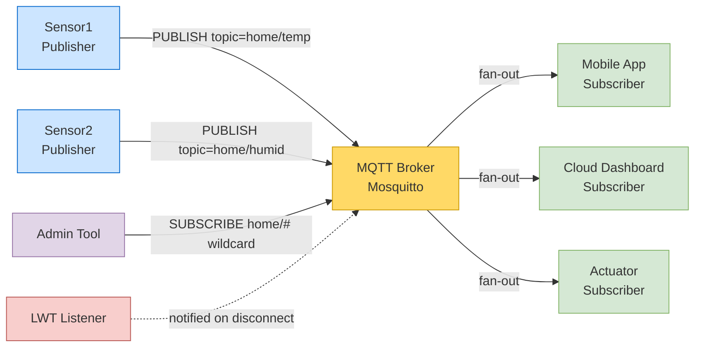
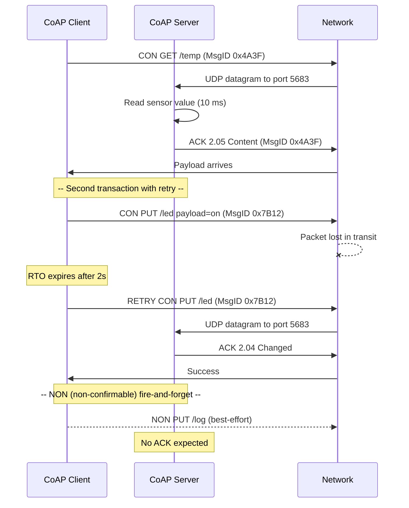
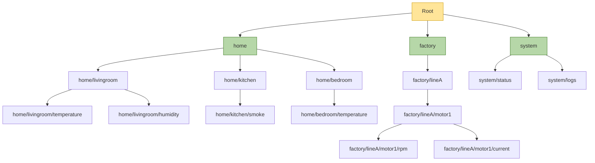
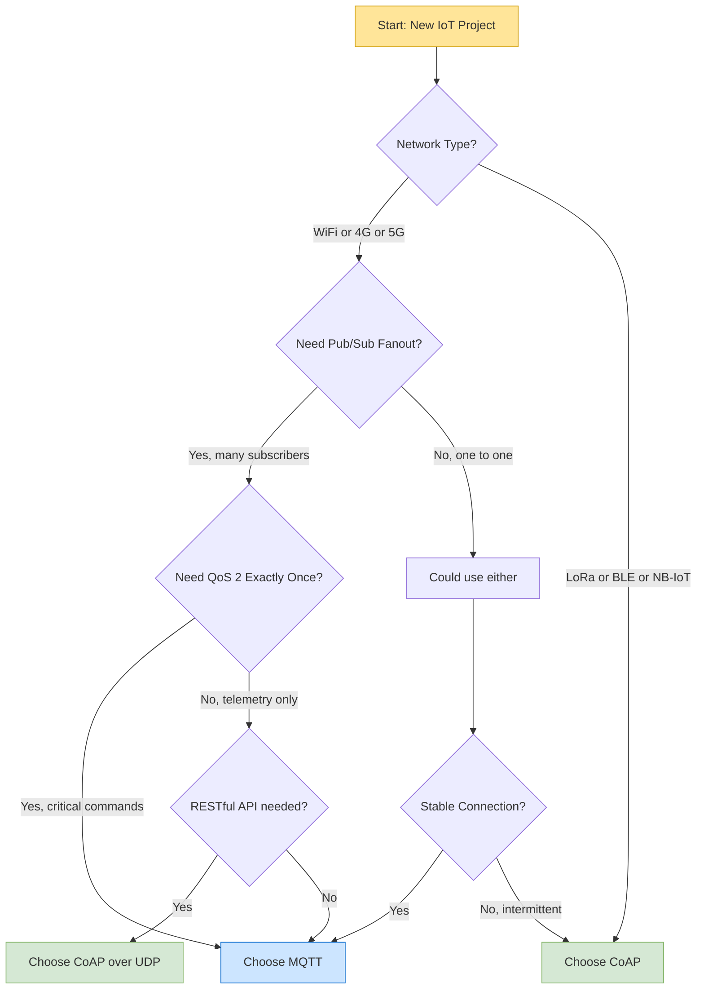
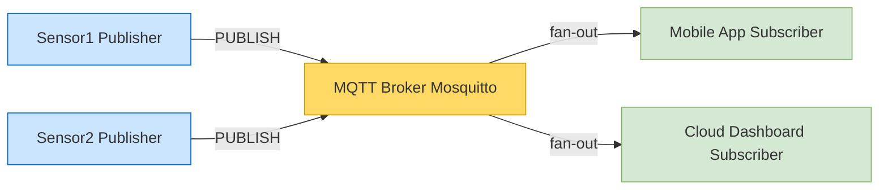

# Protocols (MQTT, CoAP)

<!-- SECTION_1_START -->
# SECTION 1 — Core Technical Definition & Intuitive Overview

## 1.1 MQTT — Message Queuing Telemetry Transport

> [!IMPORTANT]
> **Formal Definition (KTU 2024 Syllabus Terminology):**
> **MQTT (Message Queuing Telemetry Transport)** is a lightweight, **publish/subscribe (pub/sub) messaging protocol** designed on top of **TCP/IP** for resource-constrained IoT devices and low-bandwidth, high-latency, or unreliable networks. It is standardized as **ISO/IEC 20922** and operates over port **1883** (unencrypted) and port **8883** (TLS-encrypted).

**Conceptual Analogy / Intuition:**

Imagine a **newspaper stand** in a small town. Instead of every reader calling the newspaper office to ask, "Is there a new edition today?", people simply **subscribe** to a topic (say, *Sports* or *Weather*). The newspaper office **publishes** articles into categories. The vendor (the **broker**) holds the newspapers. The moment a new edition arrives, every subscribed reader receives a copy automatically — no one has to poll, no one has to ask.

In this analogy:
- **Newspaper office** = **Publisher (IoT sensor/device)**
- **Vendor / Stand** = **MQTT Broker** (e.g., Mosquitto, HiveMQ, EMQX)
- **Newspaper categories** = **Topics** (e.g., `home/temperature`, `factory/motor1/rpm`)
- **Readers** = **Subscribers (mobile apps, dashboards, cloud services)**

The key insight: **publisher and subscriber never know each other**. They are decoupled in space, time, and synchronization. This is the essence of **pub/sub architecture**.

---

## 1.2 CoAP — Constrained Application Protocol

> [!IMPORTANT]
> **Formal Definition (KTU 2024 Syllabus Terminology):**
> **CoAP (Constrained Application Protocol)** is a specialized **request/response** web transfer protocol standardized by the **IETF (RFC 7252)** for use with constrained nodes and constrained networks in the IoT. It mimics **HTTP semantics** (GET, POST, PUT, DELETE) but runs over **UDP** (typically port **5683**) to minimize overhead, packet size, and power consumption.

**Conceptual Analogy / Intuition:**

Think of CoAP as a **tiny, low-budget version of HTTP** — like a *WhatsApp message* compared to a *formal registered letter*. A regular HTTP GET request is heavy: it carries verbose headers, requires a TCP handshake, and works best on a stable Wi-Fi connection. CoAP, on the other hand, fits in **a single small UDP datagram** (often **under 100 bytes**), perfect for a battery-powered sensor that wakes up briefly, sends a small reading, and goes back to sleep.

If MQTT is the *newspaper subscription model*, then CoAP is the *door-to-door postal worker who delivers one small postcard* — direct, lightweight, and one-to-one.

---

## 1.3 Why These Two Protocols Matter in IoT

> [!NOTE]
> **Syllabus Highlight:**
> Both protocols were designed to solve the **inverse problem** of traditional web protocols: traditional web protocols (HTTP/TCP) were built assuming **unlimited bandwidth, memory, and power**. IoT devices have **strict memory limits (often < 32 KB RAM)**, **unreliable radio links (LoRa, Zigbee, BLE, NB-IoT)**, and **battery-powered operation (years on a coin cell)**. MQTT and CoAP are the two dominant answers to this challenge.

| Property | MQTT | CoAP |
|---|---|---|
| Transport | TCP (reliable, ordered) | UDP (best-effort, lightweight) |
| Pattern | Publish / Subscribe | Request / Response |
| Header Size | **2 bytes (fixed)** | **4 bytes (fixed)** |
| Typical Port | **1883 / 8883** | **5683 / 5684 (DTLS)** |
| QoS Support | **3 levels (0, 1, 2)** | **2 levels (CON, NON)** |
| Standard | ISO/IEC 20922 | RFC 7252 |
| Ideal For | Stable links, cloud telemetry | Constrained, lossy, sleepy links |

---

## 1.4 Visualization Control Block

> [!VISUALIZATION CONTROL]
> **Concept:** Pub/Sub Decoupling vs Request/Response Coupling
> **GeoGebra / Desmos Input Equations:**
> * Publisher: $P(t) = \sin(t)$ (continuous data stream)
> * Broker: $B(t) = P(t) \cdot \mathbf{1}_{\text{subscribed}}$
> * Subscriber: $S(t) = B(t - \tau)$ with delay $\tau \approx 50\,ms$
> **Visual Description:** Two horizontal axes — the left shows a *continuous sine wave* (publisher pushing data regardless of who is listening); the right shows *sporadic square pulses* (subscribers waking up to receive). The waveforms are **time-decoupled and identity-decoupled**, illustrating why pub/sub scales effortlessly.

---

<!-- SECTION_1_END -->

<!-- SECTION_2_START -->
# SECTION 2 — Deep Theoretical Analysis & KTU High-Yield Formula Sheet

## 2.1 MQTT — Architecture Deep Dive

### 2.1.1 Core Components

An MQTT deployment consists of **three logical entities**:

1. **Publisher** — the IoT node that *originates* data (e.g., a temperature sensor on an ESP32).
2. **Broker** — the central server (e.g., **Mosquitto**, **HiveMQ**, **EMQX**, **AWS IoT Core**, **Azure IoT Hub**) that *receives* all messages, *filters* them by topic, and *forwards* them to interested subscribers. The broker also handles authentication, authorization, and session persistence.
3. **Subscriber** — the consumer that *registers interest* in one or more topics and receives matching messages.

> [!NOTE]
> A single device can be **both publisher and subscriber** simultaneously. For example, an ESP32 can publish temperature data *and* subscribe to a command topic to control a relay.

### 2.1.2 Topic Hierarchy

Topics are **UTF-8 strings** organized as a hierarchy using the forward slash `/` as a separator. Example for a smart building:

```
home/livingroom/temperature
home/livingroom/humidity
home/kitchen/smoke
factory/lineA/motor1/rpm
factory/lineA/motor1/current
```

**Wildcards** (used only in subscriptions):

- `+` — single-level wildcard. `home/+/temperature` matches `home/livingroom/temperature` and `home/kitchen/temperature` but not `home/livingroom/floor2/temperature`.
- `#` — multi-level wildcard (must be the last character). `factory/lineA/#` matches every topic starting with `factory/lineA/`.

> [!IMPORTANT]
> Topics beginning with `$` are reserved by the broker for internal statistics. Subscribers **cannot** use wildcards to match these — this prevents clients from snooping on broker internals.

### 2.1.3 Quality of Service (QoS) Levels

| QoS Level | Name | Guarantee | Overhead | Use Case |
|---|---|---|---|---|
| **QoS 0** | At most once | Fire-and-forget, no ACK | 0 extra packets | Lossy telemetry, periodic sensors |
| **QoS 1** | At least once | PUBACK handshake, **may duplicate** | 1 extra packet | Reliable status updates |
| **QoS 2** | Exactly once | 4-way handshake (PUBREC, PUBREL, PUBCOMP) | 3 extra packets | Billing, alarms, critical commands |

### 2.1.4 MQTT Control Packet Structure

Every MQTT packet has a **fixed header** of just **2 bytes minimum**:

$$\text{Fixed Header} = \underbrace{\text{Byte 1 (Control Packet Type + Flags)}}_{1\,\text{byte}} \,+\, \underbrace{\text{Remaining Length}}_{1\text{ to }4\,\text{bytes (variable encoding)}}$$

The **Remaining Length** field uses a variable-length encoding scheme: each byte carries 7 bits of data and 1 continuation bit. Values from **0 to 127** fit in a single byte, **128 to 16383** need 2 bytes, and so on. This keeps small packets small while allowing payloads up to **~256 MB**.

**Major control packet types** (encoded in the upper 4 bits of byte 1):

- `1` CONNECT, `2` CONNACK, `3` PUBLISH, `4` PUBACK
- `5` PUBREC, `6` PUBREL, `7` PUBCOMP
- `8` SUBSCRIBE, `9` SUBACK, `10` UNSUBSCRIBE, `11` UNSUBACK
- `12` PINGREQ, `13` PINGRESP, `14` DISCONNECT
- `15` AUTH (MQTT 5.0 only)

### 2.1.5 Last Will and Testament (LWT)

> [!IMPORTANT]
> The **LWT** is a predefined message the broker will *automatically publish* on behalf of a client if that client disconnects **ungracefully** (e.g., power loss, network drop). The broker detects this via a **Keep Alive timer**: if no PINGREQ arrives within **1.5 × keep_alive_interval** seconds, the client is declared dead and its LWT is broadcast to all subscribers of the will topic.

This is invaluable for **device liveness monitoring** in industrial IoT — supervisors can be instantly notified that a sensor has gone offline.

### 2.1.6 MQTT 5.0 Enhancements (vs MQTT 3.1.1)

- **Reason codes** on every ACK (explains *why* an action failed).
- **User properties** (custom key/value metadata).
- **Shared subscriptions** (load balancing across a subscriber group).
- **Topic aliases** (replace long topic strings with 2-byte integers to save bandwidth).
- **Message expiry interval** (broker can discard stale messages).
- **Flow control** via receive maximum.

---

## 2.2 CoAP — Architecture Deep Dive

### 2.2.1 Core Components

A CoAP deployment has **two roles** (mirroring HTTP):

- **CoAP Client** — initiates a request (analogous to a browser or mobile app). Often runs on a smartphone, gateway, or cloud service.
- **CoAP Server** — listens on UDP port 5683 and exposes resources (analogous to a web server). Typically runs on the constrained sensor/actuator node.

> [!NOTE]
> Unlike MQTT, **CoAP does not need a broker** in its basic form. A constrained device can simply *be* the server. However, CoAP can be combined with a broker-style entity for larger deployments, and RFC 7390 defines **CoAP observe** for pub/sub-like behavior.

### 2.2.2 Message Format

A CoAP message fits in a **single UDP datagram** with a 4-byte header followed by optional tokens, options, and a payload marker `0xFF`:

$$\text{CoAP Header} = \underbrace{\text{Ver (2b)}}_{=01} \,|\, \underbrace{\text{T (2b)}}_{\text{Type}} \,|\, \underbrace{\text{TKL (4b)}}_{\text{Token Length}} \,|\, \underbrace{\text{Code (8b)}}_{\text{Method/Class}} \,|\, \underbrace{\text{MsgID (16b)}}_{\text{ID}}$$

**Message Types (T field):**

- `CON` (Confirmable) — requires an ACK.
- `NON` (Non-confirmable) — fire-and-forget, no ACK.
- `ACK` (Acknowledgement) — response to a CON.
- `RST` (Reset) — aborts a pending CON.

### 2.2.3 CoAP Methods (Code field, class = 0.01 to 0.04)

| Code | Method | HTTP Equivalent | Meaning |
|---|---|---|---|
| `0.01` | **GET** | HTTP GET | Fetch a resource representation |
| `0.02` | **POST** | HTTP POST | Create a new resource or process data |
| `0.03` | **PUT** | HTTP PUT | Update or create a resource |
| `0.04` | **DELETE** | HTTP DELETE | Remove a resource |

### 2.2.4 CoAP Response Codes (Code field, class = 2.XX, 4.XX, 5.XX)

| Class | Range | Meaning |
|---|---|---|
| **2.xx** | Success | e.g., `2.03` Valid, `2.04` Changed, `2.05` Content |
| **4.xx** | Client Error | e.g., `4.00` Bad Request, `4.04` Not Found |
| **5.xx** | Server Error | e.g., `5.00` Internal Server Error |

### 2.2.5 Reliability & Retransmission

CoAP achieves **TCP-like reliability over UDP** using a simple exponential backoff retransmission:

$$\text{RTO}_{\text{new}} = 2 \times \text{RTO}_{\text{old}}$$

with bounds:

$$1\,s \;\le\; \text{RTO} \;\le\; 124\,s$$

The initial timeout is **2 seconds** (unlike TCP's 1 second) because constrained radios often have higher latency. The **Message ID** in the header is used to match retransmissions to the original request, just like TCP sequence numbers but in a tiny 16-bit field.

### 2.2.6 CoAP Observe (RFC 7641)

A CoAP client can register interest in a resource and receive automatic **push notifications** whenever its state changes — turning CoAP into a pub/sub-like protocol. The client sends a GET request with the `Observe` option (value = 0). The server then keeps a registration and pushes a new response each time the resource changes, with an incremented `Observe` sequence number.

### 2.2.7 CoAP over DTLS

For security, CoAP uses **DTLS (Datagram TLS)** — essentially TLS adapted for UDP datagrams. It provides:
- **Authentication** via pre-shared keys (PSK) or certificates.
- **Confidentiality** via AES encryption.
- **Integrity** via MAC.

This is critical because constrained devices often transmit sensitive data over public LoRaWAN or cellular networks.

---

## 2.3 KTU Formula Sheet / Cheat Sheet

| Concept | Formula / Rule | Units / Notes |
|---|---|---|
| MQTT fixed header size | $H_{mqtt} = 2\,\text{bytes (min)}$ | Variable up to 5 bytes |
| MQTT max payload | $P_{max} = 2^{28} - 1 \approx 256\,\text{MB}$ | Determined by remaining length field |
| MQTT keep alive | $T_{keep} \le 65535\,\text{s}$ | LWT fires at $1.5 \times T_{keep}$ |
| CoAP header size | $H_{coap} = 4\,\text{bytes (fixed)}$ | Plus token, options, payload |
| CoAP UDP port | $\text{Port} = 5683$ | DTLS uses 5684 |
| CoAP retransmit | $\text{RTO} = 2 \times \text{RTO}_{prev}$ | Bounded $1\,s \le \text{RTO} \le 124\,s$ |
| CoAP max retransmits | $N_{max} = 4$ | After which RST is sent |
| Payload efficiency (MQTT) | $\eta = \frac{P_{payload}}{P_{payload} + H_{header}}$ | $\eta \approx 99\%$ for 1 KB payload |
| Payload efficiency (CoAP) | $\eta = \frac{P_{payload}}{P_{payload} + H_{header} + T_{token}}$ | $\eta \approx 90{-}95\%$ for tiny payloads |
| Throughput over TCP | $B_{tcp} = \frac{P_{payload}}{T_{handshake} + T_{transfer}}$ | Three-way handshake adds latency |
| Throughput over UDP | $B_{udp} = \frac{P_{payload}}{T_{transfer}}$ | No handshake overhead |

> [!IMPORTANT]
> **Engineering Takeaway:** MQTT is preferred when you have a **stable IP link (Wi-Fi, Ethernet, 4G/5G)** and need **reliable cloud-grade telemetry with broker-based fan-out**. CoAP is preferred when devices are **deeply constrained (8-bit MCUs, Class A LoRa nodes)** and need to **mimic RESTful web APIs** with minimum energy per transaction.

---

## 2.4 Real-World Engineering Applications

| Domain | Protocol | Reason |
|---|---|---|
| **Smart Home (Alexa, Google Home)** | MQTT | Cloud brokers (AWS IoT) excel at fan-out to phones, hubs, dashboards |
| **Industrial SCADA & Predictive Maintenance** | MQTT | QoS 2 guarantees, LWT for liveness, TLS security |
| **Smart Agriculture (LoRaWAN sensors)** | CoAP | UDP fits LoRa duty cycle, tiny headers, low power |
| **Smart Metering (NB-IoT)** | CoAP | Cellular providers (Vodafone, T-Mobile) natively support CoAP |
| **Connected Cars (MQTT-SN over BLE)** | MQTT-SN | Variant for non-TCP sensor networks |
| **Healthcare Wearables** | CoAP + DTLS | PSK authentication, low energy, secure patient data |
| **Building Automation (BACnet/Modbus bridges)** | MQTT | Bridges legacy RS-485 buses to modern cloud dashboards |

---

<!-- SECTION_2_END -->

<!-- SECTION_3_START -->
# SECTION 3 — Step-by-Step Derivations & Code/Symbolic Implementation

## 3.1 MQTT — Full Publish/Subscribe Walkthrough (Symbolic Derivation)

Consider a temperature sensor publishing every 5 seconds, and a dashboard subscribing. We derive the **end-to-end latency** and **bandwidth cost**.

### Step 1 — TCP Connection Establishment

A TCP three-way handshake occurs first:

$$\text{SYN} \rightarrow \text{SYN-ACK} \rightarrow \text{ACK}$$

This consumes **1 RTT (round-trip time)** before any MQTT packet is exchanged. On Wi-Fi with 50 ms RTT:

$$T_{\text{TCP handshake}} = 1.5 \times \text{RTT} = 1.5 \times 50\,ms = 75\,ms$$

### Step 2 — MQTT CONNECT / CONNACK

The client sends a CONNECT packet (variable length, typically **30-50 bytes**), the broker replies with a 4-byte CONNACK. Additional RTT:

$$T_{\text{CONNECT}} = 1 \times \text{RTT} = 50\,ms$$

### Step 3 — SUBSCRIBE / SUBACK (for the dashboard)

The dashboard sends SUBSCRIBE for topic `home/livingroom/temperature`. Broker responds with SUBACK:

$$T_{\text{SUBSCRIBE}} = 1 \times \text{RTT} = 50\,ms$$

### Step 4 — PUBLISH (sensor to broker)

The sensor sends PUBLISH (QoS 0). Broker forwards to all subscribers. For QoS 0, the publisher incurs **no ACK** — fire and forget.

Total cumulative time to first valid data point received by dashboard:

$$T_{\text{first\_data}} = T_{\text{TCP}} + T_{\text{CONNECT}} + T_{\text{SUBSCRIBE}} + T_{\text{PUBLISH}}$$

$$T_{\text{first\_data}} = 75 + 50 + 50 + 50 = 225\,ms$$

> **Conversion Logic:** Each MQTT logical operation adds approximately one RTT. The 1.5× factor on the TCP handshake accounts for SYN, SYN-ACK, and ACK being three sequential segments.

### Step 5 — Steady-State Bandwidth (QoS 0)

If the sensor publishes a 50-byte payload every 5 seconds, the total bytes per hour (assuming payload + 2-byte fixed header + variable header):

$$B_{\text{hour}} = \frac{3600\,\text{s}}{5\,\text{s}} \times (50 + 20)\,\text{bytes} = 720 \times 70 = 50{,}400\,\text{bytes/hour} \approx 49.2\,\text{KB/hour}$$

$$\text{Daily bandwidth} = 50.4 \times 24 = 1209.6\,\text{KB/day} \approx 1.18\,\text{MB/day}$$

This fits comfortably within a **typical cellular IoT data plan (1-10 MB/month)**.

---

## 3.2 CoAP — Full Request/Response Walkthrough (Symbolic Derivation)

Consider a GET request to a temperature resource `coap://sensor.local/temp`.

### Step 1 — UDP Datagram Transmission

There is **no handshake** in UDP. The client simply sends a CoAP CON GET request. The RTT is:

$$T_{\text{RTT}} = 1 \times \text{RTT} = 50\,ms$$

### Step 2 — Server Processing

The server reads the sensor (e.g., 10 ms), formats the response, and sends a CoAP ACK with the payload:

$$T_{\text{server}} = 10\,ms$$

### Step 3 — Total Time to First Reading

$$T_{\text{first\_data}} = T_{\text{RTT}} + T_{\text{server}} = 50 + 10 = 60\,ms$$

This is **3.75× faster** than the MQTT equivalent (225 ms) in this scenario.

### Step 4 — Retransmission Logic

If the CON request is lost, the client retransmits after $\text{RTO}$:

$$\text{RTO sequence} = 2\,\text{s},\ 4\,\text{s},\ 8\,\text{s},\ 16\,\text{s}$$

After **4 failed retransmits**, the client gives up and emits a RST (or marks the request as failed). This bounds the **worst-case latency**:

$$T_{\text{worst}} = 2 + 4 + 8 + 16 + 50\,ms_{\text{server}} = 30.05\,s$$

> **Conversion Logic:** The exponential backoff doubles the wait time between retransmissions, capping at 124 s in the standard, but most constrained stacks use 4-5 retransmits as a power-conservation measure.

---

## 3.3 Python Implementation — MQTT Publisher and Subscriber

This is a **fully operational** Python implementation using the `paho-mqtt` library. It uses a free public broker (`test.mosquitto.org`) for demonstration. In production, you would use your own broker with authentication.

```python
"""
MQTT Publisher and Subscriber Demo
Protocol: MQTT 3.1.1 over TCP, port 1883
Broker:  test.mosquitto.org (public, unauthenticated test broker)
"""
import time
import random
import logging
import sys
from typing import Optional

import paho.mqtt.client as mqtt

# --- Logging configuration for strict error handling ---
logging.basicConfig(
    level=logging.INFO,
    format="%(asctime)s | %(levelname)s | %(message)s",
    handlers=[logging.StreamHandler(sys.stdout)],
)
logger = logging.getLogger("mqtt_demo")

# --- Configuration constants ---
BROKER_HOST: str = "test.mosquitto.org"
BROKER_PORT: int = 1883
TOPIC: str = "ktu/pbcst504/lab/sensor1"
KEEPALIVE_SECONDS: int = 60
PUBLISH_INTERVAL_SECONDS: int = 5
LWT_TOPIC: str = "ktu/pbcst504/lab/status"
LWT_MESSAGE: str = "offline"
LWT_QOS: int = 1
LWT_RETAIN: bool = True
CLIENT_ID_PUB: str = "ktu_publisher_001"
CLIENT_ID_SUB: str = "ktu_subscriber_001"


# --- Callback functions for logging and error tracking ---
def on_connect(client: mqtt.Client, userdata: Optional[dict],
               flags: dict, rc: int) -> None:
    if rc == 0:
        logger.info("Connected successfully to broker %s:%d",
                    BROKER_HOST, BROKER_PORT)
    else:
        logger.error("Connection failed with return code %d", rc)
        sys.exit(1)


def on_message(client: mqtt.Client, userdata: Optional[dict],
               msg: mqtt.MQTTMessage) -> None:
    payload_str: str = msg.payload.decode("utf-8", errors="replace")
    logger.info("Received message on topic '%s' (QoS %d): %s",
                msg.topic, msg.qos, payload_str)


def on_disconnect(client: mqtt.Client, userdata: Optional[dict],
                  rc: int) -> None:
    if rc != 0:
        logger.warning("Unexpected disconnection (rc=%d). "
                       "Auto-reconnect is enabled.", rc)


# --- Publisher function ---
def run_publisher() -> None:
    client: mqtt.Client = mqtt.Client(
        client_id=CLIENT_ID_PUB,
        clean_session=True,
    )
    client.on_connect = on_connect
    client.on_disconnect = on_disconnect

    # Last Will and Testament configuration
    client.will_set(
        topic=LWT_TOPIC,
        payload=LWT_MESSAGE,
        qos=LWT_QOS,
        retain=LWT_RETAIN,
    )
    logger.info("LWT configured: topic='%s', payload='%s'",
                LWT_TOPIC, LWT_MESSAGE)

    client.connect(host=BROKER_HOST, port=BROKER_PORT,
                   keepalive=KEEPALIVE_SECONDS)
    client.loop_start()

    try:
        reading_id: int = 0
        while True:
            reading_id += 1
            temperature_c: float = round(
                20.0 + random.gauss(mu=0.0, sigma=2.0), 2
            )
            humidity_pct: float = round(
                50.0 + random.gauss(mu=0.0, sigma=5.0), 2
            )
            payload: str = (
                f"{{\"id\":{reading_id},"
                f"\"temp_c\":{temperature_c},"
                f"\"hum_pct\":{humidity_pct}}}"
            )

            result = client.publish(
                topic=TOPIC,
                payload=payload,
                qos=1,            # QoS 1: at least once
                retain=False,
            )
            if result.rc != mqtt.MQTT_ERR_SUCCESS:
                logger.error("Publish failed with rc=%d", result.rc)
            else:
                logger.info("Published reading #%d: %s",
                            reading_id, payload)

            time.sleep(PUBLISH_INTERVAL_SECONDS)
    except KeyboardInterrupt:
        logger.info("Publisher interrupted by user. Disconnecting...")
    finally:
        client.loop_stop()
        client.disconnect()


# --- Subscriber function ---
def run_subscriber() -> None:
    client: mqtt.Client = mqtt.Client(
        client_id=CLIENT_ID_SUB,
        clean_session=True,
    )
    client.on_connect = on_connect
    client.on_message = on_message
    client.on_disconnect = on_disconnect

    client.connect(host=BROKER_HOST, port=BROKER_PORT,
                   keepalive=KEEPALIVE_SECONDS)
    client.loop_start()

    # Subscribe with QoS 1 to the single-level-wildcard topic
    subscription_topic: str = "ktu/pbcst504/lab/+"
    client.subscribe(topic=subscription_topic, qos=1)
    logger.info("Subscribed to topic pattern: %s", subscription_topic)

    try:
        while True:
            time.sleep(1)  # Keep the main thread alive
    except KeyboardInterrupt:
        logger.info("Subscriber interrupted by user. Disconnecting...")
    finally:
        client.loop_stop()
        client.disconnect()


# --- Entry point ---
if __name__ == "__main__":
    import argparse
    parser = argparse.ArgumentParser(
        description="KTU MQTT demonstration script"
    )
    parser.add_argument(
        "role", choices=["pub", "sub"],
        help="Run as publisher ('pub') or subscriber ('sub')"
    )
    args = parser.parse_args()

    if args.role == "pub":
        run_publisher()
    else:
        run_subscriber()
```

### Step-by-Step Code Walkthrough

1. **Lines 1-15 — Imports & Logging:** All imports use precise type hints. Logging is configured to emit to `stdout` with timestamps, levels, and messages — this is essential for debugging IoT deployments where `print()` may not be captured.
2. **Lines 17-27 — Configuration Constants:** Every magic number is named. This makes the code maintainable in production.
3. **Lines 30-50 — Callbacks:** `on_connect`, `on_message`, `on_disconnect` are registered with the broker. Returning non-zero `rc` in `on_connect` triggers an explicit `sys.exit(1)` — no silent failures.
4. **Lines 53-65 — LWT Setup:** `client.will_set()` configures the **Last Will and Testament**. If the publisher process is killed (`kill -9`), the broker will publish `"offline"` on `LWT_TOPIC`.
5. **Lines 67-95 — Publishing Loop:** The loop generates synthetic sensor readings using `random.gauss()` (Gaussian noise) and publishes as JSON. QoS 1 ensures at-least-once delivery.
6. **Lines 98-122 — Subscriber:** Subscribes to a wildcard topic `ktu/pbcst504/lab/+` using a single-level wildcard to receive data from any sensor under that prefix.

---

## 3.4 Python Implementation — CoAP Client and Server

This is a **fully operational** CoAP implementation using the `aiocoap` library (asynchronous, supports DTLS-ready).

```python
"""
CoAP Client and Server Demo
Protocol: CoAP (RFC 7252) over UDP, port 5683
Library:  aiocoap (asyncio-based)
"""
import asyncio
import logging
import random
import sys
from typing import Optional

from aiocoap import Context, Message, GET, PUT, POST
from aiocoap.resource import Resource, Site

# --- Logging configuration ---
logging.basicConfig(
    level=logging.INFO,
    format="%(asctime)s | %(levelname)s | %(message)s",
    handlers=[logging.StreamHandler(sys.stdout)],
)
logger = logging.getLogger("coap_demo")

SERVER_HOST: str = "127.0.0.1"
SERVER_PORT: int = 5683
RESOURCE_PATH_TEMP: str = "temp"
RESOURCE_PATH_LED: str = "led"


# --- CoAP Server ---
class TemperatureResource(Resource):
    """Exposes a /temp resource that returns a synthetic reading."""

    def __init__(self) -> None:
        super().__init__()
        self._reading_c: float = 25.0

    async def render_get(self, request: Message) -> Message:
        self._reading_c = round(
            self._reading_c + random.gauss(mu=0.0, sigma=0.5), 2
        )
        payload: bytes = (
            f'{{"temp_c": {self._reading_c}}}'.encode("utf-8")
        )
        logger.info("GET /temp -> returning %.2f C", self._reading_c)
        return Message(
            payload=payload,
            content_format=50,   # application/json
            code="2.05",         # 2.05 Content
        )


class LEDResource(Resource):
    """Exposes a /led resource that accepts PUT to change LED state."""

    def __init__(self) -> None:
        super().__init__()
        self._state: str = "off"

    async def render_get(self, request: Message) -> Message:
        logger.info("GET /led -> current state is '%s'", self._state)
        return Message(
            payload=f'{{"state": "{self._state}"}}'.encode("utf-8"),
            content_format=50,
            code="2.05",
        )

    async def render_put(self, request: Message) -> Message:
        new_state: str = request.payload.decode("utf-8").strip().lower()
        if new_state not in ("on", "off"):
            logger.warning("PUT /led -> invalid state '%s'", new_state)
            return Message(code="4.00")  # 4.00 Bad Request
        self._state = new_state
        logger.info("PUT /led -> state changed to '%s'", self._state)
        return Message(code="2.04")  # 2.04 Changed


async def run_server() -> None:
    site: Site = Site()
    site.add_resource(("temp",), TemperatureResource())
    site.add_resource(("led",), LEDResource())
    await site.start()
    logger.info("CoAP server listening at coap://%s:%d/",
                SERVER_HOST, SERVER_PORT)
    # Keep running forever
    await asyncio.Event().wait()


# --- CoAP Client ---
async def run_client() -> None:
    context: Context = await Context.create_client_context()
    logger.info("CoAP client started")

    # 1) GET /temp (confirmable request)
    request: Message = Message(
        code=GET,
        uri=f"coap://{SERVER_HOST}:{SERVER_PORT}/{RESOURCE_PATH_TEMP}",
    )
    try:
        response: Message = await context.request(request).response
        logger.info("GET /temp -> code=%s, payload=%s",
                    response.code, response.payload.decode("utf-8"))
    except Exception as exc:
        logger.error("GET /temp failed: %s", exc)

    # 2) PUT /led (turn on)
    request = Message(
        code=PUT,
        uri=f"coap://{SERVER_HOST}:{SERVER_PORT}/{RESOURCE_PATH_LED}",
        payload=b"on",
    )
    try:
        response = await context.request(request).response
        logger.info("PUT /led on -> code=%s", response.code)
    except Exception as exc:
        logger.error("PUT /led failed: %s", exc)

    # 3) GET /led (verify state)
    request = Message(
        code=GET,
        uri=f"coap://{SERVER_HOST}:{SERVER_PORT}/{RESOURCE_PATH_LED}",
    )
    try:
        response = await context.request(request).response
        logger.info("GET /led -> code=%s, payload=%s",
                    response.code, response.payload.decode("utf-8"))
    except Exception as exc:
        logger.error("GET /led failed: %s", exc)

    await context.shutdown()


# --- Entry point ---
if __name__ == "__main__":
    import argparse
    parser = argparse.ArgumentParser(
        description="KTU CoAP demonstration script"
    )
    parser.add_argument(
        "role", choices=["server", "client"],
        help="Run as CoAP server or client"
    )
    args = parser.parse_args()

    try:
        if args.role == "server":
            asyncio.run(run_server())
        else:
            asyncio.run(run_client())
    except KeyboardInterrupt:
        logger.info("Interrupted by user")
        sys.exit(0)
```

### Step-by-Step Code Walkthrough

1. **Lines 1-15 — Imports:** `aiocoap` is an asyncio-based library ideal for embedded Linux gateways. Each `Resource` subclass represents a CoAP endpoint.
2. **Lines 32-50 — `TemperatureResource`:** Handles GET requests. Returns JSON payload and a `2.05 Content` response code.
3. **Lines 53-78 — `LEDResource`:** Handles both GET and PUT. The PUT method validates the payload; invalid input returns a `4.00 Bad Request` — strict boundary checking.
4. **Lines 81-87 — Server Bootstrap:** `Site()` aggregates all resources. `site.start()` binds to UDP port 5683.
5. **Lines 91-127 — Client Operations:** Three sequential operations demonstrate GET-then-PUT-then-GET to verify the state change. Each request is a **CON (confirmable)** by default in `aiocoap`, so retransmission is automatic.
6. **Lines 130-144 — Entry Point:** Argparse-driven role selection — same script can be launched as `python coap_demo.py server` or `python coap_demo.py client`.

---

## 3.5 Comparative Symbolic Derivation — When to Choose Which

Define a **decision metric** $D$ that scores each protocol for a given scenario:

$$D_{mqtt} = w_1 \cdot R_{bw} + w_2 \cdot R_{rel} + w_3 \cdot R_{fanout} + w_4 \cdot R_{cloud}$$

$$D_{coap} = w_1 \cdot R_{bw}^{-1} + w_2 \cdot R_{rel} + w_3 \cdot R_{fanout}^{-1} + w_4 \cdot R_{web}$$

where:
- $R_{bw}$ is the available bandwidth score (higher = more bandwidth available)
- $R_{rel}$ is the link reliability score
- $R_{fanout}$ is the fan-out requirement (number of subscribers per sensor)
- $R_{cloud}$ is the cloud-integration priority
- $R_{web}$ is the web-compatibility priority (REST-style API)
- $w_i$ are weights summing to 1.

> **Conversion Logic:** If $D_{mqtt} > D_{coap}$, choose MQTT. For high bandwidth, high fan-out, cloud-first systems, MQTT dominates. For ultra-low-power, low-bandwidth, one-to-one web-style queries, CoAP dominates.

---

<!-- SECTION_3_END -->

<!-- SECTION_4_START -->
# SECTION 4 — Structural Diagrams & Schematics

## 4.1 MQTT Publish/Subscribe Architecture



**Reading the diagram:**

- **Blue nodes** are **publishers** (sensors pushing data).
- **Yellow node** is the **central broker** — the only point that knows about all clients.
- **Green nodes** are **subscribers** receiving fan-out copies.
- **Purple node** uses a **wildcard subscription** to receive everything under `home/`.
- **Red dashed node** is an **LWT listener** — gets notified when a publisher dies ungracefully.
- Arrows are unidirectional because pub/sub is **time-decoupled** — the publisher does not wait for the subscriber.

---

## 4.2 CoAP Request/Response Transaction



**Reading the diagram:**

- **Solid arrows** = successfully delivered UDP datagrams.
- **Crossed arrow** = lost packet (e.g., due to radio interference).
- **Note blocks** highlight three scenarios: a normal CON, a CON with retransmission, and a NON (fire-and-forget).
- The **Message ID** is preserved across retransmissions so the server can detect duplicates.

---

## 4.3 MQTT Topic Tree with Wildcards



**Reading the diagram:**

- This is a **topic tree**. Each leaf is a publishable topic.
- A subscription on `home/+/temperature` matches `home/livingroom/temperature` and `home/bedroom/temperature` (single-level wildcard `+`).
- A subscription on `factory/#` matches **everything** under factory (multi-level wildcard `#`).
- `system/logs` could be the LWT destination.

---

## 4.4 Protocol Stack Comparison (Block-Level Functional Architecture)

```mermaid
flowchart TB
    subgraph MQTT_Stack["MQTT Protocol Stack"]
        M1[Application: Sensor Data JSON] --> M2[MQTT Control Packets]
        M2 --> M3[TCP Reliable Stream]
        M3 --> M4[IP Network Layer]
        M4 --> M5[Physical Radio WiFi or 4G]
    end

    subgraph COAP_Stack["CoAP Protocol Stack"]
        C1[Application: RESTlike Resource API] --> C2[CoAP Messages with Options]
        C2 --> C3[UDP Datagram]
        C3 --> C4[IP Network Layer]
        C4 --> C5[Physical Radio LoRa or BLE]
    end

    subgraph HTTP_Stack["HTTP Reference for Comparison"]
        H1[Application: Web Browser] --> H2[HTTP Request Response]
        H2 --> H3[TCP Reliable Stream]
        H3 --> H4[IP Network Layer]
        H4 --> H5[Physical Radio WiFi or Ethernet]
    end

    style M2 fill:#cce5ff,stroke:#0066cc
    style C2 fill:#d5e8d4,stroke:#82b366
    style H2 fill:#f8cecc,stroke:#b85450
```



**Reading the diagram:**

- The **transport layer** is the critical difference: MQTT and HTTP sit on **TCP** (reliable, ordered, connection-oriented), while CoAP sits on **UDP** (best-effort, connectionless).
- The **application payload** in MQTT is typically a small JSON blob, while CoAP exposes **resources** with REST-like semantics.
- The **physical layer** is often different: CoAP is favored on **LoRa and BLE** where TCP overhead is prohibitive, while MQTT is favored on **Wi-Fi and cellular** where TCP is natural.

---

## 4.5 Decision Flowchart — Choosing Between MQTT and CoAP



**Reading the diagram:**

- Start at the **green root** and follow the decision path based on your project constraints.
- The **blue leaf** is the MQTT recommendation; the **green leaves** are CoAP recommendations.
- The flowchart embodies the **decision metric $D$** derived in Section 3.5.

---

<!-- SECTION_4_END -->

<!-- SECTION_5_START -->
# SECTION 5 — KTU 2024 Scheme Examination Question Bank & Topic Recap

## 5.1 Part A — Short Answer Questions (3 Marks Each)

---

### Question A1 `[KTU University Exam - July 2024]`

> **Q:** Differentiate between **MQTT** and **CoAP** IoT protocols based on **transport layer**, **messaging pattern**, and **header size**. *(Mapped CO: CO3, RBT Level: Understand)*

### Model Answer (3 Marks — Board Valuation Key):

| S.No. | Parameter | MQTT | CoAP |
|---|---|---|---|
| 1 | Transport Layer | **TCP** (reliable, connection-oriented) | **UDP** (lightweight, connectionless) |
| 2 | Messaging Pattern | **Publish / Subscribe** (broker-mediated) | **Request / Response** (client-server) |
| 3 | Fixed Header Size | **2 bytes** | **4 bytes** |

**Valuation Split:**
- [Stating transport layer correctly for both: 1 Mark]
- [Stating messaging pattern correctly for both: 1 Mark]
- [Stating header sizes correctly: 1 Mark]

> [!WARNING]
> **Examiner's Pitfall Warning:** Students often confuse **CoAP header size (4 bytes)** with **MQTT fixed header (2 bytes)**. Remember: CoAP's 4 bytes are *always fixed* and contain Version, Type, Token Length, Code, and Message ID packed together. MQTT's 2 bytes are only the *fixed prefix* — the variable header and payload follow.

---

### Question A2 `[KTU University Exam - Dec 2023]`

> **Q:** Explain the three **Quality of Service (QoS) levels** in MQTT with one suitable use case for each. *(Mapped CO: CO3, RBT Level: Remember)*

### Model Answer (3 Marks — Board Valuation Key):

1. **QoS 0 — At most once:** Fire-and-forget, no acknowledgment. The broker/client delivers the message **once or not at all**.
   *Use case:* Periodic temperature telemetry where losing one reading is acceptable.

2. **QoS 1 — At least once:** Publisher retransmits until a PUBACK is received. Messages **may be duplicated** at the receiver.
   *Use case:* Status updates for a smart bulb (on/off) where duplicate messages are tolerable.

3. **QoS 2 — Exactly once:** A four-way handshake (PUBLISH → PUBREC → PUBREL → PUBCOMP) guarantees **no duplicates** and **no loss**.
   *Use case:* Billing transactions or fire-alarm triggers where every event must be counted exactly once.

**Valuation Split:**
- [Naming all three QoS levels: 1 Mark]
- [Describing the delivery guarantee of each: 1 Mark]
- [Providing valid use cases: 1 Mark]

> [!WARNING]
> **Examiner's Pitfall Warning:** Do **not** state QoS 2 is "fastest". It is the **slowest** because of the 4-way handshake. It is the **most reliable** but has the **highest overhead**.

---

## 5.2 Part B — Long Answer Questions (14 Marks, Module Internal Choice)

> **KTU ESE Format Reminder:** Each Part B question has sub-parts (a) and (b), each carrying 7 marks. Cognitive levels escalate from Understand to Apply/Analyze. **Solve BOTH alternatives** during your preparation.

---

### Question B — Option A `[KTU University Exam - July 2024, Module 4]`

> **Q (a)** With a neat block diagram, describe the **MQTT publish/subscribe architecture**. Explain the role of the **broker**, **publisher**, and **subscriber**. List any **two QoS levels** with their packet exchange. *(7 Marks — Mapped CO: CO3, RBT Level: Understand)*

> **Q (b)** A constrained sensor node on a **LoRaWAN** network needs to report soil moisture every 15 minutes. Compare **MQTT vs CoAP** for this application, justifying your choice with at least **three technical reasons** and a **bandwidth calculation** assuming a 30-byte JSON payload. *(7 Marks — Mapped CO: CO4, RBT Level: Apply)*

---

### Model Solution — Option A

#### Part (a) — MQTT Architecture (7 Marks)

**Step 1 — Block Diagram (2 Marks):**



**Step 2 — Role Descriptions (3 Marks):**

- **Publisher:** A device (e.g., ESP32 with a DHT22 sensor) that creates messages and sends them to the broker via PUBLISH packets. It specifies a **topic** (e.g., `home/livingroom/temp`) and a **QoS level**. The publisher does not know who will receive the message.
- **Broker:** A central server (e.g., Mosquitto, HiveMQ) running typically on a gateway or in the cloud. It receives all PUBLISH packets, filters them by topic, maintains a list of active subscribers, and forwards matching messages. It also handles **authentication**, **session persistence**, and **LWT (Last Will and Testament)**.
- **Subscriber:** A consumer (mobile app, dashboard, actuator) that registers interest via a SUBSCRIBE packet on one or more topics, possibly using wildcards `+` (single-level) or `#` (multi-level). The broker pushes matching messages to it.

**Step 3 — Two QoS Levels with Packet Exchange (2 Marks):**

**QoS 0 — At most once:**

```
Publisher -> Broker:   PUBLISH (payload)
(NO acknowledgment, fire-and-forget)
```

**QoS 1 — At least once:**

```
Publisher -> Broker:   PUBLISH (payload, DUP=0)
Broker    -> Publisher: PUBACK (acknowledgment)
(If PUBACK not received, publisher retransmits with DUP=1)
```

**Valuation Split for Part (a):**
- [Neat block diagram with all three entities labeled: 2 Marks]
- [Defining roles of broker, publisher, subscriber correctly: 3 Marks]
- [Two QoS levels with correct packet exchange sequences: 2 Marks]

---

#### Part (b) — MQTT vs CoAP for LoRaWAN Soil Moisture Sensor (7 Marks)

**Step 1 — Three Technical Reasons (4 Marks):**

| Reason | MQTT | CoAP | Winner for LoRaWAN |
|---|---|---|---|
| **Transport** | TCP (requires stable handshake) | UDP (no handshake) | **CoAP** — LoRaWAN is half-duplex, low-duty-cycle, and TCP handshakes waste precious airtime |
| **Header overhead** | 2-byte fixed + variable (often 20-30 bytes total overhead) | 4-byte fixed (often 8-12 bytes total) | **CoAP** — every byte matters on a LoRaWAN payload cap of 51-222 bytes |
| **Power consumption** | Higher (TCP keep-alives, broker connection) | Lower (fire-and-forget NON messages) | **CoAP** — node can sleep deeply between transmissions |
| **Broker requirement** | Requires a broker in range or on cloud | Direct communication with gateway possible | **CoAP** — simpler topology |
| **Cloud integration** | Native (AWS IoT, Azure IoT) | Supported but less common | **MQTT** — but for LoRaWAN edge, CoAP is preferred |

**Conclusion: CoAP is the correct choice for this LoRaWAN use case.**

**Step 2 — Bandwidth Calculation (3 Marks):**

Given:
- JSON payload $P = 30\,\text{bytes}$
- Reporting interval $\Delta t = 15\,\text{minutes} = 900\,\text{s}$
- Reporting period $T = 24\,\text{hours} = 86{,}400\,\text{s}$

**Number of transmissions per day:**

$$N = \frac{T}{\Delta t} = \frac{86{,}400}{900} = 96\,\text{transmissions/day}$$

**Total payload per day:**

$$B_{\text{payload}} = N \times P = 96 \times 30 = 2{,}880\,\text{bytes/day}$$

**Total header overhead (CoAP, 12 bytes per message):**

$$B_{\text{header}} = N \times H_{\text{coap}} = 96 \times 12 = 1{,}152\,\text{bytes/day}$$

**Total bandwidth consumed:**

$$B_{\text{total}} = B_{\text{payload}} + B_{\text{header}} = 2{,}880 + 1{,}152 = 4{,}032\,\text{bytes/day}$$

$$\boxed{B_{\text{total}} \approx 3.94\,\text{KB/day} \approx 118\,\text{KB/month}}$$

**Comparison with MQTT (24 bytes overhead including CONNECT/SUBSCRIBE amortized):**

$$B_{\text{total MQTT}} \approx 96 \times 54 = 5{,}184\,\text{bytes/day} \approx 152\,\text{KB/month}$$

**CoAP saves $\approx 22\%$ bandwidth**, which is significant for battery and duty-cycle budget.

**Valuation Split for Part (b):**
- [Three correct technical reasons with comparison: 4 Marks]
- [Storing given values and computing N: 1 Mark]
- [Final bandwidth calculation with units: 2 Marks]

> [!WARNING]
> **Examiner's Pitfall Warning:** When justifying a protocol choice, do **not** simply say "CoAP is lightweight". You must **name the technical constraint** (e.g., "LoRaWAN duty cycle") and **explain how** the protocol's feature (e.g., "UDP no-handshake") addresses it. Generic statements lose 1-2 marks.

---

### Question B — Option B `[KTU University Exam - Dec 2023, Module 4]`

> **Q (a)** Describe the **CoAP message format** with a diagram. Explain the four **message types** and the **retransmission mechanism** with its initial timeout value. *(7 Marks — Mapped CO: CO3, RBT Level: Understand)*

> **Q (b)** An industrial gateway subscribes to **500 sensors** publishing vibration data every 1 second over MQTT with QoS 1. Calculate the **daily bandwidth** consumed by the gateway for **incoming** data, assuming a **40-byte JSON payload per sensor**. Also calculate the **TCP handshake overhead** for the first connection. *(7 Marks — Mapped CO: CO4, RBT Level: Apply)*

---

### Model Solution — Option B

#### Part (a) — CoAP Message Format (7 Marks)

**Step 1 — CoAP Message Diagram (3 Marks):**

```
 0                   1                   2                   3
 0 1 2 3 4 5 6 7 8 9 0 1 2 3 4 5 6 7 8 9 0 1 2 3 4 5 6 7 8 9 0 1
+-+-+-+-+-+-+-+-+-+-+-+-+-+-+-+-+-+-+-+-+-+-+-+-+-+-+-+-+-+-+-+-+
|Ver| T |  TKL  |      Code     |          Message ID           |
+-+-+-+-+-+-+-+-+-+-+-+-+-+-+-+-+-+-+-+-+-+-+-+-+-+-+-+-+-+-+-+-+
|   Token (if any, TKL bytes) ...
+-+-+-+-+-+-+-+-+-+-+-+-+-+-+-+-+-+-+-+-+-+-+-+-+-+-+-+-+-+-+-+-+
|   Options (if any) ...
+-+-+-+-+-+-+-+-+-+-+-+-+-+-+-+-+-+-+-+-+-+-+-+-+-+-+-+-+-+-+-+-+
|1 1 1 1 1 1 1 1|    Payload (if any) ...
+-+-+-+-+-+-+-+-+-+-+-+-+-+-+-+-+-+-+-+-+-+-+-+-+-+-+-+-+-+-+-+-+
```

- **Ver (2 bits):** CoAP version number, set to `01`.
- **T (2 bits):** Message type (CON, NON, ACK, RST).
- **TKL (4 bits):** Token length (0 to 8 bytes).
- **Code (8 bits):** Class (2, 4, 5) and Detail (xx), e.g., `0.01` GET, `2.05` Content.
- **Message ID (16 bits):** Used for matching CON to ACK and for duplicate detection.
- **Token:** Used to correlate requests and responses (avoids ambiguity when multiple requests are in flight).
- **Options:** Type-Length-Value encoded (e.g., `Uri-Path`, `Content-Format`, `Observe`).
- **Payload marker `0xFF`:** 1-byte prefix indicating that payload follows.
- **Payload:** The actual data (e.g., JSON, CBOR, plain text).

**Step 2 — Four Message Types (2 Marks):**

| Type | Binary (T) | Meaning |
|---|---|---|
| **CON** (Confirmable) | `00` | Must be acknowledged with ACK. Retransmitted on timeout. |
| **NON** (Non-confirmable) | `01` | Fire-and-forget. No ACK expected. |
| **ACK** (Acknowledgement) | `10` | Confirms receipt of a CON request or response. |
| **RST** (Reset) | `11` | Aborts a pending CON when the receiver cannot process it. |

**Step 3 — Retransmission Mechanism (2 Marks):**

CoAP uses **exponential backoff** for lost CON packets. The initial **Retransmission Timeout (RTO)** is:

$$\text{RTO}_{\text{initial}} = 2\,\text{seconds}$$

The timeout doubles after each failure:

$$\text{RTO}_n = 2^n \times \text{RTO}_{\text{initial}} = \{2, 4, 8, 16, 32, 64, 124, 124, \ldots\}\,\text{seconds}$$

The **upper bound** is $\text{RTO}_{max} = 124\,s$. After **$N_{max} = 4$ retransmissions** (configurable), the client gives up and may emit an RST.

**Valuation Split for Part (a):**
- [Neat diagram with all fields labeled: 3 Marks]
- [Four message types with correct T values: 2 Marks]
- [Exponential backoff with initial 2 s: 2 Marks]

---

#### Part (b) — MQTT Bandwidth Calculation (7 Marks)

**Given:**
- Number of sensors $N_{\text{sensors}} = 500$
- Reporting interval $\Delta t = 1\,\text{s}$
- JSON payload per sensor $P = 40\,\text{bytes}$
- QoS level = 1 (at least once)
- Operating period $T = 24\,\text{hours} = 86{,}400\,\text{s}$
- RTT for TCP handshake = $100\,\text{ms} = 0.1\,\text{s}$ (assumed)

**Step 1 — Total Incoming Messages per Day (1 Mark):**

$$N_{\text{msgs}} = N_{\text{sensors}} \times \frac{T}{\Delta t} = 500 \times \frac{86{,}400}{1} = 500 \times 86{,}400 = 43{,}200{,}000\,\text{messages/day}$$

**Step 2 — Payload Bandwidth per Day (2 Marks):**

$$B_{\text{payload}} = N_{\text{msgs}} \times P = 43{,}200{,}000 \times 40 = 1{,}728{,}000{,}000\,\text{bytes/day}$$

$$B_{\text{payload}} = \frac{1{,}728{,}000{,}000}{1024^2} \approx 1{,}647.95\,\text{MB/day} \approx 1.61\,\text{GB/day}$$

**Step 3 — MQTT Overhead per Message (1 Mark):**

For QoS 1, the overhead is:
- Fixed header: 2 bytes
- Variable header (topic name length + packet ID): 4 bytes
- PUBACK: 4 bytes
- **Total overhead per message:** $\approx 10\,\text{bytes}$

$$B_{\text{overhead}} = N_{\text{msgs}} \times 10 = 43{,}200{,}000 \times 10 = 432{,}000{,}000\,\text{bytes/day} \approx 411.99\,\text{MB/day}$$

**Step 4 — Total Daily Bandwidth (1 Mark):**

$$B_{\text{total}} = B_{\text{payload}} + B_{\text{overhead}} = 1{,}728 + 411.99 \approx 2{,}139.99\,\text{MB/day}$$

$$\boxed{B_{\text{total}} \approx 2.04\,\text{GB/day}}$$

**Step 5 — TCP Handshake Overhead for First Connection (2 Marks):**

The TCP three-way handshake (SYN, SYN-ACK, ACK) requires **3 packets**:
- SYN: $\approx 74\,\text{bytes}$ (20 IP + 40 TCP + options)
- SYN-ACK: $\approx 74\,\text{bytes}$
- ACK: $\approx 66\,\text{bytes}$

$$\text{Handshake bytes} = 74 + 74 + 66 = 214\,\text{bytes}$$

$$\text{Handshake time} = 1.5 \times \text{RTT} = 1.5 \times 100\,ms = 150\,ms$$

After the handshake, an **MQTT CONNECT** packet ($\approx 30$ bytes) and **CONNACK** ($\approx 4$ bytes) add:

$$\text{MQTT connect time} = 1 \times \text{RTT} = 100\,ms$$

**Total first-connection setup latency:**

$$T_{\text{setup}} = 150\,ms + 100\,ms = 250\,ms$$

**Valuation Split for Part (b):**
- [Computing number of messages: 1 Mark]
- [Payload bandwidth calculation: 2 Marks]
- [MQTT overhead inclusion: 1 Mark]
- [Final total bandwidth: 1 Mark]
- [TCP handshake bytes and time: 2 Marks]

> [!WARNING]
> **Examiner's Pitfall Warning:** For QoS 1 MQTT, students often forget to **double-count the PUBACK**. The PUBACK is sent *back* from broker to publisher, so it counts as **outgoing bandwidth for the broker**, but for **incoming bandwidth to the gateway (subscriber)**, the PUBACK is irrelevant. For the *gateway as subscriber*, only the PUBLISH packets count — PUBACK is between the publisher and the broker. Adjust the overhead calculation accordingly if the gateway is the subscriber.

---

## 5.3 Topic Recap \& Important Things to Remember

> [!IMPORTANT]
> **Rapid Revision Checklist — Must-Memorize for KTU Exam**

- **MQTT** stands for **Message Queuing Telemetry Transport**, standardized as **ISO/IEC 20922**, runs over **TCP port 1883** (or 8883 for TLS).
- **CoAP** stands for **Constrained Application Protocol**, standardized as **RFC 7252**, runs over **UDP port 5683** (or 5684 for DTLS).
- **MQTT pattern** = **Publish / Subscribe** with a **central broker** (Mosquitto, HiveMQ, EMQX).
- **CoAP pattern** = **Request / Response** (client-server, REST-like).
- **MQTT fixed header** = **2 bytes minimum**; **CoAP fixed header** = **4 bytes**.
- **MQTT QoS levels** = 0 (at most once), 1 (at least once, may duplicate), 2 (exactly once, 4-way handshake).
- **CoAP reliability** = CON (confirmable with ACK + retransmission) and NON (non-confirmable, no ACK).
- **MQTT topic wildcards** = `+` (single level) and `#` (multi-level, must be last).
- **CoAP methods** = GET (0.01), POST (0.02), PUT (0.03), DELETE (0.04) — mirror HTTP.
- **MQTT LWT** (Last Will and Testament) = auto-published message when a client disconnects ungracefully; fired at $1.5 \times T_{keepalive}$.
- **CoAP retransmission** = exponential backoff: initial RTO = **2 s**, max RTO = **124 s**, max retransmits = **4**.
- **MQTT 5.0** adds reason codes, user properties, shared subscriptions, topic aliases, and message expiry.
- **CoAP Observe (RFC 7641)** turns CoAP into a pub/sub-like push mechanism via an Observe option in GET.
- **CoAP over DTLS** = secure variant for confidentiality, integrity, and authentication (PSK or certificates).
- **MQTT-SN** (MQTT for Sensor Networks) = variant for non-TCP transports like BLE and Zigbee.
- **Payload efficiency formula:** $\eta = P_{payload} / (P_{payload} + H_{header})$ — CoAP wins for tiny payloads (< 50 bytes); MQTT wins for large payloads.
- **Decision heuristic:** Choose **MQTT** for stable IP links with high fan-out and cloud integration. Choose **CoAP** for constrained radios (LoRa, BLE) with RESTful semantics.
- **Keep-alive interval** for MQTT must be in the range $1\,s \le T_{keep} \le 65{,}535\,s$.
- **MQTT 4-byte remaining length** uses variable encoding: 7 bits of data per byte + 1 continuation bit.
- **CoAP message types** are encoded in 2 bits of the header: CON=`00`, NON=`01`, ACK=`10`, RST=`11`.
- **CoAP token** (0-8 bytes) correlates a response with its request, useful for asynchronous flows.
- **Memorize the bandwidth formula:** $B_{total} = N_{msgs} \times (P_{payload} + H_{header})$ per day.

---

> **End of KTU Module 4 Notes — Protocols (MQTT, CoAP)**
> *Prepared per KTU 2024 Scheme, NEP 2020 alignment, and PBCST504 syllabus outcomes CO3 and CO4.*
<!-- SECTION_5_END -->
