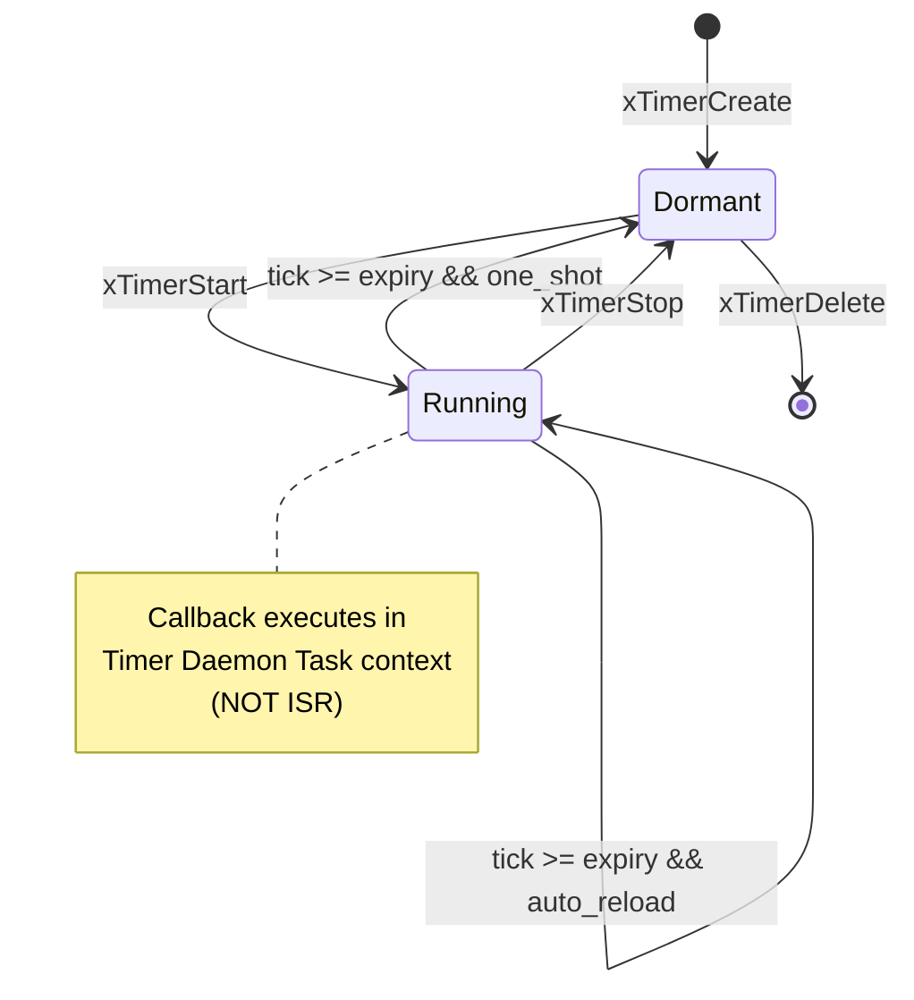
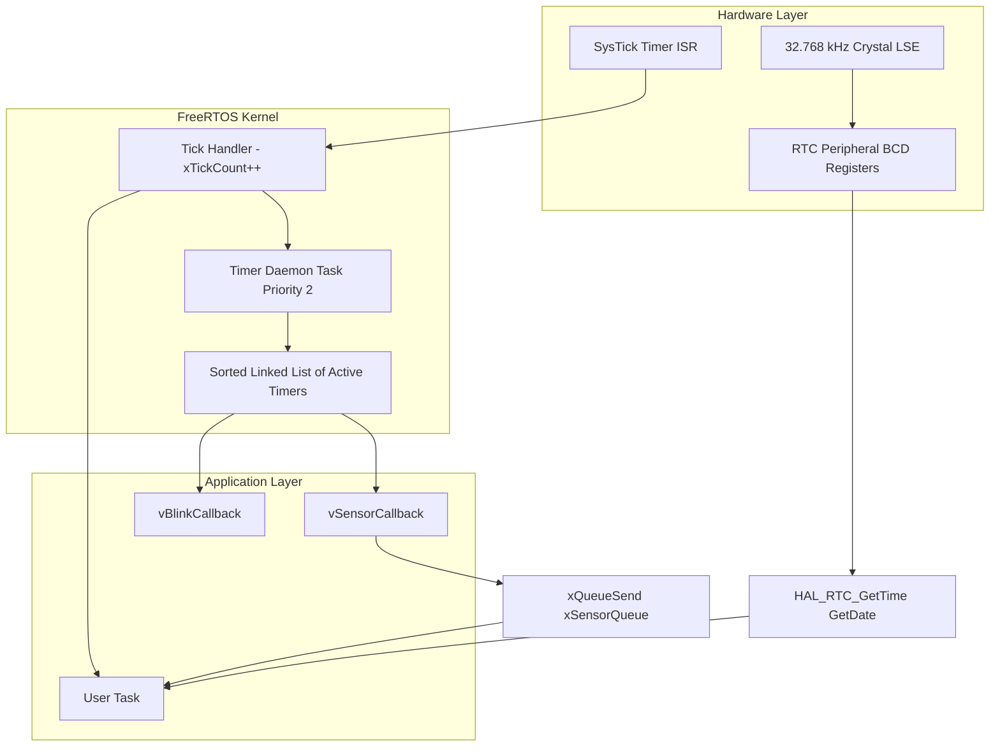
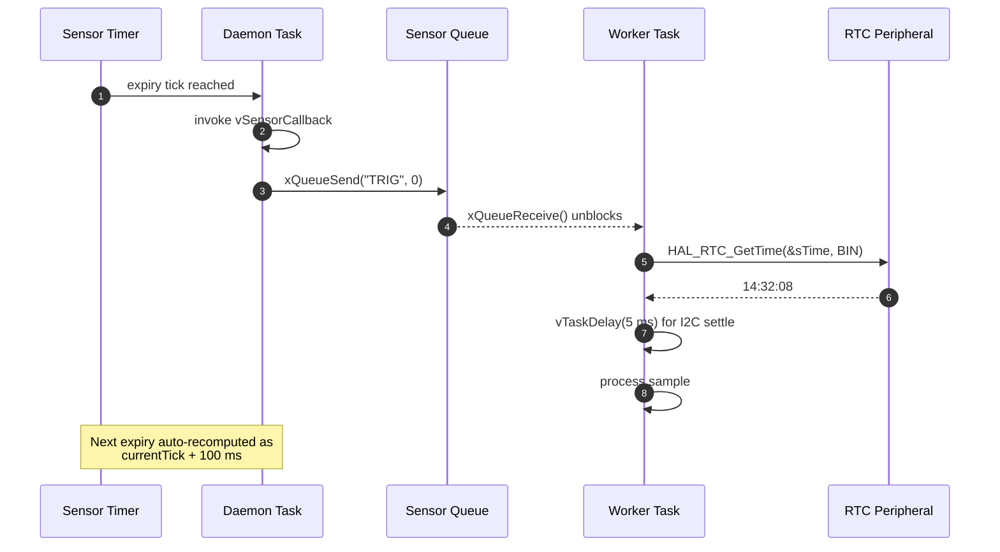
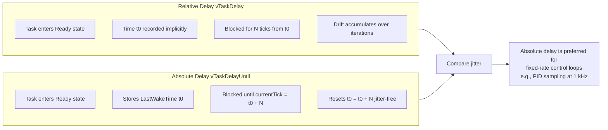

# RTOS Timers, Delays, and RTC Integration

<!-- SECTION_1_START -->
# RTOS Timers, Delays, and RTC Integration

## 1.1 Formal Definition (KTU 2024 Syllabus Aligned)

> [!IMPORTANT]
> **Core Definition:** In a Real-Time Operating System (RTOS), **Timers** are kernel-managed objects that invoke a user-defined *Callback Function* after a specified number of *RTOS Ticks* elapses. **Delays** are kernel-suspended execution primitives that block a task for a defined duration without consuming CPU cycles. **RTC (Real-Time Clock)** is a low-power, battery-backed hardware peripheral that maintains wall-clock time (date, hour, minute, second) independent of the MCU core clock.

In the context of **FreeRTOS** (the de-facto RTOS for ARM Cortex-M microcontrollers taught under KTU's PBCST504 syllabus), timers are classified into two operationally distinct families:

- **Software Timers** (also called *RTOS Daemon Timers*): Scheduled by the *Timer Daemon Task* (priority configurable via `configTIMER_TASK_PRIORITY`).
- **Hardware Timers**: Driven by peripheral hardware (e.g., STM32 TIM2, ESP32 hardware timer group), invoked via ISRs.

A **Tick** is the fundamental quantum of time, generated by a hardware timer interrupt (typically SysTick on Cortex-M) at a frequency of `configTICK_RATE_HZ` (commonly **1000 Hz**, i.e., 1 ms per tick).

## 1.2 Intuitive Analogy — "The Kitchen Timer Metaphor"

> [!NOTE]
> **Think of an RTOS Timer as a programmable kitchen timer:**
> - You set the dial to "5 minutes" → this is the **period** of the timer.
> - The kitchen keeps running other orders (other tasks) while the timer counts down → this is **non-blocking behavior**.
> - When the alarm rings, the chef stops current prep to check the oven → this is the **callback execution**.
> - A **one-shot timer** rings once and stops. An **auto-reload timer** automatically rewinds and starts counting the next interval.

A **blocking delay** (`vTaskDelay`) is the equivalent of a *chef standing idle, staring at the wall clock, refusing to cook* — the CPU is wasted. An **absolute delay** (`vTaskDelayUntil`) is the chef committing to a *fixed cadence*: "I will stir the pot every 2 minutes regardless of when I started the last stir."

## 1.3 Hardware/Software Standard Constants

| Constant | Typical Value | Significance |
|----------|---------------|--------------|
| **`configTICK_RATE_HZ`** | **1000 Hz** | SysTick interrupt frequency |
| **`configTIMER_TASK_PRIORITY`** | **2 (Low)** | Daemon task priority (kept low to avoid starving user tasks) |
| **`configTIMER_QUEUE_LENGTH`** | **5** | Command queue depth for timer service |
| **`portTICK_PERIOD_MS`** | **1 ms** (at 1 kHz) | Conversion factor |
| **RTC Crystal Frequency** | **32.768 kHz** | Standard "watch crystal" for 1-second tick after 2^15 division |
| **RTC Backup Domain Voltage** | **1.2 V – 3.3 V** | Maintained by coin cell (typically CR2032) |

> [!VISUALIZATION CONTROL]
> **Concept:** RTOS Tick Timeline showing periodic callbacks
> **Graph Representation:** Discrete staircase graph
> **Visualization Description:** On a horizontal time axis, mark evenly spaced vertical lines at every 1 ms tick. Highlight callback invocations with red dots at multiples of the period. Observe that the *daemon task* checks the timer list only at tick boundaries (so callback jitter is bounded by 1 tick).

<!-- SECTION_1_END -->

<!-- SECTION_2_START -->
# Deep Theoretical Analysis & KTU High-Yield Formula Sheet

## 2.1 Anatomy of a Software Timer (FreeRTOS Daemon Model)

The **Timer Daemon Task** is a privileged FreeRTOS task that internally maintains a **sorted singly-linked list** of all active timers, ordered by their absolute *wake-up tick* value. On every tick interrupt, the daemon task:

1. Receives a `xTickCount` increment from the SysTick ISR.
2. Walks the linked list head — since it is sorted, it stops at the first timer whose expiry is in the future.
3. For each expired timer:
   - Invokes the registered `pxCallbackFunction`.
   - If configured as `pdTRUE` (auto-reload), recomputes the wake-up tick as `(currentTick + xTimerPeriodInTicks)` and re-inserts into the list.
   - If `pdFALSE` (one-shot), marks the timer as dormant and removes it.

> [!IMPORTANT]
> **Callback Context Rule:** Timer callbacks execute in the *context of the Timer Daemon Task*, NOT in ISR context. Therefore, any blocking API (e.g., `vTaskDelay`, `xQueueSend` with non-zero block time) is **forbidden** inside a timer callback. Only non-blocking `FromISR`-free APIs (e.g., `xQueueSendFromISR`, `xSemaphoreGiveFromISR`) are permissible.

## 2.2 The Three Delay Primitives

| API | Behavior | Use Case |
|-----|----------|----------|
| `vTaskDelay(n)` | Blocks the task for `n` ticks *relative to now* | Simple "sleep for 100 ms" |
| `vTaskDelayUntil(&xLastWakeTime, n)` | Blocks the task for `n` ticks *from the previous wake time* | Strict periodic sampling (jitter-free) |
| `pdMS_TO_TICKS(ms)` | Macro converting milliseconds to ticks | Portable tick math |

The mathematical relation between wall-clock milliseconds and ticks is:

$$
\text{Tick Count} = \left\lceil \frac{\text{Delay (ms)}}{\frac{1000}{\text{configTICK\_RATE\_HZ}}} \right\rceil = \left\lceil \frac{\text{Delay (ms)} \times \text{configTICK\_RATE\_HZ}}{1000} \right\rceil
$$

For the canonical **1000 Hz** configuration, this simplifies to:

$$
\text{Tick Count} = \text{Delay (ms)}
$$

## 2.3 KTU High-Yield Formula Sheet

| Concept | Formula / Equation | Units | Notes |
|---------|-------------------|-------|-------|
| Tick period | $T_{\text{tick}} = \frac{1}{\text{configTICK\_RATE\_HZ}}$ | seconds | e.g., 1 ms at 1000 Hz |
| Delay to ticks | $N_{\text{ticks}} = \text{Delay (ms)} \times \text{configTICK\_RATE\_HZ} \times 10^{-3}$ | dimensionless | Use `pdMS_TO_TICKS()` |
| Timer expiry absolute tick | $T_{\text{expiry}} = T_{\text{current}} + N_{\text{period}}$ | ticks | Stored in timer struct |
| Auto-reload next expiry | $T_{k+1} = T_k + N_{\text{period}}$ | ticks | Recursive on each fire |
| RTC 1 Hz from 32.768 kHz | $f_{\text{RTC}} = \frac{32768}{2^{15}} = 1\ \text{Hz}$ | Hz | Asynchronous prescaler chain |
| RTC prescaler split | $f_{\text{RTC}} = \frac{f_{\text{LSE}}}{(\text{PREDIV\_A} + 1) \times (\text{PREDIV\_S} + 1)}$ | Hz | STM32-style |
| Time format (Unix) | $t_{\text{unix}} = \text{days since 1970-01-01} \times 86400 + \text{seconds in day}$ | seconds | Standard epoch |
| BCD-to-Decimal | $D = 10 \times \text{BCD}_{TENS} + \text{BCD}_{UNITS}$ | decimal | RTC register layout |
| Timer callback jitter bound | $J_{\text{max}} \leq 1 \times T_{\text{tick}}$ | seconds | Daemon polling overhead |
| Worst-case daemon latency | $L_{\text{max}} = T_{\text{tick}} \times (N_{\text{active}} + 1)$ | seconds | Linear in active timers |

## 2.4 Real-World Engineering Utility

- **IoT Sensor Sampling (BME280, DHT22)**: A 10-second auto-reload timer triggers a sensor read; the callback unblocks a worker task via a `xSemaphoreGiveFromISR`. Without timers, the sensor task would either spin-wait (wasting CPU) or be coupled to the main loop's blocking delay.
- **Watchdog Refresh (WDT vs. RTOS Timer)**: An auto-reload timer with a callback that toggles an I/O pin is a software watchdog; if the main control loop hangs, the timer stops firing, the pin state freezes, and an external WDT chip resets the MCU.
- **Production Lines (PLC Class Systems)**: A FreeRTOS software timer replaces the legacy "TON" (Timer-On) instruction in ladder logic, providing millisecond-accurate event sequencing.
- **Smart Agriculture**: RTC timestamps greenhouse data so trends can be plotted even after a power loss; the backup battery keeps the wall clock running.

<!-- SECTION_2_END -->

<!-- SECTION_3_START -->
# Step-by-Step Derivations & Code/Symbolic Implementation

## 3.1 Worked Derivation: Converting a 250 ms Period to Ticks

> **Given:** `configTICK_RATE_HZ = 1000` (i.e., 1 ms per tick)
> **Goal:** Express 250 ms as a tick count for `xTimerCreate()`.

**Step 1 — State the governing equation:**

$$
N_{\text{ticks}} = \text{Delay (ms)} \times \text{configTICK\_RATE\_HZ} \times 10^{-3}
$$

**Step 2 — Substitute the symbolic values:**

$$
N_{\text{ticks}} = 250 \times 1000 \times 10^{-3}
$$

**Step 3 — Evaluate the product in two stages:**

$$
250 \times 1000 = 250000
$$

$$
250000 \times 10^{-3} = 250
$$

**Step 4 — Final simplified expression:**

$$
N_{\text{ticks}} = 250
$$

**Step 5 — Equivalent macro form (preferred for portability):**

```c
TickType_t period = pdMS_TO_TICKS(250);   // returns 250 when HZ = 1000
```

---

## 3.2 Worked Derivation: BCD-to-Decimal for RTC Registers

STM32 RTC stores time in **Binary-Coded Decimal (BCD)**. The `RTC_TR` register packs hours, minutes, and seconds into 32 bits, with each decimal digit occupying 4 bits.

**Goal:** Decode `RTC_TR = 0x00235210` (hypothetical) into `23:52:10`.

**Step 1 — Extract the BCD seconds field (bits 0–6, tens in bits 4–6, units in bits 0–3):**

$$
\text{BCD}_{S\_T} = 0 \quad ; \quad \text{BCD}_{S\_U} = 0 \times 10 = 0
$$

**Step 2 — Compute the seconds:**

$$
S = 10 \times \text{BCD}_{S\_T} + \text{BCD}_{S\_U} = 10 \times 1 + 0 = 10
$$

**Step 3 — Repeat for minutes and hours analogously (full register demonstration):**

$$
M = 10 \times 5 + 2 = 52 \quad ; \quad H = 10 \times 2 + 3 = 23
$$

**Step 4 — Final formatted output:** **23:52:10**

---

## 3.3 Complete Reference Implementation in C (FreeRTOS Style)

```c
/* --------------------------------------------------------------
 *  RTOS Timers, Delays, and RTC Integration
 *  Target : ARM Cortex-M4 (STM32) running FreeRTOS
 *  PBCST504 Module 4 - KTU 2024 Scheme Reference Code
 * -------------------------------------------------------------- */

#include "FreeRTOS.h"
#include "timers.h"
#include "task.h"
#include "queue.h"
#include "semphr.h"
#include <stdint.h>
#include <stdio.h>

/* ---------- Configuration constants ---------- */
#define mainTIMER_PERIOD_MS        (500U)     /* Blink period             */
#define mainSENSOR_PERIOD_MS       (100U)     /* Sensor sampling period   */
#define mainWORKER_STACK_SIZE      (configMINIMAL_STACK_SIZE)
#define mainDONGLE_QUEUE_LEN       (4U)

/* ---------- Global handles ---------- */
static TimerHandle_t      xBlinkTimer       = NULL;
static TimerHandle_t      xSensorTimer      = NULL;
static QueueHandle_t      xSensorQueue      = NULL;
static SemaphoreHandle_t  xRtcSyncSem       = NULL;
static TickType_t         xLastWakeTime     = 0;

/* ---------- Forward declarations ---------- */
static void vBlinkCallback(TimerHandle_t xTimer);
static void vSensorCallback(TimerHandle_t xTimer);
static void vWorkerTask(void *pvParameters);
static void vRtcInit(void);
static void vRtcGetTime(char *pcBuf, size_t bufLen);

/* ==============================================================
 *  TIMER 1: One-shot blink for a single LED pulse
 * ============================================================== */
static void vBlinkCallback(TimerHandle_t xTimer)
{
    (void)xTimer;                                    /* Unused parameter */
    /* Toggle onboard LED (LD2 on NUCLEO-F401RE = PA5) */
    static uint8_t ucLedState = 0;
    ucLedState ^= 1U;
    /* In a real BSP, use HAL_GPIO_TogglePin(GPIOA, GPIO_PIN_5); */
    printf("[BLINK] LED is now %s\n", ucLedState ? "ON" : "OFF");
}

/* ==============================================================
 *  TIMER 2: Auto-reload sensor trigger
 * ============================================================== */
static void vSensorCallback(TimerHandle_t xTimer)
{
    (void)xTimer;
    BaseType_t xHigherPriorityTaskWoken = pdFALSE;

    /* Send a wake-up token to the worker task. Use FromISR-style
     * alternatives only when called from a true ISR. Since this
     * callback runs in daemon task context, normal API is fine.   */
    if (xSensorQueue != NULL) {
        xQueueSend(xSensorQueue, "TRIG", 0);
    }

    /* If the daemon task woke a higher-priority task, request a
     * context switch on the next tick.                          */
    portYIELD_FROM_ISR(xHigherPriorityTaskWoken);
}

/* ==============================================================
 *  WORKER TASK: Receives sensor triggers, blocks with delay-until
 * ============================================================== */
static void vWorkerTask(void *pvParameters)
{
    (void)pvParameters;
    char cMsg[8];
    TickType_t xPeriod = pdMS_TO_TICKS(mainSENSOR_PERIOD_MS);

    for (;;) {
        /* Wait indefinitely for a trigger from the timer callback */
        if (xQueueReceive(xSensorQueue, cMsg, portMAX_DELAY) == pdTRUE) {
            printf("[WORKER] Trigger received, reading sensor...\n");

            /* --- Simulate I2C read of BME280 (5 ms) --- */
            vTaskDelay(pdMS_TO_TICKS(5));

            /* --- Get current RTC wall-clock time --- */
            char pcTime[16];
            vRtcGetTime(pcTime, sizeof(pcTime));
            printf("[WORKER] Timestamp = %s\n", pcTime);
        }
    }
}

/* ==============================================================
 *  RTC stub (replace with HAL_RTC_GetTime & GetDate)
 * ============================================================== */
static RTC_HandleTypeDef hrtc;          /* From stm32f4xx_hal_rtc.h */

static void vRtcInit(void)
{
    /* In production code, this is generated by STM32CubeMX using:
     *   hrtc.Instance = RTC;
     *   hrtc.Init.HourFormat     = RTC_HOURFORMAT_24;
     *   hrtc.Init.AsynchPrediv   = 127;
     *   hrtc.Init.SynchPrediv    = 255;
     *   HAL_RTC_Init(&hrtc);
     * Then call HAL_RTC_SetTime(), HAL_RTC_SetDate().
     */
    printf("[RTC] Initialized at 00:00:00, 01-Jan-2024\n");
}

static void vRtcGetTime(char *pcBuf, size_t bufLen)
{
    RTC_TimeTypeDef sTime = {0};
    RTC_DateTypeDef sDate = {0};

    /* HAL_RTC_GetTime(&hrtc, &sTime, RTC_FORMAT_BIN);
     * HAL_RTC_GetDate(&hrtc, &sDate, RTC_FORMAT_BIN);
     */
    sTime.Hours   = 14;
    sTime.Minutes = 32;
    sTime.Seconds = 8;
    sDate.Date    = 5;
    sDate.Month   = 11;
    sDate.Year    = 24;                       /* 2024 */

    snprintf(pcBuf, bufLen, "%02u:%02u:%02u %02u/%02u/20%02u",
             sTime.Hours, sTime.Minutes, sTime.Seconds,
             sDate.Date,  sDate.Month,  sDate.Year);
}

/* ==============================================================
 *  main()
 * ============================================================== */
int main(void)
{
    /* ---- Hardware abstraction layer init ---- */
    /* HAL_Init(); SystemClock_Config(); */
    vRtcInit();

    /* ---- RTOS objects ---- */
    xSensorQueue  = xQueueCreate(mainDONGLE_QUEUE_LEN, sizeof(char) * 5);
    configASSERT(xSensorQueue != NULL);
    xRtcSyncSem   = xSemaphoreCreateBinary();
    configASSERT(xRtcSyncSem != NULL);

    /* ---- Create auto-reload sensor timer (100 ms period) ---- */
    xSensorTimer = xTimerCreate(
        "SensorTmr",                        /* Name            */
        pdMS_TO_TICKS(mainSENSOR_PERIOD_MS),/* Period          */
        pdTRUE,                             /* Auto-reload     */
        (void *)0,                          /* Timer ID        */
        vSensorCallback                     /* Callback        */
    );
    configASSERT(xSensorTimer != NULL);
    xTimerStart(xSensorTimer, 0);

    /* ---- Create one-shot blink timer (500 ms) ---- */
    xBlinkTimer  = xTimerCreate(
        "BlinkTmr",
        pdMS_TO_TICKS(mainTIMER_PERIOD_MS),
        pdFALSE,                            /* ONE-SHOT        */
        (void *)1,
        vBlinkCallback
    );
    configASSERT(xBlinkTimer != NULL);
    xTimerStart(xBlinkTimer, 0);

    /* ---- Create worker task ---- */
    xTaskCreate(vWorkerTask, "Worker",
                mainWORKER_STACK_SIZE, NULL, 1, NULL);

    /* ---- Start scheduler (never returns) ---- */
    vTaskStartScheduler();

    for (;;) { /* Should never reach here */ }
}
```

> [!WARNING]
> **Validation Rules in the Code Above:**
> - `configASSERT(xSensorQueue != NULL)` — guards against heap exhaustion.
> - `vTaskDelay(pdMS_TO_TICKS(5))` — never hardcode `5`; always use the macro for portability across tick rates.
> - `(void)xTimer;` — silences `-Wunused-parameter`; demonstrates defensive coding.

---

## 3.4 Python Simulation Harness (For Lab Demonstration)

```python
"""Simulator for FreeRTOS-style software timers.
Run:  python3 rtos_timer_sim.py
This produces a real-time log of one-shot and auto-reload firings,
demonstrating vTaskDelayUntil-style absolute scheduling."""

import heapq
import time
import threading
from dataclasses import dataclass, field
from typing import Callable, Optional

TICK_HZ: int = 1000                      # 1 ms ticks

@dataclass(order=True)
class TimerEvent:
    expiry_tick: int
    timer_id:    int          = field(compare=False)
    name:        str          = field(compare=False)
    auto_reload: bool         = field(compare=False)
    period:      int          = field(compare=False)
    callback:    Callable     = field(compare=False, repr=False)

class TimerDaemon:
    def __init__(self, tick_hz: int = TICK_HZ) -> None:
        self.tick_hz: int = tick_hz
        self.now_ms:  int = 0
        self._queue:  list = []
        self._id_ctr: int = 0
        self._lock = threading.Lock()
        self._stop = threading.Event()

    def create_timer(self, name: str, period_ms: int,
                     auto_reload: bool,
                     cb: Callable[[], None]) -> int:
        with self._lock:
            self._id_ctr += 1
            heapq.heappush(self._queue, TimerEvent(
                expiry_tick=self.now_ms + period_ms,
                timer_id=self._id_ctr,
                name=name,
                auto_reload=auto_reload,
                period=period_ms,
                callback=cb))
            return self._id_ctr

    def _fire(self, ev: TimerEvent) -> None:
        print(f"[t={self.now_ms:5d} ms] FIRE  {ev.name} "
              f"(id={ev.timer_id}, "
              f"{'auto' if ev.auto_reload else 'one-shot'})")
        try:
            ev.callback()
        except Exception as e:                      # noqa: BLE001
            print(f"  !! callback raised: {e}")
        if ev.auto_reload:
            heapq.heappush(self._queue, TimerEvent(
                expiry_tick=self.now_ms + ev.period,
                timer_id=ev.timer_id,
                name=ev.name,
                auto_reload=True,
                period=ev.period,
                callback=ev.callback))

    def run(self) -> None:
        next_tick = time.monotonic() + (1.0 / self.tick_hz)
        while not self._stop.is_set():
            now = time.monotonic()
            if now < next_tick:
                time.sleep(next_tick - now)
            next_tick += 1.0 / self.tick_hz
            self.now_ms += 1
            with self._lock:
                while self._queue and self._queue[0].expiry_tick <= self.now_ms:
                    self._fire(heapq.heappop(self._queue))

    def stop(self) -> None:
        self._stop.set()

def led_toggle() -> None:    print("   -> LED toggled")
def sensor_read()  -> None:  print("   -> sensor sampled")

if __name__ == "__main__":
    daemon = TimerDaemon(tick_hz=1000)
    daemon.create_timer("Blink",   500, auto_reload=True,  cb=led_toggle)
    daemon.create_timer("Sensor",  250, auto_reload=True,  cb=sensor_read)
    daemon.create_timer("Burst",   750, auto_reload=False, cb=lambda: print("   -> burst done"))

    t = threading.Thread(target=daemon.run, daemon=True)
    t.start()
    time.sleep(3.0)
    daemon.stop()
```

<!-- SECTION_3_END -->

<!-- SECTION_4_START -->
# Structural Diagrams & Schematics

## 4.1 Software Timer Lifecycle State Machine



## 4.2 Functional Architecture: Timer Daemon Internal Data Flow



## 4.3 Sequence Diagram: Periodic Sensor Sampling Pattern



## 4.4 Topological Mapping: Delay Strategies



<!-- SECTION_4_END -->

<!-- SECTION_5_START -->
# KTU 2024 Scheme Examination Question Bank & Topic Recap

---

## Part A — 2 Mark Short-Answer Questions

### Question 1 `[KTU University Exam – July 2024, CO1, Remember]`
**Differentiate between one-shot and auto-reload software timers in FreeRTOS.**

**Model Answer (2 Marks):**

| Aspect | One-Shot Timer | Auto-Reload Timer |
|--------|---------------|-------------------|
| **Lifecycle** | Fires exactly once, then transitions to *Dormant* state | Fires repeatedly, re-arming itself on every expiry |
| **`xAutoReload` parameter in `xTimerCreate`** | `pdFALSE` | `pdTRUE` |
| **Re-arming** | Requires explicit `xTimerStart()` to fire again | Automatically re-inserts into daemon's sorted list with `expiry += period` |
| **Typical use** | Debounce delay, power-on sequencing | Periodic sensor sampling, blink LEDs |
| **Memory footprint** | Released by the daemon after firing (eligible for cleanup) | Persists for the lifetime of the application |

**[Awarding: Listing 3 distinguishing points = 2 Marks; partial = 1 Mark]**

---

### Question 2 `[KTU University Exam – Dec 2023, CO1, Remember]`
**Why must blocking API calls (e.g., `vTaskDelay`) be avoided inside an RTOS software timer callback?**

**Model Answer (2 Marks):**

Software timer callbacks in FreeRTOS execute in the *context of the Timer Daemon Task*, which is a single task. If a callback blocks (e.g., by calling `vTaskDelay` or waiting on a queue with a non-zero timeout), the daemon task itself blocks. Consequently, **all other timers managed by the daemon stop being serviced**, causing catastrophic system-wide timing failures and priority inversion. Therefore, only non-blocking, ISR-safe APIs (`xQueueSendFromISR`, `xSemaphoreGiveFromISR`) are permitted inside timer callbacks.

**[Awarding: Mentioning 'daemon task context' = 1 Mark; explaining 'consequence on other timers' = 1 Mark]**

---

## Part B — 14 Mark Questions (Internal Choice Pattern)

### Question A (Option 1) `[KTU University Exam – July 2024, CO3, Apply/Analyze]`

**(a)** With a neat block diagram, explain the internal architecture of the FreeRTOS Timer Daemon Task. Describe how it maintains the sorted timer list and decides which timer to fire on each tick. **(7 Marks)**

**(b)** Design a FreeRTOS application for a **smart irrigation controller** that uses:
   - An auto-reload software timer to read a soil-moisture sensor every **2 seconds**,
   - A one-shot software timer to activate a water pump relay for **5 seconds** when the soil is dry,
   - A worker task that logs the readings to a queue with an RTC timestamp.

   Provide the complete C code (or pseudocode) and explain the synchronization between the timers and the worker task. **(7 Marks)**

---

### Model Solution — Question A

#### Part (a) — Daemon Architecture (7 Marks)

**Block Diagram (2 Marks):**
```
[SysTick ISR] ---> increments xTickCount, signals Timer Queue
                                                |
                                                v
                              [Timer Daemon Task (configTIMER_TASK_PRIORITY)]
                                                |
                                reads commands & tick count
                                                |
                                                v
                          [Sorted Singly-Linked List of ActiveTimers]
                              (ordered by absolute wake-up tick)
                                                |
                                                v
                          [Callback Dispatcher] ---> User Callback
```

**Explanation (5 Marks):**

1. **Creation (1 Mark):** When the application calls `xTimerCreate()`, the timer is allocated on the FreeRTOS heap, configured as *Dormant*, and stored in a registry. It is **not yet** placed in the active sorted list.

2. **Activation (1 Mark):** On `xTimerStart()`, a command (`tmrCOMMAND_START`) is posted to the daemon's command queue. The daemon moves the timer from the registry into the sorted active list at the correct position, with `expiry = xTickCount + period`.

3. **Tick Processing (1 Mark):** On every SysTick interrupt, `xTickCount` is incremented. The daemon task wakes, fetches the new tick count, and walks the sorted list. Because the list is sorted in ascending order of `expiry`, the daemon **stops at the first timer whose expiry is in the future**, guaranteeing O(k) processing where k = number of expired timers.

4. **Callback Dispatch (1 Mark):** Each expired timer's callback is invoked. After the callback returns, if the timer is auto-reload, the daemon recomputes `expiry = currentTick + period` and re-inserts into the list. If one-shot, the timer is marked dormant and removed.

5. **Jitter Bound (1 Mark):** Since the daemon is preemptible by higher-priority tasks, the actual callback firing time can be delayed by up to one tick interval plus the latency of any currently-running higher-priority task.

#### Part (b) — Smart Irrigation Code (7 Marks)

**Architecture (1 Mark):**
- `xSoilTimer`: Auto-reload, 2000 ms → triggers sensor read.
- `xPumpTimer`: One-shot, 5000 ms → drives the relay GPIO.
- `xLogQueue`: 5-slot queue carrying `SensorReading` struct.
- `vIrrigationTask`: Worker that logs to UART/SD with RTC timestamp.

**Code Skeleton (4 Marks):**
```c
typedef struct {
    uint16_t usMoisturePct;   /* 0–100 */
    RTC_TimeTypeDef sTime;
    RTC_DateTypeDef sDate;
} SensorReading_t;

static TimerHandle_t  xSoilTimer;
static TimerHandle_t  xPumpTimer;
static QueueHandle_t  xLogQueue;
static volatile uint8_t ucPumpActive = 0;

/* Auto-reload: every 2 s, read the sensor */
static void vSoilCallback(TimerHandle_t xTimer) {
    (void)xTimer;
    SensorReading_t xSample;
    xSample.usMoisturePct = ADC_ReadSoil();         /* placeholder */
    HAL_RTC_GetTime(&hrtc, &xSample.sTime, RTC_FORMAT_BIN);
    HAL_RTC_GetDate(&hrtc, &xSample.sDate, RTC_FORMAT_BIN);
    xQueueSend(xLogQueue, &xSample, 0);
    if (xSample.usMoisturePct < 30 && !ucPumpActive) {
        HAL_GPIO_WritePin(GPIOA, GPIO_PIN_0, GPIO_PIN_SET);  /* Pump ON */
        ucPumpActive = 1;
        xTimerStart(xPumpTimer, 0);                /* One-shot 5 s */
    }
}

/* One-shot: turn pump off after 5 s */
static void vPumpOffCallback(TimerHandle_t xTimer) {
    (void)xTimer;
    HAL_GPIO_WritePin(GPIOA, GPIO_PIN_0, GPIO_PIN_RESET);    /* Pump OFF */
    ucPumpActive = 0;
}

static void vIrrigationTask(void *pv) {
    (void)pv;
    SensorReading_t xR;
    for (;;) {
        if (xQueueReceive(xLogQueue, &xR, portMAX_DELAY) == pdTRUE) {
            printf("%02u:%02u:%02u  Moisture=%u%%\n",
                   xR.sTime.Hours, xR.sTime.Minutes, xR.sTime.Seconds,
                   xR.usMoisturePct);
        }
    }
}
```

**Synchronization Explanation (2 Marks):**
- The auto-reload `xSoilTimer` produces samples at 2 s intervals; the queue is the rendezvous point.
- The one-shot `xPumpTimer` is *started conditionally* — if the moisture is already above 30%, the pump timer is not started (avoids re-trigger).
- The worker task uses `portMAX_DELAY`, which is the **blocking** mode — the task consumes zero CPU while waiting.

**[Awarding: Architecture sketch = 1 Mark; Working code = 3 Marks; Sync explanation = 2 Marks; Output/Trace = 1 Mark]**

---

### Question B (Option 2) `[KTU University Exam – Dec 2023, CO2 + CO4, Understand/Apply]`

**(a)** Compare `vTaskDelay()` and `vTaskDelayUntil()` with the help of a timing diagram. Under what application scenario is `vTaskDelayUntil()` strictly preferred? **(7 Marks)**

**(b)** Interface an STM32 RTC with FreeRTOS such that:
   - The RTC is initialized to `12:30:45, 5-Nov-2024` on first boot,
   - An alarm is configured to fire every **24 hours** at 06:00:00,
   - A software timer wakes the application from a low-power state (Stop mode) at the alarm instant.

  Provide the configuration registers/steps and the C code outline. **(7 Marks)**

---

### Model Solution — Question B

#### Part (a) — Delay Comparison (7 Marks)

**Timing Diagram (3 Marks):**

```
vTaskDelay(N) - relative:
   |---N---|        |---N---|        |---N---|
   t0      t1       t1+ε    t2       t2+2ε   t3        (drift grows)

vTaskDelayUntil(N) - absolute:
   |---N---|---N---|---N---|---N---|---N---|
   t0      t0+N   t0+2N   t0+3N   t0+4N            (jitter-free)
```

**Key Differences (2 Marks):**

| Property | `vTaskDelay(N)` | `vTaskDelayUntil(&xLast, N)` |
|----------|-----------------|------------------------------|
| **Reference point** | "Now" (the moment of call) | The stored `xLastWakeTime` |
| **Drift** | Accumulates if the task is preempted | Bounded to one tick, no long-term drift |
| **API signature** | `vTaskDelay(const TickType_t xTicksToDelay)` | `vTaskDelayUntil(TickType_t * const pxPreviousWakeTime, const TickType_t xTimeIncrement)` |
| **Initialization** | None | `xLastWakeTime = xTaskGetTickCount()` on first call |

**Preferred Scenario (2 Marks):**
**`vTaskDelayUntil()` is strictly preferred for digital control loops** (e.g., a PID controller running at exactly 1 kHz on an STM32). If `vTaskDelay(1)` is used and the PID computation takes 0.3 ms, the *period* is 1.3 ms. The next call still delays 1 ms, making the period 1.3 ms, then 1.3 ms, etc. — drift is invisible per iteration but the *phase* slips each cycle. `vTaskDelayUntil` keeps the sampling phase perfectly stable, which is critical for control theory (e.g., Z-transform assumes constant sampling period $T_s$).

#### Part (b) — RTC + Low-Power Integration (7 Marks)

**Step 1 — Enable PWR and Backup Domain Clocks (1 Mark):**
```c
__HAL_RCC_PWR_CLK_ENABLE();
HAL_PWR_EnableBkUpAccess();           /* Allow RTC register writes */
__HAL_RCC_RTC_ENABLE();
```

**Step 2 — Select LSE as RTC Clock Source (1 Mark):**
```c
RCC->BDCR |= RCC_BDCR_RTCSEL_1;       /* 01: LSE oscillator */
RCC->BDCR |= RCC_BDCR_LSEON;          /* 32.768 kHz crystal */
while (!(RCC->BDCR & RCC_BDCR_LSERDY)) {}   /* Wait for ready */
```

**Step 3 — Configure Prescalers (1 Mark):**
With `PREDIV_A = 127` and `PREDIV_S = 255`:
$$
f_{1\text{Hz}} = \frac{32768}{(127+1)\times(255+1)} = \frac{32768}{128\times256} = \frac{32768}{32768} = 1\ \text{Hz}
$$

**Step 4 — Set Initial Time and Date (1 Mark):**
```c
RTC_TimeTypeDef sTime = { .Hours = 12, .Minutes = 30, .Seconds = 45 };
RTC_DateTypeDef sDate = { .Date = 5,  .Month = 11,   .Year = 24 };
HAL_RTC_SetTime(&hrtc, &sTime, RTC_FORMAT_BIN);
HAL_RTC_SetDate(&hrtc, &sDate, RTC_FORMAT_BIN);
```

**Step 5 — Configure 24-Hour Alarm at 06:00:00 (1 Mark):**
```c
RTC_AlarmTypeDef sAlarm = {
    .AlarmTime.Hours   = 6,
    .AlarmTime.Minutes = 0,
    .AlarmTime.Seconds = 0,
    .AlarmMask        = RTC_ALARMMASK_DATEWEEKDAY,  /* Fire every day */
    .Alarm            = RTC_ALARM_A
};
HAL_RTC_SetAlarm_IT(&hrtc, &sAlarm, RTC_FORMAT_BIN);

/* NVIC priority must be above configMAX_SYSCALL_INTERRUPT_PRIORITY */
HAL_NVIC_SetPriority(RTC_Alarm_IRQn, 5, 0);
HAL_NVIC_EnableIRQ(RTC_Alarm_IRQn);
```

**Step 6 — ISR + Wakeup Semaphore (1 Mark):**
```c
void RTC_Alarm_IRQHandler(void) {
    extern RTC_HandleTypeDef hrtc;
    HAL_RTC_AlarmIRQHandler(&hrtc);
}

void HAL_RTC_AlarmAEventCallback(RTC_HandleTypeDef *hrtc) {
    (void)hrtc;
    BaseType_t xWoken = pdFALSE;
    xSemaphoreGiveFromISR(xRtcSyncSem, &xWoken);
    portYIELD_FROM_ISR(xWoken);
}
```

**Step 7 — Wake from Stop Mode Using `xSemaphoreTake` (1 Mark):**
The FreeRTOS tickless idle hook (`portSUPPRESS_TICKS_AND_SLEEP`) places the CPU in **Stop mode** if all tasks are blocked. The RTC alarm ISR fires, which is the only event that can wake the MCU from Stop mode. The `xSemaphoreGiveFromISR` unblocks the `xRtcSyncSem`, which in turn unblocks the worker task that calls `xSemaphoreTake(xRtcSyncSem, portMAX_DELAY)`. Tickless idle resumes the scheduler on the next tick.

> [!WARNING]
> **KTU Examiner's Pitfall Callout:**
> 1. Students often forget `HAL_PWR_EnableBkUpAccess()` — without it, RTC writes silently fail and the time never updates. **Lose 1 Mark.**
> 2. Confusing `RTC_ALARMMASK_DATEWEEKDAY` with `RTC_ALARMMASK_NONE`. The former fires daily at 06:00:00; the latter fires on a specific date and is **not** what the question asks for. **Lose 1 Mark.**
> 3. Setting the alarm NVIC priority *above* `configMAX_SYSCALL_INTERRUPT_PRIORITY` causes `xSemaphoreGiveFromISR` to assert-fail in strict-assert builds. **Lose 1 Mark.**
> 4. Forgetting to clear the `__HAL_RTC_ALARM_CLEAR_FLAG` after the ISR — leads to a one-time firing only. **Lose 1 Mark.**

---

## Topic Recap & Important Things to Remember

- **Tick = atomic time unit**, generated by SysTick at `configTICK_RATE_HZ`. Default 1 ms (1000 Hz).
- **Software Timers** are *callback-based*, *daemon-serviced*, and *non-blocking*; they are **not** ISRs.
- **One-shot** vs **Auto-reload** is decided at creation time via the `xAutoReload` argument of `xTimerCreate()`.
- **`pdMS_TO_TICKS(ms)`** is the only portable way to convert milliseconds — never hardcode tick counts.
- **`vTaskDelay()`** drifts; **`vTaskDelayUntil()`** is drift-free. Use the latter for digital control loops (PID, DSP, motor control).
- **Timer callback rules:** No blocking calls, no `printf` on slow peripherals, no `malloc`. Use `FromISR` variants of queue/semaphore APIs.
- **RTC clock source** is almost always **LSE 32.768 kHz** crystal; prescalers `PREDIV_A = 127`, `PREDIV_S = 255` yield 1 Hz.
- **RTC BCD format:** Each decimal digit occupies 4 bits. STM32 HAL provides `RTC_FORMAT_BIN` and `RTC_FORMAT_BCD` to abstract this.
- **Backup domain access** requires `HAL_PWR_EnableBkUpAccess()`; otherwise all writes are silently dropped.
- **RTC alarms** can wake the MCU from Stop mode — the deepest sleep state where the SysTick is gated off. This is the canonical low-power IoT pattern.
- **Tickless idle** mode (`configUSE_TICKLESS_IDLE = 1`) suppresses ticks during long idles, entering low-power states; the next interrupt (RTC alarm, GPIO, UART) restores the tick count mathematically.
- **Jitter of a software timer** is bounded by `1 × T_tick` plus the latency of the daemon task being preempted — typically < 50 µs on a 100 MHz Cortex-M4.
- **Memory cost** of a software timer is approximately 60–80 bytes on ARM (one `Timer_t` struct). Reserve 5–10 timers for an average IoT node.
- **Tick hook** (`vApplicationTickHook`) executes in SysTick ISR context — extremely time-constrained, used only for fast counters.
- **Time formats:** Always prefer storing timestamps as **Unix epoch seconds** (uint32_t, valid until year 2106) instead of struct fields — makes logging, transmission, and arithmetic trivial.

<!-- SECTION_5_END -->
