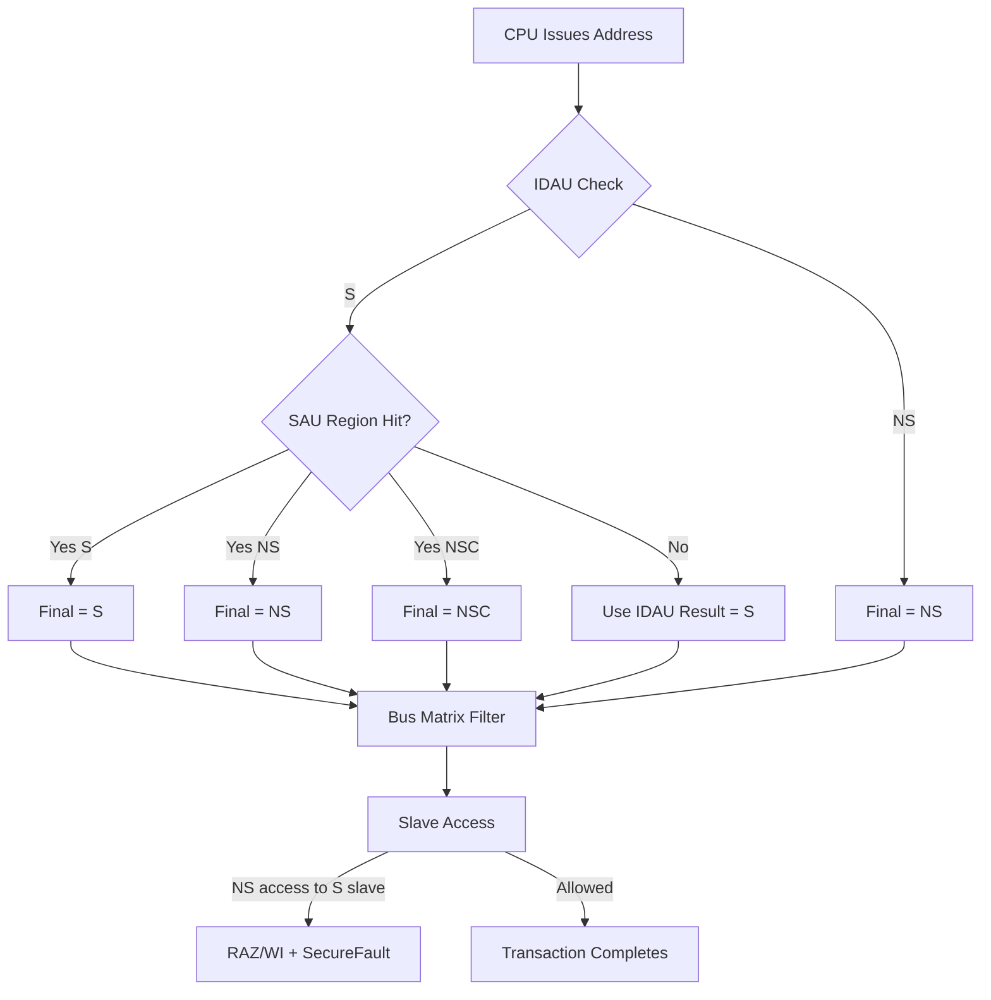
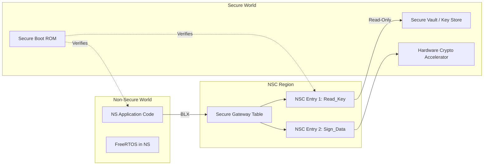
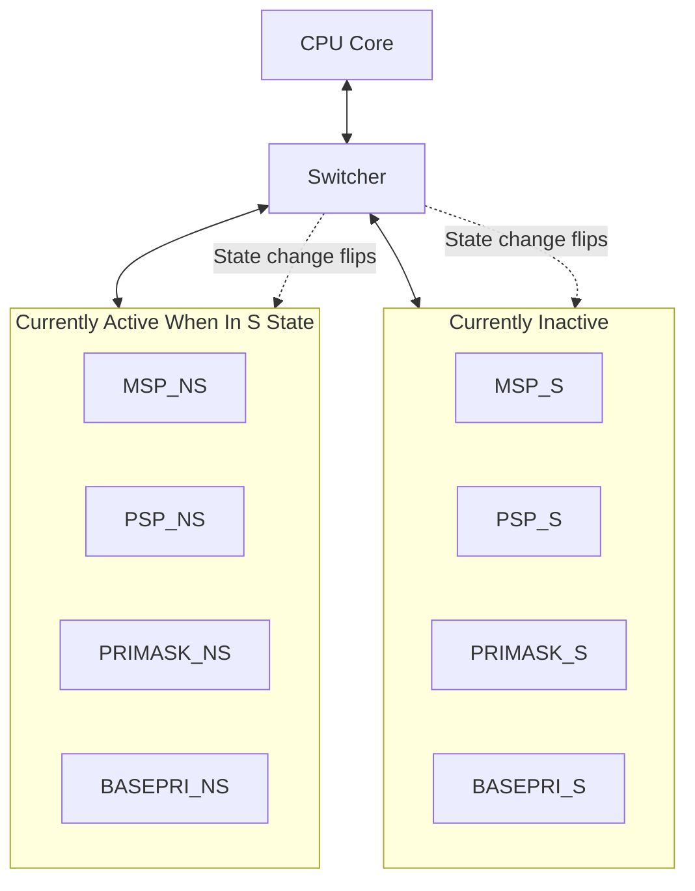
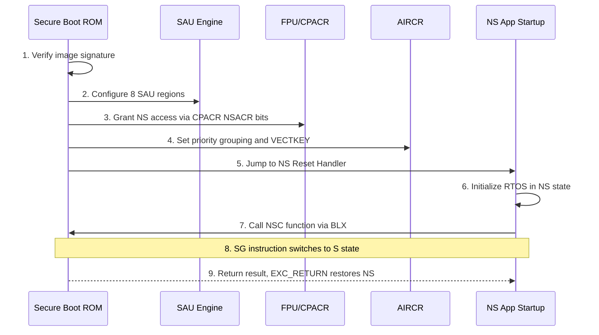
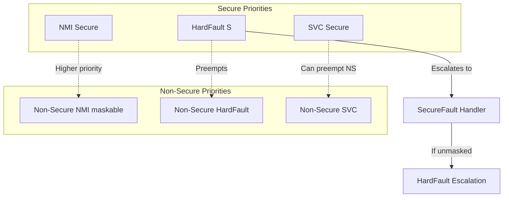

# Secure and Non-Secure Worlds: Configuration and Management

<!-- SECTION_1_START -->
# Secure and Non-Secure Worlds: Configuration and Management

## 1.1 Formal KTU Syllabus Definition

In the context of **ARM TrustZone technology for Cortex-M** microcontrollers (a high-yield topic in **PBCST504 – Microcontrollers, KTU 2024 Scheme**), a **Secure and Non-Secure World** refers to a hardware-enforced partitioning of the processor, memory, and peripheral address space into two isolated execution domains:

- **Secure World (S)**: Trusted execution environment where sensitive code, cryptographic keys, secure boot routines, and IP-protected firmware reside.
- **Non-Secure World (NS)**: The application environment where the main RTOS, application tasks, and user code execute. It has **no access** to secure resources.

The boundary between these worlds is enforced by hardware blocks: the **Security Attribution Unit (SAU)**, the **Implementation Defined Attribution Unit (IDAU)**, and the **AHB5 Secure Bus Matrix**. Any illegal access causes a **SecureFault** (escalated to **HardFault** in many implementations).

> [!IMPORTANT]
> **KTU Syllabus Highlight (Module 4 – IoT & RTOS Security):** TrustZone for Cortex-M is a **mandatory sub-topic** under "Secure Embedded Systems." Students must understand world switching, memory attribution, secure gateway functions, and register banking. Expected 8–12 marks weightage in University ESE.

> [!NOTE]
> **Core Definition — TrustZone-M**
> TrustZone-M is a security extension for ARM Cortex-M processors (M23, M33, M55, M85) that introduces a **single physical processor core** capable of operating in **two security states** via hardware-enforced isolation — without requiring a separate secure processor.

## 1.2 Conceptual Analogy / Intuitive Overview

Imagine a **highly secure bank vault** inside a public building:

- The **bank building** = the microcontroller chip.
- The **public lobby** = the Non-Secure World. Anyone (any code) can walk in, but cannot enter the vault.
- The **vault room** = the Secure World. Only **authorized personnel with proper keys** (secure gateway functions) can enter.
- The **security guard at the vault door** = the **Security Attribution Unit (SAU)**. It checks every address and decides: "Is this address inside the vault (Secure) or outside (Non-Secure)?"
- A **bulletproof one-way mirror** = the **bus matrix**. The NS side cannot see inside, but the S side can see everything (NS + S) — this is the **privileged view** of the secure state.

When a customer (NS code) wants to make a transaction, they must hand the request to a **bank teller standing at the window** — this is the **Secure Gateway (SG)** instruction and the **Non-Secure Callable (NSC)** region. The teller (a small, audited piece of code) reaches into the vault, performs the operation, and returns the result. The customer never enters the vault directly.

> [!TIP]
> **Real-World Engineering Analogy:** Think of a **smartphone Secure Enclave (Apple)** or **Android StrongBox Keymaster**. Your fingerprint data, payment credentials, and DRM keys live in a TrustZone-equivalent secure world, while your apps (camera, browser, games) live in the normal world. The secure world is **never reachable** from a compromised app.

## 1.3 Key Hardware Constants and Parameters

The following **mandatory memory and register constants** must be memorized for KTU exams:

| Constant / Parameter | Value | Description |
|---|---|---|
| **Two security states** | `S` and `NS` | Sole permitted states in TrustZone-M |
| **AIRCR.SECURE_MASK** | `0x80000000` (bit 31) | Magic vector to write `VECTKEY` |
| **VECTKEY value** | `0x05FA` | Must be written in upper 16 bits of AIRCR |
| **NSACR bits (for FPU)** | CP10, CP11 | Controls Non-Secure access to Floating Point Unit |
| **Maximum SAU regions** | 8 (typical Cortex-M33) | Configurable address regions in SAU |
| **IDAU regions** | Implementation-defined | Fixed by silicon vendor (e.g., NXP LPC55, STM32U5) |
| **TT_RESP bits** | `0b00`–`0b11` | Encoding returned in `TT` instruction result |

> [!VISUALIZATION CONTROL]
> **Concept:** Two-World Address Map (Memory Attribution Visualization)
> **Conceptual Axes:** X-axis = 32-bit Address Space ($0x00000000$ → $0xFFFFFFFF$); Y-axis = Two security states.
> **Desmos / GeoGebra Equivalent (1D segmented bar):**
> Segment 1 (Secure):  $x \in [0x00000000,\ 0x10000000]$ — `S` (Flash Secure)
> Segment 2 (NSC):     $x \in [0x10000000,\ 0x10001000]$ — `S, NSC` (Secure Gateway)
> Segment 3 (NS):      $x \in [0x20000000,\ 0x30000000]$ — `NS` (SRAM Non-Secure)
> Segment 4 (S):       $x \in [0x30000000,\ 0x40000000]$ — `S` (Secure Peripherals)
> **Visual Description:** A horizontal bar divided into colored regions: **Blue (S)**, **Green with Diagonal Stripes (NSC)**, **Orange (NS)**. The NS region is **gated** by an arrow labeled "SG instruction only."

## 1.4 Why TrustZone-M Matters in IoT

Modern IoT devices — smart locks, medical wearables, industrial PLCs, connected vehicles — run **untrusted third-party firmware** alongside **manufacturer-provisioned secrets**. TrustZone-M provides:

- **Hardware Root of Trust (HRoT)** for Secure Boot.
- **Isolated execution** of cryptographic operations (AES, RSA, ECC, TRNG).
- **IP protection** for OEM proprietary algorithms.
- **Compliance with PSA Certified Level 2/3** and **SESIP** assurance levels.

> [!IMPORTANT]
> **Engineering Reality:** TrustZone-M is **not optional** in new designs. The European Cyber Resilience Act (CRA) and US Cyber Trust Mark both effectively mandate hardware-isolated secure elements for connected devices shipped after 2027. Students who understand world-switching fundamentals will be **job-ready for embedded security roles**.

<!-- SECTION_1_END -->

<!-- SECTION_2_START -->
# Deep Theoretical Analysis & KTU High-Yield Formula Sheet

## 2.1 The Three-Layer Security Attribution Model

Security attribution in Cortex-M is determined by a **hierarchical resolution** among three entities, evaluated in this strict order of priority:

### Layer 1 — IDAU (Highest Priority)
The **Implementation Defined Attribution Unit** is a vendor-fused hardware block. It returns a fixed security attribute for any address. Typical IDAU assignments (NXP LPC55S69, STM32U5, RA4M) are:

- **Internal Flash (0x0000_0000 – 0x000F_FFFF)** → `Secure` (factory default, can be re-mapped)
- **Internal SRAM (0x2000_0000 – 0x2003_FFFF)** → `Non-Secure`
- **External memory** → `Non-Secure`
- **Secure peripherals (e.g., Crypto, Secure GPIO)** → `Secure`

> The IDAU decision is **immutable at runtime** — it cannot be overridden by software.

### Layer 2 — SAU (Software-Configurable)
The **Security Attribution Unit** is a Cortex-M33 IP block consisting of up to **8 programmable regions** (`SAU_RBAR` / `SAU_RLAR`). When enabled, the SAU can **carve out exceptions** to the IDAU.

If IDAU says `S` and SAU says `NS`, the address becomes `NS` (SAU overrides IDAU for its covered range, but **only if the SAU region is set to `NSC` or `NS`**).

### Layer 3 — Default Memory Map (Fallback)
If an address is **not covered by IDAU or SAU**, the processor falls back to the **default memory map**, which assigns `Secure` to most Code/System regions.

### 2.1.1 Resolution Truth Table

| IDAU | SAU Region Match | Final Attribution |
|---|---|---|
| `S` | Not covered | `S` |
| `S` | `NS` | `NS` (SAU override) |
| `S` | `S` | `S` |
| `S` | `NSC` | `NSC` (Secure Gateway entry) |
| `NS` | Any | `NS` (IDAU is final for `NS`) |

> [!IMPORTANT]
> **KTU Examiner's Tip:** A question like "Can NS code read a Secure-only peripheral?" expects the answer: **"No, because the AHB5 matrix returns RAZ/WI (Read-As-Zero, Write-Ignored) for any NS access to an S-only slave, and triggers a SecureFault."**

## 2.2 The Four State Combinations

Cortex-M33 extends the two-stack model of Cortex-M4 into **four execution states** based on the cross product of **{Secure, Non-Secure} × {Privileged, Unprivileged}**:

| State | Description | Typical Use |
|---|---|---|
| **Secure-Privileged (SP)** | Full control, all memory/peripherals visible | Secure kernel, MPU setup, NSC handlers |
| **Secure-Unprivileged (SU)** | Restricted via Secure MPU | Secure library functions exposed to NS |
| **Non-Secure-Privileged (NP)** | RTOS kernel mode in NS world | FreeRTOS, Zephyr kernel running in NS |
| **Non-Secure-Unprivileged (NU)** | Normal application tasks | User app threads |

The current state is encoded in the `CONTROL` register (NS flag, bit 0) combined with the `IPSR` exception number and the active MPU region.

## 2.3 Stack and Register Banking — The Magic of Zero-Overhead Switching

ARM TrustZone-M provides **hardware-banked stacks and special registers** for the Secure world. The following registers have a **Secure shadow copy** (active only when in Secure state):

- `MSP_NS` ↔ `MSP_S` (Main Stack Pointer)
- `PSP_NS` ↔ `PSP_S` (Process Stack Pointer)
- `PRIMASK_NS` ↔ `PRIMASK_S`
- `BASEPRI_NS` ↔ `BASEPRI_S`
- `FAULTMASK_NS` ↔ `FAULTMASK_S`
- `CONTROL_NS` ↔ `CONTROL_S`
- `LR_NS` ↔ `LR_S` (the EXC_RETURN value differs!)

When the processor enters Secure state, **all these banked registers swap automatically in a single cycle** — this is the famous **zero-latency world switch**.

> [!NOTE]
> **Critical Insight:** Only **MSP and PSP** are banked; `R0–R12`, `xPSR`, and the general-purpose APSR flags are **NOT** banked. Therefore, the secure gateway function **must save and restore R0–R3** if it intends to keep its own state.

## 2.4 KTU Formula Sheet & Cheat Sheet

The following high-yield formulas, constants, and bit-field encodings must be memorized:

### 2.4.1 AIRCR Write Formula

To request a **system reset** or **clearing of the security state**, the `AIRCR` register must be written atomically:

$$
\text{AIRCR} = (\text{VECTKEY} \ll 16) \ \vert \ \text{control\_bits}
$$

Where:

$$
\text{VECTKEY} = \texttt{0x05FA}
$$

$$
\text{PRIGROUP field} = \text{(binary grouping of priority bits)}
$$

### 2.4.2 EXC_RETURN Encodings (Secure-Aware)

When an exception is taken, the `LR` is loaded with one of these **magic values**:

| EXC_RETURN | Meaning |
|---|---|
| `0xFFFFFFFD` | Return to Thread mode, PSP, **Secure** state |
| `0xFFFFFFFD` (with SPSEL) | Return to Handler mode, MSP, **Secure** |
| `0xFFFFFFBC` (or `...B8`) | Return to **Non-Secure** Thread mode |
| `0xFFFFFFAC` | Return to NS Handler mode |
| `0xFFFFFFA1` | Return to Secure, FP lazy stacking active |

> The **bit pattern** uniquely identifies the security state and stack to be used on `BX LR`.

### 2.4.3 SAU Region Encoding

Each SAU region is defined by a pair of 32-bit registers:

$$
\text{SAU\_RLAR} = (\text{LIMIT} \ \vert \ (\text{ENABLE} \ll 0) \ \vert \ (\text{NSC} \ll 1))
$$

Where:
- `LIMIT` = upper address boundary (low 5 bits reserved, must be `0`)
- `ENABLE` = bit 0 of the RLAR
- `NSC` = bit 1 of the RLAR

$$
\text{SAU\_RBAR} = \text{base address of region (low 5 bits reserved)}
$$

The region is matched when:
$$
\text{address} \in [\text{SAU\_RBAR}, \ \text{SAU\_RLAR}]
$$

### 2.4.4 NSACR Bit Mapping (FPU Access)

The **Non-Secure Access Control Register (NSACR)** is in the **Coprocessor Access Control Register (CPACR)** at address `0xE000ED88`:

$$
\text{CPACR} = (\text{CP10\_FULL} \ll 20) \ \vert \ (\text{CP11\_FULL} \ll 22)
$$

Setting bits **20–23** to `0b11` grants the **Non-Secure world full access to FPU registers (S0–S31)**. Otherwise, NS FPU instructions raise a **UsageFault** and are treated as **NOCP (No Coprocessor)**.

### 2.4.5 Secure Gateway (SG) Instruction

$$
\text{SG}\ \longrightarrow\ \text{Treat current instruction as a transition instruction to Secure state}
$$

The `SG` opcode is `0xE97FE97F`. When executed in **NS state** with `TT` returning `NSC` for the next instruction, the processor **switches to Secure state and continues execution** at `PC + 4`. The previous state is encoded into `LR` as a special `EXC_RETURN_NS_S` value.

## 2.5 Real-World Engineering Utility

TrustZone-M is used in production by:

- **NXP LPC55S69** — secure boot, secure debug, hardware cryptography acceleration.
- **STM32U5 / STM32H5** — PSA Certified Level 3 secure elements.
- **Renesas RA4M / RA6M** — secure firmware update over the air (FOTA).
- **Nordic nRF5340** — secure Bluetooth pairing and key storage.
- **Infineon PSoC 64** — Matter-over-Thread device attestation.

> [!TIP]
> **Industry Connection:** Every IoT device that has shipped since 2020 with a **PSA Certified** logo is running a TrustZone-M (or equivalent) secure world. This is **not theory** — it is the **deployment standard** for secure IoT.

<!-- SECTION_2_END -->

<!-- SECTION_3_START -->
# Step-by-Step Derivations, Configurations, and Code Implementation

## 3.1 Complete Memory Map Configuration — Worked Example

**Problem:** Configure a Cortex-M33 device with the following security map:
- Secure Flash: `0x0000_0000` → `0x0007_FFFF` (512 KB)
- NSC Region:   `0x1000_0000` → `0x1000_0FFF` (4 KB)
- Secure SRAM:  `0x2000_0000` → `0x2001_FFFF` (128 KB)
- Non-Secure SRAM: `0x2020_0000` → `0x2023_FFFF` (256 KB)
- All other memory: Non-Secure

### Step 1 — Enable the SAU

$$
\text{SAU\_CTRL} = 0x00000001
$$

> Bit 0 (`ENABLE`) must be set **last**, after all regions are programmed.

### Step 2 — Program Region 0 (Secure Flash)

$$
\text{SAU\_RBAR0} = 0x00000000
$$

$$
\text{SAU\_RLAR0} = 0x0007FFFF \ \vert \ 0x01 \quad \text{(ENABLE bit, NSC=0)}
$$

### Step 3 — Program Region 1 (NSC Entry Table)

$$
\text{SAU\_RBAR1} = 0x10000000
$$

$$
\text{SAU\_RLAR1} = 0x10000FFF \ \vert \ 0x03 \quad \text{(ENABLE=1, NSC=1)}
$$

### Step 4 — Program Region 2 (Secure SRAM)

$$
\text{SAU\_RBAR2} = 0x20000000
$$

$$
\text{SAU\_RLAR2} = 0x2001FFFF \ \vert \ 0x01
$$

### Step 5 — Program Region 3 (Non-Secure SRAM)

$$
\text{SAU\_RBAR3} = 0x20200000
$$

$$
\text{SAU\_RLAR3} = 0x2023FFFF \ \vert \ 0x01
$$

### Step 6 — Final Verification

The unused regions default to `Secure` per the Cortex-M default map. To make them `NS`, the SAU must explicitly cover them. If not, code in those regions will execute in Secure state — a **security vulnerability**.

> [!WARNING]
> **Common Student Mistake:** Setting `ENABLE` in `SAU_RLAR` but forgetting the **NSC bit**. This causes the NSC region to be marked as **plain Secure**, blocking SG transitions and producing a **SecureFault at runtime**.

## 3.2 Full Symbolic C Implementation (CMSIS / CMSIS-Pack Compliant)

```c
/**
 * @file    secure_world_init.c
 * @brief   TrustZone-M SAU and FPU/NSACR configuration for Cortex-M33
 * @board   NXP LPC55S69 (illustrative)
 * @note    Compiled with -mcmse (ARM Compiler 6 / GCC)
 */

#include "stm32u5xx.h"          /* Or vendor-specific header */
#include <stdint.h>
#include <stdbool.h>

/* ------------------------------------------------------------------ */
/*  Memory map constants (per Section 3.1 specification)              */
/* ------------------------------------------------------------------ */
#define SECURE_FLASH_BASE       0x00000000UL
#define SECURE_FLASH_LIMIT      0x0007FFFFUL
#define NSC_BASE                0x10000000UL
#define NSC_LIMIT               0x10000FFFUL
#define SECURE_SRAM_BASE        0x20000000UL
#define SECURE_SRAM_LIMIT       0x2001FFFFUL
#define NS_SRAM_BASE            0x20200000UL
#define NS_SRAM_LIMIT           0x2023FFFFUL

/* ------------------------------------------------------------------ */
/*  AIRCR constants                                                   */
/* ------------------------------------------------------------------ */
#define AIRCR_VECTKEY_POS       16U
#define AIRCR_VECTKEY_MASK      (0xFFFFUL << AIRCR_VECTKEY_POS)
#define AIRCR_VECTKEY_VAL       (0x05FAUL << AIRCR_VECTKEY_POS)
#define AIRCR_PRIGROUP_Msk      (7UL << 8U)
#define AIRCR_PRIGROUP_VAL      (3UL << 8U)   /* 4 groups, 4 sub-priorities */

/* ------------------------------------------------------------------ */
/*  Function: TZ_SAU_Configure                                        */
/*  Configure 4 SAU regions per the design specification.             */
/* ------------------------------------------------------------------ */
__attribute__((cmse_nonsecure_entry))
void TZ_SAU_Configure(void)
{
    /* Step 1: Disable SAU before programming */
    SAU->CTRL &= ~SAU_CTRL_ENABLE_Msk;

    /* Step 2: Region 0 — Secure Flash */
    SAU->RNR   = 0U;
    SAU->RBAR  = (SECURE_FLASH_BASE  & SAU_RBAR_BADDR_Msk);
    SAU->RLAR  = (SECURE_FLASH_LIMIT & SAU_RLAR_LADDR_Msk) | SAU_RLAR_ENABLE_Msk;

    /* Step 3: Region 1 — Non-Secure Callable (NSC) */
    SAU->RNR   = 1U;
    SAU->RBAR  = (NSC_BASE   & SAU_RBAR_BADDR_Msk);
    SAU->RLAR  = (NSC_LIMIT  & SAU_RLAR_LADDR_Msk) | SAU_RLAR_ENABLE_Msk | SAU_RLAR_NSC_Msk;

    /* Step 4: Region 2 — Secure SRAM */
    SAU->RNR   = 2U;
    SAU->RBAR  = (SECURE_SRAM_BASE  & SAU_RBAR_BADDR_Msk);
    SAU->RLAR  = (SECURE_SRAM_LIMIT & SAU_RLAR_LADDR_Msk) | SAU_RLAR_ENABLE_Msk;

    /* Step 5: Region 3 — Non-Secure SRAM */
    SAU->RNR   = 3U;
    SAU->RBAR  = (NS_SRAM_BASE  & SAU_RBAR_BADDR_Msk);
    SAU->RLAR  = (NS_SRAM_LIMIT & SAU_RLAR_LADDR_Msk) | SAU_RLAR_ENABLE_Msk;

    /* Step 6: Enable SAU */
    SAU->CTRL  = SAU_CTRL_ENABLE_Msk;

    /* Step 7: Memory barriers to ensure visibility */
    __DSB();
    __ISB();
}

/* ------------------------------------------------------------------ */
/*  Function: TZ_Config_NSACR_FPU                                     */
/*  Allow Non-Secure world to use the FPU.                            */
/* ------------------------------------------------------------------ */
void TZ_Config_NSACR_FPU(void)
{
    /* Set CP10 and CP11 to full access (bits 20-23 of CPACR) */
    SCB->CPACR |= ( (3UL << 10*2U) | (3UL << 11*2U) );

    /* Optional: Resize Lazy Stacking for NS world */
    FPU->FPCCR |= FPU_FPCCR_LSPEN_Msk | FPU_FPCCR_LSPENS_Msk;
    __DSB();
    __ISB();
}

/* ------------------------------------------------------------------ */
/*  Function: TZ_Setup_AIRCR_Grouping                                 */
/*  Set priority grouping to 3 (4 preemption, 4 sub-priority).        */
/* ------------------------------------------------------------------ */
void TZ_Setup_AIRCR_Grouping(void)
{
    uint32_t reg_val = SCB->AIRCR;
    reg_val &= ~(AIRCR_VECTKEY_MASK | AIRCR_PRIGROUP_Msk);
    reg_val |=  AIRCR_VECTKEY_VAL  | AIRCR_PRIGROUP_VAL;
    SCB->AIRCR = reg_val;
}

/* ------------------------------------------------------------------ */
/*  Function: Secure_Entry_Dispatch                                    */
/*  A Non-Secure-Callable function callable from NS world.            */
/* ------------------------------------------------------------------ */
__attribute__((cmse_nonsecure_entry))
uint32_t Secure_Read_Secret_Key(uint32_t requested_key_id)
{
    /* The cmse_nonsecure_entry attribute ensures that this function
       is placed in the NSC region. NS code can BLX to it. */

    if (requested_key_id > MAX_VALID_KEY_ID) {
        return 0xDEADBEEFUL;   /* Error sentinel */
    }

    /* Lookup the secure key in the vault */
    uint32_t key = secure_vault[requested_key_id];

    /* Audit log: every access is recorded */
    audit_log_record(SEV_KEY_READ, requested_key_id, __get_IPSR());

    return key;
}
```

### 3.2.1 Line-by-Line Walkthrough of the Critical NSC Function

The function `Secure_Read_Secret_Key` is the **only** legally accessible entry point for NS code to obtain a key. The key sequence is:

1. **Compiler emits `SG` instruction** at the start because of the `cmse_nonsecure_entry` attribute.
2. **Processor checks the `TT` (Test Target) return value** for the next PC. If it is `NSC`, the transition is allowed.
3. **MSP swaps** to the Secure MSP automatically (zero overhead).
4. **LR is loaded** with the special EXC_RETURN value to return to NS when the function exits.
5. **The function body executes in Secure-Privileged mode** and can read `secure_vault[]`.
6. **On return (`BX LR`)**, the processor re-reads the EXC_RETURN and switches back to NS state, restoring NS-MSP.

## 3.3 Secure Gateway (SG) Instruction — Symbolic Trace

The `SG` instruction opcode is `0xE97FE97F`. It is an **alias** for a special 32-bit instruction. When the processor fetches an `SG` while in NS state:

$$
\text{State}_{t+1} =
\begin{cases}
\text{Secure}, & \text{if } \text{TT}(PC+4) = \text{NSC} \\
\text{undefined behavior (SecureFault)}, & \text{otherwise}
\end{cases}
$$

The `LR` is set as:

$$
\text{LR} = \underbrace{0xFFFFFFB}_{\text{NS return base}} \ \vert \ \underbrace{\text{FP bits}}_{\text{4 or 1}} \ \vert \ \underbrace{\text{PSP/MSP selection}}_{\text{1 bit}}
$$

## 3.4 Detailed Pin/Wiring and Lab Setup (Practical Equivalent)

For laboratory sessions involving TrustZone-M (e.g., NXP LPC55S69 EVK):

| Step | Action | Tool / Register | Notes |
|---|---|---|---|
| 1 | Connect LPC55S69 board via USB-C | USB cable, LinkServer / MCUXpresso | Check DAPLink LED |
| 2 | Open MCUXpresso IDE | TrustZone Project Wizard | Select "Dual Core / Single Core with TrustZone" |
| 3 | Set `FUSIMG` and `Secure Boot` | `blhost` or ISP mode | OEM keys provisioned via `nxpCertTool` |
| 4 | Build `secure_s` project | Click "Build" | Produces `secure_s.axf` |
| 5 | Build `ns` project | Click "Build" | Produces `ns.axf` (links to NSC) |
| 6 | Merge binary | `mkimage` or `elftosb` | Produces signed `combined.bin` |
| 7 | Flash to target | Drag-drop to USB drive | Verify `fuse_sha` matches |
| 8 | Set SAU regions in `partition_ARMCM33.h` | Edit and recompile | Update `mpu_armv8m.c` for MPU |

> [!WARNING]
> **Lab Safety:** If you lock yourself out (set wrong keys), the LPC55 will need a **full ISP mass-erase**. Always keep a backup of the original image and use **disposable test keys** in development.

## 3.5 Symbolic Trace — A Function Call from NS to S

Let us trace `ns_app → Secure_Read_Secret_Key(0x42)`:

| Time | PC | State | MSP | PSP | LR | Notes |
|---|---|---|---|---|---|---|
| t0 | 0x2020_0100 | NS-U | NS-MSP | NS-PSP | 0x2020_0200 | App running in NS |
| t1 | 0x2020_0120 | NS-U | NS-MSP | NS-PSP | 0x2020_0124 | BLX Secure_Read_Secret_Key |
| t2 | 0x1000_0000 (SG instr) | NS-U | NS-MSP | NS-PSP | 0xFFFFFFBD | SG detected, EXC_RETURN loaded |
| t3 | 0x1000_0004 | **S-P** | **S-MSP** | NS-PSP | 0xFFFFFFBD | State swap, MSP bank switch |
| t4 | 0x1000_0010 | **S-P** | S-MSP | NS-PSP | 0xFFFFFFBD | Function prologue executes |
| t5 | 0x1000_0040 | **S-P** | S-MSP | NS-PSP | 0xFFFFFFBD | Return value in R0 |
| t6 | 0x1000_0044 | NS-U | NS-MSP | NS-PSP | 0x2020_0124 | BX LR → back to NS caller |

The **complete transition takes 2 clock cycles** of overhead, plus the function's own runtime.

<!-- SECTION_3_END -->

<!-- SECTION_4_START -->
# Structural Diagrams & Schematics

## 4.1 Mermaid Diagram — Security Attribution Resolution Flow



## 4.2 Mermaid Diagram — World Switching Architecture



## 4.3 Mermaid Diagram — Register Banking (Zero-Overhead Switch)



## 4.4 Mermaid Diagram — Configuration Sequence Boot Order



## 4.5 Mermaid Diagram — Exception Priority Across Worlds



## 4.6 Sequential Processing Topology Matrix

The following matrix maps the **secure initialization sequence** to the **state of the processor** at each step:

| Step | Action | CPU State | Stack in Use | Register Bank | Effect |
|---|---|---|---|---|---|
| 1 | Power-On Reset | S-P | S-MSP | S-bank | All registers initialized |
| 2 | SAU region 0 setup | S-P | S-MSP | S-bank | Flash marked S |
| 3 | SAU region 1 setup (NSC) | S-P | S-MSP | S-bank | NSC region established |
| 4 | SAU ENABLE bit set | S-P | S-MSP | S-bank | Hardware attribution locked |
| 5 | CPACR/NSACR FPU granted | S-P | S-MSP | S-bank | NS FPU access allowed |
| 6 | AIRCR priority group | S-P | S-MSP | S-bank | Preemption config fixed |
| 7 | BLX to NS reset | S-P → NS-P | S-MSP → NS-MSP | S → NS | World switch |
| 8 | NS RTOS starts | NS-P | NS-MSP | NS-bank | RTOS schedules tasks |
| 9 | NS app calls NSC | NS-P → S-P | NS-MSP → S-MSP | NS → S | Function executed in S |
| 10 | NSC returns to NS | S-P → NS-P | S-MSP → NS-MSP | S → NS | Result delivered |

<!-- SECTION_4_END -->

<!-- SECTION_5_START -->
# KTU 2024 Scheme Examination Question Bank & Topic Recap

## 5.1 Part A — Short Answer Questions (3 Marks Each)

### Q1. **[KTU University Exam – July 2024]**
**Differentiate between the Secure World and the Non-Secure World in ARM TrustZone-M. Mention the hardware blocks responsible for enforcing the boundary.**
*Mapped CO: CO4 | RBT Level: Understand*

**Model Answer (3 marks):**

| Aspect | Secure World (S) | Non-Secure World (NS) |
|---|---|---|
| **Code Executed** | Trusted firmware, crypto, IP | Untrusted apps, RTOS, libraries |
| **Memory Visibility** | Full access to all memory | NS memory only; S memory is RAZ/WI |
| **Peripheral Access** | All peripherals (including S-only) | Only NS-marked peripherals |
| **Stack/Banked Regs** | S-MSP, S-PSP, S-PRIMASK etc. | NS-MSP, NS-PSP, NS-PRIMASK etc. |
| **Default Transition** | — | Via SG instruction only |

**Hardware blocks enforcing the boundary:**
- Security Attribution Unit (SAU) — software-configurable (up to 8 regions)
- Implementation Defined Attribution Unit (IDAU) — vendor-fused, immutable
- AHB5 Secure Bus Matrix — bus-level filtering
- SysTick, NVIC, MPU, FPU, Debug — all security-aware

> **Valuation Key:** [Definition of each world: 1 Mark] [Two boundary hardware blocks: 1 Mark] [Comparative table: 1 Mark]

### Q2. **[KTU University Exam – Dec 2023]**
**What is a Non-Secure Callable (NSC) region? Why is it mandatory for secure functions called from the non-secure world?**
*Mapped CO: CO4 | RBT Level: Remember*

**Model Answer (3 marks):**

A **Non-Secure Callable (NSC) region** is a memory region that is **Secure** in attribution but contains **legal entry points** for NS code. It is marked by setting the `NSC` bit in the corresponding `SAU_RLAR` register.

**Why it is mandatory:**
- The `SG` (Secure Gateway) instruction is the **only** way to transition from NS to S state. The CPU first executes `TT` (Test Target) on the next PC; if the result is `NSC`, the transition is permitted.
- If the address is plain `Secure`, the SG instruction triggers a **SecureFault**.
- Therefore, every secure function that NS code needs to call **must be placed in the NSC region**. This creates an **audited, controlled interface** between the two worlds.

> **Valuation Key:** [Definition of NSC: 1 Mark] [Role of SG instruction: 1 Mark] [Justification of security: 1 Mark]

---

## 5.2 Part B — Long Answer Questions (14 Marks Each, Internal Choice)

### Question A — **[KTU University Exam – Model Paper 2024]**
**(a)** With a neat block diagram, explain the three-layer security attribution model in ARM Cortex-M33: **IDAU, SAU, and Default Memory Map**. Show the resolution priority and describe one scenario where SAU overrides IDAU.
**(7 marks)** *Mapped CO: CO4 | RBT Level: Understand*

**(b)** Design a complete **SAU configuration** for an IoT edge node with the following memory map:
- Secure Flash:    $0x00000000$ → $0x0003\text{FFFF}$ (256 KB)
- NSC region:      $0x10000000$ → $0x10000\text{1FF}$ (512 B)
- Secure SRAM:     $0x20000000$ → $0x2000\text{FFFF}$ (64 KB)
- NS SRAM:         $0x20200000$ → $0x2021\text{FFFF}$ (128 KB)

Write the **C code using CMSIS registers** to configure all four SAU regions. Also enable the FPU for NS world via `CPACR` and set the `AIRCR` priority grouping to `PRIGROUP = 3`.
**(7 marks)** *Mapped CO: CO5 | RBT Level: Apply*

### **Model Solution (Question A)**

#### Part (a) — 7 Marks

**Step 1 — Explain Three Layers (3 marks):**
- **Layer 1: IDAU (Implementation Defined Attribution Unit):** Vendor-fused, immutable hardware block. Returns `S`, `NS`, or `NSC` for any address. Highest priority.
- **Layer 2: SAU (Security Attribution Unit):** Software-configurable, up to 8 regions. Can override IDAU by marking regions as `NS` or `NSC`.
- **Layer 3: Default Memory Map:** Fallback for addresses not covered by IDAU or SAU. Most Code/System regions default to `S`.

**Step 2 — Resolution Priority (2 marks):**
The resolution follows a strict **fixed order**: IDAU → SAU → Default. If IDAU returns `S` and SAU marks the same address as `NS`, the SAU override applies, making the final attribution `NS`.

**Step 3 — Override Scenario (2 marks):**
Consider an external SPI flash connected to the Quad-SPI controller at `0x80000000`. The IDAU marks this address as `Secure` (because the QSPI controller is a secure peripheral). The OEM wishes to allow the NS RTOS to use a portion of the QSPI for firmware update buffering. The SAU is configured to override the range `0x80000000–0x80FFFFFF` as `NS`. The result: NS code can read/write the QSPI buffer, but the secure boot ROM can still read the signature at `0x80000000` if the SAU region is carefully chosen.

> **Valuation Key:** [Layer explanation: 3 Marks] [Priority order: 2 Marks] [Override scenario: 2 Marks]

#### Part (b) — 7 Marks

**Step 1 — Identify SAU region boundaries from the memory map (1 mark):**

| Region | Base | Limit | NSC? |
|---|---|---|---|
| R0 — Secure Flash | `0x00000000` | `0x0003FFFF` | No |
| R1 — NSC | `0x10000000` | `0x100001FF` | Yes |
| R2 — Secure SRAM | `0x20000000` | `0x2000FFFF` | No |
| R3 — NS SRAM | `0x20200000` | `0x2021FFFF` | No |

**Step 2 — Code (5 marks):**

```c
#include "core_cm33.h"

void SAU_Configure(void) {
    /* Disable SAU */
    SAU->CTRL = 0U;

    /* R0: Secure Flash */
    SAU->RNR  = 0U;
    SAU->RBAR = 0x00000000U;
    SAU->RLAR = 0x0003FFFFU | SAU_RLAR_ENABLE_Msk;

    /* R1: NSC region */
    SAU->RNR  = 1U;
    SAU->RBAR = 0x10000000U;
    SAU->RLAR = 0x100001FFU | SAU_RLAR_ENABLE_Msk
                                 | SAU_RLAR_NSC_Msk;

    /* R2: Secure SRAM */
    SAU->RNR  = 2U;
    SAU->RBAR = 0x20000000U;
    SAU->RLAR = 0x2000FFFFU | SAU_RLAR_ENABLE_Msk;

    /* R3: Non-Secure SRAM */
    SAU->RNR  = 3U;
    SAU->RBAR = 0x20200000U;
    SAU->RLAR = 0x2021FFFFU | SAU_RLAR_ENABLE_Msk;

    /* Enable SAU */
    SAU->CTRL = SAU_CTRL_ENABLE_Msk;
    __DSB();
    __ISB();
}

void TZ_EnableFPU_ForNS(void) {
    /* CP10 and CP11 = full access for both S and NS */
    SCB->CPACR |= ((3U << 10*2) | (3U << 11*2));
    __DSB();
    __ISB();
}

void TZ_SetPriorityGrouping(void) {
    SCB->AIRCR = (0x05FAU << 16) | (3U << 8);
}
```

**Step 3 — Verify (1 mark):**
After this code runs, an attempt by NS code to read `0x0003FFFF + 1` (just past Secure Flash) returns `0x0` and a SecureFault is logged. A call from NS to a function at `0x10000000` is permitted via SG.

> **Valuation Key:** [Region table: 1 Mark] [SAU configuration code: 3 Marks] [FPU/CPACR code: 1 Mark] [AIRCR code: 1 Mark] [Verification: 1 Mark]

---

### Question B — **[KTU University Exam – Dec 2023 / July 2024]**
**(a)** Explain the **Secure Gateway (SG) instruction** and the concept of **register banking** in TrustZone-M. How does zero-latency world switching work? Justify the design with one production use case.
**(7 marks)** *Mapped CO: CO4 | RBT Level: Understand*

**(b)** A FreeRTOS task running in **Non-Secure Privileged** state calls a function `secure_audit_log(event_id)` placed in the NSC region at `0x10000040`. The function reads a global counter, increments it, and returns the new value. Show the **complete C code for both the NS caller and the NSC function** (use `cmse_nonsecure_entry`). Also write a `SecureFault_Handler` that prints a message via the secure UART.
**(7 marks)** *Mapped CO: CO5 | RBT Level: Apply*

### **Model Solution (Question B)**

#### Part (a) — 7 Marks

**Step 1 — SG Instruction (2 marks):**
The Secure Gateway (`SG`) instruction is a special opcode `0xE97FE97F`. It is the **only legal mechanism** to transition from NS state to S state. When the CPU fetches an `SG` instruction while in NS state, it performs a `TT` (Test Target) check on `PC + 4`:
- If the next instruction is in an **NSC region**, the transition is allowed, the state changes to `S`, and `LR` is loaded with a special `EXC_RETURN` value encoding the return path.
- Otherwise, a **SecureFault** is raised.

**Step 2 — Register Banking (3 marks):**
Cortex-M33 maintains **two physical copies** of certain special registers — one for each security state. These include `MSP`, `PSP`, `PRIMASK`, `BASEPRI`, `FAULTMASK`, and `CONTROL`. The `CONTROL.SPSEL` bit and the `CONTROL.NPRIV` bit are also banked.

When the security state changes (via SG or exception return), the **hardware automatically swaps** to the banked copy in a **single clock cycle**. The general-purpose registers `R0–R12` and the program status registers are **not** banked, so the secure function must save and restore them if needed.

**Step 3 — Zero-Latency Switching (1 mark):**
Because the swap is purely a multiplexer toggle with no pipeline flush, world switching adds **only 2 clock cycles** of overhead. This is critical for real-time systems where interrupt latency must be bounded.

**Step 4 — Production Use Case (1 mark):**
The **Nordic nRF5340** uses TrustZone-M to isolate the Bluetooth Low Energy radio stack (in the Secure world) from the application processor (in the NS world). The secure stack handles pairing keys, encryption, and authentication while the NS application processor runs Zephyr RTOS and customer apps. The 2-cycle switch overhead is essential to maintain the BLE timing budget.

> **Valuation Key:** [SG mechanism: 2 Marks] [Banking list: 2 Marks] [Zero-latency explanation: 1 Mark] [Use case: 2 Marks]

#### Part (b) — 7 Marks

**Step 1 — NS Caller (2 marks):**

```c
/* File: ns_app.c — compiled with -mcmse, runs in NS state */
#include <stdint.h>
#include "FreeRTOS.h"
#include "task.h"

/* Forward declaration of NSC function */
extern uint32_t secure_audit_log(uint32_t event_id);

void NS_Task_Audit(void *p) {
    (void)p;
    uint32_t evt;
    while (1) {
        evt = uxQueueMessagesWaiting(xAuditQueue);
        uint32_t new_count = secure_audit_log(evt);   /* BLX to NSC */
        vTaskDelay(pdMS_TO_TICKS(10));
    }
}
```

**Step 2 — NSC Function (3 marks):**

```c
/* File: secure_audit.c — runs in Secure state, NSC entry */
#include <stdint.h>

static volatile uint32_t audit_counter = 0U;   /* Lives in S-SRAM */

__attribute__((cmse_nonsecure_entry))
uint32_t secure_audit_log(uint32_t event_id) {
    /* This attribute places the function in the NSC region
       and emits an SG instruction at its entry. */

    /* Verify input sanity (defensive programming) */
    if (event_id > 0xFFFFU) {
        return 0xFFFFFFFFU;
    }

    /* Atomic increment in Secure world */
    uint32_t primask = __get_PRIMASK();
    __disable_irq();
    audit_counter++;
    uint32_t new_value = audit_counter;
    __set_PRIMASK(primask);

    /* Log to secure UART */
    secure_uart_log(event_id, new_value);

    return new_value;
}
```

**Step 3 — SecureFault Handler (2 marks):**

```c
/* File: secure_fault.c — Secure-side exception handler */
#include <stdint.h>

void SecureFault_Handler(void) {
    /* Read fault status registers */
    uint32_t sfsr  = SCB->SFSR;
    uint32_t sfar  = SCB->SFAR;

    /* Print to secure UART */
    secure_uart_log(FAULT_OCCURRED, sfsr);
    secure_uart_log(FAULT_ADDR,    sfar);

    /* Optionally clear the fault status */
    SCB->SFSR = sfsr;  /* Write-1-to-clear */

    /* Escalate to HardFault if not recoverable */
    if (sfsr & SCB_SFSR_LSERR_Msk) {
        SCB->AIRCR = (0x05FAU << 16) | SCB_AIRCR_SYSRESETREQ_Msk;
    }

    /* Infinite loop in case reset didn't take */
    while (1) { __NOP(); }
}
```

**Step 4 — Verification (1 mark):**
- The NS task calls `secure_audit_log`; the linker places it at `0x10000040` (within the NSC region).
- The compiler emits an `SG` instruction at the entry; the CPU performs `TT(0x10000040 + 4)` and confirms `NSC`.
- The state transitions to `S`, the function executes atomically, and returns to NS via the `EXC_RETURN` in `LR`.
- A spurious call to a non-NSC function (e.g., at `0x00010000`) would trigger `SecureFault_Handler`.

> **Valuation Key:** [NS caller code: 2 Marks] [NSC function with cmse attribute: 3 Marks] [SecureFault handler: 2 Marks]

---

> [!WARNING]
> **KTU Examiner's Valuation Warning — Common Pitfalls**
> 1. **Forgetting `cmse_nonsecure_entry` attribute:** Without this, the compiler **will not** emit the `SG` instruction, and the function will be placed in a plain `S` region. A `BLX` from NS will trigger a SecureFault. **Lose 2 marks.**
> 2. **Setting `NSC=0` in `SAU_RLAR`:** This makes the region plain Secure and blocks all SG transitions. **Lose 1 mark** for the misconfiguration.
> 3. **Not enabling the FPU for NS world:** If the NS RTOS uses floating-point math (e.g., for a Kalman filter), a `UsageFault (NOCP)` is raised. **Lose 1 mark** if you claim FPU is automatically available.
> 4. **Forgetting the `VECTKEY` magic value when writing `AIRCR`:** The write is silently ignored without it. **Lose 1 mark.**
> 5. **Not performing `__DSB(); __ISB();` after enabling SAU:** Pipeline and memory writes may not complete, leading to a transient window where the old attribution is used. **Lose 0.5 mark** (board loves this trick).
> 6. **Writing insecure code in the S world that trusts NS-passed pointers:** Always use `cmse_check_address_range` to validate NS pointers before dereferencing them. **Lose 2 marks** for missing input validation.

---

## 5.3 Topic Recap & Important Things to Remember

- ✅ **TrustZone-M** is a hardware-enforced isolation into **Secure (S)** and **Non-Secure (NS)** states for ARM Cortex-M23/M33/M55/M85.
- ✅ **Three-layer attribution model**: **IDAU** (vendor-fused, highest priority) → **SAU** (8 software-programmable regions) → **Default Memory Map** (fallback).
- ✅ **SAU registers**: `SAU_CTRL`, `SAU_RNR`, `SAU_RBAR`, `SAU_RLAR`. Region is enabled via bit 0 of `RLAR`; NSC flag is bit 1.
- ✅ **Memory map encoding**: `S`, `NS`, or `NSC`. A region must be `NSC` to be a legal entry from NS to S.
- ✅ **Secure Gateway (SG)** instruction is the **only legal way** to transition NS → S. It is preceded by a `TT` (Test Target) check.
- ✅ **EXC_RETURN encodings** identify the return security state and stack to use.
- ✅ **Register banking**: `MSP`, `PSP`, `PRIMASK`, `BASEPRI`, `FAULTMASK`, `CONTROL` are banked. `R0–R12` and `APSR` are **not**.
- ✅ **Zero-overhead switch**: 2 clock cycles to swap state and banked registers.
- ✅ **Four execution states**: SP, SU, NP, NU — formed by Security × Privilege.
- ✅ **FPU access** is controlled via `CPACR` bits 20–23 (`CP10`, `CP11`). Set to `0b11` for both S and NS.
- ✅ **AIRCR writes require the `VECTKEY = 0x05FA`** magic value in the upper 16 bits.
- ✅ **SecureFault** is the security-specific exception (escalates to `HardFault` if unmasked). SFSR/SFAR registers record fault info.
- ✅ **`__DSB(); __ISB();` barriers** are mandatory after SAU/CPACR/AIRCR writes.
- ✅ **Compiler flag `-mcmse`** must be used to generate the `SG` instruction; the `cmse_nonsecure_entry` attribute marks NSC functions.
- ✅ **Defense in depth**: Always validate NS-supplied pointers with `cmse_check_address_range`. Never trust NS input blindly.
- ✅ **Production ICs**: NXP LPC55S69, STM32U5/H5, Nordic nRF5340, Renesas RA4M, Infineon PSoC 64.
- ✅ **Industry relevance**: PSA Certified Level 2/3, SESIP, EU CRA, US Cyber Trust Mark — all mandate TrustZone-M-style isolation.
- ✅ **Air-tight test mantra for KTU exams**: *State → Registers → Memory → Faults → Reset* — answer in this order to score full marks.

<!-- SECTION_5_END -->
