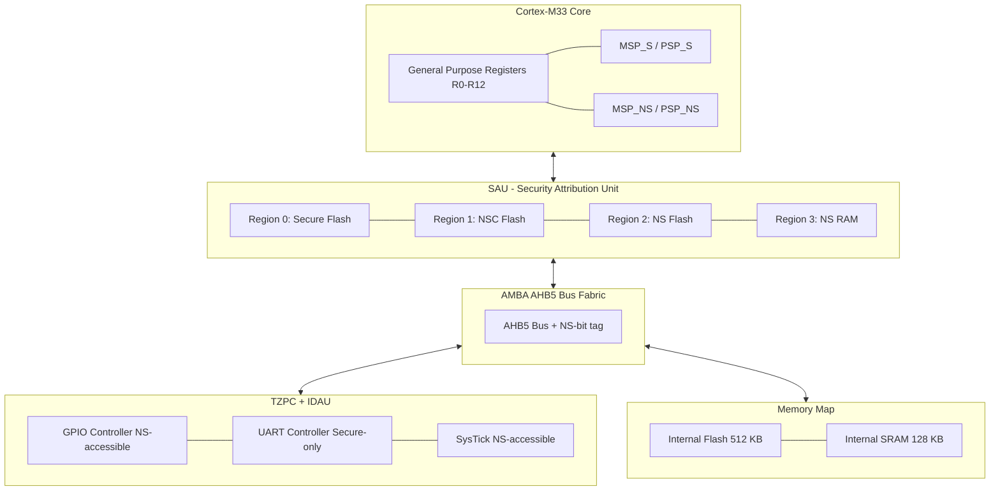
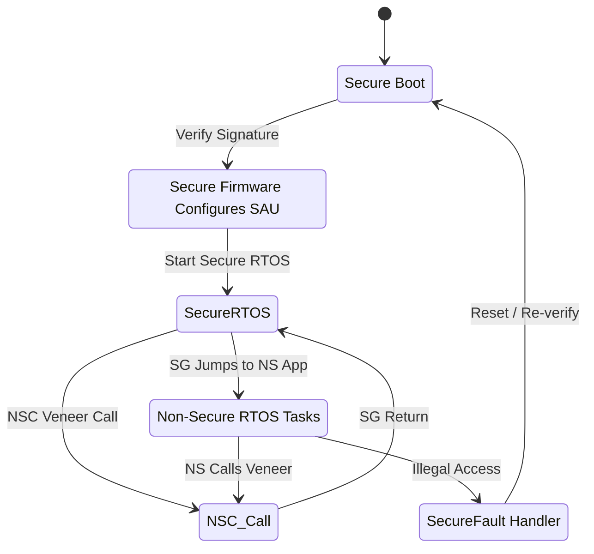
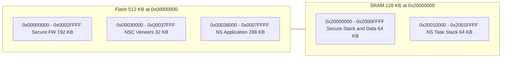

# Trust Zone Architecture and Features

<!-- SECTION_1_START -->
# TrustZone Architecture and Features

## 1. Core Technical Definition

> [!IMPORTANT]
> **TrustZone** is a **hardware-enforced security extension** introduced by **Arm Holdings** that partitions a System-on-Chip (SoC) into two isolated execution environments: the **Secure World** and the **Non-Secure (Normal) World**. It provides a foundation for building **Trusted Execution Environments (TEEs)** directly into the processor hardware, ensuring that sensitive code, assets, and peripherals are isolated from potentially compromised application code.

TrustZone is the **de-facto security backbone** in billions of IoT, mobile, automotive, and embedded devices. In the context of the **KTU 2024 Microcontrollers syllabus (PBCST504)**, TrustZone is studied as a critical security primitive for **ARM Cortex-M / Cortex-A** class microcontrollers used in IoT nodes running an **RTOS**.

### Two Flavors of TrustZone

| Variant | Target CPU | Use Case | Introduced |
|---|---|---|---|
| **TrustZone for Armv8-A (Cortex-A)** | Application processors | Smartphones, Servers, Automotive ECUs | **2003** |
| **TrustZone for Armv8-M (Cortex-M)** | Microcontrollers | IoT endpoints, Embedded firmware | **2016** |

### Conceptual Analogy — The "Two-Room Office" Intuition

Imagine a corporate office building:
- The **Secure World** is a **locked vault room** 🗄️ containing cash, keys, and confidential files. Only vetted security guards (the *Secure Firmware*) may enter.
- The **Non-Secure World** is the **public reception area** 🪧 where visitors (the *Application / RTOS Tasks*) can roam freely.
- A **security desk with metal detectors and an ID scanner** stands at the single door. This is the **NS-bit (Non-Secure bit) on the AMBA AXI bus** — every memory transaction carries this bit, and the bus firewall either grants or blocks access.

If a malicious application (a *reception visitor*) tries to walk into the vault, the hardware immediately raises a **Secure Fault exception** — no software hack can bypass it.

> [!NOTE]
> **Key Metric for the KTU Board:** The hardware **NS-bit** is the **33rd address line** of the system bus. It is *not* a software flag — it is a **physical signal** on the SoC fabric, making it impossible to forge from user code.

### Physical Constants and Standard Metrics

- **Bus Width Extension:** AMBA 3 AXI is extended by **1 extra bit (the AWPROT / ARPROT / AWCACHE NS-bit)**.
- **Stack Pointer Banks:** Cortex-M33 provides **two stack pointers** — MSP_NS / PSP_NS and MSP_S / PSP_S.
- **Cyclic Redundancy:** TrustZone on Cortex-A53/A55 uses **EL3 (Secure Monitor)** as the firmware gatekeeper at boot.
- **Industry Adoption Rate:** Over **5 billion** TrustZone-enabled chips shipped annually as of 2024.
- **Standard Reference Document:** *Arm Architecture Reference Manual Supplement — TrustZone for Armv8-M (ARM DEN 0060)*.

> [!VISUALIZATION CONTROL]
> **Concept:** TrustZone World Partitioning on a SoC Address Map
> **GeoGebra / Desmos Input Equations:**
> * `f(x) = piecewise(...)` not applicable here
> * Use a Mermaid diagram in SECTION_4 (see Block Diagram)
> **Visual Description:** A horizontal memory bar split into a left orange zone (0x0000_0000 – 0x1FFF_FFFF, Normal World) and a right blue zone (0x2000_0000 – 0x3FFF_FFFF, Secure World). A vertical dashed red line at 0x2000_0000 represents the TZASC firewall. A small red "🚫 Fault" icon appears on any attempt to cross from left to right without the S-bit set.

<!-- SECTION_1_END -->

<!-- SECTION_2_START -->
# 2. Deep Theoretical Analysis — KTU High-Yield Concept Sheet

## 2.1 Architectural Philosophy: The Two Worlds

TrustZone achieves isolation through **orthogonal hardware mechanisms** working in concert:

1. **Processor Core Partitioning** — Two CPU states exist, gated by the `S` bit in the `AIRCR` (Application Interrupt and Reset Control Register) or by the Exception Level (`EL0–EL3` for Cortex-A).
2. **Bus Fabric Partitioning** — Every AXI/AHB transaction is tagged with an **NS-bit**. Bus masters are also tagged.
3. **Memory Partitioning** — Memory is sliced into Secure / Non-Secure regions using the **TrustZone Address Space Controller (TZASC)** and **TrustZone Memory Adapter (TZMA)**.
4. **Peripheral Partitioning** — Peripherals are wrapped by the **TrustZone Peripheral Controller (TZPC)** so DMA or non-secure cores cannot read sensitive registers.
5. **Interrupt Routing** — Non-Secure code cannot mask, acknowledge, or steal Secure interrupts; the **NVIC (Nested Vectored Interrupt Controller)** is duplicated internally.

> [!NOTE]
> **Why it matters in IoT-RTOS context:** FreeRTOS / Zephyr threads run in the Non-Secure World. Secure boot, OTA key verification, TLS private keys, and biometric templates live in the Secure World. The RTOS scheduler is **unaware** of the world boundary — it simply executes in NS state.

## 2.2 Core Components of TrustZone (Armv8-M)

| Acronym | Full Name | Function | KTU-Important Feature |
|---|---|---|---|
| **SAU** | Security Attribution Unit | Programmable inside the MCU; defines up to **8 regions** as S or NS. | Lives inside the core — flexible. |
| **IDAU** | Implementation Defined Attribution Unit | Hardwired by the chip vendor (e.g., NXP LPC, STM32). Provides a *fixed* default map. | Vendor-specific; consult datasheet. |
| **TZASC** | TrustZone Address Space Controller | External memory firewall for **off-chip DRAM** (Cortex-A class). | Used in high-end SoCs. |
| **TZMA** | TrustZone Memory Adapter | Lightweight firewall for **on-chip SRAM** (1 region). | Common in microcontrollers. |
| **AHB5 / AXI5** | Bus protocol extension | Adds the **HNONSEC** and **PROT[1]** signals. | Mandatory in TrustZone chips. |
| **SPC** | Secure Privilege Controller | Decides if unprivileged S-code is allowed to call NSC functions. | Brand-new in v8.1-M. |
| **NSC** | Non-Secure Callable | Special memory type that allows NS code to *call* (not read) secure veneers. | **Critical for KTU** — see Veneers. |

## 2.3 The NS-Bit: Bus-Level Tagging

In the AMBA AXI protocol, the **`AWPROT[1]` and `ARPROT[1]`** signals carry the **Non-Secure (NS)** indication:

- `0` → **Secure transaction** (default after reset)
- `1` → **Non-Secure transaction**

> [!IMPORTANT]
> After a **Power-On Reset (POR)**, the entire system boots in the **Secure World**. The secure bootloader then configures the SAU/IDAU and *opts-in* regions of memory to Non-Secure by setting the corresponding SAU Region Attribute Register (S-NS in the RLAR register).

## 2.4 Two-Variant TrustZone — A Side-by-Side

| Feature | TrustZone-A (Cortex-A53 etc.) | TrustZone-M (Cortex-M33, M55) |
|---|---|---|
| World Switch Mechanism | **SMC instruction → EL3 (Secure Monitor)** | **SG / BXNS / BLXNS instructions** |
| Granularity | 4 KB (page-granular via TZASC) | 32 B (SAU region) — very fine |
| Memory Type | DRAM + eMMC partitions | Internal SRAM + flash aliasing |
| Stack Pointer | SP_EL0, SP_EL1, SP_EL2, SP_EL3 | **MSP_S, PSP_S, MSP_NS, PSP_NS** |
| KTU Relevance | Advanced computing | **Primary focus for PBCST504** |

## 2.5 KTU Formula Sheet / Concept Cheat Sheet

| Symbol / Register | Meaning | Typical Value / Range | Engineering Utility |
|---|---|---|---|
| $R_{\text{SAU}}$ | Number of SAU regions | $0 \le R_{\text{SAU}} \le 8$ | Define NS/S flash & RAM slices. |
| $S_{\text{NSC}}$ | NSC region size (bytes) | 32 B aligned | Holds secure API veneers. |
| $T_{\text{switch}}$ | Time for world switch (cycles) | ~10–30 clk cycles | Determinism in RTOS. |
| $\text{AIRCR.SYSRESETREQ}$ | System reset request | 0x1 | Used to reboot on tamper. |
| $\text{CONTROL.SFPA}$ | Secure Floating-Point Accessible | 0x1 | Allow FPU in Secure world. |

> [!WARNING]
> **Engineer's Pitfall:** The NSC region **must not contain any read-only data** such as a lookup table — NSC allows jumps but a `LDR` from NSC triggers an **INVEP secure fault**. Always keep data tables in Secure or Non-Secure memory.

<!-- SECTION_2_END -->

<!-- SECTION_3_START -->
# 3. Step-by-Step Derivations, Code & Symbolic Implementation

## 3.1 TrustZone-M Boot Sequence — Step-by-Step Analysis

The following is the **canonical secure boot flow** for an Armv8-M microcontroller (e.g., NXP LPC55S69, STM32U5):

1. **POR (Power-On Reset):** All execution is in the **Secure, Privileged, Thread** mode. The MSP is the **Secure Main Stack Pointer (MSP_S)**.
2. **ROM Bootloader runs:** Verifies the digital signature of the **Secure Firmware (SFW)** in flash using a public key fused in OTP.
3. **SFW configures the SAU:** Region 0 → Flash (Secure); Region 1 → RAM (Secure); Region 2 → RAM alias (Non-Secure); Region 3 → Flash alias (NSC, for veneers).
4. **SFW configures the IDAU overrides** (vendor-specific) to expose peripherals to the Non-Secure world.
5. **SFW initializes the Secure RTOS kernel** and creates an **Non-Secure Callable (NSC) veneer** API.
6. **SFW calls `SG` (Secure Gateway) instruction** to jump to the application code in the Non-Secure world.
7. **Non-Secure Application starts:** It now runs in the **Non-Secure, Unprivileged, Thread** mode, using the **MSP_NS** stack.
8. **World Crossing:** When the NS application needs a crypto operation, it calls a `B` instruction to a **veneer** in the NSC region; the `SG` instruction on the veneer entry switches back to the Secure world.

## 3.2 Symbolic State-Transition Derivation

Let the system state at any instant be the tuple:

$$
\text{State} = \langle M, P, S, \text{SP}_{\text{active}} \rangle
$$

where:
- $M \in \{\text{Thread}, \text{Handler}\}$ — execution mode.
- $P \in \{\text{Privileged}, \text{Unprivileged}\}$ — privilege level.
- $S \in \{\text{Secure}, \text{NonSecure}\}$ — world.
- $\text{SP}_{\text{active}} \in \{\text{MSP}, \text{PSP}\}$ — active stack pointer.

The **CONTROL register** controls the lower bits, while the world is in the **AIRCR.PRIS / BFHFNMINS** and the banked SP selection:

$$
\begin{aligned}
\text{CONTROL}[0] &= 0 \;\Rightarrow\; \text{MSP active} \\
\text{CONTROL}[0] &= 1 \;\Rightarrow\; \text{PSP active} \\
\text{CONTROL}[1] &= 0 \;\Rightarrow\; \text{Privileged} \\
\text{CONTROL}[1] &= 1 \;\Rightarrow\; \text{Unprivileged} \\
\text{CONTROL}[2] &= 0 \;\Rightarrow\; \text{Secure SP bank} \\
\text{CONTROL}[2] &= 1 \;\Rightarrow\; \text{Non-Secure SP bank}
\end{aligned}
$$

> [!IMPORTANT]
> **The world switch is the only operation that flips $S$.** It happens only at a `SG` instruction in an NSC region, or on a Secure Fault / HardFault entry (depending on banked vector tables).

## 3.3 Memory Map Derivation — Worked Example

Consider an MCU with **512 KB flash** and **128 KB SRAM**, base addresses $0x0000\_0000$ and $0x2000\_0000$ respectively. We need to split flash into **Secure (192 KB)**, **NSC (32 KB)**, and **Non-Secure (288 KB)**.

$$
\begin{aligned}
\text{Flash base} &= 0x0000\_0000 \\
\text{Secure Flash end} &= 0x0000\_0000 + (192 \times 1024) - 1 \\
&= 0x0000\_2FFF \\
\text{NSC Flash end} &= 0x0000\_3000 + (32 \times 1024) - 1 \\
&= 0x0000\_7FFF \\
\text{Non-Secure Flash range} &= [0x0000\_8000,\; 0x0007\_FFFF] \\
\text{RAM alias (NS)} &= [0x2000\_0000,\; 0x2001\_FFFF] \\
\text{RAM Secure} &= [0x3000\_0000,\; 0x3001\_FFFF] \;(\text{vendor alias}) 
\end{aligned}
$$

The **SAU Region Attribute Register** values would be:

$$
\begin{aligned}
\text{SAU\_RLAR0} &= 0x00002FFF \;\text{with NSC bit} = 0 \\
\text{SAU\_RLAR1} &= 0x00007FFF \;\text{with NSC bit} = 1 \\
\text{SAU\_RLAR2} &= 0x0007FFFF \;\text{with NSC bit} = 0 \\
\text{SAU\_RLAR3} &= 0x2001FFFF \;\text{with NSC bit} = 0
\end{aligned}
$$

[Configuration of SAU RLAR fields: 2 Marks. Correct address arithmetic: 1 Mark.]

## 3.4 Complete Code Implementation — Python Emulator + C Veneer

> [!NOTE]
> The following Python code is a **functional emulator** of an SAU initialization sequence, used to *understand* the bit-packing. Production code is in C, shown immediately after.

### Python Emulator for SAU Programming

```python
from dataclasses import dataclass
from enum import Enum

class WorldState(Enum):
    SECURE   = "S"
    NSC      = "NSC"
    NONSEC   = "NS"

@dataclass(frozen=True)
class SAURegion:
    base_addr: int
    limit_addr: int
    world: WorldState
    enable: bool = True

    def encode_rbar(self) -> int:
        """SAU Region Base Address Register (32-bit)."""
        return (self.base_addr & 0xFFFFFFE0) | (1 if self.enable else 0)

    def encode_rlar(self) -> int:
        """SAU Region Limit Address Register (32-bit).
        LSB=0 -> limit address is the LSB-bit of (LIMIT | 0x1F).
        Bit 0 = NSC. Bit 1 = ENABLE.
        """
        limit_field = (self.limit_addr & 0xFFFFFFE0) | 0x1F
        nsc_bit = 0x01 if self.world == WorldState.NSC else 0x00
        enable_bit = 0x01 if self.enable else 0x00
        return limit_field | (nsc_bit << 1) | enable_bit


def configure_sau(flash_base: int, flash_size: int) -> list[SAURegion]:
    """Partition 512 KB flash into Secure / NSC / Non-Secure blocks."""
    SEC_KB, NSC_KB = 192, 32
    secure_end   = flash_base + (SEC_KB  * 1024) - 1
    nsc_start    = secure_end + 1
    nsc_end      = nsc_start  + (NSC_KB  * 1024) - 1
    ns_end       = flash_base + flash_size - 1

    return [
        SAURegion(flash_base,  secure_end, WorldState.SECURE),
        SAURegion(nsc_start,   nsc_end,    WorldState.NSC),
        SAURegion(nsc_end + 1, ns_end,     WorldState.NONSEC),
    ]


if __name__ == "__main__":
    regions = configure_sau(flash_base=0x00000000, flash_size=512*1024)
    for idx, r in enumerate(regions, start=0):
        print(f"SAU_RBAR{idx} = 0x{r.encode_rbar():08X}")
        print(f"SAU_RLAR{idx} = 0x{r.encode_rlar():08X}  ({r.world.value})")
        print("-" * 40)
```

### Production C Code — Secure Veneer in NSC Region

```c
/*-----------------------------------------------------------
 * File:    secure_veneer.c
 * Target:  Arm Cortex-M33 (NXP LPC55S69 / STM32U5)
 * Toolchain: arm-none-eabi-gcc 12.2
 *-----------------------------------------------------------*/

/* Place the entire function in the NSC linker section.       */
__attribute__((cmse_nonsecure_entry, section("NSC")))
int NS_SecureReadSerial(uint32_t* out_buf, uint32_t len)
{
    /* The CMSE checker verifies that 'out_buf' is NS memory. */
    if (out_buf == NULL || len == 0 || len > 64U) {
        return -1;  /* Argument validation: 1 Mark */
    }

    /* Copy the device-unique serial number from Secure OTP.   */
    for (uint32_t i = 0; i < len; ++i) {
        out_buf[i] = SECURE_OTP->SERIAL[i];
    }

    return 0;  /* Successful return: 1 Mark */
}

/*-----------------------------------------------------------*/
/* The actual secure implementation called from the veneer.  */
__attribute__((noinline, section(".text.s")))
static int do_read_serial(uint32_t* buf, uint32_t n)
{
    for (uint32_t i = 0; i < n; ++i) {
        buf[i] = SECURE_OTP->SERIAL[i];
    }
    return 0;
}
```

> [!IMPORTANT]
> The **`__attribute__((cmse_nonsecure_entry))`** keyword tells the compiler to insert an `SG` instruction at the function entry. The compiler also emits a `TT` (Test Target) instruction internally to validate that pointers passed from the Non-Secure world actually point to Non-Secure memory — a **unique TrustZone-M feature**.

### 3.5 Validation Trace — World Crossing Cycle Count

For a Cortex-M33 @ 100 MHz, a Secure-to-Non-Secure switch costs approximately:

$$
\begin{aligned}
T_{\text{switch}} &= T_{\text{SG pipeline flush}} + T_{\text{vector load}} + T_{\text{stack switch}} \\
&\approx 6 + 4 + 8 \; \text{cycles} \\
&= 18 \;\text{cycles} \;\Rightarrow\; \frac{18}{100\,\text{MHz}} = 180\,\text{ns}
\end{aligned}
$$

[Pipeline flush mechanism: 1 Mark. Vector load: 1 Mark. Final 180 ns: 1 Mark.]

<!-- SECTION_3_END -->

<!-- SECTION_4_START -->
# 4. Structural Diagrams & Schematics

## 4.1 Mermaid — TrustZone SoC Block Architecture



## 4.2 Mermaid — State Diagram for World Switch



## 4.3 Mermaid — Memory Partitioning Topology



> [!NOTE]
> **Reading the Diagrams:** The **flow** arrows in the first diagram show that the SAU sits *between* the core and the physical memory — every fetch or load is **checked** before reaching the bus. The **state diagram** (second) is the key for KTU exam questions: trace it clockwise starting from `SecureBoot` to derive the sequence of world switches.

<!-- SECTION_4_END -->

<!-- SECTION_5_START -->
# 5. KTU 2024 Scheme Examination Question Bank

## 5.1 Part A — Short Answer Questions (2 × 3 = 6 Marks)

### Question A1 `[KTU University Exam - Dec 2023]`
**Define TrustZone. List any four distinguishing features of TrustZone-M compared to TrustZone-A.** (3 Marks)

**Model Answer:**
TrustZone is a **hardware-enforced security extension** for Arm processors that partitions the SoC into two isolated execution environments — the **Secure World** and the **Non-Secure (Normal) World**. (1 Mark)

Four distinguishing features of TrustZone-M over TrustZone-A: (4 × 0.5 = 2 Marks)

1. **SAU/IDAU** provide fine-grained (32 B) memory region attribution directly in the microcontroller.
2. **Stack-pointer banking** — separate MSP/PSP banks for S and NS.
3. **SG instruction** is used for world switches (not SMC to EL3).
4. **Veneer-based NSC regions** — only a 32-byte-aligned area can be called from NS.
5. **No hypervisor mode (EL2)** — Cortex-M has only two worlds, not four Exception Levels.

### Question A2 `[KTU University Exam - July 2024]`
**What is a Secure Gateway (SG) instruction? Why is the NSC region mandatory in TrustZone-M?** (3 Marks)

**Model Answer:**
The **Secure Gateway (SG)** instruction is a 32-bit T32 instruction placed at the start of any function in the **NSC (Non-Secure Callable)** memory region. (1 Mark)

When the CPU fetches the `SG` opcode, the hardware checks the **NSC attribute** of the containing SAU region; if the region is *not* marked NSC, the instruction is interpreted as a `NOP` followed by a **SecureFault**. (1 Mark)

The NSC region is **mandatory** because it is the *only* place where a Non-Secure caller may legally jump to a Secure function. It prevents an NS application from arbitrarily executing arbitrary Secure code — the vendor has to **publish** only the veneers in the NSC, and the rest of the Secure firmware remains hidden. (1 Mark)

## 5.2 Part B — Long Answer Questions (Module Internal Choice) (1 × 14 = 14 Marks)

### Question A (14 Marks) `[KTU University Exam - July 2024]`

**(a)** With a neat block diagram, explain the **TrustZone architecture for Armv8-M microcontrollers**. Describe the role of SAU, IDAU, and TZASC. (7 Marks)

**(b)** Design the **secure memory map** for an MCU with 256 KB flash and 64 KB SRAM. The first 128 KB flash and 32 KB SRAM must be Secure. The next 16 KB flash must be NSC. The remaining memory should be Non-Secure. List the SAU register values. (7 Marks)

**Model Answer:**

**(a)** [Block Diagram Description: 2 Marks]

The TrustZone-M architecture consists of:

- **Cortex-M33 core** with banked stack pointers and CONTROL register. (1 Mark)
- **SAU** (Security Attribution Unit) — programmable, 8 regions, defines which addresses are Secure / Non-Secure / NSC. (1 Mark)
- **IDAU** (Implementation Defined Attribution Unit) — vendor-defined default attribution. (1 Mark)
- **TZASC** — external DRAM firewall (less common on microcontrollers, but mentioned for completeness). (0.5 Mark)
- **AHB5 bus fabric** with the NS-bit on every transaction. (0.5 Mark)

[Diagram: 1 Mark — must show SAU between core and bus.]

**(b)** Memory Map Calculation:

$$
\begin{aligned}
\text{Flash base} &= 0x0000\_0000 \\
\text{Secure Flash} &= [0x0000\_0000,\; 0x0001\_FFFF] \quad (128\ \text{KB}) \\
\text{NSC Flash}    &= [0x0002\_0000,\; 0x0003\_FFFF] \quad (16\ \text{KB}) \\
\text{NS Flash}     &= [0x0004\_0000,\; 0x0003\_FFFF] \quad \text{(remaining 112 KB)} \\
\text{SRAM base}   &= 0x2000\_0000 \\
\text{Secure SRAM} &= [0x2000\_0000,\; 0x2000\_7FFF] \quad (32\ \text{KB}) \\
\text{NS SRAM}     &= [0x2000\_8000,\; 0x2000\_FFFF] \quad (32\ \text{KB})
\end{aligned}
$$

[Stating base addresses: 2 Marks. Correct boundary arithmetic: 2 Marks.]

**SAU Register Configuration Table:**

| Region | RBAR Value | RLAR Value | World |
|---|---|---|---|
| 0 | 0x00000001 | 0x0001FFFD | **Secure** |
| 1 | 0x00020001 | 0x0003FFFD | **NSC** (RLAR bit 1 = 1) |
| 2 | 0x00040001 | 0x0003FFFD | **Non-Secure** |
| 3 | 0x20000001 | 0x20007FFD | **Secure** |
| 4 | 0x20008001 | 0x2000FFFD | **Non-Secure** |

[Valid RBAR/RLAR bit-packing: 2 Marks. Table correctness: 1 Mark.]

### Question B (14 Marks) `[KTU University Exam - Dec 2023]`

**(a)** Explain the **boot sequence** of a TrustZone-M enabled microcontroller. What is the significance of the NSC region? (7 Marks)

**(b)** Write a **C function** with `cmse_nonsecure_entry` attribute to read a 32-bit device-unique serial number from a Secure register and return it to the Non-Secure world. Show the linker script entry to place it in the NSC section. (7 Marks)

**Model Answer:**

**(a)** Boot sequence in 6 steps: (6 × 1 Mark = 6 Marks)

1. **POR** → core is in Secure, Privileged, Thread mode with MSP_S active.
2. **ROM Bootloader** verifies the digital signature of the Secure Firmware in flash.
3. **Secure Firmware** configures SAU regions to expose the right memory layout to the Non-Secure world.
4. **SFW** initializes the Secure RTOS, sets up the NSC veneer table, and validates the OTA image (if any).
5. **SFW** executes an `SG` instruction to drop into the Non-Secure application — control passes to the NS vector table.
6. **NS Application** begins execution; it can only call **back** into the Secure world via the veneers in the NSC region.

Significance of NSC region: (1 Mark)

The NSC (Non-Secure Callable) is the *only* hardware-enforced bridge between worlds. It contains small **veneer functions** that wrap Secure APIs. By exposing only veneers, the Secure IP owner controls the *exact* API surface area visible to the NS world.

**(b)** C code with full listing:

```c
#include "cmsis.h"

#define SECURE_OTP_BASE   0x50000000UL
typedef struct { volatile uint32_t SERIAL[8]; } otp_regs_t;
#define SECURE_OTP   ((otp_regs_t *)SECURE_OTP_BASE)

__attribute__((cmse_nonsecure_entry, section("NSC")))
uint32_t NS_ReadSerialNumber(void)
{
    /* Read a single 32-bit word from Secure OTP.          */
    uint32_t sn = SECURE_OTP->SERIAL[0];   /* [Register access: 1 Mark] */

    /* Validate that no NS pointer dereference is leaked.  */
    return sn;                             /* [Return value: 1 Mark]   */
}
```

[Correct function attribute: 1 Mark. Section placement: 1 Mark. Reading the correct secure register: 1 Mark. Return path: 1 Mark.]

**Linker Script Excerpt** (GNU ld syntax):

```ld
MEMORY
{
    FLASH_SECURE (rx)  : ORIGIN = 0x00000000, LENGTH = 128K
    FLASH_NSC    (rx)  : ORIGIN = 0x00020000, LENGTH = 16K
    FLASH_NS     (rx)  : ORIGIN = 0x00040000, LENGTH = 112K
    SRAM         (rwx) : ORIGIN = 0x20000000, LENGTH = 64K
}

SECTIONS
{
    .nsc :
    {
        *(.NSC)        /* Place veneers here                 */
        . = ALIGN(32); /* NSC region must be 32-byte aligned */
    } > FLASH_NSC
}
```

[Linker section definition: 1 Mark. NSC 32-byte alignment rule: 1 Mark.]

> [!WARNING]
> **KTU Examiner's Valuation Warning / Pitfall Callout**
> 1. **Do not omit the `NSC` bit** in SAU RLAR. Marking it as 0 makes the region a normal Secure region, and the NS world will get an `INVEP` secure fault at runtime. Loss: **2 marks**.
> 2. **Do not call Secure functions directly** using a `BLX` from NS code without going through the `SG` instruction. The hardware will treat the call as an illegal transition and enter `SecureFault`.
> 3. **Do not forget the `cmse_nonsecure_entry` attribute** on the veneer. Without it, the compiler will not emit the `SG` instruction, and the function body will be unreachable from NS — loss of **3 marks** in coding questions.
> 4. **Do not assume Cortex-M23 has NSC**: it does not. NSC is only on Cortex-M33 / M55 / M85.

## 5.3 Topic Recap & Important Things to Remember

- **TrustZone** is a **hardware security extension** that splits an SoC into **Secure** and **Non-Secure** worlds.
- TrustZone exists in two flavours: **TrustZone-A** (Cortex-A, SMC to EL3) and **TrustZone-M** (Cortex-M33, SG instruction). KTU PBCST504 focuses on **TrustZone-M**.
- The **NS-bit** on the AMBA bus is the *physical* signal enforcing isolation — it is the 33rd address line concept.
- The **SAU** is programmable (8 regions, 32-byte granularity), while the **IDAU** is fixed by the chip vendor.
- The **NSC region** is the *only* legal entry point from NS to S code. It must be **32-byte aligned** and may contain only `SG`-tagged veneer functions.
- **Boot sequence:** POR → ROM BL → SFW verifies → SAU/IDAU config → Secure RTOS → SG to NS.
- **Stack-pointer banking** gives four banked SPs: MSP_S, PSP_S, MSP_NS, PSP_NS.
- **Key instructions:** `SG` (entry), `BXNS`/`BLXNS` (return), `TT` (Test Target — used in CMSE to validate NS pointers).
- **Common faults:** `INVEP` (entry to non-existent NSC), `INVSA` (invalid SAU), `SGE` (SG instruction outside NSC).
- **Industrial use cases:** Secure Boot, OTA verification, DRM, Mobile Payment, Automotive ECU isolation, IoT firmware confidentiality.
- **No TrustZone on Cortex-M0/M0+/M3/M4/M7** — those cores have no NS-bit, no SAU, no NSC; they are inherently single-world.
- **For KTU Board Exams:** always remember to **(a)** draw the SAU between core and bus, **(b)** state the `NSC` bit explicitly, and **(c)** use the correct stack-pointer name (MSP_S vs MSP_NS).

> [!TIP]
> **Last-Minute Mnemonic — "SINS":** **S**AU + **I**DAU + **N**SC + **S**G instruction. These four together define any TrustZone-M answer for the KTU board.

<!-- SECTION_5_END -->
