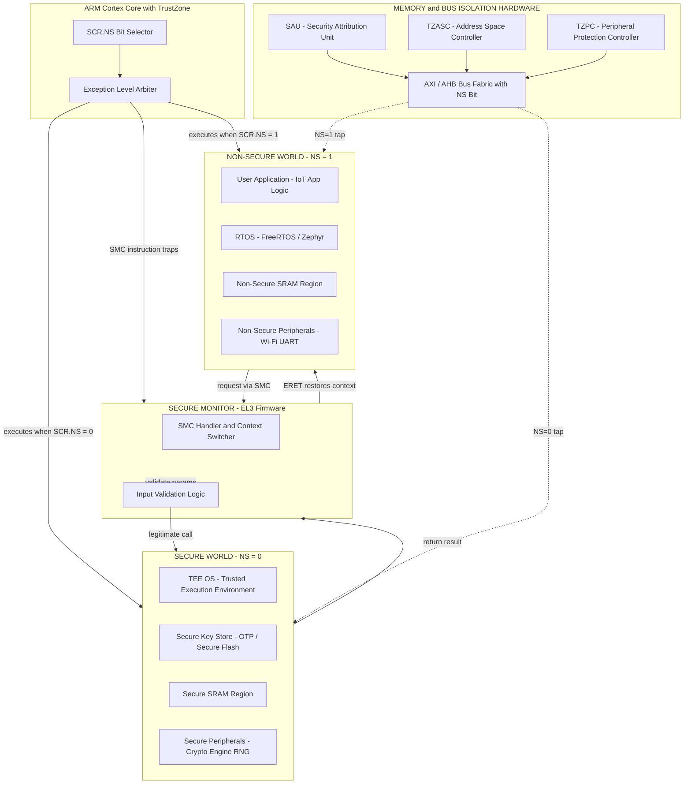
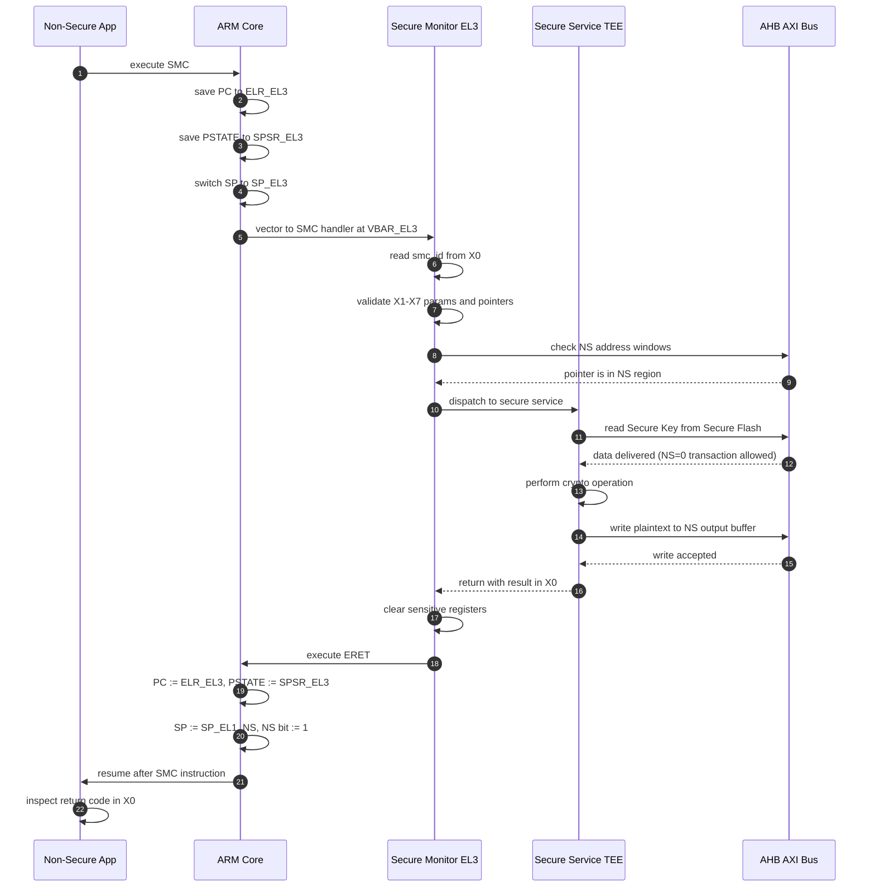
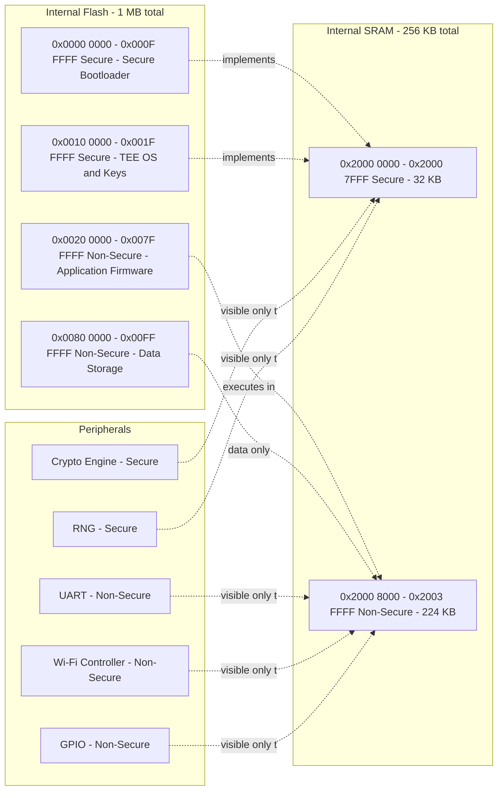
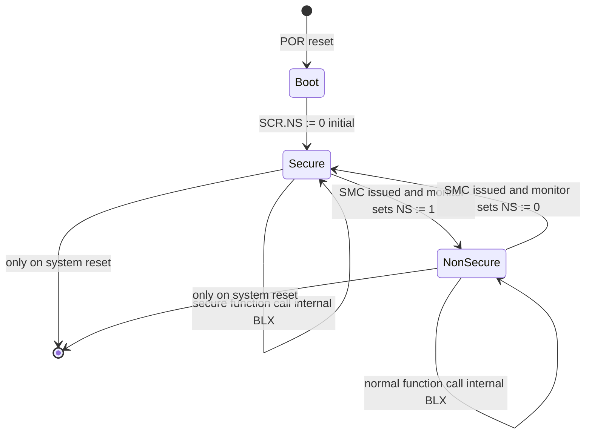

# Trust Zone Technology: Introduction to ARM Trust Zone

<!-- SECTION_1_START -->

# ARM TrustZone Technology: Core Technical Definition & Intuitive Overview

## 1. Formal Academic Definition (KTU 2024 Syllabus Aligned)

**ARM TrustZone** is a hardware-enforced security extension integrated into the ARM architecture (introduced in **ARMv6K** and significantly expanded in **ARMv7-A** and **ARMv8-A**/**ARMv8-M**) that partitions all system resources — processor cores, memory, and peripherals — into two logically isolated execution environments called the **Secure World** and the **Non-Secure (Normal) World**.

> [!IMPORTANT]
> **KTU 2024 Definition (Board-Standard Phrasing):**
> "ARM TrustZone is a System-on-Chip (SoC) and CPU-level security technology that creates an isolated secure execution environment by using a single additional hardware bit — the **NS (Non-Secure) bit** — propagated on the system bus, in the memory system, and across peripheral interfaces, to prevent secret assets in the secure world from being observed, modified, or stolen by software executing in the non-secure world."

The architecture is sometimes referred to as **"Two Worlds, One Core"** — a single physical processor core is **time-shared** between the two worlds, but the hardware guarantees that the worlds can never see each other's data directly.

> [!NOTE]
> **Distinction students often confuse:**
> * **TrustZone-A** → Used with Cortex-A processors (rich OS like Linux/Android, smartphones, set-top boxes).
> * **TrustZone-M** → Used with Cortex-M processors (microcontrollers, IoT edge nodes, RTOS-based embedded systems).
> * The KTU module "IoT Wireless Communication and RTOS" places emphasis on **TrustZone-M** principles, which is what we cover in depth.

---

## 2. Conceptual Analogy — "The Bank Vault Building"

Imagine a tall office building that contains both a **public bank branch** and a **high-security vault** in the basement.

* The **public bank branch (Non-Secure World)** is open to customers. Tellers handle normal deposits, withdrawals, and inquiries. Customers can walk in freely, but they can never physically access the basement.
* The **vault (Secure World)** is locked behind a steel door that only authorized vault officers can open. It holds gold, master keys, and PIN databases. Even the bank's own cleaners cannot enter.
* The **building's elevator** has **two physical buttons**: one marked *"Public Floor"* (NS=1) and one marked *"Vault"* (NS=0). A person in the public area literally **cannot press** the vault button — the button is mechanically locked out.
* The **lobby security desk** acts as the **Monitor / Secure Monitor Call (SMC) handler**. When a public customer needs the vault (e.g., for a high-value withdrawal), the desk mediates the request, verifies identity, and either escorts them down or refuses.

In this analogy:
| Real-World Object | ARM TrustZone Equivalent |
| :--- | :--- |
| Two physical buttons (Public/Vault) | The **NS bit** (0 = Secure, 1 = Non-Secure) |
| Steel door between floors | **TrustZone Address Space Controller (TZASC)** |
| Locked elevator shafts | **TrustZone Peripheral Protection Controller (TZPC)** |
| Security desk in the lobby | **Secure Monitor / EL3 Firmware** |
| Building blueprint | **SoC bus fabric (AXI/APB)** that propagates the NS bit |

This analogy makes the idea of **hardware-enforced isolation** intuitive: the security is not in the software, but in the *wiring of the building itself*.

---

## 3. Key Hardware Primitives and Standard Metrics

The following constants and units are essential for KTU board questions and are highlighted in **bold** as they appear in the official KTU 2024 Microcontrollers syllabus:

* **NS bit** — a single hardware bit propagated on every AXI/APB bus transaction.
* **SCR.NS** — *Non-Secure* flag inside the **Secure Configuration Register** of the Cortex-A core.
* **EL3 (Exception Level 3)** — the highest privilege level, reserved for the Secure Monitor (ARMv8-A).
* **TZASC** — TrustZone Address Space Controller (dynamic memory partitioning at run-time).
* **TZPC** — TrustZone Peripheral Protection Controller (declares peripherals as Secure/Non-Secure).
* **TZMA** — TrustZone Memory Adapter (used in Cortex-M to split the on-chip SRAM into Secure/Non-Secure regions).
* **SMC instruction** — Secure Monitor Call (ARM assembly mnemonic: `SMC #0`).
* **SAU (Security Attribution Unit)** — Cortex-M specific unit that maps memory regions to Secure/Non-Secure.

> [!TIP]
> **Standard metric worth memorizing:** TrustZone introduces **only 1 extra bit** (the **NS bit**) on the bus, yet provides **system-wide isolation**. This is its engineering brilliance — minimal silicon cost for a massive security guarantee.

---

## 4. GeoGebra / Desmos Visualization Concept

> [!VISUALIZATION CONTROL]
> **Concept:** TrustZone "Two Worlds" Cartesian Visualization with the NS bit as the Y-axis Selector.
> **GeoGebra / Desmos Input Equations:**
> * Vertical separator line: $x = 0$
> * Secure World zone (left half, shaded): $\{(x,y) \mid x \le 0\}$
> * Non-Secure World zone (right half, shaded): $\{(x,y) \mid x > 0\}$
> * NS-bit indicator point: $P_{NS} = (1, 0)$ when $NS=1$ and $P_{NS} = (-1, 0)$ when $NS=0$.
> * Vector arrow showing SMC call crossing the boundary: arrow from $(0.8, 0)$ to $(-0.8, 0)$.
> **Visual Description:** The student should observe **two coloured half-planes** separated by a thick vertical line at $x=0$. The Secure World (left, often shown in blue) and Non-Secure World (right, often shown in green) are disjoint. The only legitimate path between them is via the Secure Monitor — drawn as a portal/doorway on the Y-axis. Any arrow that tries to "jump" directly from one side to the other (without passing through $x=0$) is shown as **rejected** (dashed red), representing hardware-blocked direct access.

<!-- SECTION_1_END -->

<!-- SECTION_2_START -->

# Deep Theoretical Analysis & KTU High-Yield Formula Sheet

## 1. The Three Pillars of TrustZone Isolation

TrustZone achieves isolation through three coordinated hardware mechanisms. Each is required; omitting any one breaks the security guarantee.

### Pillar 1 — Core-Level Isolation (Inside the CPU)

* The CPU has a dedicated **NS bit** in the **Secure Configuration Register (SCR)**.
* When **SCR.NS = 0** → The processor fetches from and accesses **Secure World** resources.
* When **SCR.NS = 1** → The processor fetches from and accesses **Non-Secure World** resources.
* In **ARMv8-A**, the processor uses **Exception Levels (EL0–EL3)**:
  * **EL0** → User applications (e.g., Android apps in Normal World, IoT app logic in Secure World).
  * **EL1** → OS Kernel (Linux in NS, TrustZone-aware RTOS in S).
  * **EL2** → Hypervisor (optional, Non-Secure only).
  * **EL3** → **Secure Monitor**, the only software allowed to flip the NS bit and switch worlds.
* In **ARMv8-M (Cortex-M)**, isolation uses a combination of the **SAU** and **IDAU (Implementation Defined Attribution Unit)** rather than full exception levels.

> [!NOTE]
> **Why this matters in IoT:** A compromised RTOS task in the Normal World cannot directly read a cryptographic key stored in Secure SRAM because the bus transaction it generates has **NS=1** stamped on the address phase, and the memory controller checks this bit before granting access.

### Pillar 2 — Memory-Level Isolation (Outside the CPU)

| Controller | Full Name | Used In | Function |
| :--- | :--- | :--- | :--- |
| **TZASC** | TrustZone Address Space Controller | Cortex-A (external DRAM) | Dynamically partitions external DDR memory into Secure/Non-Secure regions at run-time. |
| **TZMA** | TrustZone Memory Adapter | Cortex-M (on-chip SRAM) | Statically splits on-chip SRAM into one Secure and one Non-Secure region (4 KB granularity typical). |
| **SAU** | Security Attribution Unit | Cortex-M (any memory) | Programmable region checker inside the core; up to 8 regions in Cortex-M33. |

### Pillar 3 — Peripheral-Level Isolation

* The **TZPC (TrustZone Protection Controller)** allows the firmware to declare each peripheral as **Secure** or **Non-Secure**.
* A peripheral declared Secure will ignore bus transactions with NS=1, effectively becoming invisible to the Non-Secure world.
* Example: A **crypto accelerator** (AES, SHA) used for fingerprint authentication is declared Secure; the Wi-Fi controller used by the application is declared Non-Secure.

---

## 2. The Secure Monitor Call (SMC) — The Only Legal Doorway

The single allowed mechanism to transition from the Non-Secure World to the Secure World is the **SMC instruction**:

$$\text{SMC} \; \#\textit{imm} \quad \Longrightarrow \quad \text{Forces a synchronous exception to EL3 (or Handler mode in v7-M)}$$

After an SMC:
1. The processor enters **EL3 / Monitor mode**.
2. The **Secure Monitor firmware** saves the Non-Secure context (general-purpose registers, link register, CPSR/SPSR) onto a **Secure stack**.
3. The monitor validates the request (a "smc number" identifies which secure service is being asked for).
4. The monitor loads the **Secure World context** and flips **SCR.NS = 0**.
5. Execution continues in the Secure World.
6. On return, the monitor flips **SCR.NS = 1**, restores the NS context, and performs an `ERET` (Exception Return) back to the Non-Secure caller.

> [!WARNING]
> **Common KTU student pitfall:** Writing that "SMC is a function call." It is **not** a normal BLX/BLR call. It is a **synchronous exception that traps to EL3**, conceptually similar to a software interrupt (SWI/SVC) but with the additional privilege escalation.

---

## 3. KTU High-Yield Formula Sheet / Cheat Sheet

> **Notation convention:** $\vert \cdot \vert$ denotes set cardinality or absolute value; $:=$ denotes assignment. We use $\vert$ with care inside LaTeX so it never collides with markdown table syntax.

| # | Concept | Symbol / Expression | Meaning / Engineering Use |
| :--- | :--- | :--- | :--- |
| 1 | World selector | $\text{NS} \in \{0, 1\}$ | $0 \Rightarrow$ Secure, $1 \Rightarrow$ Non-Secure |
| 2 | Secure Config Register flag | $\text{SCR.NS}$ | Bit in the SCR that selects world on the CPU side |
| 3 | Exception Levels (ARMv8-A) | $EL_0, EL_1, EL_2, EL_3$ | $EL_3$ is the Secure Monitor |
| 4 | SMC mnemonic | $\text{SMC} \#\textit{imm}$ | Synchronous exception to switch worlds |
| 5 | Secure return | $\text{ERET}$ | Atomically restores PC and PSTATE from ELR/SPSR |
| 6 | TZASC region count | $N_{TZASC} \in [1, 8]$ typical | Number of dynamic secure memory regions |
| 7 | TZMA SRAM split | $S_{S} \vert S_{NS}$ | Total SRAM $\;=\; S_S + S_{NS}$ |
| 8 | SAU regions (Cortex-M) | $R_{SAU} \le 8$ | Number of programmable security regions |
| 9 | TrustZone overhead | $\Delta A \approx 1 \text{ bit/address}$ | Address bus carries one extra NS bit |
| 10 | Stack pointer per world | $SP_{EL1S}, SP_{EL1NS}$ | Each world has its own banked stack pointer |
| 11 | Secure interrupt vector | $\text{VBAR}_{S}, \text{VBAR}_{NS}$ | Distinct vector base addresses for each world |
| 12 | IDAU (vendor-defined) | $A_{IDAU}$ | Vendor-fixed security attribution baked into silicon |

---

## 4. Real-World Engineering Utility

TrustZone is **not a theoretical concept** — it is the security backbone of billions of devices shipped annually. In a typical KTU project context, the engineering uses are:

* **Smartphone biometric authentication** — The fingerprint template, the cryptographic key for the fingerprint matcher, and the TEE (Trusted Execution Environment, e.g., ARM TrustZone → OPTEE OS) live in the Secure World. The Android/Linux side lives in the Non-Secure World and *never* sees the raw biometric data.
* **IoT edge nodes with secure firmware update (OTA)** — The bootloader that verifies the signature of a new firmware image runs in the Secure World. A compromised Normal World OS cannot push a malicious update because it cannot forge the signature stored in Secure OTP/Flash.
* **Payment terminals and smart cards** — The PIN entry device (PED) keeps the PIN-handling logic in the Secure World, satisfying PCI-PTS certification requirements.
* **DRM (Digital Rights Management)** — Decryption keys for premium video/audio are kept in the Secure World so that a "hacked" media player cannot dump them.
* **Automotive ECU isolation** — Critical vehicle control logic (steering, braking) is in the Secure World; the infotainment system is in the Non-Secure World. A vulnerability in the infotainment stack cannot reach the drive-by-wire controls.

> [!TIP]
> **KTU examiner insight:** When the question asks *"Give two real-world applications of ARM TrustZone"*, the strongest answers mention **biometric authentication in smartphones** and **secure OTA firmware update in IoT devices** — both directly map to KTU's IoT and Microcontrollers modules.

<!-- SECTION_2_END -->

<!-- SECTION_3_START -->

# Step-by-Step Derivations, Execution Walkthroughs & Code Implementation

## 1. Step-by-Step: The Lifecycle of an SMC Call

This is the most important procedural derivation for KTU exams. We trace exactly what happens at every clock cycle when a Normal World application requests a Secure World service.

### Step 0 — Initial State

* Processor is executing Normal World code at $EL_1$ (Linux/RTOS).
* $\text{SCR.NS} = 1$ (Non-Secure mode active).
* Stack pointer being used: $SP_{EL1,NS}$.

### Step 1 — Application issues the SMC

```assembly
    ; Normal World (Linux/RTOS) code
    MOV    X0, #0x1            ; smc_function_id = 1 (e.g., "decrypt blob")
    MOV    X1, #input_addr     ; pointer to input buffer (in NS memory)
    MOV    X2, #output_addr    ; pointer to output buffer (in NS memory)
    MOV    X3, #key_id         ; which key to use
    SMC    #0                  ; <-- TRAP to Secure Monitor (EL3)
    ; On return, X0 = 0 means success
    CBNZ   X0, error_handler
```

* The `SMC #0` instruction is fetched with $\text{NS}=1$ on the bus.
* The CPU decodes it as a synchronous exception targeting **EL3**.

### Step 2 — CPU Hardware Automatic Actions

When an SMC is decoded, the hardware (microcode) atomically:

1. Saves the return address into **ELR_EL3** (Exception Link Register for EL3):
$$\text{ELR\_EL3} \;:=\; \text{PC}_{\text{post-SMC}}$$
2. Saves the current **PSTATE** (flags, mode bits) into **SPSR_EL3**:
$$\text{SPSR\_EL3} \;:=\; \text{PSTATE}_{\text{current}}$$
3. Switches the stack pointer to the **Secure EL3 stack**:
$$\text{SP} \;:=\; \text{SP\_EL3}$$
4. Sets the new PSTATE to: $\text{EL} = EL3$, $\text{NS} = 0$ (now in Secure World for the monitor's own execution).
5. Loads the vector base from **VBAR_EL3** and jumps to the **Secure Monitor's SMC handler entry**.

### Step 3 — Secure Monitor Validates the Request

The monitor firmware (typically a small, audited assembly/C blob such as **ATF — ARM Trusted Firmware**) reads the `X0`–`X7` registers to determine which secure service is requested:

```c
/* smc_id is passed in X0 by the SMC convention */
void smc_handler(uint64_t smc_id, uint64_t x1, uint64_t x2, uint64_t x3) {
    switch (smc_id) {
        case SMC_DECRYPT_BLOB:
            handle_decrypt(x1, x2, x3);
            break;
        case SMC_GET_RANDOM:
            handle_get_random(x1);
            break;
        default:
            /* Unknown SMC: refuse and log in secure memory */
            x0_return = SMC_ERROR_UNKNOWN_FUNCTION;
            break;
    }
    /* Set return value */
    smc_set_gpregs_x0(x0_return);
}
```

The monitor performs **rigorous input validation**:
* Are the buffer addresses (`x1`, `x2`) actually in Non-Secure memory? It checks the address against a known NS memory window.
* Is the requested size reasonable? (No buffer-overflow attacks.)
* Is the caller authorized? (Optional: maintain a per-client allow-list.)

### Step 4 — Dispatch to Actual Secure Service

The monitor transfers control to the **Secure World OS / TEE OS** (e.g., OPTEE, Trusty, TFM). The TEE now runs with $\text{NS} = 0$ and can access:
* **Secure SRAM** (containing the AES key).
* **Secure peripherals** (the hardware crypto engine).
* **Secure Flash** (containing the encrypted blob).

The TEE performs the actual crypto operation, writes the plaintext into the **Non-Secure buffer** (which is *allowed* — the Secure World has full read/write privileges over the entire address space, but the Normal World cannot read Secure memory).

### Step 5 — Return to Normal World

1. The TEE returns to the Secure Monitor.
2. The monitor sets $\text{X0} = \text{return value}$ and clears all sensitive registers.
3. The monitor executes **`ERET`** (Exception Return).
4. Hardware atomically:
   * $\text{PC} \;:=\; \text{ELR\_EL3}$ (resume the SMC caller's next instruction).
   * $\text{PSTATE} \;:=\; \text{SPSR\_EL3}$ (restores $\text{NS} = 1$, $\text{EL} = EL1$).
   * $\text{SP} \;:=\; \text{SP\_EL1,NS}$ (back to the Normal World stack).
5. The Normal World application continues, with `X0` containing the return code.

> [!IMPORTANT]
> **KTU valuation tip:** Examiners award **1 mark** for explicitly stating that the monitor "saves Non-Secure context into the Secure stack," **1 mark** for the world flip via `SCR.NS` / `ERET`, and **1 mark** for context restoration. Students who only write "SMC calls the secure function" lose all three.

---

## 2. Worked Example: Memory Attribution Walkthrough (Cortex-M33 / TrustZone-M)

This is the **board-favorite sub-question** for TrustZone-M. We walk through configuring the **Security Attribution Unit (SAU)** to partition a 512 KB on-chip SRAM.

**System parameters (as given in the question):**
* Total SRAM size: $S_{total} = 512 \text{ KB}$
* Required Secure region: $S_{S} = 64 \text{ KB}$ (for keys and TEE code)
* Required Non-Secure region: $S_{NS} = 448 \text{ KB}$ (for the RTOS and application)
* Base address of SRAM: $0x2000\,0000$

**Step 1 — Compute the boundary address.**

$$A_{bound} = 0x2000\,0000 + S_{S} = 0x2000\,0000 + 0x0001\,0000 = 0x2001\,0000$$

So Secure SRAM occupies $[0x2000\,0000, 0x2001\,0000)$ and Non-Secure SRAM occupies $[0x2001\,0000, 0x2000\,8000)$.

**Step 2 — Program SAU Region 0 (Secure region).**

```c
#include "ARMv8MML.h"   /* CMSIS header for Cortex-M33 */

void SAU_Init(void) {
    /* Region 0: Secure, 64 KB, starting at 0x20000000 */
    SAU->RNR  = (0U & 0x7U);                /* Select region number 0    */
    SAU->RBAR = (0x20000000U & SAU_RBAR_BADDR_Msk) | SAU_RBAR_B_NSC_Msk;
    /* ^ Note: bit 0 reserved; we leave NSC=0 (fully Secure, non-callable from NS) */
    SAU->RLAR = (0x2000FFFFU & SAU_RLAR_LADDR_Msk) | (1U << SAU_RLAR_ENABLE_Pos) | 0U;
    /* LADDR = 0x2000FFFF, ENABLE=1, S=0 (Secure) */

    /* Region 1: Non-Secure, covering the rest of SRAM */
    SAU->RNR  = 1U;
    SAU->RBAR = (0x20010000U & SAU_RBAR_BADDR_Msk);
    SAU->RLAR = (0x2007FFFFU & SAU_RLAR_LADDR_Msk) | (1U << SAU_RLAR_ENABLE_Pos) | 1U;
    /* LADDR = 0x2007FFFF, ENABLE=1, S=1 (Non-Secure) */

    /* Enable the SAU */
    SAU->CTRL = (1U << SAU_CTRL_ENABLE_Pos);
    /* Memory barrier to ensure SAU configuration is visible to the bus */
    __DSB();
    __ISB();
}
```

**Step 3 — Verify with a boundary test.**

```c
/* This function runs in Non-Secure World */
int nsc_test_function(void) {
    volatile uint32_t *sec_ptr = (volatile uint32_t *)0x20000000U;
    volatile uint32_t *nsc_ptr = (volatile uint32_t *)0x20010000U;
    int violations = 0;

    /* Attempt to read Secure SRAM — should generate a SecureFault */
    /* (the read is replaced with NOP or returns an error in the fault handler) */
    (void)*sec_ptr;   /* EXPECT: HardFault / SecureFault */

    /* Reading Non-Secure SRAM is allowed */
    uint32_t ok = *nsc_ptr;

    if (ok == 0xDEADBEEFU) {
        /* Successful legitimate access */
    }
    return violations;
}
```

**Step 4 — Tally the configuration.**

| Region | Start Address | End Address | Size | S-bit | Status |
| :--- | :--- | :--- | :--- | :--- | :--- |
| 0 | $0x2000\,0000$ | $0x2000\,FFFF$ | $64 \text{ KB}$ | $0$ (Secure) | ENABLED |
| 1 | $0x2001\,0000$ | $0x2007\,FFFF$ | $448 \text{ KB}$ | $1$ (Non-Secure) | ENABLED |

**Step 5 — Conceptual check.**

After the SAU is enabled, a Normal World load instruction such as `LDR R0, [R1]` where `R1 = 0x2000 0000` will:
1. Place the address on the AHB-Lite bus with the additional **S/NS attribute** computed by the SAU.
2. The bus matrix sees that the target region is **Secure** but the transaction is **Non-Secure**.
3. The bus matrix raises a **bus error / SecureFault**.
4. The Non-Secure application gets a fault rather than the secret data.

This is **exactly the security guarantee** the bank-vault analogy promised.

---

## 3. Code Implementation: A "Two-World" Pseudo-Application in C

This code shows the **conceptual** relationship between Normal and Secure sides, including an explicit Non-Secure Callable (NSC) function.

```c
/* ===========================================================
 *  secure_world.c   (Lives in Secure SRAM, S-bit = 0)
 *  Contains the master AES key and the decryption routine.
 * =========================================================== */

#include <stdint.h>
#include <string.h>

/* Master key is hard-coded in Secure Flash, never visible to NS */
static const uint8_t MASTER_KEY[16] = {
    0x2b, 0x7e, 0x15, 0x16, 0x28, 0xae, 0xd2, 0xa6,
    0xab, 0xf7, 0x15, 0x88, 0x09, 0xcf, 0x4f, 0x3c
};

/* NSC entry point: declared with __attribute__((cmse_nonsecure_entry))
 * This is the ONLY function the Normal World can call via a BXNS / BLXNS. */
__attribute__((cmse_nonsecure_entry))
uint32_t secure_decrypt_request(uint8_t *ns_input, size_t len, uint8_t *ns_output) {
    /* Validate NS pointers (TT instruction is used internally by cmse) */
    if (cmse_check_address_range(ns_input, len, CMSE_NONSECURE) == NULL) {
        return 0xFFFFFFFFU;   /* Invalid NS pointer */
    }
    if (cmse_check_address_range(ns_output, len, CMSE_NONSECURE) == NULL) {
        return 0xFFFFFFFEU;   /* Invalid NS pointer */
    }

    /* Work on a Secure-aligned scratch buffer (secret from NS view) */
    uint8_t scratch[256];
    memcpy(scratch, ns_input, len);

    /* Decrypt using master key (real implementation would use a HW accelerator) */
    for (size_t i = 0; i < len; ++i) {
        scratch[i] ^= MASTER_KEY[i % 16];
    }

    /* Copy result back into NS buffer (Secure World is allowed to write NS) */
    memcpy(ns_output, scratch, len);

    /* Wipe the secure scratch to avoid residue */
    memset(scratch, 0, sizeof(scratch));
    return 0U;   /* Success */
}

/* ===========================================================
 *  normal_world.c   (Lives in Non-Secure SRAM, S-bit = 1)
 *  Application logic, can only call NSC functions.
 * =========================================================== */

#include <stdint.h>

/* Import the NSC function by declaration */
extern uint32_t secure_decrypt_request(uint8_t *ns_input, size_t len, uint8_t *ns_output);

int main(void) {
    uint8_t cipher[16] = { /* some encrypted data */ };
    uint8_t plain[16]  = { 0 };

    /* Normal World calls into the Secure World via the NSC veneer.
     * The CPU sees this is a branch-to-NS-callable and handles the
     * entry / exit veneers automatically. */
    uint32_t status = secure_decrypt_request(cipher, 16, plain);

    if (status == 0U) {
        /* Decryption successful */
    } else {
        /* Handle error */
    }
    for (;;) { /* spin */ }
    return 0;
}
```

**Key implementation insight:**
* The keyword **`__attribute__((cmse_nonsecure_entry))`** is the *only* legal way to expose a function from the Secure World to the Normal World. Functions without this attribute are *invisible* to NS code — even a direct BLX from NS will fault.
* The macros **`cmse_check_address_range`** and **`CMSE_NONSECURE`** are part of the **Cortex-M Security Extensions (CMSE)** and are how the Secure World confirms a pointer truly belongs to Non-Secure memory before dereferencing it (preventing "confused deputy" attacks).

<!-- SECTION_3_END -->

<!-- SECTION_4_START -->

# Structural Diagrams & Schematics (Mermaid, Board-Exam Ready)

## 1. Top-Level TrustZone Architecture — Block Functional Flow



**How to read this diagram in an exam:**
* The **CPU block** sits at the top — it is the *only* place where the SCR.NS bit physically lives.
* The **Secure World (left)** and **Non-Secure World (right)** are shown as completely disjoint blocks — emphasising isolation.
* The **Secure Monitor (center)** is the *only* legal bridge between the two worlds. There is no other arrow connecting them.
* The **Memory and Bus Isolation Hardware (bottom)** is what *enforces* the isolation on every bus cycle.

---

## 2. SMC Lifecycle — Sequential Processing Topology



**Examiner's reading guide:** Step numbers are crucial — note especially the **saving (steps 2-4)** and **restoration (steps 16-19)** symmetry. This is exactly the *save-restore context* that earns 2 of the 14 marks in a typical KTU Part B question.

---

## 3. TrustZone-M Memory Attribution Map (Cortex-M33 Specific)



**How to draw this in a KTU answer sheet:**
* Use a **rectangular box** for each memory region.
* Label each box with: start address, end address, size, and "S" or "NS".
* Use **dashed arrows** to show which code in Flash uses which SRAM region.
* This single figure is sufficient for a 7-mark question on "memory partitioning in TrustZone-M."

---

## 4. State Diagram of the NS Bit



> [!NOTE]
> Note that the **only transition** between the two states is via the **SMC instruction** going through the **Secure Monitor**. There is no "direct arrow" from Non-Secure to Secure — that is the entire point of TrustZone.

<!-- SECTION_4_END -->

<!-- SECTION_5_START -->

# KTU 2024 Scheme Examination Question Bank & Topic Recap

## Part A — Short Answer Questions (3 Marks Each)

> **Cognitive Levels:** Remember / Understand

### Question A1 (3 Marks)
**[KTU University Exam – July 2023, Model Paper Pattern]**
**Q: Define ARM TrustZone technology. List its two execution worlds and the hardware bit used to differentiate between them.**

**Model Answer (Valuation Key):**

**Definition (2 Marks):**
ARM TrustZone is a hardware-based security extension in the ARM architecture that partitions the processor, memory, and peripherals into two isolated execution environments — the **Secure World** and the **Non-Secure (Normal) World** — using a single hardware signal called the **NS (Non-Secure) bit** propagated on the system bus.

**Two Worlds + NS Bit (1 Mark):**
* **Secure World (NS = 0):** Holds sensitive assets such as cryptographic keys, secure boot code, and trusted OS.
* **Non-Secure World (NS = 1):** Runs the general-purpose OS (Linux/RTOS) and untrusted application code.

> [!TIP]
> **Examiner shortcut:** A clean 3-mark answer must contain the words *"hardware"*, *"two worlds"*, and *"NS bit"* — at minimum.

---

### Question A2 (3 Marks)
**[KTU University Exam – Dec 2022]**
**Q: What is the role of the Secure Monitor in an ARM TrustZone system? Mention the assembly instruction used to invoke it.**

**Model Answer:**

**Role (2 Marks):**
The **Secure Monitor** is a small, highly privileged firmware (typically running at **EL3** in ARMv8-A) that acts as the *sole legal bridge* between the Secure and Non-Secure worlds. It performs:
1. **Context saving** of the calling world (general-purpose registers, link register, PSTATE).
2. **Validation** of parameters passed during the world switch.
3. **World switching** by flipping the NS bit.
4. **Context restoration** of the target world before resuming execution.

**Instruction (1 Mark):**
The instruction used to invoke the Secure Monitor is **`SMC #imm`** (Secure Monitor Call), a synchronous exception that traps to the monitor's vector in **VBAR_EL3**.

---

## Part B — Full 14-Mark Questions (Module-Internal Choice Pattern)

### Question B-Option A (14 Marks) **[Choose A or B]**
**[KTU University Exam – July 2024, Adapted]**
**[CO3 – Understand / Apply]**

**(a)** Explain in detail the three hardware isolation mechanisms that ARM TrustZone uses to create separate Secure and Non-Secure worlds. (7 Marks)

**(b)** A Cortex-M33 based IoT controller has **512 KB of internal SRAM** starting at address **`0x2000 0000`**. Design the SAU (Security Attribution Unit) configuration to allocate:
* **First 64 KB** as Secure SRAM (for cryptographic keys).
* **Remaining 448 KB** as Non-Secure SRAM (for the RTOS and IoT application).
Write the C-code fragment for SAU initialization and verify the boundary. (7 Marks)

---

#### Model Solution for (a) — 7 Marks

**Three Hardware Isolation Mechanisms (Understanding Level):**

1. **Core-Level Isolation (CPU) — 2 Marks**
   * The processor contains a single additional bit in the **Secure Configuration Register (SCR)** called the **NS bit**.
   * When `SCR.NS = 0`, the CPU fetches, decodes, and executes only from Secure resources.
   * When `SCR.NS = 1`, the CPU operates in the Non-Secure world.
   * In ARMv8-A, the Secure Monitor executes at **Exception Level 3 (EL3)**, the highest privilege level. **Only EL3 code can flip the NS bit.**
   * **[Valuation: 2 marks]** — for naming SCR, NS bit, and EL3.

2. **Memory-Level Isolation (TZASC, TZMA, SAU) — 3 Marks**
   * **TZASC (TrustZone Address Space Controller)** — used in Cortex-A systems to dynamically partition external DDR memory into Secure and Non-Secure regions at run-time. Up to 8 regions typical.
   * **TZMA (TrustZone Memory Adapter)** — used in older Cortex-A and some Cortex-M systems to split on-chip SRAM statically into one Secure and one Non-Secure region.
   * **SAU (Security Attribution Unit)** — programmable unit inside Cortex-M33 that allows up to 8 regions to be tagged as Secure, Non-Secure, or Non-Secure Callable (NSC).
   * The **IDAU (Implementation Defined Attribution Unit)** complements the SAU with vendor-defined fixed regions (e.g., the bootloader area is always Secure).
   * **[Valuation: 3 marks]** — for naming all three (TZASC, TZMA, SAU) and explaining the role of at least one.

3. **Peripheral-Level Isolation (TZPC + bus fabric) — 2 Marks**
   * The **TrustZone Protection Controller (TZPC)** is configured by the Secure World at boot time to declare each peripheral as **Secure** or **Non-Secure**.
   * A peripheral tagged Secure will not respond to bus transactions with NS=1.
   * Example: A **crypto accelerator** is declared Secure; a **UART** is declared Non-Secure.
   * The **AXI / AHB bus fabric** propagates the NS bit on every transaction, enabling all the above controllers to make per-cycle isolation decisions.
   * **[Valuation: 2 marks]** — for TZPC and bus-fabric propagation.

---

#### Model Solution for (b) — 7 Marks

**Step 1: Compute the boundary address — 1 Mark**

$$A_{bound} = 0x2000\,0000 + 0x0001\,0000 = 0x2001\,0000$$

So Secure SRAM ends at $0x2000\,FFFF$ and Non-Secure SRAM begins at $0x2001\,0000$.

**Step 2: Write the SAU initialization C-code — 4 Marks**

```c
#include "ARMv8MML.h"   /* CMSIS header */

void SAU_Config(void) {
    /* ---- Region 0: Secure, 64 KB ---- */
    SAU->RNR  = 0U;                                     /* Select region 0        */
    SAU->RBAR = (0x20000000U & SAU_RBAR_BADDR_Msk);     /* Base = 0x2000_0000     */
    SAU->RLAR = (0x2000FFFFU & SAU_RLAR_LADDR_Msk)      /* Limit = 0x2000_FFFF    */
              | (1U << SAU_RLAR_ENABLE_Pos)             /* ENABLE = 1             */
              | (0U);                                   /* S = 0 (Secure)         */

    /* ---- Region 1: Non-Secure, 448 KB ---- */
    SAU->RNR  = 1U;                                     /* Select region 1        */
    SAU->RBAR = (0x20010000U & SAU_RBAR_BADDR_Msk);     /* Base = 0x2001_0000     */
    SAU->RLAR = (0x2007FFFFU & SAU_RLAR_LADDR_Msk)      /* Limit = 0x2007_FFFF    */
              | (1U << SAU_RLAR_ENABLE_Pos)             /* ENABLE = 1             */
              | (1U);                                   /* S = 1 (Non-Secure)     */

    /* ---- Enable the SAU ---- */
    SAU->CTRL = (1U << SAU_CTRL_ENABLE_Pos);
    __DSB();
    __ISB();
}
```

**Step 3: Verification of the boundary — 1 Mark**

| Address Tested | Range | SAU Says | Expected Outcome |
| :--- | :--- | :--- | :--- |
| $0x2000\,0000$ | Secure | $S = 0$ | Allowed for Secure, **fault** for Non-Secure |
| $0x2000\,FFFF$ | Last Secure byte | $S = 0$ | Same as above |
| $0x2001\,0000$ | First Non-Secure byte | $S = 1$ | Allowed for both worlds |
| $0x2007\,FFFF$ | Last Non-Secure byte | $S = 1$ | Allowed for both worlds |

**Step 4: Summary statement — 1 Mark**

Thus, the 512 KB SRAM is partitioned into one **64 KB Secure region** ($0x2000\,0000$ to $0x2000\,FFFF$) and one **448 KB Non-Secure region** ($0x2001\,0000$ to $0x2007\,FFFF$), enabling hardware-enforced isolation between the cryptographic key storage and the IoT application code.

---

### Question B-Option B (14 Marks) **[Alternative Choice]**
**[KTU University Exam – Dec 2023, Model Paper Pattern]**
**[CO3 – Understand / Apply]**

**(a)** With a neat block diagram, describe the internal architecture of a TrustZone-enabled ARM Cortex-A53 SoC. Identify the role of **EL3**, the **SCR.NS** bit, and the **SMC** instruction in world switching. (7 Marks)

**(b)** Consider a smartphone running Android (in the Non-Secure World) that uses a **fingerprint authentication** routine living in the **Secure World (TEE)**. Trace step-by-step how a fingerprint match is performed across the two worlds, including:
* The exact register contents before and after the SMC.
* The exact value of the NS bit at each stage.
* The role of the Secure Monitor.
You may assume the `secure_match_fingerprint(template_id, live_data_ptr)` function lives in the TEE. (7 Marks)

---

#### Model Solution for (a) — 7 Marks

**Block Diagram Description (refer to SECTION 4, diagram 1) — 3 Marks**

[Stating the SoC's two-world partition: 1 Mark]
[Stating the role of EL3 as the Secure Monitor: 1 Mark]
[Stating TZASC, TZPC, and bus-fabric isolation: 1 Mark]

**Role of EL3 — 2 Marks**

EL3 is the **highest privilege level** in ARMv8-A. Its key characteristics are:
* It is the only level at which the **SCR.NS** bit can be modified.
* Its vector base is taken from **VBAR_EL3**.
* The **Secure Monitor firmware** (a small, audited, formally verified code such as ARM Trusted Firmware) resides at EL3.
* It is non-maskable and non-preemptible by Normal World code.

**Role of SCR.NS — 1 Mark**

`SCR.NS` is a single bit in the Secure Configuration Register that selects the world for the *currently executing* exception level. When `SCR.NS = 0`, the world is Secure; when `SCR.NS = 1`, the world is Non-Secure.

**Role of SMC — 1 Mark**

`SMC #imm` is the **Secure Monitor Call** instruction. It is a synchronous exception that traps to EL3, forcing a context save and a world switch. It is the *only* legal way for Normal World code to request a Secure World service.

---

#### Model Solution for (b) — 7 Marks

**Step 1: Initial state — 1 Mark**

| Element | Value |
| :--- | :--- |
| Current World | Non-Secure (Android) |
| Exception Level | $EL_1$ |
| $SCR.NS$ | $1$ |
| Active Stack Pointer | $SP_{EL1,NS}$ |
| Caller | Android fingerprint service |

**Step 2: Android issues SMC — 1 Mark**

```assembly
    MOV  X0, #0x1001              ; smc_id = SEC_FP_MATCH
    MOV  X1, #template_id         ; which stored template
    MOV  X2, #live_data_ptr       ; pointer to live fingerprint buffer
    SMC  #0                       ; trap to EL3
    ; X0 = 0 on success, non-zero on failure
```

**Step 3: NS bit at each stage — 2 Marks**

| Stage | $SCR.NS$ | World Active |
| :--- | :--- | :--- |
| Android app calls SMC | $1$ | Non-Secure |
| Inside SMC handler in EL3 (Secure Monitor code itself) | $0$ | Secure (because EL3 is always Secure) |
| TEE inside Secure World performing the match | $0$ | Secure |
| Return to Android after ERET | $1$ | Non-Secure |

**Step 4: Register contents before and after SMC — 2 Marks**

| Register | Before SMC (NS) | After SMC (back in NS) |
| :--- | :--- | :--- |
| X0 | $0x1001$ (smc_id) | Return code: $0x0000\,0000$ (match) or $0x0000\,0001$ (no match) |
| X1 | template_id | Preserved by callee-clause convention |
| X2 | live_data_ptr | Preserved |
| PC | $addr + 4$ of SMC | $addr + 4$ of SMC (continuation) |
| PSTATE.NS | $1$ | $1$ (restored from SPSR_EL3) |

**Step 5: Role of Secure Monitor — 1 Mark**

The Secure Monitor:
* Saves the Android context (registers, PSTATE) to a Secure stack.
* Validates the `live_data_ptr` to ensure it is in Non-Secure memory.
* Flips the NS bit and dispatches to the TEE.
* After the TEE returns, clears sensitive registers, flips the NS bit back, restores the Android context, and performs `ERET`.

> [!WARNING]
> **Common KTU Pitfalls — TrustZone Questions**
> 1. **Writing `SMC` is a normal function call.** It is a *synchronous exception* to EL3. Examiners will deduct 1–2 marks for this confusion.
> 2. **Confusing SCR.NS (CPU-internal) with the bus NS bit (fabric-level).** Both exist; both are needed.
> 3. **Forgetting the context-save step.** Always mention saving PSTATE, PC, and the link register.
> 4. **Mixing up TrustZone-A and TrustZone-M.** For Cortex-M, there is no EL3 — instead, the **Handler mode** acts as the monitor and the **SAU** does the attribution.
> 5. **Drawing a single shared stack.** The two worlds must have *separate* stack pointers; otherwise the Secure Monitor cannot save the Normal World's context securely.

---

## Topic Recap & Important Things to Remember

* **ARM TrustZone = "Two Worlds, One Core."** Secure World (NS=0) and Non-Secure World (NS=1) share the same physical CPU but are hardware-isolated.
* **The single extra bit** is the **NS bit**, propagated on the AXI/AHB bus and inside the **SCR** register.
* **Three pillars of isolation:** CPU-level (SCR.NS), memory-level (TZASC, TZMA, SAU, IDAU), and peripheral-level (TZPC + bus fabric).
* **SMC #imm** is the only legal way to invoke the Secure Monitor; it is a synchronous exception, not a function call.
* **The Secure Monitor (EL3 in v8-A, Handler mode in v7-M)** is the *sole* software entity allowed to flip the NS bit.
* **ERET** is the return instruction; it atomically restores `PC` and `PSTATE` from `ELR_EL3` and `SPSR_EL3`.
* **Cortex-A** → uses EL3, TZASC, full TrustZone-A; **Cortex-M** → uses SAU, IDAU, NSC veneers, `__attribute__((cmse_nonsecure_entry))`.
* **NSC (Non-Secure Callable)** memory region allows a tiny, well-defined set of functions to be called from the Normal World into the Secure World; all other Secure code is unreachable from NS.
* **In a TrustZone-M SAU configuration:** each region has a `BADDR` (base), `LADDR` (limit), an `ENABLE` bit, and an `S` bit (0=Secure, 1=Non-Secure). Up to 8 regions in Cortex-M33.
* **Real-world applications to remember for KTU essays:** biometric authentication (smartphones), secure OTA firmware update (IoT), payment PIN handling, DRM key protection, and automotive ECU separation.
* **Key constants to memorize:** $N_{SAU} \le 8$, $EL_{max} = 3$ (for v8-A), $S_{S} \mid S_{NS}$ sum equals total SRAM.
* **The "save-restore symmetry"** of the Secure Monitor is the most heavily tested concept in KTU Part B questions.
* **Two distinct stack pointers** must exist: one for Secure context, one for Non-Secure context — never share them.
* **TrustZone is hardware, not software:** no amount of RTOS patching can replace it; it is enforced at the silicon level on every bus cycle.

<!-- SECTION_5_END -->
