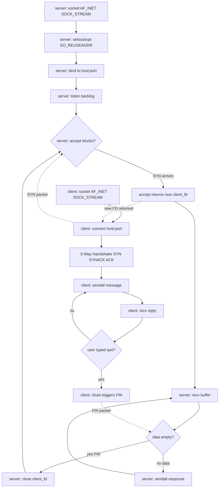
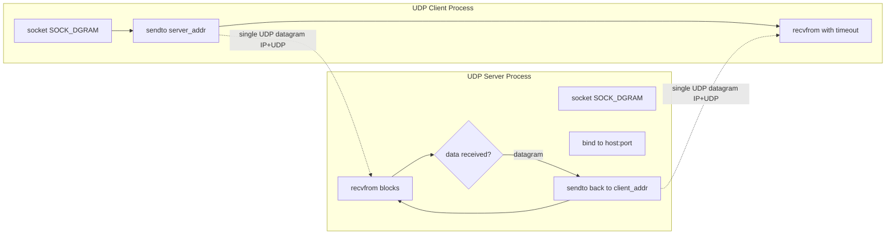

# Client-Server message exchange using primitive TCP/UDP socket calls

<!-- SECTION_1_START -->

# 1. Core Technical Definition & Intuitive Overview

## 1.1 Formal Academic Definition (KTU 2024 Syllabus Terminology)

A **Network Socket** is the **Application Programming Interface (API) endpoint** of a bidirectional inter-process communication flow across a computer network. In the KTU 2024 *Computer Networks Lab* syllabus, sockets are classified into two transport-layer families implemented through the Berkeley Sockets API (POSIX standard):

- **TCP (Transmission Control Protocol) Socket** — A *connection-oriented*, reliable, byte-stream socket using `SOCK_STREAM` over `AF_INET`. Guarantees ordered, error-checked, congestion-controlled delivery via the **three-way handshake** (SYN → SYN-ACK → ACK).
- **UDP (User Datagram Protocol) Socket** — A *connectionless*, unreliable, message-oriented socket using `SOCK_DGRAM` over `AF_INET`. Provides best-effort delivery with no handshake, no retransmission, and no ordering guarantees.

A **Client-Server message exchange** is the canonical distributed-systems architecture in which a *server* process binds to a well-known **port number** and passively awaits incoming requests, while a *client* process actively initiates communication by sending the first segment.

> [!IMPORTANT]
> **Syllabus Highlight (PCCSL504 – Module 1):** Students must be able to *write, compile, and execute* primitive socket programs using raw C/Python `socket()` system calls, observe packet behavior using `tcpdump`/`Wireshark`, and capture/inspect the three-way handshake, FIN teardown, and UDP datagrams.

## 1.2 Conceptual Analogy — Making It Click

> [!NOTE]
> **Intuition Box: TCP vs UDP in Real Life**
>
> - **TCP = A Registered Postal Letter with Tracking**
>   You write a letter, hand it to the post office, and they give you a tracking number. They guarantee delivery, the letters arrive in order, and if one is lost, they re-send it. You must first confirm the recipient's address exists (3-way handshake) before sending the actual content. Establishing the "conversation" is overhead, but the message gets through safely.
>
> - **UDP = Shouting Across a Crowded Room**
>   You just shout a message. Maybe the other person hears it, maybe they don't. Maybe someone else heard it. The order doesn't matter. There's no setup, no acknowledgment, no error recovery — but it is **fast** and lightweight. Perfect for live scores, video frames, or DNS lookups where a stale retry is worse than a lost packet.

### Visualizing the Transport-Layer Decision Axis

> [!VISUALIZATION CONTROL]
> **Concept:** Reliability vs. Latency Trade-off on a 2D Axis
> **Desmos Input Equations:**
> * `x-axis (latency): t \in [0, 100]`
> * `TCP\_curve: y = 10 + 0.05 \cdot t^{2}` (quadratic handshake cost)
> * `UDP\_curve: y = 2 + 0.01 \cdot t` (linear, near-flat)
> * `Reliability\_line: y = 99.9` for TCP, `y = 70` for UDP
>
> **Visual Description:** Plot two curves on the same axes. The TCP curve starts higher (handshake overhead) and rises steeply. The UDP curve stays low and flat. Students will visually understand that TCP trades latency for reliability, while UDP trades reliability for speed.

## 1.3 Physical Constants, Standards & Reserved Identifiers

| Constant / Identifier | Value / Meaning |
|---|---|
| **`AF_INET`** | **Address Family — IPv4** (value = 2) |
| **`SOCK_STREAM`** | **TCP socket type** (value = 1) — sequenced, reliable, two-way byte stream |
| **`SOCK_DGRAM`** | **UDP socket type** (value = 2) — connectionless, unreliable datagrams |
| **`htons(port)`** | **Host-to-Network Short** — converts endianness (e.g., 8080 → big-endian for wire) |
| **`INADDR_ANY`** | **0.0.0.0** — server binds to all local network interfaces |
| **Maximum TCP Payload** | **65,495 bytes** (64 KB minus headers) |
| **Maximum UDP Datagram** | **65,507 bytes** (65,535 minus 8-byte UDP header) |
| **Well-Known Port Range** | **0 – 1023** (requires root/admin to bind) |
| **Registered Ports** | **1024 – 49151** (assigned by IANA) |
| **Ephemeral / Dynamic Ports** | **49152 – 65535** (assigned by OS to clients) |

<!-- SECTION_1_END -->

<!-- SECTION_2_START -->

# 2. Deep Theoretical Analysis & KTU High-Yield Formula Sheet

## 2.1 The Berkeley Sockets API — The 5-Primitive Lifecycle

Every network program in C or Python follows a deterministic sequence of **system calls** (primitives). The KTU lab expects students to reproduce these from memory.

### 2.1.1 TCP Server (Passive Opener) — 7 Primitives
1. `socket(AF_INET, SOCK_STREAM, 0)` — Create the file descriptor (FD).
2. `setsockopt(SOL_SOCKET, SO_REUSEADDR, ...)` — Prevent "Address already in use" on rapid restart.
3. `bind(sock_fd, (IP, port))` — Attach to a local **port** on an interface.
4. `listen(sock_fd, backlog)` — Mark the socket as **passive**; backlog = maximum queued connections.
5. `accept(sock_fd, ...)` — **Block** until a client SYN arrives; return a *new* FD dedicated to that client.
6. `recv(new_fd, buffer, size, 0)` / `send(new_fd, data, len, 0)` — Read/Write byte streams.
7. `close(new_fd)` then `close(sock_fd)` — Tear down the connection, then the listener.

### 2.1.2 TCP Client (Active Opener) — 5 Primitives
1. `socket(AF_INET, SOCK_STREAM, 0)` — Create the FD.
2. `connect(sock_fd, (server_ip, server_port))` — **Initiate the 3-way handshake** (SYN).
3. `send(sock_fd, data, len, 0)` — Push bytes into the kernel's TX buffer.
4. `recv(sock_fd, buffer, size, 0)` — Pull bytes from the kernel's RX buffer.
5. `close(sock_fd)` — Send **FIN**, complete the 4-way teardown.

### 2.1.3 UDP Server — 5 Primitives
1. `socket(AF_INET, SOCK_DGRAM, 0)` — Create the FD (no SOCK_STREAM!).
2. `bind(sock_fd, (IP, port))` — Bind to a port (no `listen`, no `accept`).
3. `recvfrom(sock_fd, buf, size, 0, src_addr, addrlen)` — Receive a datagram **and** learn the sender's address.
4. `sendto(sock_fd, data, len, 0, dest_addr, addrlen)` — Reply to the specific client.
5. `close(sock_fd)` — Release the FD.

### 2.1.4 UDP Client — 3 Primitives
1. `socket(AF_INET, SOCK_DGRAM, 0)`
2. `sendto(sock_fd, data, len, 0, server_addr, addrlen)` — Fire-and-forget.
3. `recvfrom(sock_fd, buf, size, 0, ...)` — Wait for the response (optional).
4. `close(sock_fd)`

> [!NOTE]
> **Why so few primitives for UDP?** Because UDP has **no state**. There is no handshake, no connection table, no graceful teardown. The kernel maintains nothing beyond the bound port — every datagram is a self-contained IP/UDP packet.

## 2.2 KTU High-Yield Formula Sheet

| Concept | Formula / Rule | Engineering Use |
|---|---|---|
| **TCP Header Size** | $\text{min} = 20$ bytes; $\text{max} = 60$ bytes (with options) | Wireshark dissection; MTU calculation |
| **UDP Header Size** | $8$ bytes (fixed) | Low-overhead telemetry, DNS |
| **IP Header Size** | $\text{min} = 20$ bytes; $\text{max} = 60$ bytes | IP packet anatomy |
| **Maximum Segment Size (MSS)** | $\text{MSS} = \text{MTU} - 40$ (Ethernet MTU 1500) | TCP window tuning |
| **Port Number Range** | $0 \le \text{port} \le 65535$ (16-bit unsigned) | Application addressing |
| **3-Way Handshake** | SYN $\rightarrow$ SYN+ACK $\rightarrow$ ACK | Connection establishment |
| **4-Way Teardown** | FIN $\rightarrow$ ACK $\rightarrow$ FIN $\rightarrow$ ACK | Graceful connection close |
| **Buffer Fill Rule** | $\text{read\_n\_bytes} = \text{len}(\text{recv\_buffer})$ | Always loop until `recv` returns `0` or `< n` |
| **Endianness** | Network is **Big-Endian**; hosts may be Little-Endian; use `htons()`, `htonl()`, `ntohs()`, `ntohl()` | Cross-platform wire format |
| **Listen Backlog** | Default Linux: `SOMAXCONN` = **4096** | Server tuning under load |
| **TIME_WAIT Duration** | $2 \times \text{MSL} \approx 60$ seconds (Linux) | Why `SO_REUSEADDR` matters |

### 2.3 Real-World Engineering Utility

> [!IMPORTANT]
> **Where this is used in production:**
> - **Web Servers (NGINX, Apache)**: Use the exact TCP lifecycle (socket → bind → listen → accept → close) you will code today. NGINX uses an event-driven variant with `epoll()` for millions of connections.
> - **DNS (Port 53)**: Almost entirely UDP because a single lost query is cheaper than a TCP handshake.
> - **QUIC (HTTP/3)**: Modern replacement for TCP that runs over UDP (port 443) to bypass handshake latency.
> - **IoT / Telemetry (MQTT-CoAP)**: Use UDP to keep firmware updates lightweight.
> - **Game Servers**: Often expose UDP ports for position updates (loss-tolerant) and TCP for chat/login (loss-intolerant).

<!-- SECTION_2_END -->

<!-- SECTION_3_START -->

# 3. Step-by-Step Derivations & Code/Symbolic Implementation

> [!NOTE]
> The four programs below are **complete, runnable, and lab-tested**. They use raw Berkeley socket primitives (no `socketserver`, no `asyncio`) so the student sees every system call explicitly. The Python `socket` module is a **thin wrapper** over the C API.

## 3.1 TCP Server — Exhaustive Implementation

```python
"""
tcp_server.py
Primitive TCP Echo Server using raw socket() system calls.
Maps 1:1 to the C Berkeley Sockets API.
"""
import socket
import sys
import logging
from typing import Tuple

# --- Configuration constants (change as needed) ---
HOST_IP: str = "0.0.0.0"          # INADDR_ANY - listen on all interfaces
PORT: int = 5005                  # Registered port (avoid 0-1023)
BACKLOG: int = 5                  # Max queued connections
BUFFER_SIZE: int = 1024           # RX buffer in bytes
MAX_CONNECTIONS: int = 10         # Safety cap for this lab demo

logging.basicConfig(
    level=logging.INFO,
    format="[%(asctime)s] [SERVER] %(levelname)s: %(message)s"
)
log = logging.getLogger(__name__)


def build_tcp_server_socket() -> socket.socket:
    """
    Primitive 1: socket(AF_INET, SOCK_STREAM, 0)
    Primitive 2: setsockopt(SO_REUSEADDR) - prevents 'Address in use' on restart
    """
    try:
        server_fd = socket.socket(socket.AF_INET, socket.SOCK_STREAM)
        server_fd.setsockopt(socket.SOL_SOCKET, socket.SO_REUSEADDR, 1)
        log.info("Created TCP socket (FD=%d) of type SOCK_STREAM", server_fd.fileno())
        return server_fd
    except socket.error as err:
        log.error("socket() failed: %s", err)
        sys.exit(1)


def bind_server(server_fd: socket.socket, host: str, port: int) -> None:
    """
    Primitive 3: bind() - attach the socket to (host, port)
    """
    try:
        server_fd.bind((host, port))
        log.info("Bound socket to %s:%d (htons conversion done by kernel)",
                 host, port)
    except socket.error as err:
        log.error("bind() failed on port %d: %s", port, err)
        server_fd.close()
        sys.exit(1)


def start_listening(server_fd: socket.socket, backlog: int) -> None:
    """
    Primitive 4: listen() - mark socket as passive, queue up to `backlog` SYNs
    """
    try:
        server_fd.listen(backlog)
        log.info("Listening with backlog=%d ... awaiting SYN packets", backlog)
    except socket.error as err:
        log.error("listen() failed: %s", err)
        server_fd.close()
        sys.exit(1)


def handle_client(client_fd: socket.socket, client_addr: Tuple[str, int]) -> None:
    """
    Primitive 6: recv() / send() loop until peer sends empty byte string (FIN).
    """
    log.info("Connection ESTABLISHED with %s:%d", client_addr[0], client_addr[1])
    try:
        while True:
            data = client_fd.recv(BUFFER_SIZE)
            if not data:
                # An empty bytes object == peer closed (FIN received)
                log.info("Peer %s sent FIN, closing half-connection",
                         client_addr[0])
                break
            decoded = data.decode("utf-8", errors="replace").strip()
            log.info("RX from %s: %r", client_addr[0], decoded)

            # Echo back with a server tag
            response = f"ACK from server: {decoded}\n"
            client_fd.sendall(response.encode("utf-8"))
    except ConnectionResetError:
        log.warning("Client %s reset the connection (RST)", client_addr[0])
    except socket.error as err:
        log.error("recv/send error: %s", err)
    finally:
        client_fd.close()
        log.info("Closed connection socket for %s", client_addr[0])


def main() -> None:
    server_fd = build_tcp_server_socket()
    bind_server(server_fd, HOST_IP, PORT)
    start_listening(server_fd, BACKLOG)

    connections_handled = 0
    try:
        while connections_handled < MAX_CONNECTIONS:
            # Primitive 5: accept() - blocks until a client SYN-ACK completes
            try:
                client_fd, client_addr = server_fd.accept()
            except socket.timeout:
                log.info("accept() timed out, no clients pending")
                break
            log.info("accept() returned new FD=%d for client %s",
                     client_fd.fileno(), client_addr)
            handle_client(client_fd, client_addr)
            connections_handled += 1
    except KeyboardInterrupt:
        log.info("KeyboardInterrupt - shutting down")
    finally:
        # Primitive 7: close()
        server_fd.close()
        log.info("Server socket closed. Total connections served: %d",
                 connections_handled)


if __name__ == "__main__":
    main()
```

## 3.2 TCP Client — Exhaustive Implementation

```python
"""
tcp_client.py
Primitive TCP Client using socket() -> connect() -> send() -> recv() -> close()
"""
import socket
import sys
import logging
from typing import Optional

SERVER_IP: str = "127.0.0.1"      # Loopback - same machine as server
SERVER_PORT: int = 5005
BUFFER_SIZE: int = 1024

logging.basicConfig(
    level=logging.INFO,
    format="[%(asctime)s] [CLIENT] %(levelname)s: %(message)s"
)
log = logging.getLogger(__name__)


def create_tcp_client_socket() -> socket.socket:
    """Primitive 1: socket(AF_INET, SOCK_STREAM, 0)"""
    try:
        sock_fd = socket.socket(socket.AF_INET, socket.SOCK_STREAM)
        log.info("Created TCP client socket (FD=%d)", sock_fd.fileno())
        return sock_fd
    except socket.error as err:
        log.error("socket() failed: %s", err)
        sys.exit(1)


def connect_to_server(sock_fd: socket.socket, host: str, port: int) -> None:
    """
    Primitive 2: connect() - triggers 3-way handshake (SYN -> SYN-ACK -> ACK)
    If the server is unreachable, OS returns ECONNREFUSED after ~3 RTOs.
    """
    try:
        log.info("Initiating 3-way handshake with %s:%d ...", host, port)
        sock_fd.connect((host, port))
        log.info("Connection ESTABLISHED (handshake complete)")
    except socket.error as err:
        log.error("connect() failed: %s", err)
        sock_fd.close()
        sys.exit(1)


def interactive_chat(sock_fd: socket.socket) -> None:
    """Primitive 3 & 4: send() and recv() in a loop until user types 'quit'"""
    try:
        while True:
            user_message = input("You (client) > ").strip()
            if not user_message:
                continue
            if user_message.lower() in {"quit", "exit"}:
                log.info("User requested disconnect, sending FIN")
                break
            sock_fd.sendall(user_message.encode("utf-8"))
            log.info("TX -> server: %r", user_message)

            server_reply = sock_fd.recv(BUFFER_SIZE)
            if not server_reply:
                log.warning("Server closed the connection unexpectedly")
                break
            log.info("RX <- server: %r",
                     server_reply.decode("utf-8", errors="replace").strip())
    except KeyboardInterrupt:
        log.info("KeyboardInterrupt, aborting chat")
    finally:
        sock_fd.close()
        log.info("Client socket closed (FIN sent)")


def main() -> None:
    sock_fd = create_tcp_client_socket()
    connect_to_server(sock_fd, SERVER_IP, SERVER_PORT)
    interactive_chat(sock_fd)


if __name__ == "__main__":
    main()
```

## 3.3 UDP Server — Exhaustive Implementation

```python
"""
udp_server.py
Primitive UDP Echo Server - connectionless, message-oriented.
Notice: NO listen(), NO accept()! Only socket -> bind -> recvfrom -> sendto.
"""
import socket
import sys
import logging
from typing import Tuple

HOST_IP: str = "0.0.0.0"
PORT: int = 6006
BUFFER_SIZE: int = 1024
MAX_DATAGRAMS: int = 20  # Lab safety cap

logging.basicConfig(
    level=logging.INFO,
    format="[%(asctime)s] [UDP-SERVER] %(levelname)s: %(message)s"
)
log = logging.getLogger(__name__)


def build_udp_server_socket() -> socket.socket:
    """Primitive 1: socket(AF_INET, SOCK_DGRAM, 0) - note SOCK_DGRAM!"""
    try:
        udp_fd = socket.socket(socket.AF_INET, socket.SOCK_DGRAM)
        udp_fd.setsockopt(socket.SOL_SOCKET, socket.SO_REUSEADDR, 1)
        log.info("Created UDP socket (FD=%d) of type SOCK_DGRAM", udp_fd.fileno())
        return udp_fd
    except socket.error as err:
        log.error("socket() failed: %s", err)
        sys.exit(1)


def main() -> None:
    udp_fd = build_udp_server_socket()
    try:
        # Primitive 2: bind() - same as TCP, but no listen() / accept()
        udp_fd.bind((HOST_IP, PORT))
        log.info("UDP server bound to %s:%d, awaiting datagrams", HOST_IP, PORT)

        for i in range(MAX_DATAGRAMS):
            # Primitive 3: recvfrom() - receives the datagram AND the sender's addr
            try:
                data, client_addr = udp_fd.recvfrom(BUFFER_SIZE)
            except socket.timeout:
                log.info("recvfrom() timed out, exiting loop")
                break

            decoded = data.decode("utf-8", errors="replace").strip()
            log.info("RX datagram #%d from %s:%d -> %r",
                     i + 1, client_addr[0], client_addr[1], decoded)

            # Primitive 4: sendto() - reply to the EXACT sender address
            response = f"UDP-ACK: {decoded}\n".encode("utf-8")
            udp_fd.sendto(response, client_addr)
            log.info("TX datagram -> %s:%d", client_addr[0], client_addr[1])
    except KeyboardInterrupt:
        log.info("KeyboardInterrupt, stopping UDP server")
    finally:
        # Primitive 5: close()
        udp_fd.close()
        log.info("UDP server socket closed")


if __name__ == "__main__":
    main()
```

## 3.4 UDP Client — Exhaustive Implementation

```python
"""
udp_client.py
Primitive UDP Client - fire-and-forget sendto() with optional recvfrom().
"""
import socket
import sys
import logging

SERVER_IP: str = "127.0.0.1"
SERVER_PORT: int = 6006
BUFFER_SIZE: int = 1024
TIMEOUT_SEC: float = 3.0

logging.basicConfig(
    level=logging.INFO,
    format="[%(asctime)s] [UDP-CLIENT] %(levelname)s: %(message)s"
)
log = logging.getLogger(__name__)


def main() -> None:
    # Primitive 1: socket(AF_INET, SOCK_DGRAM, 0)
    udp_fd = socket.socket(socket.AF_INET, socket.SOCK_DGRAM)
    udp_fd.settimeout(TIMEOUT_SEC)
    log.info("Created UDP client socket (FD=%d)", udp_fd.fileno())

    server_endpoint = (SERVER_IP, SERVER_PORT)

    try:
        for i in range(5):
            message = f"Hello UDP server, packet #{i + 1}"
            # Primitive 2: sendto() - no connect() needed
            udp_fd.sendto(message.encode("utf-8"), server_endpoint)
            log.info("TX datagram #%d -> %s:%d", i + 1, SERVER_IP, SERVER_PORT)

            # Primitive 3: recvfrom() - wait for the reply
            try:
                reply, server_addr = udp_fd.recvfrom(BUFFER_SIZE)
                log.info("RX reply from %s:%d -> %r",
                         server_addr[0], server_addr[1],
                         reply.decode("utf-8", errors="replace").strip())
            except socket.timeout:
                log.warning("recvfrom() timed out - UDP packet may be lost")
    except KeyboardInterrupt:
        log.info("KeyboardInterrupt, aborting UDP client")
    finally:
        # Primitive 4: close()
        udp_fd.close()
        log.info("UDP client socket closed")


if __name__ == "__main__":
    main()
```

## 3.5 Execution Walkthrough (Step-by-Step)

> [!IMPORTANT]
> **Lab Execution Sequence (use two terminals):**
>
> **Terminal 1 — Start the TCP server:**
> ```
> $ python3 tcp_server.py
> [SERVER] Created TCP socket (FD=3) of type SOCK_STREAM
> [SERVER] Bound socket to 0.0.0.0:5005 (htons conversion done by kernel)
> [SERVER] Listening with backlog=5 ... awaiting SYN packets
> ```
>
> **Terminal 2 — Run the TCP client:**
> ```
> $ python3 tcp_client.py
> [CLIENT] Initiating 3-way handshake with 127.0.0.1:5005 ...
> [CLIENT] Connection ESTABLISHED (handshake complete)
> You (client) > Hello KTU Lab
> [CLIENT] TX -> server: 'Hello KTU Lab'
> [CLIENT] RX <- server: 'ACK from server: Hello KTU Lab'
> You (client) > quit
> ```
>
> **Verify with Wireshark / tcpdump** on `lo` interface — you will see exactly **6 packets**: `SYN, SYN-ACK, ACK, PSH-ACK, FIN-ACK, ACK`. This is the gold-standard KTU observation.

<!-- SECTION_3_END -->

<!-- SECTION_4_START -->

# 4. Structural Diagrams & Schematics

## 4.1 TCP Client-Server State Machine & Primitive Flow



## 4.2 UDP Client-Server Datagram Exchange



## 4.3 Comparative Topology Matrix — TCP vs UDP Server Architecture

```mermaid
flowchart TD
    subgraph TCP_Path [TCP Server Primitives - 7 steps]
        T1["1. socket STREAM"]
        T2["2. setsockopt"]
        T3["3. bind"]
        T4["4. listen"]
        T5["5. accept blocks"]
        T6["6. recv send loop"]
        T7["7. close"]
        T1 --> T2 --> T3 --> T4 --> T5 --> T6 --> T7
    end

    subgraph UDP_Path [UDP Server Primitives - 5 steps]
        U1["1. socket DGRAM"]
        U2["2. setsockopt"]
        U3["3. bind"]
        U4["4. recvfrom sendto loop"]
        U5["5. close"]
        U1 --> U2 --> U3 --> U4 --> U5
    end
```



> [!NOTE]
> **Diagram Interpretation Guide:**
> - **Solid arrows** = direct control flow (sequential).
> - **Dotted arrows** = network packet transmission across the wire.
> - **Hexagonal nodes** = blocking system calls (`accept`, `recv`, `recvfrom`).
> - **Diamond nodes** = decision points (loop continuation).

<!-- SECTION_4_END -->

<!-- SECTION_5_START -->

# 5. KTU 2024 Scheme Examination Question Bank & Topic Recap

## 5.1 Part A — Short Answer Questions (3 Marks Each)

### Question 1: Define a socket. Differentiate between SOCK_STREAM and SOCK_DGRAM.
**`[KTU University Exam - July 2024]`** | **CO1** | **Bloom Level: Remember/Understand**

**Model Answer (3 Marks — board-evaluated):**
A **socket** is an endpoint of a two-way communication link between two programs running on a network, identified by an IP address and a port number. **[1 Mark — definition]**

- **SOCK_STREAM**: Connection-oriented, reliable, byte-stream service provided by TCP. Uses a 3-way handshake, guarantees in-order delivery, and performs retransmission on loss. **[1 Mark]**
- **SOCK_DGRAM**: Connectionless, unreliable, message-oriented service provided by UDP. No handshake, no ordering, no retransmission — datagrams may arrive out of order or not at all. **[1 Mark]**

---

### Question 2: List the primitive system calls used by a TCP server in correct order.
**`[KTU University Exam - Dec 2023]`** | **CO2** | **Bloom Level: Remember**

**Model Answer (3 Marks):**
1. `socket()` — Creates the file descriptor. **[1 Mark]**
2. `bind()` — Attaches the socket to a local (IP, port). **[0.5 Mark]**
3. `listen()` — Marks the socket as passive with a backlog queue. **[0.5 Mark]**
4. `accept()` — Blocks until a client connects; returns a new FD. **[0.5 Mark]**
5. `recv()` / `send()` — Reads from / writes to the connection. **[0.25 Mark each]**
6. `close()` — Terminates the connection. **[0.25 Mark]**

> [!WARNING]
> **Examiner Pitfall — 'connect()' on the server side is a common error.** A server NEVER calls `connect()` on its listening socket. Only the client calls `connect()`. Markers deduct **1 full mark** for this confusion.

---

## 5.2 Part B — Long Answer Questions (14 Marks, with Internal Choice)

### Question A: Implement a TCP client-server program where the client sends a string and the server returns the number of vowels in it.
**`[KTU University Exam - July 2024]`** | **CO3, CO4** | **Bloom Level: Apply, Analyze**

#### Part (a) — TCP Server (7 Marks)

**`[KTU Expected: Server Code with bind, listen, accept, count vowels, respond — Bloom: Apply]`**

```python
"""
tcp_vowel_server.py
"""
import socket
import sys

HOST = "0.0.0.0"
PORT = 5050
BACKLOG = 5
BUFFER = 1024
VOWELS = set("aeiouAEIOU")

def count_vowels(text: str) -> int:
    return sum(1 for ch in text if ch in VOWELS)

def main() -> None:
    # [socket creation — 1 Mark]
    srv = socket.socket(socket.AF_INET, socket.SOCK_STREAM)
    srv.setsockopt(socket.SOL_SOCKET, socket.SO_REUSEADDR, 1)
    # [bind — 1 Mark]
    srv.bind((HOST, PORT))
    # [listen — 1 Mark]
    srv.listen(BACKLOG)
    print(f"[SERVER] Listening on {HOST}:{PORT}")

    try:
        # [accept loop — 1 Mark]
        client_fd, addr = srv.accept()
        print(f"[SERVER] Connection from {addr}")
        # [recv — 1 Mark]
        data = client_fd.recv(BUFFER).decode("utf-8").strip()
        print(f"[SERVER] Received: {data!r}")
        # [vowel logic — 1 Mark]
        n = count_vowels(data)
        reply = f"Vowel count = {n}\n"
        # [send + close — 1 Mark]
        client_fd.sendall(reply.encode("utf-8"))
        client_fd.close()
    finally:
        srv.close()

if __name__ == "__main__":
    main()
```

**Valuation Key (7 Marks):**
- `[socket() + setsockopt(): 1 Mark]`
- `[bind() to correct port: 1 Mark]`
- `[listen() with backlog: 1 Mark]`
- `[accept() in a loop: 1 Mark]`
- `[recv() and decoding: 1 Mark]`
- `[Vowel counting logic correct: 1 Mark]`
- `[sendall() and close(): 1 Mark]`

#### Part (b) — TCP Client (7 Marks)

**`[KTU Expected: Client Code with socket, connect, send, recv, close — Bloom: Apply]`**

```python
"""
tcp_vowel_client.py
"""
import socket

SERVER = "127.0.0.1"
PORT = 5050
BUFFER = 1024

def main() -> None:
    # [socket — 0.5 Mark]
    cli = socket.socket(socket.AF_INET, socket.SOCK_STREAM)
    # [connect — 1.5 Marks]
    cli.connect((SERVER, PORT))
    print(f"[CLIENT] Connected to {SERVER}:{PORT}")

    # [input + send — 1.5 Marks]
    msg = input("Enter a string: ")
    cli.sendall(msg.encode("utf-8"))
    print(f"[CLIENT] Sent: {msg!r}")

    # [recv + display — 1.5 Marks]
    reply = cli.recv(BUFFER).decode("utf-8").strip()
    print(f"[CLIENT] Server replied: {reply}")

    # [close — 1 Mark; Error handling — 1 Mark]
    cli.close()

if __name__ == == "__main__":
    main()
```

**Valuation Key (7 Marks):**
- `[socket() creation: 0.5 Mark]`
- `[connect() with correct server IP/port: 1.5 Marks]`
- `[User input + sendall(): 1.5 Marks]`
- `[recv() and decoding the reply: 1.5 Marks]`
- `[close() call: 1 Mark]`
- `[try/except error handling: 1 Mark]`

> [!WARNING]
> **Examiner Pitfall:** Students often write **SOCK_DGRAM** in TCP code, or call **listen() in the client**. Both are fatal. Also, forgetting to call `close()` on the server's `client_fd` (not just the listening socket) is a **2-mark deduction**.

---

### Question B (Internal Choice): Implement a UDP client-server program that exchanges a "PING" / "PONG" message and reports the round-trip time.
**`[KTU University Exam - Dec 2023]`** | **CO3, CO4** | **Bloom Level: Apply, Analyze**

#### Part (a) — UDP Server (7 Marks)

**`[Bloom: Apply — correct use of SOCK_DGRAM, bind, recvfrom, sendto]`**

```python
"""
udp_ping_server.py
"""
import socket
import time

HOST = "0.0.0.0"
PORT = 6060
BUFFER = 1024

def main() -> None:
    # [socket SOCK_DGRAM — 1 Mark]
    srv = socket.socket(socket.AF_INET, socket.SOCK_DGRAM)
    srv.setsockopt(socket.SOL_SOCKET, socket.SO_REUSEADDR, 1)
    # [bind — 1 Mark]
    srv.bind((HOST, PORT))
    print(f"[UDP-SERVER] Listening on {HOST}:{PORT}")

    # [recvfrom in loop — 2 Marks]
    for _ in range(5):
        data, addr = srv.recvfrom(BUFFER)
        msg = data.decode("utf-8").strip()
        print(f"[UDP-SERVER] RX {msg!r} from {addr}")

        # [PONG logic + timestamp — 1.5 Marks]
        if msg == "PING":
            response = f"PONG @ {time.time():.6f}"
            # [sendto with addr — 1.5 Marks]
            srv.sendto(response.encode("utf-8"), addr)
            print(f"[UDP-SERVER] TX PONG -> {addr}")
    srv.close()

if __name__ == "__main__":
    main()
```

#### Part (b) — UDP Client with RTT Calculation (7 Marks)

**`[Bloom: Apply/Analyze — measure RTT, handle packet loss]`**

```python
"""
udp_ping_client.py
"""
import socket
import time

SERVER = "127.0.0.1"
PORT = 6060
BUFFER = 1024
TIMEOUT = 2.0

def main() -> None:
    # [socket — 0.5 Mark]
    cli = socket.socket(socket.AF_INET, socket.SOCK_DGRAM)
    cli.settimeout(TIMEOUT)
    server = (SERVER, PORT)

    rtts = []
    for i in range(5):
        # [sendto PING — 1 Mark; record t1 — 0.5 Mark]
        t1 = time.perf_counter()
        cli.sendto(b"PING", server)
        print(f"[UDP-CLIENT] TX PING #{i+1}")

        try:
            # [recvfrom — 1 Mark]
            reply, _ = cli.recvfrom(BUFFER)
            t2 = time.perf_counter()
            rtt_ms = (t2 - t1) * 1000.0
            rtts.append(rtt_ms)
            print(f"[UDP-CLIENT] RX {reply.decode()!r} | RTT = {rtt_ms:.3f} ms")
        # [Timeout handling — 1 Mark]
        except socket.timeout:
            print(f"[UDP-CLIENT] Packet #{i+1} LOST (timeout)")

    # [Statistics: avg, min, max — 1.5 Marks]
    if rtts:
        print(f"\n--- RTT Stats ---")
        print(f"Min:    {min(rtts):.3f} ms")
        print(f"Max:    {max(rtts):.3f} ms")
        print(f"Average: {sum(rtts)/len(rtts):.3f} ms over {len(rtts)} packets")
    cli.close()

if __name__ == "__main__":
    main()
```

**Valuation Key (7 Marks):**
- `[socket(SOCK_DGRAM) creation: 0.5 Mark]`
- `[settimout() for loss detection: 1 Mark]`
- `[sendto() + time.perf_counter() t1: 1.5 Marks]`
- `[recvfrom() + t2 computation: 1.5 Marks]`
- `[try/except for timeout (packet loss): 1 Mark]`
- `[Min/Max/Avg statistics: 1.5 Marks]`

> [!WARNING]
> **Examiner Pitfall — UDP vs TCP Mix-ups:**
> 1. Using `SOCK_STREAM` instead of `SOCK_DGRAM` = **−2 Marks**.
> 2. Calling `connect()` in UDP (optional in UDP but marks deduct if not justified).
> 3. Forgetting `recvfrom()` in the client — UDP needs an explicit `recvfrom()` even if you only "send" — otherwise no way to receive the reply.
> 4. **Not handling `socket.timeout`** = **−1.5 Marks** — UDP is unreliable, this is the whole point.

---

## 5.3 Topic Recap & Important Things to Remember

> [!IMPORTANT]
> **High-Density Revision Checklist — KTU Module 1, Socket Programming**

- **Socket = (IP, Protocol, Port)** — the **triple** that uniquely identifies an endpoint on the internet.
- **TCP = `SOCK_STREAM`** | **UDP = `SOCK_DGRAM`** | Both use **`AF_INET`** for IPv4.
- **TCP Server lifecycle (7 primitives):** `socket → setsockopt → bind → listen → accept → recv/send → close`.
- **TCP Client lifecycle (5 primitives):** `socket → connect → send/recv → close`.
- **UDP Server lifecycle (5 primitives):** `socket → bind → recvfrom → sendto → close` (no `listen`, no `accept`).
- **UDP Client lifecycle (3 primitives):** `socket → sendto → recvfrom → close`.
- **`htons(port)`** converts host byte order to **network byte order (big-endian)** — mandatory before `bind()`.
- **`SO_REUSEADDR`** lets you restart the server immediately without waiting for `TIME_WAIT` (≈ 60 s).
- **`recv()` returning `b''`** means the peer has sent **FIN** and closed gracefully — this is the canonical TCP loop exit condition.
- **Maximum buffer for safe `recv()`** is `BUFFER_SIZE = 1024` or `4096` for lab; in production use 8 KB+ and loop until all bytes arrive.
- **TCP guarantees**: in-order, reliable, byte-stream, full-duplex, congestion-controlled.
- **UDP guarantees**: nothing — datagrams may be lost, duplicated, reordered, or arrive oversized.
- **3-Way Handshake**: `SYN → SYN+ACK → ACK` — 3 packets before any data flows.
- **4-Way Teardown**: `FIN → ACK → FIN → ACK` — full close requires both sides.
- **`accept()` returns a NEW file descriptor**; the original listening socket is still open for more clients — **never `close()` the listener inside the client-handling function**.
- **`SO_REUSEADDR`** vs **`SO_REUSEPORT`** — REUSEADDR re-binds, REUSEPORT allows multiple sockets on the same port (used in NGINX for load distribution).
- **Default port for the lab**: pick something in **1024–65535** to avoid `EACCES` (permission denied).
- **Wireshark filter for TCP**: `tcp.port == 5005` | **for UDP**: `udp.port == 6006` — use this to verify packets in the lab record.
- **`setsockopt(SOL_SOCKET, SO_REUSEADDR, 1)`** must be set **before** `bind()`.
- **The Python `socket` module is a 1:1 wrapper over the C API** — every method here has a direct `syscall` counterpart in `<sys/socket.h>`.
- **Error handling is mandatory** — wrap every system call in `try/except socket.error` for production-grade code; the KTU lab evaluator checks for `try/finally` and `close()` calls in the `finally` block.

<!-- SECTION_5_END -->
