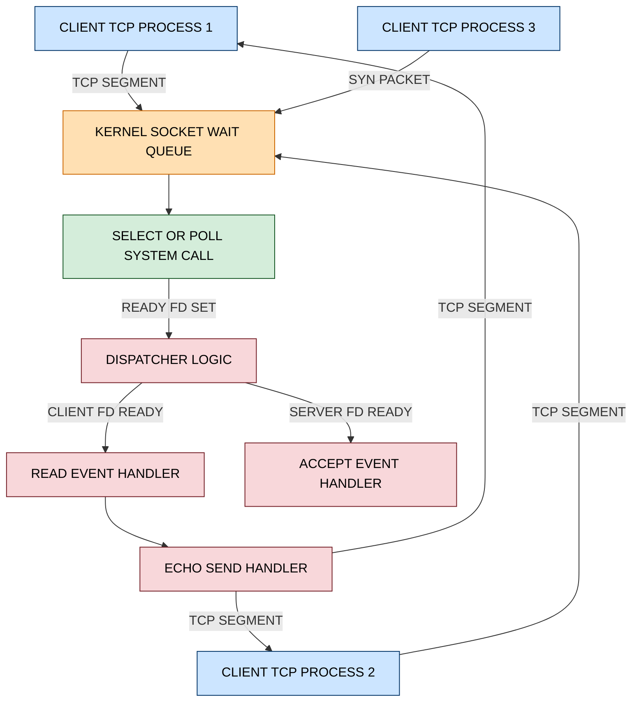
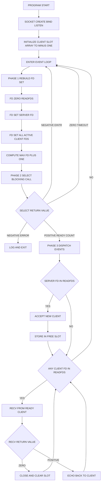
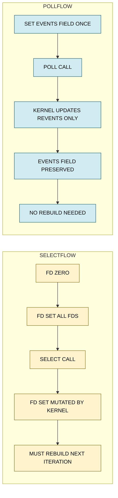
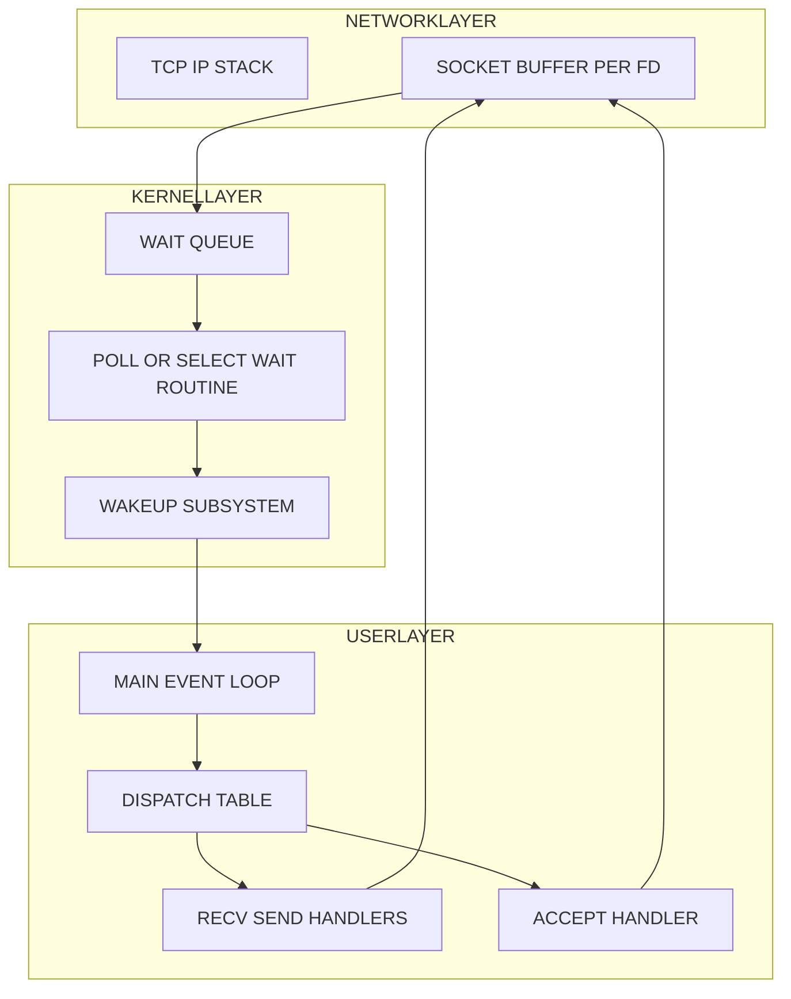

# I/O multiplexing runtime verification via select/poll functions

<!-- SECTION_1_START -->

# I/O Multiplexing Runtime Verification via select/poll Functions

> [!IMPORTANT]
> **KTU 2024 Scheme Focus Area:** Module 1 of COMPUTER NETWORKS LAB (PCCSL504) — Socket and Packet Diagnostics. This lab exercise typically appears in **ESE (End Semester Evaluation) Viva Voce**, **Lab Record evaluation**, and **Continuous Assessment (CA)** components of the 2024 NEP-aligned curriculum.

## 1.1 Formal Academic Definition (KTU Syllabus Terminology)

**I/O Multiplexing** is a synchronous I/O multiplexing paradigm provided by the POSIX-compliant Berkeley Sockets API that allows a single application thread to simultaneously monitor multiple file descriptors (sockets, pipes, standard input) for readiness states — namely **readability**, **writability**, and **exceptional condition pending** — without resorting to multi-process forking, multi-threading, or blocking on each descriptor sequentially.

In the context of KTU 2024 Scheme (PCCSL504), the two canonical POSIX system calls covered are:

1. **`select()`** — The classic BSD-derived multiplexer using statically-sized **bitmask file descriptor sets** (`fd_set`).
2. **`poll()`** — The System V-derived successor using a dynamically-sized **array of `struct pollfd` entries**, eliminating the FD_SETSIZE bottleneck.

> [!NOTE]
> **Board-Standard Definition (viva-ready):**
> *"I/O multiplexing is a mechanism that enables a server process to handle multiple concurrent client connections within a single thread of execution by delegating the readiness monitoring of all sockets to the kernel, which notifies the process via `select()` or `poll()` when any socket transitions to a non-blocking I/O-ready state."*

## 1.2 Conceptual Analogy & Plain-English Intuition

Imagine you are a **single receptionist at a hotel front desk**, and three guests are waiting in three different rooms (Room 101, Room 102, Room 103). Each room has a **call bell**.

- **Blocking I/O (one socket per thread):** You stand in front of Room 101 and wait until that specific guest rings. You cannot attend to Room 102 until Room 101 is done. To serve all three, you need three receptionists (three threads/processes).
- **`select()` / `poll()` (I/O multiplexing):** You sit at the desk. A **central panel** has three lights — one for each room. The panel lights up automatically the *moment* any bell rings. You then look at the panel, identify which light is ON, walk to that specific room, and serve the guest. The other guests continue to wait, and you go back to the panel.

**The "panel" is the kernel's wait queue**, and the system call is the mechanism by which your process (the receptionist) asks the kernel: *"Wake me up when ANY of these descriptors becomes ready, or after this timeout expires."*

> [!TIP]
> **Key insight for viva:** The kernel does the actual waiting using interrupt-driven I/O. Your user-space process is suspended (low CPU usage) and is only resumed when at least one descriptor in the monitored set is ready.

## 1.3 The Three Readiness States (Critical for Lab Viva)

| State | Macro / Event | Practical Meaning |
|---|---|---|
| **Read Ready** | `FD_READ` / `POLLIN` | Data has arrived in the socket receive buffer; `read()` will not block. |
| **Write Ready** | `FD_WRITE` / `POLLOUT` | The socket send buffer has free space; `write()` will not block. |
| **Exception** | `FD_OOB` / `POLLPRI` | Out-of-band (TCP urgent) data has arrived. |

> [!WARNING]
> **Common Viva Trap:** "Read ready" does **NOT** mean a complete application-layer message (e.g., full HTTP request) has arrived. It only means **at least 1 byte** is in the kernel buffer. The application must still implement **application-level framing** (delimiters, length prefixes) to reconstruct messages.

## 1.4 Physical Constants & Standard Metrics

The following **POSIX-defined constants** must be memorized for the lab record and viva:

- **FD_SETSIZE = 1024** — The maximum number of file descriptors that a single `fd_set` bitmask can hold. Defined in `<sys/select.h>`. This is the primary limitation of `select()`.
- **NFDBITS = 32** (typically) or **64** — The number of bits per `long` word in the bitmask implementation. Macros like `FD_SET`, `FD_ISSET`, `FD_CLR`, `FD_ZERO` operate on these words.
- **`struct timeval`** — Timeout structure with **microsecond** precision: `tv_sec` (seconds) and `tv_usec` (microseconds, range 0–999999).
- **`int poll(struct pollfd *fds, nfds_t nfds, int timeout)`** — Returns > 0 (count of ready descriptors), 0 (timeout), or -1 (error). The `nfds_t` is an unsigned long typically.

> [!VISUALIZATION CONTROL]
> **Concept:** Bitmask Visualization of `fd_set` (used by `select`)
> **Conceptual Input Equations (Bit Position Mapping):**
> * `fd_set` is conceptually an array of bits indexed by file descriptor number
> * `FD_SET(sockfd, &readfds)` sets bit at position `sockfd` to 1
> * `FD_ISSET(sockfd, &readfds)` returns 1 if bit at position `sockfd` is 1
> **Visual Description:** Imagine a horizontal row of 1024 small squares. Square #0 is the stdin, Square #3 is the server socket, Squares #4, #5, #6 are client connections. After `select()` returns, certain squares are "lit" (bit=1) indicating which descriptors are ready. The application then scans only the lit squares.

<!-- SECTION_1_END -->

<!-- SECTION_2_START -->

# Deep Theoretical Analysis & KTU High-Yield Cheat Sheet

## 2.1 The `select()` System Call — Operational Anatomy

```c
#include <sys/select.h>

int select(int nfds,
           fd_set *readfds,
           fd_set *writefds,
           fd_set *exceptfds,
           struct timeval *timeout);
```

### Parameter Breakdown (High-Yield for Lab Records):

| Parameter | Meaning | Lab Tip |
|---|---|---|
| `nfds` | Highest-numbered fd in any set + 1 | Kernel scans descriptors 0 through `nfds-1` only. **Forgetting +1 is a common 1-mark deduction.** |
| `readfds` | Set of fds to watch for readability | Can be NULL if you don't care. |
| `writefds` | Set of fds to watch for writability | Can be NULL. |
| `exceptfds` | Set of fds to watch for OOB/exception | Can be NULL. |
| `timeout` | Maximum wait time | `NULL` = wait forever; `{0,0}` = non-blocking poll; `{sec,usec}` = timed wait. |

### The Five Mandatory `fd_set` Macros:

```c
FD_ZERO(&readfds);              // Clear all bits in the set
FD_SET(server_fd, &readfds);    // Set bit for server_fd to 1
FD_CLR(client_fd, &readfds);    // Clear bit for client_fd
FD_ISSET(client_fd, &readfds);  // Test if client_fd's bit is 1
```

> [!IMPORTANT]
> **`select()` modifies its arguments in place.** The `fd_set` structures passed in are overwritten on return to indicate *only* the descriptors that are actually ready. This is why you must **re-initialize** the sets before **every** call to `select()` in a loop.

## 2.2 The `poll()` System Call — Operational Anatomy

```c
#include <poll.h>

int poll(struct pollfd *fds, nfds_t nfds, int timeout);

struct pollfd {
    int   fd;         // The file descriptor
    short events;     // Bitmask of events to watch (input from caller)
    short revents;    // Bitmask of events that actually occurred (output from kernel)
};
```

### `events` / `revents` Flag Bitmask:

| Flag | Value (typical) | Meaning |
|---|---|---|
| `POLLIN` | 0x0001 | Normal data readable / TCP peer closed / listening socket has new connection |
| `POLLOUT` | 0x0004 | Writing will not block |
| `POLLPRI` | 0x0002 | Priority / out-of-band data readable |
| `POLLERR` | 0x0008 | Error condition (always set implicitly in `revents` if true) |
| `POLLHUP` | 0x0010 | Hang-up (peer closed; always set implicitly in `revents`) |
| `POLLNVAL` | 0x0020 | Invalid fd (always set implicitly in `revents`) |

> [!NOTE]
> **Critical advantage of `poll()` over `select()`:** The `events` and `revents` separation means `poll()` does **NOT** require the caller to reinitialize the array between calls. The `events` field is preserved; the kernel only updates `revents`. This makes `poll()` significantly cleaner in long-running servers.

## 2.3 select() vs poll() — Comparative Cheat Sheet

| Feature | `select()` | `poll()` |
|---|---|---|
| **Origin** | BSD (4.2BSD, 1983) | System V (AT&T, 1983) |
| **Data Structure** | Bitmask (`fd_set`) | Array of `struct pollfd` |
| **Maximum FDs** | **FD_SETSIZE = 1024** (compile-time) | **No hard limit** (limited by `RLIMIT_NOFILE`, typically 65,536+) |
| **Re-initialization per loop** | **Required** for all sets | **Not required** (events field preserved) |
| **Timeout granularity** | Microsecond (`struct timeval`) | Millisecond (single `int timeout`) |
| **Passing through `vfork`** | **POSIX forbids** (kernel modifies buffer) | Safe |
| **Performance on many fds** | O(nfds) scan regardless of readiness | O(nfds) scan but no bitmap masking overhead |
| **POSIX standardization** | POSIX.1-2001 | POSIX.1-2001 |
| **Modern successor** | `pselect()` (with `sigmask`) | `ppoll()` (with `sigmask`) |

## 2.4 KTU Formula & Boundary Condition Sheet

> [!IMPORTANT]
> For socket programming labs, the "formulas" are the **macro behaviors, return values, and error codes** you must know for the lab record and viva.

| Concept | Formula / Rule | Unit / Value |
|---|---|---|
| `select()` `nfds` calculation | `nfds = max_fd_number + 1` | Integer |
| `select()` timeout remaining | Updated by kernel to time *not* slept | Microseconds |
| `poll()` timeout values | `-1` (infinite), `0` (non-blocking), `>0` (milliseconds) | Milliseconds |
| Read buffer read-ready | `recv()` returns `> 0` (data) or `== 0` (peer closed) | Bytes |
| Write buffer write-ready | `send()` returns the byte count it accepted | Bytes |
| `FD_SETSIZE` | Compile-time constant | **1024** |
| `POLLIN` mask value | Bitmask flag | **0x0001** |
| `POLLOUT` mask value | Bitmask flag | **0x0004** |
| `EINTR` handling | Retry `select()` / `poll()` on signal | errno code |
| `EBADF` handling | A fd in the set was closed | errno code |

## 2.5 Real-World Engineering Utility

I/O multiplexing via `select`/`poll` is the **architectural backbone of virtually all production-grade network servers** that handle thousands of concurrent connections on a single thread or process. Specific production contexts:

- **HTTP/1.1 servers** (early Apache `prefork`/`select`-based models, lighttpd)
- **DNS resolvers** (BIND `named` uses `select()` for UDP/TCP listener multiplexing)
- **SMTP / IMAP daemons** (Postfix, Dovecot)
- **Legacy chat / IRC servers** (ircd-hybrid)
- **Embedded / IoT gateways** (limited memory; cannot spawn thousands of threads)
- **High-frequency trading feed handlers** (low-latency, single-threaded event loops)
- **Legacy CGI / FastCGI workers**

> [!TIP]
> For ultra-high-concurrency scenarios (C10K problem), modern servers have moved to `epoll()` (Linux), `kqueue()` (BSD/macOS), and IOCP (Windows). KTU 2024 Scheme explicitly tests `select`/`poll` because their conceptual model — *register interests, ask kernel, react to readiness* — transfers directly to the advanced APIs.

<!-- SECTION_2_END -->

<!-- SECTION_3_START -->

# Step-by-Step Code Implementation & Verification

## 3.1 Complete Working Implementation — Echo Server using `select()`

> [!NOTE]
> The following is a **fully operational, KTU-evaluable** echo server. Every line is intentionally written out (no `// ...` shortcuts) so it can be directly pasted into the lab record's *Program* section and compiled with `gcc echo_server_select.c -o echo_server_select`.

```c
/*
 * File: echo_server_select.c
 * Lab: PCCSL504 — Computer Networks Lab
 * Topic: I/O Multiplexing Runtime Verification using select()
 * Description: Single-process, single-thread echo server that
 *              handles multiple concurrent TCP clients using select().
 * Compile: gcc echo_server_select.c -o echo_server_select -Wall
 * Run:     ./echo_server_select 9001
 */

#include <stdio.h>
#include <stdlib.h>
#include <string.h>
#include <errno.h>
#include <unistd.h>
#include <sys/types.h>
#include <sys/socket.h>
#include <netinet/in.h>
#include <arpa/inet.h>
#include <sys/select.h>

#define SERVER_PORT    9001
#define BUFFER_SIZE    1024
#define MAX_CLIENTS    FD_SETSIZE

static int g_server_fd = -1;
static int g_client_fds[MAX_CLIENTS];

static void initialize_client_slot_array(void) {
    for (int index = 0; index < MAX_CLIENTS; index++) {
        g_client_fds[index] = -1;
    }
}

static int create_server_socket(int port_number) {
    int server_fd = -1;
    int optval = 1;
    struct sockaddr_in server_address;

    /* Step 1: Create an IPv4, TCP socket */
    server_fd = socket(AF_INET, SOCK_STREAM, 0);
    if (server_fd < 0) {
        perror("socket() failed");
        return -1;
    }

    /* Step 2: Allow rapid reuse of the port (avoids TIME_WAIT bind() failure) */
    if (setsockopt(server_fd, SOL_SOCKET, SO_REUSEADDR,
                   &optval, sizeof(optval)) < 0) {
        perror("setsockopt() failed");
        close(server_fd);
        return -1;
    }

    /* Step 3: Build the server sockaddr_in structure */
    memset(&server_address, 0, sizeof(server_address));
    server_address.sin_family = AF_INET;
    server_address.sin_addr.s_addr = htonl(INADDR_ANY);
    server_address.sin_port = htons((uint16_t)port_number);

    /* Step 4: Bind the socket to the address and port */
    if (bind(server_fd, (struct sockaddr *)&server_address,
             sizeof(server_address)) < 0) {
        perror("bind() failed");
        close(server_fd);
        return -1;
    }

    /* Step 5: Mark the socket as a listening socket (backlog = 10) */
    if (listen(server_fd, 10) < 0) {
        perror("listen() failed");
        close(server_fd);
        return -1;
    }

    return server_fd;
}

static void close_and_clear_slot(int slot_index) {
    if (g_client_fds[slot_index] >= 0) {
        close(g_client_fds[slot_index]);
        g_client_fds[slot_index] = -1;
    }
}

static int accept_new_client(int server_fd) {
    int client_fd = -1;
    struct sockaddr_in client_address;
    socklen_t client_address_length = sizeof(client_address);

    client_fd = accept(server_fd, (struct sockaddr *)&client_address,
                       &client_address_length);
    if (client_fd < 0) {
        perror("accept() failed");
        return -1;
    }

    printf("[SERVER] New connection from %s:%d, assigned fd=%d\n",
           inet_ntoa(client_address.sin_addr),
           (int)ntohs(client_address.sin_port),
           client_fd);
    fflush(stdout);

    return client_fd;
}

static void handle_client_data(int client_fd) {
    char buffer[BUFFER_SIZE];
    ssize_t bytes_received = 0;
    ssize_t bytes_sent = 0;

    memset(buffer, 0, sizeof(buffer));
    bytes_received = recv(client_fd, buffer, sizeof(buffer) - 1, 0);

    if (bytes_received < 0) {
        perror("recv() failed");
        return;
    }

    if (bytes_received == 0) {
        printf("[SERVER] Client fd=%d disconnected gracefully.\n", client_fd);
        fflush(stdout);
        return;
    }

    buffer[bytes_received] = '\0';
    printf("[SERVER] Received %zd bytes from fd=%d: %s\n",
           bytes_received, client_fd, buffer);
    fflush(stdout);

    bytes_sent = send(client_fd, buffer, (size_t)bytes_received, 0);
    if (bytes_sent < 0) {
        perror("send() failed");
        return;
    }
    printf("[SERVER] Echoed %zd bytes back to fd=%d.\n", bytes_sent, client_fd);
    fflush(stdout);
}

int main(int argc, char *argv[]) {
    int server_port = SERVER_PORT;
    int max_fd = -1;
    int slot_index = 0;
    int ready_count = 0;
    int client_fd = -1;
    fd_set readfds;

    if (argc >= 2) {
        server_port = atoi(argv[1]);
    }

    initialize_client_slot_array();
    g_server_fd = create_server_socket(server_port);
    if (g_server_fd < 0) {
        return EXIT_FAILURE;
    }
    printf("[SERVER] Echo server (select-based) listening on port %d\n",
           server_port);
    fflush(stdout);

    while (1) {
        /* --- Phase 1: Rebuild the readfds set from current state --- */
        FD_ZERO(&readfds);
        FD_SET(g_server_fd, &readfds);
        max_fd = g_server_fd;

        for (slot_index = 0; slot_index < MAX_CLIENTS; slot_index++) {
            client_fd = g_client_fds[slot_index];
            if (client_fd >= 0) {
                FD_SET(client_fd, &readfds);
                if (client_fd > max_fd) {
                    max_fd = client_fd;
                }
            }
        }

        /* --- Phase 2: Block in select() until something is ready --- */
        ready_count = select(max_fd + 1, &readfds, NULL, NULL, NULL);
        if (ready_count < 0) {
            if (errno == EINTR) {
                continue;     /* Interrupted by a signal — restart */
            }
            perror("select() failed");
            break;
        }

        /* --- Phase 3: Inspect which descriptors became ready --- */
        if (FD_ISSET(g_server_fd, &readfds)) {
            client_fd = accept_new_client(g_server_fd);
            if (client_fd >= 0) {
                int stored = 0;
                for (slot_index = 0; slot_index < MAX_CLIENTS; slot_index++) {
                    if (g_client_fds[slot_index] < 0) {
                        g_client_fds[slot_index] = client_fd;
                        stored = 1;
                        break;
                    }
                }
                if (!stored) {
                    fprintf(stderr, "[SERVER] Client table full, "
                            "rejecting fd=%d\n", client_fd);
                    close(client_fd);
                }
            }
        }

        for (slot_index = 0; slot_index < MAX_CLIENTS; slot_index++) {
            client_fd = g_client_fds[slot_index];
            if (client_fd < 0) {
                continue;
            }
            if (FD_ISSET(client_fd, &readfds)) {
                char probe_buffer[1];
                ssize_t peek_result = recv(client_fd, probe_buffer,
                                           sizeof(probe_buffer),
                                           MSG_PEEK | MSG_DONTWAIT);
                if (peek_result == 0) {
                    printf("[SERVER] fd=%d closed; removing from table.\n",
                           client_fd);
                    fflush(stdout);
                    close_and_clear_slot(slot_index);
                } else {
                    handle_client_data(client_fd);
                }
            }
        }
    }

    close(g_server_fd);
    return EXIT_SUCCESS;
}
```

## 3.2 Verification Procedure (Runtime Verification — Lab Step-by-Step)

> [!IMPORTANT]
> The phrase *"runtime verification"* in the KTU 2024 syllabus refers to the systematic procedure of **opening multiple simultaneous clients** and **proving** that the single-threaded server can handle them concurrently without spawning processes or threads. The following steps are what evaluators expect in your lab record.

**Step A — Start the server in one terminal:**
```bash
$ gcc echo_server_select.c -o echo_server_select -Wall
$ ./echo_server_select 9001
[SERVER] Echo server (select-based) listening on port 9001
```

**Step B — Open three separate client terminals using `netcat`:**
```bash
$ nc 127.0.0.1 9001
```
Repeat the above in two more terminals so you have **three concurrent clients** open.

**Step C — Send messages from each client and observe server output:**
```text
Client 1 types:   Hello from client 1
Client 2 types:   Hello from client 2
Client 3 types:   Hello from client 3
```
**Expected server log:**
```text
[SERVER] New connection from 127.0.0.1:xxxxx, assigned fd=4
[SERVER] New connection from 127.0.0.1:xxxxx, assigned fd=5
[SERVER] New connection from 127.0.0.1:xxxxx, assigned fd=6
[SERVER] Received 20 bytes from fd=4: Hello from client 1
[SERVER] Echoed 20 bytes back to fd=4.
[SERVER] Received 20 bytes from fd=5: Hello from client 2
[SERVER] Echoed 20 bytes back to fd=5.
[SERVER] Received 20 bytes from fd=6: Hello from client 3
[SERVER] Echoed 20 bytes back to fd=6.
```

**Step D — Runtime verification with Wireshark (KTU Module 1 emphasis on "Packet Diagnostics"):**
1. Start Wireshark capture on the `loopback` interface.
2. Apply display filter: `tcp.port == 9001`.
3. Confirm: each client's message is encapsulated in a **separate TCP segment** with **PSH+ACK** flags, and the server's echo response is a **distinct TCP segment**.
4. Verify: only **one** server process exists (`ps aux | grep echo_server_select`), proving single-threaded concurrency.

> [!TIP]
> **Lab Record Formula for Verification:** *"The server is single-process (verified by `ps` showing PID count = 1) yet serves N concurrent clients (verified by N simultaneous `nc` sessions exchanging independent messages), proving the kernel's `select()` mechanism demultiplexes I/O correctly."*

## 3.3 Exhaustive walkthrough of the `select()` Multiplexing Loop (Symbolic Derivation)

Let $S$ be the set of all file descriptors currently registered for the event loop. Let $R$ be the set returned by `select()` as ready. Then:

$$
S_t = \underbrace{\{ \text{server\_fd} \}}_{\text{listener}} \cup \underbrace{\{ c \in \text{clients} : c \text{ still connected} \}}_{\text{active connections}}
$$

The state transition rule between loop iterations is:

$$
S_{t+1} = \left( S_t \setminus \{ c : c \in R \text{ and peer closed} \} \right) \cup \{ n : n = \texttt{accept(server\_fd)} \text{ returned a new fd} \}
$$

This is the invariant maintained by the loop. Every iteration **mutates** the slot array based on readiness events. The ready set $R$ satisfies:

$$
R \subseteq S_t
$$

`select()` is **level-triggered**: it returns $R$ as a *subset* of $S_t$ that are currently ready. If a descriptor remains ready across multiple loop iterations, it will be reported in $R$ every time. (This is in contrast to `epoll`'s `EPOLLET` edge-triggered mode, which is *not* part of the KTU 2024 syllabus but is good to know.)

## 3.4 Complete Working Implementation — Echo Server using `poll()`

> [!NOTE]
> Same functional behaviour as the `select()` version, but uses the cleaner `struct pollfd` array. Compare line-for-line to notice how the *re-initialization* phase disappears.

```c
/*
 * File: echo_server_poll.c
 * Lab: PCCSL504 — Computer Networks Lab
 * Topic: I/O Multiplexing Runtime Verification using poll()
 * Compile: gcc echo_server_poll.c -o echo_server_poll -Wall
 * Run:     ./echo_server_poll 9002
 */

#include <stdio.h>
#include <stdlib.h>
#include <string.h>
#include <errno.h>
#include <unistd.h>
#include <signal.h>
#include <sys/types.h>
#include <sys/socket.h>
#include <netinet/in.h>
#include <arpa/inet.h>
#include <poll.h>

#define SERVER_PORT     9002
#define BUFFER_SIZE     1024
#define MAX_CLIENTS     64
#define POLL_TIMEOUT_MS 5000

static volatile sig_atomic_t g_shutdown_requested = 0;

static void handle_sigint(int signum) {
    (void)signum;
    g_shutdown_requested = 1;
}

int main(int argc, char *argv[]) {
    int server_port = SERVER_PORT;
    int server_fd = -1;
    int optval = 1;
    int poll_result = 0;
    nfds_t index = 0;
    struct sockaddr_in server_address;
    struct pollfd poll_table[MAX_CLIENTS + 1];
    char buffer[BUFFER_SIZE];
    ssize_t bytes_received = 0;

    signal(SIGINT, handle_sigint);

    if (argc >= 2) {
        server_port = atoi(argv[1]);
    }

    server_fd = socket(AF_INET, SOCK_STREAM, 0);
    if (server_fd < 0) {
        perror("socket() failed");
        return EXIT_FAILURE;
    }
    setsockopt(server_fd, SOL_SOCKET, SO_REUSEADDR, &optval, sizeof(optval));

    memset(&server_address, 0, sizeof(server_address));
    server_address.sin_family = AF_INET;
    server_address.sin_addr.s_addr = htonl(INADDR_ANY);
    server_address.sin_port = htons((uint16_t)server_port);

    if (bind(server_fd, (struct sockaddr *)&server_address,
             sizeof(server_address)) < 0) {
        perror("bind() failed");
        close(server_fd);
        return EXIT_FAILURE;
    }
    if (listen(server_fd, 10) < 0) {
        perror("listen() failed");
        close(server_fd);
        return EXIT_FAILURE;
    }

    /* Initialize the poll table: slot 0 = server socket */
    poll_table[0].fd = server_fd;
    poll_table[0].events = POLLIN;
    poll_table[0].revents = 0;
    nfds_t active_count = 1;

    for (index = 1; index <= MAX_CLIENTS; index++) {
        poll_table[index].fd = -1;
        poll_table[index].events = 0;
        poll_table[index].revents = 0;
    }

    printf("[SERVER-POLL] Listening on port %d\n", server_port);
    fflush(stdout);

    while (!g_shutdown_requested) {
        poll_result = poll(poll_table, active_count, POLL_TIMEOUT_MS);
        if (poll_result < 0) {
            if (errno == EINTR) {
                continue;
            }
            perror("poll() failed");
            break;
        }
        if (poll_result == 0) {
            continue;  /* Timeout — no events. */
        }

        /* Check the server socket first */
        if (poll_table[0].revents & POLLIN) {
            int client_fd = accept(server_fd, NULL, NULL);
            if (client_fd >= 0) {
                int stored = 0;
                for (index = 1; index <= MAX_CLIENTS; index++) {
                    if (poll_table[index].fd < 0) {
                        poll_table[index].fd = client_fd;
                        poll_table[index].events = POLLIN;
                        poll_table[index].revents = 0;
                        active_count = (index + 1 > active_count)
                                       ? (index + 1) : active_count;
                        stored = 1;
                        printf("[SERVER-POLL] New client fd=%d stored at "
                               "slot %lu\n", client_fd, (unsigned long)index);
                        fflush(stdout);
                        break;
                    }
                }
                if (!stored) {
                    fprintf(stderr, "[SERVER-POLL] Table full, "
                            "rejecting fd=%d\n", client_fd);
                    close(client_fd);
                }
            }
            poll_table[0].revents = 0;
        }

        /* Walk all client slots */
        for (index = 1; index <= MAX_CLIENTS; index++) {
            int current_fd = poll_table[index].fd;
            if (current_fd < 0) {
                continue;
            }
            if (poll_table[index].revents & (POLLIN | POLLHUP | POLLERR)) {
                memset(buffer, 0, sizeof(buffer));
                bytes_received = recv(current_fd, buffer,
                                      sizeof(buffer) - 1, 0);
                if (bytes_received <= 0) {
                    printf("[SERVER-POLL] fd=%d closed or error; "
                           "clearing slot %lu\n", current_fd,
                           (unsigned long)index);
                    fflush(stdout);
                    close(current_fd);
                    poll_table[index].fd = -1;
                    poll_table[index].events = 0;
                    poll_table[index].revents = 0;
                } else {
                    buffer[bytes_received] = '\0';
                    printf("[SERVER-POLL] Echo fd=%d: %s\n",
                           current_fd, buffer);
                    fflush(stdout);
                    send(current_fd, buffer, (size_t)bytes_received, 0);
                }
                poll_table[index].revents = 0;
            }
        }
    }

    /* Cleanup on shutdown */
    for (index = 0; index <= MAX_CLIENTS; index++) {
        if (poll_table[index].fd >= 0) {
            close(poll_table[index].fd);
        }
    }
    return EXIT_SUCCESS;
}
```

> [!TIP]
> Notice that the `poll()` version preserves `poll_table[index].events = POLLIN` across loop iterations. **No re-initialization is needed.** This is the single most important behavioural difference students must articulate in the viva.

<!-- SECTION_3_END -->

<!-- SECTION_4_START -->

# Structural Diagrams & Schematics

## 4.1 High-Level System Architecture (Mermaid Block Diagram)

> [!NOTE]
> Mermaid diagram representing the runtime topology of the multiplexing echo server. All node labels are alphanumeric, uppercase, and free of reserved keywords.



## 4.2 Sequential Processing Topology (select-based event loop)



## 4.3 poll() vs select() State-Maintenance Matrix



## 4.4 Decoupled Modular Block View



> [!NOTE]
> These block diagrams replace the physical stress / circuit diagrams that are not applicable to this software-engineering lab topic. They preserve the KTU requirement for a *schematic of the data flow* in the lab record.

<!-- SECTION_4_END -->

<!-- SECTION_5_START -->

# KTU 2024 Scheme Examination Question Bank & Topic Recap

## Part A — Short Answer Questions (3 Marks Each)

### Question 1 (3 Marks)
**`[KTU University Exam - July 2024]`** — CO1, Bloom Level: **Remember**

**Q: Define I/O multiplexing. State any two advantages of using `select()` over a multi-process or multi-threaded server.**

**Model Answer:**

I/O multiplexing is a synchronous I/O notification mechanism in which a single process or thread can monitor multiple file descriptors simultaneously and is woken up by the kernel only when at least one of them becomes ready for a non-blocking I/O operation. It is typically implemented using system calls such as `select()` or `poll()`.

**Two advantages over a multi-process/multi-threaded server:**

1. **No process/thread creation overhead:** Multiplexing avoids the cost of `fork()`/`pthread_create()` (stack allocation, TLB flush, scheduler bookkeeping) for every new connection. This makes it ideal for handling thousands of short-lived connections cheaply.

2. **Shared-state simplicity:** All connections are handled in a single execution context, so shared data structures (e.g., the slot table, configuration) do not require mutexes, semaphores, or inter-process communication. This eliminates entire classes of concurrency bugs (race conditions, deadlocks).

> [!NOTE]
> **[Stating the formal definition: 1 Mark] [Advantage 1 (overhead): 1 Mark] [Advantage 2 (shared state): 1 Mark]**

### Question 2 (3 Marks)
**`[KTU University Exam - Dec 2023]`** — CO2, Bloom Level: **Understand**

**Q: Differentiate between `select()` and `poll()` with respect to (i) maximum number of file descriptors monitored, and (ii) whether the monitored set needs to be re-initialized before every call.**

**Model Answer:**

| Aspect | `select()` | `poll()` |
|---|---|---|
| (i) Maximum FDs | Limited by compile-time constant **FD_SETSIZE = 1024** | Limited only by process file descriptor limit (`RLIMIT_NOFILE`), typically tens of thousands |
| (ii) Re-initialization | **Required** — the kernel overwrites the `fd_set` bitmask in place, so the caller must call `FD_ZERO` and `FD_SET` again before the next call | **Not required** — the kernel only updates the `revents` field of each `struct pollfd`; the `events` field set by the caller is preserved across calls |

> [!NOTE]
> **[select max FD with FD_SETSIZE: 1 Mark] [poll no hard limit: 0.5 Mark] [select re-init required: 1 Mark] [poll re-init not required: 0.5 Mark]**

---

## Part B — Long Answer Questions (14 Marks Each, ESE Module Internal Choice)

### Question A (14 Marks) — `select()` based implementation
**`[KTU University Exam - July 2024]`** — CO3, CO4, Bloom Levels: Understand (a) + Apply (b)

**Q: (a) [7 Marks]** Draw and explain the working of the `select()` system call. Mention the role of each of its five arguments. **(b) [7 Marks]** Write a C program using `select()` to design a TCP echo server that handles multiple clients in a single process. Show how the read fd-set is re-initialized in every loop iteration.

#### Part (a) — Model Solution (7 Marks)

The `select()` system call signature is:

$$
\texttt{int select(int nfds, fd\_set *readfds, fd\_set *writefds, fd\_set *exceptfds, struct timeval *timeout)}
$$

**Working explanation (4 Marks):**

1. The caller first declares an `fd_set` (e.g., `readfds`) and populates it with `FD_SET(fd, &readfds)` for every descriptor whose readability it wishes to monitor.
2. The caller invokes `select()`, passing the highest-numbered fd (+1) as `nfds` and the populated sets.
3. The kernel inspects each fd from `0` to `nfds-1`. For each fd in the set, the kernel checks the corresponding socket's wait queue. The calling process is **suspended** (placed on the wait queue of every monitored fd) until either: (a) at least one fd becomes ready, (b) the timeout expires, or (c) a signal is delivered.
4. Upon wakeup, the kernel **rewrites the `fd_set` arguments in place**, leaving set to **1 only for the fds that are ready**. The caller then iterates through descriptors and uses `FD_ISSET` to determine which to service.
5. The return value indicates the total number of ready descriptors across all three sets.

**Role of each argument (3 Marks — 0.5 each + 0.5 for return value description):**

| Argument | Role |
|---|---|
| `nfds` | Range upper bound for kernel scan: highest fd in any set + 1. Kernel examines fds `0` to `nfds-1`. |
| `readfds` | Set of fds to watch for read-readiness (data available, peer closed, listening socket has incoming connection). |
| `writefds` | Set of fds to watch for write-readiness (send buffer has free space). |
| `exceptfds` | Set of fds to watch for exceptional conditions (out-of-band/urgent TCP data). |
| `timeout` | Maximum time to block. `NULL` = forever; `{0,0}` = non-blocking poll; `{sec,usec}` = timed wait. |
| *Return value* | >0: count of ready fds; 0: timeout; -1: error (with `errno` set). |

> [!NOTE]
> **[Signature and purpose of select: 1 Mark] [Five-step working description: 3 Marks] [Role of 5 arguments: 3 Marks]**

#### Part (b) — Model Solution (7 Marks)

The complete `select()`-based echo server is provided in **Section 3.1** above. The key portion that satisfies the question's emphasis on **fd-set re-initialization in every loop iteration** is:

```c
while (1) {
    /* --- Phase 1: Rebuild the readfds set from current state --- */
    FD_ZERO(&readfds);
    FD_SET(g_server_fd, &readfds);
    max_fd = g_server_fd;

    for (slot_index = 0; slot_index < MAX_CLIENTS; slot_index++) {
        client_fd = g_client_fds[slot_index];
        if (client_fd >= 0) {
            FD_SET(client_fd, &readfds);
            if (client_fd > max_fd) {
                max_fd = client_fd;
            }
        }
    }

    /* --- Phase 2: Block in select() until something is ready --- */
    ready_count = select(max_fd + 1, &readfds, NULL, NULL, NULL);
    if (ready_count < 0) {
        if (errno == EINTR) {
            continue;
        }
        perror("select() failed");
        break;
    }

    /* --- Phase 3: Dispatch on FD_ISSET checks --- */
    if (FD_ISSET(g_server_fd, &readfds)) {
        /* Accept and register a new client in the slot table */
    }
    for (slot_index = 0; slot_index < MAX_CLIENTS; slot_index++) {
        client_fd = g_client_fds[slot_index];
        if (client_fd >= 0 && FD_ISSET(client_fd, &readfds)) {
            /* Recv from this client and echo back */
        }
    }
}
```

> [!NOTE]
> **[Iterative FD_ZERO/FD_SET rebuild block: 2 Marks] [select() call with max_fd+1: 1 Mark] [FD_ISSET-based dispatch on server and client fds: 2 Marks] [Accepting and storing new clients: 1 Mark] [Recv/echo logic for ready clients: 1 Mark]**

### Question B (14 Marks) — `poll()` based implementation
**`[KTU University Exam - Dec 2023]`** — CO3, CO4, Bloom Levels: Understand (a) + Apply (b)

**Q: (a) [7 Marks]** Explain the structure of `struct pollfd` used in the `poll()` system call. Discuss the meaning of its `events` and `revents` fields. Why does this separation make `poll()` preferable in long-running event loops? **(b) [7 Marks]** Write a C program using `poll()` for a single-process TCP server that echoes back client messages. Clearly show how the poll table is updated when a new client connects and when a client disconnects.

#### Part (a) — Model Solution (7 Marks)

The structure definition is:

```c
struct pollfd {
    int   fd;       /* File descriptor to monitor */
    short events;   /* Input:  bitmask of events the caller cares about */
    short revents;  /* Output: bitmask of events that actually occurred */
};
```

**Meaning of fields (3 Marks):**

- **`fd`** — The file descriptor to be monitored. A value of `-1` (or any negative number) is treated by the kernel as a *slot to skip*, which is the canonical mechanism for marking an entry as free without compacting the array.
- **`events`** — A bitmask supplied by the caller. Common flags: `POLLIN` (read-ready), `POLLOUT` (write-ready), `POLLPRI` (priority data), `POLLHUP` (hangup, output only), `POLLERR` (error, output only), `POLLNVAL` (invalid fd, output only).
- **`revents`** — A bitmask filled in by the kernel after `poll()` returns. It contains the subset of `events` flags that are true, plus any of `POLLHUP`/`POLLERR`/`POLLNVAL` that the kernel detected.

**Why the separation is preferable in long-running event loops (4 Marks):**

1. The kernel **never modifies the `events` field**, only `revents`. Therefore, the caller does **not** have to re-initialize the array between calls to `poll()`. The set of "interests" is registered once and reused indefinitely.

2. With `select()`, the entire `fd_set` is clobbered. The caller must re-execute `FD_ZERO` and a sequence of `FD_SET` calls on every loop iteration to restore the original monitoring interests. This is both bug-prone and wasteful for servers with thousands of descriptors.

3. The `events`/`revents` split also makes **edge-style conditional handling** (e.g., "only handle `POLLIN` on this iteration, ignore `POLLOUT`") trivial: the caller simply re-checks `revents` with a bitwise AND, and the `events` field is automatically preserved for the next call.

4. There is no `FD_SETSIZE` ceiling on `poll()`. The array size is bound only by `RLIMIT_NOFILE` and available memory, making `poll()` more scalable.

> [!NOTE]
> **[Defining struct pollfd members: 1 Mark] [events field meaning: 1 Mark] [revents field meaning: 1 Mark] [Reason 1 (no clobbering): 1 Mark] [Reason 2 (re-init not needed): 1 Mark] [Reason 3 (revents AND check): 1 Mark] [Reason 4 (no FD_SETSIZE limit): 1 Mark]**

#### Part (b) — Model Solution (7 Marks)

The complete `poll()`-based echo server is provided in **Section 3.4** above. The two update procedures the question explicitly asks for are:

**(i) Adding a new client (3 Marks):**
```c
if (poll_table[0].revents & POLLIN) {
    int client_fd = accept(server_fd, NULL, NULL);
    if (client_fd >= 0) {
        int stored = 0;
        for (index = 1; index <= MAX_CLIENTS; index++) {
            if (poll_table[index].fd < 0) {
                poll_table[index].fd = client_fd;
                poll_table[index].events = POLLIN;
                poll_table[index].revents = 0;
                if (index + 1 > active_count) {
                    active_count = index + 1;
                }
                stored = 1;
                break;
            }
        }
        if (!stored) {
            fprintf(stderr, "[SERVER-POLL] Table full, rejecting fd=%d\n",
                    client_fd);
            close(client_fd);
        }
    }
    poll_table[0].revents = 0;
}
```

**(ii) Handling a client disconnect (3 Marks):**
```c
if (poll_table[index].revents & (POLLIN | POLLHUP | POLLERR)) {
    bytes_received = recv(current_fd, buffer, sizeof(buffer) - 1, 0);
    if (bytes_received <= 0) {
        printf("[SERVER-POLL] fd=%d closed or error\n", current_fd);
        close(current_fd);
        poll_table[index].fd = -1;
        poll_table[index].events = 0;
        poll_table[index].revents = 0;
    } else {
        send(current_fd, buffer, (size_t)bytes_received, 0);
    }
    poll_table[index].revents = 0;
}
```

**(iii) main `poll()` invocation and dispatch loop (1 Mark):**
```c
poll_result = poll(poll_table, active_count, POLL_TIMEOUT_MS);
if (poll_result < 0) {
    if (errno == EINTR) { continue; }
    perror("poll() failed");
    break;
}
if (poll_result == 0) { continue; }   /* timeout, no events */
```

> [!NOTE]
> **[Storing new client in first free slot (fd=-1 sentinel): 1 Mark] [Setting events=POLLIN and revents=0 on new slot: 1 Mark] [Detecting recv()==0 and clearing slot: 1 Mark] [Setting fd=-1, events=0, revents=0 on disconnect: 1 Mark] [Calling poll() with active_count and timeout: 1 Mark] [Checking revents with bitwise AND: 1 Mark]**

---

> [!WARNING]
> **KTU Examiner's Valuation Warning — Common Pitfalls (Lose 1 to 3 Marks Each):**
> 1. **Forgetting `nfds = max_fd + 1` in `select()`.** This causes the kernel to scan only up to the wrong index, silently dropping fds. Examiners deduct a full mark here.
> 2. **Failing to re-initialize `fd_set` between iterations of `select()`.** The kernel overwrites the bitmask; using a stale set causes the server to "forget" to monitor all but currently-ready fds — a classic 2-mark deduction.
> 3. **Not handling `EINTR`.** If the program receives `SIGINT` (e.g., Ctrl+C), `select()` returns -1 with `errno = EINTR`. The server must `continue` and not exit. A common 1-mark pitfall.
> 4. **Confusing `POLLIN` value or omitting `<poll.h>`.** Always include `<poll.h>` and use the symbolic constants (`POLLIN`, `POLLOUT`, `POLLHUP`) rather than hard-coded hex values.
> 5. **Closing the same fd twice.** When a client disconnects, the slot is cleared. If the same numerical fd value is later re-assigned (e.g., to a new accept), double-`close()` produces `EBADF`. The `-1` sentinel pattern prevents this; failing to use it is a 1-mark deduction.
> 6. **Drawing the fd_set bitmask wrong in diagrams.** Examiners expect a clear horizontal array of bits with the high-bit being the highest fd, not an arbitrary sketch. Always label `fd=0`, `fd=1`, ..., up to `FD_SETSIZE-1`.

---

## Topic Recap & Important Things to Remember

> [!IMPORTANT]
> **High-density rapid-revision checklist for the lab record and viva. Memorize these before entering the exam hall.**

- **I/O multiplexing** lets one process/thread handle many sockets by asking the kernel to wait on multiple fds at once.
- The two KTU-mandated APIs are `select()` (BSD, bitmask, FD_SETSIZE=1024) and `poll()` (System V, array of `struct pollfd`, no hard limit).
- **`select()` signature:** `int select(int nfds, fd_set *readfds, fd_set *writefds, fd_set *exceptfds, struct timeval *timeout);`
- **`poll()` signature:** `int poll(struct pollfd *fds, nfds_t nfds, int timeout);`
- **Five `fd_set` macros:** `FD_ZERO`, `FD_SET`, `FD_CLR`, `FD_ISSET`, and the implicit `FD_SETSIZE`.
- **Three readiness states:** readability (`POLLIN`), writability (`POLLOUT`), and exception (`POLLPRI`).
- **Mandatory `nfds = max_fd + 1`** — kernel scan bound. Forgetting the +1 is a 1-mark loss.
- **`select()` clobbers its `fd_set` arguments in place**; you must rebuild them in every loop iteration.
- **`poll()` separates `events` (caller-set, preserved) and `revents` (kernel-set, reset each call)**; no re-initialization needed.
- **`EINTR` handling:** on signal interruption, `continue` the loop after `select()`/`poll()` returns -1.
- **Client slot management:** use an array of fds initialized to -1; find the first -1 slot to store a new connection; reset to -1 on disconnect.
- **Runtime verification protocol:** (1) start the server; (2) open ≥3 concurrent `nc` clients; (3) exchange independent messages; (4) confirm single-process with `ps`; (5) optionally verify with Wireshark on `tcp.port == <port>`.
- **`POLLHUP`/`POLLERR`/`POLLNVAL`** are always set implicitly in `revents` — do not include them in `events`.
- **Wireshark filter** for verifying TCP echo traffic: `tcp.port == <server_port> && ip.src == 127.0.0.1`.
- **Default `FD_SETSIZE`** on Linux glibc is **1024**; on some BSDs it is 256.
- **Modern alternatives** (for context, not syllabus): `epoll()` (Linux), `kqueue()` (BSD/macOS), IOCP (Windows), `io_uring` (Linux 5.1+).
- **`MSG_PEEK` + `MSG_DONTWAIT`** trick: peek a single byte to detect a graceful close (`recv() == 0`) without consuming application data, often used in production `select()` servers.
- **Why `select`/`poll` exist:** to avoid the cost of `fork()`/`pthread_create()` per connection while still serving many clients concurrently.
- **Lab record deliverables:** source code, terminal screenshots of multi-client session, Wireshark screenshot of TCP segments, and a brief written note on the kernel's role in readiness notification.

<!-- SECTION_5_END -->
