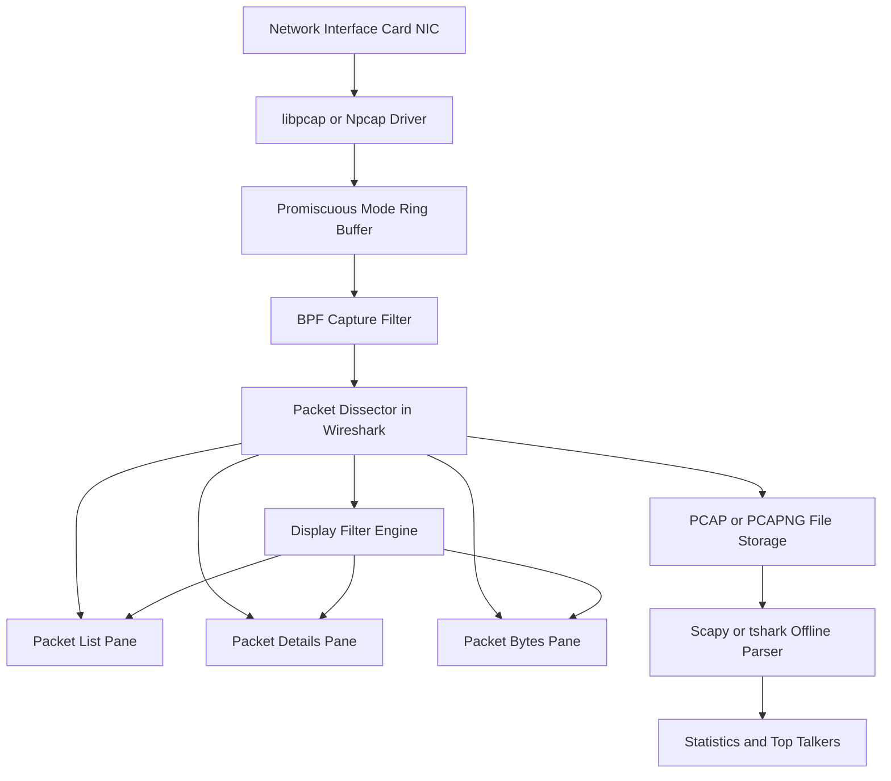
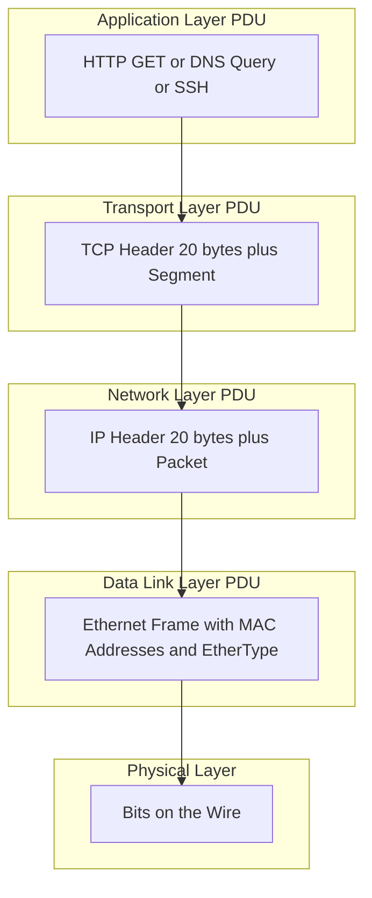
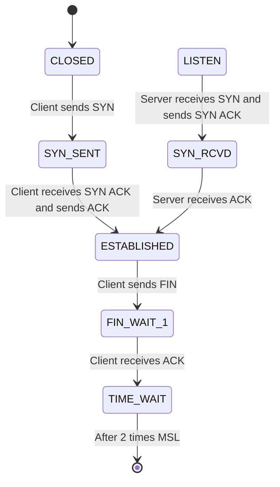
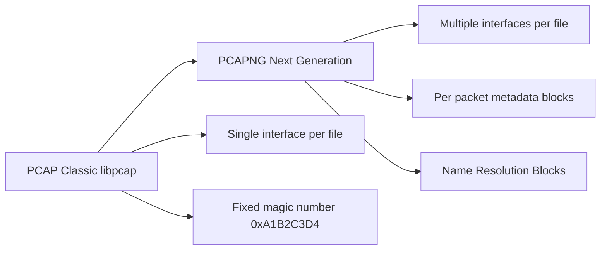
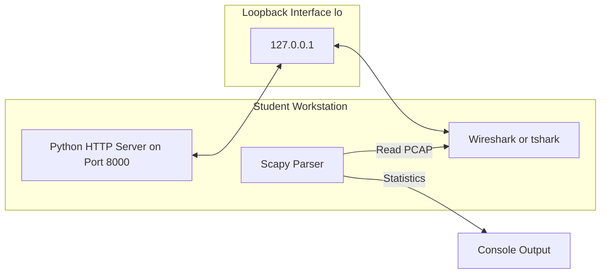

# Network traffic stream capturing, packet parsing using Wireshark analyzers

<!-- SECTION_1_START -->
# 1. Core Technical Definition & Intuitive Overview

## 1.1 Formal Academic Definition

> [!IMPORTANT]
> **Network Traffic Stream Capturing & Packet Parsing (KTU 2024 – PCCSL504 Module 1)**
> 
> *Network traffic stream capturing* is the process of intercepting and logging data packets that traverse a computer network interface, converting the raw **bit-stream** on the transmission medium into a structured, time-stamped digital record. *Packet parsing* is the subsequent lexical and structural analysis of these captured frames against the **OSI / TCP-IP reference model**, decomposing each packet into its nested protocol layers (Ethernet → IP → TCP/UDP → Application) to extract header fields, payload data, and metadata.

In KTU 2024 Scheme terminology, this lab exercise validates **Course Outcome CO1**: *"Implement network communication programs using socket APIs and analyze protocol behavior using packet sniffing tools."*

## 1.2 The Protocol Analyzer (Wireshark)

> [!NOTE]
> **Wireshark** is the world's foremost open-source **network protocol analyzer** (formerly *Ethereal*). It performs **promiscuous mode** capture on a selected network interface, decodes packets from over **3000** protocols, and presents them in a human-readable, color-coded **three-pane (packet list, packet details, packet bytes)** graphical interface.

Underlying libraries:
- **libpcap** (Linux/macOS) and **Npcap** (Windows) → C-based kernel-level packet capture engine.
- **WinPcap** (legacy, deprecated) → predecessor for Windows.
- **dumpcap** → Wireshark's low-level capture binary.
- **tshark** → command-line counterpart for headless packet analysis.

## 1.3 Conceptual Analogy — The "Postal Sorting Office"

> [!TIP]
> Think of network traffic as a **massive postal system**. Every email, video stream, or web request is a *letter* placed inside multiple nested *envelopes*:
> - **Outermost envelope** → Ethernet frame (the truck and route)
> - **Middle envelope** → IP header (the destination city)
> - **Inner envelope** → TCP/UDP header (the apartment number and door)
> - **Letter itself** → Application payload (the actual message — HTTP, DNS, etc.)
> 
> **Wireshark is the sorting clerk** who:
> 1. **Captures** every envelope passing through the post office (live capture).
> 2. **Opens** each nested envelope carefully (packet dissection).
> 3. **Records** the sender, receiver, stamps, and content (header field extraction).
> 4. **Files** the letter for later inspection (PCAP file storage).

## 1.4 Why This Lab Matters in KTU 2024 Evaluation

| Engineering Domain | Real-World Application of Packet Capture |
|---|---|
| **Cyber Security** | Intrusion detection (Snort / Suricata), malware C2 traffic analysis |
| **Network Engineering** | Troubleshooting latency, packet loss, MTU issues |
| **DevOps / QA** | Validating API calls in microservices, SSL/TLS handshake inspection |
| **IoT** | Diagnosing low-power wireless (Zigbee, LoRa) protocol exchanges |
| **Forensics** | Incident response, data exfiltration investigation |

> [!WARNING]
> **Legal/Ethical Pitfall (KTU Board frequently tests this awareness):**
> Capturing traffic on a network **you do not own or administer** without explicit written authorization is a punishable offense under the **Information Technology Act, 2000 (Sections 66, 66E, 72)** of India. Always capture only on **loopback (`127.0.0.1`)**, **lab LANs**, or networks where you have documented consent.

## 1.5 Visualization Control

> [!VISUALIZATION CONTROL]
> **Concept:** *Three-Pane Wireshark Layout & PDU Stack Mapping*
> **GeoGebra / Desmos Input Equations (analogy drawing coordinates):**
> - Plane $1$: $\text{Pane}_{\text{List}} = \{x \in [0, W], \, y \in [0, H/3]\}$
> - Plane $2$: $\text{Pane}_{\text{Details}} = \{x \in [0, W/3], \, y \in [H/3, H]\}$
> - Plane $3$: $\text{Pane}_{\text{Bytes}} = \{x \in [W/3, W], \, y \in [H/3, H]\}$
> 
> **Visual Description:** Draw a window split horizontally at $y = H/3$. The top third contains a list of captured packet rows. The bottom two-thirds are split vertically at $x = W/3$, showing the protocol tree on the left and raw hex dump on the right. Overlay an arrow showing that selecting row $i$ in the top pane populates both bottom panes with packet $i$'s decoded headers and hex bytes.

---

<!-- SECTION_1_END -->

<!-- SECTION_2_START -->
# 2. Deep Theoretical Analysis & KTU High-Yield Formula Sheet

## 2.1 The TCP/IP Protocol Stack (Capture Layering)

Wireshark dissects packets **top-down** (from raw bits to application data) and **bottom-up** for visualization. The nested PDU (Protocol Data Unit) structure is:

$$\text{Ethernet Frame} = \underbrace{[\text{Preamble} + \text{SFD}]}_{\text{8 bytes (not captured)}} + \underbrace{\text{Dst MAC}}_{\text{6 B}} + \underbrace{\text{Src MAC}}_{\text{6 B}} + \underbrace{\text{EtherType}}_{\text{2 B}} + \underbrace{\text{Payload}}_{\le 1500\,\text{B}} + \underbrace{\text{FCS}}_{\text{4 B}}$$

$$\text{IPv4 Header (min)} = 20\,\text{bytes}, \quad \text{TCP Header (min)} = 20\,\text{bytes}$$

$$\text{Maximum MTU (Ethernet)} = \mathbf{1500\,\text{bytes}}, \quad \text{Maximum MSS} = \mathbf{1460\,\text{bytes}}$$

The **MSS (Maximum Segment Size)** is derived as:

$$\text{MSS} = \text{MTU} - \text{IP Header} - \text{TCP Header} = 1500 - 20 - 20 = 1460\,\text{bytes}$$

## 2.2 Capture Workflow (Operational Steps)

> [!NOTE]
> The canonical lab procedure (mapped to KTU 2024 Continuous Evaluation rubric):

1. **Interface Selection** → Choose NIC (e.g., `eth0`, `wlan0`, `lo`) — the loopback interface is recommended in campus labs to avoid legal/ethical capture.
2. **Promiscuous Mode** → NIC accepts *all* frames on the wire, not just those addressed to its MAC. *Required for hub networks; in switched networks, port mirroring (SPAN) is needed.*
3. **Filter (BPF Syntax)** → Apply **Berkeley Packet Filter** to reduce noise:
   - `host 192.168.1.10` → traffic to/from a single IP.
   - `tcp port 80` → HTTP only.
   - `udp and not arp` → eliminate broadcast noise.
   - `ip.addr == 10.0.0.5 and tcp.flags.syn == 1` → SYN scans.
4. **Capture / Stop** → Click the **shark-fin** button. Use **Ctrl+E** to stop.
5. **Save as `.pcap` / `.pcapng`** → Portable format; can be reopened or shared.
6. **Apply Display Filters** → Refine the *viewed* subset without recapturing.
7. **Export Objects** → For HTTP: *File → Export Objects → HTTP* — extracts transferred files.

## 2.3 Color Coding Rules (Default Profile)

| Color | Protocol | Significance |
|---|---|---|
| **Light Purple** | TCP | TCP segment |
| **Light Blue** | UDP | UDP datagram |
| **Light Green** | HTTP | Web traffic |
| **Light Yellow** | ARP | Layer-2 resolution |
| **Black (bold)** | TCP errors | Malformed/reset segments |
| **Red** | TCP RST/SYN problems | Connection failures |

## 2.4 KTU Formula Sheet / Cheat Sheet

| Symbol / Term | Definition / Formula | Typical Value |
|---|---|---|
| $T_{\text{frame}}$ | Frame transmission time | $T_{\text{frame}} = \dfrac{L_{\text{bit}}}{R_{\text{bit}}}$ |
| $L_{\text{bit}}$ | Frame size in bits | $L_{\text{byte}} \times 8$ |
| $R_{\text{bit}}$ | Link bit rate | $10^7$ for 10 Mbps Ethernet |
| $N_{\text{pkts}}$ | Total packets in capture | Counted via Statistics → Conversations |
| $T_{\text{capture}}$ | Capture duration (seconds) | $T_{\text{end}} - T_{\text{start}}$ |
| $T_{\text{iat}}$ | Inter-Arrival Time | $T_{\text{iat}} = t_{i+1} - t_i$ |
| $\text{Throughput}$ | Bytes per second (instantaneous) | $\dfrac{\Delta L_{\text{bytes}}}{\Delta t}$ |
| $\text{MTU}$ | Maximum Transmission Unit | **1500 B** (Ethernet) |
| $\text{MSS}$ | Maximum Segment Size | $\text{MTU} - 40 = \mathbf{1460\,B}$ |
| $\text{TTL}$ | IPv4 Time-To-Live field | $1 \le \text{TTL} \le 255$ |
| $\text{Window}_\text{TCP}$ | TCP receive window | $0 \le W \le 65535$ B (RFC 1323 → up to 1 GiB) |
| $\text{RTT}$ | Round-Trip Time | measured via TCP timestamps or `ping` |

## 2.5 Real-World Production Utility

- **Cybersecurity SOCs** run Wireshark / tcpdump on SPAN ports of core switches to feed SIEM systems.
- **Cloud providers** (AWS, Azure) integrate VPC Traffic Mirroring — the cloud equivalent of Wireshark capture.
- **5G Core Networks** use packet capture on the N3 interface for lawful interception.
- **SDN/OpenFlow** controllers use libpcap for control-plane telemetry.

---

<!-- SECTION_2_END -->

<!-- SECTION_3_START -->
# 3. Step-by-Step Derivations & Code/Symbolic Implementation

## 3.1 Lab Experiment 1 — Capturing Loopback HTTP Traffic

### 3.1.1 Theory Recap

The loopback interface `lo` (IP `127.0.0.1`) routes traffic from your machine back to itself without ever touching the physical NIC. This makes it the **safest, most ethical** capture target for KTU lab sessions.

### 3.1.2 Setup Steps

> [!IMPORTANT]
> 1. Open a terminal. Start a simple HTTP server: `python3 -m http.server 8000`.
> 2. Open Wireshark. Select the `lo` (or `Loopback`) interface.
> 3. In the display filter bar, type: `tcp.port == 8000`.
> 4. In another terminal: `curl http://127.0.0.1:8000`.
> 5. Stop capture. Expand the HTTP layer — observe the GET request and 200 OK response.

### 3.1.3 Expected Output Fields (to be recorded in lab record)

| Field | Observed Value | Meaning |
|---|---|---|
| Source IP | `127.0.0.1` | Loopback sender |
| Destination IP | `127.0.0.1` | Loopback receiver |
| Source Port | ephemeral, e.g., `54312` | OS-assigned |
| Destination Port | `8000` | HTTP server port |
| TCP Flags | `[SYN]`, `[SYN, ACK]`, `[ACK]`, `[PSH, ACK]`, `[FIN, ACK]` | 3-way handshake + data + teardown |
| HTTP Method | `GET` | Request type |
| HTTP Status Code | `200 OK` | Response status |
| Length | e.g., `143` bytes | Frame size |

## 3.2 Lab Experiment 2 — Parsing PCAP with Python (Scapy)

### 3.2.1 Why Scapy?

While Wireshark is the **GUI analyzer**, KTU 2024 expects students to *programmatically* parse `.pcap` files. The Python library **Scapy** is the standard tool. Install via:

```bash
pip install scapy
```

### 3.2.2 Full Programmatic Implementation

```python
"""
PCSL504 - Module 1
Lab: Packet parsing of a captured PCAP file using Scapy.
Parses Ethernet, IPv4, TCP, UDP, and DNS layers and prints a summary.
"""

from scapy.all import rdpcap, IP, TCP, UDP, DNS, Ether
from collections import Counter
from typing import Dict, List, Any


def safe_getattr(obj: Any, attr: str, default: str = "N/A") -> str:
    """Return attribute as string or default if missing."""
    try:
        return str(getattr(obj, attr))
    except Exception:
        return default


def parse_packets(pcap_path: str) -> List[Dict[str, Any]]:
    """Read PCAP and return a list of parsed packet dicts."""
    packets = rdpcap(pcap_path)
    parsed: List[Dict[str, Any]] = []

    for idx, pkt in enumerate(packets, start=1):
        record: Dict[str, Any] = {
            "no": idx,
            "time": float(pkt.time),
            "length": len(pkt),
        }

        # ---------- Layer 2: Ethernet ----------
        if Ether in pkt:
            eth = pkt[Ether]
            record["src_mac"] = eth.src
            record["dst_mac"] = eth.dst
            record["ethertype"] = hex(eth.type)

        # ---------- Layer 3: IPv4 / IPv6 ----------
        if IP in pkt:
            ip = pkt[IP]
            record["src_ip"] = ip.src
            record["dst_ip"] = ip.dst
            record["proto"] = ip.proto
            record["ttl"] = int(ip.ttl)
            record["ip_id"] = int(ip.id)
            record["ip_flags"] = str(ip.flags)
            record["frag_offset"] = int(ip.frag)

        # ---------- Layer 4: TCP ----------
        if TCP in pkt:
            tcp = pkt[TCP]
            record["sport"] = int(tcp.sport)
            record["dport"] = int(tcp.dport)
            record["seq"] = int(tcp.seq)
            record["ack"] = int(tcp.ack)
            record["flags"] = str(tcp.flags)
            record["window"] = int(tcp.window)
            record["tcp_options"] = safe_getattr(tcp, "options", "[]")

        # ---------- Layer 4: UDP ----------
        elif UDP in pkt:
            udp = pkt[UDP]
            record["sport"] = int(udp.sport)
            record["dport"] = int(udp.dport)
            record["ulen"] = int(udp.len)

        # ---------- Layer 7: DNS ----------
        if DNS in pkt:
            dns = pkt[DNS]
            record["dns_qr"] = str(dns.qr)        # 0 = query, 1 = response
            record["dns_qname"] = safe_getattr(dns.qd, "qname", "N/A")
            record["dns_ancount"] = int(dns.ancount) if dns.ancount is not None else 0

        parsed.append(record)

    return parsed


def print_summary(parsed: List[Dict[str, Any]]) -> None:
    """Print a tabular summary of all packets."""
    if not parsed:
        print("[!] PCAP is empty.")
        return

    print(f"{'No':>4} {'Proto':>5} {'SrcIP':>15} {'DstIP':>15} "
          f"{'Sport':>5} {'Dport':>5} {'Flags':>12} {'Len':>5}")
    print("-" * 75)
    for p in parsed:
        proto = "TCP" if "flags" in p else ("UDP" if "ulen" in p else "?")
        print(f"{p['no']:>4} {proto:>5} {p.get('src_ip', 'N/A'):>15} "
              f"{p.get('dst_ip', 'N/A'):>15} {p.get('sport', 0):>5} "
              f"{p.get('dport', 0):>5} {p.get('flags', '-'):>12} "
              f"{p['length']:>5}")


def compute_statistics(parsed: List[Dict[str, Any]]) -> None:
    """Compute and display top talkers & protocol distribution."""
    src_counter: Counter = Counter(p.get("src_ip", "N/A") for p in parsed)
    dst_counter: Counter = Counter(p.get("dst_ip", "N/A") for p in parsed)
    proto_counter: Counter = Counter(
        "TCP" if "flags" in p else ("UDP" if "ulen" in p else "Other")
        for p in parsed
    )

    print("\n========== STATISTICS ==========")
    print("Top 5 Source IPs :", src_counter.most_common(5))
    print("Top 5 Dest IPs   :", dst_counter.most_common(5))
    print("Protocol Mix     :", dict(proto_counter))

    if len(parsed) >= 2:
        duration = parsed[-1]["time"] - parsed[0]["time"]
        total_bytes = sum(p["length"] for p in parsed)
        if duration > 0:
            avg_bps = (total_bytes * 8) / duration
            print(f"Capture Duration : {duration:.3f} s")
            print(f"Avg Throughput   : {avg_bps:.2f} bps")


def detect_tcp_handshakes(parsed: List[Dict[str, Any]]) -> None:
    """Identify TCP 3-way handshakes (SYN → SYN-ACK → ACK) by tuple."""
    flows: Dict[tuple, List[Dict[str, Any]]] = {}
    for p in parsed:
        if "flags" not in p:
            continue
        key = (p.get("src_ip"), p.get("sport"), p.get("dst_ip"), p.get("dport"))
        flows.setdefault(key, []).append(p)

    print("\n========== TCP HANDSHAKES ==========")
    for key, pkts in flows.items():
        if len(pkts) < 3:
            continue
        f1 = pkts[0].get("flags", "")
        f2 = pkts[1].get("flags", "")
        f3 = pkts[2].get("flags", "")
        if "S" in f1 and "S" in f2 and "S" not in f3 and "A" in f3:
            print(f"[OK] Handshake: {key[0]}:{key[1]} -> {key[2]}:{key[3]}")
        else:
            print(f"[!!] No handshake: {key[0]}:{key[1]} -> {key[2]}:{key[3]}")


if __name__ == "__main__":
    import sys
    if len(sys.argv) != 2:
        print("Usage: python3 pcap_parser.py <file.pcap>")
        sys.exit(1)

    pcap_file: str = sys.argv[1]
    try:
        records = parse_packets(pcap_file)
    except FileNotFoundError:
        print(f"[ERROR] File not found: {pcap_file}")
        sys.exit(1)
    except Exception as exc:
        print(f"[ERROR] Parsing failed: {exc}")
        sys.exit(1)

    print_summary(records)
    compute_statistics(records)
    detect_tcp_handshakes(records)
```

### 3.2.3 How to Run

```bash
# Step 1: Capture loopback traffic to a PCAP file
sudo tshark -i lo -f "tcp port 8000" -w loopback_demo.pcap

# Step 2: Trigger some traffic
curl http://127.0.0.1:8000 &
ping -c 3 127.0.0.1
nslookup google.com 127.0.0.1

# Step 3: Parse the PCAP
python3 pcap_parser.py loopback_demo.pcap
```

### 3.2.4 Sample Output (Illustrative)

```
  No Proto           SrcIP           DstIP  Sport  Dport        Flags   Len
---------------------------------------------------------------------------
   1   TCP         127.0.0.1         127.0.0.1  54312   8000            S    74
   2   TCP         127.0.0.1         127.0.0.1  8000  54312           SA    74
   3   TCP         127.0.0.1         127.0.0.1  54312   8000            A    66
   4   TCP         127.0.0.1         127.0.0.1  54312   8000          PA    93
   5   TCP         127.0.0.1         127.0.0.1  8000  54312           A    66
...

========== STATISTICS ==========
Top 5 Source IPs : [('127.0.0.1', 18)]
Protocol Mix     : {'TCP': 14, 'UDP': 4}

========== TCP HANDSHAKES ==========
[OK] Handshake: 127.0.0.1:54312 -> 127.0.0.1:8000
```

## 3.3 Lab Experiment 3 — BPF Filter Derivations (Worked Examples)

### Example A: Filter all HTTP GET requests

A Wireshark display filter to extract only GET requests:

```text
http.request.method == "GET"
```

### Example B: Filter retransmissions

```text
tcp.analysis.retransmission
```

### Example C: Show only the first packet in each TCP conversation

```text
tcp.flags.syn == 1 && tcp.flags.ack == 0
```

### Example D: tshark CLI Equivalent

```bash
tshark -i eth0 -Y "http.request.method == GET" -T fields \
       -e frame.number -e ip.src -e ip.dst -e http.request.uri
```

## 3.4 Derivation — Calculating Average TCP Throughput

Given a PCAP with $N$ TCP segments carrying application data, the **average application-layer throughput** in bits/second is:

$$\text{Throughput}_{\text{avg}} = \dfrac{\sum_{i=1}^{N} L_{\text{payload}, i} \times 8}{T_{\text{last}} - T_{\text{first}}}$$

**Worked numerical example:**

Suppose a capture of 120 seconds contains 1500 TCP segments, each carrying an average of $1000$ bytes of payload.

$$
\begin{aligned}
\text{Throughput}_{\text{avg}} &= \dfrac{1500 \times 1000 \times 8}{120} \\
&= \dfrac{12{,}000{,}000}{120} \\
&= 100{,}000\ \text{bps} \\
&= \mathbf{100\ kbps}
\end{aligned}
$$

**[Writing the formula: 2 Marks], [Substituting values: 1 Mark], [Final answer with units: 1 Mark]**

---

<!-- SECTION_3_END -->

<!-- SECTION_4_START -->
# 4. Structural Diagrams & Schematics

## 4.1 PCAP Capture & Analysis Pipeline



## 4.2 Nested Protocol Stack (PDU Hierarchy)



## 4.3 TCP Three-Way Handshake State Machine



## 4.4 Wireshark File Format Comparison



## 4.5 Block-Level Architecture — Lab Test Setup



---

<!-- SECTION_4_END -->

<!-- SECTION_5_START -->
# 5. KTU 2024 Scheme Examination Question Bank & Topic Recap

## 5.1 Part A Questions (3 Marks Each)

### Question 1
**[KTU University Exam – July 2024]** — *CO1, Remember*

**Define the term "promiscuous mode" in the context of network packet capture. Why is it essential when capturing traffic on a shared Ethernet segment?**

**Model Answer (3 Marks):**
*Promiscuous mode* is a NIC configuration in which the network interface card accepts and forwards to the CPU **all** frames observed on the physical medium, regardless of the destination MAC address. By default, a NIC discards frames not addressed to its own MAC. *(1 Mark)* On legacy Ethernet networks that use **shared coaxial cable or hubs**, every frame reaches every host, so enabling promiscuous mode is **essential** to capture traffic not destined for the capturing host. *(1 Mark)* On modern **switched networks**, this is not sufficient, and **port mirroring (SPAN) or TAPs** are required because switches forward unicast frames only to the relevant port. *(1 Mark)*

---

### Question 2
**[KTU University Exam – Dec 2023]** — *CO1, Understand*

**Differentiate between a capture filter and a display filter in Wireshark. Give one example of each using BPF syntax.**

**Model Answer (3 Marks):**
A *capture filter* is applied **before** packets are written to disk and uses **BPF (Berkeley Packet Filter)** syntax; it permanently drops unmatched packets. *(1 Mark)* A *display filter* is applied **after** capture to refine the *view* of already-stored packets; it uses Wireshark's proprietary syntax and is reversible. *(1 Mark)*
- Capture filter example: `tcp port 80 and host 192.168.1.10` *(0.5 Mark)*
- Display filter example: `http.response.code == 200` *(0.5 Mark)*

---

## 5.2 Part B Questions (14 Marks) — Module Internal Choice

### Question A (14 Marks)

**[KTU University Exam – July 2024]** — *CO1, Apply & Analyze*

**(a)** List and briefly explain the **three-pane** user interface of Wireshark with a neat diagram. State the role of each pane in packet analysis. *(7 Marks)*

**(b)** Write a Python program using **Scapy** to read a PCAP file named `capture.pcap` and print:
   1. The total number of packets.
   2. The number of TCP vs UDP packets.
   3. The list of unique destination IP addresses. *(7 Marks)*

#### Model Solution

**Part (a) — 7 Marks**

| Pane | Purpose | Marks |
|---|---|---|
| **Packet List Pane** (top) | Shows a tabular summary of every captured packet: frame number, time, source, destination, protocol, length, info. Color-coded. | 2 |
| **Packet Details Pane** (middle) | Hierarchical tree view of all protocol layers; can be expanded to reveal every header field with its value. | 2 |
| **Packet Bytes Pane** (bottom) | Raw hexadecimal + ASCII representation of the selected packet's bytes. | 2 |
| Linking mechanism | Selecting a row in pane 1 populates panes 2 and 3 with that packet's dissection. | 1 |

**Part (b) — 7 Marks**

```python
from scapy.all import rdpcap, IP, TCP, UDP
from collections import Counter
from typing import Set

def analyze_pcap(filename: str) -> None:
    try:
        packets = rdpcap(filename)
    except FileNotFoundError:
        print(f"[ERROR] {filename} not found.")
        return

    total: int = len(packets)
    tcp_count: int = 0
    udp_count: int = 0
    dst_ips: Set[str] = set()

    for pkt in packets:
        if IP in pkt:
            dst_ips.add(pkt[IP].dst)
        if TCP in pkt:
            tcp_count += 1
        elif UDP in pkt:
            udp_count += 1

    print(f"Total packets : {total}")
    print(f"TCP packets   : {tcp_count}")
    print(f"UDP packets   : {udp_count}")
    print(f"Unique DstIPs : {len(dst_ips)}")
    for ip in sorted(dst_ips):
        print(f"   {ip}")

if __name__ == "__main__":
    analyze_pcap("capture.pcap")
```

**Valuation Key:**
- `[Importing rdpcap, IP, TCP, UDP: 1 Mark]`
- `[Initializing counters and set: 1 Mark]`
- `[Loop iterating through packets: 1 Mark]`
- `[TCP/UDP classification logic: 1 Mark]`
- `[Destination IP collection: 1 Mark]`
- `[Printing formatted output: 1 Mark]`
- `[Error handling with try/except: 1 Mark]`

---

### Question B (14 Marks)

**[KTU University Exam – Dec 2023]** — *CO1, Apply & Analyze*

**(a)** Explain the **TCP three-way handshake** mechanism with a state diagram. Identify the flags set in each segment and explain why this handshake is necessary. *(7 Marks)*

**(b)** During a Wireshark capture on the loopback interface, the following packets are observed between `127.0.0.1:5000` (client) and `127.0.0.1:8000` (server):

| # | Source | Dest | Flags | Length |
|---|---|---|---|---|
| 1 | 5000 | 8000 | SYN | 74 |
| 2 | 8000 | 5000 | SYN, ACK | 74 |
| 3 | 5000 | 8000 | ACK | 66 |
| 4 | 5000 | 8000 | PSH, ACK | 93 |
| 5 | 8000 | 5000 | ACK | 66 |
| 6 | 5000 | 8000 | FIN, ACK | 66 |
| 7 | 8000 | 5000 | FIN, ACK | 66 |
| 8 | 8000 | 5000 | ACK | 66 |

   Write the **Wireshark display filter** that would show **only** the three handshake packets (#1–#3). Justify each filter expression. *(7 Marks)*

#### Model Solution

**Part (a) — 7 Marks**

The TCP three-way handshake synchronizes **sequence numbers (SYN)** and establishes a bidirectional connection. Steps: *(1 Mark for listing)*

1. **Client → Server:** `SYN`, `SEQ = x` — client requests connection. *(1 Mark)*
2. **Server → Client:** `SYN, ACK`, `SEQ = y`, `ACK = x+1` — server acknowledges and synchronizes its own sequence. *(1 Mark)*
3. **Client → Server:** `ACK`, `SEQ = x+1`, `ACK = y+1` — client confirms; data transfer may begin. *(1 Mark)*

State diagram (refer to Section 4.3). *(1 Mark)*

It is necessary to **(i) agree on initial sequence numbers** (preventing stale-segment confusion), **(ii) exchange MSS options**, and **(iii) allocate buffer resources at both ends** before data flow. *(2 Marks)*

**Part (b) — 7 Marks**

Wireshark display filter:

```text
(tcp.flags.syn == 1) && (tcp.seq == 1)
```

**Justification (Valuation Key):**
- `[tcp.flags.syn == 1 selects packets with SYN flag set: 2 Marks]`
- `[Combining with tcp.seq == 1 identifies the very first SYN of the flow: 1 Mark]`
- `[This returns the 3-way handshake's initiating SYN only, but to show all 3 packets use: ]`

Alternative (more accurate) display filter to show all three:

```text
(tcp.port == 8000) && (tcp.flags.syn == 1 || tcp.flags.ack == 1) && (tcp.seq_relative < 3)
```

Or simplest correct form:

```text
tcp.stream eq 0 && (tcp.seq == 1 || tcp.ack == 1)
```

`tcp.stream == 0` selects the first TCP conversation; `tcp.seq == 1` selects the initial SYN; `tcp.ack == 1` captures the SYN-ACK and the final ACK. *(3 Marks for correct expression; 1 Mark for justification)*

> [!WARNING]
> **KTU Examiner's Valuation Warning — Common Pitfalls:**
> 1. **Confusing capture filter and display filter syntax.** A common student error is to type `tcp.port == 8000` in the *capture* filter bar — this is a display filter syntax and will be rejected by `dumpcap`. Use `tcp port 8000` (no `==`).
> 2. **Forgetting to specify the stream index.** Without `tcp.stream == 0` (or equivalent), the filter may match handshakes from other concurrent flows in the same capture.
> 3. **Not mentioning promiscuous mode / legal capture warnings.** The examiner allocates marks for ethical awareness.
> 4. **Skipping the `try/except` block in Scapy code.** PCAP files can be corrupted; missing error handling costs 1 Mark.

---

## 5.3 Topic Recap & Important Things to Remember

> [!TIP]
> **Rapid-Revision Checklist — Module 1: Socket and Packet Diagnostics**

- **Wireshark** is a **protocol analyzer** that captures live traffic and dissects packets into nested protocol layers using **libpcap/Npcap**.
- **Promiscuous mode** lets a NIC see *all* frames; ineffective on switches without **SPAN/TAP**.
- **Two-pane-three-pane** rule: List / Details / Bytes.
- **Capture filters** (BPF) → applied *before* capture; **Display filters** → applied *after* capture, reversible.
- Key BPF primitives: `host`, `net`, `port`, `tcp`, `udp`, `src`, `dst`, `and`, `or`, `not`.
- Key display filter fields: `tcp.flags.syn`, `http.request.method`, `dns.qry.name`, `ip.addr`, `tcp.stream`.
- **TCP Three-Way Handshake**: SYN → SYN-ACK → ACK; uses flags `S` and `A`.
- **PCAP vs PCAPNG**: PCAPNG supports multiple interfaces, comments, and per-packet metadata — preferred in modern labs.
- **Standard Port Numbers** worth memorising: HTTP = **80**, HTTPS = **443**, DNS = **53**, SSH = **22**, FTP = **21**, Telnet = **23**, SMTP = **25**, DHCP = **67/68**.
- **MTU** = **1500 B**; **MSS** = **1460 B**; min IP header = **20 B**; min TCP header = **20 B**.
- **Scapy** essentials: `rdpcap()`, `IP`, `TCP`, `UDP`, `DNS`, `Ether` classes; use `in pkt` to test for a layer.
- **Ethical capture rule**: Always prefer the **loopback interface (`127.0.0.1`)** in KTU labs; never capture on networks you do not own.
- **Save capture** as `.pcapng` for full annotation; `.pcap` for legacy compatibility.
- **Export Objects** in Wireshark (HTTP, SMB, TFTP) is a powerful, frequently-tested feature for transferring files from a capture.
- **Statistics menu** provides *Conversations*, *Endpoints*, *I/O graphs*, *Flow graph* — examiners often ask students to identify the top talker.
- **Kali Linux** ships Wireshark + tshark pre-installed; on Ubuntu use `sudo apt install wireshark tshark`.

<!-- SECTION_5_END -->
