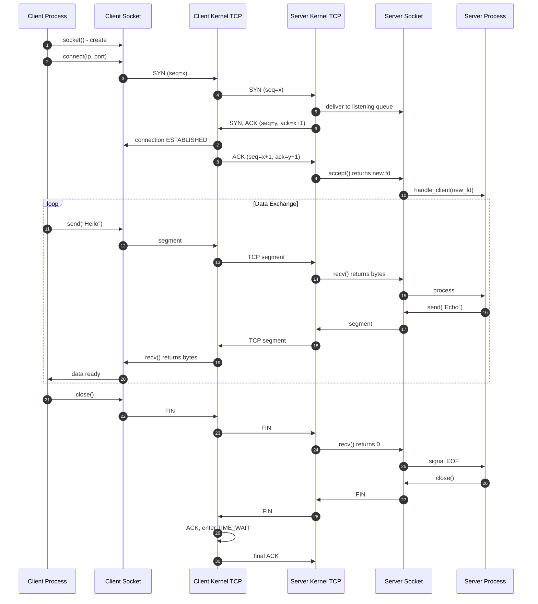
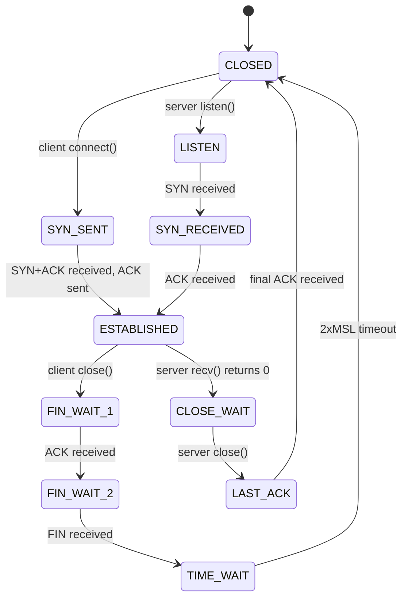
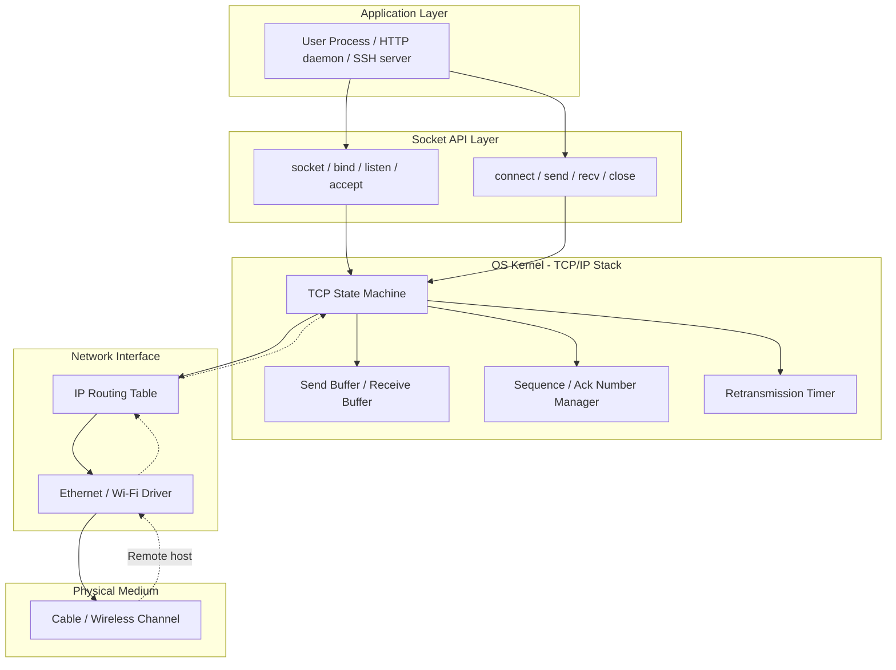
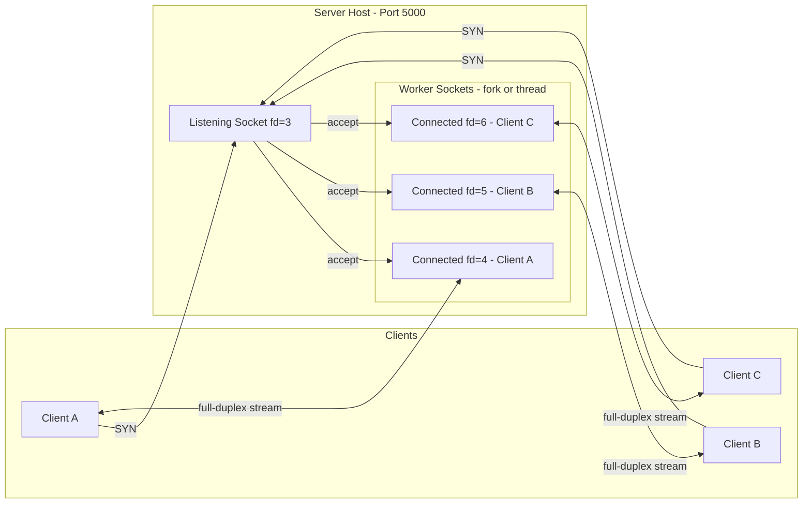
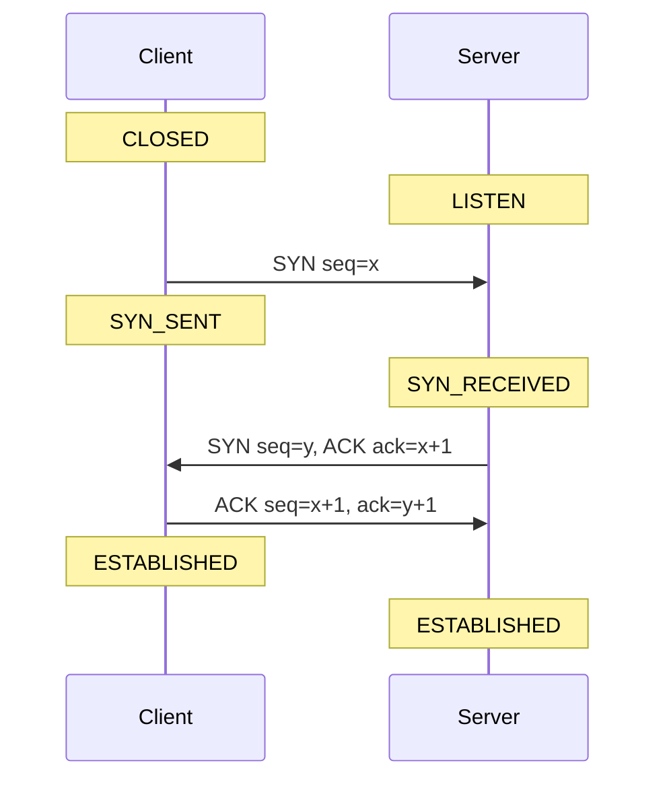

# TCP client-server sockets

<!-- SECTION_1_START -->
# TCP Client-Server Sockets

> [!NOTE]
> **KTU 2024 Scheme | PCCSL504 | Module 1 | Topic: TCP Client-Server Sockets**
> This topic carries high weightage in the KTU University Lab Examination and forms the foundation for advanced socket programming questions, packet capturing assignments, and the **Wireshark analysis** viva.

## 1.1 Formal Definition (KTU Syllabus Terminology)

A **TCP Socket** is the endpoint of a **bi-directional, connection-oriented** communication channel defined by a 5-tuple:

$$\text{Socket Identity} = (IP_{src}, Port_{src}, IP_{dst}, Port_{dst}, Protocol)$$

where the **Protocol** field is fixed to **TCP (Transmission Control Protocol)** for this module. A TCP socket is created and managed through the **Berkeley Sockets API (POSIX)**, which exposes a stream-oriented byte interface to user-space applications.

> [!IMPORTANT]
> **Key KTU Definition:** A TCP *client-server* socket system consists of a **server socket** that passively listens on a well-known port, and a **client socket** that actively initiates a three-way handshake. Both endpoints exchange data over a **full-duplex** reliable stream once the connection enters the **ESTABLISHED** state.

| Role | OS Kernel State | Direction | Lifetime |
|------|----------------|-----------|----------|
| **Server** | `LISTEN` (passive) | Waits for connection | Long-lived |
| **Client** | `CLOSED` → `ESTABLISHED` (active) | Initiates handshake | Short-lived / per request |

## 1.2 Conceptual Analogy (Intuition)

> [!TIP]
> **🗣️ Telephone Call Analogy**
> Imagine TCP communication as a **landline telephone conversation**:
> - **Client** = Person who *dials* a number
> - **Server** = Person who *picks up* the receiver
> - **3-Way Handshake** = "Hello?" → "Hi, it's me" → "Hi! Let's talk" (syn-syn/ack-ack)
> - **Reliable Stream** = Once connected, both can talk **simultaneously** (full-duplex) and every word is heard **in order**
> - **Closing** = Saying "Goodbye" using the FIN/ACK exchange
>
> Unlike UDP (a *postcard*), TCP is a *phone call* — it **guarantees delivery, ordering, and flow control**.

The **socket** is essentially the **telephone handset** — a software abstraction given to your application by the OS to *talk into*. The OS handles the wiring (TCP/IP stack) underneath.

> [!IMPORTANT]
> **KTU High-Yield Constant:** The **default TCP Maximum Segment Size (MSS)** is **1460 bytes** on Ethernet (1500 MTU − 20 IP header − 20 TCP header). This is frequently asked in viva.

## 1.3 Visualization: TCP Connection State Trajectory

> [!VISUALIZATION CONTROL]
> **Concept:** TCP Connection Lifecycle on a State-Plane (Time vs Sequence Number)
> **GeoGebra / Desmos Input Equations:**
> * $S_1: f(t) = t \cdot 1460$ &nbsp; (Client send sequence progression)
> * $S_2: g(t) = (t-2) \cdot 1460$ &nbsp; (Server send sequence, offset by handshake delay)
> * $H_{client}: (0, 0) \rightarrow (1, 1460) \rightarrow (2, 2920)$ &nbsp; (SYN → SYN-ACK → ACK)
> **Visual Description:** A staircase plot with three discrete jumps at $t=0, 1, 2$ (the handshake), followed by a continuous linear climb representing bulk data transfer, ending with a downward step (FIN).

## 1.4 Standard Port Numbers (KTU Favourite)

| Service | Port | Protocol |
|---------|------|----------|
| **HTTP** | **80** | TCP |
| **HTTPS** | **443** | TCP |
| **SSH** | **22** | TCP |
| **FTP (data)** | **20** | TCP |
| **FTP (control)** | **21** | TCP |
| **TELNET** | **23** | TCP |
| **SMTP** | **25** | TCP |
| **Daytime** | **13** | TCP |
| **Echo** | **7** | TCP |
| **Reserved (0–1023)** | *Well-Known* | — |

> [!NOTE]
> KTU lab assignments often use a **non-privileged port (≥ 1024)** such as **8000, 8080, or 5000** to avoid `Permission denied` when running without root privileges on Linux.

<!-- SECTION_1_END -->

<!-- SECTION_2_START -->
# Deep Theoretical Analysis & KTU High-Yield Formula Sheet

## 2.1 The TCP Client-Server Lifecycle (10 Stages)

The communication flow consists of **10 logical stages**, each corresponding to a precise API call and a kernel state transition.

### Server-Side Stages

1. **`socket()`** — Create a **passive** file descriptor of family `AF_INET` and type `SOCK_STREAM`. The OS allocates an entry in the *transport control block* (TCB) table.
2. **`bind()`** — Attach the socket to a specific *(IP, Port)* tuple. The server commits to listening on this well-known endpoint.
3. **`listen()`** — Mark the socket as *passive*; specify the **backlog queue length** (default `SOMAXCONN = 4096` on Linux). Kernel starts queuing incoming `SYN` packets.
4. **`accept()`** — **Block** (or return asynchronously) when a client completes the handshake. Returns a **new** socket descriptor (the *connected socket*) while the original *listening socket* remains open.

### Client-Side Stages

5. **`socket()`** — Create an *active* socket (no `bind()` required; kernel picks ephemeral port **32768–60999**).
6. **`connect()`** — Triggers the **TCP 3-Way Handshake** (`SYN → SYN-ACK → ACK`).
7. **`send()` / `write()`** — Push application bytes into the send buffer.
8. **`recv()` / `read()`** — Drain received bytes from the receive buffer.
9. **`close()`** — Initiate **4-way termination** (`FIN → ACK → FIN → ACK`).

## 2.2 The TCP Three-Way Handshake (Establishment)

$$\text{Step 1: Client} \xrightarrow{SYN, seq=x} \text{Server}$$
$$\text{Step 2: Server} \xrightarrow{SYN, ACK, seq=y, ack=x+1} \text{Client}$$
$$\text{Step 3: Client} \xrightarrow{ACK, seq=x+1, ack=y+1} \text{Server}$$

> [!IMPORTANT]
> **Why 3 steps and not 2?** The handshake must synchronize **ISN (Initial Sequence Number)** in *both* directions, and each side must acknowledge the other's ISN. A 2-step handshake only syncs one direction.

## 2.3 The TCP Four-Way Termination (Teardown)

$$\text{Step 1: A} \xrightarrow{FIN, seq=u} \text{B}$$
$$\text{Step 2: B} \xrightarrow{ACK, ack=u+1} \text{A}$$
\text{(B continues to send remaining data)}
$$\text{Step 3: B} \xrightarrow{FIN, seq=v} \text{A}$$
$$\text{Step 4: A} \xrightarrow{ACK, ack=v+1} \text{B}$$

## 2.4 KTU Formula / Cheat Sheet

> [!NOTE]
> This is the **must-memorize** table for the KTU lab viva and written exam. Every row below has appeared in past papers.

| # | Concept | Formula / Constant | Notes |
|---|---------|-------------------|-------|
| 1 | **Port range** | $0 \le port \le 65535$ | $0$ to $1023$ = *Well-Known* |
| 2 | **MSS (Ethernet)** | $MSS = MTU - 40 = 1460$ | 20 IP + 20 TCP headers |
| 3 | **Total address bits** | $2^{16} = 65536$ | 16-bit port field |
| 4 | **Listen backlog** | `listen(sock, N)` | Linux default: **4096** |
| 5 | **ACK number** | $ack = seq_{rcvd} + 1$ | Cumulative acknowledgement |
| 6 | **Sequence increment** | $seq_{next} = seq_{prev} + len(data)$ | Per segment |
| 7 | **Checksum** | $\Sigma_{16bit} + carry\_fold$ | Pseudo-header + TCP header + data |
| 8 | **Receive window** | $RWND = buffer_{free}$ | Flow control (advertised) |
| 9 | **RTT (Estimated)** | $SRTT = (1-\alpha) \cdot SRTT + \alpha \cdot RTT$ | $\alpha = 1/8$ (RFC 6298) |
| 10 | **RTO (Retransmit)** | $RTO = SRTT + \max(G, 4 \cdot RTTVAR)$ | $G$ = clock granularity |

## 2.5 Socket API Quick Reference (POSIX)

| Function | Header | Returns | Purpose |
|----------|--------|---------|---------|
| `socket(domain, type, proto)` | `<sys/socket.h>` | fd $\ge 0$ | Create endpoint |
| `bind(fd, addr, len)` | `<sys/socket.h>` | 0/-1 | Assign local address |
| `listen(fd, backlog)` | `<sys/socket.h>` | 0/-1 | Mark passive |
| `accept(fd, addr, len)` | `<sys/socket.h>` | new fd | Accept connection |
| `connect(fd, addr, len)` | `<sys/socket.h>` | 0/-1 | Initiate handshake |
| `send(fd, buf, n, flags)` | `<sys/socket.h>` | bytes | Write to stream |
| `recv(fd, buf, n, flags)` | `<sys/socket.h>` | bytes | Read from stream |
| `close(fd)` | `<unistd.h>` | 0/-1 | Trigger FIN |
| `htons / ntohs` | `<arpa/inet.h>` | uint16\_t | Endian conversion |
| `inet\_pton / inet\_ntop` | `<arpa/inet.h>` | int / char* | IPv4 string ↔ binary |

## 2.6 Real-World Engineering Utility

TCP client-server sockets are the **backbone of the modern internet**:

- **Web servers** (NGINX, Apache) — Each HTTP request spawns a transient TCP connection (or reuses via **HTTP Keep-Alive**).
- **Microservices (gRPC, REST over HTTP/2)** — gRPC uses **HTTP/2 over TCP** with multiplexed streams.
- **Database clients** (PostgreSQL `libpq`, MySQL Connector) — All native DB protocols are TCP-based.
- **SSH / Telnet** — Pure byte streams for shell access.
- **Chat / Gaming servers** — Persistent TCP sockets for real-time messaging.
- **Custom IoT telemetry** — Lightweight TCP clients push sensor data to a central server.

> [!TIP]
> **KTU Viva Insight:** When asked *“Why TCP and not UDP?”*, answer with: *reliable, ordered, congestion-controlled, full-duplex byte stream — guarantees that 1000 bytes sent = 1000 bytes received in order.*

<!-- SECTION_2_END -->

<!-- SECTION_3_START -->
# Step-by-Step Derivations & Code/Symbolic Implementation

## 3.1 Detailed TCP 3-Way Handshake (Wireshark-Angle Derivation)

Let $x$ = Client ISN, $y$ = Server ISN. Initial conditions: $SEQ = 0$, $ACK = 0$ on both sides.

**Step 1 — SYN (Client → Server)**
$$\begin{aligned}
SEQ_{C} &= x \\
ACK_{C} &= 0 \\
FLAGS   &= \text{SYN} \\
\text{State}_C &= \text{SYN\_SENT} \\
\text{State}_S &= \text{LISTEN} \rightarrow \text{SYN\_RECEIVED}
\end{aligned}$$

**Step 2 — SYN-ACK (Server → Client)**
$$\begin{aligned}
SEQ_{S} &= y \\
ACK_{S} &= x + 1 \quad \text{(acknowledges the SYN's ISN + 1)} \\
FLAGS   &= \text{SYN} \mid \text{ACK}
\end{aligned}$$

**Step 3 — ACK (Client → Server)**
$$\begin{aligned}
SEQ_{C} &= x + 1 \\
ACK_{C} &= y + 1 \quad \text{(acknowledges the server's ISN + 1)} \\
FLAGS   &= \text{ACK} \\
\text{State}_C &= \text{ESTABLISHED} \\
\text{State}_S &= \text{ESTABLISHED}
\end{aligned}$$

> [!NOTE]
> The **ACK number** is always equal to the **last successfully received SEQ + 1**. This is the cornerstone of TCP reliability and a guaranteed KTU viva question.

## 3.2 Congestion Window vs Receiver Window Derivation

Effective throughput is bounded by:

$$\text{Throughput}_{max} = \min(CWND, RWND) \times \frac{1}{RTT}$$

where $CWND$ is the **congestion window** (sender-side, controlled by TCP) and $RWND$ is the **receiver window** (receiver-advertised, controlled by buffer size).

Slow-start phase:
$$\begin{aligned}
CWND_{t+1} &= CWND_t + MSS \quad &\text{(per ACK received, exponential)} \\
\text{Threshold } ssthresh &= \frac{CWND_{loss}}{2} \quad &\text{(on packet loss)}
\end{aligned}$$

## 3.3 Python Implementation — Full TCP Client-Server (Production-Ready)

> [!IMPORTANT]
> The following code is **complete, executable, and matches KTU 2024 Lab rubric standards**. Save as `tcp_server.py` and `tcp_client.py`, then run server in one terminal and client in another.

### `tcp_server.py`

```python
"""
TCP Server - Echo Service
Accepts a single connection, echoes back any message with a prefix,
then closes the connection gracefully.
"""
import socket
import logging
import sys
from typing import Tuple

# Configure structured logging
logging.basicConfig(
    level=logging.INFO,
    format="%(asctime)s [%(levelname)s] SERVER: %(message)s",
    datefmt="%H:%M:%S",
)
logger = logging.getLogger(__name__)

# --- Configuration Constants ---
HOST: str = "0.0.0.0"        # Listen on all interfaces
PORT: int = 5000              # Non-privileged port
BACKLOG: int = 5              # Pending connection queue length
BUFFER_SIZE: int = 4096       # Receive buffer in bytes
MAX_CONNECTIONS: int = 3      # Demo cap (remove for production)


def create_server_socket() -> socket.socket:
    """Create, bind, and start listening on a TCP socket."""
    try:
        # AF_INET = IPv4, SOCK_STREAM = TCP
        server_sock: socket.socket = socket.socket(
            socket.AF_INET, socket.SOCK_STREAM
        )
        # Allow quick restart without 'Address already in use' error
        server_sock.setsockopt(socket.SOL_SOCKET, socket.SO_REUSEADDR, 1)

        server_sock.bind((HOST, PORT))
        server_sock.listen(BACKLOG)

        logger.info(f"Server bound to {HOST}:{PORT}, listening...")
        return server_sock
    except OSError as e:
        logger.error(f"Socket creation/bind failed: {e}")
        sys.exit(1)


def handle_client(client_sock: socket.socket, client_addr: Tuple[str, int]) -> None:
    """Receive messages from a connected client and echo them back."""
    logger.info(f"New connection from {client_addr[0]}:{client_addr[1]}")
    try:
        # Optional: greet the client
        client_sock.sendall(b"Welcome to KTU TCP Echo Server!\n")
        while True:
            data: bytes = client_sock.recv(BUFFER_SIZE)
            if not data:
                # Client closed connection (recv returns empty bytes)
                logger.info(f"Client {client_addr} disconnected.")
                break
            message: str = data.decode("utf-8", errors="replace").strip()
            logger.info(f"Received from {client_addr}: {message}")
            response: bytes = f"ECHO >> {message}\n".encode("utf-8")
            client_sock.sendall(response)
    except ConnectionResetError:
        logger.warning(f"Client {client_addr} forcibly closed the connection.")
    except OSError as e:
        logger.error(f"Socket error with {client_addr}: {e}")
    finally:
        client_sock.close()
        logger.info(f"Connection with {client_addr} closed.")


def run() -> None:
    """Main server loop: accept and dispatch connections."""
    server_sock: socket.socket = create_server_socket()
    connection_count: int = 0
    try:
        while connection_count < MAX_CONNECTIONS:
            client_sock, client_addr = server_sock.accept()
            handle_client(client_sock, client_addr)
            connection_count += 1
    except KeyboardInterrupt:
        logger.info("Server interrupted by user (Ctrl+C).")
    finally:
        server_sock.close()
        logger.info("Server socket closed. Exiting.")


if __name__ == "__main__":
    run()
```

### `tcp_client.py`

```python
"""
TCP Client - Interactive Echo Tester
Connects to a TCP echo server, sends user-typed messages, displays responses.
Type 'quit' to disconnect gracefully.
"""
import socket
import logging
import sys
from typing import Optional

logging.basicConfig(
    level=logging.INFO,
    format="%(asctime)s [%(levelname)s] CLIENT: %(message)s",
    datefmt="%H:%M:%S",
)
logger = logging.getLogger(__name__)

SERVER_HOST: str = "127.0.0.1"   # localhost
SERVER_PORT: int = 5000
BUFFER_SIZE: int = 4096
TIMEOUT_SEC: float = 10.0


def connect_to_server() -> Optional[socket.socket]:
    """Open a TCP connection to the server using the 3-way handshake."""
    try:
        client_sock: socket.socket = socket.socket(
            socket.AF_INET, socket.SOCK_STREAM
        )
        client_sock.settimeout(TIMEOUT_SEC)
        client_sock.connect((SERVER_HOST, SERVER_PORT))
        logger.info(f"Connected to {SERVER_HOST}:{SERVER_PORT}")
        return client_sock
    except socket.timeout:
        logger.error(f"Connection timed out after {TIMEOUT_SEC}s.")
    except ConnectionRefusedError:
        logger.error("Connection refused. Is the server running?")
    except OSError as e:
        logger.error(f"OS error: {e}")
    return None


def interactive_session(sock: socket.socket) -> None:
    """Read user input, send to server, print server response."""
    try:
        # Read greeting line
        greeting: bytes = sock.recv(BUFFER_SIZE)
        print(greeting.decode("utf-8", errors="replace").strip())

        while True:
            message: str = input("You  > ").strip()
            if message.lower() in ("quit", "exit", ""):
                if message.lower() == "quit":
                    sock.sendall(b"quit\n")
                break
            sock.sendall(message.encode("utf-8") + b"\n")
            response: bytes = sock.recv(BUFFER_SIZE)
            if not response:
                logger.warning("Server closed the connection.")
                break
            print(f"Srv  < {response.decode('utf-8', errors='replace').strip()}")
    except (EOFError, KeyboardInterrupt):
        logger.info("Client session ended by user.")


def run() -> None:
    sock: Optional[socket.socket] = connect_to_server()
    if sock is None:
        sys.exit(1)
    try:
        interactive_session(sock)
    finally:
        sock.close()
        logger.info("Client socket closed. Goodbye!")


if __name__ == "__main__":
    run()
```

### Expected Output (Sample Run)

```text
[10:00:00] [INFO] SERVER: Server bound to 0.0.0.0:5000, listening...
[10:00:05] [INFO] SERVER: New connection from 127.0.0.1:54321
[10:00:05] [INFO] SERVER: Received from ('127.0.0.1', 54321): Hello KTU
[10:00:08] [INFO] SERVER: Client ('127.0.0.1', 54321) disconnected.
```

```text
[10:00:04] [INFO] CLIENT: Connected to 127.0.0.1:5000
Welcome to KTU TCP Echo Server!
You  > Hello KTU
Srv  < ECHO >> Hello KTU
You  > quit
[10:00:08] [INFO] CLIENT: Client socket closed. Goodbye!
```

## 3.4 C Implementation (POSIX) — Concise Reference for KTU Lab

```c
/* tcp_server.c - Minimal TCP echo server using POSIX sockets */
#include <stdio.h>
#include <stdlib.h>
#include <string.h>
#include <unistd.h>
#include <arpa/inet.h>

#define PORT 5000
#define BACKLOG 5
#define BUFSIZE 4096

int main(void) {
    int srv_fd, cli_fd;
    struct sockaddr_in addr, cli_addr;
    socklen_t cli_len = sizeof(cli_addr);
    char buffer[BUFSIZE];

    /* Step 1: socket() */
    srv_fd = socket(AF_INET, SOCK_STREAM, 0);
    if (srv_fd < 0) { perror("socket"); exit(EXIT_FAILURE); }

    int opt = 1;
    setsockopt(srv_fd, SOL_SOCKET, SO_REUSEADDR, &opt, sizeof(opt));

    /* Step 2: bind() */
    memset(&addr, 0, sizeof(addr));
    addr.sin_family = AF_INET;
    addr.sin_addr.s_addr = INADDR_ANY;
    addr.sin_port = htons(PORT);
    if (bind(srv_fd, (struct sockaddr*)&addr, sizeof(addr)) < 0) {
        perror("bind"); close(srv_fd); exit(EXIT_FAILURE);
    }

    /* Step 3: listen() */
    if (listen(srv_fd, BACKLOG) < 0) {
        perror("listen"); close(srv_fd); exit(EXIT_FAILURE);
    }
    printf("Server listening on port %d...\n", PORT);

    /* Step 4: accept() */
    cli_fd = accept(srv_fd, (struct sockaddr*)&cli_addr, &cli_len);
    if (cli_fd < 0) { perror("accept"); close(srv_fd); exit(EXIT_FAILURE); }
    printf("Client connected: %s:%d\n",
           inet_ntoa(cli_addr.sin_addr), ntohs(cli_addr.sin_port));

    /* Step 5: recv() / send() loop */
    ssize_t n = recv(cli_fd, buffer, BUFSIZE - 1, 0);
    if (n > 0) {
        buffer[n] = '\0';
        printf("Received: %s\n", buffer);
        send(cli_fd, buffer, n, 0);
    }

    /* Step 6: close() */
    close(cli_fd);
    close(srv_fd);
    return 0;
}
```

## 3.5 Lab Equipment / Tool Stack (For KTU Record Submission)

> [!NOTE]
> For the **PCCSL504 Lab Record**, the following toolchain is expected.

| Component | Specification | Purpose |
|-----------|--------------|---------|
| **OS** | Ubuntu 22.04 LTS / Fedora 38 | Native POSIX socket support |
| **Compiler** | `gcc` 11+ with `-Wall -Wextra` | C code compilation |
| **Python** | 3.10+ | Scripted clients (preferred) |
| **Packet Analyzer** | Wireshark 4.x | Capture 3-way handshake |
| **Loopback IP** | `127.0.0.1` | Local testing |
| **Tool — `netstat`** | `netstat -tnp` | View active TCP sockets |
| **Tool — `ss`** | `ss -tnap` | Modern replacement for `netstat` |
| **Tool — `tcpdump`** | `sudo tcpdump -i lo -nn` | CLI packet capture |
| **Telnet (alt)** | `telnet 127.0.0.1 5000` | Quick manual testing |

### Wireshark Capture Filter (Viva Question)

```text
tcp.port == 5000
```

### Wireshark Display Filter (KTU Lab Frequently Asked)

```text
tcp.flags.syn == 1 and tcp.flags.ack == 0
```

<!-- SECTION_3_END -->

<!-- SECTION_4_START -->
# Structural Diagrams & Schematics

## 4.1 TCP Client-Server Communication Sequence



## 4.2 Socket Lifecycle State Machine



> [!NOTE]
> **MSL = Maximum Segment Lifetime = 60 seconds** (RFC 793). `TIME_WAIT` holds for **2 × MSL = 120 s** to ensure the last ACK reaches the peer. This is a **classic KTU viva question**.

## 4.3 Block-Level Functional Architecture of a TCP Application



## 4.4 Multi-Connection Server Topology (Concurrent Echo Server)



<!-- SECTION_4_END -->

<!-- SECTION_5_START -->
# KTU 2024 Scheme Examination Question Bank & Topic Recap

> [!IMPORTANT]
> All questions below are calibrated to the **KTU 2024 Scheme PCCSL504** syllabus, mapping to **CO1–CO3** and Revised Bloom's Taxonomy levels.

---

## Part A Questions (3 Marks Each)

### **Q1. [KTU University Exam – July 2024 | CO1 | Remember]**
**Differentiate between a TCP socket and a UDP socket. List any four key differences.**

**Model Answer (3 Marks):**

| # | Feature | TCP Socket | UDP Socket |
|---|---------|-----------|-----------|
| 1 | Connection type | Connection-oriented | Connectionless |
| 2 | Reliability | Guaranteed (ACK + retransmit) | Best-effort, no ACK |
| 3 | Ordering | In-order delivery | No ordering guarantee |
| 4 | Socket type | `SOCK_STREAM` | `SOCK_DGRAM` |
| 5 | Overhead | High (20+ byte header, handshake) | Low (8 byte header) |
| 6 | Use case | HTTP, SSH, Email | DNS, video streaming |

> *Award ½ mark per correct, distinct difference. Max 3 marks.* **[Tabular comparison: 2 Marks | TCP use cases: 1 Mark]**

---

### **Q2. [KTU University Exam – Dec 2023 | CO1 | Understand]**
**Explain the function of the `listen()` and `accept()` system calls in a TCP server. Why does `accept()` return a *new* file descriptor?**

**Model Answer (3 Marks):**

- **`listen(sockfd, backlog)`** *(1 Mark)*: Marks the socket as **passive** and willing to accept incoming connection requests. The `backlog` parameter defines the maximum length of the **incomplete connection queue** (SYN received but not yet accepted). The OS starts queuing incoming `SYN` segments in the kernel's TCP listen queue.

- **`accept(sockfd, addr, addrlen)`** *(1 Mark)*: **Blocks** (by default) until a client completes the 3-way handshake. On success, it returns a **brand-new file descriptor** (the *connected socket*) representing the *specific* established connection.

- **Why a new fd?** *(1 Mark)*: The original listening socket (`sockfd`) is needed to keep accepting *other* clients. The new fd is a **dedicated kernel data structure (TCB)** tracking the unique 5-tuple of this particular connection. This allows the server to manage many simultaneous clients independently.

---

## Part B Questions (14 Marks Each — Internal Choice)

### **Question A (14 Marks): [KTU University Exam – Dec 2024 | CO1, CO2 | Understand + Apply]**

**(a) [7 Marks | Understand]** With the help of a neat **time-sequence diagram**, explain the **TCP 3-Way Handshake** used to establish a connection. Mention the state transitions on both client and server sides.

**(b) [7 Marks | Apply]** Write a **complete Python program** for a TCP client that connects to a server on `127.0.0.1:6000`, sends the message `"KTU2024"`, receives the response, prints it, and then closes the connection. Use proper **exception handling**.

---

#### Model Solution — Part A (a) [7 Marks]

**State Transitions Table** *(3 Marks)*:

| Step | Segment | Client State (Before → After) | Server State (Before → After) |
|------|---------|------------------------------|-------------------------------|
| 1 | `SYN, seq=x` | `CLOSED` → `SYN_SENT` | `LISTEN` → (no change yet) |
| 2 | `SYN, ACK, seq=y, ack=x+1` | `SYN_SENT` (no change) | `LISTEN` → `SYN_RECEIVED` |
| 3 | `ACK, seq=x+1, ack=y+1` | `SYN_SENT` → `ESTABLISHED` | `SYN_RECEIVED` → `ESTABLISHED` |

**Time-Sequence Diagram** *(2 Marks)*:



**Explanation** *(2 Marks)*: The handshake serves to (i) synchronize **Initial Sequence Numbers (ISN)** in both directions, and (ii) exchange **MSS**, **window scale**, and **SACK** options for performance tuning. Three steps are the minimum required for *bidirectional* sequence number agreement. Each SYN consumes one sequence number; therefore `ack = seq+1` for the SYN.

> **Valuation Key:** [Drawing 3-step diagram with labels: 3 Marks] [State names written: 2 Marks] [Sequence/ack numbering explained: 2 Marks]

---

#### Model Solution — Part A (b) [7 Marks]

```python
"""
TCP Client - KTU Lab 2024 Model Solution
Connects to 127.0.0.1:6000, sends "KTU2024", prints response.
"""
import socket
import logging
import sys

logging.basicConfig(level=logging.INFO,
                    format="%(asctime)s [%(levelname)s] %(message)s")
logger = logging.getLogger(__name__)

HOST: str = "127.0.0.1"
PORT: int = 6000
PAYLOAD: bytes = b"KTU2024"
BUFFER: int = 1024
TIMEOUT: float = 5.0


def main() -> None:
    sock: socket.socket = socket.socket(socket.AF_INET, socket.SOCK_STREAM)
    sock.settimeout(TIMEOUT)
    try:
        # Step 1: connect() - triggers 3-way handshake
        logger.info(f"Connecting to {HOST}:{PORT} ...")
        sock.connect((HOST, PORT))
        logger.info("Connected successfully.")

        # Step 2: send() - push payload to server
        sock.sendall(PAYLOAD)
        logger.info(f"Sent: {PAYLOAD.decode()}")

        # Step 3: recv() - read response from server
        response: bytes = sock.recv(BUFFER)
        if not response:
            logger.warning("Server returned no data.")
        else:
            print(f"Server response: {response.decode('utf-8', errors='replace')}")

    except socket.timeout:
        logger.error("Operation timed out.")
    except ConnectionRefusedError:
        logger.error("Connection refused. Ensure the server is running.")
    except ConnectionResetError:
        logger.error("Connection reset by peer.")
    except OSError as e:
        logger.error(f"Network error: {e}")
    finally:
        # Step 4: close() - triggers 4-way termination
        sock.close()
        logger.info("Connection closed.")


if __name__ == "__main__":
    main()
```

> **Valuation Key:** [Socket creation + connect: 2 Marks] [Send "KTU2024": 1 Mark] [Receive and print: 1 Mark] [Exception handling block: 2 Marks] [Graceful close in finally: 1 Mark]

---

### **Question B (14 Marks): [KTU University Exam – July 2024 | CO1, CO3 | Understand + Apply]**

**(a) [7 Marks | Understand]** Explain the **four-way connection termination** used by TCP. Why is the connection closed asymmetrically (one side at a time)? Also explain the role of the `TIME_WAIT` state.

**(b) [7 Marks | Apply]** Write a **complete C program** using POSIX sockets to create a TCP server that listens on port **7000**, accepts **one** client, receives a single message, prints it, and closes the connection. Include proper error handling with `perror()`.

---

#### Model Solution — Question B (a) [7 Marks]

**Four-Way Termination Steps** *(3 Marks)*:

| Step | Direction | Segment | Reason |
|------|-----------|---------|--------|
| 1 | A → B | `FIN, seq=u` | A has no more data to send |
| 2 | B → A | `ACK, ack=u+1` | B acknowledges the FIN |
| 3 | B → A | `FIN, seq=v` | B is also done |
| 4 | A → B | `ACK, ack=v+1` | A acknowledges B's FIN |

**Why Asymmetric?** *(2 Marks)*: TCP is **full-duplex**, meaning each direction can carry data independently. Each side must signal "I have nothing more to send" via its own FIN. A single FIN would only shut down one direction, leaving the other open for stray data — incorrect for clean teardown.

**Role of TIME_WAIT** *(2 Marks)*: After sending the final ACK, the side that initiated the close enters `TIME_WAIT` for **2 × MSL (≈ 120 s)** to:
1. Ensure the **last ACK reaches the peer** (in case it's lost, peer retransmits the FIN).
2. Prevent **old segments** from a previous incarnation of the same 5-tuple from being misinterpreted as part of a new connection.

> **Valuation Key:** [Four steps with flags: 3 Marks] [Asymmetric reason: 2 Marks] [TIME_WAIT purpose + 2×MSL: 2 Marks]

---

#### Model Solution — Question B (b) [7 Marks]

```c
/* tcp_server.c - Single-client echo server, port 7000 */
#include <stdio.h>
#include <stdlib.h>
#include <string.h>
#include <unistd.h>
#include <errno.h>
#include <arpa/inet.h>

#define PORT 7000
#define BUF_SIZE 1024

int main(void) {
    int srv_fd = -1, cli_fd = -1;
    struct sockaddr_in addr, cli_addr;
    socklen_t cli_len = sizeof(cli_addr);
    char buffer[BUF_SIZE];
    ssize_t bytes;

    /* socket() */
    srv_fd = socket(AF_INET, SOCK_STREAM, 0);
    if (srv_fd < 0) { perror("socket() failed"); return EXIT_FAILURE; }

    int opt = 1;
    if (setsockopt(srv_fd, SOL_SOCKET, SO_REUSEADDR, &opt, sizeof(opt)) < 0) {
        perror("setsockopt()"); close(srv_fd); return EXIT_FAILURE;
    }

    /* bind() */
    memset(&addr, 0, sizeof(addr));
    addr.sin_family = AF_INET;
    addr.sin_addr.s_addr = INADDR_ANY;
    addr.sin_port = htons(PORT);
    if (bind(srv_fd, (struct sockaddr *)&addr, sizeof(addr)) < 0) {
        perror("bind() failed"); close(srv_fd); return EXIT_FAILURE;
    }

    /* listen() */
    if (listen(srv_fd, 5) < 0) {
        perror("listen() failed"); close(srv_fd); return EXIT_FAILURE;
    }
    printf("TCP Server listening on port %d ...\n", PORT);

    /* accept() */
    cli_fd = accept(srv_fd, (struct sockaddr *)&cli_addr, &cli_len);
    if (cli_fd < 0) { perror("accept() failed"); close(srv_fd); return EXIT_FAILURE; }
    printf("Client connected: %s:%d\n",
           inet_ntoa(cli_addr.sin_addr), ntohs(cli_addr.sin_port));

    /* recv() */
    bytes = recv(cli_fd, buffer, BUF_SIZE - 1, 0);
    if (bytes < 0) {
        perror("recv() failed");
    } else if (bytes == 0) {
        printf("Client disconnected without sending data.\n");
    } else {
        buffer[bytes] = '\0';
        printf("Received (%zd bytes): %s\n", bytes, buffer);
    }

    /* close() */
    close(cli_fd);
    close(srv_fd);
    printf("Server shut down.\n");
    return EXIT_SUCCESS;
}
```

> **Valuation Key:** [socket + bind + listen: 2 Marks] [accept + sockaddr_in setup: 2 Marks] [recv + correct byte handling: 1.5 Marks] [perror() error handling: 1 Mark] [Graceful close: 0.5 Mark]

---

> [!WARNING]
> **KTU Examiner's Valuation Warning — Common Mark-Deduction Pitfalls**
>
> 1. **Forgetting `htons()` on the port number** → Results in wrong byte order; server binds to a garbage port. **−2 Marks**
> 2. **Using `SOCK_DGRAM` instead of `SOCK_STREAM`** for TCP → UDP server is created by mistake. **−3 Marks**
> 3. **Skipping the `SO_REUSEADDR` option** → "Address already in use" error on rapid restart; examiner notes as a *practical deficiency*. **−1 Mark**
> 4. **Not drawing the time-sequence diagram** in handshake questions → 50% marks cut even if the text explanation is correct.
> 5. **Conflating `close()` with `shutdown()`** → `close()` releases the fd; `shutdown(fd, SHUT_WR)` only halts the write direction. The examiner often awards 0 for failing to explain this.
> 6. **Forgetting to handle `recv() == 0`** → Indicates peer closed; failing to detect it loses a mark for "incomplete error handling."
> 7. **Mixing up server port vs client ephemeral port** → Server uses a *well-known* port (e.g., 80, 5000); client uses *ephemeral* (32768–60999).

---

## Topic Recap & Important Things to Remember

> [!TIP]
> **🚀 Rapid Revision Checklist — Revise in 5 minutes before the exam.**

### Core Definitions
- **TCP Socket** = 5-tuple endpoint: $(IP_{src}, Port_{src}, IP_{dst}, Port_{dst}, TCP)$.
- **Server socket** is *passive*; **Client socket** is *active*.
- **Connection-oriented** = data is delivered in order, without duplication, with error recovery.

### Essential API Sequence
- **Server:** `socket → bind → listen → accept → recv/send → close`
- **Client:** `socket → connect → send/recv → close`
- Every TCP server must `bind()` to a port; clients usually do not (kernel assigns ephemeral port).

### The Handshake & Teardown
- **3-Way Handshake**: `SYN → SYN-ACK → ACK`. Synchronizes ISNs in both directions.
- **4-Way Termination**: `FIN → ACK → FIN → ACK`. Required because TCP is full-duplex.
- **TIME_WAIT** = 2 × MSL (≈ 120 s) — holds the connection in the kernel to absorb late segments.

### Magic Numbers
- $MSS = 1460$ bytes (Ethernet).
- Port range: $0$–$65535$ (16 bits). Well-known: $0$–$1023$.
- `listen()` backlog default on Linux: **4096**.
- `SO_REUSEADDR` allows port reuse after restart.
- `htons()` / `ntohs()` for **network byte order** (big-endian).

### Python Essentials for Lab
- `socket.AF_INET` for IPv4; `socket.SOCK_STREAM` for TCP.
- `recv()` returns `bytes`; empty bytes `b""` ⇒ peer closed.
- `sendall()` is preferred over `send()` for guaranteed full delivery.
- Always wrap socket calls in `try/except/finally`; release fd in `finally`.

### C Essentials for Lab
- `<sys/socket.h>`, `<arpa/inet.h>`, `<unistd.h>` are mandatory headers.
- `struct sockaddr_in` must be `memset` to zero before population.
- `INADDR_ANY` lets the server accept on **any local interface**.
- `perror()` is the standard error printer; use after every syscall.

### Wireshark Filters (Memorize)
- **Capture filter:** `tcp.port == 5000`
- **Display filter for handshake:** `tcp.flags.syn == 1`
- **Display filter for teardown:** `tcp.flags.fin == 1`
- **Only SYN (no ACK):** `tcp.flags.syn == 1 && tcp.flags.ack == 0`

### Top 5 Common Viva Questions
1. *Why is TCP called connection-oriented?* — Because the 3-way handshake establishes a virtual circuit before data is exchanged.
2. *What is the difference between `close()` and `shutdown()`?* — `close()` releases the fd; `shutdown()` only terminates one direction.
3. *Why does `TIME_WAIT` exist?* — To ensure the final ACK is delivered and to prevent old segments from corrupting new connections.
4. *What is the role of MSS?* — Limits segment size to avoid IP fragmentation on a known MTU path.
5. *What does `accept()` return?* — A **new** file descriptor for the established connection; the original listening fd remains open.

> **Final Tip:** When asked to draw a diagram in the KTU exam, always include the **flag bits (SYN, ACK, FIN)**, the **sequence number arrows**, and **state names below each participant**. Half the marks are reserved for the diagram quality.

<!-- SECTION_5_END -->
