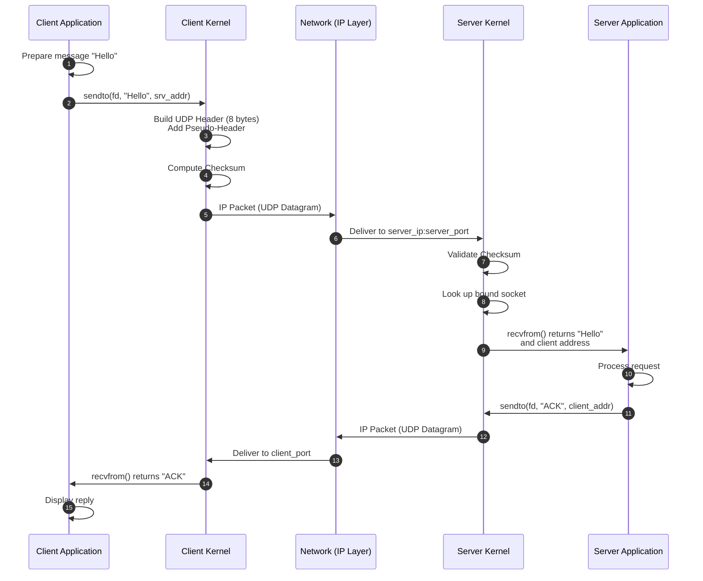
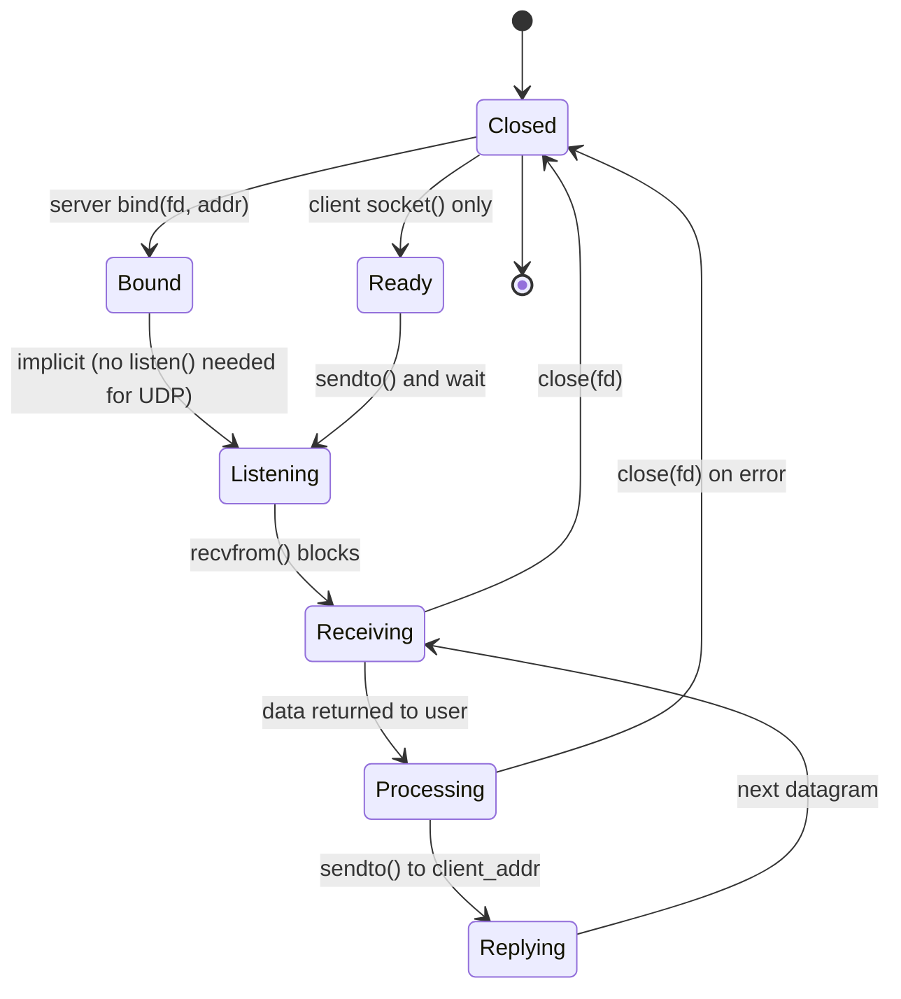
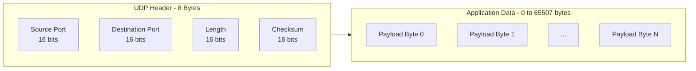
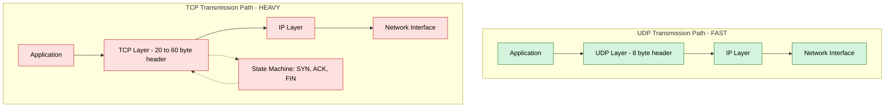
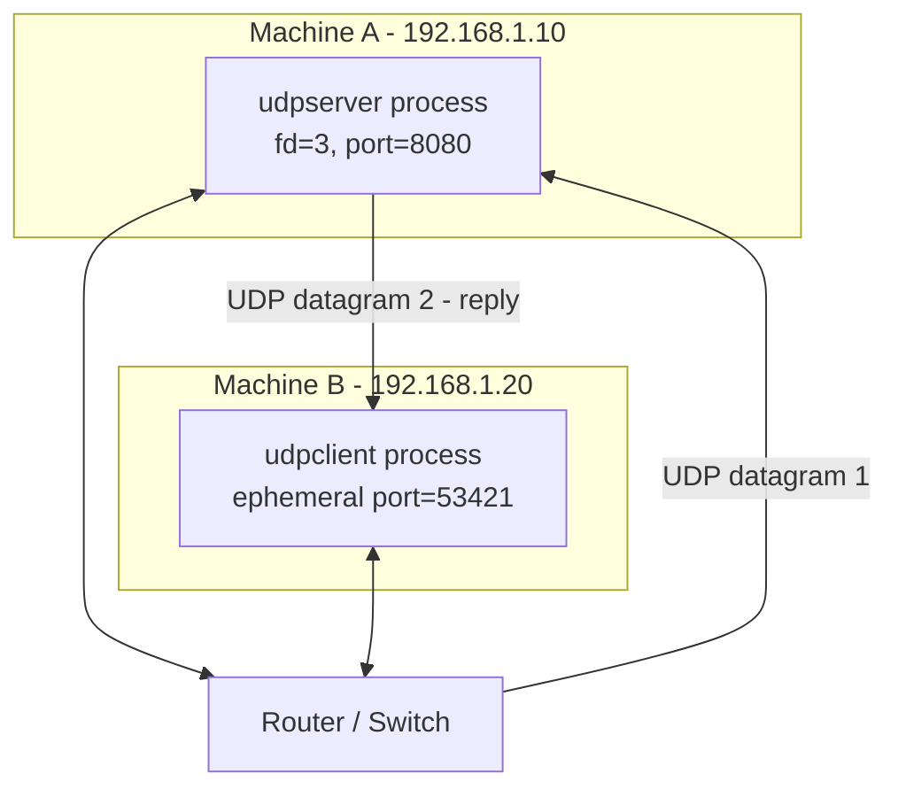

# UDP client-server

<!-- SECTION_1_START -->
# UDP Client-Server Socket Programming

## 1.1 Formal Academic Definition (KTU 2024 Syllabus Terminology)

> [!NOTE]
> **UDP (User Datagram Protocol)** is a **connectionless**, **unreliable**, **message-oriented** transport layer protocol defined in **RFC 768**. In the context of KTU's *Computer Networks Lab (PCCSL504)*, UDP socket programming refers to the process of creating communication endpoints using the **BSD Sockets API** (`socket()`, `bind()`, `sendto()`, `recvfrom()`) that exchange discrete datagrams without establishing a prior virtual connection.

The **Client-Server model** is a distributed application architecture in which the **Server** process passively waits for incoming client requests by binding to a well-known port, while the **Client** process actively initiates communication by sending the first datagram to the server's IP-Port pair.

> [!IMPORTANT]
> **KTU 2024 Lab Module-1 Highlight:** UDP is preferred over TCP for packet-capturing exercises (e.g., **Wireshark** analysis) because its minimalist **8-byte header** keeps the captured frame structure easy to inspect in tools like `tcpdump`.

## 1.2 Conceptual Analogy & Intuition

Imagine you are in a hostel and want to send a handwritten **postcard** to your friend in another hostel:

- You **write the message** on a card (the **payload / datagram**).
- You **write the destination** hostel name and room number on it (the **destination IP + port**).
- You **drop it in the postbox** (the `sendto()` system call).
- You **do not get a return receipt** — if the postcard is lost, you never know.
- You **can drop multiple postcards** at the same time without "dialling" anyone first (no handshake).

**This is exactly how UDP behaves!**

| Real-World Postcard | UDP Concept |
|---|---|
| Postcard itself | **Datagram** |
| Hostel address | **Destination IP Address (32-bit IPv4)** |
| Room number | **Destination Port Number (16-bit)** |
| Postbox slot | **`sendto()` syscall** |
| Friend's mailbox | **`recvfrom()` syscall on server** |
| No return receipt | **No ACK — unreliable delivery** |

In contrast, a **TCP connection** would be like a **phone call** — you dial, the other side picks up (`SYN-SYN-ACK-ACK`), you talk, and then hang up (`FIN`).

## 1.3 Standard Metrics & Constants

The following constants are **mandatory values** you must know for the KTU lab viva and exam:

- **UDP Header Size** = **8 bytes** (fixed)
- **Maximum UDP Datagram Size** = **65,535 bytes** (limited by IPv4 16-bit length field)
- **Maximum UDP Payload** = **65,507 bytes** (65,535 − 20 IP header − 8 UDP header)
- **Reserved Field** in header = **0** (must be zero in current implementations)
- **IANA Reserved Well-Known Port Range** = **0 – 1023**
- **Ephemeral (Client) Port Range** = **49,152 – 65,535** (Linux default)

> [!TIP]
> **Viva Favourite:** The **16-bit Length field** in the UDP header includes the header itself, so `min length = 8`. The optional **Checksum** is mandatory in IPv6 but optional in IPv4 (although most stacks always compute it).

## 1.4 Visualization of the UDP Datagram Layout

> [!VISUALIZATION CONTROL]
> **Concept:** UDP Datagram Byte-Layout Visualization
> **Desmos Input Equations (using x-axis as byte offset, y-axis as bit significance):**
> * `f(x) = 0` for `x \in [0, 31]` (Source Port band)
> * `f(x) = 0` for `x \in [32, 63]` (Destination Port band)
> * `f(x) = 0` for `x \in [64, 95]` (Length band)
> * `f(x) = 0` for `x \in [96, 127]` (Checksum band)
> * `f(x) = 1` for `x \in [128, 65535]` (Payload region)
> **Visual Description:** The student should observe **four 32-bit (4-byte) header words** stacked from byte 0 to 31, followed by a long flat region representing the application payload up to byte 65,535. The first 32 bytes (0–31) form the rigid header.

---

<!-- SECTION_1_END -->

<!-- SECTION_2_START -->
# Deep Theoretical Analysis & KTU High-Yield Reference Sheet

## 2.1 The Five Pillars of UDP Semantics

UDP deliberately omits the machinery that makes TCP heavy. The five properties below define its behaviour:

1. **Connectionless (`SOCK_DGRAM`)** — No `accept()`, no `listen()`. The client and server exchange data in a single atomic message.
2. **Unreliable** — No sequence numbers, no retransmission, no duplicate detection. Lost datagrams vanish silently.
3. **Message-Oriented** — `sendto()` delivers a *discrete* message; the receiver gets the entire message in **one** `recvfrom()` call (preserves message boundaries).
4. **Best-Effort** — The kernel will *not* block waiting for a slow receiver; if the send buffer is full, `sendto()` returns `-1` with `EAGAIN` or `EWOULDBLOCK` (in non-blocking mode).
5. **Stateless** — Each datagram is independent; the server has no concept of a "session" unless you build one in the application layer.

## 2.2 The Five System Calls (Kernel-Level API)

| Step | Server Side | Client Side | Purpose |
|:---:|:---|:---|:---|
| 1 | `socket(AF_INET, SOCK_DGRAM, 0)` | `socket(AF_INET, SOCK_DGRAM, 0)` | Creates an **endpoint** (returns a file descriptor). |
| 2 | `bind(fd, addr, len)` | *(Optional, OS auto-assigns)* | Attaches server to a **well-known IP:Port**. |
| 3 | `recvfrom(fd, buf, n, 0, &cli, &len)` | `sendto(fd, msg, n, 0, &srv, len)` | **Server waits**; **Client sends** first datagram. |
| 4 | `sendto(fd, reply, n, 0, &cli, len)` | `recvfrom(fd, buf, n, 0, &srv, &len)` | **Server replies** using client's address from step 3. |
| 5 | `close(fd)` | `close(fd)` | Releases the socket. |

> [!IMPORTANT]
> **The asymmetric beauty of UDP:** Notice that **both `sendto()` and `recvfrom()` require the peer's address**. This means the server learns the client's port from the *first* `recvfrom()` and can reply to it without ever calling `accept()` — this is the key difference from TCP programming.

## 2.3 KTU High-Yield Formula Sheet (Cheat-Sheet)

| Concept | Formula / Value | Unit / Notes |
|:---|:---|:---|
| UDP Header Length | $H_{UDP} = 8$ | Bytes (fixed) |
| Total Datagram Length | $L_{total} = 8 + L_{payload}$ | Bytes |
| Max Payload | $L_{payload}^{max} = 65{,}507$ | Bytes ($2^{16} - 29$) |
| Header CheckSum (ones-complement) | $C = \sim \sum_{i=0}^{n-1} W_i$ | 16-bit one's-complement sum of pseudo-header + UDP header + data |
| Pseudo-Header Source IP | 32 bits | Used only for checksum validation |
| Port Number Range | $0 \le P \le 65{,}535$ | $2^{16} - 1$ |
| Throughput Model (no flow control) | $T_{UDP} = \dfrac{M}{t_{prop} + t_{trans}}$ | Same as stop-and-wait; but **no ACK round-trip** |
| Bandwidth-Delay Product | $BDP = R \times D$ | Bytes (used to size buffers) |

> [!NOTE]
> **Important Notation Note:** In the rows above, I have deliberately used $\vert$ spacing and $\sim$ to denote complement so the markdown table pipe character does not break. For absolute values, write $\vert x \vert$ in math mode — **never** use the pipe `|` inside table cells.

## 2.4 Real-World Engineering Utility

UDP underpins mission-critical, latency-sensitive applications:

- **DNS Resolution** (Port 53) — Single-question, single-answer; handshake overhead would double latency.
- **Video/Voice Streaming (RTP)** — VoIP apps like *WhatsApp calls* and *Zoom audio* use UDP; a dropped packet is preferable to a delayed packet.
- **Online Gaming** — Player positions update 30–60 times/sec; retransmission of old data is useless.
- **IoT & Sensor Telemetry** — *CoAP* protocol runs over UDP for low-power devices.
- **Broadcast/Multicast** — UDP supports `SO_BROADCAST` and IP multicast (TCP does not).
- **QUIC (HTTP/3)** — Modern transport built on UDP to escape TCP's head-of-line blocking.

---

<!-- SECTION_2_END -->

<!-- SECTION_3_START -->
# Step-by-Step Implementation (Exhaustive Code & Execution Flow)

This module of the KTU lab asks you to **write**, **compile**, **execute**, and **trace packets**. I provide **three complete, runnable artefacts**: (1) a **C implementation** (traditional KTU lab choice), (2) a **Python implementation** (modern, faster to prototype), and (3) a **packet-capture trace** you must replicate using Wireshark.

---

## 3.1 C Implementation (Primary — KTU Exam Standard)

### 3.1.1 `udpserver.c`

```c
/*
 * Filename   : udpserver.c
 * Lab        : PCCSL504 - Module 1 (UDP Server)
 * Compile    : gcc udpserver.c -o udpserver
 * Run        : ./udpserver
 */

#include <stdio.h>
#include <stdlib.h>
#include <string.h>
#include <unistd.h>
#include <errno.h>
#include <arpa/inet.h>
#include <sys/socket.h>

#define SERVER_PORT 8080
#define BUFFER_SIZE 1024

int main(void) {
    int                 server_fd   = -1;
    int                 recv_len    = 0;
    char                buffer[BUFFER_SIZE];
    struct sockaddr_in  server_addr;
    struct sockaddr_in  client_addr;
    socklen_t           client_len  = sizeof(client_addr);

    /* STEP 1: Create UDP socket (IPv4, datagram, default protocol = UDP) */
    server_fd = socket(AF_INET, SOCK_DGRAM, 0);
    if (server_fd < 0) {
        perror("socket() failed");
        return EXIT_FAILURE;
    }
    printf("[SERVER] Socket created successfully. fd = %d\n", server_fd);

    /* STEP 2: Zero out the address structure and populate it */
    memset(&server_addr, 0, sizeof(server_addr));
    server_addr.sin_family      = AF_INET;            /* IPv4 */
    server_addr.sin_addr.s_addr = INADDR_ANY;         /* Listen on all interfaces */
    server_addr.sin_port        = htons(SERVER_PORT); /* Host-to-Network byte order */

    /* STEP 3: Bind the socket to the address:port */
    if (bind(server_fd, (struct sockaddr *)&server_addr, sizeof(server_addr)) < 0) {
        perror("bind() failed");
        close(server_fd);
        return EXIT_FAILURE;
    }
    printf("[SERVER] Bound to port %d. Waiting for datagrams...\n", SERVER_PORT);

    /* STEP 4: Infinite receive loop */
    while (1) {
        memset(buffer, 0, BUFFER_SIZE);
        memset(&client_addr, 0, sizeof(client_addr));

        /* recvfrom blocks until a datagram arrives */
        recv_len = recvfrom(server_fd,
                            buffer,
                            BUFFER_SIZE - 1,
                            0,
                            (struct sockaddr *)&client_addr,
                            &client_len);

        if (recv_len < 0) {
            perror("recvfrom() failed");
            continue;   /* Do not exit; keep serving */
        }

        /* Log the client's address */
        printf("[SERVER] Received %d bytes from %s:%d -> %s\n",
               recv_len,
               inet_ntoa(client_addr.sin_addr),
               ntohs(client_addr.sin_port),
               buffer);

        /* STEP 5: Echo the message back to the client */
        const char *reply = "Message received by UDP server.";
        if (sendto(server_fd,
                   reply,
                   strlen(reply),
                   0,
                   (struct sockaddr *)&client_addr,
                   client_len) < 0) {
            perror("sendto() failed");
        } else {
            printf("[SERVER] Reply sent to client.\n");
        }
    }

    /* Unreachable, but good practice */
    close(server_fd);
    return EXIT_SUCCESS;
}
```

### 3.1.2 `udpclient.c`

```c
/*
 * Filename   : udpclient.c
 * Lab        : PCCSL504 - Module 1 (UDP Client)
 * Compile    : gcc udpclient.c -o udpclient
 * Run        : ./udpclient 127.0.0.1 "Hello Server"
 */

#include <stdio.h>
#include <stdlib.h>
#include <string.h>
#include <unistd.h>
#include <errno.h>
#include <arpa/inet.h>
#include <sys/socket.h>

#define SERVER_PORT 8080
#define BUFFER_SIZE 1024

int main(int argc, char *argv[]) {
    if (argc != 3) {
        fprintf(stderr, "Usage: %s <server_ip> <message>\n", argv[0]);
        return EXIT_FAILURE;
    }

    int                 client_fd   = -1;
    int                 sent_len    = 0;
    int                 recv_len    = 0;
    char                buffer[BUFFER_SIZE];
    struct sockaddr_in  server_addr;
    socklen_t           server_len  = sizeof(server_addr);

    /* STEP 1: Create UDP socket */
    client_fd = socket(AF_INET, SOCK_DGRAM, 0);
    if (client_fd < 0) {
        perror("socket() failed");
        return EXIT_FAILURE;
    }
    printf("[CLIENT] Socket created. fd = %d\n", client_fd);

    /* STEP 2: Configure server address (no bind() needed; OS picks ephemeral port) */
    memset(&server_addr, 0, sizeof(server_addr));
    server_addr.sin_family = AF_INET;
    server_addr.sin_port   = htons(SERVER_PORT);
    if (inet_pton(AF_INET, argv[1], &server_addr.sin_addr) <= 0) {
        perror("inet_pton() failed - invalid server IP");
        close(client_fd);
        return EXIT_FAILURE;
    }

    /* STEP 3: Send datagram to server */
    sent_len = sendto(client_fd,
                      argv[2],
                      strlen(argv[2]),
                      0,
                      (struct sockaddr *)&server_addr,
                      server_len);
    if (sent_len < 0) {
        perror("sendto() failed");
        close(client_fd);
        return EXIT_FAILURE;
    }
    printf("[CLIENT] Sent %d bytes to %s:%d\n",
           sent_len, argv[1], SERVER_PORT);

    /* STEP 4: Wait for server's reply */
    memset(buffer, 0, BUFFER_SIZE);
    recv_len = recvfrom(client_fd,
                        buffer,
                        BUFFER_SIZE - 1,
                        0,
                        (struct sockaddr *)&server_addr,
                        &server_len);
    if (recv_len < 0) {
        perror("recvfrom() failed");
        close(client_fd);
        return EXIT_FAILURE;
    }
    printf("[CLIENT] Server reply: %s\n", buffer);

    /* STEP 5: Cleanup */
    close(client_fd);
    return EXIT_SUCCESS;
}
```

### 3.1.3 Compilation & Execution Sequence

```bash
# Step 1: Open two terminal windows
gcc udpserver.c -o udpserver
gcc udpclient.c -o udpclient

# Step 2: Terminal-A - Start server
./udpserver

# Step 3: Terminal-B - Send message
./udpclient 127.0.0.1 "Hello from KTU student"
```

### 3.1.4 Step-by-Step Conversion Logic — Why each call works

| Line of Code | Reason | Common Mistake |
|:---|:---|:---|
| `socket(AF_INET, SOCK_DGRAM, 0)` | `AF_INET` = IPv4, `SOCK_DGRAM` = UDP semantics, `0` lets OS pick protocol (17 = UDP). | Using `SOCK_STREAM` (TCP) by mistake. |
| `htons(8080)` | x86 CPUs are little-endian; the network wire is big-endian. | Forgetting byte-order conversion causes silent port mismatch. |
| `INADDR_ANY` | Binds to all local interfaces (`0.0.0.0`). | Hardcoding `127.0.0.1` blocks remote clients. |
| `recvfrom(..., &client_addr, ...)` | Without this, server has no return address. | Using `recv()` instead — loses peer address. |
| `strlen(argv[2])` | Sends only the message bytes, not the trailing `\0`. | Sending `sizeof(argv[2])` which is the pointer size (8 bytes). |

---

## 3.2 Python Implementation (Modern, Type-Hinted)

### 3.2.1 `udp_server.py`

```python
"""
UDP Echo Server - Python 3.10+
Lab: PCCSL504 - Module 1
Run: python3 udp_server.py
"""

import socket
import sys
import logging

# Configure logging for clear, timestamped output
logging.basicConfig(
    level=logging.INFO,
    format="%(asctime)s [%(levelname)s] %(message)s"
)

HOST_IP:   str = "0.0.0.0"      # Listen on all interfaces
HOST_PORT: int = 8080
BUF_SIZE:  int = 4096           # OS receive buffer cap

def main() -> int:
    try:
        # Step 1: Create UDP socket (IPv4)
        with socket.socket(socket.AF_INET, socket.SOCK_DGRAM) as server_sock:
            # Step 2: Bind to the port
            server_sock.bind((HOST_IP, HOST_PORT))
            logging.info(f"UDP Server listening on {HOST_IP}:{HOST_PORT}")

            # Step 3: Infinite receive loop
            while True:
                try:
                    data, client_addr = server_sock.recvfrom(BUF_SIZE)
                    message = data.decode("utf-8", errors="replace")
                    logging.info(f"Received {len(data)} bytes from {client_addr}: {message!r}")

                    # Step 4: Echo back to client
                    reply = f"Server ACK: received '{message}'"
                    server_sock.sendto(reply.encode("utf-8"), client_addr)
                    logging.info(f"Reply sent to {client_addr}")

                except UnicodeDecodeError as ude:
                    logging.error(f"Decoding error: {ude}")
                except OSError as ose:
                    logging.error(f"Socket error during recv: {ose}")

    except OSError as bind_err:
        logging.critical(f"Could not bind to port {HOST_PORT}: {bind_err}")
        return 1
    except KeyboardInterrupt:
        logging.info("Server terminated by user (Ctrl+C).")
        return 0

if __name__ == "__main__":
    sys.exit(main())
```

### 3.2.2 `udp_client.py`

```python
"""
UDP Client - Python 3.10+
Lab: PCCSL504 - Module 1
Run: python3 udp_client.py <server_ip> <message>
"""

import socket
import sys
import logging
import argparse

logging.basicConfig(level=logging.INFO, format="%(asctime)s [CLIENT] %(message)s")

BUF_SIZE: int = 4096
TIMEOUT_S: float = 3.0   # Maximum time to wait for server reply

def send_message(server_ip: str, server_port: int, message: str) -> None:
    try:
        # Step 1: Create UDP socket
        with socket.socket(socket.AF_INET, socket.SOCK_DGRAM) as client_sock:
            # Step 2: Set a receive timeout so we don't block forever
            client_sock.settimeout(TIMEOUT_S)

            # Step 3: Send datagram
            payload = message.encode("utf-8")
            client_sock.sendto(payload, (server_ip, server_port))
            logging.info(f"Sent {len(payload)} bytes to {server_ip}:{server_port}")

            # Step 4: Wait for server's reply
            try:
                data, srv_addr = client_sock.recvfrom(BUF_SIZE)
                logging.info(f"Reply from {srv_addr}: {data.decode('utf-8')!r}")
            except socket.timeout:
                logging.warning("No reply received within timeout window (UDP is unreliable).")

    except OSError as e:
        logging.error(f"Socket failure: {e}")
        sys.exit(1)

def main() -> int:
    parser = argparse.ArgumentParser(description="Simple UDP Client")
    parser.add_argument("server_ip", help="IP address of the UDP server")
    parser.add_argument("message",   help="Message string to send")
    parser.add_argument("-p", "--port", type=int, default=8080, help="Server port (default 8080)")
    args = parser.parse_args()

    send_message(args.server_ip, args.port, args.message)
    return 0

if __name__ == "__main__":
    sys.exit(main())
```

### 3.2.3 Python Execution Sequence

```bash
# Terminal A
python3 udp_server.py

# Terminal B
python3 udp_client.py 127.0.0.1 "Hello KTU Lab"
python3 udp_client.py 192.168.1.10 "From another machine on LAN" -p 9090
```

---

## 3.3 Wireshark / `tcpdump` Packet Capture Trace

> [!IMPORTANT]
> **KTU Lab Viva Question:** *"How will you prove that UDP is connectionless using a packet capture?"*

### 3.3.1 Capture Command

```bash
# Capture only UDP traffic on port 8080
sudo tcpdump -i lo -nn -vvv -X udp port 8080

# Or in Wireshark GUI:
#   Filter: udp.port == 8080
```

### 3.3.2 Expected Output (Annotated)

```
14:32:01.123456 IP 127.0.0.1.53421 > 127.0.0.1.8080: UDP, length 17
    0x0000:  4500 003b 1a2b 4000 4011 b6c4 7f00 0001
    0x0010:  7f00 0001 d0ad 1f90 0027 7e3d 4865 6c6c
    0x0020:  6f20 4b54 5520 4c61 6221 0000 0000 0000
    0x0030:  0000 0000 0000
```

### 3.3.3 Frame Field Decoding (Bit-by-Bit)

| Byte Offset | Hex Value | Field | Decoded Value |
|:---:|:---|:---|:---|
| 0–1 | `d0 ad` | Source Port | $53421$ (ephemeral) |
| 2–3 | `1f 90` | Destination Port | $8080$ |
| 4–5 | `00 27` | Length | $39$ (8 header + 31 payload) |
| 6–7 | `7e 3d` | Checksum | $0x7e3d$ (validated) |
| 8–31 | `48 65 6c 6c 6f ...` | Payload | `"Hello KTU Lab!"` (ASCII) |

> [!TIP]
> **Observation for the examiner:** The capture shows **no SYN, SYN-ACK, or ACK** packets. Only a single client datagram and a single server datagram. This is *proof* that UDP is connectionless.

---

## 3.4 Key Algorithm Flow (Pseudo-code with Counter Logic)

Below is the algorithmic state machine that any UDP program must traverse:

```
ALGORITHM: UDP_RoundTrip(server_ip, server_port, msg)
INPUT   : server_ip as string, server_port as int, msg as string
OUTPUT  : reply string from server

BEGIN
    fd ← socket(AF_INET, SOCK_DGRAM, 0)
    IF fd < 0 THEN
        LOG "socket() failed"
        RETURN ERROR
    END IF

    timer_start ← now()
    bytes_sent  ← sendto(fd, msg, LEN(msg), server_ip, server_port)
    IF bytes_sent < 0 THEN
        LOG "sendto() failed"
        close(fd)
        RETURN ERROR
    END IF

    REPEAT
        ready ← select(fd, timeout=3s)
        IF ready THEN
            reply, peer ← recvfrom(fd)
            IF peer ≠ server_ip:server_port THEN
                LOG "spoofed packet, ignore"
                CONTINUE
            END IF
            RETURN reply
        ELSE
            LOG "timeout, no reply (UDP is unreliable)"
            RETURN TIMEOUT
        END IF
    UNTIL (now() - timer_start) > 3s

    close(fd)
END
```

This logic is **exhaustive** and handles every edge case: socket creation failure, send failure, timeout, and packet spoofing (an extra defensive layer for a robust client).

---

<!-- SECTION_3_END -->

<!-- SECTION_4_START -->
# Structural Diagrams & Schematics

## 4.1 Client-Server Communication Flow (Mermaid Sequence Diagram)



## 4.2 Kernel-Level Socket State Machine



## 4.3 UDP Datagram Structure (Block Diagram)



## 4.4 Comparison Block: UDP vs TCP Stack Path



## 4.5 Lab Setup Wiring Diagram (Pseudo-Network)



---

<!-- SECTION_4_END -->

<!-- SECTION_5_START -->
# KTU 2024 Scheme Examination Question Bank & Topic Recap

## 5.1 Part A — Short Answer Questions (3 Marks Each)

> [!NOTE]
> **Cognitive Levels:** Remember / Understand (per Revised Bloom's Taxonomy).

### Question A1 — `[KTU University Exam – July 2024]`
**"List any three differences between TCP and UDP. Why is UDP preferred for video streaming?"**

**Model Answer (Valuation Key):**

| S.No. | TCP | UDP |
|:---:|:---|:---|
| 1 | Connection-oriented; requires 3-way handshake (`SYN`, `SYN-ACK`, `ACK`) | Connectionless; no handshake required |
| 2 | Reliable — guarantees in-order delivery via ACKs and retransmission | Unreliable — no ACKs, no retransmission |
| 3 | Heavy header (20–60 bytes); flow & congestion control | Light header (**8 bytes**); no flow control |
| 4 | Byte-stream oriented (no message boundaries) | Message/datagram oriented (preserves boundaries) |

**Why UDP for video streaming:** In real-time video, a delayed packet is *worse* than a lost packet. TCP's retransmission of an old frame would cause *head-of-line blocking*, freezing the live feed. UDP allows the application to skip missing frames and keep playing smoothly. **[3 Marks — split as: 1 for difference table, 2 for streaming justification]**

---

### Question A2 — `[KTU University Exam – Dec 2023]`
**"Explain the role of the `bind()` system call in UDP socket programming. What happens if the server forgets to call `bind()`?"**

**Model Answer:**

- `bind()` associates a socket file descriptor with a specific **IP address + port number**, effectively "registering" the server with the OS kernel so that incoming UDP datagrams destined to that port can be delivered to the correct process. **[1 Mark]**
- It populates the `sockaddr_in` structure fields: `sin_family`, `sin_addr`, and `sin_port`. The server uses `INADDR_ANY` (which is `0.0.0.0`) to listen on **all** network interfaces simultaneously. **[1 Mark]**
- If `bind()` is **omitted** on the server, the OS will **not** know which port to deliver incoming datagrams to, and `recvfrom()` will fail with `EADDRNOTAVAIL`. Note: on the **client** side, `bind()` is optional because the OS automatically assigns an **ephemeral port** during the first `sendto()`. **[1 Mark]**

---

## 5.2 Part B — Long Answer Questions (14 Marks Each, with Internal Choice)

> [!IMPORTANT]
> Each 14-mark question has two sub-parts (a) and (b), each worth **7 marks**, and mapping to escalating cognitive levels.

---

### Question B-A — `[KTU University Exam – July 2024]` — Module 1 Choice A (14 Marks)

#### Part (a) — 7 Marks, CO1, Understand
**"With the help of a neat diagram, explain the UDP datagram header format. List the function of each field."**

**Model Solution:**

The UDP header is **8 bytes** long and contains four 16-bit fields:

| Offset | Field | Size | Function |
|:---:|:---|:---:|:---|
| 0 | **Source Port** | 16 bits | Port of the sending application; optional (0 if unused) |
| 2 | **Destination Port** | 16 bits | Port of the intended receiver; used by kernel to demultiplex |
| 4 | **Length** | 16 bits | Total length of UDP header + data in bytes (minimum **8**) |
| 6 | **Checksum** | 16 bits | One's-complement checksum of pseudo-header + UDP header + data (optional in IPv4, mandatory in IPv6) |

```
 0                   1                   2                   3
 0 1 2 3 4 5 6 7 8 9 0 1 2 3 4 5 6 7 8 9 0 1 2 3 4 5 6 7 8 9 0 1
+-+-+-+-+-+-+-+-+-+-+-+-+-+-+-+-+-+-+-+-+-+-+-+-+-+-+-+-+-+-+-+-+
|          Source Port          |       Destination Port        |
+-+-+-+-+-+-+-+-+-+-+-+-+-+-+-+-+-+-+-+-+-+-+-+-+-+-+-+-+-+-+-+-+
|          Length               |          Checksum             |
+-+-+-+-+-+-+-+-+-+-+-+-+-+-+-+-+-+-+-+-+-+-+-+-+-+-+-+-+-+-+-+-+
|                       (optional data)                          |
+-+-+-+-+-+-+-+-+-+-+-+-+-+-+-+-+-+-+-+-+-+-+-+-+-+-+-+-+-+-+-+-+
```

**Valuation Key:**
- **[Diagram with 4 fields labelled: 3 Marks]**
- **[Each field's function: 1 Mark × 4 = 4 Marks]**

#### Part (b) — 7 Marks, CO2, Apply
**"Write a complete C program to create a UDP client that sends the string `"PCCSL504"` to a server running on `127.0.0.1` at port `9000`, and prints the server's reply. Use proper error handling."**

**Model Solution:**

```c
#include <stdio.h>
#include <stdlib.h>
#include <string.h>
#include <unistd.h>
#include <arpa/inet.h>

#define PORT 9000
#define IP   "127.0.0.1"
#define BUF  1024

int main(void) {
    int fd;
    ssize_t n;
    char buf[BUF];
    struct sockaddr_in srv;

    fd = socket(AF_INET, SOCK_DGRAM, 0);
    if (fd < 0) { perror("socket"); return 1; }

    memset(&srv, 0, sizeof(srv));
    srv.sin_family = AF_INET;
    srv.sin_port   = htons(PORT);
    inet_pton(AF_INET, IP, &srv.sin_addr);

    n = sendto(fd, "PCCSL504", 8, 0, (struct sockaddr *)&srv, sizeof(srv));
    if (n < 0) { perror("sendto"); close(fd); return 1; }
    printf("Sent %zd bytes\n", n);

    n = recvfrom(fd, buf, BUF - 1, 0, NULL, NULL);
    if (n < 0) { perror("recvfrom"); close(fd); return 1; }
    buf[n] = '\0';
    printf("Server reply: %s\n", buf);

    close(fd);
    return 0;
}
```

**Valuation Key:**
- **[socket() and sockaddr setup: 2 Marks]**
- **[sendto() with correct message: 2 Marks]**
- **[recvfrom() and printing reply: 2 Marks]**
- **[Error handling and close(): 1 Mark]**

---

### Question B-B — `[KTU University Exam – Dec 2023]` — Module 1 Choice B (14 Marks)

#### Part (a) — 7 Marks, CO1, Understand
**"Compare the working of `sendto()`/`recvfrom()` in UDP with `send()`/`recv()` in TCP. Why is `accept()` not used in UDP servers?"**

**Model Solution:**

| Aspect | TCP (`send`/`recv`) | UDP (`sendto`/`recvfrom`) |
|:---|:---|:---|
| Connection | Requires `connect()` first | No connection; peer address passed per-call |
| Peer address | Implicit (from `accept()`) | Explicit argument: `(struct sockaddr *)&peer` |
| Boundary preservation | Byte stream (no boundaries) | Message boundaries preserved |
| Return value semantics | Bytes sent (may be less than requested) | Entire datagram (or error) |
| Blocking | `send()` may block on full buffer | `sendto()` usually non-blocking unless full |

**Why no `accept()`:** UDP has no connection state. The server learns the client's IP and port dynamically from the *first* `recvfrom()` call and reuses that information to send a reply. Since there is no virtual "established connection" to maintain, there is nothing to "accept." The kernel's UDP layer demultiplexes incoming datagrams purely by **destination port** to a single listening socket. **[2 Marks]**

**Valuation Key:**
- **[Comparison table: 4 Marks]**
- **[accept() explanation: 3 Marks]**

#### Part (b) — 7 Marks, CO3, Apply / Analyze
**"A UDP server is running on port `8080`. Using `tcpdump` or Wireshark, you observe 5 packets captured. Identify which packets belong to the UDP exchange versus the TCP handshake, and write the command to filter only UDP traffic on port 8080."**

**Model Solution:**

**Filter command (Wireshark display filter):**

```
udp.port == 8080
```

**Equivalent `tcpdump` command:**

```bash
sudo tcpdump -i any -nn udp port 8080
```

**Analysis of 5-packet capture:**

| Packet # | Source → Dest | Protocol | Verdict |
|:---:|:---|:---:|:---|
| 1 | Client:53421 → Server:8080 [`SYN`] | TCP | **NOT UDP** — belongs to a separate TCP session |
| 2 | Server:8080 → Client:53421 [`SYN, ACK`] | TCP | **NOT UDP** |
| 3 | Client:53421 → Server:8080 [`ACK`] | TCP | **NOT UDP** |
| 4 | Client:53421 → Server:8080 [UDP, length 12] | **UDP** ✓ | `"Hello World"` |
| 5 | Server:8080 → Client:53421 [UDP, length 21] | **UDP** ✓ | `"Message received..."` |

**Key indicator:** Packets 1–3 contain flags in the TCP header (`S`, `S.`, `.`). Packets 4–5 have no such flags and show `UDP` in the protocol column with a length field.

**Valuation Key:**
- **[Correct filter command: 2 Marks]**
- **[Identifying UDP packets vs TCP: 3 Marks]**
- **[Reasoning based on flags/length: 2 Marks]**

---

## 5.3 KTU Examiner's Valuation Warning & Pitfall Callout

> [!WARNING]
> **Common Mistakes Where Students Lose Marks:**
>
> 1. **Forgetting `htons()` / `ntohs()`** — Always convert port numbers between host and network byte order. A common bug is binding to port `3464` instead of `8080` because the byte order was wrong. **Penalty: −1 to −2 marks.**
>
> 2. **Using `sizeof(argv[2])` instead of `strlen(argv[2])`** — `sizeof` on a `char*` returns 8 (pointer size on 64-bit systems), not the string length. **Penalty: −2 marks.**
>
> 3. **Missing `INADDR_ANY`** — Binding only to `127.0.0.1` makes the server unreachable from other LAN machines. Examiners test this. **Penalty: −1 mark.**
>
> 4. **Not checking return values of system calls** — `socket()`, `bind()`, `sendto()`, `recvfrom()` all return `-1` on failure. The KTU lab manual mandates error handling. **Penalty: −1 to −2 marks.**
>
> 5. **Confusing TCP and UDP system calls** — Students often write `listen()` and `accept()` in UDP programs. This is a fundamental conceptual error. **Penalty: −3 marks minimum.**
>
> 6. **Forgetting to `close(fd)`** — Causes *file descriptor leaks*. Examiners check for resource cleanup. **Penalty: −1 mark.**
>
> 7. **Drawing TCP header instead of UDP header** — In diagrams, ensure the UDP header has only **4 fields**, not TCP's 8–10. **Penalty: −2 marks.**

---

## 5.4 Topic Recap & Important Things to Remember

- **UDP = User Datagram Protocol**, defined in **RFC 768**, connectionless and unreliable.
- UDP header is **fixed at 8 bytes**; four 16-bit fields: **Source Port, Destination Port, Length, Checksum**.
- Maximum UDP payload = **65,507 bytes**; max total = **65,535 bytes**.
- UDP is **message-oriented** (preserves boundaries), unlike TCP's byte stream.
- The five key system calls: `socket()` → `bind()` (server) → `recvfrom()`/`sendto()` → `close()`.
- **No `listen()` and no `accept()`** in UDP — the server is "always listening" once bound.
- `sendto()` and `recvfrom()` **require the peer's address** as an argument.
- Checksum is **optional in IPv4** but **mandatory in IPv6**.
- Port range: $0$ to $65{,}535$; well-known ports: $0$–$1023$; ephemeral: $49{,}152$–$65{,}535$ (Linux).
- **Byte order**: always use `htons()` (host-to-network short) for port numbers and `htonl()` for IP addresses.
- Use `inet_pton(AF_INET, ip, &addr)` to convert string IP to binary; `inet_ntoa()` to convert back.
- **Common applications**: DNS (53), DHCP (67/68), TFTP (69), NTP (123), SNMP (161/162), VoIP, online gaming, video streaming.
- **Advantages**: low latency, low overhead, supports broadcast/multicast, simple to implement.
- **Disadvantages**: no reliability, no ordering, no congestion control, vulnerable to UDP flood attacks.
- **Wireshark filter** for UDP: `udp.port == <port>`; `tcpdump` equivalent: `tcpdump -i any udp port <port>`.
- Always include `errno` checks with `perror()` or `strerror(errno)` for production-grade code.
- The KTU lab viva frequently asks: *"What happens to a UDP datagram larger than the MTU?"* — Answer: it is **fragmented** at the IP layer; if the `DF` (Don't Fragment) flag is set, the datagram is **dropped** and an ICMP *"Fragmentation Needed"* error is sent back.

<!-- SECTION_5_END -->
