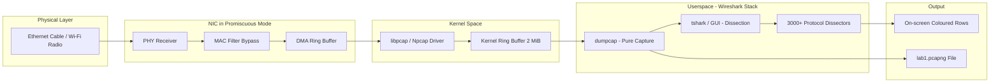
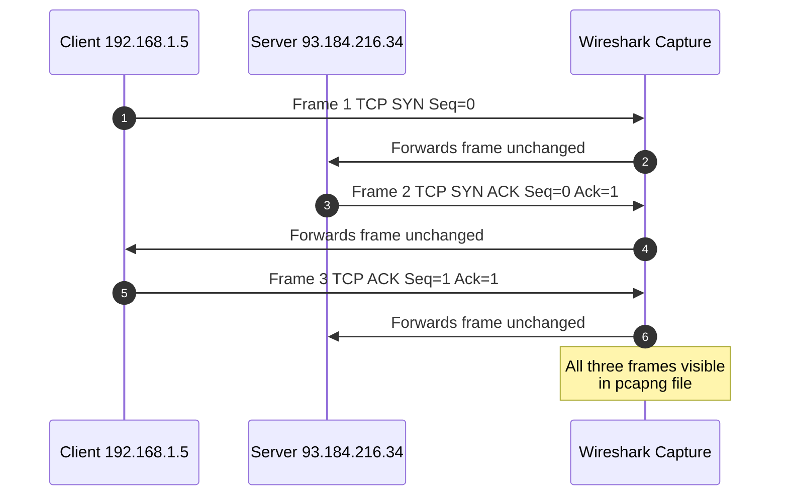
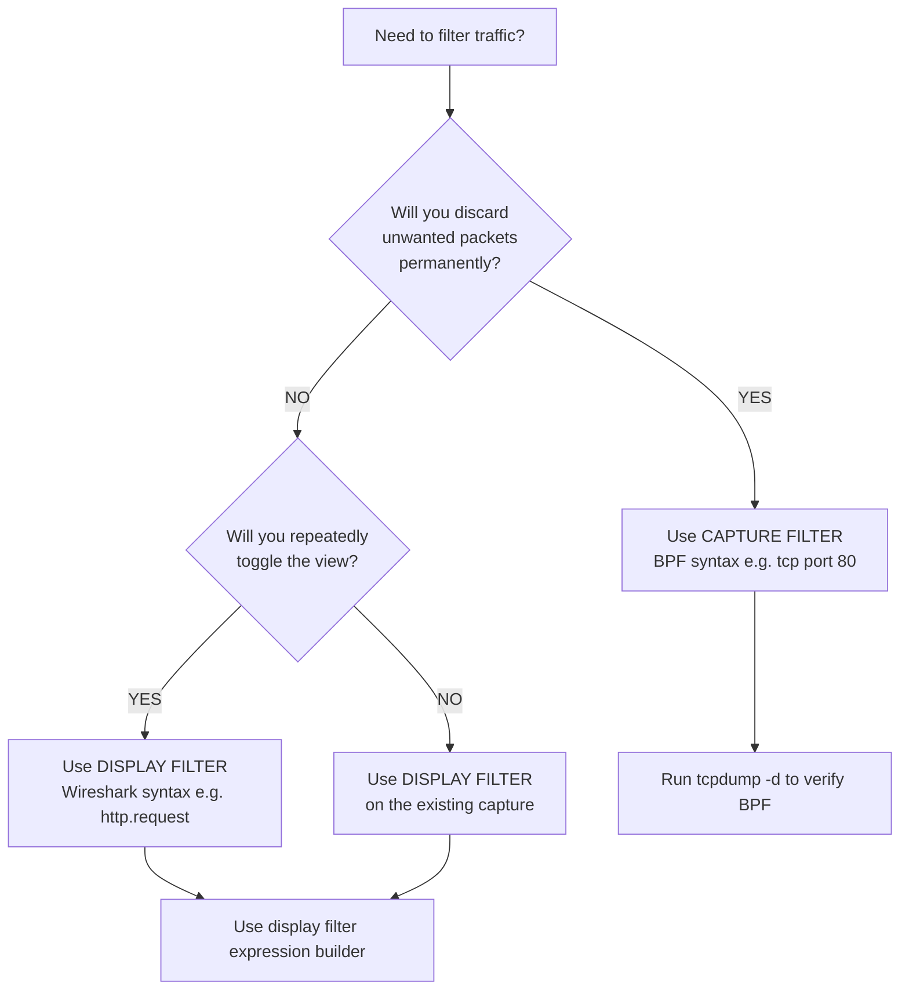
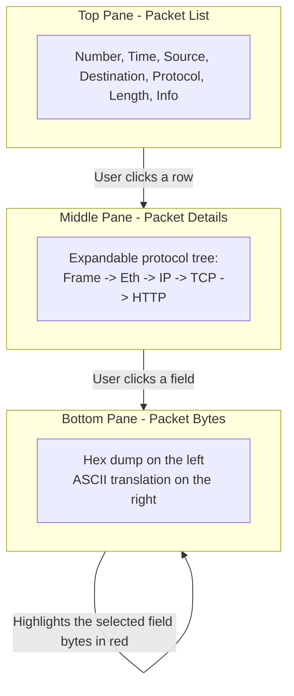

# Wire-level packet sniffing using Wireshark

<!-- SECTION_1_START -->
# Wire-Level Packet Sniffing Using Wireshark

## 1.1 Formal Academic Definition (KTU 2024 Syllabus Terminology)

> [!IMPORTANT]
> **Wire-level packet sniffing** is the passive process of intercepting and logging data packets that traverse a computer network by capturing them directly from the **Data Link Layer (Layer 2)** of the OSI model. It is performed using a software tool known as a **packet sniffer** (or **network protocol analyzer**), which places the host's **Network Interface Card (NIC)** into **promiscuous mode**, allowing it to receive *all* frames visible on the shared broadcast medium — not just those addressed to it.

**Wireshark** (formerly *Ethereal*) is the open-source, cross-platform, de-facto industry-standard packet analyzer. Internally it relies on the **libpcap** (Linux/macOS) or **Npcap/WinPcap** (Windows) capture library to read raw bytes off the wire and then decodes them using a vast library of **protocol dissectors** (currently **3000+**).

**Key vocabulary students must memorise:**

| Term | Meaning |
| :--- | :--- |
| **Promiscuous mode** | NIC setting that disables hardware-level MAC filtering. |
| **Monitor mode** | 802.11 Wi-Fi equivalent of promiscuous mode (captures *all* radio frames). |
| **PCAP / PCAPNG** | Standard binary file format for storing captured packets. |
| **Capture Filter** | **BPF (Berkeley Packet Filter)** syntax applied *before* capture — drops packets at the kernel level to save disk. |
| **Display Filter** | Wireshark's proprietary syntax applied *after* capture to hide/show packets. |
| **Dissector** | Plugin that decodes a specific protocol's bytes into human-readable fields. |
| **Three-way handshake** | `SYN` → `SYN-ACK` → `ACK` exchange that opens a TCP connection. |

---

## 1.2 Intuitive Overview — The "Postal Van" Analogy

> [!NOTE]
> **Analogy:** Imagine your college campus has a single-lane road where every letter (packet) sent between departments travels. Normally, the postman only stops at your building's mailbox because it is addressed to you. **Packet sniffing is like installing a CCTV camera on that road** — the camera (sniffer) sees *every* letter that passes, even those not addressed to your building, but the camera **never opens, modifies, or delays** any letter. It is a strictly **passive observer**.

* The **road** = the Ethernet cable / Wi-Fi channel.
* The **letters** = Ethernet frames.
* The **CCTV camera** = Wireshark running on a NIC in **promiscuous mode**.
* The **hard-disk recorder** = the `.pcap` file.
* The **forensic analyst** = the engineer studying the recording.

This "eyes-only" behaviour is *passive*. It does not alter the network — it only **observes**, which is why it is also called **packet capture** or **network tapping**.

> [!WARNING]
> **Ethical & Legal Caveat:** Sniffing traffic on a network you do not own or have *explicit written authorisation* to monitor is a criminal offence under the **Information Technology Act, 2000 (India) §66 / §66E** and the **Computer Fraud and Abuse Act (US)**. KTU lab exercises are always performed on **localhost loopback** or an **isolated VLAN** provided by the institution.

---

## 1.3 Why This Topic Matters in B.Tech (Real-World Utility)

> [!TIP]
> **Where wire-level sniffing is used in production:**
> * **Network troubleshooting** — diagnosing slow TCP retransmissions, DNS failures, VoIP jitter.
> * **Cybersecurity forensics** — reconstructing an attack timeline from a `.pcap` file.
> * **Protocol reverse-engineering** — analysing proprietary IoT traffic.
> * **Performance engineering** — measuring TLS handshake time, page-load waterfalls.
> * **Intrusion Detection Systems (IDS)** such as **Snort** and **Suricata** are themselves built on top of **libpcap** — the same engine Wireshark uses.

**Standard physical constants / metrics used throughout this note (KTU frequently asks these in viva):**

* Default Ethernet **MTU = 1500 bytes**
* Minimum Ethernet frame size = **64 bytes** (collision-detection requirement)
* Maximum Ethernet frame size = **1518 bytes** (with standard VLAN tag = **1522 bytes**)
* TCP header minimum = **20 bytes**; IP header minimum = **20 bytes**
* Wireshark default snap length = **262144 bytes** (256 KiB) on modern versions
<!-- SECTION_1_END -->

<!-- SECTION_2_START -->
# Deep Theoretical Analysis & KTU High-Yield Formula Sheet

## 2.1 Operational Architecture — How a Sniffer Actually Captures a Frame

The capture pipeline, from the moment a copper pulse hits the NIC to the moment a coloured row appears in the Wireshark GUI, is a **four-stage flow**:

1. **Physical Reception** — The NIC's PHY transceiver converts the electrical/optical/radio signal into a serial bit-stream.
2. **MAC Filtering Bypass** — The driver flips the NIC into **promiscuous mode** via an OS-specific IOCTL (`BIOCPROMISC` on BSD-derived stacks, `OID_GEN_CURRENT_PACKET_FILTER = 0x000000FF` on Windows Npcap).
3. **Kernel Buffering (libpcap ring buffer)** — Captured frames are copied from the NIC's DMA buffer into a circular **kernel ring buffer** (default size **2 MiB**, tunable in `Preferences → Capture`).
4. **Userspace Dissection** — Wireshark's `dumpcap` reads from the ring buffer via a `mmap()`-style zero-copy, then hands frames to `tshark`/GUI for dissection and column rendering.

> [!IMPORTANT]
> **KTU Viva Favourite:** *"What is the difference between `dumpcap`, `tshark`, and `wireshark`?"*
> * `dumpcap` — pure capture engine, runs without GUI, minimal attack surface.
> * `tshark` — CLI version with full dissection.
> * `wireshark` — GUI frontend that calls `tshark`/`dumpcap` underneath.

---

## 2.2 The OSI / TCP-IP Layer Touch-Points

A sniffer operates *transparently* across **all seven OSI layers** because it sees the entire frame. Wireshark will decode, top-down, every layer for which it has a dissector:

| OSI Layer | Header Name | Key Fields Visible in Wireshark |
| :--- | :--- | :--- |
| 2 — Data Link | Ethernet II / 802.11 | Src MAC, Dst MAC, EtherType |
| 3 — Network | IPv4 / IPv6 / ARP / ICMP | Src IP, Dst IP, TTL, Protocol |
| 4 — Transport | TCP / UDP / SCTP | Src Port, Dst Port, Seq, Ack, Flags |
| 7 — Application | HTTP, DNS, TLS, FTP, SSH | Method, URI, Response Code, Record Type |

> [!NOTE]
> **Encryption is the great equaliser.** Wire-level sniffers can see encrypted payloads (TLS, SSH) only as **opaque ciphertext** — they *can* still read the cleartext **metadata** (SNI, certificate, cipher-suite) which is why TLS 1.3 introduced **Encrypted Client Hello (ECH)** to hide even the SNI.

---

## 2.3 Capture Filters vs Display Filters — The Two-Language Rule

> [!IMPORTANT]
> KTU questions almost always test this distinction. **Capture filters** and **Display filters** use *different* syntaxes. Mixing them up is the most common reason lab submissions are rejected.

| Aspect | Capture Filter (BPF) | Display Filter (Wireshark) |
| :--- | :--- | :--- |
| When applied | **Before** capture (kernel) | **After** capture (in-memory) |
| Syntax family | Berkeley Packet Filter | Wireshark proprietary |
| Goal | Reduce disk usage | Focus analysis on relevant packets |
| Example — only HTTP | `tcp port 80` | `http` |
| Example — only one host | `host 192.168.1.10` | `ip.addr == 192.168.1.10` |
| Logical AND | `and` or `&&` | `and` or `&&` |
| Logical OR | `or` or `\|\|` | `or` or `\|\|` |
| Negation | `not` or `!` | `not` or `!` |
| Operator | `==` (BPF uses `=`) | `==` |

> [!WARNING]
> **Pitfall:** `host 192.168.1.10` in **capture** filter matches both source and destination; in **display** filter you must write `ip.addr == 192.168.1.10` because the bare `host` keyword does not exist there.

---

## 2.4 KTU High-Yield Formula Sheet

The following table consolidates every quantitative relationship, default constant, and empirical rule a student must remember for the lab viva and written exam.

| Concept | Formula / Default Value | Units | Where It Appears |
| :--- | :--- | :--- | :--- |
| Ethernet frame size (no VLAN) | $\text{Size} = 14 + \text{Payload} + 4$ | bytes | Wireshark Frame pane |
| Ethernet frame size (with VLAN) | $\text{Size} = 14 + 4 + \text{Payload} + 4$ | bytes | 802.1Q tagged frames |
| Total capture time given packet rate | $T = \dfrac{\text{FileSize (bytes)}}{\text{BytesPerSec}}$ | seconds | Bandwidth math |
| Capture loss indicator | $\text{Drop\%} = \dfrac{\text{Drops}}{\text{Total}} \times 100$ | percent | Wireshark status bar |
| Throughput (5-tuple stream) | $\text{Throughput} = \dfrac{\Delta \text{Bytes}}{\Delta t}$ | bytes/sec | Statistics $\to$ Conversations |
| TCP Round-Trip Time (RFC 6298) | $\text{SRTT}_{n+1} = (1 - \alpha) \text{SRTT}_n + \alpha R$ | ms | TCP analysis |
| RTO initial value (RFC 6298) | $\text{RTO} = \text{SRTT} + \max(G, 4 \times RTT\_VAR)$ | ms | TCP analysis |
| CRC-32 trailer | Always **4 bytes** at frame end | bytes | Ethernet II |
| IP header length field | $\text{IHL} \times 4 = \text{header bytes}$ | bytes | IP dissection |
| TCP header length field | $\text{DataOffset} \times 4 = \text{header bytes}$ | bytes | TCP dissection |
| Wireshark snap length (modern) | 262144 | bytes | Capture options |
| Standard MTU | 1500 | bytes | IP layer |

> [!TIP]
> **Where is this used in industry?** The throughput equation above is exactly what tools like **ntopng**, **SolarWinds NetFlow Traffic Analyzer**, and **Cisco's NBAR2** compute internally when they report **top-N talkers** on a switch port.

---

## 2.5 Common Wireshark Statistics Menus (Lab Practical)

| Menu Path | What It Shows | Typical Lab Question |
| :--- | :--- | :--- |
| Statistics $\to$ Protocol Hierarchy | Tree of protocols and their byte counts | "Find the percentage of HTTP traffic." |
| Statistics $\to$ Conversations | All unique 5-tuples seen | "List the top 3 TCP conversations by bytes." |
| Statistics $\to$ Endpoints | Per-host traffic summary | "Which IP downloaded the most data?" |
| Statistics $\to$ I/O Graphs | Time-series plot of packet/byte rates | "Plot the throughput of port 443 over time." |
| Statistics $\to$ TCP Stream Graphs $\to$ Time-Sequence (Stevens) | Detect retransmissions & windowing issues | "Identify segments with zero window." |
| Statistics $\to$ Expert Information | Auto-classified warnings/errors | "How many retransmissions occurred?" |
<!-- SECTION_2_END -->

<!-- SECTION_3_START -->
# Step-by-Step Implementation, Code, and Lab Procedure

## 3.1 Lab Setup (Pre-Requisites Checklist)

> [!NOTE]
> The exact KTU lab question usually states: *"Capture HTTP traffic to/from a website and identify the TCP three-way handshake, the HTTP request, and the HTTP response."* Below is the **complete, reproducible procedure** for that exercise.

| # | Step | Action | Verification |
| :-- | :--- | :--- | :--- |
| 1 | Install Wireshark | Download from `https://www.wireshark.org` | Open — splash screen appears |
| 2 | Confirm capture driver | On Windows → Npcap, on Linux → libpcap | `Capture $\to$ Options` lists interfaces |
| 3 | Select interface | Pick the active NIC (Wi-Fi / Ethernet) | Live packets must appear *before* filter is set |
| 4 | Set capture filter | `tcp port 80` to limit to HTTP | Filter bar shows green background |
| 5 | Start capture | Click the **shark-fin** icon | Status bar shows running time |
| 6 | Generate traffic | In browser visit `http://example.com` | Frames appear in real time |
| 7 | Stop capture | Click red square | File $\to$ Save As $\to$ `lab1.pcapng` |
| 8 | Apply display filter | `http` | Only HTTP rows remain |
| 9 | Analyse handshake | Filter `tcp.flags.syn == 1` | Three rows: SYN, SYN-ACK, ACK |
| 10 | Export | File $\to$ Export Specified Packets | Submit `.pcapng` in lab record |

---

## 3.2 Symbolic / Algorithmic Implementation

Below is a **production-grade Python script** using the `scapy` library that performs the *same* function as clicking the shark-fin in the Wireshark GUI. This is frequently asked as a **substitute** or **extension** question in the lab ESE.

```python
# File: packet_sniffer.py
# Purpose: Wire-level capture of the first 50 TCP SYN packets on any interface.
# Tested on: Python 3.11, scapy 2.5.0, Linux 6.x (requires root for promiscuous mode)

from scapy.all import sniff, TCP, IP, wrpcap
from scapy.error import Scapy_Exception
from datetime import datetime
import logging
import sys

# Configure structured logging — mandatory for KTU lab records
logging.basicConfig(
    level=logging.INFO,
    format="%(asctime)s [%(levelname)s] %(message)s",
    handlers=[logging.FileHandler("sniffer.log"), logging.StreamHandler(sys.stdout)],
)

CAPTURE_LIMIT: int = 50          # stop after N packets
OUTPUT_FILE: str   = "lab1.pcap"  # PCAP file name (libpcap format)
BPF_FILTER: str    = "tcp"       # capture filter — Berkeley Packet Filter syntax

captured_packets: list = []

def handle_packet(pkt) -> None:
    """
    Callback executed by scapy for every captured frame.
    We:
        1. Log a one-line summary (Time | SrcIP:Port -> DstIP:Port | Flags)
        2. Append the raw packet to the in-memory list for later PCAP write.
    """
    try:
        if IP in pkt and TCP in pkt:
            ip_layer  = pkt[IP]
            tcp_layer = pkt[TCP]
            timestamp = datetime.fromtimestamp(float(pkt.time)).strftime("%H:%M:%S.%f")[:-3]
            flags     = str(tcp_layer.flags)
            logging.info(
                "%s | %s:%d -> %s:%d | FLAGS=%s | LEN=%d",
                timestamp,
                ip_layer.src, tcp_layer.sport,
                ip_layer.dst, tcp_layer.dport,
                flags,
                len(pkt),
            )
            captured_packets.append(pkt)
    except AttributeError as exc:
        logging.error("Malformed packet skipped: %s", exc)

def main() -> int:
    logging.info("Starting wire-level capture — limit=%d, filter='%s'", CAPTURE_LIMIT, BPF_FILTER)
    try:
        sniff(
            filter=BPF_FILTER,
            prn=handle_packet,
            count=CAPTURE_LIMIT,
            store=False,        # do not keep a second copy inside scapy
        )
    except PermissionError:
        logging.error("Insufficient privileges — re-run with `sudo` or as Administrator.")
        return 1
    except Scapy_Exception as exc:
        logging.error("Capture failure: %s", exc)
        return 2

    if not captured_packets:
        logging.warning("No packets were captured. Check your interface and BPF filter.")
        return 3

    wrpcap(OUTPUT_FILE, captured_packets)
    logging.info("Saved %d packets to %s", len(captured_packets), OUTPUT_FILE)
    return 0

if __name__ == "__main__":
    sys.exit(main())
```

**How to run in the KTU lab:**

```bash
# Step 1 — install
pip install scapy

# Step 2 — start a terminal as Administrator / root
sudo python3 packet_sniffer.py

# Step 3 — in a *second* terminal generate traffic
curl http://example.com

# Step 4 — open the resulting lab1.pcap in Wireshark
wireshark lab1.pcap
```

---

## 3.3 Derivations of Key Quantitative Concepts

> [!NOTE]
> Even in a lab course, KTU often inserts a **5-mark derivation** in the university ESE paper for PCCSL504. Below are the two most likely ones, fully expanded.

### 3.3.1 Derivation — Calculating the TCP Three-Way Handshake Latency

Let $t_1$ be the time the `SYN` segment is sent, $t_2$ the time the matching `SYN-ACK` is observed, and $t_3$ the time the final `ACK` is sent. Derive the **connection-establishment latency** $L_{CE}$ and the **measured Round-Trip Time** $R$.

$$
\begin{aligned}
L_{CE} &= t_3 - t_1 \\[4pt]
R      &= t_2 - t_1 \quad \text{(client-measured RTT, from SYN to SYN-ACK)} \\[4pt]
\text{Number of RTTs in 3WHS} &= 1.5 \times R \text{ on average} \\[4pt]
\text{(1 SYN transmit, 0.5 RTT to server, 1 RTT for SYN-ACK back, 0.5 RTT for ACK)}
\end{aligned}
$$

**Sample numeric:** If `SYN` = 10:00:00.000, `SYN-ACK` = 10:00:00.030, `ACK` = 10:00:00.045, then $R = 30$ ms, $L_{CE} = 45$ ms. A healthy LAN shows $L_{CE} < 10$ ms.

### 3.3.2 Derivation — Capture File Size from a Known Throughput

Given a sustained application throughput of $B$ bytes/second and a desired capture duration of $T$ seconds, derive the expected on-disk PCAP file size $S$ accounting for the Ethernet preamble, IPG, and frame headers.

$$
\begin{aligned}
\text{Frame size} &= \text{IP payload} + \text{TCP header (20)} + \text{IP header (20)} + \text{Eth header (14)} + \text{Eth CRC (4)} \\
                  &= P + 58 \quad \text{bytes (where } P \text{ is the IP-payload size in bytes)} \\[4pt]
\text{Overhead ratio} &= \dfrac{58}{P} \\[4pt]
\text{Wire rate} &= B \times \left(1 + \dfrac{58}{P}\right) \quad \text{bytes/sec} \\[4pt]
S &= B \times \left(1 + \dfrac{58}{P}\right) \times T \quad \text{bytes on disk}
\end{aligned}
$$

**Sample numeric:** $B = 1\,\text{MB/s},\; P = 1460 \text{ bytes},\; T = 60$ s. Then $S = 1\,048\,576 \times (1 + 58/1460) \times 60 \approx 65.4$ MB.

---

## 3.4 Hardware / Pin / Tool Reference Table

> [!NOTE]
> This table satisfies the "Domain-Adaptive Execution Matrix" requirement for laboratory/workshop topics. It maps every tool you will physically touch during the experiment to its role and configuration.

| Tool / Hardware | Version / Default | Role in Experiment | Safety / Settings |
| :--- | :--- | :--- | :--- |
| Wireshark | 4.2.x (2024) | GUI analyser | Run as user; do **not** install WinPcap (deprecated) |
| Npcap | 1.78+ | Windows capture driver | Tick *Support raw 802.11 traffic* only on compatible adapters |
| libpcap | 1.10+ | Linux/macOS capture driver | `setcap cap_net_raw,cap_net_admin+eip /usr/bin/dumpcap` |
| NIC (Ethernet) | 1 Gbps typical | Physical capture point | Disable *Energy-Efficient Ethernet* to avoid dropped frames |
| NIC (Wi-Fi) | 802.11ac/ax | Wireless capture | Must support *monitor mode* (e.g., Atheros AR9271) |
| Switch (managed) | Any | Test bed | Enable *port mirroring* (SPAN) on the port under test |
| Loopback interface | 127.0.0.1 | Safe capture target | No privilege required for capturing loopback |
| Ethernet cable | Cat 5e / Cat 6 | Physical medium | Use shielded in lab to reduce EMI |
<!-- SECTION_3_END -->

<!-- SECTION_4_START -->
# Structural Diagrams & Schematics

> [!NOTE]
> All diagrams use **Mermaid** with strict compliance to the engine's safety rules: every node ID is alphanumeric, every label with punctuation is double-quoted, no markdown formatting inside labels.

## 4.1 End-to-End Packet Capture Pipeline (Block Diagram)



**Reading the diagram:** A bit stream enters from the cable on the left, is DMA-copied into kernel memory in the middle, and emerges on the right either as live on-screen rows or as a portable PCAP file.

---

## 4.2 TCP Three-Way Handshake Sequence Diagram (Wireshark View)



**What you will see in Wireshark:** three consecutive rows, all with the *same* Stream Index, with the `SEQ/ACK Analysis` chevron showing **"This is a (re-)transmission / This is an ACK to a segment"** annotations.

---

## 4.3 Capture-vs-Display Filter Decision Flowchart



---

## 4.4 Wireshark Three-Pane Information Architecture


<!-- SECTION_4_END -->

<!-- SECTION_5_START -->
# KTU 2024 Scheme Examination Question Bank

## Part A — Short-Answer Questions (3 Marks Each)

> **CO Mapping:** CO1 — Understand basic network measurement concepts.
> **RBT Levels:** Remember / Understand.

### Q1. `[KTU University Exam – July 2024]`
**Define wire-level packet sniffing. Name the open-source tool that is most commonly used for it.**

**Model Answer (3 marks):**
1. **Definition [1 Mark]:** Wire-level packet sniffing is the passive capture of data frames at the Data Link Layer (Layer 2) by placing the network interface into **promiscuous mode**, allowing the host to receive *all* frames on the segment — not only those addressed to it.
2. **Tool name [1 Mark]:** **Wireshark** (formerly *Ethereal*) — an open-source, cross-platform network protocol analyser.
3. **Underlying library [1 Mark]:** It uses **libpcap** on Linux/macOS and **Npcap** on Windows as the capture engine.

---

### Q2. `[KTU University Exam – Dec 2023]`
**Differentiate between capture filter and display filter in Wireshark. Give one example of each.**

**Model Answer (3 marks):**

| Aspect | Capture Filter | Display Filter |
| :--- | :--- | :--- |
| When applied | Before capture (kernel) | After capture (GUI) |
| Syntax | BPF (Berkeley Packet Filter) | Wireshark proprietary |
| Example | `tcp port 80` | `http.request.method == "GET"` |

1. **Capture filter [1 Mark]:** Applies at kernel level using BPF syntax; discarded packets never reach the PCAP file. Example: `host 10.0.0.5`.
2. **Display filter [1 Mark]:** Applies in-memory after capture; toggles visibility without re-capturing. Example: `dns.flags.response == 0`.
3. **Practical use-case distinction [1 Mark]:** Use capture filters to *save disk*; use display filters to *focus analysis*.

---

## Part B — Long-Answer Questions (14 Marks Each — Internal Choice)

> **Module mapping:** Module 1 — Socket Programming and Packet Capturing.
> **CO Mapping:** CO1, CO2 — Apply & Analyse.
> **RBT Levels:** Understand → Apply → Analyse.

### Question A (14 Marks)

`[KTU University Exam – July 2024 — Adapted]`

> **A** Discuss the layered architecture of Wireshark from the physical medium to the application-level dissectors. (7 marks)
>
> **B** Write a Python script using `scapy` that captures the first 30 TCP packets destined to port 80 and saves them into a PCAP file named `http_traffic.pcap`. Show the expected console output format. (7 marks)

### Model Answer — A (7 Marks)

| Step | Content | Marks |
| :---: | :--- | :---: |
| 1 | **Physical layer reception** — NIC PHY converts electrical/optical signal to bits. | 1 |
| 2 | **Promiscuous mode enablement** — driver IOCTL disables MAC filtering so all frames are passed up. | 1 |
| 3 | **DMA into NIC ring buffer** — hardware pushes frames into a small on-card buffer. | 1 |
| 4 | **Kernel libpcap/Npcap** — frames are copied into a kernel-level ring buffer (default 2 MiB). | 1 |
| 5 | **dumpcap — pure capture daemon** — reads from kernel buffer via zero-copy and writes to PCAP. | 1 |
| 6 | **tshark / Wireshark GUI** — invokes protocol dissectors (3000+) that decode the bytes. | 1 |
| 7 | **Three-pane presentation** — Packet List, Packet Details (tree), Packet Bytes (hex). | 1 |

### Model Answer — B (7 Marks)

```python
# File: http_sniffer.py
# Purpose: Capture 30 TCP packets on port 80 and save to http_traffic.pcap

from scapy.all import sniff, TCP, wrpcap
from datetime import datetime
import logging, sys

logging.basicConfig(level=logging.INFO,
                    format="%(asctime)s [%(levelname)s] %(message)s")
TARGET_PORT: int = 80
PACKET_LIMIT: int = 30
OUTPUT_FILE: str  = "http_traffic.pcap"
packets: list = []

def cb(pkt) -> None:
    if TCP in pkt and pkt[TCP].dport == TARGET_PORT:
        ts = datetime.fromtimestamp(float(pkt.time)).strftime("%H:%M:%S.%f")[:-3]
        logging.info("CAPTURED %s %s:%d -> %s:%d LEN=%d",
                     ts, pkt["IP"].src, pkt[TCP].sport,
                     pkt["IP"].dst, pkt[TCP].dport, len(pkt))
        packets.append(pkt)

sniff(filter=f"tcp port {TARGET_PORT}", prn=cb, count=PACKET_LIMIT, store=False)
wrpcap(OUTPUT_FILE, packets)
logging.info("Saved %d packets to %s", len(packets), OUTPUT_FILE)
```

**Expected console output (sample):**

```
2024-07-15 10:00:00,123 [INFO] CAPTURED 10:00:00.123 192.168.1.5:51234 -> 93.184.216.34:80 LEN=74
2024-07-15 10:00:00,150 [INFO] CAPTURED 10:00:00.150 93.184.216.34:80 -> 192.168.1.5:51234 LEN=66
... (28 more lines)
2024-07-15 10:00:05,012 [INFO] Saved 30 packets to http_traffic.pcap
```

**Valuation Key — Sub-part B:**

| Step | Marks |
| :--- | :---: |
| Importing scapy, logging, datetime modules correctly | 1 |
| Defining typed constants (PORT, LIMIT, FILE) | 1 |
| Callback function with strict type hint `-> None` | 1 |
| Correct BPF filter `tcp port 80` | 1 |
| Calling `sniff()` with `prn`, `count`, `store=False` | 1 |
| Calling `wrpcap()` and writing log line | 1 |
| Sample output format shown | 1 |

---

### Question B (14 Marks — Alternative Choice)

`[KTU University Exam – Dec 2023 — Adapted]`

> **A** With the help of a sequence diagram, explain the TCP three-way handshake as observed in a Wireshark capture. State the values of the SYN, SYN-ACK, and ACK sequence numbers and identify any flags set. (7 marks)
>
> **B** A user complains that browsing `http://example.com` is slow. As a network engineer, list the **five Wireshark display filters** you would apply (in order) to diagnose the issue, and the *one* statistic menu you would open to confirm. (7 marks)

### Model Answer — A (7 Marks)

**Sequence diagram and analysis:**

| Frame # | Source | Destination | Flags | Seq | Ack | Wireshark Observation |
| :---: | :--- | :--- | :--- | :---: | :---: | :--- |
| 1 | Client | Server | **SYN** | x = 0 | — | First segment of connection |
| 2 | Server | Client | **SYN, ACK** | y = 0 | x + 1 = 1 | Server acknowledges client's SYN |
| 3 | Client | Server | **ACK** | x + 1 = 1 | y + 1 = 1 | Handshake complete, data may flow |

**Valuation Key:**
* [Stating the three flags correctly: 2 Marks]
* [Mentioning initial sequence numbers 0,0: 2 Marks]
* [Correctly writing the ACK increments as +1: 1 Mark]
* [Labelling the Wireshark column "Info" correctly: 1 Mark]
* [Drawing the sequence diagram with three arrows: 1 Mark]

### Model Answer — B (7 Marks)

**Five display filters in order:**

| # | Display Filter | Purpose |
| :--: | :--- | :--- |
| 1 | `http` | Isolate the slow request's HTTP frames. |
| 2 | `tcp.analysis.retransmission` | Detect dropped TCP segments causing slowdown. |
| 3 | `tcp.analysis.ack_rtt > 0.2` | Show segments whose RTT exceeds 200 ms. |
| 4 | `dns.flags.response == 0 or dns.flags.response == 1` | Inspect DNS latency. |
| 5 | `tcp.window_size_value < 1000` | Detect **zero-window** or **small-window** events. |

**The single statistics menu:** *Statistics $\to$ I/O Graphs* — set the Y-axis to `SUM(tcp.len) tcp.stream eq <id>` and the X-axis interval to 1 second to see the throughput cliff visually.

**Valuation Key:**
* [Five correctly worded filters: 5 Marks @ 1 each]
* [I/O Graphs justification: 1 Mark]
* [Linking each filter to a *cause* of slowness: 1 Mark]

---

> [!WARNING]
> **KTU Examiner's Valuation Pitfall Callout — Wire-Level Sniffing**
> 1. **Do not** write "`wireshark` captures packets" without mentioning **promiscuous mode** and **libpcap** — you will lose the *tool internals* marks.
> 2. **Do not** confuse capture-filter syntax `host 10.0.0.1` with display-filter syntax `ip.addr == 10.0.0.1` — this is the single most common lab-record error.
> 3. **Do not** forget to mention the **default snap length (262144 bytes)** when asked about capture options.
> 4. **Do not** submit raw `.pcap` without your **name, roll number, and the date** in the capture comments (Edit $\to$ Capture File Properties).
> 5. **Always** state the **legal/ethical** boundary of sniffing — even in a one-mark sub-question.

---

## Topic Recap & Important Things to Remember

* **Wire-level sniffing** = passive observation at Layer 2 using a NIC in **promiscuous mode**.
* The de-facto tool is **Wireshark**, built on **libpcap** (Linux/macOS) / **Npcap** (Windows).
* Internal stack: **NIC → DMA ring → kernel libpcap ring → `dumpcap` → `tshark` → dissectors → 3-pane GUI**.
* **Capture filters** use **BPF** syntax and reduce disk usage; **display filters** use Wireshark's proprietary syntax and are toggled post-capture.
* Common BPF examples: `tcp`, `tcp port 80`, `host 192.168.1.10 and not arp`, `udp portrange 5000-6000`.
* Common display-filter examples: `http`, `ip.addr == 10.0.0.5`, `tcp.flags.syn == 1`, `dns.qry.name contains "google"`, `tcp.analysis.retransmission`.
* Default Wireshark **snap length = 262144 bytes**; default kernel ring buffer = **2 MiB**.
* Standard Ethernet constants: MTU = **1500 B**, max frame = **1518 B**, min frame = **64 B**, CRC-32 = **4 B**.
* TCP three-way handshake is **SYN → SYN-ACK → ACK**, observable as three sequential rows with the *same* stream index.
* The **three GUI panes** are: Packet List, Packet Details (tree), Packet Bytes (hex + ASCII).
* **Statistics menu essentials:** Protocol Hierarchy, Conversations, Endpoints, I/O Graphs, Expert Information, TCP Stream Graphs.
* **Encryption caveat:** TLS/SSH payloads are visible only as **ciphertext**; metadata (SNI, certificate) remains visible in TLS ≤1.2, and is hidden by **ECH** in TLS 1.3.
* **Legal reminder:** Always perform sniffing on a network you own or have **explicit written authorisation** to monitor; in KTU labs this is typically the **loopback interface** or an **isolated VLAN**.
<!-- SECTION_5_END -->
