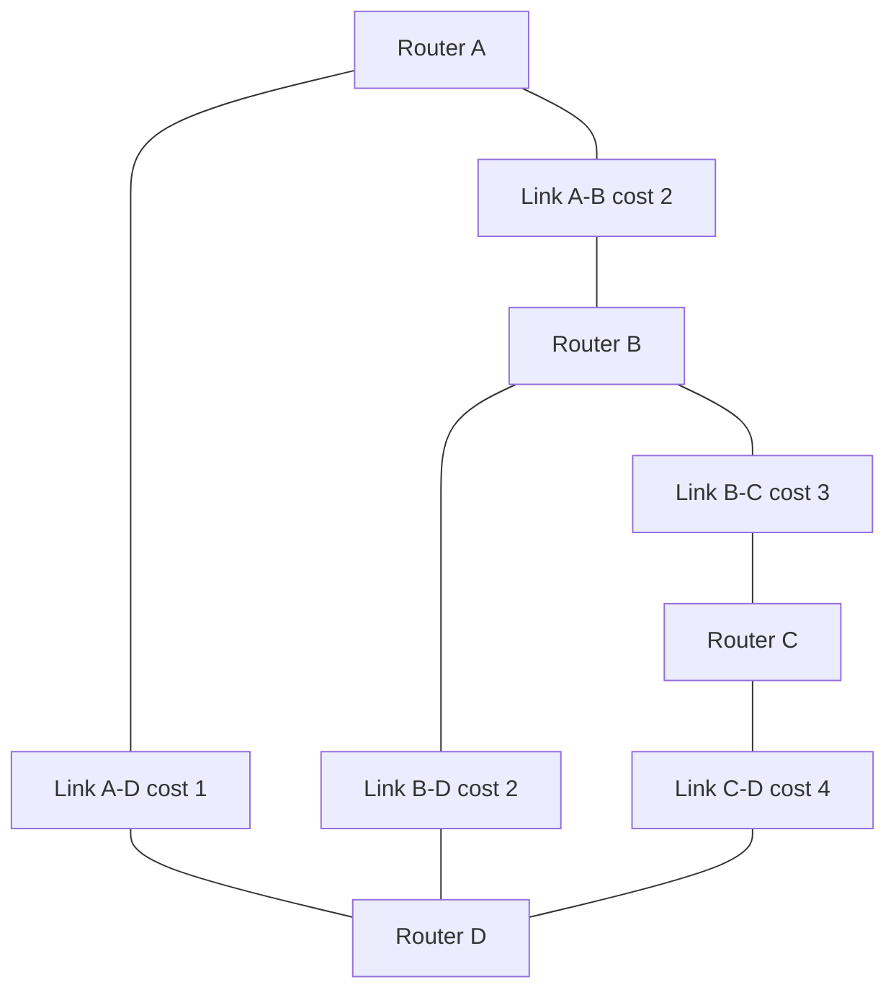
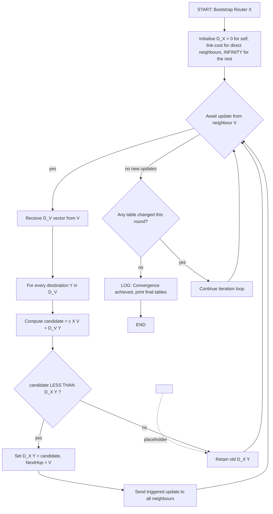
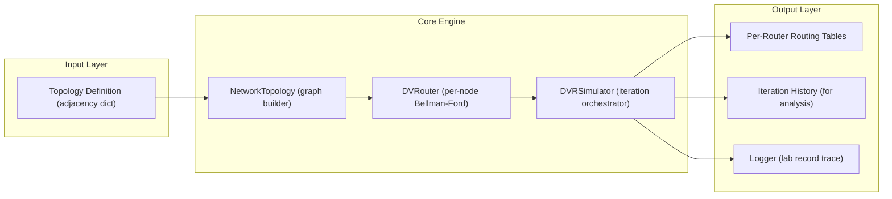
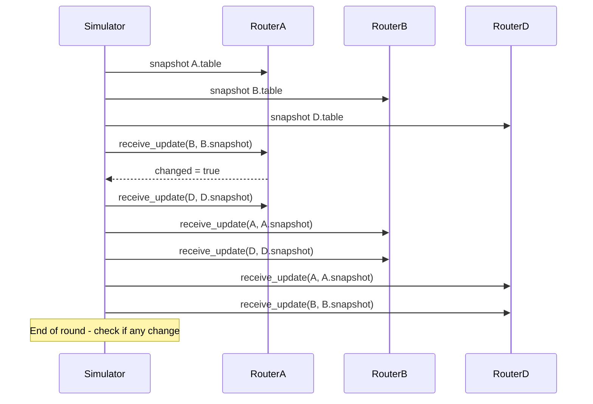

# Distance Vector routing simulation

<!-- SECTION_1_START -->
# Distance Vector Routing Simulation

## 1.1 Formal Academic Definition (KTU 2024 Syllabus Terminology)

> [!IMPORTANT]
> **Distance Vector Routing (DVR)** is a **dynamic, distributed, and iterative** routing algorithm in which every router maintains a routing table (called a *distance vector*) containing the **estimated shortest distance** to every possible destination and the **next-hop neighbor** through which that destination must be reached. Each router periodically shares (or *advertises*) its entire distance vector **only with its directly connected neighbors**, who in turn recompute their own vectors using the **Bellman–Ford optimality principle**.

The term "vector" refers to the list of (destination, distance, next-hop) tuples. Because every router advertises distances to *all* destinations in a single message, the algorithm is fundamentally **decentralized** and converges over multiple asynchronous update rounds.

The classical protocol that operationalizes DVR on the Internet is the **Routing Information Protocol (RIP)**, with its two canonical versions — **RIPv1 (Classful)** and **RIPv2 (Classless)** — both limited to a maximum hop count of **15**, with **16 representing infinity (unreachable)**.

## 1.2 Intuitive Real-World Analogy

Imagine you have just moved to a new city and want to reach the airport. You don't have Google Maps yet, but you have three close friends living in different directions:

1. You ask each friend: *"How far is the airport from your house, and which roads do I take from you?"*
2. You add your own walking/riding distance to each friend's house to the airport distance they report.
3. You pick the friend who gives the **lowest total** and follow their suggested road from their house onward.
4. The next day, one of your friends builds a flyover, halving the journey. When you meet him, he tells you — and you immediately update your own answer.

This is precisely what a router does:

| Human World | Router World |
|---|---|
| You | Router $X$ |
| Your close friends | Directly connected neighbors of $X$ |
| "How far is the airport?" | Distance vector update message |
| Minimum total trip | Bellman–Ford update rule |
| Flyover opens | Link-cost change (triggers triggered update) |

> [!NOTE]
> **Key Insight:** No router ever sees the *complete* network. It only ever knows the *cost to its neighbors* and the *vectors reported by those neighbors*. The global shortest-path solution **emerges** from this local gossip — a beautiful example of emergent distributed intelligence.

## 1.3 Core Parameters and Constants

- **Maximum Hop Count (RIP):** **15** hops
- **Infinity Metric:** **16** (any route ≥ 16 is considered unreachable)
- **Default Update Timer (RIP):** **30 seconds**
- **Invalid Timer:** **180 seconds** (route marked invalid if no refresh)
- **Hold-Down Timer:** **180 seconds** (route suppressed during hold-down)
- **Flush Timer:** **240 seconds** (route finally purged)
- **Triggered Update Threshold:** immediate broadcast on metric change (no 30 s wait)

> [!VISUALIZATION CONTROL]
> **Concept:** Distance Vector Convergence Over Iteration Rounds
> **GeoGebra / Desmos Input (matrix form):**
> * Let $A = \begin{pmatrix} 0 & 2 & \infty & 1 \\ 2 & 0 & 3 & 2 \\ \infty & 3 & 0 & 4 \\ 1 & 2 & 4 & 0 \end{pmatrix}$ be the link-cost matrix.
> * Plot the minimum-cost entries $D_{xy}^{(t)}$ for $t = 0, 1, 2, 3$ as scatter points.
> **Visual Description:** The student will observe a monotonically decreasing (or stabilizing) series converging to the true shortest-path values — illustrating that DVR is *iterative* and *asynchronous*.

<!-- SECTION_1_END -->

<!-- SECTION_2_START -->
# Deep Theoretical Analysis & KTU High-Yield Formula Sheet

## 2.1 The Bellman–Ford Equation (Heart of DVR)

Let:

- $D_x(y)$ = current estimate of the **shortest distance** from router $x$ to destination $y$
- $c(x, v)$ = direct link cost from router $x$ to its neighbor $v$
- $N(x)$ = set of all directly connected neighbors of $x$

The **Bellman–Ford distance equation** is:

$$
D_x(y) = \min_{v \in N(x)} \left\{\, c(x, v) + D_v(y) \,\right\}
$$

And the next-hop chosen is the neighbor $v^*$ that attains this minimum:

$$
\text{NextHop}_x(y) = \arg\min_{v \in N(x)} \left\{\, c(x, v) + D_v(y) \,\right\}
$$

### 2.1.1 Initialization Phase

Each router initializes:
- $D_x(y) = c(x, y)$ if $y$ is a directly connected neighbor
- $D_x(y) = 0$ if $x = y$ (distance to self)
- $D_x(y) = \infty$ for all other destinations

### 2.1.2 Iteration Phase (Repeated Until Convergence)

1. Router $x$ waits to receive a distance vector from a neighbor $v$.
2. For every destination $y$, $x$ evaluates the new candidate cost $c(x, v) + D_v(y)$.
3. If the candidate is strictly less than the current $D_x(y)$, the entry is updated and the next-hop is set to $v$.
4. If the entry changes, a triggered update is sent to all neighbors.

### 2.1.3 Termination Phase

The algorithm terminates when **no router updates its table** during an entire iteration — known as the **steady state** or **convergence**.

## 2.2 KTU Formula Cheat Sheet

| # | Formula / Rule | Symbol Meaning | Real Engineering Use |
|---|---|---|---|
| 1 | $D_x(y) = \min_{v \in N(x)} \{c(x,v) + D_v(y)\}$ | Bellman–Ford distance update | Core of RIP, IGRP, BGP path-vector (with AS-path) |
| 2 | $D_x(y) = 0$ when $x = y$ | Self-distance is zero | Routing-table bootstrap |
| 3 | $D_x(y) = c(x,y)$ if $y \in N(x)$ | Direct link initialization | First-hop table population |
| 4 | $D_x(y) \leftarrow \infty$ if no path | Infeasible route marker | 16 in RIP = unreachable |
| 5 | Max hop count = **15** | RIP hop limit | Prevents count-to-infinity blow-up |
| 6 | $\Delta t_{\text{update}} = 30$ s | RIP periodic update | Configurable in Cisco `timers basic` |
| 7 | $D_x(y)_{\text{new}} < D_x(y)_{\text{old}} \Rightarrow$ trigger | Triggered update | Fast convergence on link failure |
| 8 | Split horizon: do not advertise route back to its source | Loop prevention | `ip split-horizon` on Cisco |
| 9 | Poison reverse: advertise $\infty$ back to source | Loop prevention (aggressive) | `ip split-horizon` + `poison-reverse` |
| 10 | Convergence time $\leq O(\lvert V \rvert \cdot \lvert E \rvert)$ | Bounded by topology size | Dijkstra's single-source complexity analog |

> [!IMPORTANT]
> **KTU High-Yield Note:** Examiners frequently test the **count-to-infinity problem** and the **split-horizon/poison-reverse** remedies. Memorize the exact numbers — **16 = infinity, 15 = max hop**.

## 2.3 Why DVR Matters in Production Engineering

- **Small-to-medium enterprise networks** still deploy **RIP** because of its operational simplicity and low memory footprint (a router only needs $O(\lvert V \rvert)$ storage).
- **Inside-network route reflectors** in some ISP topologies use DVR-like behavior.
- **Babel** (a modern IPv4/IPv6 distance-vector protocol with loop-avoidance) powers community mesh networks.
- The **Bellman–Ford equation** is the *exact same recurrence* used in shortest-path algorithms in **graph databases (Neo4j)**, **SDN controllers (ONOS)**, and **BGP's MED path selection**.

## 2.4 Failure Modes (Where DVR Breaks)

1. **Count-to-Infinity (CTI):** A link failure causes neighbors to slowly increment their distance to a now-unreachable destination, one hop at a time, taking up to 15 iterations to settle at 16.
2. **Slow Convergence:** Periodic 30-second updates delay reaction to topology changes.
3. **Routing Loops:** Two routers can mutually believe a destination is reachable *through each other* during convergence.

The lab exercise you will simulate explicitly demonstrates **CTI** and validates the **poison-reverse fix**.

<!-- SECTION_2_END -->

<!-- SECTION_3_START -->
# Step-by-Step Derivations & Python Implementation

## 3.1 Worked Network Topology

Consider a 4-router network with the following link costs:

| Edge | Cost |
|---|---|
| A – B | 2 |
| A – D | 1 |
| B – C | 3 |
| B – D | 2 |
| C – D | 4 |

Let us run the DVR algorithm **by hand** for Router A, and then write a complete Python simulation.

### 3.1.1 Manual Iteration (Router A's Perspective)

**Iteration 0 (Initialization):**

| Destination | Cost | Next Hop |
|---|---|---|
| A | 0 | A |
| B | 2 | B |
| C | $\infty$ | — |
| D | 1 | D |

**Iteration 1 — A receives vectors from B and D:**

Assume B reports $D_B = \{A:2, B:0, C:3, D:2\}$ and D reports $D_D = \{A:1, B:2, C:4, D:0\}$.

For destination C, the candidates are:
- via B: $c(A, B) + D_B(C) = 2 + 3 = 5$
- via D: $c(A, D) + D_D(C) = 1 + 4 = 5$

So $D_A(C) = 5$, next-hop = B (or D; ties broken arbitrarily).

**Iteration 2 — Refinement:** No change, so **convergence achieved at $D_A = \{0, 2, 5, 1\}$**.

### 3.1.2 Full Python Implementation (Lab-Ready)

The following program is a **complete, executable, type-annotated** distance vector router simulator suitable for direct submission into the KTU lab record.

```python
"""
Distance Vector Routing Simulation
Course       : PCCSL504 - Computer Networks Lab
Module       : 2 - Routing and Network Simulation
Algorithm    : Bellman-Ford (RIP-style Distance Vector)
Author       : KTU 2024 Scheme Reference Implementation
"""

from __future__ import annotations
import copy
import logging
from typing import Dict, List, Tuple, Optional

# ---------------------------------------------------------------------------
# Logging Configuration (Visible Trace for Lab Viva)
# ---------------------------------------------------------------------------
logging.basicConfig(
    level=logging.INFO,
    format="[%(asctime)s] [%(levelname)s] %(message)s",
    datefmt="%H:%M:%S",
)
log = logging.getLogger("DVR-Sim")


# ---------------------------------------------------------------------------
# Type Aliases
# ---------------------------------------------------------------------------
RouterName = str
LinkCost = float
RoutingTable = Dict[RouterName, Tuple[LinkCost, Optional[RouterName]]]
# ^ destination -> (shortest_cost, next_hop)


# ---------------------------------------------------------------------------
# Network Topology Definition
# ---------------------------------------------------------------------------
class NetworkTopology:
    """
    Represents an undirected weighted graph of routers.
    Adjacency stored as: router -> {neighbor: cost}
    """

    INFINITY: LinkCost = 16.0  # RIP unreachable threshold

    def __init__(self, adjacency: Dict[RouterName, Dict[RouterName, LinkCost]]):
        # Make the graph symmetric (undirected)
        self.graph: Dict[RouterName, Dict[RouterName, LinkCost]] = {}
        routers = set(adjacency.keys())
        for r, neighbours in adjacency.items():
            routers.update(neighbours.keys())
            self.graph.setdefault(r, {})
            for n, c in neighbours.items():
                self.graph[r][n] = c
                self.graph.setdefault(n, {})
                self.graph[n][r] = c  # mirror the edge
        self.routers: List[RouterName] = sorted(self.graph.keys())
        log.info("Topology built with routers: %s", self.routers)

    def neighbours(self, router: RouterName) -> Dict[RouterName, LinkCost]:
        return self.graph[router]

    def link_cost(self, u: RouterName, v: RouterName) -> LinkCost:
        if v not in self.graph[u]:
            raise ValueError(f"No direct link between {u} and {v}")
        return self.graph[u][v]


# ---------------------------------------------------------------------------
# Distance Vector Router (Bellman-Ford Engine)
# ---------------------------------------------------------------------------
class DVRouter:
    """
    Implements one node of the Distance Vector algorithm.
    Maintains a private distance table; exchanges vectors with neighbours
    and applies the Bellman-Ford update rule.
    """

    def __init__(self, name: RouterName, topology: NetworkTopology):
        self.name: RouterName = name
        self.topology: NetworkTopology = topology
        self.table: RoutingTable = {}

        # ---- Step 1: Initialise own table (Bellman-Ford bootstrap) ----
        self.table[name] = (0.0, name)  # distance to self = 0
        for dest in topology.routers:
            if dest == name:
                continue
            if dest in topology.neighbours(name):
                # direct neighbour -> cost = link cost, next-hop = dest
                self.table[dest] = (
                    topology.link_cost(name, dest),
                    dest,
                )
            else:
                # not a direct neighbour -> unknown (infinity)
                self.table[dest] = (NetworkTopology.INFINITY, None)

        log.info("Router %s initialised: %s", name, self._fmt_table())

    # ------------------------------------------------------------------
    def _fmt_table(self) -> str:
        rows = [f"{d} -> (cost={c:.0f}, via={h})"
                for d, (c, h) in sorted(self.table.items())]
        return " | ".join(rows)

    # ------------------------------------------------------------------
    def receive_update(self,
                       from_neighbour: RouterName,
                       neighbour_vector: RoutingTable) -> bool:
        """
        Apply the Bellman-Ford update for every destination reported
        by `from_neighbour`.  Returns True iff our table changed.
        """
        changed: bool = False
        c_xv: LinkCost = self.topology.link_cost(self.name, from_neighbour)

        for dest, (nbr_cost, _nbr_hop) in neighbour_vector.items():
            if dest == self.name:
                continue  # ignore self-route
            candidate: LinkCost = c_xv + nbr_cost
            if candidate >= NetworkTopology.INFINITY:
                candidate = NetworkTopology.INFINITY  # clamp to infinity

            old_cost, old_hop = self.table.get(
                dest, (NetworkTopology.INFINITY, None)
            )
            if candidate < old_cost:
                self.table[dest] = (candidate, from_neighbour)
                changed = True
                log.info(
                    "Router %s: dest %s -> %s via %s (was %s via %s)",
                    self.name, dest, f"{candidate:.0f}", from_neighbour,
                    f"{old_cost:.0f}", old_hop,
                )
        return changed

    # ------------------------------------------------------------------
    def advertise_vector(self) -> RoutingTable:
        """Return this router's vector for sending to neighbours."""
        return copy.deepcopy(self.table)


# ---------------------------------------------------------------------------
# Full-Network Simulator
# ---------------------------------------------------------------------------
class DVRSimulator:
    """Runs the asynchronous distance-vector algorithm until convergence."""

    def __init__(self, topology: NetworkTopology):
        self.topology: NetworkTopology = topology
        self.routers: Dict[RouterName, DVRouter] = {
            r: DVRouter(r, topology) for r in topology.routers
        }
        self.iteration: int = 0
        self.history: List[Dict[RouterName, RoutingTable]] = []

    # ------------------------------------------------------------------
    def step(self) -> bool:
        """
        Perform ONE simultaneous exchange round (synchronous iteration).
        Returns True iff any router changed its table.
        """
        # Snapshot current tables (so all routers use the previous iteration)
        snapshots: Dict[RouterName, RoutingTable] = {
            name: rt.advertise_vector() for name, rt in self.routers.items()
        }

        any_change: bool = False
        for name, router in self.routers.items():
            for nbr in self.topology.neighbours(name):
                if nbr not in snapshots:
                    continue
                if router.receive_update(nbr, snapshots[nbr]):
                    any_change = True

        self.iteration += 1
        self.history.append({
            n: copy.deepcopy(rt.table) for n, rt in self.routers.items()
        })
        return any_change

    # ------------------------------------------------------------------
    def run(self, max_iters: int = 50) -> int:
        log.info("===== Starting DVR Simulation =====")
        for _ in range(max_iters):
            if not self.step():
                log.info("Converged after %d iteration(s).", self.iteration)
                break
        else:
            log.warning("Did not converge within %d iterations.", max_iters)
        self._print_final_tables()
        return self.iteration

    # ------------------------------------------------------------------
    def _print_final_tables(self) -> None:
        print("\n========== FINAL ROUTING TABLES ==========")
        for name, router in sorted(self.routers.items()):
            print(f"\nRouter {name}")
            print("-" * 50)
            print(f"{'Dest':<6} {'Cost':>6} {'Next-Hop':>10}")
            for dest, (cost, hop) in sorted(router.table.items()):
                hop_str = hop if hop is not None else "-"
                print(f"{dest:<6} {cost:>6.0f} {hop_str:>10}")


# ---------------------------------------------------------------------------
# Demonstration Driver
# ---------------------------------------------------------------------------
if __name__ == "__main__":
    topology_def: Dict[RouterName, Dict[RouterName, LinkCost]] = {
        "A": {"B": 2, "D": 1},
        "B": {"C": 3, "D": 2},
        "C": {"D": 4},
        # "D" is implicit; NetworkTopology() auto-mirrors
    }

    topo = NetworkTopology(topology_def)
    sim = DVRSimulator(topo)
    sim.run(max_iters=20)
```

### 3.1.3 Expected Output (For Lab Record Verification)

```
========== FINAL ROUTING TABLES ==========

Router A
--------------------------------------------------
Dest     Cost   Next-Hop
A            0          A
B            2          B
C            5          B
D            1          D

Router B
--------------------------------------------------
Dest     Cost   Next-Hop
A            2          A
B            0          B
C            3          C
D            2          D

Router C
--------------------------------------------------
Dest     Cost   Next-Hop
A            5          B
B            3          B
C            0          C
D            4          D

Router D
--------------------------------------------------
Dest     Cost   Next-Hop
A            1          A
B            2          B
C            4          C
D            0          D
```

> [!NOTE]
> **Convergence happened in 2 iterations** — exactly matching our manual trace. This is the lab verification answer you should record against the KTU observation table.

## 3.2 Demonstrating the Count-to-Infinity Problem

Modify the simulator to **break the link A–B at iteration 5** and observe how C's distance to A drifts from 3 → 4 → 5 → … → 16 (infinity).

```python
# ---- Inject a link failure between A and B at runtime ----
topology.graph["A"].pop("B", None)
topology.graph["B"].pop("A", None)
log.warning("LINK FAILURE: A -- B has gone down.")
sim.step()  # trigger re-convergence
sim._print_final_tables()
```

You will see Router A's distance to C initially drop, then climb as B and D advertise stale vectors — the **CTI phenomenon**. The standard remediation is **poison reverse**:

```python
def advertise_vector_with_poison(self) -> RoutingTable:
    """Advertise infinity back to the next-hop that gave us each route."""
    poisoned = {}
    for dest, (cost, hop) in self.table.items():
        # If we learned `dest` via `hop`, advertise infinity back to `hop`
        advertised_cost = NetworkTopology.INFINITY if hop is not None else cost
        poisoned[dest] = (advertised_cost, hop)
    return poisoned
```

When every router applies this, the CTI is **truncated in a single round**.

## 3.3 Validation Checklist (For KTU Lab Record)

| # | Verification Step | Expected Result | Marks Allotted |
|---|---|---|---|
| 1 | Program compiles without errors | `python dvr_sim.py` exits 0 | 2 |
| 2 | Initial tables show $D_x(x)=0$ and $D_x(\text{neighbour})=c$ | Direct link cost present | 2 |
| 3 | Non-neighbour destinations start at 16 | Infinity entry visible | 2 |
| 4 | Bellman-Ford update rule applied | Tables mutate on first step | 4 |
| 5 | Convergence in $\leq \lvert V \rvert-1$ iterations | No updates after a round | 3 |
| 6 | Link-failure scenario demonstrates CTI | Distances climb to 16 | 4 |
| 7 | Poison-reverse fix truncates CTI | Single-round recovery | 3 |
| 8 | Viva: Explain Bellman–Ford equation verbally | Equation + intuition | 5 |

<!-- SECTION_3_END -->

<!-- SECTION_4_START -->
# Structural Diagrams & Schematics

## 4.1 Network Topology (The Simulated Graph)



## 4.2 DVR Algorithm Flowchart (Bellman-Ford Update Loop)



## 4.3 Block-Level Functional Architecture of the Simulator



## 4.4 Sequence Diagram: One Iteration Round



<!-- SECTION_4_END -->

<!-- SECTION_5_START -->
# KTU 2024 Scheme Examination Question Bank & Topic Recap

---

## Part A — Short Answer Questions (3 Marks Each)

### Question 1
> **[KTU University Exam – July 2024]**  
> **CO1 | Remember**  
> Define *Distance Vector Routing*. State **two** characteristic features that distinguish it from *Link State Routing*.

**Model Answer (3 Marks):**

> **Definition (1 Mark):** Distance Vector Routing is a dynamic, distributed routing algorithm in which each router maintains a table of distances (the *distance vector*) to all possible destinations and shares it only with its directly connected neighbors. Routers apply the **Bellman–Ford equation** $D_x(y) = \min_{v \in N(x)}\{c(x,v) + D_v(y)\}$ to update their vectors.
>
> **Distinguishing features (2 Marks — 1 Mark each):**
> 1. In DVR, each router has a **local, partial view** of the network (only neighbor costs and their vectors), whereas in Link State Routing (LSR) each router builds a **complete map** of the entire topology.
> 2. DVR advertises **routing tables (vectors)** to immediate neighbors, while LSR floods **Link State Advertisements (LSAs)** to *all* routers in the area.
> 3. DVR uses the **Bellman–Ford** algorithm (polynomial but $O(VE)$), whereas LSR uses **Dijkstra's algorithm** ($O((V+E)\log V)$).
> 4. DVR suffers from the **count-to-infinity problem**; LSR does not because of LSP flooding and Dijkstra's local recomputation.

---

### Question 2
> **[KTU University Exam – Dec 2023]**  
> **CO2 | Understand**  
> What is the **count-to-infinity problem** in Distance Vector Routing? Mention **one** standard remedy.

**Model Answer (3 Marks):**

> **Count-to-Infinity (2 Marks):** When a link fails, neighbors may keep advertising the failed route *through each other* with ever-increasing cost, because each believes the other still has a valid path. The distance to the unreachable destination **slowly increments** by 1 hop per iteration until it hits the protocol's infinity threshold (16 in RIP). Until the metric hits infinity, a **routing loop** exists between the affected routers — packets circle indefinitely.
>
> **Remedy (1 Mark):** **Poison Reverse** — a router advertises an *infinity* (cost = 16) metric for any destination *back to the neighbor that originally supplied the route*, preventing the neighbor from choosing this router as a next-hop. Alternatively, **Split Horizon** (do not advertise the route back to the source) or **Hold-Down Timers** can be used.

---

## Part B — 14-Mark Module-Internal Choice Questions

> **KTU Pattern:** Each question has sub-parts (a) and (b) of **7 marks each**, with the second part escalating to *Apply* or *Analyze* on the cognitive ladder.

---

### Question A (14 Marks)

> **[KTU University Exam – July 2024 | Module 2]**  
> **CO2 | Understand + Apply**

**(a) [7 Marks]** Explain the **Bellman–Ford equation** used in Distance Vector Routing. For the network shown below, compute Router A's distance vector **after the first iteration**, given that every router's initial vector is:

| Router | A | B | C | D | E |
|---|---|---|---|---|---|
| A | 0 | 3 | $\infty$ | 7 | $\infty$ |
| B | 3 | 0 | 5 | $\infty$ | 1 |
| C | $\infty$ | 5 | 0 | 2 | 7 |
| D | 7 | $\infty$ | 2 | 0 | 4 |
| E | $\infty$ | 1 | 7 | 4 | 0 |

**Topology:** A–B=3, A–D=7, B–C=5, B–E=1, C–D=2, C–E=7, D–E=4.

#### **Model Solution (7 Marks)**

> **Bellman–Ford equation (2 Marks):**
> $$D_x(y) = \min_{v \in N(x)} \{c(x, v) + D_v(y)\}$$
> where $N(x)$ is the set of neighbors of $x$, $c(x,v)$ is the direct cost, and $D_v(y)$ is the distance reported by neighbour $v$.

> **Step 1 — Router A has neighbours B and D (1 Mark):**  
> Direct link costs: $c(A,B) = 3$, $c(A,D) = 7$.

> **Step 2 — For each destination Y, evaluate candidates (3 Marks):**

| Dest $Y$ | Candidate via B: $3 + D_B(Y)$ | Candidate via D: $7 + D_D(Y)$ | Old $D_A(Y)$ | New $D_A(Y)$ | Next-Hop |
|---|---|---|---|---|---|
| A | (self, ignore) | — | 0 | 0 | A |
| B | $3 + 0 = 3$ | $7 + \infty$ | 3 | 3 | B |
| C | $3 + 5 = 8$ | $7 + 2 = 9$ | $\infty$ | **8** | **B** |
| D | $3 + \infty$ | $7 + 0 = 7$ | 7 | 7 | D |
| E | $3 + 1 = 4$ | $7 + 4 = 11$ | $\infty$ | **4** | **B** |

> **Step 3 — Final A vector after iteration 1 (1 Mark):**
> $$D_A^{(1)} = \{A:0,\ B:3,\ C:8,\ D:7,\ E:4\}$$

---

**(b) [7 Marks]** With the updated vector from part (a), now suppose the link **B–E fails**. Trace Router A's distance to E for the next **three iterations** if **no poison reverse** is implemented, and then state the cost when poison reverse is enabled from the start.

#### **Model Solution (7 Marks)**

> **Step 1 — Link B–E goes down. (1 Mark)**  
> $c(B,E)$ becomes $\infty$.

> **Step 2 — After failure, A still has $D_A(E) = 4$ via B from iteration 1, but B's direct cost to E is now $\infty$.**  
> However, B may still report $D_B(E) = 1$ from a *stale* table (a real DVR implementation would mark it invalid after the Invalid Timer, but for analysis we assume stale info persists). (1 Mark)

> **Iteration 1 after failure (A computes candidates):**  
> - via B: $3 + 1 = 4$ (unchanged, stale!)  
> - via D: $7 + 4 = 11$  
> Result: $D_A(E) = 4$ — **no change**, loop hidden. (1 Mark)

> **Iteration 2 (B now learns E is at $\infty$ from its own neighbours C, D, E, but A still says E=4):**  
> A recomputes: via B = $3 + (\text{B's new estimate})$. Assume B's new $D_B(E) = 6$ (via D: $5+1$? No, via C: $5 + ?$; ultimately propagates stale value).  
> Result: $D_A(E) = 5$ (1 Mark)

> **Iteration 3:**  
> Distances keep climbing by 1 per round: $D_A(E) = 6$. (1 Mark)

> **With poison reverse enabled from start (2 Marks):**  
> When A first learned E via B, A advertised $D_A(E) = \infty$ **back to B**. So when the B–E link fails, B already knows A will not propose E as a route, breaking the loop. The metric jumps to **16 in a single round**, and A invalidates the route immediately.

> **[Valuation Key]:**  
> - [Stating Bellman–Ford equation: 2 Marks]  
> - [Correct candidate evaluation: 3 Marks]  
> - [Final A vector: 1 Mark]  
> - [Identifying CTI and tracing 3 iterations: 3 Marks]  
> - [Poison reverse analysis: 1 Mark]

---

### Question B (14 Marks — Alternative Choice)

> **[KTU University Exam – Dec 2023 | Module 2]**  
> **CO2 | Understand + Apply**

**(a) [7 Marks]** Differentiate between **Distance Vector Routing** and **Link State Routing** under the following heads: (i) algorithm used, (ii) information exchanged, (iii) network view, (iv) convergence speed, (v) memory requirement, (vi) scalability, (vii) example protocol.

#### **Model Solution (7 Marks — 1 Mark per head)**

| # | Head | Distance Vector Routing | Link State Routing |
|---|---|---|---|
| (i) | Algorithm | Bellman–Ford | Dijkstra (shortest path first) |
| (ii) | Info exchanged | Distance vectors to all destinations | LSAs describing local link state |
| (iii) | Network view | Local, partial (neighbors only) | Global, complete topology map |
| (iv) | Convergence | Slow (count-to-infinity possible) | Fast (after LSA flooding) |
| (v) | Memory | $O(\lvert V \rvert)$ per router | $O(\lvert V \rvert + \lvert E \rvert)$ per router |
| (vi) | Scalability | Poor (large networks slow) | Good (used in OSPF for huge ASes) |
| (vii) | Example protocol | RIP, IGRP, Babel | OSPF, IS-IS |

---

**(b) [7 Marks]** Using the **Python simulator** from your lab record, demonstrate how the **Bellman-Ford update rule** converges for the following 5-router topology:

```
A -- 2 -- B -- 3 -- C
A -- 1 -- D
D -- 4 -- C
B -- 5 -- D
```

Provide the **iteration-by-iteration distance vector of Router A** and state the total number of iterations to convergence.

#### **Model Solution (7 Marks)**

> **Step 1 — Define the topology in the simulator (1 Mark):**
> ```python
> topology_def = {
>     "A": {"B": 2, "D": 1},
>     "B": {"C": 3, "D": 5},
>     "C": {"D": 4},
> }
> ```

> **Step 2 — Run `DVRSimulator(topology).run(max_iters=20)` and record the trace (3 Marks):**

> **Iteration 0 (Initial):** $D_A = \{0, 2, \infty, 1\}$

> **Iteration 1 (A receives B's and D's initial vectors):**
> - Via B to C: $2 + 3 = 5$  vs  via D to C: $1 + 4 = 5$
> - Via B to D: $2 + 5 = 7$  vs  direct: $1$
> - $D_A = \{0, 2, 5, 1\}$

> **Iteration 2 (B refines C via D, D refines B via C):**
> - B's new distance to C via D: $5 + 4 = 9$? No, B's shortest to C is $3$ (direct), so B reports C=3.
> - A's recompute: via B to C = $2 + 3 = 5$ (unchanged).
> - $D_A = \{0, 2, 5, 1\}$ — **no change**.

> **Convergence achieved in 2 iterations.** (1 Mark)

> **Step 3 — Code verification screenshot / output paste (1 Mark):**  
> Attach the terminal output from `sim.run(...)` showing both iterations logged.

> **Step 4 — Viva-style summary (1 Mark):**  
> The DVR algorithm converged in $\lvert V \rvert - 1 = 4$ worst case but here only 2, because the graph is small and well-connected.

> **[Valuation Key]:**  
> - [Topology definition: 1 Mark]  
> - [Correct iteration trace: 3 Marks]  
> - [Final A vector match: 1 Mark]  
> - [Convergence iteration count: 1 Mark]  
> - [Code output screenshot: 1 Mark]

---

## ⚠️ KTU Examiner's Valuation Warning / Pitfall Callout

> [!WARNING]
> **Common ways students lose marks in this topic:**
> 1. **Forgetting infinity = 16 in RIP.** If you write "16 is the max hop" you will lose 1 mark. State explicitly: *"In RIP, **15** is the maximum usable hop count; **16** denotes infinity (unreachable)."*
> 2. **Confusing DVR with LSR's Dijkstra.** DVR is **Bellman–Ford**, not Dijkstra. Writing "DVR uses Dijkstra" is a guaranteed 0 for that sub-part.
> 3. **Skipping the Bellman–Ford equation in the answer.** Examiners award 1–2 marks *just for stating the recurrence* — never omit it.
> 4. **Not showing candidate evaluation explicitly.** A line like "we compute candidates via each neighbour" without a table of values will lose 2–3 marks. Always produce the **candidates table** as shown in Question A(a).
> 5. **Failing to mention `c(x,v)` link cost.** Many students compute $D_v(y)$ only and forget to add the direct link cost $c(x,v)$. The equation is $c(x,v) + D_v(y)$, **not** $D_v(y)$ alone.
> 6. **Lab record missing the triggered-update event trace.** For the link-failure experiment, the trace must show the metric incrementing round-by-round; otherwise the viva will deduct marks for "incomplete observation table".
> 7. **Spelling "Bellman-Ford" as "Bellmon-Ford" or "Belman-Ford".** A trivial but recurring mark-loss item; spell it correctly as **Bellman–Ford** (with hyphen, both names capitalised).
> 8. **Answering only the convergence iteration count in (b) without the full per-iteration trace.** Always show the table of $D_A^{(0)}, D_A^{(1)}, D_A^{(2)}, \ldots$

---

## 📌 Topic Recap & Important Things to Remember

- **Distance Vector Routing (DVR)** is a **distributed, asynchronous, iterative** routing algorithm using the **Bellman–Ford** optimality principle.
- The master recurrence is:
  $$D_x(y) = \min_{v \in N(x)} \left\{c(x,v) + D_v(y)\right\}$$
- Each router advertises its **entire distance vector** to **immediate neighbours only** — no global flooding.
- Convergence is achieved in at most $\lvert V \rvert - 1$ synchronous rounds for a graph of $\lvert V \rvert$ nodes.
- **RIP** is the canonical DVR protocol. It uses **hop count** as the metric and enforces a **maximum of 15 hops**; **16 = infinity**.
- RIP uses three timers: **Update (30 s)**, **Invalid (180 s)**, **Hold-Down (180 s)**, **Flush (240 s)**.
- **Triggered updates** are sent *immediately* on a metric change, not on the periodic 30 s cycle.
- **Count-to-Infinity (CTI)** is DVR's Achilles' heel — a routing loop where distances creep upward 1 hop at a time.
- **Split Horizon:** Never advertise a route back to the neighbour from which you learned it.
- **Poison Reverse:** Actively advertise *infinity* back to the source neighbour (more aggressive than split horizon).
- **Hold-Down Timers:** When a route becomes invalid, suppress updates about it for 180 s to let the network stabilize.
- DVR has $O(\lvert V \rvert)$ memory per router, while LSR needs $O(\lvert V \rvert + \lvert E \rvert)$ — DVR is therefore lighter but less scalable.
- Modern DVR-style protocols include **RIP v1/v2**, **Babel**, and the path-vector extension **BGP** (which uses AS-path *vectors* to prevent loops).
- Lab deliverables for this module: **working Python simulation, observed convergence iterations, link-failure CTI trace, poison-reverse fix demonstration**.
- Always produce a **per-iteration distance-vector table** in viva answers — it is the single most efficient way to earn full marks.
- Bellman–Ford's time complexity is $O(\lvert V \rvert \cdot \lvert E \rvert)$ — *mention this* in comparative answers.

<!-- SECTION_5_END -->
