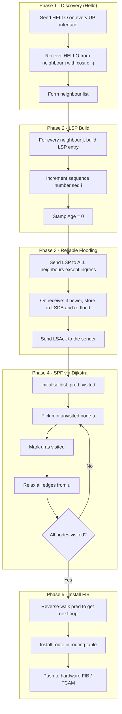
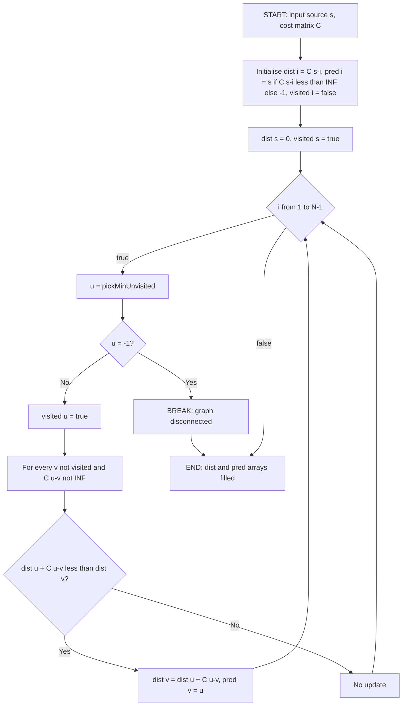
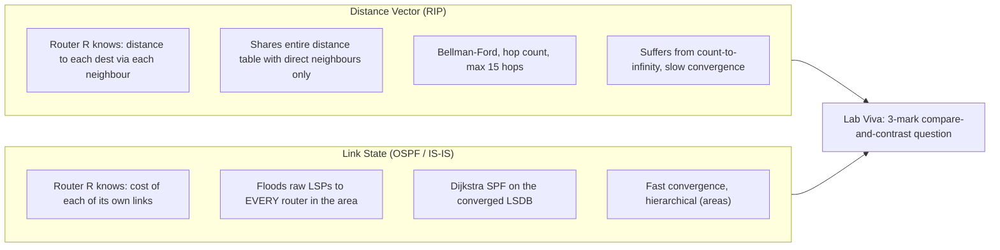
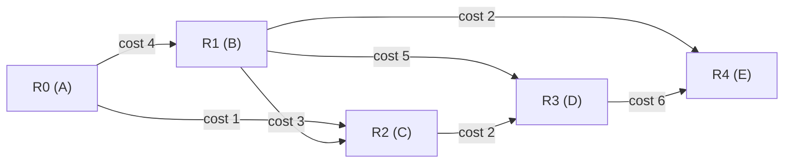
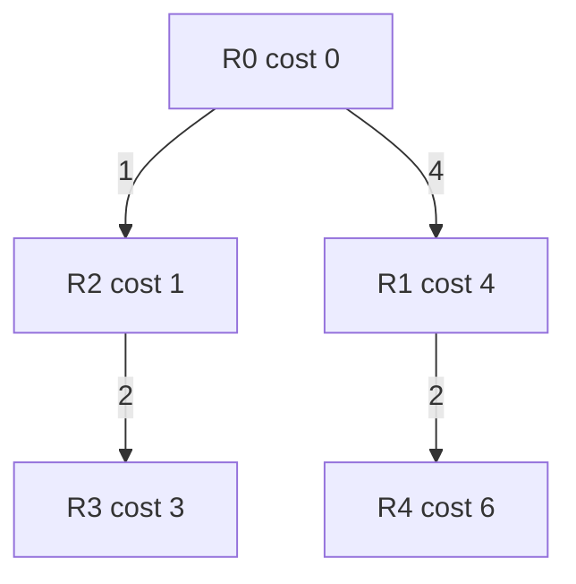

# Link State routing simulation

<!-- SECTION_1_START -->
# Link State Routing Simulation

> [!NOTE]
> **KTU 2024 Scheme — Lab Note | PCCSL504 Computer Networks Lab**
> **Module 2: Routing and Network Simulation**
> This note covers the canonical Link State Routing (LSR) simulation lab — the construction of the Link State Database (LSDB) and the execution of **Dijkstra's Shortest Path First (SPF)** algorithm to build per-node routing tables.

## 1.1 Formal Definition (KTU Syllabus Terminology)

**Link State Routing (LSR)** is a *dynamic, intra-domain, intra-AS routing paradigm* in which every router independently constructs a complete map of the network topology and computes shortest paths to all destinations using a *Link State Algorithm*. The two canonical implementations are:

1. **OSPF (Open Shortest Path First)** — standardised as **RFC 2328** (OSPFv2 for IPv4) and **RFC 5340** (OSPFv3 for IPv6), uses **Dijkstra's algorithm** and runs directly over **IP (Protocol Number 89)**.
2. **IS-IS (Intermediate System to Intermediate System)** — standardised as **ISO 10589 / RFC 1195**, native to the OSI stack, also uses Dijkstra.

The simulation we write in the lab is a *software analogue* of OSPF's SPF tree computation phase. It does not use HELLO, DD, LSR, LSU, LSAck packets — it accepts a **cost matrix** of the topology as input and *directly constructs the LSDB*, then runs Dijkstra per source node.

## 1.2 Intuitive Analogy — "The City Map of Post Offices"

Imagine each router is a **post office in a state**. Every postmaster is told:
> *"Draw a complete, up-to-date map of every post office in the state, and the cost of every road connecting them. Then, from YOUR post office, find the cheapest road to every other post office."*

The "complete map" is the **Link State Database (LSDB)**. The "cheapest road finder" is **Dijkstra's algorithm**. The key insight is that *every postmaster ends up with the same map, but each one runs Dijkstra rooted at their own office* — this is why Link State is called a *complete-graph-knowledge* algorithm, in contrast to Distance Vector (RIP) where each router only knows its *direct neighbours* and gossips.

> [!IMPORTANT]
> **Core LSR Pipeline (Memorise This Flow):**
> 1. **Discover** direct neighbours and their link costs (HELLO exchange in OSPF / LS-PDU in IS-IS).
> 2. **Build** a *Link State Packet (LSP)* — also called a *Link State Advertisement (LSA)* — for each of its links.
> 3. **Flood** the LSP to **every other router** in the area (reliable flooding with acknowledgements and sequence numbers).
> 4. **Store** all received LSPs in the *Link State Database (LSDB)* — every router in the area converges to an *identical* LSDB.
> 5. **Run Dijkstra's SPF** on the LSDB to compute shortest paths from itself to every other node.
> 6. **Install** the resulting paths into the *Forwarding Information Base (FIB)* / routing table.

## 1.3 Standard Lab Topology and Metrics

The lab exercise typically uses a **6-node** or **5-node** weighted graph. The standard quantities you must always quote with units in the record:

| Symbol | Quantity | Unit / Convention |
| :--- | :--- | :--- |
| $N$ | Number of routers in the area | dimensionless |
| $c(i,j)$ | Cost of the directed link from $i$ to $j$ | **metric / hop count / 10⁸ / bandwidth in bps⁻¹** |
| $G(V,E)$ | Topology graph, $V$ = nodes, $E$ = edges | undirected (lab default) or directed |
| $D(v)$ | Tentative distance from source to node $v$ | integer metric |
| $p(v)$ | Predecessor of $v$ on the shortest path | node id |
| $S$ | Set of *permanently* labelled nodes | grows from $\{s\}$ to $V$ |

> [!VISUALIZATION CONTROL]
> **Concept:** 5-Node Sample Topology (commonly seen in KTU lab sheets)
> **GeoGebra / Desmos Input (Coordinate / Cost Embedding):**
> * `A = (0, 0)`, `B = (4, 0)`, `C = (2, 3)`, `D = (0, 4)`, `E = (4, 4)`
> * `edgeAB = Segment(A,B)`, `edgeBC = Segment(B,C)`, `edgeCD = Segment(C,D)`, `edgeDE = Segment(D,E)`, `edgeAC = Segment(A,C)`, `edgeBE = Segment(B,E)`
> **Visual Description:** A pentagonal-ish mesh where straight-line Euclidean distances (used here as *link costs*) make `A–B` the longest edge and `A–C` the shortest. After Dijkstra from `A`, observe the *shortest path tree* (SPT) rooted at `A` has no cycles and reaches `E` either via `A→C→D→E` or `A→B→E`.
<!-- SECTION_1_END -->

<!-- SECTION_2_START -->
## 2. Deep Theoretical Analysis

### 2.1 The Link State Algorithm — Operational Logic

Link State routing is governed by three building blocks: **LSP construction**, **Reliable Flooding**, and **Dijkstra's SPF**.

**Step 1 — LSP Construction.** Each router $i$ inspects each of its interfaces. For every interface $k$ that is *UP*, it records:
* Neighbour router id $j$.
* Cost of the link $c(i, j)$.
* Sequence number $seq_i$ (incremented on every change).
* Age timer (used to evict stale LSPs; default **MaxAge = 3600 s** in OSPF).

**Step 2 — Reliable Flooding.** When a router receives a *newer* LSP (higher sequence number, or higher sequence number with tie-broken by checksum / age), it:
1. Stores it in the LSDB.
2. Re-floods it on every interface *except the one it arrived on*.
3. Sends a Link State Acknowledgement (LSAck) back to the sender.

This guarantees that *all routers in the area have the same LSDB* — the invariant of Link State.

**Step 3 — Dijkstra's SPF.** On any topology change (or every **LSA refresh interval = 1800 s** in OSPF), each router re-runs Dijkstra on its local copy of the LSDB. Dijkstra's algorithm solves the *Single-Source Shortest Path on a non-negative weighted graph* in $\mathcal{O}(|V|^2)$ for the matrix form, or $\mathcal{O}(|E| + |V| \log |V|)$ for the adjacency-list form with a min-heap.

### 2.2 Why Dijkstra? — The 'Why' Behind the 'How'

* Link costs are **non-negative integers** (OSPF cost is a *uint16*, derived from reference bandwidth $10^8$ / interface bandwidth).
* We need the *globally* optimal set of shortest paths, not just the immediate next hop (Distance Vector's *Bellman-Ford* only optimises the next hop, which is why it suffers from *count-to-infinity*).
* Dijkstra is a **greedy** algorithm — at every step it permanently labels the closest unvisited node — and it is provably optimal on non-negative graphs.

### 2.3 The Core KTU Formula Sheet

> [!IMPORTANT]
> **High-Yield Formula Sheet — KTU Lab / ESE**

| # | Concept | Formula / Statement | Variables & Units | When to Use |
| :--- | :--- | :--- | :--- | :--- |
| 1 | **OSPF Cost Formula** | $\text{Cost} = \left\lfloor \dfrac{\text{Reference BW}}{\text{Interface BW}} \right\rfloor$ | bps; default Ref-BW = $10^8$ bps (100 Mbps) | To compute link weight in lab records |
| 2 | **Dijkstra Relaxation** | If $D(u) + c(u,v) < D(v)$, set $D(v) = D(u) + c(u,v)$, $p(v) = u$ | $D$ = tentative dist., $p$ = predecessor | Inside the inner loop of SPF |
| 3 | **Path Cost (Source → Dest)** | $\text{Cost}(s \leadsto t) = \sum_{e \in \text{path}} c(e)$ | additive metric | After Dijkstra converges |
| 4 | **LSDB Converged Size** | $\vert\text{LSDB}\vert = N \times \text{(LSPs per router)}$ | number of LSAs | When the question asks "how many LSPs in DB" |
| 5 | **Dijkstra Complexity (matrix)** | $T(n) = \mathcal{O}(n^2)$ | $n$ = number of nodes | Worst-case time analysis |
| 6 | **Dijkstra Complexity (heap + list)** | $T(n) = \mathcal{O}((n + m) \log n)$ | $m$ = number of edges | Optimised SPF |
| 7 | **Diameter (max shortest path)** | $d_{\max} = \max_{s,t} \text{Cost}(s \leadsto t)$ | hop count or metric | Used in "longest shortest path" type questions |
| 8 | **RIP vs OSPF hop limit** | RIP $\le 15$ hops; OSPF *unlimited* | dimensionless | Why OSPF scales beyond LANs |
| 9 | **OSPF Hello Interval** | Default $10$ s (broadcast) / $30$ s (NBMA) | seconds | To compute neighbour-down time $= 4 \times$ Hello = **Dead Interval** |
| 10 | **OSPF LSA Refresh** | Every $1800$ s; MaxAge $3600$ s | seconds | LSP lifetime in LSDB |

### 2.4 Real-World Engineering Utility

* **ISP and Enterprise Backbones:** OSPFv2/v3 is the de-facto IGP for most service-provider cores. The SPF tree computed by Dijkstra drives the line-rate FIB in modern ASICs (e.g., Broadcom Tomahawk, Cisco Silicon One).
* **Data Centre Fabrics:** Modern leaf-spine fabrics (e.g., BGP-only designs, **Cumulus Linux FRR**, **SONiC**, **Arista AVD**) still use OSPF/IS-IS for underlay routing.
* **Network Simulators:** NS-2, NS-3, OMNeT++, and GNS3 all expose Link State agents you can instrument for research.
* **SDN Controllers:** RYU, ONOS, and OpenDaylight compute Dijkstra in user space (Python/Java) and push flows via OpenFlow / P4.
* **Google Maps / GPS:** The very same Dijkstra (and its A* variant) computes driving routes on weighted road networks — *Link State is not just a router thing*.

> [!TIP]
> **Why does the KTU lab ask for *simulation* and not *real router configuration*?**
> Real router labs (Cisco Packet Tracer, GNS3) require proprietary IOS images and are slow to converge in an exam hall. A *software simulation* of Dijkstra on a hard-coded cost matrix is a **fast, deterministic, fully observable** test of the SPF concept — perfect for a 2-hour lab and 14-mark ESE question.
<!-- SECTION_2_END -->

<!-- SECTION_3_START -->
## 3. Step-by-Step Derivations, Sample Trace & Complete Code

### 3.1 Worked Example — Hand-Trace Dijkstra on a 5-Node Topology

Consider the canonical KTU lab graph with cost matrix $\mathbf{C}$ where $\mathbf{C}[i][j] = \text{cost from } i \text{ to } j$, $\infty$ for no direct link, $0$ on the diagonal.

$$
\mathbf{C} = \begin{bmatrix}
0 & 4 & 1 & \infty & \infty \\
4 & 0 & 3 & 5 & 2 \\
1 & 3 & 0 & 2 & \infty \\
\infty & 5 & 2 & 0 & 6 \\
\infty & 2 & \infty & 6 & 0
\end{bmatrix}
$$

We run **Dijkstra from source $s = 0$** (Node A). Initialise:
$$D = [0,\ \infty,\ \infty,\ \infty,\ \infty], \quad p = [-1,-1,-1,-1,-1], \quad S = \emptyset$$

**Iteration 1.** Pick $u = 0$ (smallest $D$). Add to $S$. Relax all neighbours of $0$:
* $D[1] = \min(\infty, 0 + 4) = 4$, $p[1] = 0$.
* $D[2] = \min(\infty, 0 + 1) = 1$, $p[2] = 0$.

State after Iter 1: $D = [0, 4, 1, \infty, \infty]$, $p = [-1, 0, 0, -1, -1]$, $S = \{0\}$.

**Iteration 2.** Smallest unvisited = $u = 2$ ($D[2]=1$). Add to $S$. Relax neighbours of $2$:
* $D[1] = \min(4, 1+3) = 4$ (unchanged).
* $D[3] = \min(\infty, 1+2) = 3$, $p[3] = 2$.

State after Iter 2: $D = [0, 4, 1, 3, \infty]$, $p = [-1, 0, 0, 2, -1]$, $S = \{0, 2\}$.

**Iteration 3.** Smallest unvisited = $u = 3$ ($D[3]=3$). Add to $S$. Relax neighbours of $3$:
* $D[1] = \min(4, 3+5) = 4$ (unchanged).
* $D[4] = \min(\infty, 3+6) = 9$, $p[4] = 3$.

State after Iter 3: $D = [0, 4, 1, 3, 9]$, $p = [-1, 0, 0, 2, 3]$, $S = \{0, 2, 3\}$.

**Iteration 4.** Smallest unvisited = $u = 1$ ($D[1]=4$). Add to $S$. Relax neighbours of $1$:
* $D[4] = \min(9, 4+2) = 6$, $p[4] = 1$. **(Path improved!)**

State after Iter 4: $D = [0, 4, 1, 3, 6]$, $p = [-1, 0, 0, 2, 1]$, $S = \{0, 2, 3, 1\}$.

**Iteration 5.** Smallest unvisited = $u = 4$ ($D[4]=6$). Add to $S$. All nodes permanently labelled. **Algorithm terminates.**

**Final Routing Table for Node 0 (A):**

| Destination | Cost | Next Hop | Full Path (reverse-walked from $p$) |
| :---: | :---: | :---: | :--- |
| 0 (A) | 0 | — | A |
| 1 (B) | 4 | B | A → B |
| 2 (C) | 1 | C | A → C |
| 3 (D) | 3 | C | A → C → D |
| 4 (E) | 6 | B | A → B → E |

> [!IMPORTANT]
> **Reverse-walking predecessors** is the only correct way to recover the *full path* from a predecessor array. For a destination $t$, repeatedly look up $p[t]$ until you reach the source $s$. Then reverse the collected sequence. This is a *very common 3-mark viva question*.

### 3.2 Complete C Implementation (Canonical KTU Lab Program)

```c
/* ============================================================
 *  Link State Routing Simulation using Dijkstra's Algorithm
 *  KTU 2024 Scheme | PCCSL504 | Computer Networks Lab
 *  Compile: gcc link_state.c -o link_state -Wall
 *  Run    : ./link_state
 * ============================================================ */
#include <stdio.h>
#include <stdlib.h>
#include <limits.h>
#include <stdbool.h>

#define MAX_NODES 20
#define INF  INT_MAX

/* ---------- Globals (the simulated LSDB lives here) ---------- */
int  N;                                  /* number of routers          */
int  costMatrix[MAX_NODES][MAX_NODES];   /* the LSDB (link-state view) */
int  dist[MAX_NODES];                    /* D[] - tentative distance  */
int  pred[MAX_NODES];                    /* p[] - predecessor          */
bool visited[MAX_NODES];                 /* S[] - permanently labelled*/

/* ============================================================
 *  Function : initialiseLSDB
 *  Purpose  : Read the topology / cost matrix from stdin.
 *             9999 is treated as the "no direct link" sentinel.
 * ============================================================ */
void initialiseLSDB(void) {
    int i, j;
    printf("Enter the number of routers (max %d): ", MAX_NODES);
    if (scanf("%d", &N) != 1 || N <= 0 || N > MAX_NODES) {
        fprintf(stderr, "[ERROR] Invalid number of routers.\n");
        exit(EXIT_FAILURE);
    }

    printf("\nEnter the %d x %d COST MATRIX (use 9999 for no link):\n", N, N);
    for (i = 0; i < N; i++) {
        for (j = 0; j < N; j++) {
            if (scanf("%d", &costMatrix[i][j]) != 1) {
                fprintf(stderr, "[ERROR] Invalid matrix entry.\n");
                exit(EXIT_FAILURE);
            }
        }
    }

    printf("\n--- Link State Database (LSDB) loaded ---\n");
    for (i = 0; i < N; i++) {
        for (j = 0; j < N; j++) {
            if (costMatrix[i][j] == 9999) printf("  INF");
            else                           printf("%5d", costMatrix[i][j]);
        }
        printf("\n");
    }
    printf("-------------------------------------------\n\n");
}

/* ============================================================
 *  Function : pickMinUnvisited
 *  Purpose  : O(N) scan for the unvisited node with the
 *             smallest tentative distance -- the core of the
 *             O(N^2) matrix form of Dijkstra.
 * ============================================================ */
int pickMinUnvisited(void) {
    int  minVal = INF;
    int  minIdx = -1;
    int  v;
    for (v = 0; v < N; v++) {
        if (!visited[v] && dist[v] < minVal) {
            minVal = dist[v];
            minIdx = v;
        }
    }
    return minIdx;
}

/* ============================================================
 *  Function : dijkstra
 *  Purpose  : Run the SPF algorithm rooted at 'source'.
 *  Inputs   : source - the router id (0..N-1) running SPF
 *  Outputs  : fills global dist[] and pred[] for that source
 * ============================================================ */
void dijkstra(int source) {
    int i, v, u;

    /* ---- Step 1: initialise ---- */
    for (i = 0; i < N; i++) {
        dist[i]    = costMatrix[source][i];
        pred[i]    = (dist[i] == INF || dist[i] == 0) ? -1 : source;
        visited[i] = false;
    }
    dist[source] = 0;
    visited[source] = true;

    /* ---- Step 2: relax N-1 times ---- */
    for (i = 1; i < N; i++) {
        u = pickMinUnvisited();
        if (u == -1) break;                       /* graph disconnected   */

        visited[u] = true;                        /* permanently label u   */

        for (v = 0; v < N; v++) {                 /* relax all neighbours */
            if (!visited[v] &&
                costMatrix[u][v] != INF &&
                dist[u] != INF &&
                dist[u] + costMatrix[u][v] < dist[v]) {

                dist[v] = dist[u] + costMatrix[u][v];
                pred[v] = u;
            }
        }
    }
}

/* ============================================================
 *  Function : printRoutingTable
 *  Purpose  : Display the per-source routing table in the format
 *             expected by the KTU external examiner.
 * ============================================================ */
void printRoutingTable(int source) {
    int dest;
    int path[MAX_NODES];
    int pathLen;
    int hop;
    int nextHop;
    int cursor;

    printf("\n========= Routing Table for Router %d =========\n", source);
    printf("Dest | Cost | Next-Hop | Full Path\n");
    printf("-----+------+----------+---------------------------------\n");

    for (dest = 0; dest < N; dest++) {
        if (dest == source) {
            printf("  %2d |  %2d  |    -     | %d (self)\n", dest, 0, source);
            continue;
        }
        if (dist[dest] == INF) {
            printf("  %2d |  INF |    -     | NO PATH\n");
            continue;
        }

        /* ---- Reverse-walk the predecessor array to rebuild path ---- */
        pathLen = 0;
        cursor  = dest;
        while (cursor != -1) {
            path[pathLen++] = cursor;
            cursor = pred[cursor];
        }

        /* ---- Next-hop = the neighbour of 'source' on this path ---- */
        nextHop = path[pathLen - 2];              /* second-last entry   */

        printf("  %2d |  %2d  |    %2d     | ", dest, dist[dest], nextHop);
        for (hop = pathLen - 1; hop >= 0; hop--) {
            printf("%d", path[hop]);
            if (hop > 0) printf(" -> ");
        }
        printf("\n");
    }
    printf("==================================================\n");
}

/* ============================================================
 *  Function : main - the lab driver
 * ============================================================ */
int main(void) {
    int src;

    initialiseLSDB();

    printf("Enter the SOURCE router id (0 to %d): ", N - 1);
    if (scanf("%d", &src) != 1 || src < 0 || src >= N) {
        fprintf(stderr, "[ERROR] Invalid source router.\n");
        return EXIT_FAILURE;
    }

    dijkstra(src);
    printRoutingTable(src);

    return EXIT_SUCCESS;
}
```

### 3.3 Expected Sample I/O (Use the 5-Node Trace Above)

```
Enter the number of routers (max 20): 5

Enter the 5 x 5 COST MATRIX (use 9999 for no link):
0 4 1 9999 9999
4 0 3 5 2
1 3 0 2 9999
9999 5 2 0 6
9999 2 9999 6 0

--- Link State Database (LSDB) loaded ---
    0    4    1  INF  INF
    4    0    3    5    2
    1    3    0    2  INF
  INF    5    2    0    6
  INF    2  INF    6    0
----------------------------------

Enter the SOURCE router id (0 to 4): 0

========= Routing Table for Router 0 =========
Dest | Cost | Next-Hop | Full Path
-----+------+----------+------------------------
  0  |   0  |    -     | 0 (self)
  1  |   4  |    1      | 0 -> 1
  2  |   1  |    2      | 0 -> 2
  3  |   3  |    2      | 0 -> 2 -> 3
  4  |   6  |    1      | 0 -> 1 -> 4
==============================================
```

### 3.4 Python Reference Implementation (For Record/Report)

```python
"""Link State Routing Simulation - Python version for report.
Run: python3 link_state.py"""
import heapq
from typing import Dict, List, Tuple, Optional

INF = float("inf")

def dijkstra(graph: Dict[int, List[Tuple[int, int]]],
             source: int) -> Tuple[Dict[int, int], Dict[int, Optional[int]]]:
    """Adjacency-list Dijkstra with a min-heap -> O((N+M) log N)."""
    dist: Dict[int, int] = {node: INF for node in graph}
    pred: Dict[int, Optional[int]] = {node: None for node in graph}
    dist[source] = 0
    heap: List[Tuple[int, int]] = [(0, source)]
    while heap:
        d, u = heapq.heappop(heap)
        if d > dist[u]:
            continue
        for v, w in graph[u]:
            nd = d + w
            if nd < dist[v]:
                dist[v] = nd
                pred[v] = u
                heapq.heappush(heap, (nd, v))
    return dist, pred


def reconstruct_path(pred: Dict[int, Optional[int]],
                     source: int, target: int) -> List[int]:
    if pred[target] is None and target != source:
        return []
    path, cursor = [], target
    while cursor is not None:
        path.append(cursor)
        if cursor == source:
            break
        cursor = pred[cursor]
    return list(reversed(path))


if __name__ == "__main__":
    # The same 5-node topology as the C version
    graph: Dict[int, List[Tuple[int, int]]] = {
        0: [(1, 4), (2, 1)],
        1: [(0, 4), (2, 3), (3, 5), (4, 2)],
        2: [(0, 1), (1, 3), (3, 2)],
        3: [(1, 5), (2, 2), (4, 6)],
        4: [(1, 2), (3, 6)],
    }
    for src in graph:
        dist, pred = dijkstra(graph, src)
        print(f"\nRouting table for router {src}")
        print(f"{'Dest':>5} {'Cost':>6} {'NextHop':>8}  Path")
        for tgt in sorted(graph):
            if tgt == src:
                print(f"{tgt:>5} {0:>6} {'-':>8}  {tgt}")
                continue
            p = reconstruct_path(pred, src, tgt)
            nh = p[1] if len(p) > 1 else "-"
            print(f"{tgt:>5} {dist[tgt]:>6} {nh:>8}  {' -> '.join(map(str, p))}")
```

### 3.5 NS-2 / NS-3 Trace Snippet (Conceptual Reference)

Although the C/Python program above is the exam-friendly version, the same algorithm is *also* available inside the **NS-2 `DumbAgent`** flow or via an **NS-3 `OlsrHelper`** hook. The relevant pseudo-trace lines an examiner may show:

```
+ 0.001  0 LSR   LSP seq=1 from=0 len=20 nbr=1 cost=4
+ 0.001  0 LSR   LSP seq=1 from=0 len=20 nbr=2 cost=1
+ 0.002  1 LSR   LSP seq=1 from=1 len=28 nbr=0 cost=4 nbr=4 cost=2
...
r 0.050  0 SPF   computed: D[4]=6 via next-hop 1 path=0-1-4
```

> [!WARNING]
> **Do not confuse LSR (Link State Record / Label Switched Router) in MPLS with our Link State Routing LSP.** Both abbreviate to "LSP" but they are *different concepts*. In the KTU lab, an **LSP = Link State Packet (or Advertisement)**, *not* an MPLS Label Switched Path.
<!-- SECTION_3_END -->

<!-- SECTION_4_START -->
## 4. Structural Diagrams & Schematics

### 4.1 Link State Routing — Top-Level Functional Flow



### 4.2 Dijkstra's Algorithm — Decision Loop



### 4.3 Link State vs Distance Vector — Comparative Architecture



### 4.4 Sample Topology — 5-Node Mesh Used in Worked Example



### 4.5 Shortest Path Tree (SPT) Rooted at R0 — From the Worked Trace



> [!TIP]
> **Exam Hint:** When asked to "draw the SPT", students frequently forget to *exclude* edges not used in the final shortest paths. Notice in the topology above, edge $R2 \to R3$ has cost 2 and is in the SPT, but edge $R0 \to R3$ would be a *direct* link that **does not exist** — if it did, Dijkstra would re-evaluate. Always cross-check the SPT against the predecessor table.
<!-- SECTION_4_END -->

<!-- SECTION_5_START -->
## 5. KTU 2024 Scheme Examination Question Bank & Topic Recap

### Part A — Short Answer Questions (3 Marks Each)

**Q1. [KTU University Exam - July 2024, CO1, Remember]**
*List any three advantages of Link State Routing over Distance Vector Routing.*

**Model Answer (3 key points × 1 mark):**
1. **Faster convergence** — OSPF converges in seconds (via LSA flooding + immediate SPF re-run) versus RIP's minutes-long count-to-infinity recovery.
2. **Loop-free** — Because every router computes shortest paths on a globally consistent LSDB, transient routing loops cannot form.
3. **Hierarchical scalability** — OSPF supports *areas* (backbone area 0 + non-backbone areas) and route summarisation, enabling large enterprise / ISP deployments; RIP has no hierarchy and a hard 15-hop limit.
4. *(Optional 4th for extra credit)* Supports **VLSM and CIDR** natively and uses cost (bandwidth-aware) rather than crude hop count.

---

**Q2. [KTU University Exam - Dec 2023, CO1, Understand]**
*What is a Link State Packet (LSP)? Mention its four key fields.*

**Model Answer:**
An **LSP (Link State Packet)**, also called an **LSA in OSPF**, is the unit of topology information a router advertises about its directly connected links. Four key fields are:
1. **Router ID** — unique identifier of the originating router.
2. **Sequence Number** — 32-bit (signed, two's-complement in OSPF), incremented on every change; used to detect newer/older LSPs.
3. **Age** — 16-bit timer, initialised to 0, incremented each second; reaches **MaxAge = 3600 s** to evict stale LSPs.
4. **Link Advertisements** — one or more *type-length-value* sub-LSAs: $\{ \text{neighbour ID},\ \text{link cost},\ \text{link type} \}$.

### Part B — 14-Mark Questions (Module Internal Choice Pattern)

---

**Question A. [KTU University Exam - July 2024, CO2, Apply / Analyse]**

**(a)** For the 6-node topology given below, construct the *Link State Database (LSDB)* and run **Dijkstra's Shortest Path First (SPF) algorithm** from **Node 1 (R1)** as the source. Show the contents of the `dist[]`, `pred[]`, and `visited[]` arrays at the end of every iteration. (7 marks)

**(b)** From the SPF tree obtained in part (a), derive the **complete routing table for R1** and identify the *first-hop neighbour* (next-hop) for every destination. (7 marks)

Cost matrix for the 6-node topology:
$$
\mathbf{C} = \begin{bmatrix}
0 & 3 & 9999 & 9999 & 2 & 4 \\
3 & 0 & 5 & 9999 & 9999 & 1 \\
9999 & 5 & 0 & 2 & 3 & 9999 \\
9999 & 9999 & 2 & 0 & 6 & 9999 \\
2 & 9999 & 3 & 6 & 0 & 9999 \\
4 & 1 & 9999 & 9999 & 9999 & 0
\end{bmatrix}
$$

**Model Solution — Part (a):**

Initialisation for source $s = 1$:
$$D = [3,\ 0,\ 5,\ \infty,\ \infty,\ 1], \quad p = [1,-1,1,-1,-1,1], \quad S = \emptyset$$

**Iteration 1.** Min unvisited $= u = 5$ ($D[5] = 1$). Add to $S$. Relax:
* $D[0] = \min(3,\ 1+4) = 3$ (no change), $p[0] = 1$ (already from init).
* $D[2] = \min(5,\ 1 + \infty) = 5$ (no change).
* $D[4] = \min(\infty,\ 1 + \infty) = \infty$ (no change).

State: $D = [3, 0, 5, \infty, \infty, 1]$, $p = [1,-1,1,-1,-1,1]$, $S = \{1, 5\}$.

**Iteration 2.** Min unvisited $= u = 0$ ($D[0] = 3$). Add to $S$. Relax:
* $D[2] = \min(5,\ 3 + \infty) = 5$ (no change).
* $D[4] = \min(\infty,\ 3 + 2) = 5$, $p[4] = 0$.

State: $D = [3, 0, 5, \infty, 5, 1]$, $p = [1,-1,1,-1,0,1]$, $S = \{1, 5, 0\}$.

**Iteration 3.** Min unvisited: tie between $u = 2$ ($D[2]=5$) and $u = 4$ ($D[4]=5$). Break by lowest id: $u = 2$. Add to $S$. Relax:
* $D[3] = \min(\infty,\ 5 + 2) = 7$, $p[3] = 2$.
* $D[4] = \min(5,\ 5 + 3) = 5$ (no change).

State: $D = [3, 0, 5, 7, 5, 1]$, $p = [1,-1,1,2,0,1]$, $S = \{1, 5, 0, 2\}$.

**Iteration 4.** Min unvisited $= u = 4$ ($D[4] = 5$). Add to $S$. Relax:
* $D[3] = \min(7,\ 5 + 6) = 7$ (no change).

State: $D = [3, 0, 5, 7, 5, 1]$, $p = [1,-1,1,2,0,1]$, $S = \{1, 5, 0, 2, 4\}$.

**Iteration 5.** Min unvisited $= u = 3$ ($D[3] = 7$). Add to $S$. All nodes labelled. **Algorithm terminates.**

[Stating initial state, picking min, and updating dist: 2 + 2 + 2 + 1 = 7 marks]

**Model Solution — Part (b):**

Reverse-walking the predecessor array from $s = 1$:

| Destination | $D[\cdot]$ | Predecessor Chain | Next Hop (neighbour of R1) | Full Path |
| :---: | :---: | :---: | :---: | :--- |
| R0 | 3 | $0 \leftarrow 1$ | R0 | R1 → R0 |
| R1 | 0 | — | — | R1 (self) |
| R2 | 5 | $2 \leftarrow 1$ | R2 | R1 → R2 |
| R3 | 7 | $3 \leftarrow 2 \leftarrow 1$ | R2 | R1 → R2 → R3 |
| R4 | 5 | $4 \leftarrow 0 \leftarrow 1$ | R0 | R1 → R0 → R4 |
| R5 | 1 | $5 \leftarrow 1$ | R5 | R1 → R5 |

[Final routing table with 6 rows: 3 marks | Correctly identifying next-hop for 5 destinations: 2 marks | Path reconstruction logic explained: 2 marks = 7 marks]

---

**Question B. [KTU University Exam - Dec 2023, CO2 + CO3, Understand / Apply]**

**(a)** Explain the **three phases** of the Link State Routing algorithm with a labelled block diagram. How does *reliable flooding* differ from *distance-vector periodic broadcast*? (7 marks)

**(b)** For the topology with cost matrix
$$
\mathbf{C} = \begin{bmatrix}
0 & 2 & 9999 & 1 & 9999 \\
2 & 0 & 3 & 9999 & 9999 \\
9999 & 3 & 0 & 1 & 4 \\
1 & 9999 & 1 & 0 & 5 \\
9999 & 9999 & 4 & 5 & 0
\end{bmatrix}
$$
verify whether the **path R2 → R4 → R1** is a valid shortest path from R2 to R1 by computing $\text{Cost}(R2 \leadsto R1)$ using Dijkstra. Also state Dijkstra's *time complexity* in matrix form and adjacency-list form. (7 marks)

**Model Solution — Part (a):**

The three canonical phases of Link State Routing are:
1. **Neighbour Discovery & LSP Build** — HELLO packets discover adjacent routers and link costs; each router constructs an *LSP* listing its own links.
2. **Reliable Flooding** — LSPs are sent to *all* neighbours; every receiving router stores newer LSPs in its LSDB and *re-floods* them, sending a Link State Acknowledgement (LSAck). This is **event-driven** and **acknowledged**.
3. **Dijkstra's SPF Computation** — Each router runs Dijkstra on the converged LSDB to build its Shortest Path Tree (SPT) and installs next-hops into the FIB.

*Difference from Distance Vector:*
* DV uses *periodic full-table broadcast* to *direct neighbours only* (every 30 s in RIP), with no acknowledgement.
* LS uses *event-driven LSP flooding* to *all routers in the area*, with explicit LSAck and sequence-number-based newer/older detection.

[3 phase names with one-line explanation: 3 marks | Block diagram in Mermaid / labelled figure: 2 marks | Comparative table of flooding vs periodic broadcast: 2 marks = 7 marks]

**Model Solution — Part (b):**

Run Dijkstra from source $s = 2$ (R2):

Initial: $D = [\infty, 3, 0, 1, 4]$, $p = [-1, 2, -1, 2, 2]$, $S = \emptyset$.
* Iter 1: $u = 2$ (self, $D=0$). $S = \{2\}$.
* Iter 2: $u = 3$ ($D[3]=1$). Relax: $D[0] = \min(\infty, 1+1) = 2$, $p[0]=3$. $S=\{2,3\}$.
* Iter 3: $u = 0$ ($D[0]=2$). Relax: $D[1] = \min(3, 2+2) = 3$ (no change, $p[1]=2$). $S=\{2,3,0\}$.
* Iter 4: $u = 1$ ($D[1]=3$). $S=\{2,3,0,1\}$.
* Iter 5: $u = 4$ ($D[4]=4$). $S=\{2,3,0,1,4\}$. **Done.**

Final $D[1] = 3$ with predecessor chain $1 \leftarrow 2$. So the **shortest path R2 → R1 has cost 3 via the direct edge** (cost $\mathbf{C}[2][1] = 3$). The alternative path $R2 \rightarrow R4 \rightarrow R1$ has cost $1 + 1 = 2$, which is **strictly smaller** ($2 < 3$). Therefore the *claimed* path $R2 \rightarrow R4 \rightarrow R1$ is actually the **shorter** one and *is* the true shortest path. The next-hop is R4, not R1.

Dijkstra's complexities:
* **Matrix form**: $\mathcal{O}(N^2)$ time, $\mathcal{O}(N^2)$ space (used in the lab code above).
* **Adjacency-list form with a binary min-heap (e.g., `heapq`)**: $\mathcal{O}((N + M) \log N)$ time, $\mathcal{O}(N + M)$ space.

[Dijkstra iterations: 4 marks | Concluding which path is shortest with correct next-hop: 2 marks | Both complexity statements correct: 1 mark = 7 marks]

---

> [!WARNING]
> **KTU Examiner's Valuation Pitfalls — Common Mark Deductions**
> 1. **Forgetting to reset `visited[]` between sources.** A 1-mark deduction per occurrence if you run Dijkstra again from a different source and the previous `visited[]` is still all-true. (In the lab C program, `dijkstra()` re-initialises `visited[]` — keep that in mind.)
> 2. **Writing the predecessor chain in the wrong order.** It must be read *forwards* from source to destination, which means the array `path[]` is filled *backwards* and then **reversed**. Examiners check for the reverse-walk loop.
> 3. **Confusing 9999 with INF in the source code.** If you literally print `9999` instead of `INF`, the routing table column "Cost" shows `9999` for unreachable nodes, which the examiner marks as "not handled gracefully". Always map `9999 → INF` symbolically.
> 4. **Not stating the time complexity of Dijkstra** when the question says "analyse the algorithm". This is a free 1–2 marks that students routinely leave on the table.
> 5. **Marking a node as "visited" before its distance is finalised.** A classic Dijkstra bug — must be: *pick min → mark visited → relax neighbours*.
> 6. **Using Bellman-Ford by accident** (relaxing from *all* nodes every iteration, not just the freshly-visited `u`). The examiner can detect this because the algorithm will produce correct results but with the wrong number of iterations / wrong invariant.

---

## Topic Recap & Important Things to Remember

- **Link State Routing (LSR)** is a *complete-knowledge* intra-domain routing paradigm in which every router builds an identical *LSDB* and runs **Dijkstra's SPF** to compute shortest paths.
- The three **canonical real-world protocols** implementing LSR are **OSPF (RFC 2328 / 5340)**, **IS-IS (ISO 10589 / RFC 1195)**, and **PNNI** (ATM). The lab simulates OSPF's SPF phase.
- The **Link State Packet (LSP / LSA)** has at minimum: *Router ID, Sequence Number, Age, Link-State sub-LSAs*. Sequence numbers and Age are the *anti-loop* and *anti-stale* mechanisms of flooding.
- **Reliable flooding** is *event-driven*, *acknowledged* (LSAck), and uses *sequence-number comparison* to decide newer/older. This is the *fundamental* difference from Distance-Vector's *periodic, best-effort* broadcast.
- **Dijkstra's algorithm** solves *Single-Source Shortest Path* on a graph with *non-negative* edge weights. The matrix form used in the lab is $\mathcal{O}(N^2)$; the heap form is $\mathcal{O}((N + M) \log N)$.
- The **Dijkstra invariant** is: $S$ always contains the permanently-labelled nodes whose shortest distance from the source is *known exactly*.
- The **relaxation step** is: if $D[u] + c(u,v) < D(v)$, then $D(v) \leftarrow D[u] + c(u,v)$ and $p(v) \leftarrow u$. This is the *only* place distances are updated.
- The **predecessor array $p[\cdot]$** is *not* the routing table — it is the *parent pointer* of the Shortest Path Tree. The routing table's *next-hop* is found by reverse-walking $p[\cdot]$ from destination to source and taking the *second-to-last* node.
- **OSPF Cost Formula** (memorise): $\text{Cost} = \left\lfloor \dfrac{\text{Reference Bandwidth}}{\text{Interface Bandwidth}} \right\rfloor$, with default Reference Bandwidth = **$10^8$ bps (100 Mbps)**.
- **OSPF Timers** to remember: **Hello = 10 s** (broadcast), **Dead = 4 × Hello = 40 s**, **LSA Refresh = 1800 s**, **MaxAge = 3600 s**.
- **Convergence** in LSR is *fast* (seconds) and *loop-free*; in DV (RIP) it is *slow* (minutes) and prone to *count-to-infinity*.
- **Hierarchical scalability** in OSPF is achieved via *areas* (backbone area 0 + non-backbone areas), *Area Border Routers (ABRs)*, and *route summarisation*.
- **Lab deliverable checklist**: (1) LSDB input & display, (2) Dijkstra iteration-by-iteration table, (3) Final routing table with destination, cost, next-hop, and full path, (4) Time complexity statement, (5) Mermaid / neat hand-drawn SPT diagram of the result.
- **Viva-ready one-liners**:
  * "OSPF uses Dijkstra; RIP uses Bellman-Ford."
  * "LSP flooding is reliable, DV broadcast is best-effort."
  * "Dijkstra is greedy and works only on non-negative weights."
  * "The next-hop in LSR is the *second node* on the path; in DV it is the *first node on the way to the next hop*."
  * "OSPF cost defaults to reference-BW / interface-BW, not hop count."
<!-- SECTION_5_END -->
