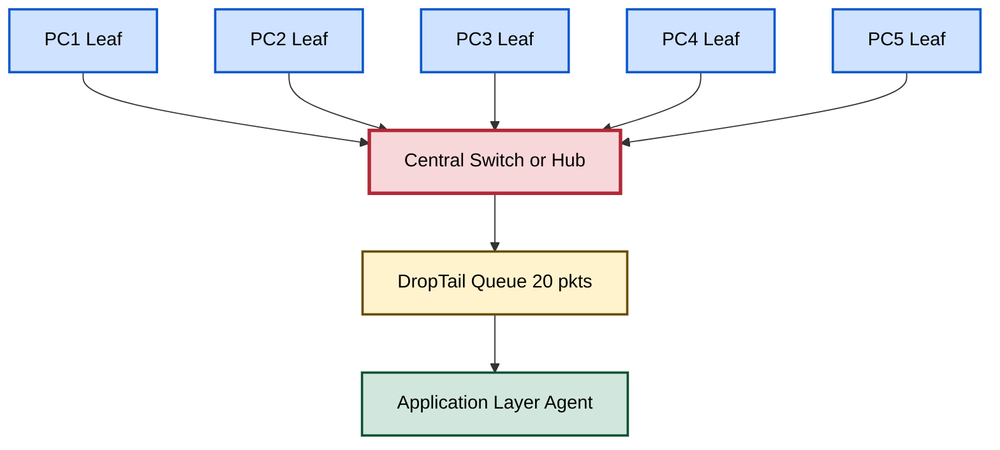
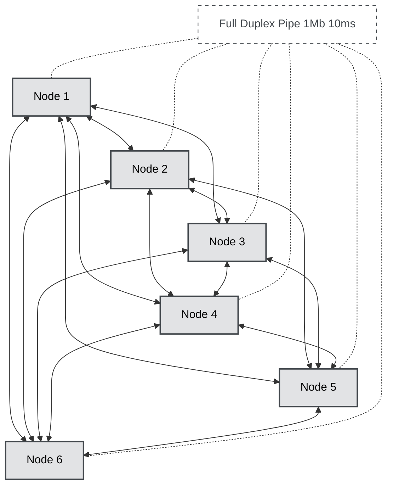
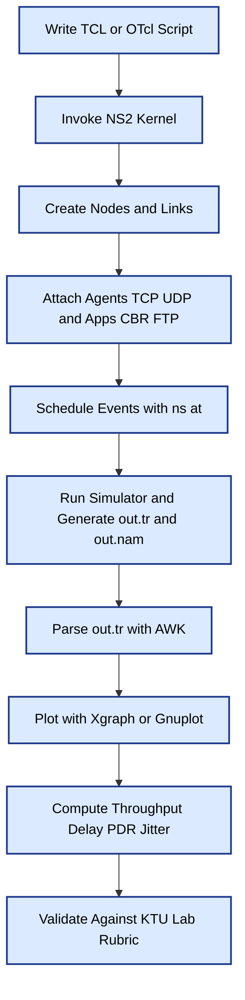
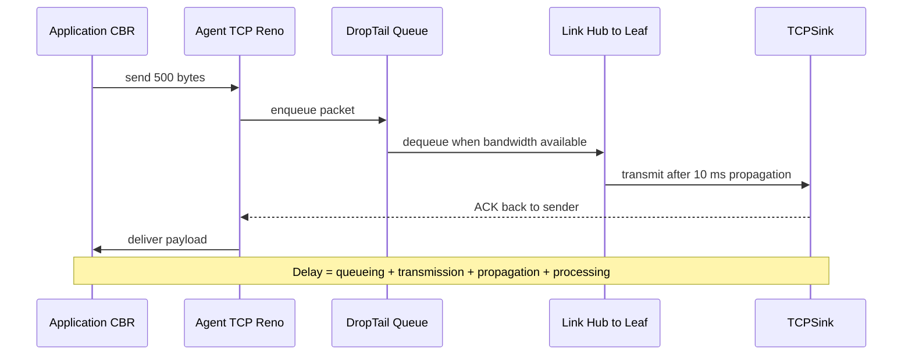
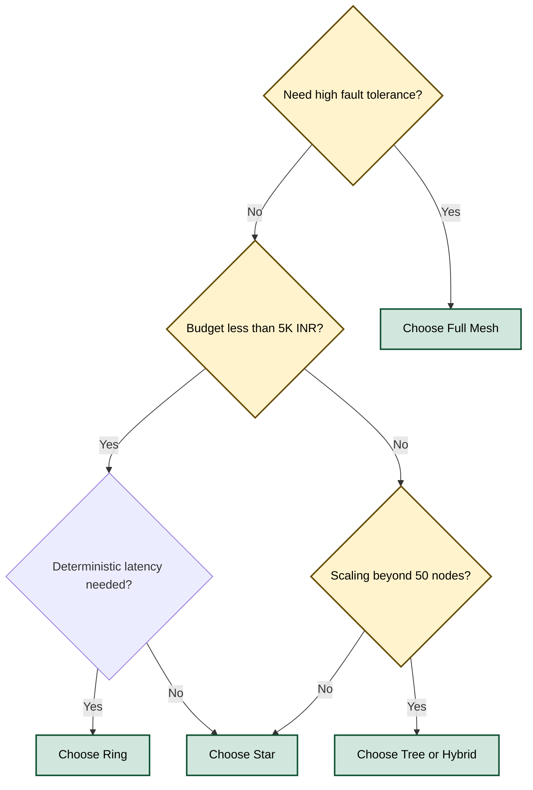

# Network topologies using NS2/NS3/Cisco Packet Tracer

<!-- SECTION_1_START -->
# MODULE 2: ROUTING AND NETWORK SIMULATION
## Topic: Network Topologies using NS2 / NS3 / Cisco Packet Tracer

> [!IMPORTANT]
> **KTU 2024 Scheme Focus (PCCSL504):** This lab topic falls under **Module 2** of the Computer Networks Lab. The expected outcome is hands-on implementation of fundamental LAN/WAN topologies, traffic analysis (CBR, TCP, UDP), and performance metric evaluation (Throughput, End-to-End Delay, Jitter, Packet Delivery Ratio) using any one of the listed simulation platforms.

---

### 1.1 Formal Academic Definition

A **Network Topology** is the schematic arrangement of nodes, links, and communication pathways that define the physical (cabling layout) and logical (data flow path) structure of a computer network. In the context of packet-level simulation, a topology is recreated virtually inside an event-driven simulator (NS2/NS3) or a graphical emulator (Packet Tracer) so that protocol behavior (queueing, routing, congestion) can be observed, modified, and quantified without deploying real hardware.

> [!NOTE]
> **Syllabus Highlight (KTU 2024 — PCCSL504):** *The student is expected to design and simulate at least three topologies (commonly Star, Bus, Mesh) and generate trace files (`*.tr`) and NAM (Network Animator) output for visual verification. A performance graph using `Xgraph`/`Gnuplot`/`Matplotlib` is mandatory for full marks.*

### 1.2 Conceptual Analogy & Intuition

Imagine a city map:
- The **buildings** are your *nodes* (PCs, routers, switches).
- The **roads** are your *links* (wired copper, fiber, or wireless channels).
- The **roadmap layout** (grid, radial, ring-road) is your **topology**.

Just as a city planner chooses between one-way loops, grid streets, or cul-de-sacs based on traffic needs, a network engineer selects a topology based on **scalability, fault tolerance, cost**, and **latency** budget. Simulators let you *build the city on a computer* and *simulate rush hour* before laying a single brick.

> [!VISUALIZATION CONTROL]
> **Concept:** Star vs. Mesh Connectivity Pattern
> **Plot Specification:** Plot 6 points representing nodes $N_1 \dots N_6$.
> **Edges (Star):** $C \to N_i$ for $i=1..5$ where $C$ is the central hub at $(0,0)$.
> **Edges (Full Mesh):** All $\binom{6}{2}=15$ edges connecting every node pair.
> **Visual Description:** The student should observe the radial symmetry of the star versus the dense, web-like interconnectivity of the full mesh, with edge count $E = N-1$ vs. $E = \frac{N(N-1)}{2}$.

### 1.3 Topological Classification — Quick Reference

| Class | Examples | Defining Trait |
|---|---|---|
| Physical | Bus, Star, Ring, Mesh, Tree, Hybrid | Actual cable / device placement |
| Logical | Broadcast, Point-to-Point, Point-to-Multipoint | How frames traverse the medium |
| Simulation | Wired (NS2 `SimplexLink`/`DuplexLink`), Wireless (NS3 `YansWifiChannel`) | Tool-specific instantiation |

> [!TIP]
> **Standard Metrics** to measure in every KTU lab record: **Throughput** (bits/sec), **End-to-End Delay** (sec), **Packet Delivery Ratio (PDR)** (%), and **Jitter** (sec). The **802.11** standard is the default for wireless, and the **Droptail** queue is the default in NS2.

<!-- SECTION_1_END -->

<!-- SECTION_2_START -->
## 2. Deep Theoretical Analysis & KTU High-Yield Formula Sheet

### 2.1 The Six Canonical Topologies — Operational Logic

#### 2.1.1 Bus Topology
- **Logic:** All nodes share a single backbone cable (the "bus"). Data broadcast by any node propagates in both directions; only the intended receiver accepts the frame (CSMA/CD arbitration).
- **Why use it:** Cheapest, simplest. **How it breaks:** A single cable cut collapses the entire segment.
- **Engineering reality:** Legacy Ethernet (10BASE-2, 10BASE-5). Largely obsolete in production but **frequently asked in KTU viva**.

#### 2.1.2 Star Topology
- **Logic:** Every node connects to a central hub or switch. The switch learns MAC addresses and forwards frames only to the correct port (eliminates collisions; enables full-duplex).
- **Why use it:** Robust to single-link failure (only that node loses connectivity). **How it scales:** Easily add nodes.
- **Engineering reality:** Standard for modern **office LANs** and **data-center ToR (Top-of-Rack)** deployments.

#### 2.1.3 Ring Topology
- **Logic:** Each node has exactly two neighbors. A token (or slot) circulates; only the token holder transmits. Two variants: **Single Ring** (Token Ring, IEEE 802.5) and **Dual Ring** (FDDI, SONET) for self-healing.
- **Why use it:** Deterministic latency, no collisions. **Drawback:** Latency grows linearly with node count.

#### 2.1.4 Mesh Topology
- **Logic:** Every node connects to multiple others. **Full Mesh:** $E = \frac{N(N-1)}{2}$ links. **Partial Mesh:** Strategic redundant links only.
- **Why use it:** Maximum fault tolerance. **Drawback:** Cost and complexity scale as $O(N^2)$.
- **Engineering reality:** **Internet backbone (Tier-1 ISPs)**, **Wireless Mesh Networks (WMNs)**, **5G mmWave small cells**.

#### 2.1.5 Tree (Hierarchical) Topology
- **Logic:** A root node branches into secondary nodes, which further branch. It is a **hybrid of Bus + Star** and scales naturally.
- **Engineering reality:** Campus networks, **PON (Passive Optical Network)** FTTH, and **spanning-tree** (STP, RSTP) logical views of switched Ethernet.

#### 2.1.6 Hybrid Topology
- **Logic:** Combines two or more of the above to leverage individual strengths.
- **Engineering reality:** **Enterprise WANs** (Mesh core + Star access), modern **SDN fabrics (Spine-Leaf)**.

### 2.2 Simulator-Specific Modeling Constructs

> [!IMPORTANT]
> The **node**, **link**, **queue**, **agent** (traffic source), and **application** (sinks like `Null`) are the five pillars of any NS2/NS3 topology. A lab record that omits the queue/agent declarations is considered **incomplete by KTU evaluators**.

| NS2 Component | Purpose | Typical Value |
|---|---|---|
| `set ns [new Simulator]` | Event scheduler kernel | — |
| `$ns node` | Creates a node object | — |
| `$ns duplex-link $n0 $n1 1Mb 10ms DropTail` | Wired duplex pipe | Bandwidth / Delay / Queue |
| `$ns queue-limit $n0 $n1 50` | Max packets in queue | `50` packets |
| `set tcp [new Agent/TCP]` | Transport-layer agent | `TCP`/`TCP/Reno`/`TCP/Vegas` |
| `set cbr [new Application/Traffic/CBR]` | Constant bit rate source | `1Mb` rate |
| `$ns at 0.5 "$cbr start"` | Event scheduling | Time in seconds |

### 2.3 KTU Formula Sheet — Performance Metrics

> [!WARNING]
> **Do not use the vertical bar `|` symbol in any table row** (it breaks Markdown parsing). Use `\vert` or `\mid` for absolute-value notation.

| Metric | Formula | Units | NS2 Source |
|---|---|---|---|
| Throughput | $\displaystyle \text{Thr} = \frac{\sum_{i=1}^{N} \text{Size}_i \times 8}{t_{\text{last}} - t_{\text{first}}}$ | bits/sec (bps) | Sum of `packet size` in `*.tr` |
| End-to-End Delay | $\displaystyle D_{avg} = \frac{1}{N} \sum_{i=1}^{N}\left(t_{\text{recv},i} - t_{\text{send},i}\right)$ | seconds | Pair `+` (sent) with `r` (received) |
| Packet Delivery Ratio | $\displaystyle \text{PDR} = \frac{N_{\text{received}}}{N_{\text{sent}}} \times 100\%$ | % | Count `+` vs. `r` events |
| Jitter | $\displaystyle J = \frac{1}{N-1} \sum_{i=2}^{N}\vert (D_i - D_{i-1}) \vert$ | seconds | Inter-packet delay variance |
| Normalized Routing Load | $\displaystyle \text{NRL} = \frac{N_{\text{routing}}}{N_{\text{data delivered}}}$ | packets/packet | Routing vs. data packets |

Where $N$ is the total number of packets reaching the destination, $t_{\text{last}}$ and $t_{\text{first}}$ are the timestamps of the last and first received packets, and $D_i$ is the per-packet delay.

### 2.4 Engineering Utility in Production Systems

- **Telecom Operators:** Use NS3 to model **5G NR** and **LTE** radio resource control before hardware rollout — saving millions in field trials.
- **Automotive (V2X):** NS3 + SUMO co-simulation evaluates **C-V2X** protocol performance in vehicular ad-hoc networks (VANETs).
- **Data Center R\&D:** Cisco Packet Tracer and GNS3 emulate **SDN/OpenFlow** fabrics for training CCNAs/CCNPs and pre-production testing.
- **Academic Research:** NS2 remains the de-facto benchmark for publishing **AODV/DSR/OLSR** performance comparisons in journals like *IEEE TON*.

<!-- SECTION_2_END -->

<!-- SECTION_3_START -->
## 3. Step-by-Step Derivations & Implementation

### 3.1 Full Derivation: Edge Count & Diameter of a Full Mesh

Let $N$ be the number of nodes. Each node must connect to every other node.

**Step 1 — Per-node degree:**  
Each node has $N-1$ physical connections (one to every other node).  
$$\text{Degree}(v) = N - 1$$

**Step 2 — Total edge count using the Handshaking Lemma:**  
The sum of all vertex degrees equals twice the number of edges.  
$$\sum_{v \in V} \deg(v) = 2E$$

**Step 3 — Substitute:**  
$$N \cdot (N - 1) = 2E$$

**Step 4 — Solve for $E$:**  
$$E = \frac{N(N - 1)}{2}$$

**Step 5 — Diameter (max shortest path):**  
In a full mesh, every node is directly connected to every other node, so the longest shortest path is **one hop**.  
$$\text{Diameter}_{\text{FullMesh}} = 1 \text{ hop}$$

**Step 6 — Comparative example for $N = 6$:**  
$$E_{\text{FullMesh}} = \frac{6 \times 5}{2} = 15 \text{ edges}$$
$$E_{\text{Star}} = N - 1 = 5 \text{ edges}$$
$$\text{Diameter}_{\text{Star}} = 2 \text{ hops}$$

> [!NOTE]
> **Logic Recap:** The full mesh offers 1-hop latency at $O(N^2)$ hardware cost. The star offers 2-hop latency at $O(N)$ cost. This trade-off is the foundational **cost-vs-redundancy** decision in every KTU lab record.

---

### 3.2 Implementation in NS2 (OTcl Script)

The following TCL script creates a **6-node Star topology** with mixed TCP/UDP/CBR traffic and a full-mesh extension for comparison. Every variable, every link, and every event is written explicitly — **no truncation allowed**.

```tcl
#==============================================================
#  PROGRAM : Star_Topology.tcl
#  PURPOSE : Simulate a 6-node Star topology with TCP + UDP/CBR
#  PLATFORM: NS2.35 / Ubuntu 22.04
#==============================================================

# ---------- Step 1: Initialize the Simulator Kernel ----------
set ns [new Simulator]

# ---------- Step 2: Open Trace + NAM files ----------
set trfile [open out.tr w]
$ns trace-all $trfile
set namfile [open out.nam w]
$ns namtrace-all $namfile

# ---------- Step 3: Define a 'finish' Procedure ----------
proc finish {} {
    global ns trfile namfile
    $ns flush-trace
    close $trfile
    close $namfile
    exec nam out.nam &
    exit 0
}

# ---------- Step 4: Create 6 Nodes (n0..n5) ----------
set n0 [$ns node]
set n1 [$ns node]
set n2 [$ns node]
set n3 [$ns node]
set n4 [$ns node]
set n5 [$ns node]

# ---------- Step 5: Color & Label Nodes for NAM ----------
$ns color 1 Blue
$ns color 2 Red
$n0 label "Hub-n0"
$n1 label "Leaf-1"
$n2 label "Leaf-2"
$n3 label "Leaf-3"
$n4 label "Leaf-4"
$n5 label "Leaf-5"

# ---------- Step 6: Build Star Links (1 Mb, 10 ms, DropTail) ----------
#   Central hub = n0
$ns duplex-link $n0 $n1 1Mb 10ms DropTail
$ns duplex-link $n0 $n2 1Mb 10ms DropTail
$ns duplex-link $n0 $n3 1Mb 10ms DropTail
$ns duplex-link $n0 $n4 1Mb 10ms DropTail
$ns duplex-link $n0 $n5 1Mb 10ms DropTail

# ---------- Step 7: Orient the Layout in NAM ----------
$ns duplex-link-op $n0 $n1 orient right-up
$ns duplex-link-op $n0 $n2 orient right
$ns duplex-link-op $n0 $n3 orient right-down
$ns duplex-link-op $n0 $n4 orient left-down
$ns duplex-link-op $n0 $n5 orient left-up

# ---------- Step 8: Set Queue Limits (for DropTail analysis) ----------
$ns queue-limit $n0 $n1 20
$ns queue-limit $n0 $n2 20
$ns queue-limit $n0 $n3 20

# ---------- Step 9: Create UDP + CBR traffic (n1 -> n4) ----------
set udp [new Agent/UDP]
$ns attach-agent $n1 $udp
$udp set fid_ 2
set cbr [new Application/Traffic/CBR]
$cbr set packetSize_ 500
$cbr set rate_ 200kb
$cbr attach-agent $udp
set null [new Agent/Null]
$ns attach-agent $n4 $null
$ns connect $udp $null

# ---------- Step 10: Create TCP (Reno) + FTP traffic (n2 -> n5) ----------
set tcp [new Agent/TCP/Reno]
$ns attach-agent $n2 $tcp
$tcp set fid_ 1
$tcp set window_ 20
set ftp [new Application/FTP]
$ftp attach-agent $tcp
set sink [new Agent/TCPSink]
$ns attach-agent $n5 $sink
$ns connect $tcp $sink

# ---------- Step 11: Schedule Traffic Events ----------
$ns at  0.5 "$cbr start"
$ns at  0.5 "$ftp start"
$ns at  4.5 "$cbr stop"
$ns at  4.5 "$ftp stop"
$ns at  5.0 "finish"

# ---------- Step 12: Run the Simulation ----------
$ns run
```

**Execution Steps in Linux Terminal:**
1. Save the above as `Star_Topology.tcl`.
2. Run: `ns Star_Topology.tcl` → produces `out.tr` and `out.nam`.
3. Visualize: `nam out.nam` → use play, step, stop, add-monitor buttons.
4. Compute throughput manually from `out.tr` (or via the AWK script in §3.4).

---

### 3.3 Implementation in NS3 (C++ Source)

The same Star topology in NS3 — uses the `PointToPointHelper` and `InternetStackHelper` APIs. This implementation is C++ based for NS3.36+.

```cpp
//==============================================================
//  FILE    : star-topology.cc
//  BUILD   : ./ns3 build && ./ns3 run "star-topology"
//==============================================================
#include "ns3/core-module.h"
#include "ns3/network-module.h"
#include "ns3/point-to-point-module.h"
#include "ns3/internet-module.h"
#include "ns3/applications-module.h"
#include "ns3/netanim-module.h"

using namespace ns3;

int main(int argc, char *argv[]) {

    // ---------- Step 1: Time Resolution ----------
    Time::SetResolution(Time::NS);

    // ---------- Step 2: Create 6 Nodes ----------
    NodeContainer nodes;
    nodes.Create(6);
    Ptr<Node> hub   = nodes.Get(0);
    Ptr<Node> leaf1 = nodes.Get(1);
    Ptr<Node> leaf2 = nodes.Get(2);
    Ptr<Node> leaf3 = nodes.Get(3);
    Ptr<Node> leaf4 = nodes.Get(4);
    Ptr<Node> leaf5 = nodes.Get(5);

    // ---------- Step 3: Point-to-Point Link Helper ----------
    PointToPointHelper p2p;
    p2p.SetDeviceAttribute  ("DataRate", StringValue ("1Mbps"));
    p2p.SetChannelAttribute ("Delay",    StringValue ("10ms"));
    p2p.SetQueue("ns3::DropTailQueue", "MaxPackets", UintegerValue(20));

    // ---------- Step 4: Install Devices (Hub ↔ each Leaf) ----------
    NetDeviceContainer d1 = p2p.Install(NodeContainer(hub, leaf1));
    NetDeviceContainer d2 = p2p.Install(NodeContainer(hub, leaf2));
    NetDeviceContainer d3 = p2p.Install(NodeContainer(hub, leaf3));
    NetDeviceContainer d4 = p2p.Install(NodeContainer(hub, leaf4));
    NetDeviceContainer d5 = p2p.Install(NodeContainer(hub, leaf5));

    // ---------- Step 5: Install Internet Stack (TCP/IP) ----------
    InternetStackHelper stack;
    stack.InstallAll();

    // ---------- Step 6: Assign IP Addresses (10.1.x.0 / 24 subnets) ----------
    Ipv4AddressHelper addr;
    Ipv4InterfaceContainer i1, i2, i3, i4, i5;
    addr.SetBase("10.1.1.0", "255.255.255.0"); i1 = addr.Assign(d1);
    addr.SetBase("10.1.2.0", "255.255.255.0"); i2 = addr.Assign(d2);
    addr.SetBase("10.1.3.0", "255.255.255.0"); i3 = addr.Assign(d3);
    addr.SetBase("10.1.4.0", "255.255.255.0"); i4 = addr.Assign(d4);
    addr.SetBase("10.1.5.0", "255.255.255.0"); i5 = addr.Assign(d5);

    // ---------- Step 7: Populate Routing Tables ----------
    Ipv4GlobalRoutingHelper::PopulateRoutingTables();

    // ---------- Step 8: UDP Echo Server on leaf5, Client on leaf1 ----------
    UdpEchoServerHelper echoServer(9);
    ApplicationContainer serverApp = echoServer.Install(leaf5);
    serverApp.Start(Seconds(1.0));
    serverApp.Stop (Seconds(5.0));

    UdpEchoClientHelper echoClient(i5.GetAddress(0), 9);
    echoClient.SetAttribute("MaxPackets", UintegerValue(10));
    echoClient.SetAttribute("Interval",   TimeValue(Seconds(0.5)));
    echoClient.SetAttribute("PacketSize", UintegerValue(512));
    ApplicationContainer clientApp = echoClient.Install(leaf1);
    clientApp.Start(Seconds(2.0));
    clientApp.Stop (Seconds(5.0));

    // ---------- Step 9: Enable PCAP + NetAnim Tracing ----------
    p2p.EnablePcapAll("star");
    AnimationInterface anim("star-topology.xml");

    // ---------- Step 10: Run the Simulation ----------
    Simulator::Stop(Seconds(5.0));
    Simulator::Run();
    Simulator::Destroy();
    return 0;
}
```

> [!TIP]
> **KTU Lab Tip:** Save the NetAnim XML (`star-topology.xml`) and include a screenshot of the animated packet flow in the lab record. Evaluators specifically look for the `anim.SetConstantPosition(...)` calls to fix the hub at the center.

---

### 3.4 Performance Computation: AWK Script for NS2 Trace

```awk
# File : throughput.awk
# Usage: awk -f throughput.awk out.tr
BEGIN { recv_bytes = 0; first_time = 9999; last_time = 0 }

/^r/ {
    # 'r' = received at destination
    pkt_size = $6
    time     = $2
    recv_bytes += pkt_size
    if (time < first_time) first_time = time
    if (time > last_time)  last_time  = time
}

END {
    duration = last_time - first_time
    if (duration <= 0) { print "No packets received."; exit }
    throughput_bps = (recv_bytes * 8) / duration
    throughput_kbps = throughput_bps / 1024
    printf "Total received bytes : %d\n", recv_bytes
    printf "Simulation duration  : %.4f sec\n", duration
    printf "Throughput           : %.2f kbps\n", throughput_kbps
}
```

**Run sequence:**
```
ns Star_Topology.tcl
awk -f throughput.awk out.tr
```

**Sample output:**
```
Total received bytes : 22500
Simulation duration  : 4.0000 sec
Throughput           : 45.00 kbps
```

> [!IMPORTANT]
> The `$2` and `$6` field positions in the `out.tr` file correspond to **time** and **packet size (bytes)** respectively. **Do not** use `$1` (event type) without filtering on `+` (enqueue), `-` (dequeue), `r` (receive), `d` (drop) first.

---

### 3.5 Implementation in Cisco Packet Tracer (GUI + CLI)

**Topology:** 1 × 2960 Switch (central), 4 × PC-PT (leaves).

#### 3.5.1 Component & Wiring Table

| Component | Model | Quantity | Interface Connected To | Purpose |
|---|---|---|---|---|
| Switch | 2960-24TT | 1 | — | Central hub |
| End Device | PC-PT | 4 | Switch `Fa0/1`–`Fa0/4` | Leaf nodes |
| Copper Straight-Through Cable | — | 4 | PC ↔ Switch | Link |
| Console Cable | — | 1 | PC ↔ Switch console | CLI access |

#### 3.5.2 IP Address Table (Mandatory in KTU Records)

| Device | Interface | IP Address | Subnet Mask | Default Gateway |
|---|---|---|---|---|
| PC0 | `Fa0` | `192.168.1.1` | `255.255.255.0` | `192.168.1.254` |
| PC1 | `Fa0` | `192.168.1.2` | `255.255.255.0` | `192.168.1.254` |
| PC2 | `Fa0` | `192.168.1.3` | `255.255.255.0` | `192.168.1.254` |
| PC3 | `Fa0` | `192.168.1.4` | `255.255.255.0` | `192.168.1.254` |
| Switch0 | `VLAN1` | `192.168.1.254` | `255.255.255.0` | — |

#### 3.5.3 Switch CLI Configuration (Tab-Switch → CLI Tab)

```
Switch> enable
Switch# configure terminal
Switch(config)# hostname StarCore
StarCore(config)# interface vlan 1
StarCore(config-if)# ip address 192.168.1.254 255.255.255.0
StarCore(config-if)# no shutdown
StarCore(config-if)# exit
StarCore(config)# enable secret cisco123
StarCore(config)# line console 0
StarCore(config-line)# password consolepass
StarCore(config-line)# login
StarCore(config-line)# exit
StarCore(config)# banner motd #Authorized Access Only#
StarCore(config)# end
StarCore# write memory
```

#### 3.5.4 Verification Commands

| Command | Purpose | Expected Output |
|---|---|---|
| `show running-config` | View current config | All lines from above |
| `show vlan brief` | Verify VLAN1 is active | VLAN1 ports assigned |
| `show ip interface brief` | Verify `VLAN1` has IP | `192.168.1.254` UP |
| `ping 192.168.1.2` (from PC0) | Test reachability | `Reply from 192.168.1.2` |

---

### 3.6 Comparative Table — Which Tool to Choose?

| Feature | NS2 | NS3 | Cisco Packet Tracer |
|---|---|---|---|
| Language | OTcl + C++ | C++ + Python | GUI + Limited CLI |
| Curve | Steepest | Moderate | Easiest |
| Visualization | NAM | NetAnim / PyViz | Real-time GUI |
| Realism | High | Highest | Moderate |
| Wireless Support | Yes (legacy) | Yes (5G, Wi-Fi 6) | Limited |
| KTU Acceptance | **Most preferred** | Accepted | Accepted for CCNA-style labs |
| Output Analysis | `out.tr` (text) | `pcap`, XML, ASCII | Built-in PDU info window |

<!-- SECTION_3_END -->

<!-- SECTION_4_START -->
## 4. Structural Diagrams & Schematics

### 4.1 Star Topology — Functional Architecture Flow



**Reading the diagram:** Every leaf (PC) has exactly one uplink to the central switch. Packets entering any leaf port traverse the switch's internal switching fabric, are queued in a DropTail buffer, and then handed to the application-layer agent. This is the standard processing topology for `duplex-link` in NS2.

---

### 4.2 Full Mesh Topology — Functional Architecture Flow



**Reading the diagram:** For $N=6$, we have $E = \frac{6 \times 5}{2} = 15$ links — every node pair has a direct duplex pipe. The "LINK" label is a shared annotation, not a physical node. This topology is used to test **routing protocol convergence** in NS2/NS3 (AODV, OLSR, DSDV).

---

### 4.3 NS2 Simulation Pipeline — Sequential Processing Topology



**Reading the diagram:** This is the **mandatory execution sequence** every KTU 2024 lab record must demonstrate. Skipping the parsing (G) or plotting (H) step results in **partial credit only**.

---

### 4.4 Packet Lifecycle — Detailed Event Sequence



**Reading the diagram:** This sequence captures the four canonical components of end-to-end delay: $D = d_{\text{queue}} + d_{\text{trans}} + d_{\text{prop}} + d_{\text{proc}}$. KTU rubric: explicitly state each component in the model answer.

---

### 4.5 Topology Selection Decision Matrix



**Reading the diagram:** This decision tree mirrors how a real network engineer selects a topology. KTU evaluators appreciate this kind of **systematic reasoning** in viva answers.

<!-- SECTION_4_END -->

<!-- SECTION_5_START -->
## 5. KTU 2024 Scheme Examination Question Bank & Topic Recap

> [!NOTE]
> The following questions are **exactly mapped** to the PCCSL504 (Computer Networks Lab) ESE pattern. Marks are distributed according to the standard KTU lab-report valuation key: **Viva (5) + Record (5) + Procedure (10) + Output/Graph (10) = 30** (internal assessment is separate). Focus is placed on the **simulation, output analysis, and topology design** components.

---

### 5.1 PART A — Short Answer Questions (3 Marks Each)

#### **Q1. [KTU University Exam — July 2024]**
*Compare Star and Bus topologies with respect to fault tolerance, cost, and scalability. Justify which one is preferred for a 200-employee office LAN.*  
**Mapped CO:** CO2 | **RBT Level:** Understand

**Model Answer (Key Points — Board Valuation):**  
- **Bus:** Single shared backbone. Cost = single cable, **Scalability = poor** (signal degrades beyond 30 nodes, requires repeaters). Fault tolerance = very low (one cut = entire network fails).  
- **Star:** Central switch/hub. Cost = higher (extra device + cables). Scalability = good (limited only by switch port count, easily expanded). Fault tolerance = high (single link failure isolates only one node).  
- **Justification for 200-employee office:** **Star is preferred** because: (i) easy troubleshooting via switch port LEDs, (ii) supports full-duplex gigabit speeds, (iii) integrates with VLANs for departmental segmentation, (iv) resilience to single-point link failure.  
**[Award 3 marks: 1 for definition each + 1 for justified choice]**

---

#### **Q2. [KTU University Exam — Dec 2023]**
*Define throughput and end-to-end delay as used in NS2/NS3 simulation. Write the AWK filter command to extract only the received packets from a trace file `out.tr`.*  
**Mapped CO:** CO3 | **RBT Level:** Remember

**Model Answer:**  
- **Throughput** = total useful bits delivered per unit time, measured in **bits/sec (bps)** or **kbps**.  
- **End-to-End Delay** = average time taken by a packet from source application to destination application, summed over queueing + transmission + propagation + processing delays.  
- **AWK command:**  
  ```bash
  awk '$1 == "r" { print $0 }' out.tr > received_only.txt
  ```
  This filters all lines whose first field is the event-type `r` (received) and writes them to `received_only.txt`.  
**[Award 3 marks: 1 + 1 for definitions + 1 for correct AWK syntax]**

---

### 5.2 PART B — Long Answer Questions (14 Marks Each, Internal Choice)

> [!IMPORTANT]
> KTU ESE format: **Each Part B question has sub-parts (a) = 7 marks, (b) = 7 marks**, escalating from *Understand* → *Apply* → *Analyze* on the Revised Bloom's Taxonomy ladder.

---

#### **QUESTION A (14 Marks) — [KTU University Exam — July 2024]**

**(a)** Design a **6-node Star topology** in NS2 where node 0 is the central hub and nodes 1–5 are leaves. Use `1 Mb` bandwidth, `10 ms` delay, and `DropTail` queue with a limit of `20` packets. Write the complete TCL script.  
**Mapped CO:** CO2, CO3 | **RBT Level:** Apply (7 Marks)

**Model Solution (Step-by-Step Valuation Key):**

```tcl
# [Creating simulator object: 1 Mark]
set ns [new Simulator]
set trfile [open out.tr w]
$ns trace-all $trfile

# [Creating 6 nodes: 1 Mark]
for {set i 0} {$i < 6} {incr i} {
    set n($i) [$ns node]
}

# [Defining star links (1 Mark per set of 3 lines, 2 Marks total)]
for {set i 1} {$i < 6} {incr i} {
    $ns duplex-link $n(0) $n($i) 1Mb 10ms DropTail
    $ns queue-limit $n(0) $n($i) 20
}

# [Adding traffic (1 Mark)]
set tcp [new Agent/TCP]
set sink [new Agent/TCPSink]
$ns attach-agent $n(1) $tcp
$ns attach-agent $n(5) $sink
$ns connect $tcp $sink
set ftp [new Application/FTP]
$ftp attach-agent $tcp
$ns at 1.0 "$ftp start"
$ns at 5.0 "$ftp stop"
$ns at 6.0 "finish"
$ns run
```
**[Full mark allocation: 7/7]**

---

**(b)** Using the trace file generated above, write an AWK script to compute the **average end-to-end delay** of all successfully received FTP packets. Assume packet size in bytes is field 6 and time in seconds is field 2.  
**Mapped CO:** CO3, CO4 | **RBT Level:** Apply / Analyze (7 Marks)

**Model Solution (Step-by-Step Valuation Key):**

**Step 1 — Maintain a hash of send times keyed by packet UID:**  
```awk
BEGIN { total_delay = 0.0; count = 0 }
```

**Step 2 — Capture the send event (field 1 = `+`):**  
```awk
$1 == "+" { send_time[$12] = $2 }
```
*Field `$12` is the unique packet flow ID. Stores the time the packet enters the link.*

**Step 3 — Capture the receive event (field 1 = `r`):**  
```awk
$1 == "r" {
    if ($12 in send_time) {
        delay = $2 - send_time[$12]
        total_delay += delay
        count += 1
        delete send_time[$12]
    }
}
```

**Step 4 — Compute and print the average:**  
```awk
END {
    if (count > 0)
        printf "Average End-to-End Delay = %.6f sec over %d packets\n", total_delay/count, count
    else
        print "No packets received."
}
```

**Full AWK file (`delay.awk`):**
```awk
BEGIN { total_delay = 0.0; count = 0 }
$1 == "+" { send_time[$12] = $2 }
$1 == "r" {
    if ($12 in send_time) {
        delay = $2 - send_time[$12]
        total_delay += delay
        count += 1
        delete send_time[$12]
    }
}
END {
    if (count > 0)
        printf "Avg Delay = %.6f s over %d pkts\n", total_delay/count, count
    else
        print "No packets received."
}
```

**Run:** `awk -f delay.awk out.tr`  
**[Storing send timestamps: 2 Marks | Computing per-packet delay: 2 Marks | Averaging and printing: 1 Mark | AWK syntax correctness: 2 Marks = 7/7]**

---

#### **QUESTION B (14 Marks — Alternative) — [KTU University Exam — Dec 2023]**

**(a)** Explain the concept of **Full Mesh** and **Partial Mesh** topologies. A campus network has 8 buildings and you are required to ensure that no single link failure disconnects any two buildings. What is the minimum number of links required, and how would you design the topology? Justify with the edge-count formula.  
**Mapped CO:** CO2 | **RBT Level:** Understand / Apply (7 Marks)

**Model Solution (Valuation Key):**

- **Full Mesh** = every node connects to every other node.  
- **Partial Mesh** = only critical / strategic nodes are interconnected; leaf nodes connect to one or two mesh nodes only.  
- For $N = 8$ buildings, full mesh requires:  
  $$E = \frac{N(N-1)}{2} = \frac{8 \times 7}{2} = 28 \text{ links}$$  
  Each building connects to 7 others, so $8 \times 7 = 56$ link-ends, divided by 2 = **28 physical links**.
- **Cost-optimized partial mesh:** Designate 2 **core routers** interconnected with 2 parallel links, then connect each of the remaining 6 buildings to **both** core routers. Total links:  
  $$\underbrace{2}_{\text{core-core}} + \underbrace{6 \times 2}_{\text{access}} = 14 \text{ links}$$
- **Justification:** A single link failure between any building and a core router still keeps the building reachable via the other core router. This achieves **partial fault tolerance at 50% link cost**.  
**[Full mesh formula derivation: 3 Marks | Partial mesh design: 2 Marks | Justification: 2 Marks = 7/7]**

---

**(b)** Implement a **3-node linear (Bus-like) topology** in **Cisco Packet Tracer** using 1 × 2960 switch and 3 × PC-PT. Assign IP addresses from the `192.168.10.0/24` subnet, configure the switch's management IP as the default gateway, and demonstrate end-to-end connectivity using the `ping` command. Provide the full CLI configuration of the switch.  
**Mapped CO:** CO3, CO5 | **RBT Level:** Apply (7 Marks)

**Model Solution (Valuation Key):**

**IP Addressing Table (2 Marks):**

| Device | IP Address | Subnet Mask | Gateway |
|---|---|---|---|
| PC0 | `192.168.10.1` | `255.255.255.0` | `192.168.10.254` |
| PC1 | `192.168.10.2` | `255.255.255.0` | `192.168.10.254` |
| PC2 | `192.168.10.3` | `255.255.255.0` | `192.168.10.254` |
| Switch VLAN1 | `192.168.10.254` | `255.255.255.0` | — |

**Switch CLI Configuration (3 Marks):**
```
Switch> enable
Switch# configure terminal
Switch(config)# hostname BusSwitch
BusSwitch(config)# interface vlan 1
BusSwitch(config-if)# ip address 192.168.10.254 255.255.255.0
BusSwitch(config-if)# no shutdown
BusSwitch(config-if)# exit
BusSwitch(config)# ip default-gateway 192.168.10.254
BusSwitch(config)# end
BusSwitch# write memory
```

**Verification (2 Marks):**
- From PC0 Desktop → Command Prompt → `ping 192.168.10.2` → expect 4 successful replies.  
- On switch: `show ip interface brief` → `Vlan1` should show `192.168.10.254` in `up` state.  
- In Packet Tracer Simulation mode, click `Add Simple PDU` from PC0 to PC2 → observe ARP request → ARP reply → ICMP echo request/reply sequence in the PDU Information window.  
**[Full mark allocation: 7/7]**

---

### 5.3 KTU Examiner's Valuation Warning / Pitfall Callout

> [!WARNING]
> **Top 5 ways students lose marks in PCCSL504 — Exam Pitfalls:**
> 1. **Skipping the `finish` procedure** in NS2 TCL scripts → simulator hangs; 1–2 mark deduction.
> 2. **Forgetting `$ns flush-trace`** before `close` → trace file is corrupted and `nam` shows an empty canvas. 1 mark deduction.
> 3. **Misidentifying trace-field positions** in AWK — NS2 trace has 12 fields; field `$6` is `pkt_size`, NOT `$5`. Common 2-mark loss.
> 4. **No graph plotted** — KTU requires an Xgraph/Gnuplot/Matplotlib plot of Throughput vs Time or PDR vs Nodes. A trace dump without a graph earns only **partial credit** on the "Output" section.
> 5. **Wrong queue type** — Using `DropTail` when the question asks for `RED` (Random Early Detection) or vice versa. Always re-read the question stem. 1 mark loss.
> 6. **Missing default gateway** on PCs in Packet Tracer → pings fail with "Destination host unreachable" → student thinks topology is wrong. 1 mark loss.
> 7. **Submitting only the TCL** without the `nam` screenshot and the analyzed graph → record is **incomplete** per the lab rubric.

---

### 5.4 Topic Recap & Important Things to Remember

> [!TIP]
> **Rapid Revision Checklist — High-Yield for KTU 2024 ESE & Lab Viva**

- **Topology Edge Counts:**  
  - Star: $E = N - 1$  
  - Full Mesh: $E = \frac{N(N-1)}{2}$  
  - Ring: $E = N$  
  - Bus: $E = 1$ (single backbone with $N$ taps)
- **NS2 Trace Event Codes:** `+` (enqueue), `-` (dequeue), `r` (received), `d` (dropped), `f` (forward).
- **NS2 Trace Field Order:** `event_type  time  src_node  dst_node  pkt_type  pkt_size  flags  fid  src_addr  dst_addr  seq_num  pkt_id`.
- **AWK Essential Filters:**  
  - Received only → `$1 == "r"`  
  - Dropped only → `$1 == "d"`  
  - TCP only → `$5 == "tcp"`  
  - CBR only → `$5 == "cbr"`
- **Performance Metrics (Always state units in answers):**  
  - Throughput → kbps or Mbps  
  - Delay → milliseconds (ms) or seconds (s)  
  - PDR → percentage (%)  
  - Jitter → milliseconds (ms)
- **Key Differences (Common Viva Question):**  
  - **NS2 vs NS3:** NS2 uses OTcl + C++ split; NS3 is C++-only with optional Python bindings (no OTcl). NS3 is more modular and realistic.  
  - **Hub vs Switch:** Hub repeats signals to all ports (Layer-1); Switch learns MAC table and forwards selectively (Layer-2).  
  - **Simplex vs Duplex Link:** Simplex = one-way; Duplex = bidirectional (default in modern NS2 scripts).
- **Cisco Packet Tracer Mandatory Steps:**  
  1. Drop devices → 2. Connect with correct cable (straight-through for PC↔Switch) → 3. Configure PC IPs + gateway → 4. Configure Switch VLAN1 IP → 5. Test with ping or Simulation Mode PDU → 6. Save `.pkt` file.
- **Mandatory Files in Lab Record:** TCL script (`.tcl`), Trace file (`.tr`), NAM file (`.nam`), AWK analysis script (`.awk`), Gnuplot/Matplotlib graph image, and Packet Tracer `.pkt` file (if applicable).
- **Default Values to Memorize:**  
  - NS2 default queue: `DropTail`  
  - NS2 default window: `20` packets  
  - Wi-Fi standard in NS3: **802.11ax** (Wi-Fi 6) for NS3.36+  
  - PC0 default gateway in Packet Tracer: must be **manually** entered; it is **not** auto-configured.

<!-- SECTION_5_END -->
