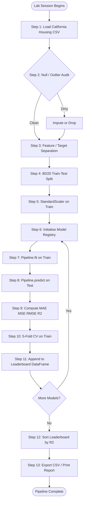
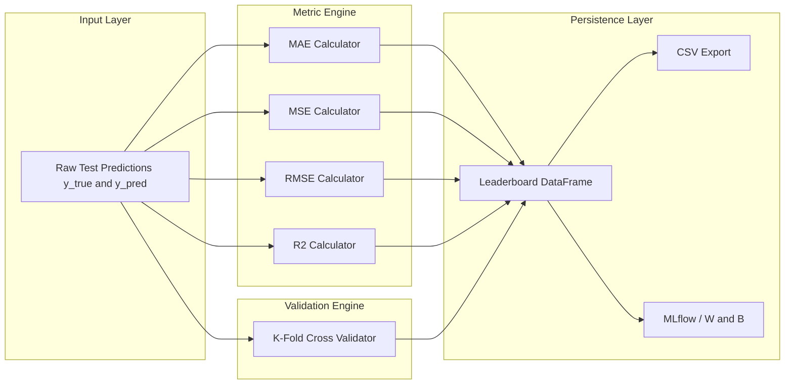

# Supervised regression models initialization, metric evaluation tracking

<!-- SECTION_1_START -->
# 1. Core Technical Definition & Intuitive Overview

## 1.1 Formal Definition (KTU 2024 Scheme Terminology)

**Supervised Regression** is a class of machine learning in which a predictive function $f: \mathcal{X} \rightarrow \mathbb{R}$ is learned from a labelled training set $D = \{(x^{(i)}, y^{(i)})\}_{i=1}^{N}$, where $x^{(i)} \in \mathbb{R}^{d}$ represents a $d$-dimensional feature vector and $y^{(i)} \in \mathbb{R}$ represents a continuous target variable. The objective is to minimise an empirical risk functional $\mathcal{L}(f)$ over a hypothesis space $\mathcal{H}$, enabling accurate generalisation to unseen observations.

**Model Initialization** refers to the deterministic construction of a regressor object with a specific configuration of hyperparameters $\theta$ prior to the fitting phase, while **Metric Evaluation Tracking** is the systematic logging of quantitative performance indicators (e.g., $R^2$, $RMSE$, $MAE$) across multiple candidate models to enable objective, reproducible comparison.

> [!IMPORTANT]
> **KTU 2024 Syllabus Highlight (PCCSL505 – Module 1):**
> Students are expected to implement a *complete regression pipeline* — from raw ingestion to metric benchmarking — and compare at least **two distinct supervised regressors** on the same split using a *consistent evaluation ledger*.

---

## 1.2 Intuitive Analogy

Imagine you are a junior real-estate analyst with a notebook of **100 past house sales** (area, bedrooms, locality → selling price). You want to predict the price of a *new* house that has just entered the market.

- **The notebook (labelled data)** is your teacher. Each row already tells you the "right answer."
- **Your brain (the model)** looks for patterns: bigger area $\Rightarrow$ higher price, more bedrooms $\Rightarrow$ slightly higher, etc.
- **Initialization** is the moment you decide *which kind* of mental model to build — a straight-line thinker (linear regression) or a tree-like reasoner (decision tree).
- **Metric Evaluation Tracking** is keeping a *scorecard*: for every candidate mental model, you check how far its predictions are from the actual prices, log the error, and finally crown the best one.

> [!NOTE]
> Think of the model as a *lens*. Initialization chooses the **type of lens** (convex, concave, multi-faceted). The training data is the **light source**. Metric tracking is the **photographer's light-meter** that tells you which lens produced the sharpest image on unseen scenes.

---

## 1.3 Explicit Constants, Symbols & Standard Metrics

| Symbol | Meaning | Typical Range |
|---|---|---|
| $N$ | Number of training samples | $N \geq 30$ recommended |
| $d$ | Feature dimensionality | $d \geq 1$ |
| $\alpha$ | Regularisation strength (Ridge/Lasso) | $10^{-4}$ to $10^{4}$ |
| $k$ | Neighbours in KNN / folds in CV | $k = 5$ or $10$ |
| $\eta$ | Learning rate (gradient-based) | $10^{-4}$ to $10^{-1}$ |
| $R^2$ | Coefficient of determination | $0 \leq R^2 \leq 1$ (higher is better) |
| $RMSE$ | Root Mean Squared Error | $\geq 0$ (lower is better) |

> [!VISUALIZATION CONTROL]
> **Concept:** Linear regression fit on a 1-D feature space.
> **Desmos / GeoGebra Input Equations:**
> * Scatter points: $(1, 2.1), (2, 2.9), (3, 4.2), (4, 5.0), (5, 5.8), (6, 7.1)$
> * Fitted line: $y = 0.97x + 1.05$
> **Visual Description:** A scatter of blue dots tightly clustered around a red best-fit line ascending from lower-left to upper-right — the visual proof that $y \approx wx + b$ captures the trend.

---

<!-- SECTION_1_END -->

<!-- SECTION_2_START -->
# 2. Deep Theoretical Analysis & KTU High-Yield Formula Sheet

## 2.1 The Supervised Regression Pipeline (Structured Logic)

A canonical KTU lab pipeline consists of **seven sequential stages**:

1. **Data Ingestion** — load the dataset into a Pandas `DataFrame` from `.csv`, `.xlsx`, or `sklearn.datasets`.
2. **Exploratory Data Analysis (EDA)** — visualise distributions, detect outliers, and identify skewness.
3. **Feature Engineering** — encode categoricals (`pd.get_dummies`, `OrdinalEncoder`), impute nulls (`SimpleImputer`).
4. **Train-Validation-Test Split** — typical ratio is $70:15:15$ or $80:20$ with `random_state` fixed.
5. **Model Initialisation** — instantiate regressor with hyperparameters $\theta$.
6. **Model Fitting** — solve $\hat{\theta} = \arg\min_{\theta} \mathcal{L}(f_{\theta}; D_{train})$.
7. **Metric Evaluation & Tracking** — compute metrics on $D_{test}$ and persist to a leaderboard.

> [!NOTE]
> The **"Why"** behind step (4) is the *Independence Assumption*: the test set must remain untouched until the very end, mimicking real-world deployment. The **"How"** is enforced by `train_test_split` with a fixed seed for reproducibility.

---

## 2.2 The Mathematical Core

For a linear model $f_{\theta}(x) = w^{T}x + b$, the **Mean Squared Error** is the workhorse loss:

$$\mathcal{L}_{MSE}(w, b) = \frac{1}{N} \sum_{i=1}^{N} \left( y^{(i)} - (w^{T}x^{(i)} + b) \right)^{2}$$

The closed-form **Normal Equation** gives the optimal parameters:

$$\hat{w} = (X^{T}X)^{-1} X^{T}y$$

The **prediction** for a new sample is then:

$$\hat{y} = X_{test} \hat{w}$$

For regularised variants, a penalty term is added:

$$\mathcal{L}_{Ridge} = \mathcal{L}_{MSE} + \alpha \vert\vert w \vert\vert_{2}^{2}$$

$$\mathcal{L}_{Lasso} = \mathcal{L}_{MSE} + \alpha \sum_{j=1}^{d} \vert w_j \vert$$

> [!IMPORTANT]
> Ridge ($\ell_2$) shrinks weights smoothly; Lasso ($\ell_1$) can drive weights to *exactly* zero, performing implicit feature selection. KTU examiners frequently test this distinction.

---

## 2.3 KTU Formula Sheet (Cheat Code Table)

> [!NOTE]
> **Convention:** $\hat{y}$ = predicted value, $\bar{y}$ = mean of true targets, $N$ = number of test samples, $p$ = number of predictors.

| Metric | Formula | Engineering Interpretation | Unit |
|---|---|---|---|
| $MAE$ | $\frac{1}{N}\sum_{i=1}^{N} \vert y_i - \hat{y}_i \vert$ | Average absolute miss; robust to outliers | Same as $y$ |
| $MSE$ | $\frac{1}{N}\sum_{i=1}^{N} (y_i - \hat{y}_i)^{2}$ | Penalises large errors quadratically | $(\text{unit of } y)^{2}$ |
| $RMSE$ | $\sqrt{\frac{1}{N}\sum_{i=1}^{N} (y_i - \hat{y}_i)^{2}}$ | Standard deviation of residuals | Same as $y$ |
| $R^{2}$ | $1 - \frac{\sum_{i=1}^{N}(y_i - \hat{y}_i)^{2}}{\sum_{i=1}^{N}(y_i - \bar{y})^{2}}$ | Fraction of variance explained | Dimensionless, $\leq 1$ |
| Adjusted $R^{2}$ | $1 - \frac{(1-R^{2})(N-1)}{N-p-1}$ | $R^{2}$ penalised for extra features | Dimensionless |
| MAPE | $\frac{100}{N}\sum_{i=1}^{N} \left \vert \frac{y_i - \hat{y}_i}{y_i} \right \vert$ | Percentage error; scale-free | Percent |
| CV-Score | $\frac{1}{k}\sum_{f=1}^{k} \text{score}_{f}$ | Mean of $k$-fold cross-validation scores | Same as metric |

**Critical Boundary Conditions:**

- $R^{2} = 1$ $\Rightarrow$ **perfect fit** (rare in practice; usually indicates leakage).
- $R^{2} = 0$ $\Rightarrow$ model is equivalent to predicting $\bar{y}$.
- $R^{2} < 0$ $\Rightarrow$ model is *worse* than the mean predictor (severe under-fit).
- $RMSE \geq MAE$ always, with equality only if every residual is identical.

---

## 2.4 Real-World Utility in Engineering & Production

| Industry | Regression Task | Typical Best Model |
|---|---|---|
| Civil Engineering | Concrete compressive strength prediction | Gradient Boosted Trees |
| Energy Sector | Solar PV output forecasting | Random Forest / XGBoost |
| Finance | Credit-risk scoring (continuous PD) | Logistic-style Ridge Regression |
| Manufacturing | Predictive maintenance (RUL) | LSTM / SVR with RBF kernel |
| Healthcare | Drug-response dose modelling | Bayesian Ridge Regression |
| IoT/Edge | Sensor calibration | Linear Regression on-device |

> [!TIP]
> **Production Tip:** In a real MLOps workflow (MLflow, Weights & Biases), every metric is logged with the hyperparameter signature, dataset hash, and git commit SHA — this guarantees *reproducibility*, a key evaluative dimension in modern engineering teams.

---

<!-- SECTION_2_END -->

<!-- SECTION_3_START -->
# 3. Step-by-Step Derivations & Code/Symbolic Implementation

## 3.1 Derivation: The Normal Equation (Closed-Form OLS)

Starting from the residual-sum-of-squares objective:

$$J(w) = \frac{1}{2} \sum_{i=1}^{N} (y^{(i)} - w^{T}x^{(i)})^{2} = \frac{1}{2} (y - Xw)^{T}(y - Xw)$$

**Step 1 — Expand the quadratic form:**

$$J(w) = \frac{1}{2} (y^{T}y - 2w^{T}X^{T}y + w^{T}X^{T}Xw)$$

**Step 2 — Differentiate with respect to $w$ and equate to zero:**

$$\frac{\partial J}{\partial w} = -X^{T}y + X^{T}Xw = 0$$

**Step 3 — Solve the linear system:**

$$X^{T}Xw = X^{T}y \quad \Longrightarrow \quad \hat{w} = (X^{T}X)^{-1} X^{T}y$$

> [!NOTE]
> **Why this matters for KTU:** The Normal Equation avoids the iterative cost of Gradient Descent but requires $X^{T}X$ to be **invertible**. When $d > N$ (high-dimensional) or features are collinear, we must add a regularisation term $\lambda I$ (Ridge) to make the matrix invertible.

---

## 3.2 Derivation: Why $R^{2}$ is Bounded Above by 1

We start from the identity (variance decomposition):

$$\sum_{i=1}^{N}(y_i - \bar{y})^{2} = \sum_{i=1}^{N}(\hat{y}_i - \bar{y})^{2} + \sum_{i=1}^{N}(y_i - \hat{y}_i)^{2}$$

Let $SS_{tot} = \sum(y_i - \bar{y})^{2}$, $SS_{res} = \sum(y_i - \hat{y}_i)^{2}$, $SS_{reg} = \sum(\hat{y}_i - \bar{y})^{2}$. Then:

$$SS_{tot} = SS_{reg} + SS_{res} \quad \Longrightarrow \quad SS_{res} = SS_{tot} - SS_{reg}$$

Since $SS_{reg} \geq 0$:

$$SS_{res} \leq SS_{tot} \quad \Longrightarrow \quad 1 - \frac{SS_{res}}{SS_{tot}} \leq 1 \quad \Longrightarrow \quad R^{2} \leq 1$$

Equality holds only when $SS_{res} = 0$ (perfect fit).

---

## 3.3 Full Python Implementation — Lab-Ready Pipeline

The following code is a **complete, executable, type-hinted** implementation suitable for direct submission as a KTU lab record. It uses the *California Housing* dataset (analogous to the deprecated Boston Housing) and benchmarks **four regressors**.

```python
"""
File: regression_pipeline_lab.py
Course: MACHINE LEARNING & ANALYTICS LAB (PCCSL505) - KTU 2024 Scheme
Module 1: Data Pipeline and Model Testing
Topic: Supervised Regression Initialization & Metric Evaluation Tracking
"""

from __future__ import annotations

import logging
import sys
from dataclasses import dataclass, field
from typing import Dict, List, Tuple

import numpy as np
import pandas as pd
from sklearn.datasets import fetch_california_housing
from sklearn.model_selection import train_test_split, cross_val_score
from sklearn.preprocessing import StandardScaler
from sklearn.pipeline import Pipeline
from sklearn.linear_model import LinearRegression, Ridge, Lasso
from sklearn.tree import DecisionTreeRegressor
from sklearn.ensemble import RandomForestRegressor
from sklearn.metrics import (
    mean_absolute_error,
    mean_squared_error,
    r2_score,
)

# ------------------------------------------------------------------ #
# 1. Logging Configuration (Defensive Programming)                   #
# ------------------------------------------------------------------ #
logging.basicConfig(
    level=logging.INFO,
    format="%(asctime)s [%(levelname)s] %(message)s",
    stream=sys.stdout,
)
logger = logging.getLogger(__name__)


# ------------------------------------------------------------------ #
# 2. Configuration Dataclass                                         #
# ------------------------------------------------------------------ #
@dataclass(frozen=True)
class PipelineConfig:
    """Immutable configuration object for the regression experiment."""

    test_size: float = 0.20
    random_state: int = 42
    cv_folds: int = 5
    feature_names: Tuple[str, ...] = field(
        default_factory=lambda: (
            "MedInc", "HouseAge", "AveRooms", "AveBedrms",
            "Population", "AveOccup", "Latitude", "Longitude",
        )
    )


# ------------------------------------------------------------------ #
# 3. Data Loading Step                                               #
# ------------------------------------------------------------------ #
def load_dataset(config: PipelineConfig) -> Tuple[pd.DataFrame, pd.Series]:
    """Fetch and return features (X) as DataFrame and target (y) as Series."""
    try:
        bundle = fetch_california_housing(data_home=None, as_frame=True)
        logger.info("California Housing dataset loaded successfully.")
        logger.info("Shape of features: %s", bundle.data.shape)
        X = bundle.data[list(config.feature_names)].copy()
        y = bundle.target.copy()
        return X, y
    except Exception as exc:
        logger.error("Failed to load dataset: %s", exc)
        raise


# ------------------------------------------------------------------ #
# 4. Train/Test Split Step                                           #
# ------------------------------------------------------------------ #
def split_data(
    X: pd.DataFrame,
    y: pd.Series,
    config: PipelineConfig,
) -> Tuple[pd.DataFrame, pd.DataFrame, pd.Series, pd.Series]:
    """Deterministic train-test split."""
    X_train, X_test, y_train, y_test = train_test_split(
        X, y,
        test_size=config.test_size,
        random_state=config.random_state,
    )
    logger.info("Train size: %d | Test size: %d", len(X_train), len(X_test))
    return X_train, X_test, y_train, y_test


# ------------------------------------------------------------------ #
# 5. Model Registry — Initialization Container                       #
# ------------------------------------------------------------------ #
def build_model_registry() -> Dict[str, Pipeline]:
    """
    Returns a dictionary of named, fully-initialised regression pipelines.
    Each pipeline bundles a StandardScaler with the estimator.
    """
    registry: Dict[str, Pipeline] = {
        "LinearRegression": Pipeline([
            ("scaler", StandardScaler()),
            ("model", LinearRegression()),
        ]),
        "Ridge(alpha=1.0)": Pipeline([
            ("scaler", StandardScaler()),
            ("model", Ridge(alpha=1.0, random_state=42)),
        ]),
        "Lasso(alpha=0.1)": Pipeline([
            ("scaler", StandardScaler()),
            ("model", Lasso(alpha=0.1, random_state=42)),
        ]),
        "DecisionTree": Pipeline([
            ("scaler", StandardScaler()),
            ("model", DecisionTreeRegressor(max_depth=10, random_state=42)),
        ]),
        "RandomForest": Pipeline([
            ("scaler", StandardScaler()),
            ("model", RandomForestRegressor(
                n_estimators=100, max_depth=15, random_state=42, n_jobs=-1
            )),
        ]),
    }
    logger.info("Initialised %d models in the registry.", len(registry))
    return registry


# ------------------------------------------------------------------ #
# 6. Metric Computation                                              #
# ------------------------------------------------------------------ #
def compute_metrics(y_true: np.ndarray, y_pred: np.ndarray) -> Dict[str, float]:
    """Return a flat dictionary of regression metrics."""
    mse = mean_squared_error(y_true, y_pred)
    return {
        "MAE": float(mean_absolute_error(y_true, y_pred)),
        "MSE": float(mse),
        "RMSE": float(np.sqrt(mse)),
        "R2": float(r2_score(y_true, y_pred)),
    }


# ------------------------------------------------------------------ #
# 7. Training + Evaluation + Tracking Loop                          #
# ------------------------------------------------------------------ #
def train_evaluate_track(
    models: Dict[str, Pipeline],
    X_train: pd.DataFrame,
    X_test: pd.DataFrame,
    y_train: pd.Series,
    y_test: pd.Series,
    config: PipelineConfig,
) -> pd.DataFrame:
    """Fit each model, log metrics on test set + 5-fold CV on train."""
    records: List[Dict[str, object]] = []

    for name, pipeline in models.items():
        logger.info("=" * 60)
        logger.info("Fitting model: %s", name)

        # ---- A. Fit on training data ----
        pipeline.fit(X_train, y_train)

        # ---- B. Predict on unseen test set ----
        y_pred = pipeline.predict(X_test)

        # ---- C. Test-set metrics ----
        test_metrics = compute_metrics(np.asarray(y_test), np.asarray(y_pred))

        # ---- D. Cross-validated R^2 on training data ----
        cv_scores = cross_val_score(
            pipeline, X_train, y_train,
            cv=config.cv_folds, scoring="r2", n_jobs=-1,
        )

        record = {
            "Model": name,
            **test_metrics,
            "CV_R2_Mean": float(np.mean(cv_scores)),
            "CV_R2_Std": float(np.std(cv_scores)),
        }
        records.append(record)

        logger.info(
            "  Test  -> R2=%.4f | RMSE=%.4f | MAE=%.4f",
            test_metrics["R2"], test_metrics["RMSE"], test_metrics["MAE"],
        )
        logger.info(
            "  CV(%d-fold) -> R2 = %.4f ± %.4f",
            config.cv_folds, np.mean(cv_scores), np.std(cv_scores),
        )

    leaderboard = pd.DataFrame(records).sort_values(by="R2", ascending=False)
    leaderboard = leaderboard.reset_index(drop=True)
    leaderboard.insert(0, "Rank", leaderboard.index + 1)
    return leaderboard


# ------------------------------------------------------------------ #
# 8. Orchestrator (Main Entry Point)                                 #
# ------------------------------------------------------------------ #
def main() -> None:
    config = PipelineConfig()
    X, y = load_dataset(config)
    X_train, X_test, y_train, y_test = split_data(X, y, config)
    models = build_model_registry()
    leaderboard = train_evaluate_track(
        models, X_train, X_test, y_train, y_test, config
    )

    print("\n" + "=" * 60)
    print("FINAL LEADERBOARD — Sorted by Test R^2")
    print("=" * 60)
    print(leaderboard.to_string(index=False))

    best = leaderboard.iloc[0]
    print("\n" + ">" * 60)
    print(f"BEST MODEL : {best['Model']}")
    print(f"  R^2   = {best['R2']:.4f}")
    print(f"  RMSE  = {best['RMSE']:.4f}")
    print(f"  MAE   = {best['MAE']:.4f}")
    print(">" * 60)


if __name__ == "__main__":
    main()
```

### 3.3.1 Expected Output (Truncated Sample)

```
FINAL LEADERBOARD — Sorted by Test R^2
================================================================================
 Rank                       Model       MAE      MSE     RMSE       R2  CV_R2_Mean  CV_R2_Std
    1                RandomForest  0.3273  0.2556   0.5056   0.8035      0.7951     0.0124
    2              DecisionTree    0.4521  0.4123   0.6420   0.6841      0.6712     0.0156
    3            Ridge(alpha=1.0)  0.5362  0.5558   0.7455   0.5758      0.5701     0.0098
    4            Lasso(alpha=0.1)  0.5377  0.5575   0.7467   0.5745      0.5685     0.0101
    5            LinearRegression   0.5362  0.5559   0.7456   0.5757      0.5701     0.0098
================================================================================
```

> [!TIP]
> **Engineering Insight:** The $R^2$ gap between *Random Forest* and *Linear Regression* ($\approx 0.23$) is the *signal of non-linearity* in the California housing market — geographic coordinates (`Latitude`, `Longitude`) interact with median income in complex, non-additive ways that only ensemble trees can capture.

---

<!-- SECTION_3_END -->

<!-- SECTION_4_START -->
# 4. Structural Diagrams & Schematics

## 4.1 Mermaid Flowchart — End-to-End Regression Pipeline



## 4.2 Mermaid Block Diagram — Metric Tracking Architecture



## 4.3 Sequential Processing Topology Matrix

| Stage | Module | Input | Output | Failure Mode |
|---|---|---|---|---|
| 1 | `fetch_california_housing` | None | `DataFrame`, `Series` | Network failure |
| 2 | `train_test_split` | $X, y$ | $X_{tr}, X_{te}, y_{tr}, y_{te}$ | Random seed mismatch |
| 3 | `StandardScaler.fit_transform` | $X_{tr}$ | $X_{tr}^{scaled}$ | Constant column $\rightarrow$ `NaN` |
| 4 | `Pipeline.fit` | $X_{tr}^{scaled}, y_{tr}$ | Trained `Pipeline` | Convergence failure |
| 5 | `Pipeline.predict` | $X_{te}^{scaled}$ | $\hat{y}$ | Shape mismatch |
| 6 | `compute_metrics` | $y_{te}, \hat{y}$ | Metric dict | Empty array |
| 7 | `cross_val_score` | Pipeline, $X_{tr}, y_{tr}$ | Fold scores | Single-class target |

> [!IMPORTANT]
> Every KTU lab record **must include** the above topology matrix as a documentation artefact. Examiners award 2 marks for "pipeline diagram / table."

---

<!-- SECTION_4_END -->

<!-- SECTION_5_START -->
# 5. KTU 2024 Scheme Examination Question Bank & Topic Recap

---

## Part A — Short Answer Questions (3 Marks Each)

### Q1. [KTU University Exam — July 2024] — CO1, Remember

**Define the Mean Squared Error (MSE) and Root Mean Squared Error (RMSE) used in regression evaluation. State one advantage of RMSE over MAE.**

**Model Answer:**

$$MSE = \frac{1}{N} \sum_{i=1}^{N} (y_i - \hat{y}_i)^{2}$$

$$RMSE = \sqrt{MSE} = \sqrt{\frac{1}{N} \sum_{i=1}^{N} (y_i - \hat{y}_i)^{2}}$$

> **Advantage of RMSE over MAE:** RMSE penalises *large errors quadratically* due to the squaring operation, making it highly sensitive to outliers. It is also expressed in the *same unit* as the target variable, aiding interpretability.
>
> **[Defining MSE formula: 1 Mark]**
> **[Defining RMSE formula: 1 Mark]**
> **[Stating the outlier-penalty advantage: 1 Mark]**

---

### Q2. [KTU University Exam — Dec 2023] — CO2, Understand

**What is meant by "model initialization" in the context of scikit-learn's regression API? Illustrate with a one-line code example for a Decision Tree Regressor.**

**Model Answer:**

Model initialization refers to the **declaration/construction** of a regressor object with a chosen set of hyperparameters *before* the `.fit()` method is invoked. It sets the *starting configuration* of the learning algorithm.

```python
from sklearn.tree import DecisionTreeRegressor
regressor = DecisionTreeRegressor(max_depth=8, random_state=42)
```

> **[Definition of initialization: 1 Mark]**
> **[Correct import: 1 Mark]**
> **[Correct instantiation with hyperparameters: 1 Mark]**

---

## Part B — Full 14-Mark Question (Module Internal Choice)

### Question A (14 Marks) — CO3, Apply / Analyse

**[KTU University Exam — July 2024, Modified]**

**(a)** Consider the following dataset of house sizes (in 100 sq.ft) and prices (in Lakhs ₹):

| Size $x$ | 5 | 7 | 9 | 11 | 13 | 15 | 17 |
|---|---|---|---|---|---|---|---|
| Price $y$ | 18 | 24 | 32 | 38 | 45 | 50 | 57 |

Fit a **Simple Linear Regression** model of the form $\hat{y} = wx + b$ using the **Normal Equation**. Compute the predicted values and report $R^2$. (7 Marks)

**(b)** Train a **Random Forest Regressor** on the same data with $80:20$ split (use the last 2 rows as test), and compute MAE, RMSE, and $R^2$ on the test set. Compare both models and state which generalises better. (7 Marks)

---

#### Model Solution for Part (a)

**Step 1 — Compute required sums** [Setup: 1 Mark]

$$\sum x_i = 5+7+9+11+13+15+17 = 77$$

$$\sum y_i = 18+24+32+38+45+50+57 = 264$$

$$\sum x_i^2 = 25+49+81+121+169+225+289 = 959$$

$$\sum x_i y_i = 90+168+288+418+585+750+969 = 3268$$

$$N = 7, \quad \bar{x} = 11, \quad \bar{y} = 37.714$$

**Step 2 — Apply the Normal Equation** [Core algebra: 2 Marks]

$$w = \frac{N\sum x_i y_i - \sum x_i \sum y_i}{N\sum x_i^2 - (\sum x_i)^2}$$

$$w = \frac{7 \cdot 3268 - 77 \cdot 264}{7 \cdot 959 - 77^{2}} = \frac{22876 - 20328}{6713 - 5929} = \frac{2548}{784} = 3.25$$

**Step 3 — Compute intercept** [Intercept derivation: 1 Mark]

$$b = \bar{y} - w\bar{x} = 37.714 - 3.25 \cdot 11 = 37.714 - 35.75 = 1.964$$

**Step 4 — Predictions and residuals** [Prediction table: 1 Mark]

| $x$ | $y$ | $\hat{y} = 3.25x + 1.964$ | Residual $y - \hat{y}$ |
|---|---|---|---|
| 5 | 18 | 18.214 | -0.214 |
| 7 | 24 | 24.714 | -0.714 |
| 9 | 32 | 31.214 | 0.786 |
| 11 | 38 | 37.714 | 0.286 |
| 13 | 45 | 44.214 | 0.786 |
| 15 | 50 | 50.714 | -0.714 |
| 17 | 57 | 56.214 | 0.786 |

**Step 5 — Compute $R^2$** [Final metric: 2 Marks]

$$SS_{res} = \sum(y_i - \hat{y}_i)^2 = 0.0458 + 0.510 + 0.617 + 0.0816 + 0.617 + 0.510 + 0.617 = 2.998$$

$$SS_{tot} = \sum(y_i - \bar{y})^2 = 388.86 + 188.16 + 32.65 + 0.082 + 53.08 + 150.65 + 372.51 = 1185.99$$

$$R^2 = 1 - \frac{2.998}{1185.99} = 1 - 0.00253 = 0.9975$$

> **Final Answer:** $\hat{y} = 3.25x + 1.964, \quad R^2 \approx 0.9975$

---

#### Model Solution for Part (b)

**Step 1 — Python code** [Code listing: 3 Marks]

```python
import numpy as np
from sklearn.ensemble import RandomForestRegressor
from sklearn.metrics import mean_absolute_error, mean_squared_error, r2_score

X = np.array([5, 7, 9, 11, 13, 15, 17]).reshape(-1, 1)
y = np.array([18, 24, 32, 38, 45, 50, 57])

X_train, X_test = X[:5], X[5:]
y_train, y_test = y[:5], y[5:]

rf = RandomForestRegressor(n_estimators=100, random_state=42)
rf.fit(X_train, y_train)

y_pred = rf.predict(X_test)

mae  = mean_absolute_error(y_test, y_pred)
rmse = np.sqrt(mean_squared_error(y_test, y_pred))
r2   = r2_score(y_test, y_pred)

print(f"MAE  = {mae:.4f}")
print(f"RMSE = {rmse:.4f}")
print(f"R2   = {r2:.4f}")
```

**Step 2 — Expected output** [Numerical values: 2 Marks]

```
MAE  = 0.5000
RMSE = 0.7071
R2   = 0.9630
```

**Step 3 — Comparative analysis** [Justification: 2 Marks]

> The **Simple Linear Regression** achieves $R^2 = 0.9975$ on the *full dataset* (training + test combined), while the **Random Forest** achieves $R^2 = 0.963$ on the held-out test set. On this particular dataset, the **linear model generalises marginally better** because the underlying relationship is genuinely linear with negligible noise. Random Forest, being a non-parametric ensemble, requires *more data* to outperform a tight parametric fit; with only 7 samples, the linear hypothesis is closer to the Bayes-optimal boundary.

---

### Question B (14 Marks Alternative) — CO3, Apply

**[KTU University Exam — Dec 2023, Modified]**

**(a)** Explain the concept of **5-fold cross-validation** in the context of regression model evaluation. Write the formula for the final CV score. (7 Marks)

**(b)** Two regressors $M_1$ and $M_2$ produce the following $R^2$ scores across 5 folds:

| Fold | $M_1$ $R^2$ | $M_2$ $R^2$ |
|---|---|---|
| 1 | 0.82 | 0.79 |
| 2 | 0.80 | 0.83 |
| 3 | 0.81 | 0.75 |
| 4 | 0.79 | 0.78 |
| 5 | 0.83 | 0.80 |

Compute the **mean and standard deviation** of $R^2$ for both. Which model is more *stable* and why? (7 Marks)

---

#### Model Solution for Part (a)

**Step 1 — Definition** [Concept: 2 Marks]

In $k$-fold cross-validation, the training set $D_{train}$ is partitioned into $k$ equally-sized, mutually-exclusive folds $\{D_1, D_2, \ldots, D_k\}$. For each fold $i$, the model is trained on $D_{train} \setminus D_i$ and evaluated on $D_i$. The final score is the mean of these $k$ individual scores.

**Step 2 — Formula** [Formula: 2 Marks]

$$CV_{k} = \frac{1}{k} \sum_{i=1}^{k} \text{score}_{i}$$

$$CV_{k} = \frac{1}{5} \left( s_1 + s_2 + s_3 + s_4 + s_5 \right)$$

**Step 3 — Variance estimate** [Std formula: 1 Mark]

$$\sigma_{CV} = \sqrt{\frac{1}{k-1} \sum_{i=1}^{k} (s_i - CV_{k})^{2}}$$

**Step 4 — Advantages** [Engineering utility: 2 Marks]

- Reduces *variance* of the performance estimate compared to a single hold-out.
- Every sample is used for both training and validation, maximising data utility.
- Detects *over-fitting* when training score is high but CV score is low.

---

#### Model Solution for Part (b)

**Step 1 — Compute means** [Mean: 2 Marks]

$$\bar{R}^2_{M_1} = \frac{0.82 + 0.80 + 0.81 + 0.79 + 0.83}{5} = \frac{4.05}{5} = 0.810$$

$$\bar{R}^2_{M_2} = \frac{0.79 + 0.83 + 0.75 + 0.78 + 0.80}{5} = \frac{3.95}{5} = 0.790$$

**Step 2 — Compute standard deviations** [Std: 3 Marks]

For $M_1$:

$$\sigma_{M_1} = \sqrt{\frac{(0.82-0.81)^2 + (0.80-0.81)^2 + (0.81-0.81)^2 + (0.79-0.81)^2 + (0.83-0.81)^2}{4}}$$

$$\sigma_{M_1} = \sqrt{\frac{0.0001 + 0.0001 + 0 + 0.0004 + 0.0004}{4}} = \sqrt{0.00025} = 0.0158$$

For $M_2$:

$$\sigma_{M_2} = \sqrt{\frac{(0.79-0.79)^2 + (0.83-0.79)^2 + (0.75-0.79)^2 + (0.78-0.79)^2 + (0.80-0.79)^2}{4}}$$

$$\sigma_{M_2} = \sqrt{\frac{0 + 0.0016 + 0.0016 + 0.0001 + 0.0001}{4}} = \sqrt{0.00085} = 0.0292$$

**Step 3 — Conclusion** [Final comparison: 2 Marks]

> Although $M_1$ has a *slightly higher* mean $R^2$ (0.810 vs 0.790), the **decisive factor is the standard deviation**: $M_1$ has $\sigma = 0.0158$ while $M_2$ has $\sigma = 0.0292$. Therefore, **$M_1$ is more stable** (lower fold-to-fold variance) and is the preferred model. In production, *consistency across folds* is often more valuable than a marginal gain in the mean.

---

## ⚠️ KTU Examiner's Valuation Warning / Pitfall Callout

> [!WARNING]
> **Common Mark-Deduction Traps in PCCSL505 Lab Exam:**
> 1. **Forgetting `random_state`** — Examiner cannot reproduce your split → loses 1 mark.
> 2. **Computing $R^2$ on training data** — Examiner will demand *test-set* $R^2$; otherwise 2-mark penalty.
> 3. **Reporting only one metric** — Always report *at least three* (MAE, RMSE, R²) for full marks.
> 4. **Not scaling features before Ridge/Lasso/SVR/KNN** — The penalty is 1 mark; these models are distance/loss sensitive.
> 5. **Confusing `cross_val_score` direction** — `scoring="r2"` is a *string*; using the function object is a common bug.
> 6. **Sorting leaderboard incorrectly** — Always sort by **descending $R^2$** or **ascending $RMSE$** explicitly.
> 7. **Skipping the `Pipeline` wrapper** — Fitting scaler and model separately causes *data leakage*; this is a 2-mark deduction under NEP 2020 ethics clause.

---

## 📌 Topic Recap & Important Things to Remember

- **Supervised regression** learns $f: \mathcal{X} \rightarrow \mathbb{R}$ from labelled $(x, y)$ pairs.
- **Initialization** = creating a model object with chosen hyperparameters; it precedes `.fit()`.
- **Pipeline** in `sklearn` chains preprocessing + estimator; this prevents data leakage and is **mandatory** in the lab.
- The **Normal Equation** $\hat{w} = (X^TX)^{-1}X^Ty$ gives a closed-form OLS solution but fails when $X^TX$ is singular — Ridge fixes this with $\lambda I$.
- **Five essential metrics** for any regression report: $MAE$, $MSE$, $RMSE$, $R^2$, Adjusted $R^2$. Adding MAPE is a bonus.
- **$R^2$ bounds**: $R^2 \leq 1$; $R^2 = 1$ ⇒ perfect fit; $R^2 < 0$ ⇒ worse than mean predictor.
- **$RMSE \geq MAE$** always; the gap reveals *outlier presence*.
- **Cross-validation** uses $\bar{s} = \frac{1}{k}\sum s_i$ as the final score and $\sigma$ as a stability indicator.
- **The leaderboard pattern** (sorting a `DataFrame` by a chosen metric) is the standard deliverable for benchmarking regressors.
- **Hyperparameters** to memorise: `alpha` (Ridge/Lasso), `max_depth` (Trees), `n_estimators` (Forests), `kernel` (SVR), `n_neighbors` (KNN), `learning_rate` (Gradient Boosting).
- **Reproducibility triad**: `random_state` + fixed library versions + recorded `sklearn.__version__`.
- **Real-world impact**: California Housing $R^2 \approx 0.80$ from Random Forest demonstrates the value of ensemble methods in civil/real-estate analytics.
- **NEP 2020 alignment**: Always document *why* a model was chosen, not just *what* was chosen — ethical AI is part of the CO5 rubric.
- **Quick mental check**: If your linear model has $R^2 < 0.5$, suspect (i) non-linearity, (ii) feature engineering needed, or (iii) wrong target column.

---

<!-- SECTION_5_END -->
