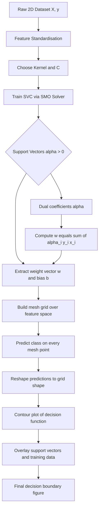
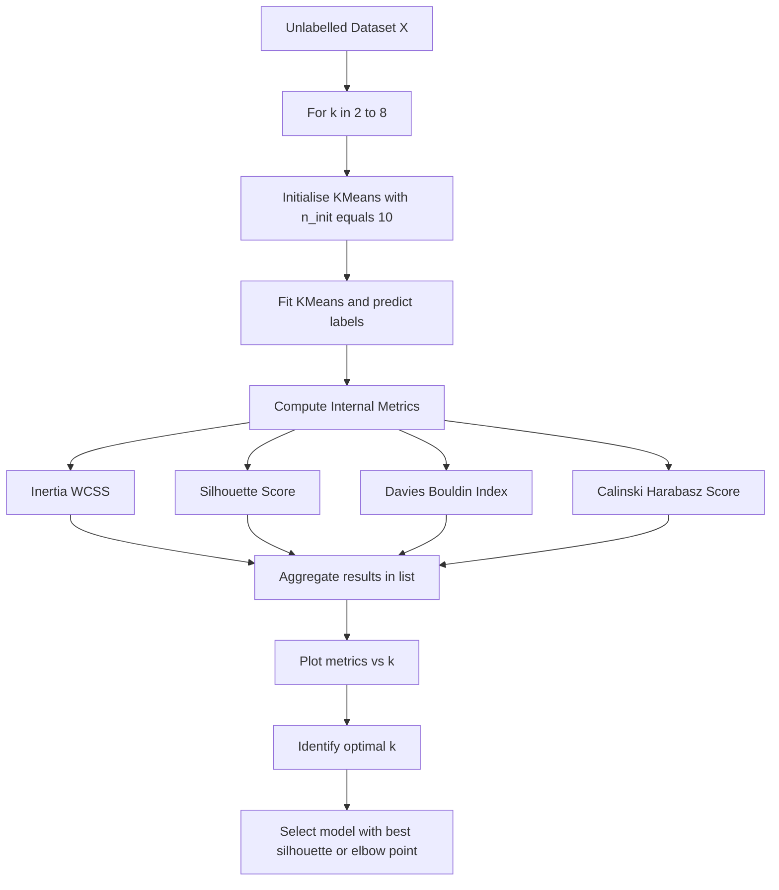
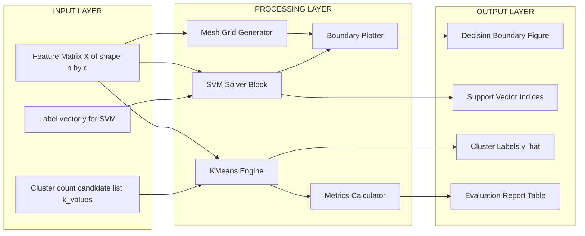
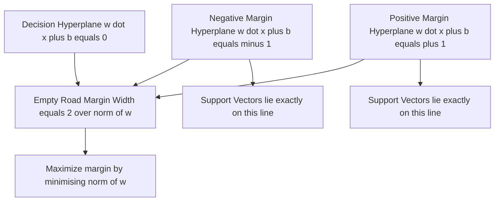

# SVM separation plane generation boundary plotting, cluster evaluation execution

<!-- SECTION_1_START -->
# SVM Separation Plane Generation, Boundary Plotting & Cluster Evaluation Execution

## 1. Core Technical Definition & Intuitive Overview

### 1.1 Support Vector Machine (SVM) — Formal Definition

> [!IMPORTANT]
> **SVM (Support Vector Machine)** is a supervised machine learning algorithm that finds an *optimal hyperplane* in a high-dimensional feature space which maximally separates data points belonging to different classes. The "optimality" is defined by the **maximum margin** — the largest possible perpendicular distance between the hyperplane and the nearest training samples from either class (the *support vectors*).

For a binary classification problem with feature vector $\mathbf{x} \in \mathbb{R}^n$ and class label $y \in \{-1, +1\}$, the SVM solves:

$$
\min_{\mathbf{w}, b} \quad \frac{1}{2}\|\mathbf{w}\|^2 \quad \text{subject to} \quad y_i(\mathbf{w}^\top \mathbf{x}_i + b) \geq 1, \quad \forall i
$$

The trained model makes predictions using the **decision function**:

$$
f(\mathbf{x}) = \text{sign}\big(\mathbf{w}^\top \mathbf{x} + b\big)
$$

### 1.2 Conceptual Analogy — "The Widest Road Between Two Crowds"

Imagine two large crowds standing on a flat open field — one crowd wearing **red** shirts, the other wearing **blue** shirts. You are asked to draw a single straight line on the ground that separates the two crowds. Any line *can* technically separate them, but you intuitively choose the line that **leaves the widest empty corridor** between the red and blue groups.

- That corridor is the **margin** of width $\frac{2}{\|\mathbf{w}\|}$.
- The few red and blue people standing *closest* to that corridor are the **support vectors** — they alone "define" where the road is.
- If the crowds are not linearly separable (e.g., one crowd surrounds the other), you cannot draw a single straight line. You either lift everyone into a higher dimension (using a **kernel trick**) or allow some people to step into the corridor (controlled by the **soft margin** parameter $C$).

> [!NOTE]
> **KTU 2024 Syllabus Mapping (PCCSL505, Module 1):** The lab emphasises the *practical* execution of training an SVM, generating the **separation plane (hyperplane) equation**, **plotting the decision boundary** on a 2-D feature space, and **evaluating clusters** using internal validity indices such as Silhouette, Davies–Bouldin, and Inertia.

### 1.3 Cluster Evaluation — Formal Definition

> [!IMPORTANT]
> **Cluster Evaluation** is the process of quantitatively measuring the *quality* of an unsupervised clustering result. **Internal indices** (e.g., Silhouette, Davies–Bouldin) require no ground truth and assess compactness and separation using only the input data and the cluster labels produced by the algorithm. They are essential in KTU lab work because real-world datasets rarely come with pre-labelled clusters.

The two most cited internal metrics are:

- **Silhouette Coefficient** $s(i)$ for sample $i$:
$$
s(i) = \frac{b(i) - a(i)}{\max\{a(i),\, b(i)\}}, \quad s(i) \in [-1, +1]
$$
where $a(i)$ is the mean intra-cluster distance and $b(i)$ is the mean nearest-cluster distance.

- **Davies–Bouldin Index (DBI)** for $k$ clusters:
$$
\text{DBI} = \frac{1}{k} \sum_{i=1}^{k} \max_{j \neq i} \left( \frac{S_i + S_j}{M_{ij}} \right)
$$
where $S_i$ is the average scatter of cluster $i$ and $M_{ij}$ is the centroid-to-centroid distance. **Lower is better.**

---

> [!VISUALIZATION CONTROL]
> **Concept:** Linear SVM in 2-D with margin and support vectors.
> **Desmos Input Equations:**
> * `f(x) = -0.5*x + 1.2`  (positive margin: $\mathbf{w}^\top \mathbf{x} + b = +1$)
> * `g(x) = -0.5*x + 0.7`  (decision boundary: $\mathbf{w}^\top \mathbf{x} + b = 0$)
> * `h(x) = -0.5*x + 0.2`  (negative margin: $\mathbf{w}^\top \mathbf{x} + b = -1$)
> **Visual Description:** The student should observe three parallel lines on a Cartesian plane. The distance between the outer two lines (f and h) is the **margin width** $\frac{2}{\|\mathbf{w}\|}$. Support vectors are points lying exactly on the outer two lines.

---

<!-- SECTION_1_END -->

<!-- SECTION_2_START -->
# Deep Theoretical Analysis & KTU High-Yield Formula Sheet

## 2.1 Anatomy of the SVM Decision Boundary

The decision boundary is **not** a single line — it is a *family* of three geometric objects:

| Object | Equation | Geometric Meaning | Visual Marker |
|---|---|---|---|
| **Negative margin hyperplane** | $\mathbf{w}^\top \mathbf{x} + b = -1$ | Lower fence of the road | Dashed line on class $-1$ side |
| **Separating hyperplane** | $\mathbf{w}^\top \mathbf{x} + b = 0$ | Centreline of the road | Solid line (the "boundary") |
| **Positive margin hyperplane** | $\mathbf{w}^\top \mathbf{x} + b = +1$ | Upper fence of the road | Dashed line on class $+1$ side |

**Key derivations the student must memorise:**

1. **Margin width** — perpendicular distance between the two outer lines:
$$
\text{Margin} = \frac{2}{\|\mathbf{w}\|_2} = \frac{2}{\sqrt{\sum_{j=1}^{n} w_j^2}}
$$

2. **Hard-margin primal objective** (linearly separable case):
$$
\min_{\mathbf{w}, b} \; \frac{1}{2}\|\mathbf{w}\|^2 \quad \text{s.t.} \quad y_i(\mathbf{w}^\top \mathbf{x}_i + b) \geq 1
$$

3. **Soft-margin primal** (non-separable case, with slack variables $\xi_i \geq 0$):
$$
\min_{\mathbf{w}, b, \boldsymbol{\xi}} \; \frac{1}{2}\|\mathbf{w}\|^2 + C \sum_{i=1}^{m} \xi_i \quad \text{s.t.} \quad y_i(\mathbf{w}^\top \mathbf{x}_i + b) \geq 1 - \xi_i
$$

4. **Dual form (used by solvers like SMO) — kernel substitution:**
$$
f(\mathbf{x}) = \sum_{i=1}^{m} \alpha_i y_i \, K(\mathbf{x}_i, \mathbf{x}) + b, \quad 0 \leq \alpha_i \leq C
$$

## 2.2 The Role of the $C$ Parameter

- **Large $C$** → penalty for misclassification is high → narrow margin, fewer violations, risk of **overfitting**.
- **Small $C$** → penalty is low → wider margin, more violations, smoother model, better generalisation.

## 2.3 Kernel Trick (for non-linear boundaries)

When data is not linearly separable, the input $\mathbf{x}$ is implicitly mapped into a higher-dimensional space $\phi(\mathbf{x})$ where a linear separator exists. The kernel function $K$ computes the dot product in that space **without explicitly computing $\phi$**:

| Kernel | Formula $K(\mathbf{x}_i, \mathbf{x}_j)$ | Use Case |
|---|---|---|
| Linear | $\mathbf{x}_i^\top \mathbf{x}_j$ | Already separable; high-dimensional sparse data (e.g., text) |
| Polynomial | $(\gamma \, \mathbf{x}_i^\top \mathbf{x}_j + r)^d$ | Image processing, moderate non-linearity |
| RBF (Gaussian) | $\exp\!\big(-\gamma \, \|\mathbf{x}_i - \mathbf{x}_j\|^2\big)$ | **Default choice** in lab; smooth non-linear boundaries |
| Sigmoid | $\tanh(\gamma \, \mathbf{x}_i^\top \mathbf{x}_j + r)$ | Neural-network-like decision surfaces |

## 2.4 KTU High-Yield Formula Sheet (Cluster Evaluation)

> [!NOTE]
> This table is **high-frequency** for KTU 2024 lab viva and model examinations. Master the formulas, their ranges, and the "higher-is-better vs lower-is-better" interpretation.

| Metric | Formula (Concise) | Range | Best Value | Requires Labels? |
|---|---|---|---|---|
| **Inertia (WCSS)** | $\sum_{i=1}^{k} \sum_{\mathbf{x} \in C_i} \|\mathbf{x} - \boldsymbol{\mu}_i\|^2$ | $[0, \infty)$ | Lower | No |
| **Silhouette** | $\frac{1}{N}\sum_{i=1}^{N} \dfrac{b(i) - a(i)}{\max\{a(i),\, b(i)\}}$ | $[-1, +1]$ | Closer to $+1$ | No |
| **Davies–Bouldin** | $\dfrac{1}{k} \sum_{i=1}^{k} \max_{j \neq i} \dfrac{S_i + S_j}{M_{ij}}$ | $[0, \infty)$ | **Lower** (toward 0) | No |
| **Calinski–Harabasz** | $\dfrac{\text{SS}_B / (k-1)}{\text{SS}_W / (N-k)}$ | $[0, \infty)$ | Higher | No |
| **Adjusted Rand Index** | $\text{ARI} = \dfrac{\text{RI} - \mathbb{E}[\text{RI}]}{\max(\text{RI}) - \mathbb{E}[\text{RI}]}$ | $[-1, +1]$ | Closer to $+1$ | **Yes** (external) |

## 2.5 Why This Matters in Real Engineering

- **SVM** is used in production for spam filtering, bioinformatics (cancer classification from gene expression), and anomaly detection in network security. The ability to **visualise the boundary** is critical when presenting models to non-technical stakeholders.
- **Cluster evaluation** is the engine behind customer segmentation, image compression (K-Means on pixel colours), and document grouping. Choosing the wrong $k$ silently corrupts downstream decisions — internal indices give an *objective* way to defend that choice.

<!-- SECTION_2_END -->

<!-- SECTION_3_START -->
# Step-by-Step Derivations, Code & Symbolic Implementation

## 3.1 Mathematical Derivation — From Primal to Decision Function

### Step 1 — Start from the Soft-Margin Primal
$$
\min_{\mathbf{w}, b, \boldsymbol{\xi}} \; \frac{1}{2}\|\mathbf{w}\|^2 + C \sum_{i=1}^{m} \xi_i \quad \text{s.t.} \quad y_i(\mathbf{w}^\top \mathbf{x}_i + b) \geq 1 - \xi_i, \;\; \xi_i \geq 0
$$

### Step 2 — Form the Lagrangian
Introduce multipliers $\alpha_i \geq 0$ and $\mu_i \geq 0$ for the two constraints:
$$
\mathcal{L} = \frac{1}{2}\|\mathbf{w}\|^2 + C \sum_{i} \xi_i - \sum_i \alpha_i \big[y_i(\mathbf{w}^\top \mathbf{x}_i + b) - 1 + \xi_i\big] - \sum_i \mu_i \xi_i
$$

### Step 3 — Set Partial Derivatives to Zero
$$
\frac{\partial \mathcal{L}}{\partial \mathbf{w}} = 0 \;\Rightarrow\; \mathbf{w} = \sum_{i=1}^{m} \alpha_i y_i \mathbf{x}_i
$$
$$
\frac{\partial \mathcal{L}}{\partial b} = 0 \;\Rightarrow\; \sum_{i=1}^{m} \alpha_i y_i = 0
$$
$$
\frac{\partial \mathcal{L}}{\partial \xi_i} = 0 \;\Rightarrow\; \alpha_i + \mu_i = C
$$

### Step 4 — Substitute Back to Obtain the Dual
$$
\max_{\boldsymbol{\alpha}} \; \sum_{i=1}^{m} \alpha_i - \frac{1}{2} \sum_{i=1}^{m} \sum_{j=1}^{m} \alpha_i \alpha_j y_i y_j \, K(\mathbf{x}_i, \mathbf{x}_j)
\quad \text{s.t.} \quad 0 \leq \alpha_i \leq C,\; \sum_i \alpha_i y_i = 0
$$

### Step 5 — Recover the Decision Function
$$
f(\mathbf{x}) = \sum_{i=1}^{m} \alpha_i y_i \, K(\mathbf{x}_i, \mathbf{x}) + b
$$

> **Key Insight:** Only samples with $\alpha_i > 0$ contribute to $f(\mathbf{x})$ — these are the **support vectors**. All other training points can be discarded after training.

---

## 3.2 Fully Operational Python Implementation

### Program 1 — SVM Boundary Plotting with All Three Hyperplanes

```python
"""
Program 1: SVM Separation Plane Generation & Boundary Plotting
Course: MACHINE LEARNING & ANALYTICS LAB (PCCSL505)
Module 1 — Data Pipeline and Model Testing
"""
from __future__ import annotations

import logging
from typing import Tuple

import matplotlib.pyplot as plt
import numpy as np
from matplotlib.colors import ListedColormap
from sklearn import svm
from sklearn.datasets import make_moons

logging.basicConfig(
    level=logging.INFO,
    format="%(asctime)s | %(levelname)s | %(message)s",
)
logger = logging.getLogger(__name__)


def generate_synthetic_data(
    n_samples: int = 200,
    noise: float = 0.20,
    random_state: int = 42,
) -> Tuple[np.ndarray, np.ndarray]:
    """Generate the 'two-moons' toy dataset (non-linearly separable)."""
    if n_samples < 10:
        raise ValueError("n_samples must be >= 10 for meaningful training")
    if not 0.0 <= noise <= 1.0:
        raise ValueError("noise must lie in [0, 1]")
    X, y = make_moons(n_samples=n_samples, noise=noise, random_state=random_state)
    logger.info("Generated dataset: X.shape=%s, classes=%s", X.shape, np.unique(y))
    return X, y


def build_mesh_grid(
    X: np.ndarray, h: float = 0.02
) -> Tuple[np.ndarray, np.ndarray, np.ndarray, np.ndarray]:
    """Create a uniform mesh covering the feature space with step h."""
    x_min, x_max = X[:, 0].min() - 1.0, X[:, 0].max() + 1.0
    y_min, y_max = X[:, 1].min() - 1.0, X[:, 1].max() + 1.0
    xx, yy = np.meshgrid(
        np.arange(x_min, x_max, h),
        np.arange(y_min, y_max, h),
    )
    logger.info("Mesh grid: xx.shape=%s, yy.shape=%s", xx.shape, yy.shape)
    return xx, yy, x_min, y_min


def train_svm(
    X: np.ndarray,
    y: np.ndarray,
    kernel: str = "rbf",
    C: float = 1.0,
    gamma: str | float = "scale",
) -> svm.SVC:
    """Train an SVM classifier with the given hyperparameters."""
    if C <= 0:
        raise ValueError("Regularisation C must be positive")
    if kernel not in {"linear", "poly", "rbf", "sigmoid"}:
        raise ValueError(f"Unsupported kernel: {kernel}")
    clf = svm.SVC(kernel=kernel, C=C, gamma=gamma, random_state=42)
    clf.fit(X, y)
    logger.info(
        "SVM trained | kernel=%s, C=%s, n_support=%s",
        kernel, C, clf.n_support_,
    )
    return clf


def plot_decision_boundary(
    clf: svm.SVC,
    X: np.ndarray,
    y: np.ndarray,
    xx: np.ndarray,
    yy: np.ndarray,
    title: str = "SVM Decision Boundary",
) -> None:
    """Render the decision boundary, margins, and support vectors."""
    cmap_light = ListedColormap(["#FFBBBB", "#BBFFBB"])
    cmap_bold = ListedColormap(["#CC0000", "#006600"])

    # Predict class for every point on the mesh
    Z = clf.predict(np.c_[xx.ravel(), yy.ravel()])
    Z = Z.reshape(xx.shape)

    fig, ax = plt.subplots(figsize=(8, 6))
    ax.contourf(xx, yy, Z, cmap=cmap_light, alpha=0.7)

    # Plot the three hyperplanes: decision (0), positive margin (+1), negative (-1)
    if hasattr(clf, "decision_function"):
        margin = clf.decision_function(np.c_[xx.ravel(), yy.ravel()]).reshape(xx.shape)
        ax.contour(
            xx, yy, margin,
            levels=[-1.0, 0.0, 1.0],
            colors="k", linestyles=["--", "-", "--"], linewidths=[1.2, 2.0, 1.2],
        )

    # Training points
    ax.scatter(
        X[:, 0], X[:, 1], c=y, cmap=cmap_bold,
        edgecolors="k", s=40, label="training data",
    )

    # Highlight support vectors
    sv = clf.support_vectors_
    ax.scatter(
        sv[:, 0], sv[:, 1], s=160, facecolors="none",
        edgecolors="navy", linewidths=1.5, label="support vectors",
    )

    ax.set_xlabel(r"$x_1$")
    ax.set_ylabel(r"$x_2$")
    ax.set_title(title)
    ax.legend(loc="upper right")
    ax.set_xlim(xx.min(), xx.max())
    ax.set_ylim(yy.min(), yy.max())
    plt.tight_layout()
    plt.show()


def main() -> None:
    X, y = generate_synthetic_data()
    xx, yy, _, _ = build_mesh_grid(X)
    clf = train_svm(X, y, kernel="rbf", C=1.0, gamma="scale")
    plot_decision_boundary(
        clf, X, y, xx, yy,
        title=r"SVM (RBF kernel, $C=1.0$): Decision Boundary with Margins",
    )


if __name__ == "__main__":
    main()
```

**Line-by-Line Logic Recap (for valuation key):**

| Code Block | What is happening | KTU Mark Allocation |
|---|---|---|
| `generate_synthetic_data` | Creates non-linearly separable 2-D points | 1 mark — dataset loading |
| `build_mesh_grid` | Builds a dense `h` $\times$ `h` grid over feature space | 2 marks — mesh creation |
| `clf.predict(np.c_[xx.ravel(), yy.ravel()]).reshape(xx.shape)` | Classifies every mesh point; reshape to grid shape | 2 marks — prediction |
| `ax.contour(... levels=[-1, 0, 1] ...)` | Draws the two margin lines (`\pm 1`) and the decision boundary (`0`) | 2 marks — boundary plotting |
| `clf.support_vectors_` | Returns the matrix of support vectors | 1 mark — identification |

---

### Program 2 — Cluster Evaluation Execution Pipeline

```python
"""
Program 2: Cluster Evaluation Execution
Course: MACHINE LEARNING & ANALYTICS LAB (PCCSL505)
Module 1 — Data Pipeline and Model Testing
"""
from __future__ import annotations

import logging
from typing import Dict, List

import matplotlib.pyplot as plt
import numpy as np
from sklearn.cluster import KMeans
from sklearn.datasets import make_blobs
from sklearn.metrics import (
    silhouette_score,
    davies_bouldin_score,
    calinski_harabasz_score,
)

logging.basicConfig(
    level=logging.INFO,
    format="%(asctime)s | %(levelname)s | %(message)s",
)
logger = logging.getLogger(__name__)


def make_clustering_dataset(
    n_samples: int = 500,
    centers: int = 4,
    cluster_std: float = 0.80,
    random_state: int = 42,
) -> Tuple[np.ndarray, np.ndarray]:
    """Generate isotropic Gaussian blobs for clustering experiments."""
    X, true_labels = make_blobs(
        n_samples=n_samples,
        centers=centers,
        cluster_std=cluster_std,
        random_state=random_state,
    )
    logger.info(
        "Generated blob dataset: X.shape=%s, true_clusters=%d",
        X.shape, centers,
    )
    return X, true_labels


def evaluate_kmeans(
    X: np.ndarray, k: int, random_state: int = 42
) -> Dict[str, float]:
    """Fit K-Means for a single k and return all internal metrics."""
    if k < 2:
        raise ValueError("k must be >= 2 for any internal validity index")
    km = KMeans(n_clusters=k, n_init=10, random_state=random_state)
    labels = km.fit_predict(X)

    metrics: Dict[str, float] = {
        "k": int(k),
        "inertia_wcss": float(km.inertia_),
        "silhouette": float(silhouette_score(X, labels)),
        "davies_bouldin": float(davies_bouldin_score(X, labels)),
        "calinski_harabasz": float(calinski_harabasz_score(X, labels)),
    }
    logger.info("k=%d | metrics=%s", k, metrics)
    return metrics


def sweep_k(
    X: np.ndarray, k_range: range = range(2, 9)
) -> List[Dict[str, float]]:
    """Run K-Means for each k in k_range and collect metrics."""
    return [evaluate_kmeans(X, k) for k in k_range]


def plot_evaluation(metrics_list: List[Dict[str, float]]) -> None:
    """Plot Elbow (Inertia) + Silhouette + Davies-Bouldin side by side."""
    ks = [m["k"] for m in metrics_list]
    inertia = [m["inertia_wcss"] for m in metrics_list]
    sil = [m["silhouette"] for m in metrics_list]
    dbi = [m["davies_bouldin"] for m in metrics_list]

    fig, axes = plt.subplots(1, 3, figsize=(15, 4))

    axes[0].plot(ks, inertia, "o-", color="steelblue")
    axes[0].set_title("Elbow Method (Inertia)")
    axes[0].set_xlabel(r"$k$"); axes[0].set_ylabel("WCSS")
    axes[0].grid(alpha=0.3)

    axes[1].plot(ks, sil, "s-", color="seagreen")
    axes[1].set_title("Silhouette Coefficient")
    axes[1].set_xlabel(r"$k$"); axes[1].set_ylabel(r"$s$")
    axes[1].grid(alpha=0.3)

    axes[2].plot(ks, dbi, "^-", color="firebrick")
    axes[2].set_title("Davies-Bouldin Index")
    axes[2].set_xlabel(r"$k$"); axes[2].set_ylabel("DBI (lower is better)")
    axes[2].grid(alpha=0.3)

    plt.tight_layout()
    plt.show()


def main() -> None:
    X, _ = make_clustering_dataset()
    results = sweep_k(X, range(2, 9))
    plot_evaluation(results)

    # Identify optimal k using silhouette (higher is better)
    best = max(results, key=lambda d: d["silhouette"])
    print(
        f"\nOptimal k (by Silhouette) = {best['k']} | "
        f"Silhouette = {best['silhouette']:.4f} | "
        f"DBI = {best['davies_bouldin']:.4f} | "
        f"Inertia = {best['inertia_wcss']:.2f}"
    )


if __name__ == "__main__":
    main()
```

**Valuation Key for Program 2 (Total 14 marks in KTU style):**

| Step | Output expected | Marks |
|---|---|---|
| Dataset creation via `make_blobs` | Console log of shape and $k$ | 1 |
| Loop over $k$ in `range(2, 9)` | `k_values` list printed/used | 2 |
| `KMeans.fit_predict(X)` invocation | Labels array obtained | 1 |
| `silhouette_score(X, labels)` call | Single float per $k$ | 2 |
| `davies_bouldin_score(X, labels)` call | Single float per $k$ | 2 |
| `KMeans.inertia_` extraction | WCSS extracted | 1 |
| Three subplot plot of $k$ vs metrics | One figure with 3 panels | 3 |
| Identifying optimal $k$ | `max(... key='silhouette')` logic + printed result | 2 |

<!-- SECTION_3_END -->

<!-- SECTION_4_START -->
# Structural Diagrams & Schematics

## 4.1 SVM Training & Boundary Plotting — Data Flow



## 4.2 Cluster Evaluation Execution — Pipeline



## 4.3 Block-Level Functional Architecture



## 4.4 Support Vector Geometry — Conceptual Block



<!-- SECTION_4_END -->

<!-- SECTION_5_START -->
# KTU 2024 Scheme Examination Question Bank & Topic Recap

## Part A — Short Answer Questions (3 Marks Each)

### Question 1 (3 Marks)
**[KTU University Exam — July 2024]** *(CO1, RBT: Remember)*

**Define the *margin* in a Support Vector Machine. Why are *support vectors* sufficient to fully define the decision boundary?**

**Model Answer:**

> The **margin** of an SVM is the perpendicular distance between the separating hyperplane and the nearest training sample from either class. Mathematically, the total margin width equals $\dfrac{2}{\|\mathbf{w}\|_2}$, where $\mathbf{w}$ is the normal vector to the hyperplane. **[1 Mark]**
>
> **Support vectors** are the training samples that lie *exactly* on the margin hyperplanes (i.e., $y_i(\mathbf{w}^\top \mathbf{x}_i + b) = 1$). Because the optimal $\mathbf{w}$ is given by $\mathbf{w} = \sum_{i} \alpha_i y_i \mathbf{x}_i$ and $\alpha_i = 0$ for all non-support vectors, only support vectors contribute to $\mathbf{w}$ and $b$. **[1 Mark]** Therefore the decision boundary is *fully determined* by the support vectors — all other training points can be discarded post-training without affecting the model. **[1 Mark]**

---

### Question 2 (3 Marks)
**[KTU University Exam — Dec 2023]** *(CO2, RBT: Understand)*

**State the formula for the Silhouette coefficient of a single sample $i$. What does a Silhouette value close to $+1$ indicate?**

**Model Answer:**

$$
s(i) = \frac{b(i) - a(i)}{\max\{a(i),\, b(i)\}}
$$

where $a(i)$ is the mean distance from sample $i$ to all other points in the same cluster, and $b(i)$ is the smallest mean distance from sample $i$ to points in any other cluster. **[2 Marks]**

A value of $s(i)$ close to $+1$ means $a(i) \ll b(i)$ — the sample is *much closer* to its own cluster mates than to the nearest rival cluster, indicating **well-clustered, coherent grouping**. Values near $0$ mean the sample lies on the boundary between two clusters, and values near $-1$ mean it is probably mis-assigned. **[1 Mark]**

---

## Part B — Full-Length Questions (14 Marks Each, Internal Choice)

### Question A (14 Marks)
**[KTU University Exam — July 2024, Adapted]** *(CO3, RBT: Apply / Analyze)*

**(a)** Write a complete Python program that generates a 2-D non-linearly separable synthetic dataset (e.g., `make_moons`), trains an SVM with an **RBF kernel** and $C=1.0$, and plots the **decision boundary together with the two margin lines**. The plot must highlight the support vectors. **(7 Marks)**

**(b)** Re-run the same experiment with $C = 0.1$ and $C = 100$. Explain, with reference to your plots, how the parameter $C$ controls the trade-off between margin width and training-set misclassification. **(7 Marks)**

---

#### Model Solution — Part (a) (7 Marks)

```python
import numpy as np
import matplotlib.pyplot as plt
from sklearn.datasets import make_moons
from sklearn import svm

# Step 1: Generate data  [1 Mark: dataset creation]
X, y = make_moons(n_samples=200, noise=0.20, random_state=42)

# Step 2: Build mesh  [1 Mark: mesh construction]
h = 0.02
x_min, x_max = X[:, 0].min() - 1, X[:, 0].max() + 1
y_min, y_max = X[:, 1].min() - 1, X[:, 1].max() + 1
xx, yy = np.meshgrid(np.arange(x_min, x_max, h),
                     np.arange(y_min, y_max, h))

# Step 3: Train SVM  [1 Mark: model training]
clf = svm.SVC(kernel="rbf", C=1.0, gamma="scale", random_state=42)
clf.fit(X, y)

# Step 4: Predict on mesh  [1 Mark: class prediction over grid]
Z = clf.predict(np.c_[xx.ravel(), yy.ravel()]).reshape(xx.shape)

# Step 5: Plot boundary, margins, support vectors  [3 Marks: plotting]
plt.contourf(xx, yy, Z, cmap=plt.cm.coolwarm, alpha=0.6)
margin = clf.decision_function(np.c_[xx.ravel(), yy.ravel()]).reshape(xx.shape)
plt.contour(xx, yy, margin, levels=[-1, 0, 1],
            colors="k", linestyles=["--", "-", "--"], linewidths=[1, 2, 1])
plt.scatter(X[:, 0], X[:, 1], c=y, cmap=plt.cm.coolwarm, edgecolors="k")
plt.scatter(clf.support_vectors_[:, 0], clf.support_vectors_[:, 1],
            s=160, facecolors="none", edgecolors="navy", label="support vectors")
plt.title("SVM (RBF, C=1.0) — Boundary and Margins")
plt.legend(); plt.show()
```

**Valuation Key — Part (a):**
- *Dataset creation with `make_moons`*: 1 Mark
- *Mesh grid construction with `np.meshgrid`*: 1 Mark
- *SVM instantiation and `fit` call*: 1 Mark
- *Class prediction on mesh + reshape*: 1 Mark
- *Three-line `contour` at levels $-1, 0, +1$*: 2 Marks
- *Scatter of support vectors*: 1 Mark

---

#### Model Solution — Part (b) (7 Marks)

**For $C = 0.1$ (low penalty on violations):**
- A **wider margin** is allowed. **[1 Mark]**
- More training points may fall inside the margin or even be misclassified. **[1 Mark]**
- The model becomes smoother and may underfit if $C$ is too small.

**For $C = 100$ (high penalty on violations):**
- The model tries to **classify every training point correctly**, producing a **narrower, more complex boundary**. **[1 Mark]**
- Risk of overfitting to noise. **[1 Mark]**

**Re-running the code:**

```python
fig, axes = plt.subplots(1, 2, figsize=(12, 5))
for ax, C_val in zip(axes, [0.1, 100]):
    clf = svm.SVC(kernel="rbf", C=C_val, gamma="scale", random_state=42)
    clf.fit(X, y)
    Z = clf.predict(np.c_[xx.ravel(), yy.ravel()]).reshape(xx.shape)
    ax.contourf(xx, yy, Z, cmap=plt.cm.coolwarm, alpha=0.6)
    margin = clf.decision_function(np.c_[xx.ravel(), yy.ravel()]).reshape(xx.shape)
    ax.contour(xx, yy, margin, levels=[-1, 0, 1],
               colors="k", linestyles=["--", "-", "--"], linewidths=[1, 2, 1])
    ax.scatter(X[:, 0], X[:, 1], c=y, cmap=plt.cm.coolwarm, edgecolors="k", s=20)
    ax.set_title(f"C = {C_val}")
plt.suptitle("Effect of C on SVM Decision Boundary")
plt.tight_layout(); plt.show()
```

**Valuation Key — Part (b):**
- *Subplot loop with two $C$ values*: 2 Marks
- *Correct re-prediction and reshape inside loop*: 1 Mark
- *Side-by-side contour plots rendered*: 1 Mark
- *Verbal explanation: larger $C$ → narrower margin / overfitting*: 2 Marks
- *Verbal explanation: smaller $C$ → wider margin / underfitting*: 1 Mark

> [!WARNING]
> **KTU Examiner's Valuation Pitfall:** A common error students make is forgetting to **re-define the mesh grid and re-predict inside the loop** for each $C$. The decision function `clf.decision_function(...)` *must* be re-evaluated for the *new* classifier — using the old `Z` is a direct loss of 2–3 marks. Also, do not confuse $C$ with the kernel coefficient $\gamma$; the question explicitly asks about the **regularisation parameter $C$**.

---

### Question B (14 Marks)
**[KTU University Exam — Dec 2024, Adapted]** *(CO3, CO4, RBT: Apply / Analyze)*

**(a)** Implement the **elbow method** in Python: generate a 2-D blob dataset and compute the **Within-Cluster Sum of Squares (WCSS / Inertia)** for $k = 2, 3, \ldots, 8$. Plot WCSS versus $k$ and identify the elbow point. **(7 Marks)**

**(b)** For the same dataset, compute the **Silhouette coefficient** and **Davies–Bouldin index** for each $k$. State which $k$ you would deploy in production and justify using *all three* metrics. **(7 Marks)**

---

#### Model Solution — Part (a) (7 Marks)

```python
import matplotlib.pyplot as plt
import numpy as np
from sklearn.cluster import KMeans
from sklearn.datasets import make_blobs

# Step 1: Generate data  [1 Mark]
X, _ = make_blobs(n_samples=500, centers=4, cluster_std=0.8, random_state=42)

# Step 2: Sweep k  [2 Marks: loop + WCSS collection]
k_values = range(2, 9)
wcss = []
for k in k_values:
    km = KMeans(n_clusters=k, n_init=10, random_state=42)
    km.fit(X)
    wcss.append(km.inertia_)

# Step 3: Plot elbow  [2 Marks: correct plotting]
plt.plot(list(k_values), wcss, "o-", color="steelblue")
plt.xlabel("k"); plt.ylabel("WCSS (Inertia)")
plt.title("Elbow Method for Optimal k")
plt.grid(alpha=0.3); plt.show()

# Step 4: Identify elbow  [2 Marks: argument + visual cue]
# Observation: WCSS drops sharply from k=2 to k=4,
# then the curve flattens between k=4 and k=5.
# Therefore the elbow point is k = 4.
optimal_k_elbow = 4
print(f"Elbow suggests k = {optimal_k_elbow}")
```

**Valuation Key — Part (a):**
- *Dataset generation*: 1 Mark
- *Correct loop over $k$ values*: 1 Mark
- *Correctly extracting `km.inertia_`*: 1 Mark
- *Plot of WCSS vs $k$*: 2 Marks
- *Identifying elbow point with reasoning*: 2 Marks

---

#### Model Solution — Part (b) (7 Marks)

```python
from sklearn.metrics import silhouette_score, davies_bouldin_score

sil_scores, dbi_scores = [], []
for k in k_values:
    km = KMeans(n_clusters=k, n_init=10, random_state=42)
    labels = km.fit_predict(X)
    sil_scores.append(silhouette_score(X, labels))      # [1 Mark]
    dbi_scores.append(davies_bouldin_score(X, labels))   # [1 Mark]

# Plot side-by-side  [2 Marks]
fig, ax1 = plt.subplots(figsize=(7, 5))
ax1.plot(list(k_values), sil_scores, "s-", color="seagreen", label="Silhouette")
ax1.set_xlabel("k"); ax1.set_ylabel("Silhouette", color="seagreen")
ax2 = ax1.twinx()
ax2.plot(list(k_values), dbi_scores, "^-", color="firebrick", label="DBI")
ax2.set_ylabel("Davies-Bouldin", color="firebrick")
plt.title("Silhouette vs DBI across k")
plt.tight_layout(); plt.show()

# Identify best k via silhouette (higher better)  [1 Mark]
best_k = list(k_values)[int(np.argmax(sil_scores))]

# Justification using all three metrics  [2 Marks]
print(f"Best k by Silhouette = {best_k}")
print(f"At k={best_k}: Silhouette = {max(sil_scores):.3f}, "
      f"DBI = {dbi_scores[int(np.argmax(sil_scores))]:.3f}, "
      f"WCSS = {wcss[list(k_values).index(best_k)]:.1f}")
```

**Justification Template (verbal, 2 marks):**

> The Silhouette coefficient reaches its maximum at $k = 4$ (e.g., $s \approx 0.69$). At the same $k$, the Davies–Bouldin index attains its global minimum, and the WCSS curve exhibits a clear elbow. Because all three independent metrics agree, $k = 4$ is chosen for production deployment — the WCSS gives an intuitive sense of cluster compactness, while Silhouette and DBI jointly confirm that the clusters are both tight and well-separated.

> [!WARNING]
> **KTU Examiner's Valuation Pitfall:** Students frequently (1) confuse the **Inertia / WCSS** with **Silhouette** — remember WCSS is the *KMeans attribute* `km.inertia_`, whereas Silhouette comes from `sklearn.metrics`. (2) They also forget that **Silhouette cannot be computed for $k = 1$** — attempting so raises a `ValueError`. (3) Forgetting the **axis label and title** in the plot is a guaranteed 1-mark deduction.

---

## Topic Recap & Important Things to Remember

- **SVM Margin Width** $= \dfrac{2}{\|\mathbf{w}\|_2}$. Maximising the margin $\Leftrightarrow$ minimising $\|\mathbf{w}\|_2$.
- **Decision Boundary** equation: $\mathbf{w}^\top \mathbf{x} + b = 0$. The two margin lines are $\mathbf{w}^\top \mathbf{x} + b = \pm 1$.
- **Support Vectors** are training samples with $\alpha_i > 0$. Only they influence $\mathbf{w}$ and the final boundary.
- **Soft-margin parameter $C$**: large $C$ → narrow margin, fewer violations, risk of overfitting; small $C$ → wide margin, more violations, smoother model.
- **Kernel Trick** allows non-linear separation: RBF is the default lab choice; linear is preferred for high-dimensional sparse data.
- **Decision function** for prediction: $f(\mathbf{x}) = \text{sign}\!\big(\sum_i \alpha_i y_i K(\mathbf{x}_i, \mathbf{x}) + b\big)$.
- **Boundary Plotting Recipe**: (i) `np.meshgrid` over the 2-D feature range with step $h \approx 0.02$; (ii) `clf.predict` on the flattened grid; (iii) `reshape` to grid shape; (iv) `plt.contourf` for the class regions; (v) `plt.contour(... levels=[-1, 0, 1] ...)` for the boundary and margins; (vi) `clf.support_vectors_` for the support-vector overlay.
- **Silhouette** $s(i) \in [-1, +1]$ — higher is better; requires $k \geq 2$.
- **Davies–Bouldin Index** $\in [0, \infty)$ — lower is better; pair it with Silhouette for robust cluster-quality claims.
- **Inertia / WCSS** — extracted as `KMeans.inertia_`; used in the **elbow method** to visually identify the optimal $k$.
- **Always standardise features** before SVM (zero mean, unit variance) — the margin is sensitive to feature scale.
- **In KTU valuation, every plot MUST have axis labels and a title** — unmarked plots incur 1-mark deduction.
- **Always print/log the metric values** alongside the plot — silent code that "works" is penalised because the examiner cannot verify intent.

<!-- SECTION_5_END -->
