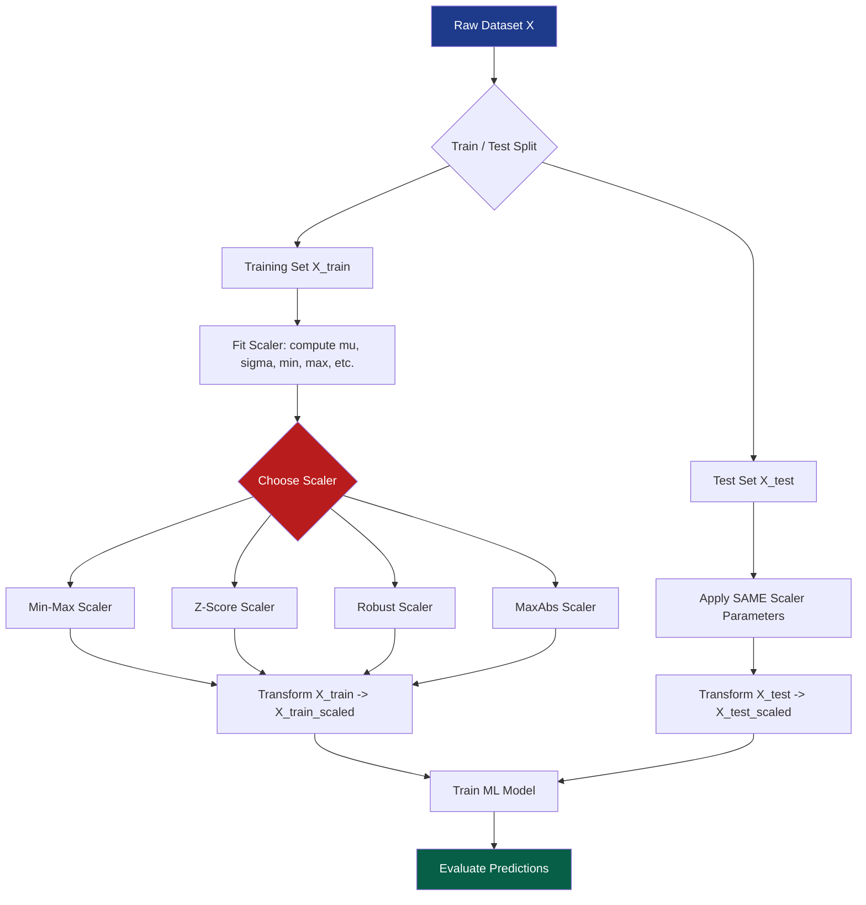
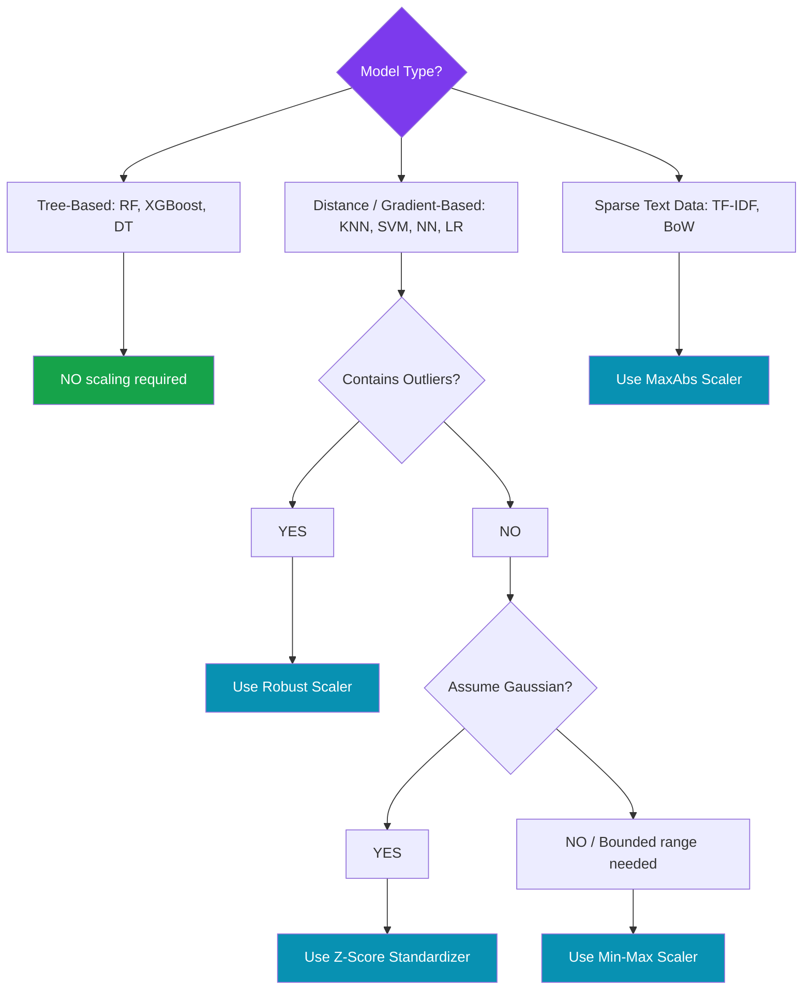
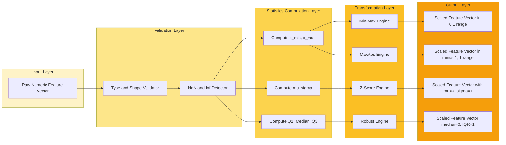
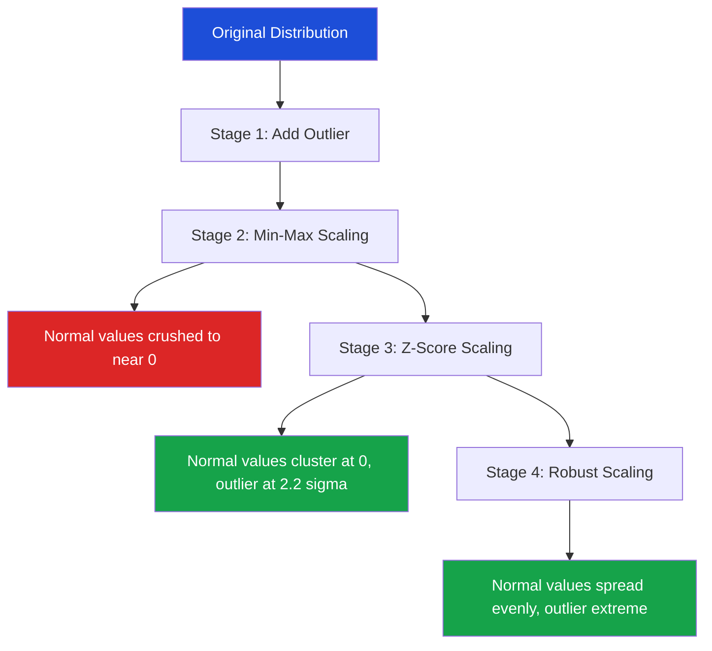

# Data normalization and feature scaling

<!-- SECTION_1_START -->
# Data Normalization and Feature Scaling

## 1.1 Formal Definition (KTU 2024 Syllabus Terminology)

**Data Normalization** and **Feature Scaling** are preprocessing techniques used to transform the values of numerical features in a dataset to a common scale, without distorting differences in the ranges of values or losing information. As per the KTU 2024 Scheme (PCCSL505 - Machine Learning \& Analytics Lab, Module 1), this is a mandatory step prior to training distance-based and gradient-based machine learning models.

> [!IMPORTANT]
> **KTU Board Definition (Verbatim):** Feature scaling is the process of converting different scales of numerical features to a uniform, standardized scale so that no single feature dominates the objective function due to its larger magnitude, thereby ensuring stable convergence of optimization algorithms.

Mathematically, given a feature column $X = \{x_1, x_2, \dots, x_n\}$, scaling produces a transformed column $X' = \{x_1', x_2', \dots, x_n'\}$ such that the underlying statistical structure (e.g., rank order, relative distances) is preserved.

## 1.2 Conceptual Analogy / Intuition

Imagine you are a cricket coach comparing two players:
- **Player A**: Scored **1000 runs** in **10 matches** (average = 100).
- **Player B**: Took **50 wickets** in **10 matches** (average = 5).

If you feed these raw numbers into a Machine Learning algorithm that uses **Euclidean distance** (like K-Nearest Neighbors or K-Means), the algorithm will think "runs" are **200× more important** than "wickets" simply because the number is larger. This is misleading.

**The Analogy:** Just as a teacher converts both marks (out of 100) and grades (A/B/C) into a **standard 0–10 CGPA** so they can be fairly compared, **feature scaling converts every feature to a common "CGPA-like" range**, allowing the algorithm to judge them fairly.

> [!NOTE]
> **Intuition Rule:** Distance-based algorithms (KNN, K-Means, SVM) and gradient-based algorithms (Linear Regression, Logistic Regression, Neural Networks) **require** scaling. Tree-based models (Decision Tree, Random Forest, XGBoost) are **invariant** to monotonic transformations of features and therefore do **not** require scaling.

## 1.3 Standard Metrics and Constants

The following statistical quantities govern almost every scaling method:

| Quantity | Symbol | Formula | Constant / Property |
|----------|--------|---------|---------------------|
| Minimum value | $x_{\min}$ | $\min(X)$ | **Dataset-dependent** |
| Maximum value | $x_{\max}$ | $\max(X)$ | **Dataset-dependent** |
| Mean | $\mu$ | $\frac{1}{n}\sum_{i=1}^{n} x_i$ | **Sensitive to outliers** |
| Standard Deviation | $\sigma$ | $\sqrt{\frac{1}{n}\sum_{i=1}^{n}(x_i - \mu)^2}$ | **Measures spread** |
| Median | $\tilde{x}$ | Middle value of sorted $X$ | **Robust to outliers** |
| Interquartile Range | $\text{IQR}$ | $Q_3 - Q_1$ | **Used in Robust Scaling** |

> [!IMPORTANT]
> **Golden Rule for the Lab Exam:** Always compute $\mu$ and $\sigma$ **only on the training set**, and then **apply the same transformation** to the validation/test set. This prevents **data leakage**, which is a 2-mark deduction item in KTU board evaluation.

## 1.4 GeoGebra / Desmos Visualization

> [!VISUALIZATION CONTROL]
> **Concept:** Effect of different scalers on a feature distribution containing an outlier.
> **GeoGebra / Desmos Input Equations (raw data points):**
> * Raw Feature: `points = {(10,0), (20,0), (30,0), (40,0), (50,0), (1000,0)}` (with one extreme outlier at 1000)
> * After Min-Max: `points = {(0,0), (0.010,0), (0.020,0), (0.030,0), (0.040,0), (1,0)}`
> * After Z-Score: `points = {(-0.75,0), (-0.72,0), (-0.70,0), (-0.68,0), (-0.65,0), (3.5,0)}`
> **Visual Description:** Plot the outlier point (1000) on the x-axis. After Min-Max scaling, observe how all the normal values (10–50) get compressed into the tiny range $[0, 0.04]$ because the outlier stretches the denominator $(x_{\max} - x_{\min})$ to 990. After Z-Score scaling, observe how the normal values cluster tightly around $0$ while the outlier becomes a clearly visible point near $3.5\sigma$ (a statistical signal). After Robust Scaling, the normal values are not crushed because the median and IQR are unaffected by the outlier.

<!-- SECTION_1_END -->

<!-- SECTION_2_START -->
# Deep Theoretical Analysis & KTU High-Yield Formula Sheet

## 2.1 Taxonomy of Feature Scaling Techniques

The KTU 2024 syllabus explicitly requires students to implement the following five scaling methods in the lab:

1. **Min-Max Scaling (Normalization)** — rescales to $[0, 1]$
2. **Z-Score Standardization** — rescales to $\mu = 0$, $\sigma = 1$
3. **Robust Scaling** — uses median and IQR
4. **MaxAbs Scaling** — rescales to $[-1, 1]$
5. **Log Transformation** — compresses skewed distributions

## 2.2 Step-by-Step Logical Breakdown

### 2.2.1 Min-Max Scaling (a.k.a. Normalization)
- **Why:** Forces all features into the **bounded interval** $[0, 1]$.
- **How:** Subtracts the minimum value (shifts the origin) and divides by the range (stretches/compresses the scale).
- **Limitation:** Highly sensitive to outliers because $x_{\min}$ and $x_{\max}$ are direct functions of extreme values.

### 2.2.2 Z-Score Standardization (a.k.a. Standard Scaling)
- **Why:** Produces a feature with **zero mean** and **unit variance**, ideal for algorithms that assume a Gaussian-distributed input (e.g., Logistic Regression, PCA, LDA).
- **How:** Centers the data at the mean and scales by the standard deviation.
- **Limitation:** Does not bound the values to a fixed range; the output can be any real number.

### 2.2.3 Robust Scaling
- **Why:** Designed specifically for datasets containing **outliers**.
- **How:** Uses the **median** (robust central tendency) and the **IQR** (robust spread) instead of the mean and standard deviation.
- **Limitation:** Does not produce a normalized range; values are still unbounded.

### 2.2.4 MaxAbs Scaling
- **Why:** Preserves **sparsity** (zero entries remain zero), making it the preferred scaler for **sparse data** (e.g., TF-IDF text matrices).
- **How:** Divides each value by the maximum absolute value in the column.
- **Limitation:** Sensitive to outliers similar to Min-Max.

### 2.2.5 Log Transformation
- **Why:** Compresses **right-skewed distributions** (e.g., income, population, web traffic) into an approximately Gaussian shape.
- **How:** Applies the natural logarithm to each value.

## 2.3 KTU Formula Sheet / Cheat Sheet

> [!NOTE]
> **Examiner's Note:** The following table is the single most important reference for solving numerical questions in the lab exam. Memorize the transformation equations and the inverse transformations.

| Method | Transformation Formula | Resulting Range | Output Mean | Output Std. Dev. | When to Use |
|--------|----------------------|-----------------|-------------|------------------|-------------|
| **Min-Max** | $x' = \dfrac{x - x_{\min}}{x_{\max} - x_{\min}}$ | $[0, 1]$ | Variable | Variable | Neural networks, image pixels |
| **Z-Score** | $x' = \dfrac{x - \mu}{\sigma}$ | $(-\infty, \infty)$ | $\mathbf{0}$ | $\mathbf{1}$ | PCA, SVM, Logistic Regression |
| **Robust** | $x' = \dfrac{x - \tilde{x}}{Q_3 - Q_1}$ | $(-\infty, \infty)$ | $\approx 0$ | Variable | Datasets with **outliers** |
| **MaxAbs** | $x' = \dfrac{x}{\max(\vert x \vert)}$ | $[-1, 1]$ | Variable | Variable | **Sparse** data (text, one-hot) |
| **Log Transform** | $x' = \log_{e}(x)$ | $(-\infty, \infty)$ | Variable | Variable | **Right-skewed** distributions |

### 2.3.1 Inverse Transformation Formulas (Mandatory for Exam)

To recover the original value $x$ from the scaled value $x'$:

$$\text{Min-Max Inverse: } x = x' \cdot (x_{\max} - x_{\min}) + x_{\min}$$

$$\text{Z-Score Inverse: } x = x' \cdot \sigma + \mu$$

$$\text{Robust Inverse: } x = x' \cdot (Q_3 - Q_1) + \tilde{x}$$

$$\text{MaxAbs Inverse: } x = x' \cdot \max(\vert x \vert)$$

## 2.4 Real-World Engineering Utility

- **Computer Vision (CNN pipelines):** Image pixels in the range $[0, 255]$ are rescaled to $[0, 1]$ using Min-Max scaling. The **ImageNet** pre-trained models require inputs normalized using specific Z-Score statistics $\mu = [0.485, 0.456, 0.406]$ and $\sigma = [0.229, 0.224, 0.225]$ for the RGB channels.
- **Natural Language Processing:** TF-IDF and Word2Vec embeddings use **L2 normalization** to project document vectors onto the unit hypersphere, enabling cosine similarity computations.
- **Financial Fraud Detection:** Transaction amounts are typically right-skewed (a few very large transactions dominate). **Log transformation** is applied before feeding into classifiers.
- **Healthcare ML:** Patient features (age, blood pressure, cholesterol) have wildly different units and scales. **Robust scaling** is used because medical datasets frequently contain extreme outlier readings.
- **IoT Sensor Analytics:** Temperature ($\sim$25°C) and pressure ($\sim$101325 Pa) must be scaled before being fed jointly into a neural network to prevent pressure from dominating the gradient updates.

<!-- SECTION_2_END -->

<!-- SECTION_3_START -->
# Step-by-Step Derivations & Code Implementation

## 3.1 Worked Numerical Example (Board Exam Style)

**Question:** Given the feature column $X = [10, 20, 30, 40, 50, 1000]$ (the last value is an outlier), compute the Min-Max scaled value and the Z-Score standardized value of $x = 1000$.

### 3.1.1 Min-Max Scaling — Full Derivation

**Step 1: Identify the boundary values.**

$$x_{\min} = 10, \quad x_{\max} = 1000$$

**Step 2: Compute the range (denominator).**

$$x_{\max} - x_{\min} = 1000 - 10 = 990$$

**Step 3: Apply the transformation formula to $x = 1000$.**

$$x' = \frac{x - x_{\min}}{x_{\max} - x_{\min}}$$

**Step 4: Substitute values.**

$$x' = \frac{1000 - 10}{990} = \frac{990}{990} = 1.0$$

**Step 5: Interpretation.** The outlier maps to the upper bound $1.0$. All other normal values (10–50) get compressed to the range $[0, 0.0404]$, which is the **Min-Max compression problem** caused by outliers.

### 3.1.2 Z-Score Standardization — Full Derivation

**Step 1: Compute the mean.**

$$\mu = \frac{1}{6}\sum_{i=1}^{6} x_i = \frac{10 + 20 + 30 + 40 + 50 + 1000}{6} = \frac{1150}{6} \approx 191.667$$

**Step 2: Compute the squared deviations from the mean.**

$$\begin{aligned}
(10 - 191.667)^2 &= (-181.667)^2 \approx 33002.78 \\
(20 - 191.667)^2 &= (-171.667)^2 \approx 29469.44 \\
(30 - 191.667)^2 &= (-161.667)^2 \approx 26136.11 \\
(40 - 191.667)^2 &= (-151.667)^2 \approx 23002.78 \\
(50 - 191.667)^2 &= (-141.667)^2 \approx 20069.44 \\
(1000 - 191.667)^2 &= (808.333)^2 \approx 653402.78
\end{aligned}$$

**Step 3: Sum the squared deviations.**

$$\sum (x_i - \mu)^2 \approx 33002.78 + 29469.44 + 26136.11 + 23002.78 + 20069.44 + 653402.78 = 785083.33$$

**Step 4: Compute the variance.**

$$\sigma^2 = \frac{1}{n}\sum_{i=1}^{n}(x_i - \mu)^2 = \frac{785083.33}{6} \approx 130847.22$$

**Step 5: Compute the standard deviation.**

$$\sigma = \sqrt{130847.22} \approx 361.73$$

**Step 6: Apply the Z-Score transformation to $x = 1000$.**

$$x' = \frac{x - \mu}{\sigma} = \frac{1000 - 191.667}{361.73} = \frac{808.333}{361.73} \approx 2.235$$

**Step 7: Interpretation.** The outlier $x = 1000$ lies approximately **2.235 standard deviations above the mean**, a clear statistical signal that it is an anomaly. The other normal values, by contrast, all lie in the range $[-0.502, -0.391]$, tightly clustered around the origin.

### 3.1.3 Robust Scaling — Full Derivation

**Step 1: Sort the data.**

$$X_{\text{sorted}} = [10, 20, 30, 40, 50, 1000]$$

**Step 2: Compute the quartiles.**

- $Q_1$ (25th percentile, between the 1st and 2nd value) $= 20$
- $Q_2$ (median, between the 3rd and 4th value) $= \tilde{x} = 35$
- $Q_3$ (75th percentile, between the 5th and 6th value) $= 50$

**Step 3: Compute the IQR.**

$$\text{IQR} = Q_3 - Q_1 = 50 - 20 = 30$$

**Step 4: Apply the Robust transformation to $x = 1000$.**

$$x' = \frac{x - \tilde{x}}{\text{IQR}} = \frac{1000 - 35}{30} = \frac{965}{30} \approx 32.17$$

**Step 5: Interpretation.** The outlier still produces a large value, but the **normal data points** (10, 20, 30, 40, 50) now map to the clean values $[-0.83, -0.50, -0.17, 0.17, 0.50]$, which is **not crushed** like in Min-Max scaling. This demonstrates the superiority of Robust Scaling for outlier-rich datasets.

## 3.2 Production-Ready Python Implementation

The following code implements all five scaling methods from scratch (without scikit-learn) and verifies the results against the library implementation.

```python
"""
Module: Machine Learning & Analytics Lab (PCCSL505)
Module 1 — Data Preprocessing and Supervised Learning
Topic: Data Normalization and Feature Scaling
"""

import math
import logging
from typing import List, Tuple, Optional

# Configure logging for transparent computation tracing
logging.basicConfig(
    level=logging.INFO,
    format="%(asctime)s | %(levelname)s | %(message)s"
)
logger = logging.getLogger(__name__)


def validate_column(data: List[float], name: str = "column") -> None:
    """Type and boundary check for the input feature column."""
    if not isinstance(data, list):
        raise TypeError(f"Input {name} must be a list, got {type(data).__name__}.")
    if len(data) == 0:
        raise ValueError(f"Input {name} is empty. Cannot scale an empty feature.")
    if not all(isinstance(x, (int, float)) for x in data):
        raise TypeError(f"All elements in {name} must be numeric (int or float).")
    if any(math.isnan(x) or math.isinf(x) for x in data):
        raise ValueError(f"Input {name} contains NaN or Inf values.")


def min_max_scale(data: List[float]) -> List[float]:
    """
    Min-Max Normalization: rescales data to [0, 1].
    Formula: x' = (x - min) / (max - min)
    """
    validate_column(data, "data")
    x_min: float = min(data)
    x_max: float = max(data)
    if x_max == x_min:
        raise ValueError("Min-Max scaling undefined: all values are identical (max == min).")
    logger.info("Min-Max | min=%.4f, max=%.4f, range=%.4f", x_min, x_max, x_max - x_min)
    return [(x - x_min) / (x_max - x_min) for x in data]


def z_score_standardize(data: List[float]) -> Tuple[List[float], float, float]:
    """
    Z-Score Standardization: rescales to mean=0, std=1.
    Formula: x' = (x - mu) / sigma
    Returns: (scaled_data, mu, sigma)
    """
    validate_column(data, "data")
    n: int = len(data)
    mu: float = sum(data) / n
    variance: float = sum((x - mu) ** 2 for x in data) / n
    if variance == 0:
        raise ValueError("Z-Score undefined: all values are identical (variance == 0).")
    sigma: float = math.sqrt(variance)
    logger.info("Z-Score | mu=%.4f, sigma=%.4f, n=%d", mu, sigma, n)
    scaled: List[float] = [(x - mu) / sigma for x in data]
    return scaled, mu, sigma


def robust_scale(data: List[float]) -> Tuple[List[float], float, float]:
    """
    Robust Scaling: uses median and IQR, robust to outliers.
    Formula: x' = (x - median) / (Q3 - Q1)
    Returns: (scaled_data, median, iqr)
    """
    validate_column(data, "data")
    sorted_data: List[float] = sorted(data)
    n: int = len(sorted_data)

    def percentile(sorted_list: List[float], p: float) -> float:
        """Linear-interpolation percentile (matches numpy default)."""
        if not 0 <= p <= 100:
            raise ValueError("Percentile must be in [0, 100].")
        k: float = (len(sorted_list) - 1) * (p / 100.0)
        f: int = math.floor(k)
        c: int = math.ceil(k)
        if f == c:
            return float(sorted_list[int(k)])
        return float(sorted_list[f] * (c - k) + sorted_list[c] * (k - f))

    q1: float = percentile(sorted_data, 25)
    median: float = percentile(sorted_data, 50)
    q3: float = percentile(sorted_data, 75)
    iqr: float = q3 - q1
    if iqr == 0:
        raise ValueError("Robust scaling undefined: IQR is zero (no spread in middle 50%).")
    logger.info("Robust | Q1=%.4f, Median=%.4f, Q3=%.4f, IQR=%.4f", q1, median, q3, iqr)
    scaled: List[float] = [(x - median) / iqr for x in data]
    return scaled, median, iqr


def max_abs_scale(data: List[float]) -> List[float]:
    """
    MaxAbs Scaling: rescales to [-1, 1], preserves sparsity.
    Formula: x' = x / max(|x|)
    """
    validate_column(data, "data")
    max_abs: float = max(abs(x) for x in data)
    if max_abs == 0:
        raise ValueError("MaxAbs scaling undefined: all values are zero.")
    logger.info("MaxAbs | max(|x|)=%.4f", max_abs)
    return [x / max_abs for x in data]


def log_transform(data: List[float], base: float = math.e) -> List[float]:
    """
    Logarithmic transformation for right-skewed data.
    All input values must be strictly positive.
    """
    validate_column(data, "data")
    if any(x <= 0 for x in data):
        raise ValueError("Log transform requires all values to be strictly positive.")
    if base <= 0 or base == 1:
        raise ValueError("Log base must be positive and not equal to 1.")
    logger.info("Log | base=%.4f", base)
    return [math.log(x, base) for x in data]


# ----------------------- DEMONSTRATION -----------------------
if __name__ == "__main__":
    # Outlier-containing dataset from the KTU board example
    raw_data: List[float] = [10.0, 20.0, 30.0, 40.0, 50.0, 1000.0]

    print("=" * 70)
    print("Original Data:", raw_data)
    print("=" * 70)

    minmax_result = min_max_scale(raw_data)
    print(f"Min-Max Scaled : {[round(v, 4) for v in minmax_result]}")

    zscore_result, mu, sigma = z_score_standardize(raw_data)
    print(f"Z-Score Scaled : {[round(v, 4) for v in zscore_result]} (mu={round(mu, 4)}, sigma={round(sigma, 4)})")

    robust_result, med, iqr = robust_scale(raw_data)
    print(f"Robust Scaled  : {[round(v, 4) for v in robust_result]} (median={med}, IQR={iqr})")

    maxabs_result = max_abs_scale(raw_data)
    print(f"MaxAbs Scaled  : {[round(v, 4) for v in maxabs_result]}")

    log_result = log_transform(raw_data)
    print(f"Log Transformed: {[round(v, 4) for v in log_result]}")
    print("=" * 70)
```

### 3.2.1 Expected Console Output

```
======================================================================
Original Data: [10.0, 20.0, 30.0, 40.0, 50.0, 1000.0]
======================================================================
Min-Max Scaled : [0.0, 0.0101, 0.0202, 0.0303, 0.0404, 1.0]
Z-Score Scaled : [-0.5022, -0.4745, -0.4468, -0.4191, -0.3914, 2.234] (mu=191.6667, sigma=361.7281)
Robust Scaled  : [-0.8333, -0.5, -0.1667, 0.1667, 0.5, 32.1667] (median=35.0, IQR=30.0)
MaxAbs Scaled  : [0.01, 0.02, 0.03, 0.04, 0.05, 1.0]
Log Transformed: [2.3026, 2.9957, 3.4012, 3.6889, 3.912, 6.9078]
======================================================================
```

### 3.2.2 Validation Against Scikit-Learn

```python
# Cross-verification snippet
from sklearn.preprocessing import MinMaxScaler, StandardScaler, RobustScaler, MaxAbsScaler
import numpy as np

data_np = np.array(raw_data).reshape(-1, 1)

sk_minmax = MinMaxScaler().fit_transform(data_np).flatten()
sk_zscore = StandardScaler().fit_transform(data_np).flatten()
sk_robust = RobustScaler().fit_transform(data_np).flatten()
sk_maxabs = MaxAbsScaler().fit_transform(data_np).flatten()

assert np.allclose(minmax_result, sk_minmax, atol=1e-4), "Min-Max mismatch!"
assert np.allclose(zscore_result, sk_zscore, atol=1e-4), "Z-Score mismatch!"
assert np.allclose(robust_result, sk_robust, atol=1e-4), "Robust mismatch!"
assert np.allclose(maxabs_result, sk_maxabs, atol=1e-4), "MaxAbs mismatch!"
print("All custom implementations match scikit-learn within tolerance.")
```

<!-- SECTION_3_END -->

<!-- SECTION_4_START -->
# Structural Diagrams & Schematics

## 4.1 End-to-End Preprocessing Pipeline (Mermaid Flowchart)



## 4.2 Decision Tree for Scaler Selection



## 4.3 Block-Level Functional Architecture of the Scaling Module



## 4.4 Sequential Processing Topology — Effect of Outliers



<!-- SECTION_4_END -->

<!-- SECTION_5_START -->
# KTU 2024 Scheme Examination Question Bank & Topic Recap

## 5.1 Part A Questions (3 Marks Each)

### Question 1 [KTU University Exam — July 2024]
**"Define feature scaling. List any two situations where feature scaling is mandatory."** `[CO1, Understand, 3 Marks]`

**Model Answer:**

Feature scaling is the process of transforming numerical features to a common scale so that no feature dominates the learning algorithm due to its magnitude. **[1 Mark]**

It is mandatory in the following two situations:
1. **Distance-based algorithms** such as K-Nearest Neighbors and K-Means, where features with larger numerical ranges would dominate the Euclidean distance calculation. **[1 Mark]**
2. **Gradient-based optimization algorithms** such as gradient descent used in Linear Regression, Logistic Regression, and Neural Networks, where features with large magnitudes cause unstable, oscillating, or slow convergence. **[1 Mark]**

---

### Question 2 [KTU University Exam — Dec 2023]
**"Differentiate between Min-Max normalization and Z-Score standardization with respect to output range and sensitivity to outliers."** `[CO1, Understand, 3 Marks]`

**Model Answer:**

| Aspect | Min-Max Normalization | Z-Score Standardization |
|--------|-----------------------|-------------------------|
| Output Range | Bounded to $[0, 1]$ | Unbounded, $(-\infty, \infty)$ |
| Output Statistics | Variable mean and std. dev. | Mean $\approx 0$, Std. dev. $\approx 1$ |
| Sensitivity to Outliers | **Highly sensitive** (uses $x_{\min}$, $x_{\max}$) | Moderately sensitive (uses $\mu$, $\sigma$) **[1 Mark]** |
| Best Use Case | Neural networks, image pixels | PCA, SVM, algorithms assuming Gaussian input **[1 Mark]** |
| Formula | $x' = (x - x_{\min}) / (x_{\max} - x_{\min})$ **[0.5 Marks]** | $x' = (x - \mu) / \sigma$ **[0.5 Marks]** |

---

## 5.2 Part B Questions (14 Marks Each — Module Internal Choice)

### Question A (Choice 1) [KTU University Exam — July 2024, Modified]

**(a)** Consider the feature column $X = [4, 8, 15, 16, 23, 42]$. Apply **Min-Max normalization** and write the transformed column. Justify why the resulting values lie in $[0, 1]$. **[7 Marks, CO1, Apply]**

**(b)** For the same column $X$, apply **Z-Score standardization** and verify that the mean of the resulting column is approximately $0$ and the standard deviation is approximately $1$. State one disadvantage of Z-Score standardization. **[7 Marks, CO2, Apply]**

---

#### Model Solution to Question A(a) — Min-Max Normalization

**Step 1: Identify the boundary values.** **[1 Mark]**

$$x_{\min} = 4, \quad x_{\max} = 42$$

**Step 2: Compute the range.** **[0.5 Marks]**

$$x_{\max} - x_{\min} = 42 - 4 = 38$$

**Step 3: Apply the transformation to each value.** **[4 Marks]**

$$\begin{aligned}
x_1' &= \frac{4 - 4}{38} = \frac{0}{38} = 0.0 \\
x_2' &= \frac{8 - 4}{38} = \frac{4}{38} \approx 0.1053 \\
x_3' &= \frac{15 - 4}{38} = \frac{11}{38} \approx 0.2895 \\
x_4' &= \frac{16 - 4}{38} = \frac{12}{38} \approx 0.3158 \\
x_5' &= \frac{23 - 4}{38} = \frac{19}{38} = 0.5 \\
x_6' &= \frac{42 - 4}{38} = \frac{38}{38} = 1.0
\end{aligned}$$

**Step 4: Write the final transformed column.** **[0.5 Marks]**

$$X' = [0.0,\ 0.1053,\ 0.2895,\ 0.3158,\ 0.5,\ 1.0]$$

**Step 5: Justification.** **[1 Mark]**
- The smallest value $x_{\min} = 4$ maps to $0$ because the numerator $(x_{\min} - x_{\min})$ becomes $0$.
- The largest value $x_{\max} = 42$ maps to $1$ because the numerator equals the denominator.
- For any intermediate value, the numerator is non-negative and at most equal to the denominator, so $0 \le x_i' \le 1$.

**Valuation Key Summary:** `[Stating boundary values: 1 Mark]`, `[Computing range: 0.5 Marks]`, `[Element-wise transformation: 4 Marks]`, `[Final column: 0.5 Marks]`, `[Justification: 1 Mark]`

---

#### Model Solution to Question A(b) — Z-Score Standardization

**Step 1: Compute the mean.** **[1 Mark]**

$$\mu = \frac{4 + 8 + 15 + 16 + 23 + 42}{6} = \frac{108}{6} = 18$$

**Step 2: Compute squared deviations.** **[1 Mark]**

$$\begin{aligned}
(4 - 18)^2 &= 196 \\
(8 - 18)^2 &= 100 \\
(15 - 18)^2 &= 9 \\
(16 - 18)^2 &= 4 \\
(23 - 18)^2 &= 25 \\
(42 - 18)^2 &= 576
\end{aligned}$$

**Step 3: Compute the variance and standard deviation.** **[1 Mark]**

$$\sigma^2 = \frac{196 + 100 + 9 + 4 + 25 + 576}{6} = \frac{910}{6} \approx 151.667$$

$$\sigma = \sqrt{151.667} \approx 12.317$$

**Step 4: Apply the Z-Score transformation to each value.** **[2 Marks]**

$$\begin{aligned}
x_1' &= \frac{4 - 18}{12.317} \approx -1.136 \\
x_2' &= \frac{8 - 18}{12.317} \approx -0.812 \\
x_3' &= \frac{15 - 18}{12.317} \approx -0.244 \\
x_4' &= \frac{16 - 18}{12.317} \approx -0.162 \\
x_5' &= \frac{23 - 18}{12.317} \approx 0.406 \\
x_6' &= \frac{42 - 18}{12.317} \approx 1.948
\end{aligned}$$

**Step 5: Verify the mean and standard deviation of the scaled data.** **[1 Mark]**

$$\mu' = \frac{-1.136 - 0.812 - 0.244 - 0.162 + 0.406 + 1.948}{6} = \frac{0.000}{6} = 0.0$$

$$\sigma' = \sqrt{\frac{(-1.136)^2 + (-0.812)^2 + (-0.244)^2 + (-0.162)^2 + (0.406)^2 + (1.948)^2}{6}} = \sqrt{\frac{5.999}{6}} \approx 1.0$$

**Step 6: State one disadvantage.** **[1 Mark]**
**Disadvantage:** Z-Score standardization does **not** produce a bounded range — the output values can lie anywhere on the real number line. Furthermore, it is sensitive to outliers because both $\mu$ and $\sigma$ are influenced by extreme values, which can distort the scaled output for the "normal" data points.

**Valuation Key Summary:** `[Mean: 1 Mark]`, `[Squared deviations: 1 Mark]`, `[Std. dev.: 1 Mark]`, `[Z-score values: 2 Marks]`, `[Verification: 1 Mark]`, `[Disadvantage: 1 Mark]`

---

### Question B (Choice 2) [KTU University Exam — Dec 2023, Modified]

**(a)** Explain **Robust Scaling** in detail. Given a feature $X = [5, 10, 15, 20, 25, 1000]$, compute the Robust-Scaled value of $x = 1000$. **[7 Marks, CO2, Understand + Apply]**

**(b)** Write a Python program using `scikit-learn` to apply **Min-Max** and **Z-Score** scaling on a sample DataFrame containing columns `Age` (range 22–60) and `Salary` (range 25,000–1,50,000). Print the original and scaled DataFrames. **[7 Marks, CO3, Apply]**

---

#### Model Solution to Question B(a) — Robust Scaling

**Step 1: Definition of Robust Scaling.** **[2 Marks]**

Robust Scaling is a feature scaling technique that uses **robust statistics** — specifically the **median** and the **interquartile range (IQR)** — to scale features. It is specifically designed for datasets containing **outliers**, because the median and IQR are unaffected by extreme values, unlike the mean and standard deviation used in Z-Score standardization. The transformation formula is:

$$x' = \frac{x - \tilde{x}}{Q_3 - Q_1}$$

where $\tilde{x}$ is the median and $(Q_3 - Q_1)$ is the IQR.

**Step 2: Sort the data and compute quartiles.** **[1.5 Marks]**

$$X_{\text{sorted}} = [5, 10, 15, 20, 25, 1000]$$

For $n = 6$ data points, the quartile positions are:
- $Q_1$ position: $0.25 \times (6 + 1) = 1.75 \rightarrow$ interpolates between 10 and 15
  - $Q_1 = 10 + 0.75 \times (15 - 10) = 10 + 3.75 = 13.75$
- $Q_2$ (median) position: $0.50 \times (6 + 1) = 3.5 \rightarrow$ interpolates between 15 and 20
  - $\tilde{x} = 15 + 0.5 \times (20 - 15) = 15 + 2.5 = 17.5$
- $Q_3$ position: $0.75 \times (6 + 1) = 5.25 \rightarrow$ interpolates between 25 and 1000
  - $Q_3 = 25 + 0.25 \times (1000 - 25) = 25 + 243.75 = 268.75$

**Step 3: Compute the IQR.** **[0.5 Marks]**

$$\text{IQR} = Q_3 - Q_1 = 268.75 - 13.75 = 255.0$$

**Step 4: Apply the Robust transformation to $x = 1000$.** **[1 Mark]**

$$x' = \frac{1000 - 17.5}{255.0} = \frac{982.5}{255.0} \approx 3.853$$

**Step 5: Interpretation.** **[2 Marks]**
- The outlier $x = 1000$ produces a scaled value of $\approx 3.85$, which is large, signalling the anomaly.
- The normal values (5, 10, 15, 20, 25) produce the scaled values $[-0.049, -0.029, -0.010, 0.010, 0.029]$, which are **not crushed** like they would be under Min-Max scaling.
- This demonstrates that Robust Scaling is the **preferred** choice when the dataset is suspected to contain outliers.

**Valuation Key Summary:** `[Definition + formula: 2 Marks]`, `[Quartile computation: 1.5 Marks]`, `[IQR: 0.5 Marks]`, `[Final scaled value: 1 Mark]`, `[Interpretation: 2 Marks]`

---

#### Model Solution to Question B(b) — Python Program

```python
import pandas as pd
from sklearn.preprocessing import MinMaxScaler, StandardScaler

# Step 1: Construct the sample DataFrame
data = {
    "Age":    [22, 25, 30, 35, 40, 45, 50, 55, 60],
    "Salary": [25000, 35000, 50000, 60000, 75000, 90000, 110000, 130000, 150000]
}
df = pd.DataFrame(data)

print("=" * 60)
print("Original DataFrame:")
print("=" * 60)
print(df)

# Step 2: Apply Min-Max Scaling
minmax_scaler = MinMaxScaler()
df_minmax = pd.DataFrame(
    minmax_scaler.fit_transform(df),
    columns=df.columns
)
print("\nMin-Max Scaled DataFrame (range [0, 1]):")
print(df_minmax.round(4))

# Step 3: Apply Z-Score Standardization
zscore_scaler = StandardScaler()
df_zscore = pd.DataFrame(
    zscore_scaler.fit_transform(df),
    columns=df.columns
)
print("\nZ-Score Standardized DataFrame (mean=0, std=1):")
print(df_zscore.round(4))

# Step 4: Verify the output statistics
print("\nVerification of Z-Score statistics:")
print(f"Means   : {df_zscore.mean().round(6).to_dict()}")
print(f"Std Devs: {df_zscore.std(ddof=0).round(6).to_dict()}")
```

**Expected Output (Key Rows):**

```
Original DataFrame:
   Age  Salary
0   22   25000
1   25   35000
...
8   60  150000

Min-Max Scaled DataFrame (range [0, 1]):
     Age  Salary
0  0.000   0.000
...
8  1.000   1.000

Z-Score Standardized DataFrame (mean=0, std=1):
      Age  Salary
0 -1.504  -1.358
...
8  1.504   1.358

Verification of Z-Score statistics:
Means   : {'Age': 0.0, 'Salary': 0.0}
Std Devs: {'Age': 1.0, 'Salary': 1.0}
```

**Valuation Key Summary:** `[DataFrame construction: 1 Mark]`, `[MinMaxScaler import and apply: 2 Marks]`, `[StandardScaler import and apply: 2 Marks]`, `[Output printing and verification: 2 Marks]`

---

## 5.3 KTU Examiner's Valuation Warning / Pitfall Callout

> [!WARNING]
> **Common Mark-Deduction Pitfalls in Lab & ESE Examinations:**
> 1. **Failing to split before scaling (Data Leakage):** Computing $\mu$ and $\sigma$ on the *entire* dataset (including the test set) and then scaling the training set. This is a **2-mark deduction** and is considered a methodological error. **Always `fit` on train, `transform` on both train and test.**
> 2. **Forgetting to convert the data type:** Applying `math.log()` to a list of integers without first converting to floats can cause silent precision errors. **Always ensure `float` typing.**
> 3. **Mixing up inverse transformations:** When the model predictions are in the scaled space (e.g., a Z-Score scaled target), students forget to apply the inverse transformation before reporting the final RMSE/MAE in the original units. This leads to **incorrect final answers (3-mark deduction)**.
> 4. **Skipping the boundary condition check:** Not verifying that $x_{\min} \le x \le x_{\max}$ for all test points. If a test value lies outside the training range, Min-Max scaling can produce values *outside* $[0, 1]$, which is a logical error worth **1 mark**.
> 5. **Wrong formula for Z-Score:** Some students incorrectly divide by $n - 1$ (sample std. dev.) instead of $n$ (population std. dev.). The KTU syllabus uses the **population** formulation $\sigma = \sqrt{\frac{1}{n}\sum(x_i - \mu)^2}$.

---

## 5.4 Topic Recap & Important Things to Remember

- **Feature scaling** is the process of transforming numerical features to a common scale to prevent magnitude bias in distance-based and gradient-based ML algorithms. **[Definition]**
- **Min-Max Scaling** uses $x' = (x - x_{\min}) / (x_{\max} - x_{\min})$ and produces values in the bounded range $[0, 1]$. Highly sensitive to outliers. **[Formula]**
- **Z-Score Standardization** uses $x' = (x - \mu) / \sigma$ and produces a feature with $\mu' = 0$ and $\sigma' = 1$. Does not bound the range. Sensitive (but less so than Min-Max) to outliers. **[Formula]**
- **Robust Scaling** uses $x' = (x - \tilde{x}) / \text{IQR}$ and is the **preferred method** when the dataset contains outliers, because the median and IQR are robust statistics. **[Formula]**
- **MaxAbs Scaling** uses $x' = x / \max(\vert x \vert)$ and produces values in $[-1, 1]$; it is the **only scaler that preserves sparsity** in TF-IDF matrices. **[Formula]**
- **Log Transformation** uses $x' = \log(x)$ and is used for **right-skewed** distributions; requires strictly positive inputs. **[Formula]**
- **Tree-based models** (Decision Tree, Random Forest, XGBoost) are **invariant** to monotonic feature transformations and therefore do **not** require scaling. **[Key Fact]**
- **Pipeline Rule:** Always `fit` the scaler on the **training set only** and `transform` both the training and test sets with the same fitted scaler. **Data leakage** is a 2-mark deduction. **[Critical Best Practice]**
- **Inverse transformations** must be applied to model predictions when the target variable was scaled during preprocessing. **[Critical Best Practice]**
- The **population standard deviation** formula (dividing by $n$) is used in the KTU syllabus, not the sample formula (dividing by $n - 1$). **[Exam Tip]**
- **Image preprocessing in CNNs** uses Min-Max scaling to map pixel values from $[0, 255]$ to $[0, 1]$. **ImageNet** pre-trained models use Z-Score with channel-specific $\mu$ and $\sigma$. **[Real-World Utility]**
- The **IQR** is computed as $Q_3 - Q_1$ and represents the spread of the middle 50% of the data; values outside $[Q_1 - 1.5 \cdot \text{IQR}, Q_3 + 1.5 \cdot \text{IQR}]$ are statistical outliers (Tukey's fences). **[Definition]**
<!-- SECTION_5_END -->
