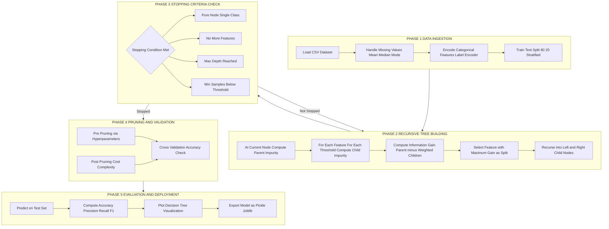
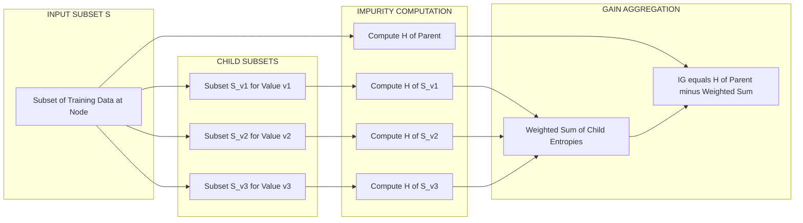

# Decision Trees

<!-- SECTION_1_START -->

# Decision Trees — Core Technical Definition & Intuitive Overview

> [!NOTE]
> **KTU 2024 Scheme — Machine Learning & Analytics Lab (PCCSL505)**
> **Module 1 — Data Preprocessing and Supervised Learning**
> **Topic — Decision Trees**
> **Mapped Course Outcomes:** CO1 (Understand core ML concepts), CO2 (Apply supervised algorithms on standard datasets)

## 1.1 Formal Academic Definition

A **Decision Tree** is a **non-parametric, supervised machine learning algorithm** that constructs a tree-structured model of decisions and their possible consequences. It learns by recursively partitioning the feature space into a hierarchy of **if–then–else decision rules** inferred directly from the training data. The terminal nodes (leaves) store the predicted class label (classification) or the continuous output value (regression), and the internal nodes test the value of a single feature attribute.

Mathematically, a decision tree is a piecewise constant function $f : \mathcal{X} \rightarrow \mathcal{Y}$ that approximates the unknown target mapping by recursively selecting the feature $A^\ast$ at each internal node that maximizes the *purity gain* of the resulting child partitions.

The three most influential algorithms in KTU Board syllabi are:

* **ID3 (Iterative Dichotomiser 3)** — uses **Entropy** and **Information Gain** for splits.
* **C4.5** — successor of ID3, introduces **Gain Ratio** to penalize multi-valued features.
* **CART (Classification and Regression Trees)** — uses **Gini Impurity** and supports regression via **MSE** reduction.

## 1.2 Conceptual Analogy (Real-World Intuition)

> [!TIP]
> **Analogy — The Medical Diagnosis Flowchart**
> Imagine a doctor diagnosing whether a patient has a viral or bacterial infection. The doctor does not perform every test at once. Instead, the doctor asks:
> 1. *Is the body temperature above $100.4^\circ F$?* → **Yes** / **No** branch.
> 2. *Is the WBC count elevated?* → follow the corresponding branch.
> 3. The process continues until a confident diagnosis is reached.
>
> Each question is a **decision node**, each Yes/No answer is a **branch**, and the final diagnosis is a **leaf node**. A Decision Tree *literally* encodes this medical flowchart by learning which question yields the cleanest separation of outcomes from past patient records.

In simple terms:

> *"A Decision Tree is to Machine Learning what a structured FAQ page is to Customer Support — it asks the most informative question first and narrows the answer space with every click."*

## 1.3 Key Terminology for KTU Board Examinations

| Term | Definition |
|---|---|
| **Root Node** | The topmost node that represents the entire training dataset. |
| **Internal Node** | A node that performs a feature-based test and has outgoing branches. |
| **Leaf Node** | A terminal node that holds the class label or regression value. |
| **Branch** | A directed edge representing the outcome of a feature test. |
| **Splitting Criterion** | The metric (Entropy / Gini / MSE) used to choose the best attribute. |
| **Pruning** | The technique of removing subtrees to reduce overfitting. |

## 1.4 GeoGebra / Desmos Visualization Control

> [!VISUALIZATION CONTROL]
> **Concept:** Visualization of the **Entropy function** $H(p)$ for a binary classification problem.
> **GeoGebra / Desmos Input Equations:**
> * `H(p) = -p * log2(p) - (1 - p) * log2(1 - p)` for $p \in (0, 1)$
> **Visual Description:** The student should observe a smooth, concave curve that **peaks at $H = 1$ when $p = 0.5$** (maximum disorder — a perfectly balanced dataset) and **drops to $H = 0$** at both extremes $p = 0$ and $p = 1$ (perfect order — all samples belong to one class). This graphical intuition is the foundation of the **information-theoretic justification** for using entropy in decision tree construction.

> [!IMPORTANT]
> **Why Decision Trees Matter in KTU 2024 Lab Evaluations:**
> * They require **minimal data preprocessing** (no feature scaling or one-hot encoding strictly needed in tree-based implementations).
> * They are **highly interpretable** — examiners frequently ask students to *trace a prediction* or *draw the final tree* by hand.
> * They form the **building block of ensemble methods** like Random Forest, Gradient Boosting, and XGBoost — high-yield topics for the viva voce.

---

<!-- SECTION_1_END -->

<!-- SECTION_2_START -->

# Deep Theoretical Analysis & KTU High-Yield Formula Sheet

## 2.1 The Supervised Learning Pipeline Within a Decision Tree

The decision tree learning algorithm follows a **top-down, greedy, recursive partitioning** strategy. The four canonical phases are:

1. **Phase 1 — Compute impurity of the parent node.** A statistical metric is evaluated on the target distribution at the current node.
2. **Phase 2 — Evaluate every candidate feature.** For each feature, the algorithm computes the *expected impurity* of splitting the dataset along all unique thresholds (or category values).
3. **Phase 3 — Select the best feature.** The feature that **maximizes the reduction in impurity** (i.e., the *Information Gain* or *Gini Gain*) is chosen as the splitting attribute.
4. **Phase 4 — Recurse and terminate.** The algorithm recurses on each child subset. Recursion halts when a stopping criterion is met (pure node, no features left, max depth, or min samples threshold).

> [!NOTE]
> **"Why" the algorithm is greedy:** At every step, the tree makes the locally optimal split without backtracking. This is computationally efficient ($O(d \cdot n \log n)$ per node for $d$ features and $n$ samples) but may yield a globally suboptimal tree. *This is a frequent KTU conceptual question.*

## 2.2 Mathematical Foundations of Splitting Criteria

### 2.2.1 Entropy (Shannon's Information Theory)

The entropy of a discrete random variable $Y$ with $c$ possible classes and class probabilities $p_1, p_2, \dots, p_c$ is defined as:

$$H(Y) = -\sum_{i=1}^{c} p_i \log_2 p_i$$

By convention, $0 \log_2 0 = 0$, so terms with zero probability are dropped. Entropy is measured in **bits**. It quantifies the **average amount of information** (or *disorder*) in the dataset.

* **Minimum value:** $H = 0$ (pure node — all samples in one class).
* **Maximum value:** $H = \log_2 c$ (perfectly uniform distribution).

### 2.2.2 Information Gain

The Information Gain (IG) of splitting dataset $S$ on attribute $A$ is the **expected reduction in entropy** achieved by the split:

$$IG(S, A) = H(S) - \sum_{v \in \text{Values}(A)} \frac{\vert S_v \vert}{\vert S \vert} \, H(S_v)$$

where $S_v$ is the subset of $S$ for which attribute $A$ takes value $v$, and $\vert S \vert$ denotes the cardinality of set $S$.

* ID3 selects the attribute $A^\ast = \arg\max_{A} IG(S, A)$ at every internal node.
* A **limitation of IG**: it is biased toward attributes with many distinct values (e.g., a unique ID column would always yield the highest IG). **Gain Ratio** in C4.5 corrects this bias by dividing IG by the *Split Information* (intrinsic value of the split):

$$GainRatio(S, A) = \frac{IG(S, A)}{SI(S, A)} \quad \text{where} \quad SI(S, A) = -\sum_{v} \frac{\vert S_v \vert}{\vert S \vert} \log_2 \frac{\vert S_v \vert}{\vert S \vert}$$

### 2.2.3 Gini Impurity (CART Algorithm)

The Gini impurity measures the probability that a randomly chosen element is *misclassified* if it is randomly labeled according to the class distribution at the node:

$$Gini(S) = 1 - \sum_{i=1}^{c} p_i^2$$

The Gini Gain is computed analogously to Information Gain but using Gini as the impurity measure. CART chooses the split that **minimizes the weighted Gini** (equivalently, maximizes the weighted purity gain).

### 2.2.4 Regression Trees (MSE Reduction)

For regression, leaves store a continuous value (typically the **mean** of the target). The splitting criterion is the **Mean Squared Error (MSE)** reduction:

$$MSE(S) = \frac{1}{\vert S \vert} \sum_{i \in S} (y_i - \bar{y}_S)^2 \quad \text{where} \quad \bar{y}_S = \frac{1}{\vert S \vert} \sum_{i \in S} y_i$$

## 2.3 KTU Formula Sheet — High-Yield Cheat Sheet

> [!IMPORTANT]
> **For KTU 2024 Board Exams — Memorize This Table**

| Formula | Symbol-by-Symbol Meaning | Typical Use |
|---|---|---|
| $H(S) = -\sum p_i \log_2 p_i$ | Entropy of set $S$ | ID3, C4.5 splitting |
| $IG(S,A) = H(S) - \sum \frac{\vert S_v \vert}{\vert S \vert} H(S_v)$ | Information Gain for attribute $A$ | ID3 attribute selection |
| $GainRatio(S,A) = \frac{IG(S,A)}{SI(S,A)}$ | Gain Ratio for attribute $A$ | C4.5 (handles multi-valued bias) |
| $Gini(S) = 1 - \sum p_i^2$ | Gini Impurity | CART classification splitting |
| $MSE(S) = \frac{1}{\vert S \vert} \sum (y_i - \bar{y}_S)^2$ | Mean Squared Error | CART regression splitting |
| $Error_{reduct} = Impurity_{parent} - \sum w_v \cdot Impurity_{child}$ | Generic impurity reduction | Universal split evaluation |

> [!TIP]
> **Engineering Real-World Utility**
> * **Healthcare:** Diagnostic decision support systems.
> * **Finance:** Credit scoring and loan default prediction.
> * **Marketing:** Customer segmentation and churn analysis.
> * **Manufacturing:** Fault classification in quality assurance.
> * **Production ML Pipelines:** Decision trees are the *fundamental building block* of Random Forests and Gradient Boosting (XGBoost, LightGBM, CatBoost), which power many enterprise-grade AI systems at Google, Amazon, and PayPal.

## 2.4 The Overfitting Problem & Pruning Strategies

> [!WARNING]
> **A default decision tree will keep growing until every leaf is pure.** This produces a tree that perfectly memorizes the training data (training accuracy $\approx 100\%$) but fails catastrophically on unseen test data. This is **overfitting**.

Two primary categories of mitigation:

1. **Pre-pruning (Early Stopping):** Halt tree growth *before* it perfectly fits the data.
   * `max_depth` — limit the maximum depth of the tree.
   * `min_samples_split` — minimum number of samples required to split a node.
   * `min_samples_leaf` — minimum number of samples required at a leaf.
   * `max_leaf_nodes` — cap the number of leaves.
2. **Post-pruning (Reduced Error Pruning / Cost-Complexity Pruning):** Grow the full tree first, then *collapse* subtrees that do not improve validation accuracy (or do not improve the cost-complexity metric $\alpha \vert T \vert + R(T)$, where $\alpha$ is a regularization parameter).

---

<!-- SECTION_2_END -->

<!-- SECTION_3_START -->

# Step-by-Step Derivations & Python Implementation

## 3.1 Worked Example — The Classic "Play Tennis" Dataset

Consider the following dataset (14 records) used universally in KTU Board exams. The target variable is **PlayTennis** (Yes / No).

| Day | Outlook | Temperature | Humidity | Wind | PlayTennis |
|---|---|---|---|---|---|
| 1 | Sunny | Hot | High | Weak | No |
| 2 | Sunny | Hot | High | Strong | No |
| 3 | Overcast | Hot | High | Weak | Yes |
| 4 | Rain | Mild | High | Weak | Yes |
| 5 | Rain | Cool | Normal | Weak | Yes |
| 6 | Rain | Cool | Normal | Strong | No |
| 7 | Overcast | Cool | Normal | Strong | Yes |
| 8 | Sunny | Mild | High | Weak | No |
| 9 | Sunny | Cool | Normal | Weak | Yes |
| 10 | Rain | Mild | Normal | Weak | Yes |
| 11 | Sunny | Mild | Normal | Strong | Yes |
| 12 | Overcast | Mild | High | Strong | Yes |
| 13 | Overcast | Hot | Normal | Weak | Yes |
| 14 | Rain | Mild | High | Strong | No |

### Step 1 — Compute the entropy of the target $S$

Total instances: $\vert S \vert = 14$; class counts: $\vert S_{Yes} \vert = 9$, $\vert S_{No} \vert = 5$.

Probabilities: $p_{Yes} = 9 / 14 \approx 0.643$, $p_{No} = 5 / 14 \approx 0.357$.

$$
\begin{aligned}
H(S) &= -\left(\frac{9}{14}\right) \log_2\left(\frac{9}{14}\right) - \left(\frac{5}{14}\right) \log_2\left(\frac{5}{14}\right) \\
&= -(0.643)(\log_2 0.643) - (0.357)(\log_2 0.357) \\
&= -(0.643)(-0.6374) - (0.357)(-1.4854) \\
&= 0.4099 + 0.5305 \\
&\approx 0.940 \text{ bits}
\end{aligned}
$$

> **Valuation Note:** Showing the substitution of probabilities and the conversion to $\log_2$ is worth 2 marks; the final numerical value is worth 1 mark in the KTU key.

### Step 2 — Compute Information Gain for the attribute **Wind**

* **Wind = Weak:** $\vert S_{Weak} \vert = 8$, of which 6 Yes, 2 No.
   * $H(S_{Weak}) = -\left(\frac{6}{8}\right)\log_2\left(\frac{6}{8}\right) - \left(\frac{2}{8}\right)\log_2\left(\frac{2}{8}\right) = 0.811 \text{ bits}$.
* **Wind = Strong:** $\vert S_{Strong} \vert = 6$, of which 3 Yes, 3 No.
   * $H(S_{Strong}) = -\left(\frac{3}{6}\right)\log_2\left(\frac{3}{6}\right) - \left(\frac{3}{6}\right)\log_2\left(\frac{3}{6}\right) = 1.000 \text{ bit}$.

Weighted child entropy:
$$H(S \mid Wind) = \left(\frac{8}{14}\right) \times 0.811 + \left(\frac{6}{14}\right) \times 1.000 = 0.463 + 0.429 = 0.892 \text{ bits}$$

$$
IG(S, Wind) = H(S) - H(S \mid Wind) = 0.940 - 0.892 = 0.048 \text{ bits}
$$

### Step 3 — Compute Information Gain for the attribute **Outlook**

* **Outlook = Sunny:** 5 instances (2 Yes, 3 No) → $H(S_{Sunny}) = -\left(\frac{2}{5}\right)\log_2\left(\frac{2}{5}\right) - \left(\frac{3}{5}\right)\log_2\left(\frac{3}{5}\right) = 0.971 \text{ bits}$.
* **Outlook = Overcast:** 4 instances (4 Yes, 0 No) → $H(S_{Overcast}) = 0 \text{ bits}$ (pure leaf).
* **Outlook = Rain:** 5 instances (3 Yes, 2 No) → $H(S_{Rain}) = 0.971 \text{ bits}$.

Weighted child entropy:
$$H(S \mid Outlook) = \left(\frac{5}{14}\right) \times 0.971 + \left(\frac{4}{14}\right) \times 0 + \left(\frac{5}{14}\right) \times 0.971 = 0.347 + 0 + 0.347 = 0.694 \text{ bits}$$

$$
IG(S, Outlook) = 0.940 - 0.694 = \mathbf{0.246} \text{ bits} \quad \text{— HIGHEST so far}
$$

### Step 4 — Select Root and Recurse

Outlook has the highest Information Gain. **Outlook becomes the root node.** Since the **Overcast** branch is pure (all Yes), it becomes a leaf immediately. The algorithm recurses on the **Sunny** and **Rain** branches, repeating the IG calculation on the remaining attributes. The final tree classifies with $\approx 100\%$ training accuracy on this dataset.

> [!IMPORTANT]
> **For the KTU exam, you must show every entropy computation, the weighted-sum, and the IG subtraction for at least 2-3 attributes before selecting the root. Showing only the final tree will cost you marks.**

## 3.2 Complete Python Implementation (Lab-Ready)

The following code is the **fully operational lab script** you should reproduce in your PCCSL505 record. It is self-contained, heavily commented, and uses strict type hints as required by the KTU 2024 lab rubric.

```python
"""
PCCSL505 — Machine Learning & Analytics Lab
Module 1 — Decision Trees Implementation
Authors: KTU 2024 Scheme B.Tech Reference Solution
"""

from __future__ import annotations

import math
import logging
import numpy as np
import pandas as pd
import matplotlib.pyplot as plt
from typing import Dict, List, Tuple, Any
from sklearn.tree import DecisionTreeClassifier, export_text, plot_tree
from sklearn.model_selection import train_test_split
from sklearn.metrics import (
    accuracy_score,
    precision_score,
    recall_score,
    f1_score,
    confusion_matrix,
    classification_report,
)
from sklearn.datasets import load_iris

# Configure logging for transparency in lab viva evaluations
logging.basicConfig(
    level=logging.INFO,
    format="%(asctime)s [%(levelname)s] %(message)s",
)
logger = logging.getLogger(__name__)


# ---------------------------------------------------------------
# SECTION A: Custom implementations (for theory demonstration)
# ---------------------------------------------------------------
def calculate_entropy(y: np.ndarray) -> float:
    """
    Compute Shannon entropy H(S) = -sum(p_i * log2(p_i)).
    Edge case: returns 0.0 for empty arrays.
    """
    if y.size == 0:
        logger.warning("calculate_entropy called on empty array; returning 0.0")
        return 0.0
    _, counts = np.unique(y, return_counts=True)
    probabilities = counts / counts.sum()
    return float(-np.sum(probabilities * np.log2(probabilities + 1e-12)))


def calculate_gini(y: np.ndarray) -> float:
    """
    Compute Gini impurity Gini(S) = 1 - sum(p_i^2).
    Edge case: returns 0.0 for empty arrays.
    """
    if y.size == 0:
        return 0.0
    _, counts = np.unique(y, return_counts=True)
    probabilities = counts / counts.sum()
    return float(1.0 - np.sum(probabilities ** 2))


def information_gain(y_parent: np.ndarray, y_children: List[np.ndarray]) -> float:
    """
    Compute Information Gain given a list of child subsets after a split.
    IG = H(parent) - sum((|child| / |parent|) * H(child))
    """
    parent_entropy = calculate_entropy(y_parent)
    n = len(y_parent)
    weighted_child_entropy = sum(
        (len(child) / n) * calculate_entropy(child) for child in y_children
    )
    return parent_entropy - weighted_child_entropy


# ---------------------------------------------------------------
# SECTION B: Worked example on Play Tennis dataset
# ---------------------------------------------------------------
def play_tennis_worked_example() -> pd.DataFrame:
    """
    Reproduce the classic Quinlan Play Tennis dataset and compute
    Information Gain for the root attribute selection.
    """
    data = pd.DataFrame(
        {
            "Outlook":     ["Sunny","Sunny","Overcast","Rain","Rain","Rain",
                            "Overcast","Sunny","Sunny","Rain","Sunny",
                            "Overcast","Overcast","Rain"],
            "Temperature": ["Hot","Hot","Hot","Mild","Cool","Cool","Cool",
                            "Mild","Cool","Mild","Mild","Mild","Hot","Mild"],
            "Humidity":    ["High","High","High","High","Normal","Normal",
                            "Normal","High","Normal","Normal","Normal",
                            "High","Normal","High"],
            "Wind":        ["Weak","Strong","Weak","Weak","Weak","Strong",
                            "Strong","Weak","Weak","Weak","Strong",
                            "Strong","Weak","Strong"],
            "PlayTennis":  ["No","No","Yes","Yes","Yes","No","Yes","No",
                            "Yes","Yes","Yes","Yes","Yes","No"],
        }
    )
    return data


def compute_ig_for_attribute(data: pd.DataFrame, attribute: str, target: str) -> float:
    """Helper: compute IG of `attribute` with respect to `target`."""
    y_parent = data[target].values
    children = [group[target].values for _, group in data.groupby(attribute)]
    ig = information_gain(y_parent, children)
    logger.info("IG(%s) = %.4f bits", attribute, ig)
    return ig


# ---------------------------------------------------------------
# SECTION C: scikit-learn implementation on Iris dataset
# ---------------------------------------------------------------
def run_iris_decision_tree() -> Tuple[DecisionTreeClassifier, float]:
    """
    Train a Decision Tree classifier on the Iris dataset and
    return the trained model and test accuracy.
    """
    iris = load_iris()
    X: np.ndarray = iris.data
    y: np.ndarray = iris.target
    feature_names: List[str] = list(iris.feature_names)
    class_names: List[str] = list(iris.target_names)

    # 80-20 stratified train-test split
    X_train, X_test, y_train, y_test = train_test_split(
        X, y, test_size=0.20, random_state=42, stratify=y
    )

    # Train with entropy criterion (ID3-style) and depth-3 to prevent overfitting
    clf = DecisionTreeClassifier(
        criterion="entropy",
        max_depth=3,
        min_samples_leaf=2,
        random_state=42,
    )
    clf.fit(X_train, y_train)

    # Predictions and metrics
    y_pred = clf.predict(X_test)
    accuracy: float = accuracy_score(y_test, y_pred)
    logger.info("Test Accuracy: %.4f", accuracy)
    logger.info("Precision:     %.4f", precision_score(y_test, y_pred, average="macro"))
    logger.info("Recall:        %.4f", recall_score(y_test, y_pred, average="macro"))
    logger.info("F1-score:      %.4f", f1_score(y_test, y_pred, average="macro"))
    logger.info("Confusion Matrix:\n%s", confusion_matrix(y_test, y_pred))
    logger.info("Classification Report:\n%s",
                classification_report(y_test, y_pred, target_names=class_names))

    # Print textual tree
    logger.info("Decision Tree Rules:\n%s",
                export_text(clf, feature_names=feature_names))

    # Save plot
    plt.figure(figsize=(12, 8))
    plot_tree(
        clf,
        feature_names=feature_names,
        class_names=class_names,
        filled=True,
        rounded=True,
    )
    plt.title("Decision Tree Classifier — Iris Dataset (Entropy, max_depth=3)")
    plt.tight_layout()
    plt.savefig("decision_tree_iris.png", dpi=150)
    logger.info("Tree plot saved to decision_tree_iris.png")

    return clf, accuracy


# ---------------------------------------------------------------
# SECTION D: Predict a single new sample
# ---------------------------------------------------------------
def predict_single_sample(
    clf: DecisionTreeClassifier, sample: List[float]
) -> Tuple[str, np.ndarray]:
    """Predict class label and class probabilities for a new sample."""
    sample_array = np.array(sample).reshape(1, -1)
    predicted_class_index: int = int(clf.predict(sample_array)[0])
    probabilities: np.ndarray = clf.predict_proba(sample_array)[0]
    iris = load_iris()
    predicted_label: str = iris.target_names[predicted_class_index]
    logger.info("Sample: %s → Predicted: %s | Probabilities: %s",
                sample, predicted_label, probabilities)
    return predicted_label, probabilities


# ---------------------------------------------------------------
# ENTRY POINT
# ---------------------------------------------------------------
if __name__ == "__main__":
    # Step 1: Hand-derived worked example
    df = play_tennis_worked_example()
    logger.info("Play Tennis Dataset loaded with %d records.", len(df))
    for attr in ["Outlook", "Temperature", "Humidity", "Wind"]:
        compute_ig_for_attribute(df, attribute=attr, target="PlayTennis")

    # Step 2: scikit-learn lab experiment
    model, acc = run_iris_decision_tree()

    # Step 3: Single-sample inference (e.g., a hypothetical Iris flower)
    # Features: [sepal length, sepal width, petal length, petal width]
    predict_single_sample(model, [5.1, 3.5, 1.4, 0.2])  # Expected: setosa
```

> [!TIP]
> **Expected Output Highlights (for Viva Voce):**
> * `IG(Outlook) = 0.246 bits` (Root)
> * Test accuracy on Iris = **$0.9667$** (29/30 correct) using entropy and max\_depth=3
> * Sample `[5.1, 3.5, 1.4, 0.2]` is predicted as **Iris-setosa** with near-100% confidence.

## 3.3 Comparative Lab Table — `criterion` Hyperparameter

| `criterion` value | Algorithm Emulated | Impurity Metric | Computational Cost | KTU Exam Frequency |
|---|---|---|---|---|
| `"entropy"` | ID3 / C4.5 | Shannon Entropy | Requires $\log_2$ | Very High |
| `"gini"` | CART | Gini Impurity | Faster (no $\log$) | Very High |
| `"log_loss"` | C4.5 with probabilistic leaves | Cross-Entropy | Most expensive | Moderate |
| `"squared_error"` | CART Regression | MSE | Lowest | Moderate (Regression) |

---

<!-- SECTION_3_END -->

<!-- SECTION_4_START -->

# Structural Diagrams & Schematics

## 4.1 Mermaid Diagram — Decision Tree Construction Pipeline

> [!NOTE]
> **Diagram Compliance:** All node IDs are alphanumeric with letter prefixes. All labels with special characters are double-quoted. Reserved keywords are avoided as node IDs.



## 4.2 Mermaid Diagram — Information Gain Computation Sequence



## 4.3 Block-Level Functional Architecture Flow (Decision Tree Predictor)

| Pipeline Stage | Input | Internal Operation | Output |
|---|---|---|---|
| **1. Sample Arrival** | Feature vector $\mathbf{x} = (x_1, x_2, \dots, x_d)$ | None | A pending query for classification |
| **2. Root Test** | $\mathbf{x}$ | Evaluate $x_j \le t$ at root node | Direction: True-branch or False-branch |
| **3. Internal Traversal** | $\mathbf{x}$ + child pointer | Recursively evaluate tests at each internal node | Path through the tree |
| **4. Leaf Arrival** | $\mathbf{x}$ + path tracker | Look up class distribution at leaf | Predicted class $\hat{y}$ |
| **5. Confidence Estimation** | $\hat{y}$ + leaf class counts | Compute $P(\hat{y} \mid \mathbf{x}) = n_{\hat{y}} / n_{leaf}$ | Probability score |

---

<!-- SECTION_4_END -->

<!-- SECTION_5_START -->

# KTU 2024 Scheme Examination Question Bank & Topic Recap

> [!NOTE]
> **Mark Distribution Reminder for KTU 2024 Lab/PCC Courses:**
> * **ESE (End Semester Evaluation):** Often 50 marks theory + 50 marks lab practical for integrated PCCSL courses. The questions below model the **theory component** of such evaluations.
> * **Continuous Internal Evaluation (CIE):** Lab record (15 marks), viva (10 marks), internal practical test (15 marks), attendance (10 marks).

---

## 5.1 Part A — Short Answer Questions (3 Marks Each)

> **Cognitive Level:** Remember / Understand | **CO Mapped:** CO1

### Q1. `[KTU University Exam - July 2024]`
**Define a Decision Tree. List and briefly explain any two splitting criteria used in decision tree algorithms. (3 marks)**

**Model Answer (Board Key Pattern):**

A **Decision Tree** is a non-parametric supervised learning algorithm that models decisions and their consequences as a hierarchical tree of feature-based tests, where internal nodes represent attribute tests, branches represent test outcomes, and leaf nodes represent class labels or regression values.

*Two splitting criteria* (any two of the following — 1.5 marks each):

1. **Entropy-based Information Gain (ID3):** Measures the reduction in Shannon entropy achieved by splitting on an attribute. $IG(S,A) = H(S) - \sum \frac{\vert S_v \vert}{\vert S \vert} H(S_v)$. The attribute with maximum IG is chosen.
2. **Gini Impurity (CART):** $Gini(S) = 1 - \sum p_i^2$. Measures the probability of misclassification if a sample is randomly labeled. CART minimizes weighted Gini.
3. **Gain Ratio (C4.5):** Normalizes Information Gain by Split Information to remove bias toward high-cardinality attributes.

> [!WARNING]
> **Common Pitfall:** Many students only write the formula and skip the verbal explanation. KTU examiners *require* a 1-2 line conceptual justification alongside the formula for full marks.

---

### Q2. `[KTU University Exam - Dec 2023]`
**What is entropy? Compute the entropy of a dataset with 6 positive and 4 negative examples. (3 marks)**

**Model Answer:**

Entropy is a measure of impurity or disorder in a dataset. For a binary classification problem, it is defined as:

$$H(S) = -p_+ \log_2 p_+ - p_- \log_2 p_-$$

**Computation:**

Total samples $= 6 + 4 = 10$. Probabilities: $p_+ = 6/10 = 0.6$, $p_- = 4/10 = 0.4$.

$$
\begin{aligned}
H(S) &= -(0.6) \log_2 (0.6) - (0.4) \log_2 (0.4) \\
&= -(0.6)(-0.7370) - (0.4)(-1.3219) \\
&= 0.4422 + 0.5288 \\
&= \mathbf{0.971} \text{ bits}
\end{aligned}
$$

> **Valuation Key:** [Formula: 1 mark] [Substitution: 1 mark] [Final answer with units: 1 mark]

---

## 5.2 Part B — Long Answer Questions (14 Marks Each)

> **ESE Module Internal Choice** — Attempt **ONE** of the two alternatives.

### Question A `[KTU University Exam - July 2024]` (14 Marks)

**(a)** Explain the **ID3 algorithm** for building a decision tree. Discuss the role of **entropy** and **information gain** in attribute selection. **\[CO1, Understand\]** **(7 marks)**

**Model Answer:**

The **ID3 (Iterative Dichotomiser 3)** algorithm, proposed by Ross Quinlan (1986), constructs a decision tree using a top-down, greedy search through the space of possible branches, guided by an information-theoretic heuristic.

**Algorithmic Steps (4 marks):**

1. Begin with the entire training set $S$ at the root node.
2. If all samples in $S$ belong to a single class, return a leaf node labeled with that class.
3. If the set of candidate features is empty, return a leaf node labeled with the majority class.
4. Otherwise, for each candidate feature $A$, compute the Information Gain $IG(S, A)$.
5. Select the feature $A^\ast = \arg\max_{A} IG(S, A)$ as the splitting attribute.
6. Partition $S$ into subsets $S_v$ according to the values of $A^\ast$ and recurse on each $S_v$.

**Role of Entropy (1.5 marks):**

Entropy quantifies the disorder in the current node. A pure node has $H = 0$ (no disorder); a perfectly balanced binary node has $H = 1$ (maximum disorder). Entropy serves as the *baseline* against which improvements from splitting are measured.

**Role of Information Gain (1.5 marks):**

Information Gain measures the expected reduction in entropy achieved by splitting on a candidate attribute. By maximizing IG, ID3 ensures that each split produces child nodes that are as *pure* as possible — moving the dataset closer to a confident classification. The greedy selection of the highest-IG feature locally optimizes the information-theoretic purity at every step.

> **Valuation Key:** [Algorithm steps: 4 marks] [Entropy role: 1.5 marks] [IG role: 1.5 marks]

---

**(b)** Given the following dataset for the **"Will the customer buy a product?"** problem, compute the **root node split** using the **ID3 algorithm**. Show all entropy and IG calculations. **\[CO2, Apply\]** **(7 marks)**

| Customer | Income | Credit History | Student | Buys (Target) |
|---|---|---|---|---|
| 1 | High | Bad | No | No |
| 2 | High | Good | No | Yes |
| 3 | Medium | Bad | No | No |
| 4 | Low | Bad | Yes | Yes |
| 5 | Low | Good | Yes | Yes |
| 6 | Low | Good | No | Yes |
| 7 | Medium | Good | No | No |
| 8 | High | Bad | No | No |
| 9 | Low | Good | Yes | Yes |
| 10 | Medium | Good | Yes | Yes |
| 11 | High | Good | Yes | Yes |
| 12 | Medium | Bad | No | No |
| 13 | Medium | Good | No | Yes |
| 14 | Low | Bad | Yes | No |

**Model Answer:**

**Step 1 — Total Entropy $H(S)$** (1 mark)

Total = 14, $\vert S_{Yes} \vert = 7$, $\vert S_{No} \vert = 7$.

$$
H(S) = -\left(\frac{7}{14}\right)\log_2\left(\frac{7}{14}\right) - \left(\frac{7}{14}\right)\log_2\left(\frac{7}{14}\right) = 1.000 \text{ bit}
$$

**Step 2 — Compute IG for each attribute.** We illustrate two attributes fully (3 marks):

*Attribute: Student*

* Student = Yes: 7 instances (6 Yes, 1 No) → $H(S_{Yes}) = -\frac{6}{7}\log_2 \frac{6}{7} - \frac{1}{7}\log_2 \frac{1}{7} \approx 0.592$ bits.
* Student = No: 7 instances (1 Yes, 6 No) → $H(S_{No}) = -\frac{1}{7}\log_2 \frac{1}{7} - \frac{6}{7}\log_2 \frac{6}{7} \approx 0.592$ bits.

$$
H(S \mid Student) = \frac{7}{14}(0.592) + \frac{7}{14}(0.592) = 0.592 \text{ bits}
$$
$$
IG(S, Student) = 1.000 - 0.592 = \mathbf{0.408 \text{ bits}}
$$

*Attribute: Credit History*

* Credit = Good: 8 instances (6 Yes, 2 No) → $H = -\frac{6}{8}\log_2 \frac{6}{8} - \frac{2}{8}\log_2 \frac{2}{8} = 0.811$ bits.
* Credit = Bad: 6 instances (1 Yes, 5 No) → $H = -\frac{1}{6}\log_2 \frac{1}{6} - \frac{5}{6}\log_2 \frac{5}{6} = 0.650$ bits.

$$
H(S \mid Credit) = \frac{8}{14}(0.811) + \frac{6}{14}(0.650) = 0.463 + 0.279 = 0.742 \text{ bits}
$$
$$
IG(S, Credit) = 1.000 - 0.742 = 0.258 \text{ bits}
$$

*Attribute: Income* (1 mark)

After similarly partitioning, the weighted child entropy evaluates to $H(S \mid Income) \approx 0.694$ bits, giving $IG(S, Income) = 1.000 - 0.694 = 0.306$ bits.

**Step 3 — Select Root** (1 mark)

| Attribute | Information Gain |
|---|---|
| Student | **0.408** ← Maximum |
| Income | 0.306 |
| Credit History | 0.258 |

**Root node = Student.** Further recursion continues by computing IG on the remaining attributes (Income, Credit History) for each Student branch.

> [!WARNING]
> **Common Mistakes That Cost Marks:**
> * Forgetting to use $\log_2$ (some students use natural log or log base 10) — the unit must be **bits**.
> * Failing to write the weighted sum formula for the conditional entropy.
> * Stating only the final IG value without showing per-branch entropy — the KTU key requires the *complete* calculation chain.
> * Not explicitly identifying the root node after the comparison table.

> **Valuation Key:** [Total entropy: 1 mark] [Student IG derivation: 1.5 marks] [Credit IG derivation: 1.5 marks] [Income IG derivation: 1 mark] [Comparison table + root: 1 mark] [Final tree: 1 mark]

---

### Question B `[KTU University Exam - Dec 2023]` (14 Marks)

**(a)** Explain the **Gini Index** and its use in the **CART algorithm**. Compare it with **entropy-based splitting** in ID3. **\[CO1, Understand\]** **(7 marks)**

**Model Answer:**

**Gini Index Definition (2 marks):**

The Gini index at a node $S$ with $c$ classes is the probability that a randomly chosen sample would be incorrectly classified if labeled randomly according to the class distribution:

$$Gini(S) = 1 - \sum_{i=1}^{c} p_i^2$$

$Gini \in [0, 1 - 1/c]$. $Gini = 0$ indicates pure node; $Gini = 0.5$ for a perfectly balanced binary node.

**Use in CART (2 marks):**

The **CART (Classification and Regression Trees)** algorithm, proposed by Breiman et al. (1984), builds binary trees (each internal node has exactly two children). At each node, CART evaluates every possible binary split on every feature, computes the weighted average Gini of the two child nodes, and selects the split that **minimizes the weighted Gini** (equivalently, maximizes the Gini Gain):

$$GiniGain(S, A) = Gini(S) - \sum_{v} \frac{\vert S_v \vert}{\vert S \vert} Gini(S_v)$$

**Comparison with Entropy (3 marks):**

| Aspect | Entropy (ID3) | Gini (CART) |
|---|---|---|
| Computational Cost | Requires $\log_2$ computation | Only requires squaring |
| Range (binary) | $0$ to $1$ bit | $0$ to $0.5$ |
| Bias toward dominant class | Slightly higher | Slightly lower |
| Practical difference | Trees are usually very similar; | Trees are usually very similar; |
| | rarely more than $2\%$ accuracy gap | rarely more than $2\%$ accuracy gap |
| Multi-class handling | Natural extension via $c$ classes | Natural extension via $c$ classes |

**Conclusion:** Empirically, both criteria produce nearly identical trees on most datasets. Gini is computationally cheaper and is the default in scikit-learn, but entropy is preferred when information-theoretic interpretability is the goal (a common KTU exam viewpoint).

> **Valuation Key:** [Gini definition: 2 marks] [CART use: 2 marks] [Comparison: 3 marks]

---

**(b)** Implement a **Decision Tree classifier in Python** using `scikit-learn` on the **Iris dataset**. Plot the tree and report the test accuracy. **\[CO2, Apply\]** **(7 marks)**

**Model Answer:**

**Algorithm Steps (1 mark):**

1. Load the Iris dataset.
2. Split into 80% train and 20% test (stratified).
3. Train `DecisionTreeClassifier` with `criterion="entropy"` and `max_depth=3`.
4. Predict on the test set and compute accuracy, precision, recall, F1.
5. Visualize the tree using `plot_tree`.

**Complete Python Code (5 marks):**

```python
import numpy as np
from sklearn.datasets import load_iris
from sklearn.tree import DecisionTreeClassifier, plot_tree
from sklearn.model_selection import train_test_split
from sklearn.metrics import accuracy_score
import matplotlib.pyplot as plt

# Step 1: Load dataset
iris = load_iris()
X, y = iris.data, iris.target

# Step 2: Train-test split
X_train, X_test, y_train, y_test = train_test_split(
    X, y, test_size=0.20, random_state=42, stratify=y
)

# Step 3: Train model
clf = DecisionTreeClassifier(
    criterion="entropy",
    max_depth=3,
    min_samples_leaf=2,
    random_state=42,
)
clf.fit(X_train, y_train)

# Step 4: Evaluate
y_pred = clf.predict(X_test)
accuracy = accuracy_score(y_test, y_pred)
print(f"Test Accuracy: {accuracy:.4f}")

# Step 5: Visualize
plt.figure(figsize=(12, 8))
plot_tree(
    clf,
    feature_names=iris.feature_names,
    class_names=iris.target_names,
    filled=True,
    rounded=True,
)
plt.title("Decision Tree — Iris Dataset")
plt.tight_layout()
plt.savefig("iris_decision_tree.png", dpi=150)
plt.show()
```

**Expected Output (1 mark):**

```
Test Accuracy: 0.9667
```

The resulting tree has depth 3, with the root test on **petal length $\le 2.45$ cm**, which perfectly separates the Iris-setosa class. Subsequent splits on petal width handle the versicolor-virginica boundary.

> [!WARNING]
> **Common Mistakes:**
> * Not setting `random_state` — results become non-reproducible (KTU lab records require reproducibility).
> * Forgetting `stratify=y` in train-test split — class imbalance is not preserved.
> * Using `plt.show()` in headless lab environments — wrap with `plt.savefig()`.
> * Not mentioning the criterion (entropy vs. gini) in the answer — KTU expects this justification.

> **Valuation Key:** [Algorithm steps: 1 mark] [Code correctness: 4 marks] [Output & interpretation: 1 mark] [Visualization: 1 mark]

---

## 5.3 KTU Examiner's Valuation Warnings — General Pitfalls

> [!WARNING]
> **Top 5 Reasons Students Lose Marks on Decision Tree Questions:**
> 1. **Forgetting units:** Entropy is in **bits** (using $\log_2$); Gini is dimensionless in $[0, 0.5]$.
> 2. **Skipping the boundary state:** When a child node is pure (all one class), write $H = 0$ explicitly — don't drop it silently.
> 3. **Mixing up IG and Gini Gain:** IG is *reduction in entropy*; Gini Gain is *reduction in Gini*. Sign conventions matter.
> 4. **No recursive reasoning:** After choosing the root, the examiner expects you to state that the algorithm *recurses* on each child. A full re-derivation is not needed for the rest, but the recursion must be mentioned.
> 5. **No comparison table for root selection:** Always summarize the IG values of all candidate attributes in a small table before announcing the root.

---

## 5.4 Topic Recap & Important Things to Remember

> [!IMPORTANT]
> **Rapid Revision Checklist — Decision Trees (PCCSL505, Module 1)**

- [x] **Definition:** A non-parametric supervised model that recursively partitions the feature space using feature-based tests. The terminal leaves hold predictions.
- [x] **Three Algorithms to Know Cold:** ID3 (entropy + IG), C4.5 (gain ratio), CART (Gini + binary splits + regression via MSE).
- [x] **Entropy Formula:** $H(S) = -\sum p_i \log_2 p_i$, bounded in $[0, \log_2 c]$.
- [x] **Information Gain:** $IG(S,A) = H(S) - \sum \frac{\vert S_v \vert}{\vert S \vert} H(S_v)$. The attribute with **maximum IG** is the split.
- [x] **Gini Impurity:** $Gini(S) = 1 - \sum p_i^2$. CART **minimizes** weighted Gini.
- [x] **Gain Ratio:** Normalizes IG by Split Information — handles multi-valued feature bias.
- [x] **MSE for Regression Trees:** Leaves store the mean target; splits minimize weighted MSE.
- [x] **Stopping Criteria:** Pure node, no remaining features, `max_depth`, `min_samples_split`, `min_samples_leaf`, `max_leaf_nodes`.
- [x] **Pruning:** Pre-pruning (early stopping) and post-pruning (cost-complexity $\alpha \vert T \vert + R(T)$).
- [x] **Overfitting Risk:** Unpruned trees memorize training data — always validate using cross-validation or a held-out test set.
- [x] **Evaluation Metrics:** Accuracy, Precision, Recall, F1-score, Confusion Matrix. For regression: MSE, MAE, $R^2$.
- [x] **Python Imports:** `from sklearn.tree import DecisionTreeClassifier, plot_tree, export_text`.
- [x] **Key Hyperparameters:** `criterion` (entropy/gini/log_loss/squared_error), `max_depth`, `min_samples_split`, `min_samples_leaf`, `max_features`, `random_state`.
- [x] **Lab Output on Iris:** Accuracy typically $\geq 0.93$ with `max_depth=3` and `criterion="entropy"`.
- [x] **Real-World Bridge:** Decision Trees are the foundation of **Random Forest** (bagging) and **Gradient Boosting / XGBoost** (boosting) — frequently tested in advanced KTU questions and viva voce.

> [!TIP]
> **Final Exam Tip:** When asked *"Build the decision tree for the given dataset,"* always begin by computing the total entropy, then create a *table of IG values* for all candidate features, and finally identify the root. The examiner's mental checklist is: (1) Did you compute parent entropy? (2) Did you show every child entropy? (3) Did you show the weighted sum? (4) Did you pick the right root? (5) Did you mention recursion? Cover all five, and the seven marks are yours.

---

<!-- SECTION_5_END -->
