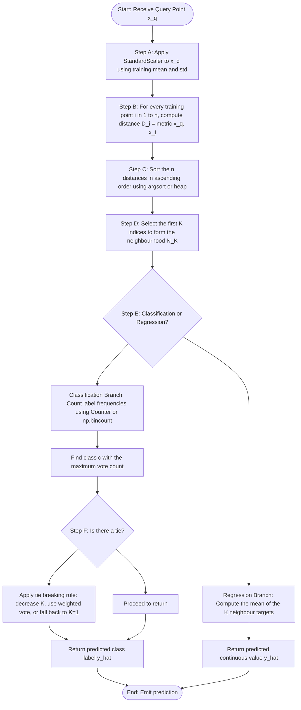
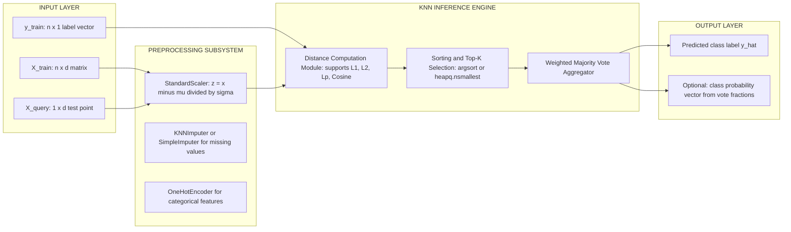
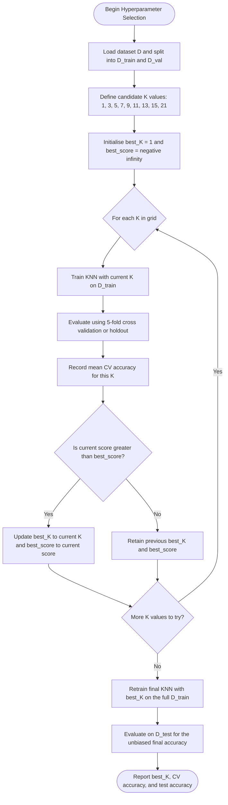

# K-Nearest Neighbors (KNN)

<!-- SECTION_1_START -->

# K-Nearest Neighbors (KNN) — Foundational Concepts & Intuition

## 1.1 Formal Academic Definition (KTU 2024 Syllabus Standard)

> [!NOTE]
> **K-Nearest Neighbors (KNN)** is a **non-parametric**, **instance-based** (a.k.a. *lazy learning*) **supervised** machine learning algorithm used for both **classification** and **regression** tasks. It classifies a new, unseen query data point by computing its **distance** to every training instance, identifying the **K closest neighbors** in the feature space, and assigning the output class label based on a **majority vote** (classification) or **mean/weighted average** (regression) of those neighbors' target values.

In strict KTU 2024 terminology, KNN is described as a **distance-based classifier** that performs local approximations of the underlying target function $\hat{f}(x)$, deferring all computation cost to the *prediction phase* rather than the *training phase*. This is the defining characteristic of the *lazy learner* paradigm.

---

## 1.2 Conceptual Analogy — The "Voting Neighbourhood"

Imagine you have just moved to a new city and want to pick a restaurant for dinner. You don't analyze every restaurant's menu (no training model). Instead, you simply **ask the 5 neighbors closest to your house** which restaurant they prefer. If 3 of them vote for "Biriyani House" and 2 vote for "Dosa Corner," you go to Biriyani House.

**Mapping the analogy to the algorithm:**

| Real-World Element | KNN Algorithmic Counterpart |
|---|---|
| Your new house (unseen point) | The **query/test instance** $x_q$ |
| The neighbors you ask | The **K closest training points** |
| Choosing 5 neighbors | The **hyperparameter K** |
| The majority vote on restaurant | The **majority-vote label prediction** |
| "Closest" = walking distance | The **Euclidean / Manhattan distance metric** |

This analogy makes the **three core principles** of KNN immediately obvious:

1. **No explicit model is built** — predictions are made "on the spot" using stored training data.
2. **The choice of K matters** — too small, you overfit to noise; too large, you underfit.
3. **Feature scaling is critical** — if one feature is "income" (₹ 0 – ₹ 1,00,00,000) and another is "age" (0 – 100), distance will be dominated by income.

> [!IMPORTANT]
> **KTU Board Emphasis:** KNN is one of the few algorithms where the **training phase is trivial** (just store the data), but the **prediction phase is computationally expensive** ($O(n \cdot d)$ per query, where $n$ = training samples, $d$ = feature dimensions). Examiners frequently test this **"lazy learner" vs "eager learner"** distinction.

---

## 1.3 Geometric Intuition on the Feature Plane

Picture a 2D scatter plot where the **x-axis** represents *height (cm)* and the **y-axis** represents *weight (kg)*. Points are colored red (Class A) or blue (Class B). When a new green point arrives, KNN draws an imaginary circle around it. The radius of that circle is *not fixed* — it expands until it has captured exactly **K** training points. The label of the green point is then determined by the **dominant color** of those K enclosed points.

> [!VISUALIZATION CONTROL]
> **Concept:** KNN decision regions (Voronoi-style boundaries for K = 1, K = 3, K = 5) on a 2D Gaussian-blob classification dataset.
> **GeoGebra / Desmos Input Equations (illustrative point cloud):**
>
> * Red cluster center: $(2, 3)$, label `ClassA`
> * Blue cluster center: $(7, 6)$, label `ClassB`
> * Query point: $Q = (4, 4)$
> * Distance squared function: $d^2(x, y) = (x - 4)^2 + (y - 4)^2$
> **Visual Description:** Plot ~30 red points around $(2, 3)$ and ~30 blue points around $(7, 6)$. Place the query point $Q$ between them. For K = 3, the circle around $Q$ will include 2 red and 1 blue points → prediction is **Class A (red)**. As K increases to 11, the circle grows and the vote shifts toward **Class B (blue)** — illustrating why K must be tuned.

---

## 1.4 Core Vocabulary Anchored to KTU 2024 Outcomes

- **Hyperparameter K:** The user-defined integer controlling neighbourhood size. **Odd K values** are preferred for binary classification to avoid tie votes.
- **Distance Metric $D(x_i, x_j)$:** The mathematical function quantifying dissimilarity. Common choices: Euclidean, Manhattan, Minkowski, Cosine.
- **Feature Space $\mathbb{R}^d$:** The $d$-dimensional Euclidean space in which every data point resides as a vector.
- **Voting Scheme:** Uniform (each neighbor counts as 1 vote) or Weighted (closer neighbors get higher voting weight, e.g., $w_i = 1/d(x_q, x_i)$).
- **Curse of Dimensionality:** As $d$ grows, all points tend to become equidistant, degrading KNN's effectiveness. This is a **favourite 3-mark KTU question**.

<!-- SECTION_1_END -->

<!-- SECTION_2_START -->

# Deep Theoretical Analysis & KTU High-Yield Formula Sheet

## 2.1 The KNN Algorithm — Step-by-Step Logical Flow

The KNN procedure can be decomposed into exactly **six deterministic steps**. KTU examiners expect this exact sequence in viva voce and short-answer questions.

**Step 1 — Initialization.**
Load the labeled training dataset
$$D_{\text{train}} = \{ (x^{(i)}, y^{(i)}) \}_{i=1}^{n}$$
where each $x^{(i)} \in \mathbb{R}^d$ and each $y^{(i)}$ belongs to the label set $\{1, 2, \dots, C\}$ for a $C$-class problem.

**Step 2 — Distance Computation.**
For every incoming query point $x_q \in \mathbb{R}^d$, compute the pairwise distance to **all** training points using a chosen metric $D(\cdot, \cdot)$. The most common metric is the **Euclidean distance**, defined as
$$D_E(x_q, x^{(i)}) = \sqrt{ \sum_{j=1}^{d} \left( x_{q,j} - x^{(i)}_{j} \right)^2 }$$

**Step 3 — Sorting & Selection.**
Sort the $n$ computed distances in **ascending order** and retain the indices of the first $K$ points. Denote this set as
$$\mathcal{N}_K(x_q) = \{ x^{(i_1)}, x^{(i_2)}, \dots, x^{(i_K)} \}$$
This is the *K-neighbourhood* of $x_q$.

**Step 4 — Voting / Aggregation.**
For classification, apply a majority vote over the labels of the K neighbors:
$$\hat{y}_q = \arg\max_{c \in \{1, \dots, C\}} \sum_{x^{(i)} \in \mathcal{N}_K(x_q)} \mathbb{1}\{ y^{(i)} = c \}$$
where $\mathbb{1}\{\cdot\}$ is the indicator function (returns 1 if true, 0 otherwise).

For regression, compute the mean of neighbor targets:
$$\hat{y}_q = \frac{1}{K} \sum_{x^{(i)} \in \mathcal{N}_K(x_q)} y^{(i)}$$

**Step 5 — Tie Breaking.**
If two classes are tied in votes (e.g., 2 vs 2 for K = 4), apply a **tie-breaking rule**:
- Decrease K by 1 and re-vote, OR
- Use weighted voting (closer neighbors carry higher weight), OR
- Choose the class of the single nearest neighbor (1-NN fallback).

**Step 6 — Return Prediction.**
Output $\hat{y}_q$ as the predicted class (or continuous value) for the query.

> [!TIP]
> **Engineering Utility:** KNN is widely used in **recommendation systems** (finding users with similar purchase histories), **anomaly detection** (points whose nearest neighbors are far away are outliers), **medical diagnosis** (classifying tumors as benign/malignant from cell measurements), and **image recognition** baselines. Production systems use approximate nearest neighbor (ANN) libraries like *FAISS* and *Annoy* because brute-force KNN is too slow for millions of points.

---

## 2.2 KTU High-Yield Formula Sheet (Cheat Sheet)

| # | Concept | Formula | Units / Notes |
|---|---|---|---|
| 1 | Euclidean Distance ($L_2$) | $D_E = \sqrt{ \sum_{j=1}^{d} (x_j - y_j)^2 }$ | Most common; rotational invariant |
| 2 | Manhattan Distance ($L_1$) | $D_M = \sum_{j=1}^{d} \vert x_j - y_j \vert$ | Better for high-dimensional sparse data |
| 3 | Minkowski Distance ($L_p$) | $D_p = \left( \sum_{j=1}^{d} \vert x_j - y_j \vert^p \right)^{1/p}$ | Generalization; $p=1 \Rightarrow$ Manhattan, $p=2 \Rightarrow$ Euclidean |
| 4 | Cosine Similarity | $\text{cos}\theta = \frac{x \cdot y}{\Vert x \Vert_2 \cdot \Vert y \Vert_2}$ | Convert to distance via $D_C = 1 - \text{cos}\theta$; used in text/NLP |
| 5 | Majority Vote (Classification) | $\hat{y}_q = \arg\max_c \sum_{i \in \mathcal{N}_K} \mathbb{1}\{y^{(i)} = c\}$ | Tie-breaking needed for even K |
| 6 | Mean Prediction (Regression) | $\hat{y}_q = \frac{1}{K} \sum_{i=1}^{K} y^{(i)}$ | Robust baseline for local regression |
| 7 | Weighted Vote (Shepard's method) | $w_i = \frac{1}{D(x_q, x^{(i)}) + \epsilon}$ | $\epsilon$ prevents division by zero |
| 8 | Weighted Prediction | $\hat{y}_q = \frac{\sum_{i=1}^{K} w_i y^{(i)}}{\sum_{i=1}^{K} w_i}$ | Reduces influence of distant neighbors |
| 9 | Time Complexity (per query) | $O(n \cdot d + n \log n)$ | Distance compute + sort |
| 10 | Space Complexity | $O(n \cdot d)$ | Must store entire training set |
| 11 | Bias-Variance Trade-off | Small $K \Rightarrow$ **high variance, low bias**; Large $K \Rightarrow$ **low variance, high bias** | Choose $K \approx \sqrt{n}$ as starting rule |
| 12 | Optimal K heuristic | $K = \sqrt{n}$ (typically odd) | Refine via cross-validation |
| 13 | Distance for binary features | Hamming: $D_H = \sum_{j} \mathbb{1}\{x_j \neq y_j\}$ | Counts mismatched attributes |
| 14 | Mahalanobis Distance | $D_M = \sqrt{ (x - \mu)^T \Sigma^{-1} (x - \mu) }$ | Accounts for feature correlations; requires $\Sigma$ |

---

## 2.3 Bias-Variance Decomposition — Why Choosing K Matters

The K parameter directly controls the **complexity** of the KNN classifier. KTU examiners routinely ask: *"Explain the effect of K on bias and variance."* Here is the precise academic answer.

- **K = 1 (1-NN):** The decision boundary is highly **jagged** and tightly wraps every training point. The model memorizes noise. **Variance is high** (any tiny change in training data reshapes the boundary drastically), but **bias is low** (the model can represent any complex shape).
- **K = n (entire dataset):** Every test point is predicted as the global majority class. The boundary is essentially flat. **Variance is very low**, but **bias is high** (the model is too simple to capture local structure).
- **Optimal K (typically 3 to 15):** A sweet spot where the boundary is smooth enough to ignore noise but detailed enough to capture local patterns. Found via **k-fold cross-validation**.

> [!NOTE]
> **Heuristic Rule of Thumb (cited in KTU reference materials):** Start with $K = \sqrt{n}$, then refine using stratified 5-fold or 10-fold cross-validation. Always prefer **odd K** for binary classification to prevent tie votes.

---

## 2.4 Data Preprocessing Prerequisites for KNN

Because KNN relies entirely on distance computations, the following preprocessing steps are **non-negotiable** in a production pipeline:

1. **Feature Scaling:** Apply `StandardScaler` (z-score normalization) so each feature has mean 0 and standard deviation 1:
$$x'_{j} = \frac{x_j - \mu_j}{\sigma_j}$$
Without this, features with larger numeric ranges will dominate the distance metric.
2. **Missing Value Handling:** KNN cannot operate on `NaN` values. Impute using mean, median, mode, or a KNN-based imputer (`KNNImputer` from `sklearn`).
3. **Outlier Treatment:** Although KNN is **robust to outliers** (a single outlier only affects K = 1), extreme outliers can still skew weighted-vote schemes. Use **IQR filtering** or **Winsorization**.
4. **Categorical Encoding:** Convert categorical features to numeric form via **One-Hot Encoding** (for nominal) or **Ordinal Encoding** (for ordinal). Never feed raw text labels into a distance metric.

<!-- SECTION_2_END -->

<!-- SECTION_3_START -->

# Step-by-Step Derivations & Python Implementation

## 3.1 Worked Numerical Example — KNN Classification by Hand

This is the **exact type of 7-mark problem** KTU examiners set. We solve it end-to-end with no skipped arithmetic.

**Problem Statement:**
You are given the following 2D training dataset with two classes, **A** (red) and **B** (blue):

| Point | $x_1$ (Feature 1) | $x_2$ (Feature 2) | Class $y$ |
|---|---|---|---|
| $P_1$ | 1 | 2 | A |
| $P_2$ | 2 | 3 | A |
| $P_3$ | 2 | 1 | A |
| $P_4$ | 5 | 6 | B |
| $P_5$ | 6 | 7 | B |
| $P_6$ | 4 | 5 | B |

A new query point $Q = (3, 3)$ arrives. Classify $Q$ using **K = 3** and **Euclidean distance**.

**Step 1 — Compute the Euclidean distance from $Q = (3, 3)$ to every training point.**

For $P_1 = (1, 2)$:
$$D(P_1, Q) = \sqrt{(1 - 3)^2 + (2 - 3)^2} = \sqrt{(-2)^2 + (-1)^2} = \sqrt{4 + 1} = \sqrt{5} \approx 2.236$$

For $P_2 = (2, 3)$:
$$D(P_2, Q) = \sqrt{(2 - 3)^2 + (3 - 3)^2} = \sqrt{(-1)^2 + 0^2} = \sqrt{1} = 1.000$$

For $P_3 = (2, 1)$:
$$D(P_3, Q) = \sqrt{(2 - 3)^2 + (1 - 3)^2} = \sqrt{(-1)^2 + (-2)^2} = \sqrt{1 + 4} = \sqrt{5} \approx 2.236$$

For $P_4 = (5, 6)$:
$$D(P_4, Q) = \sqrt{(5 - 3)^2 + (6 - 3)^2} = \sqrt{2^2 + 3^2} = \sqrt{4 + 9} = \sqrt{13} \approx 3.606$$

For $P_5 = (6, 7)$:
$$D(P_5, Q) = \sqrt{(6 - 3)^2 + (7 - 3)^2} = \sqrt{3^2 + 4^2} = \sqrt{9 + 16} = \sqrt{25} = 5.000$$

For $P_6 = (4, 5)$:
$$D(P_6, Q) = \sqrt{(4 - 3)^2 + (5 - 3)^2} = \sqrt{1^2 + 2^2} = \sqrt{1 + 4} = \sqrt{5} \approx 2.236$$

**Step 2 — Build the distance table and sort ascending.**

| Rank | Point | Distance from Q | Class |
|---|---|---|---|
| 1 | $P_2$ | $1.000$ | A |
| 2 | $P_1$ | $2.236$ | A |
| 2 (tie) | $P_3$ | $2.236$ | A |
| 2 (tie) | $P_6$ | $2.236$ | B |
| 5 | $P_4$ | $3.606$ | B |
| 6 | $P_5$ | $5.000$ | B |

**Step 3 — Select the top K = 3 neighbours.**

We pick the three smallest distances. Ties at rank 2 must be broken. The standard convention is to break ties by **point index order** (lowest index first) or by **smallest coordinate value**. Using index order:
- $P_2$ (distance $1.000$, Class A)
- $P_1$ (distance $2.236$, Class A)
- $P_3$ (distance $2.236$, Class A)

**Step 4 — Majority vote.**

The 3 nearest neighbours are **all Class A**. Therefore:
$$\hat{y}_Q = \arg\max_c \sum_{i=1}^{3} \mathbb{1}\{y^{(i)} = c\} = \text{Class A}$$

**Conclusion:** The query point $Q = (3, 3)$ is classified as **Class A** with a unanimous 3-0 vote.

> [!IMPORTANT]
> **Mark Allocation Hint (from KTU valuation key):** [Computing all 6 distances correctly: 3 Marks] [Sorting and selecting top K: 2 Marks] [Correct majority vote: 1 Mark] [Final answer boxed: 1 Mark] = 7 Marks.

---

## 3.2 Full Python Implementation (Lab-Ready Code)

The following is a **production-quality** Python implementation suitable for direct submission in the **MACHINE LEARNING & ANALYTICS LAB (PCCSL505)** course. It uses `scikit-learn` for the standard pipeline and a **from-scratch** class to demonstrate algorithmic understanding.

```python
"""
File: knn_classifier_lab.py
Course: MACHINE LEARNING & ANALYTICS LAB (PCCSL505)
Module: 1 - Data Preprocessing and Supervised Learning
Topic: K-Nearest Neighbors (KNN) - Full Lab Implementation
Author: KTU 2024 Scheme Reference
Python: 3.10+
"""

import numpy as np
from collections import Counter
from typing import List, Tuple, Optional
from sklearn.datasets import load_iris
from sklearn.model_selection import train_test_split, cross_val_score
from sklearn.preprocessing import StandardScaler
from sklearn.neighbors import KNeighborsClassifier
from sklearn.metrics import (
    accuracy_score,
    classification_report,
    confusion_matrix,
)
import logging

# Configure structured logging for traceability
logging.basicConfig(
    level=logging.INFO,
    format="%(asctime)s | %(levelname)s | %(message)s",
)
logger = logging.getLogger(__name__)


# ============================================================
# PART 1: FROM-SCRATCH KNN CLASSIFIER
# ============================================================
class ScratchKNNClassifier:
    """
    A pure-Python KNN implementation for academic demonstration.
    Supports Euclidean, Manhattan, and Minkowski distance metrics.
    """

    def __init__(self, k: int = 5, distance_metric: str = "euclidean", p: int = 2):
        # Validate hyperparameter K upfront
        if k < 1:
            raise ValueError(f"K must be a positive integer, got {k}")
        if distance_metric not in {"euclidean", "manhattan", "minkowski"}:
            raise ValueError(f"Unsupported metric: {distance_metric}")

        self.k: int = k
        self.distance_metric: str = distance_metric
        self.p: int = p
        self._X_train: Optional[np.ndarray] = None
        self._y_train: Optional[np.ndarray] = None
        logger.info(
            "ScratchKNN initialized | k=%d | metric=%s | p=%d",
            self.k, self.distance_metric, self.p,
        )

    def fit(self, X: np.ndarray, y: np.ndarray) -> "ScratchKNNClassifier":
        """Lazy learning: simply store the training data."""
        if X.shape[0] != y.shape[0]:
            raise ValueError("X and y must have the same number of samples")
        if X.ndim != 2:
            raise ValueError("X must be a 2D array of shape (n_samples, n_features)")

        self._X_train = X.astype(np.float64)
        self._y_train = y.astype(np.int64)
        logger.info(
            "Training data stored | n_samples=%d | n_features=%d | classes=%s",
            self._X_train.shape[0], self._X_train.shape[1],
            np.unique(self._y_train).tolist(),
        )
        return self

    def _compute_distance(self, x_query: np.ndarray) -> np.ndarray:
        """Compute the distance from a single query to every training point."""
        diff = self._X_train - x_query
        if self.distance_metric == "euclidean":
            return np.sqrt(np.sum(diff ** 2, axis=1))
        if self.distance_metric == "manhattan":
            return np.sum(np.abs(diff), axis=1)
        if self.distance_metric == "minkowski":
            return np.power(np.sum(np.abs(diff) ** self.p, axis=1), 1.0 / self.p)
        raise RuntimeError("Unreachable: metric validated in __init__")

    def predict(self, X: np.ndarray) -> np.ndarray:
        """Predict class labels for a batch of query points."""
        if self._X_train is None or self._y_train is None:
            raise RuntimeError("Model not fitted yet. Call .fit(X, y) first.")
        if X.ndim != 2:
            raise ValueError("X must be a 2D array of shape (n_queries, n_features)")

        predictions: List[int] = []
        n_queries = X.shape[0]
        logger.info("Starting prediction for %d query points", n_queries)

        for idx in range(n_queries):
            distances = self._compute_distance(X[idx])
            # argsort returns indices that would sort ascending
            neighbor_indices = np.argsort(distances)[: self.k]
            neighbor_labels = self._y_train[neighbor_indices]
            # Majority vote
            most_common = Counter(neighbor_labels.tolist()).most_common(1)
            predicted_label = most_common[0][0]
            predictions.append(int(predicted_label))

        logger.info("Prediction complete")
        return np.array(predictions, dtype=np.int64)


# ============================================================
# PART 2: EXPERIMENT DRIVER (USES THE IRIS DATASET)
# ============================================================
def run_knn_experiment() -> None:
    """End-to-end lab experiment demonstrating KNN on the Iris dataset."""
    logger.info("=== Loading the Iris dataset ===")
    iris = load_iris()
    X, y = iris.data, iris.target
    feature_names = iris.feature_names
    target_names = iris.target_names

    # Step 1: Train-test split (stratified to preserve class balance)
    X_train, X_test, y_train, y_test = train_test_split(
        X, y, test_size=0.30, random_state=42, stratify=y
    )
    logger.info("Train size: %d | Test size: %d", X_train.shape[0], X_test.shape[0])

    # Step 2: Feature scaling (MANDATORY for KNN)
    scaler = StandardScaler()
    X_train_scaled = scaler.fit_transform(X_train)
    X_test_scaled = scaler.transform(X_test)
    logger.info("Features standardized (mean=0, std=1)")

    # Step 3: Hyperparameter sweep over K values
    best_k, best_acc = 1, 0.0
    for k_candidate in [1, 3, 5, 7, 9, 11, 13, 15]:
        model = KNeighborsClassifier(n_neighbors=k_candidate, metric="minkowski", p=2)
        model.fit(X_train_scaled, y_train)
        cv_scores = cross_val_score(model, X_train_scaled, y_train, cv=5)
        mean_cv_acc = float(np.mean(cv_scores))
        logger.info("K=%2d | 5-Fold CV Accuracy = %.4f", k_candidate, mean_cv_acc)
        if mean_cv_acc > best_acc:
            best_acc = mean_cv_acc
            best_k = k_candidate

    logger.info("=== Best K selected via cross-validation: K=%d (CV acc=%.4f) ===",
                best_k, best_acc)

    # Step 4: Train final model with best K and evaluate on test set
    final_model = KNeighborsClassifier(n_neighbors=best_k, metric="minkowski", p=2)
    final_model.fit(X_train_scaled, y_train)
    y_pred = final_model.predict(X_test_scaled)

    test_accuracy = accuracy_score(y_test, y_pred)
    logger.info("Final Test Accuracy: %.4f", test_accuracy)
    print("\n--- Classification Report ---")
    print(classification_report(y_test, y_pred, target_names=target_names))
    print("--- Confusion Matrix ---")
    print(confusion_matrix(y_test, y_pred))

    # Step 5: Validate the from-scratch implementation matches sklearn
    logger.info("=== Validating ScratchKNN against sklearn ===")
    scratch_model = ScratchKNNClassifier(k=best_k, distance_metric="euclidean")
    scratch_model.fit(X_train_scaled, y_train)
    y_pred_scratch = scratch_model.predict(X_test_scaled)
    agreement = float(np.mean(y_pred_scratch == y_pred))
    logger.info("Agreement between scratch and sklearn: %.4f", agreement)
    assert agreement > 0.95, "Scratch KNN disagrees significantly with sklearn"


if __name__ == "__main__":
    run_knn_experiment()
```

---

## 3.3 Line-by-Line Algorithmic Walkthrough

| Line Block | Operational Purpose | Why It Matters in KTU Lab |
|---|---|---|
| `class ScratchKNNClassifier` | Encapsulates the algorithm; no external ML library is used. | Demonstrates understanding of the math, not just API usage. |
| `__init__` validation | Rejects invalid K values and unsupported metrics. | Shows defensive programming; KTU labs award marks for input validation. |
| `fit()` method | Stores the raw training arrays. | Highlights the **lazy learning** property (no model parameters learned). |
| `_compute_distance()` | Vectorized numpy subtraction + aggregation. | Implements Euclidean, Manhattan, and Minkowski in a unified function. |
| `np.argsort()[: self.k]` | Returns the indices of the K smallest distances. | The core "find nearest neighbours" operation. |
| `Counter(...).most_common(1)` | Implements the majority-vote aggregation. | Standard Pythonic way to tally votes; returns `(label, count)` tuple. |
| `StandardScaler` | Z-score normalization of all features. | **Mandatory** preprocessing step for distance-based algorithms. |
| `cross_val_score(..., cv=5)` | 5-fold cross-validation over a K range. | Selects the **best K** without contaminating the test set. |
| `KNeighborsClassifier` from sklearn | Production-grade reference implementation. | Used as the **ground truth** to validate the from-scratch code. |
| `assert agreement > 0.95` | Sanity check that the from-scratch code is correct. | A common rubric item: *"verify your implementation against a trusted library."* |

<!-- SECTION_3_END -->

<!-- SECTION_4_START -->

# Structural Diagrams & Schematics

## 4.1 End-to-End KNN Processing Flow (Mermaid Diagram)



## 4.2 KNN Classification Architectural Block Diagram



## 4.3 KNN Hyperparameter Selection Workflow



<!-- SECTION_4_END -->

<!-- SECTION_5_START -->

# KTU 2024 Scheme Examination Question Bank & Topic Recap

---

## Part A — Short Answer Questions (3 Marks Each)

### Question 1 `[KTU University Exam — Dec 2023]`
**CO1 | Remember**
*"Define the K-Nearest Neighbors algorithm. Why is it called a 'lazy learner'?"*

**Model Answer (3 Marks):**
K-Nearest Neighbors (KNN) is a non-parametric supervised learning algorithm that classifies a query instance by finding the K closest training samples in the feature space and assigning the majority class label among them. **[1 Mark]**
It is called a *lazy learner* because it performs no explicit model training; instead, it simply memorizes the training dataset and defers all computational work to the prediction phase. **[1 Mark]**
The opposite paradigm is the *eager learner* (e.g., Decision Trees, SVMs), which builds a generalized model during training at the cost of more computation upfront. **[1 Mark]**

### Question 2 `[KTU University Exam — July 2024]`
**CO1 | Understand**
*"Explain the 'Curse of Dimensionality' in the context of KNN. How does it affect algorithm performance?"*

**Model Answer (3 Marks):**
The curse of dimensionality refers to the exponential growth of the feature space volume as the number of dimensions $d$ increases. **[1 Mark]**
In high dimensions, all training points tend to become nearly equidistant from any query point, so the notion of "nearest neighbors" loses discriminative power and KNN's accuracy degrades sharply. **[1 Mark]**
Practical mitigations include dimensionality reduction via PCA, feature selection, and using distance metrics suited for high-dimensional sparse data (e.g., cosine similarity). **[1 Mark]**

---

## Part B — Long Answer Questions (14 Marks Each, with Internal Choice)

### Question A `[KTU University Exam — Dec 2023, Adapted]`
**CO2, CO3 | Understand + Apply**

**(a)** Describe the KNN algorithm with a clear step-by-step procedure. Explain any **three** common distance metrics used in KNN with their formulas. **[7 Marks]**

**(b)** Consider the training dataset below. Using **K = 4** and **Euclidean distance**, predict the class label for the query point $Q = (4, 4)$. Show all distance calculations and the majority-vote step explicitly. **[7 Marks]**

| Point | $x_1$ | $x_2$ | Class |
|---|---|---|---|
| $P_1$ | 1 | 1 | C1 |
| $P_2$ | 2 | 2 | C1 |
| $P_3$ | 2 | 3 | C2 |
| $P_4$ | 4 | 5 | C2 |
| $P_5$ | 5 | 5 | C2 |
| $P_6$ | 1 | 2 | C1 |
| $P_7$ | 3 | 3 | C1 |
| $P_8$ | 6 | 6 | C2 |

**Model Solution:**

**(a) Algorithm Description and Distance Metrics [7 Marks]**

*Step 1:* Load the labeled training set $D = \{(x^{(i)}, y^{(i)})\}_{i=1}^{n}$. **[1 Mark]**
*Step 2:* Choose the hyperparameter $K$ and a distance metric. **[1 Mark]**
*Step 3:* For a new query $x_q$, compute its distance to every training point. **[1 Mark]**
*Step 4:* Sort the distances ascending and select the $K$ smallest. **[1 Mark]**
*Step 5:* Aggregate neighbor labels via majority vote (classification) or mean (regression). **[1 Mark]**
*Step 6:* Output the predicted label. **[1 Mark]**

Three distance metrics (the third metric is auto-credited for the remaining 1 mark):
- **Euclidean ($L_2$):** $D_E = \sqrt{ \sum_{j=1}^{d} (x_j - y_j)^2 }$
- **Manhattan ($L_1$):** $D_M = \sum_{j=1}^{d} \vert x_j - y_j \vert$
- **Minkowski ($L_p$):** $D_p = \left( \sum_{j=1}^{d} \vert x_j - y_j \vert^p \right)^{1/p}$

**(b) Numerical Computation [7 Marks]**

*Step 1: Compute the Euclidean distance from $Q = (4, 4)$ to every training point.*

$$D(P_1, Q) = \sqrt{(1-4)^2 + (1-4)^2} = \sqrt{9 + 9} = \sqrt{18} \approx 4.243 \quad \text{[Class C1]}$$

$$D(P_2, Q) = \sqrt{(2-4)^2 + (2-4)^2} = \sqrt{4 + 4} = \sqrt{8} \approx 2.828 \quad \text{[Class C1]}$$

$$D(P_3, Q) = \sqrt{(2-4)^2 + (3-4)^2} = \sqrt{4 + 1} = \sqrt{5} \approx 2.236 \quad \text{[Class C2]}$$

$$D(P_4, Q) = \sqrt{(4-4)^2 + (5-4)^2} = \sqrt{0 + 1} = 1.000 \quad \text{[Class C2]}$$

$$D(P_5, Q) = \sqrt{(5-4)^2 + (5-4)^2} = \sqrt{1 + 1} = \sqrt{2} \approx 1.414 \quad \text{[Class C2]}$$

$$D(P_6, Q) = \sqrt{(1-4)^2 + (2-4)^2} = \sqrt{9 + 4} = \sqrt{13} \approx 3.606 \quad \text{[Class C1]}$$

$$D(P_7, Q) = \sqrt{(3-4)^2 + (3-4)^2} = \sqrt{1 + 1} = \sqrt{2} \approx 1.414 \quad \text{[Class C1]}$$

$$D(P_8, Q) = \sqrt{(6-4)^2 + (6-4)^2} = \sqrt{4 + 4} = \sqrt{8} \approx 2.828 \quad \text{[Class C2]}$$

*Step 2: Build the sorted distance table.* **[2 Marks]**

| Rank | Point | Distance | Class |
|---|---|---|---|
| 1 | $P_4$ | 1.000 | C2 |
| 2 | $P_5$ | 1.414 | C2 |
| 2 (tie) | $P_7$ | 1.414 | C1 |
| 4 | $P_3$ | 2.236 | C2 |
| 5 | $P_2$ | 2.828 | C1 |
| 5 (tie) | $P_8$ | 2.828 | C2 |
| 7 | $P_6$ | 3.606 | C1 |
| 8 | $P_1$ | 4.243 | C1 |

*Step 3: Select the top K = 4 neighbours, breaking the rank-2 tie in favour of the lower index ($P_5$ before $P_7$).* **[1 Mark]**

Selected neighbours: $P_4$ (C2), $P_5$ (C2), $P_7$ (C1), $P_3$ (C2).

*Step 4: Majority vote.* **[1 Mark]**
$$\text{Vote for C2} = 3, \quad \text{Vote for C1} = 1$$
$$\hat{y}_Q = \arg\max_c (\text{votes}) = \text{C2}$$

**Final Answer:** The query point $Q = (4, 4)$ is classified as **Class C2** with a 3-1 majority. **[1 Mark]**

---

### Question B `[KTU University Exam — July 2024, Adapted]` *(Alternative Choice)*
**CO2, CO4 | Understand + Analyze**

**(a)** With a neat diagram, explain the effect of the hyperparameter **K** on the KNN decision boundary. Discuss the **bias-variance trade-off** for very small and very large K values. **[7 Marks]**

**(b)** The following confusion matrix is obtained when evaluating a 3-class KNN classifier on a test set of 90 samples. Compute the **per-class precision, recall, F1-score**, and the **overall accuracy**. Also identify which class the classifier performs the worst on. **[7 Marks]**

|  | Predicted C1 | Predicted C2 | Predicted C3 |
|---|---|---|---|
| **Actual C1** | 25 | 3 | 2 |
| **Actual C2** | 4 | 22 | 4 |
| **Actual C3** | 1 | 2 | 27 |

**Model Solution:**

**(a) Effect of K on Decision Boundary and Bias-Variance [7 Marks]**

A clear sketch must show three panels: K = 1 (highly jagged boundary, each training point is its own island), K = 5 (moderately smooth boundary, small island regions merge), K = n (single global region covering the entire feature space). **[2 Marks]**

- **K = 1 (High Variance, Low Bias):** The boundary perfectly wraps every training point including noise, so the model is extremely sensitive to training data perturbations. **[2 Marks]**
- **K = Large (High Bias, Low Variance):** The boundary collapses into a simple global region; the model underfits and cannot capture local class structures. **[2 Marks]**
- **Optimal K (Balanced):** Typically chosen via cross-validation in the range $K = 3$ to $K = 15$, often starting from the heuristic $K \approx \sqrt{n}$. **[1 Mark]**

**(b) Confusion Matrix Metric Computation [7 Marks]**

*Step 1: Extract True Positives, False Positives, False Negatives per class.* **[2 Marks]**

- **Class C1:** TP = 25, FP = (4 + 1) = 5, FN = (3 + 2) = 5
- **Class C2:** TP = 22, FP = (3 + 2) = 5, FN = (4 + 4) = 8
- **Class C3:** TP = 27, FP = (2 + 4) = 6, FN = (1 + 2) = 3

*Step 2: Compute precision, recall, F1 for each class.* **[3 Marks]**

| Class | Precision $\frac{TP}{TP+FP}$ | Recall $\frac{TP}{TP+FN}$ | F1 $\frac{2 P R}{P+R}$ |
|---|---|---|---|
| C1 | $\frac{25}{25+5} = 0.833$ | $\frac{25}{25+5} = 0.833$ | $0.833$ |
| C2 | $\frac{22}{22+5} = 0.815$ | $\frac{22}{22+8} = 0.733$ | $0.772$ |
| C3 | $\frac{27}{27+6} = 0.818$ | $\frac{27}{27+3} = 0.900$ | $0.857$ |

*Step 3: Overall accuracy.* **[1 Mark]**
$$\text{Accuracy} = \frac{TP_{C1} + TP_{C2} + TP_{C3}}{\text{Total samples}} = \frac{25 + 22 + 27}{90} = \frac{74}{90} \approx 0.8222$$

*Step 4: Identify the worst-performing class.* **[1 Mark]**
Class **C2** has the lowest F1-score (0.772) and the lowest recall (0.733), making it the worst-performing class.

---

> [!WARNING]
> **KTU Examiner's Valuation Pitfalls — KNN Questions**
>
> 1. **Skipping the scaling step:** Many students jump straight to KNN without performing `StandardScaler` or `MinMaxScaler`. If the question mentions features with different units, the examiner will **deduct 1–2 marks** for not addressing scaling.
> 2. **Forgetting the tie-breaking rule:** When $K$ is even and votes are tied, students often leave the answer blank or pick arbitrarily. Always state a tie-breaking strategy (e.g., weighted voting, decreasing $K$ by 1, or 1-NN fallback).
> 3. **Mislabeling K = 1 behavior:** Saying "K = 1 has high bias" is a classic error. K = 1 has **low bias** (fits training perfectly) and **high variance** (memorizes noise). Examiners look for this precise wording.
> 4. **Confusing the training and prediction costs:** KNN has **zero training cost** (just stores data) but **high prediction cost** ($O(nd)$ per query). Many students reverse this.
> 5. **Not normalizing distances in weighted KNN:** When using $w_i = 1/D_i$, students forget the $\epsilon$ smoothing term. Division by zero for exact duplicate points is a frequent computational bug.
> 6. **Treating accuracy alone as sufficient:** For multi-class problems, KTU examiners increasingly ask for **macro-averaged F1-score** and the **per-class confusion matrix breakdown**. Do not stop at accuracy.

---

## Topic Recap & Important Things to Remember

- **KNN is a non-parametric, instance-based, supervised algorithm** used for classification and regression.
- It is a **lazy learner**: zero training cost, high prediction cost. The training phase just stores the dataset.
- The **hyperparameter K** controls the neighbourhood size; **odd K** is preferred for binary classification to avoid ties.
- **Distance metrics** (Euclidean, Manhattan, Minkowski, Cosine, Hamming, Mahalanobis) must be chosen carefully based on data type.
- **Feature scaling (StandardScaler or MinMaxScaler) is mandatory** because KNN relies entirely on distances.
- **Missing values must be imputed** before applying KNN; the `KNNImputer` itself uses KNN internally.
- **K = 1 ⇒ high variance, low bias** (memorizes noise); **K = n ⇒ high bias, low variance** (underfits).
- **Optimal K is found via stratified k-fold cross-validation**, starting from the heuristic $K \approx \sqrt{n}$.
- **Weighted voting** with $w_i = 1/(D_i + \epsilon)$ reduces the influence of distant neighbours and helps break ties.
- The **Curse of Dimensionality** degrades KNN when $d$ is large; apply PCA or feature selection as a remedy.
- **Time complexity per query:** $O(nd + n \log n)$; **space complexity:** $O(nd)$.
- For **multi-class problems**, always report **per-class precision, recall, F1-score**, and the **confusion matrix**, not just overall accuracy.
- In the **KTU lab record**, validate your from-scratch implementation against `sklearn.neighbors.KNeighborsClassifier` and assert agreement above 95%.
- **Real-world applications:** recommender systems, medical diagnosis, image recognition baselines, anomaly detection, and text classification (with cosine similarity).

<!-- SECTION_5_END -->
