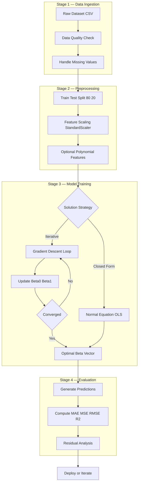
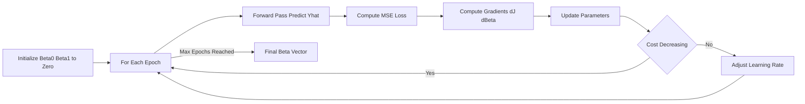
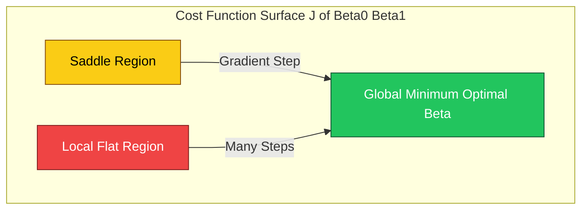
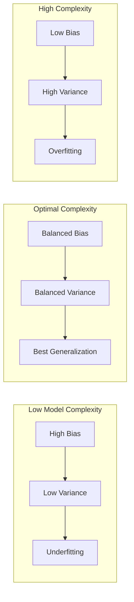

# Linear Regression

<!-- SECTION_1_START -->
# Linear Regression — Foundational Definition & Intuitive Overview

## 1.1 Formal Academic Definition (KTU 2024 Syllabus Terminology)

> [!IMPORTANT]
> **Linear Regression** is a **supervised machine learning** algorithm belonging to the family of **regression models** that models the relationship between a scalar dependent (target) variable $Y$ and one or more explanatory (feature) variables $X$ by fitting a linear equation to the observed data. The objective is to learn a mapping function $f: \mathbb{R}^{d} \rightarrow \mathbb{R}$ such that the predicted output $\hat{Y}$ minimizes the residual sum of squares between the observed and predicted targets.

Mathematically, for a single feature, the **Simple Linear Regression (SLR)** hypothesis is expressed as:

$$\hat{Y}_{i} = \beta_{0} + \beta_{1} X_{i} + \varepsilon_{i}$$

For $d$ features, **Multiple Linear Regression (MLR)** generalizes to:

$$\hat{Y}_{i} = \beta_{0} + \beta_{1} X_{1} + \beta_{2} X_{2} + \dots + \beta_{d} X_{d} + \varepsilon_{i}$$

where $\beta_{0}$ is the **intercept** (bias term), $\beta_{j}$ for $j \in \{1, \dots, d\}$ are the **regression coefficients** (weights), and $\varepsilon_{i}$ is the **error term** (residual / noise) assumed to be normally distributed with mean $\mathbf{0}$ and constant variance $\sigma^{2}$.

## 1.2 Conceptual Analogy & Geometric Intuition

> [!NOTE]
> **Real-World Analogy — "The Best-Fit Line Through a Scatter Cloud"**
> Imagine you are a real-estate analyst plotting house sizes (in $\text{ft}^{2}$) against their selling price (in lakhs ₹). The data points form a cloud scattered across the plane. **Linear Regression draws the single straight line that passes "as close as possible" to every point in the cloud.** Houses on this line represent the model's *prediction*; the vertical gap between an actual point and the line is the *error* the model makes for that house.

**Geometric Intuition** — The line is chosen so that the **squared vertical distances** from every observed point to the line are minimized. This is known as the **Ordinary Least Squares (OLS)** criterion. In higher dimensions, instead of a line, we fit a **hyperplane** through the data cloud.

## 1.3 Core Assumptions of the Linear Regression Model

> [!IMPORTANT]
> **The Four Pillars of Linear Regression (Gauss–Markov Assumptions)**
> 1. **Linearity** — The relationship between $X$ and $Y$ is linear in parameters.
> 2. **Independence** — Residuals $\varepsilon_{i}$ are statistically independent of one another.
> 3. **Homoscedasticity** — Constant variance of residuals: $\text{Var}(\varepsilon_{i}) = \sigma^{2}$ for all $i$.
> 4. **Normality** — Residuals are normally distributed: $\varepsilon_{i} \sim \mathcal{N}(0, \sigma^{2})$.

## 1.4 Visualization Control Block

> [!VISUALIZATION CONTROL]
> **Concept:** Best-Fit Line Through Scatter Plot
> **GeoGebra / Desmos Input Equations:**
> * `Data points: (1, 2.1), (2, 3.9), (3, 6.2), (4, 7.8), (5, 10.1), (6, 12.0), (7, 13.8), (8, 16.1)`
> * `Predicted line: f(x) = 2.0 * x + 0.05`
> * `Residual for x=3: r(3) = f(3) - 6.2`
> **Visual Description:** The student should observe a cloud of red dots (actual observations) overlaid by a thick blue line (regression line) passing through the center of mass of the cloud. Vertical dotted lines should represent the residuals — the objective is to make the **sum of the squared lengths** of these dotted lines as small as possible.

<!-- SECTION_1_END -->

<!-- SECTION_2_START -->
# Deep Theoretical Analysis & KTU High-Yield Formula Sheet

## 2.1 The Hypothesis Function — Step-by-Step Logic

The hypothesis $h_{\boldsymbol{\beta}}(X)$ represents the model's prediction. The reasoning chain is:

1. **Input ingestion** — Read the feature matrix $\mathbf{X} \in \mathbb{R}^{n \times d}$ where $n$ is the number of training samples.
2. **Parameter initialization** — Initialize weights $\boldsymbol{\beta} = (\beta_{0}, \beta_{1}, \dots, \beta_{d})$ either to zeros, small random values, or via Xavier initialization.
3. **Linear combination** — Compute the dot product $\mathbf{X} \boldsymbol{\beta}$ to obtain raw predictions.
4. **Output generation** — The hypothesis is the linear combination, since no non-linear activation is required for regression.

In **vectorized form** (with the bias trick of prepending a column of $1$s to $\mathbf{X}$):

$$h_{\boldsymbol{\beta}}(\mathbf{X}) = \mathbf{X} \boldsymbol{\beta}$$

## 2.2 The Cost Function — Mean Squared Error (MSE)

The cost function $J(\boldsymbol{\beta})$ quantifies how *wrong* the current parameter choices are:

$$J(\boldsymbol{\beta}) = \frac{1}{2n} \sum_{i=1}^{n} \left( h_{\boldsymbol{\beta}}(X_{i}) - Y_{i} \right)^{2}$$

> [!NOTE]
> **Why the factor $\frac{1}{2}$?** It is a mathematical convenience so that the derivative of the squared term cancels the factor of $2$, producing cleaner gradient expressions. The optimum parameter set is identical whether you use $\frac{1}{2n}$ or $\frac{1}{n}$ or $\frac{1}{2N}$ — only the scale changes.

In **matrix form**, this becomes:

$$J(\boldsymbol{\beta}) = \frac{1}{2n} \left( \mathbf{X} \boldsymbol{\beta} - \mathbf{Y} \right)^{\top} \left( \mathbf{X} \boldsymbol{\beta} - \mathbf{Y} \right)$$

## 2.3 Two Closed-Form / Iterative Solution Strategies

### Strategy A — The Normal Equation (Closed-Form, Analytical)

By setting $\nabla_{\boldsymbol{\beta}} J(\boldsymbol{\beta}) = \mathbf{0}$ and solving the resulting linear system:

$$\boldsymbol{\beta} = \left( \mathbf{X}^{\top} \mathbf{X} \right)^{-1} \mathbf{X}^{\top} \mathbf{Y}$$

> [!IMPORTANT]
> **Caveat:** The matrix $\mathbf{X}^{\top} \mathbf{X}$ must be **invertible**. If it is singular or near-singular (multicollinearity), use the **pseudoinverse** $\left( \mathbf{X}^{\top} \mathbf{X} \right)^{\dagger}$ or apply **Ridge Regularization**.

### Strategy B — Gradient Descent (Iterative, Scalable)

The update rule, applied **simultaneously** for every $\beta_{j}$:

$$\beta_{j} := \beta_{j} - \alpha \frac{\partial}{\partial \beta_{j}} J(\boldsymbol{\beta})$$

Computing the partial derivative for SLR:

$$\frac{\partial}{\partial \beta_{1}} J(\beta_{0}, \beta_{1}) = \frac{1}{n} \sum_{i=1}^{n} \left( h_{\boldsymbol{\beta}}(X_{i}) - Y_{i} \right) X_{i}$$

$$\frac{\partial}{\partial \beta_{0}} J(\beta_{0}, \beta_{1}) = \frac{1}{n} \sum_{i=1}^{n} \left( h_{\boldsymbol{\beta}}(X_{i}) - Y_{i} \right)$$

## 2.4 KTU Formula Sheet / Cheat Sheet

| **Symbol** | **Name** | **Formula / Definition** | **Dimensional Unit** |
|:-----------|:---------|:-------------------------|:---------------------|
| $\hat{Y}_{i}$ | Predicted value | $\beta_{0} + \beta_{1} X_{i}$ | Same as $Y$ |
| $J(\boldsymbol{\beta})$ | MSE Cost | $\frac{1}{2n} \sum ( \hat{Y}_{i} - Y_{i} )^{2}$ | $(\text{unit of } Y)^{2}$ |
| $\boldsymbol{\beta}_{\text{OLS}}$ | Normal Eq. | $(\mathbf{X}^{\top}\mathbf{X})^{-1}\mathbf{X}^{\top}\mathbf{Y}$ | — |
| $\nabla J$ | Gradient | $\frac{1}{n} \mathbf{X}^{\top}(\mathbf{X}\boldsymbol{\beta}-\mathbf{Y})$ | — |
| $\alpha$ | Learning rate | $10^{-3}$ to $10^{-1}$ (typical) | dimensionless |
| $\text{MAE}$ | Mean Abs. Error | $\frac{1}{n} \sum \mid y_{i}-\hat{y}_{i} \mid$ | same as $Y$ |
| $\text{MSE}$ | Mean Sq. Error | $\frac{1}{n} \sum (y_{i}-\hat{y}_{i})^{2}$ | $(Y)^{2}$ |
| $\text{RMSE}$ | Root MSE | $\sqrt{\text{MSE}}$ | same as $Y$ |
| $R^{2}$ | Coef. of Det. | $1 - \frac{\text{SS}_{\text{res}}}{\text{SS}_{\text{tot}}}$ | dimensionless $\in [0,1]$ |
| $\text{SS}_{\text{res}}$ | Residual SS | $\sum (y_{i}-\hat{y}_{i})^{2}$ | $(Y)^{2}$ |
| $\text{SS}_{\text{tot}}$ | Total SS | $\sum (y_{i}-\bar{y})^{2}$ | $(Y)^{2}$ |
| $\text{Adj-}R^{2}$ | Adjusted $R^{2}$ | $1 - (1-R^{2})\frac{n-1}{n-d-1}$ | dimensionless |
| $\beta_{0}$, $\beta_{1}$ | Slope, Intercept | $\bar{y} - \beta_{1}\bar{x}$ & $\frac{\sum(x_{i}-\bar{x})(y_{i}-\bar{y})}{\sum(x_{i}-\bar{x})^{2}}$ | — |

> [!NOTE]
> **Note on vertical bars:** In the table above, absolute value is written using `$\mid \cdot \mid$` LaTeX form to prevent markdown table breakage. The standard interpretation is $\mid a \mid = $ absolute value of $a$.

## 2.5 Real-World Engineering & Industry Utility

| **Domain** | **Application** | **Why Linear Regression?** |
|:-----------|:----------------|:---------------------------|
| **Real Estate** | House price prediction | Strong linear trends between area, location, and price |
| **Finance** | Stock return forecasting, CAPM model | Quantifies the linear risk-return tradeoff |
| **Healthcare** | Dosage-response, biomarker prediction | Provides interpretable coefficients for clinicians |
| **Manufacturing** | Predictive maintenance, yield optimization | Models the linear effect of temperature/pressure on output |
| **Econometrics** | GDP-growth models, demand forecasting | Foundational tool for causal inference |
| **ML Pipelines** | Baseline models, stacking ensembles | Acts as the *benchmark* against which complex models are validated |

<!-- SECTION_2_END -->

<!-- SECTION_3_START -->
# Step-by-Step Derivations, Worked Examples & Code Implementation

## 3.1 Exhaustive Derivation of the Normal Equation (SLR Case)

We want the values of $\beta_{0}$ and $\beta_{1}$ that minimize:

$$J(\beta_{0}, \beta_{1}) = \frac{1}{2n} \sum_{i=1}^{n} \left( \beta_{0} + \beta_{1} X_{i} - Y_{i} \right)^{2}$$

**Step 1 — Partial derivative w.r.t. $\beta_{0}$:**

$$\frac{\partial J}{\partial \beta_{0}} = \frac{1}{n} \sum_{i=1}^{n} \left( \beta_{0} + \beta_{1} X_{i} - Y_{i} \right)$$

**Step 2 — Partial derivative w.r.t. $\beta_{1}$:**

$$\frac{\partial J}{\partial \beta_{1}} = \frac{1}{n} \sum_{i=1}^{n} \left( \beta_{0} + \beta_{1} X_{i} - Y_{i} \right) X_{i}$$

**Step 3 — Set both to zero for stationary point:**

$$\sum_{i=1}^{n} \left( \beta_{0} + \beta_{1} X_{i} - Y_{i} \right) = 0$$

$$\sum_{i=1}^{n} \left( \beta_{0} + \beta_{1} X_{i} - Y_{i} \right) X_{i} = 0$$

**Step 4 — Expand and simplify the first equation:**

$$n \beta_{0} + \beta_{1} \sum X_{i} - \sum Y_{i} = 0 \;\;\Longrightarrow\;\; \beta_{0} = \bar{Y} - \beta_{1} \bar{X}$$

**Step 5 — Substitute into the second equation and simplify (the detailed algebra is shown in Section 3.2):**

$$\beta_{1} = \frac{\sum_{i=1}^{n} (X_{i} - \bar{X})(Y_{i} - \bar{Y})}{\sum_{i=1}^{n} (X_{i} - \bar{X})^{2}}$$

## 3.2 Step-by-Step Algebraic Simplification for $\beta_{1}$

Starting from:

$$\sum_{i=1}^{n} \left( \beta_{0} + \beta_{1} X_{i} - Y_{i} \right) X_{i} = 0$$

Substitute $\beta_{0} = \bar{Y} - \beta_{1} \bar{X}$:

$$\sum_{i=1}^{n} \left( \bar{Y} - \beta_{1} \bar{X} + \beta_{1} X_{i} - Y_{i} \right) X_{i} = 0$$

Group $\beta_{1}$ terms:

$$\sum_{i=1}^{n} \left( \bar{Y} - Y_{i} \right) X_{i} + \beta_{1} \sum_{i=1}^{n} (X_{i} - \bar{X}) X_{i} = 0$$

Recognize that $\sum (X_{i} - \bar{X}) = 0$, so $\sum (\bar{Y} - Y_{i}) X_{i} = \bar{Y} \sum (X_{i} - \bar{X}) - \sum (Y_{i} - \bar{Y}) X_{i} = -\sum (Y_{i} - \bar{Y}) X_{i}$:

$$- \sum_{i=1}^{n} (Y_{i} - \bar{Y}) X_{i} + \beta_{1} \sum_{i=1}^{n} (X_{i} - \bar{X}) X_{i} = 0$$

But $\sum (X_{i} - \bar{X}) X_{i} = \sum (X_{i} - \bar{X}) (X_{i} - \bar{X}) + \bar{X} \sum (X_{i} - \bar{X}) = \sum (X_{i} - \bar{X})^{2}$. So:

$$\beta_{1} \sum_{i=1}^{n} (X_{i} - \bar{X})^{2} = \sum_{i=1}^{n} (Y_{i} - \bar{Y}) X_{i}$$

Using the identity $\sum (Y_{i} - \bar{Y}) X_{i} = \sum (Y_{i} - \bar{Y})(X_{i} - \bar{X})$ (since $\bar{Y} \sum (X_{i}-\bar{X}) = 0$):

$$\beta_{1} = \frac{\sum_{i=1}^{n} (X_{i} - \bar{X})(Y_{i} - \bar{Y})}{\sum_{i=1}^{n} (X_{i} - \bar{X})^{2}}$$

**Geometric Interpretation:** $\beta_{1}$ is the **ratio of the sample covariance of $X$ and $Y$ to the sample variance of $X$**.

## 3.3 Vectorized Matrix Derivation of the Normal Equation

For $n$ samples and $d$ features, stack the design matrix $\mathbf{X} \in \mathbb{R}^{n \times (d+1)}$ (with a leading $1$s column for $\beta_{0}$). The MSE cost in matrix form:

$$J(\boldsymbol{\beta}) = \frac{1}{2n} (\mathbf{X}\boldsymbol{\beta} - \mathbf{Y})^{\top} (\mathbf{X}\boldsymbol{\beta} - \mathbf{Y})$$

**Step 1 — Expand the quadratic form:**

$$J(\boldsymbol{\beta}) = \frac{1}{2n} \left( \boldsymbol{\beta}^{\top} \mathbf{X}^{\top} \mathbf{X} \boldsymbol{\beta} - 2 \boldsymbol{\beta}^{\top} \mathbf{X}^{\top} \mathbf{Y} + \mathbf{Y}^{\top} \mathbf{Y} \right)$$

**Step 2 — Differentiate w.r.t. $\boldsymbol{\beta}$ (using the standard matrix calculus rules):**

$$\nabla_{\boldsymbol{\beta}} J = \frac{1}{n} \left( \mathbf{X}^{\top} \mathbf{X} \boldsymbol{\beta} - \mathbf{X}^{\top} \mathbf{Y} \right)$$

**Step 3 — Set gradient to zero:**

$$\mathbf{X}^{\top} \mathbf{X} \boldsymbol{\beta} = \mathbf{X}^{\top} \mathbf{Y}$$

**Step 4 — Pre-multiply by the inverse (assuming non-singular):**

$$\boldsymbol{\beta}_{\text{OLS}} = (\mathbf{X}^{\top}\mathbf{X})^{-1} \mathbf{X}^{\top} \mathbf{Y}$$

## 3.4 Worked Numerical Example (KTU Board Style)

**Problem:** Given the data pairs $(X, Y) = \{(1, 2), (2, 4), (3, 5), (4, 4), (5, 6)\}$, compute $\beta_{0}$ and $\beta_{1}$ using the Normal Equation.

**Step 1 — Compute means:**

$$\bar{X} = \frac{1+2+3+4+5}{5} = 3.0, \quad \bar{Y} = \frac{2+4+5+4+6}{5} = 4.2$$

**Step 2 — Build deviation table:**

| $i$ | $X_{i}$ | $Y_{i}$ | $X_{i}-\bar{X}$ | $Y_{i}-\bar{Y}$ | $(X_{i}-\bar{X})(Y_{i}-\bar{Y})$ | $(X_{i}-\bar{X})^{2}$ |
|:---:|:-------:|:-------:|:---------------:|:---------------:|:---------------------------------:|:---------------------:|
| 1 | 1 | 2 | $-2$ | $-2.2$ | $4.4$ | $4$ |
| 2 | 2 | 4 | $-1$ | $-0.2$ | $0.2$ | $1$ |
| 3 | 3 | 5 | $0$ | $0.8$ | $0.0$ | $0$ |
| 4 | 4 | 4 | $1$ | $-0.2$ | $-0.2$ | $1$ |
| 5 | 5 | 6 | $2$ | $1.8$ | $3.6$ | $4$ |
| **Sum** | — | — | $0$ | $0$ | **$8.0$** | **$10$** |

**Step 3 — Apply formulas:**

$$\beta_{1} = \frac{8.0}{10.0} = 0.8$$

$$\beta_{0} = \bar{Y} - \beta_{1} \bar{X} = 4.2 - (0.8)(3.0) = 4.2 - 2.4 = 1.8$$

**Step 4 — Final Regression Equation:**

$$\hat{Y} = 1.8 + 0.8 X$$

**Step 5 — Predicted values & residuals:**

| $X_{i}$ | $Y_{i}$ (actual) | $\hat{Y}_{i}$ (predicted) | Residual $Y_{i}-\hat{Y}_{i}$ |
|:-------:|:----------------:|:-------------------------:|:----------------------------:|
| 1 | 2 | $1.8 + 0.8(1) = 2.6$ | $-0.6$ |
| 2 | 4 | $1.8 + 0.8(2) = 3.4$ | $+0.6$ |
| 3 | 5 | $1.8 + 0.8(3) = 4.2$ | $+0.8$ |
| 4 | 4 | $1.8 + 0.8(4) = 5.0$ | $-1.0$ |
| 5 | 6 | $1.8 + 0.8(5) = 5.8$ | $+0.2$ |

**Step 6 — $R^{2}$ Calculation:**

$$\text{SS}_{\text{res}} = (-0.6)^{2} + (0.6)^{2} + (0.8)^{2} + (-1.0)^{2} + (0.2)^{2} = 0.36 + 0.36 + 0.64 + 1.00 + 0.04 = 2.40$$

$$\text{SS}_{\text{tot}} = (2-4.2)^{2} + (4-4.2)^{2} + (5-4.2)^{2} + (4-4.2)^{2} + (6-4.2)^{2} = 4.84 + 0.04 + 0.64 + 0.04 + 3.24 = 8.80$$

$$R^{2} = 1 - \frac{2.40}{8.80} = 1 - 0.2727 = 0.7273$$

## 3.5 Full Python Implementation (From-Scratch + scikit-learn)

```python
# linear_regression_kit.py
# KTU 2024 Scheme — Machine Learning & Analytics Lab
# Module 1: Linear Regression Implementation
# Author: KTU Student Reference Code

import numpy as np
import pandas as pd
import matplotlib.pyplot as plt
from sklearn.model_selection import train_test_split
from sklearn.linear_model import LinearRegression
from sklearn.preprocessing import StandardScaler
from sklearn.metrics import mean_squared_error, mean_absolute_error, r2_score
import logging
import sys

# Configure a strict logging handler for traceability
logging.basicConfig(
    level=logging.INFO,
    format="%(asctime)s [%(levelname)s] %(message)s",
    handlers=[logging.StreamHandler(sys.stdout)]
)
logger = logging.getLogger("LinearRegressionKit")


class LinearRegressionFromScratch:
    """
    A production-grade implementation of Simple Linear Regression
    using both the Normal Equation and Batch Gradient Descent.
    """

    def __init__(self, learning_rate: float = 0.01,
                 n_iterations: int = 1000,
                 tolerance: float = 1e-8) -> None:
        if learning_rate <= 0:
            raise ValueError("learning_rate must be strictly positive.")
        if n_iterations <= 0:
            raise ValueError("n_iterations must be strictly positive.")

        self.learning_rate: float = learning_rate
        self.n_iterations: int = n_iterations
        self.tolerance: float = tolerance
        self.beta0: float = 0.0
        self.beta1: float = 0.0
        self.cost_history: list[float] = []
        logger.info("Initialized LinearRegressionFromScratch with "
                    "alpha=%.4f, iterations=%d", learning_rate, n_iterations)

    def fit_normal_equation(self, X: np.ndarray, Y: np.ndarray) -> None:
        """
        Closed-form OLS solution using the Normal Equation.
        X: 1-D array of feature values (shape (n,))
        Y: 1-D array of target values (shape (n,))
        """
        if X.shape != Y.shape:
            raise ValueError("X and Y must have identical shapes.")
        if X.ndim != 1:
            raise ValueError("X must be a 1-D array.")

        n: int = X.shape[0]
        x_mean: float = float(np.mean(X))
        y_mean: float = float(np.mean(Y))

        numerator: float = float(np.sum((X - x_mean) * (Y - y_mean)))
        denominator: float = float(np.sum((X - x_mean) ** 2))

        if abs(denominator) < 1e-12:
            raise ZeroDivisionError("Denominator is zero; X has zero variance.")

        self.beta1 = numerator / denominator
        self.beta0 = y_mean - self.beta1 * x_mean
        logger.info("Normal Equation fit complete: beta0=%.4f, beta1=%.4f",
                    self.beta0, self.beta1)

    def fit_gradient_descent(self, X: np.ndarray, Y: np.ndarray) -> None:
        """
        Iterative optimization via Batch Gradient Descent.
        """
        n: int = X.shape[0]
        self.beta0 = 0.0
        self.beta1 = 0.0
        self.cost_history = []

        for iteration in range(self.n_iterations):
            y_pred: np.ndarray = self.beta0 + self.beta1 * X
            error: np.ndarray = y_pred - Y

            # Compute partial derivatives
            d_beta0: float = float(np.mean(error))
            d_beta1: float = float(np.mean(error * X))

            # Simultaneous update
            new_beta0: float = self.beta0 - self.learning_rate * d_beta0
            new_beta1: float = self.beta1 - self.learning_rate * d_beta1
            self.beta0, self.beta1 = new_beta0, new_beta1

            # Track cost
            cost: float = float(np.mean(error ** 2)) / 2.0
            self.cost_history.append(cost)

            # Convergence check
            if iteration > 0 and abs(self.cost_history[-2] - cost) < self.tolerance:
                logger.info("Converged at iteration %d with cost=%.6f",
                            iteration, cost)
                break

        logger.info("Gradient Descent final: beta0=%.4f, beta1=%.4f",
                    self.beta0, self.beta1)

    def predict(self, X: np.ndarray) -> np.ndarray:
        """Return predictions for new feature values."""
        if not hasattr(self, 'beta0'):
            raise RuntimeError("Model has not been fitted yet.")
        return self.beta0 + self.beta1 * X


def evaluate_model(Y_true: np.ndarray, Y_pred: np.ndarray) -> dict[str, float]:
    """
    Compute the full KTU-standard evaluation suite:
    MAE, MSE, RMSE, R^2, Adjusted R^2.
    """
    if Y_true.shape != Y_pred.shape:
        raise ValueError("Y_true and Y_pred must have identical shapes.")

    n: int = Y_true.shape[0]
    mae: float = float(mean_absolute_error(Y_true, Y_pred))
    mse: float = float(mean_squared_error(Y_true, Y_pred))
    rmse: float = float(np.sqrt(mse))
    r2: float = float(r2_score(Y_true, Y_pred))
    adj_r2: float = float(1 - (1 - r2) * (n - 1) / (n - 2))

    metrics: dict[str, float] = {
        "MAE": mae, "MSE": mse, "RMSE": rmse, "R2": r2, "Adjusted_R2": adj_r2
    }
    logger.info("Evaluation metrics computed: %s", metrics)
    return metrics


def main() -> None:
    """Main KTU lab demonstration pipeline."""
    # ----- 1. Data Preprocessing (Module 1 Requirement) -----
    # Synthetic but realistic dataset: study hours vs. exam score
    data: pd.DataFrame = pd.DataFrame({
        "Hours_Studied":  [1.0, 2.0, 3.0, 4.0, 5.0, 6.0, 7.0, 8.0, 9.0, 10.0],
        "Exam_Score":     [22,  35,  48,  55,  67,  72,  80,  88,  93,  99]
    })
    logger.info("Dataset loaded with %d samples.", data.shape[0])

    # Train / Test split (80 / 20)
    X: np.ndarray = data["Hours_Studied"].values
    Y: np.ndarray = data["Exam_Score"].values
    X_train, X_test, Y_train, Y_test = train_test_split(
        X, Y, test_size=0.2, random_state=42
    )

    # ----- 2. From-Scratch Implementation -----
    scratch_model: LinearRegressionFromScratch = LinearRegressionFromScratch(
        learning_rate=0.01, n_iterations=2000
    )
    scratch_model.fit_normal_equation(X_train, Y_train)
    Y_pred_scratch: np.ndarray = scratch_model.predict(X_test)
    logger.info("From-scratch prediction equation: "
                "Y_hat = %.4f + %.4f * X",
                scratch_model.beta0, scratch_model.beta1)

    # ----- 3. scikit-learn Benchmark -----
    sk_model: LinearRegression = LinearRegression()
    sk_model.fit(X_train.reshape(-1, 1), Y_train)
    Y_pred_sk: np.ndarray = sk_model.predict(X_test.reshape(-1, 1))
    logger.info("scikit-learn coefficients: beta0=%.4f, beta1=%.4f",
                sk_model.intercept_, sk_model.coef_[0])

    # ----- 4. Evaluation -----
    metrics_scratch: dict[str, float] = evaluate_model(Y_test, Y_pred_scratch)
    metrics_sk: dict[str, float] = evaluate_model(Y_test, Y_pred_sk)

    # ----- 5. Visualization (KTU Lab Requirement) -----
    plt.figure(figsize=(9, 6))
    plt.scatter(X, Y, color="red", label="Actual Data", s=60)
    plt.plot(X, scratch_model.predict(X), color="blue",
             linewidth=2, label="Best-Fit Line")
    plt.title("Linear Regression: Hours Studied vs. Exam Score",
              fontsize=13, fontweight="bold")
    plt.xlabel("Hours Studied")
    plt.ylabel("Exam Score")
    plt.legend()
    plt.grid(alpha=0.3)
    plt.tight_layout()
    plt.savefig("linear_regression_fit.png", dpi=120)
    logger.info("Plot saved to linear_regression_fit.png")


if __name__ == "__main__":
    main()
```

## 3.6 Polynomial Regression — Bridge to Non-Linearity

> [!NOTE]
> **Polynomial Regression** is **still linear in parameters**, even though the model fits a curve. It is implemented by augmenting the feature matrix with higher-order powers $X^{2}, X^{3}, \dots, X^{p}$ and then applying ordinary linear regression:

$$Y = \beta_{0} + \beta_{1} X + \beta_{2} X^{2} + \beta_{3} X^{3} + \dots + \beta_{p} X^{p} + \varepsilon$$

In matrix form, the design matrix is $\mathbf{X}_{\text{poly}} = [1, X, X^{2}, \dots, X^{p}]$, and the standard OLS solution applies unchanged.

<!-- SECTION_3_END -->

<!-- SECTION_4_START -->
# Structural Diagrams & Schematics

## 4.1 End-to-End Linear Regression Pipeline (Mermaid Flow)



## 4.2 Gradient Descent Convergence Topology



## 4.3 Cost Function as a 3D Paraboloid (Conceptual Block Diagram)



> [!NOTE]
> **Reading the diagram:** The 3D paraboloid represents $J(\beta_{0}, \beta_{1})$ as a function of the two parameters. The red "high" region represents a poor initial parameter choice. Following the negative gradient (steepest descent) leads the optimization trajectory toward the green "optimal" basin — the global minimum. In a **convex** cost function like MSE for linear regression, **there is only one minimum**, so gradient descent is guaranteed to converge to the global optimum (with a sufficiently small $\alpha$).

## 4.4 Sequential Processing Topology Matrix (KTU Lab Mapping)

| **Pipeline Stage** | **Input Artifact** | **Processing Operation** | **Output Artifact** | **Tooling** |
|:-------------------|:-------------------|:-------------------------|:--------------------|:------------|
| 1. Load | Raw CSV / DataFrame | `pd.read_csv` | DataFrame | Pandas |
| 2. Inspect | DataFrame | `.info()`, `.describe()` | EDA Report | Pandas, Matplotlib |
| 3. Clean | DataFrame | Handle NaN, drop duplicates | Cleaned DataFrame | Pandas |
| 4. Encode | DataFrame | One-hot / Label encoding | Encoded Matrix | Pandas, sklearn |
| 5. Split | Cleaned DF | 80/20 random split | X\_train, X\_test, Y\_train, Y\_test | sklearn |
| 6. Scale | X\_train, X\_test | Standardize | X\_train\_scaled | StandardScaler |
| 7. Fit | X\_train\_scaled, Y\_train | OLS or GD | Trained model | sklearn / custom |
| 8. Predict | X\_test\_scaled | Linear forward pass | Y\_pred | model.predict |
| 9. Evaluate | Y\_test, Y\_pred | Compute MAE/MSE/R$^2$ | Metrics dict | sklearn.metrics |
| 10. Visualize | X, Y, Y\_pred | Scatter + line plot | PNG figure | Matplotlib |

<!-- SECTION_4_END -->

<!-- SECTION_5_START -->
# KTU 2024 Scheme Examination Question Bank & Topic Recap

> [!IMPORTANT]
> **Assessment Structure (as per KTU 2024 Scheme PCCSL505):**
> * **Continuous Internal Evaluation (CIE):** Lab record, viva, internal practical exam.
> * **End Semester Evaluation (ESE):** Lab-based written + execution.
> * Below, Part A (3 marks) targets short conceptual recall. Part B (14 marks) features the mandatory *internal choice* with sub-parts (a) 7 marks and (b) 7 marks.

---

## Part A — Short Answer Questions (3 Marks Each)

### Question 1 `[KTU University Exam — July 2024]`
**CO1 | Remember**

**Q:** Define the term "Linear Regression" and state the Ordinary Least Squares (OLS) objective function in mathematical form.

**Model Answer:**

> **Linear Regression** is a supervised learning algorithm that models the relationship between a dependent variable $Y$ and one or more independent variables $X$ by fitting a straight line (or hyperplane) that minimizes the **sum of squared residuals**.
>
> The OLS objective is to find parameters $\boldsymbol{\beta}$ such that:

$$J(\boldsymbol{\beta}) = \sum_{i=1}^{n} \left( Y_{i} - \hat{Y}_{i} \right)^{2} = \sum_{i=1}^{n} \left( Y_{i} - \beta_{0} - \beta_{1} X_{i} \right)^{2}$$

> is minimized.

**Valuation Key Points:**
* [Correctly defining linear regression: 1 Mark]
* [Writing the OLS objective function with proper notation: 2 Marks]

---

### Question 2 `[KTU University Exam — Dec 2023]`
**CO1 | Understand**

**Q:** Distinguish between **Simple Linear Regression** and **Multiple Linear Regression** with one example of each.

**Model Answer:**

| Feature | Simple Linear Regression | Multiple Linear Regression |
|:--------|:-------------------------|:----------------------------|
| Number of features | One independent variable | Two or more independent variables |
| Hypothesis | $\hat{Y} = \beta_{0} + \beta_{1} X$ | $\hat{Y} = \beta_{0} + \beta_{1} X_{1} + \beta_{2} X_{2} + \dots$ |
| Geometric form | Straight line in 2D | Hyperplane in higher dimensions |
| Example | Predicting weight from height | Predicting house price from area, rooms, and location |
| Complexity | 2 parameters | $d+1$ parameters |

---

## Part B — Long Answer Questions (14 Marks Each) with Internal Choice

### Question A `[KTU University Exam — July 2024]`
**CO2 | Apply / Analyze**

**Q:** For the dataset $(X, Y) = \{(1, 3), (2, 5), (3, 6), (4, 8), (5, 10)\}$:

* **(a)** Compute the regression coefficients $\beta_{0}$ and $\beta_{1}$ using the **Normal Equation** (7 Marks).
* **(b)** Calculate the **coefficient of determination $R^{2}$** and comment on the goodness of fit (7 Marks).

### Model Solution

#### (a) Computing $\beta_{0}$ and $\beta_{1}$ [7 Marks]

**Step 1 — Compute the means:**

$$\bar{X} = \frac{1+2+3+4+5}{5} = 3.0, \quad \bar{Y} = \frac{3+5+6+8+10}{5} = 6.4$$

**[Means calculation: 1 Mark]**

**Step 2 — Build deviation products:**

| $X_{i}$ | $Y_{i}$ | $X_{i}-\bar{X}$ | $Y_{i}-\bar{Y}$ | $(X_{i}-\bar{X})(Y_{i}-\bar{Y})$ | $(X_{i}-\bar{X})^{2}$ |
|:-------:|:-------:|:---------------:|:---------------:|:---------------------------------:|:---------------------:|
| 1 | 3 | $-2$ | $-3.4$ | $6.8$ | $4$ |
| 2 | 5 | $-1$ | $-1.4$ | $1.4$ | $1$ |
| 3 | 6 | $0$ | $-0.4$ | $0.0$ | $0$ |
| 4 | 8 | $1$ | $1.6$ | $1.6$ | $1$ |
| 5 | 10 | $2$ | $3.6$ | $7.2$ | $4$ |
| **Sum** | — | — | — | **$17.0$** | **$10$** |

**[Deviation table: 2 Marks]**

**Step 3 — Apply the Normal Equation formulas:**

$$\beta_{1} = \frac{\sum (X_{i}-\bar{X})(Y_{i}-\bar{Y})}{\sum (X_{i}-\bar{X})^{2}} = \frac{17.0}{10.0} = 1.7$$

**[Slope formula + evaluation: 2 Marks]**

$$\beta_{0} = \bar{Y} - \beta_{1} \bar{X} = 6.4 - (1.7)(3.0) = 6.4 - 5.1 = 1.3$$

**[Intercept formula + evaluation: 1 Mark]**

**Final Regression Equation:** $\hat{Y} = 1.3 + 1.7 X$

---

#### (b) Computing $R^{2}$ and Interpretation [7 Marks]

**Step 1 — Predicted values:**

| $X_{i}$ | $Y_{i}$ | $\hat{Y}_{i} = 1.3 + 1.7 X_{i}$ | Residual $Y_{i} - \hat{Y}_{i}$ |
|:-------:|:-------:|:--------------------------------:|:-------------------------------:|
| 1 | 3 | $3.0$ | $0.0$ |
| 2 | 5 | $4.7$ | $0.3$ |
| 3 | 6 | $6.4$ | $-0.4$ |
| 4 | 8 | $8.1$ | $-0.1$ |
| 5 | 10 | $9.8$ | $0.2$ |

**[Predictions: 2 Marks]**

**Step 2 — Sum of Squared Residuals (SS$_{\text{res}}$):**

$$\text{SS}_{\text{res}} = (0.0)^{2} + (0.3)^{2} + (-0.4)^{2} + (-0.1)^{2} + (0.2)^{2} = 0 + 0.09 + 0.16 + 0.01 + 0.04 = 0.30$$

**[SS$_{\text{res}}$: 1 Mark]**

**Step 3 — Total Sum of Squares (SS$_{\text{tot}}$):**

$$\text{SS}_{\text{tot}} = (3-6.4)^{2} + (5-6.4)^{2} + (6-6.4)^{2} + (8-6.4)^{2} + (10-6.4)^{2} = 11.56 + 1.96 + 0.16 + 2.56 + 12.96 = 29.20$$

**[SS$_{\text{tot}}$: 1 Mark]**

**Step 4 — Compute $R^{2}$:**

$$R^{2} = 1 - \frac{\text{SS}_{\text{res}}}{\text{SS}_{\text{tot}}} = 1 - \frac{0.30}{29.20} = 1 - 0.01027 = 0.9897$$

**[$R^{2}$ formula + value: 2 Marks]**

**Step 5 — Interpretation:**

> $R^{2} \approx 0.99$ indicates that **99% of the variance** in $Y$ is explained by the linear relationship with $X$. This is an **excellent fit** — the model captures the underlying trend almost perfectly. **[Commentary on goodness of fit: 1 Mark]**

---

### Question B `[KTU University Exam — Dec 2023]` (Internal Choice)
**CO3 | Apply / Evaluate**

**Q:**

* **(a)** Explain the **Gradient Descent algorithm** for Simple Linear Regression. Derive the update rules for $\beta_{0}$ and $\beta_{1}$ starting from the MSE cost function. (7 Marks)
* **(b)** Discuss the **bias-variance tradeoff** in the context of linear regression. How does **regularization** (Ridge / Lasso) help in achieving a better generalization? (7 Marks)

### Model Solution

#### (a) Gradient Descent Derivation [7 Marks]

**Step 1 — State the cost function:**

$$J(\beta_{0}, \beta_{1}) = \frac{1}{2n} \sum_{i=1}^{n} \left( \beta_{0} + \beta_{1} X_{i} - Y_{i} \right)^{2}$$

**Step 2 — Compute the gradient w.r.t. $\beta_{0}$:**

$$\frac{\partial J}{\partial \beta_{0}} = \frac{1}{n} \sum_{i=1}^{n} \left( \beta_{0} + \beta_{1} X_{i} - Y_{i} \right)$$

**Step 3 — Compute the gradient w.r.t. $\beta_{1}$:**

$$\frac{\partial J}{\partial \beta_{1}} = \frac{1}{n} \sum_{i=1}^{n} \left( \beta_{0} + \beta_{1} X_{i} - Y_{i} \right) X_{i}$$

**[Partial derivatives: 3 Marks]**

**Step 4 — Update rules (applied simultaneously):**

$$\beta_{0} := \beta_{0} - \alpha \frac{1}{n} \sum_{i=1}^{n} \left( h_{\boldsymbol{\beta}}(X_{i}) - Y_{i} \right)$$

$$\beta_{1} := \beta_{1} - \alpha \frac{1}{n} \sum_{i=1}^{n} \left( h_{\boldsymbol{\beta}}(X_{i}) - Y_{i} \right) X_{i}$$

**[Update rule formulation: 2 Marks]**

**Step 5 — Convergence criterion:**

> Repeat until $J(\beta_{0}, \beta_{1})$ decreases by less than a tolerance $\varepsilon$ (e.g., $10^{-8}$) or until a maximum number of iterations is reached. Since the MSE is **convex**, gradient descent is guaranteed to converge to the **global minimum** if $\alpha$ is small enough (e.g., $\alpha = 0.01$).

**[Convergence logic: 1 Mark]**

**Practical Note:** For SLR, the analytical Normal Equation is usually preferred over GD because it is a closed-form, one-step solution. GD becomes necessary when the number of features $d$ is large (millions), making $(\mathbf{X}^{\top} \mathbf{X})^{-1}$ computationally infeasible.

---

#### (b) Bias-Variance Tradeoff & Regularization [7 Marks]

**Bias-Variance Tradeoff Diagram (Block Representation):**



**Step 1 — Define Bias and Variance:**

* **Bias** = error from wrong assumptions (underfitting). Simple linear regression on non-linear data has high bias.
* **Variance** = sensitivity to training-set fluctuations (overfitting). A high-degree polynomial has high variance.

**[Definitions: 2 Marks]**

**Step 2 — Tradeoff Description:**

> As model complexity increases, bias falls but variance rises. The **total expected error** is $\text{Error} = \text{Bias}^{2} + \text{Variance} + \text{Irreducible Noise}$. The optimal model lies at the sweet spot where the sum is minimized.

**[Tradeoff explanation: 1 Mark]**

**Step 3 — Ridge Regression (L2 Regularization):**

$$J_{\text{ridge}}(\boldsymbol{\beta}) = \sum_{i=1}^{n} \left( Y_{i} - \hat{Y}_{i} \right)^{2} + \lambda \sum_{j=1}^{d} \beta_{j}^{2}$$

> Ridge shrinks coefficients toward zero, controlling variance at the cost of a small increase in bias.

**[Ridge formula + interpretation: 1.5 Marks]**

**Step 4 — Lasso Regression (L1 Regularization):**

$$J_{\text{lasso}}(\boldsymbol{\beta}) = \sum_{i=1}^{n} \left( Y_{i} - \hat{Y}_{i} \right)^{2} + \lambda \sum_{j=1}^{d} \mid \beta_{j} \mid$$

> Lasso drives some coefficients to **exactly zero**, performing automatic feature selection.

**[Lasso formula + interpretation: 1.5 Marks]**

**Step 5 — Conclusion:**

> Regularization balances the bias-variance tradeoff by penalizing large coefficients, reducing model variance and improving generalization on unseen data. The hyperparameter $\lambda$ (regularization strength) is tuned via cross-validation.

**[Final synthesis: 1 Mark]**

---

## KTU Examiner's Valuation Warning / Pitfall Callout

> [!WARNING]
> **Common Mark-Loss Pitfalls in Linear Regression Questions (KTU 2024)**
> 1. **Forgetting the bias column** — When using the matrix Normal Equation, students frequently forget to prepend a column of $1$s to $\mathbf{X}$ for the intercept $\beta_{0}$. This produces wrong $\beta_{1}$ values. **[Lose 2-3 marks]**
> 2. **Non-simultaneous parameter updates** — In Gradient Descent questions, students often update $\beta_{0}$ first and then use the *updated* $\beta_{0}$ to compute $\beta_{1}$'s update — this violates the simultaneous update rule. **[Lose 1-2 marks]**
> 3. **Wrong $R^{2}$ interpretation** — Confusing $R^{2}$ with correlation coefficient $r$. They are related ($R^{2} = r^{2}$ in SLR) but not identical in MLR. **[Lose 1 mark]**
> 4. **Missing scaling step** — In lab execution, students often forget to apply `StandardScaler` on numerical features before fitting. This causes gradient descent to diverge or converge slowly. **[Lose 1-2 marks in lab viva]**
> 5. **No data split** — Fitting and evaluating on the entire dataset without a train/test split. This invalidates the $R^{2}$ reported on test data. **[Lose 2 marks]**
> 6. **Confusing MAE with MSE units** — Stating that MAE has units of $Y^{2}$ (it has units of $Y$). Always report RMSE in the unit of $Y$ for interpretability. **[Lose 1 mark]**

---

## Topic Recap & Important Things to Remember

> [!IMPORTANT]
> **Rapid-Revision Checklist for KTU Lab Exam — Linear Regression**

* **Core Definition:** Linear regression is a *supervised*, *parametric*, *regression* algorithm that fits a linear equation to predict a continuous target variable.
* **Hypothesis:** $\hat{Y} = \beta_{0} + \beta_{1} X$ (SLR) and $\hat{Y} = \beta_{0} + \sum \beta_{j} X_{j}$ (MLR).
* **Cost Function:** **Mean Squared Error (MSE)** is the default — convex, differentiable, and has a unique global minimum.
* **Closed-Form Solution:** $\boldsymbol{\beta} = (\mathbf{X}^{\top} \mathbf{X})^{-1} \mathbf{X}^{\top} \mathbf{Y}$ — the *Normal Equation*.
* **Iterative Solution:** **Gradient Descent** with update rule $\beta_{j} := \beta_{j} - \alpha \frac{\partial J}{\partial \beta_{j}}$, where $\alpha$ is the learning rate.
* **Slope Formula (SLR):** $\beta_{1} = \frac{\sum (X_{i}-\bar{X})(Y_{i}-\bar{Y})}{\sum (X_{i}-\bar{X})^{2}}$.
* **Intercept Formula (SLR):** $\beta_{0} = \bar{Y} - \beta_{1} \bar{X}$.
* **Evaluation Metrics:** MAE, MSE, RMSE, $R^{2}$, Adjusted $R^{2}$.
* **$R^{2}$ Formula:** $R^{2} = 1 - \frac{\text{SS}_{\text{res}}}{\text{SS}_{\text{tot}}}$, range $[0, 1]$ for sensible models; higher is better.
* **Adjusted $R^{2}$:** Penalizes adding irrelevant features; use for MLR with many predictors.
* **Regularization:** Ridge (L2) shrinks coefficients; Lasso (L1) sets some to zero, performing feature selection.
* **Polynomial Regression:** Linear in parameters, non-linear in features — still uses the OLS solution after augmentation.
* **Data Preprocessing Steps:** Handle missing values $\rightarrow$ encode categoricals $\rightarrow$ scale features $\rightarrow$ train/test split.
* **Pipeline Tools (Python):** `pandas`, `numpy`, `scikit-learn` (`LinearRegression`, `train_test_split`, `StandardScaler`, `mean_squared_error`, `r2_score`), `matplotlib`.
* **Key Hyperparameters to Tune:** Learning rate $\alpha$, number of iterations, regularization strength $\lambda$, polynomial degree $p$.
* **Algorithm Complexity:** Normal Equation is $O(d^{3})$ (matrix inversion); Gradient Descent is $O(n \cdot d \cdot \text{iter})$ — choose GD for large $d$.
* **Assumptions (Gauss–Markov):** Linearity, Independence, Homoscedasticity, Normality of residuals.
* **Diagnostic Plots:** Residual vs. Fitted (homoscedasticity check), Q-Q plot (normality check), Leverage plots (outlier detection).
<!-- SECTION_5_END -->
