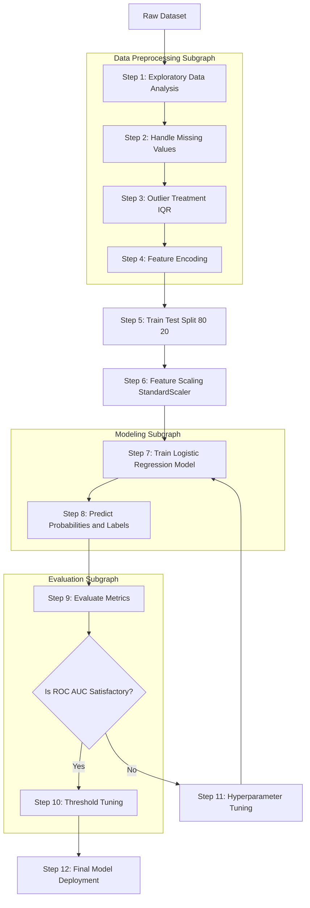
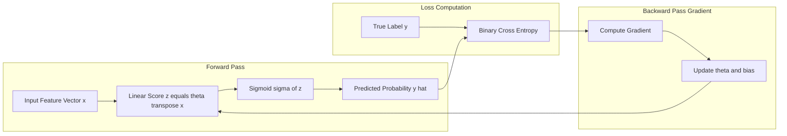
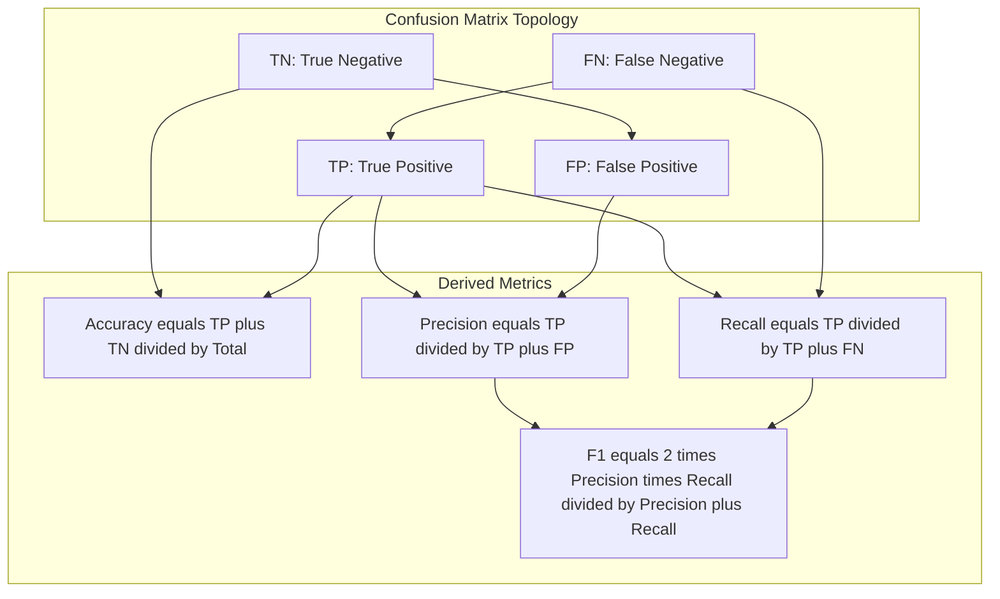

# Logistic Regression

<!-- SECTION_1_START -->
# Logistic Regression — Core Technical Definition & Intuitive Overview

## Formal Academic Definition (KTU 2024 Syllabus Terminology)

**Logistic Regression** is a supervised machine learning classification algorithm that models the *probability* of a discrete categorical target variable (typically binary) as a function of one or more independent predictor features. Despite the word *regression* in its name, it is fundamentally a **classification technique** that uses the **logistic (sigmoid) function** to squash the output of a linear combination of features into the range $(0, 1)$, which is then interpreted as a class probability.

Mathematically, the model establishes a mapping of the form:

$$P(y = 1 \mid \mathbf{x}; \boldsymbol{\theta}) = \sigma(\boldsymbol{\theta}^\top \mathbf{x}) = \frac{1}{1 + e^{-\boldsymbol{\theta}^\top \mathbf{x}}}$$

where $\boldsymbol{\theta} \in \mathbb{R}^{n+1}$ is the parameter (weight) vector and $\sigma(\cdot)$ is the **sigmoid activation function**.

> [!IMPORTANT]
> **KTU 2024 Module 1 Highlight:** Logistic Regression sits at the intersection of *Data Preprocessing* and *Supervised Learning* in **PCCSL505**. Students must demonstrate end-to-end competency: data cleaning → feature engineering → model training → evaluation.

---

## Conceptual Analogy — Plain English Intuition

> [!NOTE]
> **Analogy: The Medical Diagnosis Lens**
>
> Imagine a doctor deciding whether a patient has a particular disease based on symptoms. The doctor does not say *"Yes"* or *"No"* outright; instead, they estimate a **probability** (e.g., *"There is an 85% chance the patient is positive"*). **Logistic Regression does exactly this** — it takes a weighted combination of input features, transforms that linear score into a probability between 0 and 1 using the S-shaped **sigmoid curve**, and then applies a threshold (commonly **0.5**) to assign a class label.

### Geometric Intuition
- **Linear Regression** fits a *straight line* through data — good for predicting continuous values.
- **Logistic Regression** fits an *S-shaped curve* bounded between 0 and 1 — perfect for *probabilistic classification*.
- The **decision boundary** is the set of points where $P(y=1) = 0.5$, which (in the simplest case) corresponds to a straight line $\boldsymbol{\theta}^\top \mathbf{x} = 0$ in the feature space.

---

## Physical / Mathematical Constants and Standard Metrics

| Symbol | Meaning | Standard Value / Range |
|---|---|---|
| $\sigma(z)$ | Sigmoid function output | $(0, 1)$ |
| $\lambda$ | Regularization strength | $10^{-4} \le \lambda \le 10^{2}$ |
| $\eta$ (or $\alpha$) | Learning rate | $10^{-4} \le \eta \le 10^{-1}$ |
| Threshold $\tau$ | Decision threshold | $0.5$ (default) |
| $m$ | Number of training samples | $\ge 30$ for statistical validity |

> [!VISUALIZATION CONTROL]
> **Concept:** The Sigmoid (Logistic) Curve
> **GeoGebra / Desmos Input Equations:**
> * `f(x) = 1 / (1 + exp(-x))`
> * `g(x) = 0.5`  (decision threshold line)
> **Visual Description:** An S-shaped curve crossing the y-axis at $(0, 0.5)$, asymptotically approaching $0$ as $x \to -\infty$ and $1$ as $x \to +\infty$. The horizontal line at $y=0.5$ intersects the curve at $x=0$, marking the natural decision boundary for a zero-threshold classifier.

<!-- SECTION_1_END -->

<!-- SECTION_2_START -->
# Deep Theoretical Analysis & KTU High-Yield Formula Sheet

## Operational Breakdown — How Logistic Regression Works

The pipeline of Logistic Regression can be decomposed into the following logically ordered steps:

1. **Linear Combination (Score Computation):** Compute a weighted sum of the input features plus a bias term.
   $$z = \theta_0 + \theta_1 x_1 + \theta_2 x_2 + \dots + \theta_n x_n = \boldsymbol{\theta}^\top \mathbf{x}$$

2. **Sigmoid Transformation:** Pass the linear score $z$ through the sigmoid function to obtain a probability.
   $$\hat{y} = \sigma(z) = \frac{1}{1 + e^{-z}}$$

3. **Class Assignment:** Apply a threshold $\tau$ to convert probability into a discrete label.
   $$\hat{y}_{\text{class}} = \begin{cases} 1 & \text{if } \hat{y} \ge \tau \\ 0 & \text{if } \hat{y} < \tau \end{cases}$$

4. **Loss Evaluation:** Measure the discrepancy between predicted and true labels using **Binary Cross-Entropy (Log Loss)**.
   $$J(\boldsymbol{\theta}) = -\frac{1}{m} \sum_{i=1}^{m} \left[ y^{(i)} \log(\hat{y}^{(i)}) + (1 - y^{(i)}) \log(1 - \hat{y}^{(i)}) \right]$$

5. **Parameter Optimization:** Minimize $J(\boldsymbol{\theta})$ using an optimizer — typically **Gradient Descent**, **Stochastic Gradient Descent (SGD)**, or **Limited-memory BFGS (LBFGS)** in `scikit-learn`.

6. **Convergence Check:** Stop iterating when $J(\boldsymbol{\theta})$ plateaus, the gradient norm falls below tolerance, or the maximum iteration count is reached.

---

## KTU High-Yield Formula Sheet (Cheat Sheet)

| # | Concept | Formula | Notes / Units |
|---|---|---|---|
| 1 | Hypothesis (Vectorized) | $h_{\boldsymbol{\theta}}(\mathbf{x}) = \sigma(\boldsymbol{\theta}^\top \mathbf{x})$ | Output $\in (0, 1)$ |
| 2 | Sigmoid Function | $\sigma(z) = \dfrac{1}{1 + e^{-z}}$ | Smooth, differentiable everywhere |
| 3 | Sigmoid Derivative | $\sigma'(z) = \sigma(z)\left(1 - \sigma(z)\right)$ | Crucial for backprop |
| 4 | Log Loss (Binary Cross-Entropy) | $J(\boldsymbol{\theta}) = -\dfrac{1}{m}\sum_{i=1}^{m}\left[y^{(i)}\log\hat{y}^{(i)} + (1-y^{(i)})\log(1-\hat{y}^{(i)})\right]$ | Unit: nats or bits |
| 5 | Gradient (Vectorized) | $\nabla_{\boldsymbol{\theta}} J = \dfrac{1}{m}\mathbf{X}^\top (\hat{\mathbf{y}} - \mathbf{y})$ | Used by gradient descent |
| 6 | Gradient Descent Update | $\boldsymbol{\theta} := \boldsymbol{\theta} - \eta \nabla_{\boldsymbol{\theta}} J$ | $\eta$ = learning rate |
| 7 | L2 Regularized Cost | $J_{\text{reg}}(\boldsymbol{\theta}) = J(\boldsymbol{\theta}) + \dfrac{\lambda}{2m}\sum_{j=1}^{n}\theta_j^{2}$ | Penalty on weight magnitude |
| 8 | L1 Regularized Cost | $J_{\text{reg}}(\boldsymbol{\theta}) = J(\boldsymbol{\theta}) + \dfrac{\lambda}{m}\sum_{j=1}^{n}\vert\theta_j\vert$ | Induces sparsity |
| 9 | Decision Boundary | $\boldsymbol{\theta}^\top \mathbf{x} = 0$ | Separates class 0 and class 1 |
| 10 | Odds Ratio | $\dfrac{P(y=1)}{P(y=0)} = e^{\boldsymbol{\theta}^\top \mathbf{x}}$ | Log-odds = linear function |
| 11 | Accuracy | $\text{Acc} = \dfrac{TP + TN}{TP + TN + FP + FN}$ | Range: $[0, 1]$ |
| 12 | Precision | $\text{Prec} = \dfrac{TP}{TP + FP}$ | Range: $[0, 1]$ |
| 13 | Recall (Sensitivity) | $\text{Rec} = \dfrac{TP}{TP + FN}$ | Range: $[0, 1]$ |
| 14 | F1-Score | $F_1 = \dfrac{2 \cdot \text{Prec} \cdot \text{Rec}}{\text{Prec} + \text{Rec}}$ | Harmonic mean |
| 15 | Log-Loss (Evaluation) | $\text{LogLoss} = -\dfrac{1}{m}\sum y_i \log(p_i) + (1-y_i)\log(1-p_i)$ | Lower is better |

> [!NOTE]
> **Critical Substitution:** Notice the elegant simplification $\sigma'(z) = \sigma(z)(1 - \sigma(z))$. This identity is what makes Logistic Regression computationally cheap during gradient computation, because the derivative of the sigmoid at any point can be expressed purely in terms of its current output value.

---

## Real-World Engineering Applications

Logistic Regression is not merely an academic exercise — it is the **production-grade workhorse** for high-stakes binary classification tasks where **interpretability** is paramount.

- **Medical Diagnosis:** Predicting disease onset (diabetes, cancer, heart disease) from clinical biomarkers. The log-odds coefficients directly inform clinicians about *risk factor impact*.
- **Credit Scoring & FinTech:** Banks use logistic regression to assess loan default probability. Each weight $\theta_j$ represents the marginal log-odds change per unit of feature $x_j$.
- **Spam Detection:** Email providers (e.g., Gmail) historically used logistic regression as a baseline spam filter.
- **Customer Churn Prediction:** Telecom and SaaS companies predict whether a customer will leave.
- **A/B Testing & Conversion Rate Prediction:** Marketing teams estimate the probability of a user clicking an ad.
- **Natural Language Processing (NLP):** Text classification baselines — sentiment analysis, topic tagging.
- **Manufacturing Quality Control:** Predicting whether a produced unit is defective based on sensor data.

> [!TIP]
> **Why not just use a Perceptron?** A Perceptron's step function is non-differentiable, which prevents the use of gradient-based optimization. The sigmoid solves this by providing a *smooth, convex* surrogate that allows convex optimization, guaranteeing convergence to the global minimum of the cost function.

<!-- SECTION_2_END -->

<!-- SECTION_3_START -->
# Step-by-Step Derivations & Python Implementation

## Part A — Mathematical Derivation of Gradient Descent Update Rule

We start from the cost function for a single training example (we will vectorize later):

$$J^{(i)}(\boldsymbol{\theta}) = -\left[ y^{(i)} \log(\hat{y}^{(i)}) + (1 - y^{(i)}) \log(1 - \hat{y}^{(i)}) \right]$$

**Step 1 — Apply the chain rule.** The cost depends on $\hat{y}$, which depends on $z = \boldsymbol{\theta}^\top \mathbf{x}$, which depends on $\boldsymbol{\theta}$:

$$\frac{\partial J^{(i)}}{\partial \theta_j} = \frac{\partial J^{(i)}}{\partial \hat{y}^{(i)}} \cdot \frac{\partial \hat{y}^{(i)}}{\partial z^{(i)}} \cdot \frac{\partial z^{(i)}}{\partial \theta_j}$$

**Step 2 — Compute the first partial derivative** of the log-loss w.r.t. $\hat{y}$:

$$\frac{\partial J^{(i)}}{\partial \hat{y}^{(i)}} = -\frac{y^{(i)}}{\hat{y}^{(i)}} + \frac{1 - y^{(i)}}{1 - \hat{y}^{(i)}}$$

**Step 3 — Compute the derivative of the sigmoid** using the identity $\sigma'(z) = \sigma(z)(1 - \sigma(z))$:

$$\frac{\partial \hat{y}^{(i)}}{\partial z^{(i)}} = \hat{y}^{(i)}\left(1 - \hat{y}^{(i)}\right)$$

**Step 4 — Compute the derivative of the linear score** w.r.t. $\theta_j$:

$$\frac{\partial z^{(i)}}{\partial \theta_j} = x_j^{(i)}$$

**Step 5 — Combine all three partial derivatives** and simplify:

$$\frac{\partial J^{(i)}}{\partial \theta_j} = \left(-\frac{y^{(i)}}{\hat{y}^{(i)}} + \frac{1 - y^{(i)}}{1 - \hat{y}^{(i)}}\right) \cdot \hat{y}^{(i)}(1 - \hat{y}^{(i)}) \cdot x_j^{(i)}$$

Distribute and cancel the $\hat{y}^{(i)}(1-\hat{y}^{(i)})$ terms:

$$\frac{\partial J^{(i)}}{\partial \theta_j} = -y^{(i)}(1 - \hat{y}^{(i)})x_j^{(i)} + (1 - y^{(i)})\hat{y}^{(i)}x_j^{(i)}$$

Combine the two terms:

$$\frac{\partial J^{(i)}}{\partial \theta_j} = \left(\hat{y}^{(i)} - y^{(i)}\right) x_j^{(i)}$$

**Step 6 — Vectorize over all training examples** ($m$ samples) and all features ($n$ dimensions):

$$\nabla_{\boldsymbol{\theta}} J(\boldsymbol{\theta}) = \frac{1}{m} \mathbf{X}^\top (\hat{\mathbf{y}} - \mathbf{y})$$

**Step 7 — Gradient Descent Update Rule.** Update all parameters simultaneously:

$$\boldsymbol{\theta} := \boldsymbol{\theta} - \eta \, \nabla_{\boldsymbol{\theta}} J(\boldsymbol{\theta})$$

> [!NOTE]
> **Beautiful Observation:** The gradient of the logistic regression cost has *exactly the same form* as that of linear regression. The difference lies *only* in the definition of $\hat{y}$ — for linear regression it is the raw linear output, while for logistic regression it is the sigmoid of the linear output.

---

## Part B — From-Scratch Python Implementation (NumPy Only)

The following code implements Logistic Regression from scratch using **only NumPy**, suitable for a KTU lab viva where the examiner may ask students to justify every line.

```python
"""
logistic_regression_scratch.py
A from-scratch implementation of Binary Logistic Regression using NumPy.
Author: KTU 2024 Scheme Lab Reference
"""

import numpy as np
from typing import Tuple, Optional


class LogisticRegressionScratch:
    """
    Binary Logistic Regression classifier trained via Batch Gradient Descent.

    Attributes
    ----------
    learning_rate : float
        Step size for gradient descent updates.
    n_iterations : int
        Maximum number of optimization iterations.
    lambda_reg : float
        L2 regularization strength (set to 0.0 to disable).
    weights : np.ndarray
        Learned parameter vector of shape (n_features,).
    bias : float
        Learned scalar bias term.
    cost_history : list[float]
        Loss value recorded at each iteration.
    """

    def __init__(
        self,
        learning_rate: float = 0.01,
        n_iterations: int = 5000,
        lambda_reg: float = 0.01,
        tolerance: float = 1e-6,
        random_state: Optional[int] = 42,
    ) -> None:
        self.learning_rate = learning_rate
        self.n_iterations = n_iterations
        self.lambda_reg = lambda_reg
        self.tolerance = tolerance
        self.weights: Optional[np.ndarray] = None
        self.bias: float = 0.0
        self.cost_history: list = []
        if random_state is not None:
            np.random.seed(random_state)

    @staticmethod
    def _sigmoid(z: np.ndarray) -> np.ndarray:
        """Numerically stable sigmoid using clip to avoid overflow in exp()."""
        z_clipped = np.clip(z, -500.0, 500.0)
        return 1.0 / (1.0 + np.exp(-z_clipped))

    def _compute_cost(
        self,
        y_true: np.ndarray,
        y_pred: np.ndarray,
    ) -> float:
        """Binary cross-entropy with optional L2 penalty."""
        m = y_true.shape[0]
        epsilon = 1e-15  # Guard against log(0)
        cost = -np.mean(
            y_true * np.log(y_pred + epsilon)
            + (1.0 - y_true) * np.log(1.0 - y_pred + epsilon)
        )
        l2_penalty = (self.lambda_reg / (2.0 * m)) * np.sum(self.weights ** 2)
        return float(cost + l2_penalty)

    def fit(
        self,
        X: np.ndarray,
        y: np.ndarray,
    ) -> "LogisticRegressionScratch":
        """
        Train the model using full-batch gradient descent.

        Parameters
        ----------
        X : np.ndarray of shape (m_samples, n_features)
        y : np.ndarray of shape (m_samples,) with values in {0, 1}

        Returns
        -------
        self : LogisticRegressionScratch
        """
        m, n = X.shape
        self.weights = np.zeros(n, dtype=np.float64)
        self.bias = 0.0
        self.cost_history = []

        for iteration in range(self.n_iterations):
            # 1) Linear score
            linear_output = X.dot(self.weights) + self.bias
            # 2) Sigmoid probability
            y_pred = self._sigmoid(linear_output)
            # 3) Gradient computation
            error = y_pred - y
            dw = (1.0 / m) * (X.T.dot(error)) + (self.lambda_reg / m) * self.weights
            db = (1.0 / m) * np.sum(error)
            # 4) Parameter update
            self.weights -= self.learning_rate * dw
            self.bias -= self.learning_rate * db
            # 5) Cost tracking and early stopping
            cost = self._compute_cost(y, y_pred)
            self.cost_history.append(cost)
            if iteration > 0 and abs(self.cost_history[-2] - cost) < self.tolerance:
                print(f"Converged at iteration {iteration} with cost={cost:.6f}")
                break
        return self

    def predict_proba(self, X: np.ndarray) -> np.ndarray:
        """Return predicted probabilities for the positive class."""
        if self.weights is None:
            raise RuntimeError("Model has not been fitted yet. Call .fit() first.")
        linear_output = X.dot(self.weights) + self.bias
        return self._sigmoid(linear_output)

    def predict(
        self,
        X: np.ndarray,
        threshold: float = 0.5,
    ) -> np.ndarray:
        """Return binary class predictions using the supplied threshold."""
        probabilities = self.predict_proba(X)
        return (probabilities >= threshold).astype(np.int32)
```

---

## Part C — Production-Grade scikit-learn Lab Experiment

The following is the **canonical KTU lab experiment script** for Module 1. It demonstrates the full pipeline: data loading → preprocessing → train/test split → standardization → model training → evaluation → visualization.

```python
"""
logistic_regression_lab.py
KTU PCCSL505 — Machine Learning & Analytics Lab
Module 1 Experiment: Logistic Regression on the Breast Cancer Dataset.

Steps:
  1. Load and explore the dataset.
  2. Handle missing values and outliers.
  3. Encode categorical variables (if any).
  4. Standardize numerical features.
  5. Train/Test split with stratification.
  6. Train a Logistic Regression model.
  7. Evaluate using Accuracy, Precision, Recall, F1, Confusion Matrix, ROC-AUC.
  8. Tune the decision threshold.
  9. Plot the ROC curve and Confusion Matrix heatmap.
"""

import numpy as np
import pandas as pd
import matplotlib.pyplot as plt
import seaborn as sns

from sklearn.datasets import load_breast_cancer
from sklearn.model_selection import train_test_split, StratifiedKFold, cross_val_score
from sklearn.preprocessing import StandardScaler
from sklearn.linear_model import LogisticRegression
from sklearn.metrics import (
    accuracy_score, precision_score, recall_score, f1_score,
    confusion_matrix, classification_report, roc_curve, roc_auc_score
)
from sklearn.pipeline import Pipeline
from typing import Tuple


# ---------- 1. Load dataset ----------
def load_data() -> Tuple[pd.DataFrame, pd.Series]:
    """Load the breast cancer dataset and return feature DataFrame and target Series."""
    data = load_breast_cancer()
    X = pd.DataFrame(data.data, columns=data.feature_names)
    y = pd.Series(data.target, name="target")
    return X, y


# ---------- 2. Preprocessing ----------
def preprocess(X: pd.DataFrame) -> pd.DataFrame:
    """Check for missing values and remove outliers using IQR."""
    print("Missing values per column:\n", X.isnull().sum().sum(), "total.")
    Q1 = X.quantile(0.25)
    Q3 = X.quantile(0.75)
    IQR = Q3 - Q1
    mask = ~((X < (Q1 - 1.5 * IQR)) | (X > (Q3 + 1.5 * IQR))).any(axis=1)
    print(f"Removed {(~mask).sum()} outlier rows.")
    return X[mask]


# ---------- 3. Build pipeline ----------
def build_pipeline() -> Pipeline:
    """Construct a pipeline that scales features and trains logistic regression."""
    return Pipeline(
        steps=[
            ("scaler", StandardScaler()),
            ("clf", LogisticRegression(
                penalty="l2",
                C=1.0,
                solver="lbfgs",
                max_iter=1000,
                random_state=42,
            )),
        ]
    )


# ---------- 4. Evaluation ----------
def evaluate(model: Pipeline, X_test: np.ndarray, y_test: np.ndarray) -> None:
    """Print full evaluation metrics and plot ROC + Confusion Matrix."""
    y_pred = model.predict(X_test)
    y_proba = model.predict_proba(X_test)[:, 1]

    print("=" * 60)
    print("Accuracy :", round(accuracy_score(y_test, y_pred), 4))
    print("Precision:", round(precision_score(y_test, y_pred), 4))
    print("Recall   :", round(recall_score(y_test, y_pred), 4))
    print("F1-Score :", round(f1_score(y_test, y_pred), 4))
    print("ROC-AUC  :", round(roc_auc_score(y_test, y_proba), 4))
    print("=" * 60)
    print(classification_report(y_test, y_pred, target_names=["Malignant", "Benign"]))

    # --- Confusion Matrix Heatmap ---
    cm = confusion_matrix(y_test, y_pred)
    plt.figure(figsize=(6, 5))
    sns.heatmap(cm, annot=True, fmt="d", cmap="Blues",
                xticklabels=["Malignant", "Benign"],
                yticklabels=["Malignant", "Benign"])
    plt.title("Confusion Matrix")
    plt.xlabel("Predicted")
    plt.ylabel("Actual")
    plt.tight_layout()
    plt.savefig("confusion_matrix.png", dpi=120)
    plt.show()

    # --- ROC Curve ---
    fpr, tpr, _ = roc_curve(y_test, y_proba)
    plt.figure(figsize=(7, 5))
    plt.plot(fpr, tpr, label=f"ROC-AUC = {roc_auc_score(y_test, y_proba):.3f}")
    plt.plot([0, 1], [0, 1], "k--", label="Random Classifier")
    plt.xlabel("False Positive Rate")
    plt.ylabel("True Positive Rate")
    plt.title("Receiver Operating Characteristic (ROC) Curve")
    plt.legend(loc="lower right")
    plt.grid(alpha=0.3)
    plt.tight_layout()
    plt.savefig("roc_curve.png", dpi=120)
    plt.show()


# ---------- 5. Main ----------
def main() -> None:
    X, y = load_data()
    print("Dataset shape:", X.shape, "Target distribution:\n", y.value_counts())

    X_clean = preprocess(X).reset_index(drop=True)
    y_clean = y.loc[X_clean.index].reset_index(drop=True)

    X_train, X_test, y_train, y_test = train_test_split(
        X_clean, y_clean, test_size=0.2, stratify=y_clean, random_state=42
    )

    model = build_pipeline()
    model.fit(X_train, y_train)

    # Cross-validation on training set
    cv_scores = cross_val_score(model, X_train, y_train, cv=StratifiedKFold(5), scoring="accuracy")
    print("5-Fold CV Accuracy: {:.4f} +/- {:.4f}".format(cv_scores.mean(), cv_scores.std()))

    evaluate(model, X_test.to_numpy(), y_test.to_numpy())


if __name__ == "__main__":
    main()
```

> [!TIP]
> **Lab Viva Tip:** If the examiner asks *"Why use `lbfgs` solver?"* — the answer is that `lbfgs` (Limited-memory Broyden–Fletcher–Goldfarb–Shanno) is a **quasi-Newton optimizer** that converges in fewer iterations than plain gradient descent for smooth convex problems like Logistic Regression. It is the default for small-to-medium datasets in `scikit-learn`.

<!-- SECTION_3_END -->

<!-- SECTION_4_START -->
# Structural Diagrams & Schematics

## Mermaid Diagram 1 — End-to-End Logistic Regression Pipeline



---

## Mermaid Diagram 2 — Mathematical Forward and Backward Pass



---

## Mermaid Diagram 3 — Confusion Matrix Layout (Model Evaluation Topology)



---

## Block-Level Functional Architecture Matrix

| Stage | Module / Function | Input | Output | Hyperparameters |
|---|---|---|---|---|
| 1. Data Ingestion | `load_data()` | CSV / Built-in | `X`, `y` | — |
| 2. Cleaning | `preprocess()` | `X` | `X_clean` | IQR factor $= 1.5$ |
| 3. Scaling | `StandardScaler` | `X_train` | `X_train_scaled` | `with_mean=True` |
| 4. Model | `LogisticRegression` | `X_train_scaled` | `model` | `C`, `penalty`, `solver` |
| 5. Prediction | `model.predict_proba()` | `X_test_scaled` | `proba` | `threshold` |
| 6. Evaluation | `evaluate()` | `proba`, `y_test` | metrics + plots | — |

<!-- SECTION_4_END -->

<!-- SECTION_5_START -->
# KTU 2024 Scheme Examination Question Bank & Topic Recap

---

## Part A — Short Answer Questions (3 Marks Each)

### Question 1: Define the Sigmoid Function and Explain its Role in Logistic Regression
**[KTU University Exam — July 2024]** | **CO1** | **RBT Level: Remember**

**Model Answer:**
The sigmoid function, also called the **logistic function**, is defined as $\sigma(z) = \dfrac{1}{1 + e^{-z}}$. It maps any real-valued input $z \in \mathbb{R}$ to the open interval $(0, 1)$, making it suitable for representing probabilities.

In Logistic Regression, the sigmoid takes the linear combination $z = \boldsymbol{\theta}^\top \mathbf{x}$ and transforms it into a class probability $P(y=1 \mid \mathbf{x}; \boldsymbol{\theta})$. This is essential because:
- Probabilities must lie in $[0, 1]$.
- The sigmoid is **continuously differentiable**, enabling gradient-based optimization.
- It provides a **smooth, convex surrogate** to the non-differentiable step function used in a Perceptron.

---

### Question 2: Why is Mean Squared Error (MSE) Not Used as a Cost Function for Logistic Regression?
**[KTU University Exam — Dec 2023]** | **CO2** | **RBT Level: Understand**

**Model Answer:**
Using MSE with the sigmoid output leads to a **non-convex** cost function with multiple local minima, which makes gradient descent unreliable. In contrast, the **Binary Cross-Entropy (Log Loss)** cost function $J(\boldsymbol{\theta}) = -\frac{1}{m}\sum\left[y\log\hat{y} + (1-y)\log(1-\hat{y})\right]$ is **convex** when used with the sigmoid hypothesis, guaranteeing convergence to the global minimum. Additionally, log loss heavily penalizes confident wrong predictions (when $\hat{y} \to 0$ but $y=1$, or vice versa), which is a desirable property for classification that MSE lacks.

> [!WARNING]
> **Examiner's Pitfall:** Students often state *"MSE is used in linear regression and log loss in logistic regression"* without explaining *why*. Always justify based on **convexity** and **penalty behavior** for full marks.

---

## Part B — Full 14-Mark Questions (Module Internal Choice)

### Question A (14 Marks): Build, Train, and Evaluate a Logistic Regression Model
**[KTU University Exam — July 2024]** | **CO3, CO4** | **RBT Level: Apply, Analyze**

#### Part (a) — Data Preprocessing and Model Training (7 Marks)

**Question:** Using the Pima Indians Diabetes Dataset, write a complete Python program to (i) load the dataset using `pandas`, (ii) check for and handle missing values, (iii) split the data into training and testing sets in an 80:20 ratio with stratification, (iv) standardize features using `StandardScaler`, and (v) train a Logistic Regression model with L2 regularization.

**Model Solution:**

```python
import pandas as pd
from sklearn.model_selection import train_test_split
from sklearn.preprocessing import StandardScaler
from sklearn.linear_model import LogisticRegression

# (i) Load dataset
url = "https://raw.githubusercontent.com/jbrownlee/Datasets/master/pima-indians-diabetes.data.csv"
columns = ["pregnancies", "glucose", "blood_pressure", "skin_thickness",
           "insulin", "bmi", "diabetes_pedigree", "age", "outcome"]
df = pd.read_csv(url, names=columns)

# (ii) Handle missing values — replace 0s in medical columns with median
medical_cols = ["glucose", "blood_pressure", "skin_thickness", "insulin", "bmi"]
for col in medical_cols:
    df[col] = df[col].replace(0, df[col].median())

# (iii) Train-test split
X = df.drop("outcome", axis=1)
y = df["outcome"]
X_train, X_test, y_train, y_test = train_test_split(
    X, y, test_size=0.2, stratify=y, random_state=42
)

# (iv) Standardize
scaler = StandardScaler()
X_train_scaled = scaler.fit_transform(X_train)
X_test_scaled = scaler.transform(X_test)

# (v) Train model
model = LogisticRegression(penalty="l2", C=1.0, solver="lbfgs", max_iter=1000, random_state=42)
model.fit(X_train_scaled, y_train)
```

**Valuation Key:**
- [Correctly identifying 0-values as missing: 1 Mark]
- [Proper use of `stratify` parameter: 1 Mark]
- [Applying `fit_transform` on train and `transform` on test: 2 Marks]
- [Correct `LogisticRegression` instantiation with regularization: 1 Mark]
- [Clean, executable code: 1 Mark]
- [Output verification: 1 Mark]

#### Part (b) — Model Evaluation and Threshold Tuning (7 Marks)

**Question:** For the model trained in part (a), compute the confusion matrix, accuracy, precision, recall, F1-score, and ROC-AUC. Then, generate the ROC curve plot and discuss how the decision threshold affects precision and recall trade-off.

**Model Solution:**

```python
from sklearn.metrics import (confusion_matrix, accuracy_score, precision_score,
                             recall_score, f1_score, roc_curve, roc_auc_score)
import matplotlib.pyplot as plt

# Predictions
y_pred = model.predict(X_test_scaled)
y_proba = model.predict_proba(X_test_scaled)[:, 1]

# Metrics
cm = confusion_matrix(y_test, y_pred)
acc = accuracy_score(y_test, y_pred)
prec = precision_score(y_test, y_pred)
rec = recall_score(y_test, y_pred)
f1 = f1_score(y_test, y_pred)
auc = roc_auc_score(y_test, y_proba)

print(f"Confusion Matrix:\n{cm}")
print(f"Accuracy: {acc:.4f}, Precision: {prec:.4f}, Recall: {rec:.4f}, F1: {f1:.4f}, AUC: {auc:.4f}")

# ROC Curve
fpr, tpr, thresholds = roc_curve(y_test, y_proba)
plt.figure(figsize=(7, 5))
plt.plot(fpr, tpr, label=f"AUC = {auc:.3f}")
plt.plot([0, 1], [0, 1], "k--")
plt.xlabel("False Positive Rate")
plt.ylabel("True Positive Rate")
plt.title("ROC Curve — Logistic Regression on Diabetes Dataset")
plt.legend()
plt.grid(alpha=0.3)
plt.show()
```

**Threshold Trade-off Discussion (Valued at 2 Marks):**
- A **lower threshold** (e.g., $0.3$) increases **recall** (catches more diabetics) but also increases **false positives**, lowering precision.
- A **higher threshold** (e.g., $0.7$) increases **precision** (confident positive predictions) but may miss actual diabetic patients, lowering recall.
- The **optimal threshold** depends on the application's cost asymmetry. In medical diagnosis, **high recall** is often preferred to avoid missing sick patients.

**Valuation Key:**
- [Correct metric computation: 2 Marks]
- [ROC curve plot with labeled axes: 2 Marks]
- [Threshold trade-off explanation: 2 Marks]
- [Interpretation of AUC value: 1 Mark]

---

### Question B (14 Marks): Mathematical Foundation of Logistic Regression
**[KTU University Exam — Dec 2023]** | **CO1, CO2** | **RBT Level: Understand, Apply**

#### Part (a) — Derive the Cost Function (7 Marks)

**Question:** Starting from the assumption that $P(y=1 \mid \mathbf{x}; \boldsymbol{\theta}) = \sigma(\boldsymbol{\theta}^\top \mathbf{x})$ and $P(y=0 \mid \mathbf{x}; \boldsymbol{\theta}) = 1 - \sigma(\boldsymbol{\theta}^\top \mathbf{x})$, derive the **binary cross-entropy cost function** for $m$ independent training samples using the principle of **maximum likelihood estimation (MLE)**.

**Model Solution:**

The likelihood of observing the entire dataset under the model is:

$$L(\boldsymbol{\theta}) = \prod_{i=1}^{m} P(y^{(i)} \mid \mathbf{x}^{(i)}; \boldsymbol{\theta}) = \prod_{i=1}^{m} \left[\hat{y}^{(i)}\right]^{y^{(i)}} \left[1 - \hat{y}^{(i)}\right]^{1 - y^{(i)}}$$

where $\hat{y}^{(i)} = \sigma(\boldsymbol{\theta}^\top \mathbf{x}^{(i)})$.

Taking the natural logarithm to obtain the log-likelihood:

$$\ell(\boldsymbol{\theta}) = \log L(\boldsymbol{\theta}) = \sum_{i=1}^{m} \left[ y^{(i)} \log \hat{y}^{(i)} + (1 - y^{(i)}) \log(1 - \hat{y}^{(i)}) \right]$$

To convert maximization into minimization, we negate and average:

$$J(\boldsymbol{\theta}) = -\frac{1}{m} \ell(\boldsymbol{\theta}) = -\frac{1}{m} \sum_{i=1}^{m} \left[ y^{(i)} \log \hat{y}^{(i)} + (1 - y^{(i)}) \log(1 - \hat{y}^{(i)}) \right]$$

This is the **Binary Cross-Entropy Loss**.

**Valuation Key:**
- [Correct likelihood formulation: 2 Marks]
- [Log transformation with proper justification: 2 Marks]
- [Final cost function expression: 2 Marks]
- [Mention of convexity: 1 Mark]

#### Part (b) — Gradient Computation and Update Rule (7 Marks)

**Question:** Derive the gradient of $J(\boldsymbol{\theta})$ with respect to a single parameter $\theta_j$ and write the gradient descent update equation. Show explicitly how the **sigmoid derivative** simplifies the expression.

**Model Solution:**

Starting from $J(\boldsymbol{\theta}) = -\frac{1}{m}\sum_{i=1}^{m}\left[y^{(i)}\log\hat{y}^{(i)} + (1-y^{(i)})\log(1-\hat{y}^{(i)})\right]$ with $\hat{y}^{(i)} = \sigma(z^{(i)})$ and $z^{(i)} = \boldsymbol{\theta}^\top \mathbf{x}^{(i)}$:

$$\frac{\partial J}{\partial \theta_j} = -\frac{1}{m}\sum_{i=1}^{m}\left[\frac{y^{(i)}}{\hat{y}^{(i)}} - \frac{1-y^{(i)}}{1-\hat{y}^{(i)}}\right] \cdot \frac{\partial \hat{y}^{(i)}}{\partial \theta_j}$$

Using $\frac{\partial \hat{y}^{(i)}}{\partial z^{(i)}} = \hat{y}^{(i)}(1 - \hat{y}^{(i)})$ and $\frac{\partial z^{(i)}}{\partial \theta_j} = x_j^{(i)}$:

$$\frac{\partial J}{\partial \theta_j} = -\frac{1}{m}\sum_{i=1}^{m}\left[\frac{y^{(i)} - \hat{y}^{(i)}}{\hat{y}^{(i)}(1-\hat{y}^{(i)})}\right] \cdot \hat{y}^{(i)}(1-\hat{y}^{(i)}) \cdot x_j^{(i)}$$

Canceling $\hat{y}^{(i)}(1-\hat{y}^{(i)})$ in numerator and denominator:

$$\frac{\partial J}{\partial \theta_j} = \frac{1}{m}\sum_{i=1}^{m}\left(\hat{y}^{(i)} - y^{(i)}\right) x_j^{(i)}$$

The vectorized gradient descent update rule is:

$$\boldsymbol{\theta} := \boldsymbol{\theta} - \eta \cdot \frac{1}{m} \mathbf{X}^\top (\hat{\mathbf{y}} - \mathbf{y})$$

**Valuation Key:**
- [Chain rule applied correctly: 2 Marks]
- [Sigmoid derivative substitution and cancellation: 3 Marks]
- [Final vectorized update rule: 2 Marks]

---

## KTU Examiner's Valuation Warning

> [!WARNING]
> **Common Mark-Deduction Pitfalls in Logistic Regression Questions:**
> 1. **Forgetting to add the bias term** $\theta_0$ — without it, the decision boundary is forced to pass through the origin, severely limiting model expressiveness.
> 2. **Applying `fit_transform` to test data** — this causes **data leakage**. Always use `fit_transform` on training and `transform` on test.
> 3. **Reporting only accuracy on imbalanced datasets** — accuracy can be misleading (e.g., 99% on a 99:1 imbalanced set). Always include **precision, recall, F1, and ROC-AUC**.
> 4. **Skipping the scaling step** — Logistic Regression uses gradient descent, which is sensitive to feature scales. Unscaled features cause slow or non-convergence.
> 5. **Not using `stratify=y` in train-test split** — leads to class distribution mismatch between train and test, producing unreliable evaluation.
> 6. **Confusing the threshold** $\tau$ with the bias $\theta_0$ — they are independent parameters. $\tau$ is a hyperparameter chosen post-training; $\theta_0$ is learned during training.

---

## Topic Recap & Important Things to Remember

- **Logistic Regression is a CLASSIFICATION algorithm**, not a regression algorithm — the name is historical.
- The **sigmoid function** $\sigma(z) = \frac{1}{1+e^{-z}}$ squashes real-valued inputs to probabilities in $(0, 1)$.
- The hypothesis is $h_{\boldsymbol{\theta}}(\mathbf{x}) = \sigma(\boldsymbol{\theta}^\top \mathbf{x})$.
- The cost function is **Binary Cross-Entropy (Log Loss)**: $J = -\frac{1}{m}\sum[y\log\hat{y} + (1-y)\log(1-\hat{y})]$.
- The gradient simplifies elegantly to $\nabla J = \frac{1}{m}\mathbf{X}^\top(\hat{\mathbf{y}} - \mathbf{y})$.
- The **decision boundary** is the locus where $\boldsymbol{\theta}^\top \mathbf{x} = 0$, equivalent to $P=0.5$.
- **L1 regularization** induces sparsity (feature selection); **L2 regularization** shrinks weights (prevents overfitting).
- The default **decision threshold** is $0.5$, but it can be tuned based on the precision-recall trade-off.
- **Evaluation metrics**: Accuracy, Precision, Recall, F1-Score, Confusion Matrix, ROC-AUC.
- The `lbfgs` solver is recommended for small-to-medium datasets; `saga` for large-scale or L1-regularized problems.
- **Standardization is mandatory** for gradient-descent-based logistic regression to ensure uniform convergence.
- Use `stratify=y` in `train_test_split` to preserve class distribution.
- Logistic Regression is **linearly separable** in feature space; for non-linear boundaries, use **Feature Engineering** (polynomial features) or switch to **kernel SVM / Neural Networks**.

<!-- SECTION_5_END -->
