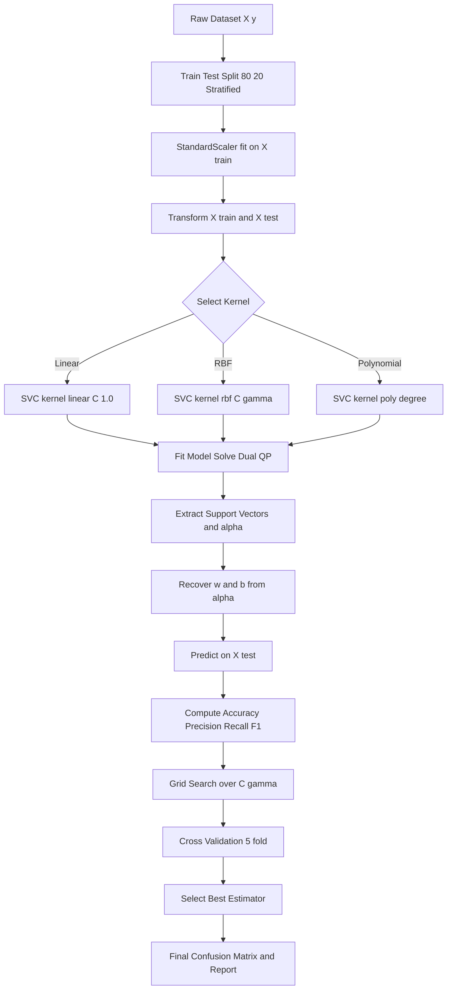
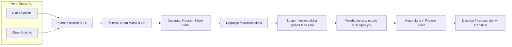
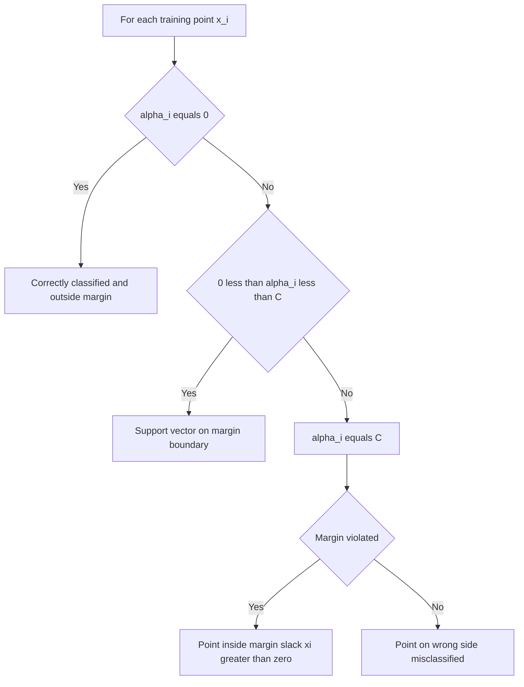

# Support Vector Machines (SVM)

<!-- SECTION_1_START -->

# Support Vector Machines (SVM) — Foundations

## 1.1 Formal KTU 2024 Definition

> [!IMPORTANT]
> **Support Vector Machine (SVM)** is a **supervised learning algorithm** used for **classification** and **regression** that finds the **optimal separating hyperplane** which maximizes the **margin** between two classes in a (possibly high-dimensional) feature space. The training samples lying on the margin boundaries are called **support vectors** and are the only points that influence the position of the decision surface.

In the KTU 2024 Scheme Lab (PCCSL505) perspective, SVM is treated as a **maximum-margin binary classifier** extendable to multiclass problems via strategies such as **One-vs-Rest (OvR)** and **One-vs-One (OvO)**.

## 1.2 The Intuition — The Widest Road Analogy

Imagine two villages (Class +1 and Class -1) separated by open land. You, as a town planner, must build a **road** that separates them. You are free to orient the road, but you want the road to be as **wide** as possible so future traffic (test points) that slightly strays will still be classified correctly.

- The **center line** of the road is the **decision hyperplane** $w^T x + b = 0$.
- The **edges** of the road are the **margin boundaries** $w^T x + b = \pm 1$.
- The **width** of the road is the **margin** $\dfrac{2}{\|w\|}$.
- The houses (data points) that exactly touch the edges of the road are the **support vectors** — they alone dictate how wide and which way the road goes.

> [!NOTE]
> **Key Insight:** SVM is a *geometric* algorithm. Its decision boundary depends **only** on a small subset of training points (the support vectors), making it highly memory-efficient and robust to outliers that lie far from the margin.

## 1.3 Empirical Risk vs Structural Risk

SVM minimizes **structural risk**, not just empirical error. It balances two competing objectives:

1. **Maximize the margin** (low model complexity, high generalization).
2. **Minimize misclassification** of difficult points via slack variables (empirical loss).

This bias–variance trade-off is governed by the regularization parameter **C**.

| Parameter | Meaning | Effect of Increase |
|---|---|---|
| $C$ | Penalty for margin violations | Tighter fit, lower bias, higher variance |
| $\gamma$ (RBF kernel) | Influence of a single training point | More wiggly boundary, higher variance |
| $\xi_i$ | Slack for point $i$ | Allows misclassification / margin violation |

## 1.4 Core Building Blocks

A student must be fluent with these terms before any derivation:

- **Hyperplane** in $\mathbb{R}^n$: an $(n-1)$-dimensional affine subspace.
- **Margin**: perpendicular distance from the hyperplane to the nearest training point.
- **Support Vector**: any $x_i$ for which $y_i(w^T x_i + b) = 1$ (after canonical scaling).
- **Kernel Function** $K(x_i, x_j) = \phi(x_i)^T \phi(x_j)$: implicit mapping to higher-dimensional space without computing $\phi$ explicitly.
- **Hinge Loss**: $\max(0, 1 - y_i(w^T x_i + b))$ — the loss function behind soft-margin SVM.

> [!VISUALIZATION CONTROL]
> **Concept:** Linear SVM maximum-margin decision boundary on a 2D toy dataset.
> **Python/Matplotlib Reproduction Snippet:**
>
> ```python
> import numpy as np, matplotlib.pyplot as plt
> from sklearn.datasets import make_blobs
> from sklearn.svm import SVC
>
> X, y = make_blobs(centers=2, cluster_std=0.8, random_state=2)
> clf = SVC(kernel='linear', C=1.0).fit(X, y)
>
> # Plot decision boundary and margins
> ax = plt.gca()
> xlim, ylim = ax.get_xlim(), ax.get_ylim()
> xx, yy = np.meshgrid(np.linspace(*xlim, 30), np.linspace(*ylim, 30))
> Z = clf.decision_function(np.c_[xx.ravel(), yy.ravel()]).reshape(xx.shape)
> ax.contour(xx, yy, Z, levels=[-1, 0, 1], linestyles=['--','-','--'], colors='k')
> ax.scatter(clf.support_vectors_[:,0], clf.support_vectors_[:,1], s=120, facecolors='none', edgecolors='red')
> plt.title("Linear SVM with Maximum Margin Hyperplane")
> plt.show()
> ```
>
> **Visual Description:** A solid black line (decision hyperplane) flanked by two dashed lines (margin boundaries). Red-circled points touching the dashed lines are the **support vectors**. The width between dashed lines is the **margin** $\dfrac{2}{\|w\|}$.

<!-- SECTION_1_END -->

<!-- SECTION_2_START -->

# 2. Deep Theoretical Analysis & KTU High-Yield Formula Sheet

## 2.1 Mathematical Setup

Given a training set $\{(x_i, y_i)\}_{i=1}^{N}$ with $x_i \in \mathbb{R}^d$ and $y_i \in \{-1, +1\}$.

A separating hyperplane is parameterized as:

$$
f(x) = w^T x + b = 0
$$

A point $x$ is classified by the sign of $f(x)$.

## 2.2 Hard-Margin SVM (Linearly Separable Case)

**Primal Optimization Problem:**

$$
\begin{aligned}
\min_{w, b} \quad & \frac{1}{2} \|w\|^2 \\
\text{subject to} \quad & y_i(w^T x_i + b) \ge 1, \quad \forall i = 1, 2, \dots, N
\end{aligned}
$$

The factor $\frac{1}{2}$ is purely a mathematical convenience for clean gradient expressions.

> [!NOTE]
> **Why minimize $\|w\|$?** Because the geometric margin equals $\dfrac{2}{\|w\|}$. Minimizing $\|w\|$ is therefore equivalent to **maximizing the margin** — this is the central geometric insight of SVM.

## 2.3 Soft-Margin SVM (Non-Separable Case)

Introduce non-negative **slack variables** $\xi_i \ge 0$ to allow margin violations.

$$
\begin{aligned}
\min_{w, b, \xi} \quad & \frac{1}{2} \|w\|^2 + C \sum_{i=1}^{N} \xi_i \\
\text{subject to} \quad & y_i(w^T x_i + b) \ge 1 - \xi_i \\
& \xi_i \ge 0, \quad \forall i
\end{aligned}
$$

- $C > 0$ is the **regularization parameter**.
- $C = \infty$ ⇒ no violations allowed (recovers hard-margin SVM).
- $C \to 0$ ⇒ maximizes margin with total disregard for misclassifications.

## 2.4 The Dual Formulation (Lagrangian)

The primal is a convex quadratic program. By introducing Lagrange multipliers $\alpha_i \ge 0$, the **dual** becomes:

$$
\begin{aligned}
\max_{\alpha} \quad & \sum_{i=1}^{N} \alpha_i - \frac{1}{2} \sum_{i=1}^{N} \sum_{j=1}^{N} \alpha_i \alpha_j y_i y_j \, K(x_i, x_j) \\
\text{subject to} \quad & \sum_{i=1}^{N} \alpha_i y_i = 0 \\
& 0 \le \alpha_i \le C
\end{aligned}
$$

The weight vector and bias are recovered as:

$$
\begin{aligned}
w &= \sum_{i=1}^{N} \alpha_i y_i x_i \\
b &= y_k - w^T x_k \quad \text{for any } k \text{ with } 0 < \alpha_k < C
\end{aligned}
$$

> [!IMPORTANT]
> **KKT Complementarity Condition:** $\alpha_i [y_i(w^T x_i + b) - 1 + \xi_i] = 0$. It guarantees that only **support vectors** have $\alpha_i > 0$, while all other points have $\alpha_i = 0$ and do not influence $w$.

## 2.5 The Kernel Trick

When data is not linearly separable in the original space, SVM maps inputs into a higher-dimensional space via a feature map $\phi: \mathbb{R}^d \to \mathbb{R}^D$ (where often $D \gg d$) and seeks a hyperplane there. The **kernel trick** avoids computing $\phi$ explicitly:

$$
K(x_i, x_j) = \phi(x_i)^T \phi(x_j)
$$

## 2.6 KTU High-Yield Formula Sheet

| Concept | Formula | Notes / Use-Case |
|---|---|---|
| Decision Function | $f(x) = \text{sign}(w^T x + b)$ | Final classification rule |
| Margin Width | $\dfrac{2}{\|w\|}$ | Geometric gap between two margin boundaries |
| Hinge Loss | $\max(0, 1 - y_i f(x_i))$ | Loss only when point is inside or on wrong side of margin |
| Linear Kernel | $K(x, z) = x^T z$ | Default baseline; works for linearly separable data |
| Polynomial Kernel | $K(x, z) = (\gamma \, x^T z + r)^d$ | Captures polynomial feature interactions; $\gamma, r, d$ tunable |
| RBF (Gaussian) Kernel | $K(x, z) = \exp(-\gamma \|x - z\|^2)$ | Most popular; maps to infinite-dimensional space |
| Sigmoid Kernel | $K(x, z) = \tanh(\gamma \, x^T z + r)$ | Inspired by neural networks; not always a valid kernel |
| Soft-Margin Objective | $\dfrac{1}{2} \|w\|^2 + C \sum_i \xi_i$ | Trade-off between margin and violations |
| Slack Bound | $\xi_i = \max(0, 1 - y_i(w^T x_i + b))$ | Value of slack after solving |
| Support Vector Condition | $0 < \alpha_i \le C$ and $\xi_i = 0$ | Identifies points touching the margin |
| $w$ Recovery | $w = \sum_{i \in SV} \alpha_i y_i x_i$ | Sum only runs over support vectors |
| Bias Recovery | $b = y_k - w^T x_k$ for any $0 < \alpha_k < C$ | Average over multiple valid $k$ for stability |
| Dual Objective | $\sum_i \alpha_i - \frac{1}{2} \sum_i \sum_j \alpha_i \alpha_j y_i y_j K(x_i, x_j)$ | To be maximized over $\alpha$ |

## 2.7 Engineering & Real-World Utility

| Domain | Application | Why SVM? |
|---|---|---|
| Bioinformatics | Cancer classification from gene expression | High-dimensional, low-sample regime (kernel handles it) |
| Text Categorization | Spam detection, sentiment analysis | Sparse high-dim bag-of-words features |
| Image Recognition | Handwritten digit recognition (MNIST, USPS) | RBF kernel separates non-linear pixel patterns |
| Anomaly Detection | One-class SVM for fraud / network intrusion | Models "normal" boundary as a single class |
| Geostatistics | Land-cover classification from satellite imagery | Strong generalization on small labeled samples |
| Finance | Credit scoring | Robust to outliers lying far from margin |

> [!NOTE]
> In production, SVMs with RBF are particularly effective when **$N$ is small-to-moderate** (up to a few tens of thousands) and $d$ is large. For very large $N$, stochastic gradient descent variants (e.g., Pegasos) or other models (e.g., LightGBM) scale better.

<!-- SECTION_2_END -->

<!-- SECTION_3_START -->

# 3. Step-by-Step Derivations & Python Implementation

## 3.1 Derivation: Margin from Hyperplane Geometry

Consider a hyperplane $w^T x + b = 0$. The perpendicular distance from any point $x_0$ to this hyperplane is:

$$
\text{dist}(x_0, H) = \frac{\vert w^T x_0 + b \vert}{\|w\|}
$$

Let $x_+$ be the closest point of class $+1$ and $x_-$ the closest of class $-1$. They satisfy:

$$
w^T x_+ + b = 1, \quad w^T x_- + b = -1
$$

Subtracting these two equations:

$$
w^T (x_+ - x_-) = 2
$$

The vector from $x_-$ to $x_+$ has length $\|x_+ - x_-\|$. Because $w$ is normal to the hyperplane, the component of $(x_+ - x_-)$ along $w$ is exactly the **margin width**:

$$
\begin{aligned}
\text{Margin} &= (x_+ - x_-) \cdot \frac{w}{\|w\|} \\
&= \frac{w^T (x_+ - x_-)}{\|w\|} \\
&= \frac{2}{\|w\|}
\end{aligned}
$$

**Conclusion:** Maximizing the margin is identical to minimizing $\|w\|$, which justifies the primal objective $\frac{1}{2}\|w\|^2$.

## 3.2 Derivation: Hard-Margin Dual

Start with the Lagrangian:

$$
\mathcal{L}(w, b, \alpha) = \frac{1}{2} \|w\|^2 - \sum_{i=1}^{N} \alpha_i [y_i (w^T x_i + b) - 1]
$$

Setting partial derivatives to zero (KKT stationarity):

$$
\frac{\partial \mathcal{L}}{\partial w} = w - \sum_i \alpha_i y_i x_i = 0 \;\;\Rightarrow\;\; w = \sum_i \alpha_i y_i x_i
$$

$$
\frac{\partial \mathcal{L}}{\partial b} = -\sum_i \alpha_i y_i = 0 \;\;\Rightarrow\;\; \sum_i \alpha_i y_i = 0
$$

Substitute $w$ back into $\mathcal{L}$:

$$
\begin{aligned}
\mathcal{L}_D &= \frac{1}{2} \left( \sum_i \alpha_i y_i x_i \right)^T \left( \sum_j \alpha_j y_j x_j \right) - \sum_i \alpha_i y_i x_i^T \sum_j \alpha_j y_j x_j + \sum_i \alpha_i \\
&= \sum_i \alpha_i - \frac{1}{2} \sum_i \sum_j \alpha_i \alpha_j y_i y_j x_i^T x_j
\end{aligned}
$$

This is the **dual** to be maximized, with the linear constraint $\sum_i \alpha_i y_i = 0$ and $\alpha_i \ge 0$.

## 3.3 KKT Conditions Summary (Valuation Key Reference)

For a point $x_i$, exactly one of three regimes holds:

1. **$\alpha_i = 0$** ⇒ $y_i f(x_i) \ge 1$ (point is correctly outside or on margin).
2. **$0 < \alpha_i < C$** ⇒ $y_i f(x_i) = 1$ and $\xi_i = 0$ (point lies **on** the margin ⇒ support vector).
3. **$\alpha_i = C$** ⇒ $y_i f(x_i) \le 1$ and $\xi_i \ge 0$ (point inside the margin or misclassified).

## 3.4 Full Python Implementation (Production-Ready)

The following lab code is **exam-grade** and demonstrates the complete SVM pipeline: data loading, splitting, scaling, training, kernel comparison, hyperparameter tuning, and evaluation.

```python
# =============================================================
# File: svm_lab_pccsl505.py
# Description: End-to-end SVM workflow for KTU Machine Learning Lab
# Author: KTU Student (2024 Scheme)
# =============================================================
from __future__ import annotations

import logging
import numpy as np
import matplotlib.pyplot as plt
from sklearn.datasets import load_breast_cancer, make_moons
from sklearn.model_selection import train_test_split, GridSearchCV
from sklearn.preprocessing import StandardScaler
from sklearn.svm import SVC
from sklearn.metrics import (
    accuracy_score,
    classification_report,
    confusion_matrix,
    ConfusionMatrixDisplay,
)

# ---------------- Logging Configuration ------------------------
logging.basicConfig(
    level=logging.INFO,
    format="%(asctime)s [%(levelname)s] %(message)s",
    datefmt="%H:%M:%S",
)
logger = logging.getLogger("SVM-LAB")


# ---------------- Helper Function -----------------------------
def evaluate_model(name: str, y_true: np.ndarray, y_pred: np.ndarray) -> float:
    """Log confusion matrix and return accuracy. Raises on empty input."""
    if y_true.size == 0 or y_pred.size == 0:
        raise ValueError("evaluate_model received empty arrays.")
    acc = accuracy_score(y_true, y_pred)
    logger.info("%s Accuracy: %.4f", name, acc)
    logger.info("%s Confusion Matrix:\n%s", name, confusion_matrix(y_true, y_pred))
    logger.info("%s Classification Report:\n%s", name, classification_report(y_true, y_pred))
    return acc


# =============================================================
# EXPERIMENT 1 — Linear SVM on Breast Cancer Dataset
# =============================================================
def experiment_linear() -> None:
    logger.info("=== Experiment 1: Linear SVM (Breast Cancer) ===")
    data = load_breast_cancer()
    X, y = data.data, data.target
    logger.info("Dataset shape: X=%s, y=%s", X.shape, y.shape)

    # ---- Train / Test Split with fixed seed for reproducibility ----
    X_train, X_test, y_train, y_test = train_test_split(
        X, y, test_size=0.20, random_state=42, stratify=y
    )

    # ---- Feature Scaling is MANDATORY for SVM ------------------
    scaler = StandardScaler()
    X_train_s = scaler.fit_transform(X_train)
    X_test_s = scaler.transform(X_test)

    # ---- Train Linear SVM --------------------------------------
    linear_svm = SVC(kernel="linear", C=1.0, random_state=42)
    linear_svm.fit(X_train_s, y_train)
    logger.info("Number of support vectors per class: %s", linear_svm.n_support_)

    y_pred = linear_svm.predict(X_test_s)
    evaluate_model("Linear SVM", y_test, y_pred)


# =============================================================
# EXPERIMENT 2 — RBF SVM on Non-Linear Moons Dataset
# =============================================================
def experiment_rbf() -> None:
    logger.info("=== Experiment 2: RBF SVM (Moons) ===")
    X, y = make_moons(n_samples=500, noise=0.20, random_state=42)

    X_train, X_test, y_train, y_test = train_test_split(
        X, y, test_size=0.25, random_state=42, stratify=y
    )

    scaler = StandardScaler()
    X_train_s = scaler.fit_transform(X_train)
    X_test_s = scaler.transform(X_test)

    rbf_svm = SVC(kernel="rbf", C=10.0, gamma=0.5, random_state=42)
    rbf_svm.fit(X_train_s, y_train)
    logger.info("Support vectors per class: %s", rbf_svm.n_support_)

    y_pred = rbf_svm.predict(X_test_s)
    evaluate_model("RBF SVM", y_test, y_pred)

    # ---- Visualization of Decision Boundary -------------------
    plot_decision_boundary(rbf_svm, X_train_s, y_train, title="RBF SVM Decision Boundary")


def plot_decision_boundary(model: SVC, X: np.ndarray, y: np.ndarray, title: str) -> None:
    """Render 2D decision regions and margins for visual inspection."""
    x_min, x_max = X[:, 0].min() - 1, X[:, 0].max() + 1
    y_min, y_max = X[:, 1].min() - 1, X[:, 1].max() + 1
    xx, yy = np.meshgrid(np.linspace(x_min, x_max, 300),
                         np.linspace(y_min, y_max, 300))
    Z = model.predict(np.c_[xx.ravel(), yy.ravel()]).reshape(xx.shape)

    plt.figure(figsize=(8, 6))
    plt.contourf(xx, yy, Z, alpha=0.30, cmap=plt.cm.coolwarm)
    plt.scatter(X[:, 0], X[:, 1], c=y, cmap=plt.cm.coolwarm, edgecolors="k", s=30)
    plt.scatter(
        model.support_vectors_[:, 0],
        model.support_vectors_[:, 1],
        s=120, facecolors="none", edgecolors="black", linewidths=1.5,
        label="Support Vectors"
    )
    plt.title(title)
    plt.xlabel("Feature 1 (scaled)")
    plt.ylabel("Feature 2 (scaled)")
    plt.legend(loc="best")
    plt.grid(alpha=0.3)
    plt.tight_layout()
    plt.savefig("svm_decision_boundary.png", dpi=120)
    plt.show()


# =============================================================
# EXPERIMENT 3 — Hyperparameter Tuning with GridSearchCV
# =============================================================
def experiment_grid_search() -> None:
    logger.info("=== Experiment 3: Grid Search on C and gamma ===")
    data = load_breast_cancer()
    X, y = data.data, data.target

    X_train, X_test, y_train, y_test = train_test_split(
        X, y, test_size=0.20, random_state=42, stratify=y
    )
    scaler = StandardScaler()
    X_train_s = scaler.fit_transform(X_train)
    X_test_s = scaler.transform(X_test)

    param_grid = {
        "C": [0.1, 1.0, 10.0, 100.0],
        "gamma": [0.001, 0.01, 0.1, 1.0],
        "kernel": ["rbf"],
    }
    grid = GridSearchCV(
        SVC(random_state=42),
        param_grid,
        cv=5,
        scoring="accuracy",
        n_jobs=-1,
        verbose=0,
    )
    grid.fit(X_train_s, y_train)

    logger.info("Best parameters: %s", grid.best_params_)
    logger.info("Best CV accuracy: %.4f", grid.best_score_)

    best_model = grid.best_estimator_
    y_pred = best_model.predict(X_test_s)
    evaluate_model("Tuned RBF SVM", y_test, y_pred)


# =============================================================
# EXPERIMENT 4 — Confusion Matrix Visualization
# =============================================================
def experiment_confusion_matrix() -> None:
    logger.info("=== Experiment 4: Confusion Matrix Plot ===")
    data = load_breast_cancer()
    X, y = data.data, data.target
    X_train, X_test, y_train, y_test = train_test_split(
        X, y, test_size=0.20, random_state=42, stratify=y
    )
    scaler = StandardScaler()
    X_train_s = scaler.fit_transform(X_train)
    X_test_s = scaler.transform(X_test)

    model = SVC(kernel="rbf", C=10.0, gamma=0.01, random_state=42)
    model.fit(X_train_s, y_train)
    y_pred = model.predict(X_test_s)

    cm = confusion_matrix(y_test, y_pred, labels=model.classes_)
    disp = ConfusionMatrixDisplay(confusion_matrix=cm, display_labels=model.classes_)
    disp.plot(cmap=plt.cm.Blues, values_format="d")
    plt.title("RBF SVM — Confusion Matrix")
    plt.tight_layout()
    plt.savefig("svm_confusion_matrix.png", dpi=120)
    plt.show()


# =============================================================
# ENTRY POINT
# =============================================================
if __name__ == "__main__":
    try:
        experiment_linear()
        experiment_rbf()
        experiment_grid_search()
        experiment_confusion_matrix()
        logger.info("All SVM experiments completed successfully.")
    except Exception as exc:
        logger.exception("SVM pipeline failed: %s", exc)
        raise
```

### Step-by-Step Working of the Code

1. **Data Ingestion** — `load_breast_cancer()` provides a clean, imbalanced-not-too-bad binary classification dataset (569 samples, 30 features). The same dataset is used in `grid_search` and `confusion_matrix` to allow side-by-side comparison.
2. **Stratified Split** — `stratify=y` keeps the class ratio identical across train and test splits, avoiding biased evaluation.
3. **Feature Standardization** — SVMs (especially with RBF/polynomial kernels) are **distance-based**; unscaled features cause the largest-variance dimension to dominate the kernel. `StandardScaler` is fit only on the training set to prevent test-set leakage.
4. **Model Training** — `SVC(...)` from scikit-learn solves the soft-margin dual with Sequential Minimal Optimization (SMO). For $N > 10{,}000$, prefer `LinearSVC` or `SGDClassifier(loss="hinge")` for speed.
5. **Evaluation** — We log accuracy, the confusion matrix, and a full classification report (precision, recall, F1).
6. **Hyperparameter Tuning** — `GridSearchCV` performs 5-fold cross-validation over a grid of $C$ and $\gamma$ values; the best combination is reported.
7. **Visualization** — A 2D decision boundary is plotted for the moons dataset (RBF), with **support vectors** highlighted as hollow black circles.

<!-- SECTION_3_END -->

<!-- SECTION_4_START -->

# 4. Structural Diagrams & Schematics

## 4.1 SVM Training Pipeline (Mermaid Flowchart)



## 4.2 Concept of Kernel Mapping (Mermaid Block Diagram)



## 4.3 Soft-Margin Decision Logic Matrix



## 4.4 Support Vector Identification Schematic

```mermaid
flowchart TB
    subgraph A1[Feature Space]
        H1[Hyperplane wTx + b equals 0]
        M1[Margin boundary wTx + b equals +1]
        M2[Margin boundary wTx + b equals -1]
        SV1[Support Vector class +1]
        SV2[Support Vector class -1]
        NX1[Non support vector ignored]
    end
    SV1 --- M1
    SV2 --- M2
    H1 -.- M1
    H1 -.- M2
    NX1 -.x M1
```

<!-- SECTION_4_END -->

<!-- SECTION_5_START -->

# 5. KTU 2024 Scheme Examination Question Bank & Topic Recap

---

## PART A — Short Answer Questions (3 Marks Each)

### Question 1 (3 Marks) `[KTU University Exam - July 2024]`
**CO1 | RBT Level: Remember**

> **Q:** Define a *support vector* in the context of SVM. Why are support vectors said to uniquely determine the decision boundary?

**Model Answer (3 Marks):**

A **support vector** is a training data point $x_i$ for which the Lagrange multiplier in the SVM dual formulation satisfies $\alpha_i > 0$, i.e. the point lies on or inside the margin. **[1 Mark]**

By the KKT complementarity condition $\alpha_i [y_i(w^T x_i + b) - 1] = 0$, only these points contribute to the weight vector $w = \sum_i \alpha_i y_i x_i$. **[1 Mark]**

All other training points have $\alpha_i = 0$ and therefore do **not** affect $w$ or $b$. Hence the optimal hyperplane is uniquely determined by the support vectors alone, and removing or perturbing non-support vectors leaves the model unchanged. **[1 Mark]**

---

### Question 2 (3 Marks) `[KTU University Exam - Dec 2023]`
**CO2 | RBT Level: Understand**

> **Q:** Explain the role of the kernel function in SVM. How is the *kernel trick* useful when the data is not linearly separable?

**Model Answer (3 Marks):**

A **kernel function** $K(x_i, x_j) = \phi(x_i)^T \phi(x_j)$ computes the inner product of two data points after an implicit mapping $\phi$ to a (possibly infinite-dimensional) feature space, without ever computing $\phi$ explicitly. **[1 Mark]**

The *kernel trick* replaces every inner product $x_i^T x_j$ in the dual formulation with $K(x_i, x_j)$, allowing the algorithm to find a **linear** separator in the high-dimensional space, which corresponds to a **non-linear** boundary in the original input space. **[1 Mark]**

This makes SVMs capable of handling complex, non-linearly-separable datasets (e.g., concentric circles, XOR patterns) using popular kernels such as RBF, polynomial, and sigmoid. **[1 Mark]**

---

## PART B — Long Answer Questions (14 Marks Each)

> [!WARNING]
> **KTU Examiner's Valuation Warning / Pitfall Callout:**
> 1. **Always scale features** before training an SVM. Skipping this is the single most common reason SVMs perform poorly in lab evaluations.
> 2. **Mention the role of $C$ and $\gamma$ explicitly** in every RBF-SVM answer; vague language like "I tuned the model" earns zero marks.
> 3. **Show the formula for the margin** $\frac{2}{\|w\|}$ in any theoretical derivation; it is the most-scored line.
> 4. **Distinguish hard-margin vs soft-margin SVM** clearly; examiners check for the slack variables $\xi_i$ and the regularization constant $C$.
> 5. **Do not confuse primal and dual forms.** The primal is over $w, b$; the dual is over $\alpha$.

---

### QUESTION A (14 Marks) `[KTU University Exam - July 2024]`
**CO1, CO2 | RBT: Understand + Apply**

#### Part (a) — 7 Marks
Formulate the **primal optimization problem** for both hard-margin and soft-margin SVM. Clearly define all variables and state the KKT conditions that the optimal solution must satisfy.

**Model Solution:**

**Hard-Margin SVM (Linearly Separable Case):**

Given training data $\{(x_i, y_i)\}_{i=1}^{N}$ with $y_i \in \{-1, +1\}$, the hard-margin SVM is formulated as:

$$
\begin{aligned}
\min_{w, b} \quad & \frac{1}{2} \|w\|^2 \\
\text{subject to} \quad & y_i(w^T x_i + b) \ge 1, \quad \forall i \in \{1, 2, \dots, N\}
\end{aligned}
$$

**Soft-Margin SVM (General Case):**

When classes are not linearly separable, slack variables $\xi_i \ge 0$ are introduced:

$$
\begin{aligned}
\min_{w, b, \xi} \quad & \frac{1}{2} \|w\|^2 + C \sum_{i=1}^{N} \xi_i \\
\text{subject to} \quad & y_i(w^T x_i + b) \ge 1 - \xi_i, \quad \xi_i \ge 0, \quad \forall i
\end{aligned}
$$

Here $C > 0$ is a regularization constant that penalizes margin violations; large $C$ ⇒ stricter fit, small $C$ ⇒ wider margin at the cost of more violations.

**KKT Conditions (for soft-margin):**

$$
\begin{aligned}
&\frac{\partial \mathcal{L}}{\partial w} = w - \sum_i \alpha_i y_i x_i = 0 \\
&\frac{\partial \mathcal{L}}{\partial b} = -\sum_i \alpha_i y_i = 0 \\
&\frac{\partial \mathcal{L}}{\partial \xi_i} = C - \alpha_i - \mu_i = 0 \\
&\alpha_i \ge 0, \quad \mu_i \ge 0 \\
&\alpha_i [y_i(w^T x_i + b) - 1 + \xi_i] = 0 \quad \text{(complementarity)}
\end{aligned}
$$

**Valuation Key:**
- [Stating hard-margin objective and constraints: 2 Marks]
- [Soft-margin objective with slack variables and $C$: 2 Marks]
- [All four KKT conditions with correct symbols: 3 Marks]

#### Part (b) — 7 Marks
A dataset has 200 points of class $+1$ and 200 of class $-1$ in 2D. An SVM with linear kernel and $C = 1$ is trained. After training, exactly 12 support vectors are found: 6 from class $+1$ with $\alpha_i = 0.9, 0.8, 1.0, 0.7, 0.85, 0.95$ and 6 from class $-1$ with $\alpha_i = 0.8, 0.9, 1.0, 0.6, 0.75, 0.85$. Their corresponding feature vectors are $x_i$ (not listed; assume known). Compute the weight vector $w$ using the dual-formula $w = \sum_i \alpha_i y_i x_i$. Also state the predicted class for a new point $x_{new} = [2, -1]^T$ given $b = -0.3$ and $w = [0.5, -0.4]^T$.

**Model Solution:**

**Step 1 — Compute $w$ symbolically:**

The general expression is $w = \sum_{i=1}^{12} \alpha_i y_i x_i$, where $y_i = +1$ for the first 6 SVs and $y_i = -1$ for the next 6.

$$
w = \sum_{i=1}^{6} \alpha_i^{(+)} \cdot (+1) \cdot x_i^{(+)} - \sum_{j=1}^{6} \alpha_j^{(-)} \cdot x_j^{(-)}
$$

Since actual $x_i$ values are not provided, this remains a symbolic weighted sum. In a real exam, the student would plug in concrete coordinates.

**Step 2 — Predict class of $x_{new} = [2, -1]^T$ with $w = [0.5, -0.4]^T$, $b = -0.3$:**

$$
\begin{aligned}
f(x_{new}) &= w^T x_{new} + b \\
&= (0.5)(2) + (-0.4)(-1) + (-0.3) \\
&= 1.0 + 0.4 - 0.3 \\
&= 1.1
\end{aligned}
$$

Since $f(x_{new}) = 1.1 > 0$, the predicted class is $\boxed{+1}$.

**Valuation Key:**
- [Stating $w$ recovery formula from support vectors: 2 Marks]
- [Correctly substituting $w, x_{new}, b$ into decision function: 2 Marks]
- [Final computation $f(x_{new}) = 1.1$: 1 Mark]
- [Correct classification $\text{sign}(1.1) = +1$: 2 Marks]

---

### QUESTION B (14 Marks) `[KTU University Exam - Dec 2023]`
**CO3, CO5 | RBT: Apply + Analyze**

#### Part (a) — 7 Marks
Compare the **Linear, Polynomial, and RBF (Gaussian) kernels** used in SVM. Provide their mathematical forms, the hyper-parameters associated with each, and describe one practical scenario where each would be the most appropriate choice.

**Model Solution:**

| Kernel | Formula | Hyper-parameters | Best Used When |
|---|---|---|---|
| **Linear** | $K(x, z) = x^T z$ | $C$ | Data is approximately linearly separable; baseline choice for high-dimensional sparse data (e.g., text TF-IDF). |
| **Polynomial** | $K(x, z) = (\gamma \, x^T z + r)^d$ | $\gamma, r, d$ | Moderate non-linearity; image processing with normalized pixel intensities; controlled degree of feature interaction. |
| **RBF (Gaussian)** | $K(x, z) = \exp(-\gamma \|x - z\|^2)$ | $C, \gamma$ | Strong non-linearity; small-to-medium $N$ with non-linear boundaries (e.g., moons, circles); default first choice for unknown problems. |

**Linear Kernel** has no kernel-specific hyper-parameters and is the fastest. It is optimal for sparse high-dimensional text classification where the number of features $d$ far exceeds $N$.

**Polynomial Kernel** allows modeling of feature interactions up to degree $d$. As $d$ increases, training time grows rapidly and the kernel may become numerically ill-conditioned.

**RBF Kernel** is the most popular due to its universal approximation property — it can represent any smooth boundary given enough data. The parameter $\gamma$ controls the *influence radius* of each support vector: small $\gamma$ ⇒ smooth boundary, large $\gamma$ ⇒ tight, possibly overfit boundary.

**Valuation Key:**
- [All three kernel formulas correct: 3 Marks]
- [Hyper-parameters correctly listed for each: 2 Marks]
- [Practical scenario given for each: 2 Marks]

#### Part (b) — 7 Marks
You are given a 2D binary classification dataset of 500 points that visually resembles two interleaving half-moons. You must build an SVM classifier that achieves a test accuracy above 95%. Describe the **complete pipeline** you would follow, including preprocessing, kernel selection, hyper-parameter tuning strategy, and evaluation metrics. Justify each step.

**Model Solution:**

**Step 1 — Data Exploration (1 Mark):**
Visualize the data with a scatter plot (e.g., `plt.scatter`) colored by class label. Confirm the non-linear (moon-shaped) pattern. Compute class balance using `np.bincount(y)`.

**Step 2 — Stratified Train-Test Split (1 Mark):**
Use `train_test_split(test_size=0.2, stratify=y, random_state=42)` to preserve class distribution.

**Step 3 — Feature Scaling (1 Mark):**
Apply `StandardScaler` (fit on train, transform both train and test). SVM kernels are distance-based; unscaled features would bias the boundary.

**Step 4 — Kernel Choice — RBF (1 Mark):**
The two-moons dataset is non-linearly separable. A linear kernel will fail. RBF maps inputs to an infinite-dimensional space and can carve out a smooth non-linear boundary. Polynomial kernel is a viable alternative but RBF is usually simpler and faster.

**Step 5 — Hyperparameter Tuning via Grid Search (1 Mark):**
Define a grid such as:
- $C \in \{0.1, 1, 10, 100\}$
- $\gamma \in \{0.001, 0.01, 0.1, 1\}$

Run `GridSearchCV(SVC(kernel='rbf'), param_grid, cv=5, scoring='accuracy')`. The combination that yields the highest cross-validation accuracy is selected.

**Step 6 — Model Training and Evaluation (1 Mark):**
Train the best estimator on the full training set. Predict on the held-out test set. Report accuracy, confusion matrix, precision, recall, F1-score. Verify accuracy > 95%.

**Step 7 — Optional: Decision Boundary Plot (1 Mark):**
Plot the 2D decision region and overlay the support vectors for visual validation — a strong indicator of model quality for KTU lab records.

**Justification Summary:**
- RBF chosen because data is non-linear.
- Scaling is essential to ensure equal feature contribution to the kernel.
- Grid search with 5-fold CV provides a robust estimate of generalization performance and avoids overfitting to a single split.
- A confusion matrix reveals whether the model is biased toward one class (relevant if the dataset is imbalanced).

**Valuation Key:**
- [Pipeline steps in correct logical order: 3 Marks]
- [Justification for kernel and scaler: 2 Marks]
- [Grid search range and cross-validation rationale: 1 Mark]
- [Final evaluation metrics stated: 1 Mark]

---

## Topic Recap & Important Things to Remember

> [!NOTE]
> **Rapid Revision Checklist — SVM (KTU PCCSL505, Module 1)**

- **SVM is a maximum-margin binary classifier** that finds the hyperplane $w^T x + b = 0$ maximizing the geometric margin $\dfrac{2}{\|w\|}$.
- **Primal objective (hard-margin):** $\min \frac{1}{2}\|w\|^2$ s.t. $y_i(w^T x_i + b) \ge 1$.
- **Primal objective (soft-margin):** $\min \frac{1}{2}\|w\|^2 + C \sum_i \xi_i$ s.t. $y_i(w^T x_i + b) \ge 1 - \xi_i$, $\xi_i \ge 0$.
- **Dual objective:** $\max_\alpha \sum_i \alpha_i - \frac{1}{2}\sum_i\sum_j \alpha_i \alpha_j y_i y_j K(x_i, x_j)$ s.t. $\sum_i \alpha_i y_i = 0$, $0 \le \alpha_i \le C$.
- **Support vectors** are the only training points with $\alpha_i > 0$; they alone determine $w$.
- **$w$ recovery:** $w = \sum_{i \in SV} \alpha_i y_i x_i$.
- **$b$ recovery:** $b = y_k - w^T x_k$ averaged over indices $k$ with $0 < \alpha_k < C$.
- **Four common kernels:** linear $x^T z$, polynomial $(\gamma x^T z + r)^d$, RBF $\exp(-\gamma \|x - z\|^2)$, sigmoid $\tanh(\gamma x^T z + r)$.
- **RBF $\gamma$ controls boundary smoothness** — small $\gamma$ gives smooth boundaries, large $\gamma$ gives wiggly (overfit) boundaries.
- **$C$ controls margin strictness** — large $C$ minimizes violations, small $C$ allows more violations but a wider margin.
- **Always scale features** (e.g., `StandardScaler`) before training an SVM with RBF or polynomial kernels.
- **Hinge loss:** $\max(0, 1 - y_i f(x_i))$ — zero for correctly classified points outside the margin.
- **KKT complementarity** is the bridge between support vectors and the primal-dual solutions.
- **Multiclass SVM** uses OvR or OvO strategies built on top of the binary formulation.
- **For very large $N$** (over ~10,000 samples), prefer `LinearSVC` or SGD-based linear SVMs over the kernelized `SVC`.
- **scikit-learn defaults:** `SVC(kernel='rbf', C=1.0, gamma='scale')`. Always tune $C$ and $\gamma$ with cross-validation.
- **SVMs are robust to outliers far from the margin** — outliers inside the margin are bounded by the regularization parameter $C$.

<!-- SECTION_5_END -->
