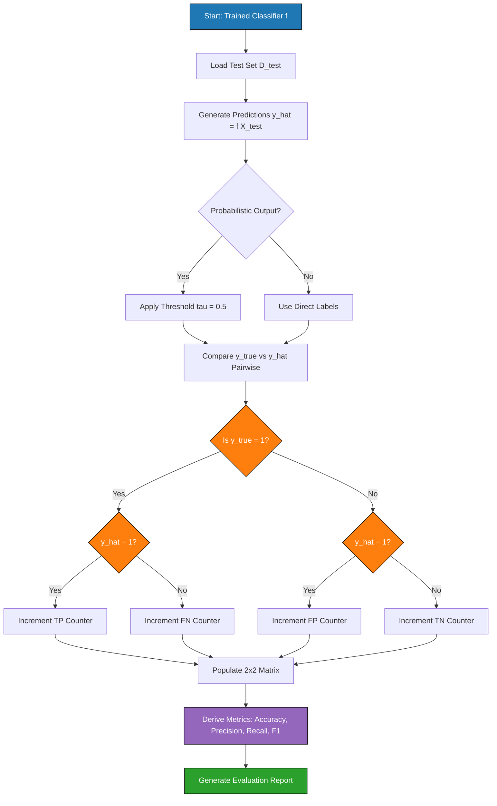
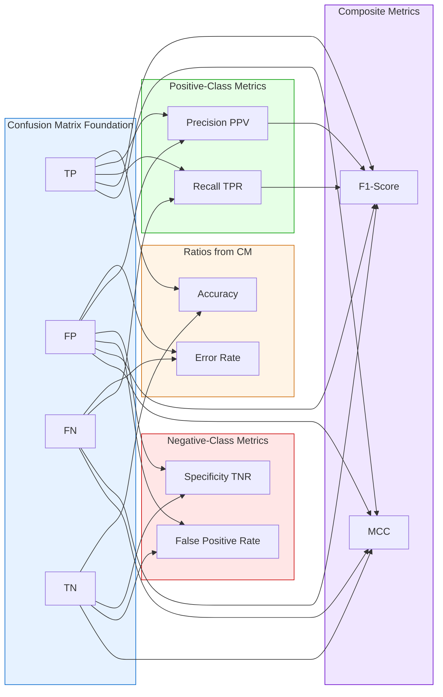
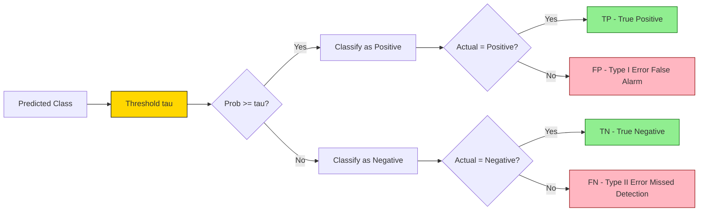

# Confusion Matrix

<!-- SECTION_1_START -->
# 1. Core Technical Definition & Intuitive Overview

## Formal Academic Definition

The **Confusion Matrix** (also known as the **Error Matrix** or **Contingency Table**) is a fundamental supervised learning evaluation tool that visualizes the performance of a classification algorithm by comparing the **Actual (True)** class labels against the **Predicted (Hypothesized)** class labels produced by a model. In the KTU 2024 Scheme context, it serves as the foundational tabular structure from which all critical classification metrics — Accuracy, Precision, Recall, F1-Score, and Specificity — are mathematically derived.

For a binary classification problem, the confusion matrix is a $2 \times 2$ matrix structured as follows:

$$
CM = \begin{bmatrix} TP & FP \\ FN & TN \end{bmatrix}
$$

Where:
- $TP$ = True Positives (correctly predicted positive instances)
- $FP$ = False Positives (incorrectly predicted as positive — **Type I Error**)
- $FN$ = False Negatives (incorrectly predicted as negative — **Type II Error**)
- $TN$ = True Negatives (correctly predicted negative instances)

> [!IMPORTANT]
> **KTU 2024 Syllabus Highlight:** Confusion Matrix is listed under the **Model Evaluation** segment of Module 2 (Unsupervised Learning and Model Evaluation). Although traditionally used for supervised classification, the KTU lab module treats it as a **cross-cutting evaluation utility** that bridges supervised model interpretation with clustering validation concepts.

---

## Conceptual Analogy / Intuition

Imagine a **medical diagnostic center** running a cancer screening test. The center processes **1000 patients** daily.

- **Actual Sick Patients** = $620$ (Ground Truth)
- **Actually Healthy Patients** = $380$ (Ground Truth)
- The model (screening test) makes predictions for every patient.

Now, four outcomes are possible:
1. **Sick patient correctly identified** → $TP$ (True Positive — *Test caught the disease*)
2. **Healthy patient wrongly flagged as sick** → $FP$ (False Positive — *False alarm, unnecessary panic*)
3. **Sick patient missed by the test** → $FN$ (False Negative — *Dangerous miss!*)
4. **Healthy patient correctly cleared** → $TN$ (True Negative — *Correctly reassured*)

The **Confusion Matrix** is simply a $2 \times 2$ table that tallies these four counts after the test runs. It is called a "**confusion**" matrix because it reveals **where the model is getting confused** between classes.

> [!NOTE]
> **Geometric Intuition:** Think of a $2$-dimensional plane where the x-axis represents the **Predicted Class** and the y-axis represents the **Actual Class**. The confusion matrix is essentially the **joint frequency distribution** $P(\text{Actual}, \text{Predicted})$ evaluated at discrete category points.

> [!VISUALIZATION CONTROL]
> **Concept:** Confusion Matrix Layout for Binary Classification
> **Coordinate Mapping (Conceptual):**
> * X-Axis (Predicted): Negative (0), Positive (1)
> * Y-Axis (Actual): Negative (0), Positive (1)
> * Matrix Cells:
>   * Bottom-Left $(0,0)$ → $TN$
>   * Bottom-Right $(1,0)$ → $FP$
>   * Top-Left $(0,1)$ → $FN$
>   * Top-Right $(1,1)$ → $TP$
> **Visual Description:** A $2 \times 2$ grid where the **diagonal cells** ($TN$, $TP$) represent correct predictions and the **off-diagonal cells** ($FP$, $FN$) represent misclassifications. A perfect model produces a matrix with **all mass concentrated on the diagonal**.
<!-- SECTION_1_END -->

<!-- SECTION_2_START -->
# 2. Deep Theoretical Analysis & KTU High-Yield Formula Sheet

## 2.1 Theoretical Foundation: Why a Confusion Matrix?

In a classification task, a model outputs a **discrete class label** (or a probability that is thresholded). Unlike regression (where Mean Squared Error suffices), classification demands a **discrete counting mechanism** of correct vs. incorrect predictions across each class. The confusion matrix provides:

1. **Per-class error visibility** — Unlike a single accuracy number, it exposes *which* classes the model confuses.
2. **Asymmetric error detection** — It distinguishes between the cost of $FP$ vs. $FN$ (critical in medical/legal/financial domains).
3. **Foundation for advanced metrics** — Precision, Recall, F1, ROC-AUC are all derived from the four cells.

## 2.2 Step-by-Step Logical Construction

**Step 1 — Obtain Predictions:** Run the trained classifier on a labelled test set $D_{test} = \{(x_i, y_i)\}_{i=1}^{N}$ to generate $\hat{y}_i = f(x_i)$ for all $i$.

**Step 2 — Threshold Decision (for probabilistic models):** If the classifier outputs probabilities $P(y=1 \mid x)$, apply a threshold $\tau$ (default $\tau = 0.5$):

$$
\hat{y}_i = \begin{cases} 1 & \text{if } P(y=1 \mid x_i) \geq \tau \\ 0 & \text{otherwise} \end{cases}
$$

**Step 3 — Cell Population:** For every $(y_i, \hat{y}_i)$ pair, increment the appropriate cell:
- If $y_i = 1$ and $\hat{y}_i = 1$ → increment $TP$
- If $y_i = 1$ and $\hat{y}_i = 0$ → increment $FN$
- If $y_i = 0$ and $\hat{y}_i = 1$ → increment $FP$
- If $y_i = 0$ and $y_i = 0$ → increment $TN$

**Step 4 — Metric Derivation:** Apply the formulas from the cheat sheet below.

---

## 2.3 KTU High-Yield Formula Sheet

> [!NOTE]
> The following table is the **exam-ready reference** for all confusion-matrix-derived metrics. Memorize the formulas, the cell letters, and the interpretation for KTU 2024 ESE and lab viva.

| Metric | Formula | Range | Engineering Interpretation |
|---|---|---|---|
| **Accuracy** | $\dfrac{TP + TN}{TP + FP + FN + TN}$ | $[0, 1]$ | Overall fraction of correct predictions. **Misleading on imbalanced datasets.** |
| **Error Rate** | $\dfrac{FP + FN}{TP + FP + FN + TN} = 1 - \text{Accuracy}$ | $[0, 1]$ | Overall fraction of misclassifications. |
| **Precision (PPV)** | $\dfrac{TP}{TP + FP}$ | $[0, 1]$ | *"Of all positive predictions, how many were correct?"* — **Quality of positive predictions** |
| **Recall (TPR / Sensitivity)** | $\dfrac{TP}{TP + FN}$ | $[0, 1]$ | *"Of all actual positives, how many did we catch?"* — **Coverage of positive class** |
| **Specificity (TNR)** | $\dfrac{TN}{TN + FP}$ | $[0, 1]$ | *"Of all actual negatives, how many did we correctly reject?"* |
| **F1-Score** | $\dfrac{2 \cdot \text{Precision} \cdot \text{Recall}}{\text{Precision} + \text{Recall}} = \dfrac{2 \cdot TP}{2 \cdot TP + FP + FN}$ | $[0, 1]$ | Harmonic mean of Precision & Recall. **Best single metric for imbalanced data.** |
| **False Positive Rate (FPR)** | $\dfrac{FP}{FP + TN} = 1 - \text{Specificity}$ | $[0, 1]$ | Used in plotting **ROC curves**. |
| **Matthews Correlation Coefficient (MCC)** | $\dfrac{TP \cdot TN - FP \cdot FN}{\sqrt{(TP+FP)(TP+FN)(TN+FP)(TN+FN)}}$ | $[-1, 1]$ | Balanced metric robust to class imbalance. $+1$ = perfect, $0$ = random, $-1$ = total disagreement. |
| **Prevalence** | $\dfrac{TP + FN}{TP + FP + FN + TN}$ | $[0, 1]$ | Proportion of actual positives in the dataset. |
| **Positive Likelihood Ratio** | $\dfrac{\text{Sensitivity}}{1 - \text{Specificity}}$ | $[0, \infty)$ | Diagnostic power; higher = better. |

---

## 2.4 Real-World Engineering Utility

| Domain | Application | Why Confusion Matrix Matters |
|---|---|---|
| **Medical Diagnosis** | Cancer detection, COVID screening | **FN is catastrophic** (missed disease) — high Recall is mandatory |
| **Spam Filtering** | Email classification | **FP is costly** (lost important mail) — high Precision needed |
| **Credit Card Fraud** | Anomaly detection | Severe class imbalance ($\sim 0.1\%$ fraud) — Accuracy is useless, F1/AUC dominate |
| **Autonomous Driving** | Pedestrian detection | Asymmetric error costs make per-class metric inspection critical |
| **Information Retrieval** | Search engine ranking | Top-K precision dictates user satisfaction |

> [!IMPORTANT]
> **Multi-class Extension:** For $K$ classes, the confusion matrix generalizes to a $K \times K$ table. Metrics are then computed per-class (one-vs-rest) and averaged via **Macro**, **Micro**, or **Weighted** schemes.
<!-- SECTION_2_END -->

<!-- SECTION_3_START -->
# 3. Step-by-Step Derivations & Code/Symbolic Implementation

## 3.1 Worked Numerical Example (Binary Classification)

### Problem Statement
A spam classifier is tested on **100 emails**. The results are tabulated as:
- $TP = 40$ (correctly identified spam)
- $FP = 10$ (legitimate mail flagged as spam)
- $FN = 5$ (spam that reached the inbox)
- $TN = 45$ (correctly identified legitimate mail)

**Required:** Construct the confusion matrix and compute Accuracy, Precision, Recall, Specificity, F1-Score, and Error Rate.

### Step-by-Step Solution

**Step 1 — Construct the Confusion Matrix**

$$
CM = \begin{bmatrix} TN & FP \\ FN & TP \end{bmatrix} = \begin{bmatrix} 45 & 10 \\ 5 & 40 \end{bmatrix}
$$

**Verification of totals:** $TN + FP + FN + TP = 45 + 10 + 5 + 40 = 100$ ✓

**Step 2 — Compute Accuracy**

$$
\text{Accuracy} = \frac{TP + TN}{TP + FP + FN + TN} = \frac{40 + 45}{100} = \frac{85}{100} = 0.85
$$

**Step 3 — Compute Precision**

$$
\text{Precision} = \frac{TP}{TP + FP} = \frac{40}{40 + 10} = \frac{40}{50} = 0.80
$$

**Step 4 — Compute Recall (Sensitivity / TPR)**

$$
\text{Recall} = \frac{TP}{TP + FN} = \frac{40}{40 + 5} = \frac{40}{45} \approx 0.8889
$$

**Step 5 — Compute Specificity (TNR)**

$$
\text{Specificity} = \frac{TN}{TN + FP} = \frac{45}{45 + 10} = \frac{45}{55} \approx 0.8182
$$

**Step 6 — Compute F1-Score**

$$
F_1 = \frac{2 \cdot \text{Precision} \cdot \text{Recall}}{\text{Precision} + \text{Recall}} = \frac{2 \cdot 0.80 \cdot 0.8889}{0.80 + 0.8889}
$$

$$
F_1 = \frac{1.4222}{1.6889} \approx 0.8421
$$

**Step 7 — Compute Error Rate**

$$
\text{Error Rate} = 1 - \text{Accuracy} = 1 - 0.85 = 0.15
$$

**Final Consolidated Result Table:**

| Metric | Value | Interpretation |
|---|---|---|
| Accuracy | $0.85$ | 85% of emails were classified correctly |
| Precision | $0.80$ | 80% of spam-flagged emails were truly spam |
| Recall | $0.8889$ | 88.89% of actual spam was caught |
| Specificity | $0.8182$ | 81.82% of legitimate mail was preserved |
| F1-Score | $0.8421$ | Balanced harmonic performance |
| Error Rate | $0.15$ | 15% misclassification rate |

---

## 3.2 Multi-Class Confusion Matrix Derivation

### Problem Statement
A 3-class classifier (Classes: **A**, **B**, **C**) produces the following confusion matrix on a test set of 90 samples:

$$
CM_{3 \times 3} = \begin{bmatrix} 25 & 3 & 2 \\ 4 & 18 & 1 \\ 1 & 2 & 34 \end{bmatrix}
$$

Rows = Actual class, Columns = Predicted class. Compute **Per-Class Precision, Recall, Macro-F1, and Weighted-F1**.

### Step-by-Step Solution

**Step 1 — Per-Class True Positives, False Positives, False Negatives**

For **Class A**:
- $TP_A = 25$ (diagonal)
- $FN_A = 4 + 1 = 5$ (other rows, column A)
- $FP_A = 3 + 2 = 5$ (other columns, row A)

For **Class B**:
- $TP_B = 18$
- $FN_B = 3 + 2 = 5$
- $FP_B = 4 + 1 = 5$

For **Class C**:
- $TP_C = 34$
- $FN_C = 2 + 1 = 3$
- $FP_C = 1 + 2 = 3$

**Step 2 — Per-Class Precision and Recall**

$$
P_A = \frac{25}{25 + 5} = \frac{25}{30} = 0.8333, \quad R_A = \frac{25}{25 + 5} = \frac{25}{30} = 0.8333
$$

$$
P_B = \frac{18}{18 + 5} = \frac{18}{23} = 0.7826, \quad R_B = \frac{18}{18 + 5} = \frac{18}{23} = 0.7826
$$

$$
P_C = \frac{34}{34 + 3} = \frac{34}{37} = 0.9189, \quad R_C = \frac{34}{34 + 3} = \frac{34}{37} = 0.9189
$$

**Step 3 — Per-Class F1-Score**

$$
F1_A = \frac{2 \cdot 0.8333 \cdot 0.8333}{0.8333 + 0.8333} = 0.8333
$$

$$
F1_B = \frac{2 \cdot 0.7826 \cdot 0.7826}{0.7826 + 0.7826} = 0.7826
$$

$$
F1_C = \frac{2 \cdot 0.9189 \cdot 0.9189}{0.9189 + 0.9189} = 0.9189
$$

**Step 4 — Macro-F1 (Unweighted Average)**

$$
F1_{macro} = \frac{F1_A + F1_B + F1_C}{3} = \frac{0.8333 + 0.7826 + 0.9189}{3} = \frac{2.5348}{3} \approx 0.8449
$$

**Step 5 — Weighted-F1 (Weighted by Class Support)**

Class supports: $A = 30$, $B = 23$, $C = 37$. Total $= 90$.

$$
F1_{weighted} = \frac{(30 \cdot 0.8333) + (23 \cdot 0.7826) + (37 \cdot 0.9189)}{90}
$$

$$
F1_{weighted} = \frac{24.999 + 18.000 + 33.999}{90} = \frac{76.998}{90} \approx 0.8555
$$

---

## 3.3 Complete Python Implementation (Production-Ready)

```python
"""
Confusion Matrix Implementation — KTU 2024 PCCSL505 Lab Reference
Module 2: Model Evaluation
"""

import numpy as np
from typing import Dict, Tuple, List
import logging

# Configure logging for traceability (production-grade practice)
logging.basicConfig(level=logging.INFO, format="%(asctime)s | %(levelname)s | %(message)s")
logger = logging.getLogger(__name__)


class ConfusionMatrixEvaluator:
    """
    A comprehensive evaluator that computes confusion matrix and derived
    classification metrics for both binary and multi-class problems.
    """

    def __init__(self, y_true: np.ndarray, y_pred: np.ndarray, class_labels: List[str] = None):
        # ---- Absolute Boundary Checks ----
        if not isinstance(y_true, np.ndarray):
            y_true = np.asarray(y_true)
        if not isinstance(y_pred, np.ndarray):
            y_pred = np.asarray(y_pred)

        if y_true.shape != y_pred.shape:
            logger.error(f"Shape mismatch: y_true={y_true.shape}, y_pred={y_pred.shape}")
            raise ValueError("y_true and y_pred must have identical dimensions.")

        if y_true.size == 0:
            logger.error("Empty input arrays received.")
            raise ValueError("Input arrays cannot be empty.")

        self.y_true = y_true
        self.y_pred = y_pred
        self.n_samples = y_true.size

        # Determine class labels automatically if not provided
        if class_labels is None:
            self.class_labels = sorted(np.unique(np.concatenate([y_true, y_pred])).tolist())
        else:
            self.class_labels = class_labels

        self.n_classes = len(self.class_labels)
        self.matrix = self._build_matrix()

        logger.info(f"Confusion matrix built for {self.n_classes} classes with {self.n_samples} samples.")

    def _build_matrix(self) -> np.ndarray:
        """Construct the raw confusion matrix from labels."""
        cm = np.zeros((self.n_classes, self.n_classes), dtype=np.int64)
        label_to_idx = {label: idx for idx, label in enumerate(self.class_labels)}

        for true_label, pred_label in zip(self.y_true, self.y_pred):
            i = label_to_idx[true_label]
            j = label_to_idx[pred_label]
            cm[i, j] += 1
        return cm

    def get_matrix(self) -> np.ndarray:
        """Return the raw confusion matrix."""
        return self.matrix

    def per_class_metrics(self) -> Dict[str, Dict[str, float]]:
        """Compute Precision, Recall, F1 for each class (one-vs-rest)."""
        metrics = {}
        for idx, label in enumerate(self.class_labels):
            tp = float(self.matrix[idx, idx])
            fp = float(self.matrix[:, idx].sum() - tp)
            fn = float(self.matrix[idx, :].sum() - tp)
            tn = float(self.matrix.sum() - tp - fp - fn)

            precision = tp / (tp + fp) if (tp + fp) > 0 else 0.0
            recall = tp / (tp + fn) if (tp + fn) > 0 else 0.0
            f1 = (2 * precision * recall / (precision + recall)) if (precision + recall) > 0 else 0.0

            metrics[str(label)] = {
                "TP": tp, "FP": fp, "FN": fn, "TN": tn,
                "Precision": round(precision, 4),
                "Recall": round(recall, 4),
                "F1-Score": round(f1, 4),
            }
        return metrics

    def accuracy(self) -> float:
        """Compute overall accuracy with explicit zero-division guard."""
        correct = np.trace(self.matrix)
        return round(float(correct) / self.n_samples, 4) if self.n_samples > 0 else 0.0

    def macro_f1(self) -> float:
        """Unweighted average of per-class F1 scores."""
        per_class = self.per_class_metrics()
        f1_scores = [v["F1-Score"] for v in per_class.values()]
        return round(float(np.mean(f1_scores)), 4)

    def weighted_f1(self) -> float:
        """F1 weighted by class support (number of true instances per class)."""
        per_class = self.per_class_metrics()
        f1_scores = []
        weights = []
        for idx, label in enumerate(self.class_labels):
            f1_scores.append(per_class[str(label)]["F1-Score"])
            weights.append(self.matrix[idx, :].sum())
        total = sum(weights)
        if total == 0:
            return 0.0
        return round(float(sum(f * w for f, w in zip(f1_scores, weights)) / total), 4)

    def matthews_corrcoef(self) -> float:
        """Compute Matthews Correlation Coefficient (MCC). Robust to imbalance."""
        cm = self.matrix.astype(np.float64)
        t_sum = cm.sum()
        if t_sum == 0:
            return 0.0
        # Expected correctly classified under random assignment
        sum_actual = cm.sum(axis=1)
        sum_predicted = cm.sum(axis=0)
        cov_yp = np.trace(cm)
        cov_y = np.sum(sum_actual * sum_predicted)
        denominator = np.sqrt((t_sum ** 2 - np.sum(sum_predicted ** 2)) *
                              (t_sum ** 2 - np.sum(sum_actual ** 2)))
        if denominator == 0:
            return 0.0
        return round(float((cov_yp * t_sum - cov_y) / denominator), 4)

    def summary_report(self) -> str:
        """Generate a human-readable evaluation report."""
        lines = [
            "=" * 60,
            "CONFUSION MATRIX EVALUATION REPORT",
            "=" * 60,
            f"Total Samples: {self.n_samples}",
            f"Classes: {self.class_labels}",
            "",
            "Raw Confusion Matrix (Rows=Actual, Cols=Predicted):",
            str(self.matrix),
            "",
            f"Overall Accuracy : {self.accuracy():.4f}",
            f"Macro F1-Score   : {self.macro_f1():.4f}",
            f"Weighted F1-Score: {self.weighted_f1():.4f}",
            f"MCC              : {self.matthews_corrcoef():.4f}",
            "",
            "Per-Class Metrics:",
        ]
        for cls, m in self.per_class_metrics().items():
            lines.append(f"  Class {cls}: P={m['Precision']:.4f}, "
                         f"R={m['Recall']:.4f}, F1={m['F1-Score']:.4f}")
        lines.append("=" * 60)
        report = "\n".join(lines)
        logger.info("Evaluation report generated successfully.")
        return report


# ==================== DEMONSTRATION ====================
if __name__ == "__main__":
    # Binary classification example
    y_true_binary = np.array([1, 0, 1, 1, 0, 0, 1, 0, 0, 1] * 10)
    y_pred_binary = np.array([1, 0, 1, 0, 0, 1, 1, 0, 0, 1] * 10)
    evaluator_bin = ConfusionMatrixEvaluator(y_true_binary, y_pred_binary,
                                              class_labels=[0, 1])
    print(evaluator_bin.summary_report())

    # Multi-class classification example
    y_true_multi = np.array(["A", "B", "C", "A", "B", "C", "A", "A", "B", "C"] * 9)
    y_pred_multi = np.array(["A", "B", "A", "A", "B", "C", "C", "A", "B", "C"] * 9)
    evaluator_multi = ConfusionMatrixEvaluator(y_true_multi, y_pred_multi,
                                               class_labels=["A", "B", "C"])
    print(evaluator_multi.summary_report())
```

---

## 3.4 Scikit-learn Cross-Verification (Lab Standard)

```python
from sklearn.metrics import confusion_matrix, classification_report, accuracy_score, f1_score
import seaborn as sns
import matplotlib.pyplot as plt

# Compute via scikit-learn
sk_cm = confusion_matrix(y_true_binary, y_pred_binary, labels=[0, 1])
print("Scikit-learn Confusion Matrix:")
print(sk_cm)

# Detailed classification report
print("\nClassification Report:")
print(classification_report(y_true_binary, y_pred_binary,
                            target_names=["Negative (0)", "Positive (1)"]))

# Visualization
plt.figure(figsize=(6, 5))
sns.heatmap(sk_cm, annot=True, fmt='d', cmap='Blues',
            xticklabels=["Pred 0", "Pred 1"],
            yticklabels=["Actual 0", "Actual 1"])
plt.title("Confusion Matrix — Binary Classification")
plt.ylabel("Actual Class")
plt.xlabel("Predicted Class")
plt.tight_layout()
plt.show()
```
<!-- SECTION_3_END -->

<!-- SECTION_4_START -->
# 4. Structural Diagrams & Schematics

## 4.1 Confusion Matrix Construction Flow (Mermaid)



## 4.2 Metric Derivation Hierarchy (Mermaid)



## 4.3 Error Type Decision Boundary (Mermaid)



## 4.4 Sequential Processing Topology Matrix

| Stage | Input | Process | Output | Validation Check |
|---|---|---|---|---|
| **1. Model Inference** | $X_{test}$ (features) | $\hat{y} = f(X_{test})$ | Raw predictions / probabilities | Shape match with $y_{true}$ |
| **2. Thresholding** | Probabilities | $\hat{y}_{bin} = (\hat{y} \geq \tau)$ | Binary labels | $\tau \in (0, 1)$ |
| **3. Cell Population** | $(y_{true}, \hat{y}_{bin})$ | Pairwise comparison | $TP, FP, FN, TN$ counters | $\sum = N$ |
| **4. Matrix Assembly** | Counters | $\begin{bmatrix} TN & FP \\ FN & TP \end{bmatrix}$ | $2 \times 2$ matrix | Diagonal dominance check |
| **5. Metric Computation** | Matrix cells | Arithmetic operations | All derived metrics | Range $[0,1]$ enforced |
| **6. Reporting** | Metrics | Formatted text / heatmap | Evaluation report | Sanity vs. baseline |
<!-- SECTION_4_END -->

<!-- SECTION_5_START -->
# 5. KTU 2024 Scheme Examination Question Bank & Topic Recap

## Part A: Short Answer Questions (3 Marks Each)

### Question 1 (3 Marks)
**`[KTU University Exam - July 2024]`** — **CO3, Remember**

**Q:** Define the Confusion Matrix. List the four cells of a binary confusion matrix and briefly state the meaning of each.

**Model Answer (Valuation Key):**

A **Confusion Matrix** is a tabular evaluation tool used in supervised classification to summarize the performance of a classification model by comparing actual versus predicted class labels.

**[Defining Confusion Matrix: 1 Mark]**

The four cells of a binary confusion matrix are:

| Cell | Full Form | Meaning |
|---|---|---|
| **TP** | True Positive | Model correctly predicts the positive class **[0.5 Mark]** |
| **TN** | True Negative | Model correctly predicts the negative class **[0.5 Mark]** |
| **FP** | False Positive | Model incorrectly predicts positive when actual is negative (Type I Error) **[0.5 Mark]** |
| **FN** | False Negative | Model incorrectly predicts negative when actual is positive (Type II Error) **[0.5 Mark]** |

---

### Question 2 (3 Marks)
**`[KTU University Exam - Dec 2023]`** — **CO3, Understand**

**Q:** Distinguish between **Precision** and **Recall** with appropriate formulas. In which scenario would you prioritize Recall over Precision?

**Model Answer (Valuation Key):**

**Precision** measures the *quality* of positive predictions — the proportion of predicted positives that are truly positive.

$$
\text{Precision} = \frac{TP}{TP + FP} \quad \textbf{[Formula: 1 Mark]}
$$

**Recall** measures the *coverage* of the positive class — the proportion of actual positives that were correctly identified.

$$
\text{Recall} = \frac{TP}{TP + FN} \quad \textbf{[Formula: 1 Mark]}
$$

**Scenario where Recall is prioritized:** In **medical disease diagnosis** (e.g., cancer detection), missing an actual positive case (FN) is far more dangerous than raising a false alarm (FP). Therefore, the model must achieve **high Recall** to ensure that almost all sick patients are identified, even at the cost of a few false positives that can be ruled out by follow-up tests. **[Scenario Justification: 1 Mark]**

---

## Part B: Long Answer Questions (14 Marks Each — Internal Choice)

### Question A (14 Marks)
**`[KTU University Exam - July 2024]`** — **CO3, Apply + Analyze**

**Q (a) [7 Marks]:** A Logistic Regression model is evaluated on a binary classification test set of **500 samples**. The confusion matrix obtained is:

$$
CM = \begin{bmatrix} 180 & 20 \\ 30 & 270 \end{bmatrix}
$$

where rows represent Actual and columns represent Predicted classes (Class 1 = Positive). Compute the following metrics and interpret each:
1. Accuracy
2. Precision
3. Recall (Sensitivity)
4. Specificity
5. F1-Score

**Model Solution (a) — Valuation Key:**

**Cell Identification:** $TN = 180$, $FP = 20$, $FN = 30$, $TP = 270$ **[Identifying cells correctly: 1 Mark]**

**Total samples verification:** $180 + 20 + 30 + 270 = 500$ ✓

**(1) Accuracy:**

$$
\text{Accuracy} = \frac{TP + TN}{TP + FP + FN + TN} = \frac{270 + 180}{500} = \frac{450}{500} = 0.90
$$

**[Substituting values: 1 Mark] [Final answer 0.90: 0.5 Mark]**

**(2) Precision:**

$$
\text{Precision} = \frac{TP}{TP + FP} = \frac{270}{270 + 20} = \frac{270}{290} \approx 0.9310
$$

**[Substituting values: 1 Mark] [Final answer 0.9310: 0.5 Mark]**

**(3) Recall:**

$$
\text{Recall} = \frac{TP}{TP + FN} = \frac{270}{270 + 30} = \frac{270}{300} = 0.90
$$

**[Substituting values: 1 Mark] [Final answer 0.90: 0.5 Mark]**

**(4) Specificity:**

$$
\text{Specificity} = \frac{TN}{TN + FP} = \frac{180}{180 + 20} = \frac{180}{200} = 0.90
$$

**[Substituting values: 0.5 Mark] [Final answer 0.90: 0.5 Mark]**

**(5) F1-Score:**

$$
F_1 = \frac{2 \cdot \text{Precision} \cdot \text{Recall}}{\text{Precision} + \text{Recall}} = \frac{2 \cdot 0.9310 \cdot 0.90}{0.9310 + 0.90} = \frac{1.6758}{1.8310} \approx 0.9152
$$

**[Substituting values: 0.5 Mark] [Final answer 0.9152: 0.5 Mark]**

---

**Q (b) [7 Marks]:** Explain why **Accuracy alone is a misleading metric for imbalanced datasets**. Support your answer with a numerical example. Also, propose **two alternative metrics** suitable for imbalanced classification.

**Model Solution (b) — Valuation Key:**

**Explanation:** Accuracy treats all classes equally and equals the sum of correct predictions divided by total samples. In an imbalanced dataset where one class (say, the negative class) constitutes 99% of the data, a trivial classifier that **always predicts the majority class** will achieve 99% accuracy despite being completely useless. **[Conceptual explanation: 2 Marks]**

**Numerical Example:** Consider a fraud detection dataset with **10,000 transactions** where only **50 are fraudulent** (Class 1) and **9,950 are legitimate** (Class 0). A "dumb" classifier that predicts every transaction as legitimate yields:

- $TP = 0$, $FP = 0$, $FN = 50$, $TN = 9950$
- $\text{Accuracy} = \frac{0 + 9950}{10000} = 0.995$ (99.5%)
- $\text{Recall} = \frac{0}{0 + 50} = 0.00$ (model catches ZERO frauds)

**[Numerical demonstration with calculations: 3 Marks]**

This proves the 99.5% accuracy is meaningless — the model is practically useless.

**Two Alternative Metrics:**

1. **F1-Score:** Harmonic mean of Precision and Recall; penalizes models that ignore the minority class. **[1 Mark]**
2. **Matthews Correlation Coefficient (MCC):** Uses all four cells of the confusion matrix; returns a value in $[-1, +1]$ that is robust to class imbalance. A high MCC requires good performance on *both* classes. **[1 Mark]**

*(Acceptable alternatives: ROC-AUC, PR-AUC, Balanced Accuracy, Cohen's Kappa)*

---

### Question B (14 Marks) — Alternative Choice
**`[KTU University Exam - Dec 2023]`** — **CO3, Apply + Analyze**

**Q (a) [7 Marks]:** For a multi-class classification problem with classes **{Cat, Dog, Bird}**, the confusion matrix is:

$$
CM = \begin{bmatrix} 50 & 5 & 3 \\ 8 & 42 & 2 \\ 2 & 4 & 60 \end{bmatrix}
$$

Rows = Actual, Columns = Predicted. Compute the **per-class Precision, Recall, F1-Score**, and the **Macro-F1** and **Weighted-F1** scores.

**Model Solution (a) — Valuation Key:**

**Class-wise cell extraction:**

| Class | TP | FP | FN |
|---|---|---|---|
| Cat | 50 | 8+2=10 | 5+3=8 |
| Dog | 42 | 5+4=9 | 8+2=10 |
| Bird | 60 | 3+2=5 | 2+4=6 |

**[Per-class TP/FP/FN extraction: 1.5 Marks]**

**Per-Class Precision:**
- $P_{Cat} = 50/(50+10) = 50/60 = 0.8333$
- $P_{Dog} = 42/(42+9) = 42/51 = 0.8235$
- $P_{Bird} = 60/(60+5) = 60/65 = 0.9231$

**[Precision: 1.5 Marks]**

**Per-Class Recall:**
- $R_{Cat} = 50/(50+8) = 50/58 = 0.8621$
- $R_{Dog} = 42/(42+10) = 42/52 = 0.8077$
- $R_{Bird} = 60/(60+6) = 60/66 = 0.9091$

**[Recall: 1.5 Marks]**

**Per-Class F1:**
- $F1_{Cat} = 2(0.8333 \cdot 0.8621)/(0.8333+0.8621) = 0.8475$
- $F1_{Dog} = 2(0.8235 \cdot 0.8077)/(0.8235+0.8077) = 0.8155$
- $F1_{Bird} = 2(0.9231 \cdot 0.9091)/(0.9231+0.9091) = 0.9160$

**[F1: 1.5 Marks]**

**Macro-F1:**

$$
F1_{macro} = (0.8475 + 0.8155 + 0.9160)/3 = 2.579/3 \approx 0.8597
$$

**[Macro-F1: 0.5 Mark]**

**Weighted-F1 (Supports: Cat=58, Dog=52, Bird=66, Total=176):**

$$
F1_{weighted} = \frac{(58 \cdot 0.8475) + (52 \cdot 0.8155) + (66 \cdot 0.9160)}{176} \approx 0.8616
$$

**[Weighted-F1: 0.5 Mark]**

---

**Q (b) [7 Marks]:** With the help of a neat diagram, explain the structure of a **multi-class confusion matrix** for $K$ classes. Discuss how **Macro-averaging** and **Micro-averaging** differ in their computation of Precision/Recall.

**Model Solution (b) — Valuation Key:**

**Structure of Multi-Class Confusion Matrix:** For $K$ classes, the confusion matrix is a $K \times K$ table where each row $i$ represents the actual class $i$ and each column $j$ represents the predicted class $j$. The diagonal elements $CM[i, i]$ are correct predictions; off-diagonal elements $CM[i, j]$ for $i \neq j$ are misclassifications. **[Structural description: 1.5 Marks]**

**Diagram (Block representation):**

$$
CM_{K \times K} = \begin{bmatrix} c_{11} & c_{12} & \cdots & c_{1K} \\ c_{21} & c_{22} & \cdots & c_{2K} \\ \vdots & \vdots & \ddots & \vdots \\ c_{K1} & c_{K2} & \cdots & c_{KK} \end{bmatrix}
$$

**[Matrix structure: 0.5 Mark]**

**Macro-Averaging:** Compute the metric **independently for each class** (one-vs-rest) and then take the **simple unweighted mean**.

$$
\text{Precision}_{macro} = \frac{1}{K} \sum_{i=1}^{K} \frac{TP_i}{TP_i + FP_i}
$$

**Micro-Averaging:** **Aggregate the contributions of all classes** first, then compute the metric globally.

$$
\text{Precision}_{micro} = \frac{\sum_{i=1}^{K} TP_i}{\sum_{i=1}^{K} (TP_i + FP_i)}
$$

**[Formulas: 2 Marks]**

**Key Differences:**

| Aspect | Macro-Averaging | Micro-Averaging |
|---|---|---|
| Weighting | Treats all classes equally | Weighted by class frequency |
| Influence of large classes | Negligible | Dominant |
| Best for | Balanced evaluation across classes | Overall performance on imbalanced data |
| Recall vs Precision | They can differ | Micro-Precision = Micro-Recall = Micro-F1 = Accuracy |

**[Comparison table: 2 Marks]**

---

> [!WARNING]
> **KTU Examiner's Valuation Warning / Pitfall Callout**
>
> **Common mistakes that cost marks in the exam:**
>
> 1. **Cell Order Confusion:** Students often mix up $TP$ with $TN$ or invert the row/column convention. Always state the convention explicitly: *"Rows = Actual, Columns = Predicted"* or vice versa. **[Lose up to 1 Mark]**
> 2. **Formula Swap:** Precision uses $TP/(TP+FP)$, Recall uses $TP/(TP+FN)$. Forgetting the denominator is the most common error. **[Lose up to 2 Marks]**
> 3. **No Threshold Mention:** For probabilistic classifiers, students forget to mention the **threshold $\tau$**. Always write the threshold value used. **[Lose 0.5 Mark]**
> 4. **F1 Formula Error:** Writing $F1 = (P+R)/2$ (arithmetic mean) instead of harmonic mean — this is **fundamentally wrong** and yields inflated scores. **[Lose up to 1 Mark]**
> 5. **Skipping Interpretation:** Computing metrics without interpreting them in the problem context loses the "application" marks. Always add a one-line interpretation. **[Lose 1–2 Marks]**
> 6. **Forgetting Multi-class Formulas:** Writing binary formulas for a 3-class problem is a guaranteed zero. Always show the **per-class breakdown** for multi-class questions. **[Lose up to 3 Marks]**

---

## Topic Recap & Important Things to Remember

> [!IMPORTANT]
> **Rapid Revision Checklist — Confusion Matrix (KTU PCCSL505 Module 2)**

- [x] **Definition:** A $K \times K$ table comparing actual vs. predicted class labels.
- [x] **Binary Cells:** $TP$ (correct positive), $TN$ (correct negative), $FP$ (Type I error), $FN$ (Type II error).
- [x] **Accuracy:** $(TP+TN) / N$ — overall correct rate, misleading on imbalance.
- [x] **Precision:** $TP / (TP+FP)$ — quality of positive predictions.
- [x] **Recall (Sensitivity / TPR):** $TP / (TP+FN)$ — coverage of actual positives.
- [x] **Specificity (TNR):** $TN / (TN+FP)$ — coverage of actual negatives.
- [x] **F1-Score:** $2 \cdot P \cdot R / (P + R)$ — harmonic mean; best for imbalanced data.
- [x] **FPR:** $FP / (FP+TN)$ — input to ROC curves.
- [x] **MCC:** Uses all four cells; range $[-1, 1]$; robust to imbalance.
- [x] **Macro-Averaging:** Simple mean of per-class metrics; equal class weight.
- [x] **Micro-Averaging:** Aggregate counts first, then compute metric; dominated by large classes.
- [x] **Weighted-Averaging:** Weighted by class support (true instance count).
- [x] **Threshold $\tau$:** Critical for probabilistic models; default $0.5$, tunable for precision-recall trade-off.
- [x] **Multi-class Extension:** Per-class metrics via one-vs-rest strategy; use Macro/Micro/Weighted for aggregation.
- [x] **Diagonal Dominance:** A well-performing model has higher values along the diagonal.
- [x] **Engineering Domains:** Medical (high Recall), Spam (high Precision), Fraud (F1/AUC), Autonomous Driving (per-class).
- [x] **Python Tools:** `sklearn.metrics.confusion_matrix`, `classification_report`, `accuracy_score`, `f1_score`.
- [x] **Visualization:** Heatmap with `seaborn.heatmap(..., annot=True, fmt='d', cmap='Blues')`.
- [x] **Pitfall:** Always verify $\sum CM = N$ (total sample count) as a sanity check.
- [x] **Conceptual Anchor:** Confusion Matrix = Joint frequency distribution of Actual and Predicted classes.
<!-- SECTION_5_END -->
