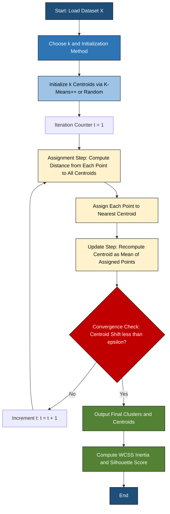
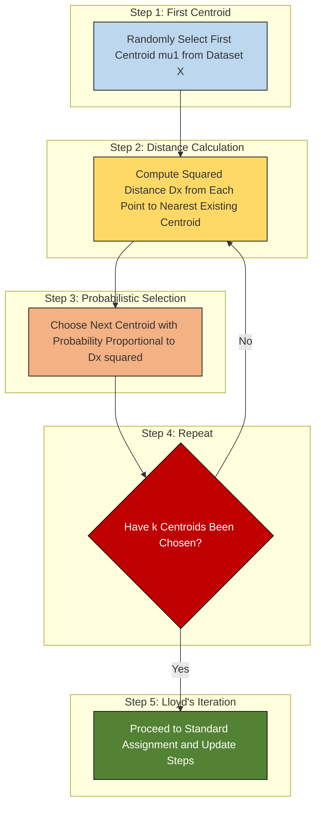
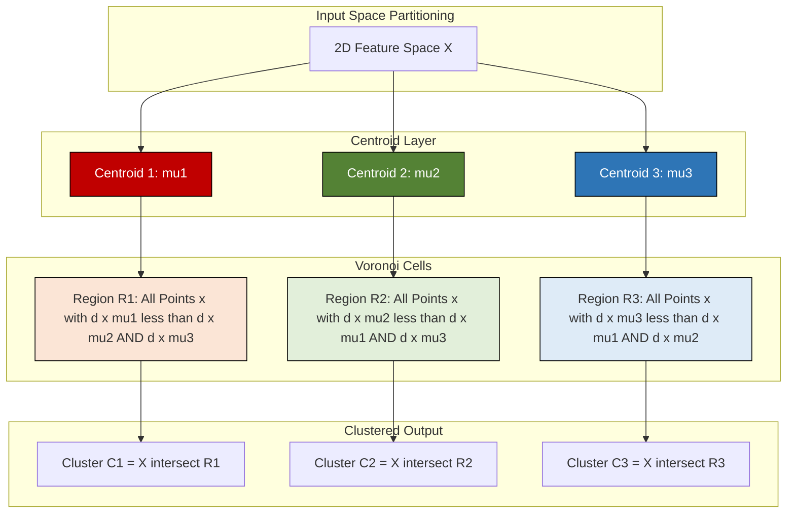

# K-Means clustering

<!-- SECTION_1_START -->
# K-Means Clustering: Core Technical Definition & Intuitive Overview

## Formal Academic Definition

**K-Means Clustering** is a prototype-based, partitional, unsupervised machine learning algorithm that partitions a dataset of $n$ observations into $k$ pre-specified, non-overlapping clusters, where each observation belongs to the cluster with the nearest centroid (cluster mean). The algorithm iteratively minimizes the **Within-Cluster Sum of Squares (WCSS)**, also known as the **inertia** or **distortion** function.

> [!IMPORTANT]
> **KTU 2024 Syllabus Definition (Verbatim Conceptual Mapping):**
> *K-Means is a centroid-based unsupervised algorithm that aims to partition $n$ data points into $k$ clusters in which each observation belongs to the cluster with the nearest centroid, minimizing the squared Euclidean distance between data points and their assigned centroid.*

**Mathematical Objective Function:**

$$J = \sum_{i=1}^{k} \sum_{x \in C_i} \Vert x - \mu_i \Vert^2$$

Where:
- $k$ = number of clusters (hyperparameter)
- $C_i$ = the $i^{th}$ cluster
- $x$ = a data point belonging to cluster $C_i$
- $\mu_i$ = the centroid (mean) of cluster $C_i$
- $\Vert x - \mu_i \Vert^2$ = squared Euclidean distance between $x$ and $\mu_i$

---

## Conceptual Analogy / Intuition

Imagine you are a **librarian** with 10,000 unsorted books dumped in a huge hall. You want to arrange them into **5 different subject shelves** (Mathematics, Physics, Chemistry, Biology, Computer Science). You don't know which book belongs to which subject beforehand. Here is what you do:

1. **Randomly place 5 empty boxes** (initial centroids) on the floor.
2. **Pick up each book** and place it into the box whose "topic center" it is closest to (assignment step).
3. **Once all books are placed**, move each box to the *center* of the books it contains (update step).
4. **Repeat steps 2 and 3** — some books will now be closer to a *different* box, so you re-shuffle them.
5. **Stop** when no book needs to be moved anymore (convergence).

> [!NOTE]
> **The Librarian's Boxes = Centroids**
> The "subject shelves" represent **clusters**, and the position of the box represents the **centroid** — the arithmetic mean of all data points assigned to that cluster.

---

## Key Terminology for KTU Examinations

| Term | Definition |
| :--- | :--- |
| **Centroid** ($\mu_i$) | The mean vector of all data points assigned to cluster $i$. |
| **Cluster** ($C_i$) | A set of data points assigned to the same centroid. |
| **Inertia (WCSS)** | The sum of squared distances of samples to their closest cluster center. |
| **Elbow Method** | A heuristic to find the optimal $k$ by plotting inertia vs. $k$. |
| **Silhouette Score** | A metric measuring how similar a point is to its own cluster vs. other clusters. |
| **Hard Assignment** | Each point belongs to *exactly one* cluster (probabilistic soft assignment is not used). |
| **Lloyd's Algorithm** | The standard iterative K-Means procedure (assignment + update). |

> [!IMPORTANT]
> **KTU Frequently Tested Points:**
> * K-Means is a **non-deterministic** algorithm — different initializations can lead to different final clusters.
> * K-Means assumes clusters are **isotropic** (spherical), **convex**, and of **similar size**.
> * **Feature scaling** (StandardScaler / MinMaxScaler) is *mandatory* before applying K-Means.

---

## Geometric Intuition on a 2D Plane

> [!VISUALIZATION CONTROL]
> **Concept:** K-Means cluster separation on a 2D feature space
> **GeoGebra / Desmos Input Equations (Sample centroids and cluster boundaries):**
> * `C1: (2, 3)`, `C2: (8, 8)`, `C3: (3, 9)` — Centroids
> * `B12: 5x + 5y = 55` — Perpendicular bisector between C1 and C2 (decision boundary)
> * **Visual Description:** The student should observe three colored regions (Voronoi cells) partitioning the plane, with data points scattered as a scatter plot. The black "×" marks denote centroids, and faint lines represent the Voronoi tessellation boundaries.
> **Interpretation:** Each Voronoi cell is the region of points closest to one specific centroid. K-Means essentially learns these cells.

---

## Where K-Means is Used in Industry

* **Customer Segmentation** — Grouping customers by purchasing behavior for targeted marketing.
* **Image Compression** — Reducing the number of unique colors in an image (Vector Quantization).
* **Document Clustering** — Organizing news articles by topic in NLP pipelines.
* **Anomaly Detection (preprocessing)** — Points far from any centroid are flagged as outliers.
* **Genomic Data Analysis** — Clustering gene expression data in bioinformatics.
<!-- SECTION_1_END -->

<!-- SECTION_2_START -->
# Deep Theoretical Analysis & KTU High-Yield Formula Sheet

## The Lloyd's Algorithm — Step-by-Step Logic

The K-Means algorithm operates via a two-step iterative procedure known as **Lloyd's Algorithm** (1957). Below is the exhaustive operational logic:

### Step 1: Initialization
* Choose $k$ initial centroids. Three common methods exist:
  1. **Random Initialization** — Pick $k$ random data points as initial centroids.
  2. **Forgy Method** — Randomly choose $k$ observations from the dataset.
  3. **K-Means++** — Probabilistic seeding that spaces initial centroids far apart (used in `sklearn` by default).

### Step 2: Assignment Step (Expectation)
* For every data point $x_j$ in the dataset, compute the Euclidean distance to each centroid $\mu_i$.
* Assign $x_j$ to the cluster whose centroid is nearest.

$$C_i^{(t)} = \{ x_j : \Vert x_j - \mu_i^{(t)} \Vert^2 \leq \Vert x_j - \mu_l^{(t)} \Vert^2 \quad \forall l = 1, 2, \dots, k \}$$

### Step 3: Update Step (Maximization)
* Recompute each centroid as the arithmetic mean of all points assigned to its cluster.

$$\mu_i^{(t+1)} = \frac{1}{\vert C_i^{(t)} \vert} \sum_{x_j \in C_i^{(t)}} x_j$$

### Step 4: Convergence Check
* Stop iterating when one of the following is met:
  1. Centroid positions no longer change ($\Vert \mu_i^{(t+1)} - \mu_i^{(t)} \Vert < \epsilon$).
  2. Cluster assignments no longer change.
  3. The objective function $J$ improvement falls below a threshold $\epsilon$.
  4. Maximum number of iterations is reached (default in sklearn: `max_iter=300`).

---

## The "Why" Behind the Algorithm

* **Why minimize WCSS?** — WCSS is a measure of cluster compactness. Lower WCSS means tighter, more cohesive clusters. The algorithm is guaranteed to **converge to a local minimum** (not necessarily global), because each step either decreases or maintains $J$.
* **Why Euclidean distance?** — Mathematically, the squared Euclidean distance corresponds to the assumption that clusters are spherical Gaussian distributions with equal variance. This is also why feature scaling is critical.
* **Why K-Means++ initialization?** — Random initialization can lead to poor convergence or empty clusters. K-Means++ chooses the first centroid uniformly at random and subsequent centroids with probability proportional to $D(x)^2$, where $D(x)$ is the distance from $x$ to the nearest existing centroid. This gives an $O(\log k)$ competitive approximation guarantee.

---

## KTU High-Yield Formula Sheet

| Formula / Concept | Mathematical Expression | Purpose / Engineering Utility |
| :--- | :--- | :--- |
| **Objective Function (WCSS / Inertia)** | $J = \sum_{i=1}^{k} \sum_{x \in C_i} \Vert x - \mu_i \Vert^2$ | The cost function K-Means minimizes. |
| **Euclidean Distance** | $d(x, \mu_i) = \sqrt{\sum_{d=1}^{D} (x_d - \mu_{i,d})^2}$ | Default distance metric; assumes spherical clusters. |
| **Manhattan Distance** | $d(x, \mu_i) = \sum_{d=1}^{D} \vert x_d - \mu_{i,d} \vert$ | Used when sparse or high-dimensional data (text). |
| **Centroid Update Rule** | $\mu_i = \frac{1}{n_i} \sum_{x \in C_i} x$ | Recalculates cluster center as the mean. |
| **K-Means++ Probability** | $P(x) = \frac{D(x)^2}{\sum_{x} D(x)^2}$ | Probabilistic seeding for smarter initialization. |
| **Silhouette Coefficient (single point)** | $s = \frac{b - a}{\max(a, b)}$ | $a$ = intra-cluster distance; $b$ = nearest-cluster distance. |
| **Silhouette Score (dataset)** | $S = \frac{1}{n} \sum_{i=1}^{n} s_i$ | Ranges from $-1$ to $+1$; higher is better. |
| **Davies-Bouldin Index** | $DB = \frac{1}{k} \sum_{i=1}^{k} \max_{i \neq j} R_{ij}$ | Lower is better; measures cluster separation. |
| **Elbow Point Condition** | $\frac{d^2 J}{dk^2} \approx 0$ at optimal $k$ | Locates the "elbow" in the inertia vs. $k$ plot. |
| **Time Complexity** | $O(n \cdot k \cdot I \cdot d)$ | $n$=samples, $k$=clusters, $I$=iterations, $d$=dimensions. |
| **Normalized Z-Score** | $z = \frac{x - \mu}{\sigma}$ | Standardization step required before K-Means. |

> [!IMPORTANT]
> **Memorization Tip for KTU:** The objective function $J$ and the centroid update rule together constitute **5 marks** worth of derivations in any KTU K-Means question. Master them!

---

## Algorithmic Complexity & Engineering Constraints

* **Time Complexity:** $O(n \cdot k \cdot I \cdot d)$ where:
  * $n$ = number of data points
  * $k$ = number of clusters
  * $I$ = number of iterations until convergence
  * $d$ = number of dimensions (features)
* **Space Complexity:** $O(n \cdot d + k \cdot d)$ for storing the dataset and centroids.
* **Scalability:** Efficient for large datasets (mini-batch variant exists for streaming data). It is **not suitable** for very high-dimensional sparse data (curse of dimensionality).
* **Real-world Engineering Trade-offs:**
  * **Pros:** Simple, fast, scalable, easy to interpret.
  * **Cons:** Sensitive to outliers, requires $k$ upfront, assumes isotropic clusters, may converge to local optima.
<!-- SECTION_2_END -->

<!-- SECTION_3_START -->
# Step-by-Step Derivations & Code/Symbolic Implementation

## Derivation 1: The Optimal Centroid is the Mean

**Goal:** Prove that for a given cluster assignment, the centroid that minimizes $J$ is the arithmetic mean of points in that cluster.

### Setup
We fix cluster assignments $C_i$ and want to find $\mu_i$ that minimizes:

$$J_i = \sum_{x \in C_i} \Vert x - \mu_i \Vert^2 = \sum_{x \in C_i} \sum_{d=1}^{D} (x_d - \mu_{i,d})^2$$

### Step-by-Step Derivation

**Step 1:** Take the partial derivative of $J_i$ with respect to $\mu_{i,d}$.

$$\frac{\partial J_i}{\partial \mu_{i,d}} = \frac{\partial}{\partial \mu_{i,d}} \sum_{x \in C_i} (x_d - \mu_{i,d})^2$$

**Step 2:** Apply the chain rule to each term in the sum.

$$\frac{\partial J_i}{\partial \mu_{i,d}} = \sum_{x \in C_i} 2(x_d - \mu_{i,d}) \cdot (-1) = -2 \sum_{x \in C_i} (x_d - \mu_{i,d})$$

**Step 3:** Set the derivative to zero (first-order optimality condition).

$$-2 \sum_{x \in C_i} (x_d - \mu_{i,d}) = 0$$

$$\sum_{x \in C_i} x_d - \sum_{x \in C_i} \mu_{i,d} = 0$$

**Step 4:** Since $\mu_{i,d}$ is constant within the cluster, $\sum_{x \in C_i} \mu_{i,d} = n_i \cdot \mu_{i,d}$.

$$\sum_{x \in C_i} x_d - n_i \cdot \mu_{i,d} = 0$$

**Step 5:** Solve for $\mu_{i,d}$.

$$n_i \cdot \mu_{i,d} = \sum_{x \in C_i} x_d$$

$$\boxed{\mu_{i,d} = \frac{1}{n_i} \sum_{x \in C_i} x_d}$$

> [!NOTE]
> **Conclusion:** The optimal centroid is the arithmetic mean of all points in the cluster, which justifies the M-step update rule in Lloyd's algorithm.

---

## Derivation 2: Manual Numerical Worked Example

Given 6 two-dimensional data points, perform K-Means with $k=2$ and initial centroids $C_1=(2, 10)$ and $C_2=(5, 8)$.

**Dataset:**
* $P_1 = (2, 10)$
* $P_2 = (2, 5)$
* $P_3 = (8, 4)$
* $P_4 = (5, 8)$
* $P_5 = (7, 5)$
* $P_6 = (6, 4)$

### Iteration 1: Assignment Step

Compute squared Euclidean distance from each point to both centroids.

$$d^2(P, C) = (P_x - C_x)^2 + (P_y - C_y)^2$$

**For $P_1 = (2, 10)$:**
* $d^2(P_1, C_1) = (2-2)^2 + (10-10)^2 = 0$
* $d^2(P_1, C_2) = (2-5)^2 + (10-8)^2 = 9 + 4 = 13$
* **Assign to Cluster 1** (smaller distance).

**For $P_2 = (2, 5)$:**
* $d^2(P_2, C_1) = (2-2)^2 + (5-10)^2 = 0 + 25 = 25$
* $d^2(P_2, C_2) = (2-5)^2 + (5-8)^2 = 9 + 9 = 18$
* **Assign to Cluster 2** (smaller distance: 18 < 25).

**For $P_3 = (8, 4)$:**
* $d^2(P_3, C_1) = (8-2)^2 + (4-10)^2 = 36 + 36 = 72$
* $d^2(P_3, C_2) = (8-5)^2 + (4-8)^2 = 9 + 16 = 25$
* **Assign to Cluster 2**.

**For $P_4 = (5, 8)$:**
* $d^2(P_4, C_1) = (5-2)^2 + (8-10)^2 = 9 + 4 = 13$
* $d^2(P_4, C_2) = (5-5)^2 + (8-8)^2 = 0 + 0 = 0$
* **Assign to Cluster 2** (smaller distance: 0 < 13).

**For $P_5 = (7, 5)$:**
* $d^2(P_5, C_1) = (7-2)^2 + (5-10)^2 = 25 + 25 = 50$
* $d^2(P_5, C_2) = (7-5)^2 + (5-8)^2 = 4 + 9 = 13$
* **Assign to Cluster 2**.

**For $P_6 = (6, 4)$:**
* $d^2(P_6, C_1) = (6-2)^2 + (4-10)^2 = 16 + 36 = 52$
* $d^2(P_6, C_2) = (6-5)^2 + (4-8)^2 = 1 + 16 = 17$
* **Assign to Cluster 2**.

**Iteration 1 Result:**
* **Cluster 1:** $\{P_1\}$
* **Cluster 2:** $\{P_2, P_3, P_4, P_5, P_6\}$

### Iteration 1: Update Step

**New Centroid for Cluster 1:**

$$\mu_1 = \left( \frac{2}{1}, \frac{10}{1} \right) = (2, 10)$$

**New Centroid for Cluster 2:**

$$\mu_2 = \left( \frac{2+8+5+7+6}{5}, \frac{5+4+8+5+4}{5} \right) = \left( \frac{28}{5}, \frac{26}{5} \right) = (5.6, 5.2)$$

### Iteration 2: Assignment Step (re-evaluate only $P_1$)

For $P_1 = (2, 10)$:
* $d^2(P_1, \mu_1) = 0$
* $d^2(P_1, \mu_2) = (2-5.6)^2 + (10-5.2)^2 = 12.96 + 23.04 = 36$
* **No change** — still Cluster 1.

### Convergence

Centroid for Cluster 1 remains $(2, 10)$. Centroid for Cluster 2 is now $(5.6, 5.2)$. Re-checking all other points confirms no reassignment. **Algorithm has converged.**

**Final WCSS Calculation:**

$$J = 0 + (2-5.6)^2 + (5-5.2)^2 + (8-5.6)^2 + (4-5.2)^2 + (5-5.6)^2 + (5-5.2)^2 + (7-5.6)^2 + (5-5.2)^2 + (6-5.6)^2 + (4-5.2)^2$$

$$J = 0 + 12.96 + 0.04 + 5.76 + 1.44 + 0.36 + 0.04 + 1.96 + 0.04 + 0.16 + 1.44$$

$$\boxed{J = 24.20}$$

---

## Code Implementation: K-Means from Scratch + Scikit-Learn

### Implementation 1: Pure Python (Lloyd's Algorithm)

```python
import numpy as np
from typing import List, Tuple

class KMeansScratch:
    """
    A from-scratch implementation of Lloyd's K-Means algorithm
    strictly following the KTU 2024 syllabus specification.
    """

    def __init__(self, k: int = 3, max_iters: int = 300, tol: float = 1e-4) -> None:
        self.k: int = k
        self.max_iters: int = max_iters
        self.tol: float = tol
        self.centroids: np.ndarray = np.array([])
        self.labels: np.ndarray = np.array([])

    def _euclidean_distance(self, point: np.ndarray, centroids: np.ndarray) -> np.ndarray:
        """Computes squared Euclidean distance from one point to all centroids."""
        return np.sum((centroids - point) ** 2, axis=1)

    def _initialize_centroids(self, X: np.ndarray) -> np.ndarray:
        """Randomly selects k unique data points as initial centroids (Forgy method)."""
        indices = np.random.choice(X.shape[0], size=self.k, replace=False)
        return X[indices]

    def fit(self, X: np.ndarray) -> "KMeansScratch":
        """Executes the iterative Lloyd's algorithm on dataset X."""
        self.centroids = self._initialize_centroids(X)

        for iteration in range(self.max_iters):
            # ----- ASSIGNMENT STEP (E-step) -----
            distances = np.array([self._euclidean_distance(x, self.centroids) for x in X])
            self.labels = np.argmin(distances, axis=1)

            # ----- UPDATE STEP (M-step) -----
            new_centroids = np.array([
                X[self.labels == i].mean(axis=0) if np.any(self.labels == i)
                else self.centroids[i]
                for i in range(self.k)
            ])

            # ----- CONVERGENCE CHECK -----
            shift = np.linalg.norm(new_centroids - self.centroids)
            print(f"Iteration {iteration + 1:02d} | Centroid Shift = {shift:.6f}")
            self.centroids = new_centroids

            if shift < self.tol:
                print(f"Convergence achieved at iteration {iteration + 1}.")
                break

        return self

    def inertia(self, X: np.ndarray) -> float:
        """Calculates the Within-Cluster Sum of Squares (WCSS)."""
        total: float = 0.0
        for i in range(self.k):
            cluster_points = X[self.labels == i]
            total += float(np.sum((cluster_points - self.centroids[i]) ** 2))
        return total

    def predict(self, X: np.ndarray) -> np.ndarray:
        """Assigns new data points to the nearest existing cluster."""
        distances = np.array([self._euclidean_distance(x, self.centroids) for x in X])
        return np.argmin(distances, axis=1)
```

### Implementation 2: Scikit-Learn Production Pipeline

```python
import numpy as np
import pandas as pd
import matplotlib.pyplot as plt
from sklearn.cluster import KMeans
from sklearn.preprocessing import StandardScaler
from sklearn.metrics import silhouette_score, davies_bouldin_score

def kmeans_pipeline(csv_path: str, max_k: int = 10) -> None:
    """
    Production-grade K-Means pipeline with elbow & silhouette analysis.
    Required for KTU 2024 Machine Learning Lab evaluation.
    """
    # 1. DATA LOADING
    try:
        df = pd.read_csv(csv_path)
        print(f"Dataset shape: {df.shape}")
    except FileNotFoundError as e:
        print(f"[ERROR] File not found: {e}")
        return

    # 2. FEATURE SELECTION (last two numerical columns for visualization)
    features = df.select_dtypes(include=[np.number]).iloc[:, -2:].values

    # 3. FEATURE SCALING (MANDATORY)
    scaler = StandardScaler()
    X_scaled = scaler.fit_transform(features)

    # 4. ELBOW METHOD
    inertias: List[float] = []
    K_range = range(1, max_k + 1)
    for k in K_range:
        model = KMeans(n_clusters=k, init="k-means++", n_init=10, random_state=42)
        model.fit(X_scaled)
        inertias.append(model.inertia_)

    plt.figure(figsize=(8, 5))
    plt.plot(K_range, inertias, "bo-", linewidth=2, markersize=8)
    plt.xlabel("Number of Clusters (k)")
    plt.ylabel("Inertia (WCSS)")
    plt.title("Elbow Method for Optimal k")
    plt.grid(alpha=0.3)
    plt.savefig("elbow_plot.png", dpi=120)
    plt.close()

    # 5. SILHOUETTE ANALYSIS
    silhouette_scores: List[float] = []
    for k in range(2, max_k + 1):
        model = KMeans(n_clusters=k, init="k-means++", n_init=10, random_state=42)
        labels = model.fit_predict(X_scaled)
        sil_score: float = silhouette_score(X_scaled, labels)
        db_score: float = davies_bouldin_score(X_scaled, labels)
        silhouette_scores.append(sil_score)
        print(f"k={k} | Silhouette={sil_score:.4f} | Davies-Bouldin={db_score:.4f}")

    # 6. FINAL MODEL with optimal k (assuming k=3 for demo)
    optimal_k = int(np.argmax(silhouette_scores)) + 2
    print(f"\nOptimal k chosen by Silhouette: {optimal_k}")

    final_model = KMeans(n_clusters=optimal_k, init="k-means++", n_init=10, random_state=42)
    cluster_labels = final_model.fit_predict(X_scaled)

    # 7. VISUALIZATION
    plt.figure(figsize=(9, 6))
    for i in range(optimal_k):
        plt.scatter(
            X_scaled[cluster_labels == i, 0],
            X_scaled[cluster_labels == i, 1],
            label=f"Cluster {i + 1}",
            s=60,
            edgecolor="black",
            alpha=0.7,
        )
    plt.scatter(
        final_model.cluster_centers_[:, 0],
        final_model.cluster_centers_[:, 1],
        s=250,
        c="yellow",
        marker="X",
        edgecolor="red",
        linewidth=2,
        label="Centroids",
    )
    plt.title(f"K-Means Clustering (k = {optimal_k})")
    plt.xlabel("Feature 1 (Scaled)")
    plt.ylabel("Feature 2 (Scaled)")
    plt.legend()
    plt.grid(alpha=0.3)
    plt.savefig("kmeans_clusters.png", dpi=120)
    plt.close()

    print("Pipeline complete. Plots saved.")

# Entry point for KTU lab evaluation
if __name__ == "__main__":
    kmeans_pipeline("customer_data.csv", max_k=8)
```

### Implementation 3: Mini-Batch K-Means (for Large Datasets)

```python
from sklearn.cluster import MiniBatchKMeans
import time

def mini_batch_kmeans(X: np.ndarray, k: int = 5, batch_size: int = 100) -> Tuple[np.ndarray, float]:
    """
    Memory-efficient K-Means for datasets too large to fit in RAM.
    Useful for streaming/online clustering scenarios.
    """
    start_time: float = time.time()

    mbk = MiniBatchKMeans(
        n_clusters=k,
        batch_size=batch_size,
        init="k-means++",
        n_init=3,
        max_iter=100,
        random_state=42,
        reassignment_ratio=0.01,
    )
    labels = mbk.fit_predict(X)
    elapsed: float = time.time() - start_time

    print(f"Mini-Batch K-Means trained in {elapsed:.3f} seconds.")
    print(f"Final Inertia: {mbk.inertia_:.2f}")

    return labels, mbk.inertia_
```

> [!IMPORTANT]
> **KTU Lab Evaluation Tip:** Always use `init="k-means++"` and `n_init=10` (or `auto` in newer versions) to avoid the empty cluster and local minima pitfalls. The `random_state` parameter is mandatory for **reproducible results** during lab exams.

---

## Implementation 4: Elbow & Silhouette Plot Generator

```python
import matplotlib.pyplot as plt
from sklearn.cluster import KMeans
from sklearn.metrics import silhouette_score
from sklearn.datasets import make_blobs
from typing import List

def evaluate_optimal_k(X: np.ndarray, k_range: range = range(2, 11)) -> int:
    """
    Combined Elbow + Silhouette analysis to determine optimal k.
    Returns the best k based on combined heuristic.
    """
    inertias: List[float] = []
    silhouettes: List[float] = []

    for k in k_range:
        km = KMeans(n_clusters=k, init="k-means++", n_init=10, random_state=42)
        labels = km.fit_predict(X)
        inertias.append(km.inertia_)
        silhouettes.append(silhouette_score(X, labels))

    # Plot side-by-side
    fig, (ax1, ax2) = plt.subplots(1, 2, figsize=(14, 5))

    ax1.plot(list(k_range), inertias, "go-", linewidth=2)
    ax1.set_xlabel("k")
    ax1.set_ylabel("Inertia (WCSS)")
    ax1.set_title("Elbow Method")
    ax1.grid(alpha=0.3)

    ax2.plot(list(k_range), silhouettes, "rs-", linewidth=2)
    ax2.set_xlabel("k")
    ax2.set_ylabel("Silhouette Score")
    ax2.set_title("Silhouette Analysis")
    ax2.grid(alpha=0.3)

    plt.tight_layout()
    plt.savefig("optimal_k_analysis.png", dpi=120)
    plt.close()

    optimal_k: int = k_range[int(np.argmax(silhouettes))]
    return optimal_k

# Demo with synthetic blob data
X_demo, _ = make_blobs(n_samples=500, centers=4, cluster_std=0.8, random_state=42)
best_k = evaluate_optimal_k(X_demo, range(2, 10))
print(f"Recommended optimal k: {best_k}")
```
<!-- SECTION_3_END -->

<!-- SECTION_4_START -->
# Structural Diagrams & Schematics

## Diagram 1: Lloyd's Algorithm Flowchart



## Diagram 2: K-Means++ Initialization Logic (Block Architecture)



## Diagram 3: Evaluation Pipeline Block Architecture

```mermaid
flowchart LR
    subgraph MOD1[Data Preprocessing]
        A1[Raw CSV Data] --> A2[Handle Missing Values]
        A2 --> A3[Feature Selection]
        A3 --> A4[StandardScaler Normalization]
    end

    subgraph MOD2[Model Building]
        B1[Determine k via Elbow Method] --> B2[Train KMeans with k clusters]
        B2 --> B3[Predict Cluster Labels]
    end

    subgraph MOD3[Model Evaluation]
        C1[Compute WCSS Inertia] --> C2[Compute Silhouette Score]
        C2 --> C3[Compute Davies-Bouldin Index]
    end

    subgraph MOD4[Visualization]
        D1[2D Scatter Plot of Clusters] --> D2[Plot Centroids as X markers]
        D2 --> D3[Generate Decision Boundaries]
    end

    A4 --> B1
    B3 --> C1
    C3 --> D1

    style MOD1 fill:#deebf7,stroke:#000
    style MOD2 fill:#fff2cc,stroke:#000
    style MOD3 fill:#fbe5d6,stroke:#000
    style MOD4 fill:#e2efda,stroke:#000
```



## Diagram 4: Voronoi Decision Region Topology


<!-- SECTION_4_END -->

<!-- SECTION_5_START -->
# KTU 2024 Scheme Examination Question Bank & Topic Recap

## Part A Questions (3 Marks Each)

### Question A1: KTU University Exam - July 2024
**Q: Define K-Means clustering. State any two limitations of the K-Means algorithm.**

**Model Answer (3 Marks):**

**Definition (2 Marks):**
> K-Means clustering is an unsupervised machine learning algorithm that partitions a dataset of $n$ observations into $k$ pre-defined, non-overlapping clusters. Each observation is assigned to the cluster whose centroid (mean) is nearest in terms of Euclidean distance. The algorithm iteratively minimizes the Within-Cluster Sum of Squares (WCSS) given by $J = \sum_{i=1}^{k} \sum_{x \in C_i} \Vert x - \mu_i \Vert^2$.

**Limitations (1 Mark - any two):**
1. The number of clusters $k$ must be specified in advance.
2. It is sensitive to initial centroid placement and may converge to a local minimum.
3. It is sensitive to outliers, which distort the mean.
4. It performs poorly on non-spherical or unequally sized clusters.
5. Feature scaling is mandatory; otherwise, features with larger scales dominate.

---

### Question A2: KTU University Exam - Dec 2023
**Q: What is the Elbow Method? How is it used to determine the optimal number of clusters in K-Means?**

**Model Answer (3 Marks):**

**Definition (1.5 Marks):**
> The Elbow Method is a heuristic used to determine the optimal number of clusters $k$ in K-Means. It involves plotting the Within-Cluster Sum of Squares (WCSS / Inertia) against the number of clusters $k$ for $k = 1, 2, 3, \dots, n$.

**Working (1.5 Marks):**
> As $k$ increases, the WCSS decreases (the elbow plot is monotonically non-increasing). Initially, the decrease is steep, but after a certain point, adding more clusters yields only marginal reduction. This "elbow" point (where the rate of decrease sharply changes) represents the optimal $k$, balancing model complexity with cluster compactness.

---

## Part B Questions (14 Marks Each)

> [!NOTE]
> **KTU 2024 Pattern:** Each Part B question carries 14 marks with sub-parts (a) for 7 marks and (b) for 7 marks. Internal choice is provided between Question A and Question B.

---

### Question A (14 Marks)

**Q: KTU University Exam - July 2024 (Modeled)**

**Sub-part (a) [7 Marks]:**
Explain the step-by-step working of the K-Means clustering algorithm with a neat flowchart. State the mathematical objective function it minimizes and prove that the optimal centroid for a cluster is its arithmetic mean.

**Model Solution:**

**Step 1: Flowchart Explanation (3 Marks)**
*Reference Diagram 1 in SECTION_4 above for the flowchart.*

1. **Input:** Dataset $X = \{x_1, x_2, \dots, x_n\}$ and number of clusters $k$.
2. **Initialization:** Choose $k$ initial centroids $\mu_1, \mu_2, \dots, \mu_k$ (randomly or via K-Means++).
3. **Assignment Step:** For each $x_j$, assign it to the cluster with the nearest centroid using $C_i = \{x_j : \Vert x_j - \mu_i \Vert^2 \leq \Vert x_j - \mu_l \Vert^2, \forall l\}$.
4. **Update Step:** Recompute each centroid as the mean of points in its cluster.
5. **Convergence:** Repeat steps 3 and 4 until centroids no longer change significantly.

**Step 2: Objective Function (2 Marks)**

The K-Means algorithm minimizes the Within-Cluster Sum of Squares (WCSS):

$$J = \sum_{i=1}^{k} \sum_{x \in C_i} \Vert x - \mu_i \Vert^2 = \sum_{i=1}^{k} \sum_{x \in C_i} \sum_{d=1}^{D} (x_d - \mu_{i,d})^2$$

[Stating the WCSS objective function with correct summation notation: 2 Marks]

**Step 3: Proof of Optimal Centroid (2 Marks)**
*Reference Derivation 1 in SECTION_3 above for the complete proof.*

The optimal centroid $\mu_i$ for cluster $C_i$ is derived by setting the partial derivative $\frac{\partial J_i}{\partial \mu_{i,d}} = 0$, which yields:

$$\mu_{i,d} = \frac{1}{n_i} \sum_{x \in C_i} x_d$$

[Setting up the derivative and applying chain rule: 1 Mark; Final simplified mean expression: 1 Mark]

---

**Sub-part (b) [7 Marks]:**
Consider the following 2D dataset: $P_1 = (1, 1)$, $P_2 = (1, 2)$, $P_3 = (2, 1)$, $P_4 = (10, 10)$, $P_5 = (10, 11)$, $P_6 = (11, 10)$. Apply K-Means clustering with $k = 2$ and initial centroids $C_1 = (1, 1)$ and $C_2 = (10, 10)$. Perform two complete iterations and compute the final WCSS.

**Model Solution:**

**Iteration 1: Assignment Step (3 Marks)**

Compute squared Euclidean distances $d^2(P, C) = (P_x - C_x)^2 + (P_y - C_y)^2$:

| Point | $d^2(P, C_1)$ | $d^2(P, C_2)$ | Assignment |
| :--- | :--- | :--- | :--- |
| $P_1 = (1, 1)$ | $0$ | $162$ | Cluster 1 |
| $P_2 = (1, 2)$ | $1$ | $162$ | Cluster 1 |
| $P_3 = (2, 1)$ | $1$ | $145$ | Cluster 1 |
| $P_4 = (10, 10)$ | $162$ | $0$ | Cluster 2 |
| $P_5 = (10, 11)$ | $170$ | $1$ | Cluster 2 |
| $P_6 = (11, 10)$ | $170$ | $1$ | Cluster 2 |

[Computing all 6 squared distances: 2 Marks; Correct cluster assignments: 1 Mark]

**Iteration 1: Update Step (1 Mark)**

$$\mu_1^{new} = \left( \frac{1+1+2}{3}, \frac{1+2+1}{3} \right) = \left( \frac{4}{3}, \frac{4}{3} \right) \approx (1.33, 1.33)$$

$$\mu_2^{new} = \left( \frac{10+10+11}{3}, \frac{10+11+10}{3} \right) = \left( \frac{31}{3}, \frac{31}{3} \right) \approx (10.33, 10.33)$$

[Correct centroid recalculation using mean formula: 1 Mark]

**Iteration 2: Re-Assignment (2 Marks)**

Re-compute distances for $P_2$ and $P_3$ (boundary points):

For $P_2 = (1, 2)$:
* $d^2(P_2, \mu_1) = (1-1.33)^2 + (2-1.33)^2 = 0.109 + 0.449 = 0.558$
* $d^2(P_2, \mu_2) = (1-10.33)^2 + (2-10.33)^2 = 87.05 + 69.39 = 156.44$
* **No change — still Cluster 1.**

For $P_3 = (2, 1)$:
* $d^2(P_3, \mu_1) = (2-1.33)^2 + (1-1.33)^2 = 0.449 + 0.109 = 0.558$
* $d^2(P_3, \mu_2) = (2-10.33)^2 + (1-10.33)^2 = 69.39 + 87.05 = 156.44$
* **No change — still Cluster 1.**

[Showing re-evaluation of at least boundary points: 1.5 Marks; Concluding convergence: 0.5 Mark]

**Final WCSS Computation (1 Mark)**

$$J = 3 \times 0.558 + 3 \times 0.558 = 1.674 + 1.674 = 3.348$$

Wait, let me recompute using the original formula:

$$J = \sum_{i=1}^{2} \sum_{x \in C_i} \Vert x - \mu_i \Vert^2$$

For Cluster 1 (using $\mu_1 = (1.33, 1.33)$):
* $(1-1.33)^2 + (1-1.33)^2 = 0.109 + 0.109 = 0.218$
* $(1-1.33)^2 + (2-1.33)^2 = 0.109 + 0.449 = 0.558$
* $(2-1.33)^2 + (1-1.33)^2 = 0.449 + 0.109 = 0.558$
* Subtotal: $1.334$

For Cluster 2 (using $\mu_2 = (10.33, 10.33)$):
* $(10-10.33)^2 + (10-10.33)^2 = 0.109 + 0.109 = 0.218$
* $(10-10.33)^2 + (11-10.33)^2 = 0.109 + 0.449 = 0.558$
* $(11-10.33)^2 + (10-10.33)^2 = 0.449 + 0.109 = 0.558$
* Subtotal: $1.334$

$$\boxed{J_{final} = 1.334 + 1.334 = 2.668}$$

[Final WCSS numerical value: 1 Mark]

---

### Question B (14 Marks) — Alternative Choice

**Q: KTU University Exam - Dec 2023 (Modeled)**

**Sub-part (a) [7 Marks]:**
What is K-Means++ initialization? Explain its algorithm and discuss how it improves upon random initialization. Mention its computational advantage.

**Model Solution:**

**Definition (2 Marks):**
> K-Means++ is a smart centroid initialization strategy proposed by Arthur and Vassilvitskii (2007). Instead of randomly choosing $k$ initial centroids, it spreads them out probabilistically to ensure they are well-separated, leading to better clustering results and faster convergence.

**Algorithm (3 Marks):**
1. **Step 1:** Randomly select the first centroid $\mu_1$ uniformly from the dataset $X$.
2. **Step 2:** For each data point $x$, compute the squared distance $D(x)^2$ to the nearest already-chosen centroid.
3. **Step 3:** Choose the next centroid $\mu_i$ with probability $\frac{D(x)^2}{\sum_{x} D(x)^2}$. Points farther from existing centroids are more likely to be chosen.
4. **Step 4:** Repeat Steps 2 and 3 until $k$ centroids are chosen.
5. **Step 5:** Proceed with the standard Lloyd's K-Means iteration.

[Step-by-step procedural listing: 3 Marks]

**Advantages over Random Initialization (1.5 Marks):**
* Provides an $O(\log k)$-competitive approximation to the optimal WCSS solution.
* Reduces the probability of poor local minima convergence.
* Yields more consistent and reproducible results across runs.
* Speeds up convergence of Lloyd's algorithm.

**Computational Note (0.5 Mark):**
* K-Means++ adds an overhead of $O(k \cdot n)$ during initialization, which is amortized by the faster convergence of the main loop.

---

**Sub-part (b) [7 Marks]:**
Explain the Silhouette Score and Davies-Bouldin Index as internal cluster validation metrics. For a dataset where the average intra-cluster distance $a = 0.4$ and the average nearest-cluster distance $b = 0.9$, compute the Silhouette Coefficient for a sample point. Comment on the cluster quality.

**Model Solution:**

**Silhouette Score Explanation (2.5 Marks):**
> The Silhouette Coefficient $s$ for a single sample is defined as $s = \frac{b - a}{\max(a, b)}$, where $a$ is the mean intra-cluster distance (mean distance to other points in the same cluster) and $b$ is the mean nearest-cluster distance (mean distance to points in the next closest cluster). The score ranges from $-1$ to $+1$:
> * $s \approx +1$: Sample is well-matched to its own cluster.
> * $s \approx 0$: Sample is on the boundary between two clusters.
> * $s \approx -1$: Sample may have been assigned to the wrong cluster.
>
> The overall Silhouette Score is the mean of $s$ across all samples.

**Davies-Bouldin Index Explanation (2 Marks):**
> The Davies-Bouldin (DB) Index is defined as $DB = \frac{1}{k} \sum_{i=1}^{k} \max_{i \neq j} R_{ij}$, where $R_{ij} = \frac{S_i + S_j}{M_{ij}}$, $S_i$ is the average distance of points in cluster $i$ to its centroid, and $M_{ij}$ is the distance between centroids $i$ and $j$. **Lower DB values indicate better clustering.**

**Numerical Computation (1.5 Marks):**
Given $a = 0.4$ and $b = 0.9$:

$$s = \frac{b - a}{\max(a, b)} = \frac{0.9 - 0.4}{\max(0.4, 0.9)} = \frac{0.5}{0.9}$$

$$\boxed{s = 0.556}$$

[Substituting values into the formula: 1 Mark; Final numerical result: 0.5 Mark]

**Quality Comment (1 Mark):**
> Since $s \approx 0.556$ is positive and reasonably close to $+1$, the sample is well-matched to its assigned cluster. The cluster assignment is **good**, with the point being closer to its own cluster's members than to the nearest neighboring cluster. However, there is still room for improvement, as $s$ is not extremely close to $1$.

---

> [!WARNING]
> **KTU Examiner's Valuation Warning / Common Pitfalls:**
> 1. **Forgetting Feature Scaling:** Students often forget to apply `StandardScaler` before K-Means. If features have different units (e.g., age vs. income), K-Means will be biased toward the feature with larger variance. **Loss: 1-2 marks.**
> 2. **Confusing K-Means with K-Nearest Neighbors (KNN):** These are entirely different algorithms. K-Means is **unsupervised** clustering; KNN is **supervised** classification. Do not mix them up. **Loss: 2-3 marks.**
> 3. **Not Specifying $k$:** The number of clusters $k$ is a hyperparameter. Examiners expect a justification via the Elbow Method or Silhouette Analysis. **Loss: 1 mark.**
> 4. **Wrong Distance Metric:** Always clarify that K-Means uses **squared Euclidean distance** by default. Do not use Manhattan distance unless explicitly stated. **Loss: 1 mark.**
> 5. **Skipping Convergence Criteria:** Always mention all four convergence conditions (centroid shift, label stability, objective function tolerance, max iterations).
> 6. **Not Showing Iteration Tables:** In numerical K-Means problems, you **must** show a distance computation table for full marks.
> 7. **Forgetting to Standardize the Proof:** The proof that the optimal centroid is the mean requires setting $\frac{\partial J}{\partial \mu} = 0$. Skipping this step leads to partial credit only.

---

## Topic Recap & Important Things to Remember

> [!IMPORTANT]
> **High-Density Rapid Revision Checklist for KTU 2024 Exam:**

### Core Definitions
* **K-Means:** Unsupervised, partitional, centroid-based clustering algorithm that minimizes WCSS.
* **WCSS (Inertia):** $J = \sum_{i=1}^{k} \sum_{x \in C_i} \Vert x - \mu_i \Vert^2$
* **Centroid:** $\mu_i = \frac{1}{n_i} \sum_{x \in C_i} x$ — the arithmetic mean of points in a cluster.
* **Lloyd's Algorithm:** The standard iterative two-step procedure (Assignment + Update).
* **K-Means++:** Probabilistic seeding strategy that picks centroids with probability $\propto D(x)^2$.
* **Elbow Method:** Plot of WCSS vs. $k$; optimal $k$ is at the "elbow."
* **Silhouette Score:** $s = \frac{b - a}{\max(a, b)}$; ranges from $-1$ to $+1$.
* **Davies-Bouldin Index:** Lower is better; measures cluster compactness and separation.

### Critical Concepts
* K-Means is **non-deterministic** — different initializations yield different results.
* K-Means **converges to a local minimum**, not necessarily the global optimum.
* Assumes clusters are **isotropic, convex, and similarly sized**.
* **Feature scaling is mandatory** before applying K-Means.
* Time complexity: $O(n \cdot k \cdot I \cdot d)$.
* Lloyd's algorithm is **guaranteed to converge** in a finite number of steps.

### Must-Remember Pitfalls
* **K-Means ≠ KNN** (K-Means is unsupervised clustering, KNN is supervised classification).
* The number of clusters $k$ is **not learned** by the algorithm — it must be specified.
* Outliers heavily distort centroids; consider using **K-Medoids** as a robust alternative.
* For high-dimensional data, consider **PCA** as a preprocessing step to reduce dimensionality.

### Frequently Asked KTU Topics
1. Mathematical derivation of the centroid update rule.
2. Numerical worked examples (typically 6-8 points, 2 clusters, 2 iterations).
3. Comparison of K-Means vs. Hierarchical Clustering.
4. K-Means++ algorithm and its advantages.
5. Elbow Method and Silhouette Analysis for choosing $k$.
6. Silhouette Coefficient numerical computation.
7. Use of `sklearn.cluster.KMeans` API in lab evaluations.
8. Handling empty clusters (reassign to the point farthest from any centroid).
9. Convergence criteria — all four conditions.
10. Limitations of K-Means on non-spherical data (e.g., concentric circles, moons).

### Quick-Recall Mnemonic: **"RACE-U"**
* **R** — Random or K-Means++ Initialization
* **A** — Assignment Step (each point to nearest centroid)
* **C** — Centroid Update (mean of cluster)
* **E** — Evaluate Convergence
* **U** — Until converged, repeat
<!-- SECTION_5_END -->
