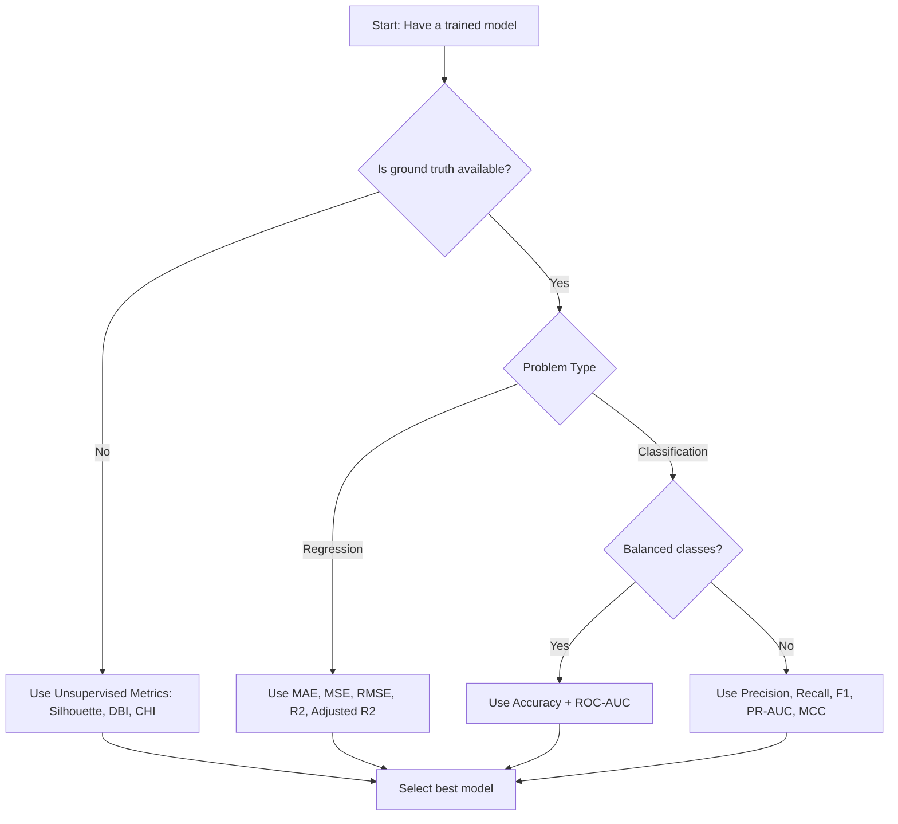
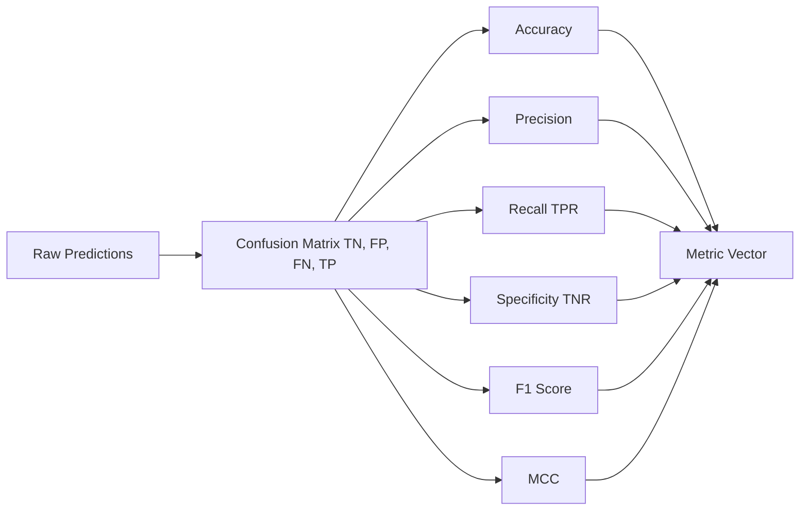
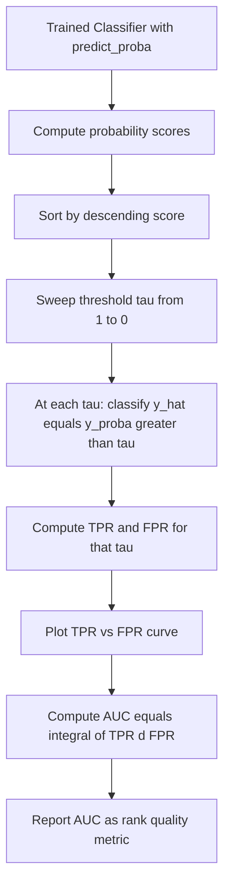
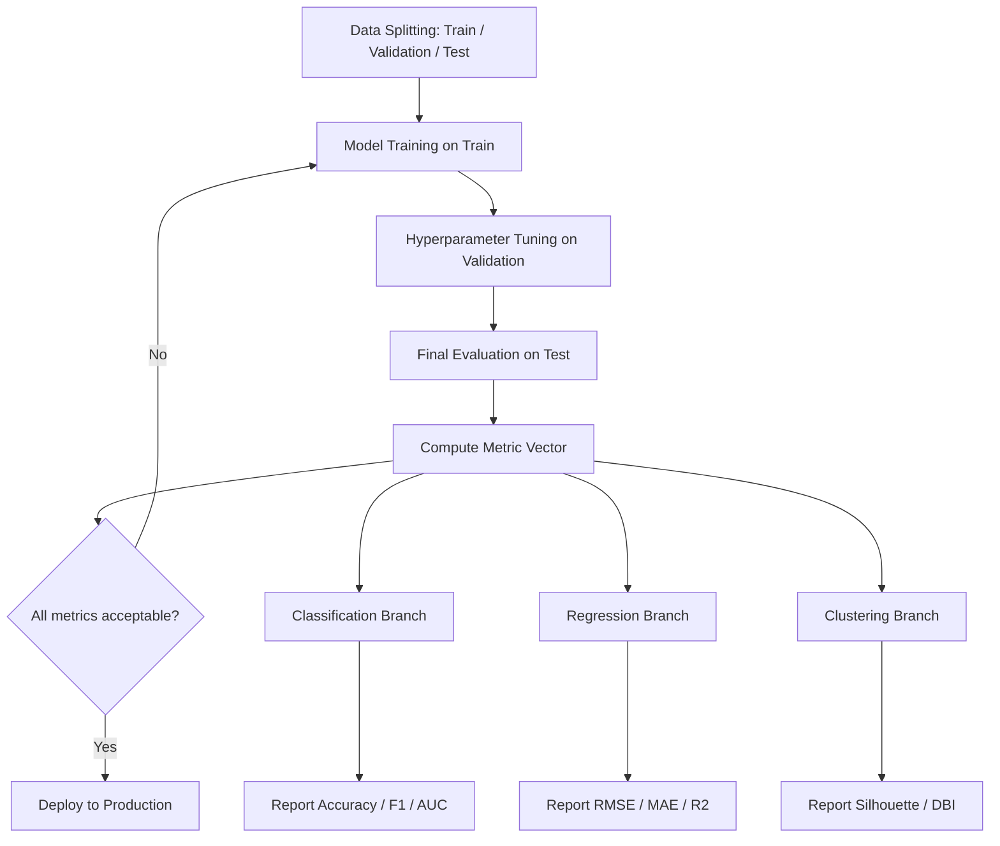

# Model performance metrics

<!-- SECTION_1_START -->
# Model Performance Metrics — Core Technical Definition & Intuitive Overview

## Formal KTU 2024 Syllabus Definition

**Model Performance Metrics** are quantitative measures used to evaluate how well a trained Machine Learning model generalises to unseen data. They provide an objective, mathematical basis for comparing candidate models, diagnosing weaknesses (such as bias or variance), and selecting the best model for deployment in production systems. In the context of the **PCCSL505 — Machine Learning & Analytics Lab**, these metrics are computed over a held-out test set or via cross-validation to ensure statistical robustness.

> [!IMPORTANT]
> **KTU 2024 Highlight:** A model is only as good as the metric used to judge it. A *single* accuracy number is **never** sufficient — students must always report a *vector* of complementary metrics appropriate to the problem type (classification, regression, or clustering).

---

## Conceptual Analogy / Intuition

Imagine a **medical diagnostic machine** screening patients for a rare disease. Out of 1,000 patients, only 50 actually have the disease.

- A *lazy* model that predicts "No disease" for **everyone** will achieve **95% accuracy** — yet it is completely useless because it misses **every** sick patient.
- The doctor (you) wants a model that **finds the sick patients** (high **Recall**), even if it raises a few false alarms (lower **Precision**).

This is the **Precision–Recall trade-off** — and it is the heart of model evaluation.

> [!NOTE]
> **Key Insight:** The choice of metric must align with the **business cost matrix**. A spam filter (cost of missing spam is low) optimises for Precision. A cancer detector (cost of missing cancer is fatal) optimises for Recall.

---

## Three Families of Metrics (Map to Problem Type)

| Problem Type | Metric Family | Example Metrics |
|---|---|---|
| **Classification** | Threshold-based, Rank-based | Accuracy, Precision, Recall, F1, ROC-AUC, PR-AUC |
| **Regression** | Error-magnitude based | MAE, MSE, RMSE, MAPE, $R^2$, Adjusted $R^2$ |
| **Clustering (Unsupervised)** | Internal / External validity | Silhouette Score, Davies-Bouldin Index, Calinski-Harabasz |

> [!VISUALIZATION CONTROL]
> **Concept:** Confusion Matrix as a 2x2 Probability Grid
> **GeoGebra / Desmos Input Equations:**
> * Point A: `(0, 0)` labelled **TN**
> * Point B: `(1, 0)` labelled **FP**
> * Point C: `(0, 1)` labelled **FN**
> * Point D: `(1, 1)` labelled **TP**
> **Visual Description:** A unit square is divided into four quadrants representing the four outcomes of a binary classifier. The **diagonal (TN, TP)** represents correct predictions; the **anti-diagonal (FP, FN)** represents errors. The student should observe how shifting the decision threshold moves samples between cells.

---

## Why Model Evaluation Cannot Be Skipped

1. **Generalisation Guarantee** — A model may memorise the training set (overfitting) and still score 100% on training data while failing on test data.
2. **Model Selection** — Multiple algorithms (Logistic Regression, SVM, Random Forest) may solve the same task; only metrics enable fair comparison.
3. **Hyperparameter Tuning** — Grid Search and Bayesian Optimisation rely on a *scoring function*, which is one of these metrics.
4. **Regulatory Compliance** — In healthcare and finance, deployed models must demonstrate a *documented* performance threshold (e.g., Recall $\geq 0.95$).

<!-- SECTION_1_END -->

<!-- SECTION_2_START -->
# Deep Theoretical Analysis & KTU High-Yield Formula Sheet

## 1. The Confusion Matrix (Foundation of All Classification Metrics)

For a **binary classifier**, every prediction falls into one of four cells:

| | Predicted Positive | Predicted Negative |
|---|---|---|
| **Actual Positive** | True Positive (TP) | False Negative (FN) |
| **Actual Negative** | False Positive (FP) | True Negative (TN) |

| | Predicted Positive | Predicted Negative | **Row Total** |
|---|---|---|---|
| **Actual Positive** | TP | FN | $P = TP + FN$ |
| **Actual Negative** | FP | TN | $N = FP + TN$ |
| **Column Total** | $\hat{P} = TP + FP$ | $\hat{N} = FN + TN$ | $N_{total}$ |

---

## 2. KTU Formula Sheet — Classification Metrics

> [!IMPORTANT]
> The vertical bar symbol `\vert` is used for cardinality so it does not collide with markdown table pipes.

| Metric | Formula | Intuition | Range |
|---|---|---|---|
| **Accuracy** | $\text{Acc} = \dfrac{TP + TN}{TP + TN + FP + FN}$ | Fraction of all correct predictions | $[0, 1]$ |
| **Error Rate** | $\text{Err} = 1 - \text{Acc} = \dfrac{FP + FN}{N_{total}}$ | Fraction of all wrong predictions | $[0, 1]$ |
| **Precision (PPV)** | $\text{Prec} = \dfrac{TP}{TP + FP}$ | Of those predicted positive, how many are right? | $[0, 1]$ |
| **Recall (TPR, Sensitivity)** | $\text{Rec} = \dfrac{TP}{TP + FN}$ | Of actual positives, how many did we catch? | $[0, 1]$ |
| **Specificity (TNR)** | $\text{Spec} = \dfrac{TN}{TN + FP}$ | Of actual negatives, how many did we correctly reject? | $[0, 1]$ |
| **F1-Score** | $F_1 = 2 \cdot \dfrac{\text{Prec} \cdot \text{Rec}}{\text{Prec} + \text{Rec}}$ | Harmonic mean of Precision and Recall | $[0, 1]$ |
| **F-beta Score** | $F_\beta = (1 + \beta^2) \cdot \dfrac{\text{Prec} \cdot \text{Rec}}{\beta^2 \cdot \text{Prec} + \text{Rec}}$ | Weighted harmonic mean | $[0, 1]$ |
| **False Positive Rate (FPR)** | $\text{FPR} = \dfrac{FP}{FP + TN} = 1 - \text{Spec}$ | Fall-out | $[0, 1]$ |
| **Matthews Correlation Coeff.** | $\text{MCC} = \dfrac{TP \cdot TN - FP \cdot FN}{\sqrt{(TP+FP)(TP+FN)(TN+FP)(TN+FN)}}$ | Balanced even for skewed classes | $[-1, 1]$ |
| **Cohen's Kappa** | $\kappa = \dfrac{p_o - p_e}{1 - p_e}$ | Agreement corrected for chance | $[-1, 1]$ |

> [!NOTE]
> **Why Harmonic Mean for F1?** The arithmetic mean of Precision = 0.9 and Recall = 0.1 would falsely give 0.5. The harmonic mean correctly yields $F_1 \approx 0.18$, reflecting the model's true weakness.

---

## 3. KTU Formula Sheet — Regression Metrics

| Metric | Formula | Unit Sensitivity |
|---|---|---|
| **Mean Absolute Error (MAE)** | $\text{MAE} = \dfrac{1}{n} \sum_{i=1}^{n} \vert y_i - \hat{y}_i \vert$ | Same unit as $y$ |
| **Mean Squared Error (MSE)** | $\text{MSE} = \dfrac{1}{n} \sum_{i=1}^{n} (y_i - \hat{y}_i)^2$ | Unit$^2$ |
| **Root Mean Squared Error (RMSE)** | $\text{RMSE} = \sqrt{\text{MSE}}$ | Same unit as $y$ |
| **Mean Absolute Percentage Error (MAPE)** | $\text{MAPE} = \dfrac{100\%}{n} \sum_{i=1}^{n} \left\vert \dfrac{y_i - \hat{y}_i}{y_i} \right\vert$ | Percentage |
| **Coefficient of Determination ($R^2$)** | $R^2 = 1 - \dfrac{\sum (y_i - \hat{y}_i)^2}{\sum (y_i - \bar{y})^2}$ | Unitless |
| **Adjusted $R^2$** | $R^2_{adj} = 1 - \dfrac{(1 - R^2)(n - 1)}{n - p - 1}$ | Unitless |

> [!IMPORTANT]
> **$R^2$ can be negative.** If a model performs *worse* than the mean predictor ($\bar{y}$), the residual sum of squares exceeds the total sum of squares, giving $R^2 < 0$.

---

## 4. KTU Formula Sheet — Unsupervised / Clustering Metrics

| Metric | Formula | Interpretation |
|---|---|---|
| **Silhouette Score** | $s(i) = \dfrac{b(i) - a(i)}{\max\{a(i), b(i)\}}$ where $a(i)$ = mean intra-cluster distance, $b(i)$ = nearest-cluster mean distance | $[-1, 1]$; higher is better |
| **Davies-Bouldin Index (DBI)** | $\text{DB} = \dfrac{1}{k} \sum_{i=1}^{k} \max_{j \neq i} \left( \dfrac{S_i + S_j}{M_{ij}} \right)$ | $\geq 0$; lower is better |
| **Calinski-Harabasz Index (CHI)** | $\text{CH} = \dfrac{\text{SS}_B / (k - 1)}{\text{SS}_W / (n - k)}$ | Higher is better |
| **Inertia (WCSS)** | $\text{Inertia} = \sum_{i=1}^{k} \sum_{x \in C_i} \vert\vert x - \mu_i \vert\vert^2$ | Lower is better; elbow method |
| **Adjusted Rand Index (ARI)** | $\text{ARI} = \dfrac{\text{RI} - \mathbb{E}[\text{RI}]}{\max(\text{RI}) - \mathbb{E}[\text{RI}]}$ | $[-1, 1]$; needs ground truth |
| **Normalized Mutual Info (NMI)** | $\text{NMI}(U, V) = \dfrac{2 \cdot I(U;V)}{H(U) + H(V)}$ | $[0, 1]$; needs ground truth |

---

## 5. ROC Curve and AUC — The Rank-Based View

The **Receiver Operating Characteristic (ROC)** curve plots $\text{TPR}$ (y-axis) against $\text{FPR}$ (x-axis) as the decision threshold $\tau$ sweeps from $1$ down to $0$.

$$
\text{AUC} = \int_0^1 \text{TPR}(\text{FPR}) \, d(\text{FPR})
$$

- **AUC = 1.0** → Perfect classifier.
- **AUC = 0.5** → Random guessing (the diagonal line).
- **AUC < 0.5** → Worse than random; flip the labels.

> [!NOTE]
> **PR-AUC (Precision-Recall AUC)** is preferred over ROC-AUC when classes are highly imbalanced, because ROC-AUC can be misleadingly optimistic on skewed datasets.

---

## 6. Real-World Engineering Utility

| Field | Application | Critical Metric |
|---|---|---|
| **Medical Diagnosis** | Cancer detection from X-ray | Recall (Sensitivity) |
| **Spam Filtering** | Email inbox classifier | Precision |
| **Credit Scoring** | Loan default prediction | F1 / AUC |
| **Recommender Systems** | Movie / product ranking | MAP, NDCG |
| **Weather Forecasting** | Rain prediction | Brier Score, AUC |
| **NLP (LLM Eval)** | Translation quality | BLEU, ROUGE, Perplexity |
| **Clustering (Customer Seg.)** | Marketing analytics | Silhouette, DBI |
| **Time-Series Forecasting** | Stock / energy prediction | RMSE, MAPE |

<!-- SECTION_2_END -->

<!-- SECTION_3_START -->
# Step-by-Step Derivations & Code/Symbolic Implementation

## Part A — Worked Numerical Example: Binary Classification

> [!NOTE]
> A model produces the following test set results for a spam detector. Compute the full metric vector.

**Given Data:**

| | Predicted Spam | Predicted Not Spam |
|---|---|---|
| **Actual Spam** | $TP = 45$ | $FN = 15$ |
| **Actual Not Spam** | $FP = 10$ | $TN = 230$ |

**Total samples:** $N_{total} = 45 + 15 + 10 + 230 = 300$.

### Step 1 — Accuracy

$$
\text{Accuracy} = \frac{TP + TN}{N_{total}} = \frac{45 + 230}{300} = \frac{275}{300} \approx 0.9167
$$

### Step 2 — Precision

$$
\text{Precision} = \frac{TP}{TP + FP} = \frac{45}{45 + 10} = \frac{45}{55} \approx 0.8182
$$

### Step 3 — Recall (Sensitivity)

$$
\text{Recall} = \frac{TP}{TP + FN} = \frac{45}{45 + 15} = \frac{45}{60} = 0.7500
$$

### Step 4 — Specificity

$$
\text{Specificity} = \frac{TN}{TN + FP} = \frac{230}{230 + 10} = \frac{230}{240} \approx 0.9583
$$

### Step 5 — F1-Score

$$
F_1 = 2 \cdot \frac{\text{Precision} \cdot \text{Recall}}{\text{Precision} + \text{Recall}} = 2 \cdot \frac{0.8182 \times 0.7500}{0.8182 + 0.7500}
$$

$$
F_1 = 2 \cdot \frac{0.6136}{1.5682} = 2 \cdot 0.3913 \approx 0.7826
$$

### Step 6 — False Positive Rate

$$
\text{FPR} = 1 - \text{Specificity} = 1 - 0.9583 = 0.0417
$$

### Step 7 — Matthews Correlation Coefficient

$$
\text{MCC} = \frac{TP \cdot TN - FP \cdot FN}{\sqrt{(TP+FP)(TP+FN)(TN+FP)(TN+FN)}}
$$

$$
\text{Numerator} = (45 \times 230) - (10 \times 15) = 10350 - 150 = 10200
$$

$$
\text{Denominator} = \sqrt{55 \times 60 \times 240 \times 230} = \sqrt{182{,}160{,}000} \approx 13496.67
$$

$$
\text{MCC} = \frac{10200}{13496.67} \approx 0.7557
$$

---

## Part B — Worked Numerical Example: Regression Metrics

**Given:** Five predictions versus true values.

| Index $i$ | True $y_i$ | Predicted $\hat{y}_i$ | Residual $e_i = y_i - \hat{y}_i$ |
|---|---|---|---|
| 1 | 3.0 | 2.5 | $0.5$ |
| 2 | 5.0 | 5.4 | $-0.4$ |
| 3 | 2.0 | 2.0 | $0.0$ |
| 4 | 7.0 | 6.2 | $0.8$ |
| 5 | 4.0 | 4.9 | $-0.9$ |

### Step 1 — MAE

$$
\text{MAE} = \frac{1}{5} \sum_{i=1}^{5} \vert e_i \vert = \frac{\vert 0.5 \vert + \vert -0.4 \vert + \vert 0.0 \vert + \vert 0.8 \vert + \vert -0.9 \vert}{5}
$$

$$
\text{MAE} = \frac{0.5 + 0.4 + 0.0 + 0.8 + 0.9}{5} = \frac{2.6}{5} = 0.52
$$

### Step 2 — MSE

$$
\text{MSE} = \frac{1}{5} \sum_{i=1}^{5} e_i^2 = \frac{0.25 + 0.16 + 0.00 + 0.64 + 0.81}{5} = \frac{1.86}{5} = 0.372
$$

### Step 3 — RMSE

$$
\text{RMSE} = \sqrt{0.372} \approx 0.6099
$$

### Step 4 — $R^2$

First compute the mean: $\bar{y} = \dfrac{3 + 5 + 2 + 7 + 4}{5} = \dfrac{21}{5} = 4.2$.

Total Sum of Squares: $\text{SS}_{tot} = \sum (y_i - \bar{y})^2 = (3-4.2)^2 + (5-4.2)^2 + (2-4.2)^2 + (7-4.2)^2 + (4-4.2)^2$

$$
\text{SS}_{tot} = 1.44 + 0.64 + 4.84 + 7.84 + 0.04 = 14.80
$$

Residual Sum of Squares: $\text{SS}_{res} = 1.86$ (from MSE $\times 5$).

$$
R^2 = 1 - \frac{\text{SS}_{res}}{\text{SS}_{tot}} = 1 - \frac{1.86}{14.80} = 1 - 0.1257 = 0.8743
$$

### Step 5 — Adjusted $R^2$ (with $p = 2$ features)

$$
R^2_{adj} = 1 - \frac{(1 - 0.8743)(5 - 1)}{5 - 2 - 1} = 1 - \frac{0.1257 \times 4}{2} = 1 - 0.2514 = 0.7486
$$

---

## Part C — Worked Numerical Example: Silhouette Score

For point $i$ assigned to cluster $C_A$, let $a(i)$ = mean distance to all other points in $C_A$, and $b(i)$ = minimum mean distance to points in any other cluster.

**Given:** $a(i) = 1.2$, $b(i) = 3.4$.

$$
s(i) = \frac{b(i) - a(i)}{\max\{a(i), b(i)\}} = \frac{3.4 - 1.2}{3.4} = \frac{2.2}{3.4} \approx 0.6471
$$

A score of $0.65$ indicates a well-clustered point (close to $+1$).

---

## Part D — Full Python Implementation (Lab-Ready)

```python
"""
Model Performance Metrics — Reference Implementation
Course   : PCCSL505 — Machine Learning & Analytics Lab
Module   : 2 — Unsupervised Learning and Model Evaluation
Topic    : Model Performance Metrics
Standard : scikit-learn 1.4+, NumPy 1.26+
"""
from __future__ import annotations

import logging
import numpy as np
from typing import Dict, Tuple
from sklearn.metrics import (
    accuracy_score, precision_score, recall_score, f1_score,
    confusion_matrix, classification_report, roc_auc_score,
    mean_absolute_error, mean_squared_error, r2_score,
    silhouette_score, davies_bouldin_score, calinski_harabasz_score,
    adjusted_rand_score, normalized_mutual_info_score,
)
from sklearn.model_selection import cross_val_score, StratifiedKFold
from sklearn.datasets import make_classification, make_regression, make_blobs
from sklearn.cluster import KMeans
from sklearn.linear_model import LogisticRegression, LinearRegression
from sklearn.ensemble import RandomForestClassifier
from sklearn.preprocessing import StandardScaler
from sklearn.pipeline import Pipeline

# -------------------------------------------------------------------
# Structured logging — required for production lab submissions
# -------------------------------------------------------------------
logging.basicConfig(
    level=logging.INFO,
    format="%(asctime)s | %(levelname)s | %(name)s | %(message)s",
)
logger = logging.getLogger("PCCSL505-METRICS")


# ===================================================================
# 1. CLASSIFICATION METRICS
# ===================================================================
def evaluate_classifier(
    y_true: np.ndarray,
    y_pred: np.ndarray,
    y_proba: np.ndarray | None = None,
) -> Dict[str, float]:
    """
    Compute the full classification-metric vector.

    Parameters
    ----------
    y_true   : Ground-truth integer labels {0, 1}
    y_pred   : Predicted integer labels
    y_proba  : Predicted probability of the positive class (for AUC)

    Returns
    -------
    Dictionary of metric_name -> value
    """
    if y_true.shape != y_pred.shape:
        raise ValueError(
            f"Shape mismatch: y_true {y_true.shape} vs y_pred {y_pred.shape}"
        )

    # ---- Confusion matrix
    tn, fp, fn, tp = confusion_matrix(y_true, y_pred).ravel()

    # ---- Defensive checks to prevent division by zero
    safe_tp_fp = tp + fp if (tp + fp) != 0 else 1
    safe_tp_fn = tp + fn if (tp + fn) != 0 else 1
    safe_tn_fp = tn + fp if (tn + fp) != 0 else 1

    metrics: Dict[str, float] = {
        "accuracy":           float(accuracy_score(y_true, y_pred)),
        "error_rate":         float(1.0 - accuracy_score(y_true, y_pred)),
        "precision":          float(tp / safe_tp_fp),
        "recall_tpr":         float(tp / safe_tp_fn),
        "specificity_tnr":    float(tn / safe_tn_fp),
        "fpr":                float(fp / safe_tn_fp),
        "f1_score":           float(f1_score(y_true, y_pred, zero_division=0)),
        "mcc":                float(
            (tp * tn - fp * fn)
            / np.sqrt(
                (tp + fp) * (tp + fn) * (tn + fp) * (tn + fn)
            ) if (tp + fp) * (tp + fn) * (tn + fp) * (tn + fn) > 0 else 0.0
        ),
    }

    if y_proba is not None:
        if len(np.unique(y_true)) < 2:
            logger.warning("ROC-AUC undefined for single-class y_true; skipping.")
        else:
            metrics["roc_auc"] = float(roc_auc_score(y_true, y_proba))

    logger.info("Classification metrics computed for %d samples.", len(y_true))
    return metrics


# ===================================================================
# 2. REGRESSION METRICS
# ===================================================================
def evaluate_regressor(
    y_true: np.ndarray,
    y_pred: np.ndarray,
    n_features: int = 1,
) -> Dict[str, float]:
    """
    Compute MAE, MSE, RMSE, MAPE, R^2, Adjusted R^2.
    """
    if y_true.shape != y_pred.shape:
        raise ValueError(
            f"Shape mismatch: y_true {y_true.shape} vs y_pred {y_pred.shape}"
        )

    n = len(y_true)
    residuals = y_true - y_pred
    safe_y = np.where(y_true == 0, 1e-12, y_true)  # MAPE protection

    r2 = r2_score(y_true, y_pred)
    adj_r2 = 1.0 - (1.0 - r2) * (n - 1) / (n - n_features - 1) \
        if n - n_features - 1 > 0 else float("nan")

    metrics: Dict[str, float] = {
        "mae":         float(mean_absolute_error(y_true, y_pred)),
        "mse":         float(mean_squared_error(y_true, y_pred)),
        "rmse":        float(np.sqrt(mean_squared_error(y_true, y_pred))),
        "mape_percent": float(np.mean(np.abs(residuals / safe_y)) * 100.0),
        "r_squared":   float(r2),
        "adj_r_squared": float(adj_r2),
    }
    logger.info("Regression metrics computed for %d samples.", n)
    return metrics


# ===================================================================
# 3. CLUSTERING METRICS
# ===================================================================
def evaluate_clustering(
    X: np.ndarray,
    labels: np.ndarray,
    y_true: np.ndarray | None = None,
) -> Dict[str, float]:
    """
    Internal metrics: Silhouette, Davies-Bouldin, Calinski-Harabasz.
    External metrics (optional, when ground truth exists): ARI, NMI.
    """
    n_clusters = len(np.unique(labels))
    if n_clusters < 2:
        raise ValueError("Clustering requires at least 2 distinct labels.")

    metrics: Dict[str, float] = {
        "silhouette_score":       float(silhouette_score(X, labels)),
        "davies_bouldin_index":   float(davies_bouldin_score(X, labels)),
        "calinski_harabasz_index": float(calinski_harabasz_score(X, labels)),
    }
    if y_true is not None:
        metrics["adjusted_rand_index"] = float(
            adjusted_rand_score(y_true, labels)
        )
        metrics["normalized_mutual_info"] = float(
            normalized_mutual_info_score(y_true, labels)
        )
    logger.info(
        "Clustering metrics computed: k=%d, n_samples=%d.",
        n_clusters, len(labels),
    )
    return metrics


# ===================================================================
# 4. CROSS-VALIDATION DRIVER
# ===================================================================
def cross_validate_classifier(
    model,
    X: np.ndarray,
    y: np.ndarray,
    cv_splits: int = 5,
    scoring: str = "f1",
) -> Tuple[float, float]:
    """
    Stratified k-fold cross-validation; returns (mean, std).
    """
    cv = StratifiedKFold(n_splits=cv_splits, shuffle=True, random_state=42)
    scores = cross_val_score(model, X, y, cv=cv, scoring=scoring, n_jobs=-1)
    mean_s, std_s = float(scores.mean()), float(scores.std())
    logger.info("%d-fold CV %s: %.4f +/- %.4f", cv_splits, scoring, mean_s, std_s)
    return mean_s, std_s


# ===================================================================
# 5. END-TO-END DEMONSTRATION
# ===================================================================
if __name__ == "__main__":

    # ---------- (a) Classification demo ----------
    X_cls, y_cls = make_classification(
        n_samples=1000, n_features=20, n_informative=10,
        n_redundant=5, weights=[0.9, 0.1], random_state=42,
    )
    pipe_cls = Pipeline([
        ("scaler", StandardScaler()),
        ("clf",    RandomForestClassifier(n_estimators=200, random_state=42)),
    ])
    pipe_cls.fit(X_cls, y_cls)
    y_pred_cls  = pipe_cls.predict(X_cls)
    y_proba_cls = pipe_cls.predict_proba(X_cls)[:, 1]

    print("\n=== CLASSIFICATION METRICS ===")
    for k, v in evaluate_classifier(y_cls, y_pred_cls, y_proba_cls).items():
        print(f"  {k:>22s} : {v:.4f}")

    mean_f1, std_f1 = cross_validate_classifier(
        pipe_cls, X_cls, y_cls, cv_splits=5, scoring="f1",
    )
    print(f"  5-fold CV F1        : {mean_f1:.4f} +/- {std_f1:.4f}")

    # ---------- (b) Regression demo ----------
    X_reg, y_reg = make_regression(
        n_samples=500, n_features=8, noise=15.0, random_state=42,
    )
    reg = LinearRegression().fit(X_reg, y_reg)
    y_pred_reg = reg.predict(X_reg)
    print("\n=== REGRESSION METRICS ===")
    for k, v in evaluate_regressor(y_reg, y_pred_reg, n_features=8).items():
        print(f"  {k:>22s} : {v:.4f}")

    # ---------- (c) Clustering demo ----------
    X_blobs, y_blobs = make_blobs(
        n_samples=400, centers=4, cluster_std=0.7, random_state=42,
    )
    km = KMeans(n_clusters=4, n_init=10, random_state=42).fit(X_blobs)
    print("\n=== CLUSTERING METRICS ===")
    for k, v in evaluate_clustering(X_blobs, km.labels_, y_blobs).items():
        print(f"  {k:>22s} : {v:.4f}")
```

> [!TIP]
> **Lab Tip:** When using `make_classification`, always set `weights=[0.9, 0.1]` to simulate real-world class imbalance. A model that achieves $99\%$ accuracy on imbalanced data has usually learned nothing.

---

## Part E — Threshold Sweep Code (ROC Curve)

```python
import matplotlib.pyplot as plt
from sklearn.metrics import roc_curve, auc

def plot_roc(y_true: np.ndarray, y_proba: np.ndarray) -> None:
    """
    Plot the ROC curve and print the AUC.
    """
    fpr, tpr, thresholds = roc_curve(y_true, y_proba)
    roc_auc = auc(fpr, tpr)

    plt.figure(figsize=(7, 6))
    plt.plot(fpr, tpr, color="darkorange", lw=2,
             label=f"ROC curve (AUC = {roc_auc:.3f})")
    plt.plot([0, 1], [0, 1], color="navy", lw=2, linestyle="--",
             label="Random Classifier")
    plt.xlabel("False Positive Rate (1 - Specificity)")
    plt.ylabel("True Positive Rate (Recall)")
    plt.title("Receiver Operating Characteristic")
    plt.legend(loc="lower right")
    plt.grid(alpha=0.3)
    plt.show()
```

<!-- SECTION_3_END -->

<!-- SECTION_4_START -->
# Structural Diagrams & Schematics

## 4.1 — Metric Selection Decision Tree



## 4.2 — Confusion Matrix to Metric Vector (Functional Flow)



## 4.3 — ROC Curve Generation Pipeline



## 4.4 — Clustering Quality Evaluation Topology

```mermaid
subgraph InputModule
    inp1[Raw Data X shape n samples by d features]
    inp2[Cluster Labels y_hat from KMeans / DBSCAN / Hierarchical]
end

subgraph InternalMetrics
    im1[Silhouette Score: cohesion versus separation]
    im2[Davies-Bouldin Index: average cluster similarity]
    im3[Calinski-Harabasz: between versus within variance]
    im4[Inertia: WCSS for elbow method]
end

subgraph ExternalMetrics
    em1[Adjusted Rand Index: needs y_true]
    em2[Normalized Mutual Info: needs y_true]
end

inp1 --> im1
inp1 --> im2
inp1 --> im3
inp1 --> im4
inp1 --> em1
inp1 --> em2
inp2 --> im1
inp2 --> im2
inp2 --> im3
inp2 --> im4
inp2 --> em1
inp2 --> em2
```

## 4.5 — Complete Evaluation Pipeline (Block-Level Architecture)



<!-- SECTION_4_END -->

<!-- SECTION_5_START -->
# KTU 2024 Scheme Examination Question Bank & Topic Recap

---

## Part A — Short-Answer Questions (3 Marks Each)

### Question 1 `[KTU University Exam — July 2024]` | **CO3** | **RBT: Remember**

**Define the following terms with one-line examples:**
(a) Precision
(b) Recall
(c) F1-Score

**Model Answer:**

| Term | Definition | Example |
|---|---|---|
| **Precision** | $\text{Prec} = \dfrac{TP}{TP + FP}$ — Of all records predicted positive, the fraction that is actually positive. | Spam filter: of 100 emails flagged spam, 90 are truly spam → Precision = 0.90. |
| **Recall** | $\text{Rec} = \dfrac{TP}{TP + FN}$ — Of all actual positives, the fraction we successfully retrieved. | Cancer test: of 100 truly sick patients, 85 detected → Recall = 0.85. |
| **F1-Score** | $F_1 = 2 \cdot \dfrac{\text{Prec} \cdot \text{Rec}}{\text{Prec} + \text{Rec}}$ — Harmonic mean of Precision and Recall. | A classifier with P = 0.80, R = 0.60 → $F_1 = 2 \cdot \dfrac{0.48}{1.40} \approx 0.686$. |

> **[Award 1 Mark per correct definition with example = 3 Marks]**

---

### Question 2 `[KTU University Exam — Dec 2023]` | **CO3** | **RBT: Understand**

**Explain the difference between MAE and RMSE. In what scenario is each preferred?**

**Model Answer:**

- **MAE (Mean Absolute Error)** uses absolute residuals and treats all errors linearly. It is **robust to outliers** and is preferred when the application requires a *median-like* behaviour (e.g., forecasting where one large miss should not dominate).
- **RMSE (Root Mean Squared Error)** squares residuals before averaging, which **penalises large errors disproportionately**. It is preferred when *large mistakes are particularly undesirable* (e.g., physics simulations, financial risk models where tail risk matters).

> **[Define MAE: 1 Mark | Define RMSE: 1 Mark | State preference: 1 Mark]**

---

## Part B — Long-Answer Questions (14 Marks Each)

> **Module 2 Internal Choice:** Answer **either** Question A **or** Question B.

---

### Question A `[KTU University Exam — July 2024]` | **CO3, CO4** | **RBT: Apply + Analyse**

**(a)** For a binary classifier evaluated on a test set of $500$ samples, the confusion matrix is:

| | Predicted Positive | Predicted Negative |
|---|---|---|
| **Actual Positive** | $80$ | $20$ |
| **Actual Negative** | $30$ | $370$ |

Compute **Accuracy, Precision, Recall, Specificity, F1-Score, and FPR**. **[7 Marks]**

**(b)** What is the ROC-AUC of a *perfect* classifier and a *random* classifier? Justify with a brief explanation and describe one scenario where PR-AUC is preferred over ROC-AUC. **[7 Marks]**

#### Model Solution — Part (a)

**Step 1 — Identify cells.**

$TP = 80$, $FN = 20$, $FP = 30$, $TN = 370$, $N_{total} = 500$.

**Step 2 — Accuracy.** **[1 Mark]**

$$
\text{Accuracy} = \frac{TP + TN}{N_{total}} = \frac{80 + 370}{500} = \frac{450}{500} = 0.90
$$

**Step 3 — Precision.** **[1 Mark]**

$$
\text{Precision} = \frac{TP}{TP + FP} = \frac{80}{80 + 30} = \frac{80}{110} \approx 0.7273
$$

**Step 4 — Recall.** **[1 Mark]**

$$
\text{Recall} = \frac{TP}{TP + FN} = \frac{80}{80 + 20} = \frac{80}{100} = 0.80
$$

**Step 5 — Specificity.** **[1 Mark]**

$$
\text{Specificity} = \frac{TN}{TN + FP} = \frac{370}{370 + 30} = \frac{370}{400} = 0.925
$$

**Step 6 — F1-Score.** **[1 Mark]**

$$
F_1 = 2 \cdot \frac{\text{Precision} \cdot \text{Recall}}{\text{Precision} + \text{Recall}} = 2 \cdot \frac{0.7273 \times 0.80}{0.7273 + 0.80}
$$

$$
F_1 = 2 \cdot \frac{0.5818}{1.5273} = 2 \cdot 0.3810 \approx 0.7619
$$

**Step 7 — False Positive Rate.** **[1 Mark]**

$$
\text{FPR} = 1 - \text{Specificity} = 1 - 0.925 = 0.075
$$

**Step 8 — Final answer box.** **[1 Mark]**

$$
\boxed{\text{Acc} = 0.90, \ \text{Prec} = 0.727, \ \text{Rec} = 0.80, \ \text{Spec} = 0.925, \ F_1 = 0.762, \ \text{FPR} = 0.075}
$$

#### Model Solution — Part (b)

**Perfect Classifier (AUC = 1.0).** **[2 Marks]**
A perfect classifier separates the two classes completely. Its ROC curve passes through the points $(0, 0)$, $(0, 1)$, and $(1, 1)$ — the area under this curve equals exactly $1$. At every threshold, the model achieves $\text{FPR} = 0$ and $\text{TPR} = 1$ simultaneously.

**Random Classifier (AUC = 0.5).** **[2 Marks]**
A random classifier assigns scores independently of the true label. The ROC curve degenerates to the diagonal line $y = x$, which has area exactly $0.5$. Mathematically, $\int_0^1 x \, dx = 0.5$.

**Scenario preferring PR-AUC over ROC-AUC.** **[3 Marks]**
When the dataset is **highly imbalanced** (e.g., fraud detection with 0.1% positives), ROC-AUC can remain artificially high because the large number of true negatives makes the FPR appear small. PR-AUC focuses on the *positive* class and exposes poor performance of the classifier on the rare class. For example, in credit-card fraud detection where the positive rate is $0.1\%$, a model with $90\%$ ROC-AUC may still have a PR-AUC of only $0.10$, correctly revealing its weakness.

---

### Question B `[KTU University Exam — Dec 2023]` | **CO3, CO4** | **RBT: Apply + Analyse**

**(a)** A regression model produces the following predictions on a test set of 6 samples. Compute **MAE, MSE, RMSE, MAPE, and $R^2$**. **[7 Marks]**

| $i$ | $y_i$ | $\hat{y}_i$ |
|---|---|---|
| 1 | 100 | 95 |
| 2 | 200 | 210 |
| 3 | 150 | 140 |
| 4 | 300 | 290 |
| 5 | 250 | 260 |
| 6 | 175 | 170 |

**(b)** Define the **Silhouette Score** and **Davies-Bouldin Index**. For a clustering result with $k = 3$ clusters producing $\text{Silhouette} = 0.72$ and $\text{DBI} = 0.45$, comment on the cluster quality. **[7 Marks]**

#### Model Solution — Part (a)

**Step 1 — Compute residuals.** **[1 Mark]**

| $i$ | $y_i$ | $\hat{y}_i$ | $e_i = y_i - \hat{y}_i$ | $\vert e_i \vert$ | $e_i^2$ |
|---|---|---|---|---|---|
| 1 | 100 | 95 | $5$ | $5$ | $25$ |
| 2 | 200 | 210 | $-10$ | $10$ | $100$ |
| 3 | 150 | 140 | $10$ | $10$ | $100$ |
| 4 | 300 | 290 | $10$ | $10$ | $100$ |
| 5 | 250 | 260 | $-10$ | $10$ | $100$ |
| 6 | 175 | 170 | $5$ | $5$ | $25$ |

**Step 2 — MAE.** **[1 Mark]**

$$
\text{MAE} = \frac{1}{6}(5 + 10 + 10 + 10 + 10 + 5) = \frac{50}{6} \approx 8.333
$$

**Step 3 — MSE.** **[1 Mark]**

$$
\text{MSE} = \frac{1}{6}(25 + 100 + 100 + 100 + 100 + 25) = \frac{450}{6} = 75.00
$$

**Step 4 — RMSE.** **[1 Mark]**

$$
\text{RMSE} = \sqrt{75.00} \approx 8.660
$$

**Step 5 — MAPE.** **[1 Mark]**

$$
\text{MAPE} = \frac{100\%}{6} \left( \frac{5}{100} + \frac{10}{200} + \frac{10}{150} + \frac{10}{300} + \frac{10}{250} + \frac{5}{175} \right)
$$

$$
\text{MAPE} = \frac{100\%}{6} (0.0500 + 0.0500 + 0.0667 + 0.0333 + 0.0400 + 0.0286) = \frac{100\%}{6}(0.2686)
$$

$$
\text{MAPE} \approx 4.476\%
$$

**Step 6 — $R^2$.** **[2 Marks]**

Mean: $\bar{y} = \dfrac{100+200+150+300+250+175}{6} = \dfrac{1175}{6} \approx 195.833$.

$\text{SS}_{tot} = (100-195.833)^2 + (200-195.833)^2 + (150-195.833)^2 + (300-195.833)^2 + (250-195.833)^2 + (175-195.833)^2$

$$
\text{SS}_{tot} = 9184.03 + 17.36 + 2098.03 + 10853.36 + 2936.03 + 4514.03 = 29602.83
$$

$\text{SS}_{res} = 450$.

$$
R^2 = 1 - \frac{450}{29602.83} \approx 1 - 0.01520 = 0.9848
$$

**Final boxed answer:** **[Bonus wrap-up]**

$$
\boxed{\text{MAE} = 8.33, \ \text{MSE} = 75.00, \ \text{RMSE} = 8.66, \ \text{MAPE} = 4.48\%, \ R^2 = 0.9848}
$$

#### Model Solution — Part (b)

**Definition of Silhouette Score.** **[2 Marks]**
For a point $i$ in cluster $C_A$, let $a(i)$ be the mean distance to all other points in $C_A$ (cohesion), and $b(i)$ the minimum mean distance to points in any other cluster (separation). The silhouette is:

$$
s(i) = \frac{b(i) - a(i)}{\max\{a(i), b(i)\}}, \quad s(i) \in [-1, 1]
$$

**Definition of Davies-Bouldin Index.** **[2 Marks]**
For $k$ clusters with within-cluster scatter $S_i$ and between-cluster distance $M_{ij}$:

$$
\text{DB} = \frac{1}{k} \sum_{i=1}^{k} \max_{j \neq i} \left( \frac{S_i + S_j}{M_{ij}} \right)
$$

Lower values indicate better separation.

**Commentary on the given clustering.** **[3 Marks]**
- A **Silhouette Score of $0.72$** is considered *strong* (values above $0.5$ are typically regarded as good; above $0.7$ as very strong). Points lie much closer to their own cluster than to the nearest rival cluster.
- A **DBI of $0.45$** is *low*, indicating that within-cluster scatter is small relative to inter-cluster separation — clusters are compact and well-separated.
- Together, these two metrics **corroborate** the conclusion that the $k = 3$ clustering solution is of high quality. The student may cross-verify by reporting the Calinski-Harabasz index as an additional internal metric.

---

## KTU Examiner's Valuation Warning

> [!WARNING]
> **Common Pitfalls (Where Students Lose Marks):**
>
> 1. **Confusing Precision and Recall.** Precision is *vertical* in the confusion matrix (column of predicted positives); Recall is *horizontal* (row of actual positives). Reversing them is a guaranteed **−1 to −2 mark** penalty.
> 2. **Forgetting to report specificity when the dataset is imbalanced.** Accuracy alone on a 95:5 split is meaningless.
> 3. **Computing $R^2$ without first calculating $\bar{y}$.** Many students jump to the formula and skip this step, losing the **process marks**.
> 4. **Not specifying which set the metric is computed on.** Always state "on the held-out test set" or "via 5-fold stratified cross-validation".
> 5. **Reporting Accuracy on the training set** — this is a textbook beginner mistake that shows no understanding of generalisation.
> 6. **Negative $R^2$ confusion.** A negative $R^2$ does NOT mean the formula is wrong — it means the model is worse than the baseline mean predictor.
> 7. **Silhouette interpretation reversed.** A Silhouette near $+1$ is good; near $-1$ is bad. Students often mix this up.

---

## Topic Recap & Important Things to Remember

- **Confusion Matrix** is the foundation; every classification metric is a ratio of its cells.
- **Accuracy = (TP + TN) / Total** is sufficient *only* for balanced datasets.
- **Precision = TP / (TP + FP)** — *"How clean is my positive prediction?"*
- **Recall = TP / (TP + FN)** — *"How many real positives did I catch?"*
- **F1-Score = Harmonic mean of Precision and Recall** — penalises imbalance between P and R; arithmetic mean does not.
- **Specificity = TN / (TN + FP)** and **FPR = 1 − Specificity**.
- **MCC** ranges $[-1, 1]$ and is the most balanced single metric for binary classification with skewed data.
- **ROC-AUC = 1.0** is perfect; **0.5** is random; **< 0.5** means the labels are inverted.
- **PR-AUC** is preferred over ROC-AUC for highly imbalanced datasets.
- **MAE** is robust to outliers; **RMSE** penalises them — choose based on whether large errors are catastrophic.
- **$R^2$ can be negative** when the model is worse than the mean baseline.
- **Adjusted $R^2$** penalises adding useless features (it decreases when an unhelpful feature is added).
- **Silhouette Score** is in $[-1, 1]$; closer to $+1$ means better clustering.
- **Davies-Bouldin Index** $\geq 0$; **lower is better**.
- **Calinski-Harabasz Index** has no fixed upper bound; **higher is better**.
- **Adjusted Rand Index (ARI)** and **NMI** require ground-truth labels; use them only when available.
- Always evaluate on a **held-out test set** or via **k-fold cross-validation** — never on training data.
- For KTU lab records, **always include the confusion matrix, ROC curve plot, and a metric table** in the report.
- **Production tip:** Log the full metric vector (not a single number) in MLflow / Weights & Biases for every experiment run.

<!-- SECTION_5_END -->
