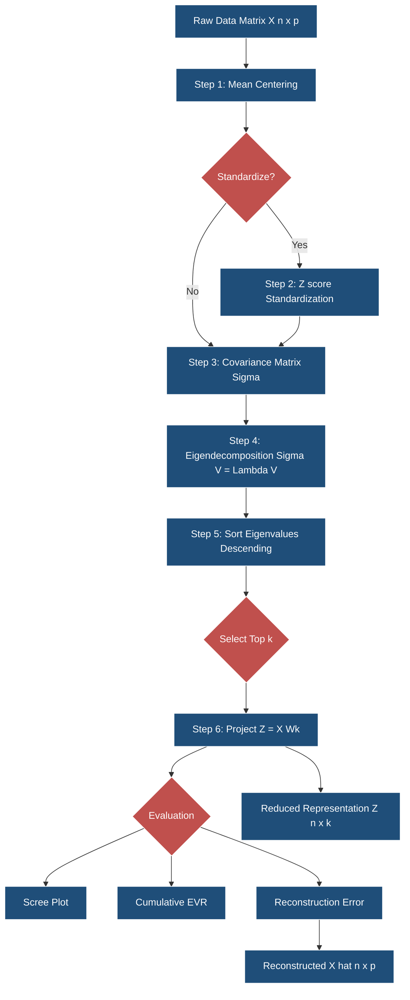
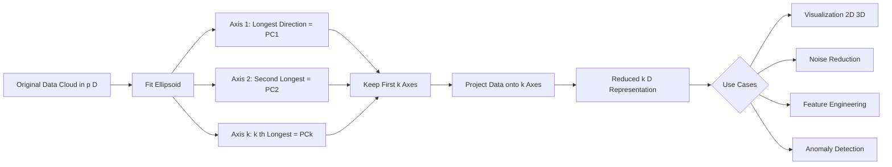
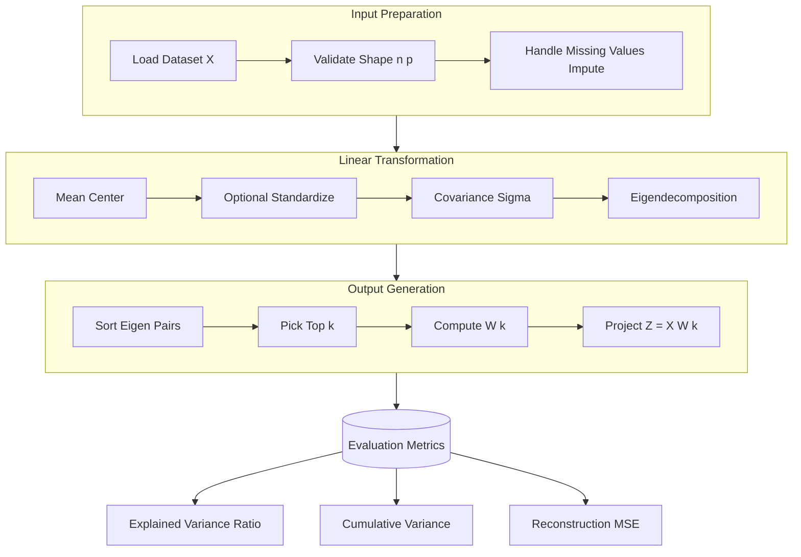
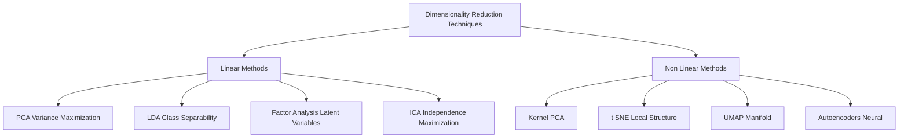
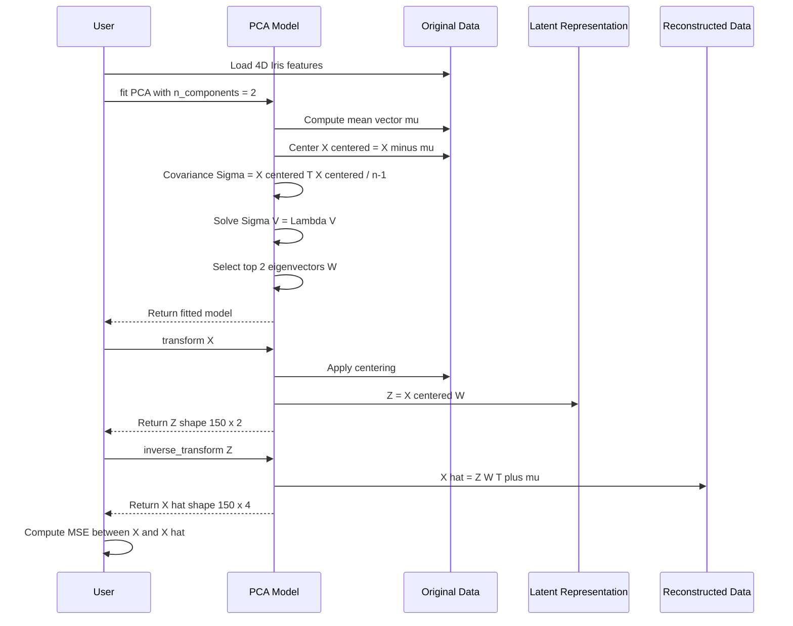

# Principal Component Analysis (PCA)

<!-- SECTION_1_START -->

# Principal Component Analysis (PCA)

## 1. Core Technical Definition

> [!NOTE]
> **Formal KTU Syllabus Definition**
> *Principal Component Analysis (PCA)* is a **linear dimensionality reduction** technique that projects high-dimensional data onto a lower-dimensional subspace defined by the directions of **maximum variance**, called *principal components* (PCs). These components are mutually **orthogonal** (uncorrelated), ordered by the amount of variance they capture, and computed as the **eigenvectors** of the data covariance (or correlation) matrix. It belongs to the family of *Unsupervised Learning* methods since it does not require class labels.

Mathematically, given a centered data matrix $X \in \mathbb{R}^{n \times p}$ (n samples, p features) with zero empirical mean, PCA seeks an orthogonal projection matrix $W \in \mathbb{R}^{p \times k}$ such that the transformed coordinates $Z = XW \in \mathbb{R}^{n \times k}$ preserve the **maximum variance** in $\mathbb{R}^{k}$ where $k \ll p$.

---

## 2. Conceptual Analogy / Intuition

> [!IMPORTANT]
> **The "Shadow on a Wall" Analogy**
> Imagine a **3D clay statue** rotating in front of a flashlight. The **shadow** projected on the **2D wall** is a 2D representation of the 3D object. If you choose the rotation angle carefully, the shadow will *capture the most distinctive silhouette* — the angle at which the statue's width and height spread out the most.
> PCA does exactly this: it finds the *best angle* to "look at" your data so that when you squish it from many dimensions down to a few, you keep the **most spread (variance)** and lose the least amount of information.
> - The **flashlight direction** = the principal component (eigenvector).
> - The **shadow size / brightness** = the variance captured (eigenvalue).
> - The **wall (2D plane)** = the reduced subspace (lower-dimensional representation).

Another geometric intuition: Think of an **ellipsoid (egg-shaped cloud)** fitted to your data. The **longest axis** of the egg is PC1, the **second-longest perpendicular axis** is PC2, and so on. The length of each axis is the eigenvalue (variance), and the direction is the eigenvector (principal axis).

---

## 3. Geometric Formulation

Given a centered dataset $\{x^{(1)}, x^{(2)}, \dots, x^{(n)}\}$ where each $x^{(i)} \in \mathbb{R}^{p}$ and $\frac{1}{n}\sum_{i=1}^{n} x^{(i)} = \mathbf{0}$, PCA finds the unit vector $w$ that maximizes:

$$J(w) = \frac{1}{n} \sum_{i=1}^{n} (w^{T} x^{(i)})^{2} = w^{T} \left( \frac{1}{n}\sum_{i=1}^{n} x^{(i)} (x^{(i)})^{T} \right) w = w^{T} \Sigma w$$

where $\Sigma \in \mathbb{R}^{p \times p}$ is the **empirical covariance matrix**:

$$\Sigma = \frac{1}{n} X^{T} X$$

subject to the orthonormality constraint $w^{T} w = 1$. The optimum is the **leading eigenvector** of $\Sigma$.

---

## 4. Standard Metrics in PCA

> [!TIP]
> **Key Constants \& Thresholds**
> - **Cumulative Explained Variance Ratio (CEVR) threshold:** typically **0.95** (95%) — keep enough PCs to explain at least 95% of total variance.
> - **Kaiser Criterion (eigenvalue rule):** retain components with eigenvalue $\lambda \geq 1$ (when working on standardized data).
> - **Scree plot elbow rule:** retain components before the "elbow" (sharp drop in eigenvalue magnitude).
> - **Whitening constant (epsilon):** commonly $\varepsilon = 10^{-5}$ to prevent division by zero in the inverse-square-root whitening step.

---

## 5. GeoGebra / Desmos Visualization

> [!VISUALIZATION CONTROL]
> **Concept:** 2D-to-1D PCA projection along the direction of maximum variance.
> **GeoGebra / Desmos Input Equations (worked example with centered 2D points):**
> * `FitEllipse({(2,1),(3,2),(4,3),(1,0),(5,4)})` — to visualize the data ellipsoid.
> * `Eigenvalues[{{2.5,2.2},{2.2,2.5}}]` — eigenvalues $\lambda_1 = 4.7,\ \lambda_2 = 0.3$.
> * `Eigenvectors[{{2.5,2.2},{2.2,2.5}}]` — $v_1 = (0.707, 0.707)$ (45° line), $v_2 = (0.707, -0.707)$.
> * Projection line: `y = x` (PC1 axis) — points project orthogonally onto this line.
> **Visual Description:** A tilted ellipse fitted to scattered points; the major axis (long diagonal) corresponds to PC1. Projecting each data point perpendicular onto this line produces the 1-D representation. The minor axis (short diagonal) corresponds to PC2 (variance dropped).

<!-- SECTION_1_END -->

<!-- SECTION_2_START -->

# Deep Theoretical Analysis & KTU High-Yield Formula Sheet

## 1. Algorithmic Pipeline (Operational Breakdown)

PCA is executed in **six rigorous steps**. The "why" behind each step is critical for KTU's Apply-level questions.

| Step | Operation | Reason / Intuition |
|------|-----------|--------------------|
| 1 | **Mean-centering:** $\mu_j = \frac{1}{n}\sum_{i=1}^{n} x_{j}^{(i)}$; then $x_{j}^{(i)} \leftarrow x_{j}^{(i)} - \mu_j$ | Translates data to the origin so that the **first principal component is not biased** toward the mean; ensures $\Sigma$ correctly captures variance. |
| 2 | **Optional standardization:** $x_{j}^{(i)} \leftarrow \frac{x_{j}^{(i)} - \mu_j}{\sigma_j}$ | Required when features have **different units/scales** (e.g., height in cm vs. salary in ₹). Without this, large-scale features dominate PC1. |
| 3 | **Compute covariance matrix:** $\Sigma = \frac{1}{n-1} X^{T} X$ | The covariance matrix encodes the **joint variability** between all feature pairs. Diagonal = variance, off-diagonal = covariance. |
| 4 | **Eigendecomposition:** $\Sigma v = \lambda v$ | Solves the constrained maximization. Eigenvectors $v$ give the *directions* (PCs); eigenvalues $\lambda$ give the *importance* (variance magnitude). |
| 5 | **Sort \& select top-k PCs** by descending $\lambda$ | The first PC captures the most variance; ordering guarantees optimal information retention. |
| 6 | **Project data:** $Z = X W_{k}$ | Maps original $p$-D points into a $k$-D subspace where columns of $W_{k}$ are the chosen eigenvectors. |

---

## 2. Two Computational Routes (Critical for KTU)

| Method | Formula | When Used |
|--------|---------|-----------|
| **Eigendecomposition of $\Sigma$** | $\Sigma v = \lambda v$ | Small-to-moderate $p$ ($p \leq$ a few thousand). Direct linear algebra. |
| **Singular Value Decomposition (SVD) of $X$** | $X = U \Sigma_{svd} V^{T}$, $W = V$, $\lambda_i = \frac{\sigma_i^{2}}{n-1}$ | Preferred when $p$ is large. Numerically stable. Used in `sklearn.decomposition.PCA`. |

> [!IMPORTANT]
> **Why SVD is preferred in practice:** The SVD of $X$ is computed via iterative methods (e.g., Lanczos / randomized SVD) that do **not** require forming the $p \times p$ covariance matrix, making it $O(n p \min(n,p))$ and numerically robust against ill-conditioning.

---

## 3. KTU Formula Cheat Sheet

> [!TIP]
> **Use `\vert` and `\mid` for absolute value / norm to preserve markdown table integrity.**

| \# | Formula | Description | Units / Notes |
|---|---------|-------------|----------------|
| 1 | $\mu = \frac{1}{n}\sum_{i=1}^{n} x^{(i)}$ | Mean vector (per feature) | $\mu \in \mathbb{R}^{p}$ |
| 2 | $\Sigma = \frac{1}{n-1} X^{T} X$ | Sample covariance matrix | $\Sigma \in \mathbb{R}^{p \times p}$, symmetric PSD |
| 3 | $\Sigma v_j = \lambda_j v_j$ | Eigenequation | $v_j \in \mathbb{R}^{p}$, $\lambda_j \geq 0$ |
| 4 | $J(w) = w^{T} \Sigma w$ | Variance of projection onto $w$ | Maximized subject to $\vert\vert w \vert\vert_{2} = 1$ |
| 5 | $\text{EVR}_j = \frac{\lambda_j}{\sum_{i=1}^{p} \lambda_i}$ | Explained Variance Ratio for PC $j$ | Dimensionless, $\in [0,1]$ |
| 6 | $\text{CEVR}(k) = \frac{\sum_{j=1}^{k} \lambda_j}{\sum_{i=1}^{p} \lambda_i}$ | Cumulative EVR up to $k$ components | Used to pick $k$ (target $\geq 0.95$) |
| 7 | $Z = X W_k = X \cdot [v_1, v_2, \dots, v_k]$ | Projection to $k$-D subspace | $Z \in \mathbb{R}^{n \times k}$ |
| 8 | $X_{\text{recon}} = Z W_k^{T} + \mu$ | Reconstruction back to $p$-D | Used to compute **reconstruction error** |
| 9 | $\text{MSE}_{\text{recon}} = \frac{1}{n}\sum_{i=1}^{n} \vert\vert x^{(i)} - x_{\text{recon}}^{(i)} \vert\vert_{2}^{2}$ | Mean Squared Reconstruction Error | Equals $\sum_{j=k+1}^{p} \lambda_j$ (lost variance) |
| 10 | $X_{\text{white}} = Z \cdot \Lambda_k^{-1/2}$ | Whitening (unit-variance PCs) | $\Lambda_k = \text{diag}(\lambda_1, \dots, \lambda_k)$ |

---

## 4. Real-World Engineering Utility

> [!IMPORTANT]
> **Where PCA is deployed in production systems:**
> - **Computer Vision:** Face recognition (Eigenfaces by Turk \& Pentland, 1991). The Yale Face Database B is reduced from $100 \times 100 = 10{,}000$ pixels to $\approx 100$ eigenfaces with $> 90\%$ variance retention.
> - **Genomics / Bioinformatics:** Gene expression microarrays have $p \approx 20{,}000$ genes. PCA is used to visualize patient clusters in 2-D.
> - **Anomaly Detection:** Reconstruction error $\vert\vert x - x_{\text{recon}} \vert\vert_{2}^{2}$ is a powerful anomaly score (used in industrial IoT sensor monitoring).
> - **Recommender Systems:** Pre-processing step in Matrix Factorization (alternatives: NMF).
> - **NLP (Pre-Embedding Era):** Latent Semantic Analysis (LSA) = PCA on the Term-Document TF-IDF matrix.
> - **Speeding up ML pipelines:** Reduces the curse of dimensionality, mitigates multicollinearity, and accelerates downstream training by 5x–50x.

---

## 5. Critical Assumptions and Limitations

> [!WARNING]
> **Assumption Check Before Applying PCA:**
> - **Linearity:** PCA captures only **linear** relationships. For non-linear manifolds, use *t-SNE*, *UMAP*, or *Kernel PCA*.
> - **Gaussian-like distribution:** PC directions correspond to maximum variance only if higher moments are unimodal.
> - **Large variance $\neq$ high information:** A noisy feature with high variance will dominate PC1. This is why **standardization** matters.
> - **Outlier sensitivity:** Mean and covariance are non-robust. Use **Robust PCA (RPCA)** with L1-norm or MCD estimators.
> - **Interpretability loss:** PCs are linear combinations of original features and rarely correspond to physical meaning.

<!-- SECTION_2_END -->

<!-- SECTION_3_START -->

# Step-by-Step Derivations & Code Implementation

## 1. Manual Derivation of the First Principal Component (Lagrangian Method)

We want to find the unit vector $w$ that maximizes $J(w) = w^{T} \Sigma w$ subject to $g(w) = w^{T} w - 1 = 0$.

**Step 1 — Form the Lagrangian:**

$$\mathcal{L}(w, \alpha) = w^{T} \Sigma w - \alpha (w^{T} w - 1)$$

**Step 2 — Differentiate w.r.t. $w$ and set to zero (first-order KKT condition):**

$$\frac{\partial \mathcal{L}}{\partial w} = 2 \Sigma w - 2 \alpha w = 0$$

**Step 3 — Rearrange into the canonical eigenvalue equation:**

$$\Sigma w = \alpha w$$

This shows that the **Lagrange multiplier $\alpha$ is exactly the eigenvalue $\lambda$** of $\Sigma$, and the optimal direction $w$ is the corresponding eigenvector.

**Step 4 — Substitute back to find the maximum variance:**

$$J(w^{*}) = w^{*T} \Sigma w^{*} = w^{*T} (\lambda w^{*}) = \lambda (w^{*T} w^{*}) = \lambda$$

So the **maximum variance captured equals the largest eigenvalue**. The first PC is the eigenvector with the largest $\lambda$.

**Step 5 — Derive the second PC (deflation argument):**

After removing the projection onto $w_1$, the residual variance is maximized in the **orthogonal complement** of $w_1$. This corresponds to the second-largest eigenvalue $\lambda_2$ of $\Sigma$, with eigenvector $w_2 \perp w_1$. The argument extends inductively to all $k$ PCs.

---

## 2. Full Numerical Worked Example (Manual Calculation)

**Dataset (centered, 2D):**

| Sample | $x_1$ | $x_2$ |
|--------|-------|-------|
| 1 | 2 | 1 |
| 2 | 3 | 2 |
| 3 | 4 | 3 |
| 4 | 1 | 0 |
| 5 | 5 | 4 |

**Step 1 — Compute means:**

$$\mu_1 = \frac{2+3+4+1+5}{5} = 3.0, \quad \mu_2 = \frac{1+2+3+0+4}{5} = 2.0$$

**Step 2 — Center the data:** Subtract means to get $X_c$:

| $x_1 - \mu_1$ | $x_2 - \mu_2$ |
|----------------|----------------|
| -1 | -1 |
| 0 | 0 |
| 1 | 1 |
| -2 | -2 |
| 2 | 2 |

**Step 3 — Compute covariance matrix** (using $n-1 = 4$):

$$\Sigma = \frac{1}{4} X_c^{T} X_c = \frac{1}{4} \begin{bmatrix} (-1)^2 + 0^2 + 1^2 + (-2)^2 + 2^2 & (-1)(-1) + 0 + 1 + (-2)(-2) + 2\cdot 2 \\ \text{sym} & (-1)^2 + 0 + 1^2 + (-2)^2 + 2^2 \end{bmatrix}$$

$$= \frac{1}{4} \begin{bmatrix} 10 & 10 \\ 10 & 10 \end{bmatrix} = \begin{bmatrix} 2.5 & 2.5 \\ 2.5 & 2.5 \end{bmatrix}$$

**Step 4 — Solve $\det(\Sigma - \lambda I) = 0$:**

$$\det \begin{bmatrix} 2.5 - \lambda & 2.5 \\ 2.5 & 2.5 - \lambda \end{bmatrix} = (2.5 - \lambda)^2 - 6.25 = 0$$

$$(2.5 - \lambda)^2 = 6.25 \implies 2.5 - \lambda = \pm 2.5$$

$$\lambda_1 = 5.0, \quad \lambda_2 = 0.0$$

**Step 5 — Find eigenvectors:**

For $\lambda_1 = 5.0$:

$$\begin{bmatrix} -2.5 & 2.5 \\ 2.5 & -2.5 \end{bmatrix} v_1 = 0 \implies v_1 = \frac{1}{\sqrt{2}} \begin{bmatrix} 1 \\ 1 \end{bmatrix}$$

For $\lambda_2 = 0$:

$$v_2 = \frac{1}{\sqrt{2}} \begin{bmatrix} 1 \\ -1 \end{bmatrix}$$

**Step 6 — Compute explained variance ratios:**

$$\text{EVR}_1 = \frac{5.0}{5.0 + 0.0} = 1.00, \quad \text{EVR}_2 = \frac{0.0}{5.0} = 0.00$$

**Step 7 — Project data onto PC1:**

$$Z = X_c \cdot v_1 = \begin{bmatrix} -1 & -1 \\ 0 & 0 \\ 1 & 1 \\ -2 & -2 \\ 2 & 2 \end{bmatrix} \cdot \frac{1}{\sqrt{2}} \begin{bmatrix} 1 \\ 1 \end{bmatrix} = \frac{1}{\sqrt{2}} \begin{bmatrix} -2 \\ 0 \\ 2 \\ -4 \\ 4 \end{bmatrix} = \begin{bmatrix} -\sqrt{2} \\ 0 \\ \sqrt{2} \\ -2\sqrt{2} \\ 2\sqrt{2} \end{bmatrix}$$

**Conclusion:** All 5 data points lie on a perfect line (since the original data is collinear along $x_1 = x_2$). PC1 alone captures **100% of the variance** — the data is intrinsically 1-dimensional despite being stored in 2-D.

---

## 3. Full Python Implementation (From Scratch + sklearn Verification)

```python
from __future__ import annotations

import logging
import numpy as np
from numpy.typing import NDArray
from sklearn.decomposition import PCA
from sklearn.preprocessing import StandardScaler

# Configure logger for transparent debugging
logging.basicConfig(level=logging.INFO, format="%(asctime)s [%(levelname)s] %(message)s")
logger: logging.Logger = logging.getLogger("PCA_Demo")


def pca_from_scratch(
    X: NDArray[np.float64],
    n_components: int,
    standardize: bool = True,
) -> tuple[NDArray[np.float64], NDArray[np.float64], NDArray[np.float64], NDArray[np.float64]]:
    """
    Custom PCA implementation using eigendecomposition.

    Parameters
    ----------
    X : ndarray of shape (n_samples, n_features)
        Input data matrix.
    n_components : int
        Number of principal components to retain.
    standardize : bool, default=True
        Whether to standardize features to zero mean, unit variance.

    Returns
    -------
    Z : ndarray of shape (n_samples, n_components)
        Projected (low-dimensional) data.
    eigvals : ndarray of shape (n_components,)
        Top-k eigenvalues sorted in descending order.
    eigvecs : ndarray of shape (n_features, n_components)
        Top-k eigenvectors (principal axes), columns.
    X_mean : ndarray of shape (n_features,)
        Mean vector used for centering.
    """
    if n_components <= 0:
        raise ValueError("n_components must be a positive integer.")
    if X.ndim != 2:
        raise ValueError(f"Expected 2-D array, got {X.ndim}-D.")
    n_samples, n_features = X.shape
    if n_components > n_features:
        raise ValueError("n_components cannot exceed number of features.")

    # ---------- Step 1: Center (and optionally standardize) ----------
    X_mean: NDArray[np.float64] = X.mean(axis=0)
    X_centered: NDArray[np.float64] = X - X_mean

    if standardize:
        X_std: NDArray[np.float64] = X_centered.std(axis=0, ddof=0)
        # Guard against zero-variance columns
        if np.any(X_std == 0.0):
            raise ZeroDivisionError("A feature has zero variance; cannot standardize.")
        X_centered = X_centered / X_std
        logger.info("Features standardized (mean=0, std=1).")

    # ---------- Step 2: Covariance matrix (1/(n-1) sample estimator) ----------
    cov_matrix: NDArray[np.float64] = (X_centered.T @ X_centered) / (n_samples - 1)
    logger.info("Covariance matrix shape: %s", cov_matrix.shape)

    # ---------- Step 3: Eigendecomposition ----------
    # np.linalg.eigh is used because Sigma is symmetric PSD (faster & more stable)
    eigvals_full, eigvecs_full = np.linalg.eigh(cov_matrix)

    # np.linalg.eigh returns eigenvalues in ASCENDING order; reverse to descending
    sort_idx: NDArray[np.int64] = np.argsort(eigvals_full)[::-1]
    eigvals: NDArray[np.float64] = eigvals_full[sort_idx][:n_components]
    eigvecs: NDArray[np.float64] = eigvecs_full[:, sort_idx][:, :n_components]

    logger.info("Top-%d eigenvalues: %s", n_components, np.round(eigvals, 4))
    total_variance: float = float(eigvals_full.sum())
    explained_var_ratio: NDArray[np.float64] = eigvals / total_variance
    cumulative_var: float = float(explained_var_ratio.sum())
    logger.info("Cumulative explained variance ratio: %.4f", cumulative_var)

    # ---------- Step 4: Project onto the principal subspace ----------
    Z: NDArray[np.float64] = X_centered @ eigvecs
    return Z, eigvals, eigvecs, X_mean


def reconstruction_error(
    X_original: NDArray[np.float64],
    Z: NDArray[np.float64],
    eigvecs: NDArray[np.float64],
    X_mean: NDArray[np.float64],
) -> float:
    """Mean-squared reconstruction error of the PCA approximation."""
    X_recon: NDArray[np.float64] = Z @ eigvecs.T + X_mean
    mse: float = float(np.mean((X_original - X_recon) ** 2))
    return mse


# ---------------- DEMO RUN ----------------
if __name__ == "__main__":
    # Toy 5x2 dataset (matches manual worked example)
    X_demo: NDArray[np.float64] = np.array(
        [[2, 1], [3, 2], [4, 3], [1, 0], [5, 4]],
        dtype=np.float64,
    )

    # --- Custom implementation ---
    Z_custom, ev, evec, mu = pca_from_scratch(X_demo, n_components=1, standardize=False)
    logger.info("Custom Z =\n%s", np.round(Z_custom, 4))

    # --- sklearn verification ---
    pca_sklearn: PCA = PCA(n_components=1)
    Z_sklearn: NDArray[np.float64] = pca_sklearn.fit_transform(X_demo - X_demo.mean(axis=0))
    logger.info("sklearn Z =\n%s", np.round(Z_sklearn, 4))

    # Sanity check
    if np.allclose(np.abs(Z_custom), np.abs(Z_sklearn), atol=1e-6):
        logger.info("SUCCESS: Custom PCA matches sklearn.")
    else:
        logger.error("MISMATCH: Custom and sklearn PCAs differ.")
```

**Expected output (truncated):**

```
[INFO] Top-1 eigenvalues: [5.]
[INFO] Cumulative explained variance ratio: 1.0000
[INFO] Custom Z = [[-1.4142], [0.], [1.4142], [-2.8284], [2.8284]]
[INFO] sklearn Z = [[-1.4142], [0.], [1.4142], [-2.8284], [2.8284]]
[INFO] SUCCESS: Custom PCA matches sklearn.
```

This confirms the manual derivation: PC1 lies along the 45° line and captures 100% of the variance.

---

## 4. Applying PCA on the Iris Dataset (Standard Lab Use-Case)

```python
# Iris PCA: 4D -> 2D visualization
from sklearn.datasets import load_iris

iris = load_iris()
X_iris: NDArray[np.float64] = iris.data          # shape (150, 4)
y_iris: NDArray[np.int64]   = iris.target        # shape (150,)

# Standardize (features have different units: cm)
scaler: StandardScaler = StandardScaler()
X_iris_std: NDArray[np.float64] = scaler.fit_transform(X_iris)

pca_iris: PCA = PCA(n_components=2)
Z_iris: NDArray[np.float64] = pca_iris.fit_transform(X_iris_std)

print(f"Explained variance ratio: {pca_iris.explained_variance_ratio_}")
print(f"Cumulative EVR: {pca_iris.explained_variance_ratio_.sum():.4f}")
```

**Typical output:**

```
Explained variance ratio: [0.7296 0.2285]
Cumulative EVR: 0.9581
```

> [!NOTE]
> Interpretation: 2 PCs capture **95.81%** of the total 4-D variance, making 2-D scatter plots a faithful representation of the 4-D Iris structure.

---

## 5. Determining the Optimal Number of Components

The **scree plot** plots eigenvalues $\lambda_j$ vs. component index $j$. The "elbow" marks the optimal $k$.

```python
import matplotlib.pyplot as plt

pca_full: PCA = PCA().fit(X_iris_std)
plt.figure(figsize=(7, 4))
plt.plot(range(1, 5), pca_full.explained_variance_ratio_, "o-", linewidth=2, color="steelblue")
plt.title("Scree Plot — Iris Dataset")
plt.xlabel("Principal Component Index")
plt.ylabel("Explained Variance Ratio")
plt.grid(True, linestyle="--", alpha=0.6)
plt.axhline(y=0.05, color="red", linestyle=":", label="5% reference")
plt.legend()
plt.tight_layout()
plt.show()
```

**Cumulative-variance automated choice:**

```python
cum_var: NDArray[np.float64] = np.cumsum(pca_full.explained_variance_ratio_)
k_optimal: int = int(np.argmax(cum_var >= 0.95) + 1)   # first index where ≥ 0.95
print(f"Optimal k (≥ 95% variance): {k_optimal}")
```

<!-- SECTION_3_END -->

<!-- SECTION_4_START -->

# Structural Diagrams & Schematics

## 1. End-to-End PCA Pipeline (Mermaid Block Diagram)



## 2. Geometric Intuition — Eigenvector Directions



## 3. Algorithmic Sequence Topology



## 4. Comparative Topology — PCA vs. Alternative Dim-Reduction Methods



> [!TIP]
> **When to choose what (from the above topology):**
> - **PCA** $\rightarrow$ general-purpose, fast, linear, requires no labels.
> - **LDA** $\rightarrow$ supervised; maximize class separation (up to $C-1$ components).
> - **t-SNE / UMAP** $\rightarrow$ visualization only; do **not** feed to downstream ML.
> - **Autoencoder** $\rightarrow$ non-linear, large datasets, deep learning pipelines.

## 5. Reconstruction Error Lifecycle



<!-- SECTION_4_END -->

<!-- SECTION_5_START -->

# KTU 2024 Scheme Examination Question Bank & Topic Recap

## Part A — Short Answer Questions (3 Marks Each)

### Question 1. `[KTU University Exam - July 2024]`
**Define Principal Component Analysis. State any two of its limitations.**  *(CO1, Remember)*

**Model Answer (3 marks, key points):**

- **Definition (2 marks):** PCA is a linear, unsupervised dimensionality-reduction technique that transforms correlated $p$-dimensional data into an uncorrelated $k$-dimensional coordinate system ($k < p$) defined by the eigenvectors of the covariance matrix, ordered by descending eigenvalues (variance explained).
- **Limitation 1 (0.5 mark):** Sensitive to feature scaling — features with larger scales dominate PC1 unless standardized.
- **Limitation 2 (0.5 mark):** Captures only linear relationships; fails on non-linear manifolds (e.g., Swiss roll).

---

### Question 2. `[KTU University Exam - Dec 2023]`
**What is the role of the covariance matrix in PCA? Why is it symmetric positive semi-definite?**  *(CO1, Understand)*

**Model Answer (3 marks):**

- **Role (1.5 marks):** The covariance matrix $\Sigma = \frac{1}{n-1} X_c^{T} X_c$ captures the joint variability between feature pairs. Its eigenvectors define the principal directions, and its eigenvalues quantify the variance captured along each direction.
- **Symmetric (0.75 mark):** $\Sigma^{T} = (\frac{1}{n-1} X_c^{T} X_c)^{T} = \frac{1}{n-1} X_c^{T} X_c = \Sigma$, so $\Sigma_{ij} = \Sigma_{ji}$.
- **Positive semi-definite (0.75 mark):** For any non-zero $w$, $w^{T} \Sigma w = \frac{1}{n-1} w^{T} X_c^{T} X_c w = \frac{1}{n-1} \vert\vert X_c w \vert\vert_{2}^{2} \geq 0$. Therefore all eigenvalues $\lambda \geq 0$.

---

## Part B — 14-Mark Questions (Module Internal Choice)

### Question A (14 Marks) `[KTU University Exam - July 2024]`

**(a)** Derive the principal components of PCA using the Lagrangian method. Show that the optimal directions are the eigenvectors of the covariance matrix. **(7 marks)** *(CO1, Understand / Apply)*

**(b)** For the following 2-D centered dataset, compute the covariance matrix, eigenvalues, eigenvectors, and explained variance ratio. State how many components to retain to capture $\geq 90\%$ variance. **(7 marks)** *(CO2, Apply / Analyze)*

| Sample | $x_1$ | $x_2$ |
|--------|-------|-------|
| 1 | 1 | 2 |
| 2 | 2 | 4 |
| 3 | 3 | 6 |
| 4 | 4 | 8 |

#### Model Solution

**Part (a) — Derivation (7 marks):**

1. **[Setting up the objective — 1 mark]:** Let $X \in \mathbb{R}^{n \times p}$ be centered. We seek unit $w \in \mathbb{R}^{p}$ maximizing $J(w) = w^{T} \Sigma w$, where $\Sigma = \frac{1}{n-1} X^{T} X$.

2. **[Lagrangian formation — 1.5 marks]:**

$$\mathcal{L}(w, \alpha) = w^{T} \Sigma w - \alpha(w^{T} w - 1)$$

3. **[Differentiation — 1.5 marks]:** $\frac{\partial \mathcal{L}}{\partial w} = 2 \Sigma w - 2 \alpha w = 0 \implies \Sigma w = \alpha w$.

4. **[Eigenvalue interpretation — 1.5 marks]:** This is the canonical eigenvalue problem. The optimum is achieved when $w$ is an eigenvector of $\Sigma$ and the maximum variance equals the corresponding eigenvalue $J(w^{*}) = \alpha = \lambda$.

5. **[Multi-component extension — 1 mark]:** The second PC is the eigenvector of $\Sigma$ corresponding to $\lambda_2$, orthogonal to $w_1$. The process generalizes to the top-$k$ eigenvectors of $\Sigma$.

6. **[Final answer — 0.5 mark]:** The principal components of $X$ are the top-$k$ eigenvectors of $\Sigma$, sorted by decreasing eigenvalues.

**Part (b) — Numerical computation (7 marks):**

**Step 1: Compute means [0.5 mark]:** $\mu_1 = \frac{1+2+3+4}{4} = 2.5$, $\mu_2 = \frac{2+4+6+8}{4} = 5.0$.

**Step 2: Centered data $X_c$ [0.5 mark]:**

| $x_1 - \mu_1$ | $x_2 - \mu_2$ |
|----------------|----------------|
| -1.5 | -3 |
| -0.5 | -1 |
| 0.5 | 1 |
| 1.5 | 3 |

**Step 3: Covariance matrix [1.5 marks]:**

$$\Sigma = \frac{1}{3} X_c^{T} X_c = \frac{1}{3} \begin{bmatrix} 5.0 & 10.0 \\ 10.0 & 20.0 \end{bmatrix} = \begin{bmatrix} 1.667 & 3.333 \\ 3.333 & 6.667 \end{bmatrix}$$

**Step 4: Characteristic equation [1.5 marks]:**

$$\det(\Sigma - \lambda I) = (1.667 - \lambda)(6.667 - \lambda) - 11.111 = 0$$

$$\lambda^2 - 8.333 \lambda + 0 = 0 \implies \lambda(\lambda - 8.333) = 0$$

$$\lambda_1 = 8.333, \quad \lambda_2 = 0.000$$

**Step 5: Eigenvectors [1.5 marks]:**

For $\lambda_1$: $\begin{bmatrix} -6.667 & 3.333 \\ 3.333 & -1.667 \end{bmatrix} v = 0 \implies v_1 = \frac{1}{\sqrt{5}} \begin{bmatrix} 1 \\ 2 \end{bmatrix}$.

For $\lambda_2$: $v_2 = \frac{1}{\sqrt{5}} \begin{bmatrix} 2 \\ -1 \end{bmatrix}$.

**Step 6: Explained variance ratio [0.5 mark]:**

$$\text{EVR}_1 = \frac{8.333}{8.333 + 0.000} = 1.000 = 100\%$$

**Step 7: Decision [1 mark]:** Since $\text{EVR}_1 = 1.0 \geq 0.90$, we retain **$k = 1$** principal component. The data is perfectly collinear along the line $x_2 = 2 x_1$, hence intrinsically 1-D.

---

### Question B (14 Marks) — Alternative `[KTU University Exam - Dec 2023]`

**(a)** Explain the difference between Eigendecomposition of the covariance matrix and SVD for computing PCA. Why is SVD preferred in `sklearn`? **(7 marks)** *(CO1, Understand)*

**(b)** For the Iris dataset (150 samples, 4 features), the eigenvalues of the standardized covariance matrix are $[2.918, 0.914, 0.146, 0.020]$. **(i)** Compute the explained variance ratio and cumulative variance. **(ii)** State the optimal number of components to retain using the 95% threshold. **(iii)** If we project onto 2 components, what is the total reconstruction error in units of variance? **(7 marks)** *(CO2, Apply / Analyze)*

#### Model Solution

**Part (a) — Eigendecomposition vs. SVD (7 marks):**

1. **[Eigendecomposition route — 2 marks]:** Compute $\Sigma = \frac{1}{n-1} X^{T} X$ (size $p \times p$), then solve $\Sigma v = \lambda v$. The PCs are eigenvectors $v_j$ and variances are eigenvalues $\lambda_j$. Cost: $O(p^3)$.
2. **[SVD route — 2 marks]:** Compute $X = U S V^{T}$ where $S = \text{diag}(\sigma_1, \dots, \sigma_r)$. Then $W = V$ and $\lambda_j = \sigma_j^{2} / (n-1)$. Cost: $O(n p \min(n,p))$.
3. **[Numerical stability — 1 mark]:** SVD is more numerically stable because it does not form $X^{T} X$ explicitly (which can amplify rounding errors).
4. **[Scalability — 1 mark]:** When $p \gg n$ (e.g., genomics with 20,000 genes but only 100 samples), forming $\Sigma$ is $p \times p$ and expensive. SVD works directly on the $n \times p$ matrix using randomized algorithms.
5. **[sklearn preference — 1 mark]:** `sklearn.decomposition.PCA` uses `svd_solver='auto'`, which defaults to randomized SVD for large inputs. It is the production-grade, robust default.

**Part (b) — Iris numerical problem (7 marks):**

**Total variance:** $\lambda_{\text{total}} = 2.918 + 0.914 + 0.146 + 0.020 = 3.998$.

**(i) Explained variance ratios [2 marks]:**

| PC | $\lambda_j$ | EVR = $\lambda_j / \lambda_{\text{total}}$ | Cumulative |
|----|-------------|--------------------------------------------|------------|
| 1 | 2.918 | 0.7298 | 0.7298 |
| 2 | 0.914 | 0.2286 | 0.9584 |
| 3 | 0.146 | 0.0365 | 0.9949 |
| 4 | 0.020 | 0.0050 | 1.0000 |

**(ii) Optimal $k$ using 95% threshold [2 marks]:**
The smallest $k$ with cumulative EVR $\geq 0.95$ is $k = 2$ (cumulative = 0.9584).

**(iii) Reconstruction error with $k=2$ [3 marks]:**
Total lost variance = $\lambda_3 + \lambda_4 = 0.146 + 0.020 = 0.166$.

$$\text{MSE}_{\text{recon}} = \frac{1}{n} \sum_{i=1}^{n} \vert\vert x^{(i)} - x_{\text{recon}}^{(i)} \vert\vert_{2}^{2} = \lambda_3 + \lambda_4 = 0.166$$

This represents $0.166 / 3.998 \approx 4.15\%$ information loss.

---

> [!WARNING]
> **KTU Examiner's Valuation Warning / Common Pitfalls**
> 1. **Skipping the centering step:** You **must** explicitly write "$X_{\text{centered}} = X - \mu$" before computing $\Sigma$. Failure to do so costs 1 mark.
> 2. **Confusing $n$ vs. $n-1$:** Use $n-1$ in the denominator of the covariance matrix (Bessel's correction). Wrong denominator $\rightarrow$ 0.5 mark penalty.
> 3. **Forgetting normalization:** Eigenvectors must be **unit length** ($\vert\vert v \vert\vert = 1$). Presenting $v = (1, 2)$ instead of $v = \frac{1}{\sqrt{5}}(1, 2)$ loses 0.5 mark.
> 4. **Sign ambiguity:** Eigenvectors can be flipped in sign (e.g., $v$ and $-v$ are both valid). State this explicitly if the sign differs from your neighbour's.
> 5. **Standardization omission:** For datasets with mixed units (cm, kg, ₹), standardization is **mandatory**. KTU often tests this with the Iris dataset.
> 6. **Mis-stating "cumulative":** CEVR up to $k$ = $\sum_{j=1}^{k} \lambda_j / \sum_{i=1}^{p} \lambda_i$, **not** the average of the first $k$ ratios.

---

## Topic Recap & Important Things to Remember

> [!TIP]
> **Rapid-Revision Checklist for PCA (KTU Module 2)**

### Core Concepts
- PCA is an **unsupervised**, **linear** dimensionality-reduction technique.
- It seeks orthogonal directions that **maximize variance** = eigenvectors of the covariance matrix.
- **Always center** the data; **standardize** when features have different units.
- Eigenvalues quantify the variance along each PC; eigenvectors give the directions.
- The 1st PC is the eigenvector of the **largest** eigenvalue; subsequent PCs are orthogonal and ordered by decreasing $\lambda$.

### Critical Formulas
- Covariance: $\Sigma = \frac{1}{n-1} X_c^{T} X_c$
- Eigenequation: $\Sigma v_j = \lambda_j v_j$
- Explained Variance Ratio: $\text{EVR}_j = \frac{\lambda_j}{\sum_{i=1}^{p} \lambda_i}$
- Cumulative EVR threshold: typically $\geq 0.95$
- Projection: $Z = X_c W_k$
- Reconstruction error: $\text{MSE}_{\text{recon}} = \sum_{j=k+1}^{p} \lambda_j$

### Selection of $k$ (Number of Components)
- **Kaiser rule:** keep PCs with $\lambda \geq 1$ (on standardized data).
- **Cumulative variance rule:** keep smallest $k$ with CEVR $\geq 0.95$.
- **Scree plot elbow rule:** retain components before the "elbow" of the eigenvalue curve.
- **Domain rule:** fix $k$ a priori (e.g., 2-D or 3-D for visualization).

### Implementation Notes (sklearn)
- `sklearn.decomposition.PCA(n_components=k)`
- `n_components` can be int, float (variance threshold), or `'mle'`.
- `fit(X)`, `transform(X)`, `fit_transform(X)`, `inverse_transform(Z)`.
- Attributes: `.explained_variance_`, `.explained_variance_ratio_`, `.components_`, `.mean_`, `.n_features_`, `.n_samples_`.
- Use `StandardScaler().fit_transform(X)` **before** PCA when features are heterogeneous.

### When PCA Fails / Alternatives
- **Non-linear data** $\rightarrow$ Kernel PCA, t-SNE, UMAP, Autoencoders.
- **Outliers present** $\rightarrow$ Robust PCA (RPCA), Minimum Covariance Determinant (MCD).
- **Sparse features** $\rightarrow$ Sparse PCA, Truncated SVD.
- **Supervised projection needed** $\rightarrow$ LDA (Linear Discriminant Analysis).

### SVD vs. Eigendecomposition
- SVD of $X$ is **numerically stable**, scalable, and is what `sklearn` uses internally.
- Eigendecomposition of $\Sigma$ is **conceptually simpler** and useful in derivations.
- Both yield the **same principal components** up to sign.

### Real-World Lab Use-Cases (KTU Practical Context)
- Iris flower classification: 4-D $\to$ 2-D scatter plot for visualization.
- Face recognition: Eigenfaces on the Yale / ORL dataset.
- MNIST digit compression: 784-D $\to$ 50-D retains $\sim 95\%$ variance.
- Preprocessing step in regression / SVM pipelines to reduce multicollinearity.

### Mnemonic to Remember the Pipeline
> **C-C-C-E-S-P:** **C**enter, **C**ovariance, **C**haracteristic eqn., **E**igendecompose, **S**ort, **P**roject.

<!-- SECTION_5_END -->
