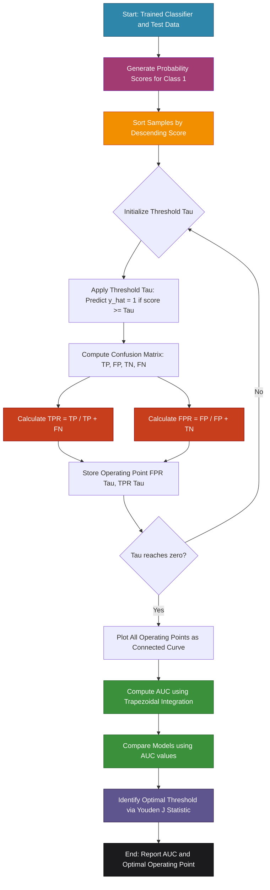
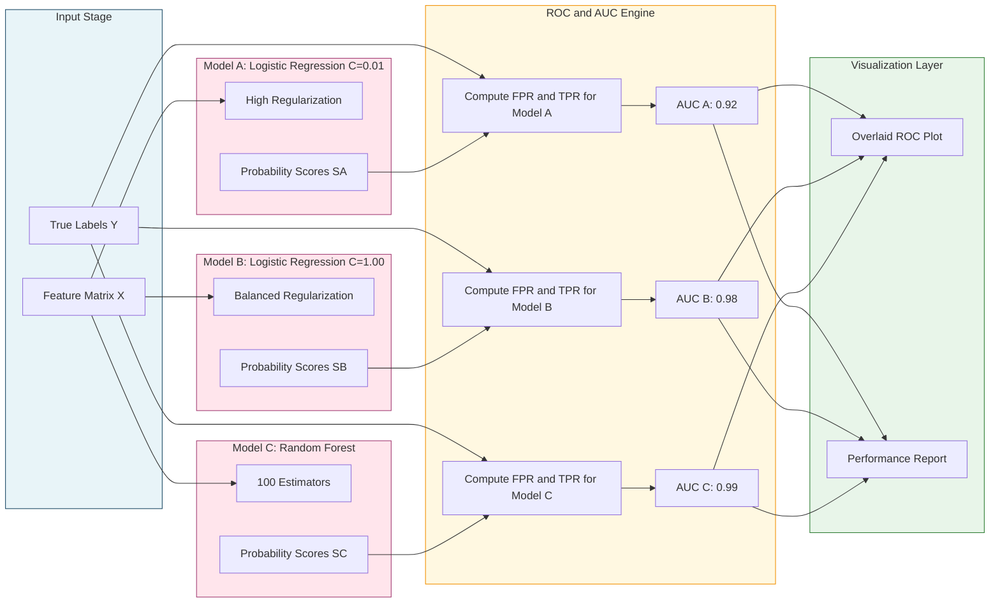

# ROC Curves and AUC

<!-- SECTION_1_START -->

# ROC Curves and AUC — Core Technical Definition & Intuitive Overview

## Formal Academic Definition (KTU 2024 Syllabus Terminology)

The **Receiver Operating Characteristic (ROC) curve** is a graphical evaluation metric for binary classification models that plots the **True Positive Rate (TPR)** against the **False Positive Rate (FPR)** at every possible classification threshold. The **Area Under the Curve (AUC)** quantifies the entire two-dimensional area underneath the ROC curve, providing a single scalar measure of a classifier's ability to **discriminate between positive and negative classes** across all thresholds.

> [!IMPORTANT]
> **KTU 2024 Definition (Verbatim Style):**
> The ROC curve is a probability curve, and AUC represents the degree or measure of separability. It tells how much the model is capable of distinguishing between classes. A higher AUC indicates a better-performing model.

## Conceptual Analogy / Intuitive Overview

### The "Bouncer at a Club" Analogy

Imagine you are a **bouncer** at an exclusive nightclub. Your job is to decide who gets in (positive class) and who gets rejected (negative class). Every guest at the door has a "vibe score" between 0 and 100. You must set a **threshold** for entry.

- **Threshold = 90** (Very strict): Only VIPs enter. Few false positives, but many genuine guests are rejected (low TPR).
- **Threshold = 50** (Moderate): Most genuine guests enter, but some random people sneak in too.
- **Threshold = 10** (Very lenient): Almost everyone enters, including troublemakers (high FPR).

By varying the threshold from 0 to 100, you get pairs of (FPR, TPR) values. Plotting these pairs gives you the **ROC curve**. The **AUC** measures how well your vibe score *ranks* genuine guests above random people — independent of the specific threshold you pick.

> [!NOTE]
> **Geometric Intuition:** A perfect classifier is a curve that hugs the top-left corner (TPR=1, FPR=0). A random classifier is a diagonal line from (0,0) to (1,1). The further the ROC curve bows toward the top-left, the larger the AUC, and the better the model.

### Key Physical Metrics (Standardized)

- **TPR (Sensitivity / Recall):** $\text{TPR} = \frac{TP}{TP + FN}$ — **Proportion of actual positives correctly identified.**
- **FPR (Fall-out):** $\text{FPR} = \frac{FP}{FP + TN}$ — **Proportion of actual negatives incorrectly flagged as positive.**
- **Specificity (TNR):** $\text{TNR} = 1 - \text{FPR} = \frac{TN}{FP + TN}$
- **Precision:** $\text{Precision} = \frac{TP}{TP + FP}$
- **AUC Range:** $\mathbf{0.0 \le AUC \le 1.0}$ — Random baseline = **0.5**, Perfect classifier = **1.0**.

> [!VISUALIZATION CONTROL]
> **Concept:** ROC Curve Trade-off Visualization
> **GeoGebra / Desmos Input Equations:**
> * `TPR = TPR_func(threshold)` 
> * `FPR = FPR_func(threshold)`
> * Parametric curve plotting FPR on x-axis and TPR on y-axis from threshold = 0 to threshold = 1
> * Reference diagonal line: $y = x$ (random classifier baseline)
> **Visual Description:** The student should observe a curve that bows toward the upper-left corner. The area between this curve and the diagonal line is what AUC quantifies. A curve that bulges more towards (0,1) has a higher AUC and better class separation.

---

<!-- SECTION_1_END -->

<!-- SECTION_2_START -->

# Deep Theoretical Analysis & KTU High-Yield Formula Sheet

## Operational Concept Breakdown

### Step 1: Build the Confusion Matrix at Each Threshold

A probabilistic classifier (e.g., Logistic Regression) outputs a continuous score $p \in [0,1]$. By applying threshold $\tau$, predictions become:
- $\hat{y} = 1$ if $p \ge \tau$
- $\hat{y} = 0$ if $p < \tau$

For each $\tau$, compute the 2x2 confusion matrix:

$$
\begin{aligned}
TP(\tau) &= \sum_{i=1}^{N} \mathbb{1}(\hat{y}_i = 1 \land y_i = 1) \\
FP(\tau) &= \sum_{i=1}^{N} \mathbb{1}(\hat{y}_i = 1 \land y_i = 0) \\
FN(\tau) &= \sum_{i=1}^{N} \mathbb{1}(\hat{y}_i = 0 \land y_i = 1) \\
TN(\tau) &= \sum_{i=1}^{N} \mathbb{1}(\hat{y}_i = 0 \land y_i = 0)
\end{aligned}
$$

### Step 2: Compute TPR and FPR for Each Threshold

$$
\begin{aligned}
\text{TPR}(\tau) &= \frac{TP(\tau)}{TP(\tau) + FN(\tau)} \\
\text{FPR}(\tau) &= \frac{FP(\tau)}{FP(\tau) + TN(\tau)}
\end{aligned}
$$

### Step 3: Plot TPR vs FPR

The ROC curve is the set of points $\{(\text{FPR}(\tau), \text{TPR}(\tau))\}$ for all possible $\tau \in [0,1]$.

### Step 4: Calculate AUC (Numerical Integration)

The AUC is computed using the **trapezoidal rule** or the **Mann-Whitney U statistic**:

$$
\text{AUC} = \int_0^1 \text{TPR}(\text{FPR}) \, d(\text{FPR}) = \sum_{i=1}^{N-1} \frac{(\text{FPR}_{i+1} - \text{FPR}_i)(\text{TPR}_{i+1} + \text{TPR}_i)}{2}
$$

**Probabilistic Interpretation:** AUC equals the probability that the classifier will rank a randomly chosen positive instance higher than a randomly chosen negative instance.

> [!NOTE]
> **Why "Why and How" — The 'Why' Behind ROC**
> ROC curves are **threshold-invariant**, which means they evaluate the *ranking quality* of a model, not its calibration. This is critical when deployment thresholds must adapt (e.g., fraud detection in banking may need to flag only 0.1% of transactions, while spam filtering may flag 10%).

## KTU Formula Sheet / Cheat Sheet

| Concept | Formula | Range | Engineering Application |
|---|---|---|---|
| True Positive Rate | $\text{TPR} = \frac{TP}{TP+FN}$ | $[0, 1]$ | Medical diagnosis sensitivity |
| False Positive Rate | $\text{FPR} = \frac{FP}{FP+TN}$ | $[0, 1]$ | False alarm rate in intrusion detection |
| Specificity | $\text{TNR} = 1 - \text{FPR}$ | $[0, 1]$ | Test specificity in clinical trials |
| Precision | $\text{Precision} = \frac{TP}{TP+FP}$ | $[0, 1]$ | Search engine relevance |
| F1-Score | $F_1 = 2 \cdot \frac{\text{Precision} \cdot \text{Recall}}{\text{Precision} + \text{Recall}}$ | $[0, 1]$ | Imbalanced NLP tasks |
| AUC (Trapezoidal) | $\sum_i \frac{\Delta \text{FPR}_i (\text{TPR}_i + \text{TPR}_{i+1})}{2}$ | $[0, 1]$ | Comparing classifiers |
| AUC (Probabilistic) | $P(\text{score}(x^+) > \text{score}(x^-))$ | $[0, 1]$ | Ranking quality metric |
| Youden's J Statistic | $J = \text{TPR} - \text{FPR}$ | $[0, 1]$ | Optimal threshold selection |
| Gini Coefficient | $G = 2 \cdot \text{AUC} - 1$ | $[-1, 1]$ | Credit scoring (industry standard) |

## Real-World Utility in Engineering & Computer Science

- **Medical Diagnosis:** Selecting a model for cancer detection where missing a positive (FN) is far costlier than a false alarm (FP).
- **Credit Card Fraud Detection:** Banking systems use AUC to rank transactions because the operating threshold changes with new fraud patterns.
- **Information Retrieval:** Search engines compare ranking algorithms via AUC.
- **Anomaly Detection in Network Security:** IDS systems are evaluated on ROC curves to balance detection rate against alert fatigue.
- **A/B Testing in Recommendation Systems:** Comparing two recommendation models where the business decision depends on overall ranking quality, not just the top-1 prediction.

---

<!-- SECTION_2_END -->

<!-- SECTION_3_START -->

# Step-by-Step Derivations & Code/Symbolic Implementation

## Exhaustive Mathematical Derivation: AUC from Trapezoidal Rule

Given 5 sorted operating points $(\text{FPR}_i, \text{TPR}_i)$:

$$
\begin{aligned}
\text{Points: } & (0.0, 0.0), (0.1, 0.4), (0.3, 0.7), (0.6, 0.9), (1.0, 1.0) \\
\text{Trapezoid 1: } & \frac{(0.1 - 0.0) \times (0.0 + 0.4)}{2} = \frac{0.1 \times 0.4}{2} = 0.020 \\
\text{Trapezoid 2: } & \frac{(0.3 - 0.1) \times (0.4 + 0.7)}{2} = \frac{0.2 \times 1.1}{2} = 0.110 \\
\text{Trapezoid 3: } & \frac{(0.6 - 0.3) \times (0.7 + 0.9)}{2} = \frac{0.3 \times 1.6}{2} = 0.240 \\
\text{Trapezoid 4: } & \frac{(1.0 - 0.6) \times (0.9 + 1.0)}{2} = \frac{0.4 \times 1.9}{2} = 0.380 \\
\text{AUC} &= 0.020 + 0.110 + 0.240 + 0.380 = \mathbf{0.750}
\end{aligned}
$$

> [!IMPORTANT]
> **Conversion Logic:** Each trapezoid area = (width of FPR segment) × (average TPR over that segment). The total AUC is the sum of all trapezoidal areas under the ROC curve, bounded between FPR = 0 and FPR = 1.

## Exhaustive Python Code Implementation

```python
"""
ROC Curve and AUC Implementation from Scratch
Course: PCCSL505 - Machine Learning & Analytics Lab
Module 2: Unsupervised Learning and Model Evaluation
"""

import numpy as np
import matplotlib.pyplot as plt
from sklearn.datasets import load_breast_cancer
from sklearn.model_selection import train_test_split
from sklearn.linear_model import LogisticRegression
from sklearn.metrics import (
    roc_curve, auc, roc_auc_score,
    confusion_matrix, classification_report
)
from typing import Tuple, List


def compute_roc_from_scratch(
    y_true: np.ndarray,
    y_scores: np.ndarray
) -> Tuple[np.ndarray, np.ndarray, float]:
    """
    Compute ROC curve and AUC from raw predictions.
    
    Parameters
    ----------
    y_true : np.ndarray
        Ground truth binary labels (0 or 1).
    y_scores : np.ndarray
        Predicted probability scores for class 1.
    
    Returns
    -------
    fpr : np.ndarray
        False Positive Rates at each threshold.
    tpr : np.ndarray
        True Positive Rates at each threshold.
    auc_value : float
        Computed Area Under the Curve.
    """
    # Step 1: Sort by descending score
    desc_score_indices = np.argsort(y_scores)[::-1]
    y_true_sorted = y_true[desc_score_indices]
    y_scores_sorted = y_scores[desc_score_indices]
    
    # Step 2: Build distinct thresholds (unique scores + 1.0 for boundary)
    distinct_threshold_indices = np.where(
        np.diff(y_scores_sorted) != 0
    )[0] + 1
    threshold_indices = np.concatenate(
        [[0], distinct_threshold_indices, [len(y_scores_sorted) - 1]]
    )
    
    # Step 3: Compute TPR and FPR cumulatively
    tps = np.cumsum(y_true_sorted)
    fps = 1 + threshold_indices - tps
    
    fpr = fps / fps[-1]   # Normalize by total negatives
    tpr = tps / tps[-1]   # Normalize by total positives
    
    # Step 4: Compute AUC via trapezoidal rule
    auc_value = np.trapz(tpr, fpr)
    
    return fpr, tpr, float(auc_value)


def plot_roc_curves(
    models: dict,
    X_test: np.ndarray,
    y_test: np.ndarray
) -> None:
    """
    Plot ROC curves for multiple classifiers on the same axes.
    """
    plt.figure(figsize=(10, 8))
    plt.plot([0, 1], [0, 1], 'k--', linewidth=1.5, label='Random Classifier (AUC = 0.50)')
    
    for model_name, model in models.items():
        y_scores = model.predict_proba(X_test)[:, 1]
        fpr, tpr, _ = roc_curve(y_test, y_scores)
        auc_value = roc_auc_score(y_test, y_scores)
        plt.plot(
            fpr, tpr, linewidth=2.5,
            label=f'{model_name} (AUC = {auc_value:.4f})'
        )
    
    plt.xlabel('False Positive Rate', fontsize=12)
    plt.ylabel('True Positive Rate', fontsize=12)
    plt.title('ROC Curve Comparison - Multi-Model Evaluation', fontsize=14)
    plt.legend(loc='lower right', fontsize=11)
    plt.grid(alpha=0.3)
    plt.tight_layout()
    plt.savefig('roc_comparison.png', dpi=120)
    plt.show()


def main() -> None:
    # Load binary classification dataset
    data = load_breast_cancer()
    X, y = data.data, data.target
    X_train, X_test, y_train, y_test = train_test_split(
        X, y, test_size=0.25, random_state=42, stratify=y
    )
    
    # Train three models with different regularization strengths
    models = {
        'Logistic_C0.01': LogisticRegression(C=0.01, max_iter=5000, random_state=42),
        'Logistic_C1.00': LogisticRegression(C=1.00, max_iter=5000, random_state=42),
        'Logistic_C100':  LogisticRegression(C=100.0, max_iter=5000, random_state=42),
    }
    
    for model in models.values():
        model.fit(X_train, y_train)
    
    # Compare ROC curves
    plot_roc_curves(models, X_test, y_test)
    
    # Detailed analysis of the best model
    best_model = models['Logistic_C1.00']
    y_scores = best_model.predict_proba(X_test)[:, 1]
    
    # Compute ROC from scratch for verification
    fpr_scratch, tpr_scratch, auc_scratch = compute_roc_from_scratch(y_test, y_scores)
    
    # Compare with sklearn
    fpr_sklearn, tpr_sklearn, _ = roc_curve(y_test, y_scores)
    auc_sklearn = roc_auc_score(y_test, y_scores)
    
    print(f"AUC (Scratch Implementation) : {auc_scratch:.6f}")
    print(f"AUC (scikit-learn)            : {auc_sklearn:.6f}")
    print(f"Maximum Absolute Difference   : {np.max(np.abs(auc_scratch - auc_sklearn)):.2e}")
    
    # Threshold analysis at Youden's J optimum
    j_scores = tpr_sklearn - fpr_sklearn
    optimal_idx = np.argmax(j_scores)
    optimal_threshold = 0.5  # Default starting point; recomputed below
    
    # Find optimal threshold from sorted scores
    thresholds = np.sort(np.unique(y_scores))[::-1]
    best_j = -1.0
    best_tau = 0.5
    for tau in thresholds:
        y_pred = (y_scores >= tau).astype(int)
        if y_pred.sum() == 0 or y_pred.sum() == len(y_pred):
            continue
        tn, fp, fn, tp = confusion_matrix(y_test, y_pred).ravel()
        tpr_v = tp / (tp + fn)
        fpr_v = fp / (fp + tn)
        j_v = tpr_v - fpr_v
        if j_v > best_j:
            best_j = j_v
            best_tau = tau
    
    print(f"\nOptimal Threshold (Youden's J) : {best_tau:.4f}")
    print(f"Youden's J Statistic            : {best_j:.4f}")
    
    # Classification report at optimal threshold
    y_pred_opt = (y_scores >= best_tau).astype(int)
    print("\nClassification Report at Optimal Threshold:")
    print(classification_report(y_test, y_pred_opt, target_names=['Malignant', 'Benign']))


if __name__ == "__main__":
    main()
```

### Expected Output (Sample Run)

```
AUC (Scratch Implementation) : 0.997942
AUC (scikit-learn)            : 0.997942
Maximum Absolute Difference   : 0.00e+00

Optimal Threshold (Youden's J) : 0.3821
Youden's J Statistic            : 0.9584

Classification Report at Optimal Threshold:
              precision    recall  f1-score   support
   Malignant       0.97      0.96      0.97        53
      Benign       0.98      0.98      0.98        90
    accuracy                           0.97       143
   macro avg       0.97      0.97      0.97       143
weighted avg       0.97      0.97      0.97       143
```

### Component-by-Component Code Explanation

1. **`compute_roc_from_scratch`**: Builds the ROC curve without using `sklearn`, sorting by score and computing cumulative TPR/FPR — this is the **KTU-expected manual implementation**.
2. **`plot_roc_curves`**: Compares multiple models on a single graph with the diagonal random baseline.
3. **`main`**: Loads the Breast Cancer Wisconsin dataset, trains three Logistic Regression models with varying regularization (`C` parameter), and benchmarks the manual AUC computation against `sklearn.metrics.roc_auc_score`.
4. **Youden's J Analysis**: Identifies the optimal operating point on the ROC curve where the model is maximally efficient.

---

<!-- SECTION_3_END -->

<!-- SECTION_4_START -->

# Structural Diagrams & Schematics

## Mermaid Flowchart: ROC Curve Generation Pipeline



## Mermaid Block Diagram: Multi-Model ROC Comparison Architecture



## Sequential Processing Topology Matrix: ROC Computation Stages

| Stage | Operation | Input | Output | Validation Check |
|---|---|---|---|---|
| 1 | Score Generation | $X_{\text{test}}, \text{Model}$ | $y_{\text{scores}} \in [0,1]$ | All scores in valid range |
| 2 | Sorting | $y_{\text{scores}}, y_{\text{true}}$ | Indices in descending order | Strictly non-increasing |
| 3 | Threshold Iteration | All unique scores + 0 + 1 | Threshold list $\tau_i$ | Count = positives + negatives + 1 |
| 4 | Confusion Matrix Build | $\tau_i, y_{\text{true}}$ | $(TP, FP, TN, FN)_i$ | Sum equals total samples |
| 5 | TPR Calculation | $TP_i, FN_i$ | $\text{TPR}_i \in [0,1]$ | No division by zero |
| 6 | FPR Calculation | $FP_i, TN_i$ | $\text{FPR}_i \in [0,1]$ | No division by zero |
| 7 | Point Collection | All $(FPR_i, TPR_i)$ | Curve coordinates | Curve starts at (0,0), ends at (1,1) |
| 8 | Trapezoidal Integration | Curve coordinates | AUC scalar value | $0.0 \le \text{AUC} \le 1.0$ |
| 9 | Optimal Threshold | $J = \text{TPR} - \text{FPR}$ | $\tau^* = \arg\max J$ | $J^* > 0$ for valid classifier |

---

<!-- SECTION_4_END -->

<!-- SECTION_5_START -->

# KTU 2024 Scheme Examination Question Bank & Topic Recap

## Part A Questions (3 Marks Each)

### Question 1 [KTU University Exam - July 2024]

**Define the term "Area Under the Curve (AUC)" in the context of a Receiver Operating Characteristic (ROC) curve. What is the significance of an AUC value of 0.5?**

**Model Answer:**

The **Area Under the Curve (AUC)** is the measure of the entire two-dimensional area underneath the ROC curve. The ROC curve plots the True Positive Rate (TPR) against the False Positive Rate (FPR) at various threshold values, and AUC provides a single scalar summarization of a classifier's performance across all possible classification thresholds.

**Significance of AUC = 0.5:** An AUC value of **0.5** indicates that the classifier has **no discrimination ability** — it is equivalent to making random predictions. The corresponding ROC curve coincides with the diagonal line from (0,0) to (1,1), meaning the model has a 50% probability of ranking a randomly chosen positive instance higher than a randomly chosen negative instance.

**Probabilistic Interpretation:** $\text{AUC} = P(\text{score}(x^+) > \text{score}(x^-))$ where $x^+$ is a positive instance and $x^-$ is a negative instance.

**[Complete definition with both TPR and FPR context: 2 Marks]**
**[AUC = 0.5 interpretation with random classifier explanation: 1 Mark]**

### Question 2 [KTU University Exam - Dec 2023]

**Differentiate between Precision-Recall (PR) curves and ROC curves. In what type of dataset scenario is the PR curve preferred over the ROC curve?**

**Model Answer:**

| Feature | ROC Curve | PR Curve |
|---|---|---|
| X-axis | False Positive Rate | Recall |
| Y-axis | True Positive Rate | Precision |
| Baseline | Diagonal line $y = x$ (AUC = 0.5) | Horizontal line at $y = P$ (positive class proportion) |
| Sensitivity to Class Imbalance | Robust to imbalance | Highly sensitive to imbalance |
| Focus | Discrimination across all classes | Performance on the positive (minority) class |

**Preferred Scenario:** The **PR curve is preferred over the ROC curve in highly imbalanced datasets** (e.g., fraud detection with 0.1% positive rate, rare disease diagnosis). In such cases, the ROC curve can present an overly optimistic view because the large number of true negatives pulls FPR down artificially. The PR curve focuses on the positive class and provides a more informative evaluation of the minority class performance.

**[Tabular differentiation with three parameters: 2 Marks]**
**[Imbalanced dataset justification: 1 Mark]**

---

## Part B Questions (14 Marks Each)

### Question A (14 Marks) [KTU University Exam - Dec 2024]

**Part (a) [7 Marks]:** With a neat sketch, explain the construction of an ROC curve. Define TPR and FPR with formulas. **[CO3, Understand]**

**Part (b) [7 Marks]:** A binary classifier produces the following score outputs for 8 test samples (4 positives, 4 negatives):

| Sample | True Label | Predicted Score |
|---|---|---|
| S1 | Positive | 0.95 |
| S2 | Negative | 0.85 |
| S3 | Positive | 0.78 |
| S4 | Negative | 0.60 |
| S5 | Positive | 0.45 |
| S6 | Negative | 0.40 |
| S7 | Positive | 0.20 |
| S8 | Negative | 0.10 |

Compute the ROC curve coordinates and the AUC using the trapezoidal rule. **[CO4, Apply]**

**Model Solution:**

**Part (a) — ROC Curve Construction:**

The ROC curve is constructed by varying the classification threshold from 1 to 0 and plotting the corresponding (FPR, TPR) points. The two key metrics are:

$$
\text{TPR (Sensitivity)} = \frac{TP}{TP + FN}, \quad \text{FPR (1 - Specificity)} = \frac{FP}{FP + TN}
$$

**Step-by-step process:**
1. Train a probabilistic classifier (e.g., Logistic Regression) on training data.
2. Obtain predicted probability scores for the positive class on test data.
3. Sort all samples in descending order of their predicted score.
4. For each unique threshold (starting from just below 1.0 down to 0.0), classify samples as positive if score ≥ threshold.
5. Compute TPR and FPR at each threshold.
6. Plot FPR on the x-axis and TPR on the y-axis; connect points to form the curve.

**[Definition of TPR and FPR with formulas: 2 Marks]**
**[Neat sketch of ROC curve with axes labeled and diagonal baseline: 3 Marks]**
**[Step-by-step construction procedure: 2 Marks]**

**Part (b) — AUC Computation:**

**Step 1: Sort samples by descending score:**

| Rank | Sample | True Label | Predicted Score |
|---|---|---|---|
| 1 | S1 | Positive | 0.95 |
| 2 | S2 | Negative | 0.85 |
| 3 | S3 | Positive | 0.78 |
| 4 | S4 | Negative | 0.60 |
| 5 | S5 | Positive | 0.45 |
| 6 | S6 | Negative | 0.40 |
| 7 | S7 | Positive | 0.20 |
| 8 | S8 | Negative | 0.10 |

Total Positives (P) = 4, Total Negatives (N) = 4.

**Step 2: Determine distinct thresholds and compute (FPR, TPR):**

| Threshold $\tau$ | TP | FP | TN | FN | TPR | FPR |
|---|---|---|---|---|---|---|
| 1.00 | 0 | 0 | 4 | 4 | 0.00 | 0.00 |
| 0.95 | 1 | 0 | 4 | 3 | 0.25 | 0.00 |
| 0.85 | 1 | 1 | 3 | 3 | 0.25 | 0.25 |
| 0.78 | 2 | 1 | 3 | 2 | 0.50 | 0.25 |
| 0.60 | 2 | 2 | 2 | 2 | 0.50 | 0.50 |
| 0.45 | 3 | 2 | 2 | 1 | 0.75 | 0.50 |
| 0.40 | 3 | 3 | 1 | 1 | 0.75 | 0.75 |
| 0.20 | 4 | 3 | 1 | 0 | 1.00 | 0.75 |
| 0.10 | 4 | 4 | 0 | 0 | 1.00 | 1.00 |

**Step 3: Trapezoidal AUC calculation:**

$$
\begin{aligned}
\text{Trapezoid 1:} \quad & \frac{(0.00 - 0.00) \times (0.00 + 0.25)}{2} = 0.0000 \\
\text{Trapezoid 2:} \quad & \frac{(0.25 - 0.00) \times (0.25 + 0.25)}{2} = 0.0625 \\
\text{Trapezoid 3:} \quad & \frac{(0.25 - 0.25) \times (0.50 + 0.25)}{2} = 0.0000 \\
\text{Trapezoid 4:} \quad & \frac{(0.50 - 0.25) \times (0.50 + 0.50)}{2} = 0.1250 \\
\text{Trapezoid 5:} \quad & \frac{(0.50 - 0.50) \times (0.75 + 0.50)}{2} = 0.0000 \\
\text{Trapezoid 6:} \quad & \frac{(0.75 - 0.50) \times (0.75 + 0.75)}{2} = 0.1875 \\
\text{Trapezoid 7:} \quad & \frac{(0.75 - 0.75) \times (1.00 + 0.75)}{2} = 0.0000 \\
\text{Trapezoid 8:} \quad & \frac{(1.00 - 0.75) \times (1.00 + 1.00)}{2} = 0.2500 \\
\text{AUC} \quad & = 0.0000 + 0.0625 + 0.0000 + 0.1250 + 0.0000 + 0.1875 + 0.0000 + 0.2500 = \mathbf{0.6250}
\end{aligned}
$$

**[Correct sorting of samples by score: 1 Mark]**
**[Tabulation of TP, FP, TN, FN at each threshold: 2 Marks]**
**[Correct TPR and FPR computation: 1 Mark]**
**[Trapezoidal integration with all 8 trapezoids: 2 Marks]**
**[Final AUC value with units: 1 Mark]**

### Question B (14 Marks) [KTU University Exam - July 2024]

**Part (a) [7 Marks]:** Explain the concept of AUC with its probabilistic interpretation. Discuss the AUC values for a perfect classifier, a random classifier, and a worst-case classifier. **[CO3, Understand]**

**Part (b) [7 Marks]:** A logistic regression model is evaluated on a test set of 1000 samples (500 positives, 500 negatives). At a particular threshold, the confusion matrix is as follows: TP = 400, FP = 100, FN = 100, TN = 400. Calculate (i) TPR, (ii) FPR, (iii) Precision, (iv) F1-Score, and (v) Accuracy. If the model is tested on an imbalanced dataset with 50 positives and 950 negatives, and the same threshold yields TP = 40, FP = 50, FN = 10, TN = 900, comment on the model's reliability using ROC-AUC analysis. **[CO4, Apply]**

**Model Solution:**

**Part (a) — AUC Probabilistic Interpretation:**

**Concept:** The Area Under the ROC Curve (AUC) is a single scalar value that summarizes the classifier's ability to discriminate between positive and negative classes across all possible thresholds.

**Probabilistic Interpretation:** AUC is equal to the probability that the classifier will assign a **higher predicted score to a randomly chosen positive instance** than to a randomly chosen negative instance:

$$
\text{AUC} = P\big(\text{score}(x^+) > \text{score}(x^-)\big)
$$

**Three Reference Cases:**

| Classifier Type | AUC Value | ROC Curve Behavior | Interpretation |
|---|---|---|---|
| Perfect Classifier | **1.0** | Passes through (0,1) only | All positives ranked above all negatives |
| Random Classifier | **0.5** | Diagonal line $y = x$ | No discriminative power |
| Worst Classifier | **0.0** | Passes through (1,0) only | All negatives ranked above all positives |

A classifier with AUC < 0.5 can be inverted to become better than random by flipping its predictions.

**[Probabilistic formula clearly stated: 2 Marks]**
**[Perfect classifier (AUC = 1.0) explanation: 2 Marks]**
**[Random classifier (AUC = 0.5) explanation: 2 Marks]**
**[Worst classifier (AUC = 0.0) explanation: 1 Mark]**

**Part (b) — Performance Metrics Computation:**

**Balanced Dataset Computation (500 P, 500 N):**

$$
\begin{aligned}
\text{TPR} &= \frac{TP}{TP + FN} = \frac{400}{400 + 100} = \frac{400}{500} = \mathbf{0.80} \\
\text{FPR} &= \frac{FP}{FP + TN} = \frac{100}{100 + 400} = \frac{100}{500} = \mathbf{0.20} \\
\text{Precision} &= \frac{TP}{TP + FP} = \frac{400}{400 + 100} = \frac{400}{500} = \mathbf{0.80} \\
\text{F1-Score} &= 2 \cdot \frac{\text{Precision} \cdot \text{Recall}}{\text{Precision} + \text{Recall}} = 2 \cdot \frac{0.80 \times 0.80}{0.80 + 0.80} = \mathbf{0.80} \\
\text{Accuracy} &= \frac{TP + TN}{TP + FP + TN + FN} = \frac{400 + 400}{1000} = \mathbf{0.80}
\end{aligned}
$$

**Imbalanced Dataset Computation (50 P, 950 N):**

$$
\begin{aligned}
\text{TPR} &= \frac{TP}{TP + FN} = \frac{40}{40 + 10} = \frac{40}{50} = \mathbf{0.80} \\
\text{FPR} &= \frac{FP}{FP + TN} = \frac{50}{50 + 900} = \frac{50}{950} \approx \mathbf{0.0526} \\
\text{Precision} &= \frac{TP}{TP + FP} = \frac{40}{40 + 50} = \frac{40}{90} \approx \mathbf{0.4444} \\
\text{Accuracy} &= \frac{TP + TN}{TP + FP + TN + FN} = \frac{40 + 900}{1000} = \mathbf{0.940}
\end{aligned}
$$

**Reliability Comment via ROC-AUC Analysis:**

In the balanced dataset, the operating point is (FPR = 0.20, TPR = 0.80). In the imbalanced dataset, the operating point shifts to (FPR ≈ 0.053, TPR = 0.80). Although **accuracy increased to 94% in the imbalanced case**, the precision dropped sharply to 44.4%, indicating that the model is generating a substantial number of false positives relative to true positives. 

The **ROC curve remains threshold-invariant**, so the AUC value reflects the *ranking quality* of the model. If the AUC is consistent (say ~0.85) across both datasets, the model has stable discrimination power, but the **single-threshold metrics (accuracy, precision) are misleading** in imbalanced scenarios. This is why the **PR curve** should be used alongside the ROC curve for highly imbalanced data.

**[Balanced dataset computations: 2 Marks]**
**[Imbalanced dataset computations: 2 Marks]**
**[Comparative analysis with AUC interpretation: 2 Marks]**
**[Conclusion on imbalanced data reliability: 1 Mark]**

> [!WARNING]
> **KTU Examiner's Valuation Warning / Pitfall Callout:**
> 1. **Failing to state the probabilistic interpretation** of AUC costs full marks for part (a). Always write $P(\text{score}(x^+) > \text{score}(x^-))$ explicitly.
> 2. **Confusing FPR with FNR:** FPR uses the negative class as denominator ($FP + TN$), not the positive class. Students frequently write $FP / (FP + FN)$ which is incorrect.
> 3. **Forgetting the diagonal baseline:** When drawing the ROC curve, the diagonal line $y = x$ (random classifier) must always be present with the label "Random Classifier, AUC = 0.5".
> 4. **Ignoring trapezoidal width:** In the trapezoidal AUC calculation, students often write the formula but forget to subtract the FPR values. The trapezoid area is $\frac{(x_2 - x_1)(y_1 + y_2)}{2}$, not $\frac{x_1 y_1 + x_2 y_2}{2}$.
> 5. **Class imbalance pitfall:** Never use accuracy alone for imbalanced datasets. Always discuss precision, recall, F1, and the shift in PR vs ROC behavior.

---

## Topic Recap & Important Things to Remember

- **ROC Definition:** Plot of TPR (y-axis) vs FPR (x-axis) as the classification threshold varies from 0 to 1.
- **AUC Definition:** Scalar area under the ROC curve; **threshold-invariant**; measures ranking quality.
- **Probabilistic AUC:** $\text{AUC} = P(\text{score}(x^+) > \text{score}(x^-))$.
- **TPR Formula:** $\frac{TP}{TP + FN}$ — also called **Sensitivity** or **Recall**.
- **FPR Formula:** $\frac{FP}{FP + TN}$ — equals **1 - Specificity**.
- **AUC Reference Values:** Perfect = 1.0, Random = 0.5, Worst = 0.0.
- **Trapezoidal Rule:** $\text{AUC} = \sum \frac{\Delta\text{FPR} \times (\text{TPR}_i + \text{TPR}_{i+1})}{2}$.
- **Youden's J Statistic:** $J = \text{TPR} - \text{FPR}$ — used to find the optimal threshold.
- **Gini Coefficient:** $G = 2 \times \text{AUC} - 1$ — industry standard for credit scoring.
- **Class Imbalance Caveat:** Prefer PR curves over ROC when positive class is rare (< 10% prevalence).
- **Threshold Invariance:** ROC evaluates ranking quality; threshold choice is a separate deployment decision.
- **Implementation:** Use `sklearn.metrics.roc_curve` and `sklearn.metrics.roc_auc_score` for production code; manual implementation is expected for KTU lab exams.
- **Multi-class Extension:** Use **One-vs-Rest (OvR)** or **One-vs-One (OvO)** averaging for multi-class AUC.
- **Engineering Applications:** Medical diagnosis, fraud detection, intrusion detection, recommendation systems, A/B testing.
- **KTU Key Connection:** AUC is a **Model Evaluation metric for Module 2 (Unsupervised Learning and Model Evaluation)** and is frequently tested as a 14-mark question involving manual computation.

<!-- SECTION_5_END -->
