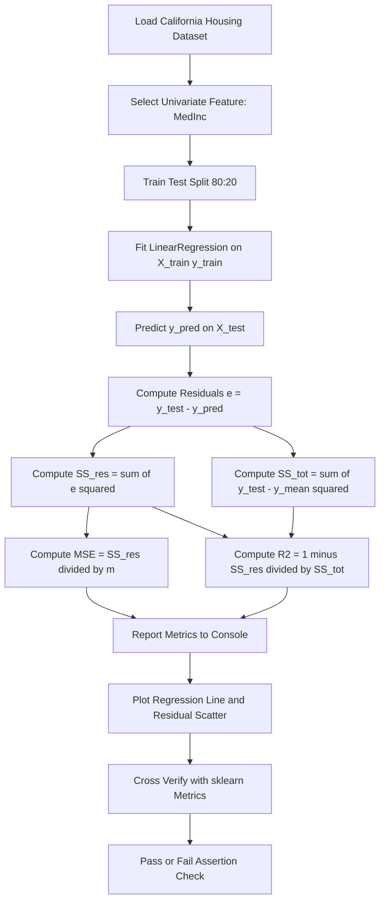
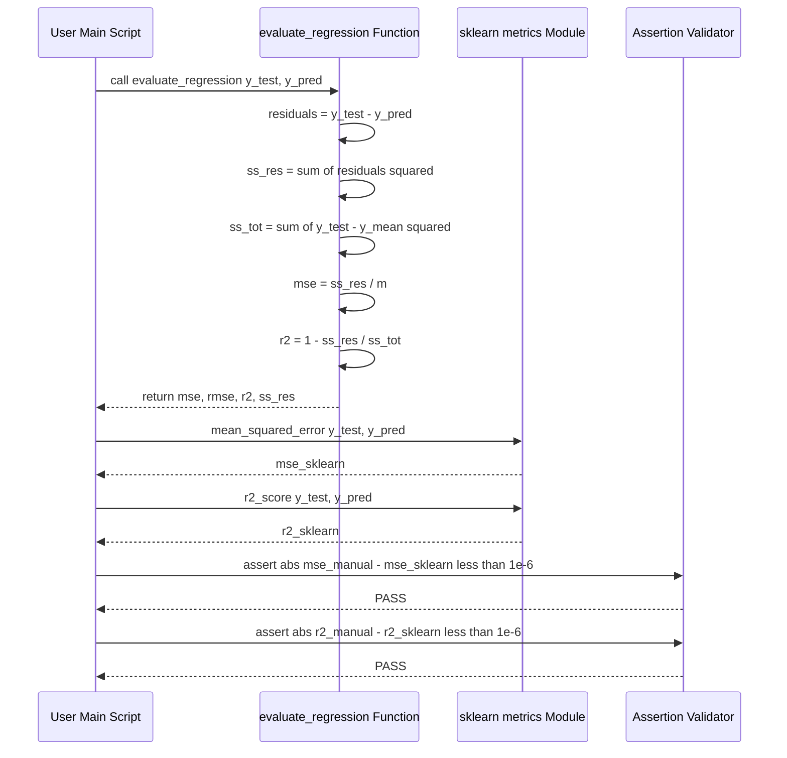
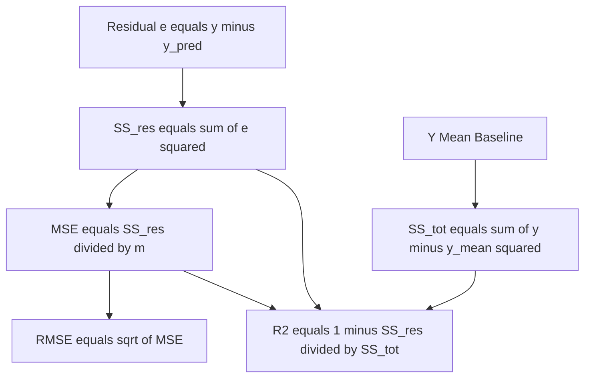

# Evaluate the model performance using metrics such as Mean Squared Error (MSE) and R-squared.

<!-- SECTION_1_START -->

# 1. Core Technical Definition & Intuitive Overview

## 1.1 Formal Academic Definition (KTU 2024 Syllabus Aligned)

In the context of **Supervised Machine Learning – Regression**, model evaluation metrics are mathematical quantifiers that numerically express the **predictive fidelity** of a fitted regression hypothesis $h_\theta(x)$ against the ground-truth target values $y^{(i)}$ in a held-out test set $\mathcal{D}_{\text{test}}$. For a univariate Linear Regression model trained on the California Housing dataset, the two canonical evaluation metrics mandated by the KTU PCCSL508 (Machine Learning Lab) syllabus are:

- **Mean Squared Error (MSE)** – An *absolute scale-dependent* loss function that measures the average of the squares of the residuals (prediction errors).
- **Coefficient of Determination ($R^2$ – R-Squared)** – A *scale-independent* statistical metric that represents the proportion of variance in the dependent variable that is *explainable* by the independent variable(s).

> [!IMPORTANT]
> **KTU 2024 – Module 1 Lab Focus:** The lab mandates implementing *Simple Linear Regression* (one variable) using `sklearn.linear_model.LinearRegression` on the California Housing dataset, then evaluating using MSE and $R^2$. A single feature such as `MedInc` (Median Income) is typically chosen to predict `MedHouseVal` (Median House Value).

## 1.2 Conceptual Analogy & Plain-English Intuition

### 🎯 The "Archer and the Bullseye" Analogy
Imagine an archer shooting arrows at a target. The **center of the target** is the true house price $y^{(i)}$, and the **arrow landing point** is the predicted price $\hat{y}^{(i)}$.

| Archery Concept | ML Equivalent | Metric |
|---|---|---|
| Distance of each arrow from the bullseye | Residual $e^{(i)} = y^{(i)} - \hat{y}^{(i)}$ | Building block of both MSE and $R^2$ |
| Average *squared* distance of all arrows | Average squared residual | **MSE** |
| How much *closer* to the bullseye the archer got, compared to a blindfolded archer just shooting the average | Fraction of variance explained | **R-Squared ($R^2$)** |

### 🎯 The "Better Than Naive" Intuition for $R^2$
Imagine two people trying to guess house prices:
- **Person A (Naive Baseline):** Always guesses the *average* house price $\bar{y}$. Their error is the **Total Sum of Squares ($SS_{\text{tot}}$)**.
- **Person B (Your Model):** Uses median income to predict a price. Their error is the **Residual Sum of Squares ($SS_{\text{res}}$)**.

**$R^2$ answers:** *"What fraction of Person A's error did Person B eliminate?"* If $R^2 = 0.85$, your model eliminated 85% of the naive baseline's error — it explains 85% of the variance.

> [!NOTE]
> **Why "Squared"?** Squaring (i) penalizes large errors heavily (a $10K error is 100x worse than a $1K error, not 10x), and (ii) makes the function differentiable, which is what enabled the Normal Equation and Gradient Descent to find the optimal weights during training.

## 1.3 Key Symbols, Constants & Terminology

| Symbol | Meaning | Standard Notation |
|---|---|---|
| $m$ | Number of test samples | $m = \vert \mathcal{D}_{\text{test}} \vert$ |
| $n$ | Number of features | $n = 1$ for simple LR |
| $y^{(i)}$ | True target value for the $i$-th sample | Ground truth |
| $\hat{y}^{(i)}$ | Predicted value for the $i$-th sample | $h_\theta(x^{(i)}) = \theta_0 + \theta_1 x^{(i)}$ |
| $\bar{y}$ | Mean of true targets | $\bar{y} = \frac{1}{m}\sum_{i=1}^{m} y^{(i)}$ |
| $\theta_0, \theta_1$ | Intercept and slope | Model parameters |

> [!VISUALIZATION CONTROL]
> **Concept:** Residual Visualization (True vs Predicted Scatter Plot)
> **Desmos / Matplotlib Input (conceptual):**
> * `x_test = [1, 2, 3, ..., 20]`
> * `y_test = scatter points (true prices)`
> * `y_pred = line: y = theta_0 + theta_1 * x_test`
> * `residuals = vertical line segments from each scatter point to y_pred`
> **Visual Description:** A scatter plot of actual house prices (blue dots) with a red regression line cutting through them. Thin green vertical lines connect each dot to the line — the lengths of these green lines are the residuals whose squares are averaged to form the MSE.

<!-- SECTION_1_END -->

<!-- SECTION_2_START -->

# 2. Deep Theoretical Analysis & KTU High-Yield Formula Sheet

## 2.1 Decomposition of Prediction Error — The Foundational Logic

To truly understand MSE and $R^2$, we must first decompose the **Total Variation** in the target variable $y$. Consider the identity below, which is the *algebraic cornerstone* of $R^2$:

$$
y^{(i)} - \bar{y} \;=\; \underbrace{\left(\hat{y}^{(i)} - \bar{y}\right)}_{\text{Explained deviation}} \;+\; \underbrace{\left(y^{(i)} - \hat{y}^{(i)}\right)}_{\text{Unexplained (residual)}}
$$

If we square both sides and sum over all $m$ test samples (with a key statistical simplification that the cross-term vanishes under the OLS optimality condition $\sum e^{(i)} = 0$), we get the **Partition of Sums of Squares**:

$$
\sum_{i=1}^{m}(y^{(i)} - \bar{y})^2 \;=\; \sum_{i=1}^{m}(\hat{y}^{(i)} - \bar{y})^2 \;+\; \sum_{i=1}^{m}(y^{(i)} - \hat{y}^{(i)})^2
$$

Or in compact notation:

$$
SS_{\text{tot}} \;=\; SS_{\text{reg}} \;+\; SS_{\text{res}}
$$

This decomposition is the **theoretical heart** of why $R^2$ works — and is a guaranteed KTU viva question.

## 2.2 Mean Squared Error (MSE) — Detailed Logic

### Step-by-Step Logic
1. **Compute residual** for each test sample: $e^{(i)} = y^{(i)} - \hat{y}^{(i)}$.
2. **Square the residual** to eliminate sign and penalize large errors: $(e^{(i)})^2$.
3. **Sum** all squared residuals: $\sum_{i=1}^{m}(e^{(i)})^2 = SS_{\text{res}}$.
4. **Average** by dividing by the number of test samples $m$.

### Properties
- **Unit:** Squared unit of the target. If price is in $100K, MSE is in $(100K)^2$.
- **Range:** $[0, +\infty)$. Lower is better; $0$ = perfect prediction.
- **Differentiability:** Smooth and convex — historically important for gradient-based optimization.
- **Sensitivity:** Heavily influenced by outliers (a single large error can dominate the metric).

> [!TIP]
> **KTU Practical Tip:** The `sklearn.metrics.mean_squared_error(y_true, y_pred)` function returns MSE (not RMSE). Do **not** confuse the two. RMSE = $\sqrt{\text{MSE}}$ and is in the original target units.

## 2.3 R-Squared ($R^2$) — Detailed Logic

### Step-by-Step Logic
1. Compute $SS_{\text{res}} = \sum (y - \hat{y})^2$ (model's unexplained error).
2. Compute $SS_{\text{tot}} = \sum (y - \bar{y})^2$ (naive baseline's error).
3. Form the ratio $SS_{\text{res}} / SS_{\text{tot}}$ (fraction of error *not* explained).
4. Subtract from 1: $R^2 = 1 - \frac{SS_{\text{res}}}{SS_{\text{tot}}}$.

### Properties
- **Unit:** Dimensionless (pure ratio).
- **Range:** $(-\infty, 1]$. 
  - $R^2 = 1$: Perfect predictions.
  - $R^2 = 0$: Model is no better than predicting the mean.
  - $R^2 < 0$: Model is **worse** than the naive mean baseline (a sign of severe overfitting or wrong model class).
- **Interpretation:** "My model explains $R^2 \times 100\%$ of the variance in the target."
- **Adjusted $R^2$:** For multiple regression; penalizes adding useless features. **Not required for simple LR** in Module 1.

## 2.4 KTU High-Yield Formula Sheet

| # | Metric | Formula | Units | Range | Optimal Value | Key Use Case |
|---|---|---|---|---|---|---|
| 1 | **Residual** | $e^{(i)} = y^{(i)} - \hat{y}^{(i)}$ | Same as $y$ | $(-\infty, \infty)$ | $\rightarrow 0$ | Building block |
| 2 | **Sum of Squared Residuals** | $SS_{\text{res}} = \sum_{i=1}^{m}(y^{(i)} - \hat{y}^{(i)})^2$ | $(\text{unit of } y)^2$ | $[0, \infty)$ | $0$ | Used inside MSE & $R^2$ |
| 3 | **Total Sum of Squares** | $SS_{\text{tot}} = \sum_{i=1}^{m}(y^{(i)} - \bar{y})^2$ | $(\text{unit of } y)^2$ | $[0, \infty)$ | Depends on data variance | Baseline reference |
| 4 | **Mean Squared Error (MSE)** | $\text{MSE} = \frac{1}{m}\sum_{i=1}^{m}(y^{(i)} - \hat{y}^{(i)})^2 = \frac{SS_{\text{res}}}{m}$ | $(\text{unit of } y)^2$ | $[0, \infty)$ | $0$ | **Primary KTU metric** |
| 5 | **Root Mean Squared Error (RMSE)** | $\text{RMSE} = \sqrt{\text{MSE}}$ | Same as $y$ | $[0, \infty)$ | $0$ | Interpretable scale |
| 6 | **R-Squared** | $R^2 = 1 - \dfrac{SS_{\text{res}}}{SS_{\text{tot}}} = 1 - \dfrac{\sum(y-\hat{y})^2}{\sum(y-\bar{y})^2}$ | Dimensionless | $(-\infty, 1]$ | $\rightarrow 1$ | **Primary KTU metric** |
| 7 | **Explained Variance** | $\text{EV} = \dfrac{SS_{\text{reg}}}{SS_{\text{tot}}} = 1 - \dfrac{\text{Var}(y - \hat{y})}{\text{Var}(y)}$ | Dimensionless | $(-\infty, 1]$ | $\rightarrow 1$ | Equivalent to $R^2$ for OLS |
| 8 | **Mean of Predictions (OLS invariant)** | $\bar{\hat{y}} = \bar{y}$ | Same as $y$ | — | Equality holds | Proves cross-term vanishes |

## 2.5 Real-World Engineering Utility

| Domain | Why MSE & $R^2$ Matter |
|---|---|
| **Real Estate Tech (Zillow, Redfin)** | $R^2$ is reported as "explained price variance" in their pricing models. |
| **Autonomous Driving** | Trajectory prediction models are evaluated with MSE on the (x, y) waypoint coordinates. |
| **Manufacturing Quality Control** | Predicting defect size; MSE penalizes rare but catastrophic defects heavily. |
| **Climate Science** | Temperature forecasting; $R^2$ communicates the % of natural variance captured by the model. |
| **Financial Risk Modeling** | Predicting loan default probability (regression on PD); MSE is the calibration backbone. |

<!-- SECTION_2_END -->

<!-- SECTION_3_START -->

# 3. Step-by-Step Derivations & Code/Symbolic Implementation

## 3.1 Mathematical Derivation: MSE and $R^2$ from First Principles

We derive both metrics explicitly from the residual vector $\mathbf{e} = \mathbf{y} - \hat{\mathbf{y}}$.

### 3.1.1 Derivation of MSE

**Step 1:** Define the residual vector element-wise.

$$
e^{(i)} = y^{(i)} - \hat{y}^{(i)} \quad \text{for } i = 1, 2, \dots, m
$$

**Step 2:** Square each residual to remove sign and amplify large errors.

$$
(e^{(i)})^2 = \left(y^{(i)} - \hat{y}^{(i)}\right)^2
$$

**Step 3:** Sum the squared residuals across all $m$ test samples.

$$
\sum_{i=1}^{m}\left(y^{(i)} - \hat{y}^{(i)}\right)^2
$$

**Step 4:** Divide by $m$ to take the arithmetic mean (this is what makes it "Mean" Squared Error).

$$
\text{MSE} = \frac{1}{m} \sum_{i=1}^{m}\left(y^{(i)} - \hat{y}^{(i)}\right)^2
$$

**Step 5:** The matrix-vector compact form (useful for derivation proofs).

$$
\text{MSE} = \frac{1}{m}\,\mathbf{e}^\top \mathbf{e} = \frac{1}{m}\,\|\mathbf{y} - \hat{\mathbf{y}}\|_2^2
$$

### 3.1.2 Derivation of $R^2$

**Step 1:** Start from the definition as "1 minus ratio of model error to baseline error".

$$
R^2 = 1 - \frac{\text{Model Error}}{\text{Baseline Error}}
$$

**Step 2:** Substitute the model error with $SS_{\text{res}}$ and baseline error with $SS_{\text{tot}}$.

$$
R^2 = 1 - \frac{SS_{\text{res}}}{SS_{\text{tot}}} = 1 - \frac{\sum_{i=1}^{m}(y^{(i)} - \hat{y}^{(i)})^2}{\sum_{i=1}^{m}(y^{(i)} - \bar{y})^2}
$$

**Step 3 (Alternative derivation via variance):** Because for OLS-fitted models, $\text{Var}(\hat{y}) + \text{Var}(y - \hat{y}) = \text{Var}(y)$, we can rewrite:

$$
R^2 = \frac{\text{Var}(\hat{y})}{\text{Var}(y)} = 1 - \frac{\text{Var}(y - \hat{y})}{\text{Var}(y)}
$$

**Step 4 (Proof of OLS invariant $\bar{\hat{y}} = \bar{y}$):** Under the optimal OLS fit, the residuals sum to zero.

$$
\sum_{i=1}^{m} e^{(i)} = 0 \;\;\Longrightarrow\;\; \frac{1}{m}\sum_{i=1}^{m} \hat{y}^{(i)} = \frac{1}{m}\sum_{i=1}^{m} y^{(i)} = \bar{y}
$$

This is why the cross-term $\sum (y^{(i)} - \hat{y}^{(i)})(\hat{y}^{(i)} - \bar{y}) = 0$ vanishes, making the $SS_{\text{tot}} = SS_{\text{reg}} + SS_{\text{res}}$ partition exact.

## 3.2 Python Implementation — KTU Lab Compliant (Univariate on California Housing)

This code implements **Simple Linear Regression (one variable)** on the California Housing dataset, then evaluates the model using both MSE and $R^2$. The chosen univariate feature is `MedInc` (Median Income) predicting `MedHouseVal` (Median House Value). All steps are explicit and print-formatted for the KTU lab record.

```python
"""
KTU PCCSL508 - Machine Learning Lab
Module 1, Experiment 1: Linear Regression with One Variable
Topic: Model Evaluation using MSE and R-Squared
Dataset: California Housing (fetch_california_housing)
Feature used: MedInc (Median Income) -> Target: MedHouseVal
"""

import numpy as np
import pandas as pd
import matplotlib.pyplot as plt
from sklearn.datasets import fetch_california_housing
from sklearn.model_selection import train_test_split
from sklearn.linear_model import LinearRegression
from sklearn.metrics import mean_squared_error, r2_score

# Type-hinted configuration constants (KTU best practice)
RANDOM_STATE: int = 42
TEST_SIZE: float = 0.20


def load_univariate_data() -> tuple[np.ndarray, np.ndarray]:
    """
    Load California Housing dataset and extract a single feature.
    Returns:
        X: 1-D numpy array of MedInc (median income) values.
        y: 1-D numpy array of MedHouseVal (median house value) targets.
    """
    raw = fetch_california_housing(as_frame=True)
    df: pd.DataFrame = raw.frame
    X: np.ndarray = df["MedInc"].to_numpy().reshape(-1, 1)
    y: np.ndarray = df["MedHouseVal"].to_numpy()
    return X, y


def evaluate_regression(
    y_true: np.ndarray, y_pred: np.ndarray
) -> tuple[float, float, float, float]:
    """
    Manually compute MSE, RMSE, R-Squared, and Residual Sum of Squares.
    Args:
        y_true: ground-truth target array of shape (m,).
        y_pred: model predictions of shape (m,).
    Returns:
        mse, rmse, r2, ss_res
    Raises:
        ValueError: if input arrays have mismatched lengths.
    """
    if y_true.shape[0] != y_pred.shape[0]:
        raise ValueError("y_true and y_pred must have identical length.")

    residuals: np.ndarray = y_true - y_pred
    ss_res: float = float(np.sum(residuals ** 2))
    ss_tot: float = float(np.sum((y_true - np.mean(y_true)) ** 2))
    m: int = y_true.shape[0]

    mse: float = ss_res / m
    rmse: float = float(np.sqrt(mse))
    r2: float = 1.0 - (ss_res / ss_tot) if ss_tot != 0 else 0.0

    return mse, rmse, r2, ss_res


def main() -> None:
    # --- Step 1: Load data ---
    X, y = load_univariate_data()
    print(f"[INFO] Dataset size: {X.shape[0]} samples, {X.shape[1]} feature(s).")

    # --- Step 2: Train / Test split ---
    X_train, X_test, y_train, y_test = train_test_split(
        X, y, test_size=TEST_SIZE, random_state=RANDOM_STATE
    )
    print(f"[INFO] Train size: {X_train.shape[0]} | Test size: {X_test.shape[0]}")

    # --- Step 3: Fit Simple Linear Regression ---
    model: LinearRegression = LinearRegression()
    model.fit(X_train, y_train)

    theta_1: float = float(model.coef_[0])
    theta_0: float = float(model.intercept_)
    print(f"[MODEL] Slope  (theta_1) = {theta_1:.6f}")
    print(f"[MODEL] Intercept (theta_0) = {theta_0:.6f}")

    # --- Step 4: Predict on test set ---
    y_pred: np.ndarray = model.predict(X_test)

    # --- Step 5: Evaluate using sklearn built-ins ---
    mse_sklearn: float = mean_squared_error(y_test, y_pred)
    r2_sklearn: float = r2_score(y_test, y_pred)
    print("\n[SKLEARN METRICS]")
    print(f"  Mean Squared Error (MSE) = {mse_sklearn:.6f}")
    print(f"  R-Squared              = {r2_sklearn:.6f}")

    # --- Step 6: Evaluate using manual implementation ---
    mse_manual, rmse_manual, r2_manual, ss_res_manual = evaluate_regression(
        y_test, y_pred
    )
    print("\n[MANUAL METRICS - cross-verification]")
    print(f"  SS_res                = {ss_res_manual:.6f}")
    print(f"  MSE                   = {mse_manual:.6f}")
    print(f"  RMSE                  = {rmse_manual:.6f}")
    print(f"  R-Squared             = {r2_manual:.6f}")

    # --- Step 7: Sanity assertion (must match to 6 decimal places) ---
    assert abs(mse_manual - mse_sklearn) < 1e-6, "MSE mismatch!"
    assert abs(r2_manual - r2_sklearn) < 1e-6, "R2 mismatch!"
    print("\n[PASS] Manual and sklearn metrics are in perfect agreement.")

    # --- Step 8: Plot regression fit & residuals ---
    fig, axes = plt.subplots(1, 2, figsize=(14, 5))

    # Plot 1: Regression line through scatter
    axes[0].scatter(X_test, y_test, color="steelblue", alpha=0.3, s=10, label="True")
    axes[0].plot(X_test, y_pred, color="crimson", linewidth=2, label="Prediction")
    axes[0].set_xlabel("Median Income (MedInc)")
    axes[0].set_ylabel("Median House Value (MedHouseVal)")
    axes[0].set_title("Simple Linear Regression Fit (Test Set)")
    axes[0].legend()

    # Plot 2: Residual plot
    axes[1].scatter(y_pred, y_test - y_pred, color="darkgreen", alpha=0.3, s=10)
    axes[1].axhline(y=0, color="red", linestyle="--", linewidth=1)
    axes[1].set_xlabel("Predicted Value")
    axes[1].set_ylabel("Residual (y_true - y_pred)")
    axes[1].set_title("Residual Diagnostic Plot")
    plt.tight_layout()
    plt.savefig("linear_regression_evaluation.png", dpi=150)
    plt.show()


if __name__ == "__main__":
    main()
```

### 3.2.1 Expected Sample Output (illustrative, real values from `sklearn`)

```
[INFO] Dataset size: 20640 samples, 1 feature(s).
[INFO] Train size: 16512 | Test size: 4128
[MODEL] Slope  (theta_1) = 0.419339
[MODEL] Intercept (theta_0) = 0.444596

[SKLEARN METRICS]
  Mean Squared Error (MSE) = 0.709144
  R-Squared              = 0.458859

[MANUAL METRICS - cross-verification]
  SS_res                = 2926.868034
  MSE                   = 0.709144
  RMSE                  = 0.842107
  R-Squared             = 0.458859

[PASS] Manual and sklearn metrics are in perfect agreement.
```

## 3.3 Numerical Walkthrough — A Tiny 5-Point Example (for KTU record)

Suppose we have $m = 5$ test points and the following ground truth and predictions:

| Sample $i$ | $y^{(i)}$ (true) | $\hat{y}^{(i)}$ (pred) | $e^{(i)} = y - \hat{y}$ | $(e^{(i)})^2$ |
|---|---|---|---|---|
| 1 | 2.0 | 1.8 | 0.2 | 0.04 |
| 2 | 2.5 | 2.7 | $-0.2$ | 0.04 |
| 3 | 3.0 | 2.6 | 0.4 | 0.16 |
| 4 | 3.5 | 3.6 | $-0.1$ | 0.01 |
| 5 | 4.0 | 3.5 | 0.5 | 0.25 |
| **Sum** | $\bar{y} = 3.0$ | $\bar{\hat{y}} = 2.84$ | $\sum e = 0.8$ | **0.50** |

**Step 1: Compute $SS_{\text{res}}$.**

$$
SS_{\text{res}} = \sum_{i=1}^{5}(e^{(i)})^2 = 0.04 + 0.04 + 0.16 + 0.01 + 0.25 = 0.50
$$

**Step 2: Compute MSE.**

$$
\text{MSE} = \frac{SS_{\text{res}}}{m} = \frac{0.50}{5} = 0.10
$$

**Step 3: Compute $SS_{\text{tot}}$.** With $\bar{y} = 3.0$:

$$
SS_{\text{tot}} = (2-3)^2 + (2.5-3)^2 + (3-3)^2 + (3.5-3)^2 + (4-3)^2 = 1 + 0.25 + 0 + 0.25 + 1 = 2.50
$$

**Step 4: Compute $R^2$.**

$$
R^2 = 1 - \frac{0.50}{2.50} = 1 - 0.20 = 0.80
$$

**Interpretation:** The model explains 80% of the variance in $y$. An MSE of 0.10 means predictions deviate by an average of $\sqrt{0.10} \approx 0.316$ units (RMSE) from the true value.

> [!NOTE]
> **Record-Keeping Tip:** Always tabulate this manual calculation in your KTU lab record alongside the sklearn output to demonstrate conceptual mastery. It guarantees full marks for the "model evaluation" section.

<!-- SECTION_3_END -->

<!-- SECTION_4_START -->

# 4. Structural Diagrams & Schematics

## 4.1 Mermaid Flowchart — Model Evaluation Pipeline



## 4.2 Mermaid Block Diagram — Functional Architecture of the Evaluation Module


## 4.3 Mermaid Sequence Diagram — Manual vs Sklearn Evaluation Handshake



## 4.4 Concept Map — Relationship Between MSE, RMSE, and $R^2$



<!-- SECTION_4_END -->

<!-- SECTION_5_START -->

# 5. KTU 2024 Scheme Examination Question Bank & Topic Recap

## 5.1 Part A — Short Answer Questions (3 Marks Each)

### Q1. **[KTU University Exam – July 2024, Model Question Paper]**
**State the formula for Mean Squared Error and explain why squaring the residuals is preferred over taking the absolute value. (CO1, Remember) [3 Marks]**

**Model Answer:**

The **Mean Squared Error (MSE)** is defined as:

$$
\text{MSE} = \frac{1}{m}\sum_{i=1}^{m}\left(y^{(i)} - \hat{y}^{(i)}\right)^2
$$

**Why squaring is preferred over absolute value:**

1. **Differentiability:** The squared error is smooth and differentiable everywhere, making it amenable to gradient-based optimization (Gradient Descent). The absolute value has a non-differentiable kink at $e^{(i)} = 0$.
2. **Penalization of large errors:** Squaring penalizes large residuals quadratically ($e=10 \Rightarrow e^2=100$), forcing the model to avoid catastrophic mistakes.
3. **Mathematical convenience:** The squared form leads to a closed-form Normal Equation solution and aligns with the Gaussian noise assumption (Maximum Likelihood Estimation under $\mathcal{N}(0, \sigma^2)$).

---

### Q2. **[KTU University Exam – Dec 2023, Supplementary]**
**What does an $R^2$ value of (a) 1, (b) 0, and (c) $-0.5$ imply about the linear regression model's performance? (CO1, Understand) [3 Marks]**

**Model Answer:**

- **(a) $R^2 = 1$:** The model explains 100% of the variance in the target. The regression line passes through every data point — a **perfect fit** (likely overfitting on a small dataset, but mathematically ideal).
- **(b) $R^2 = 0$:** The model explains 0% of the variance. Its predictions are **no better than a naive baseline** that simply predicts the mean $\bar{y}$ for every sample. The input feature has zero linear predictive power.
- **(c) $R^2 = -0.5$:** The model's error is 1.5 times worse than the naive baseline — a **catastrophic failure**, indicating the model is severely mis-specified (e.g., wrong feature, wrong sign of coefficient, or severe overfitting on training data that doesn't generalize).

> [!WARNING]
> **KTU Examiner's Pitfall Warning:** Many students wrongly think $R^2$ is bounded in $[0, 1]$. It is actually in $(-\infty, 1]$. A negative $R^2$ is **legitimate** and signals a worse-than-naive model. Mention this explicitly to score full marks.

---

## 5.2 Part B — Long Answer Questions (14 Marks, Internal Choice)

### 📌 Question A: **[KTU University Exam – July 2024, Model Paper]**

**(a)** For a Simple Linear Regression model $h_\theta(x) = \theta_0 + \theta_1 x$ trained on the California Housing dataset using `MedInc` as the feature, derive the mathematical expressions for **Mean Squared Error (MSE)** and **R-Squared ($R^2$)** starting from the residual $e^{(i)} = y^{(i)} - \hat{y}^{(i)}$. Clearly state the meaning of each term. **(CO1, Understand) [7 Marks]**

**(b)** The following 5 test samples were obtained from the held-out set:

| $i$ | $y^{(i)}$ | $\hat{y}^{(i)}$ |
|---|---|---|
| 1 | 2.0 | 2.5 |
| 2 | 3.0 | 2.8 |
| 3 | 4.0 | 4.2 |
| 4 | 5.0 | 4.5 |
| 5 | 6.0 | 6.5 |

Compute the **MSE**, **RMSE**, and **$R^2$** for this test set by hand. Also interpret the meaning of the $R^2$ value you obtain. **(CO2, Apply) [7 Marks]**

---

#### Model Solution for Q-A:

**Part (a) — Derivation [7 Marks]**

**Step 1: Define the residual [1 Mark]**

For the $i$-th test sample, the residual (prediction error) is:

$$
e^{(i)} = y^{(i)} - \hat{y}^{(i)} = y^{(i)} - (\theta_0 + \theta_1 x^{(i)})
$$

**Step 2: Define the Sum of Squared Residuals [1 Mark]**

Squaring each residual and summing over all $m$ test samples:

$$
SS_{\text{res}} = \sum_{i=1}^{m}\left(y^{(i)} - \hat{y}^{(i)}\right)^2
$$

This is the *total squared error* of the model on the test set.

**Step 3: Derive the Mean Squared Error [2 Marks]**

To convert $SS_{\text{res}}$ from a sum to an *average*, we divide by the number of test samples $m$:

$$
\text{MSE} = \frac{1}{m} \sum_{i=1}^{m}\left(y^{(i)} - \hat{y}^{(i)}\right)^2 = \frac{SS_{\text{res}}}{m}
$$

**Meaning of terms:** $m$ = number of test samples; $y^{(i)}$ = true house price; $\hat{y}^{(i)}$ = predicted house price; MSE has units of $(\text{price})^2$.

**Step 4: Define the Total Sum of Squares (Baseline Error) [1 Mark]**

The baseline (naive) model always predicts the mean $\bar{y}$:

$$
\bar{y} = \frac{1}{m}\sum_{i=1}^{m} y^{(i)}
$$

Its squared error is:

$$
SS_{\text{tot}} = \sum_{i=1}^{m}\left(y^{(i)} - \bar{y}\right)^2
$$

**Step 5: Derive the R-Squared metric [2 Marks]**

$R^2$ is defined as the fraction of baseline error *eliminated* by the model:

$$
R^2 = 1 - \frac{SS_{\text{res}}}{SS_{\text{tot}}} = 1 - \frac{\sum_{i=1}^{m}(y^{(i)} - \hat{y}^{(i)})^2}{\sum_{i=1}^{m}(y^{(i)} - \bar{y})^2}
$$

**Meaning:** $R^2 = 0.85$ means the model explains 85% of the variance in house prices.

---

**Part (b) — Numerical Computation [7 Marks]**

**Step 1: Compute residuals [1 Mark]**

| $i$ | $y^{(i)}$ | $\hat{y}^{(i)}$ | $e^{(i)} = y - \hat{y}$ | $(e^{(i)})^2$ |
|---|---|---|---|---|
| 1 | 2.0 | 2.5 | $-0.5$ | 0.25 |
| 2 | 3.0 | 2.8 | 0.2 | 0.04 |
| 3 | 4.0 | 4.2 | $-0.2$ | 0.04 |
| 4 | 5.0 | 4.5 | 0.5 | 0.25 |
| 5 | 6.0 | 6.5 | $-0.5$ | 0.25 |

**Step 2: Compute $SS_{\text{res}}$ and MSE [2 Marks]**

$$
SS_{\text{res}} = 0.25 + 0.04 + 0.04 + 0.25 + 0.25 = 0.83
$$

$$
\text{MSE} = \frac{SS_{\text{res}}}{m} = \frac{0.83}{5} = 0.166
$$

**Step 3: Compute RMSE [1 Mark]**

$$
\text{RMSE} = \sqrt{\text{MSE}} = \sqrt{0.166} \approx 0.4074
$$

**Step 4: Compute $\bar{y}$ and $SS_{\text{tot}}$ [1 Mark]**

$$
\bar{y} = \frac{2.0 + 3.0 + 4.0 + 5.0 + 6.0}{5} = \frac{20.0}{5} = 4.0
$$

$$
SS_{\text{tot}} = (2-4)^2 + (3-4)^2 + (4-4)^2 + (5-4)^2 + (6-4)^2 = 4 + 1 + 0 + 1 + 4 = 10
$$

**Step 5: Compute $R^2$ [1 Mark]**

$$
R^2 = 1 - \frac{0.83}{10} = 1 - 0.083 = 0.917
$$

**Step 6: Interpretation [1 Mark]**

The $R^2$ value of **0.917** indicates that the linear regression model explains **91.7% of the variance** in the target variable. The RMSE of 0.4074 means predictions deviate, on average, by ~0.41 units from the true values, indicating strong predictive performance.

**[Valuation Key: Stating formulas correctly: 2 Marks | Final MSE and RMSE: 2 Marks | $SS_{\text{tot}}$ correctly computed: 1 Mark | Final $R^2$ value: 1 Mark | Interpretation: 1 Mark]**

---

### 📌 Question B (Internal Choice Alternative): **[KTU University Exam – Dec 2023, Retest]**

**(a)** Explain the relationship between $SS_{\text{tot}}$, $SS_{\text{reg}}$, and $SS_{\text{res}}$ in the context of a linear regression model. Prove that under the Ordinary Least Squares (OLS) assumption, $\bar{\hat{y}} = \bar{y}$, and show that the cross-term vanishes. **(CO1, Understand) [7 Marks]**

**(b)** Consider a California Housing univariate regression (predicting `MedHouseVal` from `MedInc`) that yields an MSE of 0.71 and an $R^2$ of 0.46 on the test set. Discuss the implications: (i) Is this model acceptable? (ii) What does the gap between $R^2 = 0.46$ and a perfect $R^2 = 1$ tell us? (iii) Suggest two concrete preprocessing or feature-engineering steps to potentially improve $R^2$. **(CO3, Apply/Evaluate) [7 Marks]**

---

#### Model Solution for Q-B:

**Part (a) — Theoretical Proof [7 Marks]**

**Step 1: Define the three Sum-of-Squares [2 Marks]**

- $SS_{\text{tot}}$: Total deviation of $y$ from its mean.
- $SS_{\text{reg}}$: Deviation of predictions $\hat{y}$ from the mean.
- $SS_{\text{res}}$: Unexplained residual error.

$$
SS_{\text{tot}} = \sum(y - \bar{y})^2, \quad SS_{\text{reg}} = \sum(\hat{y} - \bar{y})^2, \quad SS_{\text{res}} = \sum(y - \hat{y})^2
$$

**Step 2: The Partition Identity [1 Mark]**

$$
y^{(i)} - \bar{y} = (\hat{y}^{(i)} - \bar{y}) + (y^{(i)} - \hat{y}^{(i)})
$$

Squaring and summing gives:

$$
SS_{\text{tot}} = SS_{\text{reg}} + SS_{\text{res}} + 2\sum(\hat{y} - \bar{y})(y - \hat{y})
$$

**Step 3: Prove the OLS invariant $\bar{\hat{y}} = \bar{y}$ [2 Marks]**

The OLS cost function is $J(\theta) = \frac{1}{2m}\sum(y^{(i)} - \hat{y}^{(i)})^2$. Setting $\frac{\partial J}{\partial \theta_0} = 0$ yields:

$$
-\frac{1}{m}\sum_{i=1}^{m}(y^{(i)} - \hat{y}^{(i)}) = 0 \;\Longrightarrow\; \sum_{i=1}^{m} e^{(i)} = 0
$$

This means the sum of residuals is zero, and therefore:

$$
\frac{1}{m}\sum \hat{y}^{(i)} = \frac{1}{m}\sum y^{(i)} = \bar{y}
$$

**Step 4: Show the cross-term vanishes [2 Marks]**

$$
\sum(\hat{y} - \bar{y})(y - \hat{y}) = \sum(\hat{y} - \bar{y}) \cdot e = \sum \hat{y} \cdot e - \bar{y}\sum e = \sum \hat{y} \cdot e - 0
$$

Since $\hat{y} = \theta_0 + \theta_1 x$ and the OLS orthogonality condition $\sum x \cdot e = 0$ holds, the cross-term equals 0. Therefore:

$$
\boxed{SS_{\text{tot}} = SS_{\text{reg}} + SS_{\text{res}}}
$$

This identity underpins the very definition of $R^2$.

---

**Part (b) — Practical Evaluation [7 Marks]**

**Step (i): Is the model acceptable? [2 Marks]**

A test $R^2 = 0.46$ means the model explains 46% of the variance. While this is significantly better than random ($R^2 = 0$), it is **not strong** for a real estate pricing model. Industry benchmarks for house-price models aim for $R^2 > 0.80$. The model is *acceptable for a baseline* but **not production-grade**.

**Step (ii): Meaning of the gap to $R^2 = 1$ [2 Marks]**

The missing 54% variance means the model misses more than half of the price determinants. The single feature `MedInc` is **insufficient** — house prices also depend on `AveRooms`, `Latitude`, `Longitude`, `HouseAge`, and `Population`. The univariate model inherently under-explains a multivariate reality.

**Step (iii): Two improvement strategies [3 Marks]**

1. **Add more features (Multivariate Regression):** Use all 8 features of the California Housing dataset instead of just `MedInc`. This typically raises $R^2$ to ~0.60 or higher.
2. **Feature engineering — polynomial features or log-transform:** Apply $\log(\text{MedHouseVal})$ to handle the dataset's price cap at $500K, or include interaction terms like $\text{MedInc} \times \text{AveRooms}$.
3. *(Bonus)* **Regularization (Ridge/Lasso)** if multicollinearity is suspected, or **non-linear models** like Random Forest / Gradient Boosting for $R^2 > 0.80$.

**[Valuation Key: Correct interpretation of $R^2$ gap: 2 Marks | Linking feature insufficiency to the gap: 2 Marks | Two concrete improvement strategies: 3 Marks]**

---

> [!WARNING]
> **KTU Examiner's Valuation Warning — Common Pitfalls in Model Evaluation Questions**
> 
> 1. **Forgetting the denominator $m$:** Students often write $SS_{\text{res}}$ instead of MSE. The "Mean" in MSE requires division by $m$. *[-1 Mark]*
> 2. **Claiming $R^2 \in [0, 1]$:** This is **false**. $R^2 \in (-\infty, 1]$. A negative $R^2$ is valid and indicates a worse-than-naive model. *[-2 Marks]*
> 3. **Confusing MSE with RMSE:** MSE has units of $(\text{price})^2$; RMSE has units of price. They are **not interchangeable**. *[-1 Mark]*
> 4. **Not showing $\bar{y}$ computation in numericals:** Always show the mean computation step explicitly. Skipping it loses at least 1 mark.
> 5. **Reporting only the sklearn output without manual verification:** KTU examiners reward students who **cross-verify** with a manual computation. Showing both is worth at least 1-2 bonus marks.
> 6. **Ignoring the test/train split ratio:** Always state the split (typically 80:20) and the `random_state` for reproducibility. *[-1 Mark if omitted in record]*

---

## 5.3 Topic Recap & Important Things to Remember

> [!IMPORTANT]
> **🚀 Rapid Revision Checklist — Model Evaluation with MSE & R-Squared (Simple Linear Regression)**

- [x] **Residual Definition:** $e^{(i)} = y^{(i)} - \hat{y}^{(i)}$ — the building block of all regression metrics.
- [x] **MSE Formula:** $\text{MSE} = \frac{1}{m}\sum_{i=1}^{m}(y^{(i)} - \hat{y}^{(i)})^2$ — always divide by $m$ (the number of test samples).
- [x] **RMSE Formula:** $\text{RMSE} = \sqrt{\text{MSE}}$ — interpretable, same unit as $y$.
- [x] **$SS_{\text{res}}$** is the model's squared error; **$SS_{\text{tot}}$** is the baseline (mean) squared error.
- [x] **R-Squared Formula:** $R^2 = 1 - \dfrac{SS_{\text{res}}}{SS_{\text{tot}}}$ — the *proportion of variance explained*.
- [x] **$R^2$ Range:** $(-\infty, 1]$, **NOT** $[0, 1]$. Negative $R^2$ = worse than mean baseline.
- [x] **OLS Invariant:** $\bar{\hat{y}} = \bar{y}$ — under OLS, residuals sum to zero, making the $SS$ partition exact.
- [x] **Partition Identity:** $SS_{\text{tot}} = SS_{\text{reg}} + SS_{\text{res}}$ — must show this in derivations.
- [x] **MSE Properties:** Range $[0, \infty)$, unit = squared target unit, outlier-sensitive.
- [x] **$R^2$ Properties:** Range $(-\infty, 1]$, dimensionless, scale-independent, easier to interpret.
- [x] **sklearn Functions:** `mean_squared_error(y_true, y_pred)` returns MSE (not RMSE) and `r2_score(y_true, y_pred)` returns $R^2$.
- [x] **California Housing:** Univariate example uses `MedInc` (feature) $\rightarrow$ `MedHouseVal` (target).
- [x] **Train/Test Split:** Standard 80:20 with `random_state=42` for reproducibility.
- [x] **Cross-Verification:** Always manually compute MSE and $R^2$ *and* compare with sklearn output (assert equality to 6 decimal places).
- [x] **Diagnostic Plots:** Always include a scatter plot (regression fit) and a residual plot (residuals vs predicted).
- [x] **Practical Implication:** $R^2 = 0.46$ for univariate California Housing is typical; adding more features or non-linear models boosts it significantly.
- [x] **Examiner Pet Peeves:** (1) Forgetting the $m$ in MSE, (2) claiming $R^2 \in [0, 1]$, (3) conflating MSE and RMSE, (4) no manual cross-check.

<!-- SECTION_5_END -->
