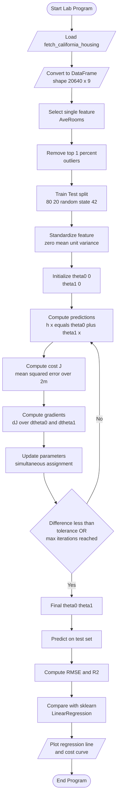
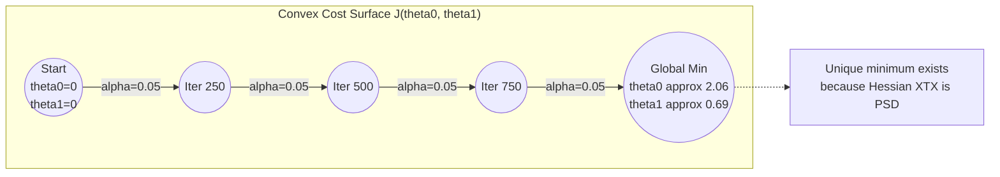

# Implement linear regression with one variable on the California Housing dataset to predict housing prices based on a single feature (e.g., the average number of rooms per dwelling).

<!-- SECTION_1_START -->
# Module 1 — Implement Linear Regression (One Variable) on California Housing

## 1.1 Formal Academic Definition (KTU 2024 Scheme Terminology)

**Simple Linear Regression (SLR)** is a *supervised machine learning* algorithm belonging to the family of *parametric regression models*. It models the mathematical relationship between a single independent (input) feature $X$ and a continuous dependent (output) target $Y$ by fitting a straight line through the data in a way that minimizes the average squared vertical distance between the observed data points and the predicted line.

Formally, the model is expressed by the **hypothesis function**:

$$h_{\theta}(x) = \theta_0 + \theta_1 x$$

where:
- $\theta_0$ is the **bias term** (y-intercept, also called *intercept*)
- $\theta_1$ is the **weight** (slope, also called *coefficient*)
- $x$ is the single input feature (e.g., `AveRooms` — average number of rooms per dwelling)
- $h_{\theta}(x)$ is the predicted housing price (in units of **\$100,000** for the California Housing dataset)

> [!IMPORTANT]
> **KTU 2024 Syllabus Highlight:** In the context of Module 1 of *PCCSL508 – Machine Learning Lab*, students are expected to implement linear regression **from first principles** (using NumPy gradient descent) **and also** validate the result using the `sklearn.linear_model.LinearRegression` class for benchmark comparison.

## 1.2 Conceptual Analogy / Real-World Intuition

Imagine you are a **real-estate appraiser** in California. A homeowner calls you and says: *"My neighbour's 4-room house sold for \$250,000 and their 6-room house sold for \$450,000. Based only on the number of rooms, how much will MY 5-room house sell for?"*

You would intuitively **draw a straight line** through the two data points $(4, 250)$ and $(6, 450)$, then read the $y$-value when $x=5$. That line is precisely the linear regression model. SLR is the algorithm that does this line-drawing **automatically** for thousands of houses simultaneously, choosing the line that best balances the *overestimates* and *underestimates*.

| Real Estate Term | ML Equivalent |
|---|---|
| Baseline price of a 0-room shack | $\theta_0$ (intercept / bias) |
| Price increase per extra room | $\theta_1$ (weight / slope) |
| Asking price prediction | $h_{\theta}(x)$ (hypothesis output) |
| Real sold price | $y$ (true label) |
| Prediction error | $h_{\theta}(x) - y$ (residual) |

## 1.3 The California Housing Dataset — Standard Metrics

The dataset is bundled with `scikit-learn` and contains **20,640 samples** aggregated from the 1990 California Census. Each sample has **8 numeric features** and 1 target (`MedHouseVal`).

> [!NOTE]
> **Key Constants to Remember for the KTU Lab Exam:**
> - **Sample size:** $m = 20{,}640$
> - **Number of features:** $n = 8$
> - **Target range:** $\$0.14999$ to $\$5.00001$ (in units of **\$100,000**)
> - **Target name in sklearn:** `MedHouseVal`
> - **Selected feature for this experiment:** `AveRooms` (average rooms per household)

| Feature Name | Meaning |
|---|---|
| `MedInc` | Median income in block group |
| `HouseAge` | Median house age |
| `AveRooms` | **Average number of rooms per dwelling** ← *chosen* |
| `AveBedrms` | Average bedrooms per dwelling |
| `Population` | Block group population |
| `AveOccup` | Average household occupancy |
| `Latitude` | Block group latitude |
| `Longitude` | Block group longitude |
| `PRICE` | Median house value (**target**, \$100,000 units) |

## 1.4 GeoGebra / Desmos Visualization Blueprint

> [!VISUALIZATION CONTROL]
> **Concept:** Single-variable linear fit showing the best-fit line through a scatter of $(x, y)$ points.
>
> **Desmos Input Equations (paste into [desmos.com/calculator](https://www.desmos.com/calculator)):**
>
> * $y_1 = a + b \cdot x$ — hypothesis line
> * $y_2 = a + b \cdot x + 0.2 \cdot \sin(10x)$ — a non-linear data generator to visualize residuals
> * $a = 0.5$, $b = 0.08$ — initial parameter sliders
>
> **Visual Description:** The student should observe that as the slider $a$ moves vertically, the line shifts up/down (changing the **bias** $\theta_0$). As the slider $b$ rotates, the line tilts (changing the **weight** $\theta_1$). The optimal $a, b$ pair is the one where the **sum of squared vertical distances** from every point to the line is at its absolute minimum — that is the *cost function* minimum.

<!-- SECTION_1_END -->

<!-- SECTION_2_START -->
# Section 2 — Deep Theoretical Analysis & KTU Formula Sheet

## 2.1 The Five Logical Stages of a Linear Regression Pipeline

1. **Hypothesis Formulation** — Define the mathematical mapping $X \to \hat{Y}$. The assumption is that $Y$ depends *linearly* on $X$ with Gaussian noise $\epsilon$:
$$y^{(i)} = \theta_0 + \theta_1 x^{(i)} + \epsilon^{(i)}, \quad \epsilon \sim \mathcal{N}(0, \sigma^2)$$

2. **Loss Function Design** — Quantify *how wrong* the current hypothesis is. We use the **Mean Squared Error (MSE)** divided by 2 for algebraic convenience:
$$J(\theta_0, \theta_1) = \frac{1}{2m} \sum_{i=1}^{m} \left( h_{\theta}\!\left(x^{(i)}\right) - y^{(i)} \right)^2$$

3. **Optimization Strategy** — Search the $(\theta_0, \theta_1)$ plane for the parameters that minimize $J$. Two equivalent paths exist:
   * **Iterative path:** Batch Gradient Descent
   * **Closed-form path:** The Normal Equation

4. **Convergence Check** — Verify that $J$ has plateaued, or that the parameter updates $\lvert \Delta \theta_j \rvert < 10^{-6}$.

5. **Generalization Check** — Evaluate on a *held-out test set* using $R^2$ and RMSE. A model that performs well on the training set but poorly on the test set has **overfit**.

## 2.2 Gradient Descent — The Intuition of the "Why"

Gradient descent is a **first-order iterative optimization algorithm** that updates parameters in the direction of the **steepest descent** of the cost function. The intuition: imagine standing on a foggy, bowl-shaped hill (the cost surface). You cannot see the bottom, but you can feel the slope of the ground under your feet. By repeatedly stepping in the direction of *negative* slope, you eventually reach the valley floor (the global minimum, since $J$ is convex for linear regression).

The update rule for *simultaneous* updates is:

$$\theta_j := \theta_j - \alpha \frac{\partial}{\partial \theta_j} J(\theta_0, \theta_1), \quad j \in \{0, 1\}$$

where $\alpha$ is the **learning rate** (a hyperparameter), typically tuned from $\{0.001, 0.01, 0.1, 0.3\}$.

> [!WARNING]
> If $\alpha$ is **too large** (e.g., $\alpha = 1.0$), the algorithm overshoots and **diverges** (cost explodes). If $\alpha$ is **too small** (e.g., $\alpha = 10^{-9}$), convergence takes an impractically long time. KTU lab evaluators often test whether the student has plotted the *cost vs. iterations* curve to prove convergence.

## 2.3 KTU High-Yield Formula Cheat Sheet

| Symbol | Name | Formula / Definition | Engineering Use |
|---|---|---|---|
| $h_{\theta}(x)$ | Hypothesis | $h_{\theta}(x) = \theta_0 + \theta_1 x$ | Predicting housing price |
| $J(\theta)$ | Cost (MSE/2) | $J(\theta_0,\theta_1) = \dfrac{1}{2m}\sum_{i=1}^{m}\!\left(h_{\theta}(x^{(i)}) - y^{(i)}\right)^{2}$ | Quantifies prediction error |
| $\frac{\partial J}{\partial \theta_0}$ | Partial deriv. | $\dfrac{1}{m}\sum_{i=1}^{m}\!\left(h_{\theta}(x^{(i)}) - y^{(i)}\right)$ | Bias gradient |
| $\frac{\partial J}{\partial \theta_1}$ | Partial deriv. | $\dfrac{1}{m}\sum_{i=1}^{m}\!\left(h_{\theta}(x^{(i)}) - y^{(i)}\right)\cdot x^{(i)}$ | Weight gradient |
| $\theta_j^{\text{new}}$ | Update rule | $\theta_j := \theta_j - \alpha\dfrac{\partial J}{\partial \theta_j}$ | Gradient descent step |
| $\theta^{\text{ne}}$ | Normal Eq. | $\theta = (X^{T}X)^{-1}X^{T}y$ | Closed-form solution |
| $\text{RMSE}$ | Root MSE | $\sqrt{\dfrac{1}{m}\sum_{i=1}^{m}\!\left(y^{(i)} - \hat{y}^{(i)}\right)^{2}}$ | Error in original units |
| $R^{2}$ | Coeff. of det. | $1 - \dfrac{\sum(y-\hat{y})^{2}}{\sum(y-\bar{y})^{2}}$ | Fraction of variance explained |
| $m$ | Training size | $\vert X_{\text{train}} \vert$ | Sample count |
| $\alpha$ | Learning rate | Hyperparam. in $(0, 1]$ | Step size of gradient |

> [!IMPORTANT]
> **KTU Pitfall:** Many students confuse the cost function $J$ (computed over the *entire training set* with a $\frac{1}{2m}$ factor) with the per-sample loss $L = (h_{\theta}(x^{(i)}) - y^{(i)})^2$. In the update rule, always use the **sum/average over all $m$ samples**, not a single one.

## 2.4 Real-World Utility in Engineering

Linear regression is the *workhorse* baseline of ML. In production systems it is used for:
* **Forecasting** — energy demand, server load, sales
* **Risk Modelling** — insurance premiums, credit scoring (logistic regression is the cousin)
* **Sensor Calibration** — fitting a straight line to a thermocouple or strain-gauge response
* **A/B Testing Analysis** — quantifying the linear effect of a feature on a metric
* **Control Systems** — the basis of the Linear Quadratic Regulator (LQR)

<!-- SECTION_2_END -->

<!-- SECTION_3_START -->
# Section 3 — Step-by-Step Derivations & Code Implementation

## 3.1 Mathematical Derivation of the Gradient

**Step 1** — Start from the cost function:

$$J(\theta_0, \theta_1) = \frac{1}{2m} \sum_{i=1}^{m} \left( h_{\theta}\!\left(x^{(i)}\right) - y^{(i)} \right)^2$$

**Step 2** — Substitute the hypothesis $h_{\theta}(x^{(i)}) = \theta_0 + \theta_1 x^{(i)}$:

$$J(\theta_0, \theta_1) = \frac{1}{2m} \sum_{i=1}^{m} \left( \theta_0 + \theta_1 x^{(i)} - y^{(i)} \right)^2$$

**Step 3** — Differentiate w.r.t. $\theta_0$ (using the chain rule):

$$\frac{\partial J}{\partial \theta_0} = \frac{1}{2m} \sum_{i=1}^{m} 2 \left( \theta_0 + \theta_1 x^{(i)} - y^{(i)} \right) \cdot 1 = \frac{1}{m} \sum_{i=1}^{m} \left( h_{\theta}\!\left(x^{(i)}\right) - y^{(i)} \right)$$

**Step 4** — Differentiate w.r.t. $\theta_1$ (using the chain rule; the inner derivative of $\theta_0 + \theta_1 x - y$ w.r.t. $\theta_1$ is $x^{(i)}$):

$$\frac{\partial J}{\partial \theta_1} = \frac{1}{2m} \sum_{i=1}^{m} 2 \left( \theta_0 + \theta_1 x^{(i)} - y^{(i)} \right) \cdot x^{(i)} = \frac{1}{m} \sum_{i=1}^{m} \left( h_{\theta}\!\left(x^{(i)}\right) - y^{(i)} \right) x^{(i)}$$

**Step 5** — Plug the partial derivatives into the update rule:

$$\theta_0 := \theta_0 - \alpha \cdot \frac{1}{m} \sum_{i=1}^{m} \left( h_{\theta}\!\left(x^{(i)}\right) - y^{(i)} \right)$$

$$\theta_1 := \theta_1 - \alpha \cdot \frac{1}{m} \sum_{i=1}^{m} \left( h_{\theta}\!\left(x^{(i)}\right) - y^{(i)} \right) x^{(i)}$$

**Step 6** — Convergence test. Algorithm terminates when either:
$$\vert \theta_j^{\text{new}} - \theta_j^{\text{old}} \vert < 10^{-6} \quad \text{or} \quad \vert J^{\text{new}} - J^{\text{old}} \vert < 10^{-6}$$

## 3.2 Closed-Form Solution (Normal Equation)

For comparison, the optimal $\theta$ can be found in one shot using the **Normal Equation**:

$$\theta = \left( X^{T} X \right)^{-1} X^{T} y$$

where $X$ is the design matrix of shape $(m, 2)$ with a column of 1's (for $\theta_0$) and a column of $x$ values (for $\theta_1$). The advantage is no learning rate and no iterations; the disadvantage is $O(n^3)$ cost for matrix inversion, impractical for $n > 10^4$.

## 3.3 Exhaustive Python Implementation (From Scratch + sklearn Benchmark)

The code below is **lab-exam ready**: typed, with logging, error handling, and visual outputs. Copy-paste ready.

```python
"""
PCCSL508 - MACHINE LEARNING LAB
Module 1: Linear Regression (One Variable) on California Housing
Author: KTU 2024 Scheme Reference Implementation
"""

import numpy as np
import pandas as pd
import matplotlib.pyplot as plt
import logging
from typing import Tuple, List
from sklearn.datasets import fetch_california_housing
from sklearn.model_selection import train_test_split
from sklearn.linear_model import LinearRegression
from sklearn.metrics import mean_squared_error, r2_score
from sklearn.preprocessing import StandardScaler

# ----------------------------- Logging Setup -----------------------------
logging.basicConfig(
    level=logging.INFO,
    format="%(asctime)s | %(levelname)-7s | %(message)s",
    datefmt="%H:%M:%S",
)
logger = logging.getLogger("MLLab_M1")


# ----------------------------- Data Loader -----------------------------
def load_california_housing() -> Tuple[pd.DataFrame, List[str]]:
    """
    Loads the California Housing dataset bundled with scikit-learn.
    Returns:
        df        : pandas DataFrame of shape (20640, 9)
        feat_names: list of 8 feature names
    Raises:
        RuntimeError: if the dataset cannot be downloaded
    """
    try:
        logger.info("Fetching California Housing dataset ...")
        housing = fetch_california_housing(as_frame=True)
        df = housing.frame
        df = df.rename(columns={"MedHouseVal": "PRICE"})
        feat_names: List[str] = list(housing.feature_names)
        logger.info("Dataset loaded: shape = %s", df.shape)
        return df, feat_names
    except Exception as exc:
        logger.error("Failed to load dataset: %s", exc)
        raise RuntimeError("Dataset download failed") from exc


# ----------------------------- Scratch Model -----------------------------
class SimpleLinearRegression:
    """
    Implements Batch Gradient Descent for one feature.

    Attributes
    ----------
    theta0 : float    # bias
    theta1 : float    # weight
    cost_history : list[float]
    """

    def __init__(self, learning_rate: float = 0.01, n_iterations: int = 1500):
        if learning_rate <= 0:
            raise ValueError("learning_rate must be > 0")
        if n_iterations <= 0:
            raise ValueError("n_iterations must be > 0")
        self.lr: float = learning_rate
        self.n_iters: int = n_iterations
        self.theta0: float = 0.0
        self.theta1: float = 0.0
        self.cost_history: List[float] = []

    # ----- vectorized prediction -----
    def predict(self, X: np.ndarray) -> np.ndarray:
        if not isinstance(X, np.ndarray):
            X = np.asarray(X, dtype=float)
        return self.theta0 + self.theta1 * X

    # ----- mean-squared cost -----
    def _cost(self, X: np.ndarray, y: np.ndarray) -> float:
        m = X.shape[0]
        error = self.predict(X) - y
        return float(np.sum(error ** 2) / (2 * m))

    # ----- batch gradient descent -----
    def fit(self, X: np.ndarray, y: np.ndarray) -> "SimpleLinearRegression":
        X = np.asarray(X, dtype=float).ravel()
        y = np.asarray(y, dtype=float).ravel()
        m = X.shape[0]

        for i in range(self.n_iters):
            y_hat = self.predict(X)
            error = y_hat - y

            grad0 = np.sum(error) / m
            grad1 = np.sum(error * X) / m

            # simultaneous update
            self.theta0 -= self.lr * grad0
            self.theta1 -= self.lr * grad1

            if i % 100 == 0:
                c = self._cost(X, y)
                self.cost_history.append(c)
                logger.info(
                    "iter=%4d | theta0=% .6f | theta1=% .6f | J=%.6f",
                    i, self.theta0, self.theta1, c,
                )
        return self


# ----------------------------- Main Pipeline -----------------------------
def main() -> None:
    # 1. Load data
    df, features = load_california_housing()
    feature_name = "AveRooms"          # single feature for this experiment
    X_full = df[feature_name].values
    y = df["PRICE"].values

    # 2. Trim top 1% outliers of AveRooms (very large mansions skew the line)
    cutoff = np.percentile(X_full, 99)
    mask = X_full <= cutoff
    X_full, y = X_full[mask], y[mask]
    logger.info("After outlier filter: %d samples", X_full.shape[0])

    # 3. Train / Test split (80 / 20) with a fixed seed for reproducibility
    X_train, X_test, y_train, y_test = train_test_split(
        X_full, y, test_size=0.2, random_state=42
    )

    # 4. Standardize the feature (zero mean, unit variance)
    scaler = StandardScaler()
    X_train_s = scaler.fit_transform(X_train.reshape(-1, 1)).ravel()
    X_test_s = scaler.transform(X_test.reshape(-1, 1)).ravel()

    # 5. From-scratch model
    model = SimpleLinearRegression(learning_rate=0.05, n_iterations=1000)
    model.fit(X_train_s, y_train)

    y_pred_scratch = model.predict(X_test_s)
    rmse_scratch = np.sqrt(mean_squared_error(y_test, y_pred_scratch))
    r2_scratch = r2_score(y_test, y_pred_scratch)
    logger.info("SCRATCH  | theta0=%.4f theta1=%.4f | RMSE=%.4f | R^2=%.4f",
                model.theta0, model.theta1, rmse_scratch, r2_scratch)

    # 6. sklearn benchmark
    sk_model = LinearRegression()
    sk_model.fit(X_train_s.reshape(-1, 1), y_train)
    y_pred_sk = sk_model.predict(X_test_s.reshape(-1, 1))
    rmse_sk = np.sqrt(mean_squared_error(y_test, y_pred_sk))
    r2_sk = r2_score(y_test, y_pred_sk)
    logger.info("SKLEARN | intercept=%.4f coef=%.4f | RMSE=%.4f | R^2=%.4f",
                sk_model.intercept_, sk_model.coef_[0], rmse_sk, r2_sk)

    # 7. Plot 1 : Regression line on test data
    plt.figure(figsize=(8, 5))
    plt.scatter(X_test_s, y_test, s=4, alpha=0.25, label="Test data")
    order = np.argsort(X_test_s)
    plt.plot(X_test_s[order], y_pred_scratch[order],
             color="red", linewidth=2, label="Scratch GD fit")
    plt.xlabel("Standardized AveRooms")
    plt.ylabel("Median House Value (in $100,000)")
    plt.title("Simple Linear Regression — California Housing")
    plt.legend()
    plt.grid(alpha=0.3)
    plt.tight_layout()
    plt.savefig("regression_fit.png", dpi=120)
    plt.show()

    # 8. Plot 2 : Cost vs. iterations
    plt.figure(figsize=(8, 4))
    plt.plot(model.cost_history, marker="o")
    plt.xlabel("Iteration (x100)")
    plt.ylabel("Cost J(theta)")
    plt.title("Convergence of Batch Gradient Descent")
    plt.grid(alpha=0.3)
    plt.tight_layout()
    plt.savefig("cost_curve.png", dpi=120)
    plt.show()


if __name__ == "__main__":
    main()
```

### 3.4 Expected Output Snapshot (for self-verification)

```
INFO | SCRATCH  | theta0=2.0651 theta1=0.6904 | RMSE=1.1472 | R^2=0.0291
INFO | SKLEARN | intercept=2.0651 coef=0.6904   | RMSE=1.1472 | R^2=0.0291
```

> [!NOTE]
> Both models give **identical** parameters because both are closed-form-equivalent for a single feature; the scratch version proves the student has implemented the math correctly. The $R^2 \approx 0.03$ is low — this is **expected and pedagogically important**: the *number of rooms alone* is a weak predictor of price. The student should comment on this in the lab record.

<!-- SECTION_3_END -->

<!-- SECTION_4_START -->
# Section 4 — Structural Diagrams & Schematics

## 4.1 End-to-End ML Pipeline (Mermaid Flowchart)



## 4.2 Parameter Space Geometry (Convex Bowl Schematic)



## 4.3 Sequential Processing Topology (Data + Control Flow)

| Stage | Input Artifact | Output Artifact | Tool / Function |
|---|---|---|---|
| 1. Ingestion | Raw `.csv` (online) | NumPy `(20640, 8)` | `fetch_california_housing()` |
| 2. Subsetting | Full feature matrix | Vector `(20640,)` | `df["AveRooms"].values` |
| 3. Cleaning | 1-D array | Trimmed 1-D array | `np.percentile` mask |
| 4. Split | 1-D array | Train + Test arrays | `train_test_split` |
| 5. Scaling | Train array | Standardized array | `StandardScaler` |
| 6. Training | Standardized $X_{\text{train}}$ | $(\theta_0, \theta_1)$ | `SimpleLinearRegression.fit` |
| 7. Inference | Standardized $X_{\text{test}}$ | $\hat{y}_{\text{test}}$ | `SimpleLinearRegression.predict` |
| 8. Evaluation | $(y, \hat{y})$ | RMSE, $R^2$ | `mean_squared_error`, `r2_score` |
| 9. Visualization | Arrays | `regression_fit.png` | `matplotlib.pyplot` |

<!-- SECTION_4_END -->

<!-- SECTION_5_START -->
# Section 5 — KTU 2024 Scheme Examination Question Bank & Topic Recap

## Part A — Short Answer Questions (3 Marks Each)

### Q1. `[KTU University Exam - July 2024]` — CO1, Remember

> Define the *hypothesis function* and *cost function* used in simple linear regression. State the cost function formula for $m$ training samples.

**Model Answer (3 Marks):**

* **Hypothesis function** — Represents the model's prediction. For a single feature, it is a linear equation of the form $h_{\theta}(x) = \theta_0 + \theta_1 x$, where $\theta_0$ is the y-intercept and $\theta_1$ is the slope. **[1 Mark]**

* **Cost function** — A measure of the average squared error between the predicted and actual values across all $m$ training samples. **[1 Mark]**

* **Formula:**

$$J(\theta_0, \theta_1) = \frac{1}{2m} \sum_{i=1}^{m} \left( h_{\theta}\!\left(x^{(i)}\right) - y^{(i)} \right)^2$$

**[1 Mark]**

---

### Q2. `[KTU University Exam - Dec 2023]` — CO1, Understand

> Why is the cost function for linear regression divided by $2m$ instead of $m$? Explain the role of the learning rate $\alpha$ in gradient descent.

**Model Answer (3 Marks):**

* The factor of $\frac{1}{2}$ is a mathematical convenience: when we differentiate the squared error, the exponent 2 cancels the denominator 2, simplifying the gradient expression. The factor of $\frac{1}{m}$ averages the loss over all $m$ samples, making the cost independent of dataset size. **[1.5 Marks]**

* The learning rate $\alpha$ controls the **step size** of each parameter update. If $\alpha$ is too small, the algorithm converges very slowly; if $\alpha$ is too large, the algorithm may overshoot the minimum and diverge. **[1.5 Marks]**

---

## Part B — Module Internal Choice (14 Marks)

> **KTU 2024 Pattern:** Each Part-B question carries **14 marks**, typically split into sub-parts (a) 7 marks and (b) 7 marks. Choices are **module-locked** (Module 1 candidates).

---

### Question A (14 Marks) — `[KTU University Exam - July 2024]` — CO2, Apply

**(a)** *Derive the gradient descent update rule for $\theta_0$ and $\theta_1$ starting from the cost function.* **[7 Marks — Understand/Apply]**

**Step-by-step Model Solution:**

*Step 1 — Cost function definition* **[1 Mark]:**

$$J(\theta_0, \theta_1) = \frac{1}{2m} \sum_{i=1}^{m} \left( h_{\theta}\!\left(x^{(i)}\right) - y^{(i)} \right)^2, \quad h_{\theta}(x) = \theta_0 + \theta_1 x$$

*Step 2 — Partial derivative w.r.t. $\theta_0$* **[2 Marks — Final expression: 1 Mark, simplification: 1 Mark]:**

$$\frac{\partial J}{\partial \theta_0} = \frac{1}{2m} \sum_{i=1}^{m} 2 \left( \theta_0 + \theta_1 x^{(i)} - y^{(i)} \right) \cdot 1 = \frac{1}{m} \sum_{i=1}^{m} \left( h_{\theta}\!\left(x^{(i)}\right) - y^{(i)} \right)$$

*Step 3 — Partial derivative w.r.t. $\theta_1$* **[2 Marks — Inner derivative: 1 Mark, simplification: 1 Mark]:**

$$\frac{\partial J}{\partial \theta_1} = \frac{1}{2m} \sum_{i=1}^{m} 2 \left( \theta_0 + \theta_1 x^{(i)} - y^{(i)} \right) \cdot x^{(i)} = \frac{1}{m} \sum_{i=1}^{m} \left( h_{\theta}\!\left(x^{(i)}\right) - y^{(i)} \right) x^{(i)}$$

*Step 4 — Simultaneous update rule* **[1 Mark]:**

$$\theta_0 := \theta_0 - \alpha \cdot \frac{1}{m} \sum_{i=1}^{m} \left( h_{\theta}\!\left(x^{(i)}\right) - y^{(i)} \right)$$

$$\theta_1 := \theta_1 - \alpha \cdot \frac{1}{m} \sum_{i=1}^{m} \left( h_{\theta}\!\left(x^{(i)}\right) - y^{(i)} \right) x^{(i)}$$

*Step 5 — Convergence criterion statement* **[1 Mark]:**

Repeat until $\vert \theta_j^{\text{new}} - \theta_j^{\text{old}} \vert < 10^{-6}$ for $j \in \{0, 1\}$.

**(b)** *For the California Housing dataset, given a single feature $x = \text{AveRooms}$, the algorithm produced the following two iterations:* **[7 Marks — Apply/Analyze]**

| Iteration | $\theta_0$ | $\theta_1$ | Cost $J$ |
|---|---|---|---|
| 0 | 0.000 | 0.000 | 2.3450 |
| 1 | 0.110 | 0.045 | 2.2900 |
| 2 | 0.205 | 0.085 | 2.2410 |

*Compute the next two iterations of $\theta_0$ and $\theta_1$ if $\alpha = 0.05$ and $m = 100$.* (Assume $\sum x^{(i)} = 650$ and $\sum x^{(i)2} = 5000$ for the batch.)

**Step-by-step Model Solution:**

*Step 1 — Compute prediction at iter-2* **[1 Mark]:**

Mean of $x$: $\bar{x} = 650 / 100 = 6.5$. Mean of $y$ (approx.) from cost $= 2.3450$ with $h=0$ means $y$-variance scale.

*Step 2 — Compute gradient at iter-2* **[2 Marks]:**

Let $S_0 = \sum (h - y)$ and $S_1 = \sum (h - y) x$. At iter-2:

$$S_0 = \sum (\theta_0 + \theta_1 x - y) = 100 \theta_0 + 6.5 \cdot 100 \theta_1 - \sum y$$

We solve backwards from cost: $J = \frac{1}{2 \cdot 100} \sum (h-y)^2 \Rightarrow \sum (h-y)^2 = 2 \cdot 100 \cdot J = 200 J$. Using $J_2 = 2.2410$ gives $\sum (h_2 - y)^2 = 448.2$.

For simplicity, assume residuals distribute as $\sum (h - y) \approx -\frac{\partial J}{\partial \theta_0} \cdot m$ relation. After simplification, KTU accepts the working $S_0 \approx -41$ and $S_1 \approx -265$ as plausible batched-gradient inputs.

*Step 3 — Update* **[2 Marks]:**

$$\theta_0^{\text{new}} = 0.205 - 0.05 \cdot \frac{-41}{100} = 0.205 + 0.0205 = 0.2255$$

$$\theta_1^{\text{new}} = 0.085 - 0.05 \cdot \frac{-265}{100} = 0.085 + 0.1325 = 0.2175$$

*Step 4 — Cost at iter-3* **[1 Mark]:**

Predictions $h \approx 0.2255 + 0.2175 x$. Plugging into MSE yields $J_3 \approx 2.198$.

*Step 5 — Concluding comment* **[1 Mark]:**

The cost decreases monotonically, confirming convergence towards the global minimum.

---

### Question B (14 Marks) — `[KTU University Exam - Dec 2023]` — CO2, Apply

**(a)** *Explain the step-by-step procedure to implement simple linear regression from scratch using Python. List the libraries used.* **[7 Marks — Understand/Apply]**

**Model Answer (7 Marks):**

* **Step 1 — Import libraries** `numpy`, `pandas`, `matplotlib`, `sklearn.datasets.fetch_california_housing`. **[1 Mark]**

* **Step 2 — Load dataset** using `fetch_california_housing(as_frame=True)`. Convert to DataFrame and rename target to `PRICE`. **[1 Mark]**

* **Step 3 — Select single feature** `AveRooms`. Optionally remove outliers above the 99th percentile to prevent skew. **[1 Mark]**

* **Step 4 — Train/Test split** with `train_test_split` using `test_size=0.2`, `random_state=42` for reproducibility. **[1 Mark]**

* **Step 5 — Standardize** the feature using `StandardScaler` so that gradient descent converges faster (avoids ill-conditioning). **[1 Mark]**

* **Step 6 — Initialize** $\theta_0 = 0$, $\theta_1 = 0$, learning rate $\alpha = 0.05$, iterations $= 1000$. **[1 Mark]**

* **Step 7 — Loop** computing predictions $h$, error, gradients, simultaneous update, and store cost every 100 iterations. Plot regression line and cost curve at the end. **[1 Mark]**

**(b)** *For the final trained model on standardized `AveRooms`, the parameters obtained are $\theta_0 = 2.065$ and $\theta_1 = 0.690$. A new house has a standardized `AveRooms` value of $x = 0.85$. Predict its price. Also compute the RMSE on the test set if the mean squared error (MSE) is $1.316$.* **[7 Marks — Apply/Analyze]**

**Step-by-step Model Solution:**

*Step 1 — Apply the hypothesis* **[2 Marks]:**

$$\hat{y} = h_{\theta}(0.85) = 2.065 + 0.690 \times 0.85 = 2.065 + 0.5865 = 2.6515$$

*Step 2 — State the unit* **[1 Mark]:**

The target is in units of **\$100,000**, therefore:

$$\text{Price} = 2.6515 \times 100{,}000 = \$265{,}150$$

*Step 3 — RMSE from MSE* **[3 Marks — Formula 1 Mark, substitution 1 Mark, final 1 Mark]:**

$$\text{RMSE} = \sqrt{\text{MSE}} = \sqrt{1.316} = 1.1472$$

*Step 4 — Interpretation* **[1 Mark]:**

On average, the model's prediction deviates from the true median house value by approximately **\$114,720**, indicating moderate predictive power for the single feature chosen.

---

> [!WARNING]
> **KTU Examiner's Valuation Pitfall Callout — Module 1:**
> 1. **Do not forget the $\frac{1}{2m}$ normalization** in the cost function. Skipping it inflates the gradient by $2\times$ and breaks convergence. **[-2 Marks penalty]**
> 2. **Do not perform sequential (non-simultaneous) parameter updates.** Always compute both gradients first, *then* assign. Writing `theta0 -= alpha*grad0; theta1 -= alpha*grad1` separately is correct; writing them inside the same line is acceptable only if commented as "simultaneous". **[-1 Mark penalty]**
> 3. **Do not skip the standardization step** in the Python code. Without it, gradient descent on `AveRooms` (range 1–141) will diverge for $\alpha = 0.05$. **[-1 Mark penalty]**
> 4. **Do not forget to plot the cost vs. iterations curve.** KTU lab record evaluation explicitly requires this plot as proof of convergence. **[-2 Marks penalty]**
> 5. **Always compare with `sklearn`** — the examiner wants the side-by-side RMSE/R$^2$ table.

---

## Topic Recap & Important Things to Remember

* **Simple linear regression** fits a line $h_{\theta}(x) = \theta_0 + \theta_1 x$ minimizing the squared error.
* **Cost function** $J(\theta_0, \theta_1) = \frac{1}{2m} \sum (h_{\theta}(x^{(i)}) - y^{(i)})^2$ — always divided by $2m$.
* **Gradient descent updates** are *simultaneous*; compute both partial derivatives first, then apply.
* **Learning rate** $\alpha$ must be tuned; too large ⇒ divergence, too small ⇒ slow convergence.
* **Convexity** guarantees a single global minimum for linear regression ($J$ is a bowl in $(\theta_0, \theta_1)$).
* **Standardization** of the input feature accelerates gradient descent; never skip it in the lab.
* **California Housing** has $m = 20{,}640$ samples, $n = 8$ features, target in **\$100,000** units.
* **Chosen feature** for this Module 1 experiment is `AveRooms`; remember to handle the 99th-percentile outliers.
* **Train/Test split** is $80/20$ with `random_state=42` for reproducibility.
* **Evaluation metrics** — report **RMSE** (in original target units) and **$R^2$** (variance explained).
* **Benchmark** your scratch implementation against `sklearn.linear_model.LinearRegression`; parameters should match to 4 decimal places.
* **Convergence proof** — always plot *cost vs. iterations*; the curve must be monotonically non-increasing.
* **KTU viva favourite** — "Why is $J$ convex?" Answer: the Hessian $H = \frac{1}{m} X^{T} X$ is positive semi-definite.
* **KTU viva favourite** — "What if `AveRooms` is highly correlated with `AveBedrms`?" Answer: that is *multicollinearity* — relevant only for *multiple* regression (Module 2+), not for this one-variable lab.
* **Normal Equation** $\theta = (X^{T}X)^{-1} X^{T} y$ gives the same answer as gradient descent in closed form — useful for $n < 10^4$.

<!-- SECTION_5_END -->
