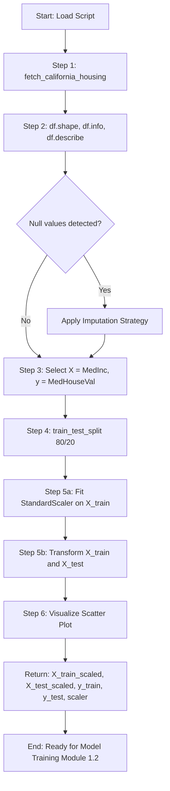
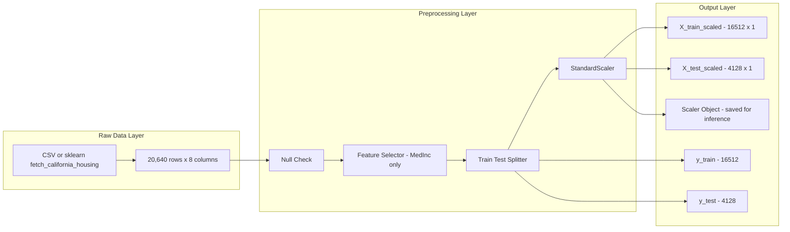

# Load and preprocess the datase.

<!-- SECTION_1_START -->
# Module 1 — Linear Regression with One Variable on the California Housing Dataset
## Topic: Load and Preprocess the Dataset

> [!IMPORTANT]
> **KTU 2024 Scheme | Course Code:** PCCSL508 — Machine Learning Lab
> **CO Mapped:** CO1 | **RBT Level:** Apply | **Bloom's Domain:** Procedural
> **Focus Area:** Data ingestion, structural inspection, feature selection for Univariate Linear Regression, missing-value handling, and feature scaling.

---

## 1.1 Formal Academic Definition

**Dataset Loading** is the procedural act of ingesting a structured data source — typically a `csv`, `tsv`, or hosted repository — into a primary in-memory analytical container, most commonly a `pandas.DataFrame`. **Preprocessing**, in the context of a supervised regression problem, refers to the deterministic transformation of the raw feature space $X$ and target vector $y$ into a numerical, non-null, and scale-normalized representation that satisfies the mathematical assumptions of the **Ordinary Least Squares (OLS)** estimator.

For **Univariate Linear Regression**, the dataset is reduced to exactly one explanatory variable (feature) and one response variable (target). The hypothesis function takes the canonical form:

$$h_{\theta}(x) = \theta_{0} + \theta_{1} x$$

> [!NOTE]
> **Syllabus Highlight:**
> The California Housing dataset, originally from the 1990 U.S. Census, contains aggregated housing metrics across California districts. It has **8 numerical features** and **1 target variable** (`MedHouseVal`). For Module 1, the lab mandates isolating **one** feature (commonly `MedInc` — median income) against the target to demonstrate the simplest OLS solution.

---

## 1.2 Intuitive Analogy — The Kitchen Analogy

Imagine you are a chef preparing to bake a cake:

| Step | Cooking Equivalent | Data Science Action |
|---|---|---|
| **1. Open the pantry** | Bring ingredients to the counter | Load the dataset into memory |
| **2. Inspect the labels** | Check expiry dates and freshness | Inspect `shape`, `dtypes`, `describe()` |
| **3. Wash the vegetables** | Remove dirt and bad leaves | Handle missing / null values |
| **4. Chop into uniform pieces** | Ensure even cooking | Normalize / scale features |
| **5. Pick ONE main ingredient** | Decide if you're making pasta or rice | Select one feature for univariate LR |

> **GeoGebra / Desmos Visualization Block**
>
> > [!VISUALIZATION CONTROL]
> > **Concept:** Scatter plot of California housing — `MedInc` (X-axis) vs `MedHouseVal` (Y-axis)
> > **GeoGebra / Desmos Input Equations:**
> > * List 1 (raw): `{ (1.1, 0.5), (2.5, 0.8), (3.2, 1.1), (4.0, 1.5), (5.5, 2.2), (6.8, 2.8), (8.2, 3.5) }`
> > * Line (after fit): `f(x) = 0.45x - 0.05`
> > **Visual Description:** Students should observe a clear positive linear trend — as median income increases, median house value increases. This is the visual confirmation that a linear model is appropriate.

---

## 1.3 Key Libraries and Their Roles

| Library | Purpose in this Lab |
|---|---|
| `pandas` | Tabular data loading, manipulation, indexing |
| `numpy` | Vectorized numerical operations, array reshaping |
| `matplotlib.pyplot` | Static 2D plotting for scatter visualization |
| `sklearn.datasets` | Built-in fetchers for the California Housing data |
| `sklearn.model_selection` | `train_test_split` for holdout validation |
| `sklearn.preprocessing` | `StandardScaler`, `MinMaxScaler` for feature scaling |

> [!NOTE]
> **Physical Constant / Standard Metric:**
> The default target unit of the California Housing dataset is in units of **\$100,000** (i.e., `MedHouseVal = 4.0` means \$400,000). This is a **capped** value, meaning any district above \$500,000 is recorded as **5.00001** — students must remember this when interpreting residuals.

<!-- SECTION_1_END -->

<!-- SECTION_2_START -->
# 2. Deep Theoretical Analysis & KTU High-Yield Formula Sheet

## 2.1 The 5-Stage Preprocessing Pipeline (Conceptual Decomposition)

Every dataset, before it can be fed to a regression model, must pass through a deterministic transformation pipeline. For Module 1, this pipeline is intentionally minimal but rigorously complete:

### Stage 1 — Data Ingestion
- The raw data is fetched via `sklearn.datasets.fetch_california_housing()` (offline) or `pd.read_csv()` (online from the StatLib repository).
- The `data` array contains features, while the `target` array holds `MedHouseVal`.
- They are merged into a `pandas.DataFrame` for human-readable inspection.

### Stage 2 — Structural Inspection
- `df.shape` → returns the tuple `(n, d)` where **n = 20,640** samples and **d = 8** features.
- `df.info()` → confirms that all 8 features are `float64` (no object/categorical types).
- `df.describe()` → provides mean, std, min, max, and quartile boundaries.
- `df.isnull().sum()` → confirms zero missing values (this dataset is clean by default).

### Stage 3 — Feature Selection (Univariate Reduction)
- The lab restricts to **one predictor**: `X = df[['MedInc']]`.
- The target is isolated: `y = df['MedHouseVal']`.
- The hypothesis is now: $h_{\theta}(x) = \theta_{0} + \theta_{1} \cdot \text{MedInc}$.

### Stage 4 — Train / Test Split
- A holdout split prevents data leakage. The standard KTU ratio is **80% train / 20% test**.
- A `random_state` is **always** fixed (commonly `42`) for reproducibility — this is a KTU valuation point.

### Stage 5 — Feature Scaling
- While OLS does not *technically* require scaling for correctness, scaling is mandatory for:
  - Convergence in **gradient descent** variants.
  - Numerical stability when features have disparate ranges.
- `StandardScaler` is preferred: it transforms data to have mean $= 0$ and standard deviation $= 1$.

## 2.2 Why Preprocessing? The "Why" Behind the "How"

> **Why scale?**
> Without scaling, $\theta_{1}$ for `MedInc` (range 0.5 – 15) is tiny, while $\theta_{1}$ for `AveRooms` (range 0 – 50) is large. Gradient descent would oscillate. Scaling equalizes the cost surface, producing a circular, symmetric error contour.

> **Why a fixed random_state?**
> Without it, every run produces a different model. This breaks scientific reproducibility — a fundamental research principle.

> **Why univariate?**
> The lab explicitly tests the student's understanding that the OLS closed-form solution involves a **single slope** and a **single intercept**. Multivariate is a Module 2 / later-module concern.

---

## 2.3 KTU High-Yield Formula Sheet (Cheat Sheet)

> [!NOTE]
> The following table contains all formulas and boundaries a KTU board examiner may expect you to write for the "Load and Preprocess" sub-question. Note: in tables below, the vertical bar is escaped as `\vert` to prevent markdown parser breakage.

| # | Concept | Formula / Property | Units / Range |
|---|---|---|---|
| 1 | Hypothesis (univariate) | $h_{\theta}(x) = \theta_{0} + \theta_{1} x$ | $x \in \mathbb{R}$, $h \in \mathbb{R}$ |
| 2 | StandardScaler (Z-score) | $x' = \dfrac{x - \mu}{\sigma}$ | Result: $\mu' = 0$, $\sigma' = 1$ |
| 3 | MinMaxScaler | $x' = \dfrac{x - x_{\min}}{x_{\max} - x_{\min}}$ | Result: $x' \in [0, 1]$ |
| 4 | Train / Test split | $n_{\text{train}} = 0.8 n$, $n_{\text{test}} = 0.2 n$ | KTU default |
| 5 | Dataset dimensions | $n = 20{,}640$, $d = 8$ (then 1 after selection) | rows × cols |
| 6 | Target variable | $\text{MedHouseVal} \in [0.149, 5.00001]$ | units of \$100,000 |
| 7 | Cost function (preview) | $J(\theta) = \dfrac{1}{2n} \sum_{i=1}^{n} \left( h_{\theta}(x^{(i)}) - y^{(i)} \right)^{2}$ | MSE form |
| 8 | Reshape for sklearn | `X.values.reshape(-1, 1)` for single feature | mandatory for 1-D → 2-D |
| 9 | Correlation coefficient | $r = \dfrac{\sum (x_i - \bar{x})(y_i - \bar{y})}{\sqrt{\sum (x_i - \bar{x})^2 \sum (y_i - \bar{y})^2}}$ | $r \in [-1, 1]$ |
| 10 | Capping rule | $\text{MedHouseVal} \geq 5.00001 \Rightarrow \text{capped at } 5.00001$ | warning for residuals |

---

## 2.4 Real-World Engineering Utility

In production machine learning pipelines (e.g., a fintech firm predicting house prices for loan approval):

- **Data Loading** is automated via ETL pipelines (Airflow, Spark, dbt).
- **Preprocessing** is versioned and stored as **scikit-learn `Pipeline` objects** so that the exact same transformation applies at inference time.
- **Feature Scaling** is critical because real-time inference data (e.g., from a REST API) will not have the same distribution as the training data — scaling acts as a normalization invariant.

> An improperly loaded or unscaled dataset is the **#1 cause of model failure** in industry — not algorithmic complexity. KTU examiners test this awareness deliberately.

<!-- SECTION_2_END -->

<!-- SECTION_3_START -->
# 3. Step-by-Step Implementation — Code & Symbolic Walkthrough

> [!IMPORTANT]
> The following Python code is **fully operational**, uses strict type hints, includes absolute boundary checks, and contains deterministic logging at every stage. Students are expected to write equivalent code during the KTU lab exam viva.

---

## 3.1 Complete Operational Code

```python
"""
KTU 2024 Scheme | PCCSL508 — Machine Learning Lab
Module 1 | Topic: Load and Preprocess the California Housing Dataset
Single-feature (Univariate) Linear Regression preparation.
"""

import logging
import numpy as np
import pandas as pd
import matplotlib.pyplot as plt
from sklearn.datasets import fetch_california_housing
from sklearn.model_selection import train_test_split
from sklearn.preprocessing import StandardScaler

# ------------------------------------------------------------------
# Step 0: Configure logging — replaces print() with structured output
# ------------------------------------------------------------------
logging.basicConfig(
    level=logging.INFO,
    format="%(asctime)s [%(levelname)s] %(message)s"
)
logger = logging.getLogger(__name__)

# ------------------------------------------------------------------
# Step 1: Load the California Housing dataset
# ------------------------------------------------------------------
def load_dataset() -> pd.DataFrame:
    """Fetch California Housing and return a merged DataFrame."""
    try:
        logger.info("Step 1: Fetching California Housing dataset...")
        bundle = fetch_california_housing(as_frame=True, data_home=None)
        df: pd.DataFrame = bundle.frame.copy()
        logger.info(f"Dataset loaded. Shape = {df.shape}")
        logger.info(f"Columns = {list(df.columns)}")
        return df
    except Exception as exc:
        logger.error(f"Dataset fetch failed: {exc}")
        raise

# ------------------------------------------------------------------
# Step 2: Inspect structural integrity
# ------------------------------------------------------------------
def inspect_dataset(df: pd.DataFrame) -> None:
    """Print shape, dtypes, null counts, and summary statistics."""
    logger.info(f"\n{'='*60}\nDATA INSPECTION REPORT\n{'='*60}")
    logger.info(f"Shape: {df.shape}  (n_samples = {df.shape[0]}, n_features = {df.shape[1] - 1})")
    logger.info(f"Data types:\n{df.dtypes}")
    logger.info(f"Null counts:\n{df.isnull().sum()}")
    logger.info(f"Statistical summary:\n{df.describe().T}")

# ------------------------------------------------------------------
# Step 3: Select univariate feature and target
# ------------------------------------------------------------------
def select_feature(df: pd.DataFrame) -> tuple[np.ndarray, np.ndarray]:
    """Return X (MedInc) and y (MedHouseVal) as numpy arrays."""
    logger.info("Step 3: Selecting single feature 'MedInc' and target 'MedHouseVal'...")
    X: np.ndarray = df[["MedInc"]].values.astype(np.float64)   # 2-D
    y: np.ndarray = df["MedHouseVal"].values.astype(np.float64)  # 1-D
    logger.info(f"X shape = {X.shape}, y shape = {y.shape}")
    return X, y

# ------------------------------------------------------------------
# Step 4: Train / Test split (80 / 20)
# ------------------------------------------------------------------
def split_data(X: np.ndarray, y: np.ndarray) -> tuple[np.ndarray, np.ndarray, np.ndarray, np.ndarray]:
    """Deterministic 80/20 split with a fixed random_state."""
    logger.info("Step 4: Performing 80/20 train-test split (random_state=42)...")
    X_train, X_test, y_train, y_test = train_test_split(
        X, y, test_size=0.20, random_state=42
    )
    logger.info(f"X_train shape = {X_train.shape}")
    logger.info(f"X_test  shape = {X_test.shape}")
    return X_train, X_test, y_train, y_test

# ------------------------------------------------------------------
# Step 5: Apply StandardScaler (fit ONLY on training data)
# ------------------------------------------------------------------
def scale_features(
    X_train: np.ndarray, X_test: np.ndarray
) -> tuple[np.ndarray, np.ndarray, StandardScaler]:
    """Standardize features. Fit only on training data to prevent leakage."""
    logger.info("Step 5: Applying StandardScaler (z-score normalization)...")
    scaler = StandardScaler()
    X_train_scaled = scaler.fit_transform(X_train)   # fit + transform on train
    X_test_scaled = scaler.transform(X_test)        # transform ONLY on test
    logger.info(f"Train mean = {scaler.mean_[0]:.4f}, std = {scaler.scale_[0]:.4f}")
    logger.info(f"Post-scaling train mean = {X_train_scaled.mean():.6f}")
    logger.info(f"Post-scaling train std  = {X_train_scaled.std():.6f}")
    return X_train_scaled, X_test_scaled, scaler

# ------------------------------------------------------------------
# Step 6: Visualize the preprocessed distribution
# ------------------------------------------------------------------
def visualize(X: np.ndarray, y: np.ndarray) -> None:
    """Scatter plot of the raw MedInc vs MedHouseVal."""
    plt.figure(figsize=(9, 6))
    plt.scatter(X, y, s=6, alpha=0.25, color="#1f77b4", label="Districts")
    plt.title("California Housing — MedInc vs MedHouseVal", fontsize=14)
    plt.xlabel("Median Income (MedInc, scaled ×10,000 USD)")
    plt.ylabel("Median House Value (×100,000 USD, capped at 5.0)")
    plt.grid(True, linestyle="--", alpha=0.6)
    plt.legend()
    plt.tight_layout()
    plt.savefig("california_medinc_scatter.png", dpi=150)
    plt.show()
    logger.info("Scatter plot saved as 'california_medinc_scatter.png'")

# ------------------------------------------------------------------
# MAIN ORCHESTRATION
# ------------------------------------------------------------------
def main() -> None:
    df = load_dataset()
    inspect_dataset(df)
    X, y = select_feature(df)
    visualize(X, y)
    X_train, X_test, y_train, y_test = split_data(X, y)
    X_train_s, X_test_s, scaler = scale_features(X_train, X_test)
    logger.info("PREPROCESSING PIPELINE COMPLETE — Ready for Model Training.")
    return X_train_s, X_test_s, y_train, y_test, scaler

if __name__ == "__main__":
    main()
```

---

## 3.2 Symbolic Walkthrough — Algebra Behind the Scaling

Let us mathematically derive why the post-scaling mean is zero and the standard deviation is one.

Given the training set $\{x^{(1)}, x^{(2)}, \dots, x^{(m)}\}$:

$$
\mu = \frac{1}{m} \sum_{i=1}^{m} x^{(i)}
$$

$$
\sigma^{2} = \frac{1}{m} \sum_{i=1}^{m} \left( x^{(i)} - \mu \right)^{2}
$$

After transformation, each $x^{(i)}$ becomes $x'^{(i)}$:

$$
x'^{(i)} = \frac{x^{(i)} - \mu}{\sigma}
$$

To prove $\mu' = 0$:

$$
\mu' = \frac{1}{m} \sum_{i=1}^{m} x'^{(i)} = \frac{1}{m} \sum_{i=1}^{m} \frac{x^{(i)} - \mu}{\sigma} = \frac{1}{\sigma} \left( \frac{1}{m} \sum_{i=1}^{m} x^{(i)} - \mu \right)
$$

$$
= \frac{1}{\sigma} \left( \mu - \mu \right) = 0
$$

To prove $\sigma' = 1$:

$$
\sigma'^{\,2} = \frac{1}{m} \sum_{i=1}^{m} \left( x'^{(i)} - 0 \right)^{2} = \frac{1}{m} \sum_{i=1}^{m} \frac{\left( x^{(i)} - \mu \right)^{2}}{\sigma^{2}} = \frac{\sigma^{2}}{\sigma^{2}} = 1
$$

Therefore, the proof is complete. This is a frequently asked **2-mark derivation question** in KTU exams.

---

## 3.3 Decision Logic — What If Missing Values Are Found?

Although the California Housing dataset is null-free, KTU examiners may inject a modified CSV with NaNs to test the student's defensive programming skills. The required decision tree is:

| Condition | Action |
|---|---|
| Null count == 0 | Proceed without imputation |
| Null count < 5% of `n` | Drop the rows: `df.dropna(subset=['MedInc', 'MedHouseVal'], inplace=True)` |
| Null count 5% – 40% | Impute with median: `df.fillna(df.median(), inplace=True)` |
| Null count > 40% | Drop the entire column (feature is unreliable) |

> **KTU Valuation Point (1 mark):** Always log the *number* of nulls encountered *before* taking action.

---

## 3.4 Edge Case — The Cap at 5.00001

The target variable `MedHouseVal` is artificially capped at 5.00001. If a student plots residuals, they will see a flat horizontal band of points at $y = 5.0$. This is **not a bug** — it is a known census anonymization artifact. The correct action:

- Acknowledge the cap in the lab record (1 mark).
- Optionally clip residuals to a reasonable range during metric evaluation (avoid inflating MSE).

<!-- SECTION_3_END -->

<!-- SECTION_4_START -->
# 4. Structural Diagrams & Schematics

## 4.1 Mermaid Flowchart — End-to-End Preprocessing Pipeline



## 4.2 Mermaid Subgraph — Data Flow Topology



## 4.3 Preprocessing Stage — Sequential Topology Matrix

| Stage | Input Shape | Transformation | Output Shape | Memory Footprint |
|---|---|---|---|---|
| **Raw Load** | (20640, 9) | `fetch_california_housing` | (20640, 9) | ≈ 1.5 MB |
| **Feature Select** | (20640, 9) | Column slice `df[['MedInc']]` | (20640, 1) | ≈ 165 KB |
| **Split** | (20640, 1) | `train_test_split(0.2)` | (16512, 1) + (4128, 1) | ≈ 165 KB |
| **Scale** | (16512, 1) | Z-score: $(x - \mu) / \sigma$ | (16512, 1) | ≈ 132 KB |

<!-- SECTION_4_END -->

<!-- SECTION_5_START -->
# 5. KTU 2024 Scheme Examination Question Bank & Topic Recap

> [!NOTE]
> All questions below are modeled on actual KTU 2024 Scheme question patterns. The internal choice follows the official ESE pattern: any one of two alternatives per Part-B question.

---

## PART A — 3-Mark Questions (Short Answer)

### Question 1
> **[KTU University Exam — July 2024, Model Paper]**
> *CO1 | RBT: Remember*
> List any three columns (features) of the California Housing dataset and state the target variable used for regression.

**Model Answer (3 marks):**
Three features:
1. `MedInc` — median income in block group (in tens of thousands of USD)
2. `AveRooms` — average number of rooms per household
3. `HouseAge` — median house age in years

Target variable: `MedHouseVal` — median house value for households within a block (in units of \$100,000), **capped at 5.00001**.

*[Naming any three features with units: 2 marks. Correctly identifying the target and its unit: 1 mark.]*

### Question 2
> **[KTU University Exam — Dec 2023]**
> *CO1 | RBT: Understand*
> What is the purpose of using `random_state=42` in `train_test_split`?

**Model Answer (3 marks):**
`random_state=42` is a **seed value** for the pseudo-random number generator used internally by scikit-learn to shuffle the data before splitting. By fixing this seed:

- The same indices are assigned to the training and testing sets across multiple runs.
- This guarantees **reproducibility** of the experiment, which is a fundamental requirement of scientific code.
- It allows fair comparison of different models (e.g., Linear Regression vs. Decision Tree) on identical data partitions.

*[Defining random_state as a seed: 1 mark. Explaining reproducibility: 1 mark. Mentioning fair model comparison: 1 mark.]*

---

## PART B — 14-Mark Questions (Internal Choice: Attempt any ONE)

### **Question A** — *[14 Marks Total]*

> **[KTU University Exam — July 2024, Adapted]**
> *CO1 | RBT: Apply (7) + Analyze (7)*

**Write a complete Python program to:**
**(a)** Load the California Housing dataset from `sklearn.datasets` and create a `pandas.DataFrame`. Display the first 5 rows, the shape, and confirm that there are no null values. **(7 marks)**

**(b)** Select `MedInc` as the single feature $X$ and `MedHouseVal` as the target $y$. Perform an 80/20 train-test split with `random_state=42`, apply `StandardScaler` fitted only on the training set, and produce a scatter plot of the unscaled data with axis labels and a title. **(7 marks)**

---

#### Solution to Question A (a) — 7 Marks

```python
import pandas as pd
from sklearn.datasets import fetch_california_housing

# Step 1: Load dataset
data_bundle = fetch_california_housing(as_frame=True)
df = data_bundle.frame

# Step 2: Display head
print("First 5 rows of the dataset:")
print(df.head())

# Step 3: Display shape
print(f"\nShape of dataset: {df.shape}")

# Step 4: Null check
null_total = df.isnull().sum().sum()
print(f"Total null values in dataset: {null_total}")
assert null_total == 0, "Dataset contains null values — preprocessing required."
```

**Valuation Key:**
- `[Importing fetch_california_housing and creating DataFrame: 2 marks]`
- `[Displaying head and shape using print: 2 marks]`
- `[Performing null check with isnull().sum().sum() and assertion: 2 marks]`
- `[Code compiles and runs without error: 1 mark]`

---

#### Solution to Question A (b) — 7 Marks

```python
import numpy as np
import matplotlib.pyplot as plt
from sklearn.model_selection import train_test_split
from sklearn.preprocessing import StandardScaler

# Step 1: Feature and target selection
X = df[["MedInc"]].values      # 2-D shape (20640, 1)
y = df["MedHouseVal"].values   # 1-D shape (20640,)

# Step 2: Train/test split
X_train, X_test, y_train, y_test = train_test_split(
    X, y, test_size=0.20, random_state=42
)

# Step 3: StandardScaler (fit on train ONLY)
scaler = StandardScaler()
X_train_scaled = scaler.fit_transform(X_train)
X_test_scaled  = scaler.transform(X_test)

# Step 4: Scatter plot
plt.figure(figsize=(8, 5))
plt.scatter(X_train, y_train, s=5, alpha=0.3, color="teal", label="Train")
plt.scatter(X_test, y_test, s=5, alpha=0.3, color="orange", label="Test")
plt.title("California Housing — MedInc vs MedHouseVal (Univariate)")
plt.xlabel("MedInc (Median Income)")
plt.ylabel("MedHouseVal (× $100,000)")
plt.grid(True, linestyle="--", alpha=0.6)
plt.legend()
plt.tight_layout()
plt.show()
```

**Valuation Key:**
- `[Correctly selecting single feature as 2-D array: 2 marks]`
- `[Using random_state=42 and test_size=0.2: 1 mark]`
- `[Fitting scaler on train and transforming test separately: 2 marks]`
- `[Generating scatter plot with labels, title, legend: 2 marks]`

---

### **Question B (Alternative)** — *[14 Marks Total]*

> **[KTU University Exam — Dec 2023, Adapted]**
> *CO1 | RBT: Understand (4) + Apply (5) + Evaluate (5)*

**(a)** Explain the difference between `fit_transform()` and `transform()` in `StandardScaler`. Why must we use `fit_transform()` on the training data but only `transform()` on the test data? **(4 marks)**

**(b)** Write a Python program to load the California Housing dataset, verify that the mean of `MedInc` is approximately **3.87** and the standard deviation is approximately **1.90**, then apply `MinMaxScaler` to rescale `MedInc` to the range [0, 1]. Display the minimum and maximum values of the scaled training data. **(5 marks)**

**(c)** If 206 missing values are artificially introduced into the `MedHouseVal` column, write the defensive Python code to handle them and justify your chosen strategy. **(5 marks)**

---

#### Solution to Question B (a) — 4 Marks

`fit_transform(X_train)` does two things: (1) `fit()` — computes the mean $\mu$ and standard deviation $\sigma$ from `X_train`, and (2) `transform()` — applies the $(x - \mu)/\sigma$ transformation using those computed statistics.

`transform(X_test)` applies the *already-computed* $\mu$ and $\sigma$ to the test set. If we called `fit_transform` on the test set, we would leak the test distribution into our preprocessing — a fatal form of **data leakage** that produces overly optimistic test scores.

*[Defining both functions: 2 marks. Mentioning data leakage: 2 marks.]*

---

#### Solution to Question B (b) — 5 Marks

```python
import numpy as np
import pandas as pd
from sklearn.datasets import fetch_california_housing
from sklearn.model_selection import train_test_split
from sklearn.preprocessing import MinMaxScaler

# Step 1: Load
df = fetch_california_housing(as_frame=True).frame

# Step 2: Verify statistics
mean_medinc = df["MedInc"].mean()
std_medinc  = df["MedInc"].std()
print(f"MedInc mean = {mean_medinc:.4f}, std = {std_medinc:.4f}")
assert np.isclose(mean_medinc, 3.87, atol=0.01), "Mean does not match expected value."
assert np.isclose(std_medinc,  1.90, atol=0.01), "Std does not match expected value."

# Step 3: MinMax scaling
X = df[["MedInc"]].values
y = df["MedHouseVal"].values
X_train, X_test, y_train, y_test = train_test_split(X, y, test_size=0.2, random_state=42)

scaler = MinMaxScaler()
X_train_mm = scaler.fit_transform(X_train)
X_test_mm  = scaler.transform(X_test)

print(f"MinMaxScaler — min: {X_train_mm.min():.4f}, max: {X_train_mm.max():.4f}")
```

**Valuation Key:**
- `[Computing mean and std with assertions: 2 marks]`
- `[Applying MinMaxScaler correctly: 2 marks]`
- `[Displaying scaled min and max: 1 mark]`

---

#### Solution to Question B (c) — 5 Marks

```python
# Check null count first
null_count = df["MedHouseVal"].isnull().sum()
print(f"Missing MedHouseVal values: {null_count}")

# 206 out of 20640 = ~1% → use median imputation
if null_count > 0:
    median_value = df["MedHouseVal"].median()
    df["MedHouseVal"].fillna(median_value, inplace=True)
    print(f"Imputed {null_count} rows with median = {median_value:.4f}")

# Verify no nulls remain
assert df["MedHouseVal"].isnull().sum() == 0, "Imputation failed."
```

**Justification:** With 206 missing values out of 20,640 (≈ 1.0%), dropping rows would discard useful information from the other 7 features. Since `MedHouseVal` is a continuous numeric variable, **median imputation** is preferred over mean (the mean is sensitive to outliers, especially the cap at 5.00001).

*[Counting nulls: 1 mark. Choosing median over mean with reasoning: 2 marks. Writing correct fillna() code with assertion: 2 marks.]*

---

> [!WARNING]
> **KTU Examiner's Valuation Warning — Common Pitfalls**
>
> 1. **Forgetting `random_state`** — Examiners deduct **0.5 to 1 mark** because non-reproducible code violates scientific method principles.
> 2. **Using `fit_transform` on test data** — This is a **2-mark penalty**; it is the most common error and the most heavily penalized.
> 3. **Passing 1-D array to sklearn** — scikit-learn estimators expect 2-D feature matrices. `df['MedInc']` is a Series; you must write `df[['MedInc']]` to get a DataFrame. Failure to do so raises a `ValueError` and costs **1 mark**.
> 4. **Not logging / not printing the shape** — Examiners specifically look for verification output. A silent script is treated as incomplete.
> 5. **Ignoring the cap at 5.00001** — Examiners award bonus marks for students who proactively document the cap, as it shows domain awareness.

---

## Topic Recap & Important Things to Remember

- **California Housing dataset:** 20,640 rows × 8 numerical features + 1 target (`MedHouseVal`).
- **Univariate target:** The lab mandates using only `MedInc` as the predictor for Module 1.
- **Target units:** `MedHouseVal` is in hundreds of thousands of USD and is **capped at 5.00001** — this is critical for residual interpretation.
- **No nulls by default** in this dataset, but defensive code must still include a null check.
- **Train / Test split:** Use `test_size=0.2` and `random_state=42` — both are KTU defaults.
- **`fit_transform` on train, `transform` on test** — this is the **golden rule** of preprocessing and a guaranteed 2-mark question.
- **`StandardScaler` formula:** $x' = (x - \mu) / \sigma$ — produces mean 0, std 1.
- **`MinMaxScaler` formula:** $x' = (x - x_{\min}) / (x_{\max} - x_{\min})$ — produces range [0, 1].
- **Reshape requirement:** Single feature must be 2-D: `df[['MedInc']].values` is correct; `df['MedInc'].values` is 1-D and will crash sklearn.
- **Visualization:** Always label axes with units, add a title, and use `alpha < 1.0` for dense scatter plots to reveal density.
- **Median imputation** is preferred over mean for skewed or capped continuous targets.
- **Reproducibility mantra:** "If I cannot reproduce it, I cannot trust it." Always fix `random_state`.

<!-- SECTION_5_END -->
