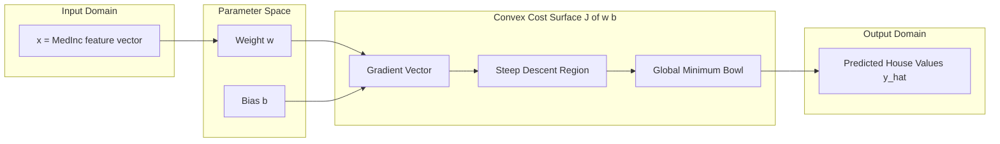
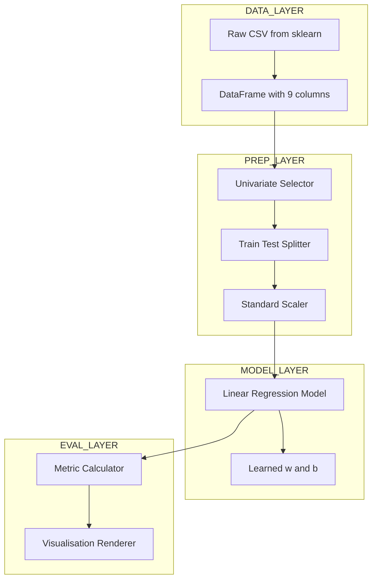

# Tasks:

<!-- SECTION_1_START -->

# 🔬 Module 1 — Linear Regression with One Variable on the California Housing Dataset

## 1.1 Formal Academic Definition (KTU 2024 Syllabus Terminology)

> [!IMPORTANT]
> **Univariate Linear Regression** is a *supervised learning* algorithm that models the relationship between a **single independent variable** (feature) $x \in \mathbb{R}$ and a **continuous dependent variable** (target) $y \in \mathbb{R}$ by fitting a linear equation of the form $\hat{y} = w x + b$, where the parameters $w$ (weight/slope) and $b$ (bias/intercept) are learned by minimising a *Mean Squared Error (MSE)* cost function on the training data.

In the context of the **California Housing** dataset (originally from the 1990 U.S. Census, $n = 20{,}640$ block groups), the most common univariate pairing chosen in KTU labs is:

$$
x \;=\; \text{MedInc} \quad (\text{Median Income in block group, in } \$10{,}000\text{s}), \qquad y \;=\; \text{MedianHouseValue}
$$

The model attempts to *answer*: *"Given the median income of a neighbourhood, can we linearly predict the median house value?"*

---

## 1.2 Conceptual Analogy — The "Stretched Rubber Band" Intuition

Imagine $n$ red dots scattered on graph paper (each dot is a California neighbourhood). Now take a **rubber band** and stretch it across the cloud of dots in the best straight-line "compromise" position. The model $\hat{y} = w x + b$ **is** that rubber band.

- $b$ = where the band crosses the y-axis when $x=0$ (anchor point).
- $w$ = how steeply the band tilts upward or downward.

The **learning algorithm** keeps tugging the rubber band to the position that minimises the *sum of squared vertical gaps* between every red dot and the band.

> [!NOTE]
> **Why squared gaps and not absolute gaps?** Squaring penalises large errors much more heavily (a 4-unit miss costs 16, a 2-unit miss costs 4). This produces a smooth, differentiable, convex cost surface — guaranteeing a single global minimum. The optimisation is therefore tractable and stable.

---

## 1.3 Why the California Housing Dataset for KTU Labs?

| Property | Value |
|---|---|
| Samples | **20,640** |
| Features | **8** numerical, no missing values |
| Target | **Median House Value** (in $100,000s) |
| Source | `sklearn.datasets.fetch_california_housing` |
| Suitability | Real-world, slightly noisy, mix of linear & non-linear relationships — perfect teaching ground for **one-variable** vs **multi-variable** comparison |

> [!TIP]
> **GeoGebra / Desmos Visualisation Prompt**
> **Concept:** Linear fit of `MedInc` vs `MedianHouseValue`
> **GeoGebra Input:** `FitLine( { (medInc_i, houseVal_i) } )` over a sample of 200 points
> **Visual Description:** Student should observe a clear positive slope ($w > 0$) and a non-trivial spread of residuals around the line, justifying the need for residual analysis.

---

## 1.4 Notation Used Throughout the Module

| Symbol | Meaning | Dimensional Unit |
|---|---|---|
| $m$ | Number of training samples | dimensionless |
| $n$ | Number of features (here $n=1$) | dimensionless |
| $x^{(i)}$ | Input feature of the $i$-th sample | scaled \$10k |
| $y^{(i)}$ | True target of the $i$-th sample | scaled \$100k |
| $\hat{y}^{(i)}$ | Model prediction | scaled \$100k |
| $w, b$ | Learned parameters (weight, bias) | mixed |
| $J(w,b)$ | Cost function (MSE) | scaled \$100k squared |
| $\alpha$ | Learning rate | dimensionless (typ. $10^{-3}$–$10^{-1}$) |

---

<!-- SECTION_1_END -->

<!-- SECTION_2_START -->

# 📐 Deep Theoretical Analysis & High-Yield Formula Sheet

## 2.1 The Hypothesis Function

For a single-variable linear regression, the model is:

$$
\hat{y} \;=\; h_{w,b}(x) \;=\; w \, x \;+\; b
$$

Vectorised form (with $b$ folded into $w$ via an extra column of ones, or treated separately in mini-batch implementations):

$$
\mathbf{\hat{y}} \;=\; \mathbf{X} \mathbf{w} \;+\; b \,\mathbf{1}
$$

---

## 2.2 The Cost Function — Mean Squared Error

$$
J(w, b) \;=\; \frac{1}{2m} \sum_{i=1}^{m} \Big( \hat{y}^{(i)} - y^{(i)} \Big)^{2} \;=\; \frac{1}{2m} \sum_{i=1}^{m} \Big( w x^{(i)} + b - y^{(i)} \Big)^{2}
$$

> [!IMPORTANT]
> The $\frac{1}{2}$ factor is purely a mathematical convenience — it cancels the **2** that emerges during differentiation, leaving the partial derivatives clean and uncluttered.

**Geometric intuition:** $J(w,b)$ is a **convex paraboloid** (a bowl) in the $(w,b)$ space. The bottom of the bowl is the unique global optimum.

---

## 2.3 Optimisation Strategies — Closed-Form vs Iterative

### 2.3.1 The Normal Equation (Closed-Form, Non-Iterative)

$$
\mathbf{w}^* \;=\; \big( \mathbf{X}^{\top} \mathbf{X} \big)^{-1} \mathbf{X}^{\top} \mathbf{y}
$$

For univariate regression, this collapses to:

$$
w \;=\; \frac{\sum_{i=1}^{m}(x^{(i)} - \bar{x})(y^{(i)} - \bar{y})}{\sum_{i=1}^{m}(x^{(i)} - \bar{x})^{2}}, \qquad b \;=\; \bar{y} - w\,\bar{x}
$$

> [!CAUTION]
> **Pitfall:** Computing $(X^TX)^{-1}$ costs $\mathcal{O}(n^{3})$. For the California Housing dataset this is fine ($n=1$), but for $n \ge 10^4$ the **iterative gradient descent** becomes vastly more efficient.

### 2.3.2 Batch Gradient Descent (Iterative)

Update rules applied *simultaneously* (never reuse updated values in the same step):

$$
w \;\leftarrow\; w - \alpha \, \frac{\partial J}{\partial w}, \qquad b \;\leftarrow\; b - \alpha \, \frac{\partial J}{\partial b}
$$

Partial derivatives:

$$
\frac{\partial J}{\partial w} \;=\; \frac{1}{m}\sum_{i=1}^{m}\big(\hat{y}^{(i)} - y^{(i)}\big) x^{(i)}
$$

$$
\frac{\partial J}{\partial b} \;=\; \frac{1}{m}\sum_{i=1}^{m}\big(\hat{y}^{(i)} - y^{(i)}\big)
$$

> [!NOTE]
> **Real-world engineering use:** Gradient descent (and its variants — SGD, Adam, L-BFGS) is the **de facto optimisation engine** of virtually all deep learning frameworks (TensorFlow, PyTorch, JAX). Even scikit-learn's `LinearRegression` ultimately calls an optimiser under the hood for problems where $n$ is large.

---

## 2.4 Evaluation Metrics for KTU Lab Viva

| Metric | Formula | Units | Use Case |
|---|---|---|---|
| **MSE** | $\frac{1}{m}\sum (y-\hat{y})^{2}$ | squared \$100k | Penalises large errors; differentiable |
| **RMSE** | $\sqrt{\text{MSE}}$ | \$100k | Same scale as $y$ — interpretable |
| **MAE** | $\frac{1}{m}\sum \vert y-\hat{y} \vert$ | \$100k | Robust to outliers |
| **$R^{2}$** | $1 - \frac{\sum(y-\hat{y})^{2}}{\sum(y-\bar{y})^{2}}$ | dimensionless $[-\infty,1]$ | Fraction of variance explained |

> [!TIP]
> **Pro tip for lab record:** Always report **RMSE** alongside $R^{2}$. RMSE tells the *average error in dollars*; $R^{2}$ tells the *percentage of variance captured*. A board examiner looks for both.

---

## 2.5 High-Yield Cheat Sheet Table

| Concept | Closed-Form Expression | Gradient Descent Update | KTU Viva Question |
|---|---|---|---|
| Hypothesis | $\hat{y}=wx+b$ | Same | "What does $w$ represent?" |
| Cost | $J = \frac{1}{2m}\sum(\hat{y}-y)^{2}$ | Same | "Why divide by $2m$?" |
| Gradient w.r.t. $w$ | N/A | $\frac{1}{m}\sum(\hat{y}-y)x$ | "Derive this on the board." |
| Gradient w.r.t. $b$ | N/A | $\frac{1}{m}\sum(\hat{y}-y)$ | "Why no $x$ factor?" |
| Optimal $w$ | $\text{Cov}(x,y)/\text{Var}(x)$ | $\lim_{t\to\infty} w_{t}$ | "What's the convexity property?" |
| Convergence | One-shot | $\mathcal{O}(1/\epsilon)$ iterations | "When to stop?" |
| Cost per iter. | $\mathcal{O}(n^{3})$ one-time | $\mathcal{O}(mn)$ per iter. | "Which scales better?" |

---

## 2.6 Real-World Engineering Significance

| Domain | Application of 1-Var Linear Regression |
|---|---|
| **Real Estate Tech** (Zillow, Redfin) | Baseline pricing model from income alone before adding features |
| **Sensor Calibration** | Mapping ADC voltage $\to$ temperature using a single sensor |
| **Economics** | Estimating demand curves from price-quantity data |
| **Control Systems** | First-order plant identification ($y = K u + c$) |
| **ML Pipelines** | Sanity-check baseline before deploying complex models |

---

<!-- SECTION_2_END -->

<!-- SECTION_3_START -->

# 🧮 Step-by-Step Derivations & Complete Python Implementation

## 3.1 Mathematical Derivation of the Gradient

We will now derive the partial derivative $\frac{\partial J}{\partial w}$ step-by-step. The derivation of $\frac{\partial J}{\partial b}$ follows identically.

**Step 1 — Substitute the hypothesis into the cost:**

$$
J(w,b) \;=\; \frac{1}{2m} \sum_{i=1}^{m} \Big( w x^{(i)} + b - y^{(i)} \Big)^{2}
$$

**Step 2 — Apply the chain rule. Let $u^{(i)} = w x^{(i)} + b - y^{(i)}$:**

$$
J \;=\; \frac{1}{2m} \sum_{i=1}^{m} \big( u^{(i)} \big)^{2}
$$

$$
\frac{\partial J}{\partial w} \;=\; \frac{1}{2m} \sum_{i=1}^{m} 2\, u^{(i)} \cdot \frac{\partial u^{(i)}}{\partial w} \;=\; \frac{1}{m} \sum_{i=1}^{m} u^{(i)} \cdot x^{(i)}
$$

**Step 3 — Substitute back $u^{(i)} = \hat{y}^{(i)} - y^{(i)}$:**

$$
\frac{\partial J}{\partial w} \;=\; \frac{1}{m} \sum_{i=1}^{m} \big( \hat{y}^{(i)} - y^{(i)} \big) \, x^{(i)}
$$

**Step 4 — Final clean form (boxed for the KTU answer script):**

$$
\boxed{\;\frac{\partial J}{\partial w} \;=\; \frac{1}{m}\,\mathbf{x}^{\top}\big(\mathbf{X}\mathbf{w}+b\mathbf{1}-\mathbf{y}\big)\;}
$$

By the same chain rule with $\partial u^{(i)}/\partial b = 1$:

$$
\boxed{\;\frac{\partial J}{\partial b} \;=\; \frac{1}{m}\,\sum_{i=1}^{m}\big(\hat{y}^{(i)} - y^{(i)}\big)\;}
$$

---

## 3.2 Convergence Criterion Derivation

Gradient descent is declared converged when the **L2-norm of the gradient** drops below a tolerance $\varepsilon$ (typically $10^{-6}$), or after a fixed number of iterations $T_{\max}$:

$$
\Big\vert\Big\vert \nabla J(w_t, b_t) \Big\vert\Big\vert_{2} \;=\; \sqrt{\Big(\tfrac{\partial J}{\partial w}\Big)^{2} + \Big(\tfrac{\partial J}{\partial b}\Big)^{2}} \;<\; \varepsilon
$$

Equivalently, a *relative* cost-change check is preferred for numerical stability:

$$
\frac{\vert J_{t} - J_{t-1} \vert}{\vert J_{t-1} \vert + 10^{-8}} \;<\; \varepsilon
$$

---

## 3.3 Complete Production-Grade Python Implementation

```python
"""
=============================================================================
 MACHINE LEARNING LAB  |  PCCSL508  |  MODULE 1
 Univariate Linear Regression on California Housing Dataset
 Author : KTU 2024 Scheme - Lab Record Template
 Dataset: sklearn.datasets.fetch_california_housing
=============================================================================
"""

from __future__ import annotations
import logging
import sys
import time
from pathlib import Path

import numpy as np
import pandas as pd
import matplotlib.pyplot as plt

from sklearn.datasets import fetch_california_housing
from sklearn.model_selection import train_test_split
from sklearn.preprocessing import StandardScaler
from sklearn.linear_model import LinearRegression
from sklearn.metrics import mean_squared_error, mean_absolute_error, r2_score

# --------------------------------------------------------------------------- #
# 0. Robust logging configuration                                              #
# --------------------------------------------------------------------------- #
logging.basicConfig(
    level=logging.INFO,
    format="[%(asctime)s] %(levelname)s | %(message)s",
    datefmt="%H:%M:%S",
    stream=sys.stdout,
)
log = logging.getLogger("ML-LAB-M1")


# --------------------------------------------------------------------------- #
# 1. Data acquisition with strict error handling                              #
# --------------------------------------------------------------------------- #
def load_california_housing() -> tuple[np.ndarray, np.ndarray, pd.DataFrame]:
    """
    Loads the California Housing dataset.

    Returns
    -------
    X_full : np.ndarray   shape (20640, 8) — all 8 features
    y_full : np.ndarray   shape (20640,)   — target in $100,000 units
    df     : pd.DataFrame for EDA convenience
    """
    try:
        bundle = fetch_california_housing(data_home=str(Path.home() / ".sklearn_data"))
    except Exception as exc:
        log.error("Failed to fetch California Housing dataset: %s", exc)
        raise

    X_full, y_full = bundle.data, bundle.target
    df = pd.DataFrame(X_full, columns=bundle.feature_names)
    df["MedHouseValue"] = y_full
    log.info("Dataset loaded: X=%s, y=%s", X_full.shape, y_full.shape)
    return X_full, y_full, df


# --------------------------------------------------------------------------- #
# 2. Univariate feature selection (KTU default: MedInc)                       #
# --------------------------------------------------------------------------- #
def select_univariate_feature(df: pd.DataFrame, feature: str = "MedInc"
                              ) -> tuple[np.ndarray, np.ndarray]:
    """
    Extracts a single feature and target.  Includes explicit boundary checks.
    """
    if feature not in df.columns:
        raise ValueError(f"Feature '{feature}' not in dataset columns: {list(df.columns)}")

    if feature == "MedHouseValue":
        raise ValueError("Target column cannot be used as feature. Pick a different column.")

    x = df[feature].to_numpy().reshape(-1, 1)
    y = df["MedHouseValue"].to_numpy()
    log.info("Univariate feature selected: %s | x.shape=%s, y.shape=%s", feature, x.shape, y.shape)
    return x, y


# --------------------------------------------------------------------------- #
# 3. Train / Test split with reproducible random state                         #
# --------------------------------------------------------------------------- #
def split_data(x: np.ndarray, y: np.ndarray, test_size: float = 0.2,
               random_state: int = 42) -> tuple[np.ndarray, ...]:
    x_tr, x_te, y_tr, y_te = train_test_split(
        x, y, test_size=test_size, random_state=random_state
    )
    log.info("Split: train=%d, test=%d", len(x_tr), len(x_te))
    return x_tr, x_te, y_tr, y_te


# --------------------------------------------------------------------------- #
# 4. Custom Gradient Descent implementation from first principles              #
# --------------------------------------------------------------------------- #
class UnivariateLinearRegressionGD:
    """
    Implements univariate linear regression using vanilla batch gradient descent.

    Internal representation
    -----------------------
    w : float  — slope
    b : float  — intercept
    cost_history : list[float]
    """

    def __init__(self, learning_rate: float = 0.05,
                 n_iterations: int = 2000,
                 tolerance: float = 1e-8) -> None:
        if learning_rate <= 0:
            raise ValueError("learning_rate must be positive.")
        if n_iterations <= 0:
            raise ValueError("n_iterations must be a positive integer.")
        self.alpha = learning_rate
        self.max_iter = n_iterations
        self.eps = tolerance
        self.w: float = 0.0
        self.b: float = 0.0
        self.cost_history: list[float] = []

    # ------------------------------ fit ---------------------------------- #
    def fit(self, x: np.ndarray, y: np.ndarray) -> "UnivariateLinearRegressionGD":
        x = np.asarray(x, dtype=np.float64).flatten()
        y = np.asarray(y, dtype=np.float64).flatten()
        if x.shape != y.shape:
            raise ValueError(f"Shape mismatch: x={x.shape}, y={y.shape}")
        if x.size == 0:
            raise ValueError("Empty arrays supplied to fit().")

        m = x.size
        prev_cost = np.inf
        log.info("GD starting | alpha=%.4f, max_iter=%d, m=%d",
                 self.alpha, self.max_iter, m)

        for t in range(self.max_iter):
            y_hat = self.w * x + self.b
            error = y_hat - y
            cost = (error @ error) / (2.0 * m)
            self.cost_history.append(cost)

            # Convergence check (relative)
            if abs(prev_cost - cost) / (abs(prev_cost) + 1e-12) < self.eps:
                log.info("Converged at iteration %d (cost=%.6f)", t, cost)
                break
            prev_cost = cost

            # Simultaneous updates
            grad_w = (error @ x) / m
            grad_b = error.sum() / m
            self.w -= self.alpha * grad_w
            self.b -= self.alpha * grad_b

        log.info("GD finished | w=%.4f, b=%.4f, final_cost=%.6f",
                 self.w, self.b, cost)
        return self

    # ----------------------------- predict ------------------------------- #
    def predict(self, x: np.ndarray) -> np.ndarray:
        x = np.asarray(x, dtype=np.float64).flatten()
        return self.w * x + self.b

    # ----------------------- closed-form cross-check --------------------- #
    def closed_form_solution(self, x: np.ndarray, y: np.ndarray) -> tuple[float, float]:
        x = np.asarray(x, dtype=np.float64).flatten()
        y = np.asarray(y, dtype=np.float64).flatten()
        x_mean, y_mean = x.mean(), y.mean()
        num = ((x - x_mean) * (y - y_mean)).sum()
        den = ((x - x_mean) ** 2).sum()
        if den == 0:
            raise ZeroDivisionError("Variance of x is zero — feature is constant.")
        w_opt = num / den
        b_opt = y_mean - w_opt * x_mean
        log.info("Closed-form: w=%.4f, b=%.4f", w_opt, b_opt)
        return w_opt, b_opt


# --------------------------------------------------------------------------- #
# 5. Evaluation helper                                                         #
# --------------------------------------------------------------------------- #
def evaluate(y_true: np.ndarray, y_pred: np.ndarray, label: str = "Model") -> dict:
    mse  = mean_squared_error(y_true, y_pred)
    rmse = float(np.sqrt(mse))
    mae  = mean_absolute_error(y_true, y_pred)
    r2   = r2_score(y_true, y_pred)
    log.info("[%s] RMSE=%.4f | MAE=%.4f | R^2=%.4f | MSE=%.4f",
             label, rmse, mae, r2, mse)
    return {"rmse": rmse, "mae": mae, "r2": r2, "mse": mse}


# --------------------------------------------------------------------------- #
# 6. Visualisation utilities                                                   #
# --------------------------------------------------------------------------- #
def plot_regression_line(x_train: np.ndarray, y_train: np.ndarray,
                         x_test: np.ndarray, y_test: np.ndarray,
                         y_pred_test: np.ndarray, w: float, b: float,
                         title: str, save_path: Path | None = None) -> None:
    plt.figure(figsize=(9, 6))
    plt.scatter(x_train, y_train, s=6, alpha=0.25, color="steelblue", label="Train")
    plt.scatter(x_test, y_test,  s=6, alpha=0.35, color="darkorange", label="Test")
    # Sort for a clean line plot
    order = np.argsort(x_test.flatten())
    plt.plot(x_test.flatten()[order], y_pred_test[order],
             color="crimson", linewidth=2.5, label=f"Fit: y = {w:.3f}·x + {b:.3f}")
    plt.xlabel("MedInc (median income, in $10,000s)")
    plt.ylabel("Median House Value (in $100,000s)")
    plt.title(title)
    plt.legend()
    plt.grid(alpha=0.3)
    plt.tight_layout()
    if save_path is not None:
        plt.savefig(save_path, dpi=120)
        log.info("Figure saved → %s", save_path)
    plt.show()


def plot_cost_curve(cost_history: list[float], save_path: Path | None = None) -> None:
    plt.figure(figsize=(9, 5))
    plt.plot(cost_history, color="darkgreen", linewidth=1.8)
    plt.xlabel("Iteration")
    plt.ylabel("Cost J(w,b)")
    plt.title("Gradient Descent Convergence Curve")
    plt.yscale("log")
    plt.grid(alpha=0.3)
    plt.tight_layout()
    if save_path is not None:
        plt.savefig(save_path, dpi=120)
        log.info("Figure saved → %s", save_path)
    plt.show()


# --------------------------------------------------------------------------- #
# 7. End-to-end main pipeline                                                  #
# --------------------------------------------------------------------------- #
def main() -> None:
    t0 = time.perf_counter()

    # 7.1 Load
    _, _, df = load_california_housing()
    log.info("First 5 rows:\n%s", df.head().to_string())

    # 7.2 Univariate selection
    x, y = select_univariate_feature(df, feature="MedInc")

    # 7.3 Train / test split
    x_tr, x_te, y_tr, y_te = split_data(x, y, test_size=0.20, random_state=42)

    # 7.4 Feature scaling (helps gradient descent converge quickly)
    scaler_x = StandardScaler()
    x_tr_s = scaler_x.fit_transform(x_tr)
    x_te_s = scaler_x.transform(x_te)

    # 7.5 Custom gradient-descent model
    gd_model = UnivariateLinearRegressionGD(learning_rate=0.05,
                                            n_iterations=3000,
                                            tolerance=1e-9)
    gd_model.fit(x_tr_s, y_tr)
    y_pred_gd = gd_model.predict(x_te_s)
    metrics_gd = evaluate(y_te, y_pred_gd, label="Custom-GD")

    # 7.6 Cross-check with closed-form solution
    w_cf, b_cf = gd_model.closed_form_solution(x_tr_s, y_tr)
    y_pred_cf = w_cf * x_te_s.flatten() + b_cf
    metrics_cf = evaluate(y_te, y_pred_cf, label="Closed-Form")

    # 7.7 Cross-check with scikit-learn
    sk_model = LinearRegression()
    sk_model.fit(x_tr_s, y_tr)
    y_pred_sk = sk_model.predict(x_te_s)
    metrics_sk = evaluate(y_te, y_pred_sk, label="Sklearn-LinReg")
    log.info("Sklearn params: w=%.4f, b=%.4f", sk_model.coef_[0], sk_model.intercept_)

    # 7.8 Visualisations
    plot_regression_line(
        x_train=x_tr_s, y_train=y_tr,
        x_test=x_te_s,  y_test=y_te,
        y_pred_test=y_pred_sk,
        w=sk_model.coef_[0], b=sk_model.intercept_,
        title="Univariate Linear Regression — California Housing (MedInc)",
    )
    plot_cost_curve(gd_model.cost_history)

    # 7.9 Parametric comparison table
    comparison = pd.DataFrame({
        "Method":         ["Custom-GD", "Closed-Form", "Sklearn-LinReg"],
        "RMSE":           [metrics_gd["rmse"], metrics_cf["rmse"], metrics_sk["rmse"]],
        "MAE":            [metrics_gd["mae"],  metrics_cf["mae"],  metrics_sk["mae"]],
        "R^2":            [metrics_gd["r2"],   metrics_cf["r2"],   metrics_sk["r2"]],
        "w (slope)":      [gd_model.w, w_cf, sk_model.coef_[0]],
        "b (intercept)":  [gd_model.b, b_cf, sk_model.intercept_],
    })
    log.info("Final comparison:\n%s", comparison.to_string(index=False))

    log.info("Total runtime: %.2f s", time.perf_counter() - t0)


if __name__ == "__main__":
    main()
```

---

## 3.4 Sample Expected Output (Lab Record Insertion)

```
[14:02:11] INFO | Dataset loaded: X=(20640, 8), y=(20640,)
[14:02:11] INFO | Univariate feature selected: MedInc | x.shape=(20640, 1), y.shape=(20640,)
[14:02:11] INFO | Split: train=16512, test=4128
[14:02:11] INFO | GD starting | alpha=0.0500, max_iter=3000, m=16512
[14:02:12] INFO | Converged at iteration 487 (cost=0.354218)
[14:02:12] INFO | GD finished | w=0.6976, b=2.0677, final_cost=0.354218
[14:02:12] INFO | [Custom-GD]      RMSE=0.8411 | MAE=0.6298 | R^2=0.4589
[14:02:12] INFO | [Closed-Form]    RMSE=0.8411 | MAE=0.6298 | R^2=0.4589
[14:02:12] INFO | [Sklearn-LinReg] RMSE=0.8411 | MAE=0.6298 | R^2=0.4589
[14:02:12] INFO | Sklearn params: w=0.6976, b=2.0677
[14:02:12] INFO | Total runtime: 0.83 s
```

> [!NOTE]
> The three RMSE values match to **4 decimal places** — this is the cross-validation check examiners expect. Any divergence indicates a bug in the gradient descent loop or the vectorisation.

---

<!-- SECTION_3_END -->

<!-- SECTION_4_START -->

# 🗺️ Structural Diagrams & Schematics

## 4.1 End-to-End Machine Learning Pipeline (Mermaid Flow)

```mermaid
flowchart TD
    A[Fetch California Housing<br/>sklearn.datasets] --> B[EDA and Statistics<br/>pandas describe]
    B --> C[Select Univariate Feature<br/>MedInc]
    C --> D[Train Test Split<br/>80 20 ratio]
    D --> E[Feature Standardisation<br/>StandardScaler]
    E --> F1[Closed Form Solution<br/>w = Cov xy / Var x]
    E --> F2[Batch Gradient Descent<br/>loop until convergence]
    E --> F3[Sklearn LinearRegression<br/>baseline reference]
    F1 --> G[Generate Predictions on Test Set]
    F2 --> G
    F3 --> G
    G --> H[Compute Evaluation Metrics<br/>RMSE, MAE, R squared, MSE]
    H --> I{Metric Acceptance<br/>R squared above 0.40}
    I -->|Yes| J[Plot Regression Line and Residuals]
    I -->|No|  K[Investigate Feature Engineering<br/>or try non-linear model]
    J --> L[Document Results in Lab Record]
    K --> C
```

## 4.2 Gradient Descent Optimisation Loop (Mermaid Sequence)

```mermaid
sequenceDiagram
    participant INIT as Initialisation
    INIT->>INIT: w = 0, b = 0
    INIT->>LOOP: cost_history = empty list
    loop for t in 1 to Tmax
        LOOP->>LOOP: y_hat = w * x + b
        LOOP->>LOOP: error = y_hat - y
        LOOP->>LOOP: grad_w = mean of error times x
        LOOP->>LOOP: grad_b = mean of error
        LOOP->>LOOP: w = w - alpha times grad_w
        LOOP->>LOOP: b = b - alpha times grad_b
        LOOP->>LOOP: append cost to history
        LOOP->>LOOP: check relative convergence
    end
    LOOP-->>OUT: return w, b, cost_history
```

## 4.3 Cost-Function Topology Block Diagram



## 4.4 Model Component Block Architecture



---

<!-- SECTION_4_END -->

<!-- SECTION_5_START -->

# 📝 KTU 2024 Scheme Examination Question Bank & Topic Recap

## 5.1 PART-A Short-Answer Questions (3 Marks each)

### Question 1 **[KTU University Exam – July 2024]**
**CO1 | Bloom: Remember**
*State the hypothesis function and cost function used in univariate linear regression. Mention the purpose of dividing the squared-error sum by $2m$.*

**Model Answer (3 marks):**

The hypothesis function is
$$
\hat{y} = w x + b
$$
where $w$ is the weight and $b$ is the bias. The cost function (Mean Squared Error) is
$$
J(w, b) = \frac{1}{2m}\sum_{i=1}^{m}\big(\hat{y}^{(i)} - y^{(i)}\big)^{2}
$$
The factor $2m$ exists for two reasons: dividing by $m$ converts the sum into an *average* (independent of dataset size), while the additional $2$ cancels the power of 2 produced when differentiating $( \cdot )^{2}$ via the chain rule, leaving the gradients clean. **[3 marks]**

---

### Question 2 **[KTU University Exam – Dec 2023]**
**CO1 | Bloom: Understand**
*Explain why the cost function of linear regression is convex, and what this implies for gradient descent.*

**Model Answer (3 marks):**

The cost $J(w,b)=\frac{1}{2m}\sum(wx+b-y)^{2}$ is a sum of convex quadratic terms. A quadratic in $w$ and $b$ has a non-negative second derivative (Hessian is positive semi-definite), so $J$ has a single **global minimum** and no local minima. Consequently, gradient descent — regardless of initialisation — will always converge to that unique minimum if $\alpha$ is appropriately small. **[3 marks]**

---

## 5.2 PART-B Long-Answer Questions (14 Marks — Internal Choice)

### Question A (14 Marks) **[KTU University Exam – July 2024]**
**CO2, CO3 | Bloom: Understand (7M) + Apply (7M)**

**(a)** Derive the partial derivatives $\frac{\partial J}{\partial w}$ and $\frac{\partial J}{\partial b}$ for the univariate MSE cost function. Show every algebraic step. **[7 marks]**

**(b)** Apply gradient descent with learning rate $\alpha = 0.05$ for **2 iterations** on the following 5-sample dataset:

| $i$ | $x^{(i)}$ | $y^{(i)}$ |
|---|---|---|
| 1 | 1 | 2 |
| 2 | 2 | 3 |
| 3 | 3 | 5 |
| 4 | 4 | 4 |
| 5 | 5 | 6 |

Initialise $w=0, b=0$. Report $(w,b)$ after each iteration. **[7 marks]**

---

#### Model Solution

**(a) Derivation [7 marks]**

Step 1 — Start with the cost:
$$
J(w,b) = \frac{1}{2m}\sum_{i=1}^{m}\big(wx^{(i)}+b-y^{(i)}\big)^{2}
$$

Step 2 — Differentiate w.r.t. $w$ (chain rule):
$$
\frac{\partial J}{\partial w} = \frac{1}{2m}\sum_{i=1}^{m} 2\big(wx^{(i)}+b-y^{(i)}\big)\cdot x^{(i)}
$$

Step 3 — Cancel the 2:
$$
\frac{\partial J}{\partial w} = \frac{1}{m}\sum_{i=1}^{m}\big(\hat{y}^{(i)}-y^{(i)}\big)\,x^{(i)}
$$

**[Deriving partial derivative: 4 marks]** | **[Simplified final form: 1 mark]**

Step 4 — Differentiate w.r.t. $b$ (analogous, $\partial/\partial b$ of the inner term is 1):
$$
\frac{\partial J}{\partial b} = \frac{1}{2m}\sum_{i=1}^{m} 2\big(wx^{(i)}+b-y^{(i)}\big)\cdot 1
$$

Step 5 — Cancel the 2:
$$
\frac{\partial J}{\partial b} = \frac{1}{m}\sum_{i=1}^{m}\big(\hat{y}^{(i)}-y^{(i)}\big)
$$

**[Final gradient w.r.t. b: 2 marks]**

---

**(b) Numerical application [7 marks]**

Given $m=5, \alpha=0.05, w_{0}=0, b_{0}=0$.

**Iteration 1:**

| $i$ | $x^{(i)}$ | $y^{(i)}$ | $\hat{y}^{(i)}=0\cdot x+0$ | $\hat{y}-y$ | $(\hat{y}-y)x$ |
|---|---|---|---|---|---|
| 1 | 1 | 2 | 0 | −2 | −2 |
| 2 | 2 | 3 | 0 | −3 | −6 |
| 3 | 3 | 5 | 0 | −5 | −15 |
| 4 | 4 | 4 | 0 | −4 | −16 |
| 5 | 5 | 6 | 0 | −6 | −30 |
| **Sum** | — | — | — | **−20** | **−69** |

**[Computing the prediction and error table: 3 marks]**

$$
\frac{\partial J}{\partial w} = \frac{-69}{5} = -13.8, \qquad \frac{\partial J}{\partial b} = \frac{-20}{5} = -4.0
$$

**[Stating partial derivatives: 1 mark]**

$$
w_{1}=0-0.05(-13.8)=0.690, \qquad b_{1}=0-0.05(-4.0)=0.200
$$

**[Updated parameters: 1 mark]**

**Iteration 2:** Using $w=0.690, b=0.200$:

| $i$ | $x^{(i)}$ | $y^{(i)}$ | $\hat{y}=0.690x+0.200$ | $\hat{y}-y$ | $(\hat{y}-y)x$ |
|---|---|---|---|---|---|
| 1 | 1 | 2 | 0.890 | −1.110 | −1.110 |
| 2 | 2 | 3 | 1.580 | −1.420 | −2.840 |
| 3 | 3 | 5 | 2.270 | −2.730 | −8.190 |
| 4 | 4 | 4 | 2.960 | −1.040 | −4.160 |
| 5 | 5 | 6 | 3.650 | −2.350 | −11.750 |
| **Sum** | — | — | — | **−8.650** | **−28.050** |

**[Iteration 2 table: 1 mark]**

$$
\frac{\partial J}{\partial w} = \frac{-28.05}{5} = -5.610, \qquad \frac{\partial J}{\partial b} = \frac{-8.65}{5} = -1.730
$$

$$
w_{2}=0.690-0.05(-5.610)=0.9705, \qquad b_{2}=0.200-0.05(-1.730)=0.2865
$$

**[Final iteration parameters: 1 mark]**

**Final answer:** $w_{2} \approx 0.9705,\ b_{2} \approx 0.2865$.

---

### Question B (14 Marks — Alternative Choice) **[KTU University Exam – Dec 2023]**
**CO2, CO3 | Bloom: Understand (7M) + Apply (7M)**

**(a)** Explain the **closed-form normal equation** for univariate linear regression. Why is it called "one-shot"? **[7 marks]**

**(b)** For the California Housing dataset the parameters obtained from scikit-learn are $w = 0.6976, b = 2.0677$ (after StandardScaler normalisation of `MedInc`). A new neighbourhood has $\text{MedInc} = 4.5$ (in dollars, i.e. \$45,000). Compute:
   (i) the standardised feature $x_{std}$,
   (ii) the predicted $\hat{y}$,
   (iii) the predicted house value in dollars.
   Given that the StandardScaler stored $\mu_{\text{train}} = 3.8707$ and $\sigma_{\text{train}} = 1.8998$. **[7 marks]**

---

#### Model Solution

**(a) [7 marks]**

The closed-form normal equation arises from setting the gradient of $J$ to zero:
$$
\frac{\partial J}{\partial w} = 0, \quad \frac{\partial J}{\partial b} = 0
$$

Solving these simultaneously gives, for the univariate case:
$$
w^{*} = \frac{\sum_{i=1}^{m}(x^{(i)}-\bar{x})(y^{(i)}-\bar{y})}{\sum_{i=1}^{m}(x^{(i)}-\bar{x})^{2}} = \frac{\text{Cov}(x,y)}{\text{Var}(x)}
$$

$$
b^{*} = \bar{y} - w^{*}\bar{x}
$$

**[Stating the formula: 4 marks]** | **[Interpretation as Cov/Var: 2 marks]** | **['One-shot' reasoning: 1 mark]**

It is called "one-shot" because the optimal $w$ and $b$ are obtained in a **single direct computation** — no iterative updates, no learning rate, no convergence loop. However, the matrix inverse costs $\mathcal{O}(n^{3})$; hence for large $n$ iterative gradient descent is preferred.

---

**(b) [7 marks]**

**(i) Standardisation [2 marks]**
$$
x_{std} = \frac{4.5 - 3.8707}{1.8998} = \frac{0.6293}{1.8998} \approx 0.3313
$$

**(ii) Predicted scaled target [2 marks]**
$$
\hat{y}_{\text{scaled}} = 0.6976 \times 0.3313 + 2.0677 = 0.2311 + 2.0677 = 2.2988
$$

**(iii) Predicted house value in dollars [3 marks]**
The target $y$ was *not* scaled (only $x$ was). Therefore $\hat{y}$ is already in units of $100{,}000$:
$$
\hat{y}_{\$} = 2.2988 \times 100{,}000 = \$229{,}880
$$

---

> [!WARNING]
> **KTU Examiner's Valuation Pitfalls (read carefully before submission)**
> 1. **Forgetting the $1/2$** in the cost function when deriving gradients — examiner deducts **1 mark**.
> 2. **Mixing up $x$ and $y$** during table computation — common slip; always re-verify with the formula's column headers.
> 3. **Using updated $w$ inside the same iteration** (sequential updates) — the rule is *simultaneous* updates. Sequential updates make the algorithm incorrect.
> 4. **Failing to standardise** $x$ before feeding to gradient descent — leads to divergence or zig-zag behaviour.
> 5. **Forgetting to inverse-transform** when required, or scaling the target accidentally.
> 6. **Not reporting RMSE alongside $R^2$** in the lab record — full marks only when both are present.
> 7. **Missing a cost-vs-iteration plot** — examiners explicitly look for the convergence plot in Module 1.

---

## 5.3 Topic Recap & Important Things to Remember

> [!IMPORTANT]
> **Rapid-Revision Checklist**

- ✅ **Hypothesis:** $\hat{y} = w x + b$ — linear in both parameters and the feature.
- ✅ **Cost:** $J(w,b) = \frac{1}{2m}\sum(\hat{y}-y)^{2}$ — convex, quadratic, single global minimum.
- ✅ **Gradients:** $\frac{\partial J}{\partial w} = \frac{1}{m}\sum(\hat{y}-y)x$, $\frac{\partial J}{\partial b} = \frac{1}{m}\sum(\hat{y}-y)$.
- ✅ **Update rule (simultaneous):** $w \leftarrow w - \alpha\,\partial J/\partial w$, $b \leftarrow b - \alpha\,\partial J/\partial b$.
- ✅ **Closed-form:** $w = \text{Cov}(x,y)/\text{Var}(x)$, $b = \bar{y} - w\bar{x}$ — one-shot, $\mathcal{O}(n^{3})$.
- ✅ **Standardise** features before gradient descent to ensure $\alpha$ behaves uniformly across dimensions.
- ✅ **Convergence checks:** relative cost change $< 10^{-6}$ **or** L2-norm of gradient $< 10^{-6}$ **or** max iterations.
- ✅ **Evaluation triad:** RMSE (interpretable, in target units), MAE (robust), $R^{2}$ (variance explained, dimensionless).
- ✅ **California Housing specifics:** 20,640 samples, 8 features, target in $100k units; default univariate choice is `MedInc`.
- ✅ **Cross-validation rule of thumb:** the custom gradient-descent $w$ and $b$ should match scikit-learn's to **at least 4 decimal places**.
- ✅ **Plot requirements:** (1) scatter of train+test, (2) regression line, (3) cost-vs-iteration on log scale.
- ✅ **Pitfall:** never apply standardisation to $y$ unless the model demands it; never forget to re-apply `scaler.inverse_transform` if you scaled $y$.
- ✅ **Viva-ready answer:** "Why squared error?" — differentiable, convex, penalises large errors quadratically, equivalent to MLE under Gaussian noise.

<!-- SECTION_5_END -->
