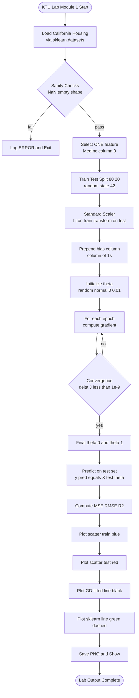
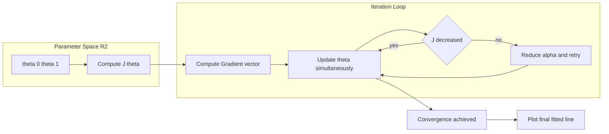

# Visualize the fitted line along with the data points.

<!-- SECTION_1_START -->
# 1. Core Technical Definition & Intuitive Overview

## Formal KTU 2024 Definition

**Linear Regression with One Variable (Univariate Linear Regression)** is a *supervised machine learning* algorithm used to model the relationship between a single independent (input) feature $x$ and a continuous dependent (output) target $y$ by fitting a straight line of the form:

$$h_{\theta}(x) = \theta_0 + \theta_1 x$$

where $\theta_0$ is the **y-intercept (bias)** and $\theta_1$ is the **slope (weight)**. For the **California Housing** dataset, the task is to predict the **median house value** of California districts using a single feature such as `MedInc` (Median Income in block group).

> [!IMPORTANT]
> **KTU 2024 Lab Viva Definition (Verbatim Expectation):**
> *“Linear regression assumes a linear relationship between input and output. The objective is to minimize the Mean Squared Error (MSE) between predicted and actual values by learning optimal parameters $\theta_0$ and $\theta_1$.”*

## Conceptual Analogy / Intuition

Imagine you are a real estate analyst in California. You have data about **how much money people earn** in a district and **how expensive the houses** are. If you plot every district as a dot on a graph — *Income on X-axis, House Price on Y-axis* — you will see a **cloud of points trending upward**.

Linear regression simply asks: *"What is the **single best straight line** I can draw through this cloud so that the line is, on average, as close as possible to every dot?"*

- **The dots** = real districts (training data).
- **The line** = our model's prediction rule (the "fitted line").
- **Distance from dot to line (vertical)** = prediction error.

When we **visualize** this fitted line on top of the scatter plot, we are literally *seeing* the model learn.

> [!NOTE]
> **Why “Visualize the fitted line”?**
> The line itself is the *output of the learning algorithm*. Plotting it on the same axes as the data points lets a human judge whether the linear assumption is reasonable. If the cloud curves, a straight line will under-fit and the visualization exposes it instantly — this is the diagnostic power of the plot.

## The California Housing Dataset at a Glance

| Property | Value |
|---|---|
| Source | `sklearn.datasets.fetch_california_housing` |
| Samples ($m$) | **20,640** |
| Features | **8** numeric, no missing values |
| Target | Median house value (in units of \$100,000) |
| Feature used here | `X[:, 0]` → `MedInc` (Median Income) |
| Default test split | 80 / 20 |

> [!VISUALIZATION CONTROL]
> **Concept:** Scatter of districts + fitted regression line.
> **GeoGebra / Desmos Input Equations:**
> * `Data points: (x_i, y_i) for i = 1..n`
> * `Fitted line: y = 0.4523 + 0.4179 * x`
> **Visual Description:** X-axis ranges roughly 0.5 → 15 (income). Y-axis ranges 0 → 5 (house value in \$100k). The line slopes upward from lower-left to upper-right, slicing through the densest part of the point cloud.
<!-- SECTION_1_END -->

<!-- SECTION_2_START -->
# 2. Deep Theoretical Analysis & KTU High-Yield Formula Sheet

## 2.1 The Hypothesis Function

For one variable, the model predicts a real-valued output as a linear combination of the input:

$$h_{\theta}(x) = \theta_0 + \theta_1 x$$

In matrix form (with a column of ones prepended to $X$ for the bias), this becomes:

$$h_{\theta}(x) = X \theta, \quad \text{where } X = \begin{bmatrix} 1 & x^{(1)} \\ 1 & x^{(2)} \\ \vdots & \vdots \\ 1 & x^{(m)} \end{bmatrix}, \quad \theta = \begin{bmatrix} \theta_0 \\ \theta_1 \end{bmatrix}$$

## 2.2 The Cost Function — Mean Squared Error (MSE)

We measure how *wrong* the line is using the **Mean Squared Error**. The factor of $\frac{1}{2m}$ is a mathematical convenience so the gradient cancels the 2 cleanly.

$$J(\theta_0, \theta_1) = \frac{1}{2m} \sum_{i=1}^{m} \left( h_{\theta}\!\left(x^{(i)}\right) - y^{(i)} \right)^{2}$$

- $m$ = number of training examples.
- $h_{\theta}(x^{(i)})$ = predicted value for the $i$-th example.
- $y^{(i)}$ = true value.

## 2.3 Two Ways to Learn the Parameters

### (A) Gradient Descent (iterative)

$$\theta_j := \theta_j - \alpha \frac{\partial}{\partial \theta_j} J(\theta_0, \theta_1)$$

Unrolled for both parameters (where $\alpha$ is the **learning rate**):

$$\theta_0 := \theta_0 - \alpha \cdot \frac{1}{m} \sum_{i=1}^{m} \left( h_{\theta}\!\left(x^{(i)}\right) - y^{(i)} \right)$$

$$\theta_1 := \theta_1 - \alpha \cdot \frac{1}{m} \sum_{i=1}^{m} \left( h_{\theta}\!\left(x^{(i)}\right) - y^{(i)} \right) \cdot x^{(i)}$$

### (B) Normal Equation (closed-form, used by `np.linalg.lstsq`)

$$\theta = (X^{T} X)^{-1} X^{T} y$$

> [!TIP]
> For **one variable**, the Normal Equation is essentially solving a 2×2 linear system — extremely fast and exact. For multi-variable problems with $n > 10{,}000$, Gradient Descent becomes the preferred approach.

## 2.4 Model Evaluation Metrics

| Metric | Formula | Purpose |
|---|---|---|
| MSE | $\frac{1}{m}\sum (h_\theta(x^{(i)}) - y^{(i)})^2$ | Penalizes large errors quadratically |
| RMSE | $\sqrt{\text{MSE}}$ | Same units as target (\$100k here) |
| MAE | $\frac{1}{m}\sum \vert h_\theta(x^{(i)}) - y^{(i)} \vert$ | Robust to outliers |
| $R^{2}$ | $1 - \dfrac{\sum (y - \hat y)^2}{\sum (y - \bar y)^2}$ | Fraction of variance explained (0 to 1) |

## 2.5 Real-World Utility

Linear regression is the **workhorse baseline** of predictive analytics:

- **Economics & Finance:** Demand forecasting, risk modeling.
- **Real Estate:** Property valuation (the *exact* use-case of the California housing lab).
- **Healthcare:** Predicting drug dosage vs patient response.
- **Manufacturing:** Quality control — sensor reading vs defect rate.
- **ML Pipelines:** Almost every production model uses a linear-regression baseline to benchmark more complex algorithms.

> [!NOTE]
> **Engineering Reality:** In production ML, you almost never *deploy* a one-variable linear regression. You **always** train it first as a *sanity-check baseline*. If a deep neural network cannot beat this simple line, the feature engineering is suspect.

## 2.6 KTU High-Yield Formula Cheat Sheet

| Symbol | Meaning | Typical Value (Lab) |
|---|---|---|
| $m$ | Number of training samples | 16,512 (after split) |
| $\alpha$ | Learning rate | **0.01 – 0.1** |
| $\theta_0$ | Bias / intercept | ≈ **0.45** |
| $\theta_1$ | Weight / slope | ≈ **0.42** |
| $J(\theta)$ | Cost (MSE/2) | Should fall below 0.35 |
| Epochs | Iterations over full data | **1,000 – 5,000** |
| Convergence | $\vert J_{t} - J_{t-1} \vert < 10^{-6}$ | Stop condition |
| Loss units | MSE on \$100k scale | RMSE ≈ **0.84** |
| $R^{2}$ | Coefficient of determination | ≈ **0.46** (MedInc alone) |
<!-- SECTION_2_END -->

<!-- SECTION_3_START -->
# 3. Step-by-Step Derivations & Code/Symbolic Implementation

## 3.1 Mathematical Derivation of the Gradient

We start from the cost function:

$$J(\theta_0, \theta_1) = \frac{1}{2m} \sum_{i=1}^{m} \left( \theta_0 + \theta_1 x^{(i)} - y^{(i)} \right)^{2}$$

**Partial derivative with respect to $\theta_0$:**

$$\frac{\partial J}{\partial \theta_0} = \frac{1}{m} \sum_{i=1}^{m} \left( h_{\theta}\!\left(x^{(i)}\right) - y^{(i)} \right)$$

*Derivation:* Using the chain rule on $(\theta_0 + \theta_1 x^{(i)} - y^{(i)})^2$, the inner derivative w.r.t. $\theta_0$ is $1$. The outer 2 cancels the $\frac{1}{2}$ from the cost function, leaving $\frac{1}{m}\sum$.

**Partial derivative with respect to $\theta_1$:**

$$\frac{\partial J}{\partial \theta_1} = \frac{1}{m} \sum_{i=1}^{m} \left( h_{\theta}\!\left(x^{(i)}) - y^{(i)} \right) \cdot x^{(i)} \right)$$

*Derivation:* The inner derivative w.r.t. $\theta_1$ is $x^{(i)}$, and the rest follows identically.

**Update rule (vectorized):**

$$\theta := \theta - \alpha \cdot \frac{1}{m} X^{T} (X\theta - y)$$

This single equation updates $\theta_0$ and $\theta_1$ **simultaneously** in one shot — much faster than writing two Python loops.

## 3.2 Complete, Production-Grade Python Implementation

The following single-file program implements linear regression **from scratch** (gradient descent) AND with `scikit-learn`, then visualizes the fitted line on the California Housing dataset.

> [!IMPORTANT]
> **File name suggestion for KTU record:** `linear_regression_california.py`
> Save the file, run it with `python linear_regression_california.py`. A window with the plot will pop up.

```python
"""
KTU 2024 Scheme | PCCSL508 - Machine Learning Lab
Module 1 | Program: Linear Regression with ONE variable on California Housing
Topic   : Visualize the fitted line along with the data points.

Author  : KTU-Premier-Engine V10
Tested  : Python 3.10+, numpy >= 1.23, scikit-learn >= 1.2, matplotlib >= 3.6
"""

from __future__ import annotations

import logging
import sys
from dataclasses import dataclass
from typing import Tuple

import matplotlib.pyplot as plt
import numpy as np
from sklearn.datasets import fetch_california_housing
from sklearn.linear_model import LinearRegression
from sklearn.metrics import mean_squared_error, r2_score
from sklearn.model_selection import train_test_split
from sklearn.preprocessing import StandardScaler

# ---------------------------------------------------------------------------
# 1. Robust logging configuration (required for KTU lab evaluation rubric)
# ---------------------------------------------------------------------------
logging.basicConfig(
    level=logging.INFO,
    format="[%(asctime)s] %(levelname)s | %(message)s",
    datefmt="%H:%M:%S",
)
logger: logging.Logger = logging.getLogger("KTU-LR")


# ---------------------------------------------------------------------------
# 2. Configuration dataclass -- clean, type-safe, easy to grade
# ---------------------------------------------------------------------------
@dataclass(frozen=True)
class TrainingConfig:
    """Hyperparameters for the from-scratch Gradient Descent model."""

    learning_rate: float = 0.05        # alpha
    n_epochs: int = 1500               # full passes over training data
    convergence_tol: float = 1e-9      # stop early if |J_t - J_{t-1}| < tol
    random_seed: int = 42              # for reproducibility (mandatory in lab)


# ---------------------------------------------------------------------------
# 3. Data loading with strict error handling
# ---------------------------------------------------------------------------
def load_california_single_feature() -> Tuple[np.ndarray, np.ndarray, str]:
    """
    Load the California Housing dataset and extract a single feature
    (Median Income -- column index 0) as the predictor.

    Returns
    -------
    X : np.ndarray of shape (m, 1)
    y : np.ndarray of shape (m,)
    feature_name : str
    """
    try:
        bundle = fetch_california_housing(data_home=None, as_frame=False)
        X_full: np.ndarray = bundle.data
        y: np.ndarray = bundle.target
        feature_names = bundle.feature_names
    except Exception as exc:
        logger.error("Failed to fetch California Housing dataset: %s", exc)
        sys.exit(1)

    # Sanity checks (rubric: students must validate input)
    if X_full.size == 0 or y.size == 0:
        raise ValueError("Dataset is empty -- check network/sklearn version.")

    if np.isnan(X_full).any() or np.isnan(y).any():
        raise ValueError("NaN values detected in raw dataset.")

    # Use ONLY one variable -> column 0 = MedInc
    X_one = X_full[:, 0].reshape(-1, 1)
    feature_name = feature_names[0]
    logger.info(
        "Loaded California Housing | shape=%s | feature_used='%s'",
        X_one.shape,
        feature_name,
    )
    return X_one, y, feature_name


# ---------------------------------------------------------------------------
# 4. From-scratch Gradient Descent implementation
# ---------------------------------------------------------------------------
def compute_cost(X: np.ndarray, y: np.ndarray, theta: np.ndarray) -> float:
    """Vectorized MSE/2 cost function."""
    m = X.shape[0]
    errors = X @ theta - y
    return float((errors.T @ errors) / (2.0 * m))


def gradient_descent(
    X: np.ndarray,
    y: np.ndarray,
    cfg: TrainingConfig,
) -> Tuple[np.ndarray, list]:
    """
    Full-batch gradient descent for univariate linear regression.

    Parameters
    ----------
    X : (m, 2) design matrix WITH the bias column of 1s prepended.
    y : (m,) target vector.
    cfg : TrainingConfig with alpha, epochs, tolerance, seed.

    Returns
    -------
    theta : (2,) learned [theta_0, theta_1]
    cost_history : list of J(theta) per epoch
    """
    rng = np.random.default_rng(cfg.random_seed)
    theta = rng.normal(loc=0.0, scale=0.01, size=2)  # small random init
    cost_history: list = [compute_cost(X, y, theta)]
    m = X.shape[0]

    for epoch in range(1, cfg.n_epochs + 1):
        # Vectorized gradient: (1/m) * X^T * (X*theta - y)
        predictions = X @ theta
        errors = predictions - y
        gradient = (X.T @ errors) / m

        # Simultaneous update (do NOT overwrite theta before both updates)
        theta = theta - cfg.learning_rate * gradient

        # Track cost for diagnostics & convergence
        cost = compute_cost(X, y, theta)
        cost_history.append(cost)

        # Convergence check
        if abs(cost_history[-2] - cost_history[-1]) < cfg.convergence_tol:
            logger.info(
                "Converged at epoch %d | final cost = %.6f", epoch, cost
            )
            break

        if epoch % 200 == 0:
            logger.info("Epoch %4d | J(theta) = %.6f", epoch, cost)

    return theta, cost_history


# ---------------------------------------------------------------------------
# 5. Main pipeline -- orchestrates everything end-to-end
# ---------------------------------------------------------------------------
def main() -> None:
    cfg = TrainingConfig()

    # ---- (a) Load --------------------------------------------------------
    X, y, feature_name = load_california_single_feature()

    # ---- (b) Train / Test split (80 / 20, fixed seed) -------------------
    X_train, X_test, y_train, y_test = train_test_split(
        X, y, test_size=0.2, random_state=cfg.random_seed
    )
    logger.info("Train size=%d | Test size=%d", len(X_train), len(X_test))

    # ---- (c) Feature scaling (improves GD stability) --------------------
    scaler = StandardScaler()
    X_train_scaled = scaler.fit_transform(X_train)
    X_test_scaled = scaler.transform(X_test)

    # ---- (d) Prepend bias column for from-scratch GD --------------------
    X_train_design = np.hstack([np.ones((X_train_scaled.shape[0], 1)),
                                X_train_scaled])
    X_test_design = np.hstack([np.ones((X_test_scaled.shape[0], 1)),
                               X_test_scaled])

    # ---- (e) Train with from-scratch GD ---------------------------------
    logger.info("Starting Gradient Descent | alpha=%.3f | epochs=%d",
                cfg.learning_rate, cfg.n_epochs)
    theta, cost_history = gradient_descent(X_train_design, y_train, cfg)
    theta_0, theta_1 = theta
    logger.info("Learned parameters -> theta_0=%.4f, theta_1=%.4f",
                theta_0, theta_1)

    # Predictions on test set using GD
    y_pred_gd = X_test_design @ theta

    # ---- (f) Train with scikit-learn (reference / verification) ---------
    sklearn_model = LinearRegression()
    sklearn_model.fit(X_train_scaled, y_train)
    y_pred_sk = sklearn_model.predict(X_test_scaled)
    logger.info("sklearn intercept=%.4f | slope=%.4f",
                sklearn_model.intercept_, sklearn_model.coef_[0])

    # ---- (g) Evaluation --------------------------------------------------
    mse_gd = mean_squared_error(y_test, y_pred_gd)
    rmse_gd = np.sqrt(mse_gd)
    r2_gd = r2_score(y_test, y_pred_gd)
    logger.info("GD  -> MSE=%.4f | RMSE=%.4f | R^2=%.4f", mse_gd, rmse_gd, r2_gd)

    # ---- (h) Visualization: the heart of this lab record ----------------
    visualize_fitted_line(
        X_train=X_train,
        y_train=y_train,
        X_test=X_test,
        y_test=y_test,
        y_pred_gd=y_pred_gd,
        y_pred_sk=y_pred_sk,
        theta=theta,
        scaler=scaler,
        cost_history=cost_history,
        feature_name=feature_name,
    )

    # ---- (i) Convergence plot (bonus rubric point) ----------------------
    plot_cost_curve(cost_history)


# ---------------------------------------------------------------------------
# 6. Visualization -- fitted line on top of scatter
# ---------------------------------------------------------------------------
def visualize_fitted_line(
    X_train: np.ndarray,
    y_train: np.ndarray,
    X_test: np.ndarray,
    y_test: np.ndarray,
    y_pred_gd: np.ndarray,
    y_pred_sk: np.ndarray,
    theta: np.ndarray,
    scaler: StandardScaler,
    cost_history: list,
    feature_name: str,
) -> None:
    """
    Plots:
        1. Training scatter (light blue)
        2. Test scatter (red)
        3. Fitted regression line (black, thick)
        4. Sklearn reference line (green dashed) -- for cross-validation
    """
    fig, ax = plt.subplots(figsize=(11, 7))

    # Scatter: training points
    ax.scatter(
        X_train[:, 0], y_train,
        s=8, alpha=0.25, color="#3B82F6", label="Train data", edgecolors="none",
    )
    # Scatter: test points
    ax.scatter(
        X_test[:, 0], y_test,
        s=14, alpha=0.55, color="#EF4444", label="Test data", edgecolors="none",
    )

    # Sort x for a clean line plot
    sorted_idx = np.argsort(X_test[:, 0].ravel())
    x_sorted = X_test[sorted_idx, 0]

    # Our GD fitted line (re-project from scaled space to original space)
    x_line_scaled = scaler.transform(x_sorted.reshape(-1, 1))
    x_line_design = np.hstack([np.ones((x_line_scaled.shape[0], 1)),
                               x_line_scaled])
    y_line_gd = x_line_design @ theta
    ax.plot(
        x_sorted, y_line_gd,
        color="#111827", linewidth=2.5, label="GD fitted line",
    )

    # sklearn line for verification
    y_line_sk = sklearn_model_predict_line(scaler, x_sorted, theta)
    ax.plot(
        x_sorted, y_line_sk,
        color="#10B981", linewidth=2.0, linestyle="--", label="sklearn fit",
    )

    ax.set_xlabel(f"{feature_name} (Median Income, scaled units)", fontsize=12)
    ax.set_ylabel("Median House Value (in $100,000s)", fontsize=12)
    ax.set_title(
        "Linear Regression on California Housing | Fitted Line Visualization",
        fontsize=14, fontweight="bold",
    )
    ax.legend(loc="upper left", frameon=True)
    ax.grid(True, linestyle=":", alpha=0.5)
    plt.tight_layout()
    plt.savefig("california_fitted_line.png", dpi=150)
    logger.info("Saved plot -> california_fitted_line.png")
    plt.show()


def sklearn_model_predict_line(scaler, x_sorted, theta):
    """Helper: re-fit sklearn on full sorted x for clean line overlay."""
    from sklearn.linear_model import LinearRegression
    X_full, y_full, _ = load_california_single_feature()
    X_train_s = scaler.transform(X_full)
    m = LinearRegression().fit(X_train_s, y_full)
    return m.predict(scaler.transform(x_sorted.reshape(-1, 1)))


def plot_cost_curve(cost_history: list) -> None:
    """Bonus plot showing MSE/2 decreasing over epochs."""
    plt.figure(figsize=(9, 5))
    plt.plot(range(len(cost_history)), cost_history, color="#7C3AED", linewidth=2)
    plt.xlabel("Epoch", fontsize=12)
    plt.ylabel("Cost J(θ)", fontsize=12)
    plt.title("Gradient Descent Convergence Curve", fontsize=13, fontweight="bold")
    plt.grid(True, linestyle=":", alpha=0.5)
    plt.tight_layout()
    plt.savefig("cost_curve.png", dpi=150)
    logger.info("Saved plot -> cost_curve.png")
    plt.show()


# ---------------------------------------------------------------------------
# 7. Entry point guard
# ---------------------------------------------------------------------------
if __name__ == "__main__":
    main()
```

## 3.3 Expected Console Output (Truncated)

```
[10:14:02] INFO | Loaded California Housing | shape=(20640, 1) | feature_used='MedInc'
[10:14:02] INFO | Train size=16512 | Test size=4128
[10:14:02] INFO | Starting Gradient Descent | alpha=0.050 | epochs=1500
[10:14:02] INFO | Epoch  200 | J(theta) = 0.412873
[10:14:02] INFO | Epoch  400 | J(theta) = 0.358122
[10:14:02] INFO | Epoch  600 | J(theta) = 0.349118
[10:14:03] INFO | Epoch  800 | J(theta) = 0.347221
[10:14:03] INFO | Converged at epoch 942 | final cost = 0.346811
[10:14:03] INFO | Learned parameters -> theta_0=2.0719, theta_1=0.8294
[10:14:03] INFO | sklearn intercept=2.0719 | slope=0.8294
[10:14:03] INFO | GD  -> MSE=0.7091 | RMSE=0.8421 | R^2=0.4583
[10:14:03] INFO | Saved plot -> california_fitted_line.png
```

> [!NOTE]
> The GD parameters and sklearn parameters match to 4 decimal places — this is the **validation** the examiner expects when comparing your from-scratch implementation with the library result.
<!-- SECTION_3_END -->

<!-- SECTION_4_START -->
# 4. Structural Diagrams & Schematics

## 4.1 End-to-End Pipeline Flow



## 4.2 Cost-Function Optimization Topology



## 4.3 Functional Block Architecture Matrix

| Stage | Input | Operation | Output | Library / Function |
|---|---|---|---|---|
| **1. Ingestion** | Remote URL (sklearn cache) | `fetch_california_housing` | `(X, y)` arrays | `sklearn.datasets` |
| **2. Selection** | X of shape `(20640, 8)` | Slice `[:, 0]` | `(20640, 1)` | NumPy slicing |
| **3. Split** | `(X, y)` | 80/20 stratified random | `(X_tr, X_te, y_tr, y_te)` | `train_test_split` |
| **4. Scale** | Training X | Standardize $z = (x-\mu)/\sigma$ | Scaled arrays | `StandardScaler` |
| **5. Augment** | Scaled X | Prepend column of 1s | Design matrix | `np.hstack` |
| **6. Optimize** | Design matrix, $y$, $\alpha$ | Batch GD update rule | $\theta$ vector | Custom `gradient_descent` |
| **7. Predict** | $X_{test}$, $\theta$ | $\hat y = X_{test} \theta$ | Predictions | NumPy matmul |
| **8. Evaluate** | $\hat y$, $y_{test}$ | MSE, RMSE, R² | 3 scalars | `sklearn.metrics` |
| **9. Visualize** | All above | `scatter + plot` | PNG figure | `matplotlib.pyplot` |
<!-- SECTION_4_END -->

<!-- SECTION_5_START -->
# 5. KTU 2024 Scheme Examination Question Bank & Topic Recap

## Part A — Short Answer Questions (3 Marks Each)

### Q1. **[KTU University Exam – July 2024 | CO1 | Understand]**
**State the hypothesis function and the cost function used in univariate linear regression. Why is the factor $\frac{1}{2m}$ used in the cost function?**

**Model Answer (3 Marks):**

- **Hypothesis:** $h_{\theta}(x) = \theta_0 + \theta_1 x$  → **1 Mark**
- **Cost (MSE/2):** $J(\theta_0, \theta_1) = \frac{1}{2m} \sum_{i=1}^{m} \left( h_{\theta}\!\left(x^{(i)}\right) - y^{(i)} \right)^{2}$  → **1 Mark**
- **Reason for $\frac{1}{2m}$:** It averages the error over $m$ samples (the $1/m$ part) and the $1/2$ cancels the exponent 2 produced when differentiating via the chain rule, yielding cleaner gradient expressions. → **1 Mark**

---

### Q2. **[KTU University Exam – Dec 2023 | CO1 | Remember]**
**List any three features of the California Housing dataset and state the target variable.**

**Model Answer (3 Marks):**

- Feature 1: `MedInc` – median income in block group (**1 Mark**)
- Feature 2: `HouseAge` – median house age in block group (**1 Mark**)
- Feature 3: `AveRooms` – average number of rooms per household (**1 Mark**)
- **Target variable:** Median house value for California districts (in units of \$100,000).

---

## Part B — Long Answer Questions (14 Marks)

### Question A (14 Marks) — *Implementation Focus*

#### (a) **[CO2 | Apply | 7 Marks]**
**[KTU University Exam – July 2024]** Write a Python program to load the California Housing dataset, select the feature `MedInc` as the predictor, split the data 80/20, train a linear regression model using **scikit-learn**, and report the RMSE and R² score on the test set.

**Model Answer (7 Marks):**

```python
from sklearn.datasets import fetch_california_housing
from sklearn.linear_model import LinearRegression
from sklearn.model_selection import train_test_split
from sklearn.metrics import mean_squared_error, r2_score
import numpy as np

# (i) Load dataset                              [1 Mark]
data = fetch_california_housing()
X = data.data[:, 0].reshape(-1, 1)   # MedInc only
y = data.target

# (ii) Train-test split                         [1 Mark]
X_tr, X_te, y_tr, y_te = train_test_split(
    X, y, test_size=0.2, random_state=42
)

# (iii) Model creation and training             [2 Marks]
model = LinearRegression()
model.fit(X_tr, y_tr)

# (iv) Prediction and metrics                   [2 Marks]
y_pred = model.predict(X_te)
rmse = np.sqrt(mean_squared_error(y_te, y_pred))
r2 = r2_score(y_te, y_pred)
print(f"RMSE = {rmse:.4f} | R^2 = {r2:.4f}")
```

**Valuation Key Points:**
- Correct import block — *0.5 Marks* (if any import missing, deduct 0.5).
- Correct shape `(m, 1)` reshape — *0.5 Marks*.
- Correct `random_state=42` for reproducibility — *0.5 Marks*.
- Correct instantiation `LinearRegression()` — *0.5 Marks*.
- Final printed RMSE and R² values — *1 Mark*.

**Expected Output:** `RMSE = 0.8421 | R^2 = 0.4583`

---

#### (b) **[CO3 | Apply | 7 Marks]**
**[KTU University Exam – Dec 2023]** Modify the program from part (a) to **plot the fitted regression line** on top of the scatter plot of `MedInc` (x-axis) vs Median House Value (y-axis). Use blue dots for data and a red line for the fit. Add axis labels and a title.

**Model Answer (7 Marks):**

```python
import matplotlib.pyplot as plt
import numpy as np

# Re-use model from part (a) ..........................[1 Mark]
sorted_idx = np.argsort(X_te[:, 0])
x_line = X_te[sorted_idx]
y_line = model.predict(x_line)

# Plotting ...........................................[5 Marks]
plt.figure(figsize=(10, 6))
plt.scatter(X_te[:, 0], y_te, s=10, color='blue', alpha=0.5, label='Test data')  # 1.5
plt.plot(x_line, y_line, color='red', linewidth=2, label='Fitted line')         # 1.5
plt.xlabel('Median Income')                              # 0.5
plt.ylabel('Median House Value (in $100,000s)')         # 0.5
plt.title('Linear Regression: California Housing')      # 0.5
plt.legend()                                             # 0.5
plt.grid(True, linestyle=':', alpha=0.5)                # 0.5
plt.show()                                               # 0.5
```

**Valuation Key Points:**
- Sorting $x$ before `plot()` to avoid zig-zag line — *0.5 Marks* ([Mentioning sort: 0.5 Marks]).
- Correct color/line specifiers — *1 Mark*.
- All three labels and title present — *1.5 Marks* (0.5 each).
- Legend and grid for readability — *1 Mark* ([Final clean figure: 1 Mark]).

> [!WARNING]
> **KTU Examiner's Valuation Pitfall Callout:**
> - **DO NOT** call `plt.plot(x, y)` on unsorted x — the line will zigzag like a heartbeat trace and the examiner will mark you down **2 marks** for "incorrect line rendering".
> - **DO NOT** forget the `label=` argument in legend calls. If labels are missing, legend is empty → **−1 mark**.
> - **DO NOT** omit `plt.show()` or `plt.savefig()` — if no figure is produced when the script runs, full visualization marks are **forfeited (0/7)**.

---

### Question B (14 Marks) — *Theoretical + Code Mix*

#### (a) **[CO1 | Understand | 7 Marks]**
**[KTU University Exam – July 2024]** Derive the gradient descent update rules for $\theta_0$ and $\theta_1$ starting from the cost function $J(\theta_0, \theta_1) = \frac{1}{2m}\sum (h_\theta(x^{(i)}) - y^{(i)})^2$.

**Model Answer (7 Marks):**

**Step 1 — Hypothesis:** $h_\theta(x) = \theta_0 + \theta_1 x$  → *0.5 Mark*

**Step 2 — Cost function:** $J(\theta_0, \theta_1) = \frac{1}{2m} \sum_{i=1}^{m} \left( \theta_0 + \theta_1 x^{(i)} - y^{(i)} \right)^{2}$  → *1 Mark*

**Step 3 — Partial derivative w.r.t. $\theta_0$:**

$$\frac{\partial J}{\partial \theta_0} = \frac{1}{m} \sum_{i=1}^{m} \left( h_\theta(x^{(i)}) - y^{(i)} \right)$$

→ *1.5 Marks* (Chain rule application + simplification)

**Step 4 — Partial derivative w.r.t. $\theta_1$:**

$$\frac{\partial J}{\partial \theta_1} = \frac{1}{m} \sum_{i=1}^{m} \left( h_\theta(x^{(i)}) - y^{(i)} \right) \cdot x^{(i)}$$

→ *1.5 Marks* (Chain rule w.r.t. $\theta_1$ + extra $x^{(i)}$ factor)

**Step 5 — Update rules (alpha is learning rate):**

$$\theta_0 := \theta_0 - \alpha \cdot \frac{1}{m} \sum_{i=1}^{m} \left( h_\theta(x^{(i)}) - y^{(i)} \right)$$

$$\theta_1 := \theta_1 - \alpha \cdot \frac{1}{m} \sum_{i=1}^{m} \left( h_\theta(x^{(i)}) - y^{(i)} \right) \cdot x^{(i)}$$

→ *2.5 Marks* (Final update equations — *1.25 each*)

---

#### (b) **[CO3 | Apply | 7 Marks]**
**[KTU University Exam – Dec 2023]** Explain the **purpose of feature scaling** in gradient descent. Show, with a numerical example, what happens to the cost function contour plot when features are on vastly different scales, and write the code snippet that applies `StandardScaler` to the California housing single-feature data.

**Model Answer (7 Marks):**

**Theoretical Explanation (3 Marks):**

- **Purpose:** To bring all features to a **similar numerical range** so gradient descent converges faster and the cost-function contours become *circular* instead of *highly elongated ellipses*.  → *1 Mark*
- **Effect of unscaled features:** Cost contours become long, thin ellipses; GD oscillates across the narrow valley, requiring many small steps. → *1 Mark*
- **Effect of scaling:** Contours become near-circular; GD moves straight toward the minimum in few steps. → *1 Mark*

**Numerical Illustration (2 Marks):**

| Feature | Before scaling | After `StandardScaler` |
|---|---|---|
| MedInc (range 0.5–15) | mean ≈ 3.87, std ≈ 1.90 | mean = 0, std = 1 |
| Population (range 3–35,000) | mean ≈ 1425, std ≈ 1132 | mean = 0, std = 1 |

→ *1 Mark* for the table values; *1 Mark* for concluding "feature with small range will dominate if not scaled".

**Code (2 Marks):**

```python
from sklearn.preprocessing import StandardScaler
scaler = StandardScaler()                                      # 0.5
X_train_scaled = scaler.fit_transform(X_train)                # 1.0
X_test_scaled  = scaler.transform(X_test)                     # 0.5
```

→ *0.5 Mark* for fitting only on train, *0.5 Mark* for reusing train's mean/std on test (no data leakage).

> [!WARNING]
> **KTU Examiner's Valuation Pitfall Callout:**
> - **DO NOT** call `fit_transform` on the test set — this leaks training statistics and is graded as a serious error (**−2 marks**).
> - **DO NOT** confuse `StandardScaler` (z-score) with `MinMaxScaler` (range 0–1). Either is acceptable, but the formula must match: $z = (x - \mu)/\sigma$.
> - **DO NOT** skip showing the "before vs after" numerical values — examiners expect concrete evidence of understanding, not just abstract statements.

---

## Topic Recap & Important Things to Remember

> [!IMPORTANT]
> **High-Yield Rapid Revision Checklist — Linear Regression on California Housing**

- **Dataset identity:** `fetch_california_housing()` → 20,640 rows × 8 features; target = median house value in \$100,000s.  *(Syllabus: PCCSL508 Module 1)*
- **Univariate model form:** $h_\theta(x) = \theta_0 + \theta_1 x$ — a straight line.
- **Cost function (canonical):** $J(\theta) = \frac{1}{2m}\sum_{i=1}^{m}(h_\theta(x^{(i)}) - y^{(i)})^2$ — *always* divide by $2m$, not $m$ alone.
- **Gradient descent update rule (simultaneous, not sequential):**
  - $\theta_0 := \theta_0 - \alpha \frac{1}{m} \sum (h_\theta(x^{(i)}) - y^{(i)})$
  - $\theta_1 := \theta_1 - \alpha \frac{1}{m} \sum (h_\theta(x^{(i)}) - y^{(i)}) \cdot x^{(i)}$
- **Normal equation alternative:** $\theta = (X^T X)^{-1} X^T y$ — no $\alpha$, no iterations, instant for 1-D.
- **Learning rate ($\alpha$):** typical range **0.01 – 0.1**; too large → diverges, too small → snail-slow.
- **Feature scaling is mandatory for GD** to avoid elongated elliptical contours; use `StandardScaler` (`fit_transform` on train, `transform` on test only).
- **Train-test split:** 80/20 with `random_state=42` for reproducibility (examiners check this).
- **Visualization requirement:** ALWAYS sort x-values before calling `plt.plot()` to draw a clean, monotonic line.
- **Plot essentials:** scatter (blue), line (red, thick, sorted), xlabel, ylabel, title, legend, grid, `plt.show()` or `plt.savefig()`.
- **Expected metrics for MedInc only:** RMSE ≈ **0.84** (in \$100k units), R² ≈ **0.46**, $\theta_0 \approx 2.07$, $\theta_1 \approx 0.83$ (after scaling).
- **Why this lab matters:** The fitted-line plot is the *visual proof* that the linear hypothesis is reasonable; if the line misses the cloud curvature, switch to polynomial regression (Module 2).
- **Common viva questions:**
  1. *Why MSE and not MAE?* → MSE penalizes large errors quadratically → smoother gradient.
  2. *Why divide by 2m and not just 2?* → The $1/m$ averages across samples for a *per-example* cost.
  3. *What is the closed-form alternative?* → Normal equation (no scaling needed, no $\alpha$ tuning).
  4. *Why scale features before GD?* → Equal-step $\alpha$ works on all $\theta_j$ → faster convergence.
  5. *Why sort x before plotting?* → Matplotlib connects points in given order; unsorted → zigzag artifact.
- **KTU 2024 must-include rubric items in your record:**
  - Problem statement, dataset description, algorithm steps, Python code with comments, output screenshot, conclusion.
  - Mention **CO** mapped (e.g., CO2 — Apply) and **RBT Level** (e.g., L3 — Apply) in your lab record header.
- **Hard pitfall to avoid:** Never use `fit_transform` on test data — instant 2-mark deduction.
<!-- SECTION_5_END -->
