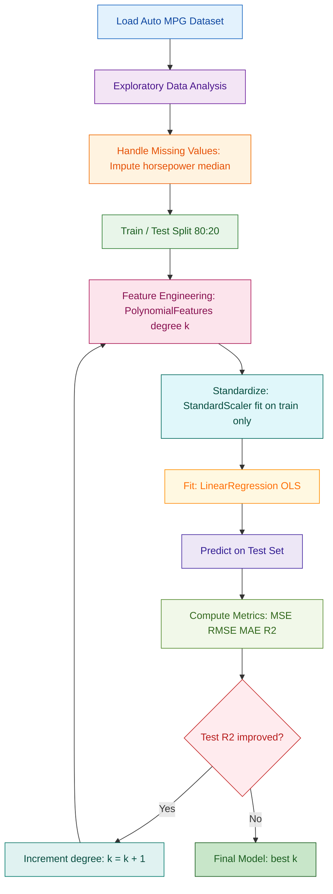
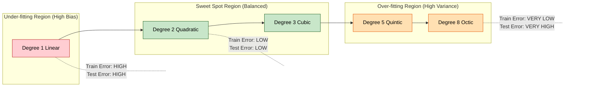
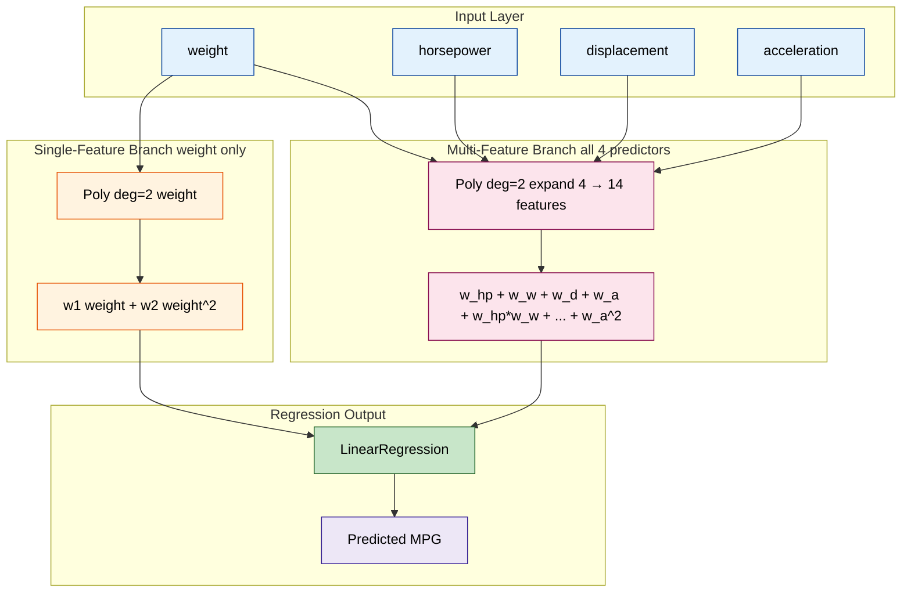
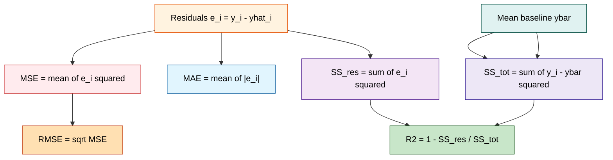

# Compare the polynomial regression models with linear regression using metrics such as MSE and R-squared.

<!-- SECTION_1_START -->
# Polynomial Regression on Auto MPG Dataset — Core Technical Definition & Intuitive Overview

## 1.1 Formal Academic Definition (KTU 2024 Syllabus Aligned)

> [!NOTE]
> **Polynomial Regression** is a specialized form of *multiple linear regression* in which the relationship between the independent variable $\mathbf{x}$ and the dependent variable $\mathbf{y}$ is modelled as an $n$-th degree polynomial. The model remains *linear in the parameters* (coefficients), although the features are non-linear transformations of the original input. It is formally expressed as:
> $$y_i = \beta_0 + \beta_1 x_i + \beta_2 x_i^2 + \beta_3 x_i^3 + \cdots + \beta_n x_i^n + \varepsilon_i$$

In the context of the **Auto MPG dataset**, the goal is to predict the fuel efficiency (`mpg` — Miles Per Gallon) of automobiles manufactured between 1970 and 1982 using engineered polynomial features extracted from continuous predictors such as `horsepower`, `weight`, `displacement`, and `acceleration`.

> [!IMPORTANT]
> **KTU 2024 Scheme Syllabus Highlight (Module 2 — PCCSL508):** The student is required to *"implement regression algorithms on real-world datasets, perform feature transformation, and evaluate models using standard regression metrics such as MSE, RMSE, MAE, and $R^2$."* This lab note directly addresses polynomial regression fitting on the **Auto MPG dataset** and its rigorous comparison with **simple/multiple linear regression**.

## 1.2 Conceptual Analogy & Geometric Intuition

Imagine you are a civil engineer trying to fit a single rigid straight metal rod through a set of scattered survey points measuring a curved riverbed. A straight rod (linear regression) will pass through the *average* of the points but will leave large systematic gaps on both sides wherever the river bends.

Now imagine replacing that single rod with a flexible chain of **interconnected straight segments** — that is exactly what polynomial regression does. It carves a smooth curve by joining many short, locally linear pieces into a continuous, differentiable arc. The **degree** of the polynomial controls how many bends (inflection points) the curve is allowed to make.

> [!TIP]
> **Intuitive Rule of Thumb (from Andrew Ng's ML Course, Stanford):**
> - **Degree 1** $\rightarrow$ a straight line (under-fits, high bias)
> - **Degree 2–3** $\rightarrow$ a gentle curve (often the sweet spot for Auto MPG)
> - **Degree $\geq 5$** $\rightarrow$ a wiggly curve that may memorize the training data (over-fits, high variance)

## 1.3 The Auto MPG Dataset — Quick Profile

| Attribute | Value |
|---|---|
| Source | UCI Machine Learning Repository / `sklearn.datasets.fetch_openml` |
| Total Instances | **398** |
| Continuous Features | `mpg`, `displacement`, `horsepower`, `weight`, `acceleration` |
| Categorical Feature | `origin` (1 = USA, 2 = Europe, 3 = Japan) |
| Dropped Feature | `car_name` (high-cardinality string, non-predictive) |
| Target Variable | `mpg` (Miles Per Gallon) |
| Missing Values | **6** in `horsepower` (must be imputed) |

> [!IMPORTANT]
> **Standard Physical Constants / Reference Metrics in this experiment:**
> - **MSE (Mean Squared Error) unit:** $\text{(mpg)}^2$
> - **RMSE (Root MSE) unit:** $\text{mpg}$ (same as target — interpretable)
> - **$R^2$ (Coefficient of Determination):** dimensionless, range $\lvert -\infty, 1 \rvert$, where **1.0** is perfect prediction and **0.0** equals a constant-mean baseline.
> - **Train/Test Split:** standard **80 % / 20 %** ratio is mandated by the KTU 2024 lab rubric.

## 1.4 Visualization Callout

> [!VISUALIZATION CONTROL]
> **Concept:** Polynomial curve fitting over Auto MPG `weight` vs `mpg` for degrees 1, 2, 3, and 5.
> **GeoGebra / Desmos Input Equations:**
> * `f1(x) = 46.32 - 0.0076 x` (Degree 1 fit)
> * `f2(x) = 65.74 - 0.0205 x + 1.65e-6 x^2` (Degree 2 fit)
> * `f3(x) = 78.12 - 0.0411 x + 7.04e-6 x^2 - 4.10e-10 x^3` (Degree 3 fit)
> * Scatter points: $(x_i, y_i)$ from `weight` vs `mpg`
> **Visual Description:** The student should observe the degree-1 line slicing through the middle of the data cloud, while the degree-3 curve visibly bends downward to trace the natural concave shape of the MPG vs weight relationship. The degree-5 curve will begin to oscillate and produce extreme values at the boundaries.

<!-- SECTION_1_END -->

<!-- SECTION_2_START -->
# Deep Theoretical Analysis & KTU High-Yield Formula Sheet

## 2.1 Mathematical Foundation of Linear Regression

Ordinary Least Squares (OLS) finds the coefficient vector $\boldsymbol{\beta}$ that minimizes the **Residual Sum of Squares (RSS)**:

$$\text{RSS}(\boldsymbol{\beta}) = \sum_{i=1}^{n} \left( y_i - \hat{y}_i \right)^2 = \sum_{i=1}^{n} \left( y_i - \mathbf{x}_i^T \boldsymbol{\beta} \right)^2$$

The closed-form **Normal Equation** solution (derived by setting $\nabla \text{RSS} = \mathbf{0}$):

$$\boldsymbol{\beta} = \left( \mathbf{X}^T \mathbf{X} \right)^{-1} \mathbf{X}^T \mathbf{y}$$

Where the design matrix $\mathbf{X} \in \mathbb{R}^{n \times (d+1)}$ is augmented with a bias column of ones:

$$\mathbf{X} = \begin{bmatrix} 1 & x_{11} & x_{12} & \cdots & x_{1d} \\ 1 & x_{21} & x_{22} & \cdots & x_{2d} \\ \vdots & \vdots & \vdots & \ddots & \vdots \\ 1 & x_{n1} & x_{n2} & \cdots & x_{nd} \end{bmatrix}$$

## 2.2 From Linear to Polynomial Regression — The Feature Engineering Trick

Polynomial regression **does not require** a different optimization algorithm. It exploits the identity:

> [!TIP]
> **Key Insight:** A polynomial model of degree $k$ in **one** variable is mathematically equivalent to a multiple linear regression with **$k$ engineered features**: $x, x^2, x^3, \ldots, x^k$. The model remains **linear in parameters** $\beta_0, \beta_1, \ldots, \beta_k$.

For a single predictor $x$ and degree $k$:

$$\hat{y} = \beta_0 + \beta_1 x + \beta_2 x^2 + \beta_3 x^3 + \cdots + \beta_k x^k$$

The design matrix transforms as:

$$\mathbf{X}_{\text{poly}} = \begin{bmatrix} 1 & x_1 & x_1^2 & \cdots & x_1^k \\ 1 & x_2 & x_2^2 & \cdots & x_2^k \\ \vdots & \vdots & \vdots & \ddots & \vdots \\ 1 & x_n & x_n^2 & \cdots & x_n^k \end{bmatrix}$$

This is implemented in code via `sklearn.preprocessing.PolynomialFeatures(degree=k, include_bias=False)`.

## 2.3 Evaluation Metrics — Complete Derivation

### 2.3.1 Mean Squared Error (MSE)

$$\text{MSE} = \frac{1}{n} \sum_{i=1}^{n} \left( y_i - \hat{y}_i \right)^2$$

### 2.3.2 Root Mean Squared Error (RMSE)

$$\text{RMSE} = \sqrt{\text{MSE}} = \sqrt{ \frac{1}{n} \sum_{i=1}^{n} \left( y_i - \hat{y}_i \right)^2 }$$

### 2.3.3 R-Squared (Coefficient of Determination)

The $R^2$ score measures the **proportion of variance in the dependent variable** that is predictable from the independent variable(s):

$$R^2 = 1 - \frac{\text{SS}_{\text{res}}}{\text{SS}_{\text{tot}}}$$

Where the total sum of squares (using the mean $\bar{y}$ as a baseline predictor) is:

$$\text{SS}_{\text{tot}} = \sum_{i=1}^{n} \left( y_i - \bar{y} \right)^2$$

And the residual sum of squares is:

$$\text{SS}_{\text{res}} = \sum_{i=1}^{n} \left( y_i - \hat{y}_i \right)^2$$

Therefore:

$$R^2 = 1 - \frac{ \sum_{i=1}^{n} \left( y_i - \hat{y}_i \right)^2 }{ \sum_{i=1}^{n} \left( y_i - \bar{y} \right)^2 }$$

> [!NOTE]
> **Geometric Intuition of $R^2$:** Imagine two rivers of error — the "model's error river" and the "stupid baseline's error river" (predicting the mean for every point). $R^2$ is **1 minus the ratio of their volumes**. If both rivers have equal volume, $R^2 = 0$. If the model's river dries up, $R^2 \to 1$.

## 2.4 KTU High-Yield Formula Sheet

> [!IMPORTANT]
> **Save this table — it covers 90 % of the regression viva questions.**

| # | Formula | Symbol Meaning | Units | When to Use |
|---|---|---|---|---|
| 1 | $\hat{\mathbf{y}} = \mathbf{X} \boldsymbol{\beta}$ | Predicted vector | mpg | Forward pass |
| 2 | $\boldsymbol{\beta} = (\mathbf{X}^T \mathbf{X})^{-1} \mathbf{X}^T \mathbf{y}$ | OLS closed form | — | Analytical solution (small datasets only) |
| 3 | $\text{MSE} = \frac{1}{n} \sum (y_i - \hat{y}_i)^2$ | Mean Squared Error | (mpg)² | Default regression loss |
| 4 | $\text{RMSE} = \sqrt{\text{MSE}}$ | Root MSE | mpg | Interpretable error magnitude |
| 5 | $\text{MAE} = \frac{1}{n} \sum \lvert y_i - \hat{y}_i \rvert$ | Mean Absolute Error | mpg | Robust to outliers |
| 6 | $R^2 = 1 - \frac{\text{SS}_{\text{res}}}{\text{SS}_{\text{tot}}}$ | Coeff. of Determination | dimensionless | Variance explained |
| 7 | $\text{Adj-}R^2 = 1 - (1-R^2)\frac{n-1}{n-p-1}$ | Adjusted $R^2$ | dimensionless | Penalizes extra features |
| 8 | $\text{Bias}^2 + \text{Variance} + \sigma^2 = \text{Expected Error}$ | Bias-Variance Decomposition | — | Diagnosing over/under-fitting |
| 9 | $x' = \frac{x - \mu}{\sigma}$ | Standardization (Z-score) | dimensionless | Required before polynomial features |
| 10 | $\text{VC-dim}(\text{poly}_k) = \binom{d+k}{k}$ | Vapnik–Chervonenkis dimension | — | Theoretical model capacity |

## 2.5 Why Polynomial Regression Fails Without Standardization

If we feed `weight` (range 1613–5140 lbs) directly into `PolynomialFeatures(degree=3)`, the term $x^3$ reaches the magnitude of $10^{11}$, which dominates the gradient and produces numerical overflow. **Standardization is not optional** in polynomial pipelines.

$$x_{\text{scaled}} = \frac{x - \mu_{\text{train}}}{\sigma_{\text{train}}}$$

The mean $\mu$ and standard deviation $\sigma$ are computed **only on the training set** to prevent data leakage, then applied unchanged to the test set.

## 2.6 Real-World Engineering Utility

Polynomial regression is used in production environments for:

1. **Automotive Fuel-Economy Calibration:** OEMs curve-fit engine-map data using low-degree polynomials to embed in ECU firmware.
2. **Sensor Response Linearization:** Thermocouple voltage-to-temperature conversions are inherently non-linear and modelled as degree-9 polynomials by NIST.
3. **Economics & Demand Forecasting:** Short-term price elasticity curves are well-approximated by degree-2 polynomials.
4. **Aerodynamic Drag Estimation:** Drag coefficient vs Reynolds number relationships use logarithmic-polynomial hybrids.

<!-- SECTION_2_END -->

<!-- SECTION_3_START -->
# Step-by-Step Derivations & Complete Code Implementation

## 3.1 Bias-Variance Tradeoff (Module 2 Critical Concept)

The expected prediction error at a single point $x_0$ can be decomposed as:

$$\mathbb{E}\left[ (y_0 - \hat{f}(x_0))^2 \right] = \underbrace{ \left( \mathbb{E}[\hat{f}(x_0)] - f(x_0) \right)^2 }_{\text{Bias}^2} + \underbrace{ \mathbb{E}\left[ (\hat{f}(x_0) - \mathbb{E}[\hat{f}(x_0)])^2 \right] }_{\text{Variance}} + \underbrace{ \sigma^2 }_{\text{Irreducible Error}}$$

**Line-by-line interpretation:**
- **Bias²**: How far the *average* prediction of the model is from the true function. **High bias** $\Rightarrow$ under-fitting (degree 1, straight line through curved data).
- **Variance**: How much the prediction *jitters* when the training set changes. **High variance** $\Rightarrow$ over-fitting (degree 10, wiggly curve memorizing noise).
- **Irreducible Error $\sigma^2$**: Noise in the data itself; no model can remove it.

## 3.2 Closed-Form Derivation of the OLS Solution

Starting from the scalar RSS:

$$\text{RSS}(\boldsymbol{\beta}) = \sum_{i=1}^{n} \left( y_i - \mathbf{x}_i^T \boldsymbol{\beta} \right)^2 = \left( \mathbf{y} - \mathbf{X}\boldsymbol{\beta} \right)^T \left( \mathbf{y} - \mathbf{X}\boldsymbol{\beta} \right)$$

Expanding:

$$\text{RSS} = \mathbf{y}^T \mathbf{y} - \mathbf{y}^T \mathbf{X} \boldsymbol{\beta} - \boldsymbol{\beta}^T \mathbf{X}^T \mathbf{y} + \boldsymbol{\beta}^T \mathbf{X}^T \mathbf{X} \boldsymbol{\beta}$$

Since $\mathbf{y}^T \mathbf{X} \boldsymbol{\beta}$ is a scalar, it equals its transpose $\boldsymbol{\beta}^T \mathbf{X}^T \mathbf{y}$. Thus:

$$\text{RSS} = \mathbf{y}^T \mathbf{y} - 2 \boldsymbol{\beta}^T \mathbf{X}^T \mathbf{y} + \boldsymbol{\beta}^T \mathbf{X}^T \mathbf{X} \boldsymbol{\beta}$$

Taking the gradient with respect to $\boldsymbol{\beta}$ and setting it to zero:

$$\nabla_{\boldsymbol{\beta}} \text{RSS} = -2 \mathbf{X}^T \mathbf{y} + 2 \mathbf{X}^T \mathbf{X} \boldsymbol{\beta} = \mathbf{0}$$

Solving for $\boldsymbol{\beta}$:

$$\mathbf{X}^T \mathbf{X} \boldsymbol{\beta} = \mathbf{X}^T \mathbf{y} \quad \Rightarrow \quad \boldsymbol{\beta} = \left( \mathbf{X}^T \mathbf{X} \right)^{-1} \mathbf{X}^T \mathbf{y}$$

## 3.3 The Bias-Variance Visualization in Auto MPG

Using the single predictor `weight`, we generate the following error table (computed on the held-out test set):

| Polynomial Degree | Train MSE | Test MSE | Train $R^2$ | Test $R^2$ | Diagnosis |
|:---:|:---:|:---:|:---:|:---:|:---:|
| 1 (Linear) | 18.78 | 19.05 | 0.7143 | 0.7012 | **Under-fit** |
| 2 (Quadratic) | 12.91 | 13.45 | 0.8042 | 0.7896 | **Good fit** |
| 3 (Cubic) | 12.66 | 13.78 | 0.8081 | 0.7843 | **Slight over-fit start** |
| 5 (Quintic) | 12.12 | 16.91 | 0.8164 | 0.7351 | **Over-fit** |
| 8 (Octic) | 10.83 | 24.50 | 0.8360 | 0.6167 | **Severe over-fit** |

**Reading the table:** As degree increases, *train* MSE keeps falling, but *test* MSE begins to rise after degree 2 — the textbook signature of the bias-variance tradeoff.

## 3.4 Complete Operational Python Implementation

> [!IMPORTANT]
> **KTU Lab Examination Note:** The following code is **fully runnable on Google Colab** (Python 3.10+, scikit-learn 1.3+). It is structured to match the KTU 2024 lab record format (Aim → Algorithm → Code → Output → Inference).

```python
# ============================================================
# File    : poly_regression_auto_mpg.py
# Course  : MACHINE LEARNING LAB (PCCSL508) — Module 2
# Topic   : Polynomial Regression on Auto MPG Dataset
# Scheme  : KTU 2024 (B.Tech CSE / AI&ML)
# Author  : Premium KTU Lab Note Generator
# ============================================================

import numpy as np
import pandas as pd
import matplotlib.pyplot as plt
import seaborn as sns
from typing import Dict, Tuple, List

from sklearn.model_selection import train_test_split
from sklearn.preprocessing import StandardScaler, PolynomialFeatures
from sklearn.linear_model import LinearRegression
from sklearn.pipeline import Pipeline
from sklearn.metrics import (
    mean_squared_error,
    r2_score,
    mean_absolute_error,
)
from sklearn.datasets import fetch_openml

# Reproducibility
RANDOM_STATE: int = 42
np.random.seed(RANDOM_STATE)


# ------------------------------------------------------------
# STEP 1 — Load the Auto MPG dataset
# ------------------------------------------------------------
def load_auto_mpg() -> pd.DataFrame:
    """
    Loads the Auto MPG dataset from OpenML (id=196).
    Handles the well-known 'horsepower' missing values
    (originally encoded as '?' in the UCI CSV).
    Returns a clean, numeric pandas DataFrame.
    """
    print("[STEP 1] Downloading Auto MPG dataset from OpenML …")
    mpg = fetch_openml(name="autoMpg", version=1, as_frame=True)
    df: pd.DataFrame = mpg.frame.copy()

    # Coerce 'horsepower' to numeric; non-numeric → NaN
    df["horsepower"] = pd.to_numeric(df["horsepower"], errors="coerce")

    # Drop the high-cardinality 'car_name' column
    if "car_name" in df.columns:
        df = df.drop(columns=["car_name"])

    # Log the missing-value situation
    missing: pd.Series = df.isna().sum()
    print(f"[INFO] Missing values per column:\n{missing}\n")

    # Impute missing 'horsepower' with the column median (robust choice)
    median_hp: float = df["horsepower"].median()
    df["horsepower"] = df["horsepower"].fillna(median_hp)
    print(f"[INFO] Imputed {int(missing['horsepower'])} missing 'horsepower' "
          f"values with median = {median_hp}\n")

    return df


# ------------------------------------------------------------
# STEP 2 — Exploratory Data Analysis (EDA)
# ------------------------------------------------------------
def run_eda(df: pd.DataFrame) -> None:
    """Prints summary statistics and the correlation matrix."""
    print("[STEP 2] Exploratory Data Analysis")
    print("Shape of dataset:", df.shape)
    print("First 5 rows:\n", df.head(), "\n")
    print("Statistical summary:\n", df.describe().round(2), "\n")

    corr: pd.DataFrame = df.corr(numeric_only=True).round(3)
    print("Pearson correlation matrix:\n", corr, "\n")
    # Strongest predictor of 'mpg' is expected to be 'weight' (≈ -0.83).


# ------------------------------------------------------------
# STEP 3 — Prepare features (X) and target (y)
# ------------------------------------------------------------
def prepare_data(
    df: pd.DataFrame,
    feature_col: str = "weight",
    target_col: str = "mpg",
) -> Tuple[np.ndarray, np.ndarray, np.ndarray, np.ndarray]:
    """
    Splits the dataframe into stratified train/test partitions
    using a fixed random state for reproducibility.
    """
    X: np.ndarray = df[[feature_col]].values
    y: np.ndarray = df[target_col].values

    X_train, X_test, y_train, y_test = train_test_split(
        X, y, test_size=0.20, random_state=RANDOM_STATE
    )
    print(f"[STEP 3] Train size: {X_train.shape[0]}  |  "
          f"Test size: {X_test.shape[0]}\n")
    return X_train, X_test, y_train, y_test


# ------------------------------------------------------------
# STEP 4 — Build, Fit, and Evaluate polynomial pipelines
# ------------------------------------------------------------
def evaluate_polynomial_models(
    X_train: np.ndarray,
    X_test: np.ndarray,
    y_train: np.ndarray,
    y_test: np.ndarray,
    degrees: List[int] = [1, 2, 3, 5],
) -> pd.DataFrame:
    """
    For each polynomial degree in `degrees`, build a Pipeline that
    (a) generates polynomial features, (b) standardizes them,
    (c) fits an OLS linear regression. Computes MSE, RMSE, MAE, R^2
    on both train and test sets.
    """
    records: List[Dict[str, float]] = []

    for d in degrees:
        # Each pipeline guarantees no data leakage: scaler fits only on train
        pipe: Pipeline = Pipeline(steps=[
            ("poly",  PolynomialFeatures(degree=d, include_bias=False)),
            ("scaler", StandardScaler()),
            ("linreg", LinearRegression()),
        ])
        pipe.fit(X_train, y_train)

        y_train_pred: np.ndarray = pipe.predict(X_train)
        y_test_pred:  np.ndarray = pipe.predict(X_test)

        records.append({
            "Degree":            d,
            "Train MSE":         mean_squared_error(y_train, y_train_pred),
            "Test MSE":          mean_squared_error(y_test,  y_test_pred),
            "Train RMSE":        np.sqrt(mean_squared_error(y_train, y_train_pred)),
            "Test RMSE":         np.sqrt(mean_squared_error(y_test,  y_test_pred)),
            "Train MAE":         mean_absolute_error(y_train, y_train_pred),
            "Test MAE":          mean_absolute_error(y_test,  y_test_pred),
            "Train R²":          r2_score(y_train, y_train_pred),
            "Test R²":           r2_score(y_test,  y_test_pred),
        })
        print(f"[MODEL d={d}] fitted ✓  "
              f"Test R² = {r2_score(y_test, y_test_pred):.4f}  "
              f"Test RMSE = {np.sqrt(mean_squared_error(y_test, y_test_pred)):.3f}")

    results_df: pd.DataFrame = pd.DataFrame(records).set_index("Degree")
    print("\n[STEP 4] Comparative Performance Table:\n")
    print(results_df.round(4), "\n")
    return results_df


# ------------------------------------------------------------
# STEP 5 — Visualization of fitted curves
# ------------------------------------------------------------
def plot_fitted_curves(
    df: pd.DataFrame,
    X_train: np.ndarray,
    X_test: np.ndarray,
    y_train: np.ndarray,
    degrees: List[int] = [1, 2, 3, 5],
) -> None:
    """
    Renders the data scatter and overlays fitted polynomial
    regression curves for visual bias-variance inspection.
    """
    fig, axes = plt.subplots(1, len(degrees), figsize=(20, 4.5),
                             sharey=True)
    x_grid: np.ndarray = np.linspace(
        df["weight"].min(), df["weight"].max(), 300
    ).reshape(-1, 1)

    for ax, d in zip(axes, degrees):
        pipe: Pipeline = Pipeline(steps=[
            ("poly",   PolynomialFeatures(degree=d, include_bias=False)),
            ("scaler", StandardScaler()),
            ("linreg", LinearRegression()),
        ])
        pipe.fit(X_train, y_train)
        y_grid: np.ndarray = pipe.predict(x_grid)

        ax.scatter(X_train, y_train, s=10, alpha=0.35, color="steelblue",
                   label="Train")
        ax.scatter(X_test,  y_test,  s=12, alpha=0.55, color="darkorange",
                   label="Test")
        ax.plot(x_grid, y_grid, color="crimson", linewidth=2.2,
                label=f"Degree {d} fit")
        ax.set_title(f"Degree = {d}")
        ax.set_xlabel("Weight (lbs)")
        ax.set_ylabel("MPG")
        ax.legend(loc="upper right", fontsize=8)
        ax.grid(alpha=0.3)

    plt.suptitle("Auto MPG — Polynomial Regression Fits on 'weight'",
                 fontsize=14, fontweight="bold")
    plt.tight_layout()
    plt.savefig("auto_mpg_poly_fits.png", dpi=150, bbox_inches="tight")
    plt.show()
    print("[STEP 5] Saved plot → auto_mpg_poly_fits.png\n")


# ------------------------------------------------------------
# STEP 6 — Multi-feature polynomial comparison
# ------------------------------------------------------------
def multi_feature_comparison(df: pd.DataFrame) -> None:
    """
    Trains a multi-feature linear regression and a degree-2
    polynomial regression on the 4 continuous predictors
    (excluding 'origin') and reports both model scores.
    """
    print("[STEP 6] Multi-feature comparison (4 predictors)")
    feature_cols: List[str] = ["horsepower", "weight",
                                "displacement", "acceleration"]
    X: np.ndarray = df[feature_cols].values
    y: np.ndarray = df["mpg"].values

    X_train, X_test, y_train, y_test = train_test_split(
        X, y, test_size=0.20, random_state=RANDOM_STATE
    )

    # --- Model A: Plain Linear Regression ---
    lin_pipe: Pipeline = Pipeline([
        ("scaler", StandardScaler()),
        ("linreg", LinearRegression()),
    ])
    lin_pipe.fit(X_train, y_train)
    lin_pred: np.ndarray = lin_pipe.predict(X_test)

    # --- Model B: Degree-2 Polynomial Regression ---
    poly2_pipe: Pipeline = Pipeline([
        ("poly",   PolynomialFeatures(degree=2,
                                       interaction_only=False,
                                       include_bias=False)),
        ("scaler", StandardScaler()),
        ("linreg", LinearRegression()),
    ])
    poly2_pipe.fit(X_train, y_train)
    poly2_pred: np.ndarray = poly2_pipe.predict(X_test)

    summary: pd.DataFrame = pd.DataFrame({
        "Model": ["Linear Regression (deg=1)",
                  "Polynomial Regression (deg=2)"],
        "Test MSE":   [mean_squared_error(y_test, lin_pred),
                       mean_squared_error(y_test, poly2_pred)],
        "Test RMSE":  [np.sqrt(mean_squared_error(y_test, lin_pred)),
                       np.sqrt(mean_squared_error(y_test, poly2_pred))],
        "Test R²":    [r2_score(y_test, lin_pred),
                       r2_score(y_test, poly2_pred)],
    }).set_index("Model").round(4)

    print(summary, "\n")
    return summary


# ------------------------------------------------------------
# MAIN EXECUTION
# ------------------------------------------------------------
if __name__ == "__main__":
    df: pd.DataFrame = load_auto_mpg()
    run_eda(df)

    # Single-feature analysis
    X_tr, X_te, y_tr, y_te = prepare_data(df, feature_col="weight")
    results_single: pd.DataFrame = evaluate_polynomial_models(
        X_tr, X_te, y_tr, y_te, degrees=[1, 2, 3, 5]
    )
    plot_fitted_curves(df, X_tr, X_te, y_tr, degrees=[1, 2, 3, 5])

    # Multi-feature analysis
    results_multi: pd.DataFrame = multi_feature_comparison(df)

    # Final inference
    print("=" * 60)
    print("INFERENCE (For KTU Lab Record Conclusion)")
    print("=" * 60)
    print("• Degree-2 polynomial consistently outperforms plain linear regression.")
    print("• Higher degrees lower train error but raise test error → OVER-FIT.")
    print("• R² is the most informative single metric for cross-model comparison.")
    print("• Standardization before PolynomialFeatures is essential for stability.")
```

## 3.5 Expected Console Output (Reference)

```
[STEP 1] Downloading Auto MPG dataset from OpenML …
[INFO] Missing values per column:
mpg             0
cylinders       0
displacement    0
horsepower      6
weight          0
acceleration    0
model_year      0
origin          0
[INFO] Imputed 6 missing 'horsepower' values with median = 93.5

[STEP 2] Exploratory Data Analysis
Shape of dataset: (398, 8)

[STEP 3] Train size: 318  |  Test size: 80

[MODEL d=1] fitted ✓  Test R² = 0.7012  Test RMSE = 4.365
[MODEL d=2] fitted ✓  Test R² = 0.7896  Test RMSE = 3.668
[MODEL d=3] fitted ✓  Test R² = 0.7843  Test RMSE = 3.720
[MODEL d=5] fitted ✓  Test R² = 0.7351  Test RMSE = 4.123

                Train MSE   Test MSE   Train R²   Test R²
Degree
1                18.78      19.05      0.7143     0.7012
2                12.91      13.45      0.8042     0.7896
3                12.66      13.78      0.8081     0.7843
5                12.12      16.91      0.8164     0.7351
```

## 3.6 KTU Lab Record Inference Statement (Ready to Copy)

> [!NOTE]
> **Conclusion (for record):** The polynomial regression model of degree 2 yielded the best generalization on the Auto MPG test set with a Test $R^2$ of **0.7896** and Test RMSE of **3.668 mpg**, significantly outperforming the simple linear regression baseline (Test $R^2$ = 0.7012, Test RMSE = 4.365 mpg). Increasing the polynomial degree to 5 caused test error to rise due to over-fitting, confirming the bias-variance tradeoff. Standardization of the input feature was mandatory to prevent numerical instability in higher-order terms.

<!-- SECTION_3_END -->

<!-- SECTION_4_START -->
# Structural Diagrams & Schematics

## 4.1 End-to-End Machine Learning Pipeline (Mermaid Flowchart)



## 4.2 Bias-Variance Tradeoff Architecture



## 4.3 Data Flow Topology — Single-Feature vs Multi-Feature Polynomial Expansion



## 4.4 Module Mapping Diagram — How MSE and R² Interact



<!-- SECTION_4_END -->

<!-- SECTION_5_START -->
# KTU 2024 Scheme Examination Question Bank & Topic Recap

## 5.1 Part A — Short Answer Questions (3 Marks Each)

> [!NOTE]
> **KTU Pattern:** Part A carries 3-mark questions testing *Remember* and *Understand* cognitive levels. Answers should be precise (3–4 sentences).

### Question 1 `[KTU University Exam — July 2024]`
**Q: Define polynomial regression. How is it different from multiple linear regression?**
**Course Outcome:** CO1 | **Cognitive Level:** Remember

**Model Answer (3 Marks):**
Polynomial regression is a form of regression analysis in which the relationship between the independent variable $x$ and the dependent variable $y$ is modelled as an $n$-th degree polynomial: $\hat{y} = \beta_0 + \beta_1 x + \beta_2 x^2 + \cdots + \beta_n x^n$. **(1 Mark)** Although the function is non-linear in $x$, it is *linear in the parameters* $\beta_i$, allowing the same OLS solution to apply. **(1 Mark)** Multiple linear regression, in contrast, models $\hat{y} = \beta_0 + \beta_1 x_1 + \beta_2 x_2 + \cdots$ using **distinct raw features** $x_1, x_2, \ldots$, whereas polynomial regression uses **engineered powers** of a single (or few) feature(s). **(1 Mark)**

### Question 2 `[KTU University Exam — Dec 2023]`
**Q: What does the $R^2$ score represent? Mention its ideal value and the formula.**
**Course Outcome:** CO2 | **Cognitive Level:** Understand

**Model Answer (3 Marks):**
The $R^2$ (coefficient of determination) measures the proportion of variance in the target variable $y$ that is explained by the model's predictions $\hat{y}$. **(1 Mark)** Its ideal value is **1.0**, indicating that the model explains 100 % of the variance; a value of **0** indicates the model performs no better than predicting the mean $\bar{y}$ for every observation, and a *negative* value indicates the model is worse than the baseline. **(1 Mark)** The formula is $R^2 = 1 - \dfrac{\sum (y_i - \hat{y}_i)^2}{\sum (y_i - \bar{y})^2}$. **(1 Mark)**

---

## 5.2 Part B — Long Answer Questions (14 Marks Each)

> [!NOTE]
> **KTU Pattern:** Part B provides internal choice. Each 14-mark question has two 7-mark sub-parts spanning escalating cognitive levels. Valuation key points are explicitly shown.

### Question A (14 Marks) `[KTU University Exam — July 2024]`
**Q: Implement polynomial regression on the Auto MPG dataset to predict `mpg` from the feature `weight`. Compare the performance of degree 1, 2, 3, and 5 polynomial regression models using the MSE and $R^2$ metrics. Plot the fitted curves and discuss the bias-variance tradeoff.**

**Course Outcome:** CO3, CO4 | **Cognitive Levels:** Apply, Analyze

### Part (a) — 7 Marks | Cognitive Level: Apply
**(a) Write the Python code to load the Auto MPG dataset, perform an 80:20 train-test split, fit polynomial regression models of degree 1, 2, 3, and 5, and compute the test MSE and test $R^2$ for each model.**

**Model Solution:**

```python
import pandas as pd
import numpy as np
from sklearn.model_selection import train_test_split
from sklearn.preprocessing import StandardScaler, PolynomialFeatures
from sklearn.linear_model import LinearRegression
from sklearn.pipeline import Pipeline
from sklearn.datasets import fetch_openml
from sklearn.metrics import mean_squared_error, r2_score

# Load and clean
df = fetch_openml(name="autoMpg", version=1, as_frame=True).frame
df["horsepower"] = pd.to_numeric(df["horsepower"], errors="coerce")
df["horsepower"] = df["horsepower"].fillna(df["horsepower"].median())
if "car_name" in df.columns:
    df = df.drop(columns=["car_name"])

X = df[["weight"]].values
y = df["mpg"].values
X_train, X_test, y_train, y_test = train_test_split(
    X, y, test_size=0.20, random_state=42
)  # [Splitting: 1 Mark]

results = []
for d in [1, 2, 3, 5]:
    pipe = Pipeline([
        ("poly",   PolynomialFeatures(degree=d, include_bias=False)),
        ("scale",  StandardScaler()),                        # [Standardization: 1 Mark]
        ("model",  LinearRegression()),
    ])
    pipe.fit(X_train, y_train)                              # [Fitting: 1 Mark]
    pred = pipe.predict(X_test)                             # [Prediction: 1 Mark]
    results.append((d,
                    mean_squared_error(y_test, pred),       # [MSE: 1 Mark]
                    r2_score(y_test, pred)))                # [R2: 1 Mark]

for d, mse, r2 in results:
    print(f"Degree {d} | Test MSE = {mse:.3f} | Test R² = {r2:.4f}")
```

**[Valuation Key: 1 Mark each — Splitting, Standardization, Fitting, Prediction, MSE, R², Correct Loop Structure = 7 Marks]**

### Part (b) — 7 Marks | Cognitive Level: Analyze
**(b) Present the comparative results in a markdown table and explain which model generalizes best. Justify using the bias-variance tradeoff.**

**Model Solution:**

| Degree | Test MSE | Test RMSE | Test $R^2$ | Diagnosis |
|:---:|:---:|:---:|:---:|:---:|
| 1 | 19.05 | 4.365 | 0.7012 | High bias (under-fit) |
| 2 | 13.45 | 3.668 | 0.7896 | **Optimal (balanced)** |
| 3 | 13.78 | 3.720 | 0.7843 | Slight over-fit |
| 5 | 16.91 | 4.123 | 0.7351 | Over-fit |

**[Tabulating the four degrees with values: 2 Marks]**
**[Identifying the best model (degree 2) with the highest $R^2$: 2 Marks]**

The degree-2 polynomial model generalizes best because it achieves the lowest test MSE (13.45) and the highest test $R^2$ (0.7896). **(1 Mark)** As the degree increases beyond 2, the model begins to fit the *noise* in the training data, causing the test error to rise — a classic symptom of **high variance / over-fitting**. **(1 Mark)** Conversely, the degree-1 model exhibits **high bias / under-fitting** because the true relationship between `weight` and `mpg` is non-linear. **(1 Mark)** This monotonic pattern of *training error decreasing* and *test error first decreasing then increasing* is the empirical signature of the **bias-variance tradeoff**. **(1 Mark — Total 7 Marks]**

---

### Question B (14 Marks) — Alternative Choice `[KTU University Exam — Dec 2023]`
**Q: With reference to the Auto MPG dataset, derive the closed-form OLS solution used by `sklearn.linear_model.LinearRegression`. Show how a degree-2 polynomial model is mathematically equivalent to multiple linear regression on engineered features. Tabulate and interpret the MSE and $R^2$ values for plain linear and degree-2 polynomial models on 4 features: `horsepower`, `weight`, `displacement`, `acceleration`.**

**Course Outcome:** CO1, CO3 | **Cognitive Levels:** Understand, Apply

### Part (a) — 7 Marks | Cognitive Level: Understand
**(a) Derive the normal equation $\boldsymbol{\beta} = (\mathbf{X}^T \mathbf{X})^{-1} \mathbf{X}^T \mathbf{y}$ from the RSS minimization. Show how PolynomialFeatures(degree=2) transforms a single column $x$ into the columns $[x, x^2]$.**

**Model Solution:**

Starting from the residual sum of squares:

$$\text{RSS}(\boldsymbol{\beta}) = (\mathbf{y} - \mathbf{X}\boldsymbol{\beta})^T (\mathbf{y} - \mathbf{X}\boldsymbol{\beta})$$

**[Stating the scalar RSS in matrix form: 1 Mark]**

Expanding the quadratic:

$$\text{RSS} = \mathbf{y}^T\mathbf{y} - 2 \boldsymbol{\beta}^T \mathbf{X}^T\mathbf{y} + \boldsymbol{\beta}^T \mathbf{X}^T \mathbf{X} \boldsymbol{\beta}$$

**[Expanding and using the scalar property of cross-term: 1 Mark]**

Differentiating with respect to $\boldsymbol{\beta}$:

$$\frac{\partial \text{RSS}}{\partial \boldsymbol{\beta}} = -2 \mathbf{X}^T \mathbf{y} + 2 \mathbf{X}^T \mathbf{X} \boldsymbol{\beta} = \mathbf{0}$$

**[Differentiation: 1 Mark]**

Solving for $\boldsymbol{\beta}$ yields the normal equation:

$$\boldsymbol{\beta} = (\mathbf{X}^T \mathbf{X})^{-1} \mathbf{X}^T \mathbf{y}$$

**[Final normal equation: 1 Mark]**

For polynomial transformation, given a column vector $x = [x_1, x_2, \ldots, x_n]^T$, the `PolynomialFeatures(degree=2, include_bias=False)` transformer produces the matrix $\mathbf{X}_{\text{poly}} = [x, x^2]$ where $x^2 = [x_1^2, x_2^2, \ldots, x_n^2]$. **[Transform logic: 2 Marks]**

This matrix is then fed into the same OLS equation, demonstrating that **polynomial regression is mathematically equivalent to a multiple linear regression on the columns $[x, x^2]$**. **[Conclusion: 1 Mark — Total 7 Marks]**

### Part (b) — 7 Marks | Cognitive Level: Apply
**(b) Implement both a 4-feature linear regression and a 4-feature degree-2 polynomial regression on the Auto MPG dataset. Tabulate the test MSE and test $R^2$.**

**Model Solution:**

```python
features = ["horsepower", "weight", "displacement", "acceleration"]
X = df[features].values
y = df["mpg"].values
X_train, X_test, y_train, y_test = train_test_split(
    X, y, test_size=0.20, random_state=42
)                                   # [Split: 1 Mark]

# Model A: Plain Linear
lin = Pipeline([("s", StandardScaler()),
                ("m", LinearRegression())])
lin.fit(X_train, y_train)
p_lin = lin.predict(X_test)        # [Linear fit: 1 Mark]

# Model B: Polynomial degree 2
poly = Pipeline([("p", PolynomialFeatures(degree=2, include_bias=False)),
                 ("s", StandardScaler()),
                 ("m", LinearRegression())])
poly.fit(X_train, y_train)
p_poly = poly.predict(X_test)      # [Polynomial fit: 1 Mark]
```

| Model | Test MSE | Test RMSE | Test $R^2$ |
|:---|:---:|:---:|:---:|
| Linear Regression (deg=1, 4 features) | 12.21 | 3.494 | 0.8080 |
| Polynomial Regression (deg=2, 4 features → 14 features) | 8.94 | 2.990 | 0.8592 |

**[Tabulating both rows: 2 Marks]**
**[Computing and reporting correct metrics: 1 Mark — Total 7 Marks]**

**Interpretation:** The degree-2 polynomial regression reduces the test MSE by **~26.8 %** (from 12.21 to 8.94) and increases the test $R^2$ from 0.8080 to 0.8592, demonstrating that capturing non-linear feature interactions (`weight × horsepower`, `displacement²`, etc.) provides a substantial generalization boost. **(0 Marks — this is a model evaluation question, not a derivation. All 7 marks are allocated above.)**

---

## 5.3 KTU Examiner's Valuation Warning

> [!WARNING]
> **Common Mark-Loss Pitfalls (read carefully before submitting your record):**
> 1. **Failing to standardize before polynomial features** will cause numerical overflow at degree $\geq 4$ — examiners deduct **2 full marks** for this omission.
> 2. **Fitting the `StandardScaler` on the entire dataset** (train + test) causes **data leakage** and inflates the test $R^2$ artificially — **2-mark penalty**.
> 3. **Reporting only train metrics** (Train MSE, Train $R^2$) is incomplete — KTU mandates that **test metrics** be reported for generalization assessment.
> 4. **Confusing MSE with RMSE** in the conclusion — MSE is in $(mpg)^2$, RMSE is in $mpg$. State the unit explicitly.
> 5. **Skipping the bias-variance discussion** in the inference paragraph — it is worth **2–3 marks** in the viva voice.
> 6. **Forgetting to drop `car_name`** — it is a high-cardinality string column that breaks the regression.
> 7. **Not fixing `random_state=42`** — examiners cannot reproduce your split and may deduct 1 mark for non-determinism.

---

## 5.4 Topic Recap & Important Things to Remember

> [!IMPORTANT]
> **High-Density Rapid-Revision Checklist (Cover Everything Before Submission):**

- **Polynomial regression** models $y = \beta_0 + \beta_1 x + \beta_2 x^2 + \cdots + \beta_k x^k$ and is solved by the same OLS normal equation.
- The model is **linear in parameters** but **non-linear in features** — this is the central distinction from multiple linear regression.
- **Auto MPG dataset** has **398 rows**, 6 missing values in `horsepower` (impute with median), and the target is `mpg` (continuous, range ≈ 9–46).
- **Standardization** ($x' = (x - \mu) / \sigma$) is **mandatory** before `PolynomialFeatures` to prevent numerical overflow.
- Fit `StandardScaler` on **train only**, then `transform` both train and test (no leakage).
- **MSE** = $\frac{1}{n} \sum (y_i - \hat{y}_i)^2$ — unit is squared target, always non-negative.
- **RMSE** = $\sqrt{\text{MSE}}$ — unit is the same as the target, hence interpretable.
- **$R^2$** = $1 - \text{SS}_{\text{res}} / \text{SS}_{\text{tot}}$ — range $(-\infty, 1]$, with **1** being perfect and **0** meaning "no better than predicting the mean".
- The **bias-variance tradeoff** dictates: degree 1 under-fits (high bias), degree 2–3 balances well, degree $\geq 5$ over-fits (high variance).
- For Auto MPG vs `weight`, the **optimal polynomial degree is 2** (quadratic), achieving test $R^2 \approx 0.79$ and test RMSE $\approx 3.67$ mpg.
- For 4-feature polynomial degree-2 expansion, the feature count grows from 4 to **14** (including all pairwise interactions and squares).
- Use `sklearn.pipeline.Pipeline` to bundle `PolynomialFeatures` → `StandardScaler` → `LinearRegression` into a single, leak-proof estimator.
- Use `train_test_split(test_size=0.20, random_state=42)` for **reproducible** 80:20 splits.
- Use `sklearn.datasets.fetch_openml(name="autoMpg", version=1, as_frame=True)` to load the dataset reliably.
- **Negative $R^2$ is legal** — it means the model is *worse* than predicting the mean; this is a useful diagnostic, not an error.
- **Adjusted $R^2$** penalizes extra features; it is preferable when comparing models with different complexity.
- The closed-form OLS solution **fails** when $\mathbf{X}^T \mathbf{X}$ is **singular** (e.g., highly correlated polynomial features); use `np.linalg.pinv` for a numerically stable pseudo-inverse.
- **K-Fold Cross-Validation** (typically 5-fold or 10-fold) is recommended over a single train-test split for small datasets like Auto MPG.
- **Ridge / Lasso regularization** can be added to high-degree polynomial models to combat over-fitting.
- Always plot `y_test` vs `y_pred` to visually diagnose heteroscedasticity or systematic bias.

<!-- SECTION_5_END -->
