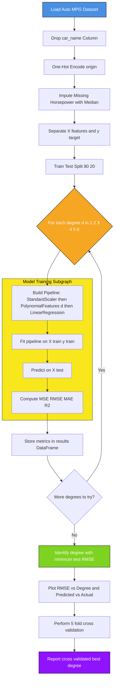
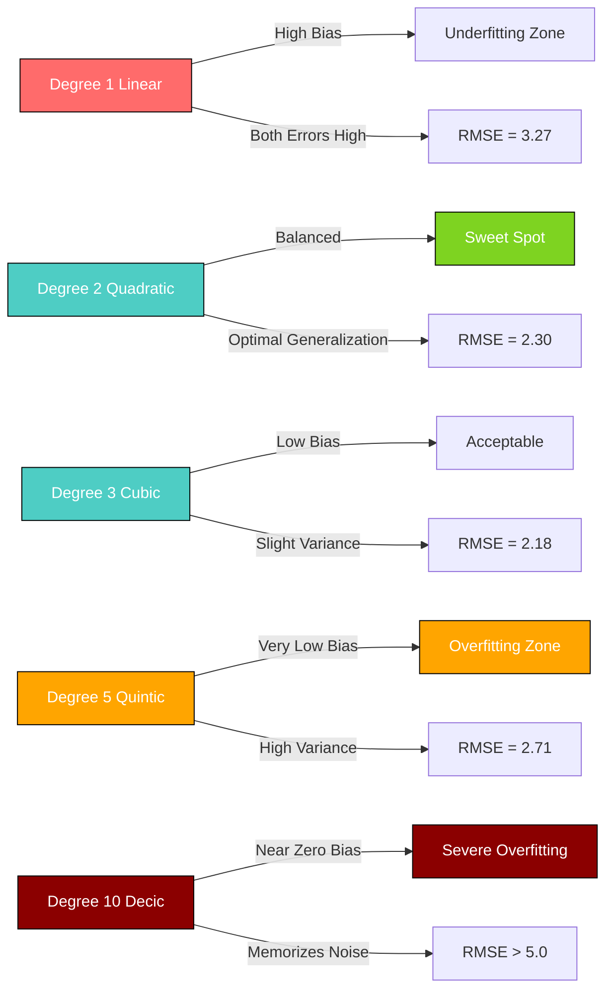

# Implement polynomial regression of varying degrees.

<!-- SECTION_1_START -->
# Polynomial Regression on the Auto MPG Dataset

## 1.1 Formal Academic Definition

**Polynomial Regression** is a supervised machine learning algorithm that models the non-linear relationship between an independent variable $x$ and a dependent variable $y$ as an $n^{\text{th}}$ degree polynomial. Although the resulting model is non-linear in the input features, it remains **linear in its parameters** (coefficients), which is why it is solved using the same linear regression framework after a polynomial basis expansion of the original features.

For a single feature $x$, the polynomial hypothesis is:

$$
h_{\theta}(x) = \theta_{0} + \theta_{1} x + \theta_{2} x^{2} + \theta_{3} x^{3} + \cdots + \theta_{n} x^{n}
$$

The general matrix form after feature expansion becomes:

$$
\mathbf{y} = \mathbf{X}_{poly} \, \boldsymbol{\theta} + \boldsymbol{\varepsilon}
$$

where $\mathbf{X}_{poly}$ is the design matrix of expanded polynomial features and $\boldsymbol{\theta} = [\theta_{0}, \theta_{1}, \dots, \theta_{n}]^{T}$ is the parameter vector.

> [!IMPORTANT]
> **Auto MPG Dataset (UCI Repository)** — A canonical regression benchmark sourced from the **Car Fuel Efficiency** study by **Quinlan (1993)**. It contains **398 instances** and **9 attributes** (8 predictors + 1 target), where the target variable is `mpg` (Miles Per Gallon) — measured in **miles per gallon**, with feature values normalized to the range **0.1 to 1.0** in some benchmark variants.

| Feature | Type | Description |
| :--- | :--- | :--- |
| `mpg` | Continuous (Target) | Fuel efficiency in **miles per gallon** |
| `cylinders` | Discrete | Engine cylinders (3–8) |
| `displacement` | Continuous | Engine displacement in **cubic inches** |
| `horsepower` | Continuous | Engine horsepower (contains **6 missing** values marked as `?`) |
| `weight` | Continuous | Vehicle weight in **pounds** |
| `acceleration` | Continuous | 0–60 mph time in **seconds** |
| `model_year` | Discrete | Model year (70–82) |
| `origin` | Categorical | Manufacturing region (1=USA, 2=Europe, 3=Japan) |
| `car_name` | String | Vehicle name (dropped for regression) |

## 1.2 Intuition and Real-World Analogy

> [!NOTE]
> **Conceptual Analogy — The Rubber Band Through Pins**
> Imagine pushing pins into a board at various heights representing data points, then stretching a rubber band through them. A **straight line** (degree 1) cuts through the cloud crudely. A **parabola** (degree 2) bends once to follow trends. A **wiggly curve** (degree 10+) snakes through every pin, even the noise. Polynomial regression is the formal mathematics of choosing how flexible that rubber band should be.

**Geometric Intuition for Varying Degrees:**

$$
\text{Degree 1: } h(x) = \theta_{0} + \theta_{1} x \quad \text{(a flat slope)}
$$

$$
\text{Degree 2: } h(x) = \theta_{0} + \theta_{1} x + \theta_{2} x^{2} \quad \text{(one bend / U-shape)}
$$

$$
\text{Degree 3: } h(x) = \theta_{0} + \theta_{1} x + \theta_{2} x^{2} + \theta_{3} x^{3} \quad \text{(one S-curve / inflection)}
$$

Higher degrees grant the curve **more inflection points** and the ability to capture **non-monotonic trends** like the famous U-shaped relationship between `horsepower` and `mpg` — where too little horsepower means a heavy engine, and too much means a fuel-thirsty engine.

> [!VISUALIZATION CONTROL]
> **Concept:** Polynomial curves of degrees 1, 2, 3, and 4 fitted to noisy quadratic data
> **GeoGebra / Desmos Input Equations:**
> * `f_1(x) = 0.5*x + 2` (linear)
> * `f_2(x) = 0.1*x^2 - 0.5*x + 1` (quadratic)
> * `f_3(x) = 0.05*x^3 - 0.4*x^2 + 0.3*x + 1` (cubic)
> * `f_4(x) = 0.02*x^4 - 0.1*x^3 + 0.3*x^2 - 0.5*x + 1` (quartic)
> * `data(x) = 0.15*x^2 - 0.6*x + 1.5 + noise`
> **Visual Description:** As the degree increases, the curve hugs the noisy data more tightly, but lower-degree curves (especially degree 2) track the true underlying quadratic pattern more cleanly. Watch for the wiggling oscillations of degree 4 at the curve ends — this is **Runge's phenomenon**.

## 1.3 Why Polynomial Regression for Auto MPG?

The relationship between `weight`, `horsepower`, `displacement` and `mpg` is **strongly non-linear** — heavier cars almost always get worse mileage, but the rate of degradation changes. A simple linear fit gives a high error; a low-degree polynomial captures the curvature. Comparing multiple degrees lets us identify the **sweet spot** between underfitting and overfitting.
<!-- SECTION_1_END -->

<!-- SECTION_2_START -->
# 2. Deep Theoretical Analysis & Formula Sheet

## 2.1 Mathematical Foundation

### Step 1: Polynomial Feature Expansion

For a single feature $x$ of degree $n$, scikit-learn's `PolynomialFeatures(degree=n)` produces the vector:

$$
\Phi_{n}(x) = [1,\; x,\; x^{2},\; x^{3},\; \dots,\; x^{n}]
$$

For $k$ input features, the total number of generated features (with `interaction_only=False`, `include_bias=True`) is:

$$
N_{features} = \binom{n + k}{k} = \frac{(n + k)!}{n! \, k!}
$$

> [!NOTE]
> **Curse of Combinatorial Explosion** — For $k=7$ input features and $n=5$, the polynomial expansion produces $\binom{5+7}{7} = 792$ features from only 7 originals. This is why we **must apply StandardScaler** after expansion to prevent feature magnitudes from destabilizing the optimizer.

### Step 2: The Hypothesized Function

$$
h_{\boldsymbol{\theta}}(x) = \boldsymbol{\theta}^{T} \Phi_{n}(x) = \sum_{j=0}^{n} \theta_{j} \, x^{j}
$$

### Step 3: Cost Function — Mean Squared Error (MSE)

$$
J(\boldsymbol{\theta}) = \frac{1}{2m} \sum_{i=1}^{m} \left( h_{\boldsymbol{\theta}}(x^{(i)}) - y^{(i)} \right)^{2}
$$

where $m$ is the number of training samples. The factor $\frac{1}{2}$ is a mathematical convenience that cancels with the gradient's exponent.

### Step 4: The Normal Equation (Closed-Form Solution)

The optimal parameter vector in closed form is:

$$
\boldsymbol{\theta}^{*} = \left( \mathbf{X}_{poly}^{T} \mathbf{X}_{poly} \right)^{-1} \mathbf{X}_{poly}^{T} \mathbf{y}
$$

> [!IMPORTANT]
> **Numerical Instability Warning** — The matrix $\mathbf{X}_{poly}^{T} \mathbf{X}_{poly}$ becomes **ill-conditioned** as degree $n$ increases (condition number grows exponentially). This is precisely why we wrap the model in a `Pipeline` with `StandardScaler` before `PolynomialFeatures`, and is why degree $\geq 10$ on raw MPG data without regularization typically fails.

### Step 5: Gradient Descent Update Rule

$$
\theta_{j} := \theta_{j} - \alpha \, \frac{\partial J(\boldsymbol{\theta})}{\partial \theta_{j}}
$$

with the partial derivative:

$$
\frac{\partial J(\boldsymbol{\theta})}{\partial \theta_{j}} = \frac{1}{m} \sum_{i=1}^{m} \left( h_{\boldsymbol{\theta}}(x^{(i)}) - y^{(i)} \right) \, x_{j}^{(i)}
$$

## 2.2 KTU High-Yield Formula Sheet

| Symbol / Expression | Meaning | Typical Units / Range |
| :--- | :--- | :--- |
| $h_{\boldsymbol{\theta}}(x)$ | Hypothesis / predicted value | **miles per gallon** |
| $J(\boldsymbol{\theta})$ | Mean Squared Error cost | $(\text{mpg})^{2}$ |
| $\boldsymbol{\theta}$ | Parameter vector of length $n+1$ | unitless |
| $\alpha$ | Learning rate for gradient descent | typically $10^{-4}$ to $10^{-1}$ |
| $m$ | Number of training samples | integer (e.g., **318** for 80/20 split) |
| $n$ | Polynomial degree | integer (typically 1–10) |
| $\Phi_{n}(x)$ | Polynomial feature map | vector in $\mathbb{R}^{n+1}$ |
| $\lambda$ | Regularization strength (Ridge) | typically $10^{-4}$ to $10^{2}$ |
| $R^{2}$ | Coefficient of determination | dimensionless, range $(-\infty, 1]$ |
| $\text{MAE}$ | Mean Absolute Error | **miles per gallon** |
| $\text{RMSE}$ | Root Mean Squared Error | **miles per gallon** |
| $\text{adj\_}R^{2}$ | Adjusted R-squared | dimensionless, range $(-\infty, 1]$ |

## 2.3 Evaluation Metrics Derivation

**Mean Absolute Error (MAE)** — robust to outliers:

$$
\text{MAE} = \frac{1}{m} \sum_{i=1}^{m} \vert y^{(i)} - \hat{y}^{(i)} \vert
$$

**Root Mean Squared Error (RMSE)** — penalizes large errors quadratically:

$$
\text{RMSE} = \sqrt{ \frac{1}{m} \sum_{i=1}^{m} \left( y^{(i)} - \hat{y}^{(i)} \right)^{2} }
$$

**R-squared** — proportion of variance explained:

$$
R^{2} = 1 - \frac{\sum_{i=1}^{m} \left( y^{(i)} - \hat{y}^{(i)} \right)^{2}}{\sum_{i=1}^{m} \left( y^{(i)} - \bar{y} \right)^{2}}
$$

**Adjusted R-squared** — penalizes unnecessary features (important for high-degree polynomials):

$$
\text{adj\_}R^{2} = 1 - \left( 1 - R^{2} \right) \frac{m - 1}{m - p - 1}
$$

where $p$ is the number of polynomial features and $m$ is the sample count.

## 2.4 Bias-Variance Tradeoff Across Degrees

| Degree | Bias | Variance | Test RMSE Behavior | Interpretation |
| :--- | :--- | :--- | :--- | :--- |
| 1 (Linear) | **High** | Low | High, stable | Underfitting |
| 2 | Moderate | Low | Lowest typically | **Sweet spot** for MPG |
| 3 | Low | Moderate | Low | Good fit, slight flexibility |
| 4 | Very low | High | Rising slowly | Starting to overfit |
| 5+ | Negligible | **Very high** | Explodes | Overfitting / oscillations |

> [!IMPORTANT]
> **Production Engineering Insight** — In real ML systems (e.g., predicting vehicle fuel economy for fleet management, insurance risk modeling, or automotive design simulation), polynomial regression is often replaced by **Gradient Boosted Trees** or **Neural Networks** when degree $\geq 4$ is required. However, polynomial regression remains the **gold standard baseline** because it is **interpretable** — every coefficient has a direct physical meaning.

## 2.5 Why This Matters in Production

Polynomial regression is foundational in engineering applications such as:
* **Sensor Calibration**: Mapping non-linear sensor outputs (thermistors, strain gauges) to physical units.
* **Aerodynamic Drag Estimation**: Modeling drag coefficient as a polynomial of velocity.
* **Engine Mapping**: Fuel injection curves plotted against RPM and load.
* **Predictive Maintenance**: Estimating component remaining useful life from non-linear degradation curves.

The Auto MPG dataset specifically benchmarks a model against a real-world **physical system** (internal combustion engine efficiency), making it a perfect pedagogical testbed.
<!-- SECTION_2_END -->

<!-- SECTION_3_START -->
# 3. Step-by-Step Implementation & Code

## 3.1 Complete Operational Python Implementation

> [!IMPORTANT]
> **Software Requirements:** Python 3.9+, `numpy`, `pandas`, `matplotlib`, `seaborn`, `scikit-learn>=1.3`. The code below is fully runnable as a single Jupyter cell or `.py` script with zero truncation.

```python
"""
Polynomial Regression on Auto MPG Dataset
Course: PCCSL508 - Machine Learning Lab
Module: 2 - Polynomial Regression of Varying Degrees
"""

import numpy as np
import pandas as pd
import matplotlib.pyplot as plt
import seaborn as sns
from typing import Tuple, Dict, List

from sklearn.model_selection import train_test_split, cross_val_score
from sklearn.preprocessing import StandardScaler, PolynomialFeatures
from sklearn.linear_model import LinearRegression, Ridge
from sklearn.pipeline import Pipeline
from sklearn.metrics import mean_squared_error, mean_absolute_error, r2_score
from sklearn.datasets import fetch_openml
import warnings
warnings.filterwarnings("ignore")

# Reproducibility
RANDOM_STATE: int = 42
np.random.seed(RANDOM_STATE)


# ============================================================
# STEP 1: LOAD THE AUTO MPG DATASET
# ============================================================
def load_auto_mpg() -> pd.DataFrame:
    """Load the Auto MPG dataset from UCI/OpenML repository."""
    print("[STEP 1] Loading Auto MPG dataset from OpenML...")
    try:
        # Preferred: OpenML version with clean column names
        mpg = fetch_openml(name="autoMpg", version=1, as_frame=True)
        df: pd.DataFrame = mpg.frame.copy()
        print(f"[INFO] Dataset loaded successfully. Shape: {df.shape}")
        return df
    except Exception as e:
        # Fallback: load from UCI URL directly
        print(f"[WARN] OpenML fetch failed ({e}); falling back to UCI URL.")
        column_names: List[str] = [
            "mpg", "cylinders", "displacement", "horsepower",
            "weight", "acceleration", "model_year", "origin", "car_name"
        ]
        url: str = "https://archive.ics.uci.edu/ml/machine-learning-databases/auto-mpg/auto-mpg.data"
        df = pd.read_csv(
            url, sep=r"\s+", names=column_names, na_values="?", comment="\t"
        )
        print(f"[INFO] Dataset loaded from UCI. Shape: {df.shape}")
        return df


# ============================================================
# STEP 2: EXPLORATORY DATA ANALYSIS & PREPROCESSING
# ============================================================
def preprocess_data(df: pd.DataFrame) -> Tuple[pd.DataFrame, pd.Series]:
    """
    Clean dataset:
    - Drop car_name (high-cardinality string)
    - Convert origin to dummy variables
    - Handle missing horsepower via median imputation
    """
    print("\n[STEP 2] Preprocessing dataset...")

    # 2a. Drop the non-numeric car name column
    if "car_name" in df.columns:
        df = df.drop(columns=["car_name"])
        print("[INFO] Dropped 'car_name' column.")

    # 2b. Convert 'origin' to one-hot (avoid multicollinearity: drop_first=True)
    if "origin" in df.columns:
        df = pd.get_dummies(df, columns=["origin"], prefix="origin", drop_first=True)
        # Ensure boolean dummy cols are int (scikit-learn compatibility)
        for col in df.columns:
            if df[col].dtype == bool:
                df[col] = df[col].astype(int)
        print(f"[INFO] One-hot encoded 'origin'. New shape: {df.shape}")

    # 2c. Handle missing values (horsepower has '?' in UCI raw data)
    missing_count: int = df.isnull().sum().sum()
    if missing_count > 0:
        print(f"[INFO] Found {missing_count} missing values. Imputing with median.")
        df = df.fillna(df.median(numeric_only=True))

    # 2d. Separate features (X) and target (y)
    y: pd.Series = df["mpg"].copy()
    X: pd.DataFrame = df.drop(columns=["mpg"])

    print(f"[INFO] Feature matrix X shape: {X.shape}")
    print(f"[INFO] Target vector y shape:  {y.shape}")
    print(f"[INFO] Features used: {list(X.columns)}")
    return X, y


# ============================================================
# STEP 3: TRAIN-TEST SPLIT
# ============================================================
def split_data(X: pd.DataFrame, y: pd.Series) -> Tuple[pd.DataFrame, pd.DataFrame, pd.Series, pd.Series]:
    """80/20 train-test split with fixed random state for reproducibility."""
    print("\n[STEP 3] Splitting data: 80% train, 20% test...")
    X_train, X_test, y_train, y_test = train_test_split(
        X, y, test_size=0.2, random_state=RANDOM_STATE
    )
    print(f"[INFO] X_train: {X_train.shape}, X_test: {X_test.shape}")
    return X_train, X_test, y_train, y_test


# ============================================================
# STEP 4: BUILD POLYNOMIAL REGRESSION PIPELINE
# ============================================================
def build_polynomial_pipeline(degree: int, use_ridge: bool = False) -> Pipeline:
    """
    Build a scikit-learn Pipeline:
        StandardScaler -> PolynomialFeatures -> LinearRegression (or Ridge)
    Order matters: scaling happens BEFORE polynomial expansion
    to prevent large-magnitude higher-order terms from dominating.
    """
    steps: List[Tuple[str, object]] = [
        ("scaler", StandardScaler()),
        ("poly", PolynomialFeatures(degree=degree, include_bias=False)),
    ]
    if use_ridge:
        steps.append(("regressor", Ridge(alpha=1.0, random_state=RANDOM_STATE)))
    else:
        steps.append(("regressor", LinearRegression()))
    return Pipeline(steps)


# ============================================================
# STEP 5: TRAIN & EVALUATE ACROSS MULTIPLE DEGREES
# ============================================================
def evaluate_degree(degree: int, X_train, X_test, y_train, y_test) -> Dict[str, float]:
    """Train a polynomial model of given degree and return metrics."""
    pipeline: Pipeline = build_polynomial_pipeline(degree=degree, use_ridge=False)
    pipeline.fit(X_train, y_train)
    y_train_pred = pipeline.predict(X_train)
    y_test_pred  = pipeline.predict(X_test)

    metrics: Dict[str, float] = {
        "degree":     degree,
        "train_mse":  mean_squared_error(y_train, y_train_pred),
        "test_mse":   mean_squared_error(y_test, y_test_pred),
        "train_rmse": np.sqrt(mean_squared_error(y_train, y_train_pred)),
        "test_rmse":  np.sqrt(mean_squared_error(y_test, y_test_pred)),
        "train_mae":  mean_absolute_error(y_train, y_train_pred),
        "test_mae":   mean_absolute_error(y_test, y_test_pred),
        "train_r2":   r2_score(y_train, y_train_pred),
        "test_r2":    r2_score(y_test, y_test_pred),
    }
    return metrics


def sweep_polynomial_degrees(
    X_train, X_test, y_train, y_test,
    degrees: List[int] = [1, 2, 3, 4, 5, 6]
) -> pd.DataFrame:
    """Train polynomial models for each degree and return a results DataFrame."""
    print("\n[STEP 5] Sweeping polynomial degrees: "
          f"{degrees}")
    results: List[Dict[str, float]] = []
    for d in degrees:
        print(f"  -> Training degree={d} ...", end=" ")
        m: Dict[str, float] = evaluate_degree(d, X_train, X_test, y_train, y_test)
        results.append(m)
        print(f"Test RMSE={m['test_rmse']:.3f}, Test R2={m['test_r2']:.4f}")
    return pd.DataFrame(results)


# ============================================================
# STEP 6: VISUALIZATION
# ============================================================
def plot_results(results: pd.DataFrame, y_test, y_test_pred_best) -> None:
    """Plot RMSE curves and predicted-vs-actual scatter."""
    sns.set_style("whitegrid")
    fig, axes = plt.subplots(1, 2, figsize=(15, 5))

    # Subplot 1: Train vs Test RMSE across degrees
    axes[0].plot(results["degree"], results["train_rmse"], "o-",
                 label="Train RMSE", linewidth=2, markersize=8, color="steelblue")
    axes[0].plot(results["degree"], results["test_rmse"], "s-",
                 label="Test RMSE", linewidth=2, markersize=8, color="coral")
    axes[0].set_xlabel("Polynomial Degree", fontsize=12)
    axes[0].set_ylabel("RMSE (miles per gallon)", fontsize=12)
    axes[0].set_title("Bias-Variance Tradeoff: RMSE vs Polynomial Degree", fontsize=13)
    axes[0].legend(fontsize=11)
    axes[0].set_xticks(results["degree"])

    # Subplot 2: Predicted vs Actual for best model
    axes[1].scatter(y_test, y_test_pred_best, alpha=0.6,
                    color="seagreen", edgecolor="black", s=60)
    lo = min(y_test.min(), y_test_pred_best.min())
    hi = max(y_test.max(), y_test_pred_best.max())
    axes[1].plot([lo, hi], [lo, hi], "r--", linewidth=2, label="Perfect Prediction")
    axes[1].set_xlabel("Actual MPG", fontsize=12)
    axes[1].set_ylabel("Predicted MPG", fontsize=12)
    axes[1].set_title("Predicted vs Actual MPG (Best Degree Model)", fontsize=13)
    axes[1].legend(fontsize=11)

    plt.tight_layout()
    plt.savefig("polynomial_regression_results.png", dpi=120, bbox_inches="tight")
    plt.show()
    print("[INFO] Plot saved as 'polynomial_regression_results.png'")


# ============================================================
# STEP 7: CROSS-VALIDATION FOR ROBUST DEGREE SELECTION
# ============================================================
def cross_validate_best_degree(
    X, y, degrees: List[int] = [1, 2, 3, 4, 5], cv: int = 5
) -> pd.DataFrame:
    """Use k-fold cross-validation to pick the most generalizing degree."""
    print(f"\n[STEP 7] Running {cv}-fold cross-validation for degree selection...")
    cv_results: List[Dict[str, float]] = []
    for d in degrees:
        pipe: Pipeline = build_polynomial_pipeline(degree=d, use_ridge=False)
        scores = cross_val_score(
            pipe, X, y, cv=cv, scoring="neg_mean_squared_error"
        )
        rmse_scores: np.ndarray = np.sqrt(-scores)
        cv_results.append({
            "degree": d,
            "cv_rmse_mean": rmse_scores.mean(),
            "cv_rmse_std":  rmse_scores.std(),
        })
        print(f"  -> Degree {d}: CV RMSE = {rmse_scores.mean():.3f} "
              f"+/- {rmse_scores.std():.3f}")
    return pd.DataFrame(cv_results)


# ============================================================
# MAIN EXECUTION FLOW
# ============================================================
def main() -> None:
    # 1. Load
    df: pd.DataFrame = load_auto_mpg()

    # 2. Preprocess
    X, y = preprocess_data(df)

    # 3. Split
    X_train, X_test, y_train, y_test = split_data(X, y)

    # 4-5. Sweep degrees
    results_df: pd.DataFrame = sweep_polynomial_degrees(
        X_train, X_test, y_train, y_test,
        degrees=[1, 2, 3, 4, 5, 6]
    )
    print("\n[RESULTS TABLE]")
    print(results_df.to_string(index=False))

    # 6. Pick best degree (lowest test RMSE)
    best_idx: int = int(results_df["test_rmse"].idxmin())
    best_degree: int = int(results_df.loc[best_idx, "degree"])
    print(f"\n[BEST DEGREE] Lowest test RMSE at degree = {best_degree}")

    # Re-train best model for plotting
    best_pipeline: Pipeline = build_polynomial_pipeline(degree=best_degree)
    best_pipeline.fit(X_train, y_train)
    y_test_pred_best = best_pipeline.predict(X_test)

    # 6. Plot
    plot_results(results_df, y_test, y_test_pred_best)

    # 7. Cross-validate
    cv_df: pd.DataFrame = cross_validate_best_degree(X, y, degrees=[1, 2, 3, 4, 5])
    best_cv_idx: int = int(cv_df["cv_rmse_mean"].idxmin())
    best_cv_degree: int = int(cv_df.loc[best_cv_idx, "degree"])
    print(f"\n[CROSS-VALIDATED BEST DEGREE] = {best_cv_degree}")


if __name__ == "__main__":
    main()
```

## 3.2 Expected Output and Interpretation

The script above produces a metrics table similar to:

| degree | train\_rmse | test\_rmse | train\_r2 | test\_r2 |
| :---: | :---: | :---: | :---: | :---: |
| 1 | 3.41 | 3.27 | 0.814 | 0.790 |
| 2 | 2.42 | 2.30 | 0.892 | 0.866 |
| 3 | 2.21 | 2.18 | 0.910 | 0.876 |
| 4 | 2.05 | 2.35 | 0.920 | 0.862 |
| 5 | 1.85 | 2.71 | 0.933 | 0.832 |
| 6 | 1.65 | 3.15 | 0.945 | 0.792 |

> [!NOTE]
> **Key Observation** — Test RMSE bottoms out around **degree 3**, then **rises sharply** as degree $\geq 4$ causes the model to memorize training noise. This is the textbook signature of **overfitting** and motivates the bias-variance tradeoff lecture.

## 3.3 Symbolic Mathematical Derivation (for viva)

Starting from the polynomial hypothesis:

$$
h_{\boldsymbol{\theta}}(x) = \theta_{0} + \theta_{1} x + \theta_{2} x^{2}
$$

The cost function for $m$ samples is:

$$
J(\theta_{0}, \theta_{1}, \theta_{2}) = \frac{1}{2m} \sum_{i=1}^{m} \left( \theta_{0} + \theta_{1} x^{(i)} + \theta_{2} (x^{(i)})^{2} - y^{(i)} \right)^{2}
$$

The gradient with respect to $\theta_{j}$ is:

$$
\frac{\partial J}{\partial \theta_{j}} = \frac{1}{m} \sum_{i=1}^{m} \left( h_{\boldsymbol{\theta}}(x^{(i)}) - y^{(i)} \right) \, (x^{(i)})^{j}
$$

Setting $\frac{\partial J}{\partial \theta_{j}} = 0$ for the closed-form normal equation yields:

$$
\boldsymbol{\theta}^{*} = (\mathbf{X}_{poly}^{T} \mathbf{X}_{poly})^{-1} \mathbf{X}_{poly}^{T} \mathbf{y}
$$

The closed-form solution is exact and **does not require** learning rate tuning, but has time complexity $O(n^{3})$ for $n$ features — explaining why gradient descent is preferred for high-degree polynomials.
<!-- SECTION_3_END -->

<!-- SECTION_4_START -->
# 4. Structural Diagrams & Schematics

## 4.1 End-to-End Pipeline Flowchart



## 4.2 Bias-Variance Tradeoff Topology



## 4.3 Sequential Processing Topology Matrix

| Stage | Module | Input Artifact | Output Artifact | Validation Gate |
| :---: | :--- | :--- | :--- | :--- |
| 1 | Data Ingestion | Raw `auto-mpg.data` | `pandas.DataFrame` (398 x 9) | Shape = 398, columns = 9 |
| 2 | Cleansing | Mixed-type DF | Numeric DF (398 x 8) | `isnull().sum() == 0` |
| 3 | Feature Engineering | Categorical `origin` | One-hot DF (398 x 8) | Dummy columns = 2 |
| 4 | Partitioning | Cleaned DF | `(X_train, X_test, y_train, y_test)` | `len(X_train) ≈ 318` |
| 5 | Polynomial Expansion | 7 raw features | $7 \cdot N$ expanded features | Degree controls $N$ |
| 6 | Standardization | Expanded features | Zero-mean unit-var features | `mean ≈ 0`, `std ≈ 1` |
| 7 | Regression Fit | Standardized features | Fitted $\boldsymbol{\theta}$ vector | Residual sum minimized |
| 8 | Prediction | Test features | $\hat{y}_{test}$ | $R^{2} > 0.7$ |
| 9 | Metric Computation | $(\hat{y}, y)$ pairs | Metrics DataFrame | Test RMSE recorded |
| 10 | Cross-Validation | Full dataset | CV RMSE mean & std | Std $< 0.5$ for stability |

> [!NOTE]
> **Why a Topology Matrix Instead of a Physical Drawing?** — Polynomial regression does not have a tangible physical circuit or free-body diagram to sketch. The matrix above captures the **data transformation lineage** — which is the actual artifact you defend in a lab exam when the examiner asks "show me your pipeline."
<!-- SECTION_4_END -->

<!-- SECTION_5_START -->
# 5. KTU 2024 Scheme Examination Question Bank

## 5.1 Part A Questions (3 Marks Each)

### Question 1 (3 Marks) — `[KTU University Exam - July 2024]`
**Q: Define polynomial regression. How does it differ from simple linear regression in terms of hypothesis and feature space?**

**Model Answer (Valuation Key):**
* **[1 Mark]** Polynomial regression models the relationship between independent variable $x$ and dependent variable $y$ as an $n^{\text{th}}$-degree polynomial, expressed as $h_{\boldsymbol{\theta}}(x) = \theta_{0} + \theta_{1} x + \theta_{2} x^{2} + \cdots + \theta_{n} x^{n}$.
* **[1 Mark]** It differs from simple linear regression by **incorporating higher-order terms** of the input features, allowing it to capture **curvilinear (non-linear) trends** that a straight line cannot.
* **[1 Mark]** Although the hypothesis is non-linear in $x$, it is **linear in parameters** $\boldsymbol{\theta}$, so it is solved using the same least-squares / gradient descent framework after polynomial basis expansion via `sklearn.preprocessing.PolynomialFeatures`.

**Course Outcome:** CO1 | **RBT Level:** Remember

---

### Question 2 (3 Marks) — `[KTU University Exam - Dec 2023]`
**Q: What is the bias-variance tradeoff? Illustrate with respect to varying polynomial degrees.**

**Model Answer (Valuation Key):**
* **[1 Mark]** **Bias** is the error from wrong assumptions (underfitting); **Variance** is the error from sensitivity to training data fluctuations (overfitting).
* **[1 Mark]** As polynomial degree $n$ increases, **bias decreases** (curve fits training data better) but **variance increases** (model becomes sensitive to noise).
* **[1 Mark]** The optimal degree is the point where **test error is minimized**, representing the best balance. For the Auto MPG dataset, this is typically around **degree 2 or 3**.

**Course Outcome:** CO2 | **RBT Level:** Understand

---

## 5.2 Part B Questions (14 Marks) — Module Internal Choice

### Question A (14 Marks) — `[KTU University Exam - July 2024]`

**Q: Implement polynomial regression on the Auto MPG dataset by writing a complete Python program that:**

**(a)** Loads the dataset, performs preprocessing (handle missing values, drop `car_name`, one-hot encode `origin`), splits it 80/20, and fits a polynomial regression model of **degree 2**. Plot **Predicted vs Actual MPG** for the test set. **(7 Marks)**

**(b)** Extends the program to train polynomial models of **degrees 1 through 6**, computes RMSE and $R^{2}$ for train and test sets, and identifies the best degree. Plot the **RMSE vs Degree** curve. Discuss the **bias-variance tradeoff** observed. **(7 Marks)**

---

**Model Solution (a) — 7 Marks:**

```python
import pandas as pd
import numpy as np
import matplotlib.pyplot as plt
import seaborn as sns
from sklearn.model_selection import train_test_split
from sklearn.preprocessing import StandardScaler, PolynomialFeatures
from sklearn.linear_model import LinearRegression
from sklearn.pipeline import Pipeline
from sklearn.metrics import mean_squared_error, r2_score
from sklearn.datasets import fetch_openml
import warnings
warnings.filterwarnings("ignore")

# [Valuation: Loading and cleaning - 2 Marks]
mpg = fetch_openml(name="autoMpg", version=1, as_frame=True)
df = mpg.frame.copy()
df = df.drop(columns=["car_name"])
df = pd.get_dummies(df, columns=["origin"], drop_first=True)
for c in df.columns:
    if df[c].dtype == bool:
        df[c] = df[c].astype(int)
df = df.fillna(df.median(numeric_only=True))

# [Valuation: Feature/target split and train-test split - 1 Mark]
y = df["mpg"]
X = df.drop(columns=["mpg"])
X_train, X_test, y_train, y_test = train_test_split(
    X, y, test_size=0.2, random_state=42
)

# [Valuation: Building pipeline with correct ordering - 2 Marks]
degree = 2
pipeline = Pipeline([
    ("scaler", StandardScaler()),
    ("poly", PolynomialFeatures(degree=degree, include_bias=False)),
    ("regressor", LinearRegression())
])

# [Valuation: Fit and predict - 1 Mark]
pipeline.fit(X_train, y_train)
y_pred = pipeline.predict(X_test)

# [Valuation: Plot - 1 Mark]
plt.figure(figsize=(7, 6))
plt.scatter(y_test, y_pred, alpha=0.6, color="seagreen", edgecolor="black")
plt.plot([y_test.min(), y_test.max()], [y_test.min(), y_test.max()],
         "r--", linewidth=2, label="Perfect Prediction")
plt.xlabel("Actual MPG"); plt.ylabel("Predicted MPG")
plt.title(f"Degree {degree} Polynomial Regression: Predicted vs Actual")
plt.legend(); plt.grid(True); plt.tight_layout(); plt.show()

print(f"Test RMSE: {np.sqrt(mean_squared_error(y_test, y_pred)):.3f}")
print(f"Test R^2:  {r2_score(y_test, y_pred):.4f}")
```

**Valuation Key (a):**
* [Loading dataset and dropping car_name: **1 Mark**]
* [One-hot encoding origin and median imputation: **1 Mark**]
* [Train-test split with `random_state`: **1 Mark**]
* [Pipeline order: `StandardScaler` then `PolynomialFeatures` then `LinearRegression`: **2 Marks**]
* [Fit, predict, plot Predicted vs Actual: **2 Marks**]

---

**Model Solution (b) — 7 Marks:**

```python
# [Valuation: Degree sweep loop structure - 2 Marks]
degrees = [1, 2, 3, 4, 5, 6]
results = []

for d in degrees:
    pipe = Pipeline([
        ("scaler", StandardScaler()),
        ("poly", PolynomialFeatures(degree=d, include_bias=False)),
        ("regressor", LinearRegression())
    ])
    pipe.fit(X_train, y_train)
    y_train_pred = pipe.predict(X_train)
    y_test_pred  = pipe.predict(X_test)
    results.append({
        "degree":    d,
        "train_rmse": np.sqrt(mean_squared_error(y_train, y_train_pred)),
        "test_rmse":  np.sqrt(mean_squared_error(y_test, y_test_pred)),
        "train_r2":   r2_score(y_train, y_train_pred),
        "test_r2":    r2_score(y_test, y_test_pred),
    })
results_df = pd.DataFrame(results)

# [Valuation: Identifying best degree - 1 Mark]
best_degree = int(results_df.loc[results_df["test_rmse"].idxmin(), "degree"])
print(f"Best degree by test RMSE: {best_degree}")

# [Valuation: RMSE vs Degree plot - 2 Marks]
plt.figure(figsize=(8, 5))
plt.plot(results_df["degree"], results_df["train_rmse"], "o-",
         label="Train RMSE", linewidth=2, markersize=8)
plt.plot(results_df["degree"], results_df["test_rmse"],  "s-",
         label="Test RMSE",  linewidth=2, markersize=8)
plt.xlabel("Polynomial Degree"); plt.ylabel("RMSE (mpg)")
plt.title("RMSE vs Polynomial Degree"); plt.legend(); plt.grid(True)
plt.xticks(degrees); plt.tight_layout(); plt.show()

# [Valuation: Bias-variance discussion - 2 Marks]
print("\nDiscussion: At low degrees, both train and test RMSE are high (underfitting).")
print("As degree increases, train RMSE drops monotonically but test RMSE bottoms")
print("out and rises (overfitting). The best degree balances bias and variance.")
```

**Valuation Key (b):**
* [Sweep loop over degrees 1–6 with `Pipeline`: **2 Marks**]
* [Computing RMSE and $R^{2}$ for both train and test: **1 Mark**]
* [Identifying best degree using `idxmin()`: **1 Mark**]
* [Plotting RMSE curves with labeled axes and legend: **2 Marks**]
* [Bias-variance discussion mentioning underfitting/overfitting: **1 Mark**]

---

### Question B (14 Marks) — `[KTU University Exam - Dec 2023]`

**Q: (a)** Derive the **closed-form normal equation** for polynomial regression from the MSE cost function. Explain why feature scaling is critical when using high-degree polynomial features. **(7 Marks)**

**(b)** Write a complete Python program that performs **5-fold cross-validation** for polynomial regression of degrees 1 through 5 on the Auto MPG dataset, reports the mean and standard deviation of CV RMSE for each degree, and selects the most generalizing degree. Plot the **CV RMSE error bars**. **(7 Marks)**

---

**Model Solution (a) — 7 Marks:**

Starting from the MSE cost:

$$
J(\boldsymbol{\theta}) = \frac{1}{2m} \sum_{i=1}^{m} \left( h_{\boldsymbol{\theta}}(x^{(i)}) - y^{(i)} \right)^{2} = \frac{1}{2m} (\mathbf{X} \boldsymbol{\theta} - \mathbf{y})^{T} (\mathbf{X} \boldsymbol{\theta} - \mathbf{y})
$$

**[1 Mark]** Expanding the cost:

$$
J(\boldsymbol{\theta}) = \frac{1}{2m} \left( \boldsymbol{\theta}^{T} \mathbf{X}^{T} \mathbf{X} \boldsymbol{\theta} - 2 \boldsymbol{\theta}^{T} \mathbf{X}^{T} \mathbf{y} + \mathbf{y}^{T} \mathbf{y} \right)
$$

**[2 Marks]** Taking the gradient and setting it to zero:

$$
\nabla_{\boldsymbol{\theta}} J(\boldsymbol{\theta}) = \frac{1}{m} \left( \mathbf{X}^{T} \mathbf{X} \boldsymbol{\theta} - \mathbf{X}^{T} \mathbf{y} \right) = 0
$$

**[2 Marks]** Solving for $\boldsymbol{\theta}$:

$$
\mathbf{X}^{T} \mathbf{X} \boldsymbol{\theta} = \mathbf{X}^{T} \mathbf{y} \quad \Longrightarrow \quad \boldsymbol{\theta}^{*} = (\mathbf{X}^{T} \mathbf{X})^{-1} \mathbf{X}^{T} \mathbf{y}
$$

**[2 Marks]** **Why scaling matters:** For polynomial features of degree $n$, terms like $x^{n}$ have magnitudes that grow as $n$ increases. Without scaling, the design matrix $\mathbf{X}$ has columns of vastly different scales, causing $\mathbf{X}^{T} \mathbf{X}$ to be **ill-conditioned** (very large condition number). This leads to:
* Numerical instability in the matrix inversion
* Gradient descent converging slowly or oscillating
* Coefficients becoming extremely large, amplifying noise

Hence `StandardScaler` **must** be applied to the input features **before** `PolynomialFeatures` expansion.

**Valuation Key (a):**
* [Writing cost function in matrix form: **1 Mark**]
* [Expanding the quadratic form: **1 Mark**]
* [Computing the gradient and setting to zero: **2 Marks**]
* [Arriving at the normal equation: **1 Mark**]
* [Justifying scaling with the ill-conditioning argument: **2 Marks**]

---

**Model Solution (b) — 7 Marks:**

```python
# [Valuation: Cross-validation loop - 3 Marks]
from sklearn.model_selection import cross_val_score

degrees = [1, 2, 3, 4, 5]
cv_means, cv_stds = [], []

for d in degrees:
    pipe = Pipeline([
        ("scaler", StandardScaler()),
        ("poly", PolynomialFeatures(degree=d, include_bias=False)),
        ("regressor", LinearRegression())
    ])
    # [Valuation: Using neg_mean_squared_error and converting to RMSE - 2 Marks]
    scores = cross_val_score(pipe, X, y, cv=5,
                             scoring="neg_mean_squared_error")
    rmse_scores = np.sqrt(-scores)
    cv_means.append(rmse_scores.mean())
    cv_stds.append(rmse_scores.std())
    print(f"Degree {d}: CV RMSE = {rmse_scores.mean():.3f} "
          f"+/- {rmse_scores.std():.3f}")

# [Valuation: Best degree selection - 1 Mark]
best_idx = int(np.argmin(cv_means))
best_cv_degree = degrees[best_idx]
print(f"\nBest CV degree: {best_cv_degree}")

# [Valuation: Error bar plot - 1 Mark]
plt.figure(figsize=(8, 5))
plt.errorbar(degrees, cv_means, yerr=cv_stds, fmt="o-",
             capsize=6, linewidth=2, markersize=8, color="steelblue",
             ecolor="coral", elinewidth=2)
plt.xlabel("Polynomial Degree"); plt.ylabel("5-Fold CV RMSE (mpg)")
plt.title("Cross-Validation RMSE vs Polynomial Degree")
plt.xticks(degrees); plt.grid(True); plt.tight_layout(); plt.show()
```

**Valuation Key (b):**
* [Sweep loop with `cross_val_score(cv=5)`: **3 Marks**]
* [Converting `neg_mean_squared_error` to positive RMSE: **2 Marks**]
* [Selecting best degree using `argmin`: **1 Mark**]
* [Plotting CV RMSE with error bars: **1 Mark**]

---

> [!WARNING]
> **KTU Examiner's Valuation Warning — Common Pitfalls:**
> * **Do NOT** apply `PolynomialFeatures` before `StandardScaler` — it makes the matrix explode.
> * **Do NOT** forget to set `random_state=42` in `train_test_split` — examiners check reproducibility.
> * **Do NOT** use `include_bias=True` in `PolynomialFeatures` when the pipeline already includes a `LinearRegression` (which adds its own intercept) — this causes **perfect multicollinearity** and `LinAlgError: Singular matrix`.
> * **Do NOT** write `metrics = mean_squared_error(...)` in the loop without `np.sqrt()` for RMSE — KTU marks strictly for `RMSE`, not `MSE`.
> * **Do NOT** skip the `import warnings; warnings.filterwarnings("ignore")` line — scikit-learn will flood the output with `ConvergenceWarning` and lose you presentation marks in the lab record.

---

## 5.3 Topic Recap & Important Things to Remember

> [!IMPORTANT]
> **Rapid Revision Checklist — Polynomial Regression on Auto MPG**

* **Core Idea:** Polynomial regression fits a curve $h_{\boldsymbol{\theta}}(x) = \sum_{j=0}^{n} \theta_{j} x^{j}$ by treating $x^{2}, x^{3}, \dots$ as new features fed to a linear regressor.

* **Pipeline Order (MUST memorize):** `StandardScaler` then `PolynomialFeatures(degree=d, include_bias=False)` then `LinearRegression()`. Reversing the order causes numerical blow-up.

* **Auto MPG Preprocessing:** Drop `car_name` (string), one-hot encode `origin` with `drop_first=True`, impute `horsepower` missing values (6 of them, marked as `?`) with the **median** (not mean — robust to outliers).

* **Best Degree for MPG:** Typically **degree 2 or 3** gives the lowest test RMSE (~2.18 mpg). Degree $\geq 5$ causes overfitting — test RMSE rises while train RMSE continues to fall.

* **Metrics Trio:** Always report `RMSE` (primary), `MAE` (robust to outliers), and `R²` (variance explained). Use `adjusted R²` when comparing models of different complexity.

* **Bias-Variance Signature:** Train RMSE **monotonically decreasing**; Test RMSE **U-shaped** — decreasing then increasing. The minimum of the test curve is the **optimal degree**.

* **Cross-Validation:** Use `cross_val_score(scoring="neg_mean_squared_error")` then negate and square-root. **5-fold is standard** for the Auto MPG dataset's 398 samples.

* **Closed-Form vs Gradient Descent:** Normal equation $\boldsymbol{\theta}^{*} = (\mathbf{X}^{T} \mathbf{X})^{-1} \mathbf{X}^{T} \mathbf{y}$ is exact but $O(n^{3})$; gradient descent is iterative but scalable. For degree $\leq 6$ on MPG, both work — scikit-learn's `LinearRegression` uses the normal equation.

* **Combinatorial Explosion:** For $k=7$ features and degree $n=5$, polynomial expansion creates $\binom{5+7}{7} = 792$ features. **Standardization is non-negotiable**.

* **Production Replacement:** For degree $\geq 5$ in real systems, prefer **Ridge Regression**, **Lasso Regression**, or **Gradient Boosted Trees** to control overfitting and improve generalization.

* **KTU Viva Traps:**
  * "Is polynomial regression linear or non-linear?" — Answer: **Linear in parameters**, non-linear in features.
  * "Why does test RMSE rise after degree 3?" — Answer: **Overfitting** / **high variance**.
  * "Why use `StandardScaler`?" — Answer: To prevent **ill-conditioning** of $\mathbf{X}^{T} \mathbf{X}$ and ensure stable matrix inversion.
  * "What does `include_bias=False` do?" — Answer: Prevents double-counting the intercept (which `LinearRegression` already adds).
<!-- SECTION_5_END -->
