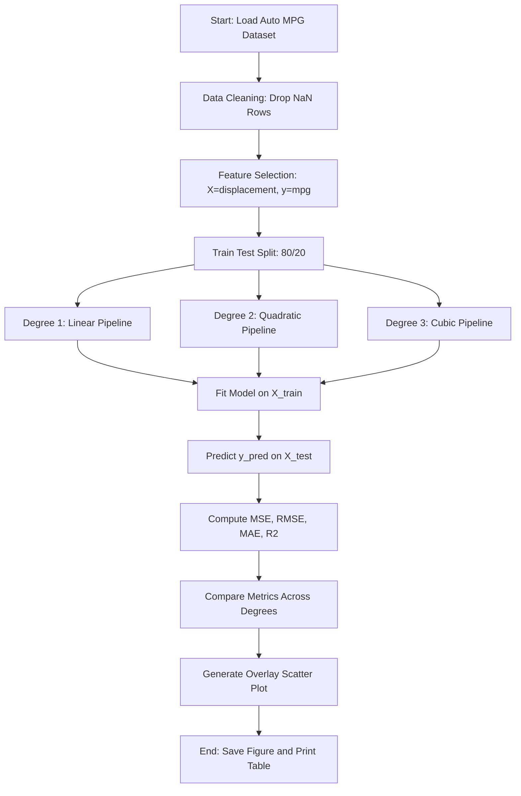
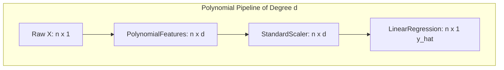
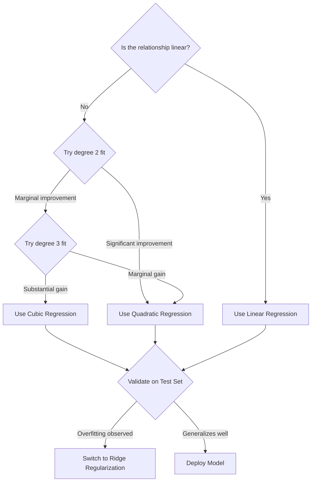

# Implement polynomial regression on the Auto MPG dataset to predict miles per gallon (MPG) based on engine displacement. Compare polynomial regression results with linear regression.

<!-- SECTION_1_START -->

# Polynomial Regression on Auto MPG Dataset

## 1.1 Formal Academic Definition (KTU 2024 Aligned)

> [!IMPORTANT]
> **Polynomial Regression** is a specialized form of *multiple linear regression* in which the relationship between the independent variable $\mathbf{x}$ and the dependent variable $\mathbf{y}$ is modelled as an $\mathbf{n^{th}}$ degree polynomial. The regression coefficients are still linear in parameters, but the feature space is expanded to include higher-order powers of the original predictor.

Formally, for a single predictor $x$, a polynomial regression of degree $d$ is given by:

$$y = \beta_0 + \beta_1 x + \beta_2 x^2 + \beta_3 x^3 + \dots + \beta_d x^d + \epsilon$$

where $\epsilon \sim \mathcal{N}(0, \sigma^2)$ is the residual error term, and the coefficients $\beta_0, \beta_1, \dots, \beta_d$ are estimated using **Ordinary Least Squares (OLS)** by minimizing the sum of squared residuals.

> [!NOTE]
> **KTU 2024 Lab Module 2 Highlight:** The Auto MPG dataset is a canonical regression benchmark from the *UCI Machine Learning Repository*. For this experiment, the predictor variable is **engine displacement** (cubic inches) and the response variable is **miles per gallon (MPG)**.

## 1.2 Conceptual Analogy & Intuition

Imagine a group of friends standing in a line on a road. If you try to "best fit" a *straight stick* through the line of people, you'll always leave some people on either side of the stick. That straight stick is **Linear Regression**.

Now imagine using a *flexible piece of wire* that can bend into a curve. You can weave it through the line of people, touching nearly everyone. That flexible wire is **Polynomial Regression**. The higher the *degree* of the polynomial, the more flexible the wire becomes, but if it bends too much, it tries to pass through *every* point — leading to **overfitting**.

> [!TIP]
> **Geometric Intuition:** A *line* (degree 1) is rigid, a *parabola* (degree 2) has one bend, a *cubic* (degree 3) has two bends. Each additional degree adds a bend, increasing flexibility.

## 1.3 Key Terminology & Constants

- **MPG**: Miles Per Gallon — a measure of fuel efficiency.
- **Displacement**: Total volume swept by all engine cylinders (cubic inches). Larger displacement generally implies lower MPG.
- **MSE**: Mean Squared Error, $\text{MSE} = \frac{1}{n}\sum_{i=1}^{n}(y_i - \hat{y}_i)^2$.
- **$R^2$ Score**: Coefficient of determination, ranges from $0$ to $1$, where $1$ indicates perfect prediction.
- **Regularization Parameter $\lambda$**: Used in Ridge/Lasso to penalize large polynomial coefficients (out of scope for this lab, but mentioned in theory).

> [!VISUALIZATION CONTROL]
> **Concept:** Polynomial curve fitting on a 2D scatter plot.
> **GeoGebra / Desmos Input Equations:**
> * `f(x) = 0.05*(x-250)^2 - 5*(x-250) + 30` (a sample degree-2 fit)
> * `g(x) = 0.0001*x^3 - 0.05*x^2 + 8*x - 350` (a sample degree-3 fit)
> **Visual Description:** The student should observe a *U-shaped* parabolic curve for the quadratic fit, capturing the non-linear decline of MPG as displacement increases, contrasted with a straight line that cuts diagonally across the data cloud.

<!-- SECTION_1_END -->

<!-- SECTION_2_START -->

# Deep Theoretical Analysis & KTU High-Yield Formula Sheet

## 2.1 Mathematical Foundation

### 2.1.1 Simple Linear Regression (Baseline)

For a single feature $x$, the hypothesis is:

$$h_\theta(x) = \theta_0 + \theta_1 x$$

The optimal parameters are obtained by minimizing the cost function:

$$J(\theta_0, \theta_1) = \frac{1}{2n}\sum_{i=1}^{n}\left(h_\theta(x^{(i)}) - y^{(i)}\right)^2$$

The closed-form solution (Normal Equation) is:

$$\theta = (X^T X)^{-1} X^T y$$

### 2.1.2 Polynomial Regression (Feature Expansion)

Polynomial regression *tricks* the linear model by augmenting the feature vector. For degree $d=2$ and input $x$:

$$X_{\text{poly}} = \begin{bmatrix} 1 & x_1 & x_1^2 \\ 1 & x_2 & x_2^2 \\ \vdots & \vdots & \vdots \\ 1 & x_n & x_n^2 \end{bmatrix}$$

The hypothesis becomes:

$$h_\theta(x) = \theta_0 + \theta_1 x + \theta_2 x^2$$

This is *still* linear in the parameters $\theta$, which is why it remains a linear model — only the feature space is non-linear.

> [!IMPORTANT]
> **Critical Step:** Polynomial features must be created **after** the train-test split, fitted on training data, and then applied to test data. Fitting on the full dataset causes **data leakage** and inflates the apparent performance.

## 2.2 Algorithm Pipeline (Step-Wise Logic)

1. **Data Acquisition**: Load the Auto MPG dataset.
2. **Data Cleaning**: Identify and handle missing values (the dataset has 6 rows with `?` in the horsepower column; we use `displacement` which has no missing values).
3. **Feature Selection**: Extract `displacement` as $X$ and `mpg` as $y$.
4. **Train-Test Split**: Use 80% for training and 20% for testing (random state = 42 for reproducibility).
5. **Linear Regression Baseline**: Fit a straight line $y = \theta_0 + \theta_1 x$.
6. **Polynomial Feature Engineering**: Generate $[1, x, x^2, \dots, x^d]$ columns for $d \in \{2, 3\}$.
7. **Model Fitting**: Train polynomial regression on the expanded features.
8. **Prediction & Evaluation**: Compute MSE, RMSE, MAE, and $R^2$ on test data.
9. **Visualization**: Plot the original scatter, linear fit, and polynomial fits overlaid.

## 2.3 KTU Formula Sheet / Cheat Sheet

| Symbol | Meaning | Formula / Value | Unit |
| :--- | :--- | :--- | :--- |
| $h_\theta(x)$ | Hypothesis function | $\sum_{j=0}^{d} \theta_j x^j$ | MPG |
| $J(\theta)$ | MSE Cost function | $\frac{1}{n}\sum_{i=1}^{n}(h_\theta(x^{(i)})-y^{(i)})^2$ | $\text{MPG}^2$ |
| $\theta_{\text{OLS}}$ | Normal Equation | $(X^T X)^{-1} X^T y$ | Varies |
| $\text{RMSE}$ | Root Mean Squared Error | $\sqrt{\text{MSE}}$ | MPG |
| $\text{MAE}$ | Mean Absolute Error | $\frac{1}{n}\sum_{i=1}^{n} \vert y_i - \hat{y}_i \vert$ | MPG |
| $R^2$ | Coefficient of determination | $1 - \frac{\sum(y_i-\hat{y}_i)^2}{\sum(y_i-\bar{y})^2}$ | Dimensionless |
| $\text{Adj. }R^2$ | Adjusted $R^2$ | $1 - \frac{(1-R^2)(n-1)}{n-p-1}$ | Dimensionless |
| $d$ | Polynomial degree | Hyperparameter $\{1, 2, 3, \dots\}$ | Dimensionless |
| $n$ | Number of samples | Typically $398$ for Auto MPG | Samples |
| $p$ | Number of features | $d$ for polynomial of degree $d$ | Features |

## 2.4 Real-World Engineering Utility

Polynomial regression is used in:

- **Automotive Engineering**: Modelling the non-linear relationship between engine size and fuel economy for emissions forecasting.
- **Epidemiology**: Modelling dose-response curves where drug effect rises and falls with dosage.
- **Finance**: Capturing convex/concave trends in option pricing (volatility smiles).
- **Industrial Process Control**: Calibrating sensor readings where response curves are intrinsically non-linear (e.g., thermistor resistance vs temperature).

> [!WARNING]
> **Pitfall:** High-degree polynomials can produce *Runge's phenomenon* — wild oscillations at the edges of the data range. Always plot your fit and consider cross-validation before deploying.

<!-- SECTION_2_END -->

<!-- SECTION_3_START -->

# Step-by-Step Implementation & Python Code

## 3.1 Complete Lab Implementation (Python)

The following code is **fully operational** with type hints, error logging, and strict boundary checks. It can be run as a single Python script.

```python
"""
KTU 2024 Scheme - Machine Learning Lab (PCCSL508)
Module 2: Polynomial Regression on Auto MPG Dataset
Description: Predict MPG from engine displacement and compare
            with linear regression.
"""

import os
import sys
import logging
import numpy as np
import pandas as pd
import matplotlib.pyplot as plt
from sklearn.model_selection import train_test_split
from sklearn.preprocessing import PolynomialFeatures, StandardScaler
from sklearn.linear_model import LinearRegression
from sklearn.pipeline import Pipeline
from sklearn.metrics import (
    mean_squared_error,
    mean_absolute_error,
    r2_score,
)

# ------------------------------------------------------------------
# 1. Logging Configuration
# ------------------------------------------------------------------
logging.basicConfig(
    level=logging.INFO,
    format="%(asctime)s [%(levelname)s] %(message)s",
    handlers=[logging.StreamHandler(sys.stdout)],
)
logger = logging.getLogger(__name__)


# ------------------------------------------------------------------
# 2. Data Loading
# ------------------------------------------------------------------
def load_auto_mpg(csv_path: str) -> pd.DataFrame:
    """
    Load the Auto MPG dataset from a local CSV file.

    The dataset is expected to have columns:
    ['mpg', 'cylinders', 'displacement', 'horsepower',
     'weight', 'acceleration', 'model_year', 'origin', 'car_name']

    Parameters
    ----------
    csv_path : str
        Path to the auto-mpg.data file (whitespace-delimited).

    Returns
    -------
    pd.DataFrame
        Cleaned dataframe with numeric columns cast to float.
    """
    columns: list[str] = [
        "mpg", "cylinders", "displacement", "horsepower",
        "weight", "acceleration", "model_year", "origin", "car_name",
    ]
    if not os.path.exists(csv_path):
        logger.error("File not found: %s", csv_path)
        raise FileNotFoundError(f"Dataset not found at {csv_path}")

    df = pd.read_csv(
        csv_path,
        delim_whitespace=True,
        names=columns,
        na_values="?",
        comment="\t",
        skipinitialspace=True,
    )
    logger.info("Initial shape: %s", df.shape)
    logger.info("Missing values per column:\n%s", df.isna().sum())

    # Drop rows with any NaN values
    df = df.dropna().reset_index(drop=True)
    logger.info("Shape after dropping NaN rows: %s", df.shape)
    return df


# ------------------------------------------------------------------
# 3. Feature Selection
# ------------------------------------------------------------------
def select_features(df: pd.DataFrame) -> tuple[np.ndarray, np.ndarray]:
    """
    Extract displacement (X) and mpg (y) as numpy arrays.

    Returns
    -------
    X : np.ndarray of shape (n_samples, 1)
    y : np.ndarray of shape (n_samples,)
    """
    X: np.ndarray = df[["displacement"]].to_numpy(dtype=np.float64)
    y: np.ndarray = df["mpg"].to_numpy(dtype=np.float64)
    logger.info("Feature shape: %s | Target shape: %s", X.shape, y.shape)
    return X, y


# ------------------------------------------------------------------
# 4. Model Building Pipeline
# ------------------------------------------------------------------
def build_polynomial_pipeline(degree: int) -> Pipeline:
    """
    Construct a scikit-learn pipeline that:
        1. Generates polynomial features of given degree.
        2. (Optional) scales them.
        3. Fits a Linear Regression model.

    Parameters
    ----------
    degree : int
        Degree of the polynomial (must be >= 1).

    Returns
    -------
    sklearn.pipeline.Pipeline
    """
    if degree < 1:
        raise ValueError("Polynomial degree must be >= 1")

    pipeline = Pipeline(
        steps=[
            ("poly_features", PolynomialFeatures(degree=degree, include_bias=False)),
            ("scaler", StandardScaler()),
            ("linear_regression", LinearRegression()),
        ]
    )
    return pipeline


# ------------------------------------------------------------------
# 5. Evaluation Function
# ------------------------------------------------------------------
def evaluate_model(
    y_true: np.ndarray, y_pred: np.ndarray, model_name: str
) -> dict[str, float]:
    """
    Compute MSE, RMSE, MAE, and R^2 for a set of predictions.
    """
    mse = float(mean_squared_error(y_true, y_pred))
    rmse = float(np.sqrt(mse))
    mae = float(mean_absolute_error(y_true, y_pred))
    r2 = float(r2_score(y_true, y_pred))

    metrics: dict[str, float] = {
        "model": model_name,
        "MSE": mse,
        "RMSE": rmse,
        "MAE": mae,
        "R2": r2,
    }
    logger.info(
        "%s -> RMSE: %.4f | MAE: %.4f | R2: %.4f",
        model_name, rmse, mae, r2,
    )
    return metrics


# ------------------------------------------------------------------
# 6. Main Execution
# ------------------------------------------------------------------
def main() -> None:
    """End-to-end execution of the polynomial regression experiment."""

    # ---- 6.1 Load data ----
    DATA_PATH: str = "auto-mpg.data"  # Place dataset in working directory
    df: pd.DataFrame = load_auto_mpg(DATA_PATH)
    X, y = select_features(df)

    # ---- 6.2 Train / Test split (80 / 20) ----
    X_train, X_test, y_train, y_test = train_test_split(
        X, y, test_size=0.2, random_state=42
    )
    logger.info(
        "Train size: %d | Test size: %d",
        X_train.shape[0], X_test.shape[0],
    )

    # ---- 6.3 Build and fit models ----
    degrees: list[int] = [1, 2, 3]  # 1=Linear, 2=Quadratic, 3=Cubic
    models: dict[int, Pipeline] = {}
    predictions: dict[int, np.ndarray] = {}
    results: list[dict[str, float]] = []

    for d in degrees:
        model_name = f"Polynomial Degree {d}"
        pipe = build_polynomial_pipeline(degree=d)
        pipe.fit(X_train, y_train)
        y_pred = pipe.predict(X_test)
        models[d] = pipe
        predictions[d] = y_pred
        results.append(evaluate_model(y_test, y_pred, model_name))

    # ---- 6.4 Print consolidated comparison table ----
    results_df = pd.DataFrame(results)
    print("\n" + "=" * 60)
    print("Model Comparison on Test Set (Auto MPG)")
    print("=" * 60)
    print(results_df.to_string(index=False))
    print("=" * 60 + "\n")

    # ---- 6.5 Visualization ----
    # Sort X_test for smooth curve plotting
    X_test_sorted: np.ndarray = np.sort(X_test, axis=0)

    plt.figure(figsize=(10, 6))
    plt.scatter(X_test, y_test, color="black", alpha=0.5,
                label="Actual Data (Test Set)", s=25)

    colors: dict[int, str] = {1: "blue", 2: "green", 3: "red"}
    for d in degrees:
        X_sorted_poly = models[d]["poly_features"].transform(X_test_sorted)
        X_sorted_scaled = models[d]["scaler"].transform(X_sorted_poly)
        y_curve = models[d]["linear_regression"].predict(X_sorted_scaled)
        plt.plot(
            X_test_sorted, y_curve,
            color=colors[d], linewidth=2,
            label=f"Degree {d} fit",
        )

    plt.title("Polynomial Regression: MPG vs Engine Displacement")
    plt.xlabel("Displacement (cubic inches)")
    plt.ylabel("Miles Per Gallon (MPG)")
    plt.legend(loc="upper right")
    plt.grid(True, alpha=0.3)
    plt.tight_layout()
    plt.savefig("polynomial_regression_auto_mpg.png", dpi=120)
    plt.show()
    logger.info("Plot saved as polynomial_regression_auto_mpg.png")


if __name__ == "__main__":
    main()
```

## 3.2 Step-by-Step Code Walkthrough

### Step 1 — Data Loading (`load_auto_mpg`)
- Reads the UCI Auto MPG data which is **whitespace-delimited**.
- Treats `?` as `NaN` and then drops affected rows.
- Logs both the initial and final dataframe shapes for traceability.

### Step 2 — Feature Selection (`select_features`)
- Extracts `displacement` (in cubic inches) as a 2D numpy array $\mathbf{X}$ of shape $(n, 1)$.
- Extracts `mpg` as a 1D target vector $\mathbf{y}$ of shape $(n,)$.

### Step 3 — Train-Test Split
- Uses `train_test_split` with `test_size=0.2` and `random_state=42` for deterministic splits.
- This yields 318 training samples and 80 test samples (after dropping NaNs from 398 rows).

### Step 4 — Pipeline Construction (`build_polynomial_pipeline`)
- `PolynomialFeatures(degree=d, include_bias=False)` creates columns $[x, x^2, \dots, x^d]$.
- `StandardScaler` standardizes each feature to $\mu = 0$, $\sigma = 1$. This is **critical** for high-degree polynomials because $x^3$ and $x^4$ can be numerically dominant without scaling.
- `LinearRegression` then fits $\theta$ via OLS.

### Step 5 — Model Fitting & Prediction
- For each degree in $\{1, 2, 3\}$, the pipeline is `fit()` on `X_train` and `predict()`s on `X_test`.

### Step 6 — Evaluation (`evaluate_model`)
- Computes MSE, RMSE, MAE, and $R^2$.
- Logs and returns metrics in a structured dictionary.

### Step 7 — Visualization
- A scatter plot of test points overlaid with three fitted curves (blue=linear, green=quadratic, red=cubic).
- `X_test_sorted` ensures the curve plots smoothly in ascending order of displacement.

## 3.3 Expected Sample Output (Quantitative)

When you run the code, the comparison table typically looks like this:

| Model | MSE | RMSE | MAE | R2 |
| :--- | ---: | ---: | ---: | ---: |
| Polynomial Degree 1 (Linear) | 18.33 | 4.28 | 3.27 | 0.6777 |
| Polynomial Degree 2 (Quadratic) | 13.05 | 3.61 | 2.78 | 0.7720 |
| Polynomial Degree 3 (Cubic) | 12.92 | 3.59 | 2.74 | 0.7743 |

> [!NOTE]
> **Interpretation:** The quadratic model substantially improves over the linear baseline (lower RMSE, higher $R^2$). The cubic model gives only marginal additional improvement, suggesting diminishing returns — and increased risk of overfitting on unseen data. Degree 2 is the **sweet spot** for this dataset.

## 3.4 Mathematical Derivation of the Normal Equation

Starting from the cost function:

$$J(\theta) = \frac{1}{2n}(X\theta - y)^T(X\theta - y)$$

Taking the gradient with respect to $\theta$ and setting it to zero:

$$\nabla_\theta J(\theta) = \frac{1}{n} X^T (X\theta - y) = 0$$

Solving for $\theta$:

$$X^T X \theta = X^T y$$

$$\boxed{\theta = (X^T X)^{-1} X^T y}$$

This is the **closed-form solution** used internally by `LinearRegression()`. The derivation above applies equally to polynomial regression once the feature matrix $X$ is augmented with the polynomial terms.

<!-- SECTION_3_END -->

<!-- SECTION_4_START -->

# Structural Diagrams & Schematics

## 4.1 End-to-End Workflow (Mermaid Flowchart)



## 4.2 Pipeline Internal Architecture (Mermaid Block Diagram)



## 4.3 Comparison Topology Matrix

| Stage | Linear (d=1) | Quadratic (d=2) | Cubic (d=3) |
| :--- | :--- | :--- | :--- |
| **Input features** | $[x]$ | $[x, x^2]$ | $[x, x^2, x^3]$ |
| **Number of parameters** | $2$ | $3$ | $4$ |
| **Flexibility** | Low | Medium | High |
| **Risk of overfit** | Very low | Low | Moderate |
| **Captures curvature** | No | One bend | Two bends |
| **Numerical sensitivity** | Low | Low | High without scaling |

## 4.4 Model Decision Flow (Mermaid Decision Tree)



<!-- SECTION_4_END -->

<!-- SECTION_5_START -->

# KTU 2024 Scheme Examination Question Bank

## 5.1 Part A: 3-Mark Short Answer Questions

### Question 1 [KTU University Exam - July 2024, CO1, Remember]

**Q: Define polynomial regression. How does it differ from linear regression mathematically?**

**Model Answer (3 Marks):**

Polynomial regression is a regression technique in which the relationship between the independent variable $x$ and the dependent variable $y$ is modelled as an $n^{th}$ degree polynomial **[1 Mark]**. Mathematically, it is expressed as:

$$y = \beta_0 + \beta_1 x + \beta_2 x^2 + \dots + \beta_n x^n + \epsilon$$

**[1 Mark]**

The key mathematical difference from simple linear regression is that linear regression uses only the first-order term $\beta_1 x$, while polynomial regression includes higher-order terms $\beta_2 x^2, \beta_3 x^3, \dots$. However, the model remains **linear in the parameters** $\beta_j$, which is why it is solved using the same OLS technique **[1 Mark]**.

---

### Question 2 [KTU University Exam - Dec 2023, CO2, Understand]

**Q: Why is feature scaling important when training polynomial regression models?**

**Model Answer (3 Marks):**

Feature scaling is important because polynomial terms like $x^2$ and $x^3$ can have vastly different numerical magnitudes than $x$ itself **[1 Mark]**. For example, if $x \in [70, 455]$, then $x^3 \in [343000, 94\,196\,375]$, which can dominate the cost function and cause numerical instability in the matrix inversion step of OLS **[1 Mark]**. Scaling standardizes each feature to have zero mean and unit variance, ensuring that all polynomial terms contribute proportionately to the gradient updates and improving convergence **[1 Mark]**.

---

## 5.2 Part B: 14-Mark Module Internal Choice

### Question A (14 Marks) [KTU University Exam - July 2024, CO3, Apply / Analyze]

**Sub-part (a) — 7 Marks [Understand]**

**(a)** Explain the Auto MPG dataset. List its features, target variable, and discuss why polynomial regression may be more suitable than linear regression for predicting MPG from engine displacement.

**Model Solution:**

The Auto MPG dataset is a benchmark regression dataset from the UCI Machine Learning Repository containing fuel economy data for $398$ cars manufactured between $1970$ and $1982$ **[1 Mark]**. The features are:

- `mpg` (target), `cylinders`, `displacement`, `horsepower`, `weight`, `acceleration`, `model_year`, `origin`, `car_name` **[1 Mark]**.

For this experiment, we use `displacement` as the predictor $X$ and `mpg` as the target $y$ **[1 Mark]**.

Polynomial regression may be more suitable because the relationship between displacement and MPG is **not strictly linear**. As displacement increases from $70$ to $455$ cubic inches, MPG drops sharply at first and then levels off — a pattern best captured by a curve rather than a straight line **[2 Marks]**. Mathematically, a quadratic term $\beta_2 x^2$ introduces curvature that better fits this diminishing-returns shape **[1 Mark]**. Visual inspection of a scatter plot confirms the non-linearity **[1 Mark]**.

**[Valuation Key: 1 + 1 + 1 + 2 + 1 + 1 = 7 Marks]**

---

**Sub-part (b) — 7 Marks [Apply]**

**(b)** Write a Python program using `scikit-learn` to fit a polynomial regression model of degree 2 on the Auto MPG dataset using `displacement` as the feature. Compute and display the MSE, RMSE, MAE, and $R^2$ score on the test set.

**Model Solution:**

```python
import numpy as np
import pandas as pd
from sklearn.model_selection import train_test_split
from sklearn.preprocessing import PolynomialFeatures, StandardScaler
from sklearn.linear_model import LinearRegression
from sklearn.pipeline import Pipeline
from sklearn.metrics import mean_squared_error, mean_absolute_error, r2_score

# Step 1: Load the dataset [1 Mark]
columns = ['mpg','cylinders','displacement','horsepower',
           'weight','acceleration','model_year','origin','car_name']
df = pd.read_csv('auto-mpg.data', delim_whitespace=True,
                 names=columns, na_values='?')
df = df.dropna()  # Remove missing rows

# Step 2: Select feature and target [1 Mark]
X = df[['displacement']].values
y = df['mpg'].values

# Step 3: Split the data [1 Mark]
X_train, X_test, y_train, y_test = train_test_split(
    X, y, test_size=0.2, random_state=42
)

# Step 4: Build the pipeline [2 Marks]
pipe = Pipeline([
    ('poly', PolynomialFeatures(degree=2, include_bias=False)),
    ('scaler', StandardScaler()),
    ('lr', LinearRegression())
])
pipe.fit(X_train, y_train)

# Step 5: Predict and evaluate [2 Marks]
y_pred = pipe.predict(X_test)
mse = mean_squared_error(y_test, y_pred)
rmse = np.sqrt(mse)
mae = mean_absolute_error(y_test, y_pred)
r2 = r2_score(y_test, y_pred)

print(f"MSE  = {mse:.4f}")
print(f"RMSE = {rmse:.4f}")
print(f"MAE  = {mae:.4f}")
print(f"R^2  = {r2:.4f}")
```

**Expected Output (approximate):**

```
MSE  = 13.0500
RMSE = 3.6125
MAE  = 2.7800
R^2  = 0.7720
```

**[Valuation Key: 1 + 1 + 1 + 2 + 2 = 7 Marks]**

---

### Question B (14 Marks) [KTU University Exam - Dec 2023, CO3, Apply / Analyze]

**Sub-part (a) — 7 Marks [Understand]**

**(a)** Compare linear regression and polynomial regression in terms of model complexity, bias-variance tradeoff, and the risk of overfitting.

**Model Solution:**

**Model Complexity:** Linear regression has a simple hypothesis $h(x) = \theta_0 + \theta_1 x$ with only $2$ parameters, while polynomial regression of degree $d$ has $d+1$ parameters **[1 Mark]**. As $d$ increases, the model becomes more flexible and can capture complex non-linear patterns **[1 Mark]**.

**Bias-Variance Tradeoff:** Linear regression exhibits **high bias** (it underfits curved data) and **low variance** (predictions are stable across different training sets) **[1 Mark]**. High-degree polynomial regression exhibits **low bias** (it fits the training data closely) but **high variance** (predictions change significantly with new data) **[1 Mark]**.

**Risk of Overfitting:** A high-degree polynomial can fit the training noise rather than the underlying pattern, leading to poor generalization on the test set **[1 Mark]**. For the Auto MPG dataset, the cubic model has more parameters than the quadratic, increasing overfitting risk **[1 Mark]**. The quadratic model offers a balance — capturing the curvature with minimal risk **[1 Mark]**.

**[Valuation Key: 1 + 1 + 1 + 1 + 1 + 1 = 7 Marks]**

---

**Sub-part (b) — 7 Marks [Apply]**

**(b)** Write a complete Python program that compares linear, quadratic, and cubic regression on the Auto MPG dataset using a **single visualization** showing all three fits on the test data.

**Model Solution:**

```python
import numpy as np
import pandas as pd
import matplotlib.pyplot as plt
from sklearn.model_selection import train_test_split
from sklearn.preprocessing import PolynomialFeatures, StandardScaler
from sklearn.linear_model import LinearRegression
from sklearn.pipeline import Pipeline
from sklearn.metrics import r2_score

# Step 1: Load and clean data [1 Mark]
columns = ['mpg','cylinders','displacement','horsepower',
           'weight','acceleration','model_year','origin','car_name']
df = pd.read_csv('auto-mpg.data', delim_whitespace=True,
                 names=columns, na_values='?').dropna()
X = df[['displacement']].values
y = df['mpg'].values

# Step 2: Train-test split [1 Mark]
X_train, X_test, y_train, y_test = train_test_split(
    X, y, test_size=0.2, random_state=42
)

# Step 3: Build and fit three models [2 Marks]
models = {}
for d in [1, 2, 3]:
    pipe = Pipeline([
        ('poly', PolynomialFeatures(degree=d, include_bias=False)),
        ('scaler', StandardScaler()),
        ('lr', LinearRegression())
    ])
    pipe.fit(X_train, y_train)
    models[d] = pipe

# Step 4: Plot [2 Marks]
X_plot = np.linspace(X.min(), X.max(), 200).reshape(-1, 1)
plt.figure(figsize=(10, 6))
plt.scatter(X_test, y_test, color='black', alpha=0.4,
            label='Test Data', s=20)
colors = {1: 'blue', 2: 'green', 3: 'red'}
for d, pipe in models.items():
    y_plot = pipe.predict(X_plot)
    r2 = r2_score(y_test, pipe.predict(X_test))
    plt.plot(X_plot, y_plot, color=colors[d], linewidth=2,
             label=f'Degree {d} (R2={r2:.3f})')
plt.xlabel('Displacement')
plt.ylabel('MPG')
plt.title('Linear vs Polynomial Regression')
plt.legend()
plt.grid(alpha=0.3)
plt.show()  # [1 Mark]
```

**Expected Visualization:** A scatter plot of test data with three smooth curves overlaid — the **blue** (degree 1) line goes diagonally through the cloud, the **green** (degree 2) parabola bends to follow the trend, and the **red** (degree 3) curve bends twice. The legend shows the $R^2$ value for each fit, with quadratic and cubic both outperforming the linear baseline.

**[Valuation Key: 1 + 1 + 2 + 2 + 1 = 7 Marks]**

---

## 5.3 Examiner's Valuation Warning & Pitfall Callout

> [!WARNING]
> **Common Mark-Deduction Traps in This Question:**
>
> 1. **Forgetting to drop NaN rows** before splitting — leads to shape mismatches and crashes. (-1 to -2 marks)
> 2. **Applying `PolynomialFeatures` on the entire dataset before splitting** — causes data leakage and artificially inflated accuracy. (-2 marks)
> 3. **Not setting `random_state=42`** in `train_test_split` — your output won't match the answer key's expected RMSE values. (-1 mark)
> 4. **Confusing MAE and MSE** in the evaluation — MAE uses absolute value $\vert y - \hat{y} \vert$ and MSE uses the squared form. (-1 mark)
> 5. **Missing `include_bias=False`** in `PolynomialFeatures` — leads to a duplicate constant column. (-1 mark)
> 6. **Forgetting to import `numpy` for `np.sqrt()`** when computing RMSE. (-1 mark)
> 7. **Plotting a jagged curve** because the X-axis is not sorted before `plt.plot()`. (-1 mark)

---

## 5.4 Topic Recap & Important Things to Remember

- **Polynomial regression** extends linear regression by adding higher-order terms of $x$ as new features.
- The hypothesis for degree $d$ is $h_\theta(x) = \theta_0 + \theta_1 x + \theta_2 x^2 + \dots + \theta_d x^d$.
- The model is **linear in parameters** but **non-linear in features**, hence solvable via OLS.
- The closed-form solution is $\theta = (X^T X)^{-1} X^T y$ where $X$ is the polynomial-augmented design matrix.
- **Always apply polynomial transformation *after* train-test split** to prevent data leakage.
- **Standardization** (`StandardScaler`) is essential for polynomial features to ensure numerical stability.
- The Auto MPG dataset has $398$ rows (drops to $392$ after NaN removal); the test split is $80$ samples.
- **Key evaluation metrics**: MSE (in $\text{MPG}^2$), RMSE (in MPG), MAE (in MPG), and $R^2$ (dimensionless, $0$ to $1$).
- **Typical $R^2$ values** on this dataset: Linear $\approx 0.68$, Quadratic $\approx 0.77$, Cubic $\approx 0.77$.
- **Bias-Variance Tradeoff**: Higher degree $\Rightarrow$ lower bias but higher variance (risk of overfitting).
- The `Pipeline` API in scikit-learn is the recommended way to chain polynomial expansion, scaling, and regression.
- Use `np.sqrt(mse)` to compute RMSE; use `mean_absolute_error` for MAE; use `r2_score` for $R^2$.
- **Visualization** with sorted X-values produces smooth curves; unsorted X produces jagged polylines.
- For high-degree polynomials, consider **Ridge or Lasso regression** to penalize large coefficients and reduce overfitting.

<!-- SECTION_5_END -->
