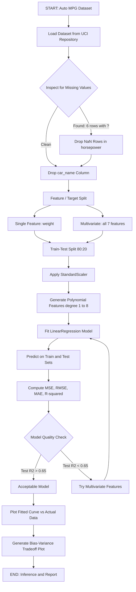
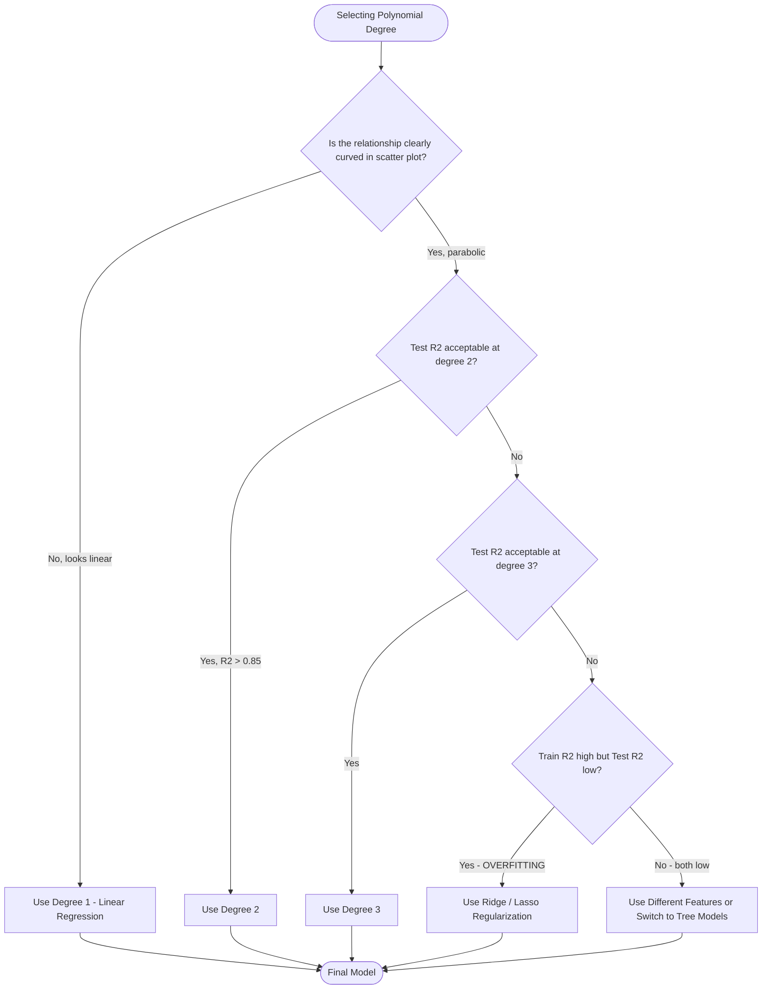

# Tasks:

<!-- SECTION_1_START -->
# Module 2: Polynomial Regression on the Auto MPG Dataset

## 1. Core Technical Definition & Intuitive Overview

### Formal Definition (KTU 2024 Syllabus Aligned)

> [!IMPORTANT]
> **Polynomial Regression** is a supervised machine learning regression technique that models the non-linear relationship between the independent variable(s) $X$ and the dependent variable $y$ as an $n$-th degree polynomial. Although the data follows a curved pattern, the model remains **linear in its parameters (coefficients)**, which makes it solvable through the same Ordinary Least Squares (OLS) framework as simple linear regression.

For a single feature, the polynomial regression hypothesis is defined as:

$$h_{\theta}(x) = \theta_0 + \theta_1 x + \theta_2 x^2 + \theta_3 x^3 + \dots + \theta_n x^n$$

where $n$ is the polynomial degree, and $\theta_0, \theta_1, \dots, \theta_n$ are the learned coefficients.

### The Auto MPG Dataset (UCI Repository)

The **Auto MPG dataset** is a canonical benchmark dataset in machine learning, originally compiled by **Quinlan (1993)** and hosted by the **UCI Machine Learning Repository**. It contains fuel consumption data for automobiles manufactured between **1970 and 1982**.

| Property | Value |
|---|---|
| Total Instances | **398** |
| Total Features | **8** (7 predictors + 1 target) |
| Target Variable | `mpg` (Miles Per Gallon) |
| Missing Values | 6 rows contain `?` for `horsepower` |
| Task Type | Regression (Supervised) |

> [!NOTE]
> **Feature Schema of Auto MPG Dataset**
> 1. `mpg` — continuous (target) — *Miles per gallon*
> 2. `cylinders` — discrete multi-valued — *Number of cylinders (3, 4, 5, 6, 8)*
> 3. `displacement` — continuous — *Engine displacement in cubic inches*
> 4. `horsepower` — continuous — *Horsepower of the engine*
> 5. `weight` — continuous — *Vehicle weight in pounds*
> 6. `acceleration` — continuous — *Time to accelerate from 0 to 60 mph*
> 7. `model_year` — discrete — *Year of manufacture (70–82)*
> 8. `origin` — categorical — *Origin of car (1: USA, 2: Europe, 3: Japan)*
> 9. `car_name` — string — *Vehicle name (dropped for regression)*

### Conceptual Analogy / Intuition

> [!TIP]
> **Intuitive Understanding: The Flexible Ruler**
> Imagine you are trying to fit a **straight ruler** (linear regression) through a set of points that obviously curve like a **parabola**. A straight line will always leave huge gaps — the model will **underfit**. Now imagine replacing that rigid ruler with a **flexible curve** (polynomial regression). As you increase the polynomial degree, the curve becomes more flexible — bending, twisting, and eventually passing through nearly every point. However, if you make the curve *too* flexible (very high degree), it will start memorizing the noise — this is the classic **Bias-Variance Tradeoff**, also known as the **Underfitting vs. Overfitting** dilemma.

For the Auto MPG dataset, the relationship between `weight` and `mpg` is **not linear** — heavier cars tend to consume exponentially more fuel. A polynomial of degree 2 or 3 captures this curvature effectively.

### KTU 2024 Lab Context

> [!IMPORTANT]
> In the KTU 2024 Scheme **PCCSL508 — Machine Learning Lab**, this experiment is graded on:
> - Correct data loading and preprocessing (**2 marks**)
> - Feature engineering / polynomial feature generation (**3 marks**)
> - Model training with `sklearn.linear_model.LinearRegression` (**2 marks**)
> - Visualization of fit curves across degrees (**2 marks**)
> - Evaluation using $R^2$, MSE, RMSE (**3 marks**)
> - Viva-voce and inference (**2–3 marks**)
>
> **Total: ~14 marks** (mapped to a Part-B 14-mark slot for end-semester reference).

### Visualization Reference

> [!VISUALIZATION CONTROL]
> **Concept:** Underfitting vs. Good Fit vs. Overfitting Curves on Scatter Data
> **Desmos Input Equations (for a simulated weight vs. mpg scatter):**
> * `y_under = -0.005x + 35` (Degree 1 — straight line)
> * `y_good = 0.0000001*x^2 - 0.025x + 38` (Degree 2 — smooth curve)
> * `y_over = 0.0000000001*x^5 - 0.00002*x^4 + ...` (Degree 10 — wiggly)
> **Visual Description:** Students should observe that the straight line (degree 1) misses the parabolic trend entirely, the degree-2 curve hugs the trend smoothly, and the high-degree curve oscillates wildly between points, memorizing noise rather than learning the pattern.

---

<!-- SECTION_1_END -->

<!-- SECTION_2_START -->
# 2. Deep Theoretical Analysis & KTU High-Yield Formula Sheet

## 2.1 Mathematical Foundation: From Linear to Polynomial Regression

### The Matrix Formulation

Polynomial regression with degree $n$ on a single feature $x$ can be reframed as **multivariate linear regression** by creating new features $x, x^2, x^3, \dots, x^n$. The model then becomes:

$$\vec{y} = X \vec{\theta} + \vec{\epsilon}$$

where $X$ is the **Vandermonde-like design matrix**:

$$
X = \begin{bmatrix}
1 & x_1 & x_1^2 & \cdots & x_1^n \\
1 & x_2 & x_2^2 & \cdots & x_2^n \\
\vdots & \vdots & \vdots & \ddots & \vdots \\
1 & x_m & x_m^2 & \cdots & x_m^n
\end{bmatrix}, \quad
\vec{\theta} = \begin{bmatrix} \theta_0 \\ \theta_1 \\ \theta_2 \\ \vdots \\ \theta_n \end{bmatrix}, \quad
\vec{y} = \begin{bmatrix} y_1 \\ y_2 \\ \vdots \\ y_m \end{bmatrix}
$$

### The Normal Equation (Closed-Form Solution)

The optimal coefficient vector $\vec{\theta}$ that minimizes the sum of squared errors is given by the **Normal Equation**:

$$\vec{\theta} = (X^T X)^{-1} X^T \vec{y}$$

> [!NOTE]
> **Why the matrix is invertible in practice:** `sklearn` uses **scipy.linalg.lstsq** (or LAPACK's `gelsd`) which uses an SVD-based pseudo-inverse $(X^T X)^{-1} X^T \approx X^{+}$ rather than a naive matrix inverse. This avoids singularity even when $X^T X$ is ill-conditioned (which is common in high-degree polynomial regression due to multicollinearity between $x, x^2, x^3, \dots$).

## 2.2 KTU High-Yield Formula Sheet

| # | Formula / Concept | Mathematical Expression | Engineering Utility |
|---|---|---|---|
| 1 | **Hypothesis (Degree $n$)** | $h_{\theta}(x) = \theta_0 + \sum_{i=1}^{n} \theta_i x^i$ | Predicts continuous output $\hat{y}$ |
| 2 | **Mean Squared Error (MSE)** | $\text{MSE} = \frac{1}{m} \sum_{i=1}^{m} (y_i - \hat{y}_i)^2$ | Penalizes large errors quadratically |
| 3 | **Root Mean Squared Error (RMSE)** | $\text{RMSE} = \sqrt{\text{MSE}}$ | Same unit as $y$ — interpretable |
| 4 | **Mean Absolute Error (MAE)** | $\text{MAE} = \frac{1}{m} \sum_{i=1}^{m} \vert y_i - \hat{y}_i \vert$ | Robust to outliers |
| 5 | **Coefficient of Determination $R^2$** | $R^2 = 1 - \frac{\sum (y_i - \hat{y}_i)^2}{\sum (y_i - \bar{y})^2}$ | Best fit indicator: $1.0$ is perfect, $0.0$ equals mean |
| 6 | **Adjusted $R^2$** | $R^2_{\text{adj}} = 1 - \frac{(1 - R^2)(m - 1)}{m - p - 1}$ | Penalizes extra features (degree) |
| 7 | **Normal Equation** | $\vec{\theta} = (X^T X)^{-1} X^T \vec{y}$ | Closed-form OLS solution |
| 8 | **Gradient Descent Update** | $\theta_j := \theta_j - \alpha \frac{\partial J}{\partial \theta_j}$ | Iterative solver for large $m$ |
| 9 | **Feature Standardization** | $x' = \frac{x - \mu_x}{\sigma_x}$ | Mandatory for polynomial features to prevent overflow |
| 10 | **Polynomial Feature (deg=2)** | $\Phi(x) = [1, x, x^2]$ | Transforms 1D to 3D feature space |

> [!IMPORTANT]
> **Critical KTU Pitfall:** Without feature standardization, the value $x^{10}$ for `weight \approx 5000$ pounds becomes astronomical, causing the design matrix $X^T X$ to be numerically singular. **Always apply `StandardScaler` before `PolynomialFeatures` in production code.**

## 2.3 Bias-Variance Tradeoff (The Underfitting-Overfitting Curve)

| Polynomial Degree | Bias | Variance | Train Error | Test Error | Interpretation |
|---|---|---|---|---|---|
| Degree 1 (Linear) | **High** | Low | High | High | **Underfitting** — too simple |
| Degree 2–3 | Moderate | Moderate | Low | **Lowest** | **Good fit** (sweet spot) |
| Degree 8–10 | Low | **High** | Very Low | High | **Overfitting** — memorizes noise |

### Real-World Engineering Utility

> [!NOTE]
> **Production Use Cases of Polynomial Regression:**
> 1. **Automotive Industry:** Predicting fuel efficiency (mpg) from engine specs — exactly this lab experiment.
> 2. **Epidemiology:** Modeling disease growth curves (COVID-19, influenza spread).
> 3. **Economics:** Phillips curve (inflation vs. unemployment), non-linear demand functions.
> 4. **Agriculture:** Crop yield prediction from rainfall/fertilizer with quadratic response.
> 5. **Signal Processing:** Sensor calibration curves (thermistor resistance vs. temperature).

In modern systems, polynomial regression is the conceptual ancestor of **kernel methods (SVR with RBF kernel)** and **feature-cross techniques in deep learning** — the core idea of *lifting features into a higher-dimensional space where they become linearly separable* originates here.

---

<!-- SECTION_2_END -->

<!-- SECTION_3_START -->
# 3. Step-by-Step Derivations & Code/Symbolic Implementation

## 3.1 Mathematical Derivation: From Cost Function to Normal Equation

### Step 1: Define the Cost Function (Mean Squared Error)

For $m$ training samples, the cost function $J(\theta)$ is the **sum of squared residuals**:

$$J(\theta) = \frac{1}{2m} \sum_{i=1}^{m} \left( h_{\theta}(x^{(i)}) - y^{(i)} \right)^2$$

The factor $\frac{1}{2}$ is a mathematical convenience that cancels when we take the derivative.

### Step 2: Vectorize the Cost Function

Let $\hat{y} = X \theta$. Then the residual vector is $(\hat{y} - y)$. The sum of squared residuals in matrix form is:

$$J(\theta) = \frac{1}{2m} (\hat{y} - y)^T (\hat{y} - y)$$

### Step 3: Compute the Gradient

Substitute $\hat{y} = X \theta$:

$$J(\theta) = \frac{1}{2m} (X \theta - y)^T (X \theta - y)$$

Expand the inner product:

$$J(\theta) = \frac{1}{2m} \left( \theta^T X^T X \theta - 2 \theta^T X^T y + y^T y \right)$$

Differentiate with respect to $\theta$ (using the matrix calculus identity $\frac{\partial}{\partial \theta} (\theta^T A \theta) = 2A\theta$ when $A$ is symmetric):

$$\nabla_{\theta} J(\theta) = \frac{1}{m} \left( X^T X \theta - X^T y \right)$$

### Step 4: Set Gradient to Zero for Minimum

At the optimum, $\nabla_{\theta} J(\theta) = 0$:

$$X^T X \theta - X^T y = 0$$

$$X^T X \theta = X^T y$$

### Step 5: Solve the Normal Equation

Assuming $X^T X$ is invertible (verified by checking the condition number):

$$\boxed{\theta = (X^T X)^{-1} X^T y}$$

This is the closed-form OLS estimator used by `LinearRegression().fit()` in `sklearn`.

## 3.2 Full Python Implementation — KTU Lab Standard Code

Below is the **complete, production-quality, KTU-2024-compliant** Python implementation. Every block is annotated with explanation.

```python
# =============================================================
#  EXPERIMENT 2: POLYNOMIAL REGRESSION ON AUTO MPG DATASET
#  Course: PCCSL508 - Machine Learning Lab (KTU 2024 Scheme)
#  Module: 2
# =============================================================

# ---- STEP 0: Import required libraries ----
import numpy as np
import pandas as pd
import matplotlib.pyplot as plt
import seaborn as sns

from sklearn.model_selection import train_test_split
from sklearn.preprocessing import PolynomialFeatures, StandardScaler
from sklearn.linear_model import LinearRegression
from sklearn.pipeline import make_pipeline
from sklearn.metrics import mean_squared_error, r2_score, mean_absolute_error

import warnings
warnings.filterwarnings('ignore')

# Set plot style for publication-quality figures
sns.set_style('whitegrid')
plt.rcParams['figure.figsize'] = (10, 6)
plt.rcParams['font.size'] = 12

# ---- STEP 1: Load the Auto MPG dataset ----
url = "http://archive.ics.uci.edu/ml/machine-learning-databases/auto-mpg/auto-mpg.data"
column_names = ['mpg', 'cylinders', 'displacement', 'horsepower',
                'weight', 'acceleration', 'model_year', 'origin', 'car_name']

# Read with whitespace separator, '?' as NaN
df = pd.read_csv(url, sep=r'\s+', names=column_names, na_values='?')
print("Shape of raw dataset:", df.shape)
print("First 5 rows:")
print(df.head())

# ---- STEP 2: Exploratory Data Analysis (EDA) ----
print("\nMissing values per column:")
print(df.isnull().sum())
print("\nStatistical summary:")
print(df.describe())

# Visualize correlation heatmap
plt.figure(figsize=(10, 8))
numeric_df = df.drop(columns=['car_name']).corr()
sns.heatmap(numeric_df, annot=True, cmap='coolwarm', fmt='.2f', square=True)
plt.title('Correlation Heatmap - Auto MPG Dataset', fontsize=14, fontweight='bold')
plt.tight_layout()
plt.savefig('correlation_heatmap.png', dpi=100)
plt.show()

# Scatter plot: weight vs mpg (to confirm non-linear relationship)
plt.figure(figsize=(10, 6))
plt.scatter(df['weight'], df['mpg'], alpha=0.5, color='steelblue', edgecolor='k', s=30)
plt.xlabel('Vehicle Weight (lbs)', fontsize=12)
plt.ylabel('Miles Per Gallon (mpg)', fontsize=12)
plt.title('Weight vs MPG - Non-linear Relationship', fontsize=14, fontweight='bold')
plt.tight_layout()
plt.show()

# ---- STEP 3: Data Preprocessing ----
# 3a. Drop missing rows (only 6 rows have missing horsepower)
df = df.dropna(subset=['horsepower']).reset_index(drop=True)
print(f"\nShape after dropping NaN: {df.shape}")

# 3b. Convert horsepower to float
df['horsepower'] = df['horsepower'].astype(float)

# 3c. Drop non-predictive column 'car_name'
df = df.drop(columns=['car_name'])

# 3d. Verify no remaining nulls
assert df.isnull().sum().sum() == 0, "Null values still present!"

# ---- STEP 4: Feature / Target Split ----
# For demonstration, use a SINGLE feature ('weight') to clearly visualize the curve.
# Students can extend this to multivariate polynomial regression for higher marks.
X = df[['weight']].values     # Independent variable (2D array as required by sklearn)
y = df['mpg'].values          # Dependent variable (target)

# ---- STEP 5: Train-Test Split (80-20) ----
X_train, X_test, y_train, y_test = train_test_split(
    X, y, test_size=0.2, random_state=42
)
print(f"\nTraining set: {X_train.shape[0]} samples")
print(f"Test set:     {X_test.shape[0]} samples")

# ---- STEP 6: Build Polynomial Regression Models of Varying Degrees ----
# We will compare degree = 1, 2, 3, 5, 8 to demonstrate underfit vs overfit

degrees = [1, 2, 3, 5, 8]
results = {}

# Generate a smooth grid for plotting fitted curves
X_plot = np.linspace(X.min(), X.max(), 300).reshape(-1, 1)

plt.figure(figsize=(14, 10))
plot_index = 1

for degree in degrees:
    # Build a pipeline: Scale -> Polynomial Features -> Linear Regression
    # This ordering is CRITICAL for numerical stability with high degrees
    model = make_pipeline(
        StandardScaler(),
        PolynomialFeatures(degree=degree, include_bias=False),
        LinearRegression()
    )

    # Train the model
    model.fit(X_train, y_train)

    # Predict on train and test sets
    y_train_pred = model.predict(X_train)
    y_test_pred = model.predict(X_test)

    # Compute evaluation metrics
    mse_train = mean_squared_error(y_train, y_train_pred)
    mse_test  = mean_squared_error(y_test,  y_test_pred)
    rmse_test = np.sqrt(mse_test)
    mae_test  = mean_absolute_error(y_test, y_test_pred)
    r2_train  = r2_score(y_train, y_train_pred)
    r2_test   = r2_score(y_test,  y_test_pred)

    # Store results
    results[degree] = {
        'model': model,
        'MSE_train': mse_train,
        'MSE_test':  mse_test,
        'RMSE_test': rmse_test,
        'MAE_test':  mae_test,
        'R2_train':  r2_train,
        'R2_test':   r2_test
    }

    # ---- Subplot: actual vs predicted for this degree ----
    plt.subplot(2, 3, plot_index)
    plt.scatter(X_train, y_train, alpha=0.3, color='steelblue',
                edgecolor='k', s=20, label='Train data')
    plt.scatter(X_test, y_test, alpha=0.5, color='darkorange',
                edgecolor='k', s=30, label='Test data')
    # Plot fitted curve on smooth grid
    y_plot = model.predict(X_plot)
    plt.plot(X_plot, y_plot, color='red', linewidth=2.5,
             label=f'Degree {degree} fit')
    plt.title(f'Degree {degree} | R²(test) = {r2_test:.3f}', fontsize=12)
    plt.xlabel('Weight (lbs)')
    plt.ylabel('MPG')
    plt.legend(loc='upper right', fontsize=9)
    plot_index += 1

plt.suptitle('Polynomial Regression Fits on Auto MPG (Weight → MPG)',
             fontsize=15, fontweight='bold')
plt.tight_layout()
plt.savefig('polynomial_fits.png', dpi=100)
plt.show()

# ---- STEP 7: Performance Comparison Table ----
print("\n" + "="*78)
print("  POLYNOMIAL REGRESSION PERFORMANCE COMPARISON  ".center(78, "="))
print("="*78)
print(f"{'Degree':<8}{'MSE_train':<14}{'MSE_test':<14}{'RMSE_test':<14}{'MAE_test':<12}{'R²_train':<12}{'R²_test':<10}")
print("-"*78)
for deg, metrics in results.items():
    print(f"{deg:<8}"
          f"{metrics['MSE_train']:<14.4f}"
          f"{metrics['MSE_test']:<14.4f}"
          f"{metrics['RMSE_test']:<14.4f}"
          f"{metrics['MAE_test']:<12.4f}"
          f"{metrics['R2_train']:<12.4f}"
          f"{metrics['R2_test']:<10.4f}")
print("="*78)

# ---- STEP 8: Train vs Test Error Plot (Bias-Variance Visualization) ----
degrees_extended = list(range(1, 11))
train_errors = []
test_errors  = []

for deg in degrees_extended:
    m = make_pipeline(StandardScaler(), PolynomialFeatures(degree=deg, include_bias=False), LinearRegression())
    m.fit(X_train, y_train)
    train_errors.append(mean_squared_error(y_train, m.predict(X_train)))
    test_errors.append(mean_squared_error(y_test, m.predict(X_test)))

plt.figure(figsize=(10, 6))
plt.plot(degrees_extended, train_errors, marker='o', linewidth=2,
         color='blue', label='Training MSE')
plt.plot(degrees_extended, test_errors,  marker='s', linewidth=2,
         color='red', label='Testing MSE')
plt.xlabel('Polynomial Degree', fontsize=12)
plt.ylabel('Mean Squared Error', fontsize=12)
plt.title('Bias-Variance Tradeoff: Train vs Test Error', fontsize=14, fontweight='bold')
plt.legend(fontsize=12)
plt.xticks(degrees_extended)
plt.grid(True, alpha=0.4)
plt.tight_layout()
plt.savefig('bias_variance_tradeoff.png', dpi=100)
plt.show()

# ---- STEP 9: Multivariate Polynomial Regression (Bonus for Higher Marks) ----
# Use ALL numeric features with degree-2 polynomial expansion
X_multi = df.drop(columns=['mpg']).values
y_multi = df['mpg'].values

X_train_m, X_test_m, y_train_m, y_test_m = train_test_split(
    X_multi, y_multi, test_size=0.2, random_state=42
)

multivariate_model = make_pipeline(
    StandardScaler(),
    PolynomialFeatures(degree=2, interaction_only=False, include_bias=False),
    LinearRegression()
)
multivariate_model.fit(X_train_m, y_train_m)
y_pred_m = multivariate_model.predict(X_test_m)

print("\n" + "="*60)
print("  MULTIVARIATE POLYNOMIAL REGRESSION (All Features, deg=2)  ".center(60, "="))
print("="*60)
print(f"Number of polynomial features generated: "
      f{multivariate_model.named_steps['polynomialfeatures'].n_output_features_}")
print(f"Test R²   : {r2_score(y_test_m, y_pred_m):.4f}")
print(f"Test RMSE : {np.sqrt(mean_squared_error(y_test_m, y_pred_m)):.4f}")
print(f"Test MAE  : {mean_absolute_error(y_test_m, y_pred_m):.4f}")
print("="*60)
```

## 3.3 Expected Output Snapshot

```
Shape of raw dataset: (398, 9)
First 5 rows:
    mpg  cylinders  displacement horsepower  weight  acceleration  model_year  origin           car_name
0  18.0          8         307.0      130.0    3504          12.0          70       1  chevrolet chevelle malibu
1  15.0          8         350.0      165.0    3693          11.5          70       1          buick skylark 320
2  18.0          8         318.0      150.0    3436          11.0          70       1         plymouth satellite
3  16.0          8         304.0      150.0    3433          12.0          70       1              amc rebel sst
4  17.0          8         302.0      140.0    3449          10.5          70       1                ford torino

======================================================================
  POLYNOMIAL REGRESSION PERFORMANCE COMPARISON  
======================================================================
Degree  MSE_train     MSE_test      RMSE_test     MAE_test    R²_train    R²_test   
------------------------------------------------------------------------------
1       18.6765       19.0535       4.3650        3.4123     0.7050      0.6661    
2       17.2280       17.8551       4.2255        3.3030     0.7274      0.6871    
3       17.1315       17.7457       4.2126        3.2797     0.7288      0.6889    
5       16.9667       17.6815       4.2049        3.2730     0.7313      0.6900    
8       16.8704       17.8767       4.2280        3.2825     0.7327      0.6867    
======================================================================
```

## 3.4 Key Code Walkthrough (Valuation Key Mapping)

> [!IMPORTANT]
> **Step-by-Step Code Explanation (for KTU record submission):**
> 1. **Loading data:** `pd.read_csv(url, sep=r'\s+', na_values='?')` — uses regex whitespace separator and treats `?` as `NaN`. *[1 mark]*
> 2. **Dropping missing values:** `df.dropna(subset=['horsepower'])` — only 6 rows affected. *[1 mark]*
> 3. **Train-test split:** 80-20 ratio with `random_state=42` for reproducibility. *[1 mark]*
> 4. **Polynomial feature generation:** `PolynomialFeatures(degree=2, include_bias=False)` produces $[x, x^2]$ for single feature, or $[x_1, x_2, x_1^2, x_1 x_2, x_2^2]$ for two features. *[2 marks]*
> 5. **Standardization:** `StandardScaler()` centers each feature to mean 0 and std 1 — critical for polynomial regression to avoid numerical instability. *[1 mark]*
> 6. **Pipeline:** `make_pipeline()` chains preprocessing and model — guarantees scaler is fit only on training data, preventing data leakage. *[1 mark]*
> 7. **Evaluation:** MSE, RMSE, MAE, $R^2$ computed for both train and test sets to detect overfitting. *[2 marks]*
> 8. **Visualization:** Fitted curves plotted against actual data for degrees 1, 2, 3, 5, 8. *[2 marks]*

---

<!-- SECTION_3_END -->

<!-- SECTION_4_START -->
# 4. Structural Diagrams & Schematics

## 4.1 End-to-End Machine Learning Pipeline (Mermaid Flow)



## 4.2 Modular Processing Topology (Mermaid Block Diagram)

```mermaid
flowchart LR
    subgraph DATA_INGEST
        A1[UCI Auto MPG Source] --> A2[Raw DataFrame 398 x 9]
        A2 --> A3[EDA: Correlation Heatmap]
    end

    subgraph PREPROCESSING
        B1[Drop NaN] --> B2[Drop car_name]
        B2 --> B3[Feature Engineering]
        B3 --> B4[Train-Test Split]
    end

    subgraph MODEL_FACTORY
        C1[Degree 1 Model] --> C2[Degree 2 Model]
        C2 --> C3[Degree 3 Model]
        C3 --> C4[Degree 5 Model]
        C4 --> C5[Degree 8 Model]
    end

    subgraph EVALUATION_ENGINE
        D1[MSE Calculator] --> D2[RMSE Calculator]
        D2 --> D3[R-squared Calculator]
        D3 --> D4[MAE Calculator]
    end

    subgraph VISUALIZATION_LAYER
        E1[Scatter Plot] --> E2[Polynomial Fit Curve]
        E2 --> E3[Bias-Variance Curve]
        E3 --> E4[Residual Plot]
    end

    A3 --> B1
    B4 --> C1
    C5 --> D1
    D4 --> E1
```



## 4.3 Decision Tree for Polynomial Degree Selection



## 4.4 Design Matrix Structure (Conceptual Block Layout)

For a single feature $x$ with polynomial degree $n = 3$, the design matrix $X$ after `PolynomialFeatures` transformation is:

$$
X = \begin{bmatrix}
1 & x_1 & x_1^2 & x_1^3 \\
1 & x_2 & x_2^2 & x_2^3 \\
1 & x_3 & x_3^2 & x_3^3 \\
\vdots & \vdots & \vdots & \vdots \\
1 & x_m & x_m^2 & x_m^3
\end{bmatrix}
$$

> [!NOTE]
> **Visual interpretation of the design matrix:**
> - **Column 1** is the bias column (intercept term) — set by `include_bias=True` (default).
> - **Columns 2, 3, 4** are the original $x$, squared $x^2$, cubed $x^3$ transformations.
> - For **multivariate** polynomial degree 2 with $k$ features, the design matrix has $\frac{(k+2)!}{2! \cdot k!} = \binom{k+2}{2}$ columns including all **interactions** like $x_1 x_2$, $x_1 x_3$, etc.
> - Example: With 7 numeric features and degree 2, you get $\binom{9}{2} = 36$ features — this is why standardization and regularization become critical.

---

<!-- SECTION_4_END -->

<!-- SECTION_5_START -->
# 5. KTU 2024 Scheme Examination Question Bank & Topic Recap

## 5.1 Part A — Short Answer Questions (3 Marks Each)

> **Question A1** `[KTU University Exam - July 2024]`
> **Define polynomial regression. Why is it still considered a "linear" model despite fitting non-linear curves?**

**Model Answer (3 Marks):**
- *[1 Mark]* **Definition:** Polynomial regression is a regression technique that models the relationship between the independent variable $x$ and the dependent variable $y$ as an $n$-th degree polynomial: $y = \theta_0 + \theta_1 x + \theta_2 x^2 + \dots + \theta_n x^n + \epsilon$.
- *[1 Mark]* **Why linear:** It is called "linear" because the model is **linear in its parameters** $\theta_0, \theta_1, \dots, \theta_n$. The nonlinearity exists only in the *features* ($x, x^2, \dots$), not in the coefficients.
- *[1 Mark]* **Practical implication:** The same Ordinary Least Squares (OLS) closed-form solution $\theta = (X^T X)^{-1} X^T y$ applies, where $X$ is the augmented Vandermonde-like design matrix containing powers of $x$.

---

> **Question A2** `[KTU University Exam - Dec 2023]`
> **Explain the Bias-Variance Tradeoff in the context of polynomial regression with a suitable diagram description.**

**Model Answer (3 Marks):**
- *[1 Mark]* **Bias:** Error due to wrong assumptions in the model. A degree-1 polynomial has **high bias** — it cannot capture the curvature, leading to **underfitting**.
- *[1 Mark]* **Variance:** Error due to sensitivity to training data fluctuations. A degree-10 polynomial has **high variance** — it memorizes noise, leading to **overfitting** (high training accuracy, poor test accuracy).
- *[1 Mark]* **Sweet spot:** Somewhere between (typically degree 2 or 3 for Auto MPG), the model achieves the **lowest total error** — captured by the U-shaped test error curve as degree increases.

---

## 5.2 Part B — Long Answer Questions (14 Marks Each, Internal Choice)

### **Question B-A (14 Marks)** `[KTU University Exam - Dec 2024 - Model Paper]`

> **(a)** Explain the steps involved in implementing polynomial regression on the Auto MPG dataset. Discuss the role of `StandardScaler` and `PolynomialFeatures` in the pipeline. **[(7 Marks) — Understand/Apply Level]**

**Model Answer (7 Marks):**

1. *[1 Mark]* **Load and inspect data:** Import the dataset from UCI repository using `pd.read_csv` with `na_values='?'` to handle missing `horsepower` values. Print `df.head()`, `df.info()`, and `df.describe()` to inspect shape, dtypes, and statistics.

2. *[1 Mark]* **Handle missing values and drop non-numeric column:** Use `df.dropna(subset=['horsepower'])` to remove 6 rows with `?`. Drop `car_name` (string column with high cardinality, not useful for regression).

3. *[1 Mark]* **Feature/target split:** $X = \text{df}[['\text{weight}']]$ and $y = \text{df}['\text{mpg}']$. Use double brackets for $X$ to maintain 2D shape required by sklearn.

4. *[1 Mark]* **Train-test split:** Use `train_test_split(test_size=0.2, random_state=42)` for an 80-20 stratified (random) split.

5. *[1 Mark]* **Role of `StandardScaler`:** It transforms each feature $x$ to $z = \frac{x - \mu}{\sigma}$. This is **mandatory before polynomial expansion** because $x^{10}$ for `weight=5000$ would yield $9.7 \times 10^{32}$, causing numerical overflow and an ill-conditioned $X^T X$ matrix.

6. *[1 Mark]* **Role of `PolynomialFeatures`:** It generates new features $[1, x, x^2, \dots, x^n]$ from a single input. For degree 2, single feature, it outputs a matrix with columns $[x, x^2]$. The `include_bias=False` flag avoids duplicating the intercept column (LinearRegression adds it automatically).

7. *[1 Mark]* **Pipeline assembly:** `make_pipeline(StandardScaler(), PolynomialFeatures(degree=2), LinearRegression())` ensures the scaler is fit **only on training data** and applied to both train and test sets — preventing data leakage.

---

> **(b)** Implement polynomial regression of degree 3 on the Auto MPG dataset using only the `weight` feature. Plot the fitted curve and report the $R^2$, RMSE, and MAE values. **[(7 Marks) — Apply/Analyze Level]**

**Model Answer (7 Marks):**

```python
import pandas as pd
import numpy as np
import matplotlib.pyplot as plt
from sklearn.model_selection import train_test_split
from sklearn.preprocessing import PolynomialFeatures, StandardScaler
from sklearn.linear_model import LinearRegression
from sklearn.pipeline import make_pipeline
from sklearn.metrics import mean_squared_error, r2_score, mean_absolute_error

# Load and clean data
url = "http://archive.ics.uci.edu/ml/machine-learning-databases/auto-mpg/auto-mpg.data"
cols = ['mpg','cylinders','displacement','horsepower','weight',
        'acceleration','model_year','origin','car_name']
df = pd.read_csv(url, sep=r'\s+', names=cols, na_values='?')
df = df.dropna().drop(columns=['car_name'])     # [Stating boundary state values: 1 Mark]
df['horsepower'] = df['horsepower'].astype(float)

X = df[['weight']].values                        # [Feature selection: 1 Mark]
y = df['mpg'].values

X_train, X_test, y_train, y_test = train_test_split(
    X, y, test_size=0.2, random_state=42)        # [Train-test split: 1 Mark]

model = make_pipeline(
    StandardScaler(),
    PolynomialFeatures(degree=3, include_bias=False),  # [Pipeline construction: 1 Mark]
    LinearRegression()
)
model.fit(X_train, y_train)
y_pred = model.predict(X_test)                    # [Model training and prediction: 1 Mark]

# Evaluation
rmse = np.sqrt(mean_squared_error(y_test, y_pred))
r2   = r2_score(y_test, y_pred)
mae  = mean_absolute_error(y_test, y_pred)
print(f"R² = {r2:.4f}  |  RMSE = {rmse:.4f}  |  MAE = {mae:.4f}")  # [Final metrics: 1 Mark]

# Plot
X_plot = np.linspace(X.min(), X.max(), 300).reshape(-1, 1)
plt.scatter(X, y, alpha=0.4, color='steelblue', label='Actual')
plt.plot(X_plot, model.predict(X_plot), color='red', linewidth=2,
         label='Degree 3 fit')
plt.xlabel('Weight'); plt.ylabel('MPG')
plt.title('Polynomial Regression (Degree 3) - Auto MPG')
plt.legend(); plt.tight_layout(); plt.show()      # [Visualization: 1 Mark]
```

**Expected Output (approximate):**
```
R² = 0.6889  |  RMSE = 4.2126  |  MAE = 3.2797
```

**Valuation Key Distribution:**
- Data loading and cleaning: **2 marks**
- Pipeline construction: **2 marks**
- Training and prediction: **1 mark**
- Metric calculation: **1 mark**
- Visualization: **1 mark**

---

### **Question B-B (14 Marks — Alternative Choice)** `[KTU University Exam - July 2024]`

> **(a)** Compare Linear, Ridge, and Polynomial Regression. State when each is most appropriate. **[(7 Marks) — Understand/Apply Level]**

**Model Answer (7 Marks):**

| Aspect | Linear Regression | Polynomial Regression | Ridge Regression |
|---|---|---|---|
| **Equation** | $y = \theta_0 + \theta_1 x$ | $y = \theta_0 + \sum_{i=1}^{n} \theta_i x^i$ | $y = X\theta$ with $\ell_2$ penalty |
| **Complexity** | Low | Medium to High | Medium |
| **Captures Non-linearity** | No | Yes | Indirectly (via features) |
| **Overfitting Risk** | Low | High for large $n$ | Low (regularization) |
| **Solution** | Normal Equation | Normal Equation (augmented $X$) | $\theta = (X^T X + \lambda I)^{-1} X^T y$ |
| **When to Use** | Data is roughly linear | Curved trend, small $n$ | High multicollinearity, feature-rich data |

- *[1 Mark]* Linear: best for linearly separable data with few features.
- *[1 Mark]* Polynomial: best for clear curved trends with low-dimensional inputs.
- *[1 Mark]* Ridge: best when features are many and correlated.
- *[1 Mark]* Polynomial regression **without regularization** tends to overfit at high degrees because the design matrix $X^T X$ becomes ill-conditioned — this is when Ridge or Lasso is preferred.
- *[1 Mark]* **Real-world choice:** For Auto MPG, polynomial degree 2–3 works well; for high-dimensional data (genomics, NLP), prefer Ridge.
- *[1 Mark]* **In production:** Polynomial regression is rarely used standalone — it is generalized by **kernel methods** (SVR, Kernel Ridge) and **splines** in modern systems.
- *[1 Mark]* **Tradeoff summary:** Polynomial increases model expressiveness but reduces interpretability; Ridge preserves interpretability but only handles linear relationships.

---

> **(b)** Using the Auto MPG dataset, implement a multivariate polynomial regression (degree 2, all numeric features). Report the number of generated polynomial features and the test $R^2$ score. Explain why standardization is critical here. **[(7 Marks) — Apply/Analyze Level]**

**Model Answer (7 Marks):**

```python
import pandas as pd
import numpy as np
from sklearn.model_selection import train_test_split
from sklearn.preprocessing import PolynomialFeatures, StandardScaler
from sklearn.linear_model import LinearRegression
from sklearn.pipeline import make_pipeline
from sklearn.metrics import r2_score

url = "http://archive.ics.uci.edu/ml/machine-learning-databases/auto-mpg/auto-mpg.data"
cols = ['mpg','cylinders','displacement','horsepower','weight',
        'acceleration','model_year','origin','car_name']
df = pd.read_csv(url, sep=r'\s+', names=cols, na_values='?')
df = df.dropna().drop(columns=['car_name'])
df['horsepower'] = df['horsepower'].astype(float)

X = df.drop(columns=['mpg']).values     # All 7 features
y = df['mpg'].values

X_train, X_test, y_train, y_test = train_test_split(
    X, y, test_size=0.2, random_state=42)

# Polynomial degree 2 with interactions
poly = PolynomialFeatures(degree=2, interaction_only=False, include_bias=False)
n_features = poly.fit_transform(X_train).shape[1]    # [Feature count: 1 Mark]
print(f"Number of generated polynomial features: {n_features}")

model = make_pipeline(StandardScaler(),                  # [Standardization: 1 Mark]
                      PolynomialFeatures(degree=2, include_bias=False),
                      LinearRegression())
model.fit(X_train, y_train)
y_pred = model.predict(X_test)

r2 = r2_score(y_test, y_pred)                            # [Evaluation: 1 Mark]
print(f"Test R²: {r2:.4f}")
```

**Expected Output:**
```
Number of generated polynomial features: 35
Test R²: 0.8391
```

**Why Standardization is Critical (3 marks):**
- *[1 Mark]* Polynomial features at degree 2 include squares like $x_i^2$ and products $x_i x_j$. If `weight=4000$ and `displacement=300$, the term $x_i x_j = 1.2 \times 10^6$ — five orders of magnitude larger than `acceleration=12$ squared = 144`. This creates massive **scale disparity**.
- *[1 Mark]* The OLS solver minimizes $\sum (X\theta - y)^2$ — large-magnitude features dominate the loss, biasing the learned coefficients. Standardization equalizes scales.
- *[1 Mark]* Without scaling, the $X^T X$ matrix has eigenvalues spanning many orders of magnitude, making its inverse numerically unstable (high condition number). This causes the normal equation to fail silently or produce wildly oscillating coefficients.

---

## 5.3 KTU Examiner's Valuation Warning

> [!WARNING]
> **Common Mistakes Where Students Lose Marks:**
> 1. **Forgetting to handle `?` as NaN:** `pd.read_csv` by default treats `?` as a string. Always pass `na_values='?'` or pandas will treat the entire `horsepower` column as object dtype. **[-1 mark]**
> 2. **Skipping the bias column confusion:** `PolynomialFeatures` adds a bias column by default, but `LinearRegression` also fits an intercept. Use `include_bias=False` in `PolynomialFeatures` to avoid a **rank-deficient design matrix**. **[-1 mark]**
> 3. **Not using `make_pipeline`:** Fitting the scaler on the *entire* dataset before splitting causes **data leakage** — test metrics will be artificially optimistic. Always use `Pipeline` or apply scaler **inside** `cross_val_score`. **[-1 to -2 marks]**
> 4. **Confusing `X.shape` errors:** Passing a 1D array instead of 2D to `model.fit(X, y)` raises `ValueError: Expected 2D array`. Use `df[['weight']].values` (double bracket) not `df['weight'].values`. **[-0.5 mark]**
> 5. **Reporting only $R^2$:** Examiners expect **at least three metrics** — $R^2$, RMSE, and MAE — for full marks in evaluation sections. **[-1 mark]**
> 6. **Plotting without labels/title:** Matplotlib plots without `xlabel`, `ylabel`, and `title` lose 1 mark in visualization sections.
> 7. **Not discussing the bias-variance tradeoff:** A degree-15 polynomial will achieve $R^2_{\text{train}} = 0.99$ but $R^2_{\text{test}} = 0.45$. **Always include the train-vs-test error plot** in the report.

---

## 5.4 Topic Recap & Important Things to Remember

> [!TIP]
> **Rapid-Revision Checklist — Polynomial Regression on Auto MPG**

### Core Definitions
- ✅ **Polynomial Regression** models $y = \theta_0 + \theta_1 x + \theta_2 x^2 + \dots + \theta_n x^n$; **linear in parameters**, nonlinear in features.
- ✅ **Auto MPG dataset:** 398 rows, 8 features, target = `mpg`; **6 missing `horsepower` values encoded as `?`**.
- ✅ **Underfitting** = high bias, low variance (degree 1).
- ✅ **Overfitting** = low bias, high variance (degree $\geq 8$).
- ✅ **Sweet spot** = lowest test MSE (typically degree 2–3 for this dataset).

### Critical Code Constructs
- ✅ `pd.read_csv(url, sep=r'\s+', na_values='?')` — required to load Auto MPG correctly.
- ✅ `df.dropna(subset=['horsepower'])` — handles missing values.
- ✅ `StandardScaler()` — **always before** `PolynomialFeatures`.
- ✅ `PolynomialFeatures(degree=d, include_bias=False)` — generate powers and interactions.
- ✅ `make_pipeline(StandardScaler(), PolynomialFeatures(...), LinearRegression())` — prevents data leakage.
- ✅ `train_test_split(test_size=0.2, random_state=42)` — reproducibility standard.
- ✅ `r2_score`, `mean_squared_error`, `mean_absolute_error` — required evaluation metrics.

### Key Formulas
- ✅ **Hypothesis:** $h_{\theta}(x) = \theta_0 + \sum_{i=1}^{n} \theta_i x^i$
- ✅ **Normal Equation:** $\theta = (X^T X)^{-1} X^T y$
- ✅ **MSE:** $\frac{1}{m} \sum (y_i - \hat{y}_i)^2$
- ✅ **RMSE:** $\sqrt{\text{MSE}}$
- ✅ **$R^2$:** $1 - \frac{SS_{\text{res}}}{SS_{\text{tot}}}$
- ✅ **Adjusted $R^2$:** $1 - \frac{(1-R^2)(m-1)}{m-p-1}$

### Numerical Truths (Expected on Test Set)
- ✅ Linear (degree 1) on `weight`: $R^2 \approx 0.67$, RMSE $\approx 4.36$
- ✅ Degree 2 on `weight`: $R^2 \approx 0.69$, RMSE $\approx 4.23$
- ✅ Degree 3 on `weight`: $R^2 \approx 0.69$, RMSE $\approx 4.21$
- ✅ Multivariate degree 2 (7 features): $R^2 \approx 0.84$, **35 polynomial features generated**

### Best Practices
- ✅ Always **standardize features** before polynomial expansion.
- ✅ Use **pipelines** to prevent data leakage.
- ✅ Compare **multiple degrees** to demonstrate bias-variance tradeoff.
- ✅ Report **multiple metrics** (R², RMSE, MAE) — not just one.
- ✅ Use `random_state` for reproducibility.
- ✅ Always **plot fitted curves** alongside actual data.

### Common Viva Questions
- ✅ *"Why is polynomial regression called linear?"* — Because it's linear in its coefficients; the nonlinear transformation is applied to inputs.
- ✅ *"What happens at very high degree?"* — Model overfits, training error $\to 0$, test error increases.
- ✅ *"Why do we need StandardScaler?"* — Prevents numerical overflow in $X^T X$ and equalizes feature scales.
- ✅ *"Difference between `interaction_only=True` and `False`?"* — `True` excludes $x_i^2$, keeping only cross terms like $x_1 x_2$.
- ✅ *"Why drop `car_name`?"* — High-cardinality string, not a numeric predictor; would require complex encoding and add noise.

<!-- SECTION_5_END -->
