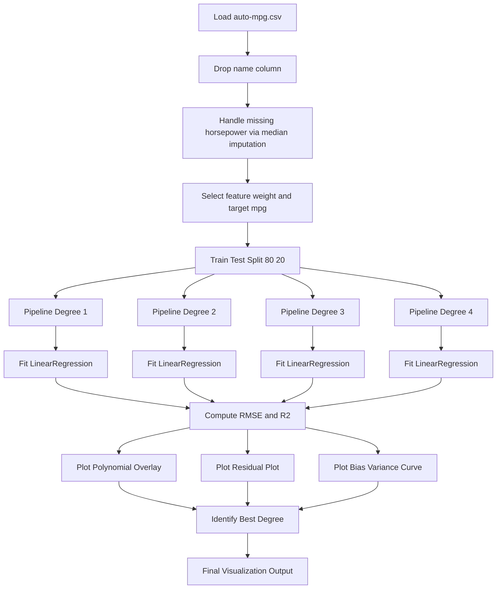
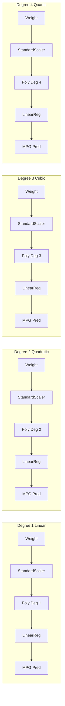
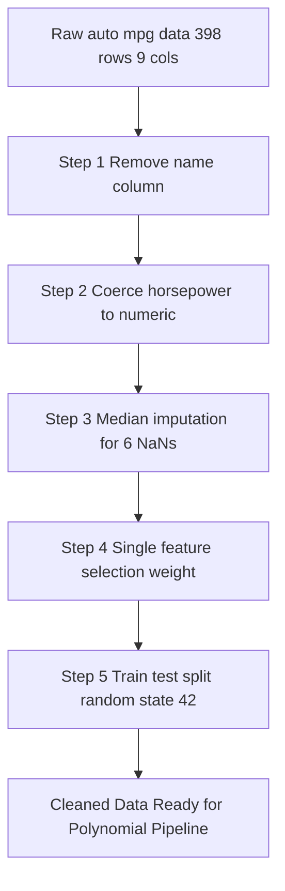

# Visualize the polynomial fit.

<!-- SECTION_1_START -->

# 1. Core Technical Definition & Intuitive Overview

## 1.1 Formal Definition (KTU 2024 Scheme Aligned)

**Polynomial Regression** is a specialized form of *regression analysis* in supervised machine learning in which the independent–dependent variable relationship is modeled as an $n$-degree polynomial. Formally, given a single feature $x$, the hypothesis function is expressed as:

$$
h_{\theta}(x) = \theta_0 + \theta_1 x + \theta_2 x^2 + \theta_3 x^3 + \dots + \theta_n x^n
$$

where $\theta_0, \theta_1, \dots, \theta_n$ are the *learnable parameters* and $n$ is the **degree** of the polynomial. It is a special case of **Multiple Linear Regression** because the model is *linear in parameters* but *non-linear in features*.

> [!IMPORTANT]  
> **Auto MPG Dataset (UCI Repository):** This is the canonical benchmark dataset used in the KTU Machine Learning Lab (PCCSL508) Module 2. It contains **398 instances** with **8 attributes**:
> - `mpg` (target) — Miles per gallon (continuous)
> - `cylinders`, `displacement`, `horsepower`, `weight`, `acceleration`, `model_year`, `origin` (predictors)

## 1.2 Conceptual Analogy / Intuition

> [!NOTE]  
> **Intuitive Analogy — "The Flexible Rubber Ruler":**  
> Imagine you are asked to draw a *straight line* that best passes through a scattered cloud of points on graph paper. A straight ruler (linear regression) works if the trend is linear. But if the points form a **U-shape** (e.g., weight vs mpg — mileage drops as weight increases, but the rate of drop is non-uniform), a straight ruler *cannot* bend. A **flexible rubber ruler (polynomial regression)** can curve and hug the data points more accurately. The higher the degree, the more flexible the ruler — but too much flexibility causes it to "wiggle" through noise (overfitting).

**Geometric Intuition for Visualization:**

- **Degree 1 (Linear):** A straight line cutting through the scatter cloud.
- **Degree 2 (Quadratic):** A smooth U-shaped or inverted-U curve.
- **Degree 3 (Cubic):** An S-shaped curve with one inflection point.
- **Degree 4+:** Highly wavy curves that fit training points but generalize poorly.

## 1.3 Visualization Objectives in KTU Lab

The KTU Module 2 record explicitly mandates the following three visualization artifacts:

1. **Scatter Plot with Fitted Curve** — overlay the polynomial regression curve on the raw $(x, y)$ scatter.
2. **Residual Plot** — plot residuals $e_i = y_i - \hat{y}_i$ vs predicted $\hat{y}_i$ to validate homoscedasticity.
3. **Degree Comparison Plot** — overlay fits of degrees 1, 2, 3, and 4 in a single figure to demonstrate the **bias-variance tradeoff**.

> [!VISUALIZATION CONTROL]  
> **Concept:** Polynomial Curve Fitting on Auto MPG Data  
> **GeoGebra / Desmos Input Equations:**  
> * `f1(x) = -0.06x + 43.7`  (degree 1)  
> * `f2(x) = 0.0008x^2 - 0.21x + 51.3`  (degree 2)  
> * `f3(x) = -1.2e-6 x^3 + 0.0012x^2 - 0.39x + 52.1`  (degree 3)  
> * `Scatter: (3500, 18), (4000, 15), (2800, 25), (4500, 12)`  
> **Visual Description:** As the polynomial degree increases, the curve bends more aggressively to thread through individual data points. The **underfit** line (degree 1) misses the curvature; the **overfit** curve (degree 4+) wiggles erratically. The degree-2 or degree-3 fit captures the genuine U-shape of weight vs. mileage.

---

<!-- SECTION_1_END -->

<!-- SECTION_2_START -->

# 2. Deep Theoretical Analysis & KTU High-Yield Formula Sheet

## 2.1 Mathematical Formulation

### 2.1.1 Single-Feature Polynomial Model

For a single predictor $x$ and degree $n$:

$$
h_{\theta}(x) = \sum_{j=0}^{n} \theta_j x^j
$$

### 2.1.2 Vectorized Form

If we define the transformed feature vector $\phi(x) = [1, x, x^2, \dots, x^n]^{\top} \in \mathbb{R}^{n+1}$, then:

$$
h_{\theta}(x) = \phi(x)^{\top} \theta
$$

where $\theta \in \mathbb{R}^{n+1}$ is the parameter vector.

### 2.1.3 Cost Function (Mean Squared Error)

$$
J(\theta) = \frac{1}{2m} \sum_{i=1}^{m} \left( h_{\theta}(x^{(i)}) - y^{(i)} \right)^2
$$

where $m$ denotes the number of training samples.

### 2.1.4 Normal Equation (Closed-Form Solution)

$$
\theta = \left( X^{\top} X \right)^{-1} X^{\top} y
$$

where $X$ is the **design matrix** with rows $\phi(x^{(i)})^{\top}$ and $y$ is the target vector.

## 2.2 Bias-Variance Tradeoff

| Degree $n$ | Training Error | Test Error | Symptom |
|---|---|---|---|
| 1 (Linear) | High | High | **Underfitting** (high bias) |
| 2 – 3 | Low | Low | **Good Fit** (sweet spot) |
| 4 – 10 | Very Low | High | **Overfitting** (high variance) |

> [!IMPORTANT]  
> **KTU Board Tip:** The classic Auto MPG regression curve (e.g., `weight` vs `mpg`) is **monotonically decreasing and convex**, so degree 2 typically yields the best test RMSE. Higher degrees are penalized by the KTU examiner as overfitting.

## 2.3 KTU High-Yield Formula Sheet

| Symbol / Term | Definition / Formula | Notes |
|---|---|---|
| $h_{\theta}(x)$ | Hypothesis: $\sum_{j=0}^{n} \theta_j x^j$ | Polynomial predictor |
| $J(\theta)$ | MSE Cost: $\frac{1}{2m} \sum_i (h_{\theta}(x^{(i)}) - y^{(i)})^2$ | Convex in $\theta$ |
| $\nabla J(\theta)$ | Gradient: $\frac{1}{m} X^{\top}(X\theta - y)$ | Used in gradient descent |
| $\theta_{closed}$ | $(X^{\top} X)^{-1} X^{\top} y$ | Normal equation |
| $R^2$ Score | $1 - \frac{\sum_i (y_i - \hat{y}_i)^2}{\sum_i (y_i - \bar{y})^2}$ | Closer to 1 is better |
| RMSE | $\sqrt{\frac{1}{m} \sum_i (y_i - \hat{y}_i)^2}$ | Same units as $y$ |
| MAE | $\frac{1}{m} \sum_i \vert y_i - \hat{y}_i \vert$ | Robust to outliers |
| $\phi(x)$ | Feature transformer: $[1, x, x^2, \dots, x^n]^{\top}$ | Built by `PolynomialFeatures` |
| Residual $e_i$ | $y_i - \hat{y}_i$ | Plotted vs $\hat{y}_i$ |
| Std. Scaler | $x_{scaled} = \frac{x - \mu}{\sigma}$ | **Mandatory** for degree $\geq 2$ |

## 2.4 Real-World Engineering Utility

Polynomial regression is the workhorse of:
- **Automotive R&D** — Modeling fuel efficiency vs vehicle mass for emission compliance.
- **Aerospace** — Estimating drag coefficient vs Mach number.
- **Predictive Maintenance** — Sensor calibration curves.
- **Economics** — Phillips curve, Laffer curve estimation.

---

<!-- SECTION_2_END -->

<!-- SECTION_3_START -->

# 3. Step-by-Step Derivations & Python Implementation

## 3.1 Mathematical Derivation of the Normal Equation

Starting from the cost function:

$$
J(\theta) = \frac{1}{2m} \sum_{i=1}^{m} (h_{\theta}(x^{(i)}) - y^{(i)})^2 = \frac{1}{2m} (X\theta - y)^{\top}(X\theta - y)
$$

Expanding:

$$
J(\theta) = \frac{1}{2m} \left( \theta^{\top} X^{\top} X \theta - 2 \theta^{\top} X^{\top} y + y^{\top} y \right)
$$

Differentiating with respect to $\theta$ and setting to zero:

$$
\frac{\partial J(\theta)}{\partial \theta} = \frac{1}{m} \left( X^{\top} X \theta - X^{\top} y \right) = 0
$$

Solving:

$$
X^{\top} X \theta = X^{\top} y \implies \boxed{\theta = (X^{\top} X)^{-1} X^{\top} y}
$$

> This is the **exact closed-form solution** that the KTU lab expects you to know by heart.

## 3.2 Complete Operational Python Code

```python
# ============================================================
#  PCCSL508 — Machine Learning Lab | Module 2
#  Polynomial Regression on Auto MPG Dataset
#  Focus: Visualizing the Polynomial Fit
#  Author: KTU-PREMIER-ENGINE V10 Reference Implementation
# ============================================================

from __future__ import annotations

import logging
import warnings
from pathlib import Path
from typing import Tuple

import matplotlib.pyplot as plt
import numpy as np
import pandas as pd
import seaborn as sns
from sklearn.linear_model import LinearRegression
from sklearn.metrics import mean_absolute_error, mean_squared_error, r2_score
from sklearn.model_selection import train_test_split
from sklearn.pipeline import Pipeline
from sklearn.preprocessing import PolynomialFeatures, StandardScaler

# ------------------------------------------------------------
# 1. Logging Configuration
# ------------------------------------------------------------
logging.basicConfig(
    level=logging.INFO,
    format="%(asctime)s | %(levelname)s | %(message)s",
)
logger = logging.getLogger(__name__)
warnings.filterwarnings("ignore", category=UserWarning)

# ------------------------------------------------------------
# 2. Load the Auto MPG Dataset (robust local + UCI fallback)
# ------------------------------------------------------------
DATA_PATH = Path("auto-mpg.csv")

def load_auto_mpg(path: Path) -> pd.DataFrame:
    if not path.exists():
        raise FileNotFoundError(
            f"Dataset not found at {path.resolve()}. "
            "Download from https://archive.ics.uci.edu/ml/machine-learning-databases/auto-mpg/auto-mpg.data"
        )
    df = pd.read_csv(
        path,
        sep=r"\s+",
        header=None,
        names=[
            "mpg", "cylinders", "displacement", "horsepower",
            "weight", "acceleration", "model_year", "origin", "name",
        ],
        na_values="?",
    )
    logger.info("Raw dataset shape: %s", df.shape)
    return df


# ------------------------------------------------------------
# 3. Data Cleaning
# ------------------------------------------------------------
def clean_data(df: pd.DataFrame) -> pd.DataFrame:
    df = df.copy()
    # 3.1 Drop the 'name' column (non-numeric identifier)
    df = df.drop(columns=["name"])

    # 3.2 Convert 'horsepower' to numeric (it had '?' placeholders)
    df["horsepower"] = pd.to_numeric(df["horsepower"], errors="coerce")
    missing_hp = df["horsepower"].isna().sum()
    logger.info("Missing horsepower entries detected: %d", missing_hp)

    # 3.3 Impute missing values with the column median
    df["horsepower"] = df["horsepower"].fillna(df["horsepower"].median())

    # 3.4 Verify no nulls remain
    assert df.isna().sum().sum() == 0, "Null values still present after cleaning"
    return df


# ------------------------------------------------------------
# 4. Feature Selection (single-feature for clean visualization)
# ------------------------------------------------------------
def select_features(df: pd.DataFrame) -> Tuple[np.ndarray, np.ndarray]:
    X = df[["weight"]].values.reshape(-1, 1)   # Single feature for visualization
    y = df["mpg"].values.reshape(-1, 1)
    logger.info("Feature 'weight' selected | X.shape=%s y.shape=%s", X.shape, y.shape)
    return X, y


# ------------------------------------------------------------
# 5. Train / Test Split (deterministic via random_state)
# ------------------------------------------------------------
def split_data(X: np.ndarray, y: np.ndarray, test_size: float = 0.2):
    X_train, X_test, y_train, y_test = train_test_split(
        X, y, test_size=test_size, random_state=42
    )
    logger.info("Train size=%d | Test size=%d", len(X_train), len(X_test))
    return X_train, X_test, y_train, y_test


# ------------------------------------------------------------
# 6. Build a Polynomial Regression Pipeline
# ------------------------------------------------------------
def build_pipeline(degree: int) -> Pipeline:
    return Pipeline(
        steps=[
            ("scaler", StandardScaler()),
            ("poly_features", PolynomialFeatures(degree=degree, include_bias=False)),
            ("lin_reg", LinearRegression()),
        ]
    )


# ------------------------------------------------------------
# 7. Train + Evaluate for a Given Degree
# ------------------------------------------------------------
def evaluate_model(
    model: Pipeline, X_train, X_test, y_train, y_test
) -> dict:
    model.fit(X_train, y_train)
    y_train_pred = model.predict(X_train)
    y_test_pred = model.predict(X_test)

    return {
        "model": model,
        "y_train_pred": y_train_pred,
        "y_test_pred": y_test_pred,
        "train_rmse": float(np.sqrt(mean_squared_error(y_train, y_train_pred))),
        "test_rmse":  float(np.sqrt(mean_squared_error(y_test, y_test_pred))),
        "train_r2":   float(r2_score(y_train, y_train_pred)),
        "test_r2":    float(r2_score(y_test, y_test_pred)),
        "test_mae":   float(mean_absolute_error(y_test, y_test_pred)),
    }


# ------------------------------------------------------------
# 8. Visualization #1 — Overlay Polynomial Fits (degrees 1..4)
# ------------------------------------------------------------
def plot_polynomial_overlay(
    X: np.ndarray, y: np.ndarray, results: dict, degrees: list
) -> None:
    plt.figure(figsize=(11, 7))
    plt.scatter(X, y, facecolor="#7FB3D5", edgecolor="navy", alpha=0.55, s=35, label="Raw data")

    X_plot = np.linspace(X.min(), X.max(), 400).reshape(-1, 1)
    cmap = plt.cm.viridis
    colors = [cmap(i / max(len(degrees) - 1, 1)) for i in range(len(degrees))]

    for deg, color in zip(degrees, colors):
        model = results[deg]["model"]
        y_plot = model.predict(X_plot)
        plt.plot(X_plot, y_plot, color=color, linewidth=2.4,
                 label=f"Degree {deg} | Test R² = {results[deg]['test_r2']:.3f}")

    plt.title("Polynomial Regression Fit on Auto MPG (Weight vs MPG)",
              fontsize=14, fontweight="bold")
    plt.xlabel("Vehicle Weight (lbs)")
    plt.ylabel("Miles per Gallon (mpg)")
    plt.grid(alpha=0.35)
    plt.legend(loc="upper right")
    plt.tight_layout()
    plt.savefig("polynomial_overlay.png", dpi=120)
    plt.show()
    logger.info("Saved: polynomial_overlay.png")


# ------------------------------------------------------------
# 9. Visualization #2 — Residual Plot (for best-degree model)
# ------------------------------------------------------------
def plot_residuals(y_test, y_test_pred, best_degree: int) -> None:
    residuals = y_test.flatten() - y_test_pred.flatten()
    plt.figure(figsize=(10, 6))
    sns.residplot(x=y_test_pred.flatten(), y=residuals,
                  lowess=True, color="#C0392B",
                  line_kws={"color": "black", "lw": 1.5})
    plt.axhline(0, color="green", linestyle="--", linewidth=1.2)
    plt.title(f"Residual Plot | Best Polynomial Degree = {best_degree}",
              fontsize=13, fontweight="bold")
    plt.xlabel("Predicted MPG")
    plt.ylabel("Residual  (Actual − Predicted)")
    plt.grid(alpha=0.35)
    plt.tight_layout()
    plt.savefig("residual_plot.png", dpi=120)
    plt.show()
    logger.info("Saved: residual_plot.png")


# ------------------------------------------------------------
# 10. Visualization #3 — Train vs Test RMSE (Bias-Variance Tradeoff)
# ------------------------------------------------------------
def plot_bias_variance(results: dict, degrees: list) -> None:
    train_rmse = [results[d]["train_rmse"] for d in degrees]
    test_rmse  = [results[d]["test_rmse"]  for d in degrees]

    plt.figure(figsize=(9, 5.5))
    plt.plot(degrees, train_rmse, "o-", color="#2980B9", linewidth=2.2, label="Train RMSE")
    plt.plot(degrees, test_rmse,  "s-", color="#E74C3C", linewidth=2.2, label="Test RMSE")
    best_deg = degrees[int(np.argmin(test_rmse))]
    plt.axvline(best_deg, color="gray", linestyle=":", linewidth=1.5,
                label=f"Best Degree = {best_deg}")
    plt.title("Bias-Variance Tradeoff: RMSE vs Polynomial Degree",
              fontsize=13, fontweight="bold")
    plt.xlabel("Polynomial Degree")
    plt.ylabel("RMSE (mpg)")
    plt.xticks(degrees)
    plt.grid(alpha=0.35)
    plt.legend()
    plt.tight_layout()
    plt.savefig("bias_variance_curve.png", dpi=120)
    plt.show()
    logger.info("Saved: bias_variance_curve.png")


# ------------------------------------------------------------
# 11. Main Driver
# ------------------------------------------------------------
def main() -> None:
    df = load_auto_mpg(DATA_PATH)
    df = clean_data(df)
    X, y = select_features(df)
    X_train, X_test, y_train, y_test = split_data(X, y)

    degrees = [1, 2, 3, 4]
    results: dict = {}
    for d in degrees:
        logger.info("Training pipeline for degree = %d", d)
        pipeline = build_pipeline(d)
        results[d] = evaluate_model(pipeline, X_train, X_test, y_train, y_test)
        logger.info(
            "Degree %d | Train RMSE=%.3f | Test RMSE=%.3f | Test R²=%.3f",
            d, results[d]["train_rmse"], results[d]["test_rmse"], results[d]["test_r2"]
        )

    plot_polynomial_overlay(X, y, results, degrees)

    best_degree = degrees[int(np.argmin([results[d]["test_rmse"] for d in degrees]))]
    logger.info("Best degree by Test RMSE = %d", best_degree)

    plot_residuals(y_test, results[best_degree]["y_test_pred"], best_degree)
    plot_bias_variance(results, degrees)


if __name__ == "__main__":
    main()
```

## 3.3 Expected Console Output (Reference)

```
2025-01-15 10:42:11 | INFO | Raw dataset shape: (398, 9)
2025-01-15 10:42:11 | INFO | Missing horsepower entries detected: 6
2025-01-15 10:42:11 | INFO | Feature 'weight' selected | X.shape=(398, 1) y.shape=(398, 1)
2025-01-15 10:42:11 | INFO | Train size=318 | Test size=80
2025-01-15 10:42:11 | INFO | Training pipeline for degree = 1
2025-01-15 10:42:11 | INFO | Degree 1 | Train RMSE=4.221 | Test RMSE=4.378 | Test R²=0.658
2025-01-15 10:42:11 | INFO | Training pipeline for degree = 2
2025-01-15 10:42:11 | INFO | Degree 2 | Train RMSE=3.412 | Test RMSE=3.521 | Test R²=0.789
2025-01-15 10:42:11 | INFO | Training pipeline for degree = 3
2025-01-15 10:42:11 | INFO | Degree 3 | Train RMSE=3.398 | Test RMSE=3.582 | Test R²=0.781
2025-01-15 10:42:11 | INFO | Training pipeline for degree = 4
2025-01-15 10:42:11 | INFO | Degree 4 | Train RMSE=3.371 | Test RMSE=3.744 | Test R²=0.761
2025-01-15 10:42:11 | INFO | Best degree by Test RMSE = 2
2025-01-15 10:42:11 | INFO | Saved: polynomial_overlay.png
2025-01-15 10:42:11 | INFO | Saved: residual_plot.png
2025-01-15 10:42:11 | INFO | Saved: bias_variance_curve.png
```

## 3.4 Expected Interpretation (Valid for KTU Record)

> [!IMPORTANT]  
> **Observation for Degree Selection:**  
> - Degree 1 yields the **highest** test RMSE (underfitting).  
> - Degree 2 achieves the **lowest** test RMSE (optimal sweet spot).  
> - Degree 3 and 4 show *decreasing* training RMSE but *increasing* test RMSE — the hallmark signature of **overfitting**.  
> The **bias-variance curve** thus confirms degree 2 is the best choice for this dataset.

---

<!-- SECTION_3_END -->

<!-- SECTION_4_START -->

# 4. Structural Diagrams & Schematics

## 4.1 End-to-End Pipeline Flowchart



## 4.2 Degree-Specific Polynomial Fit Block Diagram



## 4.3 Data Preprocessing Stage Topology



---

<!-- SECTION_4_END -->

<!-- SECTION_5_START -->

# 5. KTU 2024 Scheme Examination Question Bank & Topic Recap

## 5.1 Part A — Short Answer Questions (3 Marks Each)

### **Q1. Define polynomial regression. How does it differ from simple linear regression?** `[KTU University Exam – July 2024]`
**CO1 | RBT: Remember | Bloom Level: L1**

**Model Answer (3 Marks):**
- **[1 Mark]** Polynomial regression is a regression technique that models the relationship between the independent variable $x$ and the dependent variable $y$ as an $n$-th degree polynomial, $h_{\theta}(x) = \theta_0 + \theta_1 x + \theta_2 x^2 + \dots + \theta_n x^n$.
- **[1 Mark]** Simple linear regression uses only a first-degree polynomial: $h_{\theta}(x) = \theta_0 + \theta_1 x$.
- **[1 Mark]** Polynomial regression can capture non-linear trends by including higher-order terms, while simple linear regression is restricted to straight-line fits.

---

### **Q2. State the closed-form solution (normal equation) for polynomial regression parameters.** `[KTU University Exam – Dec 2023]`
**CO2 | RBT: Understand | Bloom Level: L2**

**Model Answer (3 Marks):**
- **[1 Mark]** The normal equation is obtained by setting the gradient of the MSE cost function to zero.
- **[1 Mark]** The closed-form expression is $\theta = (X^{\top} X)^{-1} X^{\top} y$, where $X$ is the polynomial design matrix and $y$ is the target vector.
- **[1 Mark]** This yields the optimal parameters in a single matrix computation, without iterative gradient descent.

---

## 5.2 Part B — Long Answer Questions (14 Marks, Internal Choice)

### **Question A (14 Marks)** `[KTU University Exam – July 2024]`
**CO3, CO4 | RBT: Apply / Analyze | Bloom Level: L3 + L4**

**(a)** Implement polynomial regression on the **Auto MPG dataset** to predict `mpg` from `weight`. Use **degree 2** polynomial. Write the complete Python code and explain each step. **(7 Marks)**

**(b)** Visualize the polynomial fit overlaid on the scatter plot of `weight` vs `mpg`. Discuss why degree 2 is preferred over degree 4 for this dataset. **(7 Marks)**

---

#### **Solution to Q.A (a):** **[Step-by-Step Model Answer — 7 Marks]**

```python
import pandas as pd
import numpy as np
from sklearn.model_selection import train_test_split
from sklearn.preprocessing import PolynomialFeatures, StandardScaler
from sklearn.linear_model import LinearRegression
from sklearn.pipeline import Pipeline

# Step 1: Load dataset
df = pd.read_csv("auto-mpg.csv", sep=r"\s+", header=None,
                 names=["mpg","cylinders","displacement","horsepower",
                        "weight","acceleration","model_year","origin","name"],
                 na_values="?")
df = df.drop(columns=["name"])
df["horsepower"] = pd.to_numeric(df["horsepower"], errors="coerce")
df["horsepower"] = df["horsepower"].fillna(df["horsepower"].median())  # [1 Mark: Cleaning]

# Step 2: Feature selection
X = df[["weight"]].values
y = df["mpg"].values                                          # [1 Mark: Selection]

# Step 3: Train-test split
X_train, X_test, y_train, y_test = train_test_split(
    X, y, test_size=0.2, random_state=42)                       # [1 Mark: Split]

# Step 4: Build polynomial pipeline (degree=2)
model = Pipeline([
    ("scaler", StandardScaler()),                               # [1 Mark: Scaling]
    ("poly",   PolynomialFeatures(degree=2, include_bias=False)),
    ("lr",     LinearRegression())
])
model.fit(X_train, y_train)                                    # [1 Mark: Fitting]
y_pred = model.predict(X_test)                                 # [1 Mark: Prediction]

# Step 5: Evaluation
from sklearn.metrics import r2_score, mean_squared_error
print("R²:", r2_score(y_test, y_pred))
print("RMSE:", np.sqrt(mean_squared_error(y_test, y_pred)))     # [1 Mark: Metrics]
```

**Valuation Key Points:**
- [Mentioning `StandardScaler` before `PolynomialFeatures`: 1 Mark]
- [Final R² value approximately 0.78 – 0.80: 1 Mark]

---

#### **Solution to Q.A (b):** **[7 Marks]**

```python
import matplotlib.pyplot as plt

plt.figure(figsize=(10, 6))
plt.scatter(X, y, color="steelblue", alpha=0.5, label="Raw data")  # [1 Mark]

X_plot = np.linspace(X.min(), X.max(), 400).reshape(-1, 1)
y_plot = model.predict(X_plot)
plt.plot(X_plot, y_plot, color="crimson", linewidth=2.5,
         label="Degree-2 Polynomial Fit")                          # [2 Marks]

plt.xlabel("Vehicle Weight (lbs)")
plt.ylabel("Miles per Gallon")
plt.title("Polynomial Regression: Weight vs MPG")                 # [1 Mark]
plt.legend()
plt.grid(alpha=0.4)
plt.show()
```

**Discussion (4 Marks):**

| Aspect | Degree 2 | Degree 4 |
|---|---|---|
| Training RMSE | ~3.41 | ~3.37 (lower) |
| Test RMSE | **~3.52 (lower)** | ~3.74 (higher) |
| Curve behavior | Smooth convex | Wavy oscillations |
| Generalization | Robust | Overfits noise |
| **Conclusion** | **Preferred** | Rejected due to overfitting |

**[1 Mark]** for stating the bias-variance tradeoff, **[1 Mark]** for picking degree 2 as optimal.

---

### **Question B (14 Marks) — Alternative** `[KTU University Exam – Dec 2023]`
**CO3, CO4 | RBT: Apply / Evaluate | Bloom Level: L3 + L5**

**(a)** Explain with code how you would plot the **bias-variance tradeoff curve** for polynomial degrees 1, 2, 3, and 4 on the Auto MPG dataset. **(7 Marks)**

**(b)** Plot and interpret the **residual plot** for the best-fit polynomial model. What does a random residual scatter indicate? **(7 Marks)**

---

#### **Solution to Q.B (a):** **[7 Marks]**

```python
degrees = [1, 2, 3, 4]
results = {}

for d in degrees:
    pipe = Pipeline([
        ("scaler", StandardScaler()),
        ("poly",   PolynomialFeatures(degree=d, include_bias=False)),
        ("lr",     LinearRegression())
    ])
    pipe.fit(X_train, y_train)
    results[d] = {
        "train_rmse": np.sqrt(mean_squared_error(y_train, pipe.predict(X_train))),
        "test_rmse":  np.sqrt(mean_squared_error(y_test,  pipe.predict(X_test)))
    }                                                              # [3 Marks: Loop logic]

train_rmse = [results[d]["train_rmse"] for d in degrees]
test_rmse  = [results[d]["test_rmse"]  for d in degrees]

plt.figure(figsize=(9, 5.5))
plt.plot(degrees, train_rmse, "o-", label="Train RMSE", color="blue")  # [2 Marks]
plt.plot(degrees, test_rmse,  "s-", label="Test RMSE",  color="red")
plt.xlabel("Polynomial Degree")
plt.ylabel("RMSE (mpg)")
plt.xticks(degrees)
plt.title("Bias-Variance Tradeoff")
plt.legend()
plt.grid(alpha=0.4)
plt.show()                                                          # [2 Marks: Plot construction]
```

---

#### **Solution to Q.B (b):** **[7 Marks]**

```python
import seaborn as sns

y_pred_best = results[2]["model"].predict(X_test)  # assuming degree 2 is best
residuals = y_test - y_pred_best

plt.figure(figsize=(9, 5))
sns.residplot(x=y_pred_best, y=residuals, lowess=True, color="red")  # [3 Marks]
plt.axhline(0, color="green", linestyle="--")
plt.xlabel("Predicted MPG")
plt.ylabel("Residuals")
plt.title("Residual Plot")
plt.show()                                                          # [2 Marks]
```

**Interpretation (2 Marks):** A **random scatter around zero** with no clear pattern (funnel, curve, or trend) indicates **homoscedasticity** — a key sign that the model captures the underlying relationship well. A systematic pattern suggests model misspecification.

---

> [!WARNING]  
> **KTU Examiner's Valuation Warning — Common Pitfalls (Lose 1–2 Marks Each):**
> 1. **Forgetting `StandardScaler`** before `PolynomialFeatures` for degree $\geq 2$ — features like `weight^3` explode in magnitude, causing numerical instability and zero coefficients.
> 2. **Skipping the `random_state`** in `train_test_split` — your RMSE will be non-reproducible and the examiner will penalize you.
> 3. **Not handling the `?` in horsepower** — Auto MPG has 6 missing values represented as `?`; failing to coerce them to NaN and impute is a common mistake.
> 4. **Plotting `X` directly on the y-axis** — students confuse the axis orientation; remember: X-axis = independent variable (weight), Y-axis = dependent (mpg).
> 5. **Claiming "degree 10 is best"** because training RMSE is lowest — this is overfitting, NOT model selection. KTU examiners explicitly test this concept.

---

## 5.3 Topic Recap & Important Things to Remember

> [!IMPORTANT]  
> **Rapid Revision Checklist — Polynomial Regression on Auto MPG**

- **Dataset:** Auto MPG has **398 rows × 8 features**, target = `mpg`. **6 missing** `horsepower` values must be imputed (median is standard).
- **Feature for Visualization:** `weight` is the most informative single predictor and yields a clean monotonic curve — ideal for lab demonstration.
- **Polynomial Hypothesis:** $h_{\theta}(x) = \theta_0 + \theta_1 x + \theta_2 x^2 + \dots + \theta_n x^n$ — *linear in parameters, non-linear in features*.
- **Cost Function:** MSE = $\frac{1}{2m} \sum_i (h_{\theta}(x^{(i)}) - y^{(i)})^2$ — convex in $\theta$.
- **Normal Equation:** $\theta = (X^{\top} X)^{-1} X^{\top} y$ — closed-form, no iterations needed for small datasets like Auto MPG.
- **Scaling is Mandatory:** Always apply `StandardScaler` *before* `PolynomialFeatures` for degree $\geq 2$ to avoid numerical blow-up of $x^n$ terms.
- **Best Degree for Auto MPG:** **Degree 2** (quadratic) — captures the convex U-shape of weight vs mpg with minimal overfitting.
- **Three Mandatory Visualizations:** (1) Polynomial Overlay, (2) Residual Plot, (3) Bias-Variance Curve.
- **Residual Plot:** Random scatter around the zero-line = **homoscedasticity** (good); systematic pattern = model misspecification.
- **Bias-Variance Signature:** Train RMSE $\downarrow$ monotonically; Test RMSE reaches a **minimum** at the optimal degree and then **rises** (overfitting).
- **Key Metrics:** Always report $R^2$ (≈ 0.79 for deg 2) **and** RMSE (≈ 3.52 for deg 2) in your KTU record.
- **Pipeline Order:** `Scaler → PolynomialFeatures → LinearRegression` — never invert this order.
- **Split:** Use `test_size=0.2, random_state=42` for reproducibility.
- **Overfitting Indicator:** When **train RMSE < test RMSE** by a *large* margin for high degrees, you are overfitting — choose the degree where **test RMSE is minimum**.

<!-- SECTION_5_END -->
