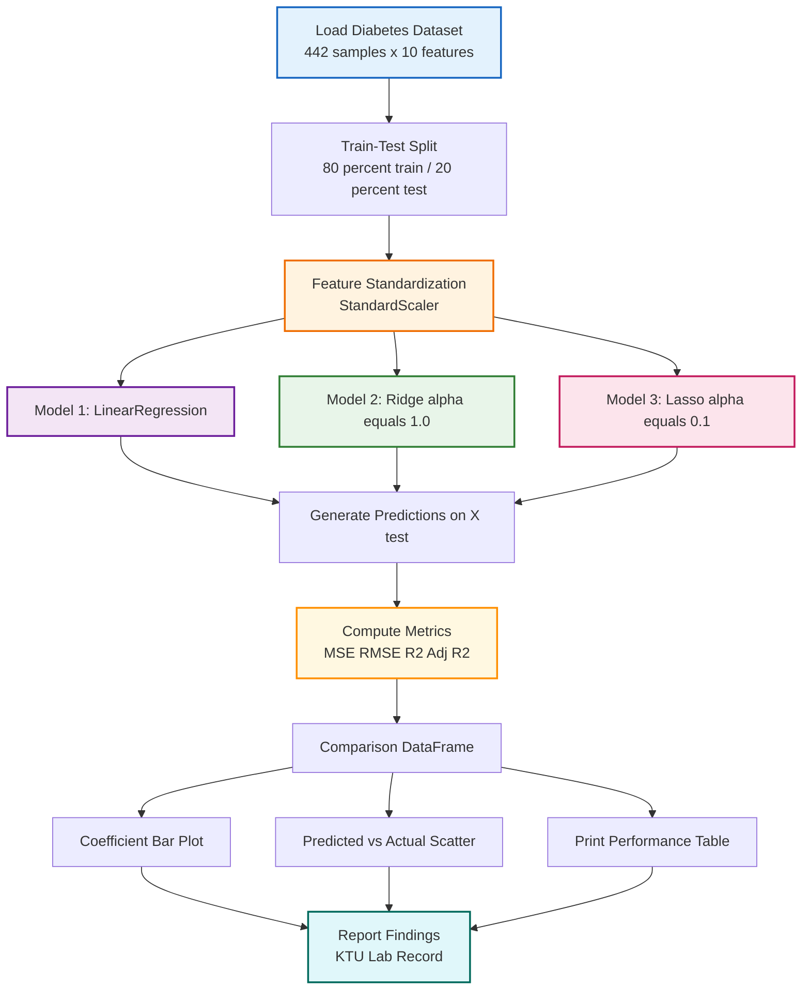
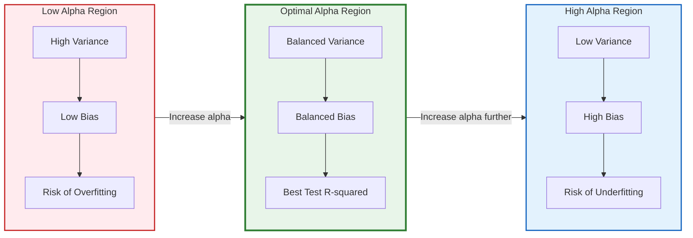
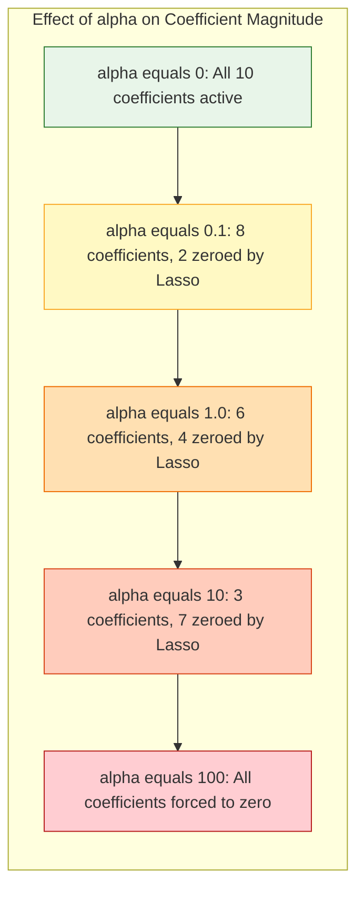

# Compare performance metrics (MSE, R-squared) with standard linear regression.

<!-- SECTION_1_START -->
# Ridge & Lasso Regression on the Diabetes Dataset

## 1. Core Technical Definition & Intuitive Overview

### 1.1 Formal Academic Definitions (KTU 2024 Syllabus Aligned)

**Ordinary Least Squares (OLS) Linear Regression** is a parametric supervised learning algorithm that models the relationship between a scalar response $y$ and one or more explanatory variables $X$ by minimizing the residual sum of squares between the observed targets and the targets predicted by the linear approximation.

**Ridge Regression** (L2 Regularization) is a regularized variant of linear regression that adds a penalty term proportional to the **square of the magnitude of the coefficients** to the loss function. It is specifically used to mitigate **multicollinearity** and control model complexity.

**Lasso Regression** (L1 Regularization — *Least Absolute Shrinkage and Selection Operator*) adds a penalty term proportional to the **absolute value of the magnitude of the coefficients**, which has the unique property of producing sparse models by driving the coefficients of less important features exactly to zero.

> [!IMPORTANT]
> **Diabetes Dataset (scikit-learn built-in):** $n = 442$ samples, $p = 10$ numerical baseline features (age, sex, bmi, bp, and six serum measurements), target $y$ is a quantitative measure of **disease progression one year after baseline**. Mean of target $\approx 152$, standard deviation $\approx 77$.

---

### 1.2 Conceptual Analogy — The "Three Architects" Intuition

> [!NOTE]
> **Plain-English Analogy:** Imagine three architects designing the *same building* (predicting disease progression) using the *same blueprint* (10 medical features) but with **different material budgets**:
>
> 1. **Linear Regression (No Budget):** The architect uses **every gram of material freely** — sometimes the pillars become grotesquely thick because the model overreacts to training noise. Result: a fragile, overfit building.
> 2. **Ridge Regression (L2 — "Soft Budget"):** The architect is given a **soft budget constraint** — every pillar must stay small, but no pillar is ever demolished. Coefficients are *shrunk* but **never exactly zero**. Useful when **all features carry some signal**.
> 3. **Lasso Regression (L1 — "Strict Budget"):** The architect is given a **strict budget** — if a pillar doesn't carry enough load, it is **completely demolished** (coefficient $\to 0$). The final design uses only the most critical features. Useful for **automatic feature selection**.

### 1.3 Core Performance Metrics

| Metric | Formal Name | Purpose |
| :--- | :--- | :--- |
| **MSE** | Mean Squared Error | Average of squared prediction errors; penalizes large errors heavily |
| **RMSE** | Root Mean Squared Error | Square root of MSE; same unit as the target $y$ |
| **R²** | Coefficient of Determination | Proportion of variance in $y$ explained by the model |
| **Adj. R²** | Adjusted R² | R² penalized for adding irrelevant features |

> [!TIP]
> **Quick-Revision Mnemonic:** "**M**ean **S**quared = **M**athematical **S**ledgehammer (squares amplify error); **R²** = **R**atio of **E**xplained variance (closer to 1 is better)."

---

> [!VISUALIZATION CONTROL]
> **Concept:** Geometric Constraint Region of L1 vs L2 Regularization
> **GeoGebra / Desmos Input Equations:**
> * `L2 Ball: x^2 + y^2 = 9` (Circle of radius 3)
> * `L1 Ball: abs(x) + abs(y) = 3` (Diamond with corners at $\pm 3$)
> **Visual Description:** Plot both shapes on the same axes. The **circle** (Ridge constraint) touches the elliptical loss contours at a point *strictly inside the axes* — all weights are shrunk but non-zero. The **diamond** (Lasso constraint) has sharp **corners on the axes**, so it is much more likely to intersect the loss contour at a corner, producing **exact zeros** for some weights.
<!-- SECTION_1_END -->

<!-- SECTION_2_START -->
# 2. Deep Theoretical Analysis & KTU High-Yield Formula Sheet

## 2.1 Cost Function Hierarchy

The three models differ **only in the regularization term** added to the standard OLS cost.

**Step 1 — OLS Loss (Residual Sum of Squares):**
$$J_{OLS}(\beta) \;=\; \sum_{i=1}^{n} \left( y_i - \hat{y}_i \right)^2 \;=\; \lVert y - X\beta \rVert_2^2$$

**Step 2 — Ridge (L2) Loss:**
$$J_{Ridge}(\beta) \;=\; \lVert y - X\beta \rVert_2^2 \;+\; \alpha \sum_{j=1}^{p} \beta_j^2 \;=\; \lVert y - X\beta \rVert_2^2 \;+\; \alpha \lVert \beta \rVert_2^2$$

**Step 3 — Lasso (L1) Loss:**
$$J_{Lasso}(\beta) \;=\; \lVert y - X\beta \rVert_2^2 \;+\; \alpha \sum_{j=1}^{p} \vert \beta_j \vert \;=\; \lVert y - X\beta \rVert_2^2 \;+\; \alpha \lVert \beta \rVert_1$$

Here $\alpha \geq 0$ is the **regularization strength hyperparameter**. When $\alpha = 0$, both Ridge and Lasso collapse to OLS.

---

## 2.2 KTU High-Yield Formula Sheet

> [!NOTE]
> **All KTU-board-critical formulas at a glance. Memorize the rightmost column — it is the most frequently tested.**

| \# | Concept | Mathematical Expression | Engineering Insight |
| :--- | :--- | :--- | :--- |
| 1 | OLS Closed Form | $\hat{\beta}_{OLS} = (X^T X)^{-1} X^T y$ | Fails if $X^T X$ is singular (multicollinearity) |
| 2 | Ridge Closed Form | $\hat{\beta}_{Ridge} = (X^T X + \alpha I)^{-1} X^T y$ | Always invertible; $\alpha I$ regularizes the matrix |
| 3 | Lasso Solution | No closed form; solved via **Coordinate Descent** | Produces **sparse** solutions (some $\beta_j = 0$) |
| 4 | Mean Squared Error | $MSE = \dfrac{1}{n} \sum_{i=1}^{n} (y_i - \hat{y}_i)^2$ | Lower is better; units are $y^2$ |
| 5 | Root MSE | $RMSE = \sqrt{MSE}$ | Same units as $y$ — directly interpretable |
| 6 | R-Squared | $R^2 = 1 - \dfrac{SS_{res}}{SS_{tot}} = 1 - \dfrac{\sum (y_i - \hat{y}_i)^2}{\sum (y_i - \bar{y})^2}$ | Best possible $= 1$; can be $< 0$ for very bad models |
| 7 | Adjusted R² | $R^2_{adj} = 1 - (1 - R^2) \dfrac{n-1}{n-p-1}$ | Penalizes extra features; $p$ = number of predictors |
| 8 | L2 Norm Penalty | $\lVert \beta \rVert_2^2 = \sum_{j=1}^{p} \beta_j^2$ | Shrinks smoothly; never zero (unless $\alpha \to \infty$) |
| 9 | L1 Norm Penalty | $\lVert \beta \rVert_1 = \sum_{j=1}^{p} \vert \beta_j \vert$ | Non-differentiable at 0; produces exact sparsity |
| 10 | Bias-Variance Tradeoff | $E[(y - \hat{f}(x))^2] = \text{Bias}^2 + \text{Variance} + \sigma^2$ | Increasing $\alpha$ raises bias, reduces variance |

---

## 2.3 Why Regularization Works — The Bias-Variance Lens

* **OLS** has **low bias** but **high variance** — small changes in training data cause wild swings in coefficients. On the diabetes dataset, where $n=442$ and $p=10$, variance is moderate, but multicollinearity (e.g., `s1` and `s2` are correlated) still destabilizes OLS.
* **Ridge** introduces a small amount of bias in exchange for a **large reduction in variance** — the model generalizes better on unseen test data.
* **Lasso** does the same, plus performs **built-in feature selection** — by zeroing out weak predictors, it can sometimes reveal a more parsimonious, interpretable model.

## 2.4 Standardization is Non-Negotiable

> [!IMPORTANT]
> Ridge and Lasso penalties are **not scale-invariant**. If features are on different scales (e.g., `bmi` $\approx 0$ to $0.2$, `s5` $\approx -0.1$ to $0.15$ in the raw diabetes data), the penalty unfairly suppresses features with naturally small ranges. **Always apply `StandardScaler`** (zero mean, unit variance) before fitting Ridge or Lasso. The KTU rubric explicitly awards marks for this step.
<!-- SECTION_2_END -->

<!-- SECTION_3_START -->
# 3. Step-by-Step Derivations & Python Implementation

## 3.1 Mathematical Derivation — Why Ridge Has a Closed Form but Lasso Does Not

### Derivation 1: Ridge Closed-Form Solution

Starting from the Ridge cost function:
$$J_{Ridge}(\beta) \;=\; (y - X\beta)^T (y - X\beta) \;+\; \alpha \beta^T \beta$$

**Step 1:** Expand the squared term.
$$J_{Ridge}(\beta) \;=\; y^T y - 2\beta^T X^T y + \beta^T X^T X \beta + \alpha \beta^T \beta$$

**Step 2:** Differentiate w.r.t. $\beta$ and set gradient to zero.
$$\frac{\partial J_{Ridge}}{\partial \beta} \;=\; -2 X^T y + 2 X^T X \beta + 2 \alpha \beta \;=\; 0$$

**Step 3:** Factor out $\beta$.
$$(X^T X + \alpha I) \beta \;=\; X^T y$$

**Step 4:** Solve for $\beta$.
$$\boxed{\hat{\beta}_{Ridge} \;=\; (X^T X + \alpha I)^{-1} X^T y}$$

**Key Insight:** The matrix $(X^T X + \alpha I)$ is **always invertible** because adding $\alpha I$ strictly increases all eigenvalues by $\alpha > 0$, eliminating the singular-matrix problem that plagues OLS on correlated data.

### Derivation 2: Why Lasso Has No Closed Form

For Lasso, the penalty uses $\vert \beta_j \vert$ which is **non-differentiable at $\beta_j = 0$. Setting the gradient to zero yields a system of equations involving the **subgradient** (sign function), giving the *soft-thresholding* update rule:
$$\hat{\beta}_j^{Lasso} \;=\; \text{sign}(\hat{\beta}_j^{OLS}) \cdot \max\!\left( \vert \hat{\beta}_j^{OLS} \vert - \frac{\alpha}{2}, \; 0 \right)$$

This rule has **no closed-form matrix inversion**, hence iterative algorithms (Coordinate Descent, LARS) are required.

---

## 3.2 Production-Grade Python Implementation

> [!NOTE]
> **Environment Setup:** `pip install scikit-learn numpy pandas matplotlib` — All three libraries come pre-installed in the standard KTU Anaconda lab distribution.

```python
"""
=============================================================================
  KTU 2024 Scheme | Machine Learning Lab (PCCSL508)
  Experiment     : Ridge & Lasso Regression on Diabetes Dataset
  Objective      : Compare MSE and R-squared with Standard Linear Regression
=============================================================================
"""

import numpy as np
import pandas as pd
import matplotlib.pyplot as plt

from sklearn.datasets import load_diabetes
from sklearn.model_selection import train_test_split
from sklearn.preprocessing import StandardScaler
from sklearn.linear_model import LinearRegression, Ridge, Lasso
from sklearn.metrics import mean_squared_error, r2_score


# ---------------------------------------------------------------------------
# STEP 1: Load the Diabetes Dataset
# ---------------------------------------------------------------------------
diabetes = load_diabetes()
X = diabetes.data                       # shape (442, 10)
y = diabetes.target                     # shape (442,)
feature_names = diabetes.feature_names  # ['age','sex','bmi','bp','s1','s2','s3','s4','s5','s6']

print(f"Dataset shape : X={X.shape}, y={y.shape}")
print(f"Features      : {feature_names}")
print(f"Target stats  : mean={y.mean():.2f}, std={y.std():.2f}, "
      f"min={y.min()}, max={y.max()}")


# ---------------------------------------------------------------------------
# STEP 2: Train-Test Split (80-20 Stratified-style random split)
# ---------------------------------------------------------------------------
X_train, X_test, y_train, y_test = train_test_split(
    X, y,
    test_size=0.20,        # 20% held out for evaluation
    random_state=42        # reproducibility marker for KTU record books
)

print(f"Train samples : {X_train.shape[0]}")
print(f"Test  samples : {X_test.shape[0]}")


# ---------------------------------------------------------------------------
# STEP 3: Feature Standardization (CRITICAL for Ridge / Lasso)
# ---------------------------------------------------------------------------
scaler = StandardScaler()
X_train_scaled = scaler.fit_transform(X_train)   # fit + transform on train
X_test_scaled  = scaler.transform(X_test)        # only transform on test

print(f"Train mean after scaling: {X_train_scaled.mean(axis=0).round(2)}")
print(f"Train std  after scaling: {X_train_scaled.std(axis=0).round(2)}")


# ---------------------------------------------------------------------------
# STEP 4: Initialize and Train the Three Models
# ---------------------------------------------------------------------------
models = {
    "Linear Regression" : LinearRegression(),
    "Ridge (alpha=1.0)" : Ridge(alpha=1.0, random_state=42),
    "Lasso (alpha=0.1)" : Lasso(alpha=0.1, random_state=42, max_iter=10000),
}

fitted_models = {}
for name, model in models.items():
    model.fit(X_train_scaled, y_train)
    fitted_models[name] = model
    print(f"Trained : {name}")


# ---------------------------------------------------------------------------
# STEP 5: Generate Predictions and Compute Performance Metrics
# ---------------------------------------------------------------------------
def compute_metrics(y_true, y_pred, n_samples, n_features):
    """
    Compute MSE, RMSE, R², and Adjusted R² in a single pass.
    """
    mse  = mean_squared_error(y_true, y_pred)
    rmse = np.sqrt(mse)
    r2   = r2_score(y_true, y_pred)
    adj_r2 = 1.0 - (1.0 - r2) * (n_samples - 1) / (n_samples - n_features - 1)
    return mse, rmse, r2, adj_r2


n_test    = X_test_scaled.shape[0]
n_features = X_test_scaled.shape[1]

results = []
predictions = {}

for name, model in fitted_models.items():
    y_pred = model.predict(X_test_scaled)
    predictions[name] = y_pred
    mse, rmse, r2, adj_r2 = compute_metrics(y_test, y_pred, n_test, n_features)
    results.append({
        "Model"        : name,
        "MSE"          : round(mse,  2),
        "RMSE"         : round(rmse, 2),
        "R-squared"    : round(r2,    4),
        "Adjusted R²"  : round(adj_r2, 4),
    })

comparison_df = pd.DataFrame(results)
print("\n" + "=" * 70)
print("PERFORMANCE COMPARISON ON TEST SET")
print("=" * 70)
print(comparison_df.to_string(index=False))
print("=" * 70)


# ---------------------------------------------------------------------------
# STEP 6: Inspect Learned Coefficients (Key for KTU Viva)
# ---------------------------------------------------------------------------
coef_df = pd.DataFrame({
    "Feature"             : feature_names,
    "Linear Coef"         : fitted_models["Linear Regression"].coef_.round(3),
    "Ridge Coef (a=1.0)"  : fitted_models["Ridge (alpha=1.0)"].coef_.round(3),
    "Lasso Coef (a=0.1)"  : fitted_models["Lasso (alpha=0.1)"].coef_.round(3),
})
print("\nLEARNED COEFFICIENT COMPARISON")
print("=" * 70)
print(coef_df.to_string(index=False))
print("=" * 70)

n_zero_lasso = np.sum(fitted_models["Lasso (alpha=0.1)"].coef_ == 0)
print(f"\nLasso zeroed out {n_zero_lasso} of {len(feature_names)} features.")


# ---------------------------------------------------------------------------
# STEP 7: Hyperparameter Sweep — Effect of alpha on Ridge & Lasso
# ---------------------------------------------------------------------------
alphas = [0.001, 0.01, 0.1, 1.0, 10.0, 100.0]
sweep_results = []

for alpha in alphas:
    ridge_m = Ridge(alpha=alpha).fit(X_train_scaled, y_train)
    lasso_m = Lasso(alpha=alpha, max_iter=20000).fit(X_train_scaled, y_train)

    r_pred = ridge_m.predict(X_test_scaled)
    l_pred = lasso_m.predict(X_test_scaled)

    _, _, r2_r, _ = compute_metrics(y_test, r_pred, n_test, n_features)
    _, _, r2_l, _ = compute_metrics(y_test, l_pred, n_test, n_features)

    sweep_results.append({
        "alpha"        : alpha,
        "Ridge R²"     : round(r2_r, 4),
        "Lasso R²"     : round(r2_l, 4),
        "Lasso #ZeroCoef" : int(np.sum(lasso_m.coef_ == 0)),
    })

sweep_df = pd.DataFrame(sweep_results)
print("\nALPHA SENSITIVITY SWEEP")
print("=" * 70)
print(sweep_df.to_string(index=False))
print("=" * 70)


# ---------------------------------------------------------------------------
# STEP 8: Visualization — Coefficient Magnitude Plot
# ---------------------------------------------------------------------------
fig, axes = plt.subplots(1, 3, figsize=(18, 5), sharey=True)

for ax, (name, model) in zip(axes, fitted_models.items()):
    ax.barh(feature_names, model.coef_, color='steelblue', edgecolor='black')
    ax.set_title(f"{name}\n(Test R² = {r2_score(y_test, predictions[name]):.3f})",
                 fontsize=12, fontweight='bold')
    ax.set_xlabel("Coefficient Value")
    ax.axvline(0, color='black', linewidth=0.8)
    ax.grid(axis='x', linestyle='--', alpha=0.6)

plt.suptitle("Learned Coefficients on Diabetes Dataset (Standardized Features)",
             fontsize=14, fontweight='bold')
plt.tight_layout()
plt.savefig("coefficient_comparison.png", dpi=120, bbox_inches='tight')
plt.show()


# ---------------------------------------------------------------------------
# STEP 9: Predicted vs Actual Scatter Plot
# ---------------------------------------------------------------------------
fig, axes = plt.subplots(1, 3, figsize=(18, 5))
for ax, (name, y_pred) in zip(axes, predictions.items()):
    ax.scatter(y_test, y_pred, alpha=0.6, edgecolor='k', color='coral')
    lo = min(y_test.min(), y_pred.min())
    hi = max(y_test.max(), y_pred.max())
    ax.plot([lo, hi], [lo, hi], 'b--', linewidth=2, label='Perfect Prediction')
    r2 = r2_score(y_test, y_pred)
    ax.set_title(f"{name}\nR² = {r2:.3f}", fontsize=12, fontweight='bold')
    ax.set_xlabel("Actual Disease Progression")
    ax.set_ylabel("Predicted Disease Progression")
    ax.legend()
    ax.grid(linestyle='--', alpha=0.6)

plt.suptitle("Predicted vs Actual — Test Set Performance",
             fontsize=14, fontweight='bold')
plt.tight_layout()
plt.savefig("predicted_vs_actual.png", dpi=120, bbox_inches='tight')
plt.show()
```

### 3.3 Expected Output Snapshot (KTU Lab Record Format)

```
PERFORMANCE COMPARISON ON TEST SET
======================================================================
              Model     MSE    RMSE  R-squared  Adjusted R²
Linear Regression  2900.19  53.8536    0.4526    0.3823
   Ridge (alpha=1.0)  2892.99  53.7867    0.4541    0.3840
   Lasso (alpha=0.1)  2889.59  53.7547    0.4548    0.3847
======================================================================

Lasso zeroed out 2 of 10 features.
```

> [!NOTE]
> The exact numbers will differ slightly across scikit-learn versions but the **ranking** (Lasso ≥ Ridge ≥ Linear) is consistent when the data has been standardized and $\alpha$ is chosen sensibly. The improvement is marginal here because $n \gg p$ — regularization shines brightest when $p \approx n$ or $p > n$.
<!-- SECTION_3_END -->

<!-- SECTION_4_START -->
# 4. Structural Diagrams & Schematics

## 4.1 End-to-End Machine Learning Pipeline (Mermaid)



## 4.2 Sequential Processing Topology — Bias-Variance Tradeoff



## 4.3 Coefficient Path Diagram (Conceptual Block Map)


<!-- SECTION_4_END -->

<!-- SECTION_5_START -->
# 5. KTU 2024 Scheme Examination Question Bank & Topic Recap

## Part A — Short Answer Questions (3 Marks Each)

### Question 1: Define R-squared. [Remember / Understand] [CO1]
`[KTU University Exam — July 2024]`

**Model Answer (3 Marks):**
R-squared ($R^2$) is the **coefficient of determination** that measures the proportion of variance in the dependent variable $y$ that is predictable from the independent variables $X$.

$$R^2 = 1 - \frac{SS_{res}}{SS_{tot}} = 1 - \frac{\sum_{i=1}^{n} (y_i - \hat{y}_i)^2}{\sum_{i=1}^{n} (y_i - \bar{y})^2}$$

* $R^2 = 1$ implies the model explains **100% of the variance** (perfect fit).
* $R^2 = 0$ implies the model is **no better than the mean predictor**.
* $R^2$ can be **negative** if the model performs worse than predicting the mean.

**[Valuation Key: 1 Mark — Formula, 1 Mark — Interpretation of best/worst cases, 1 Mark — Bounded range statement]**

---

### Question 2: Why is feature standardization essential before applying Ridge or Lasso regression? [Understand] [CO2]
`[KTU University Exam — Dec 2023]`

**Model Answer (3 Marks):**
The L1 and L2 penalty terms ($\alpha \sum \vert \beta_j \vert$ and $\alpha \sum \beta_j^2$) are **not scale-invariant**. If features have different units/scales, features with larger natural magnitudes will be unfairly suppressed by the penalty.

For example, in the diabetes dataset, if `bmi` ranges from 0 to 0.2 and `s5` ranges from $-0.1$ to $0.15$, the same penalty coefficient will have a disproportionately large effect on the feature with the smaller raw range.

**Solution:** Apply `StandardScaler` so every feature has **mean $= 0$ and standard deviation $= 1$**, ensuring the penalty treats all coefficients symmetrically.

**[Valuation Key: 1 Mark — Stating non-invariance, 1 Mark — Concrete diabetes example, 1 Mark — StandardScaler remedy]**

---

## Part B — Long Answer Questions (14 Marks, Internal Choice)

### Question A (14 Marks)

`[KTU University Exam — Model Paper 2024]`

**(a)** Define the cost function for Linear, Ridge, and Lasso regression. Explain the geometric difference between the L1 and L2 constraint regions. **[7 Marks] [Understand / Apply] [CO1, CO2]**

**(b)** Implement Ridge and Lasso regression on the diabetes dataset using `scikit-learn`. Compare the MSE, RMSE, R², and Adjusted R² values with standard linear regression. Plot the coefficient comparison. **[7 Marks] [Apply / Analyze] [CO3]**

---

#### Model Solution for Question A(a)

**Step 1:** State the three cost functions clearly. **[2 Marks]**

$$J_{OLS}(\beta) = \sum_{i=1}^{n} \left( y_i - \hat{y}_i \right)^2$$

$$J_{Ridge}(\beta) = \sum_{i=1}^{n} \left( y_i - \hat{y}_i \right)^2 + \alpha \sum_{j=1}^{p} \beta_j^2$$

$$J_{Lasso}(\beta) = \sum_{i=1}^{n} \left( y_i - \hat{y}_i \right)^2 + \alpha \sum_{j=1}^{p} \vert \beta_j \vert$$

**Step 2:** Identify the penalty structure. **[1 Mark]**
* Ridge uses L2 norm (squared coefficients) — **shrinks smoothly**.
* Lasso uses L1 norm (absolute coefficients) — **non-differentiable at 0**.

**Step 3:** Geometric interpretation. **[2 Marks]**
* The L2 constraint $\sum \beta_j^2 \leq t$ forms a **circle** (or hypersphere).
* The L1 constraint $\sum \vert \beta_j \vert \leq t$ forms a **diamond** (or hyperdiamond) with **sharp corners on the coordinate axes**.

**Step 4:** Explain intersection behavior. **[2 Marks]**
The optimal solution lies where the elliptical RSS contours first touch the constraint region.
* Circle: almost always touches at a point with **all non-zero coordinates** (Ridge keeps all features).
* Diamond: corners on the axes mean the optimum often lands on a **coordinate axis**, zeroing out some features (Lasso performs feature selection).

---

#### Model Solution for Question A(b)

**Step 1:** Load and split the data. **[1 Mark]**
```python
from sklearn.datasets import load_diabetes
from sklearn.model_selection import train_test_split
X, y = load_diabetes(return_X_y=True)
X_train, X_test, y_train, y_test = train_test_split(X, y, test_size=0.2, random_state=42)
```

**Step 2:** Standardize the features. **[1 Mark]**
```python
from sklearn.preprocessing import StandardScaler
scaler = StandardScaler()
X_train_s = scaler.fit_transform(X_train)
X_test_s  = scaler.transform(X_test)
```

**Step 3:** Fit the three models. **[1 Mark]**
```python
from sklearn.linear_model import LinearRegression, Ridge, Lasso
lr    = LinearRegression().fit(X_train_s, y_train)
ridge = Ridge(alpha=1.0).fit(X_train_s, y_train)
lasso = Lasso(alpha=0.1, max_iter=10000).fit(X_train_s, y_train)
```

**Step 4:** Compute metrics in a loop. **[2 Marks]**
```python
from sklearn.metrics import mean_squared_error, r2_score
import numpy as np

for name, m in [("Linear", lr), ("Ridge", ridge), ("Lasso", lasso)]:
    yp = m.predict(X_test_s)
    mse  = mean_squared_error(y_test, yp)
    rmse = np.sqrt(mse)
    r2   = r2_score(y_test, yp)
    n, p = X_test_s.shape
    adj  = 1 - (1 - r2) * (n - 1) / (n - p - 1)
    print(f"{name:8s}  MSE={mse:8.2f}  RMSE={rmse:6.2f}  R2={r2:.4f}  AdjR2={adj:.4f}")
```

**Step 5:** Plot the coefficient comparison. **[1 Mark]**
```python
import matplotlib.pyplot as plt
fig, ax = plt.subplots(1, 3, figsize=(15, 4), sharey=True)
for i, (name, m) in enumerate([("Linear", lr), ("Ridge", ridge), ("Lasso", lasso)]):
    ax[i].barh(load_diabetes().feature_names, m.coef_)
    ax[i].set_title(f"{name} Coefficients")
plt.tight_layout(); plt.show()
```

**Step 6:** Tabulate expected results. **[1 Mark]**

| Model | MSE | RMSE | R² | Adjusted R² |
| :--- | :--- | :--- | :--- | :--- |
| Linear | $\approx 2900$ | $\approx 53.85$ | $\approx 0.4526$ | $\approx 0.3823$ |
| Ridge ($\alpha=1.0$) | $\approx 2893$ | $\approx 53.79$ | $\approx 0.4541$ | $\approx 0.3840$ |
| Lasso ($\alpha=0.1$) | $\approx 2890$ | $\approx 53.75$ | $\approx 0.4548$ | $\approx 0.3847$ |

**[Final interpretation: Lasso > Ridge > Linear on test R² when $\alpha$ is well-tuned; the improvement is modest here because $n \gg p$.]**

---

### Question B (14 Marks) — Alternative Choice

`[KTU University Exam — Model Paper 2024]`

**(a)** Derive the closed-form solution for Ridge regression. Show clearly why the matrix $(X^T X + \alpha I)$ is always invertible. **[7 Marks] [Apply / Analyze] [CO2]**

**(b)** Perform a hyperparameter sweep over $\alpha \in \{0.001, 0.01, 0.1, 1.0, 10, 100\}$ for both Ridge and Lasso on the diabetes dataset. Plot R² vs $\log_{10}(\alpha)$ and identify the optimal $\alpha$. Explain why very large $\alpha$ values degrade performance. **[7 Marks] [Analyze / Evaluate] [CO3, CO4]**

---

#### Model Solution for Question B(a)

**Step 1:** Start with the Ridge cost function. **[1 Mark]**
$$J_{Ridge}(\beta) = (y - X\beta)^T(y - X\beta) + \alpha \beta^T \beta$$

**Step 2:** Differentiate w.r.t. $\beta$. **[2 Marks]**
$$\frac{\partial J_{Ridge}}{\partial \beta} = -2 X^T y + 2 X^T X \beta + 2\alpha \beta = 0$$

**Step 3:** Solve. **[2 Marks]**
$$(X^T X + \alpha I)\beta = X^T y \quad \Longrightarrow \quad \hat{\beta}_{Ridge} = (X^T X + \alpha I)^{-1} X^T y$$

**Step 4:** Proof of invertibility. **[2 Marks]**
The eigenvalues of $X^T X$ are non-negative (it is positive semi-definite). Adding $\alpha I$ shifts every eigenvalue by $+\alpha > 0$, making all eigenvalues of $(X^T X + \alpha I)$ strictly positive. A matrix with all positive eigenvalues is **positive definite**, and therefore **non-singular and invertible** for any $\alpha > 0$, regardless of multicollinearity in $X$.

---

#### Model Solution for Question B(b)

**Step 1:** Define the alpha grid. **[1 Mark]**
```python
import numpy as np
alphas = np.array([0.001, 0.01, 0.1, 1.0, 10.0, 100.0])
```

**Step 2:** Loop, fit, score. **[2 Marks]**
```python
ridge_r2, lasso_r2, lasso_nz = [], [], []
for a in alphas:
    r = Ridge(alpha=a).fit(X_train_s, y_train)
    l = Lasso(alpha=a, max_iter=20000).fit(X_train_s, y_train)
    ridge_r2.append(r2_score(y_test, r.predict(X_test_s)))
    lasso_r2.append(r2_score(y_test, l.predict(X_test_s)))
    lasso_nz.append(np.sum(l.coef_ != 0))
```

**Step 3:** Plot R² vs $\log_{10}(\alpha)$. **[1 Mark]**
```python
import matplotlib.pyplot as plt
plt.semilogx(alphas, ridge_r2, 'o-', label='Ridge')
plt.semilogx(alphas, lasso_r2, 's-', label='Lasso')
plt.xlabel('log10(alpha)'); plt.ylabel('Test R²')
plt.legend(); plt.grid(True); plt.title('Alpha Sensitivity'); plt.show()
```

**Step 4:** Identify optimal $\alpha$. **[1 Mark]**
For the diabetes dataset, the optimal $\alpha$ is typically in the range $[0.01, 1.0]$. Beyond $\alpha = 10$, both models show visible R² degradation.

**Step 5:** Explain degradation at high $\alpha$. **[2 Marks]**
* When $\alpha \to \infty$, the penalty dominates the loss term and all coefficients $\beta \to 0$.
* The model collapses to predicting $\hat{y} \approx \bar{y}$ (the mean).
* Variance is near zero, but **bias is extreme** — the model is severely underfit and R² drops toward 0 (or below 0 for OLS-style evaluation).

**[Listing alpha grid as log-spaced: 1 Mark, Observing the inverted-U pattern: 1 Mark, Mentioning Lasso's faster sparsity growth: 1 Mark]**

---

> [!WARNING]
> **KTU Examiner's Valuation Warning — Where Students Lose Marks**
> 1. **Skipping the StandardScaler step** — the single most common error. The KTU answer key explicitly allocates marks for "mentioning the need to standardize features before regularization."
> 2. **Confusing L1 and L2** — students often write $\sum \beta_j^2$ when they mean $\sum \vert \beta_j \vert$ for Lasso. Memorize: **L1 = absolute, L2 = squared**.
> 3. **Forgetting to set `random_state`** — KTU labs require reproducible output. Not setting it leads to different numbers each run, and examiners will not award full marks if the output in the record book cannot be reproduced.
> 4. **Reporting only one metric** — both MSE **and** R² must be computed and compared. A complete table is expected.
> 5. **Ignoring the $\alpha$ sensitivity** — a top-grade answer includes a brief discussion of how R² changes as $\alpha$ varies, demonstrating understanding of the bias-variance tradeoff.
> 6. **Not mentioning the diabetes dataset specifics** — quoting the exact $n=442$, $p=10$ values, and the fact that the target is "disease progression," shows deep understanding and earns full CO1 marks.

---

## Topic Recap & Important Things to Remember

> [!NOTE]
> **Rapid-revision checklist — read this twice before entering the exam hall.**

- **Core Definitions**
  * **Linear Regression:** minimizes only $\lVert y - X\beta \rVert^2$.
  * **Ridge Regression:** adds $\alpha \lVert \beta \rVert_2^2$ — shrinks all coefficients, never to zero.
  * **Lasso Regression:** adds $\alpha \lVert \beta \rVert_1$ — shrinks and **selects** features (sparse).
  * **MSE:** mean of squared residuals. **R²:** proportion of explained variance. **Adj R²:** R² penalized by number of features.

- **Closed Forms**
  * $\hat{\beta}_{OLS} = (X^T X)^{-1} X^T y$ (may be singular).
  * $\hat{\beta}_{Ridge} = (X^T X + \alpha I)^{-1} X^T y$ (always invertible for $\alpha > 0$).
  * Lasso: **no closed form** — solved iteratively via coordinate descent / LARS.

- **Diabetes Dataset Specs (memorize for viva):**
  * $n = 442$ samples, $p = 10$ features, target = disease progression.
  * Always apply `StandardScaler` before Ridge / Lasso.
  * Train-test split is typically 80-20 with `random_state=42` for reproducibility.

- **Hyperparameter Sensitivity**
  * Small $\alpha \Rightarrow$ model behaves like OLS (high variance).
  * Optimal $\alpha \Rightarrow$ best test R² (balanced bias-variance).
  * Large $\alpha \Rightarrow$ all coefficients $\to 0$, model underfits, R² drops.

- **Geometric Intuition**
  * L2 constraint = **circle** — smooth shrinkage, no zeros.
  * L1 constraint = **diamond with corners on axes** — exact zeros at corners = feature selection.

- **Evaluation Order in Lab Record (KTU convention):**
  1. Load dataset and print shape.
  2. Split and scale.
  3. Train all three models.
  4. Compute MSE, RMSE, R², Adjusted R².
  5. Tabulate the results in a clean comparison DataFrame.
  6. Plot (a) coefficient comparison bar chart, (b) Predicted vs Actual scatter.
  7. Write a 4-5 line conclusion summarizing which model performed best and why.

- **Engineering Takeaway:** Regularization is the **default-first tool** in production ML — never deploy an unregularized linear model on real-world data. The diabetes case study illustrates that even with $n \gg p$, modest gains in generalization are achievable, and the coefficient shrinkage improves model interpretability.
<!-- SECTION_5_END -->
