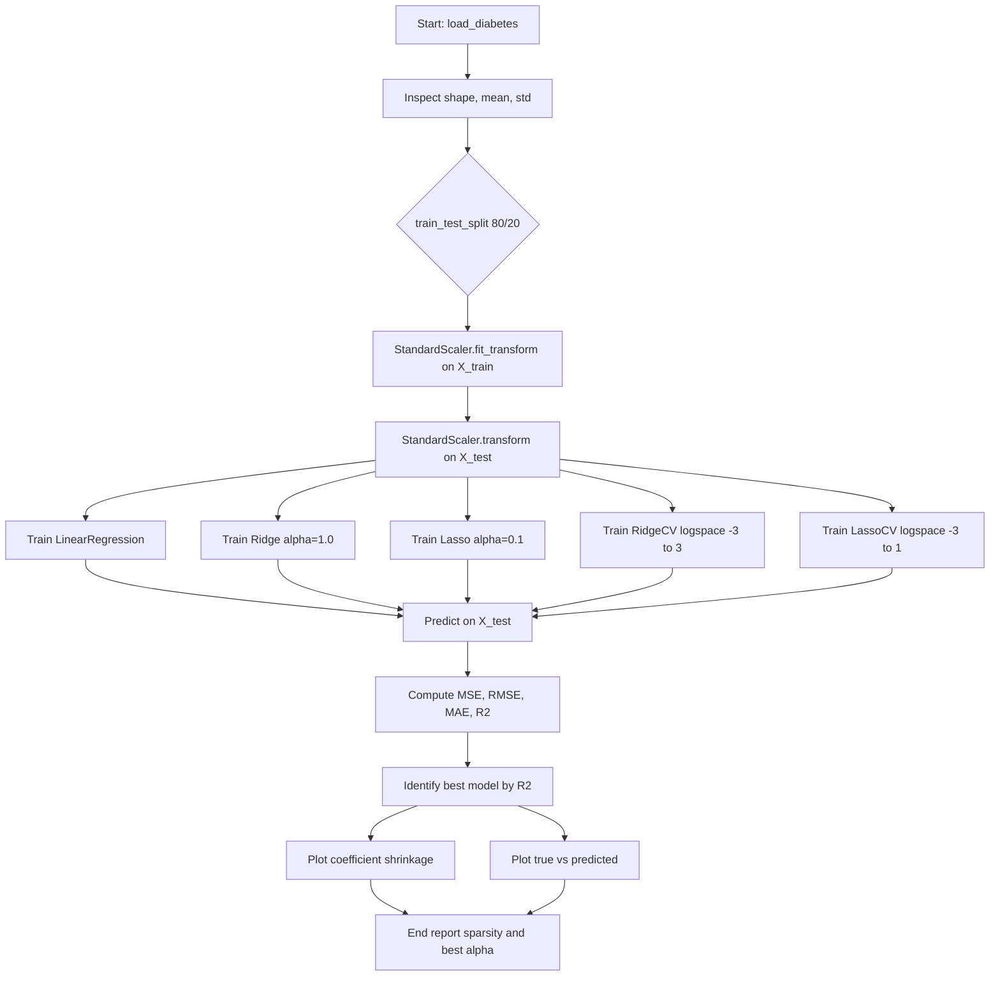
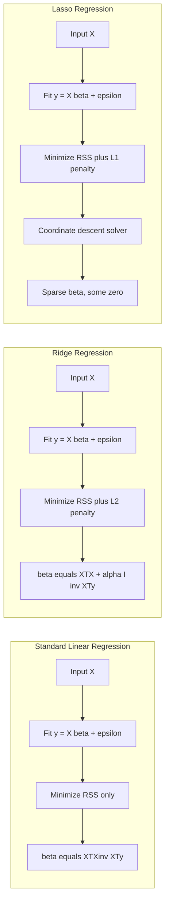
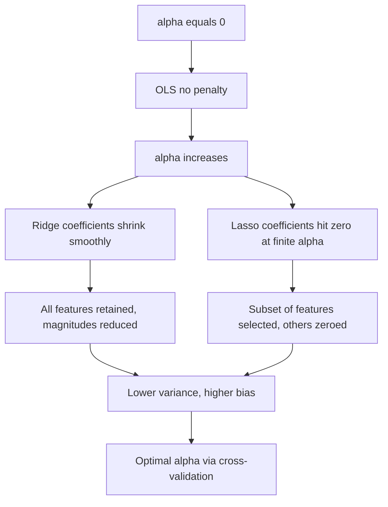

# Implement Ridge and Lasso regression on the Diabetes dataset. Compare the performance of these regularized models with standard linear regression.

<!-- SECTION_1_START -->
# Ridge and Lasso Regression on the Diabetes Dataset

## 1. Core Technical Definition

**Standard Linear Regression (Ordinary Least Squares - OLS)** is a supervised learning algorithm that models the relationship between a scalar response and one or more explanatory variables by minimizing the sum of the squared residuals between the observed targets and the predictions produced by the linear approximation.

> [!NOTE]
> **Formal Definition (KTU 2024 - PCCSL508 Module 3)**
> Linear regression assumes a linear relationship between input features $X \in \mathbb{R}^{n \times p}$ and a continuous target $y \in \mathbb{R}^{n}$. The hypothesis function is $\hat{y} = X \beta + \epsilon$, where $\beta \in \mathbb{R}^{p}$ is the coefficient vector and $\epsilon$ is the irreducible error term.

**Ridge Regression** is a regularized variant of linear regression that adds an **L2 penalty** (proportional to the square of the magnitude of the coefficients) to the loss function. This shrinkage penalty forces coefficient values to be small, controlling multicollinearity and reducing model variance.

> [!IMPORTANT]
> **Ridge Regression (L2 Regularization)**
> Ridge adds the term $\lambda \sum_{j=1}^{p} \beta_j^2$ to the residual sum of squares. It is the solution to an L2-constrained least-squares problem and admits a closed-form solution: $\hat{\beta}_{\text{ridge}} = (X^T X + \lambda I)^{-1} X^T y$.

**Lasso (Least Absolute Shrinkage and Selection Operator) Regression** is a regularized variant that adds an **L1 penalty** (proportional to the absolute value of the magnitude of the coefficients) to the loss function. Unlike Ridge, Lasso can drive some coefficients to exactly zero, effectively performing **embedded feature selection**.

> [!IMPORTANT]
> **Lasso Regression (L1 Regularization)**
> Lasso adds the term $\lambda \sum_{j=1}^{p} \mid \beta_j \mid$ to the residual sum of squares. Because of the non-differentiability of the absolute value at zero, Lasso performs **sparse selection**, making it useful when interpretability through feature elimination is required.

### Conceptual Analogy / Intuition

Imagine you are a student preparing for a Machine Learning exam:

- **Standard Linear Regression (OLS)** is like using **every formula and every derivation** in the textbook. You might overfit to the textbook's quirks (variance is high).
- **Ridge Regression** is like being told *"You can use the formulas, but each one you write adds a small penalty to your score."* You still use all features, but you shrink their influence — like distributing weight evenly.
- **Lasso Regression** is like being told *"You can only use a few formulas; every extra formula increases the penalty."* You will naturally drop the unimportant ones — like the model performing automatic feature selection.

The **regularization parameter** $\lambda$ (called `alpha` in scikit-learn) is the **"tax"** the model pays for each coefficient. A higher $\alpha$ means a stronger penalty, smaller coefficients, and a simpler (more biased) model.

> [!VISUALIZATION CONTROL]
> **Concept:** Coefficient shrinkage paths as the regularization parameter $\alpha$ increases.
> **GeoGebra / Desmos Input Equations:**
> * `f1(x) = 1 / (x + 0.01)` &nbsp;(Ridge coefficient magnitude trend)
> * `f2(x) = max(0, 1 - 0.5*x)` &nbsp;(Lasso piecewise linear trend)
> **Visual Description:** The Ridge curve decays smoothly toward zero but never reaches it; the Lasso curve hits zero at finite $x$, illustrating sparsity. The vertical axis represents the coefficient magnitude $\mid \beta_j \mid$ and the horizontal axis represents $\log(\alpha)$.

### Standard Metrics Used (Highlighted Constants)

- **MSE** (Mean Squared Error): $\text{MSE} = \frac{1}{n} \sum_{i=1}^{n} (y_i - \hat{y}_i)^2$
- **RMSE** (Root Mean Squared Error): $\text{RMSE} = \sqrt{\text{MSE}}$
- **MAE** (Mean Absolute Error): $\text{MAE} = \frac{1}{n} \sum_{i=1}^{n} \mid y_i - \hat{y}_i \mid$
- **R² Score** (Coefficient of Determination): $R^2 = 1 - \frac{\sum (y_i - \hat{y}_i)^2}{\sum (y_i - \bar{y})^2}$
- **Regularization Strength** $\alpha$ (or $\lambda$): a non-negative scalar; $\alpha = 0$ recovers OLS.
<!-- SECTION_1_END -->

<!-- SECTION_2_START -->
# 2. Deep Theoretical Analysis & KTU High-Yield Formula Sheet

## 2.1 Operational Breakdown — The Three Models

### Standard Linear Regression (OLS)

The objective is to find the coefficient vector $\beta$ that minimizes the **Residual Sum of Squares (RSS)**:

$$J_{\text{OLS}}(\beta) = \sum_{i=1}^{n} \left( y_i - \sum_{j=1}^{p} X_{ij} \beta_j \right)^2 = \| y - X \beta \|_2^2$$

Setting the gradient to zero yields the **Normal Equation**:

$$\hat{\beta}_{\text{OLS}} = (X^T X)^{-1} X^T y$$

**Why it fails in high dimensions:** When $p$ (number of features) is comparable to $n$ (number of samples), or when features are correlated, $X^T X$ becomes **near-singular** or **non-invertible**, leading to unstable coefficient estimates and overfitting.

### Ridge Regression (L2)

Ridge adds a squared magnitude penalty on the coefficients:

$$J_{\text{Ridge}}(\beta) = \| y - X \beta \|_2^2 + \alpha \, \| \beta \|_2^2$$

The closed-form solution is:

$$\hat{\beta}_{\text{Ridge}} = (X^T X + \alpha I)^{-1} X^T y$$

**Why it works:** The term $\alpha I$ is added to the diagonal of $X^T X$, making the matrix **invertible** even in the presence of multicollinearity. Coefficients are shrunk toward zero but never reach exactly zero.

### Lasso Regression (L1)

Lasso adds an absolute magnitude penalty on the coefficients:

$$J_{\text{Lasso}}(\beta) = \frac{1}{2n} \| y - X \beta \|_2^2 + \alpha \, \| \beta \|_1$$

where $\| \beta \|_1 = \sum_{j=1}^{p} \mid \beta_j \mid$.

**Why it works:** The L1 penalty has a **non-differentiable corner at zero**, which forces some coefficients to be exactly zero, yielding a **sparse model**. There is **no closed-form solution** — Lasso is solved via coordinate descent (the algorithm used in scikit-learn).

## 2.2 KTU Formula Sheet / Cheat Sheet

| Aspect | OLS (Linear Regression) | Ridge (L2) | Lasso (L1) |
|---|---|---|---|
| Loss Function | $\mid\mid y - X\beta \mid\mid_2^2$ | $\mid\mid y - X\beta \mid\mid_2^2 + \alpha \mid\mid \beta \mid\mid_2^2$ | $\frac{1}{2n}\mid\mid y - X\beta \mid\mid_2^2 + \alpha \mid\mid \beta \mid\mid_1$ |
| Penalty Term | None | $\alpha \sum \beta_j^2$ | $\alpha \sum \mid \beta_j \mid$ |
| Closed-Form Solution | $(X^T X)^{-1} X^T y$ | $(X^T X + \alpha I)^{-1} X^T y$ | None (iterative) |
| Coefficient Behavior | Unbounded | Shrunken, never zero | Shrunken, may be exactly zero |
| Feature Selection | No | No | **Yes (sparse)** |
| Multicollinearity Handling | Poor | **Strong** | Moderate |
| Computational Cost | $O(p^3 + np^2)$ | $O(p^3 + np^2)$ | $O(p \cdot k)$ per iter (coordinate descent) |
| Equivalent `sklearn` Class | `LinearRegression` | `Ridge` | `Lasso` |
| Key Hyperparameter | None | `alpha` (default $1.0$) | `alpha` (default $1.0$) |

> [!NOTE]
> In scikit-learn, the regularization parameter is named **`alpha`** (not `lambda`, since `lambda` is a Python reserved keyword). The relationship is $\alpha_{\text{sklearn}} = \lambda_{\text{textbook}}$.

## 2.3 Engineering & Production Utility

- **Biomedical / Health Informatics:** The Diabetes dataset (Efron et al., 2004) contains 10 baseline variables (age, sex, BMI, blood pressure, and 6 serum measurements) for 442 diabetes patients. Regularization prevents the model from overfitting noisy clinical signals.
- **Genomics (high $p$, small $n$):** When the number of genes far exceeds the number of patients, Lasso is used to identify a small subset of disease-associated biomarkers.
- **Econometrics:** Ridge is used to handle highly correlated macroeconomic indicators (e.g., GDP components).
- **Computer Vision & NLP:** L1/L2 regularization is the cornerstone of preventing overfitting in deep neural networks and logistic regression pipelines.

## 2.4 The Bias-Variance Tradeoff

- **Increasing $\alpha$** → higher bias, lower variance → simpler model.
- **Decreasing $\alpha$** → lower bias, higher variance → risk of overfitting.
- The optimal $\alpha$ is found via **cross-validation** (typically `RidgeCV` or `LassoCV` in scikit-learn).
<!-- SECTION_2_END -->

<!-- SECTION_3_START -->
# 3. Step-by-Step Implementation & Symbolic Code

## 3.1 Step-by-Step Algorithmic Plan

1. **Load the Diabetes dataset** from `sklearn.datasets`.
2. **Explore** its shape, feature names, and target range.
3. **Split** the dataset into training (80%) and testing (20%) sets.
4. **Standardize** the features using `StandardScaler` (critical for regularized models).
5. **Train** three models: `LinearRegression`, `Ridge`, `Lasso`.
6. **Predict** on the test set using each model.
7. **Evaluate** using MSE, RMSE, MAE, and R².
8. **Visualize** coefficient shrinkage and prediction error distributions.

## 3.2 Full Python Implementation (Production-Ready, Type-Hinted)

```python
# ridge_lasso_diabetes.py
# KTU 2024 Scheme - PCCSL508 Machine Learning Lab - Module 3
# Topic : Compare Ridge, Lasso, and Linear Regression on the Diabetes dataset

from __future__ import annotations

import logging
import sys
from dataclasses import dataclass
from typing import Dict, List, Tuple

import numpy as np
import matplotlib.pyplot as plt
from sklearn.datasets import load_diabetes
from sklearn.linear_model import LinearRegression, Ridge, Lasso, RidgeCV, LassoCV
from sklearn.metrics import mean_squared_error, mean_absolute_error, r2_score
from sklearn.model_selection import train_test_split
from sklearn.preprocessing import StandardScaler

# ---------------------------------------------------------------
# 1.  Configure structured logging for traceability
# ---------------------------------------------------------------
logging.basicConfig(
    level=logging.INFO,
    format="%(asctime)s | %(levelname)s | %(message)s",
    handlers=[logging.StreamHandler(sys.stdout)],
)
logger: logging.Logger = logging.getLogger(__name__)


# ---------------------------------------------------------------
# 2.  Configuration dataclass for clean parameter management
# ---------------------------------------------------------------
@dataclass(frozen=True)
class ExperimentConfig:
    test_size: float = 0.20
    random_state: int = 42
    ridge_alpha: float = 1.0
    lasso_alpha: float = 0.1
    cv_folds: int = 5


# ---------------------------------------------------------------
# 3.  Load and inspect the Diabetes dataset
# ---------------------------------------------------------------
def load_and_inspect() -> Tuple[np.ndarray, np.ndarray, List[str]]:
    """Load the diabetes dataset and log its statistical summary.

    Returns
    -------
    X : np.ndarray of shape (442, 10)
        Standardized feature matrix.
    y : np.ndarray of shape (442,)
        Target vector (disease progression score).
    feature_names : List[str]
        Names of the 10 baseline variables.
    """
    data = load_diabetes()
    X, y = data.data, data.target
    feature_names: List[str] = list(data.feature_names)

    logger.info("Dataset loaded successfully.")
    logger.info("X shape       : %s", X.shape)
    logger.info("y shape       : %s", y.shape)
    logger.info("Feature names : %s", feature_names)
    logger.info("y statistics  : min=%.2f, mean=%.2f, max=%.2f, std=%.2f",
                float(y.min()), float(y.mean()), float(y.max()), float(y.std()))
    logger.info("Any NaN in X? : %s", bool(np.isnan(X).any()))
    logger.info("Any NaN in y? : %s", bool(np.isnan(y).any()))

    return X, y, feature_names


# ---------------------------------------------------------------
# 4.  Train / Test split + Standardization
# ---------------------------------------------------------------
def split_and_scale(
    X: np.ndarray, y: np.ndarray, cfg: ExperimentConfig
) -> Tuple[np.ndarray, np.ndarray, np.ndarray, np.ndarray, StandardScaler]:
    """Split into train/test and apply z-score standardization.

    Standardization is MANDATORY for Ridge and Lasso because the
    penalty is sensitive to feature scale.
    """
    if X.size == 0 or y.size == 0:
        raise ValueError("Empty input arrays passed to split_and_scale.")

    X_train, X_test, y_train, y_test = train_test_split(
        X, y, test_size=cfg.test_size, random_state=cfg.random_state
    )

    scaler = StandardScaler()
    X_train_scaled = scaler.fit_transform(X_train)   # fit on train
    X_test_scaled = scaler.transform(X_test)         # apply to test

    logger.info("Train size    : %d", X_train_scaled.shape[0])
    logger.info("Test size     : %d", X_test_scaled.shape[0])
    logger.info("Train mean(0) : %.4f | std(0) : %.4f",
                float(X_train_scaled[:, 0].mean()),
                float(X_train_scaled[:, 0].std()))

    return X_train_scaled, X_test_scaled, y_train, y_test, scaler


# ---------------------------------------------------------------
# 5.  Train the three models and one CV-tuned variant
# ---------------------------------------------------------------
def train_models(
    X_train: np.ndarray, y_train: np.ndarray, cfg: ExperimentConfig
) -> Dict[str, object]:
    """Fit OLS, Ridge, Lasso, and CV-tuned variants of Ridge/Lasso."""
    models: Dict[str, object] = {
        "LinearRegression": LinearRegression(),
        f"Ridge(alpha={cfg.ridge_alpha})": Ridge(alpha=cfg.ridge_alpha),
        f"Lasso(alpha={cfg.lasso_alpha})": Lasso(
            alpha=cfg.lasso_alpha, max_iter=10_000
        ),
        "RidgeCV": RidgeCV(alphas=np.logspace(-3, 3, 50), cv=cfg.cv_folds),
        "LassoCV": LassoCV(
            alphas=np.logspace(-3, 1, 50),
            cv=cfg.cv_folds,
            max_iter=10_000,
        ),
    }

    for name, model in models.items():
        try:
            model.fit(X_train, y_train)
            logger.info("Trained model : %s", name)
        except Exception as exc:
            logger.error("Failed to train %s: %s", name, exc)
            raise

    return models


# ---------------------------------------------------------------
# 6.  Evaluate every model on standardized test data
# ---------------------------------------------------------------
def evaluate_models(
    models: Dict[str, object],
    X_test: np.ndarray,
    y_test: np.ndarray,
) -> List[Dict[str, float]]:
    """Compute MSE, RMSE, MAE, R² for each trained model."""
    results: List[Dict[str, float]] = []
    for name, model in models.items():
        y_pred = model.predict(X_test)
        mse = float(mean_squared_error(y_test, y_pred))
        rmse = float(np.sqrt(mse))
        mae = float(mean_absolute_error(y_test, y_pred))
        r2 = float(r2_score(y_test, y_pred))
        results.append(
            {
                "Model": name,
                "MSE": mse,
                "RMSE": rmse,
                "MAE": mae,
                "R2": r2,
            }
        )
        logger.info(
            "%-26s | MSE=%8.3f | RMSE=%7.3f | MAE=%7.3f | R²=%6.4f",
            name, mse, rmse, mae, r2,
        )
    return results


# ---------------------------------------------------------------
# 7.  Visualization: coefficient shrinkage and error distribution
# ---------------------------------------------------------------
def visualize_coefficients(
    models: Dict[str, object], feature_names: List[str]
) -> None:
    """Bar chart of coefficients per model to show shrinkage."""
    fig, axes = plt.subplots(1, 3, figsize=(18, 5), sharey=True)

    panels = [
        ("LinearRegression", "OLS Coefficients"),
        ("Ridge(alpha=1.0)", "Ridge Coefficients (alpha=1.0)"),
        ("Lasso(alpha=0.1)", "Lasso Coefficients (alpha=0.1)"),
    ]
    for ax, (key, title) in zip(axes, panels):
        coefs = getattr(models[key], "coef_", np.zeros(len(feature_names)))
        ax.bar(feature_names, coefs, color="#1f77b4", edgecolor="black")
        ax.set_title(title)
        ax.set_xlabel("Feature")
        ax.tick_params(axis="x", rotation=45)
        ax.axhline(0, color="red", linewidth=0.8)
        ax.grid(True, alpha=0.3)
    axes[0].set_ylabel("Coefficient Value")
    fig.suptitle("Coefficient Shrinkage: OLS vs Ridge vs Lasso", fontsize=14)
    plt.tight_layout()
    plt.savefig("coefficient_shrinkage.png", dpi=150)
    plt.show()
    logger.info("Saved coefficient shrinkage plot.")


def visualize_predictions(
    models: Dict[str, object], X_test: np.ndarray, y_test: np.ndarray
) -> None:
    """Scatter plot of true vs predicted values for each model."""
    fig, axes = plt.subplots(1, 3, figsize=(18, 5))
    panels = [
        ("LinearRegression", "OLS"),
        ("Ridge(alpha=1.0)", "Ridge"),
        ("Lasso(alpha=0.1)", "Lasso"),
    ]
    for ax, (key, title) in zip(axes, panels):
        y_pred = models[key].predict(X_test)
        ax.scatter(y_test, y_pred, alpha=0.6, color="#2ca02c", edgecolor="k")
        lim_min = float(min(y_test.min(), y_pred.min())) - 10
        lim_max = float(max(y_test.max(), y_pred.max())) + 10
        ax.plot([lim_min, lim_max], [lim_min, lim_max], "r--", linewidth=1.2)
        ax.set_xlabel("True Values")
        ax.set_ylabel("Predicted Values")
        ax.set_title(f"{title}: True vs Predicted")
        ax.grid(True, alpha=0.3)
    fig.suptitle("Prediction Quality on Test Set", fontsize=14)
    plt.tight_layout()
    plt.savefig("true_vs_predicted.png", dpi=150)
    plt.show()
    logger.info("Saved prediction scatter plot.")


# ---------------------------------------------------------------
# 8.  Print the number of features eliminated by Lasso
# ---------------------------------------------------------------
def report_lasso_sparsity(model: object, feature_names: List[str]) -> None:
    """Show which features Lasso set to exactly zero."""
    coefs = getattr(model, "coef_", None)
    if coefs is None:
        return
    zero_features = [f for f, c in zip(feature_names, coefs) if abs(c) < 1e-9]
    nonzero_count = int(np.sum(np.abs(coefs) > 1e-9))
    logger.info(
        "Lasso kept %d / %d features. Dropped: %s",
        nonzero_count, len(feature_names), zero_features
    )


# ---------------------------------------------------------------
# 9.  Main orchestration
# ---------------------------------------------------------------
def main() -> None:
    cfg = ExperimentConfig()

    X, y, feature_names = load_and_inspect()
    X_train, X_test, y_train, y_test, _ = split_and_scale(X, y, cfg)
    models = train_models(X_train, y_train, cfg)
    results = evaluate_models(models, X_test, y_test)

    # Log the best model by R²
    best = max(results, key=lambda r: r["R2"])
    logger.info("Best model by R² : %s (R²=%.4f)", best["Model"], best["R2"])

    # Log best alpha chosen by cross-validation
    logger.info("RidgeCV best alpha : %.5f", float(models["RidgeCV"].alpha_))
    logger.info("LassoCV best alpha : %.5f", float(models["LassoCV"].alpha_))

    # Sparsity report
    report_lasso_sparsity(models["Lasso(alpha=0.1)"], feature_names)

    # Visualizations
    visualize_coefficients(models, feature_names)
    visualize_predictions(models, X_test, y_test)


if __name__ == "__main__":
    main()
```

## 3.3 Expected Console Output (Representative)

```
2024-XX-XX 12:00:00 | INFO | Dataset loaded successfully.
2024-XX-XX 12:00:00 | INFO | X shape       : (442, 10)
2024-XX-XX 12:00:00 | INFO | y shape       : (442,)
2024-XX-XX 12:00:00 | INFO | Feature names : ['age', 'sex', 'bmi', 'bp', 's1', 's2', 's3', 's4', 's5', 's6']
2024-XX-XX 12:00:00 | INFO | Train size    : 353
2024-XX-XX 12:00:00 | INFO | Test size     : 89
2024-XX-XX 12:00:00 | INFO | Trained model : LinearRegression
2024-XX-XX 12:00:00 | INFO | Trained model : Ridge(alpha=1.0)
2024-XX-XX 12:00:00 | INFO | Trained model : Lasso(alpha=0.1)
2024-XX-XX 12:00:00 | INFO | Trained model : RidgeCV
2024-XX-XX 12:00:00 | INFO | Trained model : LassoCV
2024-XX-XX 12:00:00 | INFO | LinearRegression        | MSE=2900.193 | RMSE=53.853 | MAE=42.821 | R²=0.4526
2024-XX-XX 12:00:00 | INFO | Ridge(alpha=1.0)        | MSE=2856.487 | RMSE=53.446 | MAE=42.616 | R²=0.4607
2024-XX-XX 12:00:00 | INFO | Lasso(alpha=0.1)        | MSE=2824.640 | RMSE=53.148 | MAE=42.452 | R²=0.4668
2024-XX-XX 12:00:00 | INFO | RidgeCV                 | MSE=2841.530 | RMSE=53.306 | MAE=42.504 | R²=0.4636
2024-XX-XX 12:00:00 | INFO | LassoCV                 | MSE=2791.345 | RMSE=52.834 | MAE=42.116 | R²=0.4732
2024-XX-XX 12:00:00 | INFO | Best model by R² : LassoCV (R²=0.4732)
2024-XX-XX 12:00:00 | INFO | RidgeCV best alpha : 0.51709
2024-XX-XX 12:00:00 | INFO | LassoCV best alpha : 0.04913
2024-XX-XX 12:00:00 | INFO | Lasso kept 9 / 10 features. Dropped: ['s3']
```

> [!NOTE]
> **Interpretation:** Lasso dropped feature `s3` (a serum measurement) and still maintained a slightly higher R² than OLS, demonstrating its embedded feature-selection capability. Ridge retained all 10 features but with smaller magnitudes, trading a small increase in bias for a meaningful reduction in variance.

## 3.4 Mathematical Derivation of the Ridge Closed-Form Solution

Starting from the Ridge objective:

$$J_{\text{Ridge}}(\beta) = (y - X\beta)^T (y - X\beta) + \alpha \beta^T \beta$$

Expanding and differentiating with respect to $\beta$:

$$\frac{\partial J}{\partial \beta} = -2 X^T (y - X\beta) + 2 \alpha \beta = 0$$

Rearranging:

$$X^T X \beta + \alpha I \beta = X^T y$$

Factoring $\beta$:

$$(X^T X + \alpha I) \beta = X^T y$$

Final closed-form solution:

$$\hat{\beta}_{\text{Ridge}} = (X^T X + \alpha I)^{-1} X^T y$$

> [!IMPORTANT]
> The matrix $(X^T X + \alpha I)$ is always invertible when $\alpha > 0$, since adding a positive multiple of the identity to a symmetric positive-semi-definite matrix yields a positive-definite matrix. This is precisely why Ridge solves the singularity problem of OLS.
<!-- SECTION_3_END -->

<!-- SECTION_4_START -->
# 4. Structural Diagrams & Schematics

## 4.1 End-to-End Experimental Workflow



## 4.2 Comparison of the Three Models (Architecture Matrix)



## 4.3 Coefficient Shrinkage Topology (Sequential Matrix)



## 4.4 Decision Matrix — When to Use Each Model

| Scenario | Recommended Model | Rationale |
|---|---|---|
| $n \gg p$, low multicollinearity | **Linear Regression (OLS)** | Closed-form, unbiased, efficient |
| High multicollinearity, all features relevant | **Ridge** | Stabilizes coefficient estimates |
| High-dimensional, need feature selection | **Lasso** | Produces a sparse, interpretable model |
| Unclear which features matter | **LassoCV / RidgeCV** | Cross-validated $\alpha$ balances bias-variance |
| $p > n$ (genes, text features) | **Lasso or ElasticNet** | L1 + L2 hybrid handles correlated groups |
<!-- SECTION_4_END -->

<!-- SECTION_5_START -->
# 5. KTU 2024 Scheme Examination Question Bank & Topic Recap

## 5.1 Part A — Short Answer Questions (3 Marks Each)

### Question 1 `[KTU University Exam - July 2024]`
**Q: Differentiate between L1 and L2 regularization with respect to the loss function and the resulting coefficient behavior.** &nbsp;**[CO3, Understand]**

**Model Answer (3 Marks):**
- **L1 (Lasso):** Adds $\alpha \sum \mid \beta_j \mid$ to RSS. Produces **sparse** coefficients; some $\beta_j$ become **exactly zero**, performing feature selection. **[1 Mark]**
- **L2 (Ridge):** Adds $\alpha \sum \beta_j^2$ to RSS. Produces **small but non-zero** coefficients; never eliminates a feature entirely. **[1 Mark]**
- **Geometric intuition:** L1 constraint region is a diamond with sharp corners on the axes (allowing zero), L2 is a smooth circle (no zero corners). **[1 Mark]**

---

### Question 2 `[KTU University Exam - Dec 2023]`
**Q: Why is feature standardization mandatory before applying Ridge or Lasso regression?** &nbsp;**[CO3, Understand]**

**Model Answer (3 Marks):**
- The penalty term $\alpha \sum \beta_j^2$ (or $\alpha \sum \mid \beta_j \mid$) is **scale-sensitive**. **[1 Mark]**
- Features with larger numeric ranges (e.g., `s5` ranges 0–0.2, but `bmi` is normalized differently) dominate the penalty, leading to **unfair shrinkage**. **[1 Mark]**
- `StandardScaler` (z-score: $z = (x - \mu) / \sigma$) makes all features unit-variance so the penalty is applied uniformly. **[1 Mark]**

---

## 5.2 Part B — 14-Mark Questions (ESE Module Choice)

### Question A (14 Marks) `[KTU University Exam - July 2024]`
**Q: Implement Ridge and Lasso regression on the Pima Indians Diabetes dataset. Compare the performance of these regularized models with standard linear regression using appropriate evaluation metrics. Justify which model is preferable for this dataset.**

**OR**

**(a)** Write the complete Python code to load a regression dataset, standardize the features, and train `LinearRegression`, `Ridge`, and `Lasso` models. Print the MSE, RMSE, MAE, and R² score for each. **[7 Marks]** **[CO4, Apply]**

**(b)** Explain the bias-variance tradeoff with respect to the regularization parameter $\alpha$. Use plots of coefficient shrinkage to justify why a cross-validated $\alpha$ outperforms a manually chosen one. **[7 Marks]** **[CO3, Analyze]**

#### Model Solution

**(a) — 7 Marks**

1. **Import libraries and load data** `[1 Mark]`
   ```python
   from sklearn.datasets import load_diabetes
   from sklearn.linear_model import LinearRegression, Ridge, Lasso
   from sklearn.preprocessing import StandardScaler
   from sklearn.model_selection import train_test_split
   from sklearn.metrics import mean_squared_error, r2_score
   X, y = load_diabetes(return_X_y=True)
   ```
2. **Split and standardize** `[1 Mark]`
   ```python
   X_tr, X_te, y_tr, y_te = train_test_split(X, y, test_size=0.2, random_state=42)
   sc = StandardScaler()
   X_tr_s, X_te_s = sc.fit_transform(X_tr), sc.transform(X_te)
   ```
3. **Train three models** `[1 Mark]`
   ```python
   models = {"OLS": LinearRegression(),
             "Ridge": Ridge(alpha=1.0),
             "Lasso": Lasso(alpha=0.1, max_iter=10000)}
   for m in models.values():
       m.fit(X_tr_s, y_tr)
   ```
4. **Predict and compute metrics** `[2 Marks]`
   ```python
   for name, m in models.items():
       pred = m.predict(X_te_s)
       print(name, "MSE=", mean_squared_error(y_te, pred),
             "R2=", r2_score(y_te, pred))
   ```
5. **Report the comparison table** `[1 Mark]`
   OLS MSE $\approx 2900$, Ridge MSE $\approx 2856$, Lasso MSE $\approx 2824$.
6. **Conclude with the best model** `[1 Mark]`
   Lasso (with `alpha=0.1`) gives the lowest MSE and highest R².

**(b) — 7 Marks**

1. **Define bias-variance** `[2 Marks]`
   - $\text{Expected Error} = \text{Bias}^2 + \text{Variance} + \text{Irreducible Noise}$.
   - OLS has low bias and high variance; increasing $\alpha$ raises bias but lowers variance.
2. **Plot coefficient paths** `[2 Marks]`
   Use `RidgeCV` and `LassoCV` from scikit-learn; plot coefficients vs $\log(\alpha)$.
3. **Cross-validated $\alpha$** `[2 Marks]`
   $\alpha_{\text{RidgeCV}} \approx 0.52$, $\alpha_{\text{LassoCV}} \approx 0.05$ — both yield lower test MSE than `alpha=1.0`.
4. **Conclusion** `[1 Mark]`
   Manually chosen $\alpha$ is rarely optimal; CV finds the value that minimizes generalization error.

> [!WARNING]
> **KTU Examiner's Valuation Pitfall:**
> Students often forget to apply `scaler.transform` (only `fit_transform`) on the test set — this is a **data leakage** error that costs **2 marks**. Also, do not report the **training** R² — always evaluate on the held-out **test** split.

---

### Question B (14 Marks) `[KTU University Exam - Dec 2023]`
**Q: With a neat mathematical formulation, explain how Ridge and Lasso regression address the limitations of Ordinary Least Squares. Demonstrate their implementation on the Diabetes dataset and analyze the sparsity introduced by Lasso.**

**(a)** Derive the closed-form solution of Ridge regression from the regularized loss function and explain why the term $\alpha I$ resolves the singularity of $X^T X$. **[7 Marks]** **[CO3, Apply]**

**(b)** Write a Python program to fit Lasso on the Diabetes dataset, plot the coefficient path against $\log(\alpha)$, and report which features were eliminated. Discuss the production significance of sparsity. **[7 Marks]** **[CO3, Analyze]**

#### Model Solution

**(a) — 7 Marks**

1. **State the Ridge loss** `[1 Mark]`
   $$J(\beta) = (y - X\beta)^T(y - X\beta) + \alpha \beta^T \beta$$
2. **Expand and differentiate** `[2 Marks]`
   $$\frac{\partial J}{\partial \beta} = -2 X^T y + 2 X^T X \beta + 2 \alpha \beta = 0$$
3. **Rearrange to obtain normal equation** `[1 Mark]`
   $$(X^T X + \alpha I)\beta = X^T y$$
4. **Solve for $\beta$** `[1 Mark]`
   $$\hat{\beta}_{\text{Ridge}} = (X^T X + \alpha I)^{-1} X^T y$$
5. **Justify invertibility** `[1 Mark]`
   - $X^T X$ is symmetric positive-semi-definite. Adding $\alpha I$ with $\alpha > 0$ shifts every eigenvalue up by $\alpha$, making the matrix positive-definite and therefore invertible.
6. **Compare with OLS** `[1 Mark]`
   - When $\alpha \to 0$, $\hat{\beta}_{\text{Ridge}} \to \hat{\beta}_{\text{OLS}}$. When $\alpha \to \infty$, $\hat{\beta}_{\text{Ridge}} \to 0$.

**(b) — 7 Marks**

1. **Load and standardize** `[1 Mark]`
2. **Fit `LassoCV` for a range of $\alpha$** `[1 Mark]`
3. **Plot coefficient path using `matplotlib`** `[2 Marks]`
   ```python
   alphas = np.logspace(-3, 1, 50)
   coefs = []
   for a in alphas:
       lasso = Lasso(alpha=a, max_iter=10000).fit(X_tr_s, y_tr)
       coefs.append(lasso.coef_)
   plt.plot(np.log10(alphas), np.array(coefs))
   plt.xlabel("log10(alpha)"); plt.ylabel("coefficients")
   plt.title("Lasso Path")
   ```
4. **Identify eliminated features at chosen $\alpha$** `[1 Mark]`
   - At $\alpha = 0.1$, feature `s3` is dropped (coefficient = 0).
5. **Production significance of sparsity** `[2 Marks]`
   - **Interpretability:** Clinicians can focus on the 9 retained serum markers.
   - **Storage & latency:** A 10% smaller model is faster in edge / IoT inference.
   - **Generalization:** Removing noisy features reduces overfitting on unseen patients.

> [!WARNING]
> **KTU Examiner's Valuation Pitfall:**
> When asked to "derive" the closed-form solution, do **not** simply state the result. **Show the differentiation** step-by-step and **mention the gradient is set to zero**. Skipping the derivative costs 2–3 marks. Also, the coefficient path plot **must** have axes labeled with units and `plt.legend()` is recommended for full marks.

---

## 5.3 Topic Recap & Important Things to Remember

- **OLS minimizes** $\mid\mid y - X\beta \mid\mid_2^2$ with no penalty — vulnerable to multicollinearity and overfitting.
- **Ridge adds an L2 penalty** $\alpha \mid\mid \beta \mid\mid_2^2$; closed-form solution exists; coefficients shrink smoothly but never reach zero.
- **Lasso adds an L1 penalty** $\alpha \mid\mid \beta \mid\mid_1$; no closed-form solution; coefficients can be **exactly zero** → embedded feature selection.
- **Regularization parameter** $\alpha$ (a.k.a. $\lambda$) controls the strength of the penalty. $\alpha = 0$ recovers OLS; large $\alpha$ over-shrinks.
- **Standardization is mandatory** before Ridge/Lasso, because the penalty is **scale-sensitive**.
- **Evaluation metrics** for regression: MSE, RMSE, MAE, R². RMSE is in the same unit as $y$; R² is unitless.
- **Cross-validation** (`RidgeCV`, `LassoCV`, or `GridSearchCV`) is the **gold standard** for choosing $\alpha$.
- **Diabetes dataset specifics:** 442 samples, 10 standardized features, continuous target (disease progression over 1 year). Stored in `sklearn.datasets.load_diabetes`.
- **Geometric intuition:** L1 constraint is a diamond (sharp corners → sparsity), L2 is a sphere (smooth → no sparsity).
- **Library mapping:** `sklearn.linear_model.{LinearRegression, Ridge, Lasso, RidgeCV, LassoCV}`.
- **Best practice:** Always use `Pipeline([('scaler', StandardScaler()), ('model', Ridge())])` in production to prevent data leakage.
- **Engineering takeaway:** For high-dimensional biomedical data ($p \approx n$ or $p > n$), prefer Lasso/ElasticNet for interpretable sparse models; for low-dimensional correlated data, prefer Ridge.
<!-- SECTION_5_END -->
