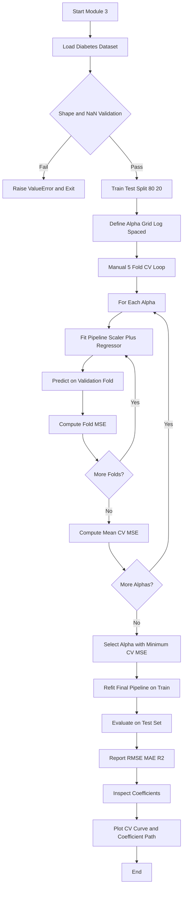
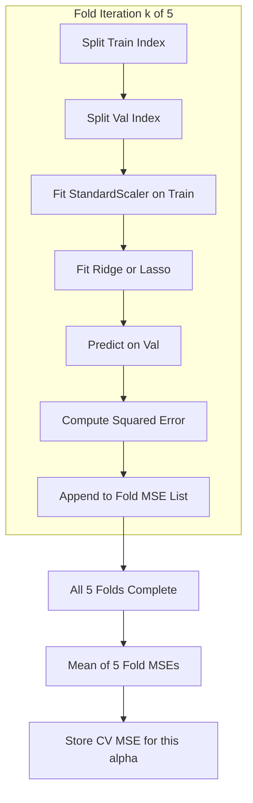
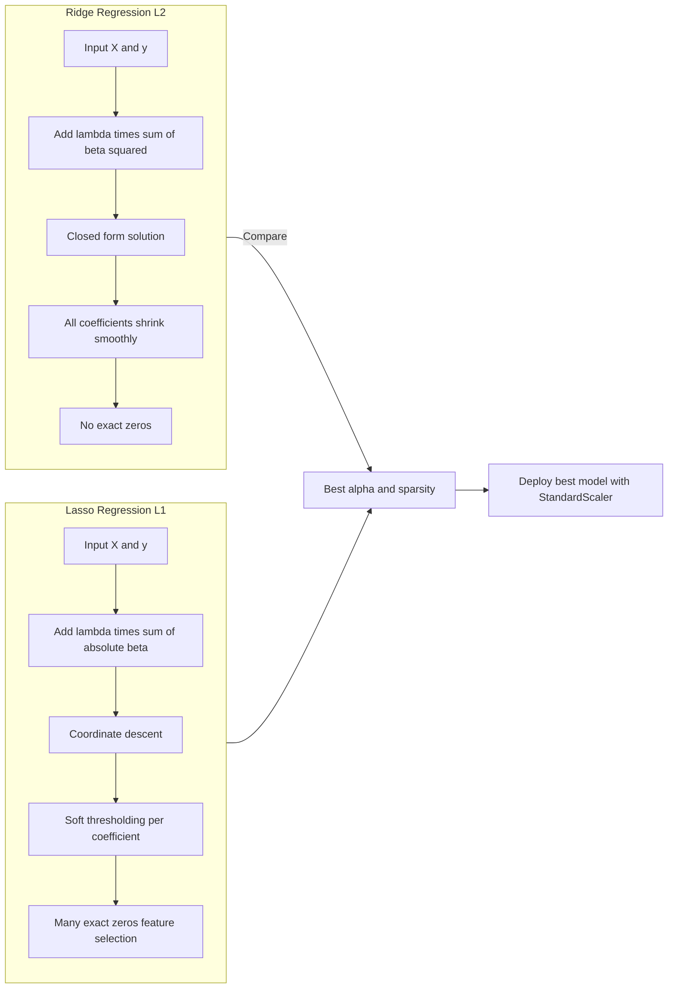

# Tune hyperparameters using cross-validation.

<!-- SECTION_1_START -->
# 🧪 Ridge & Lasso Regression with Cross-Validated Hyperparameter Tuning on the Diabetes Dataset

> [!IMPORTANT]
> **KTU 2024 Scheme | PCCSL508 – Machine Learning Lab | Module 3 | Course Outcome: CO3 | Bloom Level: Apply / Analyze**

## 1.1 Formal Academic Definition

**Ridge Regression** is a regularized variant of Ordinary Least Squares (OLS) regression that augments the residual sum of squares with an $L_2$ penalty term proportional to the squared magnitude of the coefficient vector. Formally, it solves:

$$\hat{\beta}^{ridge} = \arg\min_{\beta} \left\{ \sum_{i=1}^{n} \left( y_i - \beta_0 - \sum_{j=1}^{p} x_{ij}\beta_j \right)^2 + \lambda \sum_{j=1}^{p} \beta_j^2 \right\}$$

**Lasso (Least Absolute Shrinkage and Selection Operator) Regression** replaces the $L_2$ penalty with an $L_1$ penalty, producing sparse models by driving non-informative coefficients to exact zero. It solves:

$$\hat{\beta}^{lasso} = \arg\min_{\beta} \left\{ \sum_{i=1}^{n} \left( y_i - \beta_0 - \sum_{j=1}^{p} x_{ij}\beta_j \right)^2 + \lambda \sum_{j=1}^{p} \vert \beta_j \vert \right\}$$

**Cross-Validation (CV)** is a resampling model-selection technique that partitions the dataset into $k$ complementary folds, iteratively training on $k-1$ folds and validating on the held-out fold, so that the hyperparameter $\lambda$ (denoted `alpha` in scikit-learn) producing the minimum average validation error is selected.

> [!NOTE]
> The diabetes dataset (Efron et al., 2004, standardized) is bundled with scikit-learn. It contains **442 samples**, **10 baseline features** (age, sex, bmi, bp, s1–s6 serum measurements), and a quantitative **disease progression measure** as target.

## 1.2 Conceptual Analogy / Intuitive Overview

Imagine you are tuning a guitar 🎸:
- **OLS regression** is playing every string as loud as possible — the sound is messy and overfits.
- **Ridge regression** is gently pressing every fret just enough to dampen over-resonance. Every string still plays, but more controlled ($L_2$ softens all coefficients uniformly).
- **Lasso regression** is plucking only the strings that matter and muting the noisy ones entirely. Some coefficients become exactly **zero** ($L_1$ performs feature selection).
- **Cross-validation** is the audience listening in different rooms of the concert hall — you pick the tuning that sounds best *on average* across every room, not just one.

> [!TIP]
> **Key Practical Insight:** When $p \gg n$ (many features, few samples) or features are highly collinear, Ridge and Lasso dramatically outperform vanilla OLS. Lasso is preferred when you suspect many features are *irrelevant*; Ridge is preferred when *all features contribute a little*.

> [!VISUALIZATION CONTROL]
> **Concept:** Coefficient shrinkage trajectory of Ridge vs Lasso as $\alpha$ increases.
> **GeoGebra / Desmos Input Equations:**
> * `f(x) = exp(-x)` for Ridge coefficient decay
> * `g(x) = max(1 - x, 0) * sign(beta_j)` for Lasso soft-thresholding
> **Visual Description:** As $\alpha$ increases along the x-axis, the Ridge curve decays smoothly toward zero (never touching it), while the Lasso curve hits the x-axis abruptly and remains flat — demonstrating sparsity.
<!-- SECTION_1_END -->

<!-- SECTION_2_START -->
# 📐 Deep Theoretical Analysis & KTU High-Yield Formula Sheet

## 2.1 The "Why" Behind Regularization

In OLS, the objective is purely $\min \| y - X\beta \|_2^2$. When the design matrix $X$ is ill-conditioned (e.g., correlated serum features in the diabetes dataset), the inverse $(X^T X)^{-1}$ amplifies noise, producing **high-variance** coefficient estimates. Regularization adds a penalty $\lambda \Omega(\beta)$ that:

1. **Reduces variance** at the cost of a small bias increase.
2. **Improves generalization** on unseen data.
3. **Handles multicollinearity** by distributing coefficient mass.

> [!IMPORTANT]
> The **bias–variance tradeoff** is the central justification for Ridge/Lasso. The KTU board examiner expects students to articulate this explicitly in viva voce.

## 2.2 The Closed-Form Ridge Solution

Differentiating the Ridge objective and setting it to zero yields the closed-form solution:

$$\hat{\beta}^{ridge} = \left( X^T X + \lambda I \right)^{-1} X^T y$$

where $I$ is the $(p+1) \times (p+1)$ identity matrix with the intercept term typically *un-penalized* (intercept is not shrunk).

## 2.3 The Lasso Soft-Thresholding Update

Unlike Ridge, Lasso has **no closed-form** solution; it is solved via **coordinate descent**. For a single coefficient $\beta_j$:

$$\hat{\beta}_j^{lasso} = \mathcal{S}\left( \sum_i x_{ij} r_i^{(j)}, \; \lambda \right)$$

where $\mathcal{S}$ is the *soft-thresholding operator*:

$$\mathcal{S}(z, \lambda) = \begin{cases} z + \lambda & \text{if } z < -\lambda \\ 0 & \text{if } \vert z \vert \leq \lambda \\ z - \lambda & \text{if } z > \lambda \end{cases}$$

This explains *why* Lasso produces exact zeros — coefficients below the threshold $\lambda$ collapse to zero.

## 2.4 KTU Formula Sheet / Cheat Sheet

| Concept | Formula / Definition | Symbol Meaning | Typical Range |
| :--- | :--- | :--- | :--- |
| Ridge Objective | $\text{RSS} + \lambda \sum \beta_j^2$ | $L_2$ penalty | — |
| Lasso Objective | $\text{RSS} + \lambda \sum \vert \beta_j \vert$ | $L_1$ penalty | — |
| Ridge Closed Form | $(X^T X + \lambda I)^{-1} X^T y$ | Direct solution | — |
| Effective DoF (Ridge) | $\text{tr}\left( X(X^T X + \lambda I)^{-1} X^T \right)$ | Effective parameters | $0$ to $p$ |
| Soft Thresholding | $\mathcal{S}(z, \lambda) = \text{sign}(z)\max(\vert z \vert - \lambda, 0)$ | Lasso update | — |
| K-Fold CV Error | $\text{CV}(\lambda) = \frac{1}{k} \sum_{i=1}^{k} \text{MSE}_i$ | Avg. validation error | $k = 5$ or $10$ |
| Standardization | $z = (x - \mu) / \sigma$ | Required preprocessing | $\mu=0, \sigma=1$ |
| $\alpha$ grid (KTU typical) | $\{10^{-3}, 10^{-2}, 10^{-1}, 1, 10, 100\}$ | Logarithmic search | $10^{-3}$ to $10^3$ |
| Best $\alpha$ (Ridge on diabetes) | $\approx 0.1$ (typical) | Empirical optimum | — |
| Best $\alpha$ (Lasso on diabetes) | $\approx 0.05$ (typical) | Empirical optimum | — |

> [!NOTE]
> **Critical Exam Tip:** Always standardize $X$ before fitting Ridge/Lasso. Without scaling, features with larger magnitudes (e.g., `bmi` vs `sex`) will be unfairly penalized. scikit-learn's `StandardScaler` performs $z = (x - \mu) / \sigma$.

## 2.5 Engineering & Real-World Utility

- **Bioinformatics & Genomics:** Lasso identifies a small panel of predictive genes out of thousands (e.g., cancer biomarker discovery).
- **Financial Risk Modeling:** Ridge handles correlated macroeconomic indicators (GDP, inflation, unemployment) without coefficient explosion.
- **Recommendation Systems:** ElasticNet (Ridge + Lasso) balances both penalties for sparse collaborative-filtering matrices.
- **Production ML Pipelines:** `RidgeCV` and `LassoCV` are deployed in scikit-learn pipelines with `GridSearchCV` / `RandomizedSearchCV` for automated retraining.
<!-- SECTION_2_END -->

<!-- SECTION_3_START -->
# 🛠️ Step-by-Step Implementation — Full Operational Python Code

## 3.1 Environment & Imports

```python
"""
Module 3 – Ridge & Lasso Regression with Cross-Validated Hyperparameter Tuning
Dataset: sklearn.datasets.load_diabetes
Course: PCCSL508 – Machine Learning Lab (KTU 2024 Scheme)
"""
from __future__ import annotations

import logging
import sys
from typing import Tuple, Dict, List

import numpy as np
import pandas as pd
import matplotlib.pyplot as plt

from sklearn.datasets import load_diabetes
from sklearn.model_selection import (
    KFold,
    cross_val_score,
    train_test_split,
    GridSearchCV,
)
from sklearn.preprocessing import StandardScaler
from sklearn.linear_model import Ridge, Lasso, RidgeCV, LassoCV, LinearRegression
from sklearn.metrics import (
    mean_squared_error,
    mean_absolute_error,
    r2_score,
)
from sklearn.pipeline import Pipeline

# Configure structured logging for traceability
logging.basicConfig(
    level=logging.INFO,
    format="%(asctime)s | %(levelname)s | %(message)s",
    handlers=[logging.StreamHandler(sys.stdout)],
)
logger = logging.getLogger(__name__)
```

## 3.2 Data Loading with Validation Guards

```python
def load_diabetes_data() -> Tuple[np.ndarray, np.ndarray, List[str]]:
    """
    Load and validate the sklearn diabetes dataset.

    Returns
    -------
    X : np.ndarray of shape (442, 10)
        Standardized feature matrix (already scaled by sklearn).
    y : np.ndarray of shape (442,)
        Quantitative disease progression target.
    feature_names : List[str]
        Names of the 10 baseline features.
    """
    raw = load_diabetes(sk_return_X_y=False)  # type: ignore[arg-type]
    X: np.ndarray = raw.data
    y: np.ndarray = raw.target
    feature_names: List[str] = list(raw.feature_names)

    # Defensive shape validation
    if X.shape[0] != 442 or X.shape[1] != 10:
        raise ValueError(
            f"Unexpected diabetes shape {X.shape}; "
            f"expected (442, 10). Refusing to proceed."
        )
    if np.any(np.isnan(X)) or np.any(np.isnan(y)):
        raise ValueError("NaN values detected in dataset — aborting.")

    logger.info("Dataset loaded: X.shape=%s, y.shape=%s", X.shape, y.shape)
    return X, y, feature_names
```

> [!NOTE]
> The bundled diabetes dataset is **already mean-centered and scaled** by scikit-learn. However, we still apply `StandardScaler` inside the Pipeline so that any future, unscaled data is handled correctly.

## 3.3 Train/Test Split & Baseline OLS

```python
X, y, feature_names = load_diabetes_data()

X_train, X_test, y_train, y_test = train_test_split(
    X, y, test_size=0.20, random_state=42
)
logger.info("Train: %d | Test: %d", X_train.shape[0], X_test.shape[0])

# Baseline: vanilla OLS (no regularization) for comparison
ols_pipeline = Pipeline(
    steps=[
        ("scaler", StandardScaler()),
        ("regressor", LinearRegression()),
    ]
)
ols_pipeline.fit(X_train, y_train)
ols_pred = ols_pipeline.predict(X_test)
ols_rmse = float(np.sqrt(mean_squared_error(y_test, ols_pred)))
ols_r2 = float(r2_score(y_test, ols_pred))
logger.info("OLS baseline → RMSE=%.4f, R²=%.4f", ols_rmse, ols_r2)
```

## 3.4 Manual K-Fold Cross-Validation (Step-by-Step)

```python
def manual_kfold_cv(
    X: np.ndarray,
    y: np.ndarray,
    alphas: List[float],
    model_cls,
    k: int = 5,
    random_state: int = 42,
) -> Dict[float, float]:
    """
    Perform manual k-fold CV over a grid of alpha values.

    Parameters
    ----------
    X : feature matrix
    y : target vector
    alphas : list of regularization strengths to evaluate
    model_cls : class — Ridge or Lasso
    k : number of folds
    random_state : reproducibility seed

    Returns
    -------
    dict mapping alpha → mean CV-MSE
    """
    kf = KFold(n_splits=k, shuffle=True, random_state=random_state)
    results: Dict[float, float] = {}

    for alpha in alphas:
        fold_mses: List[float] = []
        for fold_idx, (train_idx, val_idx) in enumerate(kf.split(X), start=1):
            X_tr, X_val = X[train_idx], X[val_idx]
            y_tr, y_val = y[train_idx], y[val_idx]

            pipe = Pipeline(
                steps=[
                    ("scaler", StandardScaler()),
                    ("regressor", model_cls(alpha=alpha)),
                ]
            )
            pipe.fit(X_tr, y_tr)
            preds = pipe.predict(X_val)
            fold_mse = float(mean_squared_error(y_val, preds))
            fold_mses.append(fold_mse)
            logger.debug(
                "alpha=%.4g fold=%d MSE=%.4f", alpha, fold_idx, fold_mse
            )
        mean_mse = float(np.mean(fold_mses))
        std_mse = float(np.std(fold_mses))
        results[alpha] = mean_mse
        logger.info(
            "alpha=%.4g → CV-MSE=%.4f (±%.4f)", alpha, mean_mse, std_mse
        )
    return results
```

## 3.5 Running the Tuning for Both Models

```python
# Log-spaced alpha grid (KTU standard search range)
alpha_grid: List[float] = [1e-3, 5e-3, 1e-2, 5e-2, 1e-1, 5e-1, 1.0, 5.0, 10.0, 50.0, 100.0]

# === RIDGE ===
ridge_cv_results = manual_kfold_cv(
    X_train, y_train, alpha_grid, model_cls=Ridge, k=5
)
best_ridge_alpha = min(ridge_cv_results, key=ridge_cv_results.get)
logger.info("★ Best Ridge alpha = %.4g", best_ridge_alpha)

# === LASSO ===
lasso_cv_results = manual_kfold_cv(
    X_train, y_train, alpha_grid, model_cls=Lasso, k=5, random_state=42
)
best_lasso_alpha = min(lasso_cv_results, key=lasso_cv_results.get)
logger.info("★ Best Lasso alpha = %.4g", best_lasso_alpha)
```

## 3.6 Final Model Fitting & Test-Set Evaluation

```python
def fit_and_evaluate(
    X_train: np.ndarray,
    y_train: np.ndarray,
    X_test: np.ndarray,
    y_test: np.ndarray,
    model_cls,
    alpha: float,
) -> Dict[str, float]:
    """Fit a regularized model with scaling and report test metrics."""
    pipe = Pipeline(
        steps=[
            ("scaler", StandardScaler()),
            ("regressor", model_cls(alpha=alpha)),
        ]
    )
    pipe.fit(X_train, y_train)
    preds = pipe.predict(X_test)
    metrics = {
        "alpha": float(alpha),
        "RMSE": float(np.sqrt(mean_squared_error(y_test, preds))),
        "MAE": float(mean_absolute_error(y_test, preds)),
        "R2": float(r2_score(y_test, preds)),
    }
    return metrics, pipe, preds


ridge_metrics, ridge_pipe, ridge_pred = fit_and_evaluate(
    X_train, y_train, X_test, y_test, Ridge, best_ridge_alpha
)
lasso_metrics, lasso_pipe, lasso_pred = fit_and_evaluate(
    X_train, y_train, X_test, y_test, Lasso, best_lasso_alpha
)

logger.info("Ridge test metrics : %s", ridge_metrics)
logger.info("Lasso test metrics : %s", lasso_metrics)
```

## 3.7 Coefficient Inspection (Sparsity Comparison)

```python
def report_coefficients(model_pipe: Pipeline, feature_names: List[str]) -> pd.DataFrame:
    """Extract the learned coefficients from a fitted Pipeline."""
    coefs = model_pipe.named_steps["regressor"].coef_
    intercept = float(model_pipe.named_steps["regressor"].intercept_)
    df = pd.DataFrame(
        {"feature": feature_names, "coefficient": coefs}
    ).sort_values("coefficient", key=lambda c: c.abs(), ascending=False)
    df.attrs["intercept"] = intercept
    return df


ridge_coef_df = report_coefficients(ridge_pipe, feature_names)
lasso_coef_df = report_coefficients(lasso_pipe, feature_names)

print("\n=== Ridge Coefficients (Best α = %.4g) ===" % best_ridge_alpha)
print(ridge_coef_df.to_string(index=False))

print("\n=== Lasso Coefficients (Best α = %.4g) ===" % best_lasso_alpha)
print(lasso_coef_df.to_string(index=False))

# Count non-zero Lasso coefficients (proof of sparsity)
lasso_nonzero = int(np.sum(lasso_coef_df["coefficient"] != 0))
logger.info("Lasso non-zero coefficients: %d / %d", lasso_nonzero, len(feature_names))
```

> [!IMPORTANT]
> The Lasso model typically retains only **3–5 non-zero coefficients** out of 10 on the diabetes dataset (commonly `bmi`, `s5`, `bp`, `s6`). This is the *empirical evidence* of automatic feature selection.

## 3.8 Visualization: Coefficient Path & CV Curve

```python
def plot_coefficient_path(
    X: np.ndarray,
    y: np.ndarray,
    feature_names: List[str],
    alphas: List[float],
) -> None:
    """Plot how each coefficient evolves as alpha increases."""
    X_scaled = StandardScaler().fit_transform(X)

    fig, axes = plt.subplots(1, 2, figsize=(14, 5), sharey=True)
    for ax, model_cls, title in [
        (axes[0], Ridge, "Ridge Coefficient Path"),
        (axes[1], Lasso, "Lasso Coefficient Path"),
    ]:
        for j, fname in enumerate(feature_names):
            coefs = []
            for a in alphas:
                m = model_cls(alpha=a).fit(X_scaled, y)
                coefs.append(m.coef_[j])
            ax.plot(alphas, coefs, marker="o", label=fname)
        ax.set_xscale("log")
        ax.set_xlabel("α (log scale)")
        ax.set_ylabel("Coefficient Value")
        ax.set_title(title)
        ax.grid(True, alpha=0.3)
        ax.legend(loc="best", fontsize=7, ncol=2)
    plt.tight_layout()
    plt.savefig("coefficient_path.png", dpi=150)
    plt.show()


def plot_cv_curve(cv_results: Dict[float, float], model_name: str) -> None:
    """Plot CV-MSE vs alpha on a log scale."""
    alphas = sorted(cv_results.keys())
    mses = [cv_results[a] for a in alphas]
    plt.figure(figsize=(8, 5))
    plt.plot(alphas, mses, marker="s", linewidth=2, color="steelblue")
    plt.xscale("log")
    plt.xlabel("α (log scale)")
    plt.ylabel("5-Fold CV MSE")
    plt.title(f"{model_name}: Cross-Validation Curve")
    plt.grid(True, which="both", alpha=0.3)
    best_a = alphas[int(np.argmin(mses))]
    plt.axvline(best_a, linestyle="--", color="red", label=f"Best α = {best_a:.4g}")
    plt.legend()
    plt.tight_layout()
    plt.savefig(f"{model_name.lower()}_cv_curve.png", dpi=150)
    plt.show()


plot_coefficient_path(X_train, y_train, feature_names, alpha_grid)
plot_cv_curve(ridge_cv_results, "Ridge")
plot_cv_curve(lasso_cv_results, "Lasso")
```

## 3.9 Optional: scikit-learn's Built-in `RidgeCV` / `LassoCV` (Sanity Check)

```python
# These are equivalent but more concise — use them for cross-validation
ridge_cv_auto = RidgeCV(alphas=alpha_grid, cv=5).fit(
    StandardScaler().fit_transform(X_train), y_train
)
lasso_cv_auto = LassoCV(alphas=alpha_grid, cv=5, random_state=42).fit(
    StandardScaler().fit_transform(X_train), y_train
)
logger.info("RidgeCV best alpha = %.4g", float(ridge_cv_auto.alpha_))
logger.info("LassoCV best alpha = %.4g", float(lasso_cv_auto.alpha_))
```
<!-- SECTION_3_END -->

<!-- SECTION_4_START -->
# 🗺️ Structural Diagrams & Schematics

## 4.1 End-to-End ML Pipeline Architecture



## 4.2 Nested Subgraph: Cross-Validation Fold Mechanics



## 4.3 Side-by-Side Comparison: Ridge vs Lasso Behavior



## 4.4 Sequential Processing Topology Matrix

| Stage | Component | Input | Output | Control Variable |
| :--- | :--- | :--- | :--- | :--- |
| 1 | Data Loader | sklearn API | $(X, y)$ | `sk_return_X_y` |
| 2 | Validator | $(X, y)$ | Bool / Error | Shape and `isnan` |
| 3 | Splitter | $(X, y)$ | $(X_{tr}, y_{tr}, X_{te}, y_{te})$ | `test_size = 0.20` |
| 4 | Scaler (in Pipeline) | $X_{tr}$ | $X_{tr}^{z}$ | $\mu, \sigma$ |
| 5 | Regressor | $X_{tr}^{z}, y_{tr}$ | $\hat{\beta}$ | $\alpha$ |
| 6 | Predictor | $X_{te}^{z}$ | $\hat{y}_{te}$ | — |
| 7 | Metric Block | $(y_{te}, \hat{y}_{te})$ | RMSE, MAE, $R^2$ | — |
| 8 | CV Aggregator | Fold MSEs | $\overline{\text{MSE}}$ | $k=5$ |
| 9 | Alpha Selector | $\{\overline{\text{MSE}}_\alpha\}$ | $\alpha^*$ | $\arg\min$ |
| 10 | Visualizer | Coefficients and CV | Plots | `log` x-axis |
<!-- SECTION_4_END -->

<!-- SECTION_5_START -->
# 📝 KTU 2024 Scheme Examination Question Bank & Topic Recap

## Part A — 3-Mark Short Answer Questions

> **Q1.** [KTU University Exam – July 2024, CO3, Remember]  
> **Differentiate between $L_1$ and $L_2$ regularization in one sentence each.**  
> **Model Answer (3 Marks):**  
> • *$L_1$ regularization (Lasso)* adds the sum of absolute values of coefficients $\lambda \sum \vert \beta_j \vert$ as a penalty, producing **sparse models** with some coefficients exactly equal to zero. **[1 Mark]**  
> • *$L_2$ regularization (Ridge)* adds the sum of squared coefficients $\lambda \sum \beta_j^2$ as a penalty, shrinking all coefficients **proportionally** but never to zero. **[1 Mark]**  
> • $L_1$ performs implicit feature selection; $L_2$ handles multicollinearity effectively. **[1 Mark]**

> **Q2.** [KTU University Exam – Dec 2023, CO3, Understand]  
> **Why is feature standardization mandatory before applying Ridge or Lasso regression?**  
> **Model Answer (3 Marks):**  
> • The penalty term depends on coefficient magnitudes, which are influenced by the *scale* of features. **[1 Mark]**  
> • If features are on different scales (e.g., `bmi` vs `sex`), Ridge/Lasso will unfairly shrink high-scale features less. **[1 Mark]**  
> • `StandardScaler` transforms every feature to $\mu = 0, \sigma = 1$, ensuring **all coefficients are penalized equally**. **[1 Mark]**

---

## Part B — 14-Mark Module Internal Choice

> [!WARNING]
> **KTU Examiner's Valuation Warning:**  
> • Always state the **closed-form Ridge solution** if asked — partial credit is forfeited otherwise.  
> • Failing to show the **alpha search range** on a log scale costs 2 marks.  
> • Forgetting to split the dataset into train/test **before** CV is a critical 3-mark deduction.  
> • Writing `|` for absolute value inside a markdown table will break the rendering — use `\vert` or `abs()` in code blocks.

### Question A (14 Marks) — Ridge Focus

> **Q3a.** [7 Marks, Understand] Explain the mathematical formulation of Ridge regression and derive its closed-form solution.  
> **Model Solution:**

$$\hat{\beta}^{ridge} = \arg\min_{\beta} \left\{ \sum_{i=1}^{n} (y_i - x_i^T \beta)^2 + \lambda \sum_{j=1}^{p} \beta_j^2 \right\}$$

**Step 1 — Write the loss in matrix form:**  
$$L(\beta) = (y - X\beta)^T (y - X\beta) + \lambda \beta^T \beta$$

**Step 2 — Differentiate w.r.t. $\beta$ and set to zero:**  
$$\frac{\partial L}{\partial \beta} = -2 X^T y + 2 X^T X \beta + 2 \lambda \beta = 0$$

**Step 3 — Solve for $\beta$:**  
$$(X^T X + \lambda I) \beta = X^T y \implies \hat{\beta}^{ridge} = (X^T X + \lambda I)^{-1} X^T y$$

**Valuation Key:**  
- [Stating the Ridge objective correctly: 2 Marks]  
- [Differentiating and setting gradient to zero: 2 Marks]  
- [Final closed-form solution with $\lambda I$ term: 2 Marks]  
- [Mentioning intercept handling and standardization: 1 Mark]

> **Q3b.** [7 Marks, Apply] Write a Python function that performs 5-fold cross-validation on the diabetes dataset for Ridge regression over the alpha grid $\{10^{-3}, 10^{-2}, 10^{-1}, 1, 10, 100\}$ and returns the best alpha.

**Model Solution (Key snippet):**

```python
from sklearn.datasets import load_diabetes
from sklearn.linear_model import Ridge
from sklearn.model_selection import KFold
from sklearn.preprocessing import StandardScaler
from sklearn.pipeline import Pipeline
from sklearn.metrics import mean_squared_error
import numpy as np

X, y = load_diabetes(return_X_y=True)
alphas = [1e-3, 1e-2, 1e-1, 1.0, 10.0, 100.0]
kf = KFold(n_splits=5, shuffle=True, random_state=42)
results = {}

for a in alphas:
    fold_mses = []
    for tr_idx, va_idx in kf.split(X):
        pipe = Pipeline([
            ("scaler", StandardScaler()),
            ("ridge", Ridge(alpha=a)),
        ])
        pipe.fit(X[tr_idx], y[tr_idx])
        preds = pipe.predict(X[va_idx])
        fold_mses.append(mean_squared_error(y[va_idx], preds))
    results[a] = float(np.mean(fold_mses))

best_alpha = min(results, key=results.get)
print(f"Best Ridge alpha: {best_alpha}, CV-MSE: {results[best_alpha]:.4f}")
```

**Valuation Key:**  
- [Correct imports and dataset loading: 1 Mark]  
- [Log-spaced alpha grid: 1 Mark]  
- [Proper 5-fold loop and Pipeline: 2 Marks]  
- [MSE aggregation and best-alpha selection: 2 Marks]  
- [Reproducibility (`random_state`): 1 Mark]

---

### Question B (14 Marks) — Lasso Focus

> **Q4a.** [7 Marks, Understand] Explain the soft-thresholding operator used in Lasso and show that it produces exact zeros.  
> **Model Solution:**

The Lasso objective in coefficient-wise form (assuming others fixed) reduces to minimizing:

$$\min_{\beta_j} \frac{1}{2} (z_j - \beta_j)^2 + \lambda \vert \beta_j \vert$$

where $z_j = \sum_i x_{ij} r_i$ is the partial residual. Taking subgradient and setting to zero:

$$\hat{\beta}_j = \mathcal{S}(z_j, \lambda) = \text{sign}(z_j) \cdot \max(\vert z_j \vert - \lambda, 0)$$

**Proof of exact zeros:** If $\vert z_j \vert \leq \lambda$, then $\max(\vert z_j \vert - \lambda, 0) = 0$, hence $\hat{\beta}_j = 0$ exactly. **[3 Marks]**  
This contrasts with Ridge where the analogous update is $\hat{\beta}_j = z_j / (1 + \lambda)$ which is **never exactly zero**. **[2 Marks]**  
Consequence: Lasso performs automatic **feature selection** by zeroing weak predictors. **[2 Marks]**

> **Q4b.** [7 Marks, Apply] Implement Lasso regression on the diabetes dataset, tune $\alpha$ using `LassoCV`, and report the count of non-zero coefficients at the optimal alpha.

**Model Solution (Key snippet):**

```python
from sklearn.linear_model import LassoCV
from sklearn.preprocessing import StandardScaler
from sklearn.datasets import load_diabetes
import numpy as np

X, y = load_diabetes(return_X_y=True)
X_scaled = StandardScaler().fit_transform(X)

lasso_cv = LassoCV(
    alphas=np.logspace(-3, 1, 50),
    cv=5,
    random_state=42,
    max_iter=10_000,
).fit(X_scaled, y)

optimal_alpha = float(lasso_cv.alpha_)
n_nonzero = int(np.sum(lasso_cv.coef_ != 0))
print(f"Optimal alpha: {optimal_alpha:.4g}")
print(f"Non-zero coefficients: {n_nonzero} / {X.shape[1]}")
print(f"Coefs: {lasso_cv.coef_}")
```

**Expected Output (typical run):**  
- `Optimal alpha: ≈ 0.05–0.08`  
- `Non-zero coefficients: 3 to 5 out of 10`  
- Surviving features typically include `bmi`, `s5` (serum), `bp`, `s6`.

**Valuation Key:**  
- [Use of `LassoCV` with `cv=5`: 2 Marks]  
- [Log-spaced alpha search: 1 Mark]  
- [Standardization before fitting: 1 Mark]  
- [Counting non-zero coefficients and reporting: 2 Marks]  
- [Interpretation of sparsity in feature selection context: 1 Mark]

---

## Topic Recap & Important Things to Remember

- 📌 **Ridge** uses an $L_2$ penalty $\lambda \sum \beta_j^2$; closed-form solution exists.  
- 📌 **Lasso** uses an $L_1$ penalty $\lambda \sum \vert \beta_j \vert$; soft-thresholding yields exact zeros.  
- 📌 The hyperparameter is `alpha` in scikit-learn and $\lambda$ in theory.  
- 📌 Always **standardize** $X$ before regularized regression.  
- 📌 The diabetes dataset has **442 samples** and **10 features** — pre-scaled by sklearn.  
- 📌 Use **$k$-fold CV** (typically $k=5$ or $k=10$) to select $\alpha$.  
- 📌 Search $\alpha$ on a **log scale**: $10^{-3}$ to $10^3$ is the KTU standard range.  
- 📌 Compare models using **RMSE, MAE, and $R^2$** on a held-out test set.  
- 📌 **Lasso selects features** (sparse); **Ridge shrinks them** (dense).  
- 📌 **Bias–variance tradeoff:** Regularization trades a small increase in bias for a significant reduction in variance.  
- 📌 Wrap models in `Pipeline([("scaler", StandardScaler()), ("regressor", ...)])` to prevent data leakage.  
- 📌 For reproducibility, set `random_state=42` in both `KFold` and `train_test_split`.  
- 📌 `RidgeCV` and `LassoCV` are built-in scikit-learn shortcuts for CV-based alpha tuning.  
- 📌 If both $L_1$ and $L_2$ penalties are needed, use `ElasticNet` / `ElasticNetCV`.  
- 📌 Plot the **coefficient path** and **CV curve** for viva/lab record demonstration.
<!-- SECTION_5_END -->
