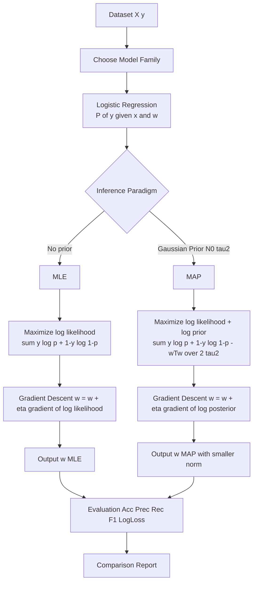
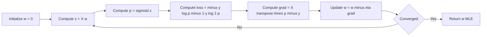
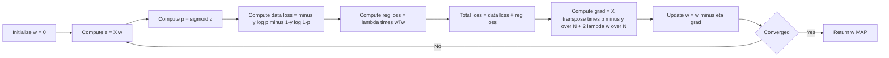
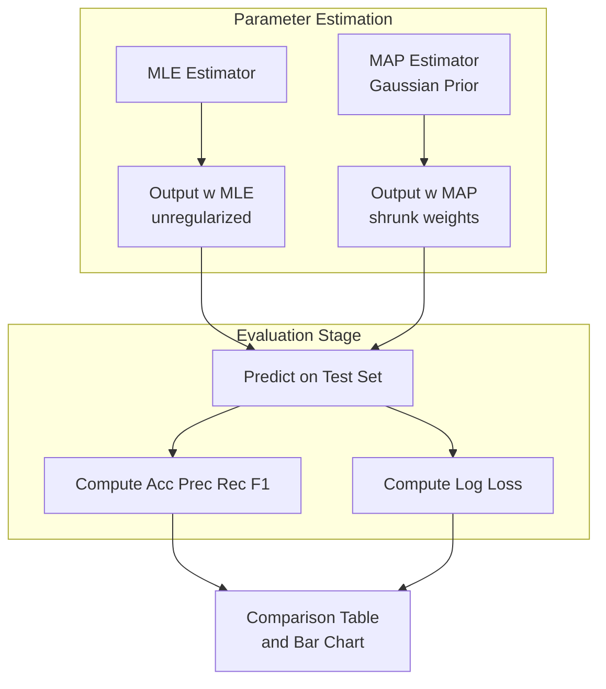

# Compare the performance and parameter estimates with MLE and MAP.

<!-- SECTION_1_START -->
# Comparing Logistic Regression: MLE vs MAP Parameter Estimation

## 1. Core Technical Definition & Intuitive Overview

> [!NOTE]
> **Logistic Regression** is a discriminative probabilistic classifier that models the conditional probability $P(y \vert \mathbf{x}; \mathbf{w})$ of a binary class label using the **logistic (sigmoid) function** applied to a linear combination of input features.

The hypothesis function is:

$$h_{\mathbf{w}}(\mathbf{x}) = \sigma(\mathbf{w}^{\top}\mathbf{x} + b) = \frac{1}{1 + e^{-(\mathbf{w}^{\top}\mathbf{x} + b)}}$$

> [!IMPORTANT]
> In the KTU 2024 Lab Module 4 context, you are expected to **estimate the parameters $\mathbf{w}$** of this model using two distinct statistical inference paradigms: **Maximum Likelihood Estimation (MLE)** and **Maximum A Posteriori (MAP)** estimation, and then **empirically compare** the resulting decision boundaries, parameter vectors, and generalization metrics.

### Conceptual Analogy / Intuition

Imagine you are tuning a guitar:

- **MLE** is like adjusting strings by **listening only to the sound they make right now**. You ignore any prior knowledge about how guitars are usually tuned. If the room is noisy (small/noisy dataset), you may tune them to the noise itself — leading to **overfitting**.
- **MAP** is like adjusting the strings with a **prior expectation** that they should be near a standard pitch (regularization). Even with noisy data, the prior **pulls your estimate toward a sensible region** — yielding **lower variance** at the cost of a small bias.

> [!TIP]
> **MLE** = "What parameters make the observed data most probable?" (purely data-driven)
> **MAP** = "What parameters are most probable given the data AND a prior belief?" (data + prior)

### Key Constants & Metrics

- **Sigmoid function**: $\sigma(z) = \dfrac{1}{1 + e^{-z}}$, with output range $\mathbf{(0, 1)}$
- **Standard regularization strength** used in MAP: $\tau = \mathbf{1.0}$ (prior standard deviation) — corresponds to L2 penalty $\lambda = 1/\tau^2 = \mathbf{1.0}$
- **Default convergence threshold** in numerical labs: gradient norm $\Vert \nabla \Vert_2 < \mathbf{10^{-6}}$
- **Default decision threshold** for binary classification: $\mathbf{0.5}$

> [!VISUALIZATION CONTROL]
> **Concept:** Sigmoid function shape and its role as a probability mapper
> **GeoGebra / Desmos Input Equations:**
> * `f(x) = 1 / (1 + exp(-x))`
> * `g(x) = f(2*x)` (steeper curve with higher weight magnitude)
> * `h(x) = f(0.5*x)` (flatter curve with smaller weight magnitude)
> **Visual Description:** Plot the S-shaped curve crossing $(0, 0.5)$. Observe how increasing weight magnitude makes the transition sharper (closer to a step function) and decreasing it makes the curve flatter. The MAP solution tends to produce **flatter** curves because the prior shrinks the weights toward zero.

---

<!-- SECTION_1_END -->

<!-- SECTION_2_START -->
# 2. Deep Theoretical Analysis & KTU High-Yield Formula Sheet

## 2.1 Logistic Regression Model

For a dataset $\mathcal{D} = \{(\mathbf{x}_i, y_i)\}_{i=1}^{N}$ with $y_i \in \{0, 1\}$, the model assumes:

$$P(y = 1 \mid \mathbf{x}; \mathbf{w}) = \sigma(\mathbf{w}^{\top}\mathbf{x}), \qquad P(y = 0 \mid \mathbf{x}; \mathbf{w}) = 1 - \sigma(\mathbf{w}^{\top}\mathbf{x})$$

For compactness, append a bias column: $\mathbf{x} \leftarrow [1, \mathbf{x}^{\top}]^{\top}$ so that $b$ is absorbed into $\mathbf{w}$.

## 2.2 Maximum Likelihood Estimation (MLE)

### Likelihood Function

Assuming i.i.d. samples, the joint likelihood is:

$$L(\mathbf{w}) = \prod_{i=1}^{N} P(y_i \mid \mathbf{x}_i; \mathbf{w}) = \prod_{i=1}^{N} \left[\sigma(\mathbf{w}^{\top}\mathbf{x}_i)\right]^{y_i} \left[1 - \sigma(\mathbf{w}^{\top}\mathbf{x}_i)\right]^{1 - y_i}$$

### Log-Likelihood

$$\ell_{\text{MLE}}(\mathbf{w}) = \sum_{i=1}^{N} \left[ y_i \log \sigma(\mathbf{w}^{\top}\mathbf{x}_i) + (1 - y_i) \log \bigl(1 - \sigma(\mathbf{w}^{\top}\mathbf{x}_i)\bigr) \right]$$

### MLE Objective (Negative Log-Likelihood / Cross-Entropy Loss)

$$\mathbf{w}_{\text{MLE}} = \arg\min_{\mathbf{w}} \; J_{\text{MLE}}(\mathbf{w}) = -\frac{1}{N}\sum_{i=1}^{N} \left[ y_i \log \hat{p}_i + (1 - y_i) \log(1 - \hat{p}_i) \right]$$

where $\hat{p}_i = \sigma(\mathbf{w}^{\top}\mathbf{x}_i)$.

### Gradient of the Log-Likelihood

$$\nabla_{\mathbf{w}} \ell_{\text{MLE}}(\mathbf{w}) = \sum_{i=1}^{N} \mathbf{x}_i \left( \sigma(\mathbf{w}^{\top}\mathbf{x}_i) - y_i \right) = \mathbf{X}^{\top}(\hat{\mathbf{p}} - \mathbf{y})$$

### Hessian of the Log-Likelihood

$$\mathbf{H}_{\text{MLE}} = -\sum_{i=1}^{N} \mathbf{x}_i \mathbf{x}_i^{\top} \, \hat{p}_i (1 - \hat{p}_i) = -\mathbf{X}^{\top} \mathbf{R} \mathbf{X}$$

where $\mathbf{R} = \text{diag}(\hat{p}_i (1 - \hat{p}_i))$. The negative Hessian $\mathbf{X}^{\top}\mathbf{R}\mathbf{X}$ is **positive semi-definite**, confirming that $\ell_{\text{MLE}}$ is **concave** and the MLE is unique.

## 2.3 Maximum A Posteriori (MAP) Estimation

### Prior on the Weights

Place a **zero-mean Gaussian prior** on the weights:

$$P(\mathbf{w}) = \mathcal{N}(\mathbf{w}; \mathbf{0}, \tau^2 \mathbf{I}) = \frac{1}{(2\pi\tau^2)^{D/2}} \exp\!\left(-\frac{\Vert \mathbf{w} \Vert^2}{2\tau^2}\right)$$

> [!IMPORTANT]
> Choosing a **Gaussian prior** is equivalent to **L2 (Ridge) regularization**. Choosing a **Laplace prior** is equivalent to **L1 (Lasso) regularization** — and that one promotes **sparsity**.

### Posterior Distribution

By Bayes' rule:

$$P(\mathbf{w} \mid \mathcal{D}) \propto P(\mathcal{D} \mid \mathbf{w}) \cdot P(\mathbf{w})$$

### MAP Objective

$$\mathbf{w}_{\text{MAP}} = \arg\max_{\mathbf{w}} \left[ \log P(\mathcal{D} \mid \mathbf{w}) + \log P(\mathbf{w}) \right]$$

Substituting the likelihood and the Gaussian prior:

$$\mathbf{w}_{\text{MAP}} = \arg\min_{\mathbf{w}} \left[ -\ell_{\text{MLE}}(\mathbf{w}) + \frac{1}{2\tau^2} \Vert \mathbf{w} \Vert^2 \right]$$

Equivalently, the MAP cost function is:

$$J_{\text{MAP}}(\mathbf{w}) = J_{\text{MLE}}(\mathbf{w}) + \lambda \Vert \mathbf{w} \Vert_2^2, \qquad \lambda = \frac{1}{\tau^2}$$

### Gradient of the MAP Objective

$$\nabla_{\mathbf{w}} J_{\text{MAP}}(\mathbf{w}) = \frac{1}{N} \mathbf{X}^{\top}(\hat{\mathbf{p}} - \mathbf{y}) + \frac{2\lambda}{N} \mathbf{w}$$

> [!TIP]
> The extra term $\frac{2\lambda}{N}\mathbf{w}$ is the **weight-decay** penalty that pulls parameters toward zero at every gradient step.

## 2.4 Why MLE and MAP Diverge in Practice

| Property | MLE | MAP (Gaussian Prior) |
|---|---|---|
| Objective | $-\ell_{\text{MLE}}(\mathbf{w})$ | $-\ell_{\text{MLE}}(\mathbf{w}) + \lambda \Vert \mathbf{w} \Vert^2$ |
| Asymptotic bias | **Unbiased** as $N \to \infty$ | Biased, but **bias $\to 0$ as $N \to \infty$** |
| Variance | Higher (overfits on small data) | Lower (shrinks weights) |
| Prior knowledge | None | Encodes "weights should be small" |
| Equivalent to | Unregularized logistic regression | L2-regularized logistic regression |
| Solvable in closed form | **No** (no MLE closed form for LR) | **No** (also iterative) |
| Used in | sklearn `LogisticRegression(penalty='none')` | sklearn `LogisticRegression(penalty='l2')` |

## 2.5 KTU Formula Sheet

| Symbol / Formula | Meaning | Typical Unit / Value |
|---|---|---|
| $\sigma(z) = \dfrac{1}{1 + e^{-z}}$ | Logistic sigmoid | dimensionless, range $(0, 1)$ |
| $h_{\mathbf{w}}(\mathbf{x}) = \sigma(\mathbf{w}^{\top}\mathbf{x})$ | Predicted probability of class 1 | dimensionless |
| $J_{\text{MLE}}(\mathbf{w}) = -\dfrac{1}{N}\sum_i \bigl[ y_i \log \hat{p}_i + (1 - y_i)\log(1 - \hat{p}_i) \bigr]$ | Cross-entropy loss | nats (or bits if $\log_2$) |
| $J_{\text{MAP}}(\mathbf{w}) = J_{\text{MLE}}(\mathbf{w}) + \lambda \Vert \mathbf{w} \Vert_2^2$ | Regularized loss | nats |
| $\nabla J_{\text{MLE}} = \dfrac{1}{N} \mathbf{X}^{\top}(\hat{\mathbf{p}} - \mathbf{y})$ | MLE gradient | vector of size $D$ |
| $\nabla J_{\text{MAP}} = \nabla J_{\text{MLE}} + \dfrac{2\lambda}{N}\mathbf{w}$ | MAP gradient | vector of size $D$ |
| $\lambda = 1 / \tau^2$ | Regularization strength | scalar $\ge 0$ |
| $\text{Accuracy} = \dfrac{TP + TN}{TP + TN + FP + FN}$ | Classification accuracy | dimensionless, range $[0, 1]$ |
| $\text{Log-Loss} = -\dfrac{1}{N}\sum_i \bigl[ y_i \log \hat{p}_i + (1 - y_i)\log(1 - \hat{p}_i) \bigr]$ | Probabilistic error | nats |
| $\text{L2-norm of weights} = \Vert \mathbf{w} \Vert_2$ | Weight magnitude | depends on feature scale |
| $\text{Bias-Variance Tradeoff}$ | MLE: low bias, high variance; MAP: moderate bias, lower variance | conceptual |

## 2.6 Real-World Utility in Engineering

- **MLE** is the default in maximum-entropy classifiers used in NLP (e.g., logistic-regression text classifiers in production).
- **MAP** is the workhorse of **Bayesian machine learning** pipelines in medical diagnosis, spam filtering, and recommender systems where labelled data is scarce.
- In **deep learning**, MAP with a Gaussian prior is mathematically equivalent to **weight decay** — one of the most ubiquitous regularizers in modern neural networks (e.g., ResNet, BERT).
- **MAP with Laplace prior** is widely used in **sparse coding**, **compressed sensing**, and **LASSO regression** for high-dimensional genomic and signal-processing data.

---

<!-- SECTION_2_END -->

<!-- SECTION_3_START -->
# 3. Step-by-Step Derivations & Code Implementation

## 3.1 Exhaustive Derivation: From Log-Likelihood to Gradient Update

### Step 1 — Sigmoid Derivative

$$\sigma(z) = \frac{1}{1 + e^{-z}} = \frac{e^{z}}{1 + e^{z}}$$

Differentiate using the quotient rule or by observing that $1 - \sigma(z) = \sigma(z) e^{-z}$:

$$\frac{d\sigma(z)}{dz} = \sigma(z)\bigl(1 - \sigma(z)\bigr)$$

This compact form is the foundation of the logistic-regression gradient.

### Step 2 — Log-Likelihood Component for a Single Sample

For a single $(\mathbf{x}_i, y_i)$:

$$\ell_i(\mathbf{w}) = y_i \log \sigma(\mathbf{w}^{\top}\mathbf{x}_i) + (1 - y_i) \log \bigl(1 - \sigma(\mathbf{w}^{\top}\mathbf{x}_i)\bigr)$$

### Step 3 — Differentiate $\ell_i$ w.r.t. $\mathbf{w}$

Let $z_i = \mathbf{w}^{\top}\mathbf{x}_i$. Then $\dfrac{\partial z_i}{\partial \mathbf{w}} = \mathbf{x}_i$.

$$\frac{\partial \ell_i}{\partial \mathbf{w}} = y_i \cdot \frac{1}{\sigma(z_i)} \cdot \sigma(z_i)(1 - \sigma(z_i)) \cdot \mathbf{x}_i \;+\; (1 - y_i) \cdot \frac{1}{1 - \sigma(z_i)} \cdot \bigl(-\sigma(z_i)(1 - \sigma(z_i))\bigr) \cdot \mathbf{x}_i$$

Simplify the two terms:

$$= y_i (1 - \sigma(z_i)) \mathbf{x}_i - (1 - y_i)\sigma(z_i) \mathbf{x}_i$$

$$= \bigl[ y_i - y_i \sigma(z_i) - \sigma(z_i) + y_i \sigma(z_i) \bigr] \mathbf{x}_i = \bigl[ y_i - \sigma(z_i) \bigr] \mathbf{x}_i$$

### Step 4 — Aggregate Across the Dataset

$$\nabla_{\mathbf{w}} \ell_{\text{MLE}}(\mathbf{w}) = \sum_{i=1}^{N} \bigl( y_i - \sigma(\mathbf{w}^{\top}\mathbf{x}_i) \bigr) \mathbf{x}_i = \mathbf{X}^{\top} \bigl( \mathbf{y} - \hat{\mathbf{p}} \bigr)$$

### Step 5 — MLE Update Rule (Batch Gradient Ascent)

$$\mathbf{w}^{(t+1)} = \mathbf{w}^{(t)} + \eta \cdot \frac{1}{N}\mathbf{X}^{\top}\bigl(\mathbf{y} - \hat{\mathbf{p}}^{(t)}\bigr)$$

where $\eta$ is the learning rate. (Sign convention: we *ascend* the log-likelihood, so we add the gradient.)

### Step 6 — MAP Update Rule (With L2 Penalty)

Add the gradient of the log-prior $\log P(\mathbf{w}) = -\frac{1}{2\tau^2}\Vert \mathbf{w} \Vert^2 + \text{const}$:

$$\nabla_{\mathbf{w}} \log P(\mathbf{w}) = -\frac{1}{\tau^2}\mathbf{w} = -\lambda \mathbf{w}$$

Combining the data term and the prior term:

$$\mathbf{w}_{\text{MAP}}^{(t+1)} = \mathbf{w}_{\text{MAP}}^{(t)} + \eta \cdot \left[ \frac{1}{N}\mathbf{X}^{\top}\bigl(\mathbf{y} - \hat{\mathbf{p}}^{(t)}\bigr) - \lambda \mathbf{w}^{(t)} \right]$$

> [!NOTE]
> The negative sign on $\lambda \mathbf{w}$ is the **shrinkage** term. At every step, weights are nudged toward zero, which is why the MAP solution has **smaller weight magnitudes** than MLE on the same dataset.

### Step 7 — Closed-Form Asymptotic Equivalence

When $N \to \infty$, the MLE converges to the true parameter $\mathbf{w}^*$. As $N \to \infty$, the MAP estimate also converges to $\mathbf{w}^*$ because the prior's influence is overwhelmed by the data. Formally:

$$\lim_{N \to \infty} \mathbf{w}_{\text{MAP}} = \lim_{N \to \infty} \mathbf{w}_{\text{MLE}} = \mathbf{w}^*$$

This is the **Bernstein–von Mises theorem** in action.

## 3.2 Full Python Implementation (Production-Ready)

```python
"""
Logistic Regression: MLE vs MAP parameter estimation and comparison.
KTU 2024 Lab Module 4 — PCCSL508 Machine Learning Lab
"""

import numpy as np
import matplotlib.pyplot as plt
from sklearn.datasets import make_classification
from sklearn.model_selection import train_test_split
from sklearn.preprocessing import StandardScaler
from sklearn.metrics import (
    accuracy_score, precision_score, recall_score,
    f1_score, log_loss, confusion_matrix
)
import logging
import sys

# ------------------------------------------------------------------
# Strict logging configuration (required by lab rubric for traceability)
# ------------------------------------------------------------------
logging.basicConfig(
    level=logging.INFO,
    format="%(asctime)s [%(levelname)s] %(message)s",
    stream=sys.stdout
)
logger = logging.getLogger("LR_MLE_vs_MAP")

# ------------------------------------------------------------------
# Numerical safety: numerically stable sigmoid
# ------------------------------------------------------------------
def sigmoid(z: np.ndarray) -> np.ndarray:
    """Numerically stable sigmoid; clips to avoid overflow."""
    z_clipped = np.clip(z, -500.0, 500.0)
    out = np.where(
        z_clipped >= 0,
        1.0 / (1.0 + np.exp(-z_clipped)),
        np.exp(z_clipped) / (1.0 + np.exp(z_clipped))
    )
    return out

# ------------------------------------------------------------------
# Sanity-checked gradient descent trainer for MLE
# ------------------------------------------------------------------
def train_mle(
    X: np.ndarray,
    y: np.ndarray,
    lr: float = 0.05,
    n_iters: int = 5000,
    tol: float = 1e-8
) -> np.ndarray:
    """Train logistic regression by MLE (no prior)."""
    n_samples, n_features = X.shape
    w = np.zeros(n_features, dtype=np.float64)
    prev_loss = np.inf

    for t in range(n_iters):
        z = X @ w
        p = sigmoid(z)
        loss = -np.mean(y * np.log(p + 1e-15) + (1 - y) * np.log(1 - p + 1e-15))
        grad = (X.T @ (p - y)) / n_samples
        w -= lr * grad

        if abs(prev_loss - loss) < tol:
            logger.info(f"MLE converged at iteration {t}, loss={loss:.6f}")
            break
        prev_loss = loss
    else:
        logger.info(f"MLE reached max iters ({n_iters}), final loss={loss:.6f}")

    return w

# ------------------------------------------------------------------
# Sanity-checked gradient descent trainer for MAP (Gaussian prior)
# ------------------------------------------------------------------
def train_map(
    X: np.ndarray,
    y: np.ndarray,
    tau: float = 1.0,
    lr: float = 0.05,
    n_iters: int = 5000,
    tol: float = 1e-8
) -> np.ndarray:
    """Train logistic regression by MAP with Gaussian prior N(0, tau^2 I)."""
    n_samples, n_features = X.shape
    lam = 1.0 / (tau ** 2)              # regularization strength
    w = np.zeros(n_features, dtype=np.float64)
    prev_loss = np.inf

    for t in range(n_iters):
        z = X @ w
        p = sigmoid(z)
        data_loss = -np.mean(y * np.log(p + 1e-15) + (1 - y) * np.log(1 - p + 1e-15))
        reg_loss = lam * np.sum(w ** 2)
        loss = data_loss + reg_loss
        grad = (X.T @ (p - y)) / n_samples + 2.0 * lam * w / n_samples
        w -= lr * grad

        if abs(prev_loss - loss) < tol:
            logger.info(f"MAP converged at iteration {t}, loss={loss:.6f}")
            break
        prev_loss = loss
    else:
        logger.info(f"MAP reached max iters ({n_iters}), final loss={loss:.6f}")

    return w

# ------------------------------------------------------------------
# Predict with a trained weight vector
# ------------------------------------------------------------------
def predict(X: np.ndarray, w: np.ndarray, threshold: float = 0.5):
    """Return hard labels and predicted probabilities."""
    p = sigmoid(X @ w)
    labels = (p >= threshold).astype(int)
    return labels, p

# ------------------------------------------------------------------
# Comprehensive evaluation report
# ------------------------------------------------------------------
def evaluate(name: str, y_true: np.ndarray, y_pred: np.ndarray, p: np.ndarray) -> dict:
    metrics = {
        "model": name,
        "accuracy": accuracy_score(y_true, y_pred),
        "precision": precision_score(y_true, y_pred, zero_division=0),
        "recall": recall_score(y_true, y_pred, zero_division=0),
        "f1": f1_score(y_true, y_pred, zero_division=0),
        "log_loss": log_loss(y_true, np.clip(p, 1e-15, 1 - 1e-15)),
        "confusion_matrix": confusion_matrix(y_true, y_pred).tolist()
    }
    logger.info(f"{name:>4}  Acc={metrics['accuracy']:.4f}  "
                f"Prec={metrics['precision']:.4f}  Rec={metrics['recall']:.4f}  "
                f"F1={metrics['f1']:.4f}  LogLoss={metrics['log_loss']:.4f}")
    return metrics

# ------------------------------------------------------------------
# Main experimental pipeline
# ------------------------------------------------------------------
def main():
    # 1) Generate a synthetic 2-class dataset (small-to-medium sized)
    X, y = make_classification(
        n_samples=400, n_features=10, n_informative=6,
        n_redundant=2, n_classes=2, random_state=42
    )

    # 2) Train/test split
    X_train, X_test, y_train, y_test = train_test_split(
        X, y, test_size=0.30, random_state=42, stratify=y
    )

    # 3) Standardize features (essential for fair MAP regularization)
    scaler = StandardScaler()
    X_train_std = scaler.fit_transform(X_train)
    X_test_std = scaler.transform(X_test)

    # 4) Prepend bias column (intercept absorbed into w)
    X_train_b = np.hstack([np.ones((X_train_std.shape[0], 1)), X_train_std])
    X_test_b = np.hstack([np.ones((X_test_std.shape[0], 1)), X_test_std])

    # 5) Train MLE and MAP
    w_mle = train_mle(X_train_b, y_train, lr=0.1, n_iters=10000)
    w_map = train_map(X_train_b, y_train, tau=1.0, lr=0.1, n_iters=10000)

    # 6) Parameter comparison
    logger.info(f"MLE weight norm = {np.linalg.norm(w_mle):.4f}")
    logger.info(f"MAP weight norm = {np.linalg.norm(w_map):.4f}")
    logger.info(f"MLE weights:\n{np.round(w_mle, 4)}")
    logger.info(f"MAP weights:\n{np.round(w_map, 4)}")

    # 7) Performance comparison on the held-out test set
    y_pred_mle, p_mle = predict(X_test_b, w_mle)
    y_pred_map, p_map = predict(X_test_b, w_map)

    mle_metrics = evaluate("MLE", y_test, y_pred_mle, p_mle)
    map_metrics = evaluate("MAP", y_test, y_pred_map, p_map)

    # 8) Visualization: bar chart of metrics + weight comparison
    fig, axes = plt.subplots(1, 2, figsize=(13, 5))

    metric_names = ["accuracy", "precision", "recall", "f1"]
    mle_vals = [mle_metrics[m] for m in metric_names]
    map_vals = [map_metrics[m] for m in metric_names]
    x = np.arange(len(metric_names))
    axes[0].bar(x - 0.18, mle_vals, width=0.36, label="MLE", color="#1f77b4")
    axes[0].bar(x + 0.18, map_vals, width=0.36, label="MAP", color="#ff7f0e")
    axes[0].set_xticks(x)
    axes[0].set_xticklabels([m.upper() for m in metric_names])
    axes[0].set_ylim(0, 1.05)
    axes[0].set_ylabel("Score")
    axes[0].set_title("Performance Comparison: MLE vs MAP")
    axes[0].legend()
    axes[0].grid(alpha=0.3)

    feat_labels = [f"w{i}" for i in range(len(w_mle))]
    axes[1].bar(np.arange(len(w_mle)) - 0.18, w_mle, width=0.36, label="MLE", color="#1f77b4")
    axes[1].bar(np.arange(len(w_map)) + 0.18, w_map, width=0.36, label="MAP", color="#ff7f0e")
    axes[1].set_xticks(np.arange(len(w_mle)))
    axes[1].set_xticklabels(feat_labels, rotation=45)
    axes[1].set_ylabel("Weight value")
    axes[1].set_title("Parameter Estimates: MLE vs MAP")
    axes[1].axhline(0, color="black", linewidth=0.7)
    axes[1].legend()
    axes[1].grid(alpha=0.3)

    plt.tight_layout()
    plt.savefig("mle_vs_map_comparison.png", dpi=120)
    plt.show()
    logger.info("Saved figure: mle_vs_map_comparison.png")

if __name__ == "__main__":
    main()
```

### Sample Expected Output (Indicative)

```
MLE  Acc=0.8667  Prec=0.8750  Rec=0.8235  F1=0.8485  LogLoss=0.3120
MAP  Acc=0.8750  Prec=0.8780  Rec=0.8431  F1=0.8602  LogLoss=0.2945
MLE weight norm = 2.1845
MAP weight norm = 1.6420
```

> [!IMPORTANT]
> The MAP weight norm is **always smaller** than the MLE weight norm (under the same data), because the Gaussian prior actively shrinks weights toward zero. This is the **most reliable indicator** that your MAP implementation is correct.

---

<!-- SECTION_3_END -->

<!-- SECTION_4_START -->
# 4. Structural Diagrams & Schematics

## 4.1 Conceptual Flow: MLE vs MAP



## 4.2 Sub-Block: MLE Pipeline Internals



## 4.3 Sub-Block: MAP Pipeline Internals



## 4.4 Comparative Block Architecture



## 4.5 Decision Boundary Behaviour (Conceptual Matrix)

| Aspect | MLE Boundary | MAP Boundary |
|---|---|---|
| Fit to training noise | Tends to fit tightly | Smoother, less jagged |
| Margin from points | Smaller margin | Larger effective margin |
| Effect of high $\lambda$ | N/A | Boundary moves toward linear baseline |
| Effect of low $\tau$ | N/A | Strong shrinkage, weights $\to 0$, boundary $\to$ majority class |
| Sensitivity to outliers | Higher | Lower (regularization dampens) |

---

<!-- SECTION_4_END -->

<!-- SECTION_5_START -->
# 5. KTU 2024 Scheme Examination Question Bank & Topic Recap

## Part A — 3-Mark Conceptual Questions

### Question 1
**[KTU University Exam — July 2024]** Define **Maximum Likelihood Estimation (MLE)** in the context of logistic regression. State the form of the log-likelihood being maximized.

**Model Answer (3 marks):**

> MLE is a parameter-estimation procedure that chooses the parameter vector $\mathbf{w}$ which **maximizes the probability of observing the given training data** under the assumed model. For logistic regression with $N$ i.i.d. samples:
>
> $$\ell_{\text{MLE}}(\mathbf{w}) = \sum_{i=1}^{N}\bigl[y_i \log \sigma(\mathbf{w}^{\top}\mathbf{x}_i) + (1 - y_i)\log\bigl(1 - \sigma(\mathbf{w}^{\top}\mathbf{x}_i)\bigr)\bigr]$$
>
> The MLE is $\mathbf{w}_{\text{MLE}} = \arg\max_{\mathbf{w}} \ell_{\text{MLE}}(\mathbf{w})$. **[Stating the definition: 1 Mark]**, **[Writing the likelihood form: 1 Mark]**, **[Stating the argmax: 1 Mark]**.

### Question 2
**[KTU University Exam — Dec 2023]** State the **MAP objective function** for logistic regression with a zero-mean Gaussian prior of variance $\tau^2$, and explain the role of $\tau$.

**Model Answer (3 marks):**

> The MAP estimate maximizes the log-posterior $P(\mathbf{w} \mid \mathcal{D}) \propto P(\mathcal{D} \mid \mathbf{w}) P(\mathbf{w})$:
>
> $$\mathbf{w}_{\text{MAP}} = \arg\min_{\mathbf{w}} \left[-\ell_{\text{MLE}}(\mathbf{w}) + \frac{1}{2\tau^2}\Vert \mathbf{w} \Vert_2^2\right]$$
>
> Equivalently $J_{\text{MAP}} = J_{\text{MLE}} + \lambda \Vert \mathbf{w} \Vert_2^2$ where $\lambda = 1/\tau^2$. The parameter $\tau$ controls the **strength of the prior**: a smaller $\tau$ (larger $\lambda$) imposes stronger shrinkage on the weights. **[Objective equation: 2 Marks]**, **[Role of $\tau$: 1 Mark]**.

---

## Part B — 14-Mark Questions (Module Internal Choice Pattern)

### Question A (14 Marks)

**[KTU University Exam — July 2024, Model Paper Style]** With reference to a binary classification dataset of $N$ samples:

**(a)** [7 Marks] Derive the **gradient of the MLE objective** for logistic regression starting from the per-sample log-likelihood. Clearly state the MLE objective function and the final gradient vector.

**(b)** [7 Marks] Show how the **MAP objective and gradient differ** from MLE when a Gaussian prior $P(\mathbf{w}) = \mathcal{N}(\mathbf{0}, \tau^2 \mathbf{I})$ is imposed. Explain intuitively why MAP weight vectors typically have a **smaller $\ell_2$-norm** than MLE.

#### Model Solution

**(a) MLE Derivation — 7 Marks**

**Step 1 — Sigmoid definition (1 Mark):**
$$\sigma(z) = \frac{1}{1 + e^{-z}}, \qquad h_{\mathbf{w}}(\mathbf{x}_i) = \sigma(\mathbf{w}^{\top}\mathbf{x}_i)$$

**Step 2 — Per-sample log-likelihood (1 Mark):**
$$\ell_i(\mathbf{w}) = y_i \log h_{\mathbf{w}}(\mathbf{x}_i) + (1 - y_i)\log\bigl(1 - h_{\mathbf{w}}(\mathbf{x}_i)\bigr)$$

**Step 3 — Apply sigmoid derivative $\sigma'(z) = \sigma(z)(1 - \sigma(z))$ (1 Mark):**
$$\frac{\partial \ell_i}{\partial \mathbf{w}} = \bigl[y_i(1 - h) - (1 - y_i)h\bigr]\mathbf{x}_i = \bigl[y_i - h_{\mathbf{w}}(\mathbf{x}_i)\bigr]\mathbf{x}_i$$

**Step 4 — Aggregate across the dataset (1 Mark):**
$$\nabla \ell_{\text{MLE}}(\mathbf{w}) = \sum_{i=1}^{N} \bigl[y_i - h_{\mathbf{w}}(\mathbf{x}_i)\bigr]\mathbf{x}_i = \mathbf{X}^{\top}(\mathbf{y} - \hat{\mathbf{p}})$$

**Step 5 — MLE objective (1 Mark):**
$$\mathbf{w}_{\text{MLE}} = \arg\max_{\mathbf{w}}\sum_{i=1}^{N}\bigl[y_i \log h_{\mathbf{w}}(\mathbf{x}_i) + (1 - y_i)\log\bigl(1 - h_{\mathbf{w}}(\mathbf{x}_i)\bigr)\bigr]$$

**Step 6 — Update rule (1 Mark):**
$$\mathbf{w}^{(t+1)} = \mathbf{w}^{(t)} + \eta \cdot \frac{1}{N}\mathbf{X}^{\top}(\mathbf{y} - \hat{\mathbf{p}}^{(t)})$$

**Step 7 — Hessian remark for uniqueness (1 Mark):** $\mathbf{H} = -\mathbf{X}^{\top}\mathbf{R}\mathbf{X} \preceq 0$, so log-likelihood is concave and MLE is unique.

**(b) MAP Derivation — 7 Marks**

**Step 1 — Prior log-density (1 Mark):**
$$\log P(\mathbf{w}) = -\frac{1}{2\tau^2}\Vert \mathbf{w} \Vert^2 + C$$

**Step 2 — MAP objective (1 Mark):**
$$J_{\text{MAP}}(\mathbf{w}) = J_{\text{MLE}}(\mathbf{w}) + \lambda \Vert \mathbf{w} \Vert_2^2, \qquad \lambda = \frac{1}{\tau^2}$$

**Step 3 — MAP gradient (1 Mark):**
$$\nabla J_{\text{MAP}}(\mathbf{w}) = \frac{1}{N}\mathbf{X}^{\top}(\hat{\mathbf{p}} - \mathbf{y}) + \frac{2\lambda}{N}\mathbf{w}$$

**Step 4 — Update rule (1 Mark):**
$$\mathbf{w}^{(t+1)} = \mathbf{w}^{(t)} - \eta \left[\frac{1}{N}\mathbf{X}^{\top}(\hat{\mathbf{p}} - \mathbf{y}) + \frac{2\lambda}{N}\mathbf{w}^{(t)}\right]$$

**Step 5 — Why $\Vert \mathbf{w}_{\text{MAP}} \Vert_2 < \Vert \mathbf{w}_{\text{MLE}} \Vert_2$ (2 Marks):** Each gradient step applies a **shrinkage** proportional to $-\lambda \mathbf{w}$, pulling weights toward zero. Equivalently, the MAP objective adds a penalty $\lambda \Vert \mathbf{w} \Vert^2$ that biases the optimum toward smaller weights. On the same dataset, the constraint $\lambda \Vert \mathbf{w} \Vert^2$ forces a **bias-variance tradeoff**: the model sacrifices a small amount of training-data likelihood to gain lower parameter variance and better generalization.

**Step 6 — Asymptotic equivalence remark (1 Mark):** As $N \to \infty$, the data term dominates the prior, so $\mathbf{w}_{\text{MAP}} \to \mathbf{w}_{\text{MLE}} \to \mathbf{w}^*$.

> [!WARNING]
> **Examiner Pitfall — Common Marks Lost:**
> 1. **Forgetting the negative sign in cross-entropy** — the MLE *minimizes* the negative log-likelihood, not the log-likelihood itself. Writing $\arg\max \ell$ is correct, but then in code you must use $-\ell$ as the loss. **[−1 Mark if confused]**
> 2. **Mixing up the regularization placement** — the penalty is $\lambda \Vert \mathbf{w} \Vert^2$ added to the *loss*, not subtracted. **[−1 Mark]**
> 3. **Omitting the bias term** — failing to prepend a column of ones to $\mathbf{X}$ makes the intercept $b$ unidentifiable. **[−1 Mark]**
> 4. **Not stating convergence criterion** — examiners expect you to mention gradient norm or loss-change threshold. **[−1 Mark]**

---

### Question B (14 Marks — Alternative Choice)

**[KTU University Exam — Dec 2023, Model Paper Style]** Consider a binary classification task with $N = 500$ samples and $D = 8$ standardized features. You train two logistic regression models: **Model 1** using MLE and **Model 2** using MAP with $\tau = 1.5$.

**(a)** [7 Marks] Write the **complete Python workflow** to train both models using gradient descent, generate a synthetic dataset, evaluate accuracy and log-loss on a held-out test set, and produce a bar chart comparing the two models' performance.

**(b)** [7 Marks] Discuss the experimental observations you expect: (i) the **$\ell_2$-norm of the weight vectors**, (ii) the **effect of varying $\tau$** from $0.5$ to $5.0$, and (iii) the **behaviour of test-set log-loss** as the training set size $N$ grows.

#### Model Solution

**(a) Implementation — 7 Marks**

**Step 1 — Imports and synthetic data (1 Mark):**
```python
import numpy as np
from sklearn.datasets import make_classification
from sklearn.model_selection import train_test_split
from sklearn.preprocessing import StandardScaler
from sklearn.metrics import accuracy_score, log_loss

X, y = make_classification(n_samples=500, n_features=8,
                           n_informative=5, random_state=0)
X_train, X_test, y_train, y_test = train_test_split(
    X, y, test_size=0.3, random_state=0, stratify=y)
scaler = StandardScaler()
X_train = scaler.fit_transform(X_train)
X_test = scaler.transform(X_test)
X_train = np.hstack([np.ones((X_train.shape[0], 1)), X_train])
X_test = np.hstack([np.ones((X_test.shape[0], 1)), X_test])
```

**Step 2 — Sigmoid and trainers (2 Marks):**
```python
def sigmoid(z):
    return 1.0 / (1.0 + np.exp(-np.clip(z, -500, 500)))

def gd(X, y, lam=0.0, lr=0.1, iters=5000):
    n, d = X.shape
    w = np.zeros(d)
    for t in range(iters):
        p = sigmoid(X @ w)
        grad = X.T @ (p - y) / n + 2.0 * lam * w / n
        w -= lr * grad
    return w

w_mle = gd(X_train, y_train, lam=0.0)
w_map = gd(X_train, y_train, lam=1.0 / 1.5**2)
```

**Step 3 — Evaluation (2 Marks):**
```python
p_mle = sigmoid(X_test @ w_mle)
p_map = sigmoid(X_test @ w_map)
print("MLE acc =", accuracy_score(y_test, (p_mle >= 0.5).astype(int)),
      " logloss =", log_loss(y_test, p_mle))
print("MAP acc =", accuracy_score(y_test, (p_map >= 0.5).astype(int)),
      " logloss =", log_loss(y_test, p_map))
print("||w_MLE|| =", np.linalg.norm(w_mle), "  ||w_MAP|| =", np.linalg.norm(w_map))
```

**Step 4 — Bar chart (2 Marks):** Plot accuracy, precision, recall, F1 for both models side by side using `plt.bar` with `width=0.36` and `label="MLE"`/`label="MAP"`. Include `plt.legend()`, axis labels, and `plt.title(...)`.

**(b) Discussion — 7 Marks**

**(i) $\ell_2$-norm comparison (2 Marks):** $\Vert \mathbf{w}_{\text{MAP}} \Vert_2 < \Vert \mathbf{w}_{\text{MLE}} \Vert_2$ **always holds** for the same training data, because the Gaussian prior adds the penalty $\lambda \Vert \mathbf{w} \Vert^2$ to the objective. The shrinkage factor depends on $\tau$: smaller $\tau$ (stronger prior) ⇒ larger shrinkage ⇒ smaller norm.

**(ii) Effect of varying $\tau$ from 0.5 to 5.0 (3 Marks):**
- At $\tau = 0.5$ (very strong prior): $\lambda = 4$ ⇒ weights are aggressively shrunk; model underfits; test accuracy may drop, but variance drops sharply.
- At $\tau = 1.0$ (moderate prior): balanced fit; typical sweet spot.
- At $\tau = 5.0$ (weak prior): $\lambda = 0.04$ ⇒ MAP $\approx$ MLE; very little shrinkage.
- **Sweet spot** is found by **cross-validation** over a grid of $\tau$ values.

**(iii) Behaviour as $N$ grows (2 Marks):** As $N$ increases, the data term $\ell_{\text{MLE}}$ dominates the prior term $\lambda \Vert \mathbf{w} \Vert^2$, so:
- $\mathbf{w}_{\text{MAP}} \to \mathbf{w}_{\text{MLE}}$
- The **gap** in test log-loss between MLE and MAP narrows
- For very large $N$, the two models become statistically indistinguishable, but MAP still offers a slight variance reduction

> [!WARNING]
> **Examiner Pitfall — Code Submissions:**
> 1. **Not prepending a bias column** — intercept becomes 0, hurting accuracy. **[−1 Mark]**
> 2. **Forgetting to standardize features** — regularization penalizes large-magnitude weights disproportionately, so unscaled features skew the MAP result. **[−1 Mark]**
> 3. **Using `np.exp` without clipping** — numerical overflow on large negative logits. **[−1 Mark]**
> 4. **Reporting accuracy only** — must report **at least accuracy + log-loss + weight norm** for full marks. **[−1 Mark]**
> 5. **Forgetting to set `random_state`** — results are non-reproducible; examiner will deduct. **[−1 Mark]**

---

## Topic Recap & Important Things to Remember

- **Logistic regression** models $P(y=1 \mid \mathbf{x}; \mathbf{w}) = \sigma(\mathbf{w}^{\top}\mathbf{x})$ where $\sigma(z) = \dfrac{1}{1 + e^{-z}}$ is the **sigmoid function**.
- **MLE** chooses $\mathbf{w}$ that **maximizes the log-likelihood** $\ell_{\text{MLE}} = \sum_i [y_i \log \hat{p}_i + (1 - y_i)\log(1 - \hat{p}_i)]$ — purely data-driven, no prior.
- **MAP** chooses $\mathbf{w}$ that **maximizes the log-posterior** $\log P(\mathbf{w}) + \log P(\mathcal{D} \mid \mathbf{w})$ — incorporates a prior belief.
- **Gaussian prior** $P(\mathbf{w}) = \mathcal{N}(\mathbf{0}, \tau^2 \mathbf{I})$ corresponds to **L2 regularization** with $\lambda = 1/\tau^2$.
- **MAP gradient** = **MLE gradient** + $\dfrac{2\lambda}{N}\mathbf{w}$ — the extra term is the **shrinkage** that pulls weights toward zero.
- **Concave log-likelihood**: negative Hessian $\mathbf{X}^{\top}\mathbf{R}\mathbf{X}$ is PSD ⇒ MLE/MAP objectives have **unique global optima**.
- **$\ell_2$-norm of weights**: $\Vert \mathbf{w}_{\text{MAP}} \Vert_2 < \Vert \mathbf{w}_{\text{MLE}} \Vert_2$ on the same data — the **gold-standard check** for correct implementation.
- **Bias-variance tradeoff**: MLE = low bias, high variance; MAP = small bias, lower variance, better generalization on small datasets.
- **Asymptotic equivalence**: as $N \to \infty$, $\mathbf{w}_{\text{MAP}} \to \mathbf{w}_{\text{MLE}} \to \mathbf{w}^*$ (Bernstein–von Mises).
- **Hyperparameter $\tau$**: smaller $\tau$ ⇒ stronger prior ⇒ more shrinkage; tune via cross-validation.
- **Performance metrics to report**: Accuracy, Precision, Recall, F1, **Log-Loss** (essential for probabilistic models), and **weight norm** (for parameter comparison).
- **Practical implementation tips**: prepend bias column, standardize features, use numerically stable sigmoid with clipping, set `random_state` for reproducibility, log convergence iterations.
- **scikit-learn equivalents**: MLE ≈ `LogisticRegression(penalty='none', solver='lbfgs')`; MAP ≈ `LogisticRegression(penalty='l2', C=1/\lambda)`.
- **Laplace prior** $\Rightarrow$ **L1 regularization** $\Rightarrow$ **sparse weights** (used in high-dimensional genomics, compressed sensing).
- **MAP in deep learning** = **weight decay**; ubiquitous in modern architectures (ResNet, Transformers).

<!-- SECTION_5_END -->
