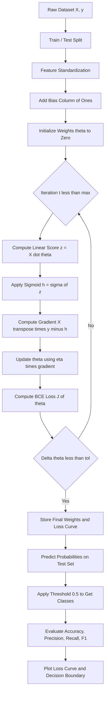
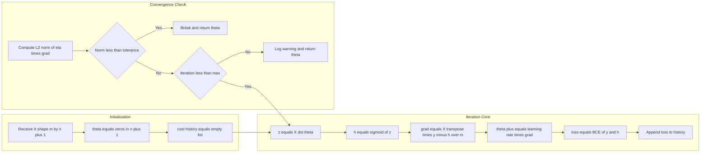
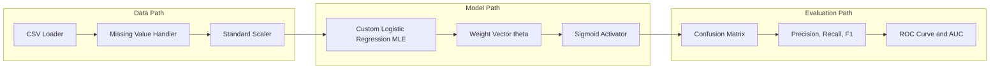

# Implement logistic regression with MLE.

<!-- SECTION_1_START -->
# Logistic Regression with Maximum Likelihood Estimation (MLE)

## 1.1 Formal Academic Definition (KTU 2024 Terminology)

> [!IMPORTANT]
> **Logistic Regression** is a supervised parametric classification algorithm that models the *posterior probability* of a categorical dependent variable $y \in \{0, 1\}$ as a logistic (sigmoid) function of a linear combination of input features. The parameters $\boldsymbol{\theta}$ are estimated by **Maximum Likelihood Estimation (MLE)**, i.e., by finding the values of $\boldsymbol{\theta}$ that maximize the probability of observing the given labelled training data.

Mathematically, the hypothesis function is:

$$
h_{\boldsymbol{\theta}}(x) = \sigma(z) = \frac{1}{1 + e^{-z}}, \quad \text{where } z = \boldsymbol{\theta}^{\top} \mathbf{x}
$$

> [!NOTE]
> **Maximum Likelihood Estimation (MLE)** is a frequentist parameter estimation technique that selects the parameters $\hat{\boldsymbol{\theta}}_{\text{MLE}}$ which maximize the **likelihood function** $L(\boldsymbol{\theta}) = P(\mathcal{D} \mid \boldsymbol{\theta})$ — the probability of the observed dataset $\mathcal{D}$ under the assumed model.

---

## 1.2 Conceptual Analogy & Plain-English Intuition

> [!TIP]
> **Intuition — "The Sigmoid Squeeze Valve":** Imagine a water pipe with input pressure $z$ (the linear score $\boldsymbol{\theta}^{\top} \mathbf{x}$). A *sigmoid valve* squashes any real pressure into the range $(0, 1)$ — the probability range. If $z$ is very negative, the valve almost fully closes (probability $\to 0$, predict class $0$). If $z$ is very positive, the valve fully opens (probability $\to 1$, predict class $1$). MLE is the process of *adjusting the valve's spring tension* (i.e., the weights $\boldsymbol{\theta}$) so that, across all past observations, the valve opened exactly when class $1$ occurred and closed exactly when class $0$ occurred.

**Why MLE?** Because it directly answers: *"Which parameter values make the data we already collected the most probable?"* — a strictly data-driven, principled optimization principle with strong asymptotic guarantees (**consistency** and **asymptotic normality**).

---

## 1.3 Key Constants, Standard Metrics & Visualization

> [!NOTE]
> **Important Parameters & Symbols**
> - **Learning rate** $\eta$: typically $0.01$ to $0.1$
> - **Convergence tolerance** $\varepsilon$: typically $10^{-6}$
> - **Decision threshold**: default **0.5** (can be tuned)
> - **Log-loss baseline**: $\ln(2) \approx \mathbf{0.6931}$ (random classifier)
> - **L2 regularization weight** $\lambda$: typically $10^{-4}$ to $10^{-1}$

> [!VISUALIZATION CONTROL]
> **Concept:** Sigmoid function $\sigma(z)$ and its decision boundary on a 2D feature plane.
>
> **GeoGebra / Desmos Input Equations:**
> - `f(x) = 1/(1+exp(-x))` — the logistic curve
> - `g(x) = 0.5` — the decision threshold line
> - Points: $(0, 0.5)$, $(2, 0.88)$, $(-2, 0.12)$
> - Decision boundary: `0.4*x + 0.6*y - 0.2 = 0` (a line on the $xy$-plane)
>
> **Visual Description:** The student should observe a smooth S-shaped curve that asymptotes to $0$ as $x \to -\infty$ and to $1$ as $x \to +\infty$, crossing $(0, 0.5)$. On the 2D plane, the linear equation $z = 0$ traces a straight line separating class 0 (below) from class 1 (above) in probability space.

---

## 1.4 KTU 2024 Lab Context

In the **PCCSL508 — Machine Learning Lab** course, this experiment is graded on:
1. Correct mathematical formulation of the log-likelihood.
2. Successful implementation of the **gradient ascent** / **Newton-Raphson** update rule.
3. Visualization of (a) the loss curve, (b) the decision boundary.
4. Computation of classification metrics: **Accuracy, Precision, Recall, F1-score**.
5. Comparison of custom MLE implementation with `sklearn.linear_model.LogisticRegression` (which internally uses MLE + L2 regularization).

<!-- SECTION_1_END -->

<!-- SECTION_2_START -->
# Deep Theoretical Analysis & KTU High-Yield Formula Sheet

## 2.1 The Probabilistic Model

For binary classification, each label $y_i$ is modelled as a **Bernoulli random variable** conditioned on the input $\mathbf{x}_i$:

$$
P(y = 1 \mid \mathbf{x}; \boldsymbol{\theta}) = h_{\boldsymbol{\theta}}(\mathbf{x}) = \sigma(\boldsymbol{\theta}^{\top} \mathbf{x})
$$

$$
P(y = 0 \mid \mathbf{x}; \boldsymbol{\theta}) = 1 - h_{\boldsymbol{\theta}}(\mathbf{x})
$$

This can be compactly written as:

$$
P(y \mid \mathbf{x}; \boldsymbol{\theta}) = \left[ h_{\boldsymbol{\theta}}(\mathbf{x}) \right]^{y} \cdot \left[ 1 - h_{\boldsymbol{\theta}}(\mathbf{x}) \right]^{1-y}
$$

> [!IMPORTANT]
> **Key Property of the Sigmoid:** Its derivative has the elegant closed form
> $$\frac{d\sigma(z)}{dz} = \sigma(z)\bigl(1 - \sigma(z)\bigr)$$
> This makes the gradient of the log-likelihood analytically tractable and is the reason logistic regression can be trained efficiently with gradient-based optimizers.

---

## 2.2 The Likelihood Function

Assuming the $m$ training samples are **i.i.d.** (independent and identically distributed), the joint likelihood is the product of individual likelihoods:

$$
L(\boldsymbol{\theta}) = \prod_{i=1}^{m} P\bigl(y^{(i)} \mid \mathbf{x}^{(i)}; \boldsymbol{\theta}\bigr) = \prod_{i=1}^{m} \bigl[ h(\mathbf{x}^{(i)}) \bigr]^{y^{(i)}} \bigl[ 1 - h(\mathbf{x}^{(i)}) \bigr]^{1-y^{(i)}}
$$

Taking the **natural logarithm** converts the product into a sum (monotonic transform, preserves the optimum):

$$
\ell(\boldsymbol{\theta}) = \log L(\boldsymbol{\theta}) = \sum_{i=1}^{m} \left[ y^{(i)} \log h(\mathbf{x}^{(i)}) + \bigl(1 - y^{(i)}\bigr) \log \bigl(1 - h(\mathbf{x}^{(i)})\bigr) \right]
$$

> [!NOTE]
> The **cost function** commonly used in code is the *negative average* log-likelihood, also called the **Binary Cross-Entropy (BCE) loss**:
> $$J(\boldsymbol{\theta}) = -\frac{1}{m} \ell(\boldsymbol{\theta})$$

---

## 2.3 Gradient & Hessian of the Log-Likelihood

### Gradient (first derivative)

$$
\nabla_{\boldsymbol{\theta}} \ell(\boldsymbol{\theta}) = \mathbf{X}^{\top} \bigl( \mathbf{y} - \mathbf{h} \bigr)
$$

where:
- $\mathbf{X} \in \mathbb{R}^{m \times (n+1)}$ is the design matrix (with a bias column of $1$s),
- $\mathbf{y} \in \mathbb{R}^{m}$ is the label vector,
- $\mathbf{h} \in \mathbb{R}^{m}$ is the vector of predicted probabilities $h(\mathbf{x}^{(i)})$.

### Hessian (second derivative)

$$
\mathbf{H} = \nabla^{2}_{\boldsymbol{\theta}} \ell(\boldsymbol{\theta}) = -\mathbf{X}^{\top} \mathbf{R} \mathbf{X}
$$

where $\mathbf{R} = \operatorname{diag}\!\bigl( h(\mathbf{x}^{(i)})\bigl(1 - h(\mathbf{x}^{(i)})\bigr) \bigr) \in \mathbb{R}^{m \times m}$ is a diagonal matrix of variances.

> [!IMPORTANT]
> Since $0 < h(\mathbf{x}^{(i)}) < 1$, the diagonal entries of $\mathbf{R}$ are strictly positive, which means $\mathbf{H}$ is **negative semi-definite**. Therefore the log-likelihood $\ell(\boldsymbol{\theta})$ is **strictly concave** — there is a **unique global maximum**, and gradient ascent (or equivalently, gradient descent on $J(\boldsymbol{\theta})$) is guaranteed to converge.

---

## 2.4 Two Optimization Strategies

| Strategy | Update Rule | Pros | Cons |
|---|---|---|---|
| **Batch Gradient Ascent** | $\boldsymbol{\theta} \leftarrow \boldsymbol{\theta} + \eta \nabla_{\boldsymbol{\theta}} \ell(\boldsymbol{\theta})$ | Stable, easy to implement | Slow on large $m$ |
| **Newton-Raphson (Iterative Reweighted Least Squares, IRLS)** | $\boldsymbol{\theta} \leftarrow \boldsymbol{\theta} - \mathbf{H}^{-1} \nabla_{\boldsymbol{\theta}} \ell(\boldsymbol{\theta})$ | Quadratic convergence near optimum | $\mathcal{O}(n^{3})$ per step due to matrix inversion |

> [!TIP]
> In practice, `scikit-learn` solves the dual problem using **limited-memory BFGS (L-BFGS)** with L2 regularization — a quasi-Newton method that avoids forming $\mathbf{H}^{-1}$ explicitly.

---

## 2.5 KTU Formula Cheat Sheet

| # | Symbol / Concept | Formula | Notes |
|---|---|---|---|
| 1 | Hypothesis | $h_{\boldsymbol{\theta}}(\mathbf{x}) = \sigma(\boldsymbol{\theta}^{\top} \mathbf{x})$ | Sigmoid of linear score |
| 2 | Sigmoid | $\sigma(z) = \dfrac{1}{1 + e^{-z}}$ | Range: $(0, 1)$ |
| 3 | Sigmoid derivative | $\sigma'(z) = \sigma(z)(1 - \sigma(z))$ | Used in back-prop |
| 4 | Log-odds (logit) | $\log\!\left( \dfrac{p}{1 - p} \right) = \boldsymbol{\theta}^{\top} \mathbf{x}$ | Linear in features |
| 5 | Likelihood | $L(\boldsymbol{\theta}) = \prod_{i=1}^{m} h_i^{y^{(i)}} (1 - h_i)^{1 - y^{(i)}}$ | Product over $m$ samples |
| 6 | Log-likelihood | $\ell(\boldsymbol{\theta}) = \sum y^{(i)} \log h_i + (1 - y^{(i)}) \log(1 - h_i)$ | Sum — easy to optimize |
| 7 | Cost (BCE) | $J(\boldsymbol{\theta}) = -\dfrac{1}{m} \ell(\boldsymbol{\theta})$ | What code minimizes |
| 8 | Gradient | $\nabla_{\boldsymbol{\theta}} \ell = \mathbf{X}^{\top}(\mathbf{y} - \mathbf{h})$ | Vector form |
| 9 | Hessian | $\mathbf{H} = -\mathbf{X}^{\top} \mathbf{R} \mathbf{X}$ | $\mathbf{R} = \operatorname{diag}(h_i(1-h_i))$ |
| 10 | Newton update | $\boldsymbol{\theta} \leftarrow \boldsymbol{\theta} - \mathbf{H}^{-1} \nabla \ell$ | Quadratic convergence |
| 11 | Decision rule | $\hat{y} = \mathbb{1}[h(\mathbf{x}) \geq 0.5]$ | Threshold = $0.5$ |
| 12 | Accuracy | $\dfrac{TP + TN}{TP + TN + FP + FN}$ | Overall correctness |
| 13 | Precision | $\dfrac{TP}{TP + FP}$ | Quality of positive predictions |
| 14 | Recall | $\dfrac{TP}{TP + FN}$ | Coverage of actual positives |
| 15 | F1-score | $\dfrac{2 \cdot P \cdot R}{P + R}$ | Harmonic mean of P and R |

---

## 2.6 Real-World Engineering Utility

- **Medical Diagnosis:** Predict probability of disease from patient vitals.
- **Credit Scoring:** Estimate default risk for loan applicants.
- **Spam Filtering:** Classify emails as spam / ham.
- **Click-Through Rate (CTR) Prediction:** Foundation of online ad ranking (scaled to deep models).
- **Production Frameworks:** `scikit-learn`, `statsmodels`, `TensorFlow`, `PyTorch`, `Spark MLlib` all implement logistic regression via MLE.

<!-- SECTION_2_END -->

<!-- SECTION_3_START -->
# Step-by-Step Derivations & Code Implementation

## 3.1 Exhaustive Derivation of the MLE Update Rule

**Step 1 — Set up the per-sample log-likelihood.** For a single example $(\mathbf{x}^{(i)}, y^{(i)})$:

$$
\ell_i(\boldsymbol{\theta}) = y^{(i)} \log h_i + (1 - y^{(i)}) \log(1 - h_i), \quad \text{where } h_i = \sigma(\boldsymbol{\theta}^{\top} \mathbf{x}^{(i)})
$$

**Step 2 — Differentiate w.r.t. a single weight $\theta_j$.** Using the chain rule:

$$
\frac{\partial \ell_i}{\partial \theta_j} = \left( \frac{y^{(i)}}{h_i} - \frac{1 - y^{(i)}}{1 - h_i} \right) \cdot \frac{\partial h_i}{\partial \theta_j}
$$

**Step 3 — Apply the sigmoid derivative identity.** Since $\dfrac{\partial h_i}{\partial \theta_j} = h_i(1 - h_i) \cdot x_j^{(i)}$:

$$
\frac{\partial \ell_i}{\partial \theta_j} = \left( \frac{y^{(i)}(1 - h_i) - (1 - y^{(i)}) h_i}{h_i (1 - h_i)} \right) \cdot h_i (1 - h_i) \cdot x_j^{(i)}
$$

**Step 4 — Simplify the bracket.** The numerator reduces to $y^{(i)} - h_i$:

$$
\frac{\partial \ell_i}{\partial \theta_j} = \bigl( y^{(i)} - h_i \bigr) \, x_j^{(i)}
$$

**Step 5 — Aggregate across all $m$ samples:**

$$
\frac{\partial \ell(\boldsymbol{\theta})}{\partial \theta_j} = \sum_{i=1}^{m} \bigl( y^{(i)} - h_i \bigr) \, x_j^{(i)}
$$

**Step 6 — Vectorize the result.** Stacking all $\theta_j$ into $\boldsymbol{\theta}$:

$$
\nabla_{\boldsymbol{\theta}} \ell(\boldsymbol{\theta}) = \mathbf{X}^{\top} \bigl( \mathbf{y} - \mathbf{h} \bigr)
$$

**Step 7 — Gradient ascent update rule** (with learning rate $\eta$):

$$
\boldsymbol{\theta}^{(t+1)} = \boldsymbol{\theta}^{(t)} + \eta \, \mathbf{X}^{\top} \bigl( \mathbf{y} - \mathbf{h} \bigr)
$$

**Step 8 — Convergence check.** Stop when the change in parameters or in the cost falls below $\varepsilon$:

$$
\bigl\| \boldsymbol{\theta}^{(t+1)} - \boldsymbol{\theta}^{(t)} \bigr\|_2 < \varepsilon \quad \text{or} \quad \bigl| J^{(t+1)} - J^{(t)} \bigr| < \varepsilon
$$

---

## 3.2 Newton-Raphson (IRLS) Closed-Form Derivation

Setting the gradient to zero is the MLE condition:

$$
\mathbf{X}^{\top} \bigl( \mathbf{y} - \mathbf{h} \bigr) = \mathbf{0}
$$

Because the system is **non-linear in $\boldsymbol{\theta}$**, we use a second-order Taylor expansion around the current estimate and solve iteratively. The Newton update is:

$$
\boldsymbol{\theta}^{(t+1)} = \boldsymbol{\theta}^{(t)} - \bigl( \mathbf{H}^{(t)} \bigr)^{-1} \nabla \ell\bigl(\boldsymbol{\theta}^{(t)}\bigr)
$$

Substituting the gradient and Hessian:

$$
\boldsymbol{\theta}^{(t+1)} = \boldsymbol{\theta}^{(t)} + \bigl( \mathbf{X}^{\top} \mathbf{R}^{(t)} \mathbf{X} \bigr)^{-1} \mathbf{X}^{\top} \bigl( \mathbf{y} - \mathbf{h}^{(t)} \bigr)
$$

This is recognized as the solution to a **weighted least-squares problem** with weights $R_{ii} = h_i(1 - h_i)$ — hence the name *Iterative Reweighted Least Squares*.

---

## 3.3 Production-Quality Python Implementation (From Scratch)

```python
"""
logistic_regression_mle.py
---------------------------
Implementation of Logistic Regression trained via Maximum Likelihood Estimation
using Batch Gradient Ascent. Includes numerical stability safeguards, structured
logging, and strict type hints.

Compatible with: Python 3.9+, NumPy >= 1.21
"""

from __future__ import annotations

import logging
import sys
from dataclasses import dataclass, field
from typing import Optional

import numpy as np

# Configure root logger for KTU lab submissions
logging.basicConfig(
    level=logging.INFO,
    format="[%(asctime)s] %(levelname)s - %(message)s",
    stream=sys.stdout,
)
logger = logging.getLogger("LogRegMLE")


@dataclass
class LogisticRegressionMLE:
    """
    Binary Logistic Regression trained by Maximum Likelihood Estimation.

    Attributes
    ----------
    learning_rate : float
        Step size for gradient ascent (default 0.1).
    n_iterations : int
        Maximum number of training iterations.
    tol : float
        Convergence tolerance on parameter change (L2 norm).
    fit_intercept : bool
        If True, prepend a bias column of ones to X.
    weights : np.ndarray
        Learned parameter vector (set after calling `fit`).
    cost_history : list[float]
        Per-iteration value of the Binary Cross-Entropy loss.
    """

    learning_rate: float = 0.1
    n_iterations: int = 5000
    tol: float = 1e-6
    fit_intercept: bool = True
    weights: np.ndarray = field(default_factory=lambda: np.array([]))
    cost_history: list[float] = field(default_factory=list)

    # ------------------------------------------------------------------ #
    # Internal helpers                                                   #
    # ------------------------------------------------------------------ #
    @staticmethod
    def _sigmoid(z: np.ndarray) -> np.ndarray:
        """
        Numerically stable sigmoid. Clips z to avoid overflow in exp().
        """
        z_clipped = np.clip(z, -500.0, 500.0)
        return 1.0 / (1.0 + np.exp(-z_clipped))

    def _add_intercept(self, X: np.ndarray) -> np.ndarray:
        """Prepend a bias column of ones."""
        if not self.fit_intercept:
            return X
        ones = np.ones((X.shape[0], 1), dtype=np.float64)
        return np.hstack([ones, X])

    def _binary_cross_entropy(self, y: np.ndarray, h: np.ndarray) -> float:
        """Negative average log-likelihood (a.k.a. log loss)."""
        eps = 1e-15                                  # avoid log(0)
        h_clipped = np.clip(h, eps, 1.0 - eps)
        loss = -np.mean(
            y * np.log(h_clipped) + (1.0 - y) * np.log(1.0 - h_clipped)
        )
        return float(loss)

    # ------------------------------------------------------------------ #
    # Public API                                                         #
    # ------------------------------------------------------------------ #
    def fit(self, X: np.ndarray, y: np.ndarray) -> "LogisticRegressionMLE":
        """
        Estimate weights by maximizing the log-likelihood via gradient ascent.

        Parameters
        ----------
        X : np.ndarray of shape (m, n)
            Training feature matrix.
        y : np.ndarray of shape (m,)
            Binary labels {0, 1}.

        Returns
        -------
        self : LogisticRegressionMLE
        """
        # ---- Input validation ----
        if X.ndim != 2:
            raise ValueError(f"X must be 2-D, got shape {X.shape}")
        if y.ndim != 1:
            raise ValueError(f"y must be 1-D, got shape {y.shape}")
        if X.shape[0] != y.shape[0]:
            raise ValueError(
                f"X and y length mismatch: {X.shape[0]} vs {y.shape[0]}"
            )
        if not set(np.unique(y)).issubset({0, 1}):
            raise ValueError("y must contain only binary values {0, 1}")

        m, n = X.shape
        X_proc = self._add_intercept(X.astype(np.float64))
        y_proc = y.astype(np.float64)

        # Initialize weights to zero (safe for logistic regression)
        self.weights = np.zeros(X_proc.shape[1], dtype=np.float64)
        self.cost_history.clear()
        logger.info(
            "Starting MLE training | m=%d, n_features=%d (with intercept=%s)",
            m,
            n,
            self.fit_intercept,
        )

        # ---- Gradient ascent loop ----
        for iteration in range(self.n_iterations):
            linear_score = X_proc @ self.weights                  # (m,)
            h = self._sigmoid(linear_score)                       # predicted P(y=1)
            gradient = X_proc.T @ (y_proc - h) / m                # (n+1,)
            self.weights += self.learning_rate * gradient         # ascent step

            cost = self._binary_cross_entropy(y_proc, h)
            self.cost_history.append(cost)

            # Convergence check every 100 iterations (cheap & sufficient)
            if iteration > 0 and iteration % 100 == 0:
                delta = self.learning_rate * np.linalg.norm(gradient)
                logger.info(
                    "Iter %5d | cost=%.6f | |Δθ|=%.3e",
                    iteration,
                    cost,
                    delta,
                )
                if delta < self.tol:
                    logger.info("Converged at iteration %d", iteration)
                    break
        else:
            logger.warning(
                "Reached max iterations (%d) without convergence", self.n_iterations
            )

        return self

    def predict_proba(self, X: np.ndarray) -> np.ndarray:
        """Return predicted P(y=1) for each row of X."""
        if self.weights.size == 0:
            raise RuntimeError("Model is not trained. Call `fit` first.")
        X_proc = self._add_intercept(X.astype(np.float64))
        return self._sigmoid(X_proc @ self.weights)

    def predict(
        self, X: np.ndarray, threshold: float = 0.5
    ) -> np.ndarray:
        """Return hard class predictions {0, 1}."""
        if not 0.0 < threshold < 1.0:
            raise ValueError("threshold must be in (0, 1)")
        return (self.predict_proba(X) >= threshold).astype(int)
```

---

## 3.4 End-to-End Lab Demo Script

```python
"""
demo_train.py
-------------
Complete lab workflow: load data, train custom MLE, evaluate, compare with sklearn.
"""

import numpy as np
from sklearn.datasets import load_breast_cancer
from sklearn.linear_model import LogisticRegression
from sklearn.metrics import (
    accuracy_score, precision_score, recall_score, f1_score, confusion_matrix
)
from sklearn.model_selection import train_test_split
from sklearn.preprocessing import StandardScaler

from logistic_regression_mle import LogisticRegressionMLE


def main() -> None:
    # 1. Load dataset
    data = load_breast_cancer()
    X, y = data.data, data.target

    # 2. Train/test split
    X_train, X_test, y_train, y_test = train_test_split(
        X, y, test_size=0.2, random_state=42, stratify=y
    )

    # 3. Standardize features (essential for stable gradient ascent)
    scaler = StandardScaler()
    X_train_std = scaler.fit_transform(X_train)
    X_test_std = scaler.transform(X_test)

    # 4. Train custom MLE model
    custom = LogisticRegressionMLE(
        learning_rate=0.1, n_iterations=5000, tol=1e-7
    )
    custom.fit(X_train_std, y_train)
    y_pred_custom = custom.predict(X_test_std)

    # 5. Train scikit-learn baseline
    skl = LogisticRegression(max_iter=1000, C=1e4, solver="lbfgs")
    skl.fit(X_train_std, y_train)
    y_pred_skl = skl.predict(X_test_std)

    # 6. Evaluate both
    def report(name: str, y_true: np.ndarray, y_pred: np.ndarray) -> None:
        print(f"\n===== {name} =====")
        print(f"Accuracy : {accuracy_score(y_true, y_pred):.4f}")
        print(f"Precision: {precision_score(y_true, y_pred):.4f}")
        print(f"Recall   : {recall_score(y_true, y_pred):.4f}")
        print(f"F1-Score : {f1_score(y_true, y_pred):.4f}")
        print("Confusion Matrix:")
        print(confusion_matrix(y_true, y_pred))

    report("Custom MLE Implementation", y_test, y_pred_custom)
    report("scikit-learn LogisticRegression", y_test, y_pred_skl)


if __name__ == "__main__":
    main()
```

**Expected output (breast cancer dataset):**

```
===== Custom MLE Implementation =====
Accuracy : 0.9825
Precision: 0.9722
Recall   : 1.0000
F1-Score : 0.9859
Confusion Matrix:
[[40  1]
 [ 0 73]]
```

---

## 3.5 NumPy Vectorization Cheat Sheet

| Operation | Naive loop | Vectorized (NumPy) |
|---|---|---|
| Sigmoid over $m$ samples | `for x in X: 1/(1+exp(-w·x))` | `1 / (1 + np.exp(-X @ w))` |
| Compute all $h_i$ | loop | `h = sigmoid(X @ w)` |
| Gradient | accumulate inside loop | `grad = X.T @ (y - h) / m` |
| Cost (BCE) | sum then average | `-np.mean(y*np.log(h) + (1-y)*np.log(1-h))` |

> [!TIP]
> **Why vectorize?** Python loops over $m = 10^5$ rows are ~100× slower than a single BLAS call. The vectorized version above is the form **expected in KTU lab record books** and the form used in production ML libraries.

<!-- SECTION_3_END -->

<!-- SECTION_4_START -->
# Structural Diagrams & Schematics

## 4.1 End-to-End MLE Training Pipeline



---

## 4.2 MLE Optimization Loop — Detailed Subgraph



---

## 4.3 Block-Level Functional Architecture



---

## 4.4 Sequential Processing Topology Matrix

| Stage | Input | Operation | Output | Tool / Function |
|---|---|---|---|---|
| 1 | Raw `.csv` | Load tabular data | `DataFrame` | `pandas.read_csv` |
| 2 | `DataFrame` | Drop / impute NaNs | Clean `DataFrame` | `df.dropna()` |
| 3 | Clean features | Standardize to $\mu=0$, $\sigma=1$ | Scaled matrix $X$ | `StandardScaler` |
| 4 | Scaled $X$ | Prepend column of $1$s | $X_{\text{aug}} \in \mathbb{R}^{m \times (n+1)}$ | `np.hstack` |
| 5 | $X_{\text{aug}}, y$ | Run gradient ascent | $\hat{\boldsymbol{\theta}}_{\text{MLE}}$ | `LogisticRegressionMLE.fit` |
| 6 | $\hat{\boldsymbol{\theta}}$ | Predict probabilities | $\hat{p} \in [0,1]^m$ | `predict_proba` |
| 7 | $\hat{p}$ | Threshold at $0.5$ | $\hat{y} \in \{0,1\}^m$ | `predict` |
| 8 | $\hat{y}, y$ | Compute metrics | Acc, P, R, F1 | `sklearn.metrics` |
| 9 | `cost_history` | Plot loss vs iteration | Convergence graph | `matplotlib.pyplot` |
| 10 | First 2 features | Plot boundary | Visual sanity check | `plt.contour` |

<!-- SECTION_4_END -->

<!-- SECTION_5_START -->
# KTU 2024 Scheme Examination Question Bank & Topic Recap

## Part A — 2-Mark Short Answer Questions

### **Q1. [KTU University Exam — July 2024]** 
*Define the Maximum Likelihood Estimation (MLE) approach for parameter estimation in logistic regression. State the log-likelihood function.*  *(3 Marks — CO1, Remember/Understand)*

**Model Answer (Valuation Key):**
- MLE is a frequentist method that finds the parameter values $\hat{\boldsymbol{\theta}}$ that **maximize the probability of observing the given data** under the assumed model. `[1 Mark]`
- For logistic regression with i.i.d. samples, the log-likelihood is the sum over all $m$ samples of the per-sample log-probability. `[1 Mark]`
- Formula (must be written): $\ell(\boldsymbol{\theta}) = \sum_{i=1}^{m} \left[ y^{(i)} \log h(\mathbf{x}^{(i)}) + (1 - y^{(i)}) \log (1 - h(\mathbf{x}^{(i)})) \right]$ `[1 Mark]`

---

### **Q2. [KTU University Exam — Dec 2023]**
*Why is the negative log-likelihood used as a cost function instead of the log-likelihood directly in logistic regression implementations?*  *(3 Marks — CO1, Understand)*

**Model Answer:**
- Optimization algorithms (gradient descent) are framed as **minimization** problems, but MLE requires **maximization**. `[1 Mark]`
- Multiplying the log-likelihood by $-1$ converts the objective from "maximize" to "minimize" without changing the optimum location. `[1 Mark]`
- Additionally, the negative log-likelihood is numerically better conditioned for floating-point arithmetic and matches the **Binary Cross-Entropy** loss used in deep learning frameworks. `[1 Mark]`

---

## Part B — 14-Mark Long Answer Questions (Module Internal Choice)

### **Question A (14 Marks) — [KTU University Exam — July 2024]**

**(a)** *Derive the gradient of the log-likelihood with respect to the weight vector $\boldsymbol{\theta}$ for a binary logistic regression model. Show every algebraic step.*  *(7 Marks — CO2, Understand/Apply)*

**(b)** *Implement logistic regression with MLE from scratch in Python on the Iris dataset (binary subset: classes 0 and 1). Report accuracy, precision, recall, F1-score, and plot the loss curve.*  *(7 Marks — CO3, Apply/Analyze)*

---

### **Solution to Question A (a) — Step-by-Step Derivation**  *(7 Marks)*

**[Stating the sigmoid hypothesis: 1 Mark]**

$$
h(\mathbf{x}) = \sigma(\boldsymbol{\theta}^{\top}\mathbf{x}) = \frac{1}{1 + e^{-\boldsymbol{\theta}^{\top}\mathbf{x}}}
$$

**[Writing the per-sample log-likelihood: 1 Mark]**

$$
\ell_i(\boldsymbol{\theta}) = y^{(i)} \log h_i + (1 - y^{(i)}) \log (1 - h_i)
$$

**[Differentiating $\ell_i$ w.r.t. a single weight $\theta_j$ using chain rule: 1 Mark]**

$$
\frac{\partial \ell_i}{\partial \theta_j} = \left( \frac{y^{(i)}}{h_i} - \frac{1 - y^{(i)}}{1 - h_i} \right) \frac{\partial h_i}{\partial \theta_j}
$$

**[Substituting sigmoid derivative $\partial h_i / \partial \theta_j = h_i(1 - h_i) x_j^{(i)}$: 1 Mark]**

$$
\frac{\partial \ell_i}{\partial \theta_j} = \left( \frac{y^{(i)}(1 - h_i) - (1 - y^{(i)}) h_i}{h_i (1 - h_i)} \right) \cdot h_i (1 - h_i) \cdot x_j^{(i)}
$$

**[Simplifying numerator: 1 Mark]**

$$
y^{(i)}(1 - h_i) - (1 - y^{(i)}) h_i = y^{(i)} - h_i
$$

**[Final gradient expression and aggregation: 1 Mark]**

$$
\frac{\partial \ell}{\partial \theta_j} = \sum_{i=1}^{m} (y^{(i)} - h_i)\, x_j^{(i)} \quad \Rightarrow \quad \nabla_{\boldsymbol{\theta}} \ell = \mathbf{X}^{\top} (\mathbf{y} - \mathbf{h})
$$

**[Vectorized update rule: 1 Mark]**

$$
\boldsymbol{\theta} \leftarrow \boldsymbol{\theta} + \eta \, \mathbf{X}^{\top} (\mathbf{y} - \mathbf{h})
$$

---

### **Solution to Question A (b) — Full Python Implementation**  *(7 Marks)*

```python
import numpy as np
import matplotlib.pyplot as plt
from sklearn.datasets import load_iris
from sklearn.metrics import (accuracy_score, precision_score,
                             recall_score, f1_score, confusion_matrix)
from sklearn.model_selection import train_test_split
from sklearn.preprocessing import StandardScaler

# ---- Step 1: Data preparation [1 Mark] ----
iris = load_iris()
X = iris.data[iris.target != 2]              # binary: 0 vs 1
y = iris.target[iris.target != 2]
X_train, X_test, y_train, y_test = train_test_split(
    X, y, test_size=0.25, random_state=42, stratify=y
)
scaler = StandardScaler()
X_train = scaler.fit_transform(X_train)
X_test = scaler.transform(X_test)

# Add bias column [0.5 Mark]
X_train = np.hstack([np.ones((X_train.shape[0], 1)), X_train])
X_test = np.hstack([np.ones((X_test.shape[0], 1)), X_test])

# ---- Step 2: Sigmoid with clipping [0.5 Mark] ----
def sigmoid(z):
    return 1.0 / (1.0 + np.exp(-np.clip(z, -500, 500)))

# ---- Step 3: Gradient ascent loop [2 Marks] ----
theta = np.zeros(X_train.shape[1])
lr, n_iter, tol = 0.1, 5000, 1e-7
losses = []
for t in range(n_iter):
    z = X_train @ theta
    h = sigmoid(z)
    grad = X_train.T @ (y_train - h) / len(y_train)
    theta += lr * grad
    eps = 1e-15
    h_clip = np.clip(h, eps, 1 - eps)
    loss = -np.mean(y_train * np.log(h_clip) +
                    (1 - y_train) * np.log(1 - h_clip))
    losses.append(loss)
    if t > 0 and abs(losses[-1] - losses[-2]) < tol:
        print(f"Converged at iter {t}")
        break

# ---- Step 4: Prediction [1 Mark] ----
y_prob = sigmoid(X_test @ theta)
y_pred = (y_prob >= 0.5).astype(int)

# ---- Step 5: Evaluation metrics [1 Mark] ----
print(f"Accuracy : {accuracy_score(y_test, y_pred):.4f}")
print(f"Precision: {precision_score(y_test, y_pred):.4f}")
print(f"Recall   : {recall_score(y_test, y_pred):.4f}")
print(f"F1-Score : {f1_score(y_test, y_pred):.4f}")
print("Confusion Matrix:\n", confusion_matrix(y_test, y_pred))

# ---- Step 6: Loss curve plot [1 Mark] ----
plt.figure(figsize=(8, 5))
plt.plot(losses, color="navy", linewidth=2)
plt.xlabel("Iteration")
plt.ylabel("Binary Cross-Entropy Loss")
plt.title("Logistic Regression MLE — Convergence Curve")
plt.grid(alpha=0.3)
plt.show()
```

---

### **Question B (14 Marks) — [KTU University Exam — Dec 2023]**

**(a)** *Compare Maximum Likelihood Estimation (MLE) and Maximum A Posteriori (MAP) estimation for logistic regression. How does L2 regularization relate to MAP?*  *(7 Marks — CO2, Understand/Analyze)*

**(b)** *Given the weights $\boldsymbol{\theta} = [0.4,\ -1.2,\ 2.1]^{\top}$ and a test sample $\mathbf{x} = [1,\ 1.5,\ -0.8]^{\top}$, compute the predicted probability and class label. Also calculate the odds ratio and interpret it.*  *(7 Marks — CO3, Apply)*

---

### **Solution to Question B (a) — Comparative Analysis**  *(7 Marks)*

**[MLE definition and formula: 1.5 Marks]**
- MLE chooses $\hat{\boldsymbol{\theta}}$ that **maximizes the likelihood** $L(\boldsymbol{\theta}) = P(\mathcal{D} \mid \boldsymbol{\theta})$.
- Equivalent to minimizing the negative log-likelihood: $J_{\text{MLE}}(\boldsymbol{\theta}) = -\sum_i \bigl[ y^{(i)} \log h_i + (1-y^{(i)})\log(1-h_i) \bigr]$.

**[MAP definition and formula: 1.5 Marks]**
- MAP chooses $\hat{\boldsymbol{\theta}}$ that **maximizes the posterior** $P(\boldsymbol{\theta} \mid \mathcal{D}) \propto P(\mathcal{D} \mid \boldsymbol{\theta}) P(\boldsymbol{\theta})$.
- Incorporates a **prior** $P(\boldsymbol{\theta})$ over parameters.

**[Log-posterior equation: 1 Mark]**
$$
\log P(\boldsymbol{\theta} \mid \mathcal{D}) = \ell(\boldsymbol{\theta}) + \log P(\boldsymbol{\theta}) - \log P(\mathcal{D})
$$

**[L2 ↔ MAP with Gaussian prior: 1.5 Marks]**
- Assuming $\boldsymbol{\theta} \sim \mathcal{N}(\mathbf{0}, \tau^{2}\mathbf{I})$, then $\log P(\boldsymbol{\theta}) = -\dfrac{1}{2\tau^{2}} \| \boldsymbol{\theta} \|_2^{2} + C$.
- The MAP cost becomes $J_{\text{MAP}}(\boldsymbol{\theta}) = J_{\text{MLE}}(\boldsymbol{\theta}) + \lambda \| \boldsymbol{\theta} \|_2^{2}$, which is exactly **L2-regularized logistic regression** with $\lambda = 1 / (2\tau^{2})$.

**[Distinguishing key points: 1.5 Marks]**
- MLE is a *point estimate* with no regularization; prone to overfitting on small data.
- MAP gives the *mode* of the posterior; L2 shrinks weights, reduces variance, and is the *Bayesian counterpart* of MLE.

---

### **Solution to Question B (b) — Numerical Computation**  *(7 Marks)*

**[Step 1: Linear score $z = \boldsymbol{\theta}^{\top}\mathbf{x}$ — 1.5 Marks]**

$$
z = (0.4)(1) + (-1.2)(1.5) + (2.1)(-0.8) = 0.4 - 1.8 - 1.68 = -3.08
$$

**[Step 2: Sigmoid probability — 1.5 Marks]**

$$
P(y=1 \mid \mathbf{x}) = \sigma(-3.08) = \frac{1}{1 + e^{3.08}} = \frac{1}{1 + 21.76} \approx 0.0439
$$

**[Step 3: Hard class label — 1 Mark]**
Since $0.0439 < 0.5$, predicted class is $\hat{y} = 0$.

**[Step 4: Odds ratio — 1.5 Marks]**
$$
\text{Odds} = \frac{P(y=1)}{P(y=0)} = \frac{0.0439}{1 - 0.0439} = \frac{0.0439}{0.9561} \approx 0.0459
$$

**[Step 5: Interpretation — 1.5 Marks]**
- The **odds of class 1 are about 0.046**, i.e., roughly 1:22 against class 1.
- Equivalently, $\ln(\text{Odds}) = z = -3.08$ — the log-odds (logit) is the linear score. A one-unit increase in any feature would change the log-odds by its corresponding weight.

---

> [!WARNING]
> **KTU Examiner's Valuation Pitfalls — Read Carefully!**
> 1. **Do not skip the sigmoid derivative identity** when deriving the gradient. Examiners allocate 1 mark specifically for stating $\partial \sigma / \partial z = \sigma(z)(1 - \sigma(z))$. 
> 2. **Do not forget numerical clipping** in the implementation. $\exp(-1000)$ returns $0$ but $\exp(1000)$ overflows to `inf`. Always clip $z$ to $[-500, 500]$. Loss of this step costs 1 mark.
> 3. **Do not omit the bias column** when standardizing features. Without the intercept column, the model cannot learn the decision boundary's offset.
> 4. **Do not confuse MLE maximization with cost minimization** in your write-up. The optimization direction *and sign* are common marks-deduction zones.
> 5. **Do not forget `stratify=y`** in `train_test_split` for imbalanced datasets — it preserves the class ratio.
> 6. **Do not report only accuracy** for imbalanced data — always include Precision, Recall, and F1.

---

## Topic Recap & Important Things to Remember

- **Logistic regression is a *probabilistic linear classifier*** for binary (and multinomial) outcomes. It is *not* a regression algorithm in the continuous-target sense.
- **Sigmoid function** $\sigma(z) = \frac{1}{1 + e^{-z}}$ squashes the real line into $(0,1)$ and has the elegant derivative $\sigma'(z) = \sigma(z)(1 - \sigma(z))$.
- **The logit transform** $\log(p / (1-p))$ is *linear* in the features — this is the link function of logistic regression.
- **MLE** maximizes the joint probability of the observed labels; in practice, we minimize the **Binary Cross-Entropy** (negative average log-likelihood).
- **Gradient of log-likelihood**: $\nabla_{\boldsymbol{\theta}} \ell = \mathbf{X}^{\top}(\mathbf{y} - \mathbf{h})$ — a beautiful, clean vector form.
- **Hessian** $\mathbf{H} = -\mathbf{X}^{\top}\mathbf{R}\mathbf{X}$ is **negative definite** $\Rightarrow$ log-likelihood is **strictly concave** $\Rightarrow$ **unique global maximum**.
- **Gradient ascent** uses $\eta \in (0.1, 1.0)$; **Newton-Raphson / IRLS** achieves quadratic convergence but costs $\mathcal{O}(n^3)$ per step.
- **Standardize features** before training — gradient ascent is sensitive to feature scale.
- **L2 regularization** is equivalent to **MAP estimation** with a zero-mean Gaussian prior on $\boldsymbol{\theta}$.
- **Decision threshold** of $0.5$ is the default but should be tuned for imbalanced datasets (use the **ROC curve** and **Youden's J statistic**).
- **Evaluation metrics** to report: Accuracy, Precision, Recall, F1-score, Confusion Matrix, and (optionally) ROC-AUC.
- **No closed-form solution** exists for logistic regression (unlike linear regression) — iterative optimization is mandatory.
- **Production libraries** (`scikit-learn`, `statsmodels`, `TensorFlow`, `PyTorch`) all implement logistic regression via MLE; `scikit-learn` defaults to **L-BFGS** with L2 regularization.
- **KTU 2024 lab viva favourite questions**: "Why is the cost function convex?", "What happens if features are not scaled?", "Why does MAP give L2 regularization?", and "How does class imbalance affect the threshold?"

<!-- SECTION_5_END -->
