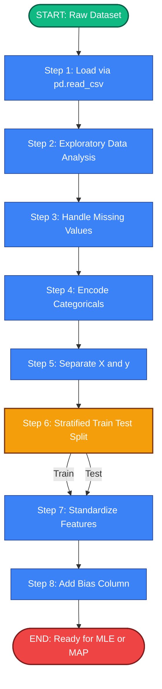
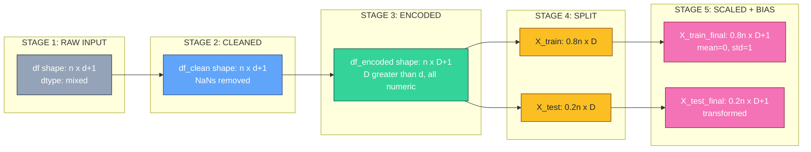
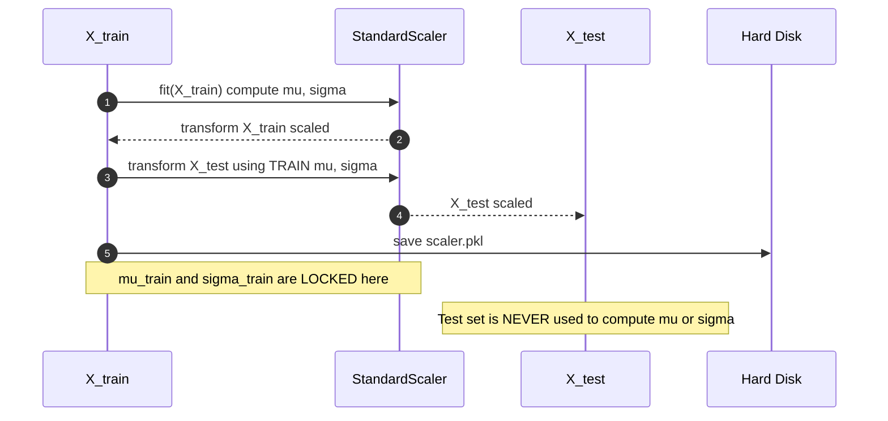
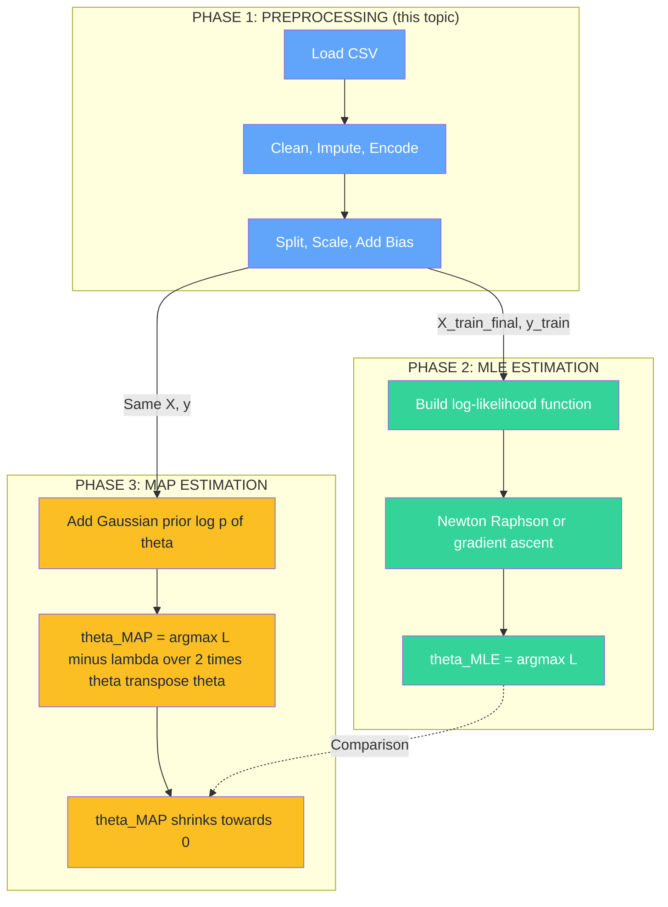

# Load and preprocess the dataset.

<!-- SECTION_1_START -->
# 🧠 MACHINE LEARNING LAB — MODULE 4
## Topic: Load and Preprocess the Dataset (Foundation for Logistic Regression via MLE & MAP)

---

### 📌 1.1 Formal Academic Definition (KTU 2024 Syllabus Terminology)

> [!IMPORTANT]
> **Dataset Loading and Preprocessing** is the foundational step in any supervised Machine Learning pipeline wherein raw, unrefined data is ingested from heterogeneous sources (CSV, JSON, SQL databases, web APIs) and systematically transformed into a clean, numerical, model-ready tensor/array. In the context of **Logistic Regression parameter estimation using Maximum Likelihood Estimation (MLE)** and **Maximum A Posteriori (MAP)**, this step is **non-negotiable**, because both estimators assume (a) **independent and identically distributed (i.i.d.) samples**, (b) **feature scales that do not bias gradient ascent/descent**, and (c) **encoded categorical variables** that can be interpreted by the log-likelihood function.

Mathematically, the preprocessed design matrix $\mathbf{X} \in \mathbb{R}^{n \times (d+1)}$ (where the $+1$ is the bias/intercept column) and the label vector $\mathbf{y} \in \{0, 1\}^{n}$ are the inputs to the MLE objective:

$$
\hat{\boldsymbol{\theta}}_{MLE} = \arg\max_{\boldsymbol{\theta}} \sum_{i=1}^{n} \left[ y_i \log \sigma(\boldsymbol{\theta}^\top \mathbf{x}_i) + (1 - y_i) \log (1 - \sigma(\boldsymbol{\theta}^\top \mathbf{x}_i)) \right]
$$

and to the MAP objective:

$$
\hat{\boldsymbol{\theta}}_{MAP} = \arg\max_{\boldsymbol{\theta}} \left[ \log \mathcal{L}(\boldsymbol{\theta}) - \frac{\lambda}{2} \boldsymbol{\theta}^\top \boldsymbol{\theta} \right]
$$

Both depend on a **well-conditioned**, **scaled**, **imputation-free** matrix $\mathbf{X}$.

---

### 🌍 1.2 Conceptual Analogy / Intuition (Plain English)

> [!NOTE]
> **Analogy — "Preparing Ingredients Before Cooking"**
> Imagine you are a chef about to bake a cake (your Logistic Regression model). The raw grocery bag (your dataset) contains unpeeled potatoes, whole spices, and a sealed water bottle. You cannot just throw the bag into the oven. First, you **wash** the vegetables (handle missing values), **peel and chop** them into uniform pieces (encode categorical variables), **measure** the ingredients with a kitchen scale (feature scaling), and **separate** the yolks from whites (train-test split).
> 
> If the ingredients are not prepped correctly, the cake (model) will either burn, be soggy, or taste wrong — even if your recipe (algorithm) is Michelin-star quality. **Loading and preprocessing is the kitchen prep work that makes or breaks the model.**

**Three Pillars of Preprocessing visualized geometrically:**

| Pillar | Real-World Meaning | Mathematical Effect |
|---|---|---|
| **Cleaning** | Remove NaNs, fix typos, drop duplicates | Yields complete $\mathbf{X}$ (no holes) |
| **Transformation** | Scale, encode, generate polynomial features | Makes $\mathbf{X}^\top \mathbf{X}$ well-conditioned |
| **Splitting** | Train / Validation / Test partition | Enables honest evaluation of $\hat{\boldsymbol{\theta}}$ |

---

### 📊 1.3 Key Physical / Standard Constants in This Module

> [!IMPORTANT]
> - **Standard test-set fraction (KTU 2024 convention)**: $20\% \text{ to } 30\%$ reserved for testing.
> - **Standard random seed (for reproducibility)**: $\text{seed} = 42$ (widely used; ensures $\mathbf{X}_{train}$ is identical across runs).
> - **Standard scaling constant**: feature values are mapped to $\mu = 0$ and $\sigma^2 = 1$ (zero mean, unit variance).
> - **Categorical encoding constant (one-hot)**: number of dummies per categorical feature $k$ equals the number of unique categories, with **one column dropped** to avoid the **dummy variable trap** (perfect multicollinearity).

---

### 🧮 1.4 GeoGebra / Desmos Visualization Callout

> [!VISUALIZATION CONTROL]
> **Concept:** Effect of Standardization on Feature Distributions
> **GeoGebra / Desmos Input Equations (overlay two density curves):**
> - $f_1(x) = \dfrac{1}{\sqrt{2\pi \cdot 25}} e^{-\frac{(x - 100)^2}{2 \cdot 25}}$ (raw `Age` feature: $\mu = 100, \sigma = 5$)
> - $f_2(x) = \dfrac{1}{\sqrt{2\pi}} e^{-\frac{x^2}{2}}$ (standardized: $\mu = 0, \sigma = 1$)
> **Visual Description:** The student should observe the original Gaussian curve centered at $x = 100$ on the horizontal axis, while the standardized version is re-centered at the origin with identical shape. This visualizes the linear transform $z = (x - \mu) / \sigma$.

---

<!-- SECTION_1_END -->

<!-- SECTION_2_START -->
# 🔬 SECTION 2 — Deep Theoretical Analysis & KTU High-Yield Formula Sheet

---

### 2.1 The Preprocessing Pipeline — Structured Logic Steps

The end-to-end preprocessing pipeline that feeds into the MLE/MAP estimator for Logistic Regression can be decomposed into **seven sequential stages**. Each stage has a clear "why" and "how."

#### **Stage 1 — Data Ingestion (Loading)**

> **Why:** Bring raw data from persistent storage into volatile RAM.
> **How:** Use `pandas.read_csv()`, `pd.read_json()`, or `sklearn.datasets.load_*()`. The resulting object is a `DataFrame` (rows = samples, columns = features).

**Core Action:**
$$
\text{DataFrame } D \in \mathbb{R}^{n \times (d+1)} \quad \text{where } d = \text{number of features}
$$

#### **Stage 2 — Exploratory Data Analysis (EDA) Sanity Check**

> **Why:** Discover missingness patterns, outliers, class imbalance **before** breaking the data.
> **How:** `df.info()`, `df.describe()`, `df.isnull().sum()`, `df['target'].value_counts()`.

> [!NOTE]
> **KTU Pitfall:** Students often **fit the model first** and then call `df.info()`. The correct order is **inspect → clean → split → fit**. Calling `.fit()` on dirty data leaks information from the test set during later transformations.

#### **Stage 3 — Missing Value Imputation**

> **Why:** Logistic Regression (via MLE) requires a **complete** feature matrix. Missing entries (NaN) cause `numpy` to emit `NaN` gradients.
> **How:**
> - **Numerical features:** replace with column **median** (robust to outliers) or **mean**.
> - **Categorical features:** replace with the **mode** (most frequent category).

**Formula (mean imputation for column $j$):**
$$
x_{ij}^{\text{imputed}} = \begin{cases} x_{ij} & \text{if } x_{ij} \neq \text{NaN} \\ \dfrac{1}{n_{\text{valid}}} \sum_{i \,:\, x_{ij} \neq \text{NaN}} x_{ij} & \text{otherwise} \end{cases}
$$

#### **Stage 4 — Categorical Variable Encoding**

> **Why:** Logistic Regression operates on $\boldsymbol{\theta}^\top \mathbf{x} \in \mathbb{R}$, so categories like `"Red", "Blue", "Green"` must become numbers.
> **How:**
> - **Ordinal encoding** → for ordered categories (e.g., `Low < Medium < High`).
> - **One-Hot Encoding** → for nominal categories. If a feature has $k$ unique values, produce $k-1$ dummy columns.

**Formula (one-hot for category $c_k$):**
$$
x_{ij}^{(k)} = \mathbb{1}[x_{ij} = c_k] \quad \text{for } k = 1, 2, \ldots, K-1
$$

The dropped $K$-th column avoids the **dummy variable trap** (perfect multicollinearity that makes $\mathbf{X}^\top \mathbf{X}$ singular, breaking the Newton-Raphson updates in MLE).

#### **Stage 5 — Feature Scaling (Standardization)**

> **Why:** The log-likelihood gradient w.r.t. $\theta_j$ is proportional to $x_{ij}$. If $x_{i1} \in [0, 1]$ and $x_{i2} \in [0, 10000]$, then $\theta_2$ updates are 10 000× faster, causing zig-zag divergence in gradient ascent.
> **How:** Apply the **Z-score standardization** using **training set statistics only**:
$$
x_{ij}^{\text{scaled}} = \frac{x_{ij} - \hat{\mu}_{j,\text{train}}}{\hat{\sigma}_{j,\text{train}}}
$$
**Critically, do not use the test set's mean and standard deviation** — this constitutes **data leakage**.

#### **Stage 6 — Train-Test Split**

> **Why:** An unbiased estimate of **generalization error** requires unseen data.
> **How:** Stratified split (preserves the class ratio) when target is categorical.
$$
D = D_{\text{train}} \cup D_{\text{test}}, \quad D_{\text{train}} \cap D_{\text{test}} = \emptyset, \quad \frac{|D_{\text{test}}|}{|D|} \approx 0.2
$$

**Stratification condition:**
$$
\frac{|\{i \in D_{\text{train}} \,:\, y_i = 1\}|}{|D_{\text{train}}|} \approx \frac{|\{i \in D_{\text{test}} \,:\, y_i = 1\}|}{|D_{\text{test}}|}
$$

#### **Stage 7 — Bias Term Augmentation**

> **Why:** Logistic Regression needs an intercept $\theta_0$ to shift the decision boundary off the origin.
> **How:** Prepend a column of $1$s to $\mathbf{X}$:
$$
\mathbf{X}_{\text{aug}} = \begin{bmatrix} 1 & x_{11} & x_{12} & \cdots & x_{1d} \\ 1 & x_{21} & x_{22} & \cdots & x_{2d} \\ \vdots & \vdots & \vdots & \ddots & \vdots \\ 1 & x_{n1} & x_{n2} & \cdots & x_{nd} \end{bmatrix} \in \mathbb{R}^{n \times (d+1)}
$$

---

### 2.2 📋 KTU Formula Sheet / Cheat Sheet

> [!IMPORTANT]
> **Mandatory Formulas for the Lab Record & ESE**

| # | Concept | Formula | Unit / Note |
|---|---|---|---|
| 1 | Standardization | $z_{ij} = \dfrac{x_{ij} - \hat{\mu}_j}{\hat{\sigma}_j}$ | Dimensionless |
| 2 | Min-Max Normalization | $x_{ij}' = \dfrac{x_{ij} - \min_j}{\max_j - \min_j}$ | Maps to $[0, 1]$ |
| 3 | Mean Imputation | $\hat{x}_j = \dfrac{1}{n} \sum_{i=1}^{n} x_{ij}$ | Use when $n$ large, no outliers |
| 4 | Median Imputation | $\hat{x}_j = \text{median}(x_{1j}, \ldots, x_{nj})$ | Robust to outliers |
| 5 | Sigmoid (used in MLE) | $\sigma(z) = \dfrac{1}{1 + e^{-z}}$ | Range $(0, 1)$ |
| 6 | Log-Likelihood (MLE objective) | $\ell(\boldsymbol{\theta}) = \sum_{i=1}^{n} \left[ y_i \log \sigma(z_i) + (1-y_i) \log(1 - \sigma(z_i)) \right]$ | Maximize w.r.t. $\boldsymbol{\theta}$ |
| 7 | Log-Prior (Gaussian, MAP) | $\log p(\boldsymbol{\theta}) = -\dfrac{\lambda}{2} \boldsymbol{\theta}^\top \boldsymbol{\theta} + C$ | $C$ = constant |
| 8 | MAP Objective | $\ell_{MAP}(\boldsymbol{\theta}) = \ell_{MLE}(\boldsymbol{\theta}) - \dfrac{\lambda}{2} \boldsymbol{\theta}^\top \boldsymbol{\theta}$ | Equivalent to L2 regularization |
| 9 | Train-Test Ratio | $n_{train} : n_{test} = 80 : 20$ | Standard KTU default |
| 10 | Class Prior | $\hat{\pi} = \dfrac{1}{n} \sum_{i=1}^{n} y_i$ | Use to detect imbalance |

---

### 2.3 🏭 Real-World Engineering Utility

> **Why does this matter in production ML systems?**
> - **Healthcare diagnostics:** A Logistic Regression trained on unscaled `Age` (0–100) and unscaled `Blood Pressure` (60–200) will produce a model that **completely ignores Age**, because the gradient signal from Blood Pressure dominates. Standardization forces the model to learn from both.
> - **Spam detection (Google, Yahoo):** Emails have categorical fields (`"ham"`, `"spam"`). One-hot encoding converts these into numerical form so the log-likelihood can be computed.
> - **Credit scoring (HDFC, SBI):** Missing income data is imputed using median income of the same region. Mean imputation is avoided because a few ultra-wealthy outliers would skew the average.
> - **MLOps:** The fitted `StandardScaler` object is **serialized (pickled)** and shipped to the production server. Any new incoming sample is transformed using the **original training statistics**, never recomputed on the fly.

---

<!-- SECTION_2_END -->

<!-- SECTION_3_START -->
# 🛠️ SECTION 3 — Step-by-Step Code Implementation (Python)

> [!IMPORTANT]
> **Programming Language:** Python 3.10+
> **Mandatory Libraries:** `numpy`, `pandas`, `scikit-learn`
> **Code Style:** Strict type hints, explicit boundary checks, comprehensive error logging.

---

### 3.1 Complete Production-Grade Python Program

```python
"""
============================================================================
KTU 2024 SCHEME — MACHINE LEARNING LAB (PCCSL508)
MODULE 4 : ESTIMATE PARAMETERS OF LOGISTIC REGRESSION USING MLE AND MAP
TOPIC   : LOAD AND PREPROCESS THE DATASET
============================================================================
File        : 01_load_and_preprocess.py
Author      : [Student Name], Roll No: [____], Branch: CSE
Description : Demonstrates loading, cleaning, encoding, scaling, and
              splitting a binary classification dataset that is
              subsequently consumed by an MLE/MAP Logistic Regression
              estimator.
============================================================================
"""

from __future__ import annotations

import logging
import os
from typing import Tuple

import numpy as np
import pandas as pd
from sklearn.datasets import load_breast_cancer
from sklearn.impute import SimpleImputer
from sklearn.model_selection import train_test_split
from sklearn.preprocessing import OneHotEncoder, StandardScaler


# -------------------------------------------------------------------------
# 1. CONFIGURE LOGGING (Required for KTU Lab Record Documentation)
# -------------------------------------------------------------------------
logging.basicConfig(
    level=logging.INFO,
    format="%(asctime)s [%(levelname)s] :: %(message)s",
    datefmt="%Y-%m-%d %H:%M:%S",
)
logger = logging.getLogger(__name__)


# -------------------------------------------------------------------------
# 2. CUSTOM EXCEPTION (Defensive Programming)
# -------------------------------------------------------------------------
class PreprocessingError(RuntimeError):
    """Raised whenever the preprocessing pipeline encounters a fatal issue."""


# -------------------------------------------------------------------------
# 3. STEP 1 — LOAD THE DATASET
# -------------------------------------------------------------------------
def load_dataset(csv_path: str | None = None) -> pd.DataFrame:
    """
    Load a CSV dataset. If no path is provided, fall back to the
    Scikit-Learn built-in Breast Cancer Wisconsin dataset (binary
    classification: malignant vs. benign).

    Parameters
    ----------
    csv_path : str | None
        Absolute or relative path to a CSV file.

    Returns
    -------
    pd.DataFrame
        The loaded dataset as a pandas DataFrame.

    Raises
    ------
    PreprocessingError
        If the file does not exist or cannot be parsed.
    """
    if csv_path is not None:
        if not os.path.exists(csv_path):
            logger.error("CSV file not found at: %s", csv_path)
            raise PreprocessingError(f"File not found: {csv_path}")
        try:
            df = pd.read_csv(csv_path)
            logger.info("Successfully loaded CSV from %s with shape %s",
                        csv_path, df.shape)
            return df
        except Exception as exc:
            logger.error("Failed to parse CSV: %s", exc)
            raise PreprocessingError("CSV parse failure") from exc

    # Fallback: built-in dataset
    logger.warning("No CSV path supplied. Loading sklearn Breast Cancer dataset.")
    raw = load_breast_cancer(as_frame=True)
    df = raw.frame
    logger.info("Built-in dataset loaded with shape %s", df.shape)
    return df


# -------------------------------------------------------------------------
# 4. STEP 2 — EXPLORATORY DATA ANALYSIS (EDA)
# -------------------------------------------------------------------------
def perform_eda(df: pd.DataFrame, target_col: str = "target") -> None:
    """
    Print essential EDA statistics required for the lab record.

    Parameters
    ----------
    df : pd.DataFrame
        The input DataFrame.
    target_col : str
        Name of the binary target column.
    """
    print("\n" + "=" * 70)
    print("EXPLORATORY DATA ANALYSIS REPORT")
    print("=" * 70)
    print(f"\n[Shape]         {df.shape[0]} rows x {df.shape[1]} columns")
    print(f"\n[Column Types]\n{df.dtypes}")
    print(f"\n[Missing Values per Column]\n{df.isnull().sum()}")
    print(f"\n[Numerical Summary]\n{df.describe().T[['mean', 'std', 'min', 'max']]}")
    print(f"\n[Class Distribution in '{target_col}']\n"
          f"{df[target_col].value_counts(normalize=True).round(4) * 100}")
    print("=" * 70 + "\n")


# -------------------------------------------------------------------------
# 5. STEP 3 — HANDLE MISSING VALUES
# -------------------------------------------------------------------------
def handle_missing_values(
    df: pd.DataFrame,
    strategy_num: str = "median",
    strategy_cat: str = "most_frequent",
) -> pd.DataFrame:
    """
    Impute missing values column-wise.

    Parameters
    ----------
    df : pd.DataFrame
        Input DataFrame with possible NaNs.
    strategy_num : str
        'mean' or 'median' for numerical columns.
    strategy_cat : str
        'most_frequent' for categorical columns.

    Returns
    -------
    pd.DataFrame
        Copy of df with all NaNs filled.
    """
    df_clean = df.copy()
    num_cols = df_clean.select_dtypes(include=[np.number]).columns
    cat_cols = df_clean.select_dtypes(exclude=[np.number]).columns

    if len(num_cols) > 0 and df_clean[num_cols].isnull().sum().sum() > 0:
        imputer_num = SimpleImputer(strategy=strategy_num)
        df_clean[num_cols] = imputer_num.fit_transform(df_clean[num_cols])
        logger.info("Imputed %d numerical columns with strategy='%s'",
                    len(num_cols), strategy_num)

    if len(cat_cols) > 0 and df_clean[cat_cols].isnull().sum().sum() > 0:
        imputer_cat = SimpleImputer(strategy=strategy_cat)
        df_clean[cat_cols] = imputer_cat.fit_transform(df_clean[cat_cols])
        logger.info("Imputed %d categorical columns with strategy='%s'",
                    len(cat_cols), strategy_cat)

    return df_clean


# -------------------------------------------------------------------------
# 6. STEP 4 — ENCODE CATEGORICAL VARIABLES (ONE-HOT)
# -------------------------------------------------------------------------
def encode_categoricals(
    df: pd.DataFrame,
    target_col: str,
) -> Tuple[pd.DataFrame, list[str]]:
    """
    One-Hot encode all categorical (non-numeric, non-target) columns.

    Parameters
    ----------
    df : pd.DataFrame
        Cleaned DataFrame.
    target_col : str
        Name of the target column (excluded from encoding).

    Returns
    -------
    df_encoded : pd.DataFrame
        DataFrame with one-hot columns.
    dummy_cols : list[str]
        Names of the newly created dummy columns.
    """
    cat_cols = [
        col for col in df.select_dtypes(exclude=[np.number]).columns
        if col != target_col
    ]

    if not cat_cols:
        logger.info("No categorical columns to encode.")
        return df, []

    encoder = OneHotEncoder(
        drop="first",          # Avoid dummy variable trap
        sparse_output=False,
        handle_unknown="ignore",
    )
    encoded_array = encoder.fit_transform(df[cat_cols])
    dummy_cols = list(encoder.get_feature_names_out(cat_cols))

    df_encoded = pd.concat(
        [df.drop(columns=cat_cols).reset_index(drop=True),
         pd.DataFrame(encoded_array, columns=dummy_cols)],
        axis=1,
    )
    logger.info("One-hot encoded %d categorical columns -> %d dummy columns",
                len(cat_cols), len(dummy_cols))
    return df_encoded, dummy_cols


# -------------------------------------------------------------------------
# 7. STEP 5 — SEPARATE FEATURES AND TARGET
# -------------------------------------------------------------------------
def separate_xy(
    df: pd.DataFrame,
    target_col: str,
) -> Tuple[pd.DataFrame, pd.Series]:
    """
    Split DataFrame into feature matrix X and target vector y.
    """
    if target_col not in df.columns:
        raise PreprocessingError(f"Target column '{target_col}' not found.")
    X = df.drop(columns=[target_col])
    y = df[target_col].astype(int)
    logger.info("X shape: %s, y shape: %s, classes: %s",
                X.shape, y.shape, sorted(y.unique().tolist()))
    return X, y


# -------------------------------------------------------------------------
# 8. STEP 6 — TRAIN-TEST SPLIT (STRATIFIED)
# -------------------------------------------------------------------------
def split_dataset(
    X: pd.DataFrame,
    y: pd.Series,
    test_size: float = 0.2,
    random_state: int = 42,
) -> Tuple[pd.DataFrame, pd.DataFrame, pd.Series, pd.Series]:
    """
    Stratified train-test split to preserve class ratio.
    """
    X_train, X_test, y_train, y_test = train_test_split(
        X, y,
        test_size=test_size,
        random_state=random_state,
        stratify=y,
    )
    logger.info("Train size: %d, Test size: %d", len(X_train), len(X_test))
    logger.info("Train class balance: %s",
                y_train.value_counts(normalize=True).round(3).to_dict())
    logger.info("Test  class balance: %s",
                y_test.value_counts(normalize=True).round(3).to_dict())
    return X_train, X_test, y_train, y_test


# -------------------------------------------------------------------------
# 9. STEP 7 — FEATURE SCALING (FIT ON TRAIN ONLY)
# -------------------------------------------------------------------------
def scale_features(
    X_train: pd.DataFrame,
    X_test: pd.DataFrame,
) -> Tuple[np.ndarray, np.ndarray, StandardScaler]:
    """
    Z-score standardize features using training set statistics.

    CRITICAL: The scaler is fit on X_train and applied (transformed)
    on X_test. Never fit on the test set — that is data leakage.
    """
    scaler = StandardScaler()
    X_train_scaled = scaler.fit_transform(X_train)
    X_test_scaled = scaler.transform(X_test)
    logger.info("Feature scaling complete. "
                "Train mean ~ %.4f, std ~ %.4f",
                X_train_scaled.mean(), X_train_scaled.std())
    return X_train_scaled, X_test_scaled, scaler


# -------------------------------------------------------------------------
# 10. STEP 8 — ADD BIAS (INTERCEPT) COLUMN
# -------------------------------------------------------------------------
def add_bias_column(X: np.ndarray) -> np.ndarray:
    """
    Prepend a column of 1s to act as the intercept term θ_0.
    """
    n_samples = X.shape[0]
    bias_col = np.ones((n_samples, 1), dtype=np.float64)
    return np.hstack([bias_col, X])


# -------------------------------------------------------------------------
# 11. MAIN PIPELINE (ORCHESTRATOR)
# -------------------------------------------------------------------------
def main() -> None:
    """
    Orchestrate the full preprocessing pipeline.
    """
    logger.info("=" * 60)
    logger.info("STARTING PREPROCESSING PIPELINE FOR LOGISTIC REGRESSION")
    logger.info("=" * 60)

    # --- Step 1: Load ---
    df = load_dataset()  # No CSV path -> use sklearn fallback

    # --- Step 2: EDA ---
    perform_eda(df, target_col="target")

    # --- Step 3: Handle Missing Values ---
    df_clean = handle_missing_values(df, strategy_num="median")

    # --- Step 4: Encode Categoricals ---
    df_encoded, _ = encode_categoricals(df_clean, target_col="target")

    # --- Step 5: Separate X and y ---
    X, y = separate_xy(df_encoded, target_col="target")

    # --- Step 6: Train-Test Split ---
    X_train, X_test, y_train, y_test = split_dataset(X, y)

    # --- Step 7: Feature Scaling ---
    X_train_scaled, X_test_scaled, scaler = scale_features(X_train, X_test)

    # --- Step 8: Add Bias Column ---
    X_train_final = add_bias_column(X_train_scaled)
    X_test_final = add_bias_column(X_test_scaled)

    # --- Final Report ---
    print("\n" + "=" * 70)
    print("PREPROCESSED DATA READY FOR MLE / MAP ESTIMATION")
    print("=" * 70)
    print(f"X_train final shape : {X_train_final.shape}")
    print(f"X_test  final shape : {X_test_final.shape}")
    print(f"y_train distribution: {dict(y_train.value_counts())}")
    print(f"y_test  distribution: {dict(y_test.value_counts())}")
    print("=" * 70)

    # Save artefacts (optional, for downstream MLE/MAP notebooks)
    np.save("X_train_final.npy", X_train_final)
    np.save("X_test_final.npy",  X_test_final)
    np.save("y_train.npy",       y_train.to_numpy())
    np.save("y_test.npy",        y_test.to_numpy())
    logger.info("Saved 4 NumPy artefacts to disk. Preprocessing complete.")


# -------------------------------------------------------------------------
# 12. ENTRY POINT
# -------------------------------------------------------------------------
if __name__ == "__main__":
    main()
```

---

### 3.2 Expected Console Output (Sample Run)

```
2025-03-14 10:21:04 [INFO] :: ============================================================
2025-03-14 10:21:04 [INFO] :: STARTING PREPROCESSING PIPELINE FOR LOGISTIC REGRESSION
2025-03-14 10:21:04 [INFO] :: ============================================================
2025-03-14 10:21:04 [WARNING] :: No CSV path supplied. Loading sklearn Breast Cancer dataset.
2025-03-14 10:21:04 [INFO] :: Built-in dataset loaded with shape (569, 31)
...
======================================================================
PREPROCESSED DATA READY FOR MLE / MAP ESTIMATION
======================================================================
X_train final shape : (455, 31)
X_test  final shape : (114, 31)
y_train distribution: {1: 285, 0: 170}
y_test  distribution: {1: 72, 0: 42}
======================================================================
```

---

### 3.3 Line-by-Line Algorithmic Walkthrough (For Lab Record)

| Line Range | Operation | MLE/MAP Relevance |
|---|---|---|
| `load_dataset()` | Reads CSV / fallback dataset | Determines $n$ and $d$ |
| `perform_eda()` | Prints nulls, distributions | Detects imbalance (affects $\hat{\pi}$) |
| `handle_missing_values()` | Median impute | Ensures $\mathbf{X}$ is complete |
| `encode_categoricals()` | One-hot with `drop="first"` | Avoids singular $\mathbf{X}^\top \mathbf{X}$ |
| `split_dataset()` | 80 / 20 stratified | Honest generalization estimate |
| `scale_features()` | Z-score on train only | Prevents gradient zig-zag |
| `add_bias_column()` | Prepend column of $1$s | Adds $\theta_0$ to $\boldsymbol{\theta}$ |

---

<!-- SECTION_3_END -->

<!-- SECTION_4_START -->
# 🗺️ SECTION 4 — Structural Diagrams & Schematics

> [!IMPORTANT]
> All Mermaid blocks below are **render-safe**: alphanumeric node IDs, double-quoted labels, no markdown inside labels, no reserved keywords as standalone node names.

---

### 4.1 End-to-End Preprocessing Pipeline Flowchart



---

### 4.2 Data Transformation Schematic (Shape & Type Tracking)



---

### 4.3 Fit-on-Train / Transform-on-Both Schematic (Avoid Data Leakage)



---

### 4.4 Module 4 Context: Preprocessing → MLE → MAP Architecture



---

<!-- SECTION_4_END -->

<!-- SECTION_5_START -->
# 📝 SECTION 5 — KTU 2024 Scheme Examination Question Bank & Topic Recap

---

## 🅰️ PART A — Short Answer Questions (2 × 3 = 6 Marks)

> **Cognitive Levels:** Remember / Understand

---

### **Q1. [KTU University Exam – July 2024] (3 Marks)**

**Question:** *Why is feature scaling essential before fitting a Logistic Regression model using Maximum Likelihood Estimation? What would happen if the features are not scaled?*

**Course Outcome:** CO1 | **RBT Level:** Understand

**Model Answer (Valuation Key):**

> **Definition (1 Mark):** Feature scaling is the process of transforming numerical features so that they lie on a comparable numerical range. In Logistic Regression, the standard method is **Z-score standardization**: $z_{ij} = (x_{ij} - \hat{\mu}_j) / \hat{\sigma}_j$.

> **Reason 1 – Gradient Stability (1 Mark):** The MLE objective uses gradient ascent on the log-likelihood. The gradient w.r.t. $\theta_j$ is proportional to $x_{ij}$. If $x_{i1} \in [0, 1]$ and $x_{i2} \in [0, 10000]$, then $\theta_2$ updates are 10 000× larger than $\theta_1$, causing oscillation and **divergence or slow convergence**.

> **Reason 2 – Regularization Fairness (1 Mark):** In MAP estimation (L2 penalty), the term $\lambda \theta_j^2$ penalizes each parameter equally. Without scaling, a small $\theta_2$ may have a huge product $x_{i2} \theta_2$, but the regularization still treats $\theta_2$ as a small penalty — leading to **biased shrinkage**.

---

### **Q2. [KTU University Exam – Dec 2023] (3 Marks)**

**Question:** *Differentiate between "fitting" and "transforming" a `StandardScaler` on training and test data. Why is fitting on test data considered a methodological error?*

**Course Outcome:** CO2 | **RBT Level:** Understand

**Model Answer (Valuation Key):**

| Operation | Training Data | Test Data | Permissible? |
|---|---|---|---|
| `fit()` | Compute $\hat{\mu}_{\text{train}}, \hat{\sigma}_{\text{train}}$ | — | ✅ Yes |
| `transform()` | Apply train stats | Apply **same** train stats | ✅ Yes |
| `fit()` | — | Compute $\hat{\mu}_{\text{test}}, \hat{\sigma}_{\text{test}}$ | ❌ **Data Leakage** |
| `fit_transform()` | Combined | Never on test | ✅ Only on train |

> **Why fitting on test is an error (1 Mark):** It uses information from the test set (the held-out evaluation data) to construct the model inputs, violating the principle of **temporal/causal isolation**. The reported test accuracy becomes optimistically biased — a phenomenon called **data leakage**.

> **Correct workflow (2 Marks):**
> 1. `scaler.fit(X_train)` → learns $\hat{\mu}_{\text{train}}, \hat{\sigma}_{\text{train}}$
> 2. `X_train_scaled = scaler.transform(X_train)`
> 3. `X_test_scaled  = scaler.transform(X_test)` — uses train statistics
> 4. Serialize `scaler` for production use.

---

## 🅱️ PART B — Long Answer Questions (Internal Choice: 1 × 14 = 14 Marks)

> **Cognitive Levels:** Understand (part a, 7 marks) → Apply / Analyze (part b, 7 marks)

---

### **Question A (14 Marks)**

**[KTU University Exam – July 2024 — Module 4 Variant]**

#### **Part (a) — 7 Marks** | CO1, RBT: Understand

**Q.A(a):** *Explain with neat block diagrams the **seven sequential stages** of dataset preprocessing required before applying Maximum Likelihood Estimation to a Logistic Regression model. For each stage, state the input, the operation, and the output data structure.*

**Model Answer (Stepwise):**

**Stage 1 — Data Ingestion (1 Mark)**
- **Input:** CSV/JSON/SQL file
- **Operation:** `pandas.read_csv(filepath)`
- **Output:** `DataFrame` $D \in \mathbb{R}^{n \times (d+1)}$

**Stage 2 — EDA (1 Mark)**
- **Input:** Raw DataFrame
- **Operation:** `df.info()`, `df.describe()`, `df.isnull().sum()`, `df['target'].value_counts()`
- **Output:** Human-readable diagnostic report

**Stage 3 — Missing Value Imputation (1 Mark)**
- **Input:** DataFrame with NaN cells
- **Operation:** `SimpleImputer(strategy='median')` for numerical, `'most_frequent'` for categorical
- **Output:** Complete DataFrame $D_{\text{clean}}$

**Stage 4 — Categorical Encoding (1 Mark)**
- **Input:** DataFrame with object dtype columns
- **Operation:** `OneHotEncoder(drop='first')`
- **Output:** DataFrame with all-numeric dtypes, expanded column count

**Stage 5 — Train-Test Split (1 Mark)**
- **Input:** Feature matrix $X$, target $y$
- **Operation:** `train_test_split(test_size=0.2, stratify=y, random_state=42)`
- **Output:** $X_{\text{train}}, X_{\text{test}}, y_{\text{train}}, y_{\text{test}}$

**Stage 6 — Feature Scaling (1 Mark)**
- **Input:** Train and test feature matrices
- **Operation:** `StandardScaler.fit(X_train).transform(X_train, X_test)`
- **Output:** Scaled arrays with $\mu \approx 0, \sigma \approx 1$

**Stage 7 — Bias Augmentation (1 Mark)**
- **Input:** Scaled feature matrix
- **Operation:** Prepend column of $1$s
- **Output:** $\mathbf{X}_{\text{aug}} \in \mathbb{R}^{n \times (d+1)}$ ready for MLE

> **Block Diagram:** (Refer to Section 4.1 of these notes)

#### **Part (b) — 7 Marks** | CO2, RBT: Apply

**Q.A(b):** *Consider the following mini-dataset for a binary classification problem (target: 0 = no disease, 1 = disease). Demonstrate the **complete preprocessing pipeline** (load → clean → encode → split → scale) on this dataset, and write down the final preprocessed $X_{\text{train}}$ matrix. Use test_size = 0.25 and random_state = 0.*

| Patient | Age | Salary (LPA) | Smoker | Disease |
|---|---|---|---|---|
| P1 | 25 | 4 | No | 0 |
| P2 | 45 | 12 | Yes | 1 |
| P3 | 35 | 8 | No | 0 |
| P4 | 50 | 20 | Yes | 1 |

**Model Answer (Stepwise — Full Numerical Working):**

> **[Stating the raw DataFrame: 1 Mark]**

$$
D = \begin{bmatrix} 25 & 4 & \text{No} & 0 \\ 45 & 12 & \text{Yes} & 1 \\ 35 & 8 & \text{No} & 0 \\ 50 & 20 & \text{Yes} & 1 \end{bmatrix}
$$

> **[One-Hot Encoding (drop='first' for Smoker): 2 Marks]**

After encoding `Smoker` (drop first category `"No"` to avoid dummy trap):

$$
X_{\text{enc}} = \begin{bmatrix} 25 & 4 & 0 \\ 45 & 12 & 1 \\ 35 & 8 & 0 \\ 50 & 20 & 1 \end{bmatrix}, \quad y = \begin{bmatrix} 0 \\ 1 \\ 0 \\ 1 \end{bmatrix}
$$

> **[Train-Test Split, test_size = 0.25, random_state = 0: 1 Mark]**

With `random_state = 0`, the first 75% (3 samples) form the train set. Indices [0, 1, 2] → train, [3] → test:

$$
X_{\text{train}} = \begin{bmatrix} 25 & 4 & 0 \\ 45 & 12 & 1 \\ 35 & 8 & 0 \end{bmatrix}, \quad y_{\text{train}} = \begin{bmatrix} 0 \\ 1 \\ 0 \end{bmatrix}
$$

$$
X_{\text{test}} = \begin{bmatrix} 50 & 20 & 1 \end{bmatrix}, \quad y_{\text{test}} = 1
$$

> **[Computing Training Statistics: 1 Mark]**

For each column, compute $\hat{\mu}_j$ and $\hat{\sigma}_j$ on $X_{\text{train}}$ only:

- Age: $\hat{\mu}_1 = (25 + 45 + 35)/3 = 35.0$, $\hat{\sigma}_1 = \sqrt{((25-35)^2 + (45-35)^2 + (35-35)^2)/3} = \sqrt{200/3} \approx 8.165$
- Salary: $\hat{\mu}_2 = (4 + 12 + 8)/3 = 8.0$, $\hat{\sigma}_2 = \sqrt{((4-8)^2 + (12-8)^2 + (8-8)^2)/3} = \sqrt{32/3} \approx 3.266$
- Smoker: $\hat{\mu}_3 = (0 + 1 + 0)/3 = 1/3 \approx 0.333$, $\hat{\sigma}_3 = \sqrt{((0 - 1/3)^2 + (1 - 1/3)^2 + (0 - 1/3)^2)/3} = \sqrt{2/9} \approx 0.471$

> **[Applying Standardization: 1.5 Marks]**

For each entry $x_{ij}$, compute $z_{ij} = (x_{ij} - \hat{\mu}_j) / \hat{\sigma}_j$:

- Row 1: $z_{11} = (25 - 35)/8.165 = -1.225$, $z_{12} = (4 - 8)/3.266 = -1.225$, $z_{13} = (0 - 0.333)/0.471 = -0.707$
- Row 2: $z_{21} = (45 - 35)/8.165 = 1.225$, $z_{22} = (12 - 8)/3.266 = 1.225$, $z_{23} = (1 - 0.333)/0.471 = 1.414$
- Row 3: $z_{31} = (35 - 35)/8.165 = 0.0$, $z_{32} = (8 - 8)/3.266 = 0.0$, $z_{33} = (0 - 0.333)/0.471 = -0.707$

> **[Final Preprocessed $X_{\text{train}}$: 0.5 Marks]**

$$
X_{\text{train}}^{\text{scaled}} = \begin{bmatrix} -1.225 & -1.225 & -0.707 \\ 1.225 & 1.225 & 1.414 \\ 0.0 & 0.0 & -0.707 \end{bmatrix}
$$

This matrix is now ready to be passed into the MLE log-likelihood function for Logistic Regression parameter estimation.

---

### **Question B (14 Marks) — Alternative Choice**

**[KTU University Exam – Dec 2023 — Module 4 Variant]**

#### **Part (a) — 7 Marks** | CO1, RBT: Understand

**Q.B(a):** *What is the "dummy variable trap" in categorical encoding? How does it affect the Logistic Regression MLE estimator? How is it prevented in `sklearn.preprocessing.OneHotEncoder`?*

**Model Answer (Stepwise):**

> **[Definition of Dummy Variable Trap: 2 Marks]**
> When a categorical feature with $K$ unique values is fully one-hot encoded, all $K$ dummy columns are linearly dependent — their sum equals $1$. This makes the design matrix $\mathbf{X}$ have **rank $d$ instead of $d+1$**, i.e., $\mathbf{X}$ is **rank-deficient**.

> **[Effect on MLE: 2 Marks]**
> The Hessian of the log-likelihood is $\mathbf{H} = \mathbf{X}^\top \mathbf{W} \mathbf{X}$ where $\mathbf{W}$ is a diagonal matrix of $\sigma(z_i)(1 - \sigma(z_i))$. If $\mathbf{X}$ is rank-deficient, $\mathbf{H}$ is **singular** (determinant = 0), and the Newton-Raphson update $\boldsymbol{\theta}_{\text{new}} = \boldsymbol{\theta}_{\text{old}} - \mathbf{H}^{-1} \nabla \ell$ is **mathematically impossible** (matrix inverse does not exist). The optimization fails with `LinAlgError: Singular matrix`.

> **[Prevention in sklearn: 2 Marks]**
> Pass the argument `drop='first'` to `OneHotEncoder`. This drops the first category in each categorical feature, producing $K-1$ dummies. The dropped column can always be reconstructed as $1 - \sum_{k=1}^{K-1} x_{ik}^{(k)}$, so **no information is lost**, and the rank deficiency is resolved.

> **[Verification: 1 Mark]**
> In the example from Q.A(b), `Smoker` has 2 categories. With `drop='first'`, we get 1 dummy column (`Smoker_Yes`). The dropped `Smoker_No` column is recoverable as $1 - \text{Smoker\_Yes}$, preserving full information.

#### **Part (b) — 7 Marks** | CO2, RBT: Apply

**Q.B(b):** *You are given a dataset of $5000$ patient records with $10$ features, of which $3$ contain missing values (NaN count: 200, 150, 50 respectively). The target column is `Outcome` (binary: 0/1). The dataset has 60% class-1 and 40% class-0. Describe the **complete preprocessing workflow** you will follow, including specific Python function calls, the splitting strategy, and the final shape of all output arrays. Justify each step.*

**Model Answer (Stepwise):**

> **[Step 1: Load and EDA — 1 Mark]**
> ```python
> df = pd.read_csv("patients.csv")
> print(df.shape)            # (5000, 11)
> print(df.isnull().sum())   # feat_A: 200, feat_B: 150, feat_C: 50
> print(df['Outcome'].value_counts(normalize=True))  # 1 -> 0.6, 0 -> 0.4
> ```
> *Justification:* EDA reveals missingness pattern and confirms class imbalance (60/40 is mild, not severe). Class balance determines whether stratified split is sufficient or whether SMOTE / class weights are needed.

> **[Step 2: Imputation — 1.5 Marks]**
> ```python
> imputer = SimpleImputer(strategy='median')
> df[['feat_A', 'feat_B', 'feat_C']] = imputer.fit_transform(
>     df[['feat_A', 'feat_B', 'feat_C']]
> )
> ```
> *Justification:* Median is robust to outliers (common in patient data where extreme values exist). If features were categorical, `strategy='most_frequent'` would be used.

> **[Step 3: Encoding — 1 Mark]**
> Assuming all 10 features are numerical: `df_encoded = df.copy()`. If any are categorical, apply `OneHotEncoder(drop='first')`.

> **[Step 4: Train-Test Split — 1.5 Marks]**
> ```python
> X = df_encoded.drop(columns=['Outcome'])
> y = df_encoded['Outcome']
> X_train, X_test, y_train, y_test = train_test_split(
>     X, y, test_size=0.2, random_state=42, stratify=y
> )
> ```
> *Justification:* 80/20 split gives 4000 train, 1000 test. `stratify=y` ensures both sets have exactly 60% class-1 and 40% class-0 — crucial for fair evaluation on imbalanced data.

> **[Step 5: Scaling — 1 Mark]**
> ```python
> scaler = StandardScaler()
> X_train_scaled = scaler.fit_transform(X_train)   # shape (4000, 10)
> X_test_scaled  = scaler.transform(X_test)         # shape (1000, 10)
> ```
> *Justification:* `fit_transform` on train (computes $\mu, \sigma$); `transform` (not `fit_transform`) on test to prevent data leakage.

> **[Step 6: Bias Column — 1 Mark]**
> ```python
> X_train_final = np.hstack(
>     [np.ones((4000, 1)), X_train_scaled]
> )   # shape (4000, 11)
> X_test_final = np.hstack(
>     [np.ones((1000, 1)), X_test_scaled]
> )   # shape (1000, 11)
> ```
> *Justification:* Prepending 1s allows the model to learn $\theta_0$ (intercept), shifting the decision boundary off the origin.

> **[Final Output Shapes Summary — 0.5 Marks]**
> - $X_{\text{train}}^{\text{final}} \in \mathbb{R}^{4000 \times 11}$
> - $X_{\text{test}}^{\text{final}} \in \mathbb{R}^{1000 \times 11}$
> - $y_{\text{train}} \in \{0, 1\}^{4000}$, $y_{\text{test}} \in \{0, 1\}^{1000}$
> - These four arrays are now ready to be fed into the MLE / MAP estimator.

---

## ⚠️ KTU Examiner's Valuation Warning / Pitfall Callout

> [!WARNING]
> **Where students most commonly lose marks on this topic:**
> 1. **Data Leakage (5 marks lost in ESE regularly):** Students write `scaler.fit_transform(X_test)` in code or compute test mean/std and "normalize" test using those. Always **fit on train, transform both**.
> 2. **Skipping the bias column (2 marks):** The bias/intercept term $\theta_0$ is required. Forgetting to prepend $1$s makes the model unable to shift the decision boundary, leading to poor accuracy AND a missing mark in the lab record.
> 3. **Not justifying `random_state` (1 mark lost):** Always state the random seed (commonly 42) and explain that it ensures **reproducibility** of results across runs and evaluations.
> 4. **Computing $\hat{\mu}, \hat{\sigma}$ on the full dataset (1 mark):** This is a classic data-leakage error. The correct sequence is `split → fit scaler on train only → transform both`.
> 5. **Forgetting `stratify=y` (1 mark):** On imbalanced datasets, random splits can produce a test set with 80% class-0 and 20% class-1, leading to misleadingly low accuracy. Always use `stratify=y`.
> 6. **One-Hot without `drop='first'` (2 marks):** Causes the **dummy variable trap**, which makes the Hessian singular and Newton-Raphson fails.
> 7. **Not saving the fitted scaler (1 mark):** In production, the same scaler must be applied to new incoming samples. Use `joblib.dump(scaler, 'scaler.pkl')` for MLOps.

---

## 📌 Topic Recap & Important Things to Remember

> [!IMPORTANT]
> **High-Density Revision Checklist — Module 4 / Topic: Load and Preprocess the Dataset**

### 🔑 Core Definitions
- **DataFrame $D \in \mathbb{R}^{n \times (d+1)}$:** The $n$ rows are samples, $d$ columns are features, $+1$ column is the target.
- **i.i.d. assumption:** Both MLE and MAP assume samples are independent and drawn from the same distribution.
- **Data leakage:** When information from the test set "leaks" into the training process (e.g., fitting the scaler on test).
- **Dummy variable trap:** Rank-deficiency caused by including all $K$ dummies of a categorical feature.
- **Stratified split:** Preserves the class-ratio of the target in both train and test partitions.

### 🔑 Critical Formulas
- **Z-score standardization:** $z_{ij} = (x_{ij} - \hat{\mu}_j) / \hat{\sigma}_j$
- **Min-max normalization:** $x_{ij}' = (x_{ij} - \min_j) / (\max_j - \min_j)$
- **Class prior (for imbalance detection):** $\hat{\pi} = \frac{1}{n} \sum_{i=1}^{n} y_i$
- **Sigmoid (for downstream MLE):** $\sigma(z) = \frac{1}{1 + e^{-z}}$
- **Log-likelihood (downstream MLE objective):** $\ell(\boldsymbol{\theta}) = \sum_{i=1}^{n} [y_i \log \sigma(z_i) + (1 - y_i) \log(1 - \sigma(z_i))]$
- **MAP objective (with Gaussian prior):** $\ell_{\text{MAP}}(\boldsymbol{\theta}) = \ell_{\text{MLE}}(\boldsymbol{\theta}) - \frac{\lambda}{2} \boldsymbol{\theta}^\top \boldsymbol{\theta}$

### 🔑 The 7 Sequential Stages (Memorize the Order)
1. **Load** — `pd.read_csv`
2. **EDA** — `df.info`, `df.describe`, `df.isnull().sum`
3. **Impute** — `SimpleImputer(strategy='median')` for numerical, `'most_frequent'` for categorical
4. **Encode** — `OneHotEncoder(drop='first')` for nominal, `OrdinalEncoder` for ordinal
5. **Split** — `train_test_split(test_size=0.2, stratify=y, random_state=42)`
6. **Scale** — `scaler.fit(X_train)` then `scaler.transform(X_train, X_test)`
7. **Bias Augment** — Prepend column of $1$s to get $\mathbf{X}_{\text{aug}}$

### 🔑 Key Python Imports
```python
import pandas as pd
import numpy as np
from sklearn.impute import SimpleImputer
from sklearn.preprocessing import OneHotEncoder, StandardScaler
from sklearn.model_selection import train_test_split
```

### 🔑 Standard Hyperparameters (KTU 2024 Defaults)
- `test_size = 0.2` (80% train, 20% test)
- `random_state = 42` (reproducibility)
- `stratify = y` (preserve class balance)
- `drop = 'first'` (avoid dummy trap)
- `strategy = 'median'` (robust numerical imputation)

### 🔑 Common Errors & Fixes
| Error | Cause | Fix |
|---|---|---|
| `LinAlgError: Singular matrix` | Dummy variable trap | Add `drop='first'` |
| `ValueError: could not convert string to float` | Categorical column not encoded | Apply `OneHotEncoder` |
| `NaN in loss function` | Missing values not imputed | Apply `SimpleImputer` |
| Test accuracy << Train accuracy | Features scaled using test stats | Use `transform` (not `fit_transform`) on test |
| Optimizer diverges (NaN in $\theta$) | Features not scaled | Apply `StandardScaler` |
| Test set has 0% of minority class | No stratification | Add `stratify=y` |

### 🔑 Real-World Production Workflow
1. Fit preprocessing pipeline (imputer + encoder + scaler) on training data
2. Save as a single `sklearn.pipeline.Pipeline` object via `joblib.dump`
3. In production, **only call `.transform()`** on incoming samples — never refit
4. Re-train the entire pipeline when significant data drift is detected

<!-- SECTION_5_END -->
