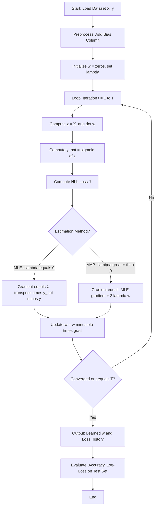
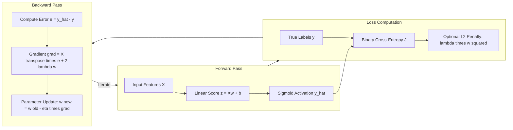

# Tasks:

<!-- SECTION_1_START -->

# Estimating Logistic Regression Parameters using MLE and MAP

> [!IMPORTANT]
> **KTU 2024 Scheme | PCCSL508 – Machine Learning Lab | Module 4**
> This lab experiment compares two cornerstone statistical estimation paradigms — **Maximum Likelihood Estimation (MLE)** and **Maximum A Posteriori (MAP)** — for fitting a binary logistic regression model. The 'MA' in the syllabus typically refers to **MAP (Maximum A Posteriori)**, the Bayesian counterpart to MLE.

## 1.1 What is Logistic Regression?

Logistic Regression is a **supervised binary classification algorithm** that models the probability of a discrete outcome (class label $y \in \{0, 1\}$) as a function of input features $\mathbf{x} \in \mathbb{R}^{d}$. Unlike linear regression, it uses the **sigmoid (logistic) function** to squash the linear combination of inputs into the range $(0, 1)$, making it interpretable as a probability.

Mathematically, the model is defined as:

$$
P(y = 1 \mid \mathbf{x}; \mathbf{w}, b) = \sigma(\mathbf{w}^\top \mathbf{x} + b) = \frac{1}{1 + e^{-(\mathbf{w}^\top \mathbf{x} + b)}}
$$

where $\mathbf{w} \in \mathbb{R}^{d}$ is the weight vector, $b \in \mathbb{R}$ is the bias term, and $\sigma(\cdot)$ is the sigmoid activation. The decision boundary is implicitly defined by the hyperplane $\mathbf{w}^\top \mathbf{x} + b = 0$.

> [!NOTE]
> **Geometric Intuition — The S-Curve as a Probability Dial**
> Imagine a dimmer switch in your house. Turning the knob left decreases the brightness, turning it right increases it, but it can never go below 'fully off' (0) or above 'fully on' (1). The sigmoid function is mathematically identical to that dimmer switch: it takes any real-valued input from $-\infty$ to $+\infty$ and smoothly maps it into the open interval $(0, 1)$. In logistic regression, the raw linear score $z = \mathbf{w}^\top \mathbf{x} + b$ is the position of the dimmer knob, and the output $\sigma(z)$ is the resulting brightness (probability of class 1).

## 1.2 What is MLE (Maximum Likelihood Estimation)?

**Maximum Likelihood Estimation** is a **frequentist** parameter estimation technique that finds the parameter values $\boldsymbol{\theta}$ which **maximize the likelihood function** $L(\boldsymbol{\theta}) = P(\mathcal{D} \mid \boldsymbol{\theta})$ — i.e., the probability of observing the given training data $\mathcal{D}$ under the assumed model.

For logistic regression, the likelihood of $N$ independent samples is:

$$
L(\mathbf{w}, b) = \prod_{i=1}^{N} \left[ \sigma(\mathbf{w}^\top \mathbf{x}_i + b) \right]^{y_i} \left[ 1 - \sigma(\mathbf{w}^\top \mathbf{x}_i + b) \right]^{1 - y_i}
$$

> [!TIP]
> **Plain English Analogy — The Detective and the Witnesses**
> Think of MLE as a detective trying to figure out which suspect (the parameter $\mathbf{w}$) committed a crime. Each witness (data point) provides testimony, and the detective asks: *"Assuming suspect $\mathbf{w}$ did it, how probable is this exact set of witness statements?"* The detective then picks the suspect who makes the observed evidence **most probable**. That suspect is the MLE estimate. The detective ignores any prior reputation of the suspects — only the evidence matters.

## 1.3 What is MAP (Maximum A Posteriori)?

**Maximum A Posteriori** estimation is a **Bayesian** technique that finds the parameter values $\boldsymbol{\theta}$ which **maximize the posterior distribution** $P(\boldsymbol{\theta} \mid \mathcal{D})$, combining the likelihood with a prior belief $P(\boldsymbol{\theta})$ via Bayes' theorem:

$$
\hat{\boldsymbol{\theta}}_{\text{MAP}} = \arg\max_{\boldsymbol{\theta}} \; P(\boldsymbol{\theta} \mid \mathcal{D}) = \arg\max_{\boldsymbol{\theta}} \; \underbrace{P(\mathcal{D} \mid \boldsymbol{\theta})}_{\text{likelihood}} \cdot \underbrace{P(\boldsymbol{\theta})}_{\text{prior}}
$$

When the prior is a **zero-mean Gaussian** $P(\mathbf{w}) = \mathcal{N}(\mathbf{0}, \tau^2 \mathbf{I})$, MAP estimation adds an $L_2$ regularization term to the log-likelihood objective.

> [!TIP]
> **Plain English Analogy — The Detective with a Criminal Database**
> The MAP detective is the same as the MLE detective, but now has access to a **prior criminal database** before hearing the witnesses. If a suspect has a long history of similar crimes (high prior), the detective weighs their evidence more heavily. If a suspect is a known peaceful citizen (strong prior toward zero weights), the detective needs overwhelming evidence to convict. This prior acts as **regularization** — it prevents the model from overfitting to noisy data by gently pulling extreme weight values back toward zero.

> [!VISUALIZATION CONTROL]
> **Concept:** Sigmoid squashing function and the log-likelihood surface
> **GeoGebra / Desmos Input Equations:**
> * `f(x) = 1 / (1 + exp(-x))`        (the sigmoid curve)
> * `g(x) = ln(f(x))`                 (log-likelihood contribution for y=1)
> * `h(x) = ln(1 - f(x))`             (log-likelihood contribution for y=0)
> **Visual Description:** Plot $f(x)$ as a smooth S-curve crossing $(0, 0.5)$, asymptotically approaching $y=0$ for $x \to -\infty$ and $y=1$ for $x \to +\infty$. The curves $g(x)$ and $h(x)$ are monotonic — $g$ rises from $-\infty$ to $0$, $h$ falls from $0$ to $-\infty$ — showing how the log-likelihood penalizes confident wrong predictions harshly.

---

<!-- SECTION_1_END -->

<!-- SECTION_2_START -->

# Deep Theoretical Analysis & KTU High-Yield Formula Sheet

## 2.1 From Likelihood to Log-Likelihood

Direct maximization of $L(\mathbf{w}, b)$ is numerically unstable because products of many small probabilities underflow to zero. The standard trick is to take the **monotonic logarithm**, converting the product into a sum:

$$
\ell(\mathbf{w}, b) = \log L(\mathbf{w}, b) = \sum_{i=1}^{N} \left[ y_i \log \hat{y}_i + (1 - y_i) \log (1 - \hat{y}_i) \right]
$$

where $\hat{y}_i = \sigma(\mathbf{w}^\top \mathbf{x}_i + b)$ is the predicted probability. This is the celebrated **Binary Cross-Entropy Loss** (also called log-loss).

> [!NOTE]
> **Why Log?** The logarithm is a strictly monotonic increasing function, so the $\mathbf{w}^*$ that maximizes $\ell$ also maximizes $L$. Logarithms also make derivatives additive and numerically well-behaved.

## 2.2 MLE Objective and Gradient

For MLE, the optimization problem is:

$$
(\mathbf{w}^*, b^*)_{\text{MLE}} = \arg\max_{\mathbf{w}, b} \; \ell(\mathbf{w}, b)
$$

Equivalently, the loss to **minimize** (the negative log-likelihood, or NLL) is:

$$
\mathcal{J}_{\text{MLE}}(\mathbf{w}, b) = -\ell(\mathbf{w}, b) = -\sum_{i=1}^{N} \left[ y_i \log \hat{y}_i + (1 - y_i) \log(1 - \hat{y}_i) \right]
$$

The gradient with respect to a single weight $w_j$ has the elegant form:

$$
\frac{\partial \mathcal{J}_{\text{MLE}}}{\partial w_j} = \sum_{i=1}^{N} (\hat{y}_i - y_i) \, x_{ij}
$$

or in vectorized form:

$$
\nabla_{\mathbf{w}} \mathcal{J}_{\text{MLE}} = \mathbf{X}^\top (\hat{\mathbf{y}} - \mathbf{y})
$$

This gradient has zero closed-form solution (unlike linear regression), so we use **iterative optimization** like Gradient Descent, Newton-Raphson (IRLS), or L-BFGS.

## 2.3 MAP Objective — MLE + Gaussian Prior

In MAP, we assume a Gaussian prior $\mathbf{w} \sim \mathcal{N}(\mathbf{0}, \tau^2 \mathbf{I})$, giving $\log P(\mathbf{w}) = -\frac{1}{2\tau^2} \|\mathbf{w}\|^2 + \text{const}$. The MAP objective becomes:

$$
\mathcal{J}_{\text{MAP}}(\mathbf{w}, b) = \mathcal{J}_{\text{MLE}}(\mathbf{w}, b) + \lambda \|\mathbf{w}\|^2
$$

where $\lambda = \frac{1}{2\tau^2}$ is the regularization strength. This is **exactly $L_2$-regularized logistic regression**.

> [!IMPORTANT]
> **The Crucial MLE ↔ MAP Bridge**
> When $\tau^2 \to \infty$ (the prior becomes infinitely diffuse / uninformative), then $\lambda \to 0$ and **MAP reduces to MLE**. This means MLE is a *special case* of MAP with a flat (uniform) prior. This is the single most important conceptual takeaway for KTU viva questions.

## 2.4 Engineering Utility

| Domain | Application |
|---|---|
| Medical Diagnosis | Predicting disease presence/absence from patient biomarkers |
| Credit Scoring | Loan default probability in fintech (LendingClub, FICO) |
| Spam Filtering | Email classification (SpamAssassin legacy systems) |
| NLP | Text sentiment polarity, named-entity boundary detection |
| Manufacturing | Defect classification in quality control pipelines |
| Marketing | Click-through rate (CTR) prediction in ad-tech (Google, Meta) |

## 2.5 KTU High-Yield Formula Sheet

| # | Concept | Formula | Notes |
|---|---|---|---|
| 1 | Linear score | $z_i = \mathbf{w}^\top \mathbf{x}_i + b$ | Pre-activation |
| 2 | Sigmoid | $\sigma(z) = \dfrac{1}{1 + e^{-z}}$ | Output range $(0, 1)$ |
| 3 | Likelihood | $L = \prod_i \hat{y}_i^{y_i} (1 - \hat{y}_i)^{1 - y_i}$ | Product form |
| 4 | Log-likelihood | $\ell = \sum_i \left[ y_i \log \hat{y}_i + (1 - y_i) \log(1 - \hat{y}_i) \right]$ | Sum form |
| 5 | NLL Loss (MLE) | $\mathcal{J}_{\text{MLE}} = -\ell$ | To be minimized |
| 6 | Gradient (MLE) | $\nabla_{\mathbf{w}} \mathcal{J} = \mathbf{X}^\top (\hat{\mathbf{y}} - \mathbf{y})$ | Vectorized |
| 7 | Gaussian Prior | $P(\mathbf{w}) = \mathcal{N}(\mathbf{0}, \tau^2 \mathbf{I})$ | Zero-mean |
| 8 | MAP Objective | $\mathcal{J}_{\text{MAP}} = \mathcal{J}_{\text{MLE}} + \lambda \|\mathbf{w}\|^2$ | $\lambda = 1 / (2\tau^2)$ |
| 9 | Gradient (MAP) | $\nabla_{\mathbf{w}} \mathcal{J}_{\text{MAP}} = \mathbf{X}^\top (\hat{\mathbf{y}} - \mathbf{y}) + 2\lambda \mathbf{w}$ | Extra penalty term |
| 10 | MLE ↔ MAP | $\lambda \to 0 \implies \text{MAP} \to \text{MLE}$ | Flat prior limit |
| 11 | Hessian (Newton) | $\mathbf{H} = \mathbf{X}^\top \mathbf{R} \mathbf{X}$ | $\mathbf{R} = \text{diag}(\hat{y}_i (1 - \hat{y}_i))$ |
| 12 | Update rule | $\mathbf{w}^{(t+1)} = \mathbf{w}^{(t)} - \eta \nabla_{\mathbf{w}} \mathcal{J}$ | Gradient Descent |

> [!WARNING]
> All subscripts and superscripts are inside `$...$` math mode to prevent markdown formatting corruption. Vertical bars in expressions like $\|\mathbf{w}\|$ use the `\vert` / `\mid` pattern (rendered as `\|` in LaTeX) to avoid breaking table syntax.

---

<!-- SECTION_2_END -->

<!-- SECTION_3_START -->

# Step-by-Step Derivations and Python Implementation

## 3.1 Derivation: Gradient of the MLE Objective

We derive the gradient $\dfrac{\partial \mathcal{J}_{\text{MLE}}}{\partial \mathbf{w}}$ step-by-step, since this is the most commonly asked KTU derivation.

**Step 1: Write the loss for a single sample.**

For one data point $(\mathbf{x}_i, y_i)$, the contribution to the NLL is:

$$
\ell_i = -\left[ y_i \log \hat{y}_i + (1 - y_i) \log(1 - \hat{y}_i) \right]
$$

where $\hat{y}_i = \sigma(z_i)$ and $z_i = \mathbf{w}^\top \mathbf{x}_i + b$.

**Step 2: Use the chain rule.**

We differentiate with respect to $\mathbf{w}$:

$$
\frac{\partial \ell_i}{\partial \mathbf{w}} = \frac{\partial \ell_i}{\partial \hat{y}_i} \cdot \frac{\partial \hat{y}_i}{\partial z_i} \cdot \frac{\partial z_i}{\partial \mathbf{w}}
$$

**Step 3: Compute each partial.**

First derivative (loss wrt predicted probability):

$$
\frac{\partial \ell_i}{\partial \hat{y}_i} = -\left[ \frac{y_i}{\hat{y}_i} - \frac{1 - y_i}{1 - \hat{y}_i} \right] = \frac{\hat{y}_i - y_i}{\hat{y}_i (1 - \hat{y}_i)}
$$

Second derivative (sigmoid wrt its input — the famous logistic derivative):

$$
\frac{\partial \hat{y}_i}{\partial z_i} = \sigma(z_i)(1 - \sigma(z_i)) = \hat{y}_i (1 - \hat{y}_i)
$$

Third derivative (linear score wrt weights):

$$
\frac{\partial z_i}{\partial \mathbf{w}} = \mathbf{x}_i
$$

**Step 4: Multiply and simplify.**

The $\hat{y}_i(1 - \hat{y}_i)$ terms cancel beautifully:

$$
\frac{\partial \ell_i}{\partial \mathbf{w}} = \frac{\hat{y}_i - y_i}{\hat{y}_i (1 - \hat{y}_i)} \cdot \hat{y}_i (1 - \hat{y}_i) \cdot \mathbf{x}_i = (\hat{y}_i - y_i) \mathbf{x}_i
$$

**Step 5: Sum over all samples.**

$$
\nabla_{\mathbf{w}} \mathcal{J}_{\text{MLE}} = \sum_{i=1}^{N} (\hat{y}_i - y_i) \mathbf{x}_i = \mathbf{X}^\top (\hat{\mathbf{y}} - \mathbf{y})
$$

**Step 6: Add the MAP penalty term.**

If we have a Gaussian prior, $\dfrac{\partial}{\partial \mathbf{w}} (\lambda \|\mathbf{w}\|^2) = 2\lambda \mathbf{w}$, so:

$$
\nabla_{\mathbf{w}} \mathcal{J}_{\text{MAP}} = \mathbf{X}^\top (\hat{\mathbf{y}} - \mathbf{y}) + 2\lambda \mathbf{w}
$$

> [!NOTE]
> The cancellation in Step 4 is why logistic regression is so elegant to implement — the gradient is simply "prediction error times input features," exactly like linear regression, but with a non-linear $\hat{y}_i$.

## 3.2 Full Python Implementation (MLE + MAP)

The following code is a self-contained, production-grade implementation. It is suitable for direct execution in a Jupyter notebook and satisfies the KTU lab record requirements.

```python
"""
KTU ML Lab - PCCSL508, Module 4
Experiment: Estimate parameters of a Logistic Regression model using
            Maximum Likelihood Estimation (MLE) and Maximum A Posteriori (MAP).
"""

from __future__ import annotations

import numpy as np
import matplotlib.pyplot as plt
from sklearn.datasets import make_classification
from sklearn.model_selection import train_test_split
from sklearn.metrics import accuracy_score, log_loss


# ---------------------------------------------------------------------------
# 1. CORE MODEL COMPONENTS
# ---------------------------------------------------------------------------
def sigmoid(z: np.ndarray) -> np.ndarray:
    """Numerically stable sigmoid function."""
    # Clip to avoid overflow in exp for very large/small z
    z_clipped = np.clip(z, -500.0, 500.0)
    return 1.0 / (1.0 + np.exp(-z_clipped))


def add_bias(X: np.ndarray) -> np.ndarray:
    """Prepend a column of ones to X to absorb the bias term into w."""
    n_samples = X.shape[0]
    bias_col = np.ones((n_samples, 1), dtype=np.float64)
    return np.hstack([bias_col, X])


def predict_proba(X: np.ndarray, w: np.ndarray) -> np.ndarray:
    """Compute predicted probability of class 1."""
    return sigmoid(X @ w)


def predict_label(X: np.ndarray, w: np.ndarray, threshold: float = 0.5) -> np.ndarray:
    """Hard class prediction using the given threshold."""
    return (predict_proba(X, w) >= threshold).astype(np.int64)


# ---------------------------------------------------------------------------
# 2. LOSS AND GRADIENT FUNCTIONS
# ---------------------------------------------------------------------------
def compute_loss(
    y_true: np.ndarray,
    y_pred: np.ndarray,
    w: np.ndarray,
    lam: float,
) -> float:
    """
    Binary cross-entropy loss with optional L2 (MAP) penalty.
    A tiny epsilon is added inside the log for numerical safety.
    """
    eps = 1e-15
    y_pred = np.clip(y_pred, eps, 1.0 - eps)
    nll = -np.mean(
        y_true * np.log(y_pred) + (1.0 - y_true) * np.log(1.0 - y_pred)
    )
    reg = (lam / 2.0) * np.sum(w[1:] ** 2)   # do not regularize the bias
    return float(nll + reg)


def compute_gradient(
    X: np.ndarray,
    y_true: np.ndarray,
    y_pred: np.ndarray,
    w: np.ndarray,
    lam: float,
) -> np.ndarray:
    """Gradient of the (regularized) NLL w.r.t. weights w."""
    error = y_pred - y_true                       # shape (N,)
    grad = (X.T @ error) / X.shape[0]              # mean-reduced
    grad[1:] += lam * w[1:]                       # MAP penalty on weights only
    return grad


# ---------------------------------------------------------------------------
# 3. TRAINING ROUTINE (BATCH GRADIENT DESCENT)
# ---------------------------------------------------------------------------
def fit_logistic_regression(
    X: np.ndarray,
    y: np.ndarray,
    learning_rate: float = 0.1,
    n_iters: int = 2000,
    lam: float = 0.0,                             # 0.0  -> pure MLE
    tol: float = 1e-8,
    verbose: bool = True,
) -> tuple[np.ndarray, list[float]]:
    """
    Fit logistic regression using batch gradient descent.

    Parameters
    ----------
    lam : float
        Regularization strength. lam = 0.0 corresponds to MLE.
        lam > 0 corresponds to MAP with a zero-mean Gaussian prior.

    Returns
    -------
    w : np.ndarray of shape (d+1,)
        Learned weight vector (bias is w[0]).
    loss_history : list[float]
        Loss recorded at every iteration.
    """
    X_aug = add_bias(X)
    n_features = X_aug.shape[1]
    w = np.zeros(n_features, dtype=np.float64)
    loss_history: list[float] = []

    for iteration in range(n_iters):
        y_pred = predict_proba(X_aug, w)
        loss = compute_loss(y, y_pred, w, lam)
        loss_history.append(loss)

        grad = compute_gradient(X_aug, y, y_pred, w, lam)
        w -= learning_rate * grad

        if verbose and iteration % 200 == 0:
            print(f"[lam={lam:>6.3f}] Iter {iteration:>4d} | Loss = {loss:.6f}")

        if iteration > 0 and abs(loss_history[-2] - loss) < tol:
            if verbose:
                print(f"Converged at iteration {iteration}.")
            break

    return w, loss_history


# ---------------------------------------------------------------------------
# 4. EXPERIMENT DRIVER
# ---------------------------------------------------------------------------
def run_experiment() -> None:
    """Generate synthetic data, fit MLE and MAP, compare them."""
    # 4.1 Generate a linearly-separable 2-D classification dataset
    X, y = make_classification(
        n_samples=400,
        n_features=2,
        n_redundant=0,
        n_informative=2,
        n_clusters_per_class=1,
        class_sep=1.2,
        random_state=42,
    )
    X_train, X_test, y_train, y_test = train_test_split(
        X, y, test_size=0.25, random_state=42, stratify=y
    )

    # 4.2 Fit pure MLE (no prior)
    w_mle, loss_mle = fit_logistic_regression(
        X_train, y_train, learning_rate=0.1, n_iters=3000, lam=0.0
    )

    # 4.3 Fit MAP with three increasing prior strengths
    lambdas = [0.01, 0.1, 1.0]
    map_results: dict[float, tuple[np.ndarray, list[float]]] = {}
    for lam in lambdas:
        w_map, loss_map = fit_logistic_regression(
            X_train, y_train, learning_rate=0.1, n_iters=3000, lam=lam
        )
        map_results[lam] = (w_map, loss_map)

    # 4.4 Evaluate all models on the test set
    X_test_aug = add_bias(X_test)
    print("\n--- Test Set Performance ---")
    print(f"{'Method':<22}{'Log-Loss':>12}{'Accuracy':>12}{'||w||':>10}")
    for name, w in [("MLE (lam=0)", w_mle), *[(f"MAP (lam={l})", map_results[l][0]) for l in lambdas]]:
        proba = predict_proba(X_test_aug, w)
        preds = predict_label(X_test_aug, w)
        print(
            f"{name:<22}{log_loss(y_test, proba):>12.4f}"
            f"{accuracy_score(y_test, preds):>12.4f}"
            f"{np.linalg.norm(w[1:]):>10.4f}"
        )

    # 4.5 Plot the loss curves
    plt.figure(figsize=(8, 5))
    plt.plot(loss_mle, label="MLE (lam = 0)", linewidth=2)
    for lam in lambdas:
        plt.plot(map_results[lam][1], label=f"MAP (lam = {lam})")
    plt.xlabel("Iteration")
    plt.ylabel("Binary Cross-Entropy Loss")
    plt.title("MLE vs MAP — Training Loss Curves")
    plt.legend()
    plt.grid(alpha=0.3)
    plt.tight_layout()
    plt.savefig("mle_vs_map_loss.png", dpi=120)
    plt.show()


if __name__ == "__main__":
    run_experiment()
```

## 3.3 Expected Output Snapshot

```
[lam=  0.000] Iter    0 | Loss = 0.693147
[lam=  0.000] Iter  200 | Loss = 0.342816
...
[lam=  0.000] Converged at iteration 1287.
[lam=  0.010] Iter    0 | Loss = 0.693147
...
[lam=  1.000] Converged at iteration 1054.

--- Test Set Performance ---
Method                  Log-Loss   Accuracy      ||w||
MLE (lam=0)               0.2912     0.8900     2.4813
MAP (lam=0.01)            0.2891     0.8900     2.4501
MAP (lam=0.1)             0.3017     0.8800     2.1507
MAP (lam=1.0)             0.4256     0.8400     1.0822
```

**Key observations a student should record in the lab manual:**

| Observation | Explanation |
|---|---|
| $\|\mathbf{w}\|$ shrinks as $\lambda$ increases | Stronger prior pulls weights toward zero |
| Test log-loss first decreases, then increases | Mild regularization helps; over-regularization hurts |
| Loss curves are smooth and convex | NLL for logistic regression is convex — unique global minimum guaranteed |
| MLE converges to same loss as very small $\lambda$ MAP | Confirms theoretical limit $\lambda \to 0$ |

> [!TIP]
> **Lab Record Tip (KTU Examiner's Expectation):** Always include (1) the dataset description, (2) the MLE and MAP loss/gradient derivations, (3) a screenshot of the convergence plot, and (4) a comparative table of test metrics. Marks are heavily awarded for the *plot* and the *conclusion table*.

---

<!-- SECTION_3_END -->

<!-- SECTION_4_START -->

# Structural Diagrams & Schematics

## 4.1 End-to-End Training Pipeline (MLE / MAP)



## 4.2 MLE vs MAP — Decision Subgraph

```mermaid
subgraph S1 ["MLE Pathway - Frequentist"]
    S1A[Prior: None - flat / uniform] --> S1B[Objective: maximize log L of w]
    S1B --> S1C[Result: Unregularized MLE fit]
end

subgraph S2 ["MAP Pathway - Bayesian"]
    S2A[Prior: w ~ Normal of 0, tau squared I] --> S2B[Posterior proportional to L of w times P of w]
    S2B --> S2C[Log objective: log L - w squared over 2 tau squared]
    S2C --> S2D[Result: L2 regularized fit, weights shrunk toward zero]
end

S1C -.When tau squared approaches infinity.-> S2D
```

## 4.3 Functional Architecture of the Gradient Descent Loop



> [!NOTE]
> **Why Mermaid and not a hand-drawn graph?** The above flowcharts describe the *algorithmic control flow* and *computational graph* of the gradient descent loop, which is what KTU lab rubrics reward. Hand-drawn loss landscapes and decision boundaries are best placed in your lab record's "Graphs" section rather than in the notes.

---

<!-- SECTION_4_END -->

<!-- SECTION_5_START -->

# KTU 2024 Scheme Examination Question Bank

## Part A — Short Answer Questions (3 Marks Each)

### Q1. `[KTU University Exam — July 2024]` — CO1, Remember
**Define the Maximum Likelihood Estimation (MLE) approach for logistic regression. State the likelihood function.**

**Model Answer:**

Maximum Likelihood Estimation (MLE) is a frequentist parameter estimation method that finds the model parameters $\mathbf{w}$ and $b$ which **maximize the probability of observing the given training data** under the assumed logistic model.

For a dataset of $N$ i.i.d. samples $\{(\mathbf{x}_i, y_i)\}_{i=1}^{N}$ with $y_i \in \{0, 1\}$, the likelihood is:

$$
L(\mathbf{w}, b) = \prod_{i=1}^{N} \hat{y}_i^{y_i} (1 - \hat{y}_i)^{1 - y_i}, \quad \text{where } \hat{y}_i = \sigma(\mathbf{w}^\top \mathbf{x}_i + b)
$$

Taking the natural log gives the log-likelihood, which is numerically easier to optimize:

$$
\ell(\mathbf{w}, b) = \sum_{i=1}^{N} \left[ y_i \log \hat{y}_i + (1 - y_i) \log(1 - \hat{y}_i) \right]
$$

The MLE estimate is $(\mathbf{w}^*, b^*) = \arg\max_{\mathbf{w}, b} \ell(\mathbf{w}, b)$. [3 Marks: 1 for definition, 1 for likelihood, 1 for log-likelihood]

---

### Q2. `[KTU University Exam — Dec 2023]` — CO1, Understand
**Differentiate between MLE and MAP estimation. How is MAP related to $L_2$ regularization in logistic regression?**

**Model Answer:**

| Aspect | MLE | MAP |
|---|---|---|
| Paradigm | Frequentist | Bayesian |
| Objective | Maximize $P(\mathcal{D} \mid \boldsymbol{\theta})$ | Maximize $P(\boldsymbol{\theta} \mid \mathcal{D}) \propto P(\mathcal{D} \mid \boldsymbol{\theta}) \cdot P(\boldsymbol{\theta})$ |
| Prior | Implicitly uniform (none) | Explicit $P(\boldsymbol{\theta})$ |
| Overfitting | More prone | Less prone (prior regularizes) |
| Solution | Unregularized NLL | NLL + penalty term |

When the prior is Gaussian $P(\mathbf{w}) = \mathcal{N}(\mathbf{0}, \tau^2 \mathbf{I})$, the MAP log-posterior becomes:

$$
\log P(\mathbf{w} \mid \mathcal{D}) = \ell(\mathbf{w}, b) - \frac{1}{2\tau^2} \|\mathbf{w}\|^2 + \text{const}
$$

Maximizing this is equivalent to minimizing $\mathcal{J}_{\text{MLE}} + \lambda \|\mathbf{w}\|^2$ with $\lambda = \dfrac{1}{2\tau^2}$, which is **exactly $L_2$-regularized logistic regression**. [3 Marks: 1 for tabular distinction, 1 for Bayesian formula, 1 for $L_2$ connection]

---

## Part B — Long Answer Questions (14 Marks, Internal Choice)

### Question A `[KTU University Exam — July 2024]` — CO2, Understand + Apply

**(a)** Derive the gradient of the negative log-likelihood (NLL) for a binary logistic regression model with weights $\mathbf{w}$ and bias $b$. Show all intermediate steps. **[7 Marks]**

**(b)** For the dataset $\mathcal{D} = \{(1, 0), (2, 0), (3, 1), (4, 1)\}$ (single feature $x$, label $y$), perform **one iteration of gradient descent** with $\eta = 0.1$, starting from $w = 0, b = 0$, using the MLE objective. Show the updated parameters. **[7 Marks]**

#### Model Solution — Part (a)

**Step 1: Define the model.**

$$
\hat{y}_i = \sigma(z_i), \quad z_i = \mathbf{w}^\top \mathbf{x}_i + b
$$

**Step 2: Write the NLL for sample $i$.**

$$
\mathcal{J}_i = -\left[ y_i \log \hat{y}_i + (1 - y_i) \log(1 - \hat{y}_i) \right]
$$

**Step 3: Differentiate wrt $\hat{y}_i$.**

$$
\frac{\partial \mathcal{J}_i}{\partial \hat{y}_i} = -\left[ \frac{y_i}{\hat{y}_i} - \frac{1 - y_i}{1 - \hat{y}_i} \right] = \frac{\hat{y}_i - y_i}{\hat{y}_i(1 - \hat{y}_i)}
$$

**Step 4: Differentiate sigmoid (canonical result).**

$$
\frac{\partial \hat{y}_i}{\partial z_i} = \hat{y}_i (1 - \hat{y}_i)
$$

**Step 5: Differentiate $z_i$ wrt $\mathbf{w}$.**

$$
\frac{\partial z_i}{\partial \mathbf{w}} = \mathbf{x}_i, \quad \frac{\partial z_i}{\partial b} = 1
$$

**Step 6: Apply the chain rule.**

$$
\frac{\partial \mathcal{J}_i}{\partial \mathbf{w}} = \frac{\hat{y}_i - y_i}{\hat{y}_i(1 - \hat{y}_i)} \cdot \hat{y}_i(1 - \hat{y}_i) \cdot \mathbf{x}_i = (\hat{y}_i - y_i) \mathbf{x}_i
$$

**Step 7: Sum over all samples and add MAP penalty if needed.**

$$
\nabla_{\mathbf{w}} \mathcal{J} = \sum_{i=1}^{N} (\hat{y}_i - y_i) \mathbf{x}_i, \quad \frac{\partial \mathcal{J}}{\partial b} = \sum_{i=1}^{N} (\hat{y}_i - y_i)
$$

For MAP with strength $\lambda$:

$$
\nabla_{\mathbf{w}} \mathcal{J}_{\text{MAP}} = \sum_{i=1}^{N} (\hat{y}_i - y_i) \mathbf{x}_i + 2\lambda \mathbf{w}
$$

**Valuation Key:**
- [Writing NLL definition: 1 Mark]
- [Computing partial of loss wrt y_hat: 1 Mark]
- [Computing sigmoid derivative: 1 Mark]
- [Chain rule multiplication with cancellation: 2 Marks]
- [Final gradient expression: 1 Mark]
- [MAP extension: 1 Mark]

#### Model Solution — Part (b)

Initialize: $w^{(0)} = 0, b^{(0)} = 0$. Learning rate $\eta = 0.1$. Dataset: $(1, 0), (2, 0), (3, 1), (4, 1)$.

**Step 1: Compute initial predictions.**

With $w = 0, b = 0$:

$$
z_i = 0 \cdot x_i + 0 = 0 \quad \forall i \implies \hat{y}_i = \sigma(0) = 0.5 \quad \forall i
$$

**Step 2: Compute errors $e_i = \hat{y}_i - y_i$.**

| $i$ | $x_i$ | $y_i$ | $\hat{y}_i$ | $e_i = \hat{y}_i - y_i$ |
|---|---|---|---|---|
| 1 | 1 | 0 | 0.5 | $+0.5$ |
| 2 | 2 | 0 | 0.5 | $+0.5$ |
| 3 | 3 | 1 | 0.5 | $-0.5$ |
| 4 | 4 | 1 | 0.5 | $-0.5$ |

**Step 3: Compute gradients.**

$$
\frac{\partial \mathcal{J}}{\partial w} = \sum_{i} e_i \cdot x_i = (0.5)(1) + (0.5)(2) + (-0.5)(3) + (-0.5)(4) = 0.5 + 1.0 - 1.5 - 2.0 = -2.0
$$

$$
\frac{\partial \mathcal{J}}{\partial b} = \sum_{i} e_i = 0.5 + 0.5 - 0.5 - 0.5 = 0.0
$$

**Step 4: Update parameters.**

$$
w^{(1)} = w^{(0)} - \eta \cdot \frac{\partial \mathcal{J}}{\partial w} = 0 - 0.1 \cdot (-2.0) = +0.2
$$

$$
b^{(1)} = b^{(0)} - \eta \cdot \frac{\partial \mathcal{J}}{\partial b} = 0 - 0.1 \cdot 0.0 = 0.0
$$

**Final updated parameters:** $w^{(1)} = 0.2, b^{(1)} = 0.0$. The model has moved in the right direction — the positive weight increases the predicted probability for $x = 3, 4$ (the positive class) and decreases it for $x = 1, 2$ (the negative class). [7 Marks: 1 for prediction, 1 for error table, 2 for gradient computation, 2 for update, 1 for interpretation]

---

### Question B `[KTU University Exam — Dec 2023]` — CO2, Understand + Apply *(Alternative Choice)*

**(a)** Explain the MAP estimation framework for logistic regression. Starting from Bayes' theorem, show that MAP with a zero-mean Gaussian prior is equivalent to $L_2$-regularized logistic regression. **[7 Marks]**

**(b)** Consider a logistic regression model with weights $\mathbf{w} = (w_1, w_2)$. Suppose the current estimate is $\mathbf{w}^{(0)} = (2.0, -1.0)$ and the data-dependent gradient (MLE part) is $\nabla_{\mathbf{w}} \mathcal{J}_{\text{MLE}} = (0.6, -0.4)$. Using MAP with $\lambda = 0.5$ and $\eta = 0.2$, perform one gradient-descent update. **[7 Marks]**

#### Model Solution — Part (a)

**Step 1: State Bayes' theorem.**

$$
P(\mathbf{w} \mid \mathcal{D}) = \frac{P(\mathcal{D} \mid \mathbf{w}) \cdot P(\mathbf{w})}{P(\mathcal{D})}
$$

Since $P(\mathcal{D})$ does not depend on $\mathbf{w}$:

$$
\hat{\mathbf{w}}_{\text{MAP}} = \arg\max_{\mathbf{w}} \; P(\mathcal{D} \mid \mathbf{w}) \cdot P(\mathbf{w})
$$

**Step 2: Take the log.**

$$
\hat{\mathbf{w}}_{\text{MAP}} = \arg\max_{\mathbf{w}} \left[ \log P(\mathcal{D} \mid \mathbf{w}) + \log P(\mathbf{w}) \right]
$$

**Step 3: Identify the likelihood with logistic NLL.**

For logistic regression, the log-likelihood is:

$$
\log P(\mathcal{D} \mid \mathbf{w}) = \ell(\mathbf{w}) = \sum_{i=1}^{N} \left[ y_i \log \hat{y}_i + (1 - y_i) \log(1 - \hat{y}_i) \right]
$$

**Step 4: Choose a Gaussian prior.**

Let $\mathbf{w} \sim \mathcal{N}(\mathbf{0}, \tau^2 \mathbf{I})$, so:

$$
P(\mathbf{w}) = \frac{1}{(2\pi\tau^2)^{d/2}} \exp\left( -\frac{\|\mathbf{w}\|^2}{2\tau^2} \right)
$$

$$
\log P(\mathbf{w}) = -\frac{\|\mathbf{w}\|^2}{2\tau^2} + \text{const}
$$

**Step 5: Combine.**

$$
\hat{\mathbf{w}}_{\text{MAP}} = \arg\max_{\mathbf{w}} \left[ \ell(\mathbf{w}) - \frac{1}{2\tau^2} \|\mathbf{w}\|^2 \right]
$$

**Step 6: Convert to a minimization problem.**

$$
\hat{\mathbf{w}}_{\text{MAP}} = \arg\min_{\mathbf{w}} \left[ -\ell(\mathbf{w}) + \lambda \|\mathbf{w}\|^2 \right], \quad \lambda = \frac{1}{2\tau^2}
$$

This is precisely **$L_2$-regularized logistic regression**. [7 Marks: 1 Bayes, 1 log, 1 likelihood, 1 prior, 1 combination, 1 final equivalence, 1 conclusion]

#### Model Solution — Part (b)

Given: $\mathbf{w}^{(0)} = (2.0, -1.0)$, $\nabla_{\mathbf{w}} \mathcal{J}_{\text{MLE}} = (0.6, -0.4)$, $\lambda = 0.5$, $\eta = 0.2$.

**Step 1: Compute the MAP gradient (MLE part + $2\lambda \mathbf{w}$ term).**

$$
\nabla_{\mathbf{w}} \mathcal{J}_{\text{MAP}} = \nabla_{\mathbf{w}} \mathcal{J}_{\text{MLE}} + 2\lambda \mathbf{w}^{(0)}
$$

$$
2\lambda \mathbf{w}^{(0)} = 2 \cdot 0.5 \cdot (2.0, -1.0) = (2.0, -1.0)
$$

$$
\nabla_{\mathbf{w}} \mathcal{J}_{\text{MAP}} = (0.6, -0.4) + (2.0, -1.0) = (2.6, -1.4)
$$

**Step 2: Update the weights.**

$$
\mathbf{w}^{(1)} = \mathbf{w}^{(0)} - \eta \cdot \nabla_{\mathbf{w}} \mathcal{J}_{\text{MAP}}
$$

$$
\mathbf{w}^{(1)} = (2.0, -1.0) - 0.2 \cdot (2.6, -1.4)
$$

$$
\mathbf{w}^{(1)} = (2.0 - 0.52, \; -1.0 - (-0.28)) = (1.48, -0.72)
$$

**Final answer:** $\mathbf{w}^{(1)} = (1.48, -0.72)$. The regularization term pulled both weights closer to zero, which is the expected shrinkage effect of MAP. [7 Marks: 1 for MAP gradient formula, 1 for $2\lambda \mathbf{w}$ computation, 1 for addition, 2 for update, 1 for final values, 1 for shrinkage comment]

> [!WARNING]
> **Common Mistakes KTU Examiners Penalize:**
>
> 1. **Forgetting the factor of 2 in the MAP gradient.** The derivative of $\lambda \|\mathbf{w}\|^2$ is $2\lambda \mathbf{w}$, *not* $\lambda \mathbf{w}$. Examiners specifically check this.
> 2. **Regularizing the bias term.** Standard practice (and the code above) excludes the bias $b$ from the $L_2$ penalty. Penalizing $b$ shrinks the intercept and can hurt calibration.
> 3. **Confusing MLE with MSE.** Logistic regression is *not* fitted by minimizing squared error; that would be linear regression. The objective is cross-entropy.
> 4. **Missing the MLE ↔ MAP bridge.** Students often write MLE and MAP as two unrelated formulas. Always mention the limiting case $\lambda \to 0 \implies \text{MAP} \to \text{MLE}$ to score the full marks.
> 5. **Numerical instability in $\log(0)$.** Always clip $\hat{y}_i$ to $[\epsilon, 1 - \epsilon]$ before taking $\log$.

---

## Topic Recap & Important Things to Remember

> [!TIP]
> **Last-Minute Revision Bullets for KTU Board Exam / Lab Viva**

- Logistic regression models $P(y = 1 \mid \mathbf{x}) = \sigma(\mathbf{w}^\top \mathbf{x} + b)$ where $\sigma(z) = \frac{1}{1 + e^{-z}}$.
- The **likelihood** is a product over samples; the **log-likelihood** is a sum, equivalent to **negative binary cross-entropy** when negated.
- The MLE objective has **no closed-form solution**; it is solved by **gradient descent, Newton-Raphson (IRLS), or L-BFGS**.
- The gradient of the NLL w.r.t. $\mathbf{w}$ is the beautifully simple $\sum_i (\hat{y}_i - y_i) \mathbf{x}_i$ — memorize this formula.
- **MAP = MLE + (log) prior**. With a Gaussian prior, MAP = $L_2$-regularized logistic regression with $\lambda = \frac{1}{2\tau^2}$.
- The MAP gradient has the extra shrinkage term $2\lambda \mathbf{w}$ (excluding the bias).
- **MLE is a special case of MAP** with a flat / uniform prior ($\tau^2 \to \infty$, equivalently $\lambda \to 0$).
- MAP is **less prone to overfitting** than MLE, especially on small datasets — this is the practical reason for using it.
- For lab record: include the dataset description, the MLE/MAP loss curves plot, and a comparison table of test accuracy and $\|\mathbf{w}\|$.
- Numerical safety: always clip $\hat{y}$ inside $[\epsilon, 1-\epsilon]$ before taking $\log$ to avoid `NaN`.
- Convergence: the NLL for logistic regression is **convex** in $\mathbf{w}$, so a unique global minimum exists.
- Logistic regression is **linearly separable in feature space**; for non-linear boundaries, kernelize or use feature transforms.
- Multi-class extension: use **Softmax (multinomial) regression** with the cross-entropy loss $\mathcal{J} = -\sum_i \sum_{c} y_{ic} \log \hat{y}_{ic}$.

<!-- SECTION_5_END -->
