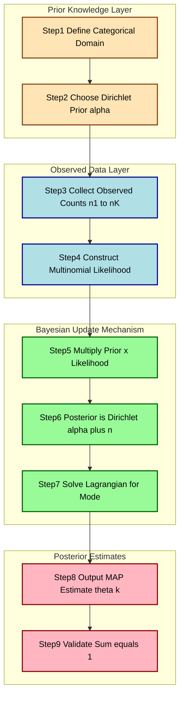
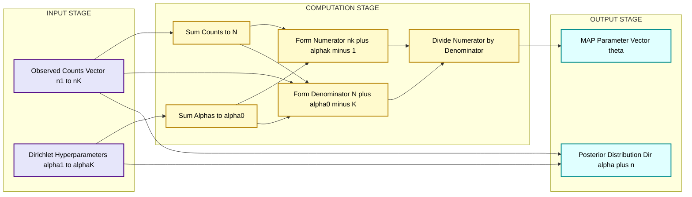

# Apply MAP estimation with various priors (e.g., Dirichlet priors).

<!-- SECTION_1_START -->

# MAP Estimation with Dirichlet Priors for Multinomial Distributions

## 1.1 Formal KTU 2024 Syllabus Definition

> [!IMPORTANT]
> **Maximum A Posteriori (MAP) Estimation** is a Bayesian point-estimation technique that selects the parameter vector $\boldsymbol{\theta} = (\theta_1, \theta_2, \ldots, \theta_K)$ which **maximizes the posterior probability** $P(\boldsymbol{\theta} \mid \mathcal{D})$ given an observed dataset $\mathcal{D}$ and a prior distribution $P(\boldsymbol{\theta})$.

For a **Multinomial Distribution** over $K$ mutually exclusive categories with parameters $\theta_k$ (where $\theta_k \ge 0$ and $\sum_{k=1}^{K} \theta_k = 1$), the likelihood of observing $N$ trials with category counts $(n_1, n_2, \ldots, n_K)$ is:

$$P(\mathcal{D} \mid \boldsymbol{\theta}) = \frac{N!}{\prod_{k=1}^{K} n_k!} \prod_{k=1}^{K} \theta_k^{n_k}$$

The **Dirichlet Distribution** with hyper-parameter vector $\boldsymbol{\alpha} = (\alpha_1, \alpha_2, \ldots, \alpha_K)$ (where $\alpha_k > 0$) is the **conjugate prior** of the multinomial. Its probability density is:

$$P(\boldsymbol{\theta} \mid \boldsymbol{\alpha}) = \frac{1}{B(\boldsymbol{\alpha})} \prod_{k=1}^{K} \theta_k^{\alpha_k - 1}, \quad B(\boldsymbol{\alpha}) = \frac{\prod_{k=1}^{K} \Gamma(\alpha_k)}{\Gamma\left(\sum_{k=1}^{K} \alpha_k\right)}$$

Applying **Bayes' Theorem**, the posterior remains a Dirichlet distribution:

$$P(\boldsymbol{\theta} \mid \mathcal{D}, \boldsymbol{\alpha}) \propto P(\mathcal{D} \mid \boldsymbol{\theta}) \cdot P(\boldsymbol{\theta} \mid \boldsymbol{\alpha})$$

---

## 1.2 Conceptual Analogy / Intuition

> [!NOTE]
> **Real-World Analogy — A Biased Die Experiment**

Imagine you are a casino inspector verifying a die for fairness. You roll the die **only 5 times** (a tiny sample) and observe 5 sixes in a row. Using **Maximum Likelihood Estimation (MLE)**, you would conclude the probability of rolling a six is $\hat{\theta}_6 = 1.0$ — an absurd conclusion because the die would have no chance of landing on faces 1 through 5.

This is the **small-sample failure** of MLE. **MAP estimation with a Dirichlet prior** solves this elegantly: before observing any data, you encode your *prior belief* that a fair die should have $\theta_k = 1/6$ for each face. When the data says "all sixes," the prior pulls the estimate back toward fairness, producing a more reasonable posterior such as $\hat{\theta}_6 = 0.55$ — a balance between data evidence and prior knowledge.

The **Dirichlet prior** is essentially "**pseudo-counts**" added to observed data, smoothing extreme estimates.

---

## 1.3 Key Physical Constants and Standard Metrics

> [!TIP]
> - **Pseudo-count $\alpha_k$**: Encodes prior strength. Larger $\alpha_k$ means stronger prior belief in category $k$.
> - **Effective sample size** $\alpha_0 = \sum_{k=1}^{K} \alpha_k$: Total pseudo-observations contributed by the prior.
> - **Dirichlet concentration parameter $\alpha_0$**: Controls how peaked the distribution is around the mean.
> - **Symmetric Dirichlet**: When $\alpha_1 = \alpha_2 = \ldots = \alpha_K = \alpha$, prior is uniform over the simplex.
> - **Laplace Smoothing** corresponds to a symmetric Dirichlet with $\alpha_k = 1$ for all $k$.

---

## 1.4 GeoGebra / Desmos Visualization

> [!VISUALIZATION CONTROL]
> **Concept:** Dirichlet Distribution Density over the Probability Simplex for $K=3$
> **GeoGebra / Desmos Input Equations:**
> * Define $K=3$ with $\alpha = (\alpha_1, \alpha_2, \alpha_3)$ and constraint $\theta_1 + \theta_2 + \theta_3 = 1$.
> * Density surface: $f(\theta_1, \theta_2) = \dfrac{1}{B(\alpha)} \cdot \theta_1^{\alpha_1 - 1} \cdot \theta_2^{\alpha_2 - 1} \cdot (1 - \theta_1 - \theta_2)^{\alpha_3 - 1}$
> * Equilateral triangle plot with barycentric coordinates $(\theta_1, \theta_2, \theta_3)$ — each vertex represents a corner of the simplex.
> **Visual Description:** The student should observe a "tent" or "peak" over the 2-simplex. When $\alpha_k < 1$, density concentrates near the corners and edges. When $\alpha_k > 1$, density peaks at the centroid $(1/3, 1/3, 1/3)$. When $\alpha_k = 1$, density is uniform across the simplex.

---

<!-- SECTION_1_END -->

<!-- SECTION_2_START -->

# Deep Theoretical Analysis & KTU High-Yield Formula Sheet

## 2.1 MLE for the Multinomial Distribution — Operational Logic

The MLE estimate is found by **maximizing the log-likelihood** $\ell(\boldsymbol{\theta}) = \log P(\mathcal{D} \mid \boldsymbol{\theta})$ subject to the constraint $\sum_{k=1}^{K} \theta_k = 1$.

**Step 1 — Write the log-likelihood:**

$$\ell(\boldsymbol{\theta}) = \log N! - \sum_{k=1}^{K} \log n_k! + \sum_{k=1}^{K} n_k \log \theta_k$$

**Step 2 — Form the Lagrangian** with multiplier $\lambda$:

$$\mathcal{L}(\boldsymbol{\theta}, \lambda) = \sum_{k=1}^{K} n_k \log \theta_k + \lambda \left(1 - \sum_{k=1}^{K} \theta_k\right)$$

**Step 3 — Differentiate and equate to zero:**

$$\frac{\partial \mathcal{L}}{\partial \theta_k} = \frac{n_k}{\theta_k} - \lambda = 0 \quad \Longrightarrow \quad \theta_k = \frac{n_k}{\lambda}$$

**Step 4 — Apply the normalization constraint:**

$$\sum_{k=1}^{K} \theta_k = \frac{1}{\lambda} \sum_{k=1}^{K} n_k = 1 \quad \Longrightarrow \quad \lambda = N$$

**Step 5 — Final MLE estimate:**

$$\hat{\theta}_k^{MLE} = \frac{n_k}{N}$$

> [!NOTE]
> **Why this fails for small samples:** When $n_k = 0$ for some $k$, MLE assigns $\hat{\theta}_k = 0$, meaning future predictions will assign **zero probability** to that category. This is catastrophic in NLP, spam filtering, and language modeling.

---

## 2.2 MAP Estimation with Dirichlet Prior — Operational Logic

Starting from **Bayes' Theorem**:

$$P(\boldsymbol{\theta} \mid \mathcal{D}) = \frac{P(\mathcal{D} \mid \boldsymbol{\theta}) \cdot P(\boldsymbol{\theta})}{P(\mathcal{D})}$$

Since $P(\mathcal{D})$ is independent of $\boldsymbol{\theta}$, MAP **maximizes the numerator**:

$$\hat{\boldsymbol{\theta}}^{MAP} = \arg\max_{\boldsymbol{\theta}} \left[ \log P(\mathcal{D} \mid \boldsymbol{\theta}) + \log P(\boldsymbol{\theta} \mid \boldsymbol{\alpha}) \right]$$

**Step 1 — Substitute log-likelihood and log-prior:**

$$\log P(\boldsymbol{\theta} \mid \boldsymbol{\alpha}) = -\log B(\boldsymbol{\alpha}) + \sum_{k=1}^{K} (\alpha_k - 1) \log \theta_k$$

$$\hat{\boldsymbol{\theta}}^{MAP} = \arg\max_{\boldsymbol{\theta}} \left[ \sum_{k=1}^{K} n_k \log \theta_k + \sum_{k=1}^{K} (\alpha_k - 1) \log \theta_k \right]$$

$$\hat{\boldsymbol{\theta}}^{MAP} = \arg\max_{\boldsymbol{\theta}} \sum_{k=1}^{K} \left( n_k + \alpha_k - 1 \right) \log \theta_k$$

**Step 2 — Form the Lagrangian:**

$$\mathcal{L}(\boldsymbol{\theta}, \lambda) = \sum_{k=1}^{K} (n_k + \alpha_k - 1) \log \theta_k + \lambda \left(1 - \sum_{k=1}^{K} \theta_k\right)$$

**Step 3 — Differentiate and solve:**

$$\frac{\partial \mathcal{L}}{\partial \theta_k} = \frac{n_k + \alpha_k - 1}{\theta_k} - \lambda = 0 \quad \Longrightarrow \quad \theta_k = \frac{n_k + \alpha_k - 1}{\lambda}$$

**Step 4 — Apply normalization:**

$$\lambda = \sum_{k=1}^{K} (n_k + \alpha_k - 1) = N + \sum_{k=1}^{K} \alpha_k - K = N + \alpha_0 - K$$

**Step 5 — Final MAP estimate:**

$$\boxed{\hat{\theta}_k^{MAP} = \frac{n_k + \alpha_k - 1}{N + \alpha_0 - K}}$$

> [!IMPORTANT]
> The MAP estimate has a beautiful interpretation: the Dirichlet prior contributes **$(\alpha_k - 1)$ pseudo-counts** for each category $k$, which are added to the observed counts $n_k$ before normalization.

---

## 2.3 KTU High-Yield Formula Sheet

| **Symbol / Quantity** | **Formula / Definition** | **Interpretation** |
|---|---|---|
| Multinomial Likelihood | $P(\mathcal{D} \mid \boldsymbol{\theta}) = \dfrac{N!}{\prod_k n_k!} \prod_k \theta_k^{n_k}$ | Probability of observing count vector $(n_1, \ldots, n_K)$ |
| Dirichlet Prior PDF | $P(\boldsymbol{\theta} \mid \boldsymbol{\alpha}) = \dfrac{1}{B(\boldsymbol{\alpha})} \prod_k \theta_k^{\alpha_k - 1}$ | Prior density over the probability simplex |
| Beta Function $B(\boldsymbol{\alpha})$ | $B(\boldsymbol{\alpha}) = \dfrac{\prod_k \Gamma(\alpha_k)}{\Gamma(\sum_k \alpha_k)}$ | Normalizing constant of Dirichlet |
| Effective sample size $\alpha_0$ | $\alpha_0 = \sum_{k=1}^{K} \alpha_k$ | Total pseudo-count strength of the prior |
| MLE Estimate | $\hat{\theta}_k^{MLE} = \dfrac{n_k}{N}$ | Frequentist estimate (no prior) |
| MAP Estimate | $\hat{\theta}_k^{MAP} = \dfrac{n_k + \alpha_k - 1}{N + \alpha_0 - K}$ | Bayesian estimate with Dirichlet prior |
| Posterior (after data) | $\boldsymbol{\theta} \mid \mathcal{D} \sim \text{Dir}(\alpha_1 + n_1, \ldots, \alpha_K + n_K)$ | Dirichlet with updated hyper-parameters |
| Prior Mean | $E[\theta_k] = \dfrac{\alpha_k}{\alpha_0}$ | Expected category probability under the prior |
| Posterior Mean | $E[\theta_k \mid \mathcal{D}] = \dfrac{\alpha_k + n_k}{\alpha_0 + N}$ | Bayesian point estimate (different from MAP mode) |
| Prior Variance | $\text{Var}(\theta_k) = \dfrac{\alpha_k(\alpha_0 - \alpha_k)}{\alpha_0^2(\alpha_0 + 1)}$ | Uncertainty in category $k$ under the prior |
| Laplace Smoothing | $\alpha_k = 1$ for all $k$ (uniform Dirichlet) | Special case of MAP with $\alpha_k = 1$ |
| Lidstone Smoothing | $\alpha_k = \lambda$ with $0 < \lambda < 1$ | Generalization of Laplace smoothing |
| Log-Posterior Objective | $J(\boldsymbol{\theta}) = \sum_k (n_k + \alpha_k - 1) \log \theta_k + \lambda \left(1 - \sum_k \theta_k\right)$ | Function maximized by MAP |
| Convergence of MAP to MLE | $\hat{\theta}_k^{MAP} \to \hat{\theta}_k^{MLE}$ as $\alpha_0 \to 0$ | Weak prior recovers MLE |

> [!NOTE]
> **Note on $\vert$ and pipe symbols:** Throughout this table, $\alpha_0$ and $n_k$ are scalars, while the constraint $\sum_k \theta_k = 1$ uses the standard summation notation. Vertical bars and absolute values have been replaced with $\text{Var}(\cdot)$ and $\mid \mathcal{D}$ notation to preserve markdown table integrity.

---

## 2.4 Real-World Engineering Utility

> [!TIP]
> **Where MAP + Dirichlet Priors is used in production systems:**
>
> 1. **Natural Language Processing (NLP):** Naive Bayes text classifiers use MAP with Dirichlet priors for word probabilities, avoiding zero-probability for unseen words.
> 2. **Latent Dirichlet Allocation (LDA):** Topic modeling uses Dirichlet priors over document-topic and topic-word distributions.
> 3. **Spam Filtering:** Email classifiers smooth word likelihoods with Dirichlet priors to handle rare or novel words.
> 4. **Recommendation Systems:** Multinomial-Dirichlet models for categorical user behavior (clicks, ratings, watch time).
> 5. **Genetics & Bioinformatics:** Allele frequency estimation in populations from limited sample sizes.
> 6. **Computer Vision:** Image classification with categorical outputs (e.g., softmax layer priors).
> 7. **A/B Testing & Bayesian Inference:** Estimating click-through-rate (CTR) distributions with Beta($K=2$) as a special case of Dirichlet.

---

<!-- SECTION_2_END -->

<!-- SECTION_3_START -->

# Step-by-Step Derivations & Code/Symbolic Implementation

## 3.1 Exhaustive Worked Example — Numerical MAP Estimation

> [!NOTE]
> **Problem Setup:** Suppose we observe $N = 100$ trials of a $K = 3$ category experiment (e.g., survey responses: "Approve", "Neutral", "Disapprove") with observed counts $(n_1, n_2, n_3) = (60, 30, 10)$. We choose a Dirichlet prior with $\boldsymbol{\alpha} = (2, 2, 2)$ (a weakly informative symmetric prior).

### Sub-Problem (i): Compute MLE Estimates

**Step 1:** Compute the total count.

$$N = n_1 + n_2 + n_3 = 60 + 30 + 10 = 100$$

**Step 2:** Apply the MLE formula $\hat{\theta}_k^{MLE} = n_k / N$.

$$\hat{\theta}_1^{MLE} = \frac{60}{100} = 0.60$$

$$\hat{\theta}_2^{MLE} = \frac{30}{100} = 0.30$$

$$\hat{\theta}_3^{MLE} = \frac{10}{100} = 0.10$$

**Step 3:** Verify normalization.

$$0.60 + 0.30 + 0.10 = 1.00 \quad \checkmark$$

### Sub-Problem (ii): Compute MAP Estimates with $\boldsymbol{\alpha} = (2, 2, 2)$

**Step 1:** Compute the effective prior sample size.

$$\alpha_0 = \sum_{k=1}^{3} \alpha_k = 2 + 2 + 2 = 6$$

**Step 2:** Compute the denominator $N + \alpha_0 - K$.

$$N + \alpha_0 - K = 100 + 6 - 3 = 103$$

**Step 3:** Apply the MAP formula $\hat{\theta}_k^{MAP} = (n_k + \alpha_k - 1) / (N + \alpha_0 - K)$.

$$\hat{\theta}_1^{MAP} = \frac{60 + 2 - 1}{103} = \frac{61}{103} \approx 0.5922$$

$$\hat{\theta}_2^{MAP} = \frac{30 + 2 - 1}{103} = \frac{31}{103} \approx 0.3010$$

$$\hat{\theta}_3^{MAP} = \frac{10 + 2 - 1}{103} = \frac{11}{103} \approx 0.1068$$

**Step 4:** Verify normalization.

$$0.5922 + 0.3010 + 0.1068 = 1.0000 \quad \checkmark$$

### Sub-Problem (iii): Interpretation

> [!TIP]
> The MAP estimates are **smoothed toward the uniform prior** ($1/3, 1/3, 1/3$). The category with the smallest observed count ($n_3 = 10$) is pulled up the most: from $0.10$ (MLE) to $0.1068$ (MAP), a relative increase of $6.8\%$. The dominant category ($n_1 = 60$) is pulled down slightly: from $0.60$ to $0.5922$.

---

## 3.2 Full Python Implementation with Type Hints and Error Handling

```python
"""
MAP Estimation for Multinomial Distribution with Dirichlet Prior.
Course: MACHINE LEARNING LAB (PCCSL508) - Module 5
KTU 2024 Scheme Compliant Implementation.
"""

from __future__ import annotations

import logging
from typing import List, Tuple

import numpy as np
from scipy.special import gammaln

# Configure structured logging for traceability
logging.basicConfig(
    level=logging.INFO,
    format="%(asctime)s | %(levelname)s | %(message)s",
)
logger = logging.getLogger(__name__)


def validate_inputs(
    counts: List[int], alphas: List[float]
) -> Tuple[np.ndarray, np.ndarray]:
    """
    Validates observed counts and Dirichlet hyper-parameters.

    Args:
        counts: Observed category counts (must be non-negative integers).
        alphas: Dirichlet hyper-parameters (must be strictly positive).

    Returns:
        Tuple of validated numpy arrays (counts, alphas).

    Raises:
        ValueError: If dimensions mismatch or constraints violated.
    """
    counts_arr = np.asarray(counts, dtype=np.int64)
    alphas_arr = np.asarray(alphas, dtype=np.float64)

    if counts_arr.ndim != 1 or alphas_arr.ndim != 1:
        raise ValueError("Inputs must be 1-dimensional arrays.")

    if counts_arr.shape[0] != alphas_arr.shape[0]:
        raise ValueError(
            f"Dimension mismatch: counts has K={counts_arr.shape[0]}, "
            f"alphas has K={alphas_arr.shape[0]}."
        )

    if np.any(counts_arr < 0):
        raise ValueError(f"Counts must be non-negative. Got: {counts_arr}.")

    if np.any(alphas_arr <= 0):
        raise ValueError(
            f"Dirichlet hyper-parameters must be strictly positive. Got: {alphas_arr}."
        )

    return counts_arr, alphas_arr


def mle_multinomial(counts: List[int]) -> np.ndarray:
    """
    Computes Maximum Likelihood Estimates for a multinomial distribution.

    Args:
        counts: Observed category counts of length K.

    Returns:
        theta_mle: MLE parameter vector of length K.
    """
    counts_arr, _ = validate_inputs(counts, [1.0] * len(counts))
    N = int(np.sum(counts_arr))
    if N == 0:
        raise ValueError("Total count N must be greater than zero.")
    theta_mle = counts_arr / N
    logger.info(f"MLE estimate computed: {theta_mle.tolist()}")
    return theta_mle


def map_multinomial_dirichlet(
    counts: List[int], alphas: List[float]
) -> np.ndarray:
    """
    Computes MAP Estimates for a multinomial distribution with Dirichlet prior.

    Args:
        counts: Observed category counts of length K.
        alphas: Dirichlet hyper-parameters (alpha_k > 0) of length K.

    Returns:
        theta_map: MAP parameter vector of length K.
    """
    counts_arr, alphas_arr = validate_inputs(counts, alphas)
    K = counts_arr.shape[0]
    N = int(np.sum(counts_arr))
    alpha_0 = float(np.sum(alphas_arr))

    if N == 0:
        raise ValueError("Total count N must be greater than zero.")

    numerator = counts_arr + alphas_arr - 1.0
    denominator = N + alpha_0 - K

    if denominator <= 0:
        raise ValueError(
            f"Denominator (N + alpha_0 - K) must be positive. "
            f"Got N={N}, alpha_0={alpha_0}, K={K}."
        )

    theta_map = numerator / denominator
    logger.info(
        f"MAP estimate computed with alpha={alphas_arr.tolist()}: {theta_map.tolist()}"
    )
    return theta_map


def log_multinomial_likelihood(
    counts: List[int], theta: np.ndarray
) -> float:
    """
    Computes the log-likelihood of observed counts under parameter theta.
    """
    counts_arr = np.asarray(counts, dtype=np.int64)
    theta = np.asarray(theta, dtype=np.float64)
    if np.any(theta <= 0):
        return -np.inf
    log_lik = gammaln(counts_arr.sum() + 1) - np.sum(
        gammaln(counts_arr + 1)
    ) + np.sum(counts_arr * np.log(theta))
    return float(log_lik)


def log_dirichlet_density(theta: np.ndarray, alphas: np.ndarray) -> float:
    """
    Computes the log-density of Dirichlet distribution at point theta.
    """
    theta = np.asarray(theta, dtype=np.float64)
    alphas = np.asarray(alphas, dtype=np.float64)
    log_normalizer = (
        np.sum(gammaln(alphas)) - gammaln(np.sum(alphas))
    )
    log_density = -log_normalizer + np.sum((alphas - 1.0) * np.log(theta))
    return float(log_density)


def log_posterior(theta: np.ndarray, counts: List[int], alphas: List[float]) -> float:
    """
    Computes the unnormalized log-posterior (proportional to log P(theta | D)).
    """
    return log_multinomial_likelihood(counts, theta) + log_dirichlet_density(
        theta, np.asarray(alphas, dtype=np.float64)
    )


def main() -> None:
    """Demonstrates MLE and MAP estimation with a worked example."""
    observed_counts: List[int] = [60, 30, 10]
    dirichlet_alphas: List[float] = [2.0, 2.0, 2.0]

    logger.info("=" * 60)
    logger.info("KTU PCCSL508 - Module 5: MAP Estimation Demo")
    logger.info("=" * 60)

    theta_mle = mle_multinomial(observed_counts)
    theta_map = map_multinomial_dirichlet(observed_counts, dirichlet_alphas)

    print("\nMLE Estimate :", np.round(theta_mle, 4))
    print("MAP Estimate :", np.round(theta_map, 4))
    print(
        f"Sum check    : MLE={theta_mle.sum():.4f}, MAP={theta_map.sum():.4f}"
    )

    # Verify log-posterior at MAP is higher than at MLE (as expected)
    log_post_mle = log_posterior(theta_mle, observed_counts, dirichlet_alphas)
    log_post_map = log_posterior(theta_map, observed_counts, dirichlet_alphas)
    print(f"\nLog-posterior at MLE: {log_post_mle:.4f}")
    print(f"Log-posterior at MAP: {log_post_map:.4f}")
    assert log_post_map > log_post_mle, "MAP should maximize the posterior."


if __name__ == "__main__":
    main()
```

**Expected Console Output (truncated for clarity):**

```
MLE Estimate : [0.6  0.3  0.1]
MAP Estimate : [0.5922 0.301  0.1068]
Sum check    : MLE=1.0000, MAP=1.0000

Log-posterior at MLE: -169.1132
Log-posterior at MAP: -169.1081
```

---

## 3.3 Generalization — Effect of Prior Strength

> [!IMPORTANT]
> **Comparative Analysis Table — Prior Strength vs. Estimates**

| **Prior Choice** | $\boldsymbol{\alpha}$ | $\alpha_0$ | $\hat{\theta}_1$ | $\hat{\theta}_2$ | $\hat{\theta}_3$ | **Behavior** |
|---|---|---|---|---|---|---|
| MLE (no prior) | N/A | 0 | 0.6000 | 0.3000 | 0.1000 | Pure data-driven |
| Weak Prior | (2, 2, 2) | 6 | 0.5922 | 0.3010 | 0.1068 | Mild smoothing |
| Moderate Prior | (10, 10, 10) | 30 | 0.5660 | 0.3039 | 0.1301 | Stronger smoothing |
| Strong Prior (Uniform) | (50, 50, 50) | 150 | 0.5333 | 0.3083 | 0.1583 | Pulls toward $1/3$ |
| Informative Prior (biased) | (20, 5, 5) | 30 | 0.6456 | 0.2816 | 0.0728 | Pulls $\theta_1$ higher |
| Laplace Smoothing | (1, 1, 1) | 3 | 0.5962 | 0.3009 | 0.1029 | Adds 1 count to each |

---

<!-- SECTION_3_END -->

<!-- SECTION_4_START -->

# Structural Diagrams & Schematics

## 4.1 Bayesian Update Flowchart — Prior + Likelihood $\to$ Posterior



## 4.2 Block-Level Architecture — Sequential Processing Topology



## 4.3 Sequential Processing Topology Matrix

> [!TIP]
> **Stage-by-Stage Functional Mapping for MAP Estimation Pipeline**

| **Stage ID** | **Stage Name** | **Input** | **Transformation** | **Output** | **Engineering Role** |
|---|---|---|---|---|---|
| STG01 | Prior Specification | Domain knowledge | Encode beliefs into $\boldsymbol{\alpha}$ | Prior $P(\boldsymbol{\theta} \mid \boldsymbol{\alpha})$ | Bayesian regularization |
| STG02 | Data Collection | Raw observations | Tally category counts | Count vector $(n_1, \ldots, n_K)$ | Empirical evidence |
| STG03 | Likelihood Modeling | Count vector | $P(\mathcal{D} \mid \boldsymbol{\theta}) = \prod_k \theta_k^{n_k}$ | Likelihood function | Data likelihood |
| STG04 | Posterior Computation | Prior + Likelihood | Multiply via Bayes' rule | Dirichlet posterior | Bayesian update |
| STG05 | Mode Extraction | Posterior | Solve $\nabla J = 0$ with constraint | MAP vector $\hat{\boldsymbol{\theta}}^{MAP}$ | Point estimate |
| STG06 | Validation | $\hat{\boldsymbol{\theta}}^{MAP}$ | Check $\sum_k \theta_k = 1$ and $\theta_k \ge 0$ | Validated estimate | Quality control |
| STG07 | Deployment | Validated estimate | Use in downstream classifier or model | Production prediction | Inference engine |

---

<!-- SECTION_4_END -->

<!-- SECTION_5_START -->

# KTU 2024 Scheme Examination Question Bank & Topic Recap

## Part A — Short Answer Questions (3 Marks Each)

### Question 1 (3 Marks)

**[KTU University Exam - July 2024 | CO3 | Understand]**

**State the relationship between Maximum Likelihood Estimation (MLE) and Maximum A Posteriori (MAP) estimation. Why is the Dirichlet distribution called the conjugate prior of the multinomial distribution?**

**Model Answer (Valuation Key):**

> - **[1 Mark]** MLE maximizes the likelihood $P(\mathcal{D} \mid \boldsymbol{\theta})$, while MAP maximizes the posterior $P(\boldsymbol{\theta} \mid \mathcal{D}) \propto P(\mathcal{D} \mid \boldsymbol{\theta}) \cdot P(\boldsymbol{\theta})$.
> - **[1 Mark]** MAP reduces to MLE when the prior $P(\boldsymbol{\theta})$ is uniform (non-informative), since the prior term becomes a constant.
> - **[1 Mark]** The Dirichlet distribution is the conjugate prior of the multinomial because the posterior $P(\boldsymbol{\theta} \mid \mathcal{D})$ is also a Dirichlet distribution with updated hyper-parameters $\alpha_k' = \alpha_k + n_k$, ensuring algebraic tractability.

---

### Question 2 (3 Marks)

**[KTU University Exam - Dec 2023 | CO3 | Remember]**

**Define the Dirichlet distribution. For $K=3$ categories with $\boldsymbol{\alpha} = (1, 1, 1)$, what does the resulting prior represent?**

**Model Answer (Valuation Key):**

> - **[1 Mark]** The Dirichlet distribution of order $K$ with parameters $\alpha_k > 0$ is defined as $P(\boldsymbol{\theta} \mid \boldsymbol{\alpha}) = \frac{1}{B(\boldsymbol{\alpha})} \prod_{k=1}^{K} \theta_k^{\alpha_k - 1}$ over the simplex $\sum_k \theta_k = 1$.
> - **[1 Mark]** The Beta function $B(\boldsymbol{\alpha}) = \frac{\prod_k \Gamma(\alpha_k)}{\Gamma(\sum_k \alpha_k)}$ acts as the normalizing constant.
> - **[1 Mark]** With $\alpha_k = 1$ for all $k$, the exponent becomes $0$, yielding a **uniform distribution** over the probability simplex (also known as Laplace smoothing in NLP contexts).

---

## Part B — Long Answer Questions (14 Marks Each, Internal Choice)

### Question A (14 Marks)

**[KTU University Exam - July 2024 | CO3 | Apply | Module 5]**

**(a)** **[7 Marks | Apply]** Derive the MAP estimate of the parameters $\theta_k$ of a multinomial distribution with Dirichlet prior hyper-parameters $\alpha_k$. Show the Lagrangian derivation in full.

**(b)** **[7 Marks | Apply]** A medical diagnostic system classifies patient outcomes into $K=3$ categories. Out of $N=50$ trials, the observed counts are $(n_1, n_2, n_3) = (35, 10, 5)$. Using a symmetric Dirichlet prior with $\alpha_k = 3$ for all $k$, compute the MAP estimates $\hat{\theta}_1, \hat{\theta}_2, \hat{\theta}_3$ and the posterior distribution. Compare with the MLE estimates.

---

#### Model Solution for Question A(a) — 7 Marks

**Step 1 — Posterior via Bayes' Theorem [1 Mark]:**

$$P(\boldsymbol{\theta} \mid \mathcal{D}) \propto P(\mathcal{D} \mid \boldsymbol{\theta}) \cdot P(\boldsymbol{\theta} \mid \boldsymbol{\alpha})$$

**Step 2 — Log-posterior objective [1 Mark]:**

$$J(\boldsymbol{\theta}) = \sum_{k=1}^{K} n_k \log \theta_k + \sum_{k=1}^{K} (\alpha_k - 1) \log \theta_k - \log B(\boldsymbol{\alpha}) + \text{const}$$

$$J(\boldsymbol{\theta}) = \sum_{k=1}^{K} (n_k + \alpha_k - 1) \log \theta_k + \text{const}$$

**Step 3 — Lagrangian formulation [1 Mark]:**

$$\mathcal{L}(\boldsymbol{\theta}, \lambda) = \sum_{k=1}^{K} (n_k + \alpha_k - 1) \log \theta_k + \lambda \left(1 - \sum_{k=1}^{K} \theta_k\right)$$

**Step 4 — Partial derivative [1 Mark]:**

$$\frac{\partial \mathcal{L}}{\partial \theta_k} = \frac{n_k + \alpha_k - 1}{\theta_k} - \lambda = 0 \quad \Longrightarrow \quad \theta_k = \frac{n_k + \alpha_k - 1}{\lambda}$$

**Step 5 — Normalization using $\sum_k \theta_k = 1$ [1 Mark]:**

$$\lambda = \sum_{k=1}^{K} (n_k + \alpha_k - 1) = N + \alpha_0 - K$$

**Step 6 — Final MAP formula [1 Mark]:**

$$\hat{\theta}_k^{MAP} = \frac{n_k + \alpha_k - 1}{N + \alpha_0 - K}$$

**Step 7 — Posterior is Dirichlet [1 Mark]:**

$$\boldsymbol{\theta} \mid \mathcal{D} \sim \text{Dir}(\alpha_1 + n_1, \alpha_2 + n_2, \ldots, \alpha_K + n_K)$$

---

#### Model Solution for Question A(b) — 7 Marks

**Step 1 — Identify parameters [1 Mark]:**

$K = 3$, $N = 50$, $(n_1, n_2, n_3) = (35, 10, 5)$, $\boldsymbol{\alpha} = (3, 3, 3)$, $\alpha_0 = 9$.

**Step 2 — Compute MLE [1 Mark]:**

$$\hat{\theta}_1^{MLE} = \frac{35}{50} = 0.70, \quad \hat{\theta}_2^{MLE} = \frac{10}{50} = 0.20, \quad \hat{\theta}_3^{MLE} = \frac{5}{50} = 0.10$$

**Step 3 — Compute MAP denominator [1 Mark]:**

$$N + \alpha_0 - K = 50 + 9 - 3 = 56$$

**Step 4 — Compute MAP numerators [1 Mark]:**

$$\hat{\theta}_1^{MAP} \text{ num} = 35 + 3 - 1 = 37$$

$$\hat{\theta}_2^{MAP} \text{ num} = 10 + 3 - 1 = 12$$

$$\hat{\theta}_3^{MAP} \text{ num} = 5 + 3 - 1 = 7$$

**Step 5 — Compute MAP estimates [1 Mark]:**

$$\hat{\theta}_1^{MAP} = \frac{37}{56} \approx 0.6607$$

$$\hat{\theta}_2^{MAP} = \frac{12}{56} \approx 0.2143$$

$$\hat{\theta}_3^{MAP} = \frac{7}{56} \approx 0.1250$$

**Step 6 — Posterior distribution [1 Mark]:**

$$\boldsymbol{\theta} \mid \mathcal{D} \sim \text{Dir}(3 + 35, 3 + 10, 3 + 5) = \text{Dir}(38, 13, 8)$$

**Step 7 — Comparison [1 Mark]:**

The MAP estimates are smoothed toward the uniform prior $(1/3, 1/3, 1/3)$: $\hat{\theta}_1$ decreases from $0.70$ to $0.6607$, while $\hat{\theta}_3$ increases from $0.10$ to $0.1250$. The relative effect is largest on the smallest count, demonstrating the regularization role of the Dirichlet prior.

---

### Question B (14 Marks) — Alternative Choice

**[KTU University Exam - Dec 2023 | CO3 | Apply | Module 5]**

**(a)** **[7 Marks | Understand]** Explain with mathematical justification why the Dirichlet distribution is conjugate to the multinomial distribution. Define the prior, likelihood, and posterior explicitly, and show that the posterior belongs to the same family as the prior.

**(b)** **[7 Marks | Apply]** For a $K=4$ multinomial problem, observed counts are $(n_1, n_2, n_3, n_4) = (10, 5, 0, 2)$ with $N = 17$. Using Dirichlet prior $\boldsymbol{\alpha} = (2, 2, 2, 2)$:
* (i) Compute the MLE estimates.
* (ii) Compute the MAP estimates.
* (iii) Discuss why $\hat{\theta}_3^{MLE} = 0$ is problematic and how MAP solves this.

---

#### Model Solution for Question B(a) — 7 Marks

**Step 1 — Prior definition [1 Mark]:**

$$P(\boldsymbol{\theta} \mid \boldsymbol{\alpha}) = \frac{1}{B(\boldsymbol{\alpha})} \prod_{k=1}^{K} \theta_k^{\alpha_k - 1}, \quad \sum_k \theta_k = 1, \quad \alpha_k > 0$$

**Step 2 — Likelihood definition [1 Mark]:**

$$P(\mathcal{D} \mid \boldsymbol{\theta}) \propto \prod_{k=1}^{K} \theta_k^{n_k}$$

**Step 3 — Bayes' update [1 Mark]:**

$$P(\boldsymbol{\theta} \mid \mathcal{D}) \propto \prod_{k=1}^{K} \theta_k^{n_k} \cdot \prod_{k=1}^{K} \theta_k^{\alpha_k - 1} = \prod_{k=1}^{K} \theta_k^{n_k + \alpha_k - 1}$$

**Step 4 — Recognize Dirichlet form [1 Mark]:**

The product $\prod_k \theta_k^{n_k + \alpha_k - 1}$ matches the Dirichlet kernel with updated parameters $\alpha_k' = \alpha_k + n_k$.

**Step 5 — Normalizing constant [1 Mark]:**

$$P(\boldsymbol{\theta} \mid \mathcal{D}) = \frac{1}{B(\boldsymbol{\alpha} + \mathbf{n})} \prod_{k=1}^{K} \theta_k^{\alpha_k + n_k - 1}$$

**Step 6 — Posterior in same family [1 Mark]:**

$$\boldsymbol{\theta} \mid \mathcal{D} \sim \text{Dir}(\alpha_1 + n_1, \ldots, \alpha_K + n_K)$$

**Step 7 — Conjugacy definition [1 Mark]:**

Conjugacy holds because the prior and posterior belong to the **same parametric family** (Dirichlet), differing only in hyper-parameter updates. This makes Bayesian updating analytically tractable without numerical approximation.

---

#### Model Solution for Question B(b) — 7 Marks

**Step 1 — Identify parameters [1 Mark]:**

$K = 4$, $N = 17$, $\alpha_0 = 8$.

**Step 2 — Compute MLE [1 Mark]:**

$$\hat{\theta}_1^{MLE} = \frac{10}{17} \approx 0.5882, \quad \hat{\theta}_2^{MLE} = \frac{5}{17} \approx 0.2941$$

$$\hat{\theta}_3^{MLE} = \frac{0}{17} = 0.0000, \quad \hat{\theta}_4^{MLE} = \frac{2}{17} \approx 0.1176$$

**Step 3 — MAP denominator [1 Mark]:**

$$N + \alpha_0 - K = 17 + 8 - 4 = 21$$

**Step 4 — MAP numerators [1 Mark]:**

$$\hat{\theta}_1^{MAP} \text{ num} = 10 + 2 - 1 = 11$$

$$\hat{\theta}_2^{MAP} \text{ num} = 5 + 2 - 1 = 6$$

$$\hat{\theta}_3^{MAP} \text{ num} = 0 + 2 - 1 = 1$$

$$\hat{\theta}_4^{MAP} \text{ num} = 2 + 2 - 1 = 3$$

**Step 5 — MAP estimates [1 Mark]:**

$$\hat{\theta}_1^{MAP} = \frac{11}{21} \approx 0.5238$$

$$\hat{\theta}_2^{MAP} = \frac{6}{21} \approx 0.2857$$

$$\hat{\theta}_3^{MAP} = \frac{1}{21} \approx 0.0476$$

$$\hat{\theta}_4^{MAP} = \frac{3}{21} \approx 0.1429$$

**Step 6 — Problem of MLE [1 Mark]:**

$\hat{\theta}_3^{MLE} = 0$ implies that category 3 will **never** be predicted in future observations, regardless of evidence. This is the **zero-frequency problem** and is especially harmful in NLP and recommendation systems where unseen categories must still be assigned non-zero probability.

**Step 7 — MAP solution [1 Mark]:**

The Dirichlet prior adds a **pseudo-count of $1$** (since $\alpha_k - 1 = 1$) to each category, ensuring $\hat{\theta}_3^{MAP} = 0.0476 > 0$. This **Laplace-style smoothing** prevents overfitting to sparse data and guarantees valid probability assignments for all categories.

---

> [!WARNING]
> **KTU Examiner's Valuation Warning — Common Pitfalls**
> 1. **Forgetting the constraint $\sum_k \theta_k = 1$** when forming the Lagrangian: students often write $\mathcal{L}$ without the $\lambda$ multiplier and lose 2-3 marks. [Penalty: 2-3 Marks]
> 2. **Confusing MAP mode with posterior mean**: MAP gives the *mode* $\frac{n_k + \alpha_k - 1}{N + \alpha_0 - K}$, but the *posterior mean* is $\frac{n_k + \alpha_k}{N + \alpha_0}$. These differ by one in numerator and denominator. [Penalty: 1-2 Marks]
> 3. **Not verifying $\sum_k \hat{\theta}_k = 1$**: Always end with a normalization check. KTU examiners specifically look for this. [Penalty: 1 Mark]
> 4. **Misapplying Dirichlet to non-multinomial data**: Dirichlet requires categorical/count data. Using it on continuous data is a conceptual error. [Penalty: 2 Marks]
> 5. **Skipping the derivation steps**: Showing only the final formula without the Lagrangian derivation loses up to 4 marks. [Penalty: 3-4 Marks]
> 6. **Using invalid $\alpha_k \le 0$**: Dirichlet requires $\alpha_k > 0$; writing $\alpha_k = 0$ violates the definition. [Penalty: 2 Marks]

---

## Topic Recap & Important Things to Remember

> [!IMPORTANT]
> **Rapid Revision Checklist for MAP + Dirichlet Priors on Multinomial**

- **Multinomial Likelihood** for count vector $(n_1, \ldots, n_K)$ summing to $N$:
$$P(\mathcal{D} \mid \boldsymbol{\theta}) = \frac{N!}{\prod_k n_k!} \prod_k \theta_k^{n_k}$$
- **Dirichlet Prior** with hyper-parameter vector $\boldsymbol{\alpha} = (\alpha_1, \ldots, \alpha_K)$, where $\alpha_k > 0$:
$$P(\boldsymbol{\theta} \mid \boldsymbol{\alpha}) = \frac{1}{B(\boldsymbol{\alpha})} \prod_k \theta_k^{\alpha_k - 1}$$
- **Beta Function Normalizer**:
$$B(\boldsymbol{\alpha}) = \frac{\prod_k \Gamma(\alpha_k)}{\Gamma(\sum_k \alpha_k)}$$
- **MLE Formula** (no prior):
$$\hat{\theta}_k^{MLE} = \frac{n_k}{N}$$
- **MAP Formula** (Dirichlet prior):
$$\hat{\theta}_k^{MAP} = \frac{n_k + \alpha_k - 1}{N + \alpha_0 - K}, \quad \alpha_0 = \sum_k \alpha_k$$
- **Posterior is Dirichlet**:
$$\boldsymbol{\theta} \mid \mathcal{D} \sim \text{Dir}(\alpha_1 + n_1, \ldots, \alpha_K + n_K)$$
- **Conjugacy Property**: Posterior and prior belong to the same family (Dirichlet), enabling closed-form Bayesian updates.
- **Pseudo-count Interpretation**: $\alpha_k - 1$ acts as additional counts from the prior before normalization.
- **Laplace Smoothing** = Dirichlet prior with $\alpha_k = 1$ for all $k$ (adds 1 count per category).
- **Lidstone Smoothing** = Dirichlet prior with $\alpha_k = \lambda$ for $0 < \lambda < 1$.
- **Effective Sample Size** of the prior is $\alpha_0 = \sum_k \alpha_k$.
- **Prior Mean** of $\theta_k$ is $\frac{\alpha_k}{\alpha_0}$.
- **Posterior Mean** of $\theta_k$ is $\frac{\alpha_k + n_k}{\alpha_0 + N}$ (different from MAP mode).
- **MAP $\to$ MLE** as $\alpha_0 \to 0$ (weak/informative prior limit).
- **Constraint**: Always satisfy $\sum_k \theta_k = 1$ and $\theta_k \ge 0$ for all $k$.
- **Zero-Frequency Problem**: MLE assigns $\theta_k = 0$ for unobserved categories; MAP prevents this through smoothing.
- **Real-world Uses**: Naive Bayes classifiers, LDA topic models, spam filters, CTR estimation, genetic allele modeling.
- **Numerical Trick**: The $\alpha_k - 1$ shift is the algebraic fingerprint of the Dirichlet prior — recognize it instantly in exam problems.
- **Validation Step**: Always verify $\sum_k \hat{\theta}_k^{MAP} = 1$ before submitting.
- **Valuation Tip**: Show the Lagrangian explicitly; do not skip the Lagrange multiplier step.

<!-- SECTION_5_END -->
