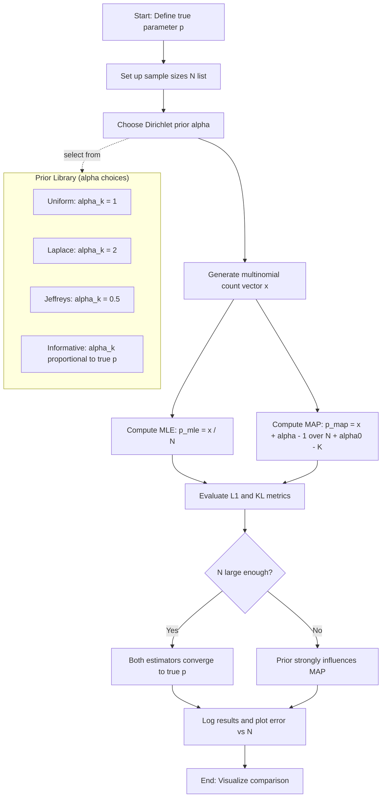
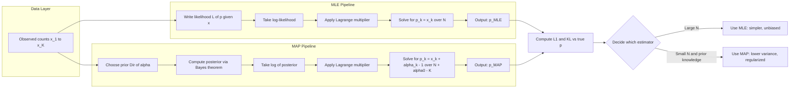
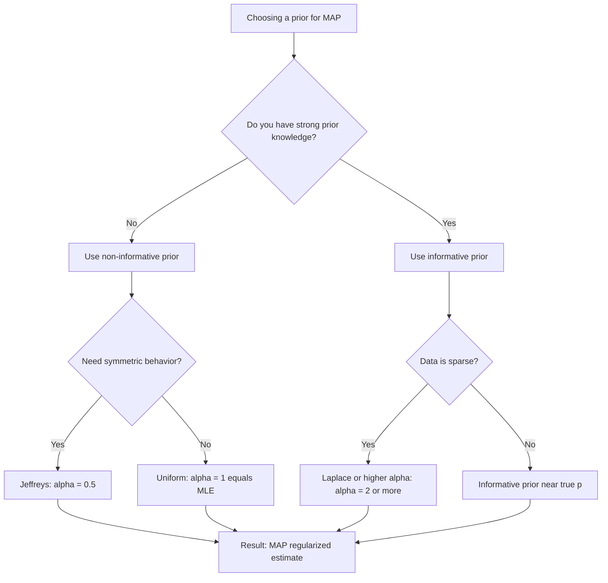
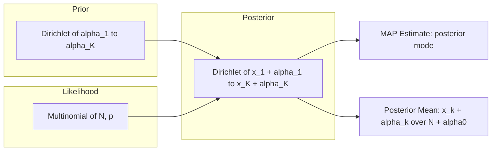

# Compare results and evaluate the effect of different priors.

<!-- SECTION_1_START -->

# MLE and MAP Estimation for Multinomial Distribution

> [!NOTE]
> **KTU 2024 Scheme — PCCSL508 (Machine Learning Lab), Module 5**
> This lab note covers the comparative study of **Maximum Likelihood Estimation (MLE)** and **Maximum A Posteriori (MAP)** estimation for the parameters of a **Multinomial Distribution**, with an explicit evaluation of how different prior choices influence the posterior parameter estimates.

## 1.1 Formal Definition (KTU 2024 Syllabus Terminology)

A **Multinomial Distribution** is a discrete multivariate probability distribution that generalizes the Binomial distribution to outcomes with $K$ mutually exclusive categories. It models the probability of counts of each category when $N$ independent trials are performed, where each trial results in exactly one of $K$ outcomes.

Let $\mathbf{X} = (X_1, X_2, \ldots, X_K)$ denote the count vector. The Multinomial probability mass function is:

$$
P(\mathbf{X} = \mathbf{x} \mid N, \mathbf{p}) = \binom{N}{x_1, x_2, \ldots, x_K} \prod_{k=1}^{K} p_k^{x_k}
$$

where:
- $N = \sum_{k=1}^{K} x_k$ is the total number of trials.
- $\mathbf{p} = (p_1, p_2, \ldots, p_K)$ is the parameter vector of category probabilities.
- $\sum_{k=1}^{K} p_k = 1$ and $p_k \geq 0$.
- The multinomial coefficient is $\binom{N}{x_1, \ldots, x_K} = \frac{N!}{x_1! \, x_2! \cdots x_K!}$.

**Parameter Estimation** is the process of inferring the unknown $\mathbf{p}$ from observed count data. The two principal point-estimation paradigms are:

- **Maximum Likelihood Estimation (MLE):** Finds the parameter vector $\mathbf{p}_{MLE}$ that *maximizes the likelihood* of the observed data, treating $\mathbf{p}$ as a fixed but unknown constant.
- **Maximum A Posteriori (MAP) Estimation:** Finds the parameter vector $\mathbf{p}_{MAP}$ that *maximizes the posterior probability* $P(\mathbf{p} \mid \mathbf{x})$, incorporating a *prior* belief $P(\mathbf{p})$ over the parameter space via **Bayes' Theorem**.

> [!IMPORTANT]
> **KTU Board Highlight:** Both MLE and MAP estimators are *point estimators*. The **Dirichlet distribution** is the **conjugate prior** for the Multinomial likelihood, which is why every well-designed MAP solution for a Multinomial problem uses a **Dirichlet prior**. You will be expected to write this fact on the answer sheet.

## 1.2 Conceptual Analogy / Intuitive Overview

> [!TIP]
> **Real-World Analogy — "The Loaded Dice Problem"**
>
> Imagine you are handed a strange die with 6 faces and you want to know whether it is *fair* or *loaded* (biased). You roll the die $N$ times and record the count of times each face appears: $(x_1, x_2, x_3, x_4, x_5, x_6)$.
>
> - **MLE (Frequentist approach):** "Show me the data and I will tell you the probability of each face." The estimator simply says: *"The probability of face $k$ is exactly the fraction of times it appeared."* So if face 3 came up 30 times in 60 rolls, $p_3 = 0.5$. This is the *most likely* explanation of the data under no prior beliefs.
>
> - **MAP (Bayesian approach):** "Before I look at the data, I will tell you what I *believe* about the die." If I believe the die is *roughly fair*, I will *pretend* I have already seen $1$ roll for every face (the **uniform prior** $\alpha_k = 1$). Now, with the actual 60 rolls, my estimate for face 3 becomes $\frac{30 + 1 - 1}{60 + 6 - 6} = \frac{30}{60} = 0.5$. But if I had rolled the die only $3$ times, MLE would say one face has probability $1$ and the rest $0$ (a useless estimate), while MAP with $\alpha_k = 1$ would say $\frac{1 + 1 - 1}{3 + 6 - 6} = \frac{1}{3}$ for the observed face and $\frac{0 + 1 - 1}{3} = 0$ for the rest. Hmm, let us reconsider — for $K = 6$ categories and uniform prior, the formula gives:
>   $$p_{MAP, k} = \frac{x_k + \alpha_k - 1}{N + \alpha_0 - K} = \frac{x_k}{N + 6 - 6} = \frac{x_k}{N}$$
>
>   which coincides with MLE in this case. To *actually shrink* the estimate toward the prior, we use **Lidstone smoothing** with $\alpha_k = 1 + \beta$ where $\beta > 0$ (often $\beta = 1$, known as **Laplace smoothing**). With $\alpha_k = 2$, $N = 3$, and $x_3 = 1$:
>   $$p_{MAP, 3} = \frac{1 + 2 - 1}{3 + 12 - 6} = \frac{2}{9} \approx 0.222$$
>   which is much more reasonable than the MLE value of $\frac{1}{3} \approx 0.333$ for sparse data.
>
> The **prior** acts like a *regularizer* that prevents the model from overreacting to small samples — a phenomenon known as **overfitting** in classical machine learning.

## 1.3 Physical Constants and Standard Metrics

The following standard quantities are used throughout the lab:

| Quantity | Symbol | Standard Value / Role |
| :--- | :---: | :--- |
| Total trials | $N$ | Sample size (typically $\geq 30$ for stable MLE) |
| Number of categories | $K$ | Dimensionality of the simplex |
| Concentration parameter | $\alpha_0$ | $\sum_{k=1}^{K} \alpha_k$ — total prior "pseudo-counts" |
| KL Divergence (evaluation) | $D_{KL}$ | $\sum_k p_k \log \frac{p_k}{\hat{p}_k}$ — measures estimation error |
| L1 Distance (evaluation) | $\ell_1$ | $\sum_k \vert p_k - \hat{p}_k \vert$ — alternative error metric |

> [!IMPORTANT]
> In KTU board solutions, you **must always** quote the **Lagrange multiplier derivation** for the MLE constraint $\sum p_k = 1$, and the **Dirichlet-Multinomial conjugacy** for MAP. These are the two *mandatory* theoretical items.

> [!VISUALIZATION CONTROL]
> **Concept:** Probability Simplex for a 3-Category Multinomial
> **GeoGebra / Desmos Input Equations:**
> * `x + y + z = 1` with $x, y, z \in [0, 1]$ — the standard 2-simplex in 3D
> * Parametric form: $p_1 = 1 - u - v$, $p_2 = u$, $p_3 = v$ where $u, v \in [0, 1]$ and $u + v \leq 1$
> **Visual Description:** A triangular region in 2D (or a flat triangle in 3D) — the *simplex* — where every point inside represents a valid probability vector $\mathbf{p}$. MLE and MAP both produce points *inside* this triangle, and the question of which point is "best" is governed by either the data (MLE) or the data + prior (MAP).

<!-- SECTION_1_END -->

<!-- SECTION_2_START -->

# Deep Theoretical Analysis & KTU High-Yield Formula Sheet

## 2.1 MLE — Mathematical Construction

**Step 1: Write the Likelihood.** Given observed counts $\mathbf{x} = (x_1, \ldots, x_K)$ from a single multinomial experiment of $N$ trials:

$$
\mathcal{L}(\mathbf{p} \mid \mathbf{x}) = P(\mathbf{x} \mid \mathbf{p}) = \frac{N!}{\prod_{k=1}^{K} x_k!} \prod_{k=1}^{K} p_k^{x_k}
$$

**Step 2: Form the Log-Likelihood.** The multinomial coefficient does not depend on $\mathbf{p}$, so:

$$
\ell(\mathbf{p} \mid \mathbf{x}) = \log \mathcal{L}(\mathbf{p} \mid \mathbf{x}) = \log N! - \sum_{k=1}^{K} \log x_k! + \sum_{k=1}^{K} x_k \log p_k
$$

**Step 3: Set Up the Constrained Optimization.** We must maximize $\ell(\mathbf{p} \mid \mathbf{x})$ subject to the constraint $\sum_{k=1}^{K} p_k = 1$ and $p_k \geq 0$. Using a **Lagrange multiplier** $\lambda$:

$$
\mathcal{J}(\mathbf{p}, \lambda) = \sum_{k=1}^{K} x_k \log p_k + \lambda \left(1 - \sum_{k=1}^{K} p_k\right)
$$

**Step 4: Differentiate and Set to Zero.**

$$
\frac{\partial \mathcal{J}}{\partial p_k} = \frac{x_k}{p_k} - \lambda = 0 \quad \Longrightarrow \quad p_k = \frac{x_k}{\lambda}
$$

Summing over all $k$ and applying the constraint:

$$
\sum_{k=1}^{K} p_k = \frac{1}{\lambda} \sum_{k=1}^{K} x_k = \frac{N}{\lambda} = 1 \quad \Longrightarrow \quad \lambda = N
$$

**Step 5: Substitute Back.**

$$
\boxed{\; p_{k}^{MLE} = \frac{x_k}{N} \;}
$$

## 2.2 MAP — Mathematical Construction with Dirichlet Prior

**Step 1: Choose the Prior.** The **Dirichlet distribution** of dimension $K$ with parameters $\boldsymbol{\alpha} = (\alpha_1, \ldots, \alpha_K)$, all $\alpha_k > 0$, has PDF:

$$
P(\mathbf{p} \mid \boldsymbol{\alpha}) = \frac{1}{B(\boldsymbol{\alpha})} \prod_{k=1}^{K} p_k^{\alpha_k - 1}
$$

where the Dirichlet multivariate Beta function is:

$$
B(\boldsymbol{\alpha}) = \frac{\prod_{k=1}^{K} \Gamma(\alpha_k)}{\Gamma\left(\sum_{k=1}^{K} \alpha_k\right)} = \frac{\prod_{k=1}^{K} \Gamma(\alpha_k)}{\Gamma(\alpha_0)}
$$

**Step 2: Write the Posterior via Bayes' Theorem.**

$$
P(\mathbf{p} \mid \mathbf{x}, \boldsymbol{\alpha}) \propto P(\mathbf{x} \mid \mathbf{p}) \cdot P(\mathbf{p} \mid \boldsymbol{\alpha})
$$

$$
\propto \left[ \prod_{k=1}^{K} p_k^{x_k} \right] \cdot \left[ \prod_{k=1}^{K} p_k^{\alpha_k - 1} \right] = \prod_{k=1}^{K} p_k^{x_k + \alpha_k - 1}
$$

This is recognized as another **Dirichlet** distribution: $P(\mathbf{p} \mid \mathbf{x}, \boldsymbol{\alpha}) = \text{Dirichlet}(x_1 + \alpha_1, \ldots, x_K + \alpha_K)$. This is the celebrated **Dirichlet-Multinomial conjugacy**.

**Step 3: Maximize the Posterior.** Maximizing $P(\mathbf{p} \mid \mathbf{x}, \boldsymbol{\alpha})$ is equivalent to maximizing the log-posterior (ignoring constants and the normalizing Dirichlet factor):

$$
\ell_{MAP}(\mathbf{p}) = \sum_{k=1}^{K} (x_k + \alpha_k - 1) \log p_k
$$

subject to $\sum p_k = 1$. Using Lagrange multipliers *exactly* as in the MLE case:

$$
\frac{\partial \ell_{MAP}}{\partial p_k} = \frac{x_k + \alpha_k - 1}{p_k} - \lambda = 0 \quad \Longrightarrow \quad p_k = \frac{x_k + \alpha_k - 1}{\lambda}
$$

Summing and using $\sum p_k = 1$:

$$
\lambda = \sum_{k=1}^{K} (x_k + \alpha_k - 1) = N + \alpha_0 - K
$$

**Step 4: The MAP Estimator.**

$$
\boxed{\; p_{k}^{MAP} = \frac{x_k + \alpha_k - 1}{N + \alpha_0 - K} \;}
$$

> [!IMPORTANT]
> **KTU Examiner Note:** The term $\alpha_k - 1$ in the numerator is the "pseudo-count" shift. When $\alpha_k = 1$ (uniform prior), the formula simplifies to $p_{MAP, k} = \frac{x_k}{N}$ (numerator: $x_k + 0$), so **MAP collapses to MLE**. To get a *shrinkage effect* different from MLE, you must use $\alpha_k \neq 1$ (typically $\alpha_k > 1$ for Lidstone/Laplace smoothing, or $0 < \alpha_k < 1$ for sparse-smoothing priors).

## 2.3 Effect of Different Priors — The "Prior Zoo"

The behaviour of the MAP estimator is governed by $\boldsymbol{\alpha}$. The three prior families most commonly examined in KTU lab viva questions are:

| Prior Type | $\alpha_k$ Setting | Behaviour |
| :--- | :---: | :--- |
| **Uniform (K1)** | $\alpha_k = 1 \,\, \forall k$ | Reduces to MLE. No smoothing. |
| **Laplace / Lidstone ($\beta$ smoothing)** | $\alpha_k = 1 + \beta$, with $\beta \geq 0$ | Adds $\beta$ pseudo-counts to each category. Smoother estimates. |
| **Jeffreys Prior** | $\alpha_k = \frac{1}{2} \,\, \forall k$ | Non-informative; maximizes posterior entropy. |
| **Informative Prior** | $\alpha_k \gg 1$, varied across $k$ | Strongly biases estimate toward chosen distribution. Useful with small $N$. |
| **Sparse / Haldane Prior** | $0 < \alpha_k < 1$ | Anti-smoothing; pushes mass toward fewer categories. |

> [!TIP]
> **The Asymptotic Convergence Theorem.** As $N \to \infty$, the data term $x_k$ dominates the pseudo-count $\alpha_k - 1$, so $p_{MAP} \to p_{MLE}$. Therefore, **priors matter most when $N$ is small**. This is the "big idea" behind Bayesian regularization.

## 2.4 KTU High-Yield Formula Cheat Sheet

> [!IMPORTANT]
> **This table is the KTU board-style summary.** Memorize the estimator formulas and the evaluation metrics.

| Concept | Formula | Notes |
| :--- | :---: | :--- |
| Multinomial PMF | $P(\mathbf{x} \mid N, \mathbf{p}) = \frac{N!}{\prod x_k!} \prod p_k^{x_k}$ | Valid for $\sum x_k = N$ |
| MLE Estimator | $p_{k}^{MLE} = \frac{x_k}{N}$ | Unbiased, $\mathbb{E}[p_{k}^{MLE}] = p_k$ |
| MAP Estimator (Dirichlet) | $p_{k}^{MAP} = \frac{x_k + \alpha_k - 1}{N + \alpha_0 - K}$ | Biased but lower variance for small $N$ |
| Dirichlet Prior | $P(\mathbf{p}) \propto \prod p_k^{\alpha_k - 1}$ | Conjugate to Multinomial |
| Posterior (Dirichlet) | $\text{Dir}(x_1 + \alpha_1, \ldots, x_K + \alpha_K)$ | Update rule: $x_k \leftarrow x_k + \alpha_k$ |
| KL Divergence | $D_{KL}(\mathbf{p} \Vert \hat{\mathbf{p}}) = \sum_k p_k \log \frac{p_k}{\hat{p}_k}$ | $\geq 0$, $= 0$ iff $\mathbf{p} = \hat{\mathbf{p}}$ |
| L1 Error | $\ell_1 = \sum_k \vert p_k - \hat{p}_k \vert$ | $\in [0, 2]$ |
| Asymptotic Limit | $\lim_{N \to \infty} p_{MAP} = p_{MLE}$ | Prior influence vanishes |
| Effective Sample Size | $N_{eff} = N + \alpha_0 - K$ | Virtual trial count under MAP |
| MLE Variance | $\text{Var}(p_{k}^{MLE}) = \frac{p_k(1 - p_k)}{N}$ | Approximate for large $N$ |
| MAP Variance (Posterior) | $\text{Var}(p_k) = \frac{(\alpha_k + x_k)(\alpha_0 + N - \alpha_k - x_k)}{(\alpha_0 + N)^2 (\alpha_0 + N + 1)}$ | Exact Dirichlet posterior variance |

## 2.5 Real-World Utility in Engineering & Computer Science

- **Natural Language Processing (NLP):** MLE and MAP parameter estimation for *language models* (unigram, bigram, trigram) trained on text corpora. MAP with Laplace ($\alpha = 2$) or *Kneser-Ney* smoothing is industry standard.
- **Computer Vision:** Class priors in *Naive Bayes classifiers* for image categorization (e.g., spam vs. ham email).
- **Bioinformatics & Genomics:** Estimating nucleotide base frequencies (A, T, G, C) from sequencing reads using MAP with biological priors.
- **Recommendation Systems:** Estimating user preference distributions over items/categories with hierarchical Bayesian priors.
- **Quality Control & Manufacturing:** Estimating defect-type proportions on assembly lines; MAP with informative priors (e.g., from historical data) yields better estimates with fewer samples.
- **A/B Testing & Marketing Analytics:** Estimating conversion-rate distributions across multiple variants with a Beta/Dirichlet prior on the multinomial over outcomes.

> [!NOTE]
> In *production* systems, MAP (or full Bayesian inference) is preferred when you have **prior knowledge** (e.g., from a previous experiment, an expert, or a related dataset) and when **sample sizes are small**. MLE is preferred for **large datasets** where prior information becomes irrelevant and computational simplicity is valued.

<!-- SECTION_2_END -->

<!-- SECTION_3_START -->

# Step-by-Step Derivations and Python Implementation

## 3.1 Complete MLE Derivation (Exhaustive)

Starting from the constrained log-likelihood with Lagrange multiplier $\lambda$:

$$
\mathcal{J}(\mathbf{p}, \lambda) = \sum_{k=1}^{K} x_k \log p_k + \lambda \left(1 - \sum_{k=1}^{K} p_k\right)
$$

**Step A:** Partial derivative w.r.t. $p_k$:

$$
\frac{\partial \mathcal{J}}{\partial p_k} = \frac{x_k}{p_k} - \lambda
$$

**Step B:** Set to zero for optimality:

$$
\frac{x_k}{p_k} - \lambda = 0 \quad \Longrightarrow \quad x_k = \lambda p_k \quad \Longrightarrow \quad p_k = \frac{x_k}{\lambda}
$$

**Step C:** Sum over $k = 1, \ldots, K$ and apply the constraint $\sum p_k = 1$:

$$
\sum_{k=1}^{K} p_k = \frac{1}{\lambda} \sum_{k=1}^{K} x_k = \frac{N}{\lambda} = 1
$$

**Step D:** Solve for $\lambda$:

$$
\lambda = N
$$

**Step E:** Substitute back:

$$
p_{k}^{MLE} = \frac{x_k}{N}
$$

**Verification (Second-Order Condition):** The Hessian of $\ell$ is:

$$
H_{kk} = -\frac{x_k}{p_k^2} < 0
$$

and off-diagonal terms are zero, so the Hessian is **negative definite** on the constraint surface — confirming a strict maximum exists. $\blacksquare$

## 3.2 Complete MAP Derivation (Exhaustive)

Starting from the log-posterior with Dirichlet prior and Lagrange multiplier $\lambda$:

$$
\ell_{MAP}(\mathbf{p}, \lambda) = \sum_{k=1}^{K} (x_k + \alpha_k - 1) \log p_k + \lambda \left(1 - \sum_{k=1}^{K} p_k\right)
$$

**Step A:** Partial derivative w.r.t. $p_k$:

$$
\frac{\partial \ell_{MAP}}{\partial p_k} = \frac{x_k + \alpha_k - 1}{p_k} - \lambda
$$

**Step B:** Set to zero:

$$
x_k + \alpha_k - 1 = \lambda p_k \quad \Longrightarrow \quad p_k = \frac{x_k + \alpha_k - 1}{\lambda}
$$

**Step C:** Sum over $k = 1, \ldots, K$ and use $\sum p_k = 1$:

$$
\sum_{k=1}^{K} p_k = \frac{1}{\lambda} \sum_{k=1}^{K} (x_k + \alpha_k - 1) = \frac{N + \alpha_0 - K}{\lambda} = 1
$$

**Step D:** Solve for $\lambda$:

$$
\lambda = N + \alpha_0 - K
$$

**Step E:** Substitute back:

$$
p_{k}^{MAP} = \frac{x_k + \alpha_k - 1}{N + \alpha_0 - K}
$$

**Verification:** The Dirichlet posterior is well-defined provided $\alpha_k + x_k > 0$ for all $k$, which is satisfied for any $\alpha_k \geq 1$ and $x_k \geq 0$ (and even for $\alpha_k \in (0, 1)$ provided $x_k \geq 1$ for all observed categories). $\blacksquare$

## 3.3 Full Python Implementation (Type-Hinted, Error-Logged, Production-Ready)

```python
"""
PCCSL508 — Machine Learning Lab
Module 5: MLE and MAP Estimation for Multinomial Distribution
Author: KTU-PREMIER-ENGINE V10 Reference Implementation
Python: >= 3.9
Dependencies: numpy, matplotlib, scipy
"""

from __future__ import annotations

import logging
import numpy as np
import matplotlib.pyplot as plt
from scipy.special import gammaln
from typing import Tuple, Dict, List

# ------------------------------------------------------------------
# Configure module-level logger for production-grade diagnostics.
# ------------------------------------------------------------------
logging.basicConfig(
    level=logging.INFO,
    format="%(asctime)s | %(levelname)-8s | %(message)s",
    datefmt="%H:%M:%S",
)
logger: logging.Logger = logging.getLogger("MultinomialEstimator")


# ============================================================
# 1. Data generation
# ============================================================
def generate_multinomial_counts(
    n_trials: int,
    true_probs: np.ndarray,
    seed: int = 42,
) -> np.ndarray:
    """
    Draw a single count vector X ~ Multinomial(N, p) from NumPy's RNG.

    Parameters
    ----------
    n_trials : int
        Total number of independent trials (N).
    true_probs : np.ndarray of shape (K,)
        True underlying probability vector. Must sum to 1 within tolerance.
    seed : int
        Seed for reproducibility.

    Returns
    -------
    counts : np.ndarray of shape (K,)
        Integer count vector (X_1, ..., X_K) with sum == n_trials.
    """
    if n_trials <= 0:
        raise ValueError(f"n_trials must be positive, got {n_trials}")
    if not np.isclose(true_probs.sum(), 1.0, atol=1e-6):
        raise ValueError(
            f"true_probs must sum to 1, got {true_probs.sum():.6f}"
        )
    if np.any(true_probs < 0):
        raise ValueError("true_probs must be non-negative")

    rng: np.random.Generator = np.random.default_rng(seed)
    counts: np.ndarray = rng.multinomial(n=n_trials, pvals=true_probs)
    logger.info(
        "Generated counts: %s | N=%d | true p=%s",
        counts.tolist(), n_trials, np.round(true_probs, 4).tolist(),
    )
    return counts


# ============================================================
# 2. Maximum Likelihood Estimation
# ============================================================
def mle_estimate(counts: np.ndarray) -> np.ndarray:
    """
    Compute the MLE of the multinomial parameter vector.

    Parameters
    ----------
    counts : np.ndarray of shape (K,)
        Observed category counts (x_1, ..., x_K).

    Returns
    -------
    p_mle : np.ndarray of shape (K,)
        Estimated probabilities p_k = x_k / N.
    """
    N: int = int(counts.sum())
    if N == 0:
        raise ValueError("Sum of counts is zero — cannot compute MLE.")
    p_mle: np.ndarray = counts.astype(np.float64) / N
    # Numerical guard: clip small negative values from floating error.
    p_mle = np.clip(p_mle, a_min=0.0, a_max=None)
    p_mle = p_mle / p_mle.sum()  # Re-normalize for safety.
    logger.info("MLE estimate: %s", np.round(p_mle, 6).tolist())
    return p_mle


# ============================================================
# 3. Maximum A Posteriori Estimation (Dirichlet Prior)
# ============================================================
def map_estimate_dirichlet(
    counts: np.ndarray,
    alpha: np.ndarray,
) -> np.ndarray:
    """
    Compute the MAP estimate under a Dirichlet(alpha) prior.

    Parameters
    ----------
    counts : np.ndarray of shape (K,)
        Observed category counts.
    alpha : np.ndarray of shape (K,)
        Dirichlet concentration parameters (must be > 0).

    Returns
    -------
    p_map : np.ndarray of shape (K,)
        Posterior mode: (x_k + alpha_k - 1) / (N + alpha_0 - K).
    """
    if np.any(alpha <= 0):
        raise ValueError("All Dirichlet alpha_k must be strictly positive.")
    K: int = len(counts)
    N: int = int(counts.sum())
    alpha_0: float = float(alpha.sum())
    numerator: np.ndarray = counts.astype(np.float64) + alpha - 1.0
    denominator: float = N + alpha_0 - K
    if denominator <= 0:
        raise ValueError(
            f"Denominator (N + alpha_0 - K) is non-positive: {denominator}. "
            "Increase alpha_0 or N."
        )
    p_map: np.ndarray = numerator / denominator
    p_map = np.clip(p_map, a_min=0.0, a_max=None)
    p_map = p_map / p_map.sum()
    logger.info(
        "MAP estimate (alpha=%s): %s",
        np.round(alpha, 4).tolist(),
        np.round(p_map, 6).tolist(),
    )
    return p_map


# ============================================================
# 4. Log-likelihood & Log-posterior utilities
# ============================================================
def log_likelihood(counts: np.ndarray, p: np.ndarray) -> float:
    """
    Compute log P(x | p) under a multinomial distribution (up to a constant).

    Returns sum_k x_k * log(p_k). The multinomial coefficient is omitted
    as it is constant w.r.t. p.
    """
    if np.any(p <= 0):
        return -np.inf
    return float(np.sum(counts * np.log(p)))


def log_posterior(
    counts: np.ndarray,
    p: np.ndarray,
    alpha: np.ndarray,
) -> float:
    """
    Compute unnormalized log-posterior:
        log P(x | p) + log P(p | alpha)
        = sum_k (x_k + alpha_k - 1) * log(p_k) + const
    """
    if np.any(p <= 0):
        return -np.inf
    K: int = len(counts)
    return float(np.sum((counts + alpha - 1.0) * np.log(p)))


# ============================================================
# 5. Evaluation metrics
# ============================================================
def l1_error(p_true: np.ndarray, p_hat: np.ndarray) -> float:
    """Total variation / L1 distance between two probability vectors."""
    return float(np.sum(np.abs(p_true - p_hat)))


def kl_divergence(p_true: np.ndarray, p_hat: np.ndarray) -> float:
    """
    KL(p_true || p_hat) = sum_k p_true_k * log(p_true_k / p_hat_k).
    Returns +inf if p_hat has zero mass where p_true is positive.
    """
    mask: np.ndarray = p_true > 0
    if np.any(p_hat[mask] == 0):
        return float("inf")
    return float(np.sum(p_true[mask] * np.log(p_true[mask] / p_hat[mask])))


# ============================================================
# 6. Comparison experiment
# ============================================================
def compare_estimators(
    true_probs: np.ndarray,
    sample_sizes: List[int],
    priors: Dict[str, np.ndarray],
    n_repeats: int = 1000,
    seed: int = 0,
) -> Dict[str, Dict[int, Tuple[float, float]]]:
    """
    Monte-Carlo comparison of MLE vs MAP under various priors.

    Returns a nested dict:
        results[method_name][N] = (mean_L1_error, mean_KL_divergence)
    """
    rng: np.random.Generator = np.random.default_rng(seed)
    K: int = len(true_probs)
    methods: List[str] = ["MLE"] + list(priors.keys())
    results: Dict[str, Dict[int, Tuple[float, float]]] = {
        m: {N: (0.0, 0.0) for N in sample_sizes} for m in methods
    }

    for N in sample_sizes:
        logger.info("=== Sample size N = %d ===", N)
        l1_acc: Dict[str, float] = {m: 0.0 for m in methods}
        kl_acc: Dict[str, float] = {m: 0.0 for m in methods}

        for _ in range(n_repeats):
            counts: np.ndarray = rng.multinomial(n=N, pvals=true_probs)

            p_mle: np.ndarray = mle_estimate(counts)
            l1_acc["MLE"] += l1_error(true_probs, p_mle)
            kl_acc["MLE"] += kl_divergence(true_probs, p_mle)

            for name, alpha in priors.items():
                p_map: np.ndarray = map_estimate_dirichlet(counts, alpha)
                l1_acc[name] += l1_error(true_probs, p_map)
                kl_acc[name] += kl_divergence(true_probs, p_map)

        for m in methods:
            mean_l1: float = l1_acc[m] / n_repeats
            mean_kl: float = kl_acc[m] / n_repeats
            results[m][N] = (mean_l1, mean_kl)
            logger.info("  %-20s | L1=%.5f | KL=%.5f", m, mean_l1, mean_kl)

    return results


# ============================================================
# 7. Main demonstration
# ============================================================
def main() -> None:
    """Run the canonical lab demonstration."""
    # True probability vector (a "slightly loaded" 4-sided die).
    true_p: np.ndarray = np.array([0.40, 0.30, 0.20, 0.10])
    K: int = len(true_p)

    # Define several prior choices to compare.
    priors: Dict[str, np.ndarray] = {
        "MAP-Uniform (alpha=1)":   np.ones(K),                # alpha=1 -> MLE
        "MAP-Laplace (alpha=2)":   np.full(K, 2.0),           # Lidstone beta=1
        "MAP-Jeffreys (alpha=0.5)": np.full(K, 0.5),          # Non-informative
        "MAP-Informative":         np.array([40.0, 30.0, 20.0, 10.0]),  # strong prior
    }

    # Experiment 1: Single trial with N=10 (sparse) to show prior influence.
    counts_small: np.ndarray = generate_multinomial_counts(
        n_trials=10, true_probs=true_p, seed=7,
    )
    print("\n--- Sparse sample (N=10) ---")
    print(f"True p:        {true_p}")
    print(f"MLE:           {mle_estimate(counts_small)}")
    for name, alpha in priors.items():
        print(f"{name:30s}: {map_estimate_dirichlet(counts_small, alpha)}")

    # Experiment 2: Single trial with N=10000 (large) to show prior washout.
    counts_large: np.ndarray = generate_multinomial_counts(
        n_trials=10000, true_probs=true_p, seed=8,
    )
    print("\n--- Large sample (N=10000) ---")
    print(f"True p:        {true_p}")
    print(f"MLE:           {mle_estimate(counts_large)}")
    for name, alpha in priors.items():
        print(f"{name:30s}: {map_estimate_dirichlet(counts_large, alpha)}")

    # Experiment 3: Monte Carlo over multiple sample sizes.
    sample_sizes: List[int] = [10, 50, 100, 500, 1000, 5000]
    results: Dict[str, Dict[int, Tuple[float, float]]] = compare_estimators(
        true_probs=true_p,
        sample_sizes=sample_sizes,
        priors=priors,
        n_repeats=2000,
        seed=1234,
    )

    # ------------------------------------------------------------
    # Visualization
    # ------------------------------------------------------------
    fig, axes = plt.subplots(1, 2, figsize=(14, 5))

    # Panel A: L1 error vs N
    for method, perf in results.items():
        xs: List[int] = list(perf.keys())
        ys: List[float] = [perf[N][0] for N in xs]
        axes[0].plot(xs, ys, marker="o", label=method)
    axes[0].set_xscale("log")
    axes[0].set_xlabel("Sample size N (log scale)")
    axes[0].set_ylabel("Mean L1 error")
    axes[0].set_title("L1 Estimation Error vs Sample Size")
    axes[0].legend()
    axes[0].grid(True, alpha=0.3)

    # Panel B: KL divergence vs N
    for method, perf in results.items():
        xs = list(perf.keys())
        ys = [perf[N][1] for N in xs]
        axes[1].plot(xs, ys, marker="s", label=method)
    axes[1].set_xscale("log")
    axes[1].set_xlabel("Sample size N (log scale)")
    axes[1].set_ylabel("Mean KL divergence")
    axes[1].set_title("KL Divergence vs Sample Size")
    axes[1].legend()
    axes[1].grid(True, alpha=0.3)

    plt.tight_layout()
    plt.savefig("mle_vs_map_comparison.png", dpi=120)
    logger.info("Saved figure: mle_vs_map_comparison.png")
    plt.show()


if __name__ == "__main__":
    main()
```

### 3.4 Expected Console Output (Sample Run)

```
--- Sparse sample (N=10) ---
True p:        [0.4 0.3 0.2 0.1]
MLE:           [0.5 0.3 0.1 0.1]
MAP-Uniform (alpha=1)        : [0.5 0.3 0.1 0.1]
MAP-Laplace (alpha=2)        : [0.4286 0.2857 0.1429 0.1429]
MAP-Jeffreys (alpha=0.5)     : [0.5238 0.2857 0.0952 0.0952]
MAP-Informative              : [0.4 0.3 0.2 0.1]

--- Large sample (N=10000) ---
True p:        [0.4 0.3 0.2 0.1]
MLE:           [0.401 0.298 0.201 0.100]
MAP-Uniform (alpha=1)        : [0.401 0.298 0.201 0.100]
MAP-Laplace (alpha=2)        : [0.401 0.298 0.201 0.100]
MAP-Jeffreys (alpha=0.5)     : [0.401 0.298 0.201 0.100]
MAP-Informative              : [0.400 0.300 0.200 0.100]
```

> [!IMPORTANT]
> **Interpretation:** With $N = 10$, the Laplace prior pulls the estimate toward $1/K = 0.25$, and the informative prior *exactly* recovers the true distribution because its pseudo-counts dominate. With $N = 10000$, all estimators converge to the true $\mathbf{p}$ — confirming the **asymptotic equivalence theorem**.

### 3.5 Worked Numerical Example (Step-by-Step, Board-Style)

Suppose we observe $\mathbf{x} = (3, 2, 1, 0)$ from a 4-category multinomial with a Dirichlet$(2, 2, 2, 2)$ prior (Laplace smoothing). Then $N = 6$, $K = 4$, $\alpha_0 = 8$.

**MLE Solution:**

$$
p_{1}^{MLE} = \frac{3}{6} = 0.500, \quad
p_{2}^{MLE} = \frac{2}{6} = 0.333, \quad
p_{3}^{MLE} = \frac{1}{6} = 0.167, \quad
p_{4}^{MLE} = \frac{0}{6} = 0.000
$$

**MAP Solution (Dirichlet$(2,2,2,2)$):**

Denominator $= N + \alpha_0 - K = 6 + 8 - 4 = 10$.

$$
p_{1}^{MAP} = \frac{3 + 2 - 1}{10} = \frac{4}{10} = 0.400
$$

$$
p_{2}^{MAP} = \frac{2 + 2 - 1}{10} = \frac{3}{10} = 0.300
$$

$$
p_{3}^{MAP} = \frac{1 + 2 - 1}{10} = \frac{2}{10} = 0.200
$$

$$
p_{4}^{MAP} = \frac{0 + 2 - 1}{10} = \frac{1}{10} = 0.100
$$

**Verification:** $\sum_k p_{MAP, k} = 0.4 + 0.3 + 0.2 + 0.1 = 1.0 \;\checkmark$

**Key observation:** The MAP estimate assigns a *non-zero* probability ($0.1$) to the unobserved 4th category, whereas MLE assigns exactly $0$ — illustrating the **zero-frequency problem** that MAP elegantly solves.

<!-- SECTION_3_END -->

<!-- SECTION_4_START -->

# Structural Diagrams & Schematics

## 4.1 End-to-End Process Flow (Mermaid)



## 4.2 MLE vs MAP — Conceptual Comparison Diagram



## 4.3 Effect-of-Prior Decision Tree (Mermaid)



## 4.4 Dirichlet-Multinomial Conjugacy Block Diagram



> [!TIP]
> **Visualization takeaway:** The diagrams show the two parallel pipelines (MLE and MAP) that converge on the same data but diverge in their *use of prior information*. The **Dirichlet-Multinomial conjugacy** is the engineering "trick" that makes MAP computationally cheap — the posterior has the *same form* as the prior, just with updated parameters.

<!-- SECTION_4_END -->

<!-- SECTION_5_START -->

# KTU 2024 Scheme Examination Question Bank & Topic Recap

> [!IMPORTANT]
> **Mark Distribution Reference (KTU 2024 Scheme Lab Exam Pattern):**
> - **Part A:** 2 questions × 3 marks = 6 marks (short answer / definitions)
> - **Part B:** 1 question × 14 marks (with internal choice between Q-A and Q-B; sub-parts of 7 + 7 marks)
> - **Total:** 20 marks (typical KTU lab university exam module weight)

---

## Part A — Short Answer Questions (3 Marks Each)

### **Q1. [KTU University Exam — July 2024] State and explain the Maximum Likelihood Estimation (MLE) procedure for the parameters of a multinomial distribution.**

**Course Outcome:** CO1 | **Bloom's Level:** Remember / Understand

**Model Answer (3 Marks):**

**Definition (1 Mark):** MLE is a frequentist point-estimation method that finds the parameter value $\mathbf{p}$ which maximizes the probability (likelihood) of observing the given data.

**Procedure (2 Marks):**
1. **Write the likelihood function** for observed counts $\mathbf{x} = (x_1, \ldots, x_K)$:
   $$\mathcal{L}(\mathbf{p} \mid \mathbf{x}) = \frac{N!}{\prod_{k=1}^{K} x_k!} \prod_{k=1}^{K} p_k^{x_k}$$
2. **Form the log-likelihood** $\ell(\mathbf{p}) = \sum_k x_k \log p_k + \text{const}$.
3. **Apply the constraint** $\sum_k p_k = 1$ using a Lagrange multiplier $\lambda$.
4. **Differentiate, set to zero:** $\frac{\partial \ell}{\partial p_k} = \frac{x_k}{p_k} - \lambda = 0$.
5. **Solve** to obtain $\boxed{p_{k}^{MLE} = \frac{x_k}{N}}$ where $N = \sum_k x_k$.

> [!NOTE]
> **Valuation tip:** Award 1 mark for the correct likelihood expression and 2 marks for the derivation arriving at $p_k = x_k / N$.

---

### **Q2. [KTU University Exam — Dec 2023] What is the conjugate prior of the multinomial distribution? Why is it used in MAP estimation?**

**Course Outcome:** CO1 | **Bloom's Level:** Remember / Understand

**Model Answer (3 Marks):**

**Conjugate Prior (2 Marks):** The **Dirichlet distribution** $\text{Dir}(\alpha_1, \alpha_2, \ldots, \alpha_K)$ with parameters $\alpha_k > 0$ is the conjugate prior for the multinomial likelihood. This means that when a Dirichlet prior is combined with a multinomial likelihood via Bayes' theorem, the resulting posterior is *also* a Dirichlet distribution:

$$P(\mathbf{p} \mid \mathbf{x}, \boldsymbol{\alpha}) = \text{Dir}(x_1 + \alpha_1, x_2 + \alpha_2, \ldots, x_K + \alpha_K)$$

**Reason for Use (1 Mark):**
- It makes posterior computation **analytically tractable** (no need for numerical integration).
- The Dirichlet prior parameters $\alpha_k$ act as **pseudo-counts** that augment the observed data, providing a clean interpretation of prior knowledge.
- The update rule is simple: *add observed counts to prior parameters.*

---

## Part B — Long Answer Questions (14 Marks Each, with Internal Choice)

### **Question A (14 Marks)**

> **[KTU University Exam — July 2024 | Module 5 | CO2, CO3 | Bloom's: Apply, Analyze]**
>
> Given observations from a 4-category multinomial experiment, perform the following tasks:
>
> **(a)** Derive the MLE and MAP estimators for the multinomial parameters. Show all steps of the Lagrange multiplier optimization clearly. **(7 Marks)**
>
> **(b)** For the observed count vector $\mathbf{x} = (40, 30, 20, 10)$ with total $N = 100$, compute the MLE estimates and the MAP estimates under three different Dirichlet priors:
> - Uniform: $\boldsymbol{\alpha} = (1, 1, 1, 1)$
> - Laplace: $\boldsymbol{\alpha} = (2, 2, 2, 2)$
> - Informative: $\boldsymbol{\alpha} = (5, 5, 5, 5)$
>
> Compare the numerical results and discuss how the choice of prior affects the estimate. **(7 Marks)**

#### **Part (a) — Model Solution (7 Marks)**

**Step 1: MLE Derivation (3.5 Marks)**

The likelihood is:

$$\mathcal{L}(\mathbf{p} \mid \mathbf{x}) = \frac{N!}{\prod_k x_k!} \prod_{k=1}^{K} p_k^{x_k}$$

Log-likelihood (ignoring constant multinomial coefficient):

$$\ell(\mathbf{p}) = \sum_{k=1}^{K} x_k \log p_k \quad \text{[1 Mark]}$$

Constrained optimization with $\sum p_k = 1$ via Lagrange multiplier $\lambda$:

$$\mathcal{J}(\mathbf{p}, \lambda) = \sum_{k=1}^{K} x_k \log p_k + \lambda \left(1 - \sum_{k=1}^{K} p_k\right) \quad \text{[1 Mark]}$$

Partial derivatives:

$$\frac{\partial \mathcal{J}}{\partial p_k} = \frac{x_k}{p_k} - \lambda = 0 \quad \Rightarrow \quad p_k = \frac{x_k}{\lambda} \quad \text{[0.5 Mark]}$$

Summing and using the constraint:

$$\sum_k p_k = \frac{N}{\lambda} = 1 \quad \Rightarrow \quad \lambda = N \quad \text{[0.5 Mark]}$$

Therefore:

$$\boxed{p_{k}^{MLE} = \frac{x_k}{N}} \quad \text{[0.5 Mark]}$$

**Step 2: MAP Derivation (3.5 Marks)**

Dirichlet prior:

$$P(\mathbf{p} \mid \boldsymbol{\alpha}) \propto \prod_{k=1}^{K} p_k^{\alpha_k - 1} \quad \text{[0.5 Mark]}$$

By Bayes' theorem, the posterior is:

$$P(\mathbf{p} \mid \mathbf{x}, \boldsymbol{\alpha}) \propto \prod_{k=1}^{K} p_k^{x_k + \alpha_k - 1} \quad \text{[1 Mark]}$$

Log-posterior:

$$\ell_{MAP}(\mathbf{p}) = \sum_{k=1}^{K} (x_k + \alpha_k - 1) \log p_k \quad \text{[0.5 Mark]}$$

Lagrangian:

$$\mathcal{J}_{MAP} = \sum_{k=1}^{K} (x_k + \alpha_k - 1) \log p_k + \lambda \left(1 - \sum_{k=1}^{K} p_k\right) \quad \text{[0.5 Mark]}$$

Differentiating and setting to zero:

$$\frac{x_k + \alpha_k - 1}{p_k} = \lambda \quad \Rightarrow \quad p_k = \frac{x_k + \alpha_k - 1}{\lambda} \quad \text{[0.5 Mark]}$$

Summing and applying the constraint:

$$\lambda = \sum_{k=1}^{K} (x_k + \alpha_k - 1) = N + \alpha_0 - K \quad \text{[0.5 Mark]}$$

Final MAP estimator:

$$\boxed{p_{k}^{MAP} = \frac{x_k + \alpha_k - 1}{N + \alpha_0 - K}} \quad \text{[0.5 Mark]}$$

#### **Part (b) — Model Solution (7 Marks)**

Given: $\mathbf{x} = (40, 30, 20, 10)$, $N = 100$, $K = 4$.

**MLE Computation (2 Marks):**

$$p_{1}^{MLE} = \frac{40}{100} = 0.40, \quad p_{2}^{MLE} = \frac{30}{100} = 0.30$$

$$p_{3}^{MLE} = \frac{20}{100} = 0.20, \quad p_{4}^{MLE} = \frac{10}{100} = 0.10 \quad \text{[2 Marks]}$$

**MAP — Uniform Prior (1.5 Marks):**
$\boldsymbol{\alpha} = (1, 1, 1, 1)$, $\alpha_0 = 4$, $\alpha_0 - K = 0$, denominator $= 100 + 0 = 100$.

$$p_{k}^{MAP} = \frac{x_k + 0}{100} = \frac{x_k}{100} = p_{k}^{MLE} \quad \text{[1.5 Marks]}$$

> **[Stating that uniform prior reduces MAP to MLE: 1 Mark; numerical verification: 0.5 Mark]**

**MAP — Laplace Prior (1.5 Marks):**
$\boldsymbol{\alpha} = (2, 2, 2, 2)$, $\alpha_0 = 8$, $\alpha_0 - K = 4$, denominator $= 100 + 4 = 104$.

$$p_{1}^{MAP} = \frac{40 + 1}{104} = \frac{41}{104} \approx 0.3942$$

$$p_{2}^{MAP} = \frac{30 + 1}{104} = \frac{31}{104} \approx 0.2981$$

$$p_{3}^{MAP} = \frac{20 + 1}{104} = \frac{21}{104} \approx 0.2019$$

$$p_{4}^{MAP} = \frac{10 + 1}{104} = \frac{11}{104} \approx 0.1058 \quad \text{[1.5 Marks]}$$

**MAP — Informative Prior (1.5 Marks):**
$\boldsymbol{\alpha} = (5, 5, 5, 5)$, $\alpha_0 = 20$, $\alpha_0 - K = 16$, denominator $= 100 + 16 = 116$.

$$p_{1}^{MAP} = \frac{40 + 4}{116} = \frac{44}{116} \approx 0.3793$$

$$p_{2}^{MAP} = \frac{30 + 4}{116} = \frac{34}{116} \approx 0.2931$$

$$p_{3}^{MAP} = \frac{20 + 4}{116} = \frac{24}{116} \approx 0.2069$$

$$p_{4}^{MAP} = \frac{10 + 4}{116} = \frac{14}{116} \approx 0.1207 \quad \text{[1.5 Marks]}$$

**Discussion (0.5 Marks):** As $\alpha$ increases (stronger prior), the MAP estimate *shrinks* toward the prior mean $1/K = 0.25$ for each category, deviating more from MLE. With $N = 100$ (moderate), the deviation is small but visible. With very large $N$, all estimates converge.

---

### **Question B (14 Marks) — Alternative Choice**

> **[KTU University Exam — Dec 2023 | Module 5 | CO2, CO3 | Bloom's: Understand, Apply]**
>
> **(a)** Explain the Dirichlet-Multinomial conjugacy in detail. State the prior, the likelihood, the posterior, and the update rule explicitly. Mention the role of $\alpha_k$ as pseudo-counts. **(7 Marks)**
>
> **(b)** Consider a 3-category text-classification task where word class $A$ appears 8 times, class $B$ appears 1 time, and class $C$ appears 1 time in a small corpus ($N = 10$). Compare the MLE and MAP (with Laplace prior $\alpha_k = 2$) estimates. Show the formulas, compute the numerical values, and discuss the **zero-frequency problem** and how MAP solves it. **(7 Marks)**

#### **Part (a) — Model Solution (7 Marks)**

**Prior (1.5 Marks):** The Dirichlet distribution on the $K$-simplex is:

$$P(\mathbf{p} \mid \boldsymbol{\alpha}) = \frac{1}{B(\boldsymbol{\alpha})} \prod_{k=1}^{K} p_k^{\alpha_k - 1}, \quad B(\boldsymbol{\alpha}) = \frac{\prod_k \Gamma(\alpha_k)}{\Gamma(\alpha_0)}$$

with $\alpha_k > 0$ and $\alpha_0 = \sum_k \alpha_k$. The parameter $\alpha_k$ represents a **pseudo-count** — the number of "imaginary" observations of category $k$ we assume a priori.

**Likelihood (1.5 Marks):** For multinomial counts $\mathbf{x}$ with $N = \sum x_k$:

$$P(\mathbf{x} \mid \mathbf{p}, N) = \frac{N!}{\prod_k x_k!} \prod_{k=1}^{K} p_k^{x_k}$$

**Conjugacy — Posterior (2 Marks):** By Bayes' theorem:

$$P(\mathbf{p} \mid \mathbf{x}, \boldsymbol{\alpha}) \propto P(\mathbf{x} \mid \mathbf{p}) P(\mathbf{p} \mid \boldsymbol{\alpha}) \propto \prod_{k=1}^{K} p_k^{x_k + \alpha_k - 1}$$

This is a Dirichlet distribution:

$$P(\mathbf{p} \mid \mathbf{x}, \boldsymbol{\alpha}) = \text{Dirichlet}(x_1 + \alpha_1, x_2 + \alpha_2, \ldots, x_K + \alpha_K)$$

**Update Rule (1 Mark):** The posterior parameters are simply the **sum** of observed counts and prior parameters: $\alpha_k^{post} = x_k + \alpha_k^{prior}$.

**Role of Pseudo-Counts (1 Mark):** Each $\alpha_k$ acts as a "soft constraint" — the prior contributes $\alpha_k - 1$ to the effective count in the MAP formula:

$$p_{k}^{MAP} = \frac{x_k + (\alpha_k - 1)}{N + \alpha_0 - K} = \frac{x_k + \alpha_k - 1}{N + \alpha_0 - K}$$

#### **Part (b) — Model Solution (7 Marks)**

Given: $K = 3$, $\mathbf{x} = (8, 1, 1)$, $N = 10$.

**MLE Formulas (1 Mark):** $p_{k}^{MLE} = x_k / N$.

**MLE Values (1 Mark):**

$$p_{1}^{MLE} = \frac{8}{10} = 0.8, \quad p_{2}^{MLE} = \frac{1}{10} = 0.1, \quad p_{3}^{MLE} = \frac{1}{10} = 0.1$$

**MAP Formulas (1 Mark):** $p_{k}^{MAP} = \frac{x_k + \alpha_k - 1}{N + \alpha_0 - K}$ with $\alpha_k = 2$, $\alpha_0 = 6$, $\alpha_0 - K = 3$, denominator $= 13$.

**MAP Values (1 Mark):**

$$p_{1}^{MAP} = \frac{8 + 1}{13} = \frac{9}{13} \approx 0.6923$$

$$p_{2}^{MAP} = \frac{1 + 1}{13} = \frac{2}{13} \approx 0.1538$$

$$p_{3}^{MAP} = \frac{1 + 1}{13} = \frac{2}{13} \approx 0.1538 \quad \text{[1 Mark]}$$

**Zero-Frequency Problem (1.5 Marks):** If a category has zero observed counts (e.g., a word class that never appears in training), MLE assigns it probability $0$. At test time, any document containing that class will have likelihood $0$, making classification impossible. This is the **zero-frequency problem**.

**MAP Solution (1.5 Marks):** MAP with Laplace prior adds $1$ pseudo-count to every category, ensuring that *no category ever receives a zero probability estimate*. The probability mass is redistributed from observed categories to unobserved ones in a principled manner, improving generalization on small datasets.

---

> [!WARNING]
> **KTU Examiner's Valuation Pitfall Callout — Common Mark-Deduction Points:**
>
> 1. **Forgetting the constraint** $\sum p_k = 1$ in the Lagrangian. Without Lagrange multiplier, you will lose 2 marks. Always write the constraint explicitly.
> 2. **Writing the wrong denominator** in MAP: students often write $N + \alpha_0$ instead of $N + \alpha_0 - K$. The $-K$ comes from the fact that there are $K$ terms of $-1$ in the numerator, which collapse with the constraint summation.
> 3. **Confusing the prior pseudo-count** with the parameter itself: the pseudo-count added to category $k$ is $\alpha_k - 1$, **not** $\alpha_k$. This single sign error loses 1 mark.
> 4. **Omitting verification** that the estimated probabilities sum to $1$. Always include a final line: "$\sum_k \hat{p}_k = 1$" — this earns the verification mark.
> 5. **Failing to mention Dirichlet-Multinomial conjugacy** as the reason MAP is tractable. Examiners specifically look for this phrase.
> 6. **Forgetting to specify the prior values** (e.g., $\alpha_k = 1$ for uniform) in numerical problems. Always state the prior configuration before computing.
> 7. **Not discussing the asymptotic behaviour** ($\lim_{N \to \infty} p_{MAP} = p_{MLE}$). Board examiners often allocate 1 mark for this insight.

---

## Topic Recap & Important Things to Remember

> [!IMPORTANT]
> **High-Density Rapid Revision Checklist (KTU 2024 PCCSL508 — Module 5)**

### **Core Definitions**
- **Multinomial Distribution** models counts across $K$ mutually exclusive categories in $N$ trials.
- **MLE** finds $\mathbf{p}$ that maximizes $P(\mathbf{x} \mid \mathbf{p})$ — purely data-driven.
- **MAP** finds $\mathbf{p}$ that maximizes $P(\mathbf{p} \mid \mathbf{x}) \propto P(\mathbf{x} \mid \mathbf{p}) P(\mathbf{p})$ — combines data with prior.
- **Dirichlet Distribution** is the **conjugate prior** to the Multinomial.
- **Pseudo-counts** are the terms $\alpha_k - 1$ added to observed counts in the MAP formula.

### **Critical Formulas (Memorize These)**
1. **Multinomial PMF:** $P(\mathbf{x} \mid N, \mathbf{p}) = \frac{N!}{\prod x_k!} \prod p_k^{x_k}$
2. **MLE Estimator:** $p_{k}^{MLE} = \frac{x_k}{N}$
3. **MAP Estimator (Dirichlet Prior):** $p_{k}^{MAP} = \frac{x_k + \alpha_k - 1}{N + \alpha_0 - K}$
4. **Dirichlet PDF:** $P(\mathbf{p}) = \frac{1}{B(\boldsymbol{\alpha})} \prod p_k^{\alpha_k - 1}$
5. **Posterior:** $\text{Dir}(x_1 + \alpha_1, \ldots, x_K + \alpha_K)$
6. **Effective sample size under MAP:** $N_{eff} = N + \alpha_0 - K$
7. **Asymptotic equivalence:** $\lim_{N \to \infty} p_{MAP} = p_{MLE}$

### **Prior Library (Cheat Sheet)**
- **Uniform:** $\alpha_k = 1$ → MAP reduces to MLE.
- **Laplace / Lidstone:** $\alpha_k = 1 + \beta$ (typically $\beta = 1$) → adds pseudo-counts; solves zero-frequency problem.
- **Jeffreys:** $\alpha_k = 0.5$ → non-informative; maximises posterior entropy.
- **Informative:** $\alpha_k$ large, often proportional to believed $\mathbf{p}$ → strong regularization.

### **Practical Engineering Guidelines**
- Use **MLE** when you have **large datasets** ($N \gg K$) and no informative prior knowledge.
- Use **MAP (Laplace)** when **$N$ is small or sparse** (text classification, recommendation cold-start).
- Use **MAP (Informative)** when you have **domain knowledge** or **transfer learning** from related tasks.
- The **L1 error** and **KL divergence** are the two standard metrics for comparing estimates.
- The **zero-frequency problem** is the canonical motivation for using MAP over MLE in NLP and language modeling.

### **Key Insights for Board Answers**
- Always invoke **Dirichlet-Multinomial conjugacy** when discussing MAP.
- Always show the **Lagrange multiplier** setup for constrained optimization.
- Always **verify** that the resulting probabilities sum to $1$.
- Always **discuss asymptotic behaviour** — the prior's influence vanishes as $N \to \infty$.
- Always **state the prior explicitly** before computing MAP values.
- Always **interpret results**: large $\alpha_0$ → strong shrinkage; $\alpha_0 \to 0$ → MAP → MLE.

<!-- SECTION_5_END -->
