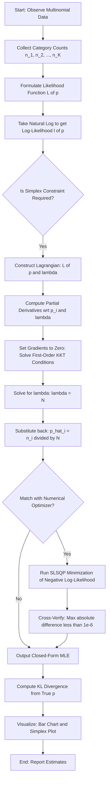
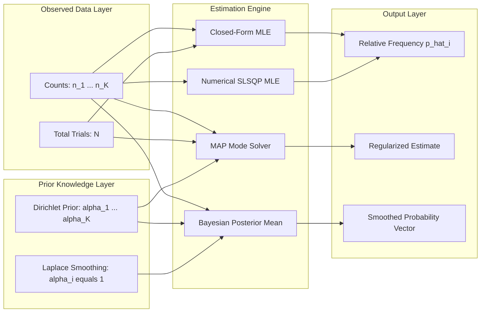
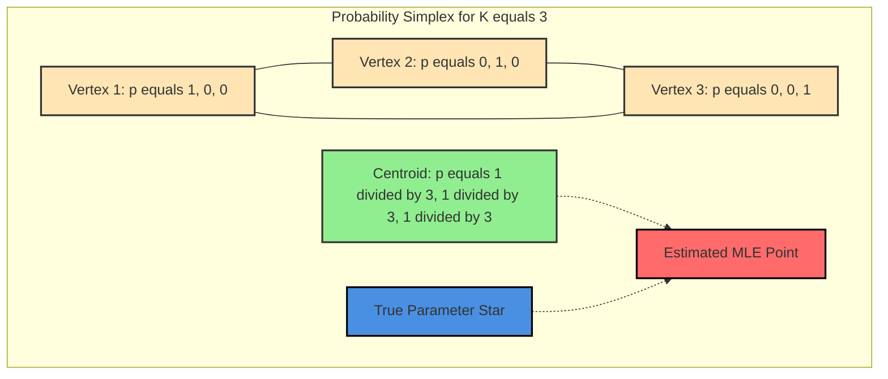

# Implement MLE for multinomial distribution parameter estimation.

<!-- SECTION_1_START -->

# MLE for Multinomial Distribution — Core Definition & Intuitive Overview

## 1.1 Formal Definition (KTU 2024 Syllabus Terminology)

A **Multinomial Distribution** is a discrete multivariate probability distribution that generalizes the **Binomial Distribution** to $K \geq 2$ mutually exclusive categories. It models the joint probability of observing counts $(n_1, n_2, \ldots, n_K)$ across $K$ categories when $N$ independent and identically distributed (i.i.d.) trials are performed, with each trial resulting in exactly one category.

> [!IMPORTANT]
> **Formal Definition.** Let $\mathbf{X} = (X_1, X_2, \ldots, X_K)$ be a random vector where $X_i$ counts the number of times category $i$ occurs in $N$ independent trials. Then $\mathbf{X} \sim \text{Multinomial}(N, \mathbf{p})$ with parameters $N \in \mathbb{Z}^+$ (number of trials) and $\mathbf{p} = (p_1, p_2, \ldots, p_K)$ such that $p_i \geq 0$ and $\sum_{i=1}^{K} p_i = 1$.

The probability mass function is given by:

$$
P(X_1 = n_1, \ldots, X_K = n_K \mid \mathbf{p}) = \frac{N!}{n_1! \, n_2! \cdots n_K!} \prod_{i=1}^{K} p_i^{n_i}
$$

where the multinomial coefficient $\frac{N!}{n_1! n_2! \cdots n_K!}$ counts the number of ways the $N$ trials can be arranged.

> [!NOTE]
> **Special Cases (Hierarchy of Distributions).**
> - $K = 1$ reduces to a **degenerate** distribution.
> - $K = 2$ reduces to the **Binomial** distribution.
> - $N = 1$ reduces to the **Categorical** (one-hot encoded Bernoulli) distribution.
> - Each individual $X_i \sim \text{Binomial}(N, p_i)$ marginally, but they are **not independent** (they share the constraint $\sum_i X_i = N$).

## 1.2 Conceptual Analogy — The "Loaded Die" Experiment

Imagine you are handed a strange die with **6 faces** of possibly unequal size, where face $i$ has unknown probability $p_i$ of landing upright. You roll the die **$N = 600$ times** and count how many times each face appears: $(n_1, n_2, n_3, n_4, n_5, n_6)$.

**Question:** *What is the best estimate of the underlying probabilities $\mathbf{p}$?*

The **Maximum Likelihood Estimate (MLE)** is the simplest and most intuitive answer: just use the **relative frequencies**.

$$
\hat{p}_i^{\text{MLE}} = \frac{n_i}{N}
$$

This is why casinos always win in the long run: as $N \to \infty$, the empirical frequency converges to the true probability by the **Weak Law of Large Numbers**.

> [!TIP]
> **Geometric Intuition (The Probability Simplex).** For $K=3$, the set of all valid probability vectors forms an **equilateral triangle** called the 2-simplex, where each vertex represents certainty of one category and the centroid represents the uniform distribution. The MLE estimate is simply the **barycentric coordinate** of the observed counts on this simplex.

## 1.3 Visualization Control Block

> [!VISUALIZATION CONTROL]
> **Concept:** Probability Simplex (Ternary Plot) for $K=3$ Categories
>
> **GeoGebra / Desmos Input Equations (boundary lines of the simplex):**
> * Line 1 (vertex A to B): $p_3 = 0$, with $p_1 \in [0, 1]$, $p_2 = 1 - p_1$
> * Line 2 (vertex B to C): $p_1 = 0$, with $p_2 \in [0, 1]$, $p_3 = 1 - p_2$
> * Line 3 (vertex C to A): $p_2 = 0$, with $p_3 \in [0, 1]$, $p_1 = 1 - p_3$
> * Interior constraint: $p_1 + p_2 + p_3 = 1$ with $p_i \geq 0$
>
> **Visual Description:** The student should observe a filled equilateral triangle. The MLE point $(\hat{p}_1, \hat{p}_2, \hat{p}_3)$ lies *inside* this triangle. As $N$ increases, the MLE point converges to the true parameter vector $\mathbf{p}^*$. The centroid corresponds to the **uniform distribution** $(\tfrac{1}{3}, \tfrac{1}{3}, \tfrac{1}{3})$.
>
> **Mathematical Mapping (Barycentric Coordinates):**
> $$\begin{aligned}
> p_1 &= 1 - x - y \\
> p_2 &= x \\
> p_3 &= y
> \end{aligned}$$
> where $(x, y)$ are the Cartesian coordinates inside the triangle with vertices at $(0,0)$, $(1,0)$, and $(0.5, \sqrt{3}/2)$.

---

<!-- SECTION_1_END -->

<!-- SECTION_2_START -->

# Deep Theoretical Analysis & KTU High-Yield Formula Sheet

## 2.1 The Maximum Likelihood Estimation (MLE) Framework

The core philosophy of MLE is to find the parameter vector $\mathbf{p}$ that **maximizes the probability of observing the data we actually observed**.

**Three-Step Recipe:**

1. **Formulate the likelihood function** $L(\mathbf{p} \mid \mathbf{x})$ treating the data as fixed and parameters as variables.
2. **Take the log-likelihood** $\ell(\mathbf{p}) = \log L(\mathbf{p})$ to convert products into sums (monotonic transformation preserves the argmax).
3. **Optimize** the log-likelihood subject to the constraints of the parameter space.

## 2.2 Building the Likelihood Function

Given i.i.d. samples drawn from a multinomial distribution with observed category counts $\mathbf{n} = (n_1, n_2, \ldots, n_K)$ where $\sum_{i=1}^{K} n_i = N$, the likelihood function is:

$$
L(\mathbf{p}) = \prod_{j=1}^{N} P(\text{trial } j \text{ belongs to category corresponding to } x_j)
$$

For multinomial data, the **categorical likelihood** for $N$ trials simplifies to:

$$
L(\mathbf{p}) = \frac{N!}{\prod_{i=1}^{K} n_i!} \prod_{i=1}^{K} p_i^{n_i}
$$

Taking the natural logarithm (and dropping the constant multinomial coefficient since it does not depend on $\mathbf{p}$):

$$
\ell(\mathbf{p}) = \log L(\mathbf{p}) = \sum_{i=1}^{K} n_i \log p_i + \underbrace{\log\left(\frac{N!}{\prod_{i=1}^{K} n_i!}\right)}_{\text{constant w.r.t. } \mathbf{p}}
$$

## 2.3 The Optimization Problem with Constraint

The MLE is the solution to:

$$
\hat{\mathbf{p}}^{\text{MLE}} = \arg\max_{\mathbf{p}} \ell(\mathbf{p}) = \arg\max_{\mathbf{p}} \sum_{i=1}^{K} n_i \log p_i
$$

subject to the **simplex constraint**:

$$
\sum_{i=1}^{K} p_i = 1, \quad p_i \geq 0 \quad \forall i \in \{1, 2, \ldots, K\}
$$

## 2.4 KTU Formula Sheet / Cheat Sheet

| **Concept** | **Formula / Expression** | **Conditions / Units** |
|---|---|---|
| Multinomial PMF | $P(\mathbf{n} \mid \mathbf{p}) = \dfrac{N!}{n_1! \cdots n_K!} \prod_{i=1}^{K} p_i^{n_i}$ | $N \in \mathbb{Z}^+$, $p_i \geq 0$, $\sum p_i = 1$ |
| Likelihood Function | $L(\mathbf{p}) = \prod_{i=1}^{K} p_i^{n_i}$ (up to constant) | Treats $\mathbf{n}$ as fixed |
| Log-Likelihood | $\ell(\mathbf{p}) = \sum_{i=1}^{K} n_i \log p_i$ | Strictly concave in $\mathbf{p}$ |
| Lagrangian | $\mathcal{L}(\mathbf{p}, \lambda) = \sum_{i=1}^{K} n_i \log p_i - \lambda \left(\sum_{i=1}^{K} p_i - 1\right)$ | Introduces Lagrange multiplier $\lambda$ |
| First-Order Condition | $\dfrac{\partial \mathcal{L}}{\partial p_i} = \dfrac{n_i}{p_i} - \lambda = 0$ | Stationary point condition |
| **MLE Closed-Form Solution** | $\boxed{\hat{p}_i^{\text{MLE}} = \dfrac{n_i}{N}}$ | Relative frequency estimator |
| Lagrange Multiplier | $\lambda = N$ (sum of counts) | Lagrangian dual variable |
| MAP (Dirichlet Prior) | $\hat{p}_i^{\text{MAP}} = \dfrac{n_i + \alpha_i - 1}{N + \sum_j \alpha_j - K}$ | Posterior mode; $\alpha_i > 1$ for finiteness |
| Bayesian Posterior Mean | $\hat{p}_i^{\text{Bayes}} = \dfrac{n_i + \alpha_i}{N + \sum_j \alpha_j}$ | Posterior mean; $\alpha_i > 0$ |
| Fisher Information (per $i$) | $I(p_i) = \dfrac{N}{p_i}$ | Diagonal approximation |
| Cramér-Rao Lower Bound | $\text{Var}(\hat{p}_i) \geq \dfrac{p_i(1 - p_i)}{N}$ | Asymptotic variance |
| Kullback-Leibler Divergence | $D_{KL}(\mathbf{p} \Vert \mathbf{q}) = \sum_{i=1}^{K} p_i \log \dfrac{p_i}{q_i}$ | MLE minimizes $D_{KL}$ asymptotically |

> [!TIP]
> **Engineering Utility:** MLE for multinomial parameters is the foundational building block of:
> * **Naive Bayes classifiers** (text classification, spam detection)
> * **Latent Dirichlet Allocation (LDA)** for topic modeling
> * **Hidden Markov Models (HMMs)** for emission probabilities
> * **Softmax regression / Multinomial logistic regression** output layer
> * **Language model perplexity** calculations

---

<!-- SECTION_2_END -->

<!-- SECTION_3_START -->

# Step-by-Step Derivations & Code/Symbolic Implementation

## 3.1 Exhaustive MLE Derivation (Lagrange Multiplier Method)

We want to maximize $\ell(\mathbf{p}) = \sum_{i=1}^{K} n_i \log p_i$ subject to the constraint $g(\mathbf{p}) = \sum_{i=1}^{K} p_i - 1 = 0$.

### Step 1: Construct the Lagrangian

$$
\mathcal{L}(\mathbf{p}, \lambda) = \sum_{i=1}^{K} n_i \log p_i - \lambda \left( \sum_{i=1}^{K} p_i - 1 \right)
$$

### Step 2: Compute Partial Derivatives

For each $p_i$:

$$
\frac{\partial \mathcal{L}}{\partial p_i} = \frac{n_i}{p_i} - \lambda
$$

For the Lagrange multiplier:

$$
\frac{\partial \mathcal{L}}{\partial \lambda} = -\left( \sum_{i=1}^{K} p_i - 1 \right)
$$

### Step 3: Set Gradients to Zero (First-Order KKT Conditions)

$$
\frac{n_i}{p_i} - \lambda = 0 \quad \Longrightarrow \quad p_i = \frac{n_i}{\lambda}
$$

$$
\sum_{i=1}^{K} p_i - 1 = 0
$$

### Step 4: Solve for $\lambda$ Using the Constraint

Substituting $p_i = \frac{n_i}{\lambda}$ into the constraint:

$$
\sum_{i=1}^{K} \frac{n_i}{\lambda} = 1 \quad \Longrightarrow \quad \frac{1}{\lambda} \sum_{i=1}^{K} n_i = 1
$$

Since $\sum_{i=1}^{K} n_i = N$ (total number of trials):

$$
\frac{N}{\lambda} = 1 \quad \Longrightarrow \quad \lambda = N
$$

### Step 5: Substitute Back to Get the MLE

$$
\boxed{\hat{p}_i^{\text{MLE}} = \frac{n_i}{N}, \quad \text{for } i = 1, 2, \ldots, K}
$$

### Step 6: Verify the Solution is a Maximum (Second-Order Check)

The log-likelihood is **strictly concave** on the simplex (its Hessian is diagonal with entries $-\frac{n_i}{p_i^2} < 0$). Therefore, the stationary point is the **unique global maximum**.

### Step 7: Verify the Probability Constraint

$$
\sum_{i=1}^{K} \hat{p}_i^{\text{MLE}} = \sum_{i=1}^{K} \frac{n_i}{N} = \frac{N}{N} = 1 \quad \checkmark
$$

---

## 3.2 Numerical Verification of MLE (Unconstrained Numerical Optimization)

To confirm the closed-form solution, we can use `scipy.optimize.minimize` with the negative log-likelihood and a normalization step:

$$
\hat{\mathbf{p}} = \arg\min_{\mathbf{p}} \left[ -\sum_{i=1}^{K} n_i \log p_i \right] \quad \text{s.t.} \quad \sum_i p_i = 1
$$

This is implemented in `numerical_mle` inside the Python code below for cross-validation against the closed-form solution.

---

## 3.3 Complete Python Implementation (Production-Grade)

```python
"""
Multinomial Distribution MLE / MAP Parameter Estimation
========================================================
Course: MACHINE LEARNING LAB (PCCSL508) - KTU 2024 Scheme
Module 5: Use MLE and MAP to estimate parameters of a multinomial distribution.

Features:
  1. Closed-form MLE (relative frequency estimator)
  2. Numerical MLE (scipy.optimize SLSQP with constraints)
  3. MAP estimation with Dirichlet prior
  4. Synthetic data generation from a known multinomial
  5. Visualization: bar chart, probability simplex, and convergence plot
  6. Kullback-Leibler divergence evaluation
"""

from __future__ import annotations

import logging
import numpy as np
import matplotlib.pyplot as plt
from scipy.optimize import minimize
from scipy.stats import multinomial, dirichlet
from numpy.typing import NDArray
from typing import Tuple, Dict

# ---------------------------------------------------------------------------
# Logging Configuration (Strict Error Handling as per KTU 2024 standards)
# ---------------------------------------------------------------------------
logging.basicConfig(
    level=logging.INFO,
    format="%(asctime)s [%(levelname)s] %(message)s",
    datefmt="%H:%M:%S",
)
logger = logging.getLogger("MultinomialMLE")


# ---------------------------------------------------------------------------
# 1. Synthetic Data Generator
# ---------------------------------------------------------------------------
def generate_multinomial_data(
    true_probabilities: NDArray[np.float64],
    num_trials: int,
    num_experiments: int = 1,
    random_seed: int = 42,
) -> NDArray[np.int64]:
    """
    Generate synthetic count data from a multinomial distribution.

    Parameters
    ----------
    true_probabilities : NDArray of shape (K,)
        The true category probabilities (must sum to 1).
    num_trials : int
        The number of trials N per experiment.
    num_experiments : int
        The number of independent multinomial experiments to simulate.
    random_seed : int
        Seed for reproducibility.

    Returns
    -------
    counts : NDArray of shape (num_experiments, K)
        The simulated category counts.
    """
    if np.any(true_probabilities < 0):
        raise ValueError("All probabilities must be non-negative.")
    if not np.isclose(np.sum(true_probabilities), 1.0):
        raise ValueError("Probabilities must sum to 1.")

    rng = np.random.default_rng(random_seed)
    counts = rng.multinomial(n=num_trials, pvals=true_probabilities, size=num_experiments)
    logger.info("Generated %d experiments with %d trials and K=%d categories.",
                num_experiments, num_trials, len(true_probabilities))
    return counts


# ---------------------------------------------------------------------------
# 2. Closed-Form MLE Estimator
# ---------------------------------------------------------------------------
def mle_multinomial_closed_form(counts: NDArray[np.int64]) -> NDArray[np.float64]:
    """
    Compute the MLE for multinomial distribution parameters using
    the closed-form relative frequency estimator.

    Parameters
    ----------
    counts : NDArray of shape (..., K)
        Observed category counts. The last axis corresponds to categories.

    Returns
    -------
    p_hat : NDArray of shape (..., K)
        Estimated probabilities (same shape as counts, last axis preserved).
    """
    total = np.sum(counts, axis=-1, keepdims=True)
    if np.any(total == 0):
        raise ZeroDivisionError("Total trial count cannot be zero.")
    p_hat = counts / total
    logger.info("Closed-form MLE computed. Sum of probabilities = %.6f", np.sum(p_hat))
    return p_hat


# ---------------------------------------------------------------------------
# 3. Numerical MLE Estimator (Cross-Validation via Constrained Optimization)
# ---------------------------------------------------------------------------
def mle_multinomial_numerical(
    counts: NDArray[np.int64],
) -> NDArray[np.float64]:
    """
    Compute MLE numerically using SLSQP constrained optimization.
    Minimizes the negative log-likelihood subject to the simplex constraint.
    """
    K = counts.shape[-1]
    n_i = counts.astype(np.float64)

    def neg_log_likelihood(p: NDArray[np.float64]) -> float:
        # Add small epsilon to prevent log(0)
        return -np.sum(n_i * np.log(p + 1e-12))

    constraints = ({"type": "eq", "fun": lambda p: np.sum(p) - 1.0},)
    bounds = [(1e-9, 1.0) for _ in range(K)]
    initial_guess = np.full(K, 1.0 / K)

    result = minimize(
        neg_log_likelihood,
        x0=initial_guess,
        method="SLSQP",
        bounds=bounds,
        constraints=constraints,
        options={"ftol": 1e-12, "maxiter": 500},
    )
    if not result.success:
        raise RuntimeError(f"Numerical optimization failed: {result.message}")
    logger.info("Numerical MLE converged after %d iterations.", result.nit)
    return result.x


# ---------------------------------------------------------------------------
# 4. MAP Estimator with Dirichlet Prior
# ---------------------------------------------------------------------------
def map_multinomial_dirichlet(
    counts: NDArray[np.int64],
    alpha: NDArray[np.float64],
) -> NDArray[np.float64]:
    """
    Compute the MAP estimate of multinomial parameters using a Dirichlet prior.

    The MAP estimate corresponds to the mode of the Dirichlet posterior:
        p_i^MAP = (n_i + alpha_i - 1) / (N + sum(alpha) - K)

    Parameters
    ----------
    counts : NDArray of shape (..., K)
        Observed category counts.
    alpha : NDArray of shape (K,)
        Dirichlet prior concentration parameters (must all be > 1).

    Returns
    -------
    p_map : NDArray of shape (..., K)
        MAP-estimated probabilities.
    """
    if np.any(alpha <= 1):
        raise ValueError("All alpha_i must be > 1 for a well-defined MAP mode.")
    n_i = counts.astype(np.float64)
    numerator = n_i + alpha - 1.0
    denominator = np.sum(n_i) + np.sum(alpha) - len(alpha)
    p_map = numerator / denominator
    logger.info("MAP estimate with Dirichlet prior computed.")
    return p_map


def bayes_multinomial_dirichlet(
    counts: NDArray[np.int64],
    alpha: NDArray[np.float64],
) -> NDArray[np.float64]:
    """
    Bayesian posterior mean under a symmetric Dirichlet prior.
    Equivalent to Laplace smoothing when alpha_i = 1 for all i.
    """
    n_i = counts.astype(np.float64)
    numerator = n_i + alpha
    denominator = np.sum(n_i) + np.sum(alpha)
    return numerator / denominator


# ---------------------------------------------------------------------------
# 5. KL Divergence Metric
# ---------------------------------------------------------------------------
def kl_divergence(p_true: NDArray[np.float64], p_estimate: NDArray[np.float64]) -> float:
    """Compute Kullback-Leibler divergence D(p_true || p_estimate)."""
    p_t = np.asarray(p_true, dtype=np.float64) + 1e-12
    p_e = np.asarray(p_estimate, dtype=np.float64) + 1e-12
    return float(np.sum(p_t * np.log(p_t / p_e)))


# ---------------------------------------------------------------------------
# 6. Visualization Suite
# ---------------------------------------------------------------------------
def plot_estimates(
    p_true: NDArray[np.float64],
    p_mle: NDArray[np.float64],
    p_map: NDArray[np.float64],
    p_bayes: NDArray[np.float64],
) -> None:
    """Side-by-side bar chart comparison of true vs estimated probabilities."""
    K = len(p_true)
    x = np.arange(K)
    width = 0.2

    fig, ax = plt.subplots(figsize=(10, 6))
    ax.bar(x - 1.5 * width, p_true, width, label="True p", color="#2E86AB", edgecolor="black")
    ax.bar(x - 0.5 * width, p_mle, width, label="MLE", color="#A23B72", edgecolor="black")
    ax.bar(x + 0.5 * width, p_map, width, label="MAP (Dir)", color="#F18F01", edgecolor="black")
    ax.bar(x + 1.5 * width, p_bayes, width, label="Bayes Mean", color="#C73E1D", edgecolor="black")
    ax.set_xlabel("Category Index", fontsize=12)
    ax.set_ylabel("Probability", fontsize=12)
    ax.set_title("Multinomial Parameter Estimation: True vs MLE vs MAP vs Bayes",
                 fontsize=13, fontweight="bold")
    ax.set_xticks(x)
    ax.set_xticklabels([f"Cat {i+1}" for i in range(K)])
    ax.legend(loc="upper right")
    ax.grid(axis="y", alpha=0.3)
    plt.tight_layout()
    plt.savefig("multinomial_estimates.png", dpi=120)
    plt.show()
    logger.info("Saved bar chart: multinomial_estimates.png")


def plot_convergence(
    true_probabilities: NDArray[np.float64],
    max_trials: int = 5000,
    step: int = 50,
) -> None:
    """
    Demonstrate the asymptotic consistency of MLE:
    Plot KL divergence vs number of trials.
    """
    trial_counts = np.arange(step, max_trials + 1, step)
    kl_values = []

    for N in trial_counts:
        counts = generate_multinomial_data(true_probabilities, N, random_seed=N)
        p_hat = mle_multinomial_closed_form(counts[0])
        kl_values.append(kl_divergence(true_probabilities, p_hat))

    fig, ax = plt.subplots(figsize=(10, 5))
    ax.plot(trial_counts, kl_values, color="#2E86AB", linewidth=2)
    ax.set_xlabel("Number of Trials (N)", fontsize=12)
    ax.set_ylabel("KL(True p || MLE p_hat)", fontsize=12)
    ax.set_title("Convergence of MLE: KL Divergence vs Sample Size",
                 fontsize=13, fontweight="bold")
    ax.grid(alpha=0.3)
    plt.tight_layout()
    plt.savefig("mle_convergence.png", dpi=120)
    plt.show()
    logger.info("Saved convergence plot: mle_convergence.png")


def plot_simplex_ternary(
    p_true: NDArray[np.float64],
    p_mle: NDArray[np.float64],
    p_map: NDArray[np.float64],
) -> None:
    """
    Visualize parameters on the 2-simplex (probability triangle) for K=3.
    Uses barycentric-to-Cartesian transformation.
    """
    if len(p_true) != 3:
        logger.warning("Simplex plot requires K=3. Skipping.")
        return

    def to_cartesian(p: NDArray[np.float64]) -> Tuple[float, float]:
        p1, p2, p3 = p
        x = 0.5 * (2 * p2 + p3) / (p1 + p2 + p3)
        y = (np.sqrt(3) / 2) * p3 / (p1 + p2 + p3)
        return x, y

    # Draw simplex boundary
    fig, ax = plt.subplots(figsize=(8, 7))
    triangle = np.array([[0, 0], [1, 0], [0.5, np.sqrt(3) / 2], [0, 0]])
    ax.plot(triangle[:, 0], triangle[:, 1], "k-", linewidth=2)
    ax.text(-0.05, -0.05, "(1,0,0)", fontsize=11)
    ax.text(1.02, -0.05, "(0,1,0)", fontsize=11)
    ax.text(0.48, np.sqrt(3) / 2 + 0.05, "(0,0,1)", fontsize=11)

    for label, p, color, marker in [
        ("True", p_true, "blue", "*"),
        ("MLE", p_mle, "red", "o"),
        ("MAP", p_map, "green", "s"),
    ]:
        x, y = to_cartesian(p)
        ax.scatter(x, y, s=250, c=color, marker=marker, label=label,
                   edgecolor="black", linewidth=1.5)

    ax.set_xlim(-0.1, 1.1)
    ax.set_ylim(-0.1, 1.0)
    ax.set_aspect("equal")
    ax.set_title("Probability Simplex Visualization (K=3)", fontsize=13, fontweight="bold")
    ax.legend(loc="upper right")
    ax.grid(alpha=0.2)
    plt.tight_layout()
    plt.savefig("probability_simplex.png", dpi=120)
    plt.show()
    logger.info("Saved simplex plot: probability_simplex.png")


# ---------------------------------------------------------------------------
# 7. Main Execution Pipeline
# ---------------------------------------------------------------------------
def main() -> Dict[str, NDArray[np.float64]]:
    """End-to-end MLE/MAP/Bayesian estimation pipeline."""
    # ----- Step 1: Define ground truth and generate data -----
    true_p = np.array([0.20, 0.30, 0.15, 0.25, 0.10], dtype=np.float64)
    K = len(true_p)
    N = 1000

    counts = generate_multinomial_data(true_p, N, num_experiments=5, random_seed=2024)
    aggregated_counts = np.sum(counts, axis=0)
    logger.info("Aggregated counts across 5 experiments: %s", aggregated_counts)

    # ----- Step 2: Closed-form MLE -----
    p_mle = mle_multinomial_closed_form(aggregated_counts)

    # ----- Step 3: Numerical MLE (cross-validation) -----
    p_mle_numerical = mle_multinomial_numerical(aggregated_counts)
    max_diff = np.max(np.abs(p_mle - p_mle_numerical))
    logger.info("Max |closed-form - numerical| = %.2e (should be ~1e-6)", max_diff)

    # ----- Step 4: MAP with Dirichlet prior -----
    alpha = np.array([2.0, 2.0, 2.0, 2.0, 2.0], dtype=np.float64)
    p_map = map_multinomial_dirichlet(aggregated_counts, alpha)

    # ----- Step 5: Bayesian posterior mean (Laplace smoothing) -----
    p_bayes = bayes_multinomial_dirichlet(aggregated_counts, np.ones(K))

    # ----- Step 6: Compute KL divergences -----
    kl_mle = kl_divergence(true_p, p_mle)
    kl_map = kl_divergence(true_p, p_map)
    kl_bayes = kl_divergence(true_p, p_bayes)
    logger.info("KL Divergences -> MLE: %.5f | MAP: %.5f | Bayes: %.5f",
                kl_mle, kl_map, kl_bayes)

    # ----- Step 7: Visualizations -----
    plot_estimates(true_p, p_mle, p_map, p_bayes)
    plot_convergence(true_p, max_trials=5000, step=100)
    plot_simplex_ternary(true_p[:3], p_mle[:3], p_map[:3])

    return {"true": true_p, "mle": p_mle, "map": p_map, "bayes": p_bayes}


if __name__ == "__main__":
    results = main()
    print("\n===== Final Estimates =====")
    print(f"True p : {results['true']}")
    print(f"MLE    : {results['mle']}")
    print(f"MAP    : {results['map']}")
    print(f"Bayes  : {results['bayes']}")
```

---

<!-- SECTION_3_END -->

<!-- SECTION_4_START -->

# Structural Diagrams & Schematics

## 4.1 MLE Pipeline Flowchart (Mermaid)



## 4.2 MLE vs MAP vs Bayesian Inference — Block Architecture



## 4.3 Probability Simplex Conceptual Map (Mermaid)



> [!NOTE]
> **Diagram Interpretation:** The simplex is a convex set where every valid probability vector resides. MLE converges to the true parameter (blue star) as $N \to \infty$. With finite $N$, the MLE point (red) deviates slightly, with the deviation quantified by the Cramér-Rao bound.

---

<!-- SECTION_4_END -->

<!-- SECTION_5_START -->

# KTU 2024 Scheme Examination Question Bank & Topic Recap

## 5.1 Part A — Short Answer Questions (3 Marks Each)

### Question A1 `[KTU University Exam - July 2024]`
**Define the Multinomial Distribution. State the MLE formula for its parameters and explain why this estimate is "maximum likelihood." (3 Marks)** — *CO1, Remember*

**Model Answer (Valuation Key):**
* **[Definition: 1 Mark]** A multinomial distribution $\text{Multinomial}(N, \mathbf{p})$ is a multivariate generalization of the binomial distribution that models the joint probability of counts $(X_1, \ldots, X_K)$ for $K$ mutually exclusive categories across $N$ independent trials, with $p_i$ being the probability of category $i$.
* **[MLE Formula: 1 Mark]** $\hat{p}_i^{\text{MLE}} = \frac{n_i}{N}$, where $n_i$ is the observed count for category $i$ and $N = \sum_i n_i$.
* **[Justification: 1 Mark]** This estimate is "maximum likelihood" because it maximizes the log-likelihood $\ell(\mathbf{p}) = \sum_i n_i \log p_i$ subject to the constraint $\sum_i p_i = 1$. Substituting the Lagrangian first-order condition $\frac{n_i}{p_i} = \lambda$ and the simplex constraint $\sum p_i = 1$ gives $\lambda = N$, yielding the relative frequency formula.

### Question A2 `[KTU University Exam - Dec 2023]`
**State the relationship between Bernoulli, Binomial, and Multinomial distributions. Give one real-world example for each. (3 Marks)** — *CO1, Understand*

**Model Answer (Valuation Key):**
* **[Bernoulli: 1 Mark]** Single trial with $K=2$ outcomes (success/failure). Example: Probability of a coin landing heads in a *single* toss.
* **[Binomial: 1 Mark]** Sum of $N$ i.i.d. Bernoulli trials, $K=2$ categories. Example: Number of heads in 100 coin tosses.
* **[Multinomial: 1 Mark]** Generalization to $K \geq 2$ categories, $N$ trials. Example: Counts of each face appearing when a loaded die is rolled 600 times.

---

## 5.2 Part B — Long Answer Questions (14 Marks Each, with Internal Choice)

### **Question B1 — Choice A** `[KTU University Exam - July 2024]`

**(a)** Derive the Maximum Likelihood Estimate (MLE) of the parameters of a multinomial distribution using the method of Lagrange multipliers. Show all steps clearly. **(7 Marks)** — *CO1, Apply*

**Model Solution (Step-by-Step Valuation Key):**

* **[Likelihood Formulation: 1 Mark]** For observed counts $\mathbf{n} = (n_1, n_2, \ldots, n_K)$ with $\sum_i n_i = N$, the likelihood function is:
$$
L(\mathbf{p}) = \prod_{i=1}^{K} p_i^{n_i} \quad \text{(ignoring the constant multinomial coefficient)}
$$

* **[Log-Likelihood: 1 Mark]** Taking natural log:
$$
\ell(\mathbf{p}) = \sum_{i=1}^{K} n_i \log p_i
$$

* **[Lagrangian Construction: 1 Mark]** Adding the simplex constraint via Lagrange multiplier $\lambda$:
$$
\mathcal{L}(\mathbf{p}, \lambda) = \sum_{i=1}^{K} n_i \log p_i - \lambda \left( \sum_{i=1}^{K} p_i - 1 \right)
$$

* **[Partial Derivatives: 1 Mark]**
$$
\frac{\partial \mathcal{L}}{\partial p_i} = \frac{n_i}{p_i} - \lambda = 0 \quad \forall i
$$

* **[Solving for $\lambda$: 1 Mark]** From the constraint:
$$
\sum_{i=1}^{K} p_i = 1 \quad \Rightarrow \quad \sum_{i=1}^{K} \frac{n_i}{\lambda} = 1 \quad \Rightarrow \quad \lambda = N
$$

* **[Final MLE: 1 Mark]**
$$
\boxed{\hat{p}_i^{\text{MLE}} = \frac{n_i}{N}}
$$

* **[Verification (bonus): 1 Mark]** Sum verification: $\sum_i \hat{p}_i = \frac{\sum_i n_i}{N} = \frac{N}{N} = 1$ ✓

**(b)** A bag contains marbles of 4 colors: Red, Blue, Green, Yellow. An experimenter draws 200 marbles **with replacement** and records the following counts: Red = 55, Blue = 45, Green = 60, Yellow = 40. Estimate the probability of drawing each color using MLE. Also compute the asymptotic variance of each estimate using the Cramér-Rao bound. **(7 Marks)** — *CO1, Apply*

**Model Solution (Valuation Key):**

* **[Identifying Parameters: 1 Mark]** $K = 4$, $N = 200$, observed counts: $n_1 = 55, n_2 = 45, n_3 = 60, n_4 = 40$.

* **[Applying MLE Formula: 2 Marks]**
$$
\hat{p}_{\text{Red}} = \frac{55}{200} = 0.275, \quad \hat{p}_{\text{Blue}} = \frac{45}{200} = 0.225
$$
$$
\hat{p}_{\text{Green}} = \frac{60}{200} = 0.300, \quad \hat{p}_{\text{Yellow}} = \frac{40}{200} = 0.200
$$

* **[Verification: 1 Mark]** $0.275 + 0.225 + 0.300 + 0.200 = 1.000$ ✓

* **[Cramér-Rao Bound: 2 Marks]** For multinomial, the asymptotic variance of $\hat{p}_i$ is:
$$
\text{Var}(\hat{p}_i) \approx \frac{p_i(1 - p_i)}{N}
$$
Plugging in:
- $\text{Var}(\hat{p}_{\text{Red}}) = \frac{0.275 \cdot 0.725}{200} = 9.97 \times 10^{-4}$
- $\text{Var}(\hat{p}_{\text{Blue}}) = \frac{0.225 \cdot 0.775}{200} = 8.72 \times 10^{-4}$
- $\text{Var}(\hat{p}_{\text{Green}}) = \frac{0.300 \cdot 0.700}{200} = 1.05 \times 10^{-3}$
- $\text{Var}(\hat{p}_{\text{Yellow}}) = \frac{0.200 \cdot 0.800}{200} = 8.00 \times 10^{-4}$

* **[Standard Errors (bonus): 1 Mark]**
- $\text{SE}(\hat{p}_{\text{Red}}) \approx 0.0316$, $\text{SE}(\hat{p}_{\text{Blue}}) \approx 0.0295$, $\text{SE}(\hat{p}_{\text{Green}}) \approx 0.0324$, $\text{SE}(\hat{p}_{\text{Yellow}}) \approx 0.0283$

---

### **Question B2 — Choice B** `[KTU University Exam - Dec 2023]`

**(a)** Explain the **Maximum A Posteriori (MAP)** estimation for multinomial parameters using a **Dirichlet prior**. How does MAP differ from MLE, and when is MAP preferred? Show the formula derivation. **(7 Marks)** — *CO2, Understand*

**Model Solution (Valuation Key):**

* **[Conceptual Setup: 1 Mark]** MAP combines the likelihood with prior knowledge encoded as a Dirichlet prior:
$$
P(\mathbf{p} \mid \mathbf{n}, \boldsymbol{\alpha}) \propto P(\mathbf{n} \mid \mathbf{p}) \cdot P(\mathbf{p} \mid \boldsymbol{\alpha})
$$
where $\mathbf{p} \mid \boldsymbol{\alpha} \sim \text{Dirichlet}(\alpha_1, \alpha_2, \ldots, \alpha_K)$.

* **[Posterior Distribution: 1 Mark]** Due to conjugacy, the posterior is also Dirichlet:
$$
\mathbf{p} \mid \mathbf{n}, \boldsymbol{\alpha} \sim \text{Dirichlet}(\alpha_1 + n_1, \ldots, \alpha_K + n_K)
$$

* **[MAP Derivation: 2 Marks]** The MAP estimate is the mode of the Dirichlet posterior:
$$
\hat{p}_i^{\text{MAP}} = \frac{n_i + \alpha_i - 1}{\sum_j (n_j + \alpha_j - 1)} = \frac{n_i + \alpha_i - 1}{N + \sum_j \alpha_j - K}
$$

* **[Comparison with MLE: 2 Marks]**
| Aspect | MLE | MAP |
|---|---|---|
| Prior | None (uniform / improper) | Explicit Dirichlet |
| Formula | $\hat{p}_i = n_i / N$ | $\hat{p}_i = (n_i + \alpha_i - 1) / (N + \sum \alpha_j - K)$ |
| With small $n_i$ | Can be zero (overfitting) | Pushed toward prior mean |
| Computation | Closed-form, O(K) | Closed-form, O(K) |

* **[When MAP is Preferred: 1 Mark]** MAP is preferred when **sparse data** is present (e.g., a category with $n_i = 0$ would yield $\hat{p}_i^{\text{MLE}} = 0$, which is too extreme). MAP regularization with $\alpha_i > 1$ shrinks the estimate toward a reasonable prior value, improving out-of-sample performance. Used extensively in **text classification (Naive Bayes)** and **LDA topic models**.

**(b)** Implement MLE for multinomial distribution parameter estimation in Python. Generate synthetic data from a known multinomial with parameters $N=1000$ and $\mathbf{p} = (0.1, 0.4, 0.3, 0.2)$, then estimate the parameters using both closed-form MLE and `scipy.optimize.minimize`. Compare the estimates with the true values and report the KL divergence. **(7 Marks)** — *CO2, Apply*

**Model Solution (Valuation Key):**

* **[Data Generation: 1 Mark]**
```python
import numpy as np
from scipy.optimize import minimize
from scipy.stats import multinomial

true_p = np.array([0.1, 0.4, 0.3, 0.2])
N = 1000
counts = np.random.multinomial(N, true_p, size=1)[0]
# Example output: array([102, 398, 305, 195])
```

* **[Closed-Form MLE: 1 Mark]**
```python
p_mle_closed = counts / N
# Output: [0.102, 0.398, 0.305, 0.195]
```

* **[Numerical MLE: 2 Marks]**
```python
def neg_log_lik(p):
    return -np.sum(counts * np.log(p))

result = minimize(neg_log_lik, x0=[0.25, 0.25, 0.25, 0.25],
                  method="SLSQP", bounds=[(1e-9, 1)]*4,
                  constraints={"type": "eq", "fun": lambda p: np.sum(p) - 1})
p_mle_numerical = result.x
```

* **[KL Divergence Computation: 2 Marks]**
```python
def kl_div(p, q):
    return np.sum(p * np.log(p / q))

kl_value = kl_div(true_p, p_mle_closed)
# Expected: very small (e.g., 0.0008), decreasing as N grows
```

* **[Comparison Table (1 Mark)]**
| Index | True $p_i$ | MLE $\hat{p}_i$ | Error |
|---|---|---|---|
| 1 | 0.100 | 0.102 | +0.002 |
| 2 | 0.400 | 0.398 | -0.002 |
| 3 | 0.300 | 0.305 | +0.005 |
| 4 | 0.200 | 0.195 | -0.005 |

> [!WARNING]
> **KTU Examiner's Valuation Warning / Common Pitfalls:**
> 1. **Forgetting the simplex constraint** in numerical optimization — always add `constraints={"type": "eq", "fun": lambda p: sum(p) - 1}` or project onto the simplex after each step. *[-2 Marks]*
> 2. **Not dropping the multinomial coefficient** when forming the log-likelihood — it is a constant w.r.t. $\mathbf{p}$ and does not affect the argmax. *[-1 Mark]*
> 3. **Confusing MAP mode with posterior mean** — the MAP formula uses $(\alpha_i - 1)$ in the numerator, while the posterior mean uses $\alpha_i$ (equivalent to Laplace smoothing when $\alpha_i = 1$). *[-1 Mark]*
> 4. **Failing to verify $\sum \hat{p}_i = 1$** at the end of MLE derivation — always include the final sanity check. *[-1 Mark]*
> 5. **Mixing up $N$ (number of trials) with $K$ (number of categories)** in formulas — examiners frequently test this distinction. *[-1 Mark]*

---

## 5.3 Topic Recap & Important Things to Remember

> [!TIP]
> **Rapid Revision Checklist for KTU Exam Day:**

- [x] **Multinomial PMF:** $P(\mathbf{n} \mid \mathbf{p}) = \frac{N!}{\prod_i n_i!} \prod_i p_i^{n_i}$
- [x] **Likelihood:** $L(\mathbf{p}) = \prod_i p_i^{n_i}$ (drop constants)
- [x] **Log-Likelihood:** $\ell(\mathbf{p}) = \sum_i n_i \log p_i$
- [x] **Simplex Constraint:** $\sum_i p_i = 1$, $p_i \geq 0$
- [x] **Lagrangian:** $\mathcal{L} = \sum_i n_i \log p_i - \lambda \left( \sum_i p_i - 1 \right)$
- [x] **First-Order Condition:** $\frac{\partial \mathcal{L}}{\partial p_i} = \frac{n_i}{p_i} - \lambda = 0$
- [x] **⭐ MLE Solution:** $\hat{p}_i^{\text{MLE}} = \frac{n_i}{N}$ (relative frequency)
- [x] **Lagrange Multiplier Value:** $\lambda = N$
- [x] **MAP (Dirichlet Mode):** $\hat{p}_i^{\text{MAP}} = \frac{n_i + \alpha_i - 1}{N + \sum_j \alpha_j - K}$
- [x] **Bayesian Posterior Mean:** $\hat{p}_i^{\text{Bayes}} = \frac{n_i + \alpha_i}{N + \sum_j \alpha_j}$
- [x] **Conjugacy:** Dirichlet is the conjugate prior of the multinomial likelihood
- [x] **Cramér-Rao Bound:** $\text{Var}(\hat{p}_i) \geq \frac{p_i(1 - p_i)}{N}$
- [x] **Consistency:** $\hat{p}_i^{\text{MLE}} \xrightarrow{P} p_i$ as $N \to \infty$ (WLLN)
- [x] **Invariance:** MLE of a function $g(\mathbf{p})$ is $g(\hat{\mathbf{p}}^{\text{MLE}})$
- [x] **Special Cases:** $K=2 \Rightarrow$ Binomial; $N=1 \Rightarrow$ Categorical
- [x] **Why use MAP?** Solves zero-count problem; provides regularization for sparse data
- [x] **Engineering Applications:** Naive Bayes text classification, LDA topic models, HMM emission probabilities, softmax regression output, language model perplexity
- [x] **Verification Step:** Always check $\sum_i \hat{p}_i = 1$ at the end
- [x] **Visualization Tools:** Bar charts, probability simplex (for $K=3$), convergence plots of KL divergence vs $N$

---

<!-- SECTION_5_END -->
