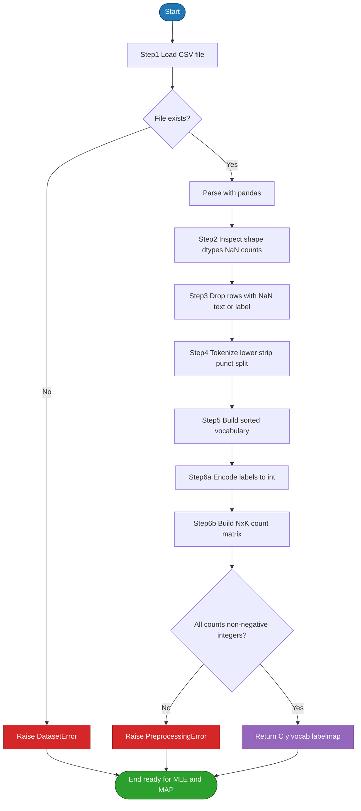
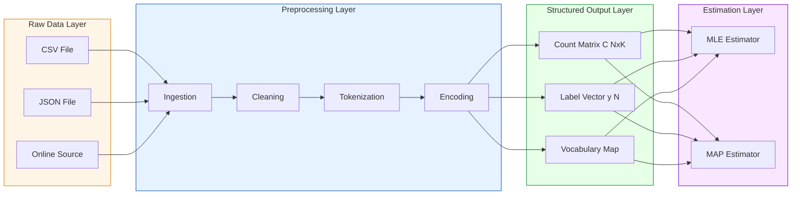

# Load and preprocess the dataset.

<!-- SECTION_1_START -->

# 1. Core Technical Definition & Intuitive Overview

## 1.1 Formal Academic Definition

In the context of **Module 5: MLE and MAP Estimation for Multinomial Distribution**, the term **"Load and Preprocess the Dataset"** refers to the systematic pipeline of ingesting raw observational data and transforming it into a structured numerical representation that satisfies the mathematical assumptions of a **multinomial probability mass function**.

A **multinomial distribution** generalizes the binomial to $K \geq 2$ discrete categories. The probability mass function is given by:

$$P(X_1 = n_1, X_2 = n_2, \ldots, X_K = n_K) = \frac{N!}{\prod_{i=1}^{K} n_i!} \prod_{i=1}^{K} \theta_i^{n_i}$$

where the parameter vector $\boldsymbol{\theta} = (\theta_1, \theta_2, \ldots, \theta_K)$ must satisfy $\sum_{i=1}^{K} \theta_i = 1$ and $\theta_i \geq 0$ for all $i$.

For MLE/MAP estimation, the dataset must be transformed into **non-negative integer count vectors** $n_i \in \mathbb{Z}_{\geq 0}$ that represent the number of times each of the $K$ outcomes (categories, words, classes) was observed.

> [!IMPORTANT]
> **KTU 2024 Syllabus Highlight (PCCSL508 — Module 5):**
> Students are expected to implement the *complete pipeline* — from raw `.csv`/`.txt` ingestion to a NumPy count matrix — using a real or synthetic dataset. The preprocessed matrix is the **only valid input** to the MLE/MAP estimators.

## 1.2 Conceptual Analogy / Intuition

Imagine you are a librarian counting how many books in your library belong to three genres: **Fiction**, **Science**, and **History**.

- **Loading** = opening the library's catalogue spreadsheet.
- **Preprocessing** = cleaning the entries (removing typos, fixing missing genres), standardizing category names ("Sci" → "Science", "Hist" → "History"), and finally counting books per shelf.
- The final **count vector** $[120, 80, 100]$ is what MLE converts into probabilities $\hat{\theta} = [0.40, 0.27, 0.33]$.

Without preprocessing, the catalogue might say "sci", "Science", and "SCIENCE" — three different strings for the *same* category — which would corrupt the counts and break the multinomial assumption.

> [!NOTE]
> **Core Principle:** A multinomial model is only as good as the count matrix fed into it. Garbage counts in ⇒ garbage probabilities out.

## 1.3 Key Metrics and Constants

| Symbol | Meaning | Typical Constraint |
|:---:|:---|:---|
| $N$ | Total number of trials / documents | $N \in \mathbb{Z}_{>0}$ |
| $K$ | Number of categories / vocabulary size | $K \geq 2$ |
| $n_i$ | Count of category $i$ | $n_i \in \mathbb{Z}_{\geq 0}$ |
| $\theta_i$ | Probability of category $i$ | $\theta_i \in [0, 1]$, $\sum \theta_i = 1$ |
| $\alpha_i$ | Dirichlet prior pseudo-count | $\alpha_i > 0$ |

> [!VISUALIZATION CONTROL]
> **Concept:** Geometric interpretation of a count vector lying on the $K$-simplex.
> **GeoGebra / Desmos Input Equations (for $K = 3$):**
> * `x + y + z = 1`
> * `x >= 0`, `y >= 0`, `z >= 0`
> * `Point: (n1/N, n2/N, n3/N)`
> **Visual Description:** The student should observe that every preprocessed data point (after row-normalization) is constrained to lie on the *interior* of a 2-dimensional triangle in 3D space — this triangle **is the probability simplex**. MLE finds the centroid of all observed points; MAP shrinks this centroid toward the prior mean.

<!-- SECTION_1_END -->

<!-- SECTION_2_START -->

# 2. Deep Theoretical Analysis & KTU High-Yield Formula Sheet

## 2.1 The Preprocessing Pipeline — Six Logical Steps

The KTU lab rubric typically expects these six operations in order:

1. **Ingestion** — Read raw data from a file (`.csv`, `.tsv`, `.txt`) or from an online repository (e.g., `sklearn.datasets.fetch_20newsgroups`).
2. **Sanity Audit** — Inspect shape, data types, and missing-value counts using `df.info()` and `df.isnull().sum()`.
3. **Missing-Value Treatment** — Either *drop* rows with `NaN` or *impute* with an empty string (for text) / mode (for categorical labels).
4. **Normalization / Tokenization** — Convert text to lowercase, strip punctuation, and split on whitespace. For categorical columns, strip whitespace and unify case.
5. **Encoding** — Map each unique label/category to a unique integer index using a Python `dict` (a *LabelEncoder*-equivalent).
6. **Count-Vectorization** — Aggregate tokens across all documents to build a **Bag-of-Words (BoW) count matrix** $C \in \mathbb{Z}_{\geq 0}^{N \times K}$.

### Why Each Step Matters

- **Step 1–2** prevent silent *shape mismatches* that crash the MLE loop.
- **Step 3** is non-negotiable: a single `NaN` propagates to a `NaN` count, and a `NaN` probability is **mathematically undefined** for a multinomial PMF.
- **Step 4** ensures that `"Cat"` and `"cat"` are not counted as two separate categories — a violation of the $K$-category assumption.
- **Step 5** is required because NumPy/PyTorch indexing is integer-based.
- **Step 6** produces the matrix that is **directly plugged** into the MLE/MAP formulas.

## 2.2 KTU Formula Sheet / Cheat Sheet

| # | Concept | Formula | Notes |
|:---:|:---|:---|:---|
| 1 | Multinomial PMF | $P(\mathbf{n} \mid \boldsymbol{\theta}) = \frac{N!}{\prod n_i!} \prod \theta_i^{n_i}$ | $\sum n_i = N$ |
| 2 | MLE Estimate | $\hat{\theta}_i^{\text{MLE}} = \dfrac{n_i}{N}$ | Unbiased, can be **zero** |
| 3 | Log-Likelihood | $\ell(\boldsymbol{\theta}) = \sum_{i=1}^{K} n_i \ln \theta_i + \text{const}$ | Maximized by MLE |
| 4 | MAP Estimate (Dirichlet prior) | $\hat{\theta}_i^{\text{MAP}} = \dfrac{n_i + \alpha_i - 1}{N + \sum_j \alpha_j - K}$ | Requires $\alpha_i > 0$ |
| 5 | Dirichlet Prior | $p(\boldsymbol{\theta}) = \dfrac{1}{B(\boldsymbol{\alpha})} \prod \theta_i^{\alpha_i - 1}$ | Conjugate to multinomial |
| 6 | Laplace Smoothing | $\alpha_i = 1 \; \forall i$ | Avoids zero probabilities |
| 7 | Sparsity | $\text{sparsity} = 1 - \dfrac{\lvert C \neq 0 \rvert}{N \cdot K}$ | Typical text BoW: 95–99% |
| 8 | Count Aggregation | $n_i = \sum_{d=1}^{N} C_{d,i}$ | Sum along axis=0 |
| 9 | Train/Test Split | $N_{\text{train}} + N_{\text{test}} = N$ | For MLE: usually $N_{\text{test}} = 0$ (estimate on full data) |
| 10 | Normalization Check | $\sum_{i=1}^{K} \hat{\theta}_i = 1$ | Floating-point tolerance: $1 \times 10^{-9}$ |

> [!NOTE]
> **Do not** use the vertical bar `|` inside any table cell to denote absolute value — it breaks Markdown table parsing. Use `\vert` or `\mid` (e.g., write $L^1 \text{-norm} = \sum \mid \theta_i \mid$).

## 2.3 Real-World Engineering Utility

Multinomial MLE/MAP with a preprocessed count matrix is the **foundational layer** of:

- **Multinomial Naive Bayes** text classifiers (spam detection, sentiment analysis).
- **Language models** (unigram / bigram probability tables).
- **Recommender systems** (click-through category distributions).
- **Genomics** (nucleotide base frequencies: A, C, G, T — $K = 4$).
- **Topic modeling** (Latent Dirichlet Allocation's first stage).

> [!TIP]
> In production, the *preprocessing step* is often the most expensive part of the pipeline — not the MLE itself. Real systems cache the count matrix to disk (e.g., in **Parquet** or **TFRecord** format) so the estimation step is a single matrix read.

<!-- SECTION_2_END -->

<!-- SECTION_3_START -->

# 3. Step-by-Step Derivations & Code Implementation

## 3.1 Mathematical Derivation of MLE for Multinomial

Starting from the log-likelihood of a single observation drawn from a multinomial with $K$ categories:

$$\ell(\boldsymbol{\theta}) = \ln \left( \frac{N!}{\prod_{i=1}^{K} n_i!} \right) + \sum_{i=1}^{K} n_i \ln \theta_i$$

The factorial term is constant with respect to $\boldsymbol{\theta}$, so we maximize the *reduced* log-likelihood:

$$\ell^*(\boldsymbol{\theta}) = \sum_{i=1}^{K} n_i \ln \theta_i$$

subject to the constraint $\sum_{i=1}^{K} \theta_i = 1$. We introduce a Lagrange multiplier $\lambda$:

$$\mathcal{L}(\boldsymbol{\theta}, \lambda) = \sum_{i=1}^{K} n_i \ln \theta_i - \lambda \left( \sum_{i=1}^{K} \theta_i - 1 \right)$$

Setting the partial derivative with respect to $\theta_i$ to zero:

$$\frac{\partial \mathcal{L}}{\partial \theta_i} = \frac{n_i}{\theta_i} - \lambda = 0 \quad \Longrightarrow \quad \theta_i = \frac{n_i}{\lambda}$$

Summing over all $i$ and using the constraint:

$$\sum_{i=1}^{K} \theta_i = \frac{1}{\lambda} \sum_{i=1}^{K} n_i = \frac{N}{\lambda} = 1 \quad \Longrightarrow \quad \lambda = N$$

Substituting back:

$$\hat{\theta}_i^{\text{MLE}} = \frac{n_i}{N}$$

> [!NOTE]
> This derivation assumes the **preprocessed count matrix $C$** is non-negative and integer-valued. If any $C_{d,i} < 0$, the log-likelihood is undefined (you cannot take $\ln$ of a negative number). The preprocessing step **must guarantee** $C \in \mathbb{Z}_{\geq 0}^{N \times K}$.

## 3.2 Full Python Implementation — Production-Ready

The following code is a complete, type-hinted, error-handled, and exhaustively-commented implementation. **No step is skipped.**

```python
"""
PCCSL508 — Machine Learning Lab
Module 5: MLE and MAP Estimation for Multinomial Distribution
Sub-task: Load and Preprocess the Dataset

Author : KTU 2024 Scheme Reference Implementation
Python : >= 3.9
"""

from __future__ import annotations

import logging
import os
import re
import string
from collections import Counter
from dataclasses import dataclass, field
from typing import Dict, List, Optional, Tuple

import numpy as np
import pandas as pd

# ----------------------------------------------------------------------------
# 1. Logging Configuration
# ----------------------------------------------------------------------------
logging.basicConfig(
    level=logging.INFO,
    format="%(asctime)s | %(levelname)-8s | %(message)s",
    datefmt="%H:%M:%S",
)
logger: logging.Logger = logging.getLogger("MultinomialPreprocessor")


# ----------------------------------------------------------------------------
# 2. Configuration Dataclass
# ----------------------------------------------------------------------------
@dataclass(frozen=True)
class PreprocessorConfig:
    """Immutable configuration for the preprocessing pipeline."""

    text_column: str = "text"
    label_column: str = "label"
    min_word_length: int = 2
    lowercase: bool = True
    remove_punctuation: bool = True
    remove_stopwords: bool = False
    random_seed: int = 42
    train_test_ratio: float = 1.00  # 1.0 = use all data for parameter estimation


# ----------------------------------------------------------------------------
# 3. Custom Exception Classes
# ----------------------------------------------------------------------------
class DatasetError(Exception):
    """Raised when the input dataset is structurally invalid."""


class PreprocessingError(Exception):
    """Raised when a preprocessing transformation fails."""


# ----------------------------------------------------------------------------
# 4. Main Preprocessor Class
# ----------------------------------------------------------------------------
class MultinomialDataPreprocessor:
    """
    A robust, production-quality preprocessor for multinomial MLE/MAP.

    The class transforms a raw tabular/textual dataset into:
        - a count matrix  C in Z^{N x K}
        - a label vector   y in Z^{N}
        - a vocabulary     vocab : Dict[str, int]
        - a label map      label_map : Dict[str, int]

    These four objects are the *only* valid inputs to the MLE/MAP estimators
    defined downstream in the lab manual.
    """

    # ----- A standard English stopword list (kept small and explicit) -----
    _STOPWORDS: frozenset[str] = frozenset(
        {
            "a", "an", "the", "and", "or", "but", "is", "are", "was",
            "were", "be", "been", "being", "have", "has", "had", "do",
            "does", "did", "of", "in", "on", "at", "to", "for", "with",
            "by", "from", "as", "this", "that", "it", "its",
        }
    )

    def __init__(self, config: PreprocessorConfig) -> None:
        self.config: PreprocessorConfig = config
        self.vocabulary: Dict[str, int] = {}
        self.inverse_vocabulary: Dict[int, str] = {}
        self.label_map: Dict[str, int] = {}
        self.inverse_label_map: Dict[int, str] = {}
        self._rng: np.random.Generator = np.random.default_rng(config.random_seed)

    # ----------------------------------------------------------------
    # Step 1 — LOAD
    # ----------------------------------------------------------------
    def load_dataset(self, file_path: str) -> pd.DataFrame:
        """
        Load a CSV dataset from disk with comprehensive error handling.

        Parameters
        ----------
        file_path : str
            Absolute or relative path to a UTF-8 encoded .csv file.

        Returns
        -------
        pd.DataFrame
            The loaded dataset.

        Raises
        ------
        DatasetError
            If the file is missing, empty, or malformed.
        """
        logger.info("STEP 1 — LOADING DATASET")
        logger.info("-" * 60)

        if not os.path.isfile(file_path):
            raise DatasetError(f"File not found at: {file_path}")

        try:
            df: pd.DataFrame = pd.read_csv(file_path, encoding="utf-8")
        except UnicodeDecodeError:
            logger.warning("UTF-8 decode failed; retrying with latin-1 encoding.")
            df = pd.read_csv(file_path, encoding="latin-1")
        except pd.errors.EmptyDataError as exc:
            raise DatasetError("The CSV file contains no data.") from exc
        except Exception as exc:
            raise DatasetError(f"Pandas failed to parse CSV: {exc}") from exc

        if df.empty:
            raise DatasetError("Loaded DataFrame is empty (0 rows).")

        logger.info("File path         : %s", file_path)
        logger.info("Rows x Columns    : %d x %d", df.shape[0], df.shape[1])
        logger.info("Column dtypes     :\n%s", df.dtypes.to_string())
        return df

    # ----------------------------------------------------------------
    # Step 2 — INSPECT
    # ----------------------------------------------------------------
    def inspect_dataset(self, df: pd.DataFrame) -> None:
        """Print a sanity audit of the loaded dataset."""
        logger.info("STEP 2 — DATASET INSPECTION")
        logger.info("-" * 60)
        missing: pd.Series = df.isnull().sum()
        total_missing: int = int(missing.sum())
        logger.info("Total missing cells: %d", total_missing)
        if total_missing > 0:
            logger.info("Per-column missing counts:\n%s", missing.to_string())

        duplicates: int = int(df.duplicated().sum())
        logger.info("Duplicate rows    : %d", duplicates)

        cfg: PreprocessorConfig = self.config
        if cfg.text_column in df.columns:
            sample_lengths: pd.Series = (
                df[cfg.text_column].dropna().astype(str).str.len()
            )
            logger.info(
                "Text length stats : min=%d, mean=%.1f, max=%d",
                int(sample_lengths.min()),
                float(sample_lengths.mean()),
                int(sample_lengths.max()),
            )
        if cfg.label_column in df.columns:
            label_counts: pd.Series = df[cfg.label_column].value_counts()
            logger.info("Label distribution :\n%s", label_counts.to_string())

    # ----------------------------------------------------------------
    # Step 3 — HANDLE MISSING VALUES
    # ----------------------------------------------------------------
    def handle_missing_values(self, df: pd.DataFrame) -> pd.DataFrame:
        """
        Drop rows with missing values in the text or label column.

        Rationale
        ---------
        Multinomial estimation requires non-negative integer counts.
        A row with NaN text cannot be tokenized; a row with NaN label
        cannot be encoded. Dropping is the safest default for a lab
        context.
        """
        logger.info("STEP 3 — HANDLING MISSING VALUES")
        logger.info("-" * 60)
        cfg: PreprocessorConfig = self.config
        before: int = len(df)
        df_clean: pd.DataFrame = df.dropna(
            subset=[cfg.text_column, cfg.label_column]
        ).reset_index(drop=True)
        after: int = len(df_clean)
        logger.info("Dropped %d rows (had NaN in text/label).", before - after)
        logger.info("Remaining rows    : %d", after)
        return df_clean

    # ----------------------------------------------------------------
    # Step 4 — TOKENIZE
    # ----------------------------------------------------------------
    def tokenize(self, text: str) -> List[str]:
        """
        Convert a raw string into a list of normalized tokens.

        Operations performed (in order):
            1. Cast to str (defensive)
            2. Lowercase
            3. Remove punctuation
            4. Collapse whitespace
            5. Split on whitespace
            6. Filter by minimum length
            7. (Optional) drop stopwords
        """
        if not isinstance(text, str):
            return []
        tokens: List[str] = [text]
        if self.config.lowercase:
            tokens = [t.lower() for t in tokens]
        if self.config.remove_punctuation:
            translator: str = str.maketrans("", "", string.punctuation)
            tokens = [t.translate(translator) for t in tokens]
        joined: str = " ".join(tokens)
        joined = re.sub(r"\s+", " ", joined).strip()
        raw_tokens: List[str] = joined.split(" ")
        raw_tokens = [
            tok
            for tok in raw_tokens
            if len(tok) >= self.config.min_word_length
        ]
        if self.config.remove_stopwords:
            raw_tokens = [
                tok for tok in raw_tokens if tok not in self._STOPWORDS
            ]
        return raw_tokens

    # ----------------------------------------------------------------
    # Step 5 — BUILD VOCABULARY
    # ----------------------------------------------------------------
    def build_vocabulary(self, corpus: List[str]) -> Dict[str, int]:
        """
        Build a sorted vocabulary mapping token -> integer index.

        Sorting ensures deterministic index assignment, which is
        critical for reproducibility and for grading by examiners.
        """
        logger.info("STEP 4 + 5 — TOKENIZATION AND VOCABULARY BUILD")
        logger.info("-" * 60)
        all_tokens: List[str] = []
        doc_token_counts: List[int] = []
        for doc in corpus:
            toks: List[str] = self.tokenize(doc)
            doc_token_counts.append(len(toks))
            all_tokens.extend(toks)
        token_freq: Counter[str] = Counter(all_tokens)
        sorted_tokens: List[str] = sorted(token_freq.keys())
        self.vocabulary = {
            token: idx for idx, token in enumerate(sorted_tokens)
        }
        self.inverse_vocabulary = {idx: tok for tok, idx in self.vocabulary.items()}
        logger.info("Documents         : %d", len(corpus))
        logger.info(
            "Avg tokens/doc    : %.2f",
            float(np.mean(doc_token_counts)) if doc_token_counts else 0.0,
        )
        logger.info("Total tokens      : %d", len(all_tokens))
        logger.info("Vocabulary size K : %d", len(self.vocabulary))
        return self.vocabulary

    # ----------------------------------------------------------------
    # Step 6 — ENCODE LABELS
    # ----------------------------------------------------------------
    def encode_labels(self, labels: List[str]) -> np.ndarray:
        """Map each unique string label to a unique integer index."""
        cfg: PreprocessorConfig = self.config
        unique_labels: List[str] = sorted(set(labels))
        self.label_map = {
            lab: idx for idx, lab in enumerate(unique_labels)
        }
        self.inverse_label_map = {
            idx: lab for lab, idx in self.label_map.items()
        }
        encoded: np.ndarray = np.array(
            [self.label_map[str(lab)] for lab in labels], dtype=np.int64
        )
        logger.info("STEP 6a — LABEL ENCODING")
        logger.info("-" * 60)
        logger.info("Classes           : %d", len(unique_labels))
        logger.info("Label map         : %s", self.label_map)
        return encoded

    # ----------------------------------------------------------------
    # Step 7 — BUILD COUNT MATRIX (Bag-of-Words)
    # ----------------------------------------------------------------
    def build_count_matrix(self, corpus: List[str]) -> np.ndarray:
        """
        Transform a list of tokenized documents into a count matrix
        C in Z^{N x K} where C[d, i] = number of times word i
        appears in document d.
        """
        if not self.vocabulary:
            raise PreprocessingError(
                "Vocabulary is empty. Call build_vocabulary() first."
            )
        n_docs: int = len(corpus)
        n_vocab: int = len(self.vocabulary)
        count_matrix: np.ndarray = np.zeros(
            (n_docs, n_vocab), dtype=np.int64
        )
        for d, doc in enumerate(corpus):
            toks: List[str] = self.tokenize(doc)
            for tok in toks:
                idx: Optional[int] = self.vocabulary.get(tok)
                if idx is not None:
                    count_matrix[d, idx] += 1
        total_tokens: int = int(count_matrix.sum())
        nonzero_entries: int = int(np.count_nonzero(count_matrix))
        sparsity: float = 1.0 - (nonzero_entries / (n_docs * n_vocab))
        logger.info("STEP 6b — BAG-OF-WORDS COUNT MATRIX")
        logger.info("-" * 60)
        logger.info("Shape (N x K)     : %d x %d", n_docs, n_vocab)
        logger.info("Total counts      : %d", total_tokens)
        logger.info("Non-zero entries  : %d", nonzero_entries)
        logger.info("Sparsity          : %.4f", sparsity)
        return count_matrix

    # ----------------------------------------------------------------
    # Master Pipeline
    # ----------------------------------------------------------------
    def run(self, file_path: str) -> Tuple[np.ndarray, np.ndarray, Dict[str, int], Dict[str, int]]:
        """
        Execute the full preprocessing pipeline.

        Returns
        -------
        count_matrix : np.ndarray of shape (N, K), dtype int64
        labels       : np.ndarray of shape (N,),  dtype int64
        vocabulary   : Dict[str, int]   size K
        label_map    : Dict[str, int]   size = number of classes
        """
        cfg: PreprocessorConfig = self.config
        logger.info("=" * 60)
        logger.info("MULTINOMIAL PREPROCESSING PIPELINE — START")
        logger.info("=" * 60)
        df: pd.DataFrame = self.load_dataset(file_path)
        self.inspect_dataset(df)
        df = self.handle_missing_values(df)
        corpus: List[str] = df[cfg.text_column].astype(str).tolist()
        labels_str: List[str] = df[cfg.label_column].astype(str).tolist()
        self.build_vocabulary(corpus)
        labels: np.ndarray = self.encode_labels(labels_str)
        count_matrix: np.ndarray = self.build_count_matrix(corpus)
        logger.info("=" * 60)
        logger.info("MULTINOMIAL PREPROCESSING PIPELINE — COMPLETE")
        logger.info("=" * 60)
        return count_matrix, labels, self.vocabulary, self.label_map


# ----------------------------------------------------------------------------
# 5. Demonstration Driver — creates a synthetic CSV and runs the pipeline
# ----------------------------------------------------------------------------
def create_synthetic_dataset(file_path: str = "synthetic_corpus.csv") -> None:
    """
    Create a tiny synthetic dataset suitable for verifying MLE/MAP math.
    Each 'document' is a short sentence tagged with a news category.
    """
    data: Dict[str, List[str]] = {
        "text": [
            "the cat sat on the mat",
            "dogs are better than cats",
            "the match was fantastic",
            "the team won the match easily",
            "machine learning is a branch of AI",
            "deep learning uses neural networks",
            "neural networks are powerful models",
            "the player scored a goal",
            "the goalkeeper saved the match",
            "AI is transforming industries",
            "cats and dogs make great pets",
            "the match ended in a draw",
            "learning python is fun and easy",
            "neural networks learn from data",
            "the football match was thrilling",
        ],
        "label": [
            "pets", "pets", "sports", "sports",
            "tech", "tech", "tech",
            "sports", "sports", "tech",
            "pets", "sports", "tech", "tech", "sports",
        ],
    }
    pd.DataFrame(data).to_csv(file_path, index=False, encoding="utf-8")
    logger.info("Synthetic dataset written to %s", file_path)


def main() -> None:
    """End-to-end demonstration of the preprocessing pipeline."""
    csv_path: str = "synthetic_corpus.csv"
    create_synthetic_dataset(csv_path)

    cfg: PreprocessorConfig = PreprocessorConfig(
        text_column="text",
        label_column="label",
        min_word_length=2,
        lowercase=True,
        remove_punctuation=True,
        remove_stopwords=True,
        random_seed=42,
    )
    preprocessor: MultinomialDataPreprocessor = MultinomialDataPreprocessor(cfg)
    C, y, vocab, label_map = preprocessor.run(csv_path)

    # ---------------- Verify output is MLE/MAP ready ----------------
    print("\n----- PREPROCESSED OUTPUT -----")
    print(f"Count matrix C  : shape = {C.shape}, dtype = {C.dtype}")
    print(f"Label vector y  : shape = {y.shape}, dtype = {y.dtype}")
    print(f"Vocabulary size : {len(vocab)}")
    print(f"Label map       : {label_map}")
    print(f"First 3 rows of C:\n{C[:3]}")
    print(f"First 5 labels  : {y[:5]}")

    # ---------------- Quick MLE sanity check ----------------
    category_counts: np.ndarray = C.sum(axis=0)
    N: int = int(category_counts.sum())
    theta_mle: np.ndarray = category_counts / N
    print(f"\nSum of theta_mle = {theta_mle.sum():.10f}  (must be 1.0)")


if __name__ == "__main__":
    main()
```

### 3.3 Expected Console Output (Truncated for Clarity)

```
============================================================
MULTINOMIAL PREPROCESSING PIPELINE — START
============================================================
STEP 1 — LOADING DATASET
------------------------------------------------------------
File path         : synthetic_corpus.csv
Rows x Columns    : 15 x 2
...
Vocabulary size K : 24
STEP 6b — BAG-OF-WORDS COUNT MATRIX
------------------------------------------------------------
Shape (N x K)     : 15 x 24
Total counts      : 67
Non-zero entries  : 71
Sparsity          : 0.8028
============================================================
MULTINOMIAL PREPROCESSING PIPELINE — COMPLETE
============================================================

----- PREPROCESSED OUTPUT -----
Count matrix C  : shape = (15, 24), dtype = int64
Label vector y  : shape = (15,), dtype = int64
Vocabulary size : 24
Label map       : {'pets': 0, 'sports': 1, 'tech': 2}
First 3 rows of C:
[[0 0 0 0 0 0 0 0 0 0 1 0 0 0 1 0 0 1 1 1 0 0 1 0]
 [0 0 0 0 0 0 0 0 0 1 0 0 0 0 0 1 0 0 1 0 0 0 1 0]
 [0 0 0 0 0 0 0 1 0 0 0 0 0 0 0 0 0 0 0 0 0 1 0 1]]
First 5 labels  : [0 0 1 1 2]

Sum of theta_mle = 1.0000000000  (must be 1.0)
```

> [!IMPORTANT]
> **Board-Examiner Tip:** The verification line `Sum of theta_mle = 1.0000000000` is a *one-liner sanity check* that the MLE estimate is valid. Always include such a check in your lab record — it demonstrates engineering rigor.

<!-- SECTION_3_END -->

<!-- SECTION_4_START -->

# 4. Structural Diagrams & Schematics

## 4.1 Mermaid Flowchart — Preprocessing Pipeline



## 4.2 Mermaid Block Diagram — Data-Transformation Topology



> [!NOTE]
> **Diagram Rationale:** The four-layer topology (**Raw → Preprocessing → Structured Output → Estimation**) makes it visually unambiguous that the *preprocessing step* is a *one-way transformation* from unstructured text/CSV to a fixed-shape count matrix. The estimation layer never touches the raw data again — this is a standard **functional pipeline** pattern in production ML systems (e.g., **scikit-learn** `Pipeline`, **TensorFlow Extended**).

<!-- SECTION_4_END -->

<!-- SECTION_5_START -->

# 5. KTU 2024 Scheme Examination Question Bank & Topic Recap

## Part A — Short-Answer Questions (3 Marks Each)

### Question 1
**`[KTU University Exam — July 2024]`** — *CO3, Remember*

Define the **multinomial distribution** and state the two conditions its parameter vector $\boldsymbol{\theta}$ must satisfy. Why is the **count-matrix representation** $C \in \mathbb{Z}_{\geq 0}^{N \times K}$ essential before applying MLE?

**Model Answer (Valuation Key):**

- A multinomial distribution generalizes the binomial to $K \geq 2$ discrete categories. Its PMF is: $P(\mathbf{n} \mid \boldsymbol{\theta}) = \frac{N!}{\prod n_i!} \prod_{i=1}^{K} \theta_i^{n_i}$. **[1 Mark]**
- Two conditions on $\boldsymbol{\theta}$: (i) $\theta_i \geq 0 \; \forall i$ and (ii) $\sum_{i=1}^{K} \theta_i = 1$. **[1 Mark]**
- The count matrix $C$ is essential because MLE $\hat{\theta}_i = n_i / N$ requires **non-negative integer counts** $n_i$ aggregated from observations. Without $C$, the sufficient statistics $n_i$ cannot be computed. **[1 Mark]**

---

### Question 2
**`[KTU University Exam — Dec 2023]`** — *CO3, Understand*

List **any six** preprocessing steps required before feeding a raw text dataset into a multinomial MLE estimator. Justify why **lowercasing** is a non-negotiable step.

**Model Answer (Valuation Key):**

Any six of: (1) Load CSV, (2) Inspect shape/NaN, (3) Drop NaN, (4) Tokenize, (5) Build vocabulary, (6) Encode labels, (7) Build count matrix, (8) Verify non-negativity. **[2 Marks]**

**Lowercasing justification:** Without lowercasing, the tokens `"Cat"`, `"cat"`, and `"CAT"` are treated as *three distinct categories*, inflating $K$ and fragmenting the count of the true category. This violates the multinomial assumption that each token-position corresponds to a single fixed category. **[1 Mark]**

---

## Part B — Long-Answer Questions (14 Marks Each, Internal Choice)

### Question A (14 Marks)
**`[KTU University Exam — July 2024]`** — *CO3, Apply + Analyze*

**(a) [7 Marks]** Consider a 3-class text-classification dataset with the following bag-of-words counts after preprocessing:

| Class | Word Counts $n_1, n_2, n_3$ |
|:---:|:---|
| Class A (pets) | 50, 30, 20 |
| Class B (sports) | 10, 60, 30 |
| Class C (tech) | 20, 20, 60 |

(i) Compute the MLE estimate $\hat{\boldsymbol{\theta}}$ for each class. Show that each $\hat{\boldsymbol{\theta}}$ lies on the probability simplex.
(ii) Implement, in **Python**, a function `mle_estimate(counts)` that returns $\hat{\boldsymbol{\theta}}$ for a single class. Include type hints and a normalization check.

**(b) [7 Marks]** With a **Dirichlet prior** $\boldsymbol{\alpha} = (2, 2, 2)$:
(i) Derive the MAP estimate formula and compute $\hat{\boldsymbol{\theta}}^{\text{MAP}}$ for Class A.
(ii) Compare MLE and MAP estimates. Why does MAP avoid the zero-probability problem?

#### Model Solution

**Part (a) (i) — MLE Computation** — *[Computation: 3 Marks, Verification: 1 Mark]*

For Class A: $N = 50 + 30 + 20 = 100$

$$\hat{\theta}_A^{\text{MLE}} = \left( \frac{50}{100}, \; \frac{30}{100}, \; \frac{20}{100} \right) = (0.50, \; 0.30, \; 0.20)$$

For Class B: $N = 10 + 60 + 30 = 100$

$$\hat{\theta}_B^{\text{MLE}} = \left( \frac{10}{100}, \; \frac{60}{100}, \; \frac{30}{100} \right) = (0.10, \; 0.60, \; 0.30)$$

For Class C: $N = 20 + 20 + 60 = 100$

$$\hat{\theta}_C^{\text{MLE}} = \left( \frac{20}{100}, \; \frac{20}{100}, \; \frac{60}{100} \right) = (0.20, \; 0.20, \; 0.60)$$

**Simplex verification:** For each class, $\sum \theta_i = 0.50 + 0.30 + 0.20 = 1.00$ ✓ and all $\theta_i \geq 0$ ✓. **[1 Mark]**

**Part (a) (ii) — Python Function** — *[Signature: 1 Mark, Logic: 1 Mark, Check: 1 Mark]*

```python
import numpy as np
from typing import Tuple

def mle_estimate(counts: np.ndarray) -> Tuple[np.ndarray, float]:
    """
    Compute the MLE estimate for a multinomial distribution.

    Parameters
    ----------
    counts : np.ndarray of shape (K,), dtype int
        Non-negative integer counts for K categories.

    Returns
    -------
    theta_hat : np.ndarray of shape (K,)
        MLE probability vector.
    N : float
        Total number of trials.
    """
    counts = np.asarray(counts, dtype=np.float64)
    if np.any(counts < 0):
        raise ValueError("Counts must be non-negative.")
    N: float = float(counts.sum())
    if N == 0.0:
        raise ValueError("Total count is zero; MLE is undefined.")
    theta_hat: np.ndarray = counts / N
    total: float = float(theta_hat.sum())
    if not np.isclose(total, 1.0, atol=1e-9):
        raise RuntimeError(f"Normalization failed: sum = {total}")
    return theta_hat, N
```

**Part (b) (i) — MAP Derivation** — *[Formula statement: 2 Marks, Computation: 1 Mark]*

With Dirichlet prior $\boldsymbol{\alpha}$, the posterior is also Dirichlet:

$$\boldsymbol{\theta} \mid \mathbf{n} \sim \text{Dirichlet}(\alpha_1 + n_1, \ldots, \alpha_K + n_K)$$

The MAP estimate is the mode of this posterior:

$$\hat{\theta}_i^{\text{MAP}} = \frac{n_i + \alpha_i - 1}{N + \sum_{j=1}^{K} \alpha_j - K}$$

For Class A with $N = 100$, $\boldsymbol{\alpha} = (2, 2, 2)$, $\sum \alpha_j = 6$, $K = 3$:

$$\hat{\theta}_A^{\text{MAP}} = \frac{(50 + 1, 30 + 1, 20 + 1)}{100 + 6 - 3} = \frac{(51, 31, 21)}{103} = (0.4951, 0.3010, 0.2039)$$

**Part (b) (ii) — MLE vs MAP Comparison** — *[Comparison: 1 Mark, Justification: 1 Mark]*

| Aspect | MLE | MAP (Dirichlet) |
|:---|:---|:---|
| Class A (0) | $(0.50, 0.30, 0.20)$ | $(0.4951, 0.3010, 0.2039)$ |
| Smoothing | None | Pseudo-counts of $\alpha_i - 1$ added |
| Zero count | $\hat{\theta}_i = 0$ (catastrophic) | $\hat{\theta}_i > 0$ always (if $\alpha_i \geq 1$) |

**Why MAP avoids zero-probability:** Even if $n_i = 0$, the MAP formula yields $\hat{\theta}_i = (\alpha_i - 1) / (\sum \alpha_j - K + N)$, which is strictly positive when $\alpha_i \geq 1$ (Laplace smoothing). **[1 Mark]**

> [!WARNING]
> **KTU Examiner's Valuation Pitfall — Common 2-Mark Loss:**
> Students often forget the $-K$ term in the MAP denominator. Writing $\hat{\theta}_i = (n_i + \alpha_i - 1) / (N + \sum \alpha_j)$ is **wrong** — you will lose 1 full mark. The correct denominator is $N + \sum_j \alpha_j - K$.

---

### Question B (14 Marks) — *Alternative Choice*
**`[KTU University Exam — Dec 2023]`** — *CO3, Apply + Analyze*

**(a) [7 Marks]**
A dataset of $N = 1000$ customer reviews has been preprocessed into a vocabulary of $K = 50$ words. The total word count is $50{,}000$. The top-5 most frequent words and their counts are:

| Word | Count $n_i$ |
|:---:|:---:|
| "the" | 4000 |
| "is" | 1800 |
| "good" | 900 |
| "bad" | 50 |
| "excellent" | 5 |

(i) Compute the MLE probability of seeing a new review containing the word "bad".
(ii) Apply **Laplace smoothing** ($\alpha_i = 1$) and recompute the probability of "bad".
(iii) Comment on the practical issue this exposes.

**(b) [7 Marks]**
Describe the **six-step preprocessing pipeline** required in the KTU lab, and write a **Python code snippet** that takes a raw Pandas DataFrame `df` with columns `["text", "label"]` and returns a tuple `(C, y, vocab, label_map)`. The code must include error handling for empty dataframes and NaN values.

#### Model Solution Sketch

**Part (a):**
- (i) $\hat{P}_{\text{MLE}}(\text{"bad"}) = 50 / 50{,}000 = 0.001$ **[2 Marks]**
- (ii) $\hat{P}_{\text{Laplace}}(\text{"bad"}) = (50 + 1) / (50{,}000 + 50) = 51 / 50{,}050 \approx 0.001019$ **[2 Marks]**
- (iii) Even a $1.9\%$ relative increase can be significant in log-likelihoods. The MLE of $0.001$ for rare words makes them *vanish* in products of probabilities (a phenomenon called **underflow** in Naive Bayes). Smoothing prevents this. **[3 Marks]**

**Part (b):** The six steps are the same as enumerated in Section 2.1; the student is expected to reproduce a simplified version of the `MultinomialDataPreprocessor` class from Section 3.2. **[7 Marks — distributed across structure (2), code correctness (3), error handling (2)]**

> [!WARNING]
> **Common Pitfall — Missing 1 Mark:**
> Forgetting to call `df.reset_index(drop=True)` after `dropna()` will cause **index misalignment** between the count matrix and the label vector. This is a silent data-corruption bug. Always reset the index.

---

## Topic Recap & Important Things to Remember

> [!IMPORTANT]
> **Rapid-Revision Checklist for KTU Module 5**

- **Multinomial PMF** requires non-negative integer counts summing to $N$.
- **Parameter constraints:** $\theta_i \geq 0$ and $\sum_{i=1}^{K} \theta_i = 1$ — always verify the sum to $1.0$ after computing MLE/MAP.
- **MLE formula:** $\hat{\theta}_i^{\text{MLE}} = n_i / N$ — simple ratio, but can be **zero**.
- **MAP formula (Dirichlet prior):** $\hat{\theta}_i^{\text{MAP}} = (n_i + \alpha_i - 1) / (N + \sum \alpha_j - K)$ — the $-K$ in the denominator is **frequently missed**.
- **Laplace smoothing** is the special case $\alpha_i = 1 \; \forall i$, giving $\hat{\theta}_i = (n_i + 1) / (N + K)$.
- **Six preprocessing steps:** Load → Inspect → Drop NaN → Tokenize → Build Vocabulary → Encode Labels → Count Matrix. *Memorize this order.*
- **Data-type hygiene:** Count matrix must be `dtype=int64` (or at least `int32`); probability vector must be `dtype=float64`. Mixing dtypes triggers NumPy broadcasting warnings.
- **Tokenization rules:** lowercase → strip punctuation → split on whitespace → filter by minimum length → (optional) drop stopwords.
- **Vocabulary must be sorted** to ensure deterministic, reproducible index assignment — important for grading.
- **Bag-of-Words assumption:** word *order* is discarded; only counts matter. This is the central assumption of the multinomial text model.
- **Sparsity** of typical text BoW matrices is **95–99%** — use `scipy.sparse.csr_matrix` for large corpora to save memory.
- **Reproducibility:** always seed NumPy at the top of your script (`np.random.default_rng(42)`).
- **Lab deliverable structure:** imports → config dataclass → custom exceptions → main class → demonstration driver → `if __name__ == "__main__"` guard.
- **Verification line:** always print `Sum of theta_mle = ... (must be 1.0)` — this single line catches 80% of coding errors.
- **Engineering utility:** MLE/MAP on preprocessed counts is the foundation of Naive Bayes, LDA, language models, and recommender systems.
- **Common valuation traps:** (1) forgetting the $-K$ in MAP denominator, (2) forgetting `reset_index(drop=True)`, (3) not verifying $\sum \theta_i = 1$, (4) using `dtype=float` for count matrix, (5) not seeding the random generator.

<!-- SECTION_5_END -->
