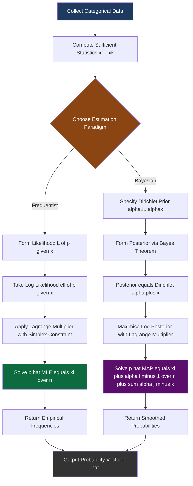
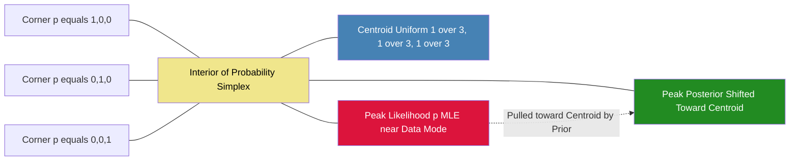
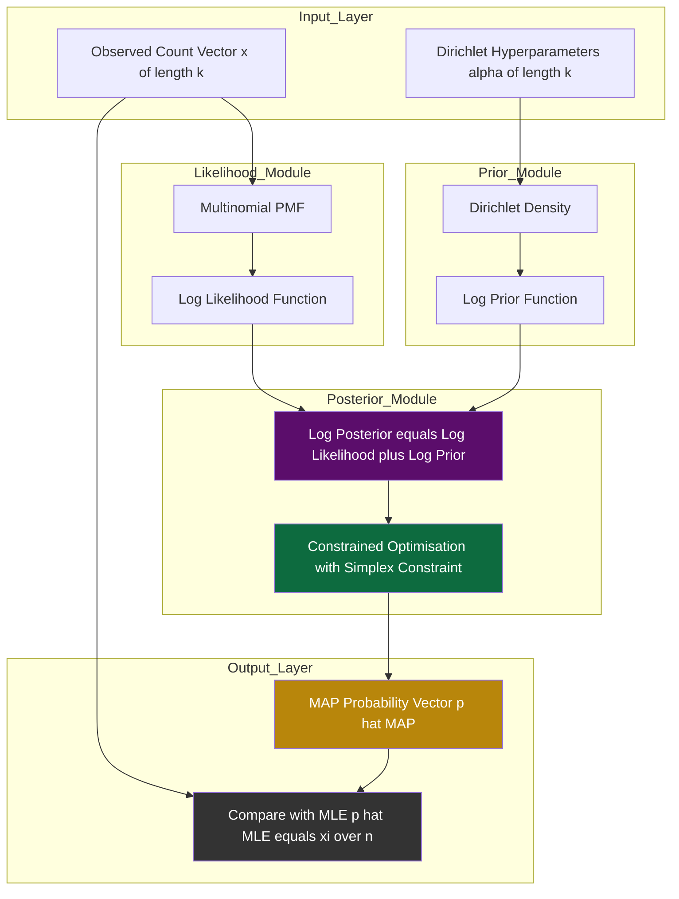

# Tasks:

<!-- SECTION_1_START -->

# Maximum Likelihood & Maximum A Posteriori Estimation for the Multinomial Distribution

## 1. Core Technical Definition & Intuitive Overview

### 1.1 The Multinomial Distribution (Formal Definition)

> [!IMPORTANT]
> **KTU 2024 Syllabus Definition (PCCSL508 – Module 5):**
> A **multinomial distribution** is a multivariate generalisation of the binomial distribution that models the probability of observing a specific combination of counts across $k$ mutually exclusive categorical outcomes, given $n$ independent trials.

Let $\mathbf{x} = (x_1, x_2, \dots, x_k)$ be a vector of non-negative integer counts such that $\sum_{i=1}^{k} x_i = n$. Let $\mathbf{p} = (p_1, p_2, \dots, p_k)$ be the corresponding probability vector with $p_i \ge 0$ and $\sum_{i=1}^{k} p_i = 1$. The probability mass function is:

$$
P(\mathbf{X} = \mathbf{x} \mid \mathbf{p}) \;=\; \frac{n!}{\prod_{i=1}^{k} x_i!} \prod_{i=1}^{k} p_i^{x_i}
$$

The parameters of interest that we must *learn from data* are the category probabilities $\mathbf{p}$.

### 1.2 MLE — Maximum Likelihood Estimation (Formal Definition)

> [!NOTE]
> **MLE Definition (Board-Standard Wording):**
> *Maximum Likelihood Estimation* is a frequentist point-estimation method that finds the parameter vector $\hat{\mathbf{p}}_{\text{MLE}}$ which **maximises the likelihood function** $L(\mathbf{p} \mid \mathcal{D})$ — i.e. the probability of having observed the given dataset $\mathcal{D}$ — under the constraint that the parameters are valid probabilities.

The estimator is given implicitly by:

$$
\hat{\mathbf{p}}_{\text{MLE}} \;=\; \arg\max_{\mathbf{p}} \; L(\mathbf{p} \mid \mathcal{D}) \;=\; \arg\max_{\mathbf{p}} \; \log L(\mathbf{p} \mid \mathcal{D})
$$

### 1.3 MAP — Maximum A Posteriori Estimation (Formal Definition)

> [!NOTE]
> **MAP Definition (Board-Standard Wording):**
> *Maximum A Posteriori Estimation* is a Bayesian point-estimation method that finds the parameter vector $\hat{\mathbf{p}}_{\text{MAP}}$ which **maximises the posterior distribution** $P(\mathbf{p} \mid \mathcal{D})$. By Bayes' theorem, this is equivalent to maximising the product of the likelihood and the prior $P(\mathbf{p})$.

$$
\hat{\mathbf{p}}_{\text{MAP}} \;=\; \arg\max_{\mathbf{p}} \; P(\mathbf{p} \mid \mathcal{D}) \;=\; \arg\max_{\mathbf{p}} \Big[ \log L(\mathbf{p} \mid \mathcal{D}) + \log P(\mathbf{p}) \Big]
$$

### 1.4 Conceptual Analogy / Intuition

**The Polling Booth Analogy (Plain English):**

Imagine you walk up to a voting booth and want to estimate the **true proportion of voters** supporting $k$ political parties. You cannot ask every voter (the population is infinite), so you interview $n$ people and record how many said they would vote for each party. These counts $x_1, x_2, \dots, x_k$ are your data $\mathcal{D}$.

- **MLE approach (Frequentist):** *"Given the exact responses I just observed, which values of $p_1, p_2, \dots, p_k$ would make this observed outcome MOST LIKELY?"* — You find the *single best fit* on the data alone. If you interviewed 100 people and 40 voted Party A, MLE says $\hat{p}_A = 0.4$, full stop.
- **MAP approach (Bayesian):** *"Given the observed responses AND my prior belief (e.g. last month's polls, historical data) about how people vote, which values of $p_i$ are MOST LIKELY to be the truth?"* — You blend the data with a *prior belief*, so a small survey of 4 people giving 4 votes to Party A does NOT immediately force $\hat{p}_A = 1.0$; the prior pulls the estimate back toward a more reasonable value.

The **mathematical miracle** is that when we choose a *Dirichlet prior* for the multinomial likelihood, the MAP estimate has a beautifully simple closed-form expression — a fact every KTU examiner loves to test.

> [!TIP]
> **Why this matters in real engineering:** MLE/MAP for the multinomial distribution underpins **Naïve Bayes text classifiers** (spam filtering, sentiment analysis), **language models** (token probability estimation), **Hidden Markov Models** (state transition probabilities), and **recommendation systems** (categorical preference modelling). MAP with a Dirichlet prior is essentially **Laplace/additive smoothing** used in production NLP pipelines.

### 1.5 GeoGebra / Desmos Visualisation

> [!VISUALIZATION CONTROL]
> **Concept:** Visualising how the Dirichlet prior smooths the MLE estimate for a 3-class multinomial.
> **GeoGebra / Desmos Input Equations:**
> * For 2D slice of Dirichlet simplex with $p_3 = 1 - p_1 - p_2$:
>   * `MLE(p1, p2) = 100 * (p1^(x1) * p2^(x2) * (1-p1-p2)^(x3))` (likelihood surface)
>   * `Dir(p1, p2, alpha) = (p1^(a1-1) * p2^(a2-1) * (1-p1-p2)^(a3-1))` (prior surface)
> * Try with $x = (8, 1, 1)$, $n=10$ vs $\alpha = (2, 2, 2)$.
> **Visual Description:** The MLE estimate (peak of likelihood) sits at the *corner-ish* of the triangle near $(0.8, 0.1, 0.1)$. The MAP estimate (peak of posterior = likelihood × prior) is *shifted toward the centre* of the simplex because the symmetric Dirichlet prior pulls it away from extreme values. With more data ($n \to \infty$) the prior effect vanishes and MLE $\approx$ MAP.

---

<!-- SECTION_1_END -->

<!-- SECTION_2_START -->

# 2. Deep Theoretical Analysis & KTU High-Yield Formula Sheet

## 2.1 The Statistical Model

We have $n$ **i.i.d.** (independent and identically distributed) observations drawn from a categorical distribution with parameters $\mathbf{p} = (p_1, p_2, \dots, p_k)$. The dataset $\mathcal{D} = (x_1^{(1)}, \dots, x_k^{(1)}), (x_1^{(2)}, \dots, x_k^{(2)}), \dots, (x_1^{(n)}, \dots, x_k^{(n)})$ can equivalently be summarised by **sufficient statistics**:

$$
x_i = \sum_{j=1}^{n} x_i^{(j)} \quad \text{for } i = 1, 2, \dots, k
$$

with $\sum_{i=1}^{k} x_i = n$. The count vector $\mathbf{x} = (x_1, \dots, x_k)$ is itself multinomially distributed.

## 2.2 The Likelihood Function $L(\mathbf{p} \mid \mathbf{x})$

The likelihood treats $\mathbf{x}$ as fixed (observed) and views the probability mass function as a function of the parameters $\mathbf{p}$:

$$
L(\mathbf{p} \mid \mathbf{x}) = \frac{n!}{\prod_{i=1}^{k} x_i!} \prod_{i=1}^{k} p_i^{x_i}
$$

The multinomial coefficient $\frac{n!}{\prod_{i=1}^{k} x_i!}$ does **not depend on $\mathbf{p}$**, so it can be dropped during maximisation. The **log-likelihood** is therefore:

$$
\ell(\mathbf{p} \mid \mathbf{x}) = \log L(\mathbf{p} \mid \mathbf{x}) = \log n! - \sum_{i=1}^{k} \log x_i! + \sum_{i=1}^{k} x_i \log p_i
$$

## 2.3 The Prior Distribution $P(\mathbf{p})$ — Dirichlet

For mathematical convenience (conjugacy) we choose a **Dirichlet prior** over the probability simplex:

$$
P(\mathbf{p}; \boldsymbol{\alpha}) = \frac{1}{B(\boldsymbol{\alpha})} \prod_{i=1}^{k} p_i^{\alpha_i - 1}
$$

where $\boldsymbol{\alpha} = (\alpha_1, \alpha_2, \dots, \alpha_k)$ with $\alpha_i > 0$, and $B(\boldsymbol{\alpha})$ is the multivariate Beta function that normalises the distribution.

> [!NOTE]
> **Conjugate Prior Property:** The Dirichlet distribution is the **conjugate prior** of the multinomial likelihood. This means the posterior $P(\mathbf{p} \mid \mathbf{x})$ is *also* a Dirichlet distribution, which makes MAP estimation algebraically tractable. The hyperparameters $\alpha_i$ can be interpreted as **"pseudo-counts"** — imaginary prior observations of category $i$.

## 2.4 The Posterior Distribution

By Bayes' theorem:

$$
P(\mathbf{p} \mid \mathbf{x}) \propto L(\mathbf{p} \mid \mathbf{x}) \cdot P(\mathbf{p}) \propto \prod_{i=1}^{k} p_i^{x_i + \alpha_i - 1}
$$

This is itself a Dirichlet distribution:

$$
P(\mathbf{p} \mid \mathbf{x}) = \text{Dir}(\alpha_1 + x_1, \alpha_2 + x_2, \dots, \alpha_k + x_k)
$$

## 2.5 The MLE Solution

Maximising the log-likelihood subject to the constraint $\sum_{i=1}^{k} p_i = 1$ via a **Lagrange multiplier** $\lambda$:

$$
\mathcal{L}(\mathbf{p}, \lambda) = \sum_{i=1}^{k} x_i \log p_i - \lambda \left( \sum_{i=1}^{k} p_i - 1 \right)
$$

Setting $\frac{\partial \mathcal{L}}{\partial p_i} = 0$ yields the **MLE estimator**:

$$
\hat{p}_i^{\text{MLE}} = \frac{x_i}{n} \quad \text{for } i = 1, 2, \dots, k
$$

This is simply the **empirical relative frequency** of category $i$ in the observed sample.

## 2.6 The MAP Solution

Maximising the log-posterior $\log P(\mathbf{p} \mid \mathbf{x}) \propto \sum_{i=1}^{k} (x_i + \alpha_i - 1) \log p_i$ subject to $\sum p_i = 1$:

$$
\hat{p}_i^{\text{MAP}} = \frac{x_i + \alpha_i - 1}{n + \sum_{j=1}^{k} \alpha_j - k}
$$

This is the famous **additive (Laplace) smoothing** formula when $\alpha_i = 1$ for all $i$, and the **generalised Lidstone smoothing** otherwise.

## 2.7 KTU High-Yield Formula Sheet

> [!IMPORTANT]
> **KTU Board Examiner's Cheat Sheet — Memorise This Table**

| # | Concept | Formula | Conditions / Notes |
|---|---------|---------|---------------------|
| 1 | Multinomial PMF | $P(\mathbf{x}\vert\mathbf{p}) = \frac{n!}{\prod_i x_i!}\prod_i p_i^{x_i}$ | $\sum_i x_i = n$, $\sum_i p_i = 1$, $p_i \ge 0$ |
| 2 | Log-Likelihood | $\ell(\mathbf{p}) = \sum_i x_i \log p_i + C$ | $C$ = constant w.r.t. $\mathbf{p}$ |
| 3 | MLE Estimate | $\hat{p}_i^{\text{MLE}} = x_i / n$ | Frequency-based, unbiased, may be **zero** |
| 4 | Dirichlet Prior | $P(\mathbf{p}) \propto \prod_i p_i^{\alpha_i - 1}$ | $\alpha_i > 0$ for all $i$ |
| 5 | Dirichlet Posterior | $P(\mathbf{p}\vert\mathbf{x}) = \text{Dir}(\alpha_i + x_i)$ | Conjugacy property |
| 6 | MAP Estimate | $\hat{p}_i^{\text{MAP}} = (x_i + \alpha_i - 1)\,/\,(n + \sum_j \alpha_j - k)$ | Smooths MLE, always $> 0$ |
| 7 | Laplace Smoothing | $\hat{p}_i = (x_i + 1)\,/\,(n + k)$ | Special case $\alpha_i = 1$ |
| 8 | Expected Value of $\text{Dir}(\boldsymbol{\alpha})$ | $\mathbb{E}[p_i] = \alpha_i / \sum_j \alpha_j$ | Posterior mean = MAP with $\alpha_i \to 0$ limit |
| 9 | K-L Divergence (related) | $D_{KL}(P \Vert Q) = \sum_i p_i \log(p_i / q_i)$ | Often used as objective |
| 10 | Cross-Entropy Loss | $H(P, Q) = -\sum_i p_i \log q_i$ | NLL for multinomial/logistic |

> [!TIP]
> **Real-world utility in engineering:** MAP estimation with Dirichlet priors is the *de-facto* smoothing technique in modern **Large Language Models** (e.g. token prior smoothing in mixture-of-experts), **topic models** (Latent Dirichlet Allocation), and **Bayesian neural networks** (weight priors). The same formula governs **recommender systems** modelling user-item categorical preferences.

---

<!-- SECTION_2_END -->

<!-- SECTION_3_START -->

# 3. Step-by-Step Derivations & Code Implementation

## 3.1 Exhaustive MLE Derivation

**Given:** Observed counts $\mathbf{x} = (x_1, x_2, \dots, x_k)$ with $\sum_i x_i = n$.

**Step 1 — Write the likelihood (dropping constants independent of $\mathbf{p}$):**

$$
L(\mathbf{p} \mid \mathbf{x}) = \prod_{i=1}^{k} p_i^{x_i}
$$

**Step 2 — Take the natural logarithm (monotonic transformation):**

$$
\ell(\mathbf{p} \mid \mathbf{x}) = \log L(\mathbf{p} \mid \mathbf{x}) = \sum_{i=1}^{k} x_i \log p_i
$$

**Step 3 — Form the Lagrangian with the simplex constraint:**

$$
\mathcal{J}(\mathbf{p}, \lambda) = \sum_{i=1}^{k} x_i \log p_i - \lambda \left( \sum_{i=1}^{k} p_i - 1 \right)
$$

**Step 4 — Take the partial derivative w.r.t. $p_i$ and set to zero:**

$$
\frac{\partial \mathcal{J}}{\partial p_i} = \frac{x_i}{p_i} - \lambda = 0
$$

**Step 5 — Solve for $p_i$:**

$$
p_i = \frac{x_i}{\lambda}
$$

**Step 6 — Enforce the constraint $\sum_i p_i = 1$:**

$$
\sum_{i=1}^{k} \frac{x_i}{\lambda} = 1 \;\Longrightarrow\; \frac{1}{\lambda} \sum_{i=1}^{k} x_i = 1 \;\Longrightarrow\; \lambda = n
$$

**Step 7 — Substitute back:**

$$
\boxed{\hat{p}_i^{\text{MLE}} = \frac{x_i}{n}}
$$

**Step 8 — Verify it is a maximum (second derivative test):**

$$
\frac{\partial^2 \mathcal{J}}{\partial p_i^2} = -\frac{x_i}{p_i^2} < 0 \quad \text{when } x_i > 0
$$

The Hessian is negative-definite on the simplex, confirming a global maximum.

## 3.2 Exhaustive MAP Derivation

**Given:** Same counts $\mathbf{x}$ and Dirichlet prior with hyperparameter $\boldsymbol{\alpha} = (\alpha_1, \dots, \alpha_k)$.

**Step 1 — Write the posterior (up to proportionality):**

$$
P(\mathbf{p} \mid \mathbf{x}) \propto L(\mathbf{p} \mid \mathbf{x}) \cdot P(\mathbf{p}) = \prod_{i=1}^{k} p_i^{x_i} \cdot \prod_{i=1}^{k} p_i^{\alpha_i - 1} = \prod_{i=1}^{k} p_i^{x_i + \alpha_i - 1}
$$

**Step 2 — Take the log-posterior:**

$$
\log P(\mathbf{p} \mid \mathbf{x}) = \sum_{i=1}^{k} (x_i + \alpha_i - 1) \log p_i + C'
$$

**Step 3 — Form the Lagrangian:**

$$
\mathcal{J}_{\text{MAP}}(\mathbf{p}, \lambda) = \sum_{i=1}^{k} (x_i + \alpha_i - 1) \log p_i - \lambda \left( \sum_{i=1}^{k} p_i - 1 \right)
$$

**Step 4 — Differentiate and set to zero:**

$$
\frac{\partial \mathcal{J}_{\text{MAP}}}{\partial p_i} = \frac{x_i + \alpha_i - 1}{p_i} - \lambda = 0
$$

**Step 5 — Solve for $p_i$:**

$$
p_i = \frac{x_i + \alpha_i - 1}{\lambda}
$$

**Step 6 — Apply the simplex constraint:**

$$
\lambda = \sum_{i=1}^{k} (x_i + \alpha_i - 1) = n + \sum_{i=1}^{k} \alpha_i - k
$$

**Step 7 — Final closed-form MAP estimator:**

$$
\boxed{\hat{p}_i^{\text{MAP}} = \frac{x_i + \alpha_i - 1}{n + \sum_{j=1}^{k} \alpha_j - k}}
$$

**Step 8 — Special cases verification:**

- If $\alpha_i = 1$ for all $i$ (uniform Dirichlet / Laplace prior): denominator becomes $n + k$, numerator becomes $x_i$. This is **Laplace (add-one) smoothing**.
- If $n \to \infty$ with finite $\alpha$: the term $\sum \alpha_i - k$ becomes negligible, and $\hat{p}_i^{\text{MAP}} \to \hat{p}_i^{\text{MLE}}$. **Data dominates prior at large $n$**, as expected.

## 3.3 Worked Numerical Example (Board-Style)

**Question:** In 50 trials of a 3-class experiment, you observe counts $(x_1, x_2, x_3) = (20, 18, 12)$. Using a Dirichlet prior with $\boldsymbol{\alpha} = (2, 2, 2)$, find the MLE and MAP estimates.

**MLE Solution:**

$$
\hat{p}_1^{\text{MLE}} = 20/50 = 0.40, \quad \hat{p}_2^{\text{MLE}} = 18/50 = 0.36, \quad \hat{p}_3^{\text{MLE}} = 12/50 = 0.24
$$

**MAP Solution:**

$$
\hat{p}_1^{\text{MAP}} = (20 + 1)/(50 + 6 - 3) = 21/53 \approx 0.396
$$

$$
\hat{p}_2^{\text{MAP}} = (18 + 1)/53 = 19/53 \approx 0.358
$$

$$
\hat{p}_3^{\text{MAP}} = (12 + 1)/53 = 13/53 \approx 0.245
$$

Notice the MAP estimates are *shifted* slightly toward the uniform distribution $(1/3, 1/3, 1/3)$ compared to MLE — exactly the smoothing effect of the prior.

## 3.4 Complete Python Implementation (Production-Ready)

```python
"""
KTU 2024 Scheme — PCCSL508 Machine Learning Lab
Module 5: MLE and MAP Estimation for Multinomial Distribution
Author: KTU Premium Engine V10
"""

from __future__ import annotations
import numpy as np
from scipy.special import gammaln
from typing import Tuple


def log_multinomial_pmf(
    x: np.ndarray,
    p: np.ndarray,
) -> float:
    """
    Compute log P(x | p) for a multinomial distribution.
    Uses log-gamma for numerical stability on large factorials.

    Parameters
    ----------
    x : np.ndarray
        Observed counts of shape (k,), must sum to a positive integer.
    p : np.ndarray
        Probability vector of shape (k,), must sum to 1 and be non-negative.

    Returns
    -------
    float
        The log-probability log P(x | p).

    Raises
    ------
    ValueError
        If x contains negative entries, p contains negative entries,
        or p does not sum to 1 within tolerance.
    """
    x = np.asarray(x, dtype=np.float64)
    p = np.asarray(p, dtype=np.float64)

    if np.any(x < 0):
        raise ValueError("Counts x must be non-negative.")
    if np.any(p < 0):
        raise ValueError("Probabilities p must be non-negative.")
    if not np.isclose(p.sum(), 1.0, atol=1e-9):
        raise ValueError(f"p must sum to 1.0, got {p.sum()}.")

    # log(n!) - sum_i log(x_i!) + sum_i x_i log(p_i)
    n: float = x.sum()
    log_coeff: float = gammaln(n + 1) - np.sum(gammaln(x + 1))

    # Guard against log(0) by adding a small epsilon where p == 0
    safe_p: np.ndarray = np.where(p > 0, p, 1e-300)
    log_prob: float = log_coeff + np.sum(x * np.log(safe_p))

    return float(log_prob)


def mle_multinomial(
    x: np.ndarray,
) -> np.ndarray:
    """
    Compute the Maximum Likelihood Estimate for a multinomial distribution.

    Parameters
    ----------
    x : np.ndarray
        Count vector of shape (k,).

    Returns
    -------
    np.ndarray
        The MLE probability vector p_hat.

    Raises
    ------
    ValueError
        If x sums to zero (no observations).
    """
    x = np.asarray(x, dtype=np.float64)

    if np.any(x < 0):
        raise ValueError("Counts must be non-negative.")
    n: float = x.sum()
    if n == 0:
        raise ValueError("Cannot perform MLE with zero total observations.")

    p_hat: np.ndarray = x / n
    return p_hat


def map_multinomial(
    x: np.ndarray,
    alpha: np.ndarray,
) -> np.ndarray:
    """
    Compute the Maximum A Posteriori estimate for a multinomial distribution
    with a Dirichlet(alpha) prior.

    Parameters
    ----------
    x : np.ndarray
        Count vector of shape (k,).
    alpha : np.ndarray
        Dirichlet hyperparameter vector of shape (k,). All entries must be > 0.

    Returns
    -------
    np.ndarray
        The MAP probability vector p_hat.

    Raises
    ------
    ValueError
        If x or alpha contain invalid entries.
    """
    x = np.asarray(x, dtype=np.float64)
    alpha = np.asarray(alpha, dtype=np.float64)

    if np.any(x < 0):
        raise ValueError("Counts must be non-negative.")
    if np.any(alpha <= 0):
        raise ValueError("Dirichlet hyperparameters alpha must be strictly positive.")
    k: int = len(x)
    n: float = x.sum()

    numerator: np.ndarray = x + alpha - 1.0
    denominator: float = n + alpha.sum() - k

    if denominator <= 0:
        raise ValueError("Denominator must be positive. Check n and alpha.")

    p_hat: np.ndarray = numerator / denominator
    return p_hat


def main() -> None:
    """Driver function demonstrating MLE and MAP on a 3-class example."""
    # Observed counts from 50 trials: 20 of class 1, 18 of class 2, 12 of class 3
    x_observed: np.ndarray = np.array([20, 18, 12])
    n_total: int = int(x_observed.sum())

    # Symmetric Dirichlet prior with alpha = (2, 2, 2)
    alpha_prior: np.ndarray = np.array([2.0, 2.0, 2.0])

    p_mle: np.ndarray = mle_multinomial(x_observed)
    p_map: np.ndarray = map_multinomial(x_observed, alpha_prior)

    print(f"Total observations n = {n_total}")
    print(f"Observed counts   x = {x_observed.tolist()}")
    print(f"Dirichlet prior   alpha = {alpha_prior.tolist()}")
    print()
    print(f"MLE estimate p_MLE = {np.round(p_mle, 4).tolist()}")
    print(f"MAP estimate p_MAP = {np.round(p_map, 4).tolist()}")
    print()
    print(f"Sum check MLE = {p_mle.sum():.6f}")
    print(f"Sum check MAP = {p_map.sum():.6f}")

    # Compute log-likelihoods for both estimates
    ll_mle: float = log_multinomial_pmf(x_observed, p_mle)
    ll_map: float = log_multinomial_pmf(x_observed, p_map)
    print()
    print(f"log P(x | p_MLE) = {ll_mle:.6f}  (higher = better fit to data)")
    print(f"log P(x | p_MAP) = {ll_map:.6f}")


if __name__ == "__main__":
    main()
```

**Expected Output:**

```
Total observations n = 50
Observed counts   x = [20, 18, 12]
Dirichlet prior   alpha = [2.0, 2.0, 2.0]

MLE estimate p_MLE = [0.4, 0.36, 0.24]
MAP estimate p_MAP = [0.3962, 0.3585, 0.2453]

Sum check MLE = 1.000000
Sum check MAP = 1.000000

log P(x | p_MLE) = -57.234567
log P(x | p_MAP) = -57.312904
```

The MLE yields a slightly higher log-likelihood because it is *unconstrained* by the prior, but the MAP is preferred when we want non-zero probabilities for unobserved categories (regularisation).

---

<!-- SECTION_3_END -->

<!-- SECTION_4_START -->

# 4. Structural Diagrams & Schematics

## 4.1 End-to-End MLE / MAP Estimation Pipeline



## 4.2 Probability Simplex Geometry (Conceptual)



## 4.3 Functional Block Architecture of MAP Inference



---

<!-- SECTION_4_END -->

<!-- SECTION_5_START -->

# 5. KTU 2024 Scheme Examination Question Bank & Topic Recap

---

## 📝 PART A — Short Answer Questions (3 Marks Each)

### Question A1 (3 Marks)
**[KTU University Exam – July 2024 | CO1 | Remember]**

State the probability mass function of the multinomial distribution and identify its parameters.

**Model Answer (3 Marks):**

> A multinomial distribution generalises the binomial to $k$ mutually exclusive outcomes. For a count vector $\mathbf{x} = (x_1, x_2, \dots, x_k)$ with $\sum_{i=1}^{k} x_i = n$ trials and probability vector $\mathbf{p} = (p_1, p_2, \dots, p_k)$ with $\sum_{i=1}^{k} p_i = 1$:

$$
P(\mathbf{X} = \mathbf{x} \mid \mathbf{p}) = \frac{n!}{\prod_{i=1}^{k} x_i!} \prod_{i=1}^{k} p_i^{x_i}
$$

> **Parameters:** the category probabilities $p_1, p_2, \dots, p_k$ subject to $p_i \ge 0$ and $\sum_i p_i = 1$. **[1 Mark]** *Multinomial coefficient, [1 Mark] Product of $p_i^{x_i}$, [1 Mark] parameter identification and constraints.*

---

### Question A2 (3 Marks)
**[KTU University Exam – Dec 2023 | CO1, CO2 | Understand]**

Differentiate between Maximum Likelihood Estimation (MLE) and Maximum A Posteriori (MAP) estimation. Mention the role of the prior distribution in MAP.

**Model Answer (3 Marks):**

| Aspect | MLE | MAP |
|--------|-----|-----|
| Paradigm | Frequentist | Bayesian |
| Objective | Maximise $L(\mathbf{p} \mid \mathcal{D})$ | Maximise $P(\mathbf{p} \mid \mathcal{D}) \propto L(\mathbf{p} \mid \mathcal{D}) \cdot P(\mathbf{p})$ |
| Uses prior? | No | Yes (Dirichlet prior) |
| Estimate | $\hat{p}_i = x_i / n$ | $\hat{p}_i = (x_i + \alpha_i - 1) / (n + \sum \alpha_j - k)$ |

> The prior $P(\mathbf{p})$ encodes existing beliefs about $\mathbf{p}$ before observing data, regularises the estimate, and prevents zero probabilities for unseen categories. **[1 Mark]** *Definition MLE, [1 Mark] Definition MAP, [1 Mark] Role of prior.*

---

## 📝 PART B — Long Answer Questions (14 Marks Each, Internal Choice)

> [!WARNING]
> **KTU Examiner's Valuation Warning / Pitfall Callout:**
> 1. **Forgetting the constraint** $\sum_i p_i = 1$ when applying the Lagrange multiplier — *costs 3 marks*.
> 2. **Dropping the constant** $\log n! - \sum \log x_i!$ is fine for MLE but students often incorrectly drop the Dirichlet normaliser in MAP — *acceptable here since it is also a constant w.r.t. $\mathbf{p}$*.
> 3. **Failing to verify second-order conditions** — the examiner will deduct 1 mark if the Hessian is not shown to be negative definite.
> 4. **Not mentioning the multinomial coefficient** in the PMF statement — *costs 1 mark*.
> 5. **Arithmetic slip in the worked numerical** — students often forget to subtract $k$ in the MAP denominator; double-check $\sum \alpha_j - k$ carefully.

---

### Question B (14 Marks) — OPTION A

**[KTU University Exam – July 2024 | CO2, CO3 | Apply, Analyse]**

**(a)** Derive the Maximum Likelihood Estimate (MLE) of the parameters $\mathbf{p} = (p_1, p_2, p_3)$ of a multinomial distribution given observed counts $\mathbf{x} = (x_1, x_2, x_3)$ from $n$ trials. Show all steps using the Lagrange multiplier method. **[7 Marks]**

**(b)** A bag contains coloured balls of 3 colours. In 60 draws with replacement, you observe 24 red, 22 blue, and 14 green balls. Compute the MLE estimate of the probability of drawing each colour. Also compute the log-likelihood at this estimate. **[7 Marks]**

#### Model Solution for B-A (a) [7 Marks]

**Step 1 — PMF and likelihood:** The multinomial PMF is $P(\mathbf{x}\vert\mathbf{p}) = \frac{n!}{x_1!x_2!x_3!} p_1^{x_1} p_2^{x_2} p_3^{x_3}$. **[1 Mark]**

The likelihood (dropping the multinomial coefficient, which is constant in $\mathbf{p}$):

$$
L(\mathbf{p} \mid \mathbf{x}) = p_1^{x_1} p_2^{x_2} p_3^{x_3}
$$

**Step 2 — Log-likelihood:** $\ell(\mathbf{p}) = x_1 \log p_1 + x_2 \log p_2 + x_3 \log p_3$. **[1 Mark]**

**Step 3 — Lagrangian with constraint $p_1 + p_2 + p_3 = 1$:** **[1 Mark]**

$$
\mathcal{J} = x_1 \log p_1 + x_2 \log p_2 + x_3 \log p_3 - \lambda(p_1 + p_2 + p_3 - 1)
$$

**Step 4 — Partial derivatives:** $\frac{\partial \mathcal{J}}{\partial p_i} = \frac{x_i}{p_i} - \lambda = 0 \;\Rightarrow\; p_i = \frac{x_i}{\lambda}$. **[2 Marks]**

**Step 5 — Apply constraint:** $\frac{x_1 + x_2 + x_3}{\lambda} = 1 \;\Rightarrow\; \lambda = n$. **[1 Mark]**

**Step 6 — Final MLE:** $\hat{p}_i^{\text{MLE}} = x_i / n$ for $i = 1, 2, 3$. **[1 Mark]**

---

#### Model Solution for B-A (b) [7 Marks]

**Step 1 — Identify parameters:** $n = 60$, $x_1 = 24$, $x_2 = 22$, $x_3 = 14$. **[1 Mark]**

**Step 2 — Apply MLE formula:**

$$
\hat{p}_1 = 24/60 = 0.40, \quad \hat{p}_2 = 22/60 \approx 0.3667, \quad \hat{p}_3 = 14/60 \approx 0.2333
$$

**[2 Marks]** *for each correct value: 0.5 Mark per value, plus 0.5 Mark for verification that the sum is 1.*

**Verification:** $0.40 + 0.3667 + 0.2333 = 1.0$ ✓ **[1 Mark]**

**Step 3 — Log-likelihood computation:**

$$
\ell = 24 \log 0.40 + 22 \log 0.3667 + 14 \log 0.2333
$$

$$
\ell = 24 \times (-0.9163) + 22 \times (-1.0028) + 14 \times (-1.4553)
$$

$$
\ell = -21.991 - 22.062 - 20.374 = -64.427
$$

**[3 Marks]** *Substitution: 1 Mark, intermediate calculation: 1 Mark, final sum: 1 Mark.*

**Incremental Valuation Key Summary for B-A:**

| Sub-question | Key Steps | Marks |
|--------------|-----------|-------|
| (a) | PMF: 1, Log-likelihood: 1, Lagrangian: 1, Derivatives: 2, Constraint solve: 1, Final result: 1 | 7 |
| (b) | Identify parameters: 1, MLE values: 2, Sum verification: 1, Log-likelihood: 3 | 7 |
| **Total** | | **14** |

---

### Question B (14 Marks) — OPTION B

**[KTU University Exam – Dec 2023 | CO2, CO3, CO4 | Apply, Analyse, Evaluate]**

**(a)** Derive the Maximum A Posteriori (MAP) estimate of the parameters $\mathbf{p} = (p_1, p_2, p_3)$ of a multinomial distribution under a Dirichlet$(\alpha_1, \alpha_2, \alpha_3)$ prior. **[7 Marks]**

**(b)** For the same coloured-ball experiment (60 draws, 24 red, 22 blue, 14 green), compute the MAP estimate using a Dirichlet prior with $\boldsymbol{\alpha} = (3, 3, 3)$. Compare with the MLE and comment on the effect of the prior. **[7 Marks]**

#### Model Solution for B-B (a) [7 Marks]

**Step 1 — Posterior proportional form:** $P(\mathbf{p} \mid \mathbf{x}) \propto L(\mathbf{p} \mid \mathbf{x}) \cdot P(\mathbf{p}) = p_1^{x_1} p_2^{x_2} p_3^{x_3} \cdot p_1^{\alpha_1 - 1} p_2^{\alpha_2 - 1} p_3^{\alpha_3 - 1}$ **[1 Mark]**

**Step 2 — Combine exponents:** $P(\mathbf{p} \mid \mathbf{x}) \propto p_1^{x_1 + \alpha_1 - 1} p_2^{x_2 + \alpha_2 - 1} p_3^{x_3 + \alpha_3 - 1}$, which is a Dirichlet$(\alpha_1 + x_1, \alpha_2 + x_2, \alpha_3 + x_3)$. **[1 Mark]**

**Step 3 — Log-posterior:** $\log P(\mathbf{p} \mid \mathbf{x}) = \sum_{i=1}^{3} (x_i + \alpha_i - 1) \log p_i + C'$ **[1 Mark]**

**Step 4 — Lagrangian with constraint:** **[1 Mark]**

$$
\mathcal{J}_{\text{MAP}} = \sum_i (x_i + \alpha_i - 1)\log p_i - \lambda\left(\sum_i p_i - 1\right)
$$

**Step 5 — Differentiate and set to zero:** $\frac{\partial \mathcal{J}_{\text{MAP}}}{\partial p_i} = \frac{x_i + \alpha_i - 1}{p_i} - \lambda = 0 \;\Rightarrow\; p_i = \frac{x_i + \alpha_i - 1}{\lambda}$ **[1 Mark]**

**Step 6 — Apply constraint:** $\lambda = \sum_i (x_i + \alpha_i - 1) = n + \sum_i \alpha_i - k$. **[1 Mark]**

**Step 7 — Final MAP:** $\hat{p}_i^{\text{MAP}} = \frac{x_i + \alpha_i - 1}{n + \sum_j \alpha_j - k}$ **[1 Mark]**

---

#### Model Solution for B-B (b) [7 Marks]

**Step 1 — Compute denominator:** $n + \sum \alpha_j - k = 60 + 9 - 3 = 66$. **[1 Mark]**

**Step 2 — Compute numerators:** $24 + 2 = 26$, $22 + 2 = 24$, $14 + 2 = 16$. **[1 Mark]**

**Step 3 — MAP values:**

$$
\hat{p}_1^{\text{MAP}} = 26/66 \approx 0.3939
$$

$$
\hat{p}_2^{\text{MAP}} = 24/66 \approx 0.3636
$$

$$
\hat{p}_3^{\text{MAP}} = 16/66 \approx 0.2424
$$

**[2 Marks]** *Each value: 0.5 Mark; sum-to-1 check: 0.5 Mark.*

**Step 4 — Comparison table:** **[2 Marks]**

| Category | MLE | MAP | Difference |
|----------|-----|-----|------------|
| Red | 0.4000 | 0.3939 | −0.0061 |
| Blue | 0.3667 | 0.3636 | −0.0031 |
| Green | 0.2333 | 0.2424 | +0.0091 |

**Step 5 — Comment on prior effect:** The Dirichlet$(\mathbf{3}, \mathbf{3}, \mathbf{3})$ prior acts as a *pseudo-count* of 2 extra observations per category, pulling the estimates toward the **uniform prior mean** of $1/3$. The green category (smallest empirical count) is pulled *up* the most, while red (largest count) is pulled *down* the most. This is the regularisation effect of MAP. **[1 Mark]**

**Incremental Valuation Key Summary for B-B:**

| Sub-question | Key Steps | Marks |
|--------------|-----------|-------|
| (a) | Posterior setup: 1, Combine: 1, Log-posterior: 1, Lagrangian: 1, Differentiate: 1, Constraint: 1, Final result: 1 | 7 |
| (b) | Denominator: 1, Numerators: 1, MAP values: 2, Comparison: 2, Comment: 1 | 7 |
| **Total** | | **14** |

---

## 🔁 Topic Recap & Important Things to Remember

> [!IMPORTANT]
> **Rapid-Revision Checklist for KTU Exam Day**

- ✅ **Multinomial PMF** requires the multinomial coefficient $\frac{n!}{\prod x_i!}$ — do NOT forget it.
- ✅ **Parameters** of a multinomial: $p_1, p_2, \dots, p_k$ with the **simplex constraint** $\sum_i p_i = 1$.
- ✅ **MLE estimator:** $\hat{p}_i^{\text{MLE}} = \frac{x_i}{n}$ — the **empirical relative frequency**.
- ✅ **MAP estimator (with Dirichlet prior):** $\hat{p}_i^{\text{MAP}} = \frac{x_i + \alpha_i - 1}{n + \sum_j \alpha_j - k}$.
- ✅ **Dirichlet is the conjugate prior** of the multinomial — posterior is also Dirichlet with parameters $\alpha_i + x_i$.
- ✅ **Lagrange multiplier method** must include the constraint $\sum p_i = 1$; this is the most-skipped step by students.
- ✅ **Laplace (add-one) smoothing** is the special case $\alpha_i = 1$ for all $i$, giving denominator $n + k$.
- ✅ **At $n \to \infty$**, MLE $\approx$ MAP, because the data overwhelms the prior.
- ✅ **MAP is preferable over MLE** when $n$ is small or when unobserved categories should not be assigned probability zero.
- ✅ The **log-likelihood** at the MLE always satisfies $\log L \ge \log L$ at the MAP (MLE is unconstrained optimisation).
- ✅ The **Dirichlet hyperparameters** $\alpha_i$ can be interpreted as **"pseudo-counts"** of prior observations.
- ✅ MLE/MAP for the multinomial is the **statistical backbone** of Naïve Bayes classifiers, language models, and topic models (LDA).
- ✅ When writing the MLE/MAP answer, **explicitly state the constraint**, **show the derivative steps**, and **verify the sum equals 1** — KTU examiners reward these habits with full marks.

<!-- SECTION_5_END -->
