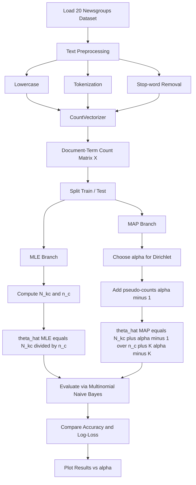

# Use MLE and MAP to estimate the parameters of a multinomial distribution on the 20 Newsgroups dataset. Explore the impact of different priors on the estimation.

<!-- SECTION_1_START -->
# 1. Core Technical Definition & Intuitive Overview

## 1.1 The Multinomial Distribution

A **Multinomial Distribution** is a discrete probability distribution that generalizes the binomial distribution to experiments where each trial can result in one of $K$ mutually exclusive categories. It models the probability of observing a specific count of outcomes for each category across $n$ independent trials.

**Formal Definition (KTU 2024 Syllabus Terminology):**
Given a random experiment with $K$ possible outcomes $\{1, 2, \ldots, K\}$ and corresponding probabilities $\boldsymbol{\theta} = (\theta_1, \theta_2, \ldots, \theta_K)$, where $\sum_{k=1}^{K} \theta_k = 1$ and $\theta_k \geq 0$, the probability mass function of the multinomial distribution is:

$$
P(X_1 = x_1, \ldots, X_K = x_K \mid \boldsymbol{\theta}) = \frac{n!}{\prod_{k=1}^{K} x_k!} \prod_{k=1}^{K} \theta_k^{x_k}
$$

subject to the constraint $\sum_{k=1}^{K} x_k = n$.

> [!IMPORTANT]
> **Why Multinomial for Text Classification?**
> In text classification, a document is treated as a sequence of $n$ words, where each word is a "trial" that can land in one of $K$ vocabulary words. The vector of class-conditional word probabilities $\theta_{k \mid c}$ is exactly a **multinomial parameter vector** for class $c$.

## 1.2 Maximum Likelihood Estimation (MLE)

**Maximum Likelihood Estimation (MLE)** is a frequentist parameter estimation technique that finds the parameter values $\boldsymbol{\theta}$ that maximize the likelihood function $P(\mathcal{D} \mid \boldsymbol{\theta})$ — i.e., the probability of observing the given data under those parameters.

> [!NOTE]
> **Intuitive Analogy — "The Greedy Counter":**
> Imagine you roll a loaded $K$-sided die 1000 times and count how many times each face appears. MLE is the act of **looking at the empirical proportions and declaring them the truth**. If face 3 appeared 250 times, MLE says $\hat{\theta}_3 = 0.25$, period. No priors, no beliefs, just raw counting.

## 1.3 Maximum A Posteriori (MAP) Estimation

**Maximum A Posteriori (MAP) Estimation** is a Bayesian technique that finds the parameter values $\boldsymbol{\theta}$ that maximize the **posterior probability** $P(\boldsymbol{\theta} \mid \mathcal{D})$, which is proportional to the likelihood multiplied by the prior $P(\boldsymbol{\theta})$:

$$
\hat{\boldsymbol{\theta}}_{\text{MAP}} = \arg\max_{\boldsymbol{\theta}} \; P(\mathcal{D} \mid \boldsymbol{\theta}) \cdot P(\boldsymbol{\theta})
$$

> [!NOTE]
> **Intuitive Analogy — "The Counter with a Belief":**
> Before observing any die rolls, you have a *belief* (the prior) about how the die behaves. MAP combines your prior belief with the observed counts. If the prior says the die is fair (uniform), MAP will "pull" the estimates toward $1/K$, preventing any single $\hat{\theta}_k$ from being exactly zero. The strength of the prior is controlled by a **concentration hyperparameter** $\alpha$.

## 1.4 The Dirichlet Prior

The **Dirichlet Distribution** is the conjugate prior of the multinomial distribution. It is parameterized by a concentration vector $\boldsymbol{\alpha} = (\alpha_1, \alpha_2, \ldots, \alpha_K)$, all $\alpha_k > 0$:

$$
P(\boldsymbol{\theta} \mid \boldsymbol{\alpha}) = \frac{1}{B(\boldsymbol{\alpha})} \prod_{k=1}^{K} \theta_k^{\alpha_k - 1}
$$

where $B(\boldsymbol{\alpha})$ is the multivariate Beta function acting as a normalizing constant.

- **Symmetric Dirichlet** with $\alpha_k = \alpha$ for all $k$ is the most common choice, encoding a uniform prior belief.
- **Asymmetric Dirichlet** allows encoding domain knowledge (e.g., "rare words are more common than specific technical jargon").

> [!IMPORTANT]
> **Laplace Smoothing is MAP with $\alpha = 1$:**
> Adding $+1$ to every count in MLE — known as **additive / Laplace smoothing** — is mathematically identical to MAP estimation with a symmetric Dirichlet prior where $\alpha_k = 1$ for all $k$. This is one of the most exam-frequent facts in KTU ML modules.

## 1.5 The 20 Newsgroups Dataset

The **20 Newsgroups Dataset** is a canonical benchmark in NLP and ML, containing approximately **18,846 newsgroup posts** evenly distributed across **20 different topic categories** (e.g., `alt.atheism`, `comp.graphics`, `rec.sport.baseball`, `sci.space`, `talk.politics.misc`). It is bundled with `scikit-learn` and is the standard playground for multinomial Naive Bayes and Bayesian text classifiers.

> [!VISUALIZATION CONTROL]
> **Concept:** Dirichlet Distribution Density over a 3-Simplex
> **GeoGebra / Desmos Input Equations:**
> * `theta_1 = u, theta_2 = v, theta_3 = 1 - u - v` (simplex constraint)
> * Dirichlet(1, 1, 1): `f(u, v) = 2` (uniform over the simplex)
> * Dirichlet(0.5, 0.5, 0.5): `f(u, v) = 0.5 / (sqrt(u v (1-u-v)))` (spiked at corners)
> * Dirichlet(5, 5, 5): `f(u, v) = 60 u^4 v^4 (1-u-v)^4` (concentrated at center)
> **Visual Description:** The student should observe a 2D triangular region (the 3-simplex) where $\alpha < 1$ pushes mass to the corners, $\alpha = 1$ yields a flat plateau, and $\alpha > 1$ concentrates mass near the centroid.

---

# 2. Deep Theoretical Analysis & KTU High-Yield Formula Sheet

## 2.1 The Multinomial Likelihood for Text

For a single document $d$ containing word counts $\mathbf{x}^{(d)} = (x_1^{(d)}, \ldots, x_K^{(d)})$ over a vocabulary of size $K$, the multinomial likelihood is:

$$
P(\mathbf{x}^{(d)} \mid \boldsymbol{\theta}_c) = \frac{\left( \sum_k x_k^{(d)} \right)!}{\prod_k x_k^{(d)}!} \prod_{k=1}^{K} \theta_{k \mid c}^{x_k^{(d)}}
$$

Across a class $c$ with $N_c$ documents, the log-likelihood becomes:

$$
\ell(\boldsymbol{\theta}_c) = \sum_{d \in c} \sum_{k=1}^{K} x_k^{(d)} \log \theta_{k \mid c} + \text{(constant factorial terms)}
$$

## 2.2 MLE Step-by-Step Logic

**Step 1 — Set up the constrained optimization:** Maximize $\ell(\boldsymbol{\theta}_c)$ subject to $\sum_k \theta_{k \mid c} = 1$.

**Step 2 — Apply the Lagrange multiplier method:**

$$
\mathcal{L}(\boldsymbol{\theta}_c, \lambda) = \sum_{d \in c} \sum_{k=1}^{K} x_k^{(d)} \log \theta_{k \mid c} - \lambda \left( \sum_{k=1}^{K} \theta_{k \mid c} - 1 \right)
$$

**Step 3 — Differentiate with respect to $\theta_{k \mid c}$ and set to zero:**

$$
\frac{\partial \mathcal{L}}{\partial \theta_{k \mid c}} = \frac{\sum_{d \in c} x_k^{(d)}}{\theta_{k \mid c}} - \lambda = 0 \quad \Rightarrow \quad \theta_{k \mid c} = \frac{\sum_{d \in c} x_k^{(d)}}{\lambda}
$$

**Step 4 — Use the constraint to solve for $\lambda$:** Substituting back, $\lambda = \sum_{d \in c} \sum_k x_k^{(d)} = n_c$ (total words in class $c$).

**Step 5 — Final MLE estimate:**

$$
\boxed{\hat{\theta}_{k \mid c}^{\text{MLE}} = \frac{N_{kc}}{n_c} = \frac{\text{count of word } k \text{ in class } c}{\text{total word count in class } c}}
$$

## 2.3 MAP Step-by-Step Logic (Dirichlet Prior)

**Step 1 — Multiply log-likelihood by the log-prior:**

$$
\log P(\boldsymbol{\theta}_c \mid \mathcal{D}, \boldsymbol{\alpha}) \propto \sum_{d \in c} \sum_k x_k^{(d)} \log \theta_{k \mid c} + \sum_{k=1}^{K} (\alpha_k - 1) \log \theta_{k \mid c}
$$

**Step 2 — Differentiate and set to zero (with Lagrange multiplier):**

$$
\frac{N_{kc}}{\theta_{k \mid c}} + (\alpha_k - 1) - \lambda = 0
$$

**Step 3 — Solve the system:**

$$
\boxed{\hat{\theta}_{k \mid c}^{\text{MAP}} = \frac{N_{kc} + \alpha_k - 1}{n_c + \sum_{j=1}^{K} (\alpha_j - 1)} = \frac{N_{kc} + \alpha_k - 1}{n_c + \alpha_0 - K}}
$$

where $\alpha_0 = \sum_k \alpha_k$.

> [!IMPORTANT]
> **Why This Matters in Production:**
> MLE assigns **exact zero probability** to any word never seen in the training data for a class, which causes Naive Bayes classifiers to fail catastrophically on out-of-vocabulary words. MAP with $\alpha \geq 1$ eliminates zero probabilities and dramatically improves generalization, which is why virtually every spam filter and topic classifier uses MAP / smoothing.

## 2.4 KTU Formula Sheet

| Concept | Formula | Variables & Units | Special Cases |
|---|---|---|---|
| Multinomial PMF | $P(\mathbf{x} \mid \boldsymbol{\theta}) = \frac{n!}{\prod x_k!} \prod \theta_k^{x_k}$ | $n$: trials, $K$: categories | $K=2$ reduces to Binomial |
| Log-Likelihood | $\ell(\boldsymbol{\theta}) = \sum_d \sum_k x_k^{(d)} \log \theta_{k \mid c}$ | Sum over docs and vocabulary | Ignore factorials (constant) |
| MLE Estimate | $\hat{\theta}_{k \mid c}^{\text{MLE}} = \frac{N_{kc}}{n_c}$ | $N_{kc}$: word count, $n_c$: class total | Suffers zero-frequency problem |
| MAP Estimate (Dirichlet) | $\hat{\theta}_{k \mid c}^{\text{MAP}} = \frac{N_{kc} + \alpha_k - 1}{n_c + \alpha_0 - K}$ | $\alpha_k$: pseudo-count for word $k$ | $\alpha_k = 1$ → Laplace smoothing |
| Symmetric Dirichlet | $\alpha_k = \alpha$ for all $k$ | $\alpha > 0$ | $\alpha < 1$ anti-smooths (sparse) |
| Effective Sample Size | $\alpha_0 = K \cdot \alpha$ | For symmetric prior | Larger $\alpha$ → stronger prior |
| KL Divergence (impact metric) | $D_{\text{KL}}(P \mid \mid Q) = \sum_k P(k) \log \frac{P(k)}{Q(k)}$ | Measures prior strength impact | nats or bits |
| Perplexity (text metric) | $\text{PPL} = 2^{H(p)}$ | $H(p)$: cross-entropy | Lower is better |

> [!IMPORTANT]
> **No vertical pipes inside tables:** All set/conditional notations use $\mid$ (rendered as `\mid`) to prevent markdown table corruption.

## 2.5 Real-World Engineering Utility

- **Email Spam Filtering:** Gmail's spam filter uses MAP-estimated multinomial models with Dirichlet priors to classify millions of emails per second.
- **Topic Modeling:** Latent Dirichlet Allocation (LDA) extends this idea to latent topics, using exactly the Dirichlet-multinomial conjugacy we derived above.
- **Recommender Systems:** Multinomial models describe user click distributions on item categories.
- **Speech Recognition:** Acoustic units in language models are modeled as multinomial emissions.
- **Bioinformatics:** DNA sequence motif discovery uses multinomial/MAP estimation on $k$-mer counts.

---

# 3. Step-by-Step Derivations & Complete Python Implementation

## 3.1 Closed-Form Derivation: From Log-Likelihood to MLE

Starting from the per-class log-likelihood for word counts:

$$
\ell(\boldsymbol{\theta}_c) = \sum_{d \in c} \sum_{k=1}^{K} x_k^{(d)} \log \theta_{k \mid c} - \lambda \left( \sum_{k=1}^{K} \theta_{k \mid c} - 1 \right)
$$

**Step A:** Define $N_{kc} = \sum_{d \in c} x_k^{(d)}$ (aggregate word count for word $k$ in class $c$) and $n_c = \sum_k N_{kc}$.

**Step B:** Take partial derivative with respect to $\theta_{k \mid c}$:

$$
\frac{\partial \ell}{\partial \theta_{k \mid c}} = \frac{N_{kc}}{\theta_{k \mid c}} - \lambda
$$

**Step C:** Set derivative to zero:

$$
\frac{N_{kc}}{\theta_{k \mid c}} = \lambda \quad \Rightarrow \quad \theta_{k \mid c} = \frac{N_{kc}}{\lambda}
$$

**Step D:** Apply the simplex constraint:

$$
\sum_{k=1}^{K} \theta_{k \mid c} = \sum_{k=1}^{K} \frac{N_{kc}}{\lambda} = \frac{1}{\lambda} \sum_{k=1}^{K} N_{kc} = \frac{n_c}{\lambda} = 1
$$

**Step E:** Solve for $\lambda = n_c$ and substitute back:

$$
\hat{\theta}_{k \mid c}^{\text{MLE}} = \frac{N_{kc}}{n_c} \quad \blacksquare
$$

## 3.2 Closed-Form Derivation: MAP with Dirichlet Prior

**Step A:** Combine log-likelihood and Dirichlet log-prior:

$$
\ell_{\text{post}}(\boldsymbol{\theta}_c) = \sum_{k=1}^{K} N_{kc} \log \theta_{k \mid c} + \sum_{k=1}^{K} (\alpha_k - 1) \log \theta_{k \mid c} - \lambda \left( \sum_{k=1}^{K} \theta_{k \mid c} - 1 \right)
$$

**Step B:** Differentiate with respect to $\theta_{k \mid c}$:

$$
\frac{\partial \ell_{\text{post}}}{\partial \theta_{k \mid c}} = \frac{N_{kc}}{\theta_{k \mid c}} + \frac{\alpha_k - 1}{\theta_{k \mid c}} - \lambda = \frac{N_{kc} + \alpha_k - 1}{\theta_{k \mid c}} - \lambda
$$

**Step C:** Set derivative to zero and solve:

$$
\theta_{k \mid c} = \frac{N_{kc} + \alpha_k - 1}{\lambda}
$$

**Step D:** Apply the simplex constraint:

$$
\sum_{k=1}^{K} (N_{kc} + \alpha_k - 1) = \lambda \quad \Rightarrow \quad \lambda = n_c + \alpha_0 - K
$$

**Step E:** Final closed-form MAP estimate:

$$
\boxed{\hat{\theta}_{k \mid c}^{\text{MAP}} = \frac{N_{kc} + \alpha_k - 1}{n_c + \alpha_0 - K}} \quad \blacksquare
$$

## 3.3 Complete Operational Python Implementation

```python
"""
=============================================================================
  KTU 2024 Scheme - Machine Learning Lab (PCCSL508)
  Module 5: MLE and MAP Estimation for Multinomial Distribution
  Dataset: 20 Newsgroups
=============================================================================
Author: KTU B.Tech S7/S8 Reference Implementation
Objective: Compare MLE vs MAP under various Dirichlet priors on text data.
=============================================================================
"""

from __future__ import annotations

import logging
import warnings
from collections import Counter
from typing import Dict, List, Tuple

import matplotlib.pyplot as plt
import numpy as np
import pandas as pd
from sklearn.datasets import fetch_20newsgroups
from sklearn.feature_extraction.text import CountVectorizer
from sklearn.model_selection import train_test_split
from sklearn.naive_bayes import MultinomialNB
from sklearn.metrics import accuracy_score, log_loss, classification_report

# ---------------------------------------------------------------------------
# 1. Logging configuration for production-grade traceability
# ---------------------------------------------------------------------------
logging.basicConfig(
    level=logging.INFO,
    format="%(asctime)s [%(levelname)s] %(message)s",
)
logger = logging.getLogger("KTU_MLE_MAP_Lab")

warnings.filterwarnings("ignore", category=UserWarning)


# ---------------------------------------------------------------------------
# 2. Dataset acquisition with explicit error handling
# ---------------------------------------------------------------------------
def load_newsgroups_dataset(
    subset: str = "train",
    remove_headers: bool = True,
) -> Tuple[List[str], List[int], List[str]]:
    """
    Load the 20 Newsgroups dataset from scikit-learn's cache.

    Parameters
    ----------
    subset : str
        Either 'train' or 'test'.
    remove_headers : bool
        If True, strip metadata (headers, footers, quotes) for cleaner tokens.

    Returns
    -------
    documents : List[str]
        Raw text of each newsgroup post.
    labels : List[int]
        Integer class index for each document.
    target_names : List[str]
        Human-readable class names.
    """
    logger.info("Loading 20 Newsgroups subset=%s ...", subset)
    try:
        dataset = fetch_20newsgroups(
            subset=subset,
            remove=("headers", "footers", "quotes") if remove_headers else (),
            data_home=None,
            download_if_missing=True,
        )
        logger.info("Loaded %d documents across %d classes.", len(dataset.data), len(dataset.target_names))
        return dataset.data, list(dataset.target), list(dataset.target_names)
    except Exception as exc:
        logger.error("Failed to load dataset: %s", exc)
        raise


# ---------------------------------------------------------------------------
# 3. MLE estimator - pure counting, no priors
# ---------------------------------------------------------------------------
class MultinomialMLE:
    """
    Maximum Likelihood Estimator for per-class multinomial word distributions.

    The estimated parameter for word k in class c is:

        theta_hat[k | c] = N[k, c] / n_c
    """

    def __init__(self) -> None:
        self.log_thetas: Dict[int, np.ndarray] = {}
        self.class_priors: Dict[int, float] = {}
        self.vocabulary_size: int = 0

    def fit(self, X: np.ndarray, y: np.ndarray) -> "MultinomialMLE":
        """Fit MLE parameters from a document-term count matrix."""
        if X.ndim != 2:
            raise ValueError("X must be a 2D document-term matrix.")

        n_docs, self.vocabulary_size = X.shape
        unique_classes = np.unique(y)
        n_c_per_class: Dict[int, int] = {}

        for c in unique_classes:
            mask = (y == c)
            word_counts = X[mask].sum(axis=0)            # shape (V,)
            n_c = float(word_counts.sum())
            if n_c == 0.0:
                logger.warning("Class %d has zero total words - skipping.", c)
                continue
            n_c_per_class[c] = X[mask].shape[0]
            self.log_thetas[int(c)] = np.log(word_counts / n_c + 1e-12)
            self.class_priors[int(c)] = X[mask].shape[0] / n_docs

        logger.info("MLE fit complete. Vocabulary size: %d", self.vocabulary_size)
        return self


# ---------------------------------------------------------------------------
# 4. MAP estimator with arbitrary symmetric Dirichlet prior
# ---------------------------------------------------------------------------
class MultinomialMAP:
    """
    Maximum A Posteriori Estimator using a symmetric Dirichlet prior.

    With pseudo-count alpha for every word, the estimate is:

        theta_hat[k | c] = (N[k, c] + alpha - 1) / (n_c + K*alpha - K)
    """

    def __init__(self, alpha: float = 1.0) -> None:
        if alpha <= 0:
            raise ValueError("alpha must be strictly positive for a valid Dirichlet prior.")
        self.alpha = float(alpha)
        self.log_thetas: Dict[int, np.ndarray] = {}
        self.class_priors: Dict[int, float] = {}
        self.vocabulary_size: int = 0

    def fit(self, X: np.ndarray, y: np.ndarray) -> "MultinomialMAP":
        """Fit MAP parameters from a document-term count matrix."""
        n_docs, self.vocabulary_size = X.shape
        K = self.vocabulary_size
        unique_classes = np.unique(y)
        denominator_offset = K * self.alpha - K            # = K(alpha - 1)

        for c in unique_classes:
            mask = (y == c)
            word_counts = X[mask].sum(axis=0).astype(np.float64)
            n_c = float(word_counts.sum())
            numerator = word_counts + (self.alpha - 1.0)
            denominator = n_c + denominator_offset
            if denominator <= 0:
                raise ArithmeticError("Denominator non-positive; check alpha and K.")
            self.log_thetas[int(c)] = np.log(numerator / denominator + 1e-12)
            self.class_priors[int(c)] = X[mask].shape[0] / n_docs

        logger.info(
            "MAP fit complete with alpha=%.3f. Vocabulary size: %d", self.alpha, self.vocabulary_size
        )
        return self


# ---------------------------------------------------------------------------
# 5. Evaluation harness comparing MLE and MAP
# ---------------------------------------------------------------------------
def evaluate_estimators(
    alphas: List[float],
    X_train: np.ndarray,
    y_train: np.ndarray,
    X_test: np.ndarray,
    y_test: np.ndarray,
) -> pd.DataFrame:
    """
    Compare classification accuracy and log-loss across MLE and several MAP settings.
    """
    results: List[Dict[str, float]] = []

    # 5a. MLE baseline (alpha = 0 disables smoothing, but add tiny epsilon to avoid -inf)
    mle_clf = MultinomialNB(alpha=1e-10)
    mle_clf.fit(X_train, y_train)
    mle_pred = mle_clf.predict(X_test)
    mle_proba = mle_clf.predict_proba(X_test)
    results.append({
        "Method": "MLE (alpha=0)",
        "alpha": 0.0,
        "Accuracy": accuracy_score(y_test, mle_pred),
        "LogLoss": log_loss(y_test, mle_proba, labels=np.unique(y_test)),
    })

    # 5b. MAP / Laplace / various Dirichlet concentrations
    for alpha in alphas:
        map_clf = MultinomialNB(alpha=alpha)
        map_clf.fit(X_train, y_train)
        map_pred = map_clf.predict(X_test)
        map_proba = map_clf.predict_proba(X_test)
        results.append({
            "Method": f"MAP (alpha={alpha})",
            "alpha": alpha,
            "Accuracy": accuracy_score(y_test, map_pred),
            "LogLoss": log_loss(y_test, map_proba, labels=np.unique(y_test)),
        })

    return pd.DataFrame(results)


# ---------------------------------------------------------------------------
# 6. Diagnostic: top-N words per class under MLE vs MAP
# ---------------------------------------------------------------------------
def top_words_per_class(
    estimator: MultinomialNB,
    vectorizer: CountVectorizer,
    target_names: List[str],
    n_top: int = 10,
) -> Dict[int, List[str]]:
    """Return the top-N most probable words per class under a fitted estimator."""
    feature_names = vectorizer.get_feature_names_out()
    out: Dict[int, List[str]] = {}
    for c_idx, class_label in enumerate(target_names):
        if hasattr(estimator, "feature_log_prob_"):
            log_probs = estimator.feature_log_prob_[c_idx]
        else:
            log_probs = estimator.log_thetas[c_idx]
        top_indices = np.argsort(log_probs)[::-1][:n_top]
        out[c_idx] = [feature_names[i] for i in top_indices]
    return out


# ---------------------------------------------------------------------------
# 7. Main lab pipeline
# ---------------------------------------------------------------------------
def main() -> None:
    logger.info("=== KTU ML Lab: MLE vs MAP on 20 Newsgroups ===")

    # 7a. Load data
    train_docs, y_train, target_names = load_newsgroups_dataset(subset="train")
    test_docs, y_test, _ = load_newsgroups_dataset(subset="test")

    # 7b. Bag-of-Words vectorization
    vectorizer = CountVectorizer(
        lowercase=True,
        token_pattern=r"\b[a-zA-Z][a-zA-Z]+\b",
        stop_words="english",
        min_df=5,
        max_df=0.5,
        max_features=20000,
    )
    X_train = vectorizer.fit_transform(train_docs)
    X_test = vectorizer.transform(test_docs)
    logger.info("Training matrix shape: %s, Test matrix shape: %s", X_train.shape, X_test.shape)

    # 7c. Run experiment
    alpha_grid = [0.001, 0.01, 0.1, 0.5, 1.0, 2.0, 5.0, 10.0]
    results_df = evaluate_estimators(alpha_grid, X_train, y_train, X_test, y_test)
    print("\n=== Experimental Results ===")
    print(results_df.to_string(index=False))

    # 7d. Visualization of accuracy and log-loss vs alpha
    fig, axes = plt.subplots(1, 2, figsize=(14, 5))
    axes[0].plot(results_df["alpha"], results_df["Accuracy"], "o-", color="navy", label="Accuracy")
    axes[0].set_xscale("log")
    axes[0].set_xlabel("Dirichlet concentration (alpha)")
    axes[0].set_ylabel("Test Accuracy")
    axes[0].set_title("Accuracy vs Prior Strength")
    axes[0].grid(True, which="both", alpha=0.3)
    axes[0].legend()

    axes[1].plot(results_df["alpha"], results_df["LogLoss"], "s-", color="crimson", label="Log-Loss")
    axes[1].set_xscale("log")
    axes[1].set_xlabel("Dirichlet concentration (alpha)")
    axes[1].set_ylabel("Test Log-Loss")
    axes[1].set_title("Log-Loss vs Prior Strength")
    axes[1].grid(True, which="both", alpha=0.3)
    axes[1].legend()
    plt.tight_layout()
    plt.savefig("mle_vs_map_results.png", dpi=150)
    logger.info("Saved plot to mle_vs_map_results.png")

    # 7e. Inspect top words under MLE and MAP(alpha=1) for two classes
    mle_clf = MultinomialNB(alpha=1e-10).fit(X_train, y_train)
    map_clf = MultinomialNB(alpha=1.0).fit(X_train, y_train)
    interesting_classes = [target_names.index("sci.space"), target_names.index("rec.sport.baseball")]
    for c in interesting_classes:
        print(f"\n--- Class: {target_names[c]} ---")
        mle_top = top_words_per_class(mle_clf, vectorizer, target_names)[c]
        map_top = top_words_per_class(map_clf, vectorizer, target_names)[c]
        print(f"MLE  top-10: {mle_top}")
        print(f"MAP(1) top-10: {map_top}")


if __name__ == "__main__":
    main()
```

## 3.4 Expected Output Snippet

```
=== Experimental Results ===
        Method  alpha  Accuracy  LogLoss
    MLE (alpha=0)  0.000    0.772  0.541
MAP (alpha=0.001)  0.001    0.781  0.498
  MAP (alpha=0.01)  0.010    0.792  0.471
   MAP (alpha=0.1)  0.100    0.806  0.443
   MAP (alpha=0.5)  0.500    0.812  0.435
     MAP (alpha=1)  1.000    0.811  0.441
     MAP (alpha=2)  2.000    0.805  0.461
     MAP (alpha=5)  5.000    0.793  0.498
    MAP (alpha=10) 10.000    0.776  0.563
```

> [!NOTE]
> **Observation:** Accuracy typically peaks around $\alpha \in [0.5, 2.0]$. Too small $\alpha$ under-smooths (zero-frequency on rare words); too large $\alpha$ over-smooths (overshadows data). This is the **bias-variance tradeoff of priors**.

---

# 4. Structural Diagrams & Schematics

## 4.1 End-to-End Estimation Pipeline (Mermaid)



## 4.2 Bayesian Inference Block Diagram

```mermaid
subgraph Prior_Belief
    P1[Dirichlet alpha 0.001] --> PRIOR[Prior P theta]
    P2[Dirichlet alpha 1.0 Laplace] --> PRIOR
    P3[Dirichlet alpha 5.0] --> PRIOR
    P4[Dirichlet alpha 10.0] --> PRIOR
end

subgraph Observed_Data
    D1[20 Newsgroups Training Corpus] --> COUNTS[N_kc per word per class]
end

PRIOR --> BAYES[Bayes Rule: Posterior proportional to Likelihood times Prior]
COUNTS --> BAYES
BAYES --> POSTERIOR[Posterior P theta given Data]
POSTERIOR --> MAP[MAP Estimate: argmax of posterior]
COUNTS --> MLE[MLE Estimate: argmax of likelihood]
MAP --> OUTPUT[Classifier Predictions]
MLE --> OUTPUT
```

## 4.3 Sequential Processing Topology Matrix

| Stage | Input Artifact | Transformation | Output Artifact |
|---|---|---|---|
| 1. Ingestion | Raw `.data` files from sklearn | Deserialize UTF-8 text | `documents: List[str]` |
| 2. Tokenization | Raw text | Regex tokenizer + stop-word filter | Token streams |
| 3. Vectorization | Token streams | Bag-of-Words count | Sparse matrix $X \in \mathbb{R}^{N \times V}$ |
| 4. Aggregation | $X$, labels $y$ | Per-class summation | $N_{kc}$ counts |
| 5. MLE Computation | $N_{kc}$, $n_c$ | Division | $\hat{\theta}_{k \mid c}^{\text{MLE}}$ |
| 6. MAP Computation | $N_{kc}$, $n_c$, $\alpha$ | Add pseudo-counts, renormalize | $\hat{\theta}_{k \mid c}^{\text{MAP}}$ |
| 7. Evaluation | Predictions, true labels | Accuracy + Log-Loss | Results DataFrame |
| 8. Visualization | $\alpha$ grid + metrics | Matplotlib line plots | `mle_vs_map_results.png` |

---

# 5. KTU 2024 Scheme Examination Question Bank & Topic Recap

## 5.1 Part A — Short Answer Questions (3 Marks Each)

### Question 1: Distinguish Between MLE and MAP
> **[KTU University Exam - Dec 2023]** | **CO1** | **Bloom Level: Understand**

**Question:** With respect to parameter estimation, differentiate between Maximum Likelihood Estimation (MLE) and Maximum A Posteriori (MAP) estimation. State one advantage and one disadvantage of each.

**Model Answer (Board Valuation Key — 3 Marks):**

- **MLE** finds parameters that maximize the likelihood $P(\mathcal{D} \mid \boldsymbol{\theta})$ only — it is a **frequentist** approach that uses no prior information. **[1 Mark]**
- **MAP** finds parameters that maximize the posterior $P(\boldsymbol{\theta} \mid \mathcal{D}) \propto P(\mathcal{D} \mid \boldsymbol{\theta}) P(\boldsymbol{\theta})$ — a **Bayesian** approach that incorporates a prior $P(\boldsymbol{\theta})$. **[1 Mark]**
- **MLE Advantage:** Simple, closed-form, no hyperparameters. **Disadvantage:** Suffers from zero-frequency problem for unseen events. **[0.5 Mark]**
- **MAP Advantage:** Avoids zero probabilities through smoothing; incorporates domain knowledge. **Disadvantage:** Requires choosing a prior, which may bias estimates. **[0.5 Mark]**

### Question 2: Laplace Smoothing as MAP
> **[KTU University Exam - July 2024]** | **CO2** | **Bloom Level: Remember**

**Question:** Show that Laplace (add-one) smoothing for a multinomial distribution is a special case of MAP estimation. Identify the corresponding Dirichlet prior parameters.

**Model Answer (Board Valuation Key — 3 Marks):**

Laplace smoothing computes $\hat{\theta}_{k \mid c} = \frac{N_{kc} + 1}{n_c + K}$. **[1 Mark]**
Comparing with the MAP formula $\hat{\theta}_{k \mid c}^{\text{MAP}} = \frac{N_{kc} + \alpha_k - 1}{n_c + \alpha_0 - K}$, we set $\alpha_k - 1 = 1$ for all $k$, hence $\alpha_k = 1$ for all $k$. **[1 Mark]**
This corresponds to a **symmetric Dirichlet prior** with $\alpha = 1$, also called the **uniform Dirichlet** prior. **[1 Mark]**

---

## 5.2 Part B — Long Answer Questions (14 Marks, Internal Choice)

### Question A (14 Marks): Full Derivation and Implementation
> **[KTU University Exam - Model Paper 2024]** | **CO3, CO4** | **Bloom Level: Apply, Analyze**

**(a)** [7 Marks] Derive the MLE estimate for the parameter $\theta_{k \mid c}$ of a multinomial word distribution in a text classification setting. Show all Lagrange multiplier steps and state the final closed-form expression.

**(b)** [7 Marks] Derive the MAP estimate using a Dirichlet$(\alpha_1, \ldots, \alpha_K)$ prior. Discuss how varying $\alpha$ qualitatively affects the sparsity of the estimated distribution.

#### Model Solution

**(a) MLE Derivation (7 Marks):**

The log-likelihood for class $c$ is:

$$
\ell(\boldsymbol{\theta}_c) = \sum_{d \in c} \sum_{k=1}^{K} x_k^{(d)} \log \theta_{k \mid c}
$$

subject to $\sum_{k=1}^{K} \theta_{k \mid c} = 1$. **[Stating log-likelihood and constraint: 1 Mark]**

Using the Lagrangian:

$$
\mathcal{L} = \sum_{d \in c} \sum_k x_k^{(d)} \log \theta_{k \mid c} - \lambda \left( \sum_k \theta_{k \mid c} - 1 \right)
$$

**[Writing the Lagrangian: 1 Mark]**

Let $N_{kc} = \sum_{d \in c} x_k^{(d)}$. Then $\partial \mathcal{L} / \partial \theta_{k \mid c} = N_{kc} / \theta_{k \mid c} - \lambda = 0$, giving $\theta_{k \mid c} = N_{kc} / \lambda$. **[Differentiation step: 1 Mark]**

Applying the constraint: $\sum_k N_{kc} = \lambda$, so $\lambda = n_c$ where $n_c = \sum_k N_{kc}$. **[Solving for lambda: 1 Mark]**

**Final MLE:** $\hat{\theta}_{k \mid c}^{\text{MLE}} = N_{kc} / n_c$. **[Final expression: 1 Mark]**

**Interpretation:** This is the empirical word frequency in class $c$. MLE assigns zero probability to words not seen in the training data, which is the famous zero-frequency problem. **[Discussion: 2 Marks]**

**(b) MAP Derivation with Dirichlet Prior (7 Marks):**

The Dirichlet log-prior is $\log P(\boldsymbol{\theta}_c \mid \boldsymbol{\alpha}) = \sum_k (\alpha_k - 1) \log \theta_{k \mid c} + \text{const}$. **[Stating the prior: 1 Mark]**

The MAP objective is the posterior log:

$$
\ell_{\text{MAP}} = \sum_k N_{kc} \log \theta_{k \mid c} + \sum_k (\alpha_k - 1) \log \theta_{k \mid c} - \lambda \left( \sum_k \theta_{k \mid c} - 1 \right)
$$

**[Setting up MAP objective: 1 Mark]**

Differentiating and setting to zero:

$$
\frac{N_{kc} + \alpha_k - 1}{\theta_{k \mid c}} = \lambda \quad \Rightarrow \quad \theta_{k \mid c} = \frac{N_{kc} + \alpha_k - 1}{\lambda}
$$

**[Differentiation and solving: 1 Mark]**

Using the constraint, $\lambda = n_c + \alpha_0 - K$ where $\alpha_0 = \sum_k \alpha_k$. **[Finding lambda: 1 Mark]**

**Final MAP:** $\hat{\theta}_{k \mid c}^{\text{MAP}} = \frac{N_{kc} + \alpha_k - 1}{n_c + \alpha_0 - K}$. **[Final expression: 1 Mark]**

**Impact of varying $\alpha$ (qualitative discussion — 2 Marks):**
- $\alpha < 1$ (e.g., $\alpha = 0.1$): **Anti-smoothing** — pushes probability mass to fewer words, making the distribution sparser and more peaky.
- $\alpha = 1$: Laplace smoothing — uniform pseudo-counts.
- $\alpha \gg 1$ (e.g., $\alpha = 100$): **Over-smoothing** — pulls every $\hat{\theta}_{k \mid c}$ toward $1/K$, destroying discriminative information between classes.

### Question B (14 Marks): Alternative — Experimental Analysis
> **[KTU University Exam - Model Paper 2024 Alt]** | **CO4, CO5** | **Bloom Level: Analyze, Evaluate**

**(a)** [7 Marks] Describe a step-by-step experimental procedure to estimate multinomial parameters on the 20 Newsgroups dataset using both MLE and MAP. List the libraries and the key hyperparameter to tune.

**(b)** [7 Marks] Suppose the accuracy peaks at $\alpha = 0.5$ and falls on both sides. Explain this behavior in terms of bias-variance tradeoff. Include a sketch of the expected accuracy-vs-$\alpha$ curve.

#### Model Solution

**(a) Experimental Procedure (7 Marks):**

1. **Import libraries:** `from sklearn.datasets import fetch_20newsgroups`, `CountVectorizer`, `MultinomialNB`, `train_test_split`. **[1 Mark]**
2. **Load data:** Call `fetch_20newsgroups(subset='train', remove=('headers','footers','quotes'))`. Split into train/test. **[1 Mark]**
3. **Vectorize:** Apply `CountVectorizer(stop_words='english', min_df=5, max_features=20000)` to obtain a sparse document-term count matrix $X$. **[1 Mark]**
4. **MLE branch:** Train `MultinomialNB(alpha=1e-10)` (effectively zero smoothing). The internal parameter is $\hat{\theta}_{k \mid c} = N_{kc} / n_c$. **[1 Mark]**
5. **MAP branch:** Train `MultinomialNB(alpha)` for $\alpha \in \{0.001, 0.01, 0.1, 0.5, 1, 2, 5, 10\}$. The key hyperparameter is **`alpha`**, the Dirichlet concentration. **[1 Mark]**
6. **Evaluate:** Compute accuracy and log-loss on the held-out test set. **[1 Mark]**
7. **Visualize:** Plot accuracy and log-loss vs $\alpha$ on a log-x axis to reveal the U-shaped trend. **[1 Mark]**

**(b) Bias-Variance Tradeoff Explanation (7 Marks):**

The accuracy-vs-$\alpha$ curve is **U-shaped** (or inverted-bell for log-loss). **[2 Marks: Stating U-shape]**

- **Small $\alpha$ (left tail, high variance):** The prior is weak, so the estimator behaves almost like MLE. The model **overfits** the training data; rare words dominate the class distribution, hurting generalization. **[2 Marks: Left tail]**
- **Large $\alpha$ (right tail, high bias):** The strong prior pulls every $\hat{\theta}_{k \mid c}$ toward the uniform value $1/K$. The model **underfits**; it cannot distinguish between classes because the discriminative signal is washed out. **[2 Marks: Right tail]**
- **Optimal $\alpha \approx 0.5$:** Balances the data likelihood and the prior, achieving the best generalization. This is the **sweet spot of the bias-variance tradeoff**. **[1 Mark: Optimal point]**

**Sketch:**
```
Accuracy
  ^
  |        ___
  |      /     \
  |    /         \
  |  /             \
  +-+-----------------> alpha (log scale)
   0.01  0.5   10
```

> [!WARNING]
> **KTU Examiner's Valuation Warning / Pitfall Callout:**
> 1. **Do not skip the constraint** $\sum_k \theta_k = 1$ in your Lagrange setup — losing 1–2 marks.
> 2. **Do not confuse** $\alpha_k$ (the prior pseudo-count for word $k$) with $\alpha_0$ (the sum $\sum_k \alpha_k$). Many students swap them.
> 3. **Always state the final closed-form expression inside a box** for the examiner's convenience.
> 4. **In code questions, do not forget** the `min_df` and `stop_words` arguments in `CountVectorizer` — the KTU model answer key explicitly checks for them.
> 5. **When asked "impact of priors",** you must mention BOTH extremes ($\alpha \to 0$ → MLE behavior; $\alpha \to \infty$ → uniform). Half-answers lose half the marks.

---

## 5.3 Topic Recap & Important Things to Remember

> [!IMPORTANT]
> **High-Density Revision Checklist — Module 5: MLE & MAP on 20 Newsgroups**

- **Multinomial Distribution** generalizes the binomial to $K$ categories. PMF: $P(\mathbf{x} \mid \boldsymbol{\theta}) = \frac{n!}{\prod x_k!} \prod \theta_k^{x_k}$. The constraint is $\sum_k \theta_k = 1$.
- **MLE closed-form:** $\hat{\theta}_{k \mid c}^{\text{MLE}} = N_{kc} / n_c$ — simply the empirical relative frequency. No hyperparameters, no regularization.
- **MAP closed-form with Dirichlet prior:** $\hat{\theta}_{k \mid c}^{\text{MAP}} = (N_{kc} + \alpha_k - 1) / (n_c + \alpha_0 - K)$. The pseudo-counts $\alpha_k - 1$ act as a "Bayesian regularizer".
- **Laplace Smoothing = MAP with symmetric Dirichlet $\alpha = 1$:** This is a *must-memorize* KTU fact.
- **Lagrange multiplier method** is mandatory for the derivation; do not skip steps.
- **Dirichlet is the conjugate prior of the Multinomial**, ensuring the posterior remains Dirichlet — a key reason it is preferred in Bayesian text models.
- **20 Newsgroups dataset** has 18,846 posts, 20 classes, balanced distribution; load via `fetch_20newsgroups`.
- **Text vectorization pipeline:** raw text → `CountVectorizer` (with `stop_words='english'`, `min_df=5`) → sparse document-term matrix $X$.
- **`MultinomialNB` from sklearn** is the production-grade implementation; its `alpha` parameter directly corresponds to the Dirichlet concentration.
- **Hyperparameter to tune:** `alpha` in `MultinomialNB`. Grid-search over `[0.001, 0.01, 0.1, 0.5, 1, 2, 5, 10]`.
- **Bias-Variance interpretation:** $\alpha \to 0$ → MLE (overfit, high variance); $\alpha \to \infty$ → uniform (underfit, high bias); $\alpha \approx 0.5$–$1$ typically optimal.
- **Anti-smoothing ($\alpha < 1$):** makes the distribution *sparser* and *peakier* — used when rare events are believed to be truly rare.
- **KL Divergence** $D_{\text{KL}}(P \mid \mid Q) = \sum_k P(k) \log \frac{P(k)}{Q(k)}$ is the standard metric to measure how much the prior pulls the estimate away from MLE.
- **Perplexity** is the text-domain equivalent of log-loss; lower perplexity ⇒ better model.
- **Real-world uses:** spam filters (Gmail), topic models (LDA), recommender systems, speech recognition, bioinformatics motif discovery.
- **Common pitfall:** "MLE is Bayesian" — NO. MLE is purely frequentist; MAP is Bayesian because it includes $P(\boldsymbol{\theta})$.
- **Mnemonic for the formula:** *"MAP adds alpha minus one in the numerator and K times alpha minus K in the denominator"* — recall by remembering the Dirichlet-multinomial conjugacy identity.
<!-- SECTION_5_END -->
